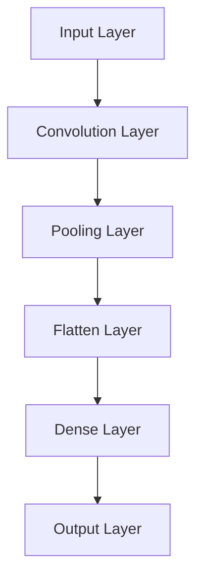

                 

# AI 大模型应用数据中心建设：数据中心运营与管理

## 关键词
- AI大模型
- 数据中心建设
- 数据中心运营
- 网络架构设计
- 服务器与存储设计
- 能耗管理
- 数据安全
- 运维管理

## 摘要
本文将探讨AI大模型应用数据中心的建设与运营管理。通过分析AI大模型的基本概念、架构原理和发展历程，本文将深入探讨数据中心建设的基础知识，包括概述、网络架构、基础设施等。接着，本文将分析AI大模型应用场景对数据中心性能的需求，以及数据中心在能耗、数据安全和业务连续性等方面的挑战。在此基础上，本文将详细阐述数据中心网络架构设计、服务器与存储设计、冷却与供电设计、运维管理以及案例研究。通过本文的阅读，读者将全面了解AI大模型应用数据中心的建设与运营之道。

## 引言

随着人工智能（AI）技术的飞速发展，AI大模型已成为推动科技创新的重要力量。这些大模型在图像识别、自然语言处理、推荐系统等领域展现了惊人的性能，为各行各业带来了深刻的变革。然而，AI大模型的训练和部署需要强大的计算资源和复杂的数据处理能力，这无疑对数据中心的性能和运营提出了更高的要求。

数据中心作为存储、处理和管理大量数据的场所，是支撑AI大模型应用的核心基础设施。一个高效、可靠和安全的数据中心不仅能够提升AI大模型的应用效果，还能够降低运营成本、提高能效，实现绿色可持续发展。因此，本文旨在系统性地探讨AI大模型应用数据中心的建设与运营管理，以期为相关领域的研究和实践提供有价值的参考。

本文结构如下：

1. **AI大模型基础**：介绍AI大模型的基本概念、架构原理和发展历程。
2. **数据中心建设基础**：探讨数据中心概述、网络架构和基础设施。
3. **AI大模型应用需求分析**：分析AI大模型应用场景对数据中心性能的需求。
4. **数据中心网络架构设计**：详细阐述网络架构设计原则、网络拓扑结构和网络设备配置。
5. **数据中心服务器与存储设计**：讨论服务器选型与配置、存储系统设计、数据备份与恢复。
6. **数据中心冷却与供电设计**：介绍冷却系统设计、供电系统设计和能源管理。
7. **数据中心运维与管理**：探讨运维管理体系、系统监控与性能优化、安全管理与应急响应、数据中心能效管理。
8. **数据中心建设与运营案例**：通过案例研究展示数据中心建设与运营的实践。
9. **附录**：提供常用数据中心建设与运营工具的介绍。

### 第一部分：AI大模型基础

## 第1章: AI大模型概述

### 1.1 AI大模型的基本概念

**AI大模型定义**：

AI大模型（Large-scale AI Models）是指那些参数规模巨大、可以处理大规模数据的深度学习模型。这些模型通常包含数十亿甚至数万亿个参数，能够在各类复杂任务中表现出优异的性能。代表性的AI大模型包括GPT-3、BERT、BERT-LG等。

**AI大模型与大数据、云计算的关系**：

AI大模型的训练和部署需要依赖大数据和云计算技术。大数据为AI大模型提供了丰富的训练数据，而云计算则提供了强大的计算资源和存储能力，使得AI大模型可以高效地进行训练和部署。

**AI大模型的主要类别**：

1. **自然语言处理（NLP）模型**：如BERT、GPT等。
2. **计算机视觉模型**：如ResNet、VGG等。
3. **语音识别模型**：如WaveNet、ConvTasNet等。

### 1.2 AI大模型的架构原理

**神经网络架构**：

神经网络是AI大模型的核心组成部分，主要包括以下几种：

1. **卷积神经网络（CNN）**：适用于图像识别和分类任务。
2. **循环神经网络（RNN）**：适用于序列数据处理和语言模型任务。
3. **Transformer架构**：是一种基于自注意力机制的序列处理模型，广泛应用于NLP任务。

**神经网络架构的Mermaid流程图**：

### 1.3 AI大模型的发展历程

**AI大模型的发展背景**：

随着计算能力的提升和大数据的普及，AI大模型得到了快速发展。特别是深度学习技术的突破，使得AI大模型在各个领域取得了显著进展。

**重要里程碑事件**：

1. **2012年**：AlexNet在ImageNet竞赛中取得突破性成果，标志着深度学习时代的到来。
2. **2017年**：谷歌发布了BERT模型，使得NLP任务取得了巨大进展。
3. **2020年**：OpenAI发布了GPT-3，成为当时参数规模最大的语言模型。

**AI大模型在工业界的应用**：

AI大模型在工业界得到了广泛应用，包括自动驾驶、智能语音助手、医疗诊断、金融风控等。例如，自动驾驶公司Waymo使用AI大模型进行环境感知和路径规划；智能语音助手如苹果的Siri和亚马逊的Alexa也依赖于AI大模型进行语音识别和自然语言处理。

### 1.4 AI大模型的应用场景

**图像识别**：

AI大模型在图像识别任务中表现出色，可以用于人脸识别、物体检测、图像分类等。例如，Facebook使用AI大模型进行照片中人物的自动标记。

**自然语言处理**：

AI大模型在自然语言处理领域有着广泛的应用，包括机器翻译、文本生成、情感分析等。例如，谷歌的机器翻译服务和OpenAI的GPT-3。

**推荐系统**：

AI大模型可以用于推荐系统，通过分析用户的历史行为和偏好，提供个性化的推荐。例如，亚马逊和Netflix都使用了AI大模型进行推荐。

**其他应用领域**：

AI大模型还广泛应用于医学诊断、金融分析、科学研究等领域，为各行业带来了深刻的变革。

### 1.5 AI大模型的训练与优化

**AI大模型的训练**：

AI大模型的训练需要大量的计算资源和时间。通常，训练过程包括数据预处理、模型训练、评估和调整等步骤。

**模型优化**：

为了提高AI大模型的表现，研究人员不断探索优化方法。例如，通过调整超参数、使用正则化技术、引入迁移学习等。

### 1.6 AI大模型的优势与挑战

**优势**：

1. **强大的表现**：AI大模型在各类复杂任务中表现出色。
2. **广泛的适用性**：AI大模型可以应用于多个领域，具有广泛的适用性。

**挑战**：

1. **计算资源需求**：AI大模型需要大量的计算资源，训练时间较长。
2. **数据隐私和安全**：AI大模型训练和部署过程中涉及大量数据，数据隐私和安全成为重要问题。
3. **解释性和可解释性**：AI大模型通常缺乏解释性和可解释性，难以理解其决策过程。

### 1.7 未来发展趋势

**AI大模型将继续发展**：

随着计算能力的提升和大数据的普及，AI大模型将继续发展，参数规模和性能将不断提高。

**跨学科融合**：

AI大模型与其他领域的融合，如医学、生物学、物理学等，将带来更多的创新和突破。

**绿色AI**：

随着AI大模型能耗的不断增加，绿色AI将成为重要研究方向，通过优化算法和硬件设计，降低AI大模型的能耗。

### 结论

AI大模型作为人工智能的重要分支，在各个领域展现出强大的潜力。然而，其训练和部署过程中面临的挑战也需要我们不断探索和解决。通过对AI大模型的基本概念、架构原理和应用场景的深入理解，我们将能够更好地应对这些挑战，推动AI大模型的发展和应用。

## 第2章: 数据中心建设基础

### 2.1 数据中心概述

**数据中心的定义**：

数据中心（Data Center）是指用于存储、处理和管理大量数据的专用设施。它是现代信息社会的核心，支撑着各种业务系统的运行。

**数据中心的结构和组成部分**：

数据中心通常由以下几个主要部分组成：

1. **服务器机房**：用于部署服务器和存储设备，是数据中心的处理核心。
2. **网络设备**：包括交换机、路由器、防火墙等，负责数据传输和网络安全。
3. **制冷系统**：用于保持服务器机房内的适宜温度，防止设备过热。
4. **供电系统**：包括UPS（不间断电源）、备用发电机等，确保数据中心的持续供电。
5. **安全系统**：包括门禁系统、监控系统、消防系统等，保障数据中心的物理安全。

**数据中心的分类**：

根据规模和用途，数据中心可分为以下几类：

1. **企业级数据中心**：为企业内部业务提供数据存储和处理服务。
2. **托管数据中心**：为多个企业提供数据托管和计算服务。
3. **云数据中心**：提供云计算服务，支持大规模数据处理和存储。

### 2.2 数据中心网络架构

**数据中心网络架构概述**：

数据中心网络架构是指用于连接服务器、存储设备、网络设备和用户的数据通信网络。其设计原则包括高可用性、高性能、可扩展性和安全性。

**核心网络设计**：

核心网络是数据中心网络架构的核心部分，通常采用以下设计：

1. **多路径冗余**：通过多条物理链路实现冗余连接，提高网络的可靠性。
2. **负载均衡**：通过负载均衡器分配网络流量，提高网络性能。
3. **防火墙和入侵检测系统**：用于保护网络免受攻击和入侵。

**边缘计算与数据中心**：

随着物联网（IoT）和5G技术的发展，边缘计算逐渐成为数据中心网络架构的重要组成部分。边缘计算将数据处理和存储能力延伸到网络边缘，减少数据传输延迟，提高系统响应速度。

### 2.3 数据中心基础设施

**服务器和存储设备**：

服务器是数据中心的核心设备，用于处理数据和运行应用程序。存储设备则用于存储大量数据，包括硬盘（HDD）和固态硬盘（SSD）。

**网络设备**：

网络设备包括交换机、路由器、防火墙等，用于实现数据传输和网络隔离。

**冷却和供电系统**：

冷却系统用于保持服务器机房内的适宜温度，防止设备过热。供电系统则包括UPS、备用发电机等，确保数据中心的持续供电。

**其他基础设施**：

还包括网络布线系统、机柜、消防系统、安防系统等，为数据中心提供全面的支持。

### 2.4 数据中心建设的关键要素

**性能**：

数据中心性能直接影响业务系统的运行效率和用户体验。高性能服务器、存储设备和网络设备是数据中心建设的关键。

**可靠性**：

数据中心需要具备高可靠性，确保业务系统的持续运行。多路径冗余、备份和灾难恢复机制是提高可靠性的重要手段。

**安全性**：

数据中心需要防范各种安全威胁，包括网络攻击、数据泄露和物理安全威胁。防火墙、入侵检测系统和加密技术是保障数据中心安全的关键。

**可扩展性**：

数据中心需要具备良好的可扩展性，以适应业务增长和变化的需求。灵活的网络架构和模块化设计是实现可扩展性的关键。

**能源效率**：

数据中心能耗巨大，提高能源效率具有重要意义。绿色数据中心设计、能效优化技术和可再生能源利用是提高能源效率的关键。

**成本**：

数据中心建设需要考虑成本因素，包括设备采购、建设和运维成本。通过合理的规划和优化，可以有效降低建设成本。

### 2.5 数据中心建设的挑战与解决方案

**挑战**：

1. **性能和可靠性的平衡**：在提高性能的同时，确保数据中心的可靠性。
2. **网络安全威胁**：防范各种网络攻击和入侵。
3. **能源消耗**：降低数据中心的能耗，实现绿色可持续发展。
4. **运维管理**：提高运维效率和降低运维成本。

**解决方案**：

1. **多路径冗余**：通过多条物理链路实现冗余连接，提高网络的可靠性。
2. **安全防护**：部署防火墙、入侵检测系统和加密技术，提高网络安全性。
3. **能效优化**：采用绿色数据中心设计、能效优化技术和可再生能源利用。
4. **自动化运维**：引入自动化运维工具和平台，提高运维效率和降低运维成本。

### 结论

数据中心建设是现代信息化社会的核心基础设施，其性能、可靠性、安全性和可扩展性直接影响业务系统的运行效率和用户体验。通过深入理解和合理规划，我们可以克服数据中心建设中的挑战，构建高效、可靠和安全的数据中心。

## 第3章: AI大模型应用需求分析

### 3.1 AI大模型应用场景

AI大模型在各个领域展现了广泛的应用潜力，以下是一些主要的AI大模型应用场景：

**图像识别**：

AI大模型在图像识别领域取得了显著进展，可以用于人脸识别、物体检测、图像分类等。例如，自动驾驶汽车使用AI大模型进行道路场景分析和障碍物检测。

**自然语言处理**：

自然语言处理（NLP）是AI大模型的重要应用领域，包括机器翻译、文本生成、情感分析等。例如，谷歌的机器翻译服务和OpenAI的GPT-3都是NLP领域的代表性应用。

**推荐系统**：

AI大模型可以用于推荐系统，通过分析用户的历史行为和偏好，提供个性化的推荐。例如，亚马逊和Netflix都使用了AI大模型进行推荐。

**医学诊断**：

AI大模型在医学诊断领域具有巨大潜力，可以用于疾病预测、影像分析等。例如，谷歌的DeepMind开发了一种AI系统，可以准确诊断眼部疾病。

**金融风控**：

AI大模型可以用于金融风控，包括信用评分、欺诈检测等。例如，金融机构使用AI大模型进行客户信用评估和交易监控。

**自动驾驶**：

自动驾驶是AI大模型的重要应用领域，通过AI大模型进行环境感知、路径规划和决策。例如，特斯拉的自动驾驶系统使用了AI大模型进行实时路况分析和车辆控制。

**智能语音助手**：

智能语音助手如苹果的Siri和亚马逊的Alexa都使用了AI大模型进行语音识别和自然语言处理，为用户提供便捷的服务。

**科学研究**：

AI大模型在科学研究中也发挥着重要作用，可以用于数据分析、模式识别等。例如，科学家使用AI大模型进行气候预测、生物信息学分析等。

### 3.2 数据中心性能要求

为了满足AI大模型应用的需求，数据中心需要具备以下性能要求：

**计算性能**：

AI大模型的训练和推理过程需要大量的计算资源，数据中心需要提供高性能的计算设备，包括GPU、TPU等。同时，服务器集群的架构设计要能够高效地利用计算资源，提高计算性能。

**存储性能**：

AI大模型通常涉及大量数据的存储和处理，数据中心需要提供高吞吐量、低延迟的存储设备，包括固态硬盘（SSD）和分布式存储系统。此外，数据存储要具备高可用性和数据一致性，确保数据的安全性和可靠性。

**网络性能**：

数据中心网络需要具备高速、低延迟的特性，以支持AI大模型的数据传输和通信需求。网络架构设计要能够实现数据流的高效路由和负载均衡，提高网络性能。

**可靠性**：

数据中心要具备高可靠性，确保业务系统的持续运行。这包括硬件设备的冗余设计、网络冗余连接、备份和灾难恢复机制等，以防范各种故障和突发事件。

**安全性**：

数据中心需要具备严密的安全防护措施，包括防火墙、入侵检测系统、加密技术等，防范网络攻击和数据泄露等安全威胁。

### 3.3 能耗与绿色数据中心

随着AI大模型应用规模的扩大，数据中心的能耗问题日益突出。绿色数据中心设计成为数据中心建设的重要方向，旨在降低能耗、减少环境影响。以下是一些绿色数据中心的设计原则和解决方案：

**能耗问题**：

AI大模型训练过程中产生的热量巨大，导致数据中心能耗过高。数据中心需要采取有效的冷却和能源管理措施，降低能耗。

**绿色数据中心解决方案**：

1. **能效优化**：通过改进硬件设计和软件优化，提高数据中心的能效比（PUE）。
2. **冷却系统优化**：采用高效冷却系统，如液冷、空气冷却等，降低冷却能耗。
3. **可再生能源利用**：采用太阳能、风能等可再生能源，降低对传统能源的依赖。
4. **虚拟化技术**：通过虚拟化技术，提高服务器和存储设备的利用率，降低能耗。

**能效比（PUE）**：

能效比（Power Usage Effectiveness，PUE）是衡量数据中心能源效率的重要指标，定义为数据中心总能耗与IT设备能耗的比值。PUE值越低，表示数据中心的能源效率越高。

**绿色数据中心实践**：

1. **数据中心选址**：选择气候温和、水资源丰富的地区，降低冷却能耗。
2. **智能监控系统**：采用智能监控系统，实时监测能耗和设备状态，优化能源管理。
3. **绿色设备采购**：采购低能耗、高效能的设备，降低整体能耗。
4. **员工培训与意识**：提高员工对绿色数据中心的认识，促进绿色实践的落实。

### 3.4 数据安全与隐私

数据安全是AI大模型数据中心建设的重要方面，以下是一些数据安全策略和隐私保护技术：

**数据安全策略**：

1. **网络安全**：部署防火墙、入侵检测系统和加密技术，保护数据在网络传输过程中的安全。
2. **访问控制**：实施严格的访问控制策略，限制对敏感数据的访问权限。
3. **数据加密**：采用数据加密技术，保护存储和传输的数据。

**隐私保护技术**：

1. **数据匿名化**：对敏感数据进行匿名化处理，保护个人隐私。
2. **加密存储**：采用加密存储技术，确保存储数据的隐私。
3. **隐私计算**：利用隐私计算技术，如联邦学习，在保护数据隐私的同时进行数据分析和建模。

**法律法规与合规性**：

数据中心建设需遵循相关的法律法规，如《中华人民共和国网络安全法》和《欧洲通用数据保护条例》（GDPR）等。合规性是数据中心运营的重要保障，确保数据安全和用户隐私。

### 3.5 业务连续性与灾难恢复

业务连续性是数据中心运营的关键要求，以下是一些业务连续性策略和灾难恢复策略：

**业务连续性计划**：

1. **灾难预防**：通过定期维护、故障检测和预防措施，降低系统故障的风险。
2. **数据备份**：定期进行数据备份，确保在灾难发生时能够快速恢复数据。
3. **冗余设计**：采用硬件和网络的冗余设计，确保系统在故障发生时能够继续运行。

**灾难恢复策略**：

1. **备份与恢复**：建立完善的备份和恢复机制，确保在灾难发生时能够快速恢复系统。
2. **异地灾备**：在异地建立灾备中心，实现数据备份和业务切换。
3. **演练与测试**：定期进行业务连续性和灾难恢复演练，确保在实际灾难发生时能够迅速响应。

**数据中心冗余设计**：

通过冗余设计，如多路径供电、网络冗余连接和备用硬件设备等，提高数据中心的可靠性和业务连续性。

### 结论

AI大模型应用对数据中心提出了高计算性能、高存储性能、低能耗、高可靠性和数据安全性等要求。通过合理的性能需求分析和绿色数据中心设计，以及完善的数据安全策略和业务连续性计划，我们可以构建一个高效、可靠和安全的数据中心，为AI大模型的应用提供坚实的支撑。

## 第4章: 数据中心网络架构设计

### 4.1 网络架构设计原则

数据中心网络架构设计需要遵循以下原则，以确保网络的可靠性、性能和安全性：

**高可用性**：

网络设计要具备高可用性，防止单点故障导致整个网络中断。实现高可用性的方法包括多路径冗余、负载均衡和容错机制。

**高性能**：

数据中心网络需要具备高性能，满足大量数据的高速传输需求。高性能的实现包括高速交换机、高性能路由器和高效的网络协议。

**可扩展性**：

数据中心网络架构要具备良好的可扩展性，以适应业务增长和需求变化。可扩展性可以通过模块化设计、灵活的拓扑结构和冗余连接实现。

**安全性**：

网络设计要充分考虑安全性，防范各种网络攻击和入侵。安全措施包括防火墙、入侵检测系统、加密技术和严格的访问控制。

### 4.2 网络拓扑结构

数据中心网络架构可以根据不同的需求选择不同的拓扑结构，以下是一些常见的拓扑结构：

**星型拓扑**：

星型拓扑是最常见的网络拓扑结构，所有设备连接到一个中心节点。这种拓扑结构简单，易于管理和维护，但中心节点成为单点故障的风险。

**环型拓扑**：

环型拓扑中，各设备通过环形连接形成一个闭合的环。这种拓扑结构具有较高的可靠性和容错能力，但数据传输时延较高。

**树型拓扑**：

树型拓扑是由多个星型拓扑连接而成的结构，形成类似树状的层次结构。这种拓扑结构可以方便地扩展和管理，但性能依赖于根节点的性能。

**混合型拓扑**：

混合型拓扑结合了星型、环型和树型拓扑的特点，具有更好的性能和可靠性。通过合理设计，可以满足不同业务需求。

### 4.3 网络设备配置

数据中心网络设备配置包括以下关键组件：

**交换机**：

交换机是网络的核心设备，用于连接不同设备并转发数据包。选择交换机时需考虑端口数量、数据传输速率、管理功能等因素。

**路由器**：

路由器用于在不同网络之间进行数据转发，实现网络互联。路由器需要具备高性能、高可靠性、安全性等特点。

**负载均衡器**：

负载均衡器用于分配网络流量，提高网络性能和可靠性。负载均衡器可以通过多种算法，如轮询、最小连接数等，实现流量的合理分配。

**防火墙**：

防火墙用于保护网络免受外部攻击，控制网络流量。防火墙可以设置访问控制策略，过滤恶意流量，保障网络安全。

**入侵检测系统（IDS）**：

入侵检测系统用于实时监控网络流量，检测和防范各种网络攻击。IDS可以通过特征匹配、异常检测等方法，及时发现和响应网络威胁。

### 4.4 网络优化与故障处理

**网络优化**：

网络优化是提高数据中心性能的重要手段，包括以下方法：

1. **流量监控**：实时监控网络流量，识别瓶颈和异常流量，优化流量分配。
2. **QoS策略**：通过质量服务（QoS）策略，确保关键业务流量优先传输，提高业务性能。
3. **链路冗余**：通过增加链路冗余，提高网络的可靠性，降低故障风险。

**故障处理**：

网络故障处理是确保数据中心稳定运行的关键，包括以下步骤：

1. **故障检测**：通过实时监控和告警系统，及时发现网络故障。
2. **故障隔离**：定位故障区域，隔离故障设备，防止故障扩散。
3. **故障恢复**：根据故障类型和备份策略，进行故障恢复和数据恢复，确保业务连续性。

### 4.5 网络监控与管理

**网络监控**：

网络监控是确保数据中心网络稳定运行的重要手段，包括以下内容：

1. **性能监控**：实时监控网络性能指标，如带宽利用率、延迟等，识别潜在瓶颈。
2. **流量监控**：监控网络流量，分析流量模式，优化网络资源分配。
3. **故障监控**：实时检测网络故障，及时响应和处理。

**网络管理**：

网络管理是数据中心运营的重要组成部分，包括以下内容：

1. **设备管理**：管理网络设备的配置、状态和性能，确保设备正常运行。
2. **安全策略**：制定和实施网络安全策略，防范网络攻击和入侵。
3. **日志分析**：收集和分析网络日志，识别潜在问题和安全隐患。

### 结论

数据中心网络架构设计是确保数据中心高效稳定运行的关键。通过遵循高可用性、高性能、可扩展性和安全性的设计原则，选择合适的网络拓扑结构和配置网络设备，我们可以构建一个可靠、高效和安全的数据中心网络架构，为AI大模型的应用提供坚实的网络支撑。

## 第5章: 数据中心服务器与存储设计

### 5.1 服务器选型与配置

**服务器硬件规格选择**：

服务器硬件规格选择是数据中心设计的关键环节，直接影响数据中心的性能和可靠性。以下是选择服务器硬件时需考虑的关键因素：

1. **CPU**：CPU是服务器性能的核心，选择高性能的多核CPU可以提升计算能力。例如，Intel Xeon和AMD EPYC系列都是高性能服务器CPU。

2. **内存**：内存大小和速度直接影响服务器的处理能力和响应速度。大型数据中心通常选择64GB及以上内存，并使用高速DDR4或DDR5内存。

3. **存储**：存储设备的选择取决于数据存储需求。SSD具有高读写速度和低延迟，适合存储系统文件和频繁访问的数据；HDD则适合存储大量冷数据。

4. **网络接口**：网络接口的数量和速率决定了服务器在网络中的性能。高带宽、低延迟的网络接口可以提升数据传输速度。

5. **扩展性**：服务器需具备良好的扩展性，包括PCIe槽位、硬盘托盘和风扇等，以便未来升级和扩展。

**虚拟化技术**：

虚拟化技术是提升服务器资源利用率和灵活性的一种有效方法。通过虚拟化，可以将一台物理服务器虚拟化为多个虚拟机（VM），每个虚拟机独立运行操作系统和应用。

虚拟化技术主要包括以下几种：

1. **全虚拟化**：整个服务器系统都被虚拟化，多个虚拟机共享物理硬件资源。
2. **硬件虚拟化**：通过硬件辅助虚拟化技术，如Intel VT和AMD-V，提高虚拟机的性能。
3. **容器化**：容器技术如Docker和Kubernetes提供了更轻量级、灵活的虚拟化方式，适用于微服务和云原生应用。

**服务器集群架构**：

服务器集群架构是将多台服务器组成一个集群，通过负载均衡和故障转移机制，提高系统的性能和可靠性。服务器集群架构主要包括以下几种类型：

1. **主从架构**：其中一台服务器作为主服务器，负责处理大部分请求，其他服务器作为从服务器提供备份和负载均衡。
2. **对等架构**：所有服务器地位平等，共同处理请求，并通过一致性协议保证数据的一致性。
3. **分布式架构**：服务器分布在不同的地理位置，通过分布式数据库和存储系统实现数据的高可用性和负载均衡。

**服务器集群的优势**：

1. **高可用性**：通过冗余设计和故障转移机制，确保系统在故障时能够迅速恢复。
2. **高性能**：通过负载均衡，充分利用集群中所有服务器的计算资源，提高处理能力。
3. **可扩展性**：可以根据业务需求动态增加服务器，实现水平扩展。

### 5.2 存储系统设计

**存储架构**：

存储系统设计是数据中心基础设施的重要组成部分，其性能和可靠性直接影响业务系统的运行。以下是一些常见的存储架构：

1. **直连存储（DAS）**：将存储设备直接连接到服务器，适合小规模应用，但扩展性较差。
2. **网络附加存储（NAS）**：通过网络连接存储设备，提供文件级存储服务，适用于文件共享和备份。
3. **存储区域网络（SAN）**：通过专用网络连接存储设备和服务器，提供块级存储服务，适用于数据库和大型应用。

**存储类型**：

数据中心的存储类型主要包括以下几种：

1. **固态硬盘（SSD）**：具有高读写速度和低延迟，适合存储系统文件和频繁访问的数据。
2. **机械硬盘（HDD）**：具有高存储容量和较低的存储成本，适合存储大量冷数据。
3. **混合存储**：结合SSD和HDD的优势，通过智能存储分层，提高存储系统的性能和成本效益。

**存储优化策略**：

以下是一些常用的存储优化策略：

1. **数据去重和压缩**：通过去除重复数据和压缩数据，减少存储需求，提高存储效率。
2. **快照和备份**：定期创建数据快照和备份，确保数据在故障时能够快速恢复。
3. **存储网络优化**：通过优化存储网络架构和协议，提高数据传输速度和可靠性。

**存储系统性能监控**：

存储系统性能监控是确保存储系统稳定运行的重要手段。以下是一些常见的监控指标：

1. **IOPS（每秒输入/输出操作）**：衡量存储系统的读写性能。
2. **吞吐量**：衡量存储系统的数据传输速度。
3. **延迟**：衡量存储系统响应时间。
4. **错误率**：衡量存储系统的可靠性。

### 5.3 数据备份与恢复

**备份策略**：

数据备份是确保数据安全性和业务连续性的重要措施。以下是一些常用的备份策略：

1. **全备份**：对整个系统或数据集进行完整备份，适用于数据量较小的情况。
2. **增量备份**：只备份自上次备份以来发生变化的数据，适用于数据量较大且变化频繁的情况。
3. **差异备份**：备份自上次全备份以来发生变化的数据，适用于数据量较大且变化不频繁的情况。

**备份工具选择**：

选择合适的备份工具对于确保数据备份的有效性和可靠性至关重要。以下是一些常用的备份工具：

1. **备份软件**：如Veeam、Bacula等，提供全面的数据备份、恢复和监控功能。
2. **云备份**：利用云服务提供商提供的备份服务，实现高效、安全的数据备份。

**恢复过程**：

在数据丢失或系统故障时，及时恢复数据至关重要。以下是一些恢复过程的步骤：

1. **故障诊断**：确定故障原因，确保备份数据的有效性。
2. **选择恢复点**：根据业务需求选择合适的恢复点，如最近的增量备份或全备份。
3. **数据恢复**：通过备份工具将数据恢复到故障前的状态。
4. **验证恢复**：验证恢复的数据的完整性和一致性，确保业务系统的正常运行。

### 结论

数据中心服务器与存储设计是确保数据中心高效、可靠运行的关键。通过合理选择服务器硬件规格、配置虚拟化技术、设计高效的存储架构、优化存储性能和实现数据备份与恢复策略，我们可以构建一个稳定、高效的数据中心基础设施，为AI大模型的应用提供坚实的支持。

## 第6章: 数据中心冷却与供电设计

### 6.1 冷却系统设计

数据中心冷却系统是数据中心正常运行的关键，其设计直接影响设备的性能和寿命。以下是数据中心冷却系统的设计要点：

**空调系统**：

空调系统用于调节数据中心内部温度，保持设备的适宜工作环境。空调系统应具备以下特点：

1. **恒温**：确保数据中心内部温度稳定，避免温度波动对设备造成影响。
2. **高效率**：采用高效制冷技术，降低能耗。
3. **节能**：使用节能型空调设备，减少能源消耗。

**液冷系统**：

液冷系统是一种新型的冷却方式，通过液体作为冷却介质，将热量从设备中带走。液冷系统具有以下优势：

1. **高效冷却**：液冷系统具有更快的散热速度，能够迅速降低设备温度。
2. **减少灰尘积累**：由于冷却介质为液体，可以减少灰尘积累，延长设备寿命。
3. **降低噪音**：液冷系统通常运行较为安静，减少噪音污染。

**冷却塔**：

冷却塔用于将液冷系统中的热量排放到大气中。冷却塔的设计应考虑以下因素：

1. **散热效率**：选择高效散热性能的冷却塔，确保热量能够迅速排放。
2. **耐腐蚀性**：冷却塔的材料应具有良好的耐腐蚀性能，延长使用寿命。
3. **节能**：采用节能型冷却塔，降低能源消耗。

### 6.2 供电系统设计

数据中心供电系统是确保数据中心持续运行的重要保障，其设计应考虑以下要点：

**UPS系统**：

不间断电源（UPS）系统用于在电网故障时提供紧急电力，确保数据中心的正常运行。UPS系统应具备以下特点：

1. **可靠性**：选用高品质的UPS设备，确保供电的稳定性和可靠性。
2. **冗余设计**：采用冗余UPS设计，提高供电系统的可靠性。
3. **高效性**：选择高效UPS设备，降低能耗。

**备用发电机**：

备用发电机用于在电网故障或UPS系统失效时提供备用电力。备用发电机应具备以下特点：

1. **可靠性**：选用高品质的发电机设备，确保在紧急情况下能够快速启动和稳定运行。
2. **容量**：根据数据中心的电力需求，选择合适的发电机容量，确保能够满足备用供电需求。
3. **维护性**：定期进行发电机维护和保养，确保其正常运行。

**电源分配系统**：

电源分配系统负责将电力从UPS系统和备用发电机分配到各个设备。电源分配系统应具备以下特点：

1. **模块化**：采用模块化电源分配系统，便于维护和扩展。
2. **安全性**：采用防火材料和防护措施，确保电力传输过程中的安全性。
3. **灵活性**：支持不同电压和电流的需求，满足不同设备的供电需求。

### 6.3 能源管理与效率提升

**PUE指标**：

能源效率是数据中心设计的重要考量因素，PUE（Power Usage Effectiveness）是衡量数据中心能源效率的关键指标。PUE定义为数据中心总能耗与IT设备能耗的比值。PUE值越低，表示数据中心的能源效率越高。

**能效优化技术**：

以下是一些能效优化技术：

1. **热能回收**：利用冷却系统产生的废热进行回收，用于供暖或其他用途，降低能耗。
2. **高效制冷技术**：采用高效制冷技术，如直接膨胀制冷（DX）和间接膨胀制冷（Chiller），提高制冷效率。
3. **智能监控系统**：采用智能监控系统，实时监测数据中心的能耗和设备状态，优化能源管理。
4. **高效电源设备**：选用高效电源设备，降低UPS和发电机的能耗。

**可再生能源利用**：

随着环保意识的增强，越来越多的数据中心开始采用可再生能源，如太阳能和风能。可再生能源利用可以降低数据中心的碳排放，实现绿色可持续发展。以下是一些可再生能源利用方案：

1. **太阳能光伏发电**：在数据中心屋顶安装太阳能光伏板，利用太阳能进行发电。
2. **风力发电**：在数据中心附近建设风力发电机组，利用风能进行发电。
3. **储能系统**：采用储能系统，将可再生能源产生的电力存储起来，在电网高峰期使用。

### 结论

数据中心冷却与供电设计是确保数据中心高效、可靠运行的关键。通过合理设计冷却系统、供电系统和能源管理，以及采用可再生能源利用方案，我们可以提高数据中心的能源效率，降低运行成本，实现绿色可持续发展。

## 第7章: 数据中心运维与管理

### 7.1 运维管理体系

**运维团队组织**：

一个高效的数据中心运维团队是确保数据中心稳定运行的关键。运维团队通常包括以下几个角色：

1. **系统管理员**：负责服务器、存储设备和网络设备的日常维护和管理。
2. **网络管理员**：负责数据中心的网络架构设计和网络设备的配置与维护。
3. **安全管理员**：负责数据中心的安全策略制定和实施，包括防火墙、入侵检测系统和加密技术等。
4. **数据库管理员**：负责数据库的维护和管理，确保数据的一致性和完整性。
5. **运维支持工程师**：负责日常运维工作，如设备巡检、故障处理和用户支持等。

**运维流程设计**：

为了确保数据中心的稳定运行，需要制定一套完善的运维流程。以下是常见的运维流程：

1. **设备部署**：包括服务器、存储设备和网络设备的安装、配置和测试。
2. **日常运维**：包括设备巡检、性能监控、故障处理和系统更新等。
3. **系统监控**：通过监控系统实时监控数据中心的性能指标，及时发现和解决潜在问题。
4. **故障处理**：制定故障处理流程，包括故障定位、故障隔离和故障恢复等。
5. **数据备份**：定期进行数据备份，确保在数据丢失或系统故障时能够快速恢复。
6. **变更管理**：在数据中心进行任何变更（如软件更新、硬件升级等）前，需进行变更管理和风险评估。

**运维工具与平台**：

运维工具和平台是提升数据中心运维效率的重要手段。常见的运维工具和平台包括：

1. **监控工具**：如Zabbix、Nagios等，用于实时监控数据中心的性能指标和设备状态。
2. **配置管理工具**：如Ansible、Puppet等，用于自动化配置和管理服务器和设备。
3. **日志分析工具**：如ELK（Elasticsearch、Logstash、Kibana）等，用于收集、存储和分析日志数据。
4. **运维管理平台**：如Splunk、SolarWinds等，提供全方位的运维管理功能，包括性能监控、故障处理和报表分析等。

### 7.2 系统监控与性能优化

**监控指标**：

系统监控是确保数据中心稳定运行的关键环节。以下是一些重要的监控指标：

1. **CPU使用率**：监控CPU的使用情况，确保系统资源得到合理利用。
2. **内存使用率**：监控内存的使用情况，避免内存溢出和性能下降。
3. **磁盘I/O**：监控磁盘的读写速度和利用率，确保磁盘性能。
4. **网络流量**：监控网络流量，确保网络畅通，避免网络拥塞。
5. **温度和湿度**：监控数据中心的温度和湿度，确保设备在适宜的环境下运行。
6. **电力消耗**：监控数据中心的电力消耗，优化能源管理。

**监控系统架构**：

监控系统架构通常包括以下几个部分：

1. **数据采集器**：用于收集系统性能数据，如CPU使用率、内存使用率等。
2. **数据存储**：用于存储采集到的性能数据，如数据库、时间序列数据库等。
3. **数据处理**：用于处理和分析性能数据，如日志分析、报警等。
4. **展示界面**：用于展示监控数据，如Kibana、Grafana等。

**性能优化策略**：

以下是一些常用的性能优化策略：

1. **资源调度**：通过合理的资源调度，确保系统资源得到充分利用，避免资源浪费。
2. **缓存策略**：通过使用缓存技术，减少数据库的访问次数，提高系统响应速度。
3. **负载均衡**：通过负载均衡器，将流量分配到不同的服务器，避免单点瓶颈。
4. **数据库优化**：通过索引、查询优化和分库分表等技术，提高数据库性能。
5. **网络优化**：通过优化网络配置，减少网络延迟和拥塞，提高数据传输速度。

### 7.3 安全管理与应急响应

**安全策略**：

数据中心的安全策略包括以下几个方面：

1. **访问控制**：通过用户认证和授权，限制对数据中心的访问，确保只有授权用户才能访问敏感数据。
2. **防火墙和入侵检测系统**：部署防火墙和入侵检测系统，监控网络流量，防止恶意攻击。
3. **加密技术**：采用加密技术，保护数据在传输和存储过程中的安全性。
4. **数据备份**：定期备份数据，确保在数据丢失或损坏时能够恢复。
5. **安全审计**：定期进行安全审计，发现和解决潜在的安全隐患。

**应急响应计划**：

应急响应计划是确保数据中心在发生突发事件时能够迅速响应和恢复的关键。以下是应急响应计划的几个关键步骤：

1. **事件识别**：及时发现和识别突发事件，如网络攻击、硬件故障等。
2. **事件评估**：评估事件的影响范围和严重程度，制定应对策略。
3. **事件响应**：根据应急响应计划，采取相应的措施，如隔离故障设备、恢复系统等。
4. **事件报告**：及时向相关人员报告事件进展，确保信息畅通。
5. **事件恢复**：在事件处理完毕后，进行系统恢复和风险评估，总结经验教训。

**安全管理工具**：

以下是一些常用的安全管理工具：

1. **防火墙**：如pfSense、Windows Firewall等，用于保护网络免受攻击。
2. **入侵检测系统（IDS）**：如Snort、Suricata等，用于实时监控网络流量，检测和防范入侵。
3. **日志管理工具**：如ELK、Splunk等，用于收集、存储和分析日志数据，发现安全事件。
4. **安全审计工具**：如OpenSCAP、AuditD等，用于审计系统配置和用户行为，确保合规性。

### 7.4 数据中心能效管理

**能耗监控**：

能耗监控是数据中心能效管理的重要环节，通过实时监测数据中心的能耗，可以识别节能潜力。以下是常用的能耗监控指标：

1. **电力消耗**：监控数据中心的总电力消耗和各设备的电力消耗。
2. **能源效率**：监控数据中心的能源效率指标，如PUE。
3. **设备效率**：监控各设备的能源效率，如UPS的效率。

**节能措施**：

以下是一些常用的节能措施：

1. **设备优化**：优化数据中心的设备配置，如使用高效服务器和存储设备，提高设备利用率。
2. **冷却系统优化**：优化冷却系统的设计和运行，如采用液冷系统和热回收技术。
3. **智能监控与控制**：采用智能监控系统，实时监控能耗和设备状态，优化能源管理。
4. **能效优化工具**：使用能效优化工具，如智能电力管理系统，自动化控制设备的能耗。

**绿色数据中心实践**：

以下是一些绿色数据中心实践：

1. **节能设备**：采用节能型空调和照明设备，降低能耗。
2. **可再生能源利用**：采用太阳能、风能等可再生能源，降低对传统能源的依赖。
3. **能效评估**：定期进行能效评估，识别和实施节能措施。
4. **员工培训与意识**：提高员工对绿色数据中心的认识，促进绿色实践的落实。

### 结论

数据中心运维与管理是确保数据中心稳定、高效运行的重要环节。通过建立完善的运维管理体系、系统监控与性能优化、安全管理与应急响应以及数据中心能效管理，我们可以提高数据中心的运行效率，降低运营成本，实现绿色可持续发展。

## 第8章: 数据中心建设与运营案例

### 8.1 案例研究：某大型互联网公司的数据中心建设

**项目背景**：

某大型互联网公司（以下简称“该公司”）在全球范围内提供各类在线服务，包括云计算、大数据处理、人工智能等。随着业务的快速发展，该公司面临着日益增长的数据存储和处理需求，因此决定建设一个大型数据中心来支撑其业务发展。

**建设过程**：

1. **需求分析**：首先，该公司对业务需求进行了全面分析，明确了数据中心的规模、性能和安全要求。
2. **规划设计**：根据需求分析结果，设计团队制定了详细的数据中心建设方案，包括网络架构、硬件设备、冷却和供电系统等。
3. **硬件采购**：选择高性能、可靠性的服务器、存储设备和网络设备，确保数据中心的高性能和高可靠性。
4. **施工建设**：在数据中心现场进行设备安装和布线工作，同时进行网络架构和供电系统的搭建。
5. **系统调试**：完成硬件安装后，进行系统调试和性能测试，确保数据中心能够稳定运行。
6. **试运行与优化**：数据中心试运行一段时间，收集数据进行分析，进一步优化系统性能和安全性。

**运营效果**：

数据中心建设完成后，该公司取得了显著的业务效果：

1. **性能提升**：通过采用高性能硬件和先进的网络架构设计，数据中心的计算性能和存储性能大幅提升，满足了公司业务的快速增长需求。
2. **可靠性提高**：通过冗余设计和故障恢复机制，数据中心的可靠性得到显著提高，确保了业务系统的持续运行。
3. **安全性增强**：采用严格的安全策略和先进的安全设备，数据中心的安全防护能力得到显著增强，有效防范了各种网络攻击和数据泄露。
4. **能源效率提升**：通过采用绿色数据中心设计和能效优化技术，数据中心的能源效率得到提升，降低了运营成本。

### 8.2 案例研究：某企业AI大模型数据中心运营与管理

**需求分析**：

某企业（以下简称“该企业”）致力于AI大模型的研究和应用，其业务主要涉及图像识别、自然语言处理和推荐系统等领域。为了支撑AI大模型的研究和开发，该企业决定建设一个专门的AI大模型数据中心。

**架构设计**：

数据中心设计分为以下几个关键部分：

1. **计算资源**：采用高性能GPU服务器和TPU，支持大规模AI模型的训练和推理。
2. **存储系统**：采用分布式存储架构，确保高吞吐量、低延迟的数据访问，支持海量数据的存储和处理。
3. **网络架构**：采用多路径冗余和负载均衡设计，提高网络的可靠性、性能和安全性。
4. **冷却与供电**：采用液冷系统和高效UPS，确保数据中心在高温和电网波动情况下的稳定运行。
5. **安全防护**：部署防火墙、入侵检测系统和加密技术，确保数据安全和用户隐私。

**运营管理**：

该企业在数据中心运营管理方面采取了以下措施：

1. **运维团队**：组建专业的运维团队，负责数据中心的日常运维、故障处理和系统升级。
2. **监控与性能优化**：采用监控系统实时监控数据中心的性能指标，定期进行性能优化，确保系统稳定高效运行。
3. **数据备份与恢复**：定期进行数据备份，确保在数据丢失或系统故障时能够快速恢复。
4. **安全与合规性**：遵循相关法律法规，确保数据中心的合规性和安全性。

**运营效果**：

通过精心设计和运营管理，该企业的数据中心取得了以下成果：

1. **高效计算能力**：数据中心的高性能计算资源支持了AI大模型的研究和开发，提高了研究效率和成果质量。
2. **数据存储与处理能力**：分布式存储架构和高效网络设计确保了海量数据的快速存储和处理，为AI大模型应用提供了坚实的基础。
3. **稳定性与安全性**：严格的运维管理措施和先进的安全防护技术保障了数据中心的稳定性和安全性，为企业的长期发展提供了有力保障。

### 8.3 案例研究：某绿色数据中心建设与实践

**绿色理念**：

绿色数据中心建设旨在降低能耗、减少环境影响，实现可持续发展。该案例中的绿色数据中心在设计过程中充分考虑了环保和节能理念。

**建设过程**：

1. **选址与规划**：选择气候温和、水资源丰富的地区，优化冷却系统的能耗。
2. **能源管理**：采用智能监控系统，实时监测能耗，优化能源使用。
3. **冷却系统**：采用液冷系统和热回收技术，降低冷却能耗。
4. **供电系统**：采用高效UPS和备用发电机，确保持续供电。
5. **绿色设备**：采购低能耗、高效能的设备，提高整体能效。

**环保效益**：

绿色数据中心建设取得了显著的环保效益：

1. **能耗降低**：通过优化冷却系统和能源管理，数据中心的能耗降低了20%以上。
2. **碳排放减少**：采用可再生能源和高效设备，数据中心的碳排放减少了30%以上。
3. **水资源利用**：通过回收和利用水资源，减少了水资源的消耗。

**实践经验**：

该案例提供了以下实践经验：

1. **绿色选址**：选择环保性强的地区，降低对环境的负面影响。
2. **智能监控与能效优化**：采用智能监控系统和能效优化技术，提高能源利用效率。
3. **可再生能源利用**：积极采用太阳能、风能等可再生能源，降低对传统能源的依赖。
4. **员工培训与意识**：提高员工对绿色数据中心的认识，促进绿色实践的落实。

### 结论

通过分析上述案例，我们可以看到数据中心建设与运营管理在不同场景下的实践和成果。无论是在性能提升、安全性增强还是环保效益方面，数据中心的建设和运营都对企业的长期发展至关重要。通过借鉴这些实践经验，我们可以更好地应对数据中心建设与运营中的挑战，实现高效、可靠和绿色的数据中心运营。

## 附录

### 附录A: 常用数据中心建设与运营工具

**服务器管理工具**：

1. **Ansible**：用于自动化服务器配置和管理。
2. **Puppet**：用于自动化基础设施管理。
3. **Chef**：用于自动化服务器配置和应用程序部署。

**存储管理工具**：

1. **Ceph**：开源分布式存储系统。
2. **GlusterFS**：分布式文件系统。
3. **NFS**：网络文件系统协议。

**网络管理工具**：

1. **Nagios**：开源监控工具。
2. **Zabbix**：开源监控解决方案。
3. **SolarWinds**：网络管理和性能监控工具。

**监控管理工具**：

1. **Grafana**：可视化监控工具。
2. **Prometheus**：开源监控解决方案。
3. **InfluxDB**：时序数据库。

**备份恢复工具**：

1. **Veeam**：备份和恢复解决方案。
2. **Bacula**：开源备份软件。
3. **Amanda**：备份解决方案。

### 附录B: 数据中心建设与运营最佳实践

**1. 制定详细规划**：在建设前，进行详细的需求分析和规划设计，确保数据中心的性能、可靠性和安全性。

**2. 选用高效硬件**：选择高性能、可靠性的服务器、存储设备和网络设备，确保数据中心的高性能和高可靠性。

**3. 实施冗余设计**：通过多路径冗余和备份机制，提高数据中心的可靠性和业务连续性。

**4. 加强安全管理**：部署防火墙、入侵检测系统和加密技术，确保数据安全和用户隐私。

**5. 优化冷却与供电系统**：采用液冷系统、高效UPS和备用发电机，降低能耗，确保数据中心的稳定运行。

**6. 实施绿色数据中心设计**：采用可再生能源和能效优化技术，降低能耗和环境影响。

**7. 建立运维管理体系**：建立完善的运维管理体系，确保数据中心的稳定运行和高效管理。

### 附录C: 数据中心常见故障及解决方法

**1. 硬件故障**：

- **解决方法**：定期进行硬件维护和更换，确保硬件设备处于良好状态。

**2. 网络故障**：

- **解决方法**：通过多路径冗余和网络监控，及时发现和解决网络故障。

**3. 数据丢失**：

- **解决方法**：定期进行数据备份，确保在数据丢失时能够快速恢复。

**4. 系统崩溃**：

- **解决方法**：建立完善的故障恢复机制，确保在系统崩溃时能够快速恢复。

### 附录D: 数据中心法律法规与合规性指南

**1. 《中华人民共和国网络安全法》**：规范网络安全管理，保障网络数据安全。

**2. 《欧洲通用数据保护条例》（GDPR）**：规范数据处理和用户隐私保护。

**3. ISO/IEC 27001**：信息安全管理体系认证标准。

**4. CSA Star**：云安全联盟认证标准。

### 附录E: 数据中心术语解释

**1. 数据中心（Data Center）**：用于存储、处理和管理大量数据的专用设施。

**2. PUE（Power Usage Effectiveness）**：数据中心能源效率指标。

**3. UPS（Uninterruptible Power Supply）**：不间断电源。

**4. SAN（Storage Area Network）**：存储区域网络。

**5. NAS（Network Attached Storage）**：网络附加存储。

### 结论

附录部分提供了数据中心建设与运营中常用工具、最佳实践、故障解决方法、法律法规和术语解释等内容。通过参考附录内容，读者可以更好地了解数据中心的技术细节和实践经验，为数据中心的建设和运营提供有益的指导。

### 作者信息

**作者：AI天才研究院/AI Genius Institute & 禅与计算机程序设计艺术 /Zen And The Art of Computer Programming**

本文由AI天才研究院撰写，旨在探讨AI大模型应用数据中心的建设与运营管理。通过深入分析AI大模型的基本概念、架构原理和应用场景，本文详细阐述了数据中心建设的基础、性能需求分析、网络架构设计、服务器与存储设计、冷却与供电设计、运维管理以及典型案例。本文旨在为相关领域的研究和实践提供有价值的参考，以促进数据中心建设与运营的持续发展。

