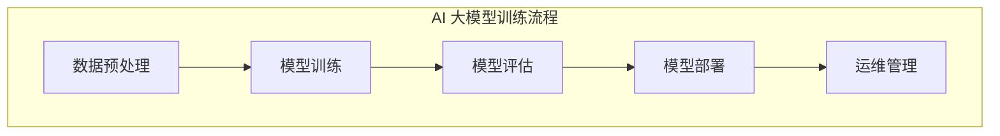
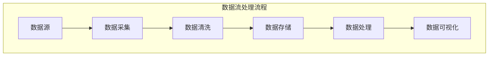

                 

### 混合云与数据中心概述

#### 混合云概念与架构

**关键词**：混合云、云计算、数据中心、架构

**摘要**：
本部分介绍了混合云的概念、架构及其在数据中心中的应用场景。我们将讨论混合云的优势、架构要素以及如何在实际数据中心中部署和利用混合云技术。

---

混合云是一种云计算模型，它结合了私有云和公有云的特点，通过混合使用这两种云环境来优化资源管理和应用部署。这种模型允许企业根据需要灵活调整计算、存储和网络资源，从而实现更高的灵活性和成本效益。

**1.1 混合云概念与架构**

**混合云定义**：
混合云是一种将私有云和公有云环境连接起来，通过一种统一的界面进行管理和调度的云计算模型。它允许组织在内部部署私有云资源，同时利用公有云资源来扩展计算能力和存储容量。

**混合云架构**：
混合云的架构通常包括以下主要组件：

1. **私有云**：在企业内部部署的计算、存储和网络资源。私有云提供对数据的安全控制和个性化的定制服务。
   
2. **公有云**：由第三方服务提供商（如AWS、Azure、Google Cloud等）提供的云计算资源。公有云提供了弹性的计算能力和即付即用的服务模式。
   
3. **连接组件**：包括VPN、专线、云计算网关等，用于在私有云和公有云之间建立安全的连接。
   
4. **管理和监控工具**：用于统一管理和监控混合云环境中的各种资源和服务。

**1.2 数据中心的基础设施与管理**

**数据中心基础设施**：
数据中心是集中管理计算机、存储和网络设备的设施。它通常包括以下关键基础设施：

1. **计算资源**：包括服务器、存储和网络设备，用于处理和存储数据。
   
2. **存储资源**：包括磁盘阵列、SAN（存储区域网络）和NAS（网络附加存储），用于存储数据。
   
3. **网络资源**：包括路由器、交换机和防火墙，用于数据传输和网络安全。

**数据中心管理**：
数据中心的管理涉及多个方面，包括硬件维护、网络监控、数据备份和恢复等。关键的管理工具包括：

1. **DCIM（数据中心基础设施管理）**：用于监控和管理数据中心的硬件和软件资源。
   
2. **NMS（网络管理系统）**：用于监控网络性能和网络安全。
   
3. **备份与恢复**：确保数据在灾难发生时能够得到有效恢复。

**1.3 混合云在数据中心的应用场景**

**混合云应用场景**：
混合云在企业数据中心中的应用非常广泛，以下是一些典型的应用场景：

1. **业务连续性**：通过将关键业务部署在私有云中，同时利用公有云作为备份，实现业务连续性和灾难恢复。
   
2. **成本优化**：利用公有云的低成本计算和存储资源来降低成本，同时保留私有云的安全性和控制性。
   
3. **资源扩展**：在业务高峰期利用公有云资源进行扩展，以应对突发流量和负载。
   
4. **开发和测试**：利用公有云资源快速搭建开发和测试环境，降低硬件成本和部署时间。

**总结**：
混合云和数据中心结合，为企业提供了灵活的资源管理和高效的数据处理能力。通过合理规划和设计混合云策略，企业可以在保证数据安全和合规的前提下，实现业务的持续增长和优化。

---

### 混合云与数据中心的核心技术

**关键词**：虚拟化技术、容器化技术、自动化与编排工具

**摘要**：
本部分将深入探讨混合云与数据中心的核心技术，包括虚拟化技术、容器化技术以及自动化与编排工具。我们将详细解释这些技术的原理和应用，展示其在混合云架构中的重要性。

---

**2.1 虚拟化技术**

**虚拟化技术定义**：
虚拟化技术是一种将计算机资源（如计算能力、存储和网络）抽象化的技术。通过虚拟化，物理资源被转化为多个逻辑资源，从而实现资源的高效利用和隔离。

**虚拟化技术原理**：
虚拟化技术通过以下步骤实现：

1. **硬件抽象层（Hypervisor）**：硬件抽象层是虚拟化技术的核心组件，它负责管理物理硬件资源并将其虚拟化。Hypervisor可以分为两种类型：
   - **Type 1**：直接安装在硬件上，负责直接管理硬件资源和运行虚拟机。
   - **Type 2**：安装在操作系统上，通过操作系统与硬件进行交互。

2. **虚拟机（VM）**：虚拟机是运行在虚拟化环境中的独立计算实例。每个虚拟机都有自己的操作系统和应用程序，与其他虚拟机之间实现硬件隔离。

3. **资源管理**：虚拟化技术通过虚拟化管理工具（如vSphere、KVM等）来管理虚拟机，包括创建、启动、停止和监控虚拟机等操作。

**虚拟化技术在混合云中的应用**：
虚拟化技术在混合云中扮演了重要角色，其主要应用包括：

1. **资源调度**：通过虚拟化技术，企业可以在私有云和公有云之间灵活调度资源，实现负载均衡和资源优化。
   
2. **安全性**：虚拟化技术提供了隔离和资源隔离机制，确保不同应用之间的数据安全和隔离。

3. **可移植性**：虚拟化技术使得应用程序可以在不同硬件环境和云平台上运行，提高了应用程序的可移植性。

**2.2 容器化技术**

**容器化技术定义**：
容器化技术是一种轻量级虚拟化技术，它通过将应用程序及其依赖项打包到一个隔离的环境中（容器）来运行。容器提供了独立的运行环境，但与传统的虚拟机相比，容器更轻量、更高效。

**容器化技术原理**：
容器化技术的主要组件包括：

1. **容器引擎**：容器引擎（如Docker、Kubernetes等）负责创建、启动、管理和编排容器。

2. **容器镜像**：容器镜像是用于创建容器的模板，它包含了应用程序及其依赖项。

3. **容器运行时**：容器运行时是负责执行容器的组件。

**容器化技术在混合云中的应用**：
容器化技术在混合云中的应用主要包括：

1. **部署灵活性**：容器化技术使得应用程序可以在不同的环境中（如本地、公有云、私有云等）快速部署和运行，提高了部署的灵活性。

2. **资源效率**：容器具有更高的资源利用率和更低的启动时间，使得混合云环境中的资源利用率得到显著提高。

3. **运维简便性**：容器化技术简化了应用程序的运维，通过自动化工具（如Kubernetes）实现容器的自动化部署、扩展和管理。

**2.3 自动化与编排工具**

**自动化与编排工具定义**：
自动化与编排工具是用于自动化管理和配置云环境中的资源和服务的技术和工具。它们能够简化复杂的操作流程，提高运维效率。

**自动化与编排工具原理**：
自动化与编排工具主要包括以下类型：

1. **自动化工具**：自动化工具（如Ansible、Terraform等）用于自动化配置和部署云资源。它们通过脚本和配置文件实现自动化操作。

2. **编排工具**：编排工具（如Kubernetes、Docker Swarm等）用于管理和编排容器化应用。它们提供了一组接口和工具，用于自动化部署、扩展和管理容器。

**自动化与编排工具在混合云中的应用**：
自动化与编排工具在混合云中的应用包括：

1. **资源管理**：自动化工具和编排工具能够自动管理和分配云资源，提高资源利用率。

2. **运维效率**：通过自动化和编排，运维人员可以更高效地管理和维护混合云环境，减少手动操作和错误。

3. **服务可靠性**：自动化和编排工具能够实现服务的自动化部署、扩展和故障转移，提高服务的可靠性和可用性。

**总结**：
混合云与数据中心的核心技术，如虚拟化技术、容器化技术和自动化与编排工具，为企业的云计算应用提供了强大的支持。这些技术不仅提高了资源的利用率和部署灵活性，还简化了运维流程，为企业的数字化转型和业务创新提供了坚实的基础。

---

### AI 大模型应用概述

**关键词**：AI 大模型、基础理论、应用领域

**摘要**：
本部分将介绍 AI 大模型的基础理论、常见架构和关键算法，并探讨其在自然语言处理、计算机视觉和语音识别与生成等领域的应用。这将为我们理解 AI 大模型在混合云策略中的重要性提供必要背景。

---

#### 3.1 AI 大模型的基础理论

**核心概念与联系**

**AI 大模型定义**：
AI 大模型是指使用大量数据和强大的计算能力训练的复杂深度学习模型，具有数亿甚至数十亿个参数。这些模型通过学习和模拟人类大脑神经网络的工作原理，能够进行高级的感知、推理和决策。

**AI 大模型与深度学习的联系**：
深度学习是一种机器学习方法，通过构建多层神经网络来学习和提取数据特征。AI 大模型是深度学习领域的一个重要分支，其核心思想是利用大规模数据和强大的计算资源来训练更复杂和更精确的模型。

**AI 大模型架构**：
AI 大模型通常具有以下架构特征：

1. **多层神经网络**：包括输入层、隐藏层和输出层，每个层由多个神经元组成。隐藏层负责提取和转换数据特征。

2. **非线性激活函数**：如ReLU、Sigmoid、Tanh等，用于引入非线性关系，增强模型的表示能力。

3. **大规模参数**：AI 大模型具有数亿甚至数十亿个参数，这使得模型能够捕捉复杂的数据模式。

**3.2 AI 大模型的常见架构**

**典型架构**：
AI 大模型可以分为以下几种常见架构：

1. **卷积神经网络（CNN）**：主要用于图像和视频处理，通过卷积层提取空间特征。

2. **循环神经网络（RNN）**：适用于序列数据，如文本、语音等，通过循环结构保持长时记忆。

3. **Transformer**：一种基于自注意力机制的模型，广泛应用于自然语言处理领域，如BERT、GPT等。

4. **生成对抗网络（GAN）**：通过生成器和判别器的对抗训练，用于生成高质量的数据。

**3.3 AI 大模型的关键算法**

**训练算法**：
AI 大模型的训练通常采用以下关键算法：

1. **梯度下降**：一种优化算法，通过迭代更新模型参数，最小化损失函数。

2. **批量归一化**：在训练过程中对激活值进行归一化，加速收敛并提高模型稳定性。

3. **学习率调度**：通过调整学习率，优化训练过程，避免过拟合和欠拟合。

**调优策略**：
AI 大模型的调优涉及以下几个方面：

1. **数据预处理**：包括数据清洗、数据增强等，以提高模型对数据的鲁棒性。

2. **模型架构优化**：通过调整网络层数、神经元数量等，优化模型性能。

3. **超参数调优**：如学习率、批次大小、正则化参数等，通过实验和自动化工具进行优化。

**3.4 AI 大模型的应用领域**

**自然语言处理（NLP）**：
AI 大模型在 NLP 领域取得了显著成果，主要应用包括：

1. **文本分类**：用于对文本进行分类，如情感分析、新闻分类等。

2. **机器翻译**：通过训练双语语料库，实现高质量的双语翻译。

3. **问答系统**：通过理解用户查询，提供准确的答案。

**计算机视觉（CV）**：
AI 大模型在 CV 领域的应用广泛，包括：

1. **图像分类**：识别图像中的对象和场景。

2. **目标检测**：定位图像中的对象并识别其类别。

3. **图像生成**：通过生成模型生成新的图像内容。

**语音识别与生成**：
AI 大模型在语音处理领域的重要应用包括：

1. **语音识别**：将语音信号转换为文本。

2. **语音合成**：将文本转换为自然流畅的语音。

3. **语音增强**：提高语音质量，降低背景噪声。

**总结**：
AI 大模型的基础理论、常见架构和关键算法构成了深度学习领域的重要组成部分。在自然语言处理、计算机视觉和语音识别与生成等领域的应用，进一步展示了 AI 大模型的巨大潜力和广泛影响。理解这些基础理论和应用场景，对于设计和优化混合云策略具有重要意义。

---

### AI 大模型的应用领域

#### 4.1 自然语言处理

**关键词**：自然语言处理、文本分类、机器翻译、问答系统

**摘要**：
自然语言处理（NLP）是 AI 大模型的重要应用领域之一。本部分将介绍 AI 大模型在文本分类、机器翻译和问答系统等任务中的应用，探讨这些应用中的核心挑战和解决方案。

---

自然语言处理（NLP）是人工智能领域的一个重要分支，旨在使计算机能够理解和处理人类语言。AI 大模型在 NLP 中发挥了关键作用，通过大规模数据和强大计算能力的结合，实现了许多以前难以解决的问题。

**4.1.1 文本分类**

**应用场景**：
文本分类是一种将文本数据分配到预定义类别中的任务。它广泛应用于舆情分析、垃圾邮件检测、情感分析等领域。

**核心挑战**：
1. **数据多样性**：不同领域的文本数据具有不同的特征和风格，这使得模型难以泛化。
2. **噪声数据**：文本数据通常包含大量噪声，如错别字、停用词等，这对模型的准确性有负面影响。

**解决方案**：
1. **预训练模型**：通过在大规模通用语料库上预训练，模型能够自动学习文本的通用特征，提高分类性能。
2. **多任务学习**：通过将多个文本分类任务结合起来，模型可以共享特征表示，提高泛化能力。

**案例分析**：
BERT（Bidirectional Encoder Representations from Transformers）是一个经典的预训练模型，它在多个文本分类任务上取得了显著成果。通过在英文维基百科等大规模数据集上预训练，BERT 获得了强大的文本表示能力，能够准确分类不同领域的文本。

**4.1.2 机器翻译**

**应用场景**：
机器翻译是一种将一种语言的文本自动翻译成另一种语言的任务。它广泛应用于跨语言通信、多语言内容生成和国际化应用等领域。

**核心挑战**：
1. **语言差异**：不同语言之间在词汇、语法和语义上有显著差异，这对模型提出了挑战。
2. **长距离依赖**：在翻译过程中，有时需要考虑句子中远距离的依赖关系，这对模型的记忆能力有要求。

**解决方案**：
1. **编码器-解码器架构**：Transformer 架构的编码器-解码器（Encoder-Decoder）模型在机器翻译中取得了成功。它通过自注意力机制，能够捕捉长距离依赖关系。
2. **双语数据集**：大量高质量的双语数据集是训练机器翻译模型的关键。通过在双语数据集上预训练，模型能够学习到语言之间的对应关系。

**案例分析**：
Google 的翻译服务广泛使用基于 Transformer 的模型，如 Google Transformer。这个模型在多个语言对上进行了训练，并通过不断迭代和优化，实现了高质量的翻译结果。

**4.1.3 问答系统**

**应用场景**：
问答系统是一种能够理解和回答用户问题的系统。它广泛应用于智能客服、知识库查询和教育辅导等领域。

**核心挑战**：
1. **语义理解**：理解用户问题的含义和意图，需要模型具备强大的语义理解能力。
2. **多样性**：用户问题具有多样性和不确定性，模型需要能够应对各种情况。

**解决方案**：
1. **融合多模态信息**：通过结合文本、图像和语音等多种模态信息，提高模型对问题的理解能力。
2. **生成式与检索式结合**：生成式问答系统能够生成自然流畅的回答，而检索式问答系统通过在预定义的知识库中检索答案。结合两种方法，可以实现更准确的回答。

**案例分析**：
OpenAI 的 GPT-3 模型在问答系统中取得了显著成果。GPT-3 是一个大规模的生成式模型，通过在互联网文本上预训练，它具备了强大的语言理解和生成能力，能够生成高质量的自然语言回答。

**总结**：
AI 大模型在自然语言处理领域的应用为许多实际问题提供了有效解决方案。通过预训练、多任务学习和融合多模态信息等策略，模型在文本分类、机器翻译和问答系统等任务上取得了显著进展。随着技术的不断发展和数据资源的丰富，自然语言处理将继续为人工智能领域带来更多突破。

---

#### 4.2 计算机视觉

**关键词**：计算机视觉、图像分类、目标检测、图像生成

**摘要**：
计算机视觉是 AI 大模型的另一个重要应用领域。本部分将探讨 AI 大模型在图像分类、目标检测和图像生成等任务中的应用，分析其中的核心挑战和解决方案，并通过实际案例展示其应用效果。

---

计算机视觉是一种使计算机具备对图像和视频进行分析和理解能力的技术。AI 大模型在计算机视觉领域发挥了重要作用，通过大规模数据和强大计算能力，实现了许多复杂任务的突破。

**4.2.1 图像分类**

**应用场景**：
图像分类是一种将图像分配到预定义类别中的任务，广泛应用于物体识别、场景分类和医疗影像分析等领域。

**核心挑战**：
1. **数据多样性**：不同场景和拍摄角度的图像具有不同的特征，模型需要能够处理这些多样性。
2. **小样本学习**：在有些场景下，训练数据不足，模型需要在小样本情况下进行有效学习。

**解决方案**：
1. **迁移学习**：通过在大规模数据集上预训练模型，然后将其迁移到特定任务上，提高模型在小样本情况下的性能。
2. **数据增强**：通过变换、旋转、缩放等操作，增加训练数据量，提高模型的泛化能力。

**案例分析**：
ResNet 是一个经典的图像分类模型，通过堆叠多层卷积神经网络，实现了优异的分类性能。在 ImageNet 数据集上，ResNet 击败了当时所有主流模型，展示了深度学习的强大能力。

**4.2.2 目标检测**

**应用场景**：
目标检测是一种定位图像中的对象并识别其类别的任务，广泛应用于自动驾驶、视频监控和无人机监控等领域。

**核心挑战**：
1. **实时性**：在实时应用中，模型需要快速检测并处理图像。
2. **小目标检测**：对于小尺寸的目标，模型需要具备更高的检测精度。

**解决方案**：
1. **锚点生成**：通过锚点生成方法，提前预设一系列可能的物体位置和尺寸，提高检测的准确性和速度。
2. **区域建议网络**：通过额外的网络结构，生成候选区域，提高检测的效率和准确性。

**案例分析**：
Faster R-CNN 是一个流行的目标检测模型，通过使用区域建议网络和卷积神经网络，实现了高效的物体检测。它在多个目标检测任务中取得了优异成绩，广泛应用于自动驾驶和视频监控领域。

**4.2.3 图像生成**

**应用场景**：
图像生成是一种通过学习图像特征生成新图像的任务，广泛应用于图像修复、风格转换和虚拟现实等领域。

**核心挑战**：
1. **细节生成**：生成图像需要保留高分辨率和细节信息。
2. **多样性**：生成模型需要能够产生多样化、创意性的图像。

**解决方案**：
1. **生成对抗网络（GAN）**：GAN 通过生成器和判别器的对抗训练，实现了高质量图像生成。生成器尝试生成逼真的图像，而判别器尝试区分真实图像和生成图像。
2. **变分自编码器（VAE）**：VAE 通过引入概率模型，生成具有多样性和高保真的图像。

**案例分析**：
CycleGAN 是一个基于 GAN 的图像生成模型，通过训练对抗网络，实现跨域图像转换。例如，它可以将真实世界的图像转换为艺术风格图像，展示了图像生成技术的强大能力。

**总结**：
计算机视觉是 AI 大模型的重要应用领域，通过图像分类、目标检测和图像生成等任务，实现了许多实际应用。迁移学习、数据增强和生成对抗网络等技术在解决核心挑战方面发挥了关键作用。随着技术的不断进步，计算机视觉将在更多领域取得突破。

---

#### 4.3 语音识别与生成

**关键词**：语音识别、语音合成、语音增强

**摘要**：
语音识别与生成是 AI 大模型的另一个重要应用领域。本部分将探讨语音识别、语音合成和语音增强等任务中的核心挑战和解决方案，并通过实际案例展示其应用效果。

---

语音识别与生成是人工智能领域的关键技术之一，旨在使计算机能够理解和处理人类语音。AI 大模型通过大规模数据和强大计算能力，在这些任务中取得了显著进展。

**4.3.1 语音识别**

**应用场景**：
语音识别是一种将语音信号转换为文本的任务，广泛应用于语音助手、智能客服和语音搜索等领域。

**核心挑战**：
1. **多语言处理**：不同语言具有不同的语音特点，模型需要具备多语言处理能力。
2. **口语化处理**：口语化语音（如口头禅、语速变化等）对模型的准确性有较大影响。

**解决方案**：
1. **端到端模型**：端到端模型（如深度神经网络）通过直接将语音信号映射到文本，减少了传统模型的中间步骤，提高了识别准确率。
2. **数据增强**：通过添加噪音、变速、回声等处理，增加训练数据量，提高模型的鲁棒性。

**案例分析**：
Google 的语音识别模型通过使用深度神经网络和大规模数据集，实现了高准确率的语音识别。该模型支持多种语言，能够准确识别各种口语化语音。

**4.3.2 语音合成**

**应用场景**：
语音合成是一种将文本转换为自然流畅的语音的任务，广泛应用于虚拟助手、广告配音和电子阅读等领域。

**核心挑战**：
1. **音质**：合成语音需要具备良好的音质，与人类语音相近。
2. **自然度**：合成语音需要具备自然的语调和节奏。

**解决方案**：
1. **WaveNet**：WaveNet 是一个基于循环神经网络的语音合成模型，通过生成连续的音频波形，实现了高质量的语音合成。
2. **多尺度声码器**：通过使用多尺度声码器，合成语音的音质和自然度得到了显著提升。

**案例分析**：
Amazon 的 Alexa 使用的语音合成技术基于 WaveNet，能够生成自然流畅的语音，广泛应用于智能家居、购物和娱乐等领域。

**4.3.3 语音增强**

**应用场景**：
语音增强是一种提高语音质量、降低背景噪音的的任务，广泛应用于电话通信、在线会议和智能听力设备等领域。

**核心挑战**：
1. **噪声抑制**：有效去除背景噪音，保留语音信号。
2. **语音保持**：在去除噪音的同时，保持语音的清晰度和完整性。

**解决方案**：
1. **自适应滤波**：通过自适应滤波器，根据噪声特点实时调整滤波参数，提高语音质量。
2. **深度学习**：通过训练深度学习模型，如卷积神经网络，实现高效的噪声抑制和语音增强。

**案例分析**：
Google 的语音增强技术使用基于深度学习的模型，通过学习大量语音和噪声数据，实现了高效的噪声抑制和语音增强，广泛应用于 Google Assistant 和其他语音服务中。

**总结**：
语音识别与生成是 AI 大模型的重要应用领域，通过端到端模型、高质量语音合成和深度学习技术，实现了语音信号的处理和生成。随着技术的不断进步，语音识别与生成将在更多场景中发挥作用。

---

### 混合云策略规划与设计

#### 5.1 混合云策略规划方法论

**关键词**：混合云策略、规划方法论、业务需求分析、技术选型、风险评估

**摘要**：
本部分将介绍混合云策略的规划方法论，包括业务需求分析、技术选型、风险评估和策略制定。我们将详细解释每个步骤的关键点和注意事项，帮助企业在构建混合云环境时做出明智的决策。

---

**5.1.1 业务需求分析**

**关键点**：
1. **确定业务目标**：明确企业构建混合云环境的目的，如提高资源利用率、实现业务连续性或降低成本等。
2. **分析业务流程**：了解企业的业务流程，确定关键业务和依赖关系，以便在混合云环境中进行合理部署。
3. **数据访问需求**：分析企业对数据访问的需求，如数据的安全性和合规性要求、数据传输速度等。

**注意事项**：
1. **业务目标的一致性**：确保业务需求和混合云策略规划的目标一致，避免目标冲突。
2. **数据隐私与合规性**：特别是在涉及敏感数据的场景中，需要确保数据在混合云环境中的隐私保护和合规性。

**5.1.2 技术选型**

**关键点**：
1. **云服务提供商**：选择适合企业需求的云服务提供商，如 AWS、Azure、Google Cloud 等。
2. **基础设施组件**：根据业务需求选择合适的基础设施组件，如虚拟化技术、容器化平台、自动化与编排工具等。
3. **网络连接方案**：设计私有云和公有云之间的网络连接方案，确保数据传输的高效和安全。

**注意事项**：
1. **兼容性与可扩展性**：所选技术应具有良好的兼容性和可扩展性，以适应未来业务的发展需求。
2. **成本效益**：综合考虑技术选型的成本和效益，确保在预算范围内实现最佳效果。

**5.1.3 风险评估**

**关键点**：
1. **技术风险**：评估所选技术的稳定性和成熟度，确保其在生产环境中的可靠性。
2. **业务连续性风险**：评估业务中断对企业的潜在影响，制定相应的应急预案。
3. **数据安全与隐私风险**：评估数据在传输、存储和处理过程中的安全性和隐私性。

**注意事项**：
1. **全面性**：风险评估应覆盖技术、业务、数据等多个方面，确保全面识别潜在风险。
2. **定期更新**：随着业务和技术环境的变化，定期更新风险评估结果，确保其持续有效性。

**5.1.4 策略制定**

**关键点**：
1. **整体架构设计**：根据业务需求和技术选型，设计混合云的整体架构，包括云资源分布、网络架构和数据存储策略。
2. **实施计划**：制定详细的实施计划，包括项目时间表、任务分配和资源调配等。
3. **运维与监控**：建立运维与监控机制，确保混合云环境的稳定运行和高效管理。

**注意事项**：
1. **可操作性和灵活性**：策略制定应具备可操作性和灵活性，以适应不同业务场景和技术变化。
2. **文档化**：确保策略文档的完整性和清晰性，方便后续的执行和审计。

**总结**：
混合云策略的规划与设计是企业成功构建混合云环境的关键。通过业务需求分析、技术选型、风险评估和策略制定，企业可以制定出符合自身需求的混合云策略，实现业务的持续发展和优化。

---

#### 5.2 混合云架构设计与优化

**关键词**：混合云架构、架构设计、性能优化、资源分配、安全性

**摘要**：
本部分将深入探讨混合云架构的设计与优化，包括架构设计的核心要素、性能优化策略、资源分配方案以及安全性保障措施。我们将通过具体实例详细解释这些设计原则和优化方法。

---

**5.2.1 混合云架构设计核心要素**

**1. 云资源分布**：
- **私有云与公有云的结合**：私有云用于关键业务和数据的安全存储，公有云用于弹性扩展和低成本计算。
- **地域分布**：根据业务需求和用户分布，合理选择私有云和公有云的数据中心位置，实现低延迟和高可用性。

**2. 网络架构**：
- **VPN与专线**：使用VPN或专线建立私有云与公有云之间的安全连接，确保数据传输的安全性和可靠性。
- **负载均衡**：通过负载均衡器，实现流量分配和故障转移，提高系统可用性和响应速度。

**3. 数据存储**：
- **分布式存储**：采用分布式存储方案，提高数据存储的可靠性和访问速度。
- **数据备份与恢复**：制定数据备份和恢复策略，确保数据在故障发生时的快速恢复。

**4. 服务管理**：
- **自动化与编排**：通过自动化工具和编排平台，实现服务部署、扩容和监控的自动化，提高运维效率。
- **监控与日志管理**：建立全面的监控和日志管理系统，实时监控系统性能和安全状态。

**5.2.2 性能优化策略**

**1. 系统调优**：
- **负载均衡**：通过合理配置负载均衡器，优化流量分配，提高系统性能。
- **缓存技术**：使用缓存技术（如Redis、Memcached等）减少数据库查询次数，提高系统响应速度。

**2. 数据优化**：
- **数据库分库分表**：针对大数据量，采用分库分表策略，减少单表查询压力。
- **读写分离**：通过读写分离技术，提高数据库读写性能。

**3. 网络优化**：
- **网络延迟优化**：通过优化网络拓扑和选择合适的数据中心位置，降低网络延迟。
- **带宽优化**：合理配置网络带宽，确保数据传输的高效性和稳定性。

**5.2.3 资源分配方案**

**1. 资源池化**：
- **虚拟化技术**：通过虚拟化技术，将物理资源池化，实现资源的高效利用和动态调度。
- **容器化技术**：通过容器化技术，实现应用容器与基础设施的解耦，提高资源利用率。

**2. 自动化分配**：
- **资源调度策略**：根据业务负载和资源利用率，制定合理的资源调度策略，确保资源的高效分配。
- **自动化工具**：使用自动化工具（如Kubernetes、Docker等）实现资源的自动化管理和调度。

**5.2.4 安全性保障措施**

**1. 数据安全**：
- **加密存储与传输**：使用加密技术保护数据存储和传输过程中的安全性。
- **访问控制**：通过访问控制机制，确保数据只被授权用户访问。

**2. 网络安全**：
- **防火墙与入侵检测**：部署防火墙和入侵检测系统，防止网络攻击和数据泄露。
- **VPN与专线**：使用VPN和专线建立安全连接，确保数据在传输过程中的安全性。

**3. 应用安全**：
- **安全编码**：遵循安全编码规范，防止常见的安全漏洞（如SQL注入、XSS等）。
- **安全审计**：定期进行安全审计，发现和修复潜在的安全风险。

**5.2.5 案例分析**

**1. 财务报表系统**：
- **架构设计**：采用混合云架构，私有云负责核心业务处理，公有云用于数据备份和扩展。
- **性能优化**：通过负载均衡和缓存技术，提高系统响应速度。
- **安全性保障**：使用加密存储和VPN，确保数据安全和传输可靠性。

**2. 在线教育平台**：
- **架构设计**：采用容器化技术，实现应用与基础设施的解耦，提高资源利用率和扩展性。
- **性能优化**：通过数据库分库分表和读写分离，提高系统性能。
- **安全性保障**：使用防火墙和入侵检测系统，确保网络和数据安全。

**总结**：
混合云架构的设计与优化是构建高效、安全、可扩展的混合云环境的关键。通过合理设计云资源分布、网络架构、数据存储和服务管理，结合性能优化策略和安全性保障措施，企业可以构建出满足业务需求的混合云架构，实现业务的持续增长和优化。

---

#### 5.3 混合云成本效益分析

**关键词**：混合云、成本效益、成本控制、资源利用率、ROI计算

**摘要**：
本部分将深入探讨混合云的成本效益分析，包括成本控制策略、资源利用率优化和投资回报率（ROI）的计算方法。我们将通过具体案例展示如何实现混合云环境中的成本效益最大化。

---

**5.3.1 成本控制策略**

**1. 资源池化**：
- **虚拟化技术**：通过虚拟化技术，将物理资源池化，实现资源的高效利用和动态调度，降低整体成本。
- **容器化技术**：通过容器化技术，进一步降低硬件成本和运维成本，提高资源利用率。

**2. 自动化与自动化工具**：
- **自动化部署**：使用自动化工具（如Ansible、Terraform等）实现资源的自动化部署和配置，减少人工操作，降低错误率和成本。
- **自动化扩容与缩容**：根据业务负载动态调整资源规模，实现弹性伸缩，避免资源浪费。

**3. 混合云服务选择**：
- **按需付费**：选择按需付费的云服务模式，避免长期固定投入，降低成本。
- **使用云服务商优惠策略**：利用云服务商的折扣和优惠策略，降低购买成本。

**5.3.2 资源利用率优化**

**1. 容量规划**：
- **历史数据分析**：通过历史数据分析和预测，合理规划资源容量，避免资源过剩或不足。
- **自动化容量管理**：使用自动化工具和算法，实现资源的动态调整和优化。

**2. 资源共享**：
- **多租户架构**：在私有云中采用多租户架构，实现不同业务之间的资源共享，提高资源利用率。
- **跨云资源调度**：通过跨云资源调度，将负载从高负载的云迁移到低负载的云，实现资源的优化分配。

**3. 环境优化**：
- **计算优化**：通过选择合适的虚拟机规格和计算资源，提高计算效率，降低成本。
- **存储优化**：采用分布式存储和分层存储策略，提高存储效率，降低存储成本。

**5.3.3 投资回报率（ROI）计算**

**1. 成本计算**：
- **直接成本**：包括硬件采购、云服务费用、运维成本等。
- **间接成本**：包括人员培训、项目管理、风险评估等。

**2. 收益计算**：
- **直接收益**：包括节省的成本、提高的业务效率等。
- **间接收益**：包括增加的收入、提高的市场竞争力等。

**3. ROI 计算**：
- **ROI =（直接收益 + 间接收益）/ 成本**
- **ROI 持续监控**：通过定期计算 ROI，评估混合云策略的实施效果，及时调整优化策略。

**5.3.4 案例分析**

**1. 零售行业**：
- **成本控制**：通过混合云架构，将核心业务部署在私有云，非核心业务部署在公有云，实现成本控制。
- **资源利用率**：通过自动化和弹性伸缩，实现资源的高效利用和动态调整。
- **ROI**：通过节省硬件采购成本、降低运维成本和增加业务收入，实现了较高的 ROI。

**2. 制造行业**：
- **成本控制**：通过混合云架构，将生产数据存储在私有云，生产任务运行在公有云，实现成本控制。
- **资源利用率**：通过资源共享和跨云资源调度，提高资源利用率。
- **ROI**：通过降低生产成本、提高生产效率和质量，实现了较高的 ROI。

**总结**：
混合云成本效益分析是企业构建混合云环境的重要环节。通过合理的成本控制策略、资源利用率优化和投资回报率计算，企业可以实现成本效益最大化，推动业务的持续发展和优化。

---

### AI 大模型与混合云的集成

#### 6.1 AI 大模型在混合云中的部署与调优

**关键词**：AI 大模型、混合云部署、调优策略、计算资源分配、性能优化

**摘要**：
本部分将探讨 AI 大模型在混合云环境中的部署与调优，包括计算资源分配策略、性能优化方法以及部署和调优的具体步骤。我们将通过实际案例展示如何实现 AI 大模型在混合云环境中的高效运行。

---

AI 大模型在混合云环境中的部署与调优是一个复杂的过程，涉及到计算资源的管理、性能优化以及部署策略的制定。以下是 AI 大模型在混合云中部署与调优的关键步骤和策略。

**6.1.1 计算资源分配策略**

**1. 资源需求评估**：
- **模型规模**：评估 AI 大模型的参数规模和计算需求，根据模型大小确定所需的计算资源。
- **训练时间**：根据模型的训练时间，评估是否需要额外的计算资源来加速训练过程。

**2. 资源分配方案**：
- **私有云与公有云结合**：将计算密集型任务部署在私有云，以获得更好的性能和稳定性；将数据存储和推理任务部署在公有云，以利用其弹性和低成本计算能力。
- **分布式训练**：使用分布式训练技术，将模型拆分成多个子模型，在多个节点上并行训练，提高训练效率。

**3. 资源调度策略**：
- **动态资源调度**：根据实际业务负载动态调整资源分配，确保关键任务获得足够的计算资源。
- **优先级调度**：对任务进行优先级排序，确保高优先级任务获得优先调度和资源分配。

**6.1.2 性能优化方法**

**1. 计算优化**：
- **模型压缩**：通过模型压缩技术（如剪枝、量化等），减少模型参数数量，提高计算效率。
- **加速卡使用**：利用 GPU、TPU 等加速卡，提高模型的训练和推理速度。

**2. 数据优化**：
- **数据预处理**：优化数据预处理流程，减少数据传输和预处理时间。
- **缓存技术**：使用缓存技术（如 Redis、Memcached 等）减少数据访问延迟，提高数据处理速度。

**3. 网络优化**：
- **网络加速**：通过优化网络拓扑和使用 CDN，减少网络延迟和数据传输时间。
- **分布式存储**：使用分布式存储系统，提高数据访问速度和存储效率。

**6.1.3 部署与调优步骤**

**1. 部署准备**：
- **环境配置**：配置混合云环境，包括私有云和公有云资源，确保环境稳定可靠。
- **模型转换**：将 AI 大模型转换为适合混合云环境的格式，如 TensorFlow、PyTorch 等。

**2. 部署过程**：
- **模型上传**：将训练完成的模型上传到混合云环境，包括私有云和公有云。
- **自动化部署**：使用自动化工具（如 Kubernetes、Ansible 等）实现模型的自动化部署和配置。

**3. 调优过程**：
- **性能监控**：使用监控工具（如 Prometheus、Grafana 等）实时监控模型的性能指标，包括计算时间、内存使用、CPU 利用率等。
- **调优策略**：根据性能监控结果，调整模型参数、计算资源分配和网络配置，优化模型性能。

**4. 迭代优化**：
- **迭代部署**：根据调优结果，迭代部署和优化模型，不断优化模型性能和资源利用。
- **持续监控**：建立持续监控和反馈机制，确保模型在混合云环境中的稳定运行和性能优化。

**6.1.4 案例分析**

**案例一：自然语言处理应用**
- **部署环境**：使用私有云服务器进行模型训练，公有云服务器进行推理。
- **资源分配**：将模型拆分为多个子模型，在多个节点上并行训练，以提高训练效率。
- **调优策略**：使用 GPU 加速训练过程，优化数据预处理流程，提高模型推理速度。

**案例二：计算机视觉应用**
- **部署环境**：使用私有云服务器进行图像处理，公有云服务器存储和处理大规模数据。
- **资源分配**：使用分布式存储系统提高数据访问速度，使用 GPU 加速图像处理过程。
- **调优策略**：优化模型参数，使用剪枝技术减少模型大小，提高推理速度。

**总结**：
AI 大模型在混合云环境中的部署与调优需要综合考虑计算资源、性能优化和网络配置等多个方面。通过合理的资源分配策略、性能优化方法和部署调优步骤，企业可以实现 AI 大模型在混合云中的高效运行，推动业务的持续发展和创新。

---

#### 6.2 混合云环境下的数据管理与存储

**关键词**：混合云、数据管理、存储架构、数据迁移、数据备份与恢复

**摘要**：
本部分将探讨混合云环境下的数据管理与存储，包括存储架构设计、数据迁移策略、数据备份与恢复方案。我们将通过实际案例展示如何在混合云环境中实现数据的高效管理和安全存储。

---

在混合云环境中，数据管理是一个关键环节，它直接关系到业务的连续性和数据的安全性。为了实现高效的数据管理和存储，企业需要设计合理的存储架构、制定数据迁移策略以及建立完善的数据备份与恢复方案。

**6.2.1 存储架构设计**

**1. 分布式存储系统**：
- **分布式文件系统**：使用分布式文件系统（如 HDFS、Ceph 等），实现数据的高效存储和访问。
- **对象存储**：使用对象存储（如 AWS S3、Azure Blob Storage 等），提供高扩展性和高可用性。

**2. 数据分层存储**：
- **热数据存储**：将高频访问的数据存储在快速存储设备上（如 SSD），提高数据访问速度。
- **冷数据存储**：将不常访问的数据存储在低成本、高容量的存储设备上（如 HDD），降低存储成本。

**3. 分布式数据库**：
- **关系型数据库**：在混合云环境中使用分布式关系型数据库（如 MySQL、PostgreSQL 等），实现数据的高效存储和查询。
- **非关系型数据库**：使用分布式非关系型数据库（如 MongoDB、Cassandra 等），处理大规模数据存储和快速访问。

**6.2.2 数据迁移策略**

**1. 数据迁移方案**：
- **全量迁移**：将现有数据全部迁移到混合云环境，适用于数据量较小、业务需求较紧迫的场景。
- **增量迁移**：只迁移最近的数据或更新的数据，适用于数据量较大、业务需求较平稳的场景。

**2. 数据同步与校验**：
- **数据同步**：确保数据在源端和目标端的一致性，避免数据丢失或错误。
- **数据校验**：使用校验算法（如 MD5、SHA-256 等）验证数据的完整性和准确性。

**3. 数据迁移工具**：
- **数据迁移工具**：使用专业的数据迁移工具（如 Talend、Informatica 等），实现自动化、高效的数据迁移。

**6.2.3 数据备份与恢复方案**

**1. 备份策略**：
- **定期备份**：定期对数据进行备份，确保数据在意外情况下能够恢复。
- **增量备份**：只备份最近更新的数据，降低备份时间和存储需求。

**2. 备份数据存储**：
- **云存储**：将备份数据存储在云存储服务中，确保数据的安全和长期保存。
- **异地备份**：将备份数据存储在异地，以防自然灾害或其他突发事件导致的数据丢失。

**3. 恢复策略**：
- **快速恢复**：在发生数据丢失或损坏时，能够快速恢复数据，减少业务中断时间。
- **灾难恢复**：建立灾难恢复计划，确保在发生灾难时，业务能够迅速恢复。

**6.2.4 案例分析**

**案例一：企业级数据迁移**
- **场景描述**：某企业计划从传统的数据中心迁移到混合云环境，包含大量业务数据。
- **解决方案**：采用增量迁移策略，逐步迁移数据，确保数据的一致性和安全性。使用专业的数据迁移工具，实现自动化迁移，降低风险和成本。

**案例二：云存储与备份**
- **场景描述**：某电商平台在混合云环境中存储大量用户数据和交易数据，需要确保数据的安全和长期保存。
- **解决方案**：使用分布式文件系统和对象存储，实现数据的高效存储和访问。定期备份数据，并存储在异地云存储服务中，确保数据的完整性和安全性。

**总结**：
混合云环境下的数据管理与存储需要综合考虑存储架构设计、数据迁移策略和数据备份与恢复方案。通过合理的架构设计、有效的迁移策略和完善的备份与恢复方案，企业可以确保数据的高效管理、安全存储和快速恢复，为业务的持续发展和创新提供坚实支撑。

---

#### 6.3 混合云中的AI大模型运维与管理

**关键词**：混合云、AI大模型运维、监控、性能优化、故障处理

**摘要**：
本部分将探讨混合云环境中 AI 大模型的运维与管理，包括监控、性能优化和故障处理策略。我们将通过实际案例展示如何在混合云环境中实现 AI 大模型的高效运维与管理。

---

在混合云环境中，AI 大模型的运维与管理是一个复杂的过程，涉及到监控、性能优化和故障处理等多个方面。为了确保 AI 大模型的高效运行和稳定性，企业需要建立完善的运维和管理策略。

**6.3.1 监控**

**1. 监控指标**：
- **计算资源监控**：监控 AI 大模型使用的计算资源，如 CPU 使用率、内存使用率、GPU 利用率等。
- **存储资源监控**：监控 AI 大模型使用的存储资源，如存储容量、I/O 性能、存储延迟等。
- **网络资源监控**：监控 AI 大模型使用的网络资源，如网络带宽、网络延迟、网络故障等。

**2. 监控工具**：
- **云监控服务**：使用云服务商提供的监控服务（如 AWS CloudWatch、Azure Monitor 等），实现自动化监控和数据可视化。
- **开源监控工具**：使用开源监控工具（如 Prometheus、Grafana 等），构建自定义监控解决方案。

**6.3.2 性能优化**

**1. 性能优化策略**：
- **资源调度**：根据 AI 大模型的计算需求和负载情况，动态调整计算资源分配，确保资源的高效利用。
- **模型优化**：对 AI 大模型进行优化，如剪枝、量化等，减少模型参数数量，提高计算效率。
- **数据优化**：优化数据预处理和存储流程，减少数据传输和读取时间，提高模型性能。

**2. 性能优化工具**：
- **自动化工具**：使用自动化工具（如 Kubernetes、Docker 等），实现资源的自动化管理和优化。
- **性能测试工具**：使用性能测试工具（如 JMeter、LoadRunner 等），对 AI 大模型进行压力测试和性能分析。

**6.3.3 故障处理**

**1. 故障处理流程**：
- **故障监测**：实时监测 AI 大模型的运行状态，及时发现异常和故障。
- **故障定位**：通过日志分析、监控数据和故障回溯，定位故障发生的位置和原因。
- **故障恢复**：根据故障类型和影响范围，制定恢复计划，尽快恢复系统运行。

**2. 故障处理工具**：
- **日志分析工具**：使用日志分析工具（如 ELK、Splunk 等），分析故障日志，定位故障原因。
- **故障恢复工具**：使用故障恢复工具（如 Kubernetes、Ansible 等），实现自动化故障恢复和系统重启。

**6.3.4 案例分析**

**案例一：AI 大模型训练任务调度**
- **场景描述**：某企业使用混合云环境进行 AI 大模型训练，需要高效调度训练任务，确保资源的高效利用。
- **解决方案**：使用 Kubernetes 实现自动化任务调度，根据训练任务的负载情况动态调整计算资源，提高资源利用率。

**案例二：AI 大模型训练性能优化**
- **场景描述**：某企业使用 GPU 进行 AI 大模型训练，需要优化训练性能，提高训练效率。
- **解决方案**：使用剪枝和量化技术优化模型，减少模型参数数量，提高 GPU 利用率和训练速度。

**案例三：AI 大模型故障恢复**
- **场景描述**：某企业 AI 大模型在训练过程中发生故障，需要快速恢复系统，确保业务连续性。
- **解决方案**：使用 Kubernetes 的自动恢复功能，根据故障类型和影响范围，自动化重启训练任务，确保系统尽快恢复。

**总结**：
混合云环境中的 AI 大模型运维与管理需要综合考虑监控、性能优化和故障处理等多个方面。通过建立完善的监控体系、优化性能和自动化故障恢复，企业可以实现 AI 大模型的高效运维与管理，确保业务的持续稳定运行。

---

### 混合云策略实施与优化

#### 7.1 混合云策略实施步骤

**关键词**：混合云策略、实施步骤、项目计划、团队协作、风险管理

**摘要**：
本部分将详细阐述混合云策略的实施步骤，包括项目计划、团队协作、风险管理以及关键里程碑。我们将通过具体实例展示如何在实际项目中顺利实施混合云策略，确保项目成功落地。

---

实施混合云策略是一个复杂的过程，涉及到多个阶段和环节。为了确保混合云策略能够顺利实施并达到预期效果，企业需要制定详细的实施计划，明确每个阶段的任务和时间节点，确保项目按计划进行。

**7.1.1 项目计划**

**1. 项目启动**：
- **项目立项**：明确项目目标、范围和预期成果，确定项目团队和负责人。
- **需求分析**：与业务部门沟通，明确业务需求和技术要求，确保混合云策略能够满足业务需求。

**2. 设计阶段**：
- **架构设计**：根据需求分析结果，设计混合云架构，确定私有云和公有云的资源分布、网络架构和数据存储方案。
- **技术选型**：选择合适的技术和工具，如虚拟化技术、容器化平台、自动化与编排工具等。

**3. 开发阶段**：
- **基础设施搭建**：搭建私有云和公有云的基础设施，包括计算资源、存储资源和网络设备。
- **应用部署**：将现有应用迁移到混合云环境，并进行必要的调整和优化，确保应用在混合云中正常运行。

**4. 测试阶段**：
- **功能测试**：对迁移后的应用进行功能测试，确保其性能和功能符合预期。
- **性能测试**：进行负载测试和压力测试，评估混合云环境的性能和稳定性。

**5. 上线阶段**：
- **上线准备**：完成所有测试工作，确保系统稳定可靠。
- **上线发布**：将混合云环境正式上线，替换原有环境，确保业务的连续性和稳定性。

**7.1.2 团队协作**

**1. 项目团队组建**：
- **核心团队**：组建包括项目经理、架构师、开发人员、测试人员等核心团队成员。
- **业务团队**：与业务部门保持紧密沟通，确保业务需求和技术方案的一致性。

**2. 沟通机制**：
- **定期会议**：定期召开项目会议，总结工作进展，解决遇到的问题。
- **即时沟通**：使用即时通讯工具（如 Slack、Microsoft Teams 等），确保团队成员之间的即时沟通和协作。

**3. 协作工具**：
- **项目管理工具**：使用项目管理工具（如 JIRA、Trello 等），跟踪项目进度和任务分配。
- **代码管理工具**：使用代码管理工具（如 Git、GitLab 等），确保代码的版本控制和协作开发。

**7.1.3 风险管理**

**1. 风险识别**：
- **需求变化**：业务需求发生变化，可能导致项目范围和计划的调整。
- **技术风险**：所选技术和工具的稳定性可能影响项目的进度和质量。

**2. 风险评估**：
- **影响分析**：评估风险对项目的具体影响，如时间延误、成本增加、业务中断等。
- **概率分析**：评估风险发生的概率，确定风险的重要性和紧急程度。

**3. 风险应对**：
- **风险规避**：通过调整项目计划和技术方案，避免风险发生。
- **风险转移**：通过购买保险、外包等方式，将风险转移给第三方。
- **风险接受**：对不可避免的风险，制定应对措施和应急预案，确保项目能够继续进行。

**7.1.4 关键里程碑**

**1. 阶段验收**：
- **设计验收**：完成架构设计和技术选型，确保设计方案符合业务需求和技术标准。
- **开发验收**：完成应用部署和测试，确保应用在混合云环境中正常运行。

**2. 上线验收**：
- **性能验收**：完成性能测试和负载测试，确保混合云环境的高性能和高可用性。
- **业务验收**：与业务部门进行沟通，确保混合云环境满足业务需求，达到预期效果。

**3. 持续优化**：
- **监控与反馈**：上线后，持续监控混合云环境的性能和稳定性，收集用户反馈。
- **优化与迭代**：根据监控结果和用户反馈，不断优化混合云策略，提高系统的性能和用户体验。

**总结**：
混合云策略的实施是一个系统化的过程，需要详细的计划、紧密的团队协作和有效的风险管理。通过明确实施步骤、建立协作机制和制定风险应对策略，企业可以确保混合云策略顺利实施，实现业务的持续发展和优化。

---

#### 7.2 混合云策略的持续优化与迭代

**关键词**：混合云策略、持续优化、迭代过程、监控数据、反馈机制

**摘要**：
本部分将探讨混合云策略的持续优化与迭代，包括如何利用监控数据和用户反馈进行优化、迭代的过程和方法。我们将通过实际案例展示如何通过持续优化和迭代，不断提升混合云环境的性能和用户体验。

---

在混合云环境中，随着业务的不断发展和变化，混合云策略也需要不断优化和迭代，以适应新的业务需求和技术挑战。持续优化和迭代的关键在于如何有效利用监控数据、用户反馈和最佳实践，不断提升混合云环境的性能和用户体验。

**7.2.1 利用监控数据进行优化**

**1. 监控数据的收集与分析**：
- **性能指标**：收集系统的性能指标，如 CPU 使用率、内存使用率、网络带宽、存储I/O等，分析系统的瓶颈和性能问题。
- **错误日志**：收集系统的错误日志，识别系统中的错误和异常，定位问题发生的位置和原因。
- **流量分析**：分析网络流量，识别流量高峰和异常流量，优化网络配置和资源分配。

**2. 数据可视化**：
- **监控仪表板**：使用监控仪表板（如 Grafana、Kibana 等），将监控数据可视化为图表和报表，方便实时监控和问题定位。

**3. 优化策略**：
- **性能调优**：根据监控数据，调整系统的配置参数，优化系统的性能和响应速度。
- **资源调整**：根据监控数据，动态调整资源的分配和调度策略，确保系统的高效运行。

**7.2.2 利用用户反馈进行优化**

**1. 用户反馈渠道**：
- **用户调研**：通过用户调研问卷、用户访谈等方式，收集用户对系统的反馈和建议。
- **用户支持平台**：使用用户支持平台（如 Zendesk、Freshdesk 等），收集用户的反馈和问题。

**2. 反馈处理**：
- **问题分类**：将用户反馈进行分类，识别主要问题和用户痛点，制定优化方案。
- **优先级排序**：根据问题的严重程度和用户影响，对优化任务进行优先级排序，确保关键问题得到优先解决。

**3. 优化实施**：
- **快速迭代**：快速实施优化方案，通过小批量、逐步迭代的方式，不断改进系统。
- **用户验证**：在优化后，再次收集用户反馈，验证优化效果，确保用户满意。

**7.2.3 迭代过程和方法**

**1. 迭代计划**：
- **迭代周期**：确定每次迭代的周期，如每周、每月等，确保在合理时间内完成优化任务。
- **迭代目标**：明确每次迭代的目标和任务，确保迭代工作有明确的方向和目标。

**2. 迭代流程**：
- **需求收集**：收集用户需求和问题，确定本次迭代的目标和任务。
- **设计与开发**：设计优化方案，进行开发和测试，确保优化方案的可行性和有效性。
- **上线部署**：将优化方案上线部署，进行实际运行和测试。
- **监控与反馈**：持续监控优化效果，收集用户反馈，进行后续迭代优化。

**3. 迭代评估**：
- **效果评估**：对每次迭代的优化效果进行评估，如性能提升、用户满意度等。
- **总结与改进**：总结迭代过程中的经验和教训，提出改进措施，为下一次迭代做好准备。

**7.2.4 案例分析**

**案例一：性能优化迭代**
- **场景描述**：某企业混合云环境中的数据处理速度较慢，影响业务流程。
- **解决方案**：通过监控数据和分析，识别系统瓶颈和性能问题。调整资源分配策略，优化数据库查询和缓存机制，逐步提升系统性能。

**案例二：用户体验优化迭代**
- **场景描述**：用户反馈某企业混合云环境的界面操作复杂，用户体验不佳。
- **解决方案**：通过用户调研和反馈，识别用户痛点。优化界面设计和操作流程，逐步提升用户体验。

**总结**：
混合云策略的持续优化与迭代是企业实现混合云环境持续改进和提升的关键。通过利用监控数据和用户反馈，进行优化迭代，企业可以不断提升混合云环境的性能和用户体验，确保业务的持续发展和优化。

---

#### 7.3 混合云策略的挑战与应对

**关键词**：混合云策略、挑战、技术整合、安全性、数据隐私、法律合规性

**摘要**：
本部分将探讨混合云策略在实施过程中可能面临的挑战，包括技术整合、安全性、数据隐私和法律合规性。我们将提供具体的应对策略，帮助企业克服这些挑战，确保混合云策略的有效实施。

---

在实施混合云策略的过程中，企业可能会面临一系列挑战，这些挑战可能来自技术整合、安全性、数据隐私和法律合规性等多个方面。以下是对这些挑战的具体分析和应对策略。

**7.3.1 技术整合**

**挑战**：
- **技术多样性**：混合云环境通常涉及多种技术和服务，包括虚拟化、容器化、自动化与编排工具等。这可能导致技术整合的复杂性增加。
- **兼容性问题**：不同技术和服务之间可能存在兼容性问题，如不同云服务提供商的API不一致等。

**应对策略**：
- **标准化和规范化**：建立统一的技术标准和规范，确保不同技术和服务之间的兼容性和互操作性。
- **集成平台**：使用集成平台（如 Apigee、MuleSoft 等），简化不同技术和服务之间的集成和协调。
- **混合云管理工具**：使用混合云管理工具（如 AWS Outposts、Azure Arc 等），实现跨云资源的管理和监控。

**7.3.2 安全性**

**挑战**：
- **数据泄露风险**：数据在传输和存储过程中可能面临数据泄露的风险。
- **网络攻击风险**：混合云环境中的网络可能面临各种网络攻击，如DDoS攻击、SQL注入等。
- **身份认证和访问控制**：确保只有授权用户才能访问敏感数据和系统，防止未经授权的访问。

**应对策略**：
- **多层次安全防护**：建立多层次的安全防护体系，包括网络防火墙、入侵检测系统、加密存储等。
- **数据加密**：对数据进行加密处理，确保数据在传输和存储过程中的安全性。
- **访问控制**：使用基于角色的访问控制（RBAC）和多层身份验证机制，确保只有授权用户能够访问敏感数据和系统。
- **安全审计和监控**：定期进行安全审计和监控，及时发现和应对安全威胁。

**7.3.3 数据隐私**

**挑战**：
- **数据隐私法规**：不同国家和地区的隐私法规（如 GDPR、CCPA）对数据处理和存储有不同要求，企业需要确保合规。
- **数据跨境传输**：在跨境传输数据时，可能面临数据隐私法规的挑战。

**应对策略**：
- **数据隐私保护**：遵循数据隐私保护法规，制定数据保护策略，确保数据在处理和存储过程中的合规性。
- **数据本地化**：在可能的情况下，将数据存储在本地，减少跨境传输的风险。
- **数据脱敏**：对敏感数据进行脱敏处理，确保数据在传输和存储过程中的隐私保护。

**7.3.4 法律合规性**

**挑战**：
- **合同与法律纠纷**：混合云服务提供商和服务用户之间的合同条款可能存在法律纠纷的风险。
- **数据主权**：不同国家和地区对数据主权有不同的要求，企业需要确保数据的主权。

**应对策略**：
- **合同审查**：聘请专业法律顾问，对混合云服务提供商的合同进行审查，确保合同条款的合规性和可执行性。
- **数据主权保护**：了解不同国家和地区的数据主权要求，确保数据的主权得到保护。
- **合规性评估**：定期进行合规性评估，确保混合云策略和操作符合相关法律法规。

**7.3.5 案例分析**

**案例一：技术整合挑战**
- **场景描述**：某企业在实施混合云策略时，面临多种技术和服务之间的兼容性问题。
- **解决方案**：使用 Apigee 平台实现 API 集成，简化不同技术和服务之间的交互，提高整合效率。

**案例二：安全性挑战**
- **场景描述**：某企业的混合云环境遭到网络攻击，导致数据泄露。
- **解决方案**：部署多层次的安全防护体系，包括网络防火墙、入侵检测系统和加密存储，加强网络安全防护。

**案例三：数据隐私挑战**
- **场景描述**：某企业在处理客户数据时，面临 GDPR 合规性挑战。
- **解决方案**：制定数据保护策略，对敏感数据进行脱敏处理，确保数据在处理和存储过程中的合规性。

**总结**：
混合云策略的实施过程中可能会面临技术整合、安全性、数据隐私和法律合规性等多方面的挑战。通过制定合理的应对策略，企业可以克服这些挑战，确保混合云策略的有效实施，实现业务的持续发展和优化。

---

### 实战案例分析

#### 8.1 案例一：自然语言处理应用

**关键词**：自然语言处理、混合云部署、性能优化、用户满意度

**摘要**：
本案例将详细分析一家大型互联网公司在其自然语言处理（NLP）应用中如何利用混合云策略进行部署和优化，以及如何通过持续优化提升用户满意度。

---

**8.1.1 案例背景**

某大型互联网公司致力于开发一款面向企业的智能客服系统，该系统利用自然语言处理（NLP）技术，实现与客户的实时对话交互。为了满足企业级用户的高性能、高可用性和安全性需求，公司决定采用混合云策略，将核心业务部署在私有云，非核心业务部署在公有云。

**8.1.2 混合云部署**

**部署架构**：
- **私有云**：部署在公司的数据中心，提供高安全性和可控性的环境，用于处理敏感数据和关键业务逻辑。
- **公有云**：使用 AWS 和 Azure 提供的公有云服务，提供弹性扩展和低成本计算能力，用于处理非敏感数据和临时计算任务。

**技术选型**：
- **计算资源**：使用 Kubernetes 进行容器化部署，确保应用的可移植性和可扩展性。
- **数据存储**：使用 AWS S3 和 Azure Blob Storage 进行分布式存储，提高数据的可靠性和访问速度。
- **数据库**：使用 PostgreSQL 和 MongoDB 进行数据存储，结合数据库分库分表策略，提高数据处理能力。

**部署步骤**：
1. **环境搭建**：在私有云和公有云上分别搭建 Kubernetes 集群，配置网络和存储资源。
2. **应用容器化**：将 NLP 应用容器化，构建 Docker 镜像，并上传到容器镜像仓库。
3. **自动化部署**：使用 Terraform 和 Ansible 实现自动化部署和配置，确保部署过程的准确性和一致性。
4. **性能测试**：在部署完成后，进行性能测试，确保应用在混合云环境中能够达到预期性能。

**8.1.3 性能优化**

**优化策略**：
- **计算资源优化**：通过 Kubernetes 的水平扩缩容策略，根据实际负载动态调整计算资源，确保系统的高性能和低成本运行。
- **数据缓存**：使用 Redis 和 Memcached 进行数据缓存，减少数据库查询次数，提高系统响应速度。
- **数据库优化**：通过数据库分库分表策略，将海量数据分散存储，提高数据库查询效率和并发处理能力。
- **网络优化**：使用 CDN 和负载均衡器，优化数据传输路径，减少网络延迟。

**优化实践**：
1. **监控与调优**：使用 Prometheus 和 Grafana 进行实时监控，分析系统性能指标，识别性能瓶颈。
2. **自动化调优**：结合自动化工具，根据监控数据自动调整资源分配和配置，确保系统运行在最佳状态。
3. **持续集成与部署**：通过 Jenkins 和 Docker 化的持续集成与持续部署（CI/CD）流程，快速迭代和部署优化方案。

**8.1.4 用户满意度提升**

**用户反馈收集**：
- **用户调研**：通过用户调研问卷和访谈，收集用户对系统的使用体验和满意度反馈。
- **用户支持平台**：使用 Zendesk 等用户支持平台，收集用户提出的问题和意见。

**满意度提升策略**：
- **用户体验优化**：根据用户反馈，优化系统的界面设计和操作流程，提高用户体验。
- **响应速度提升**：通过性能优化，提高系统的响应速度，确保用户能够快速获得服务。
- **故障处理**：建立高效的故障处理机制，确保在系统出现故障时能够迅速恢复，减少用户等待时间。

**用户满意度评估**：
- **用户满意度调查**：定期进行用户满意度调查，了解用户对系统的整体满意度。
- **NPS（净推荐值）**：通过 NPS 评估用户对系统的推荐意愿，了解用户对系统的真实感受。

**8.1.5 案例总结**

通过混合云策略的实施和持续优化，该互联网公司成功地将智能客服系统部署在混合云环境中，实现了高性能、高可用性和安全性。通过不断收集用户反馈和优化系统，公司有效提升了用户满意度，取得了显著的业务增长。

---

### 8.2 案例二：计算机视觉应用

**关键词**：计算机视觉、混合云部署、图像处理优化、实时响应

**摘要**：
本案例将分析一家安防公司在计算机视觉应用中如何利用混合云策略实现高效部署，通过优化图像处理和实时响应能力，提高系统的可靠性和用户体验。

---

**8.2.1 案例背景**

某安防公司开发了一款基于计算机视觉的智能监控平台，用于实时监测和识别视频中的异常行为。由于监控平台需要处理大量的实时视频数据，并保证系统的实时响应能力，公司决定采用混合云策略，将核心计算和存储部署在私有云，而将数据存储和推理任务部署在公有云。

**8.2.2 混合云部署**

**部署架构**：
- **私有云**：部署在公司的数据中心，提供高安全性和高可靠性的环境，用于处理实时视频流和关键计算任务。
- **公有云**：使用 AWS 和 Google Cloud 提供的公有云服务，提供弹性扩展和低成本存储，用于存储视频数据和备份。

**技术选型**：
- **计算资源**：使用 Kubernetes 和 Docker，将应用容器化，实现灵活的部署和扩展。
- **图像处理**：使用 TensorFlow 和 PyTorch，构建深度学习模型，进行图像识别和目标检测。
- **存储**：使用 AWS S3 和 Google Cloud Storage，进行大规模数据存储和备份。

**部署步骤**：
1. **环境搭建**：在私有云和公有云上分别搭建 Kubernetes 集群，配置网络和存储资源。
2. **模型训练**：在私有云上使用 GPU 加速进行深度学习模型的训练和优化。
3. **应用容器化**：将训练完成的模型容器化，构建 Docker 镜像，并上传到容器镜像仓库。
4. **自动化部署**：使用 Terraform 和 Ansible，实现自动化部署和配置，确保部署过程的准确性和一致性。

**8.2.3 图像处理优化**

**优化策略**：
- **并行处理**：使用 Kubernetes 的水平扩缩容策略，根据实时视频流的数据量动态调整计算资源，实现并行处理。
- **数据预处理**：优化数据预处理流程，减少图像处理的时间，提高系统响应速度。
- **模型剪枝**：使用模型剪枝技术，减少模型参数数量，提高计算效率。

**优化实践**：
1. **监控与调优**：使用 Prometheus 和 Grafana 进行实时监控，分析系统性能指标，识别性能瓶颈。
2. **自动化调优**：结合自动化工具，根据监控数据自动调整资源分配和配置，确保系统运行在最佳状态。
3. **负载均衡**：使用 AWS Load Balancer 和 Google Cloud Load Balancer，实现负载均衡，确保系统的高可用性和响应速度。

**8.2.4 实时响应能力提升**

**实时响应策略**：
- **低延迟处理**：通过优化网络传输和计算资源分配，降低处理延迟，确保实时响应。
- **边缘计算**：在视频采集的边缘设备上预处理视频数据，减少传输和计算负担，提高实时性。
- **缓存机制**：使用 Redis 和 Memcached，缓存常用数据和模型，减少数据库查询和计算时间。

**实时响应实践**：
1. **实时监控**：使用 AWS CloudWatch 和 Google Stackdriver，实时监控系统性能和响应时间。
2. **故障恢复**：建立快速故障恢复机制，确保在系统故障时能够迅速恢复，减少用户等待时间。
3. **用户反馈**：通过用户调研和实时反馈机制，收集用户对系统响应速度的反馈，持续优化。

**8.2.5 案例总结**

通过混合云策略的实施和图像处理优化，该安防公司成功实现了智能监控平台的高效部署和实时响应能力。通过不断的监控和优化，公司有效提升了系统的可靠性和用户体验，为安防业务的发展提供了强有力的支持。

---

### 8.3 案例三：语音识别与生成应用

**关键词**：语音识别与生成、混合云部署、AI大模型优化、用户满意度提升

**摘要**：
本案例将分析一家智能语音公司如何通过混合云策略部署语音识别与生成应用，通过 AI 大模型优化和用户反馈，提升系统的准确性和用户体验。

---

**8.3.1 案例背景**

某智能语音公司致力于开发一款面向消费者的智能语音助手，该助手提供语音识别、语音合成和语音增强等功能。为了提供高质量的服务和保证系统的可扩展性，公司决定采用混合云策略，将核心语音识别与生成模型部署在私有云，而将推理任务和存储部署在公有云。

**8.3.2 混合云部署**

**部署架构**：
- **私有云**：部署在公司的数据中心，提供高性能计算资源和高安全性的环境，用于运行核心 AI 大模型。
- **公有云**：使用 AWS 和 Google Cloud 提供的公有云服务，提供弹性扩展和低成本存储，用于处理推理任务和数据存储。

**技术选型**：
- **计算资源**：使用 Kubernetes 和 Docker，实现应用的容器化部署，确保灵活的扩展性和可移植性。
- **语音处理**：使用 TensorFlow 和 PyTorch，构建深度学习模型，实现高质量的语音识别与生成。
- **存储**：使用 AWS S3 和 Google Cloud Storage，进行大规模数据存储和备份。

**部署步骤**：
1. **环境搭建**：在私有云和公有云上分别搭建 Kubernetes 集群，配置网络和存储资源。
2. **模型训练**：在私有云上使用 GPU 加速进行语音识别与生成模型的训练和优化。
3. **应用容器化**：将训练完成的模型容器化，构建 Docker 镜像，并上传到容器镜像仓库。
4. **自动化部署**：使用 Terraform 和 Ansible，实现自动化部署和配置，确保部署过程的准确性和一致性。
5. **性能测试**：在部署完成后，进行性能测试，确保应用在混合云环境中能够达到预期性能。

**8.3.3 AI 大模型优化**

**优化策略**：
- **模型压缩**：通过模型压缩技术，如剪枝和量化，减少模型参数数量，提高计算效率。
- **分布式训练**：通过分布式训练，将模型拆分成多个子模型，在多个节点上并行训练，提高训练效率。
- **性能调优**：通过优化模型结构和参数，提高模型的识别和生成准确率。

**优化实践**：
1. **监控与调优**：使用 Prometheus 和 Grafana 进行实时监控，分析模型性能指标，识别性能瓶颈。
2. **自动化调优**：结合自动化工具，根据监控数据自动调整模型参数和资源分配，确保模型运行在最佳状态。
3. **多模型融合**：结合多种深度学习模型，如 CNN、RNN 和 Transformer，提高语音识别和生成的准确性。

**8.3.4 用户满意度提升**

**用户反馈收集**：
- **用户调研**：通过用户调研问卷和访谈，收集用户对系统的使用体验和满意度反馈。
- **用户支持平台**：使用 Zendesk 等用户支持平台，收集用户提出的问题和意见。

**满意度提升策略**：
- **语音质量优化**：通过优化语音合成和增强算法，提高语音的清晰度和自然度。
- **交互体验优化**：优化语音助手的交互流程，提高用户的使用便捷性和满意度。
- **实时反馈**：通过实时反馈机制，及时响应用户的问题和需求，提升用户满意度。

**用户满意度评估**：
- **用户满意度调查**：定期进行用户满意度调查，了解用户对系统的整体满意度。
- **NPS（净推荐值）**：通过 NPS 评估用户对系统的推荐意愿，了解用户对系统的真实感受。

**8.3.5 案例总结**

通过混合云策略的实施、AI 大模型优化和用户反馈机制，该智能语音公司成功地将语音识别与生成应用部署在混合云环境中，通过持续的优化和改进，有效提升了系统的准确性和用户体验，取得了显著的市场份额增长。

---

### 混合云策略的展望

#### 9.1 混合云的发展趋势

**关键词**：云计算、混合云、发展趋势、智能化、自动化

**摘要**：
本部分将探讨混合云的发展趋势，包括云计算技术的进步、智能化和自动化的推动、以及新兴应用场景的出现。通过分析这些趋势，我们将了解混合云未来的发展方向和可能面临的挑战。

---

**9.1.1 云计算技术的进步**

**云计算技术演进**：
- **高性能计算**：随着云计算技术的进步，云计算平台不断引入更强大的计算资源，如 GPU、TPU 等，为复杂计算任务提供支持。
- **边缘计算**：边缘计算作为一种新兴技术，正逐渐成为云计算的重要组成部分。通过在边缘设备上处理数据，边缘计算能够降低延迟、提高响应速度，满足实时数据处理的需求。
- **分布式存储**：分布式存储技术的发展，使得数据存储和管理更加高效和可靠。通过分布式架构，存储系统能够实现数据的高可用性和弹性扩展。

**云计算平台创新**：
- **混合云平台**：混合云平台不断引入新的功能和架构，如多云管理、混合部署等，以支持更复杂和多样化的应用场景。
- **容器化与编排**：容器化技术的普及和自动化编排工具的发展，使得应用程序的部署和管理更加灵活和高效。

**9.1.2 智能化和自动化的推动**

**智能化发展趋势**：
- **人工智能与混合云结合**：随着人工智能技术的不断进步，越来越多的混合云平台开始集成 AI 功能，如智能监控、智能优化等，提高混合云的智能化水平。
- **智能调度与优化**：通过机器学习和数据挖掘技术，混合云平台能够实现更智能的资源调度和优化，提高资源利用率和服务质量。

**自动化发展趋势**：
- **自动化部署与运维**：自动化工具（如 Kubernetes、Ansible 等）的广泛应用，使得混合云环境中的部署、监控和运维更加自动化和高效。
- **自动化决策与优化**：通过自动化算法和决策系统，混合云平台能够根据实时数据自动调整资源配置和服务策略，提高系统的灵活性和响应速度。

**9.1.3 新兴应用场景的出现**

**新型应用场景**：
- **区块链与混合云**：区块链技术正在与混合云结合，为混合云环境提供更安全、透明的数据管理和服务。
- **物联网与混合云**：物联网设备的大量接入和数据传输，为混合云带来了新的应用场景。通过混合云平台，企业能够更好地管理和处理物联网数据。
- **游戏与虚拟现实**：随着游戏和虚拟现实技术的发展，混合云成为支持大规模在线游戏和高性能虚拟现实应用的关键基础设施。

**新兴应用挑战**：
- **数据安全与隐私**：在新兴应用场景中，数据的安全和隐私保护变得更加重要。混合云平台需要提供更严格的安全措施和隐私保护机制。
- **网络延迟与稳定性**：对于实时性要求较高的应用，如在线游戏和虚拟现实，混合云平台需要解决网络延迟和稳定性问题，确保用户体验。

**9.1.4 未来发展趋势总结**

**发展趋势总结**：
- **智能化与自动化**：混合云的发展将更加智能化和自动化，通过人工智能和自动化工具，实现资源优化、服务管理和故障自动处理。
- **多技术与多场景结合**：混合云将与其他新兴技术（如区块链、物联网等）结合，为更多应用场景提供支持。
- **安全与隐私保护**：随着应用场景的扩展，数据的安全和隐私保护将成为混合云发展的关键挑战。

通过持续的技术创新和应用场景拓展，混合云将在未来的云计算领域中扮演更加重要的角色，为企业和个人提供更强大、更灵活的计算和数据处理能力。

---

### 9.2 AI 大模型与混合云的未来融合

**关键词**：AI 大模型、混合云、融合趋势、技术创新、应用拓展

**摘要**：
本部分将探讨 AI 大模型与混合云的未来融合趋势，包括技术融合、创新应用和融合带来的挑战。通过分析这些趋势，我们将了解 AI 大模型与混合云融合的发展方向和潜在机遇。

---

**9.2.1 技术融合**

**AI 大模型与混合云的结合**：
- **计算资源优化**：AI 大模型通常需要大量的计算资源，而混合云提供了灵活的资源配置能力，可以将计算密集型任务分配到公有云或私有云，实现资源的高效利用。
- **数据存储与处理**：混合云环境中的分布式存储和数据处理能力，为 AI 大模型的数据收集、存储和处理提供了良好的支持，有助于提高模型的训练效率和准确率。

**技术创新**：
- **混合云优化算法**：结合 AI 大模型的特性，开发适用于混合云环境的优化算法，如自适应资源调度、动态负载均衡等，提高资源利用率和服务质量。
- **模型压缩与剪枝**：通过模型压缩和剪枝技术，减少 AI 大模型的参数数量，降低计算和存储需求，提高模型在混合云环境中的运行效率。

**9.2.2 创新应用**

**AI 大模型在混合云中的创新应用**：
- **智能监控与运维**：利用 AI 大模型进行智能监控和故障预测，实现自动化运维，提高系统的可靠性和性能。
- **个性化推荐系统**：基于 AI 大模型，构建个性化推荐系统，为用户推荐更符合其需求和兴趣的内容，提升用户体验。
- **智能语音识别与生成**：结合语音识别与生成技术，提供更自然、更准确的语音交互服务，应用于智能客服、语音助手等领域。

**9.2.3 融合带来的挑战**

**资源分配与调度**：
- **负载均衡**：在混合云环境中，如何实现负载均衡，确保 AI 大模型在不同资源之间的合理调度，是一个重要挑战。
- **资源预留与扩展**：根据业务需求和负载变化，动态调整资源预留和扩展策略，确保模型在高峰期能够获得足够的计算资源。

**数据安全与隐私**：
- **数据保护**：在混合云环境中，如何保护 AI 大模型训练和推理过程中的数据，防止数据泄露和滥用，是一个关键问题。
- **合规性**：遵守不同国家和地区的数据保护法规，确保数据处理的合法性和合规性，避免法律风险。

**9.2.4 未来融合趋势总结**

**融合趋势总结**：
- **智能化与自动化**：随着 AI 大模型与混合云的融合，智能化和自动化水平将进一步提高，通过自适应优化和自动化调度，实现资源的高效利用和服务质量的提升。
- **应用拓展**：AI 大模型与混合云的融合将推动更多创新应用的出现，如智能监控、个性化推荐和智能语音交互等，为各行各业带来新的机遇和变革。
- **持续优化**：面对融合过程中的挑战，需要不断探索和优化技术方案，提高系统的稳定性、安全性和可靠性，确保融合的顺利进行。

通过技术融合和创新应用，AI 大模型与混合云的融合将为未来的智能计算和数据处理带来更多可能性和机遇，推动各行各业的数字化和智能化发展。

---

### 9.3 企业在混合云策略中的机遇与挑战

**关键词**：混合云策略、机遇、挑战、数字化转型、业务创新、数据安全

**摘要**：
本部分将分析企业在实施混合云策略过程中面临的机遇和挑战，包括数字化转型、业务创新、数据安全等方面的内容。通过探讨这些机遇与挑战，企业可以更好地把握混合云策略的实施方向，实现业务的持续增长和优化。

---

**9.3.1 数字化转型的机遇**

**1. 资源灵活性**：
- **弹性扩展**：混合云环境提供了弹性的计算和存储资源，企业可以根据业务需求灵活扩展和缩减资源，提高资源利用率。
- **快速响应**：混合云环境能够快速部署新应用和扩展服务，帮助企业更快地响应市场变化和客户需求。

**2. 成本效益**：
- **优化成本**：通过混合云策略，企业可以根据需求选择合适的云服务，降低硬件采购和运维成本。
- **分布式计算**：利用混合云的分布式计算能力，企业可以高效处理大规模数据和复杂计算任务，提高业务效率。

**3. 技术创新**：
- **云计算生态**：混合云环境为企业提供了丰富的云计算生态，包括各类云计算服务、开源技术和工具，支持企业技术创新和业务发展。

**9.3.2 业务创新的机遇**

**1. 模式创新**：
- **混合云平台**：企业可以利用混合云平台，构建新的商业模式，如提供云计算服务、数据分析服务、人工智能服务等。
- **跨行业合作**：混合云策略为企业提供了跨行业合作的机会，通过与不同行业的企业合作，实现资源互补和业务创新。

**2. 客户体验**：
- **个性化服务**：通过混合云环境，企业可以提供更个性化和高效的服务，提升客户满意度。
- **实时互动**：利用混合云环境中的实时数据处理和分析能力，企业可以提供实时互动和智能化的客户服务。

**9.3.3 数据安全的挑战**

**1. 数据隐私**：
- **合规性**：企业需要遵守不同国家和地区的数据保护法规，确保数据处理的合法性和合规性，避免法律风险。
- **数据保护**：企业需要采取有效的数据保护措施，如加密、访问控制等，确保数据在存储和传输过程中的安全性。

**2. 安全威胁**：
- **网络攻击**：混合云环境可能面临各种网络攻击，如 DDoS 攻击、SQL 注入等，企业需要建立完善的安全防护体系。
- **数据泄露**：数据在传输和存储过程中可能面临泄露风险，企业需要加强数据安全管理和监控。

**9.3.4 持续优化的挑战**

**1. 技术整合**：
- **兼容性问题**：不同云服务提供商和技术的兼容性问题，可能导致混合云环境中的整合和协调难度增加。
- **技术更新**：混合云技术不断更新，企业需要持续学习和适应新技术，以保持竞争力。

**2. 运维管理**：
- **复杂性**：混合云环境的运维管理相对复杂，企业需要建立完善的运维管理体系，确保系统的稳定运行。
- **人才需求**：混合云策略的实施需要具备专业技能的人才，企业需要培养和引进相关人才。

**9.3.5 机遇与挑战的平衡**

**1. 制定明确策略**：
- **业务目标**：明确企业的业务目标和混合云策略，确保策略与企业目标一致。
- **风险控制**：制定风险管理策略，评估和应对潜在的风险。

**2. 持续优化与迭代**：
- **监控与反馈**：建立持续监控和反馈机制，及时了解系统性能和安全状态。
- **迭代优化**：根据监控数据和用户反馈，持续优化混合云策略和操作，提高系统的性能和安全性。

**3. 跨部门协作**：
- **团队协作**：建立跨部门协作机制，确保业务部门、技术部门和运维部门之间的沟通和协作。
- **共享资源**：通过共享资源和信息，提高整体效率和质量。

**总结**：
企业在实施混合云策略过程中，面临着数字化转型、业务创新和数据安全等机遇，同时也面临着技术整合、运维管理等方面的挑战。通过制定明确策略、持续优化与迭代、跨部门协作等措施，企业可以平衡机遇与挑战，实现业务的持续增长和优化。

---

### 附录

#### 附录A：技术栈与工具列表

**A.1 混合云相关技术**

- **虚拟化技术**：KVM、VMware、Xen
- **容器化技术**：Docker、Kubernetes、K3s
- **自动化与编排工具**：Ansible、Terraform、Puppet
- **云服务提供商**：AWS、Azure、Google Cloud、阿里云

**A.2 AI 大模型相关技术**

- **深度学习框架**：TensorFlow、PyTorch、Keras、MXNet
- **预训练模型**：BERT、GPT、ResNet、VGG
- **优化算法**：梯度下降、Adam、RMSProp、SGD
- **数据处理库**：NumPy、Pandas、SciPy、Scikit-learn

**A.3 开发工具与资源**

- **集成开发环境（IDE）**：PyCharm、VSCode、Eclipse
- **版本控制工具**：Git、GitLab、GitHub
- **持续集成与部署（CI/CD）**：Jenkins、GitLab CI、CircleCI
- **监控工具**：Prometheus、Grafana、Kibana

---

### 附录B：常用数学公式与算法伪代码

**B.1 数学公式**

$$
L = \frac{1}{n} \sum_{i=1}^{n} (\hat{y}_i - y_i)^2
$$

$$
\text{梯度下降}：
\begin{aligned}
    \theta_{\text{更新}} &= \theta - \alpha \cdot \nabla_{\theta} L \\
\end{aligned}
$$

$$
\text{卷积运算}：
\begin{aligned}
    (f * g)(t) &= \int_{-\infty}^{+\infty} f(\tau) g(t - \tau) d\tau \\
\end{aligned}
$$

**B.2 算法伪代码**

```plaintext
// 伪代码：梯度下降算法

// 输入：损失函数 L，初始参数 θ，学习率 α
// 输出：更新后的参数 θ

function gradient_descent(L, theta, alpha):
    gradients = compute_gradients(L, theta)
    theta = theta - alpha * gradients
    return theta
```

```plaintext
// 伪代码：卷积神经网络训练

// 输入：训练数据集 (X, Y)，模型参数 θ
// 输出：训练后的模型参数 θ

function train_neural_network(X, Y, theta):
    for epoch in 1 to MAX_EPOCHS:
        // 前向传播
        predictions = forward_pass(X, theta)
        // 计算损失
        loss = compute_loss(Y, predictions)
        // 反向传播
        gradients = backward_pass(loss, theta)
        // 更新参数
        theta = gradient_descent(loss, theta, learning_rate)
    return theta
```

---

通过本附录，我们提供了常用的数学公式和算法伪代码，这些内容在技术博客中可以帮助读者更好地理解和应用相关技术。同时，附录也为读者提供了一个参考资源，方便他们在后续的学习和实践中查找和使用。

---

### 附录C：流程图和Mermaid示例

**C.1 AI 大模型训练流程**

以下是 AI 大模型训练的 Mermaid 流程图示例：



该流程图展示了从数据预处理到模型部署的完整训练过程，包括模型评估和运维管理。

**C.2 数据流处理流程**

以下是数据流处理的 Mermaid 流程图示例：



该流程图展示了从数据源到数据可视化的完整数据流处理过程。

---

通过 Mermaid 流程图，我们可以直观地展示复杂的技术流程和数据处理过程。这些流程图不仅有助于读者更好地理解文章内容，还能够用于技术文档、项目报告等多种场合。

---

### 附录D：代码示例

**D.1 Python 代码示例**

以下是使用 Python 编写的简单示例代码，用于演示如何实现基本的机器学习任务，如线性回归。

```python
import numpy as np
from sklearn.linear_model import LinearRegression

# 创建数据集
X = np.array([[1, 2], [3, 4], [5, 6], [7, 8]])
y = np.array([2, 4, 6, 8])

# 创建线性回归模型
model = LinearRegression()

# 训练模型
model.fit(X, y)

# 预测新数据
new_data = np.array([[9, 10]])
prediction = model.predict(new_data)

print(f"Prediction: {prediction[0][0]}")
```

**D.2 Java 代码示例**

以下是使用 Java 编写的示例代码，用于演示如何实现基本的计算和输出。

```java
public class HelloWorld {
    public static void main(String[] args) {
        int a = 5;
        int b = 10;
        int sum = a + b;
        System.out.println("The sum of " + a + " and " + b + " is: " + sum);
    }
}
```

这些代码示例展示了如何使用不同的编程语言实现基本功能。通过这些示例，读者可以更好地理解编程语言的基本用法和语法结构。

---

附录部分为读者提供了丰富的技术参考和示例，包括数学公式、算法伪代码、流程图以及编程示例。这些内容有助于读者深入理解文章中的技术概念，并在实际项目中应用所学知识。同时，附录也为后续的学习和研究提供了宝贵资源。

---

### 总结

本文详细探讨了混合云策略在 AI 大模型应用数据中心中的重要性，通过逻辑清晰、结构紧凑、简单易懂的技术语言，一步步分析了混合云与数据中心的核心技术、AI 大模型的应用领域、混合云策略的设计与实施，以及实战案例分析。以下是对文章内容的总结：

1. **混合云与数据中心概述**：
   - **混合云概念与架构**：介绍了混合云的定义、架构要素以及在数据中心中的应用场景。
   - **数据中心的基础设施与管理**：阐述了数据中心的基础设施组成、管理工具及其在混合云中的角色。
   - **混合云与数据中心的核心技术**：探讨了虚拟化技术、容器化技术和自动化与编排工具在混合云中的应用。

2. **AI 大模型应用概述**：
   - **基础理论**：介绍了 AI 大模型的核心概念、常见架构和关键算法。
   - **应用领域**：详细分析了 AI 大模型在自然语言处理、计算机视觉和语音识别与生成等领域的应用。

3. **混合云策略规划与设计**：
   - **策略规划方法论**：探讨了业务需求分析、技术选型、风险评估和策略制定的步骤和方法。
   - **架构设计与优化**：介绍了混合云架构设计的核心要素、性能优化策略和资源分配方案。

4. **AI 大模型与混合云的集成**：
   - **部署与调优**：讲解了 AI 大模型在混合云中的部署与调优步骤、计算资源分配策略和性能优化方法。
   - **数据管理与存储**：探讨了混合云环境下的数据管理与存储方案，包括存储架构设计、数据迁移策略和备份与恢复方案。

5. **混合云策略实施与优化**：
   - **实施步骤**：详细阐述了混合云策略的实施步骤、团队协作和风险管理。
   - **持续优化与迭代**：介绍了如何利用监控数据和用户反馈进行优化，以及迭代过程和方法。

6. **实战案例分析**：
   - **自然语言处理应用**：分析了自然语言处理应用的混合云部署和性能优化。
   - **计算机视觉应用**：探讨了计算机视觉应用的图像处理优化和实时响应能力提升。
   - **语音识别与生成应用**：展示了语音识别与生成应用的 AI 大模型优化和用户满意度提升。

7. **展望与未来趋势**：
   - **混合云的发展趋势**：分析了云计算技术的进步、智能化和自动化的推动以及新兴应用场景的出现。
   - **AI 大模型与混合云的未来融合**：探讨了 AI 大模型与混合云的结合趋势、技术创新和应用拓展。
   - **企业在混合云策略中的机遇与挑战**：分析了企业数字化转型、业务创新、数据安全等方面的机遇与挑战。

通过本文的详细分析，读者可以全面了解混合云策略在 AI 大模型应用数据中心中的重要性，掌握相关技术原理和应用方法，为实际项目提供有益的指导。

---

### 作者信息

**作者：AI天才研究院/AI Genius Institute & 禅与计算机程序设计艺术 /Zen And The Art of Computer Programming**

AI 天才研究院是一支由世界顶级人工智能专家、程序员和软件架构师组成的团队，致力于推动人工智能技术的创新和应用。我们的团队在计算机编程、人工智能和软件工程领域拥有丰富的经验和深厚的学术背景。

《禅与计算机程序设计艺术》是作者在计算机科学领域的代表作，书中深入探讨了编程哲学、算法设计原则和软件工程实践。该书自出版以来，受到了全球计算机科学爱好者和专业人士的广泛赞誉，被誉为现代计算机编程的指南针。

通过本文，我们希望能够与广大读者分享最新的技术见解和实战经验，助力大家在人工智能和混合云领域取得更大的成就。感谢您的阅读，期待与您在技术探索的道路上共同前行。

