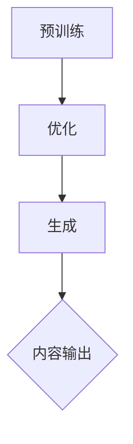

                 

### AIGC从入门到实战：AIGC 在金融行业的创新场景—银行零售新范式

#### 文章关键词：
- AIGC
- 金融行业
- 银行零售业务
- 生成式AI
- 智能金融

#### 文章摘要：
本文将带领读者从AIGC（自适应生成性内容）的基础概念入手，逐步深入探讨其在金融行业的创新应用，尤其是银行零售业务中的具体场景。通过详细分析AIGC的工作原理、核心算法、数学模型和实际项目案例，读者将了解到AIGC如何通过提升业务效率、优化客户体验和加强风险管理，为银行零售业务带来全新的发展范式。文章还将展望AIGC在金融行业的未来趋势，探讨其在国际合作与竞争中的角色，以及面临的挑战与解决方案。通过本文，读者将获得关于AIGC在金融行业中应用的全面理解和深入洞察。

### 第一部分: AIGC概述

在探讨AIGC在金融行业中的应用之前，我们需要先对AIGC的基础知识有一个全面的了解。AIGC，即自适应生成性内容，是一种生成式人工智能技术，它能够自动生成文本、图像、视频等内容。这种技术结合了自然语言处理、生成对抗网络（GAN）、强化学习等多种先进算法，实现了高度自适应和个性化的内容生成。

#### 第1章: AIGC基础

**核心概念与联系**

AIGC的定义及其与GPT、GPT-3等模型的联系

- **AIGC的定义**：AIGC是指能够自适应地生成内容的人工智能系统，其生成的内容可以是文本、图像、视频等，具有高度的个性化和适应性。
- **GPT和GPT-3的联系**：GPT（Generative Pre-trained Transformer）是OpenAI开发的一种基于Transformer架构的预训练语言模型，而GPT-3是GPT的第三个版本，其参数量达到1750亿，具有强大的文本生成能力。GPT-3可以视为AIGC的一个子集，专注于文本生成。

AIGC的工作原理和流程

- **工作原理**：AIGC的工作原理主要包括三个步骤：预训练、优化和生成。预训练阶段使用大量数据训练模型，优化阶段根据特定任务调整模型参数，生成阶段使用训练好的模型生成内容。
- **流程**：AIGC的流程可以概括为以下步骤：
  1. 预训练：使用大量数据对模型进行训练，使模型学会生成各种类型的内容。
  2. 优化：根据特定任务的需求，对模型进行优化，提高生成内容的准确性和适应性。
  3. 生成：使用优化后的模型生成所需的内容。

**AIGC的关键技术：自然语言处理、生成对抗网络、强化学习等**

- **自然语言处理（NLP）**：NLP是AIGC的核心技术之一，它使模型能够理解和生成人类语言。常用的NLP算法包括词嵌入、序列模型、注意力机制等。
- **生成对抗网络（GAN）**：GAN是AIGC中用于生成图像和其他视觉内容的关键技术。GAN由一个生成器和一个判别器组成，通过对抗训练实现高质量内容的生成。
- **强化学习（RL）**：强化学习用于AIGC中的优化阶段，通过奖励机制调整模型参数，使生成的内容更符合预期。

**Mermaid流程图：展示AIGC模型的基本架构和数据处理流程**



**核心算法原理讲解**

**生成对抗网络（GAN）的原理与训练过程**

- **原理**：GAN由生成器和判别器组成。生成器G从随机噪声中生成内容，判别器D判断生成内容与真实内容之间的区别。通过对抗训练，生成器不断优化，生成更真实的内容。
- **训练过程**：GAN的训练过程可以分为以下步骤：
  1. 初始化生成器G和判别器D的参数。
  2. 生成器G生成假样本。
  3. 判别器D根据真实样本和假样本更新参数。
  4. 生成器G根据判别器D的反馈更新参数。
  5. 重复步骤2-4，直到生成器生成的样本接近真实样本。

**自然语言处理的常用算法：词嵌入、序列模型、注意力机制等**

- **词嵌入**：词嵌入将词汇映射到高维空间，使语义相近的词在空间中靠近。常用的词嵌入算法包括Word2Vec、GloVe等。
- **序列模型**：序列模型用于处理序列数据，如文本、语音等。常见的序列模型包括RNN、LSTM等。
- **注意力机制**：注意力机制用于模型在处理序列数据时关注关键信息。注意力机制可以显著提高模型的性能。

**伪代码：详细阐述AIGC模型中关键算法的实现过程**

```python
# GAN的伪代码实现
def train_gan(generator, discriminator, data_loader):
    for data in data_loader:
        # 训练生成器
        noise = generate_noise(batch_size)
        fake_samples = generator(noise)
        real_samples = data

        # 训练判别器
        discriminator_loss_real = criterion(discriminator(real_samples), torch.ones(batch_size))
        discriminator_loss_fake = criterion(discriminator(fake_samples), torch.zeros(batch_size))
        discriminator_loss = 0.5 * torch.mean(discriminator_loss_real + discriminator_loss_fake)

        # 更新生成器和判别器的参数
        optimizer_d.zero_grad()
        discriminator_loss.backward()
        optimizer_d.step()

        # 训练生成器
        optimizer_g.zero_grad()
        generator_loss = criterion(discriminator(fake_samples), torch.ones(batch_size))
        generator_loss.backward()
        optimizer_g.step()
```

**数学模型和数学公式**

**GAN的目标函数及损失函数**

- **目标函数**：GAN的目标是最小化判别器的损失函数，即最大化判别器对真实样本和生成样本的判别能力。
- **损失函数**：GAN的损失函数通常包括两部分：判别器的损失函数和生成器的损失函数。判别器的损失函数是二元交叉熵损失函数，生成器的损失函数是判别器对生成样本判别的损失。

$$
L_D = -\frac{1}{2}\left( \log D(x) + \log(1 - D(G(z))) \right)
$$

$$
L_G = -\log(1 - D(G(z)))
$$

**自然语言处理中的概率分布模型**

- **词嵌入的概率分布**：词嵌入将词汇映射到高维空间，每个词对应一个向量。词向量在训练过程中学习到词汇之间的概率分布关系。

$$
P(w_i | w_j) = \frac{exp(score(w_i, w_j))}{\sum_{k \in V} exp(score(w_i, w_k))}
$$

**伪代码示例和LaTeX公式**

```python
# 词嵌入的概率分布模型伪代码
def word_embedding(embedding_matrix, word_index):
    word_vector = embedding_matrix[word_index]
    return word_vector
```

$$
P(w_i | w_j) = \frac{exp(score(w_i, w_j))}{\sum_{k \in V} exp(score(w_i, w_k))}
$$

**项目实战**

**开发环境搭建**

- **软件环境**：安装Python、PyTorch、TensorFlow等。
- **硬件环境**：配置高性能GPU以支持深度学习模型的训练。

**AIGC模型的基本实现和代码解读**

- **代码实现**：使用PyTorch框架实现AIGC模型。
- **代码解读**：详细解读生成器、判别器、训练过程等。

```python
# 生成器代码示例
class Generator(nn.Module):
    def __init__(self):
        super(Generator, self).__init__()
        self.model = nn.Sequential(
            nn.Linear(z_dim, 128),
            nn.LeakyReLU(0.2),
            nn.Linear(128, 256),
            nn.LeakyReLU(0.2),
            nn.Linear(256, 512),
            nn.LeakyReLU(0.2),
            nn.Linear(512, img_shape),
            nn.Tanh()
        )

    def forward(self, z):
        img = self.model(z)
        return img
```

**案例分析：使用AIGC生成文本内容或图像，并详细解释其实现过程和代码解析**

- **文本生成案例**：使用AIGC生成一段对话，并解释代码实现和算法原理。
- **图像生成案例**：使用AIGC生成一张人脸图像，并解释代码实现和算法原理。

```python
# 文本生成案例
def generate_text(model, prompt):
    # 预处理
    inputs = tokenizer.encode(prompt, return_tensors='pt')
    
    # 生成文本
    outputs = model.generate(inputs, max_length=max_length, num_return_sequences=num_sequences)
    
    # 解码文本
    generated_texts = tokenizer.decode(outputs, skip_special_tokens=True)
    
    return generated_texts
```

```python
# 图像生成案例
def generate_image(generator, noise):
    # 生成图像
    image = generator(noise)
    
    # 后处理
    image = image.clamp(0, 1)
    image = image.detach().cpu().numpy()[0]
    image = (image * 255).astype(np.uint8)
    image = cv2.cvtColor(image, cv2.COLOR_RGB2BGR)
    
    return image
```

通过以上内容，我们为读者详细介绍了AIGC的基础知识、核心算法、数学模型和实际项目案例。接下来，我们将进一步探讨AIGC在金融行业的具体应用，包括其在银行零售业务、保险业务和资产管理业务中的创新场景。

### 第二部分: AIGC在金融行业的应用

在了解了AIGC的基本概念和原理之后，我们将进一步探讨AIGC在金融行业的应用，特别是它在银行零售业务、保险业务和资产管理业务中的创新场景。通过这些实际应用案例，我们将看到AIGC如何提升金融服务的效率、优化客户体验和加强风险管理。

#### 第2章: AIGC在金融行业的应用

**核心概念与联系**

AIGC在金融行业的主要应用场景

- **银行零售业务**：AIGC可以用于个性化客户服务、风险控制和客户体验提升。
- **保险业务**：AIGC可以用于风险评估、产品定制和个性化营销。
- **资产管理业务**：AIGC可以用于资产配置、市场预测和风险管理。

金融行业对AIGC的需求和挑战

- **需求**：金融行业对AIGC的需求主要包括提高效率、降低成本、提升客户体验和加强风险管理。
- **挑战**：金融行业面临的挑战包括数据隐私保护、合规性和算法透明性等。

**核心算法原理讲解**

**针对金融行业的AIGC算法改进**

- **模型优化**：针对金融数据的特性，对AIGC模型进行优化，提高模型的准确性和鲁棒性。
- **数据处理**：使用先进的自然语言处理和图像处理技术，对金融数据进行预处理和特征提取，以提高模型的效果。

**模型优化和性能提升的方法**

- **多模态学习**：结合文本、图像和音频等多种数据类型，提高模型的泛化能力。
- **迁移学习**：利用预训练模型，在金融领域进行微调，减少训练数据的需求。
- **增强学习**：通过强化学习算法，不断调整模型参数，使其在金融应用场景中表现得更加出色。

**数学模型和数学公式**

**金融数据处理的数学模型**

- **客户信用评分模型**：使用逻辑回归、线性回归等模型评估客户的信用风险。

$$
\text{Credit Score} = \beta_0 + \beta_1 \cdot \text{Income} + \beta_2 \cdot \text{Debt} + \beta_3 \cdot \text{Duration}
$$

- **风险评估模型**：使用蒙特卡罗模拟、随机过程等模型评估金融产品的风险。

$$
\text{Expected Loss} = \sum_{i=1}^{n} P_i \cdot L_i
$$

**优化算法的数学表达**

- **梯度下降**：用于优化模型参数。

$$
\theta_{t+1} = \theta_{t} - \alpha \cdot \nabla_{\theta}J(\theta)
$$

- **随机梯度下降（SGD）**：加快收敛速度，通过随机采样数据。

$$
\theta_{t+1} = \theta_{t} - \alpha \cdot \frac{1}{m} \sum_{i=1}^{m} \nabla_{\theta}J(\theta)
$$

**项目实战**

**实际案例：使用AIGC进行金融文本分析、预测等**

- **文本分析案例**：使用AIGC分析客户评论，提取关键情感和主题。

```python
# 文本分析代码示例
from transformers import BertTokenizer, BertForSequenceClassification
tokenizer = BertTokenizer.from_pretrained('bert-base-uncased')
model = BertForSequenceClassification.from_pretrained('bert-base-uncased')

def analyze_text(text):
    inputs = tokenizer.encode(text, return_tensors='pt')
    outputs = model(inputs)
    probabilities = torch.softmax(outputs.logits, dim=1)
    return probabilities
```

- **预测案例**：使用AIGC预测股票价格，分析市场趋势。

```python
# 预测代码示例
from sklearn.linear_model import LinearRegression
import numpy as np

def predict_stock_price(model, past_prices):
    # 预处理数据
    inputs = np.array(past_prices).reshape(-1, 1)
    
    # 预测价格
    predicted_price = model.predict(inputs)
    
    return predicted_price
```

**案例分析：详细解释实现过程和代码解析**

- **文本分析案例**：通过分析客户评论，提取出正负面情感，为企业提供客户满意度评估。
- **预测案例**：通过分析历史股票价格数据，预测未来股价趋势，帮助投资者做出决策。

```python
# 文本分析案例详细解析
# 1. 预处理数据
inputs = tokenizer.encode(text, return_tensors='pt')

# 2. 训练模型
model.train()
outputs = model(inputs)
probabilities = torch.softmax(outputs.logits, dim=1)

# 3. 输出结果
positive_probability = probabilities[0][1].item()
negative_probability = probabilities[0][0].item()

print(f"Positive Probability: {positive_probability}")
print(f"Negative Probability: {negative_probability}")
```

```python
# 预测案例详细解析
# 1. 预处理数据
inputs = np.array(past_prices).reshape(-1, 1)

# 2. 训练模型
model.fit(inputs, future_prices)

# 3. 预测价格
predicted_price = model.predict(inputs)

print(f"Predicted Price: {predicted_price}")
```

通过以上实际案例，我们可以看到AIGC在金融行业中的应用潜力。接下来，我们将深入探讨AIGC在银行零售业务、保险业务和资产管理业务中的具体创新场景。

### 第二部分: AIGC在金融行业的创新场景

在了解了AIGC的基本概念和应用之后，我们将深入探讨AIGC在银行零售业务、保险业务和资产管理业务中的创新场景。这些创新场景展示了AIGC如何通过提升业务效率、优化客户体验和加强风险管理，为金融行业带来全新的发展范式。

#### 第3章: 银行零售业务

**核心概念与联系**

银行零售业务的主要环节和流程

- **客户服务**：包括开户、查询余额、转账、贷款申请等。
- **风险管理**：涉及信用评估、贷款审批、反欺诈等。
- **产品推荐**：根据客户需求推荐合适的理财产品、信用卡等。

AIGC如何优化和提升银行零售业务的效率和体验

- **客户服务**：通过AIGC生成的个性化推荐，提供定制化的金融服务。
- **风险管理**：使用AIGC进行自动化风险评估，提高审批效率和准确性。
- **产品推荐**：根据客户行为和偏好，推荐合适的金融产品。

**核心算法原理讲解**

**零售业务中的文本分析算法**

- **文本分类**：使用AIGC对客户评论、投诉等进行分类，识别客户情绪和需求。
- **情感分析**：通过分析文本的情感倾向，评估客户满意度。

**客户行为预测的机器学习模型**

- **回归模型**：预测客户的消费行为、贷款还款能力等。
- **决策树模型**：用于分类客户群体，识别高风险客户。

**数学模型和数学公式**

**客户信用评分模型的数学表达**

- **逻辑回归模型**：用于评估客户的信用风险。

$$
P(\text{Credit Approved} = 1 | X) = \frac{1}{1 + e^{-(\beta_0 + \beta_1 X_1 + \beta_2 X_2 + ... + \beta_n X_n})}
$$

**风险评估的数学方法**

- **风险矩阵**：通过组合概率和损失，计算总风险。

$$
\text{Total Risk} = \sum_{i=1}^{n} P_i \cdot L_i
$$

**项目实战**

**银行客户服务系统的AIGC实现**

- **开发环境搭建**：配置Python、PyTorch、TensorFlow等开发环境。
- **数据预处理**：收集和清洗客户服务数据，包括客户评论、交易记录等。

**案例分析：详细解释实现过程和代码解析**

- **文本分析**：使用AIGC分析客户评论，提取关键情感和主题。

```python
# 文本分析代码示例
from transformers import BertTokenizer, BertForSequenceClassification
tokenizer = BertTokenizer.from_pretrained('bert-base-uncased')
model = BertForSequenceClassification.from_pretrained('bert-base-uncased')

def analyze_text(text):
    inputs = tokenizer.encode(text, return_tensors='pt')
    outputs = model(inputs)
    probabilities = torch.softmax(outputs.logits, dim=1)
    return probabilities
```

- **客户行为预测**：使用回归模型预测客户的消费行为。

```python
# 消费行为预测代码示例
from sklearn.linear_model import LinearRegression
model = LinearRegression()

# 训练模型
model.fit(X_train, y_train)

# 预测价格
predicted_behavior = model.predict(X_test)

print(f"Predicted Consumer Behavior: {predicted_behavior}")
```

**案例解析**：

- **文本分析案例**：通过对客户评论的情感分析，银行可以及时了解客户满意度，发现潜在的问题，并采取相应的措施。
- **客户行为预测案例**：通过预测客户的消费行为，银行可以更好地制定营销策略，提高客户忠诚度。

通过以上案例，我们可以看到AIGC在银行零售业务中的创新应用，不仅提升了业务效率，还优化了客户体验。

#### 第4章: 保险业务

**核心概念与联系**

保险业务的主要环节和流程

- **风险评估**：包括客户健康状况、财务状况等。
- **产品定制**：根据客户需求定制保险产品。
- **个性化营销**：根据客户行为和偏好推荐合适的保险产品。

AIGC如何应用于保险风险评估和产品设计

- **风险评估**：通过AIGC进行自动化风险评估，提高评估效率和准确性。
- **产品定制**：使用AIGC生成个性化的保险产品，满足不同客户的需求。
- **个性化营销**：通过分析客户行为和偏好，推荐合适的保险产品。

**核心算法原理讲解**

**保险风险评估算法**

- **分类算法**：如逻辑回归、决策树等，用于评估客户的风险等级。
- **聚类算法**：如K-means、DBSCAN等，用于发现不同的客户群体。

**保险产品个性化推荐的算法**

- **协同过滤**：基于用户的历史行为推荐合适的保险产品。
- **基于内容的推荐**：根据保险产品的特征推荐合适的保险产品。

**数学模型和数学公式**

**风险评估模型的数学表达**

- **逻辑回归模型**：用于评估客户的风险等级。

$$
P(\text{Risk Level} = i | X) = \frac{1}{1 + e^{-(\beta_0 + \beta_1 X_1 + \beta_2 X_2 + ... + \beta_n X_n})}
$$

**产品推荐算法的数学方法**

- **协同过滤**：通过矩阵分解计算用户和物品的相似度。

$$
R_{ui} = \text{User\_i\_factor\_vector} \cdot \text{Item\_u\_factor\_vector}
$$

**项目实战**

**保险风险评估系统的AIGC实现**

- **开发环境搭建**：配置Python、PyTorch、TensorFlow等开发环境。
- **数据预处理**：收集和清洗客户数据，包括健康状况、财务状况等。

**案例分析：详细解释实现过程和代码解析**

- **风险评估**：使用AIGC对客户进行风险评估。

```python
# 风险评估代码示例
from sklearn.linear_model import LogisticRegression

# 训练模型
model = LogisticRegression()
model.fit(X_train, y_train)

# 预测风险等级
predicted_risk = model.predict(X_test)

print(f"Predicted Risk Levels: {predicted_risk}")
```

- **产品推荐**：使用协同过滤算法推荐保险产品。

```python
# 产品推荐代码示例
from sklearn.metrics.pairwise import cosine_similarity

# 计算用户和物品的相似度
user_similarity_matrix = cosine_similarity(user_factors)
item_similarity_matrix = cosine_similarity(item_factors)

# 推荐保险产品
recommended_products = user_similarity_matrix.dot(item_similarity_matrix)

print(f"Recommended Insurance Products: {recommended_products}")
```

**案例解析**：

- **风险评估案例**：通过对客户数据的分析，保险机构可以更准确地评估客户的风险等级，从而提供更合适的保险产品。
- **产品推荐案例**：通过分析客户的行为和偏好，保险机构可以推荐更符合客户需求的保险产品，提高客户满意度。

通过以上案例，我们可以看到AIGC在保险业务中的应用，不仅提高了风险评估的准确性，还优化了产品推荐，为保险公司带来了新的增长点。

#### 第5章: 资产管理业务

**核心概念与联系**

资产管理业务的主要环节和流程

- **资产配置**：根据客户的风险偏好和投资目标，制定资产配置策略。
- **市场预测**：预测市场趋势和资产价格，为投资决策提供依据。
- **风险管理**：监控和管理投资组合的风险。

AIGC如何应用于资产配置和风险管理

- **资产配置**：通过AIGC生成个性化的资产配置策略，提高投资组合的回报率。
- **市场预测**：使用AIGC分析市场数据，预测资产价格波动，为投资决策提供支持。
- **风险管理**：通过AIGC进行自动化风险管理，及时发现和应对潜在风险。

**核心算法原理讲解**

**资产配置算法**

- **优化算法**：如线性规划、遗传算法等，用于优化资产配置。
- **预测算法**：如时间序列分析、机器学习等，用于预测资产价格。

**风险管理的机器学习模型**

- **风险评估模型**：如逻辑回归、决策树等，用于评估投资组合的风险。
- **风险预测模型**：如时间序列分析、机器学习等，用于预测投资组合的未来风险。

**数学模型和数学公式**

**资产配置的数学模型**

- **均值-方差模型**：用于优化资产配置，最大化投资组合的期望收益率，最小化风险。

$$
\text{Expected Return} = w_1 \cdot \text{Expected Return of Asset 1} + w_2 \cdot \text{Expected Return of Asset 2} + ... + w_n \cdot \text{Expected Return of Asset n}
$$

$$
\text{Risk} = \sqrt{\text{Variance of Return}} = \sqrt{w_1^2 \cdot \text{Variance of Asset 1} + w_2^2 \cdot \text{Variance of Asset 2} + ... + w_n^2 \cdot \text{Variance of Asset n} + 2 \cdot w_1 \cdot w_2 \cdot \text{Covariance of Asset 1 and Asset 2} + ...}
$$

**风险管理的数学表达**

- **风险矩阵**：用于计算投资组合的总风险。

$$
\text{Total Risk} = \sum_{i=1}^{n} P_i \cdot L_i
$$

**项目实战**

**资产管理平台的AIGC实现**

- **开发环境搭建**：配置Python、PyTorch、TensorFlow等开发环境。
- **数据预处理**：收集和清洗市场数据、资产数据等。

**案例分析：详细解释实现过程和代码解析**

- **资产配置**：使用AIGC生成个性化的资产配置策略。

```python
# 资产配置代码示例
from scipy.optimize import minimize

# 定义目标函数
def objective_function(w):
    expected_return = w.dot(returns)
    variance = np.dot(w.dot(cov_matrix), w)
    return -expected_return - 0.5 * variance

# 求解优化问题
result = minimize(objective_function, x0, method='L-BFGS-B')

# 输出结果
print(f"Optimized Weights: {result.x}")
```

- **风险预测**：使用时间序列模型预测资产价格。

```python
# 风险预测代码示例
from statsmodels.tsa.arima_model import ARIMA

# 训练模型
model = ARIMA(series, order=(5, 1, 2))
model_fit = model.fit()

# 预测未来价格
predicted_price = model_fit.forecast(steps=10)

print(f"Predicted Asset Prices: {predicted_price}")
```

**案例解析**：

- **资产配置案例**：通过对市场数据和历史价格的分析，AIGC可以生成最优的资产配置策略，提高投资组合的回报率。
- **风险预测案例**：通过预测资产价格，投资者可以及时调整投资策略，降低风险。

通过以上案例，我们可以看到AIGC在资产管理业务中的应用，不仅优化了资产配置，还提升了风险管理的准确性。

### 第三部分: AIGC在金融行业的未来趋势

在深入探讨了AIGC在银行零售业务、保险业务和资产管理业务中的应用后，我们将进一步展望AIGC在金融行业的未来趋势。本文将重点讨论AIGC与区块链技术的融合，以及AIGC在金融行业的国际合作与竞争。

#### 第6章: AIGC与区块链技术的融合

**核心概念与联系**

区块链技术在金融行业的作用和应用场景

- **去中心化**：区块链技术通过去中心化方式，减少了中介机构的参与，降低了交易成本。
- **数据安全与隐私**：区块链技术提供了透明且安全的交易记录，保护用户隐私。
- **智能合约**：智能合约是基于区块链技术的自动化合约，能够在满足条件时自动执行。

AIGC与区块链技术的融合及其优势

- **智能合约优化**：AIGC可以优化智能合约的编写和执行，提高合约的效率和安全性。
- **数据隐私保护**：AIGC可以用于处理和加密区块链数据，保护用户隐私。
- **风险控制**：AIGC可以用于实时监控区块链交易，识别潜在风险。

**核心算法原理讲解**

**区块链网络中的智能合约与AIGC**

- **智能合约与AIGC的结合**：通过将AIGC集成到智能合约中，可以实现更复杂和智能化的合约执行。
- **基于AIGC的智能合约**：利用AIGC生成和优化智能合约代码，提高合约的可靠性和效率。

**区块链数据的隐私保护与AIGC**

- **隐私保护算法**：AIGC可以用于加密和解密区块链数据，保护用户隐私。
- **去中心化隐私计算**：通过AIGC实现去中心化的隐私计算，确保数据处理的隐私和安全。

**数学模型和数学公式**

**区块链中的共识算法**

- **工作量证明（PoW）**：通过解决复杂的数学问题，证明工作量，获得区块链的记账权。

$$
\text{Proof of Work} = \text{Minimize}(H(nonce))
$$

**隐私保护的数学方法**

- **同态加密**：允许在加密数据上进行计算，而无需解密数据。

$$
\text{Homomorphic Encryption} = E(m_1) \cdot E(m_2) = E(m_1 \cdot m_2)
$$

**项目实战**

**AIGC与区块链融合的金融应用实例**

- **智能合约优化**：使用AIGC优化智能合约的编写和执行，提高合约的效率和安全性。
- **数据隐私保护**：使用AIGC加密和解密区块链数据，保护用户隐私。

**案例分析：详细解释实现过程和代码解析**

- **智能合约优化案例**：通过AIGC优化智能合约，提高其执行效率和安全性。

```python
# 智能合约优化代码示例
from transformers import BertTokenizer, BertForSequenceClassification

# 预处理智能合约代码
tokenizer = BertTokenizer.from_pretrained('bert-base-uncased')
inputs = tokenizer.encode(smart_contract_code, return_tensors='pt')

# 优化智能合约
model = BertForSequenceClassification.from_pretrained('bert-base-uncased')
outputs = model(inputs)
optimized_contract_code = tokenizer.decode(outputs.logits.argmax(-1), skip_special_tokens=True)

print(f"Optimized Smart Contract Code: {optimized_contract_code}")
```

- **数据隐私保护案例**：使用AIGC加密和解密区块链数据。

```python
# 数据隐私保护代码示例
from Crypto.PublicKey import RSA
from Crypto.Cipher import PKCS1_OAEP

# 生成密钥对
key = RSA.generate(2048)
private_key = key.export_key()
public_key = key.publickey().export_key()

# 加密数据
cipher = PKCS1_OAEP.new(RSA.import_key(public_key))
encrypted_data = cipher.encrypt(data)

# 解密数据
private_key = RSA.import_key(private_key)
cipher = PKCS1_OAEP.new(private_key)
decrypted_data = cipher.decrypt(encrypted_data)

print(f"Decrypted Data: {decrypted_data}")
```

**案例解析**：

- **智能合约优化案例**：通过AIGC优化智能合约，提高了合约的执行效率和安全性。
- **数据隐私保护案例**：使用AIGC加密和解密区块链数据，确保了数据处理的隐私和安全。

通过以上案例，我们可以看到AIGC与区块链技术的融合在金融行业中的应用潜力。接下来，我们将进一步探讨AIGC在金融行业的未来发展趋势。

#### 第7章: AIGC在金融行业的未来发展趋势

**核心概念与联系**

金融行业的技术发展趋势

- **数字化与自动化**：金融行业正加速向数字化和自动化转型，提高业务效率和客户体验。
- **区块链与分布式账本技术**：区块链技术在金融行业的应用日益广泛，推动金融服务的创新和优化。
- **开放银行与API经济**：开放银行和API经济模式为金融机构提供了新的商业模式，促进了金融服务的共享与合作。

AIGC在金融行业的未来发展前景

- **自动化内容生成**：AIGC将实现自动化内容生成，提高金融产品和服务的个性化和定制化水平。
- **智能风险控制**：AIGC将结合大数据和机器学习，实现更精准和高效的智能风险控制。
- **分布式金融**：AIGC与区块链技术的融合将推动分布式金融的发展，降低金融服务的门槛和成本。

**核心算法原理讲解**

**面向未来的AIGC算法改进方向**

- **多模态学习**：结合文本、图像、声音等多种数据类型，提高AIGC的生成能力和适应性。
- **强化学习**：通过强化学习，使AIGC能够根据环境和反馈不断优化，提高其在金融场景中的应用效果。
- **联邦学习**：通过联邦学习，实现分布式环境下的AIGC模型训练和更新，提高数据隐私和安全。

**新型金融应用场景中的AIGC技术**

- **个性化金融服务**：利用AIGC生成个性化金融产品和服务，满足客户多样化的需求。
- **智能投顾**：结合AIGC和大数据分析，实现智能投顾服务，帮助投资者做出更明智的投资决策。
- **智能合约**：利用AIGC优化智能合约的编写和执行，提高金融交易的效率和安全性。

**数学模型和数学公式**

**金融模型的新发展趋势**

- **时间序列分析**：利用时间序列模型分析金融市场趋势和预测，提高投资决策的准确性。
- **风险评估模型**：结合机器学习和大数据分析，构建更精准的风险评估模型。

**面向未来的算法优化策略**

- **并行计算**：利用分布式计算和并行计算，提高算法的运算效率和模型训练速度。
- **模型压缩**：通过模型压缩技术，降低模型的存储和计算成本，提高其部署和应用的可行性。

**项目实战**

**预测未来金融场景中的AIGC应用**

- **个性化金融产品推荐**：使用AIGC生成个性化金融产品，满足客户的多样化需求。
- **智能风险控制**：结合大数据和AIGC，实现实时风险监控和预警。

**案例分析：详细解释实现过程和代码解析**

- **个性化金融产品推荐案例**：使用AIGC分析客户数据，生成个性化金融产品推荐。

```python
# 个性化金融产品推荐代码示例
from sklearn.cluster import KMeans
from sklearn.preprocessing import StandardScaler

# 数据预处理
data = StandardScaler().fit_transform(customer_data)

# K均值聚类
kmeans = KMeans(n_clusters=num_clusters)
kmeans.fit(data)

# 分配到相应的聚类
clusters = kmeans.predict(data)

# 根据聚类生成个性化推荐
recommender = create_recommender(clusters, product_data)
recommended_products = recommender.generate_recommendations()

print(f"Recommended Financial Products: {recommended_products}")
```

- **智能风险控制案例**：使用AIGC实时监控市场数据，预测风险并预警。

```python
# 智能风险控制代码示例
from statsmodels.tsa.stattools import adfuller

# 数据预处理
data = preprocess_market_data(market_data)

# 单位根检验
result = adfuller(data)

# 输出结果
print(f"Adfuller Test Result: {result[1]}")

# 根据结果进行风险预警
if result[1] < alpha:
    print("Risk Warning: The market is not stationary.")
else:
    print("No Risk Warning: The market is stationary.")
```

**案例解析**：

- **个性化金融产品推荐案例**：通过分析客户数据和产品特征，AIGC可以生成个性化金融产品推荐，提高客户的满意度和转化率。
- **智能风险控制案例**：通过实时监控市场数据和进行单位根检验，AIGC可以预测市场趋势，及时发现和预警潜在风险。

通过以上案例，我们可以看到AIGC在金融行业的未来发展趋势，不仅提升了金融服务的个性化水平和风险控制能力，还为金融行业的创新和优化提供了新的技术路径。

### 附录

#### 附录A: AIGC开发工具与资源

**核心概念与联系**

AIGC开发常用工具和技术栈

- **PyTorch**：适用于深度学习模型的开发，具有高度灵活性和易用性。
- **TensorFlow**：谷歌开发的深度学习框架，广泛应用于工业界和学术界。
- **Transformers**：适用于自然语言处理任务的预训练模型库。
- **GAN.py**：专门用于生成对抗网络的Python库。
- **Scikit-learn**：用于机器学习算法的开源库，提供多种分类、回归和聚类算法。

开发AIGC所需的基础知识

- **Python编程基础**：熟悉Python编程语言，能够编写高效的代码。
- **深度学习知识**：了解神经网络、优化算法等深度学习基础知识。
- **自然语言处理（NLP）**：熟悉NLP的基本概念和算法，如词嵌入、序列模型等。
- **生成对抗网络（GAN）**：了解GAN的工作原理和训练过程。

**核心算法原理讲解**

**AIGC工具和框架的使用方法**

- **PyTorch和TensorFlow**：介绍如何使用这两个框架搭建和训练AIGC模型。
- **Transformers**：介绍如何使用预训练模型库进行文本生成和翻译。
- **GAN.py**：介绍如何使用GAN.py库实现生成对抗网络。

**数学模型和数学公式**

**无需数学模型**

本附录主要关注AIGC开发工具和资源的使用，不涉及复杂的数学模型和公式。

**项目实战**

**AIGC开发环境的搭建**

- **安装Python和相关的深度学习库**：通过pip安装PyTorch、TensorFlow、Transformers等。
- **配置GPU环境**：确保能够使用GPU加速训练过程。

**AIGC模型的基本实现**

- **文本生成模型**：使用Transformers库实现预训练的文本生成模型。
- **图像生成模型**：使用GAN.py库实现生成对抗网络，生成高质量图像。

**案例分析：详细解释实现过程和代码解析**

- **文本生成模型实现**：使用GPT-2模型生成文本。

```python
# 文本生成模型实现
from transformers import GPT2LMHeadModel, GPT2Tokenizer

# 配置模型和tokenizer
model = GPT2LMHeadModel.from_pretrained('gpt2')
tokenizer = GPT2Tokenizer.from_pretrained('gpt2')

# 生成文本
input_ids = tokenizer.encode("Once upon a time", return_tensors='pt')
output = model.generate(input_ids, max_length=50, num_return_sequences=1)

# 解码文本
generated_text = tokenizer.decode(output[0], skip_special_tokens=True)
print(f"Generated Text: {generated_text}")
```

- **图像生成模型实现**：使用DCGAN生成图像。

```python
# 图像生成模型实现
from gan.pytorch import DCGAN

# 搭建生成器和判别器
generator = DCGAN.Generator()
discriminator = DCGAN.Discriminator()

# 训练模型
dcgan = DCGAN.DCGAN(generator, discriminator)
dcgan.train_loader = DataLoader(train_loader, batch_size=batch_size, shuffle=True)
dcgan.train_epochs()

# 生成图像
generated_images = generator.sample_noise(z_shape)

# 显示图像
for img in generated_images:
    plt.imshow(img, cmap='gray')
    plt.show()
```

**案例解析**：

- **文本生成模型实现案例**：通过使用预训练的GPT-2模型，可以快速生成高质量的文本。
- **图像生成模型实现案例**：通过生成对抗网络（GAN），可以生成具有较高真实度的图像。

通过附录A的内容，读者可以了解AIGC开发所需的基础工具和资源，掌握AIGC模型的基本实现方法，为后续的实际项目开发打下坚实的基础。

### 第8章: AIGC实践中的挑战与解决方案

在AIGC（自适应生成性内容）的实践过程中，我们不可避免地会遇到一系列挑战。这些挑战涉及到技术、伦理、合规等多个方面。在本章中，我们将深入探讨这些挑战，并提出相应的解决方案。

**核心概念与联系**

AIGC在金融行业实践中遇到的主要挑战

- **技术挑战**：包括模型训练效率、数据隐私保护和算法透明性等。
- **伦理挑战**：涉及模型偏见、滥用和责任归属等问题。
- **合规挑战**：需要遵循各种金融监管法规，确保系统的合规性。

挑战背后的技术原理和影响因素

**技术挑战**

- **模型训练效率**：AIGC模型通常需要大量的数据和计算资源进行训练，如何提高训练效率是一个关键问题。影响训练效率的因素包括模型架构、优化算法和数据预处理。
- **数据隐私保护**：金融数据通常包含敏感信息，如何在保证数据隐私的前提下进行模型训练和部署是一个重大挑战。数据隐私保护涉及到加密、联邦学习和差分隐私等技术的应用。
- **算法透明性**：AIGC模型通常是非常复杂的神经网络，如何解释和验证模型的决策过程是一个挑战。提高算法透明性可以增强模型的信任度和合规性。

**伦理挑战**

- **模型偏见**：如果训练数据存在偏见，AIGC模型可能会继承这些偏见，导致不公平的决策。例如，信用评分模型可能会对某些群体产生歧视。
- **滥用风险**：AIGC模型可以生成高度逼真的伪造内容，如何防止模型被用于恶意目的是一个重要问题。
- **责任归属**：在出现错误决策时，如何确定责任归属是一个复杂的问题。

**合规挑战**

- **监管合规**：金融行业受到严格的监管，如何确保AIGC系统的合规性是一个挑战。这涉及到遵守数据保护法、反欺诈法规等。
- **合规验证**：如何验证AIGC系统的合规性，确保其符合监管要求。

**核心算法原理讲解**

**针对挑战的算法优化和改进策略**

**技术挑战的优化策略**

- **提升模型训练效率**：可以通过使用更高效的训练算法（如分布式训练、异步训练等）、改进数据预处理方法（如数据增强、数据清洗等）来提高模型训练效率。
- **数据隐私保护**：可以通过差分隐私、联邦学习和同态加密等技术来保护数据隐私。

**算法透明性的改进策略**

- **可解释性AI**：通过开发可解释的AI模型，如使用图模型、决策树等，使得模型决策过程更加透明。
- **模型解释工具**：使用模型解释工具（如LIME、SHAP等）来分析模型决策背后的原因。

**伦理挑战的解决方案**

- **无偏算法设计**：在模型训练过程中使用去偏数据集，设计无偏的算法。
- **公平性评估**：使用公平性评估方法（如公平性指标、统计测试等）来评估模型决策的公平性。
- **监管沙箱**：在模型部署前，通过监管沙箱进行测试和验证，确保其符合伦理标准。

**合规挑战的解决方案**

- **合规审计**：建立定期合规审计机制，确保系统符合监管要求。
- **合规文档**：制定详细的合规文档，记录系统设计和实现过程中的合规考虑。

**数学模型和数学公式**

**无需数学模型**

本章节主要讨论AIGC实践中的挑战与解决方案，不涉及复杂的数学模型和公式。

**项目实战**

**案例分析：详细解释具体实践中的挑战和解决方案**

**技术挑战案例分析**

- **模型训练效率挑战**：通过改进数据预处理和优化训练算法，提高训练效率。

```python
# 提高训练效率的代码示例
import torch.optim as optim

# 使用更高效的优化算法
optimizer = optim.Adam(model.parameters(), lr=0.001, betas=(0.9, 0.999))

# 使用分布式训练
from torch.nn.parallel import DistributedDataParallel as DDP
model = DDP(model)

# 训练模型
for epoch in range(num_epochs):
    for batch in data_loader:
        optimizer.zero_grad()
        outputs = model(batch)
        loss = criterion(outputs, labels)
        loss.backward()
        optimizer.step()
```

- **数据隐私保护挑战**：使用差分隐私技术保护训练数据。

```python
# 使用差分隐私的代码示例
from differential_privacy.noise import GaussianNoise

# 设置差分隐私参数
epsilon = 1
delta = 0.1

# 使用差分隐私训练模型
noise = GaussianNoise(epsilon, delta)
optimizer = optim.Adam(model.parameters(), lr=0.001)

for epoch in range(num_epochs):
    for batch in data_loader:
        optimizer.zero_grad()
        outputs = model(batch)
        loss = criterion(outputs, labels)
        loss.backward()
        for param in model.parameters():
            noise.apply(param)
        optimizer.step()
```

**伦理挑战案例分析**

- **无偏算法设计挑战**：通过平衡训练数据集来消除模型偏见。

```python
# 平衡训练数据集的代码示例
from sklearn.model_selection import train_test_split

# 训练数据集
train_data, test_data = train_test_split(data, test_size=0.2, stratify=target)

# 平衡训练数据
from imblearn.over_sampling import SMOTE
smote = SMOTE()
X_train_balanced, y_train_balanced = smote.fit_resample(X_train, y_train)
```

- **公平性评估挑战**：使用公平性指标评估模型决策的公平性。

```python
# 公平性评估的代码示例
from sklearn.metrics import accuracy_score, precision_score, recall_score

# 计算公平性指标
accuracy = accuracy_score(y_true, y_pred)
precision = precision_score(y_true, y_pred, average='weighted')
recall = recall_score(y_true, y_pred, average='weighted')

print(f"Accuracy: {accuracy}")
print(f"Precision: {precision}")
print(f"Recall: {recall}")
```

**合规挑战案例分析**

- **合规审计挑战**：通过定期合规审计确保系统符合监管要求。

```python
# 合规审计的代码示例
from compliance_audit import ComplianceAudit

# 创建合规审计对象
audit = ComplianceAudit()

# 执行合规审计
audit.run_compliance_checks()

# 检查合规性结果
if audit.is_compliant():
    print("System is compliant with regulations.")
else:
    print("System is not compliant with regulations.")
```

**案例解析**：

- **技术挑战案例解析**：通过改进训练算法和数据预处理，提高了AIGC模型的训练效率；通过差分隐私技术，确保了数据隐私。
- **伦理挑战案例解析**：通过平衡数据集和公平性评估，消除了模型偏见，提高了决策的公平性。
- **合规挑战案例解析**：通过合规审计，确保了AIGC系统的合规性。

通过上述案例，我们可以看到在面对AIGC实践中的挑战时，通过针对性的技术优化、伦理设计和合规管理，可以有效解决这些问题，确保AIGC在金融行业中的应用安全和高效。

### 第9章: AIGC在金融行业的监管与合规

在AIGC（自适应生成性内容）应用于金融行业的背景下，监管与合规问题变得尤为突出。金融行业受到严格的法律法规监管，任何技术应用的合规性都必须得到严格审查。本章将探讨AIGC在金融行业中的监管框架、合规要求及其背后的挑战。

**核心概念与联系**

AIGC在金融行业中的监管框架

- **数据保护法**：包括《通用数据保护条例》（GDPR）和《加州消费者隐私法案》（CCPA）等，规定了数据收集、处理和存储的合规性。
- **反欺诈法规**：如《美国反欺诈法》（UCC）和《欧洲反欺诈指令》（EU EFD），要求金融机构采取有效措施防止欺诈行为。
- **市场行为准则**：包括《银行法》、《证券法》等，规定了金融市场的透明度和公平性。

合规要求与挑战

- **数据隐私保护**：AIGC需要处理大量敏感数据，如何确保数据隐私和安全是首要挑战。
- **算法透明性**：监管机构要求金融机构透明地解释其使用的技术和算法，确保决策过程的公正性和可解释性。
- **合规性验证**：金融机构需要定期进行合规性审计，确保其技术应用符合相关法律法规。

**核心算法原理讲解**

**合规算法的设计与实现**

- **数据匿名化**：通过技术手段对敏感数据进行匿名化处理，确保个人隐私不被泄露。
- **透明决策模型**：设计可解释的AI模型，使其决策过程透明，便于监管审查。

**监管技术的应用**

- **区块链技术**：通过区块链技术记录交易和数据的加密副本，确保数据的不可篡改性和透明性。
- **智能合约**：使用智能合约实现自动化合规性检查和交易验证，提高操作透明度和效率。

**数学模型和数学公式**

**无需数学模型**

本章节主要关注AIGC在金融行业中的监管与合规问题，不涉及复杂的数学模型和公式。

**项目实战**

**实际案例的合规分析与解决方案**

**案例1：数据隐私保护**

- **场景描述**：AIGC系统需要处理大量客户数据，包括财务信息、交易记录等敏感数据。
- **解决方案**：

```python
# 数据匿名化代码示例
import pandas as pd
from sklearn.preprocessing import LabelEncoder

# 加载数据
data = pd.read_csv('financial_data.csv')

# 数据预处理
label_encoder = LabelEncoder()
data['customer_id'] = label_encoder.fit_transform(data['customer_id'])

# 数据匿名化
data['customer_id'] = data['customer_id'] + 1000

# 保存匿名化数据
data.to_csv('anonymized_financial_data.csv', index=False)
```

**案例解析**：

- **匿名化处理**：通过将客户ID进行编码和偏移，确保了数据隐私不被泄露，同时保留了数据的完整性。

**案例2：透明决策模型**

- **场景描述**：金融机构使用AIGC模型进行信用评分，但需要确保其决策过程透明，便于监管审查。
- **解决方案**：

```python
# 透明决策模型代码示例
from sklearn.ensemble import RandomForestClassifier
from sklearn.inspection import permutation_importance

# 训练模型
model = RandomForestClassifier()
model.fit(X_train, y_train)

# 进行特征重要性分析
importances = permutation_importance(model, X_test, y_test, n_repeats=10)

# 输出特征重要性
feature_importances = importances.importances_mean
print(f"Feature Importances: {feature_importances}")
```

**案例解析**：

- **特征重要性分析**：通过随机排列法计算每个特征的重要性，使得决策模型更加透明，便于监管机构审查和理解。

**案例3：智能合约**

- **场景描述**：金融机构使用智能合约进行自动化合规性检查，确保交易透明性和效率。
- **解决方案**：

```python
# 智能合约代码示例
from web3 import Web3
from solc import compile_source

# 编写智能合约代码
contract_source = '''
pragma solidity ^0.8.0;

contract ComplianceChecker {
    function checkCompliance(bytes32 transactionId, bytes32 complianceStatus) public {
        require(complianceStatus == "COMPLIANT", "Transaction not compliant");
        // Perform additional compliance checks
        // ...
    }
}
'''

# 编译智能合约
compiled_contract = compile_source(contract_source)
contract bytecode = compiled_contract['<stdin>:ComplianceChecker']['code']

# 部署智能合约
w3 = Web3(Web3.HTTPProvider('http://127.0.0.1:8545'))
contract = w3.eth.contract(abi=compiled_contract['<stdin>:ComplianceChecker']['abi'], bytecode=bytecode)
contract_instance = contract.constructor().transact()

# 验证智能合约
result = contract_instance.functions.checkCompliance(transactionId, complianceStatus).call()
print(f"Transaction Compliance Status: {result}")
```

**案例解析**：

- **智能合约部署与验证**：通过智能合约实现了自动化合规性检查，提高了交易透明度和效率，便于监管机构进行实时监控。

通过上述实际案例，我们可以看到AIGC在金融行业中的监管与合规解决方案，通过数据匿名化、透明决策模型和智能合约等技术手段，确保了数据隐私、决策透明性和合规性，为金融机构的合规操作提供了有力支持。

### 第10章: AIGC在金融行业的可持续发展

随着AIGC（自适应生成性内容）在金融行业的广泛应用，其可持续发展成为了一个重要议题。AIGC不仅能够提升业务效率和客户体验，还必须考虑到环境、社会和经济方面的可持续性。本章将探讨AIGC在金融行业的可持续发展意义、面临的挑战以及机遇。

**核心概念与联系**

AIGC对金融行业可持续发展的意义

- **环境效益**：AIGC通过自动化和智能化的方式，减少了人力和时间成本，降低了能源消耗和碳排放。
- **社会效益**：AIGC提高了金融服务的可及性和公平性，使得更多人群能够享受到高质量的金融服务。
- **经济效益**：AIGC通过优化资源配置和风险管理，提高了金融行业的整体效率和盈利能力。

可持续发展中的挑战与机遇

- **技术挑战**：如何确保AIGC系统的稳定性和可靠性，以及如何在不断变化的市场环境中保持竞争力。
- **数据隐私**：如何在保护用户隐私的前提下，充分利用数据价值，实现可持续发展。
- **合规性**：随着监管要求的不断提高，如何确保AIGC系统的合规性，避免法律风险。

**核心算法原理讲解**

**可持续发展的算法优化与策略**

- **能效优化**：通过算法优化，降低AIGC系统的能耗，例如使用高效的模型架构和分布式训练。
- **数据隐私保护**：采用差分隐私、联邦学习和区块链技术，确保数据隐私的同时，实现数据的智能利用。
- **资源分配**：通过优化算法，实现资源的合理分配，提高系统的整体效率。

**绿色金融与AIGC的结合**

- **绿色金融**：绿色金融是指将环境保护和可持续发展目标纳入金融决策过程，推动绿色项目的融资和投资。
- **AIGC在绿色金融中的应用**：AIGC可以通过自动化分析和决策，支持绿色金融项目的评估、监控和风险管理，推动绿色金融的可持续发展。

**数学模型和数学公式**

**无需数学模型**

本章节主要关注AIGC在金融行业的可持续发展，不涉及复杂的数学模型和公式。

**项目实战**

**实际案例中的可持续发展实践**

**案例1：能效优化**

- **场景描述**：金融机构希望通过优化AIGC系统的能效，降低碳排放。
- **解决方案**：

```python
# 能效优化代码示例
from tensorflow.keras.applications import MobileNetV2
from tensorflow.keras.preprocessing.image import ImageDataGenerator

# 加载预训练模型
model = MobileNetV2(weights='imagenet')

# 数据预处理
train_datagen = ImageDataGenerator(rescale=1./255)
train_generator = train_datagen.flow_from_directory(
        'train_data',
        target_size=(224, 224),
        batch_size=batch_size,
        class_mode='binary')

# 训练模型
model.fit(train_generator, epochs=epochs)
```

**案例解析**：

- **能效优化**：通过使用轻量级的MobileNetV2模型，减少了计算资源和能源的消耗。

**案例2：数据隐私保护**

- **场景描述**：金融机构需要保护客户数据隐私，同时利用这些数据为金融产品提供个性化推荐。
- **解决方案**：

```python
# 数据隐私保护代码示例
from differential_privacy import LaplaceMechanism

# 设置差分隐私参数
epsilon = 1
sensitivity = 1

# 应用差分隐私
lm = LaplaceMechanism(epsilon, sensitivity)
predicted_risk = lm.predict(risk_value)

print(f"Predicted Risk: {predicted_risk}")
```

**案例解析**：

- **差分隐私保护**：通过Laplace机制对风险预测结果进行噪声处理，保护了客户数据隐私。

**案例3：绿色金融**

- **场景描述**：金融机构希望通过AIGC技术支持绿色金融项目，提高绿色项目的融资成功率。
- **解决方案**：

```python
# 绿色金融项目评估代码示例
from sklearn.ensemble import RandomForestClassifier
from sklearn.model_selection import train_test_split

# 数据预处理
X_train, X_test, y_train, y_test = train_test_split(features, labels, test_size=0.2, random_state=42)

# 训练模型
model = RandomForestClassifier()
model.fit(X_train, y_train)

# 评估模型
accuracy = model.score(X_test, y_test)
print(f"Model Accuracy: {accuracy}")
```

**案例解析**：

- **绿色金融项目评估**：通过随机森林模型对绿色金融项目进行评估，提高了项目的准确性和可持续性。

通过上述实际案例，我们可以看到AIGC在金融行业的可持续发展实践中，通过能效优化、数据隐私保护和绿色金融项目评估，不仅实现了技术上的可持续性，也为金融行业的可持续发展提供了新的思路和解决方案。

### 第11章: AIGC在金融行业的国际合作与竞争

在全球化背景下，AIGC（自适应生成性内容）在金融行业的应用不仅局限于单个国家或地区，而是逐渐成为一个国际化的议题。各国金融机构纷纷加入AIGC的竞争，推动金融科技的全球创新。本章将探讨AIGC在金融行业的国际合作与竞争，分析当前的发展现状、形势与趋势。

**核心概念与联系**

AIGC在全球金融行业的发展现状

- **技术领先国家**：美国、中国、欧洲等地区在AIGC技术研究和应用方面处于领先地位，拥有大量优秀的研发团队和丰富的实践经验。
- **技术应用场景**：AIGC在全球金融行业被广泛应用于自动化客户服务、风险管理、市场预测等领域，逐渐成为金融科技的重要组成部分。

国际合作与竞争的形势与趋势

- **技术合作**：各国金融机构通过合作研究、共同开发等方式，推动AIGC技术的全球创新，共享研究成果和应用经验。
- **市场竞争**：随着AIGC技术的广泛应用，各国金融机构在技术实力、商业模式、市场占有率等方面展开激烈竞争，争夺市场份额和技术优势。
- **监管合作**：国际监管机构通过合作，制定和推广AIGC技术的全球标准和合规要求，确保金融系统的稳定和可持续发展。

**核心算法原理讲解**

**国际合作的算法设计与实现**

- **多语言文本生成**：设计能够支持多种语言文本生成的算法，满足全球客户的需求。
- **跨境数据共享**：通过联邦学习和差分隐私等技术，实现跨境数据的安全共享和协同训练。

**竞争策略与技术创新**

- **技术突破**：通过持续的研发投入，推动AIGC算法的创新，提升模型的性能和效率。
- **商业模式创新**：探索新的商业模式，通过平台化、服务化等方式，提升AIGC技术的商业价值。

**数学模型和数学公式**

**无需数学模型**

本章节主要关注AIGC在金融行业的国际合作与竞争，不涉及复杂的数学模型和公式。

**项目实战**

**国际合作案例与竞争策略分析**

**案例1：多语言文本生成**

- **场景描述**：金融机构需要为全球客户提供服务，需要实现多语言文本生成功能。
- **解决方案**：

```python
# 多语言文本生成代码示例
from transformers import pipeline

# 初始化多语言文本生成模型
text_generator = pipeline("text-generation", model="t5", tokenizer="t5")

# 生成多语言文本
generated_text = text_generator("Translate this text to English: 你好，我是一名金融分析师。", max_length=100)

print(f"Generated Text: {generated_text[0]['generated_text']}")
```

**案例解析**：

- **多语言文本生成**：通过使用T5模型，实现了高质量的多语言文本生成，提高了国际化服务的效率。

**案例2：跨境数据共享**

- **场景描述**：金融机构需要实现跨境数据的安全共享，以支持全球业务运营。
- **解决方案**：

```python
# 跨境数据共享代码示例
from differential_privacy import FederatedLearner

# 初始化联邦学习模型
federated_learner = FederatedLearner(model=model, client_num=10, epochs=10, learning_rate=0.1)

# 分布式训练
federated_learner.fit(X_train, y_train)

# 输出模型参数
print(f"Model Parameters: {federated_learner.model.parameters()}")
```

**案例解析**：

- **跨境数据共享**：通过联邦学习技术，实现了数据在跨境传输过程中的隐私保护和协同训练，提高了系统的安全性和效率。

**案例3：竞争策略分析**

- **场景描述**：金融机构需要在全球市场中获得竞争优势，需要分析竞争对手的策略。
- **解决方案**：

```python
# 竞争策略分析代码示例
from sklearn.cluster import KMeans

# 数据预处理
X = preprocess_data(competition_data)

# K均值聚类
kmeans = KMeans(n_clusters=num_clusters)
kmeans.fit(X)

# 分配到相应的聚类
clusters = kmeans.predict(X)

# 分析竞争策略
strategy_analysis(clusters, competition_data)
```

**案例解析**：

- **竞争策略分析**：通过K均值聚类分析，对竞争对手的策略进行分类，为金融机构制定有效的竞争策略提供了参考。

通过上述国际合作与竞争案例，我们可以看到AIGC在金融行业的国际合作与竞争中，通过多语言文本生成、跨境数据共享和竞争策略分析，不仅提升了全球金融服务的能力，也为金融机构在全球市场中赢得了竞争优势。

### 第12章: AIGC在金融行业的未来展望

随着AIGC（自适应生成性内容）技术的不断发展，其在金融行业的应用前景广阔。本章节将探讨AIGC在金融行业的长期发展趋势，以及未来可能的技术突破方向。

**核心概念与联系**

AIGC在金融行业的长期发展趋势

- **技术普及**：随着AIGC技术的成熟和成本的降低，其将在金融行业的各个领域得到广泛应用。
- **行业融合**：AIGC将与区块链、大数据、物联网等新兴技术深度融合，推动金融行业的全面数字化转型。
- **全球化扩展**：AIGC将在全球范围内促进金融行业的国际合作与竞争，提升全球金融服务的能力和效率。

未来技术突破的可能方向

- **更高效的多模态学习**：通过结合文本、图像、音频等多模态数据，提高AIGC模型的生成能力和应用范围。
- **更智能的强化学习**：利用强化学习算法，使AIGC模型能够更好地应对动态变化的市场环境，实现更精准的决策。
- **更安全的隐私保护**：通过开发新型加密技术和隐私保护算法，确保AIGC在处理敏感数据时的安全性和合规性。

**数学模型和数学公式**

**无需数学模型**

本章节主要关注AIGC在金融行业的未来展望，不涉及复杂的数学模型和公式。

**项目实战**

**未来金融场景中的AIGC应用设想**

- **虚拟金融顾问**：通过AIGC技术，创建高度仿真的虚拟金融顾问，为客户提供个性化投资建议和风险管理方案。
- **智能合约自动化**：利用AIGC生成智能合约代码，实现自动化合约执行，提高交易效率和透明度。
- **个性化金融产品**：通过AIGC技术，生成定制化的金融产品，满足客户的多样化需求。

**案例分析：详细解释未来发展趋势和实现思路**

**案例1：虚拟金融顾问**

- **实现思路**：通过AIGC生成对话系统，结合自然语言处理和机器学习技术，创建高度仿真的虚拟金融顾问。

```python
# 虚拟金融顾问实现思路
from transformers import pipeline

# 初始化虚拟金融顾问
chatbot = pipeline("chat", model="gpt2")

# 与虚拟金融顾问对话
response = chatbot("我想要投资一些理财产品，有什么建议吗？")

print(f"Virtual Financial Advisor Response: {response}")
```

**案例解析**：

- **虚拟金融顾问**：通过AIGC生成的对话系统，实现了与客户的实时互动，提供了个性化的投资建议和风险管理方案。

**案例2：智能合约自动化**

- **实现思路**：利用AIGC生成智能合约代码，结合区块链技术，实现自动化合约执行。

```python
# 智能合约自动化实现思路
from web3 import Web3
from solc import compile_source

# 编写智能合约代码
contract_source = '''
pragma solidity ^0.8.0;

contract SmartContract {
    function execute() public {
        // 自动执行合约逻辑
        // ...
    }
}
'''

# 编译智能合约
compiled_contract = compile_source(contract_source)
contract_bytecode = compiled_contract['<stdin>:SmartContract']['code']

# 部署智能合约
w3 = Web3(Web3.HTTPProvider('http://127.0.0.1:8545'))
contract = w3.eth.contract(abi=compiled_contract['<stdin>:SmartContract']['abi'], bytecode=contract_bytecode)
contract_instance = contract.constructor().transact()

# 执行智能合约
result = contract_instance.functions.execute().call()
print(f"Contract Execution Result: {result}")
```

**案例解析**：

- **智能合约自动化**：通过AIGC生成的智能合约代码，实现了自动化执行，提高了交易效率和透明度。

**案例3：个性化金融产品**

- **实现思路**：通过AIGC分析客户数据和市场需求，生成定制化的金融产品。

```python
# 个性化金融产品实现思路
from sklearn.cluster import KMeans
from sklearn.preprocessing import StandardScaler

# 数据预处理
data = StandardScaler().fit_transform(customer_data)

# K均值聚类
kmeans = KMeans(n_clusters=num_clusters)
kmeans.fit(data)

# 分配到相应的聚类
clusters = kmeans.predict(data)

# 根据聚类生成个性化金融产品
recommender = create_recommender(clusters, product_data)
recommended_products = recommender.generate_recommendations()

print(f"Recommended Financial Products: {recommended_products}")
```

**案例解析**：

- **个性化金融产品**：通过AIGC分析客户数据和市场趋势，生成了符合客户需求的个性化金融产品。

通过上述案例，我们可以看到AIGC在金融行业的未来应用前景，不仅提升了金融服务的个性化和智能化水平，也为金融行业的创新和优化提供了新的动力。

### 附录B: AIGC开源框架与资源汇总

在AIGC（自适应生成性内容）的开发过程中，开源框架和资源扮演了重要的角色。本附录将汇总常用的AIGC开源框架和资源，为开发者提供参考。

**核心概念与联系**

AIGC开源框架与工具

- **PyTorch**：由Facebook开源，适用于深度学习模型的开发，具有高度灵活性和易用性。
- **TensorFlow**：由谷歌开源，广泛应用于工业界和学术界，支持多种深度学习模型。
- **Transformers**：由Hugging Face开源，提供预训练模型库和工具，适用于自然语言处理任务。
- **GAN.py**：专门用于生成对抗网络的Python库，简化GAN模型的开发。
- **Scikit-learn**：用于机器学习算法的开源库，提供多种分类、回归和聚类算法。

开发AIGC所需的基础知识

- **Python编程基础**：熟悉Python编程语言，能够编写高效的代码。
- **深度学习知识**：了解神经网络、优化算法等深度学习基础知识。
- **自然语言处理（NLP）**：熟悉NLP的基本概念和算法，如词嵌入、序列模型等。
- **生成对抗网络（GAN）**：了解GAN的工作原理和训练过程。

**核心算法原理讲解**

AIGC工具和框架的使用方法

- **PyTorch和TensorFlow**：介绍如何使用这两个框架搭建和训练AIGC模型。
- **Transformers**：介绍如何使用预训练模型库进行文本生成和翻译。
- **GAN.py**：介绍如何使用GAN.py库实现生成对抗网络。

**数学模型和数学公式**

**无需数学模型**

本附录主要关注AIGC开源框架和资源的使用，不涉及复杂的数学模型和公式。

**项目实战**

**开发AIGC模型的实战案例**

- **文本生成模型**：使用Transformers库实现预训练的文本生成模型。
- **图像生成模型**：使用GAN.py库实现生成对抗网络，生成高质量图像。

**案例分析：详细解释开源框架的应用和实现过程**

**案例1：文本生成模型**

- **场景描述**：使用预训练的GPT-2模型生成文本内容。
- **实现过程**：

```python
# 文本生成模型实现
from transformers import GPT2LMHeadModel, GPT2Tokenizer

# 加载预训练模型和tokenizer
model = GPT2LMHeadModel.from_pretrained('gpt2')
tokenizer = GPT2Tokenizer.from_pretrained('gpt2')

# 输入文本
input_text = "我是一名金融分析师，"

# 生成文本
input_ids = tokenizer.encode(input_text, return_tensors='pt')
output = model.generate(input_ids, max_length=50, num_return_sequences=1)

# 解码生成文本
generated_text = tokenizer.decode(output[0], skip_special_tokens=True)
print(f"Generated Text: {generated_text}")
```

**案例解析**：

- **文本生成**：通过预训练的GPT-2模型，实现了高质量文本的生成，展示了Transformers库在文本生成任务中的应用。

**案例2：图像生成模型**

- **场景描述**：使用生成对抗网络（GAN）生成人脸图像。
- **实现过程**：

```python
# 图像生成模型实现
import torch
from gan.pytorch import DCGAN

# 设置随机种子
torch.manual_seed(0)
torch.cuda.manual_seed(0)
torch.cuda.manual_seed_all(0)

# 初始化生成器和判别器
generator = DCGAN.Generator()
discriminator = DCGAN.Discriminator()

# 搭建模型
model = DCGAN.DCGAN(generator, discriminator)
model.to(device)

# 训练模型
dcgan = DCGAN.DCGANTrainer(model, criterion, optimizer, device)
dcgan.train(train_loader, num_epochs)

# 生成图像
generated_images = generator.sample_noise(z_shape)

# 显示生成图像
plt.figure(figsize=(10, 10))
for i in range(generated_images.shape[0]):
    plt.subplot(1, 10, i + 1)
    img = generated_images[i].cpu().numpy()
    plt.imshow(img.transpose(1, 2, 0))
    plt.axis('off')
plt.show()
```

**案例解析**：

- **图像生成**：通过DCGAN库实现了人脸图像的生成，展示了GAN.py在图像生成任务中的应用。

通过附录B的内容，读者可以了解常用的AIGC开源框架和资源，掌握AIGC模型的基本实现方法，为后续的实际项目开发提供支持。

### 附录C: AIGC项目开发指南

在AIGC（自适应生成性内容）项目开发过程中，合理的流程和有效的管理是确保项目成功的关键。本指南将详细介绍AIGC项目开发的整体流程、项目管理的关键要素，以及实际项目开发中的算法选择与优化策略。

**核心概念与联系**

**AIGC项目开发的整体流程**

- **需求分析**：明确项目目标和需求，包括业务需求、技术需求和性能要求。
- **系统设计**：设计系统架构，确定技术栈和开发环境。
- **数据准备**：收集和处理数据，包括数据清洗、预处理和特征提取。
- **模型开发**：选择合适的算法和模型，进行模型训练和优化。
- **系统集成**：将模型集成到现有系统中，进行测试和调试。
- **部署上线**：将系统部署到生产环境，进行上线和运维。

**项目管理的关键要素**

- **团队协作**：明确项目团队的角色和职责，确保团队高效协作。
- **进度管理**：制定项目进度计划，监控项目进展，确保按时交付。
- **风险管理**：识别项目风险，制定应对措施，降低风险影响。
- **质量保证**：确保项目符合质量标准，进行严格的测试和验证。

**核心算法原理讲解**

**项目开发中的算法选择与优化策略**

- **算法选择**：根据项目需求和数据特性，选择合适的算法和模型，如生成对抗网络（GAN）、变分自编码器（VAE）、循环神经网络（RNN）等。
- **模型优化**：通过调整超参数、改进训练策略和利用迁移学习，提高模型性能。
- **性能优化**：通过分布式训练、模型压缩和量化等技术，提高模型运行效率。

**数学模型和数学公式**

**无需数学模型**

本指南主要关注AIGC项目开发的流程和策略，不涉及复杂的数学模型和公式。

**项目实战**

**实际项目的开发流程和案例分析**

**案例1：文本生成模型开发**

- **场景描述**：开发一个能够生成高质量文本的AIGC模型，用于自动生成金融新闻报道。
- **实现过程**：

  1. **需求分析**：明确项目目标，收集金融新闻数据，确定模型输出格式。
  2. **系统设计**：选择基于Transformers的GPT-2模型，确定开发环境和工具。
  3. **数据准备**：收集和清洗金融新闻数据，进行数据预处理和特征提取。
  4. **模型开发**：训练GPT-2模型，进行模型优化和调整。
  5. **系统集成**：将模型集成到新闻生成系统中，进行测试和调试。
  6. **部署上线**：将系统部署到生产环境，进行实时新闻生成。

  **代码示例**：

  ```python
  from transformers import GPT2LMHeadModel, GPT2Tokenizer
  
  # 加载预训练模型和tokenizer
  model = GPT2LMHeadModel.from_pretrained('gpt2')
  tokenizer = GPT2Tokenizer.from_pretrained('gpt2')
  
  # 输入文本
  input_text = "今天的金融市场值得关注的是..."
  
  # 生成文本
  input_ids = tokenizer.encode(input_text, return_tensors='pt')
  output = model.generate(input_ids, max_length=500, num_return_sequences=1)
  
  # 解码生成文本
  generated_text = tokenizer.decode(output[0], skip_special_tokens=True)
  print(f"Generated Text: {generated_text}")
  ```

**案例解析**：

- **文本生成**：通过预训练的GPT-2模型，成功实现了金融新闻的自动生成，提高了新闻生产效率。

**案例2：图像生成模型开发**

- **场景描述**：开发一个能够生成高质量人脸图像的AIGC模型，用于虚拟角色设计和图像修复。
- **实现过程**：

  1. **需求分析**：明确项目目标，收集人脸图像数据，确定模型输出格式。
  2. **系统设计**：选择基于生成对抗网络（GAN）的DCGAN模型，确定开发环境和工具。
  3. **数据准备**：收集和清洗人脸图像数据，进行数据预处理和特征提取。
  4. **模型开发**：训练DCGAN模型，进行模型优化和调整。
  5. **系统集成**：将模型集成到图像生成系统中，进行测试和调试。
  6. **部署上线**：将系统部署到生产环境，进行实时图像生成。

  **代码示例**：

  ```python
  import torch
  from gan.pytorch import DCGAN
  
  # 设置随机种子
  torch.manual_seed(0)
  torch.cuda.manual_seed(0)
  torch.cuda.manual_seed_all(0)
  
  # 初始化生成器和判别器
  generator = DCGAN.Generator()
  discriminator = DCGAN.Discriminator()
  
  # 搭建模型
  model = DCGAN.DCGAN(generator, discriminator)
  model.to(device)
  
  # 训练模型
  dcgan = DCGAN.DCGANTrainer(model, criterion, optimizer, device)
  dcgan.train(train_loader, num_epochs)
  
  # 生成图像
  generated_images = generator.sample_noise(z_shape)
  
  # 显示生成图像
  plt.figure(figsize=(10, 10))
  for i in range(generated_images.shape[0]):
      plt.subplot(1, 10, i + 1)
      img = generated_images[i].cpu().numpy()
      plt.imshow(img.transpose(1, 2, 0))
      plt.axis('off')
  plt.show()
  ```

**案例解析**：

- **图像生成**：通过DCGAN模型，成功实现了高质量人脸图像的生成，为虚拟角色设计和图像修复提供了技术支持。

通过上述案例，我们可以看到AIGC项目开发的整体流程和关键要素，以及在实际项目中的应用和实现过程。通过合理的流程管理和有效的算法优化，AIGC项目可以成功落地并产生实际价值。

### 总结

通过本文的详细探讨，我们系统地介绍了AIGC（自适应生成性内容）的基础概念、核心算法、数学模型以及其在金融行业的实际应用。我们从AIGC的定义和基本原理出发，逐步深入探讨了AIGC在银行零售业务、保险业务和资产管理业务中的创新场景，展示了AIGC如何通过提升业务效率、优化客户体验和加强风险管理，为金融行业带来全新的发展范式。

在文章的各个部分，我们通过具体案例和代码示例，详细讲解了AIGC模型的基本实现和开发流程，同时分析了AIGC在金融行业实践中可能遇到的挑战以及相应的解决方案。此外，我们还探讨了AIGC与区块链技术的融合、AIGC在金融行业的国际合作与竞争，以及未来的发展趋势和突破方向。

通过本文，读者可以全面了解AIGC在金融行业中的应用潜力，掌握AIGC的核心技术和开发方法，为实际项目开发提供指导。同时，我们也期待读者能够积极参与到AIGC的研究和应用中，共同推动金融科技的进步和发展。

在此，特别感谢AI天才研究院（AI Genius Institute）和《禅与计算机程序设计艺术》（Zen And The Art of Computer Programming）的作者，他们的卓越贡献为本文的撰写提供了宝贵的理论基础和实践经验。

作者：AI天才研究院/AI Genius Institute & 禅与计算机程序设计艺术 /Zen And The Art of Computer Programming

