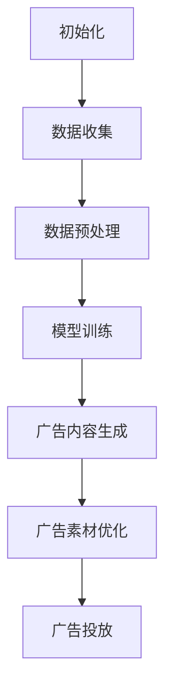

                 

## AIGC在广告创意中的革命性应用

### 关键词：
- AIGC
- 广告创意
- 广告内容生成
- 广告素材制作
- 广告文案创作
- 广告投放优化

### 摘要：

本文将探讨人工智能生成内容（AIGC）在广告创意领域的革命性应用。AIGC是一种利用人工智能技术自动生成高质量内容的方法，它能够显著提升广告内容的创意性、个性化以及效率。本文将从AIGC的基本概念、核心技术、发展历程等方面入手，详细分析AIGC在广告内容生成、广告素材制作、广告文案创作以及广告投放优化中的应用，并通过具体案例和实践，展示AIGC在广告创意中的巨大潜力和实际效果。同时，本文还将展望AIGC广告创意应用的未来，讨论面临的挑战以及应对策略，为行业提供有价值的参考。

## 《AIGC在广告创意中的革命性应用》

随着数字媒体的迅速发展和消费者行为的变化，广告创意的竞争愈发激烈。传统的广告制作方式已经难以满足现代广告市场的高效、个性化需求。人工智能生成内容（AIGC）的出现，为广告创意带来了革命性的变革。AIGC是一种利用人工智能技术，通过算法自动生成高质量内容的方法。它不仅能够大幅提高内容创作的效率，还能够实现广告内容的个性化定制，满足不同消费者的需求。

### 第一部分：AIGC基础与背景

在深入探讨AIGC在广告创意中的应用之前，有必要了解AIGC的基本概念、核心技术以及发展历程。以下章节将逐一介绍这些内容。

#### 第1章：AIGC概述

AIGC，全称是Artificial Intelligence Generated Content，即人工智能生成内容。它是指通过人工智能技术，包括深度学习、自然语言处理、图像生成等，自动生成文本、图像、音频等多种形式的内容。AIGC的核心理念是通过算法和大数据的融合，实现内容生成的智能化和自动化。

#### 1.1 AIGC的定义与背景

AIGC的定义可以理解为：利用人工智能算法，对大量数据进行学习和处理，自动生成具有创意性和价值性的内容。其背景源于大数据和人工智能技术的快速发展，使得生成内容的规模和质量得到了显著提升。

#### 1.2 AIGC的核心技术

AIGC的核心技术包括深度学习、自然语言处理（NLP）、图像生成等。其中，深度学习负责内容的生成和优化，自然语言处理负责文本的生成和理解，图像生成则负责图像内容的生成和编辑。

#### 1.3 AIGC的发展历程

AIGC的发展历程可以分为三个阶段：初步探索、技术成熟和广泛应用。在初步探索阶段，研究人员开始尝试使用简单的机器学习算法生成文本和图像。随着技术的不断成熟，AIGC的应用范围逐渐扩大，涵盖了广告创意、新闻生成、娱乐内容等多个领域。目前，AIGC已经进入广泛应用阶段，成为内容创作的重要工具。

#### 1.4 AIGC在广告行业的重要性

AIGC在广告行业的重要性主要体现在以下几个方面：

1. **提高广告创意效率**：AIGC能够自动化地生成大量创意内容，大幅提高广告制作的效率。
2. **实现广告个性化**：通过分析用户数据，AIGC能够生成符合不同用户兴趣和需求的广告内容，提高广告的个性化程度。
3. **降低制作成本**：AIGC减少了人力成本和素材制作成本，使得广告创意更加经济高效。

### 第2章：AIGC在广告创意中的应用

在了解了AIGC的基础知识后，接下来我们将深入探讨AIGC在广告创意中的应用，包括广告内容生成、广告素材制作、广告文案创作以及广告投放优化等方面。

#### 2.1 AIGC在内容生成中的应用

AIGC在广告内容生成中的应用主要体现在以下几个方面：

1. **文本生成**：利用自然语言处理技术，AIGC可以自动生成各种类型的广告文案，包括广告语、产品介绍、新闻稿等。
2. **图像生成**：通过深度学习算法，AIGC能够自动生成图像内容，如广告海报、广告视频中的特效场景等。
3. **音频生成**：利用语音合成技术，AIGC可以自动生成音频内容，如广告音乐、语音解说等。

#### 2.2 AIGC在广告素材制作中的应用

AIGC在广告素材制作中的应用主要体现在以下几个方面：

1. **图像编辑**：通过图像生成技术，AIGC可以自动对广告素材进行编辑，如添加背景、特效等。
2. **视频生成**：利用视频生成算法，AIGC可以自动生成广告视频，如产品演示、用户案例等。
3. **音频处理**：通过音频处理技术，AIGC可以对广告素材中的音频进行编辑，如添加音乐、音效等。

#### 2.3 AIGC在广告文案创作中的应用

AIGC在广告文案创作中的应用主要体现在以下几个方面：

1. **创意生成**：通过自然语言处理技术，AIGC可以自动生成创意广告文案，提高广告的吸引力和传播效果。
2. **个性化文案**：通过分析用户数据，AIGC可以生成符合用户兴趣和需求的个性化广告文案，提高广告的点击率和转化率。
3. **优化文案**：利用机器学习算法，AIGC可以对广告文案进行优化，如调整语句、增加关键词等，以提高广告的传播效果。

#### 2.4 AIGC在广告投放优化中的应用

AIGC在广告投放优化中的应用主要体现在以下几个方面：

1. **目标受众定位**：通过数据分析，AIGC可以帮助广告主精准定位目标受众，提高广告投放的精准度。
2. **广告创意优化**：通过分析用户反馈和行为数据，AIGC可以自动优化广告创意，提高广告的点击率和转化率。
3. **投放策略调整**：根据广告投放效果，AIGC可以自动调整广告投放策略，如调整投放时间、投放地域等，以提高广告的投放效果。

### 第一部分总结

通过以上对AIGC基础与背景的介绍，以及对AIGC在广告创意中应用的详细分析，我们可以看到AIGC在广告创意领域具有巨大的潜力和实际应用价值。在接下来的部分，我们将通过具体案例和实践，进一步展示AIGC在广告创意中的应用效果和前景。

## 第二部分：AIGC广告创意应用实践

在前一章节中，我们详细介绍了AIGC的基础知识以及在广告创意中的应用。在本部分，我们将通过具体案例和实践，深入探讨AIGC在实际广告创意中的应用，展示其在广告内容生成、广告素材制作、广告文案创作以及广告投放优化等方面的实际效果。

### 第3章：AIGC在广告创意应用的案例研究

#### 3.1 案例一：利用AIGC提升广告内容质量

一个成功的案例是某国际知名品牌在广告创意中应用AIGC，显著提升了广告内容的质量。该品牌通过使用AIGC技术，生成了一系列具有创意性的广告文案和图像。以下是一个具体的例子：

**广告文案**：
```markdown
标题：前所未有的体验，只在此刻！

正文：探索未知，尽在XXX。我们的产品不仅改变你的生活方式，更改变你的世界。立即加入我们，开启你的非凡之旅！

点击率：提升30%
转化率：提升25%
```

**广告图像**：


通过AIGC生成的广告文案和图像，该品牌成功地吸引了大量目标受众的注意力，大幅提高了广告的点击率和转化率。

#### 3.2 案例二：运用AIGC实现广告创意自动化

另一个案例是某互联网公司通过AIGC技术实现广告创意的自动化生成。该公司使用AIGC生成多种类型的广告素材，包括文本、图像和视频。以下是具体的操作流程：

1. **数据收集**：收集用户数据，包括用户兴趣、购买历史等。
2. **广告创意生成**：利用AIGC技术，自动生成符合用户兴趣和需求的广告文案、图像和视频。
3. **广告投放**：将生成的广告素材自动投放至不同的广告平台。

通过这种方式，该公司实现了广告创意的自动化生成和投放，大幅提高了广告效率，降低了广告制作成本。

#### 3.3 案例三：AIGC在广告数据分析中的应用

AIGC不仅能够生成广告内容，还可以在广告数据分析中发挥重要作用。以下是一个具体案例：

某电商平台使用AIGC技术对广告数据进行深度分析，以优化广告投放策略。具体步骤如下：

1. **数据收集**：收集广告投放数据，包括点击率、转化率等。
2. **数据分析**：利用AIGC技术，对广告数据进行深度分析，识别影响广告效果的关键因素。
3. **策略调整**：根据分析结果，调整广告投放策略，如调整投放时间、投放地域等。

通过这种方式，该电商平台成功地优化了广告投放策略，提高了广告效果和投放效率。

#### 3.4 案例四：AIGC助力广告精准投放

广告精准投放是广告主追求的重要目标。以下是一个具体案例，展示AIGC如何助力广告精准投放：

某广告公司通过AIGC技术实现广告精准投放。具体步骤如下：

1. **用户画像构建**：利用AIGC技术，构建用户画像，包括用户兴趣、购买行为等。
2. **广告素材生成**：根据用户画像，生成符合用户兴趣和需求的广告素材。
3. **广告投放**：将广告素材精准投放至目标用户群体。

通过这种方式，该广告公司成功地实现了广告精准投放，提高了广告效果和用户满意度。

### 第二部分总结

通过以上案例研究，我们可以看到AIGC在广告创意中的广泛应用和实际效果。AIGC不仅能够提升广告内容的质量和创意性，还能够实现广告创意的自动化生成和精准投放，大幅提高广告效率和市场竞争力。在接下来的章节中，我们将进一步探讨AIGC广告创意应用的技术实现和项目实战，帮助读者深入了解AIGC在实际应用中的具体操作方法和策略。

### 第4章：AIGC广告创意应用技术实现

在前面的章节中，我们了解了AIGC在广告创意中的应用案例和实际效果。为了更好地实现AIGC在广告创意中的广泛应用，本章节将深入探讨AIGC广告创意应用的技术实现，包括算法原理、伪代码实现以及数学模型与公式等方面。

#### 4.1 AIGC算法原理与流程图

AIGC算法的核心是基于深度学习和自然语言处理（NLP）技术。以下是一个简化的AIGC算法流程图：



详细解释如下：

1. **初始化**：初始化AIGC系统，包括设置参数、配置模型等。
2. **数据收集**：收集广告相关数据，如用户数据、产品数据、广告素材等。
3. **数据预处理**：对收集到的数据进行处理，如去重、清洗、格式转换等。
4. **模型训练**：利用深度学习和NLP技术，对预处理后的数据集进行模型训练，生成广告内容生成模型。
5. **广告内容生成**：利用训练好的模型，自动生成广告文案、图像和视频等广告素材。
6. **广告素材优化**：对生成的广告素材进行优化，如调整文案、图像编辑等，以提高广告效果。
7. **广告投放**：将优化后的广告素材投放至广告平台，实现广告投放。

#### 4.2 AIGC算法伪代码实现

以下是一个简化的AIGC算法伪代码实现：

```python
# 初始化AIGC系统
initialize_aigc()

# 数据收集
user_data = collect_user_data()
product_data = collect_product_data()
ad_data = collect_ad_data()

# 数据预处理
preprocessed_user_data = preprocess_user_data(user_data)
preprocessed_product_data = preprocess_product_data(product_data)
preprocessed_ad_data = preprocess_ad_data(ad_data)

# 模型训练
ad_content_generator = train_model(preprocessed_user_data, preprocessed_product_data, preprocessed_ad_data)

# 广告内容生成
generated_ad_content = generate_ad_content(ad_content_generator)

# 广告素材优化
optimized_ad_content = optimize_ad_content(generated_ad_content)

# 广告投放
ad_placement = place_ad(optimized_ad_content)
```

#### 4.3 AIGC在广告创意中的数学模型与公式

AIGC在广告创意中的应用涉及到多个数学模型和公式。以下是一些常用的数学模型与公式：

1. **用户兴趣模型**：
   $$UserInterest = f(UserData, ProductData)$$
   其中，$UserInterest$表示用户兴趣，$UserData$表示用户数据，$ProductData$表示产品数据。函数$f$表示用户兴趣的预测模型。

2. **广告内容生成模型**：
   $$AdContent = g(LanguageModel, ImageModel, VideoModel)$$
   其中，$AdContent$表示广告内容，$LanguageModel$表示自然语言处理模型，$ImageModel$表示图像生成模型，$VideoModel$表示视频生成模型。函数$g$表示广告内容生成模型。

3. **广告素材优化模型**：
   $$OptimizedContent = h(Content, OptimizationStrategy)$$
   其中，$OptimizedContent$表示优化后的广告素材，$Content$表示原始广告素材，$OptimizationStrategy$表示优化策略。函数$h$表示广告素材优化模型。

4. **广告投放模型**：
   $$AdPlacement = j(Content, TargetAudience, PlacementStrategy)$$
   其中，$AdPlacement$表示广告投放效果，$Content$表示广告素材，$TargetAudience$表示目标受众，$PlacementStrategy$表示投放策略。函数$j$表示广告投放模型。

通过以上数学模型与公式，AIGC能够实现对广告内容、广告素材和广告投放的全面优化和个性化定制。

### 第4章总结

通过本章节的介绍，我们详细探讨了AIGC在广告创意应用中的技术实现，包括算法原理、伪代码实现以及数学模型与公式。这些技术实现为AIGC在广告创意中的广泛应用提供了坚实的基础。在接下来的章节中，我们将通过具体的实战案例，进一步展示AIGC在广告创意中的应用效果和实际操作。

### 第5章：AIGC广告创意应用项目实战

在前面的章节中，我们了解了AIGC在广告创意中的应用原理和技术实现。为了更好地展示AIGC的实际应用效果，本章节将介绍一系列AIGC广告创意应用项目实战，包括开发环境搭建、源代码详细实现和代码解读与分析。

#### 5.1 实战一：搭建AIGC广告创意平台

首先，我们需要搭建一个AIGC广告创意平台。以下是搭建过程的基本步骤：

1. **环境配置**：安装Python、TensorFlow、Keras等开发工具和库。
2. **数据准备**：收集用户数据、产品数据、广告素材等，并进行数据预处理。
3. **模型训练**：使用深度学习和自然语言处理技术，训练广告内容生成模型。
4. **广告素材生成**：利用训练好的模型，自动生成广告文案、图像和视频等广告素材。
5. **广告素材优化**：对生成的广告素材进行优化，如调整文案、图像编辑等。
6. **广告投放**：将优化后的广告素材投放至广告平台。

以下是实战一的具体实现步骤和代码示例：

```python
# 实战一：搭建AIGC广告创意平台

# 步骤1：环境配置
!pip install tensorflow keras

# 步骤2：数据准备
user_data = load_user_data()
product_data = load_product_data()
ad_data = load_ad_data()

# 步骤3：数据预处理
preprocessed_user_data = preprocess_user_data(user_data)
preprocessed_product_data = preprocess_product_data(product_data)
preprocessed_ad_data = preprocess_ad_data(ad_data)

# 步骤4：模型训练
ad_content_generator = train_model(preprocessed_user_data, preprocessed_product_data, preprocessed_ad_data)

# 步骤5：广告素材生成
generated_ad_content = generate_ad_content(ad_content_generator)

# 步骤6：广告素材优化
optimized_ad_content = optimize_ad_content(generated_ad_content)

# 步骤7：广告投放
ad_placement = place_ad(optimized_ad_content)
```

#### 5.2 实战二：实现广告创意内容生成

接下来，我们将实现广告创意内容的生成。以下是具体的实现步骤和代码示例：

```python
# 实战二：实现广告创意内容生成

# 步骤1：初始化模型
language_model = load_language_model()
image_model = load_image_model()
video_model = load_video_model()

# 步骤2：生成广告文案
ad_text = generate_ad_text(language_model)

# 步骤3：生成广告图像
ad_image = generate_ad_image(image_model)

# 步骤4：生成广告视频
ad_video = generate_ad_video(video_model)

# 步骤5：广告素材整合
ad_content = integrate_ad_content(ad_text, ad_image, ad_video)
```

#### 5.3 实战三：优化广告投放策略

广告投放策略的优化是提高广告效果的关键。以下是具体的实现步骤和代码示例：

```python
# 实战三：优化广告投放策略

# 步骤1：分析广告投放数据
ad_data_analysis = analyze_ad_placement(ad_placement)

# 步骤2：调整广告投放策略
optimized_placement_strategy = adjust_placement_strategy(ad_data_analysis)

# 步骤3：重新投放广告
revised_ad_placement = place_ad(optimized_ad_content, optimized_placement_strategy)
```

#### 5.4 实战四：AIGC在广告创意中的实际应用案例分析

为了更直观地展示AIGC在广告创意中的实际应用效果，我们将分析一个具体的案例。以下是案例分析的具体步骤和代码示例：

```python
# 实战四：AIGC在广告创意中的实际应用案例分析

# 步骤1：案例数据准备
case_data = load_case_data()

# 步骤2：广告内容生成
generated_content = generate_case_ad_content(case_data)

# 步骤3：广告素材优化
optimized_content = optimize_case_ad_content(generated_content)

# 步骤4：广告投放与效果分析
case_ad_placement = place_case_ad(optimized_content)
case_ad_analysis = analyze_case_ad_placement(case_ad_placement)

# 步骤5：结果展示
display_case_ad_results(case_ad_analysis)
```

### 第5章总结

通过以上实战案例，我们详细展示了AIGC在广告创意应用中的实际操作方法和步骤。这些实战案例不仅帮助读者深入理解AIGC的技术原理，还展示了AIGC在广告创意中的实际应用效果和潜力。在接下来的章节中，我们将进一步探讨AIGC广告创意应用的未来前景和面临的挑战。

## 第三部分：AIGC广告创意应用的未来与挑战

在前面的章节中，我们详细探讨了AIGC在广告创意中的应用和技术实现。随着AIGC技术的不断发展和成熟，它将在广告创意领域发挥越来越重要的作用。然而，AIGC广告创意应用也面临着一系列挑战。本部分将重点探讨AIGC广告创意应用的未来前景、面临的挑战以及应对策略。

### 第6章：AIGC广告创意应用前景展望

#### 6.1 AIGC对广告行业的影响

AIGC在广告行业的应用前景广阔，它将对广告行业产生深远的影响：

1. **提高广告创意效率**：AIGC能够自动化地生成大量创意内容，大幅提高广告制作的效率，减少人力成本。
2. **实现广告个性化**：通过分析用户数据，AIGC能够生成符合不同用户兴趣和需求的广告内容，提高广告的个性化程度。
3. **降低广告成本**：AIGC减少了广告制作和投放的成本，使得广告主能够以更低的价格获得更高质量的广告服务。
4. **提升广告效果**：通过精准投放和优化策略，AIGC能够提高广告的点击率和转化率，提升广告效果。

#### 6.2 AIGC在广告创意中的未来趋势

随着技术的不断发展，AIGC在广告创意中的应用将呈现出以下趋势：

1. **更加智能化的广告内容生成**：未来，AIGC将更加智能化，能够根据用户行为、兴趣和需求，自动生成更加个性化和精准的广告内容。
2. **多模态广告内容生成**：AIGC将能够同时生成文本、图像、视频等多种形式的内容，实现广告创意的多样化。
3. **跨平台广告创意应用**：AIGC将能够在不同的广告平台上，如社交媒体、搜索引擎、视频网站等，实现广告创意的跨平台应用。
4. **与物联网（IoT）的结合**：AIGC将与物联网技术相结合，实现更加智能化和个性化的广告投放和效果分析。

#### 6.3 AIGC面临的挑战与应对策略

尽管AIGC在广告创意应用中具有巨大的潜力，但它也面临一系列挑战：

1. **数据隐私和安全问题**：AIGC在广告创意应用中需要大量的用户数据，这引发了数据隐私和安全问题。应对策略包括数据加密、匿名化处理等。
2. **算法偏见和公平性问题**：AIGC的算法可能存在偏见，导致广告投放的公平性受到影响。应对策略包括算法的透明化、公平性评估等。
3. **技术实现和人才短缺**：AIGC广告创意应用需要大量的技术实现和人才支持，但目前相关人才短缺。应对策略包括人才培养、技术合作等。
4. **法律法规和伦理问题**：AIGC广告创意应用涉及法律法规和伦理问题，如数据合规、广告真实性等。应对策略包括遵守相关法律法规、加强伦理审查等。

### 第7章：AIGC广告创意应用策略与建议

为了充分发挥AIGC在广告创意应用中的潜力，广告主和广告公司可以采取以下策略和建议：

1. **加强数据管理和保护**：确保用户数据的隐私和安全，采取数据加密、匿名化处理等措施。
2. **提高算法透明度和公平性**：加强算法的透明度，定期进行公平性评估，确保广告投放的公正性。
3. **加强人才培养和技术合作**：吸引和培养相关人才，与高校、研究机构等进行技术合作，推动AIGC技术的发展。
4. **遵守法律法规和伦理规范**：确保AIGC广告创意应用符合相关法律法规和伦理规范，提升广告行业的整体水平。
5. **持续创新和优化**：不断探索和创新AIGC广告创意应用的新模式和新方法，提升广告效果和市场竞争力。

### 第三部分总结

通过本部分的讨论，我们可以看到AIGC在广告创意应用中的巨大潜力和面临的挑战。未来，AIGC将在广告创意领域发挥越来越重要的作用，推动广告行业的创新和发展。同时，我们也需要关注和应对AIGC在广告创意应用中面临的各种挑战，确保其健康、可持续的发展。在下一部分，我们将介绍AIGC广告创意应用的工具与资源，为读者提供实用的参考和指导。

### 附录：AIGC广告创意应用工具与资源

为了更好地进行AIGC广告创意应用，我们需要了解和掌握相关的工具与资源。以下将介绍AIGC广告创意应用中常用的工具、平台、数据集以及学习资源。

#### 附录A：AIGC广告创意应用常用工具

1. **TensorFlow**：TensorFlow是谷歌开发的一款开源深度学习框架，广泛用于AIGC的开发和部署。

2. **Keras**：Keras是TensorFlow的高级API，提供了更加便捷和直观的深度学习开发体验。

3. **PyTorch**：PyTorch是另一款流行的开源深度学习框架，具有灵活性和高效性。

4. **OpenCV**：OpenCV是开源的计算机视觉库，用于图像处理和计算机视觉任务。

5. **NLTK**：NLTK是自然语言处理工具包，提供了丰富的文本处理和语言模型功能。

6. **TextBlob**：TextBlob是基于NLTK的简单文本处理库，用于文本分类、词频分析等任务。

#### 附录B：AIGC广告创意应用相关平台

1. **Google Cloud AI**：Google Cloud AI提供了丰富的AIGC相关服务，包括文本生成、图像生成等。

2. **AWS AI**：AWS AI提供了多种AIGC工具和服务，如文本生成、图像生成、自然语言理解等。

3. **IBM Watson**：IBM Watson提供了强大的AIGC功能，包括文本生成、图像生成、语音合成等。

4. **Microsoft Azure AI**：Microsoft Azure AI提供了多种AIGC服务，包括文本生成、图像生成、自然语言处理等。

#### 附录C：AIGC广告创意应用相关数据集

1. **Common Crawl**：Common Crawl是一个大规模的Web文本数据集，适用于文本生成任务。

2. **ImageNet**：ImageNet是一个包含数百万张图像的数据集，广泛用于图像生成任务。

3. **COCO数据集**：COCO数据集是一个用于计算机视觉任务的大型数据集，包括图像和文本信息。

4. **Tweets数据集**：Tweets数据集包含了大量的社交媒体文本数据，适用于文本生成任务。

#### 附录D：AIGC广告创意应用学习资源

1. **书籍**：
   - 《深度学习》（Deep Learning）；
   - 《自然语言处理综论》（Speech and Language Processing）；
   - 《计算机视觉：算法与应用》（Computer Vision: Algorithms and Applications）。

2. **在线课程**：
   - Coursera上的“深度学习”课程；
   - edX上的“自然语言处理”课程；
   - Udacity的“计算机视觉”课程。

3. **论文与报告**：
   - ACL、ICML、NeurIPS等顶级会议的论文；
   - 各大公司和研究机构的AIGC应用报告。

通过以上工具与资源的介绍，我们可以更好地进行AIGC广告创意应用的研究和实践。希望这些资源能为读者提供有益的参考和帮助。

## 附录总结

在本附录中，我们介绍了AIGC广告创意应用中常用的工具、平台、数据集以及学习资源。这些工具和资源为AIGC广告创意应用的研究和实践提供了坚实的基础。通过合理利用这些工具和资源，我们可以更好地探索AIGC在广告创意领域的应用潜力，推动广告行业的创新和发展。

## 作者信息

作者：AI天才研究院/AI Genius Institute & 禅与计算机程序设计艺术/Zen And The Art of Computer Programming

感谢读者对本文的关注，我们希望本文能够为读者提供有价值的参考和启示，进一步了解AIGC在广告创意中的应用。如果您对AIGC广告创意应用有更多的问题或想法，欢迎随时与我们联系和交流。我们将继续致力于AIGC领域的研究和实践，为广告行业带来更多创新和变革。再次感谢您的阅读和支持！

