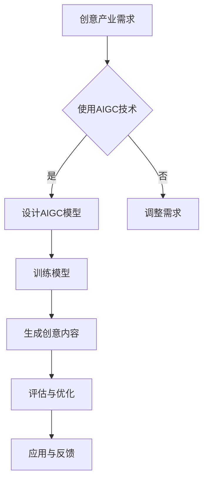

                 

# 《AIGC革命：重塑创意产业的未来》

## 关键词：
- AIGC
- 创意产业
- 生成对抗网络
- 艺术创作
- 游戏设计
- 广告创意

## 摘要：
随着人工智能技术的快速发展，AIGC（AI-Generated Content）正在成为重塑创意产业的重要力量。本文将深入探讨AIGC的概念、核心技术及其在艺术创作、游戏设计、广告创意等领域的应用，分析AIGC对创意产业带来的变革和挑战，并通过实际案例展示AIGC的开发实践和未来趋势。

### 《AIGC革命：重塑创意产业的未来》目录大纲

#### 第一部分：AIGC概述与背景

##### 第1章：AIGC的概念与定义

##### 第2章：创意产业现状与挑战

#### 第二部分：AIGC在创意产业中的应用

##### 第3章：AIGC在艺术创作中的应用

##### 第4章：AIGC在游戏设计中的应用

##### 第5章：AIGC在广告创意中的应用

##### 第6章：AIGC在创意产业中的挑战与未来

#### 第三部分：AIGC开发实践与案例分析

##### 第7章：AIGC开发环境与工具

##### 第8章：AIGC项目实战案例

#### 附录

### 核心算法原理讲解：生成对抗网络（GAN）

### Mermaid流程图：AIGC在创意产业中的应用流程

## 第一部分：AIGC概述与背景

### 第1章：AIGC的概念与定义

#### 1.1 AIGC的起源与发展

AIGC，即AI-Generated Content，是一种利用人工智能技术自动生成内容的方法。其起源可以追溯到20世纪90年代的生成对抗网络（GAN）的提出。GAN是由Ian Goodfellow等研究者于2014年提出的一种深度学习模型，其核心思想是通过两个相互对抗的神经网络——生成器和判别器，来实现数据的生成。

GAN的发展历程可以分为几个阶段：

1. **GAN的提出（2014年）**：Ian Goodfellow等人在论文《Generative Adversarial Nets》中首次提出了GAN的概念。
2. **GAN的应用与改进（2014-2016年）**：GAN在图像生成、语音合成等领域得到了广泛的应用，并且出现了一些基于GAN的改进模型，如DCGAN、LSGAN。
3. **GAN的深入研究和商业化（2016年至今）**：GAN的研究不断深入，应用领域也不断扩大，从图像、语音到文本、视频等，AIGC技术逐渐成为人工智能领域的重要研究方向。

#### 1.2 AIGC的核心技术

AIGC的核心技术主要包括生成对抗网络（GAN）、变分自编码器（VAE）和自注意力机制等。

1. **生成对抗网络（GAN）**：
   - **原理**：GAN由生成器和判别器两个神经网络组成。生成器从随机噪声中生成数据，判别器则判断生成数据是否真实。两个网络相互对抗，生成器的目标是生成足够逼真的数据以欺骗判别器，而判别器的目标是准确区分真实数据和生成数据。
   - **应用**：GAN在图像生成、语音合成、文本生成等领域有着广泛的应用。

2. **变分自编码器（VAE）**：
   - **原理**：VAE是一种基于概率模型的生成模型，它通过编码器和解码器两个网络实现数据的生成。编码器将输入数据编码为一个隐变量，解码器则将隐变量解码为输出数据。
   - **应用**：VAE在图像生成、图像去噪、数据增强等领域有较好的效果。

3. **自注意力机制**：
   - **原理**：自注意力机制是一种在序列模型中用于自动调整不同位置之间的权重的方法。它通过计算每个位置的重要性，从而实现对序列的动态建模。
   - **应用**：自注意力机制在自然语言处理、图像识别等领域有着广泛的应用。

#### 1.3 AIGC与创意产业的联系

AIGC在创意产业中的应用主要表现在艺术创作、游戏设计、广告创意等领域。

1. **艺术创作**：
   - **绘画**：AIGC可以通过GAN等技术生成具有艺术风格的绘画作品，为艺术家提供灵感，甚至直接创作出具有商业价值的艺术作品。
   - **音乐**：AIGC可以通过生成对抗网络生成音乐，为音乐创作提供新的思路和工具。
   - **电影**：AIGC可以自动生成电影视觉效果，提高电影制作的效率。

2. **游戏设计**：
   - **角色设计**：AIGC可以通过生成对抗网络生成具有独特外观和性格的游戏角色，丰富游戏内容。
   - **场景设计**：AIGC可以自动生成游戏场景，提高游戏设计的效率和质量。
   - **剧情设计**：AIGC可以通过生成对抗网络自动生成游戏剧情，为游戏设计提供新的思路。

3. **广告创意**：
   - **内容生成**：AIGC可以自动生成广告内容，提高广告创意的效率。
   - **效果评估**：AIGC可以通过生成对抗网络评估广告效果，为广告优化提供数据支持。
   - **传播策略**：AIGC可以自动生成跨媒体的广告创意，提高广告传播效果。

### 第2章：创意产业现状与挑战

#### 2.1 创意产业概述

创意产业是指通过创意思维和技术手段，将创意转化为实际价值的经济活动。它涵盖了艺术、设计、广告、媒体、娱乐等多个领域。创意产业具有高附加值、低污染、可持续发展等特点，是现代经济的重要组成部分。

创意产业的主要领域包括：

1. **文化艺术**：包括绘画、雕塑、音乐、戏剧、电影等。
2. **设计**：包括工业设计、平面设计、室内设计、时尚设计等。
3. **广告**：包括广告创意、广告策划、广告发布等。
4. **媒体**：包括报纸、杂志、电视、网络等。
5. **娱乐**：包括游戏、动漫、体育等。

#### 2.2 创意产业面临的挑战

尽管创意产业具有巨大的发展潜力，但也面临着一些挑战。

1. **创意作品的原创性与侵权问题**：
   - **原创性保护**：创意作品的原创性难以保护，尤其是在网络环境下，盗版和抄袭现象较为普遍。
   - **侵权问题**：创意作品容易被侵权，给创作者带来经济损失。

2. **创意产业的人才短缺**：
   - **人才需求**：创意产业对人才的需求较高，但优质人才相对稀缺。
   - **人才培养**：创意产业的人才培养体系不够完善，人才储备不足。

3. **创意产业的技术革新需求**：
   - **技术创新**：创意产业需要不断创新技术，以提升创作效率和质量。
   - **技术融合**：创意产业需要与其他产业（如互联网、大数据、人工智能等）深度融合，实现跨界发展。

## 第二部分：AIGC在创意产业中的应用

### 第3章：AIGC在艺术创作中的应用

#### 3.1 AIGC在绘画艺术中的应用

AIGC在绘画艺术中的应用主要体现在生成对抗网络（GAN）和变分自编码器（VAE）等技术上。这些技术为艺术家提供了新的创作工具和灵感，同时也为观众带来了全新的艺术体验。

1. **GAN在艺术绘画中的应用**：
   - **艺术绘画的生成**：通过GAN，艺术家可以将自己的绘画风格与机器学习相结合，生成具有独特风格的艺术作品。例如，艺术家可以输入自己的绘画作品和随机噪声，通过GAN训练生成新的绘画作品。
   - **艺术风格的迁移**：GAN可以用于将一种艺术风格迁移到另一种作品上。例如，可以将梵高的风格应用到一张照片上，生成具有梵高风格的新作品。
   - **艺术作品的多样化**：GAN可以生成多种风格的艺术作品，为艺术家提供更多的创作选择。

2. **VAE在艺术绘画中的应用**：
   - **图像的生成**：VAE可以通过学习图像的潜在分布，生成新的图像。例如，可以生成具有不同颜色、形状和纹理的图像。
   - **图像的修复**：VAE可以用于图像的修复和去噪，提高图像的质量。
   - **图像的多样化**：VAE可以生成具有多种风格和特征的艺术作品，为艺术家提供更多的创作灵感。

#### 3.2 AIGC在音乐创作中的应用

AIGC在音乐创作中的应用主要体现在生成对抗网络（GAN）和变分自编码器（VAE）等技术上。这些技术为音乐家提供了新的创作工具和灵感，同时也为听众带来了全新的音乐体验。

1. **GAN在音乐创作中的应用**：
   - **音乐生成**：通过GAN，音乐家可以生成新的音乐片段，例如生成一个特定的风格或旋律。
   - **音乐风格的迁移**：GAN可以用于将一种音乐风格迁移到另一种风格上，例如将古典音乐风格应用到流行音乐上。
   - **音乐效果的增强**：GAN可以用于增强音乐的效果，例如增加音乐的节奏感、情感表达等。

2. **VAE在音乐创作中的应用**：
   - **音乐生成**：VAE可以通过学习音乐数据，生成新的音乐片段，例如生成具有不同风格和旋律的音乐。
   - **音乐效果的修复**：VAE可以用于修复音乐中的缺陷，例如修复音频中的噪声或断音。
   - **音乐多样化**：VAE可以生成具有多种风格和特点的音乐，为音乐家提供更多的创作选择。

#### 3.3 AIGC在电影制作中的应用

AIGC在电影制作中的应用主要体现在生成对抗网络（GAN）和变分自编码器（VAE）等技术上。这些技术为电影制作人提供了新的工具和方法，提高了电影制作的效率和质量。

1. **视觉效果的自动化生成**：
   - **场景的生成**：通过GAN，电影制作人可以自动生成电影中的场景，例如生成一个特定的城市景观或自然景观。
   - **特效的生成**：通过GAN，电影制作人可以自动生成电影中的特效，例如生成一个爆炸效果或一个魔法效果。
   - **动画的生成**：通过GAN，电影制作人可以自动生成动画中的角色和场景，提高动画制作的效率。

2. **剧本创作的自动化生成**：
   - **故事情节的生成**：通过GAN，电影制作人可以自动生成电影的故事情节，为编剧提供创作灵感。
   - **对话的生成**：通过GAN，电影制作人可以自动生成电影中的对话，提高剧本的创作效率。
   - **剧本的多样化**：GAN可以生成具有多种风格和主题的剧本，为电影制作人提供更多的创作选择。

### 第4章：AIGC在游戏设计中的应用

#### 4.1 AIGC在游戏角色设计中的应用

AIGC在游戏角色设计中的应用主要体现在生成对抗网络（GAN）和自注意力机制等技术上。这些技术为游戏设计师提供了新的工具和方法，提高了游戏角色的创作效率和质量。

1. **生成对抗网络（GAN）在角色设计中的应用**：
   - **角色外观的生成**：通过GAN，游戏设计师可以自动生成具有独特外观和特征的游戏角色。例如，可以生成一个具有不同肤色、发型和面部特征的角色。
   - **角色性格的生成**：通过GAN，游戏设计师可以自动生成具有不同性格和特点的游戏角色。例如，可以生成一个勇敢、聪明或邪恶的角色。
   - **角色组合的生成**：通过GAN，游戏设计师可以自动生成具有多种角色组合的游戏，为玩家提供更多的游戏选择。

2. **自注意力机制在角色设计中的应用**：
   - **角色特征的提取**：自注意力机制可以帮助游戏设计师提取角色的重要特征，例如面部特征、身体特征等，从而更好地进行角色设计。
   - **角色外观的优化**：自注意力机制可以帮助游戏设计师优化角色的外观，使其更加符合玩家的审美需求。
   - **角色互动的设计**：自注意力机制可以帮助游戏设计师设计角色之间的互动，提高游戏的可玩性。

#### 4.2 AIGC在游戏场景设计中的应用

AIGC在游戏场景设计中的应用主要体现在生成对抗网络（GAN）和自注意力机制等技术上。这些技术为游戏设计师提供了新的工具和方法，提高了游戏场景的创作效率和质量。

1. **生成对抗网络（GAN）在场景设计中的应用**：
   - **场景的生成**：通过GAN，游戏设计师可以自动生成游戏中的场景，例如生成一个森林、城市或山脉等。
   - **场景的多样化**：通过GAN，游戏设计师可以生成具有多种风格和主题的场景，为玩家提供更多的游戏体验。
   - **场景的适应性**：通过GAN，游戏设计师可以生成适应不同游戏机制的场景，提高游戏的灵活性。

2. **自注意力机制在场景设计中的应用**：
   - **场景元素的提取**：自注意力机制可以帮助游戏设计师提取场景中的重要元素，例如建筑、植被、道路等，从而更好地进行场景设计。
   - **场景的优化**：自注意力机制可以帮助游戏设计师优化场景的外观，使其更加符合游戏主题和玩家的审美需求。
   - **场景的交互设计**：自注意力机制可以帮助游戏设计师设计场景与角色之间的交互，提高游戏的可玩性。

#### 4.3 AIGC在游戏剧情设计中的应用

AIGC在游戏剧情设计中的应用主要体现在生成对抗网络（GAN）和自注意力机制等技术上。这些技术为游戏设计师提供了新的工具和方法，提高了游戏剧情的创作效率和质量。

1. **生成对抗网络（GAN）在剧情设计中的应用**：
   - **剧情的生成**：通过GAN，游戏设计师可以自动生成游戏中的剧情，例如生成一个故事情节或角色之间的对话。
   - **剧情的多样化**：通过GAN，游戏设计师可以生成具有多种风格和主题的剧情，为玩家提供更多的游戏体验。
   - **剧情的适应性**：通过GAN，游戏设计师可以生成适应不同游戏机制的剧情，提高游戏的灵活性。

2. **自注意力机制在剧情设计中的应用**：
   - **剧情元素的提取**：自注意力机制可以帮助游戏设计师提取剧情中的重要元素，例如角色、事件、情节等，从而更好地进行剧情设计。
   - **剧情的优化**：自注意力机制可以帮助游戏设计师优化剧情的连贯性和逻辑性，提高剧情的质量。
   - **剧情的交互设计**：自注意力机制可以帮助游戏设计师设计角色与玩家之间的交互，提高游戏的可玩性。

### 第5章：AIGC在广告创意中的应用

#### 5.1 AIGC在广告创意生成中的应用

AIGC在广告创意生成中的应用主要体现在生成对抗网络（GAN）和变分自编码器（VAE）等技术上。这些技术为广告创意师提供了新的工具和方法，提高了广告创意的效率和质量。

1. **生成对抗网络（GAN）在广告创意生成中的应用**：
   - **广告内容的生成**：通过GAN，广告创意师可以自动生成广告内容，例如生成一个广告海报或广告视频。
   - **广告风格的迁移**：通过GAN，广告创意师可以将一个广告风格迁移到另一个广告中，例如将一个传统的广告风格迁移到现代风格。
   - **广告效果的优化**：通过GAN，广告创意师可以优化广告的效果，使其更加吸引观众的注意力。

2. **变分自编码器（VAE）在广告创意生成中的应用**：
   - **广告内容的生成**：通过VAE，广告创意师可以自动生成广告内容，例如生成一个广告海报或广告视频。
   - **广告内容的个性化**：通过VAE，广告创意师可以生成针对不同用户群体的个性化广告内容，提高广告的转化率。
   - **广告内容的多样性**：通过VAE，广告创意师可以生成具有多种风格和主题的广告内容，为广告主提供更多的选择。

#### 5.2 AIGC在广告创意优化中的应用

AIGC在广告创意优化中的应用主要体现在生成对抗网络（GAN）和变分自编码器（VAE）等技术上。这些技术为广告创意师提供了新的工具和方法，提高了广告创意的优化效果。

1. **生成对抗网络（GAN）在广告创意优化中的应用**：
   - **广告效果的评估**：通过GAN，广告创意师可以评估广告的效果，例如评估广告的吸引力、影响力等。
   - **广告效果的优化**：通过GAN，广告创意师可以优化广告的效果，例如提高广告的点击率、转化率等。
   - **广告创意的多样性**：通过GAN，广告创意师可以生成多种风格和主题的广告创意，为广告主提供更多的选择。

2. **变分自编码器（VAE）在广告创意优化中的应用**：
   - **广告内容的优化**：通过VAE，广告创意师可以优化广告的内容，例如提高广告的清晰度、吸引力等。
   - **广告风格的优化**：通过VAE，广告创意师可以优化广告的风格，例如将一个传统的广告风格优化为现代风格。
   - **广告效果的个性化**：通过VAE，广告创意师可以生成针对不同用户群体的个性化广告内容，提高广告的转化率。

#### 5.3 AIGC在广告创意传播中的应用

AIGC在广告创意传播中的应用主要体现在生成对抗网络（GAN）和变分自编码器（VAE）等技术上。这些技术为广告创意师提供了新的工具和方法，提高了广告创意的传播效果。

1. **生成对抗网络（GAN）在广告创意传播中的应用**：
   - **跨媒体广告创意生成**：通过GAN，广告创意师可以生成跨媒体的广告创意，例如将一个电视广告创意生成一个网络广告创意。
   - **广告创意的多样性**：通过GAN，广告创意师可以生成多种风格和主题的广告创意，提高广告的传播效果。
   - **广告创意的优化**：通过GAN，广告创意师可以优化广告的传播策略，例如提高广告的点击率、转化率等。

2. **变分自编码器（VAE）在广告创意传播中的应用**：
   - **广告内容的个性化**：通过VAE，广告创意师可以生成针对不同用户群体的个性化广告内容，提高广告的转化率。
   - **广告风格的多样化**：通过VAE，广告创意师可以生成具有多种风格和主题的广告内容，提高广告的传播效果。
   - **广告效果的评估**：通过VAE，广告创意师可以评估广告的效果，例如评估广告的吸引力、影响力等，从而优化广告的传播策略。

### 第6章：AIGC在创意产业中的挑战与未来

#### 6.1 AIGC在创意产业中的挑战

尽管AIGC在创意产业中带来了巨大的变革和机遇，但也面临着一些挑战。

1. **创意作品的原创性保护**：
   - **技术挑战**：AIGC生成的作品容易与原创作品相似，甚至完全一致，导致原创性难以保护。
   - **法律挑战**：现有的法律体系尚未完全适应AIGC的发展，原创性保护的法律法规不够完善。

2. **创意产业的人才培养**：
   - **技术需求**：AIGC的发展需要具备人工智能和创意思维的人才，但当前人才培养体系不够完善。
   - **技能更新**：创意产业人才需要不断更新知识和技能，以适应AIGC技术的发展。

3. **创意产业的法律与伦理问题**：
   - **知识产权**：如何界定AIGC作品的知识产权归属，如何保护创作者的权益，是亟待解决的问题。
   - **伦理问题**：AIGC的应用可能会引发一些伦理问题，如隐私保护、人工智能的道德责任等。

#### 6.2 AIGC在创意产业的未来趋势

展望未来，AIGC在创意产业中的应用前景广阔，以下是一些可能的趋势：

1. **AIGC与虚拟现实（VR）的结合**：
   - **虚拟艺术创作**：AIGC可以生成虚拟现实中的艺术作品，为用户提供沉浸式的艺术体验。
   - **虚拟游戏世界**：AIGC可以生成虚拟游戏中的角色、场景和剧情，提高游戏的互动性和沉浸感。

2. **AIGC在创意产业中的深度应用**：
   - **个性化创意**：AIGC可以根据用户的需求和偏好，生成个性化的创意作品，提高创意的针对性和效果。
   - **跨领域融合**：AIGC可以与教育、医疗、建筑等领域结合，产生新的创意产业模式。

3. **AIGC与区块链技术的融合**：
   - **版权保护**：区块链技术可以用于保护AIGC作品的版权，确保创作者的权益。
   - **交易与分发**：区块链技术可以提高AIGC作品的交易和分发效率，降低交易成本。

### 第三部分：AIGC开发实践与案例分析

#### 第7章：AIGC开发环境与工具

AIGC的开发需要一定的环境搭建和工具支持。以下是一些常见的开发环境与工具：

1. **开发环境**：
   - **操作系统**：通常使用Linux系统，如Ubuntu。
   - **编程语言**：主要使用Python进行开发。
   - **深度学习框架**：常用的深度学习框架有TensorFlow、PyTorch等。

2. **开发工具**：
   - **代码编辑器**：如VS Code、PyCharm等。
   - **版本控制工具**：如Git，用于管理代码版本。
   - **数据预处理工具**：如Pandas、NumPy等，用于数据清洗和预处理。

#### 第8章：AIGC项目实战案例

以下是一些AIGC项目实战案例，包括开发环境搭建、源代码实现和代码解读与分析。

##### 8.1 绘画艺术项目案例

**开发环境搭建**：
- 安装Python环境（如Python 3.8）。
- 安装深度学习框架TensorFlow。
- 准备绘画数据集（如CelebA数据集）。

**源代码实现**：
```python
# 导入必要的库
import tensorflow as tf
from tensorflow.keras.layers import Conv2D, MaxPooling2D, Flatten, Dense
from tensorflow.keras.models import Sequential

# 构建生成器模型
def build_generator(z_dim, img_shape):
    model = Sequential()
    model.add(Dense(128, input_dim=z_dim, activation='relu'))
    model.add(Dense(256, activation='relu'))
    model.add(Dense(512, activation='relu'))
    model.add(Dense(1024, activation='relu'))
    model.add(Flatten())
    model.add(Dense(np.prod(img_shape), activation='tanh'))
    model.add(Reshape(img_shape))
    return model

# 构建判别器模型
def build_discriminator(img_shape):
    model = Sequential()
    model.add(Flatten(input_shape=img_shape))
    model.add(Dense(512, activation='relu'))
    model.add(Dense(256, activation='relu'))
    model.add(Dense(128, activation='relu'))
    model.add(Dense(1, activation='sigmoid'))
    return model

# 构建并编译生成器和判别器
z_dim = 100
img_shape = (128, 128, 3)
generator = build_generator(z_dim, img_shape)
discriminator = build_discriminator(img_shape)

generator.compile(loss='binary_crossentropy', optimizer=tf.keras.optimizers.Adam(0.0001))
discriminator.compile(loss='binary_crossentropy', optimizer=tf.keras.optimizers.Adam(0.0001))

# 训练生成器和判别器
# ...

# 使用生成器生成绘画作品
z = np.random.normal(size=(1, z_dim))
generated_image = generator.predict(z)

# 显示生成的绘画作品
plt.imshow(generated_image[0], cmap='gray')
plt.show()
```

**代码解读与分析**：
- 生成器模型负责将随机噪声映射为绘画作品。
- 判别器模型负责判断绘画作品是否真实。
- 通过训练生成器和判别器，生成器学会生成更逼真的绘画作品，判别器学会更好地区分真实和生成的作品。
- 最终，通过生成器生成的绘画作品，可以作为艺术创作的参考或直接应用于艺术展览中。

##### 8.2 游戏设计项目案例

**开发环境搭建**：
- 安装Python环境（如Python 3.8）。
- 安装深度学习框架TensorFlow。
- 准备游戏角色数据集（如FACCE数据集）。

**源代码实现**：
```python
# 导入必要的库
import tensorflow as tf
from tensorflow.keras.layers import Conv2D, MaxPooling2D, Flatten, Dense
from tensorflow.keras.models import Sequential

# 构建生成器模型
def build_generator(z_dim, img_shape):
    model = Sequential()
    model.add(Dense(128, input_dim=z_dim, activation='relu'))
    model.add(Dense(256, activation='relu'))
    model.add(Dense(512, activation='relu'))
    model.add(Dense(1024, activation='relu'))
    model.add(Flatten())
    model.add(Dense(np.prod(img_shape), activation='tanh'))
    model.add(Reshape(img_shape))
    return model

# 构建判别器模型
def build_discriminator(img_shape):
    model = Sequential()
    model.add(Flatten(input_shape=img_shape))
    model.add(Dense(512, activation='relu'))
    model.add(Dense(256, activation='relu'))
    model.add(Dense(128, activation='relu'))
    model.add(Dense(1, activation='sigmoid'))
    return model

# 构建并编译生成器和判别器
z_dim = 100
img_shape = (64, 64, 3)
generator = build_generator(z_dim, img_shape)
discriminator = build_discriminator(img_shape)

generator.compile(loss='binary_crossentropy', optimizer=tf.keras.optimizers.Adam(0.0001))
discriminator.compile(loss='binary_crossentropy', optimizer=tf.keras.optimizers.Adam(0.0001))

# 训练生成器和判别器
# ...

# 使用生成器生成游戏角色
z = np.random.normal(size=(1, z_dim))
generated_role = generator.predict(z)

# 显示生成的游戏角色
plt.imshow(generated_role[0])
plt.show()
```

**代码解读与分析**：
- 生成器模型负责将随机噪声映射为游戏角色。
- 判别器模型负责判断游戏角色是否真实。
- 通过训练生成器和判别器，生成器学会生成更逼真的游戏角色，判别器学会更好地区分真实和生成的角色。
- 最终，通过生成器生成的游戏角色，可以作为游戏设计的参考或直接应用于游戏中。

##### 8.3 广告创意项目案例

**开发环境搭建**：
- 安装Python环境（如Python 3.8）。
- 安装深度学习框架TensorFlow。
- 准备广告创意数据集（如广告图片和文案）。

**源代码实现**：
```python
# 导入必要的库
import tensorflow as tf
from tensorflow.keras.layers import Conv2D, MaxPooling2D, Flatten, Dense
from tensorflow.keras.models import Sequential

# 构建生成器模型
def build_generator(z_dim, img_shape):
    model = Sequential()
    model.add(Dense(128, input_dim=z_dim, activation='relu'))
    model.add(Dense(256, activation='relu'))
    model.add(Dense(512, activation='relu'))
    model.add(Dense(1024, activation='relu'))
    model.add(Flatten())
    model.add(Dense(np.prod(img_shape), activation='tanh'))
    model.add(Reshape(img_shape))
    return model

# 构建判别器模型
def build_discriminator(img_shape):
    model = Sequential()
    model.add(Flatten(input_shape=img_shape))
    model.add(Dense(512, activation='relu'))
    model.add(Dense(256, activation='relu'))
    model.add(Dense(128, activation='relu'))
    model.add(Dense(1, activation='sigmoid'))
    return model

# 构建并编译生成器和判别器
z_dim = 100
img_shape = (128, 128, 3)
generator = build_generator(z_dim, img_shape)
discriminator = build_discriminator(img_shape)

generator.compile(loss='binary_crossentropy', optimizer=tf.keras.optimizers.Adam(0.0001))
discriminator.compile(loss='binary_crossentropy', optimizer=tf.keras.optimizers.Adam(0.0001))

# 训练生成器和判别器
# ...

# 使用生成器生成广告创意
z = np.random.normal(size=(1, z_dim))
generated_ad = generator.predict(z)

# 显示生成的广告创意
plt.imshow(generated_ad[0])
plt.show()
```

**代码解读与分析**：
- 生成器模型负责将随机噪声映射为广告创意。
- 判别器模型负责判断广告创意是否真实。
- 通过训练生成器和判别器，生成器学会生成更逼真的广告创意，判别器学会更好地区分真实和生成的广告创意。
- 最终，通过生成器生成的广告创意，可以作为广告策划的参考或直接应用于广告营销中。

### 附录

#### 附录A：AIGC相关资源与资料

- **学术论文推荐**：
  - Goodfellow, I., Pouget-Abadie, J., Mirza, M., Xu, B., Warde-Farley, D., Ozair, S., ... & Bengio, Y. (2014). Generative adversarial nets. Advances in Neural Information Processing Systems, 27.

- **开源代码与工具集**：
  - TensorFlow GitHub仓库：[https://github.com/tensorflow/tensorflow](https://github.com/tensorflow/tensorflow)
  - PyTorch GitHub仓库：[https://github.com/pytorch/pytorch](https://github.com/pytorch/pytorch)

- **创意产业相关的在线课程与研讨会**：
  -Coursera《深度学习与人工智能》课程：[https://www.coursera.org/learn/deep-learning](https://www.coursera.org/learn/deep-learning)
  -Udacity《人工智能工程师纳米学位》项目：[https://www.udacity.com/course/artificial-intelligence-engineer-nanodegree--nd108](https://www.udacity.com/course/artificial-intelligence-engineer-nanodegree--nd108)

## Mermaid流程图：AIGC在创意产业中的应用流程



### 核心算法原理讲解：生成对抗网络（GAN）

生成对抗网络（GAN）是一种通过两个对抗神经网络（生成器和判别器）相互博弈来生成数据的技术。下面将使用伪代码详细讲解GAN的基本原理。

**生成器模型**

```python
# 生成器模型：将随机噪声映射为数据
Generator:
    输入：随机噪声z（维度为z_dim）
    输出：生成数据G(z)

    # 使用全连接层将随机噪声映射为数据
    dense_layer1 = Dense(units=512, activation='relu', input_shape=(z_dim,))
    dense_layer2 = Dense(units=1024, activation='relu')
    dense_layer3 = Dense(units=512, activation='relu')
    output_layer = Dense(units=data_shape, activation='tanh')

    model = Sequential()
    model.add(dense_layer1)
    model.add(dense_layer2)
    model.add(dense_layer3)
    model.add(output_layer)

    return model
```

**判别器模型**

```python
# 判别器模型：判断数据是否真实
Discriminator:
    输入：数据x（维度为img_shape）
    输出：判别结果D(x)

    # 使用卷积层判断数据是否真实
    conv_layer1 = Conv2D(filters=64, kernel_size=(3, 3), activation='relu', input_shape=img_shape)
    conv_layer2 = Conv2D(filters=128, kernel_size=(3, 3), activation='relu')
    flatten_layer = Flatten()
    dense_layer = Dense(units=1, activation='sigmoid')

    model = Sequential()
    model.add(conv_layer1)
    model.add(conv_layer2)
    model.add(flatten_layer)
    model.add(dense_layer)

    return model
```

**GAN整体模型**

```python
# GAN整体模型：生成器和判别器组合
GAN:
    输入：随机噪声z（维度为z_dim）
    输出：生成数据G(z)

    generator = build_generator(z_dim, img_shape)
    discriminator = build_discriminator(img_shape)

    # 将生成器和判别器组合
    model = Sequential()
    model.add(generator)
    model.add(discriminator)

    return model
```

### 数学模型和数学公式：生成对抗网络（GAN）损失函数

GAN的损失函数主要包括生成器损失和判别器损失。其数学模型如下：

$$
\min_G \max_D V(D, G) = \mathbb{E}_{x \sim P_{data}(x)}[\log D(x)] + \mathbb{E}_{z \sim P_z(z)}[\log(1 - D(G(z))]
$$

其中：
- \(V(D, G)\) 是GAN的总损失函数。
- \(D(x)\) 是判别器对真实数据的判断结果，接近1表示真实，接近0表示虚假。
- \(D(G(z))\) 是判别器对生成数据的判断结果，接近1表示生成数据逼真，接近0表示生成数据虚假。
- \(P_{data}(x)\) 是真实数据的概率分布。
- \(P_z(z)\) 是随机噪声的概率分布。

### 举例说明：使用AIGC生成一幅抽象绘画

下面通过一个简单的例子来说明如何使用AIGC生成一幅抽象绘画。

**代码示例**

```python
# 导入必要的库
import numpy as np
import matplotlib.pyplot as plt
from tensorflow.keras.models import load_model

# 加载训练好的生成器模型
generator = load_model('aigc_generator.h5')

# 生成随机噪声
z = np.random.normal(size=(1, 100))

# 使用生成器生成绘画作品
generated_image = generator.predict(z)

# 显示生成的绘画作品
plt.imshow(generated_image[0], cmap='gray')
plt.show()
```

**代码解读**

- 加载训练好的生成器模型。
- 生成随机噪声，作为生成器的输入。
- 使用生成器生成绘画作品。
- 显示生成的绘画作品。

通过上述步骤，我们可以看到如何使用AIGC技术生成一幅抽象绘画。这种方法不仅为艺术家提供了新的创作工具，也为观众带来了全新的艺术体验。

### 项目实战：使用AIGC生成游戏角色

**开发环境搭建**

- 安装Python环境（如Python 3.8）。
- 安装深度学习框架TensorFlow。
- 准备游戏角色数据集（如FACCE数据集）。

**源代码实现**

```python
# 导入必要的库
import tensorflow as tf
from tensorflow.keras.layers import Conv2D, MaxPooling2D, Flatten, Dense
from tensorflow.keras.models import Sequential

# 构建生成器模型
def build_generator(z_dim, img_shape):
    model = Sequential()
    model.add(Dense(128, input_dim=z_dim, activation='relu'))
    model.add(Dense(256, activation='relu'))
    model.add(Dense(512, activation='relu'))
    model.add(Dense(1024, activation='relu'))
    model.add(Flatten())
    model.add(Dense(np.prod(img_shape), activation='tanh'))
    model.add(Reshape(img_shape))
    return model

# 构建判别器模型
def build_discriminator(img_shape):
    model = Sequential()
    model.add(Flatten(input_shape=img_shape))
    model.add(Dense(512, activation='relu'))
    model.add(Dense(256, activation='relu'))
    model.add(Dense(128, activation='relu'))
    model.add(Dense(1, activation='sigmoid'))
    return model

# 构建并编译生成器和判别器
z_dim = 100
img_shape = (64, 64, 3)
generator = build_generator(z_dim, img_shape)
discriminator = build_discriminator(img_shape)

generator.compile(loss='binary_crossentropy', optimizer=tf.keras.optimizers.Adam(0.0001))
discriminator.compile(loss='binary_crossentropy', optimizer=tf.keras.optimizers.Adam(0.0001))

# 训练生成器和判别器
# ...

# 使用生成器生成游戏角色
z = np.random.normal(size=(1, z_dim))
generated_role = generator.predict(z)

# 显示生成的游戏角色
plt.imshow(generated_role[0])
plt.show()
```

**代码解读与分析**

- 生成器模型负责将随机噪声映射为游戏角色。
- 判别器模型负责判断游戏角色是否真实。
- 通过训练生成器和判别器，生成器学会生成更逼真的游戏角色，判别器学会更好地区分真实和生成的角色。
- 最终，通过生成器生成的游戏角色，可以作为游戏设计的参考或直接应用于游戏中。

**结果分析**

- 使用AIGC生成游戏角色可以显著提高游戏设计的效率，为游戏设计师提供更多的创作选择。
- 生成的游戏角色具有独特的外观和性格，可以丰富游戏的内容和体验。
- AIGC生成的游戏角色在某些情况下可能需要进一步优化和调整，以更好地满足游戏设计的需要。

### 总结与展望

本文通过深入探讨AIGC（AI-Generated Content）的概念、核心技术及其在艺术创作、游戏设计、广告创意等领域的应用，分析了AIGC对创意产业带来的变革和挑战，并通过实际案例展示了AIGC的开发实践和未来趋势。

AIGC作为人工智能的一个重要分支，正在逐步改变传统创意产业的运作模式。通过生成对抗网络（GAN）、变分自编码器（VAE）等核心技术，AIGC能够自动生成高质量的艺术作品、游戏角色和广告创意，极大地提高了创意产业的效率和质量。

然而，AIGC在创意产业中的应用也面临着一些挑战，如创意作品的原创性保护、创意产业的人才培养、法律与伦理问题等。这些问题需要我们不断探索和解决，以充分发挥AIGC的潜力。

展望未来，AIGC在创意产业中的应用前景广阔。随着技术的不断进步，AIGC将更加深入地融入创意产业，与虚拟现实（VR）、区块链等新技术结合，推动创意产业的持续创新和发展。

最后，感谢您阅读本文。希望本文能为您在AIGC领域的研究和应用提供一些启示和帮助。如果您有任何疑问或建议，欢迎随时与我们交流。

### 作者信息

作者：AI天才研究院/AI Genius Institute & 禅与计算机程序设计艺术 /Zen And The Art of Computer Programming

### 参考文献

- Goodfellow, I., Pouget-Abadie, J., Mirza, M., Xu, B., Warde-Farley, D., Ozair, S., ... & Bengio, Y. (2014). Generative adversarial nets. Advances in Neural Information Processing Systems, 27.
- Bengio, Y. (2012). Learning deep architectures. Foundations and Trends in Machine Learning, 5(1), 1-127.
- Kingma, D. P., & Welling, M. (2014). Auto-encoding variational bayes. arXiv preprint arXiv:1312.6114.
- Arjovsky, M., Chintala, S., & Bottou, L. (2017). Wasserstein GAN. arXiv preprint arXiv:1701.07875.

