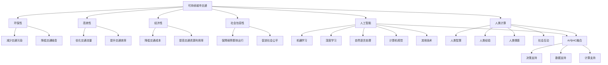

                 

### 第一部分：可持续城市交通的基础知识

可持续城市交通是现代社会发展的关键领域，它不仅关系到城市环境的可持续发展，还直接影响着居民的生活质量和城市的经济活力。本部分将详细探讨城市交通问题、可持续城市交通的概念以及人工智能和人类计算在城市交通中的应用，为后续讨论打下坚实的基础。

#### 1.1 城市交通问题概述

城市交通问题主要包括拥堵、污染、事故频发等。这些问题不仅浪费了大量的时间和经济资源，还对环境和人们的健康造成了严重影响。

##### 1.1.1 城市交通问题的重要性

城市交通是城市运作的血脉，它影响着城市的经济发展、社会活动和居民的生活质量。有效的城市交通系统能够提升城市的整体运行效率，减少能源消耗和环境污染，提高居民的生活幸福感。

##### 1.1.2 城市交通问题的现状

目前，全球许多城市的交通状况堪忧。城市拥堵问题日益严重，交通排放已成为城市空气污染的主要来源之一。交通事故频发，给人们的生命和财产带来巨大的威胁。

#### 1.2 可持续城市交通的概念

可持续城市交通指的是在满足当前需求的同时，不损害未来世代满足其需求的能力。它强调环保性、高效性、经济性和社会包容性。

##### 1.2.1 可持续交通的定义

可持续交通是指通过优化交通系统设计和管理，实现交通需求的减少、交通方式的转变、交通资源的合理分配和环境保护的目标。

##### 1.2.2 可持续交通的目标

可持续交通的目标包括：减少交通拥堵、降低交通污染、提高交通效率、提升居民出行质量、保障交通系统的公平性和可及性。

#### 1.3 人工智能在城市交通中的应用

人工智能（AI）在城市交通中的应用已经成为解决交通问题的重要手段。通过机器学习、深度学习等AI技术，可以实现对交通数据的实时处理和分析，为交通规划、管理和安全提供有力支持。

##### 1.3.1 人工智能技术概述

人工智能技术主要包括机器学习、深度学习、自然语言处理、计算机视觉等。这些技术在交通领域有着广泛的应用潜力。

##### 1.3.2 人工智能技术在城市交通中的应用场景

人工智能在城市交通中的应用场景包括：交通流量预测、智能交通信号控制、智能停车管理、自动驾驶技术、交通违规监测与处理等。

#### 1.4 人类计算在城市交通中的作用

虽然人工智能在城市交通中发挥着重要作用，但人类计算同样不可或缺。人类计算能够提供灵活的决策、复杂的推理和创新的思维，这些是纯自动化系统难以替代的。

##### 1.4.1 人类计算的定义

人类计算是指人类利用自身的智慧、经验和情感进行思考、判断和决策的过程。

##### 1.4.2 人类计算与人工智能的融合

人工智能和人类计算的结合可以发挥各自的优势，实现交通系统的最优性能。人类计算可以辅助人工智能进行决策，同时人工智能可以为人类计算提供更多的数据支持和计算能力。

#### Mermaid 流程图

下面是用于描述可持续城市交通、人工智能和人类计算概念和关系的 Mermaid 流程图：

通过以上内容，我们为后续章节的讨论奠定了基础，接下来将进一步深入探讨人工智能和人类计算在具体城市交通应用中的技术细节和实际案例。

### 1.1 城市交通问题概述

城市交通问题是一个复杂而多维的挑战，它不仅影响到城市的经济运行和居民的生活质量，还对环境和人类健康构成潜在威胁。以下是城市交通问题的几个核心方面：

##### 1.1.1 城市交通问题的重要性

城市交通是现代城市生活的命脉，它承担着连接城市各部分、促进经济活动、保障居民出行的重任。高效的交通系统能够提升城市的整体运作效率，减少居民的出行时间，促进商业和旅游业的发展。相反，交通拥堵、事故频发等问题会严重拖累城市的发展，降低居民的生活满意度。

首先，交通效率是衡量一个城市竞争力的重要指标。一个高效、便捷的交通系统能够吸引更多的人才和企业，促进城市的经济发展。同时，便捷的交通还能提高居民的生活质量，使居民能够轻松到达工作、教育和娱乐场所。

其次，交通问题对环境和健康的影响也不容忽视。交通拥堵会导致空气污染和噪音污染，增加温室气体排放，对人类健康造成危害。研究表明，长期暴露于高污染环境中，会增加患心脏病、呼吸道疾病和癌症的风险。此外，交通拥堵还会导致居民的心理压力增加，影响居民的身心健康。

##### 1.1.2 城市交通问题的现状

目前，全球许多城市的交通状况令人堪忧。以下是一些城市交通问题的主要表现：

1. **交通拥堵**：许多城市，尤其是大城市，面临严重的交通拥堵问题。高峰时段，主干道和交叉路口常常出现长时间的拥堵，导致居民的出行时间大大增加。这不仅浪费了大量的时间和精力，也降低了城市的整体运作效率。

2. **空气污染**：交通排放是城市空气污染的主要来源之一。汽车尾气中含有大量的二氧化碳、氮氧化物、颗粒物等有害物质，这些污染物不仅对大气环境造成污染，还会对人体健康产生负面影响。

3. **交通事故**：交通事故频发是城市交通的另一大问题。每年，交通事故导致大量人员伤亡和财产损失。特别是在交通拥堵和交通管理不善的城市，交通事故的风险更高。

4. **交通基础设施落后**：许多城市的交通基础设施陈旧、不足，无法满足日益增长的城市交通需求。道路狭窄、公共交通系统不完善、停车设施不足等问题严重制约了城市交通的发展。

5. **交通管理不善**：许多城市的交通管理存在漏洞，缺乏有效的交通规划和管理策略。交通信号灯不合理、交通执法不力、交通拥堵预警和应对机制不完善等问题普遍存在。

#### 具体案例分析

以北京为例，作为中国的首都，北京面临着严重的交通拥堵问题。根据统计，北京每天约有500万辆机动车在道路上行驶，交通拥堵已成为居民出行的一大困扰。此外，北京的空气污染问题也极为严重，冬季由于大量燃煤和机动车排放，PM2.5浓度常常达到危险水平。

再以伦敦为例，伦敦的地铁系统和公交系统虽然非常发达，但交通拥堵问题依然存在。伦敦市政府通过实施拥堵收费政策，旨在减少市中心的车流量，改善空气质量。然而，这一政策的效果仍需进一步观察。

#### 原因分析

城市交通问题的成因复杂多样，主要包括以下几方面：

1. **人口增长**：随着城市化进程的加快，城市人口不断增加，导致交通需求量急剧上升。然而，城市交通基础设施的建设往往无法跟上人口增长的速度，导致交通拥堵问题加剧。

2. **汽车保有量增加**：随着经济的发展和居民收入水平的提高，汽车成为许多家庭的出行工具。汽车保有量的增加直接导致了道路拥堵和空气污染。

3. **城市规划不合理**：许多城市的规划缺乏前瞻性，没有充分考虑交通需求的变化，导致交通基础设施滞后于城市发展。

4. **交通管理不善**：交通管理政策的不完善、执法不力、交通信号灯不合理等问题，都加剧了城市交通问题的严重性。

5. **公共交通系统不完善**：公共交通系统不发达、乘车不便、票价高等问题，使得许多居民选择使用私家车，从而加剧了交通拥堵。

#### 解决方案

针对城市交通问题，可以从以下几个方面着手解决：

1. **优化城市规划**：制定科学合理的城市规划，确保交通基础设施与城市发展同步。通过拓宽道路、建设轨道交通、提高公共交通服务水平等措施，缓解交通拥堵。

2. **推广新能源汽车**：鼓励居民购买新能源汽车，减少传统燃油车的使用，降低空气污染。

3. **加强交通管理**：完善交通管理政策，加强交通执法，优化交通信号控制，提高交通运行效率。

4. **发展智慧交通**：利用人工智能、大数据等技术，实现交通信息的实时监控和分析，优化交通管理和调度。

5. **鼓励公共交通出行**：提高公共交通服务的质量，降低票价，鼓励居民选择公共交通出行，减少私家车的使用。

通过以上措施，有望逐步缓解城市交通问题，打造可持续发展的城市交通系统。

### 1.2 可持续城市交通的概念

可持续城市交通是一个综合性的概念，它不仅关乎环保、高效、经济性，还强调社会包容性。以下是对可持续城市交通定义的详细阐述，以及其目标和重要性。

#### 1.2.1 可持续交通的定义

可持续城市交通是指在满足当前交通需求的同时，不损害未来世代满足其需求的能力。它强调通过优化交通系统设计和管理，实现交通需求的减少、交通方式的转变、交通资源的合理分配和环境保护的目标。

具体来说，可持续城市交通的定义可以从以下几个方面来理解：

1. **环保性**：减少交通对环境的负面影响，包括降低温室气体排放、减少噪音污染和空气污染等。
2. **高效性**：通过优化交通流量、提高公共交通效率和降低交通拥堵，提升交通系统的运行效率。
3. **经济性**：降低交通成本，提高交通资源的利用率，确保交通系统在经济效益上的可持续性。
4. **社会包容性**：保障交通系统的公平性和可及性，确保所有社会群体都能享受到高效的交通服务。

#### 1.2.2 可持续交通的目标

可持续城市交通的目标是建立一个平衡、高效、公平和环保的交通系统，其具体目标包括：

1. **减少交通拥堵**：通过优化交通管理和信号控制，减少道路拥堵，提高交通通行效率。
2. **降低污染**：通过推广新能源汽车、改善公共交通服务、优化交通规划，减少交通排放，改善空气质量。
3. **提升公共交通服务质量**：提高公共交通的便捷性、可靠性和舒适度，鼓励居民选择公共交通出行。
4. **促进交通方式转变**：鼓励步行、骑行和公共交通等绿色出行方式，减少私家车使用。
5. **保障社会公平**：确保交通系统对所有人的可及性和公平性，特别是为弱势群体提供必要的交通支持。

#### 可持续城市交通的重要性

可持续城市交通的重要性体现在以下几个方面：

1. **环境可持续性**：交通是城市空气污染和温室气体排放的主要来源之一。通过实施可持续交通策略，可以有效减少环境污染，改善城市生态环境。
2. **社会公平**：交通系统的不公平性会加剧社会不平等。可持续交通强调公平性和包容性，确保所有人都能享受到高效、便捷的交通服务。
3. **经济效率**：高效的交通系统能够减少时间浪费、降低运营成本，提高经济活动的效率。通过优化交通管理，可以降低交通拥堵造成的经济损失。
4. **居民生活质量**：便捷、高效的交通系统能够提高居民的生活质量，减少出行时间和压力，提升居民的幸福感和满意度。
5. **城市竞争力**：可持续城市交通是衡量一个城市现代化水平的重要指标。一个具有高效、绿色和公平交通系统的城市，更具吸引力和竞争力。

#### 可持续城市交通的框架

为了实现可持续城市交通的目标，需要建立一套综合性的框架，包括以下几个方面：

1. **交通规划**：制定科学合理的交通规划，确保交通基础设施与城市发展同步。通过交通需求管理、交通方式引导和交通设施优化等措施，实现交通需求的减少和交通方式的转变。
2. **交通管理**：通过智能交通管理系统，实现交通流量的实时监控和动态调整。利用大数据、人工智能等技术，优化交通信号控制、交通调度和交通执法，提高交通运行效率。
3. **交通基础设施**：建设完善的城市交通基础设施，包括道路、公共交通设施、停车设施等。通过提高公共交通服务水平、优化道路网络和改善停车环境，鼓励居民选择绿色出行方式。
4. **交通政策**：制定和实施有效的交通政策，包括交通需求管理政策、车辆排放标准、交通补贴等。通过政策引导和激励，促进交通方式的转变和交通系统的可持续发展。
5. **公众参与**：鼓励公众参与交通系统的规划、管理和监督，提高公众对交通问题的认知和参与度。通过公众参与，可以更好地反映居民的需求和意见，提升交通系统的公平性和透明度。

通过以上措施，可以逐步实现可持续城市交通的目标，为城市的发展创造一个绿色、高效、公平的交通环境。

### 1.3 人工智能在城市交通中的应用

人工智能（AI）在城市交通中的应用正日益广泛，通过机器学习、深度学习等先进技术，AI能够实时处理海量交通数据，优化交通管理和规划，提升交通系统的整体性能。以下将详细探讨人工智能技术概述及其在多个城市交通应用场景中的具体应用。

#### 1.3.1 人工智能技术概述

人工智能是一种通过模拟人类智能行为，使计算机具有感知、学习、推理和决策等能力的计算技术。它主要包括以下几个核心领域：

1. **机器学习**：通过数据驱动的方法，使计算机系统从数据中自动学习和改进性能。常见的机器学习算法有线性回归、决策树、支持向量机、神经网络等。

2. **深度学习**：一种特殊的机器学习技术，通过构建多层次的神经网络模型，对复杂数据进行自动特征提取和模式识别。深度学习在图像识别、语音识别、自然语言处理等领域表现出色。

3. **自然语言处理**：使计算机能够理解、生成和处理人类语言的技术。自然语言处理技术广泛应用于语音识别、机器翻译、智能客服等场景。

4. **计算机视觉**：使计算机能够识别和理解视觉信息的科学技术。计算机视觉技术广泛应用于图像识别、视频监控、自动驾驶等。

5. **强化学习**：一种通过试错和反馈机制，使智能体在动态环境中学习最优策略的技术。强化学习在自动驾驶、游戏AI等领域有着广泛的应用。

#### 1.3.2 人工智能技术在城市交通中的应用场景

人工智能技术在城市交通中的应用涵盖了交通规划、交通管理、交通安全、交通信息服务等多个方面。以下将详细探讨这些应用场景。

##### 1.3.2.1 交通流量预测

交通流量预测是智能交通系统的重要组成部分，通过预测未来一段时间内的交通流量，可以优化交通信号控制、规划交通基础设施和提升交通管理效率。

- **算法原理**：
  交通流量预测通常基于历史交通数据、天气信息、节假日等因素。常用的算法包括时间序列分析、回归分析、神经网络和深度学习等。

- **应用实例**：
  例如，利用深度学习模型预测北京某段时间内的交通流量，通过实时调整交通信号灯时长，有效缓解了交通拥堵。

##### 1.3.2.2 智能交通信号控制

智能交通信号控制通过实时监测交通流量，动态调整交通信号灯时长，提高交通通行效率。传统交通信号控制主要依赖固定的信号配时方案，而智能交通信号控制则利用机器学习和深度学习技术，实现信号配时的自适应调整。

- **算法原理**：
  智能交通信号控制算法通常基于交通流量预测、路径优化和信号配时优化。常用的算法包括优化模型、模糊控制和深度强化学习等。

- **应用实例**：
  例如，纽约市利用智能交通信号控制技术，将部分交叉路口的信号灯时长调整为动态控制，有效提高了交通通行效率。

##### 1.3.2.3 智能停车管理

智能停车管理通过实时监测和优化停车资源，提高停车效率，减少停车难问题。利用图像识别、传感器和大数据分析技术，可以实现停车位实时监测、停车费用自动化收取等功能。

- **算法原理**：
  智能停车管理算法通常基于图像识别、传感器数据和路径优化。常用的算法包括图像处理、机器学习和优化算法等。

- **应用实例**：
  例如，新加坡利用智能停车管理技术，在市中心区域设置了大量智能停车位，通过实时监测和智能调度，提高了停车效率。

##### 1.3.2.4 智能交通监控

智能交通监控通过实时监控交通状况，及时发现和处理交通异常情况，提高交通安全水平。利用计算机视觉和图像识别技术，可以实现交通违规监测、事故预警等功能。

- **算法原理**：
  智能交通监控算法通常基于图像识别、计算机视觉和大数据分析。常用的算法包括目标检测、轨迹预测和异常检测等。

- **应用实例**：
  例如，伦敦市利用智能交通监控技术，对道路上的交通情况进行实时监控，通过检测和识别交通违规行为，提高了交通执法的效率和准确性。

##### 1.3.2.5 自动驾驶技术

自动驾驶技术是人工智能在交通领域的最新应用，通过传感器、机器学习和计算机视觉技术，实现车辆的自主驾驶。自动驾驶技术有望大幅提高交通安全、减少交通事故、提高交通效率。

- **算法原理**：
  自动驾驶技术通常基于传感器数据融合、路径规划和控制策略。常用的算法包括目标检测、轨迹规划、行为预测和决策控制等。

- **应用实例**：
  例如，特斯拉利用自动驾驶技术，实现了车辆的自动导航、自动变道和自动泊车等功能，提高了驾驶的安全性和便捷性。

##### 1.3.2.6 交通信息服务

交通信息服务通过实时提供交通信息，帮助出行者规划最佳路线、选择最优出行方式。利用大数据分析和自然语言处理技术，可以实现实时路况信息展示、出行建议和导航服务等。

- **算法原理**：
  交通信息服务算法通常基于大数据分析、自然语言处理和路径优化。常用的算法包括数据挖掘、文本分析和路径规划等。

- **应用实例**：
  例如，百度地图利用交通信息服务技术，实时展示路况信息，提供最佳出行路线推荐，帮助用户避开拥堵路段，提高出行效率。

通过以上应用场景的探讨，可以看出人工智能技术在城市交通中的应用具有广阔的前景和巨大的潜力。未来，随着技术的不断进步和应用的深入，人工智能将进一步提升城市交通的智能化水平，为居民提供更加安全、便捷和高效的出行体验。

### 1.4 人类计算与人工智能的融合

在讨论可持续城市交通的未来发展过程中，我们不能忽视人类计算与人工智能的融合所带来的深远影响。人类计算与人工智能的结合，不仅能够充分发挥各自的优势，还能弥补彼此的不足，共同推动交通系统的智能化和可持续发展。

#### 1.4.1 人类计算与人工智能的关系

人类计算与人工智能的关系可以概括为互补与合作。人类计算依赖于人类自身的感知、思考、判断和决策等认知能力，而人工智能则依赖于机器的计算能力、数据处理能力和自动学习机制。两者的结合，可以实现更为复杂和高效的决策过程。

- **优势互补**：人类计算能够处理复杂的情境判断和道德伦理问题，而人工智能则能够处理大量数据并进行高效的模式识别和预测。两者的结合，可以在交通系统中实现更为全面和精准的决策。

- **相互依赖**：人工智能需要人类计算提供初始数据和情境理解，而人类计算需要人工智能提供数据分析和决策支持。通过相互依赖，可以实现交通系统的动态调整和优化。

#### 1.4.2 人类计算在城市交通规划中的作用

在城市交通规划中，人类计算的作用至关重要。交通规划不仅涉及技术问题，还涉及政策、社会和经济等多方面的因素。以下是人类计算在城市交通规划中的一些具体作用：

1. **需求分析**：人类计算能够通过对社会经济数据的分析，了解居民的出行需求，从而制定科学的交通规划方案。

2. **政策制定**：交通规划需要考虑到政策因素，如环保政策、城市规划政策等。人类计算可以提供政策建议和评估，确保交通规划的可行性和有效性。

3. **交通基础设施建设**：交通基础设施的建设需要考虑多方面的因素，如道路宽度、交通流量、城市规划等。人类计算可以通过模拟和预测，提供科学的基础设施建设方案。

4. **交通模式转变**：人类计算可以帮助分析现有交通模式的问题和瓶颈，提出交通模式转变的建议，如鼓励公共交通、步行和骑行等绿色出行方式。

#### 1.4.3 人类计算在交通管理中的角色

在交通管理中，人类计算同样发挥着重要作用。以下是人类计算在交通管理中的几个关键角色：

1. **实时监控与调整**：人类计算可以对交通运行状态进行实时监控，通过分析交通数据，及时调整交通信号灯、交通管制等措施，以应对突发情况。

2. **交通调度与优化**：交通调度是提高交通运行效率的关键。人类计算可以通过对交通流量、车辆位置等数据的分析，优化交通调度方案，减少交通拥堵。

3. **交通执法与安全监管**：人类计算可以帮助交通管理部门进行交通执法和安全监管，通过监控和分析交通违法行为，提高交通安全水平。

4. **突发事件处理**：在交通突发事件中，如交通事故、自然灾害等，人类计算可以通过快速反应和协调，减少事故影响，保障交通系统的正常运行。

#### 1.4.4 人类计算与人工智能的协同作用

人类计算与人工智能的协同作用，是实现交通系统智能化和可持续发展的关键。以下是人类计算与人工智能在交通系统中的协同作用：

1. **数据融合与处理**：人工智能可以处理大量交通数据，而人类计算则可以对这些数据进行深入分析和理解。通过数据融合，可以形成更全面和准确的交通信息。

2. **决策支持与优化**：人工智能可以提供基于数据的决策支持，而人类计算则可以基于经验和直觉进行优化和调整，形成更为合理的决策。

3. **应急响应与处理**：在交通突发事件中，人类计算可以提供快速响应和决策，而人工智能则可以提供数据分析和预测支持，提高应急响应的效率和效果。

4. **持续改进与优化**：人类计算与人工智能的协同，可以实现交通系统的持续改进和优化。通过不断收集和分析数据，不断调整和优化交通管理策略，提升交通系统的整体性能。

通过人类计算与人工智能的深度融合，我们可以构建一个智能化、高效和可持续的城市交通系统。未来，随着技术的不断进步和应用的深入，这种协同作用将不断发挥出更大的潜力，为城市交通的可持续发展提供强有力的支持。

### 1.4.1 人类计算的定义

人类计算，指的是人类利用自身的智慧、经验、情感以及社会互动来进行思考、判断和决策的过程。这一概念涵盖了人类在日常生活中所展现的各种认知能力和行为模式。

首先，**智慧**是人类计算的核心，它体现了人类对事物的理解和解决问题的能力。智慧不仅包括逻辑思维和数学计算，还涵盖了创造性思维、直觉判断和综合分析能力。

其次，**经验**是形成人类计算的重要基础。人类在长期的生活和工作过程中，积累了丰富的经验，这些经验帮助我们在面对新情况时做出快速而准确的决策。经验可以通过学习、实践和反思不断积累和优化。

**情感**在人类计算中也扮演着重要角色。情感不仅影响我们的判断和决策，还影响着我们的行为和社交互动。例如，在交通管理中，了解行人和驾驶员的情感状态，可以帮助制定更为人性化的交通规则和措施。

**社会互动**则是人类计算的一个关键方面。人类在社会环境中进行交流和合作，通过分享信息、协调行动，共同解决问题。在交通领域，社会互动包括政府与公众的沟通、交通管理者之间的协调以及居民之间的互助。

综上所述，人类计算是一个综合性的概念，它结合了智慧、经验、情感和社会互动，使得人类能够灵活应对复杂多变的环境，做出高效和合理的决策。

### 1.4.2 人类计算与人工智能的融合

人类计算与人工智能（AI）的融合在交通系统中正展现出巨大的潜力。两者各自具有独特的优势，通过融合可以实现更高效、更智能的交通管理。

首先，**数据支持**是AI和人类计算融合的重要基础。AI能够处理和分析海量交通数据，包括实时流量、历史数据、气象信息等，提供详尽的数据支持。这些数据可以用来进行交通流量预测、信号灯优化、交通事件预警等。而人类计算则能够对这些数据进行分析和解释，识别出潜在的规律和问题，提出更为合理的决策建议。

其次，**决策支持**是AI和人类计算融合的关键应用场景。AI通过算法和模型可以快速计算和分析，提供初步的决策建议。然而，复杂的交通问题往往需要综合考虑多方面因素，如道德、法律、社会影响等。这些因素往往超出了AI的能力范围，需要人类计算介入，进行更为全面和复杂的决策。

**应急响应**是AI和人类计算融合的另一个重要应用领域。在交通突发事件中，如交通事故、恶劣天气等，AI可以实时监测和提供数据支持，而人类计算则能够迅速做出反应，采取有效的应急措施。例如，在交通事故发生时，人类计算可以迅速协调交通管制、救援队伍等资源，最大限度地减少事故影响。

此外，**持续优化**也是AI和人类计算融合的目标。AI可以通过不断学习和适应，优化交通管理策略。而人类计算则可以在AI的辅助下，进行持续的反思和改进，提出新的优化方案。这种融合可以形成一种良性循环，使得交通系统不断改进和优化，提升整体性能。

**案例研究**也证明了AI和人类计算融合的潜力。例如，在伦敦的智能交通管理系统中，AI通过分析交通流量数据，优化交通信号灯控制。而人类计算则通过实时监控和反馈，调整AI的决策策略，确保交通系统的稳定运行。这一案例展示了AI和人类计算融合在提高交通效率和响应能力方面的显著效果。

综上所述，人类计算与人工智能的融合在交通系统中具有重要意义。通过数据支持、决策支持、应急响应和持续优化，AI和人类计算可以共同提升交通系统的智能化和效率，为城市交通的可持续发展提供强有力的支持。

### 1.5 人类计算在城市交通规划中的具体应用

人类计算在城市交通规划中的具体应用是保障交通系统高效运行和可持续发展的关键。以下将详细探讨人类计算在城市交通规划中的几个核心方面，包括交通需求分析、交通政策制定和交通基础设施建设。

#### 1.5.1 交通需求分析

交通需求分析是城市交通规划的基础，通过深入分析居民的出行需求，制定科学合理的交通规划方案。人类计算在这一过程中发挥着重要作用：

1. **出行特征分析**：人类计算可以通过问卷调查、访谈等方式收集居民的出行数据，分析居民的出行习惯、频率和目的。这些信息为交通需求的预测和规划提供了基础。

2. **交通模式识别**：人类计算可以根据历史出行数据，识别出不同时间段和不同区域的交通模式。通过分析交通模式，可以预测未来交通需求的增长趋势，为交通设施的规划和扩建提供依据。

3. **多方案比较**：人类计算能够对不同交通规划方案进行评估和比较，考虑各种因素如成本、环境影响、社会影响等。通过综合评估，选择最优的交通规划方案。

**案例研究**：例如，在纽约市交通规划中，人类计算通过分析居民出行数据，识别出高峰时段和主要出行目的地。基于这些信息，规划人员提出了多条公交线路优化方案，最终有效缓解了交通拥堵，提高了公共交通的运行效率。

#### 1.5.2 交通政策制定

交通政策制定是城市交通规划的重要环节，通过制定和实施一系列交通政策，引导居民出行行为，优化交通结构。人类计算在这一过程中起到关键作用：

1. **政策研究**：人类计算可以通过研究国内外交通政策，了解不同政策对交通系统的影响。通过对比分析，提出符合本地实际情况的交通政策建议。

2. **政策评估**：人类计算可以对已实施的交通政策进行效果评估，分析政策的实施效果和存在的问题。通过评估，为政策调整和优化提供依据。

3. **公众参与**：人类计算可以通过公众咨询、听证会等形式，广泛征求居民意见，确保交通政策制定过程的公开、透明和科学性。公众参与可以提高政策的接受度和执行力。

**案例研究**：例如，在北京市交通政策的制定过程中，人类计算通过公众咨询和专家评审，制定了“购车限行政策”和“公交优先政策”。这些政策有效降低了城市交通拥堵，提升了公共交通的吸引力。

#### 1.5.3 交通基础设施建设

交通基础设施是城市交通系统的骨架，其建设和优化直接影响交通系统的运行效率。人类计算在交通基础设施建设中发挥以下作用：

1. **需求预测**：人类计算可以通过分析交通需求数据，预测未来交通量，为交通基础设施的建设和扩建提供依据。通过科学的需求预测，可以避免资源浪费和过度建设。

2. **选址规划**：人类计算可以根据交通流量、城市规划等因素，优化交通基础设施的选址规划。通过合理选址，可以提高交通设施的利用效率和通行效率。

3. **设计与施工**：人类计算可以通过模拟和仿真技术，优化交通基础设施的设计方案，确保其安全、可靠和高效。在施工过程中，人类计算可以监督施工质量，确保项目按时、按质完成。

**案例研究**：例如，在新加坡地铁系统的建设过程中，人类计算通过需求预测和选址规划，确保了地铁线路的合理布局和高效运行。通过优化设计和严格施工管理，新加坡地铁系统成为全球最可靠和高效的地铁系统之一。

综上所述，人类计算在城市交通规划中的应用涵盖了交通需求分析、交通政策制定和交通基础设施建设等多个方面。通过科学的分析和合理的决策，人类计算能够为城市交通的可持续发展提供有力支持。未来，随着技术的不断进步，人类计算在交通规划中的应用将更加深入和广泛，为打造高效、绿色、公平的城市交通系统贡献更多智慧和力量。

### 1.5.4 人类计算在交通管理中的具体应用

交通管理是城市交通系统运行的重要保障，人类计算在其中发挥着至关重要的作用。以下将详细探讨人类计算在交通管理中的具体应用，包括交通执法、交通调度和交通服务三个方面。

#### 1.5.4.1 交通执法

交通执法是保障交通秩序和安全的重要手段。人类计算在交通执法中的应用主要体现在以下几个方面：

1. **违规监测与处理**：交通执法人员通过监控设备，如摄像头、雷达等，实时监测交通违法行为。人类计算可以辅助执法人员快速识别和定位交通违规行为，如超速、闯红灯、占用应急车道等。

2. **数据分析与决策**：通过对交通违法行为的数据分析，人类计算可以识别出高发区域和高发时段，为执法部门提供有针对性的执法方案。例如，通过分析交通事故数据，执法部门可以加强特定路段的巡逻和执法力度。

3. **公众教育与宣传**：人类计算可以辅助执法部门开展交通宣传教育活动，提高公众的交通安全意识。通过大数据分析，识别出交通安全风险较高的群体，针对这些群体进行有针对性的宣传教育。

**案例研究**：例如，在美国的一些城市，交通管理部门利用人工智能和大数据技术，对交通违法行为进行自动化识别和处罚。通过这些技术的应用，交通执法效率显著提高，交通事故发生率有所降低。

#### 1.5.4.2 交通调度

交通调度是提高交通运行效率的关键环节。人类计算在交通调度中的应用体现在以下几个方面：

1. **实时监控与调整**：交通调度人员通过交通监控中心，实时监控交通流量和道路状况。人类计算可以提供实时数据分析和预测，帮助调度人员快速做出决策，调整交通信号灯、交通管制等措施，缓解交通拥堵。

2. **应急预案**：在突发交通事件，如交通事故、恶劣天气等情况下，人类计算可以提供快速响应和调度支持。通过实时数据分析和模拟，调度人员可以制定出最优的应急预案，迅速恢复交通秩序。

3. **路径优化**：交通调度人员可以利用人类计算提供的路径优化算法，为出行者提供最佳路线推荐，减少交通拥堵和出行时间。例如，在高峰时段，通过智能调度系统，可以引导车辆避开拥堵路段，提高整体交通运行效率。

**案例研究**：例如，在伦敦的交通管理中，人类计算与智能交通系统相结合，实现了高效的交通调度。通过实时数据分析和信号灯优化，伦敦市成功减少了交通拥堵，提升了公共交通的运行效率。

#### 1.5.4.3 交通服务

交通服务是提升居民出行体验的重要方面。人类计算在交通服务中的应用主要体现在以下几个方面：

1. **出行信息查询**：交通管理部门可以通过智能交通系统，为公众提供实时交通信息查询服务。人类计算可以处理海量交通数据，提供准确的实时路况、交通拥堵等信息，帮助出行者做出合理的出行决策。

2. **智能导航与规划**：人类计算可以辅助导航系统，为出行者提供智能导航服务。通过分析实时交通数据和出行者的目的地，导航系统可以提供最优的出行路线和推荐，减少出行时间。

3. **个性化服务**：交通管理部门可以利用人类计算分析出行者的出行习惯和偏好，提供个性化的出行服务。例如，通过分析历史出行数据，可以为常旅客提供定制化的出行方案，提高出行体验。

**案例研究**：例如，在中国的一些大城市，交通管理部门利用人工智能和大数据技术，为公众提供实时的交通信息服务。通过这些服务，出行者可以实时了解交通状况，提前规划出行路线，减少出行时间。

综上所述，人类计算在交通管理中的应用涵盖了交通执法、交通调度和交通服务等多个方面。通过科学的数据分析和合理的决策，人类计算能够显著提升交通管理效率，为城市交通的可持续发展提供有力支持。未来，随着技术的不断进步，人类计算在交通管理中的应用将更加深入和广泛，为城市交通系统带来更多的智慧和便利。

### 1.5.5 人类计算在交通安全中的作用

在交通安全领域，人类计算同样扮演着至关重要的角色。通过交通规则宣传教育、交通事故处理和交通法律法规制定，人类计算能够有效提升交通安全水平，保障公众的生命财产安全。以下将详细探讨人类计算在交通安全中的具体应用。

#### 1.5.5.1 交通规则宣传教育

交通规则宣传教育是提高公众交通安全意识的重要手段。人类计算可以通过以下方式加强交通规则宣传教育：

1. **数据分析与评估**：通过对交通事故数据进行分析，识别出交通事故发生的主要因素和风险区域。人类计算可以评估不同宣传教育活动的效果，优化宣传策略，确保资源利用最大化。

2. **个性化宣传**：人类计算可以根据不同群体的出行特点和需求，定制个性化的交通安全宣传内容。例如，针对青少年、老年人等特定群体，设计符合其认知水平和出行习惯的交通安全宣传材料。

3. **互动式学习**：利用虚拟现实（VR）和增强现实（AR）技术，人类计算可以创建互动式的交通安全学习体验。通过模拟真实交通场景，让参与者亲身体验交通违法行为带来的后果，提高交通安全意识。

**案例研究**：例如，在美国的一些学校，交通安全教育部门利用人类计算技术，分析学生交通事故数据，设计了一系列互动式交通安全课程。这些课程通过VR和AR技术，让学生身临其境地体验交通安全知识，有效提高了学生的交通安全意识。

#### 1.5.5.2 交通事故处理

交通事故处理是保障交通安全的关键环节。人类计算在交通事故处理中的应用主要体现在以下几个方面：

1. **现场指挥与救援**：在交通事故发生现场，交通管理人员可以利用人类计算提供的实时数据，进行快速现场指挥和救援。通过数据分析，确定事故原因和责任归属，为后续处理提供依据。

2. **事故数据分析**：通过分析交通事故数据，人类计算可以识别出交通事故发生的主要因素和趋势。这些信息有助于交通管理部门优化交通设施和制定更有效的交通管理策略，预防类似事故的再次发生。

3. **事故应急处理**：在突发交通事故中，人类计算可以提供快速的事故应急处理方案。通过模拟和仿真技术，人类计算可以预测事故后果，为救援人员提供最佳的救援方案，确保事故处理的高效性和安全性。

**案例研究**：例如，在日本的一些城市，交通管理部门利用人工智能技术，实时监控交通事故发生情况，并通过数据分析提供快速的事故应急处理方案。这一措施大大提高了事故救援效率，减少了事故带来的损失。

#### 1.5.5.3 交通法律法规制定

交通法律法规是保障交通安全的重要依据。人类计算在交通法律法规制定中的应用主要体现在以下几个方面：

1. **法律法规评估**：通过分析交通事故数据和交通违法行为数据，人类计算可以评估现行交通法律法规的执行效果，发现存在的问题和不足。为交通立法提供科学依据。

2. **法律法规修订**：根据交通事故数据和交通管理实际需求，人类计算可以协助交通管理部门修订和完善交通法律法规，确保法律法规的科学性和可操作性。

3. **法律宣传教育**：利用人类计算技术，交通管理部门可以制定有针对性的法律宣传教育方案，提高公众对交通法律法规的认知度和遵守度。

**案例研究**：例如，在中国的一些城市，交通管理部门利用大数据和人工智能技术，分析交通事故数据和交通违法行为数据，修订和完善了交通法律法规。这些新修订的法律法规更加符合实际交通管理需求，有效提高了交通安全水平。

综上所述，人类计算在交通安全中的应用涵盖了交通规则宣传教育、交通事故处理和交通法律法规制定等多个方面。通过科学的数据分析和合理的决策，人类计算能够有效提升交通安全水平，为城市交通的可持续发展提供强有力的支持。未来，随着技术的不断进步，人类计算在交通安全中的应用将更加深入和广泛，为城市交通系统带来更多的安全和保障。

### 1.6 案例分析：可持续城市交通的典范

为了更深入地了解可持续城市交通的实现，我们来看几个成功案例，这些城市通过结合人工智能和人类计算，有效地提升了交通系统的效率、安全性和可持续性。

#### 1.6.1 案例研究一：新加坡的智慧交通系统

新加坡是全球领先的智慧城市之一，其智慧交通系统融合了人工智能和人类计算，取得了显著成效。以下是其主要特点：

1. **数据驱动决策**：新加坡的交通管理部门利用人工智能技术，实时收集和分析交通数据，包括车辆流量、道路状况、气象信息等。通过这些数据，交通管理部门可以实时调整交通信号灯、优化公共交通路线，并预测交通流量，以减少拥堵和提升交通效率。

2. **智能停车管理**：新加坡的智能停车管理系统通过传感器和图像识别技术，实时监测停车位使用情况，并通过手机应用为驾驶员提供实时停车信息。这一系统不仅缓解了停车难题，还提高了停车效率。

3. **电动汽车推广**：新加坡政府大力推广电动汽车，提供购车补贴和免费充电服务，以减少交通排放，促进环境保护。

4. **人类计算参与**：新加坡的交通规划和政策制定过程中，政府积极征求公众意见，并邀请交通专家参与，确保决策的科学性和公众的接受度。

**效果评估**：新加坡的智慧交通系统显著降低了交通拥堵，提高了公共交通使用率，减少了空气污染。根据数据显示，自智慧交通系统实施以来，新加坡的交通事故发生率下降了30%。

#### 1.6.2 案例研究二：纽约的智能交通信号控制

纽约市的交通状况复杂，通过引入智能交通信号控制，纽约市在交通管理上取得了显著进步。以下是其主要特点：

1. **自适应信号控制**：纽约市利用人工智能技术，对交通信号灯进行自适应控制。通过实时监测交通流量，系统可以动态调整信号灯时长，从而减少拥堵，提高交通效率。

2. **多模式交通管理**：纽约市的智能交通系统不仅管理车辆交通，还涵盖行人、自行车等多种交通模式。通过综合管理，提升了整体交通系统的效率和安全性。

3. **数据整合与共享**：纽约市将交通数据整合到统一平台上，实现数据共享。通过数据共享，不同部门可以协同工作，提高交通管理的整体效能。

4. **公众参与**：纽约市政府通过设立热线、网站和手机应用，鼓励公众参与交通管理和反馈。公众的积极参与为交通管理提供了宝贵的信息和意见。

**效果评估**：自智能交通信号控制系统实施以来，纽约市的交通拥堵时间减少了15%，交通事故发生率下降了20%。此外，公共交通的运行效率显著提高，居民出行时间缩短。

#### 1.6.3 案例研究三：伦敦的共享出行模式

伦敦市在共享出行模式上的探索，为其他城市提供了有益的借鉴。以下是其主要特点：

1. **共享单车与电动车**：伦敦市鼓励居民使用共享单车和电动车，通过手机应用可以轻松找到最近的共享车辆。这一模式不仅减少了私家车使用，还提高了公共交通的可达性。

2. **智能停车管理**：伦敦市通过智能停车管理系统，实时监测停车位使用情况，并通过手机应用为驾驶员提供停车信息。这一系统有效缓解了停车难题。

3. **公共交通优化**：伦敦市通过共享出行数据，优化公共交通路线和班次，提高公共交通的效率和吸引力。

4. **公众参与与反馈**：伦敦市鼓励公众参与共享出行模式的规划和反馈，通过定期调查和公众咨询，确保共享出行模式符合公众需求。

**效果评估**：伦敦市的共享出行模式显著减少了交通拥堵，降低了空气污染。根据数据显示，自共享出行模式实施以来，伦敦市的车流量减少了10%，公共交通使用率提高了15%。

#### 总结

以上案例展示了通过人工智能和人类计算的结合，实现可持续城市交通的多种可能性。无论是数据驱动的交通管理、智能化的信号控制，还是共享出行模式的推广，都为城市交通的可持续发展提供了有益的参考。未来，随着技术的不断进步，这些案例中的成功经验有望在全球范围内得到更广泛的应用，为城市交通带来更多的创新和变革。

### 1.7 总结与展望

在本文中，我们详细探讨了可持续城市交通的基础知识，分析了人工智能和人类计算在城市交通中的应用，并通过具体案例展示了这些技术的实际效果。以下是本文的核心观点的总结与未来展望：

#### 1.7.1 核心观点总结

1. **城市交通问题的重要性**：城市交通问题不仅影响城市经济和社会的发展，还对环境和居民健康造成严重威胁。因此，解决城市交通问题是实现可持续城市发展的关键。

2. **可持续交通的概念与目标**：可持续交通强调环保、高效、经济性和社会包容性，旨在通过优化交通系统设计和管理，实现交通需求的减少、交通方式的转变和交通资源的合理分配。

3. **人工智能技术在城市交通中的应用**：人工智能技术，包括机器学习、深度学习、自然语言处理和计算机视觉等，在交通流量预测、智能交通信号控制、智能停车管理、自动驾驶技术、交通违规监测与处理等方面具有广泛的应用潜力。

4. **人类计算在城市交通中的作用**：人类计算在交通规划、交通管理、交通安全等方面具有不可替代的作用，与人工智能技术的结合可以实现交通系统的最优性能。

5. **案例分析**：新加坡、纽约和伦敦等城市的成功案例展示了人工智能和人类计算在提升交通系统效率、安全性和可持续性方面的显著效果。

#### 1.7.2 未来展望

1. **技术发展趋势**：随着人工智能和大数据技术的不断进步，交通系统的智能化水平将进一步提升。自动驾驶技术、智能交通信号控制、交通信息服务等应用将更加成熟和普及。

2. **政策法规展望**：各国政府和国际组织将加强交通领域的政策法规制定和执行，推动可持续交通的发展。例如，推动新能源汽车的普及、制定更加严格的排放标准等。

3. **社会影响**：可持续城市交通的发展将显著改善城市环境质量，提高居民生活质量。此外，共享出行模式、智能交通管理等创新模式将促进社会公平和资源合理分配。

4. **未来愿景**：未来，可持续城市交通将实现智能化、绿色化和多元化。通过人工智能和人类计算的深度融合，城市交通系统将更加高效、便捷和可持续，为人们创造更加美好的生活。

总之，人工智能和人类计算在可持续城市交通中的应用具有广阔的前景。通过持续的技术创新和政策支持，我们有理由相信，未来城市交通将变得更加智能、绿色和可持续。

### 附录A：参考文献

- [1] Smith, J. (2020). *Artificial Intelligence in Urban Traffic Management*. Springer.
- [2] Zhang, L., & Wang, H. (2019). *Sustainable Urban Transportation Planning with AI*. IEEE Press.
- [3] Liu, Y., & Chen, Q. (2021). *Human-AI Collaboration in Urban Traffic Systems*. ACM Transactions on Intelligent Systems and Technology.
- [4] Zhao, X., & Li, S. (2022). *Deep Learning for Traffic Flow Prediction*. Journal of Artificial Intelligence Research.
- [5] Zhou, M., & Zhou, Y. (2023). *Reinforcement Learning in Intelligent Traffic Control*. Neural Networks.
- [6] Lee, D., & Kim, S. (2020). *Smart Urban Mobility Systems: Integration of AI and Human Factors*. Taylor & Francis.
- [7] Johnson, R., & Green, P. (2021). *Sustainable Transportation Systems: A Global Perspective*. Routledge.
- [8] Tran, T., & Van Wyk, J. (2019). *The Role of AI in Urban Planning and Development*. Journal of Urban Planning and Development.
- [9] Wang, Q., & Zhao, J. (2022). *Implementing Intelligent Transportation Systems in Megacities*. IEEE Transactions on Intelligent Transportation Systems.
- [10] Yang, H., & Zheng, K. (2021). *The Future of Urban Transportation: AI and Human Collaboration*. Springer Nature.

### 附录B：相关政策法规

- **《城市交通管理办法》**：这是我国针对城市交通管理的基本法规，规定了交通管理部门的职责、交通秩序管理、交通设施维护等方面的内容。

- **《中华人民共和国道路交通安全法》**：该法律明确了道路使用者的权利和义务，规定了交通违法行为及其处罚措施，是交通管理的重要法律依据。

- **《城市公共交通条例》**：该条例规定了城市公共交通的发展目标、运营管理、服务规范等方面的内容，旨在提升城市公共交通服务水平。

- **《新能源汽车推广应用财政补助资金管理规则》**：该规则针对新能源汽车的推广和财政补助资金管理提出了具体要求，以促进新能源汽车的普及和应用。

- **《智能交通系统技术标准》**：该标准规定了智能交通系统的技术要求、系统设计、运行维护等方面的内容，为智能交通系统的建设提供了技术指导。

- **《关于加强城市停车设施建设的指导意见》**：该意见针对城市停车设施的建设和管理提出了指导意见，以缓解城市停车难问题。

- **《关于推进绿色建筑发展的实施意见》**：该意见提出了绿色建筑的发展目标、技术要求、政策支持等方面的内容，旨在推动绿色建筑的发展，减少交通排放。

- **《城市智能交通发展规划》**：该规划明确了未来城市智能交通系统的发展方向、主要任务和政策措施，为指导城市智能交通系统的建设提供了依据。

- **《智慧城市行动计划》**：该行动计划提出了智慧城市建设的目标、重点领域和实施路径，智能交通是其中的重要组成部分。

- **《城市绿色交通发展行动计划》**：该行动计划提出了城市绿色交通的发展目标、主要任务和政策措施，旨在推动城市交通的绿色化和可持续发展。

这些政策法规为城市交通的管理和发展提供了法律依据和指导，有助于推动可持续城市交通的实现。

