                 

### 文章标题

> **关键词：人工智能，人类计算，智慧城市，可持续发展，城市生活方式设计**

> **摘要：本文深入探讨了人工智能与人类计算在城市生活方式与设计中的应用，分析了AI与人类计算的互补关系，以及二者在智慧城市和可持续发展中的关键作用。文章结构清晰，内容丰富，涵盖基础概念、技术基础、应用实践和未来展望，旨在为读者提供全面的技术视角和实际指导。**

### 文章标题

在当今科技飞速发展的时代，人工智能（AI）与人类计算的结合已成为推动智慧城市与可持续发展的重要力量。本文将探讨AI与人类计算在城市生活方式与设计中的关键作用，以及如何通过这种结合实现更高效、更环保、更可持续的城市生活。

关键词：人工智能，人类计算，智慧城市，可持续发展，城市生活方式设计

摘要：

本文首先介绍了AI与人类计算的基本概念、发展历史和技术基础，然后深入探讨了智慧城市中的AI应用，包括智能交通、智能居住环境和智能公共设施的设计。接着，文章探讨了智慧城市与可持续发展的关系，以及如何通过AI设计实现可持续发展。最后，本文通过实践案例展示了AI与城市设计的成功应用，并对未来展望进行了深入分析。

### 第一部分: AI与人类计算的基础

#### 第1章: AI与人类计算的概述

##### 1.1 AI与人类计算的基本概念

**1.1.1 AI的定义与作用**

人工智能（AI）是计算机科学的一个分支，旨在开发能够模拟、延伸和扩展人类智能的理论、算法和应用。AI的目标是使机器能够执行通常需要人类智能才能完成的任务，如视觉识别、语音识别、决策制定和自然语言处理等。

在智慧城市与城市生活方式设计领域，AI的应用涵盖了从交通管理到医疗保健，再到教育和社会治理等多个方面。例如，智能交通系统利用AI技术优化交通流量，减少拥堵；智能家居系统通过AI提高居住的舒适度和能源效率；智能医疗系统利用AI进行疾病预测和个性化治疗。

**1.1.2 人类计算的内涵与价值**

人类计算是指人类在信息处理、推理、决策和问题解决过程中所运用的一系列认知技能和过程。人类计算的优势在于其灵活性和创造性，能够在复杂、不确定的环境中处理信息，进行直觉推理和创新。

在AI与人类计算的结合中，人类计算的内涵与价值体现在以下几个方面：

1. **反馈与优化**：人类计算能够对AI系统的输出进行反馈，提供修正和优化建议，从而提高AI系统的性能和可靠性。
2. **情境理解**：人类计算能够理解情境中的细微差异和复杂性，帮助AI更好地适应特定环境和需求。
3. **道德与伦理**：人类计算在道德和伦理决策中起到关键作用，确保AI系统符合社会规范和价值观。

**1.1.3 AI与人类计算的互补关系**

AI与人类计算在功能上具有互补性。AI擅长处理大量数据和复杂计算，而人类计算则在理解情境、解决复杂问题和进行创造性思维方面具有优势。将二者结合，可以充分发挥各自的优势，实现更高效、更智能的城市生活方式设计。

1. **协同工作**：AI可以辅助人类计算，完成繁琐的计算任务，释放人类的工作压力，使其能够专注于更高层次的任务。
2. **决策支持**：AI可以为人类计算提供实时数据和分析结果，帮助人类做出更明智的决策。
3. **创新驱动**：AI与人类计算的结合可以激发创新，推动新技术的研发和应用。

##### 1.2 AI与人类计算的发展历史

**1.2.1 AI的发展历程**

人工智能的概念最早可以追溯到20世纪50年代。当时，计算机科学家和哲学家开始探讨如何让计算机模拟人类思维和行为。1956年，约翰·麦卡锡（John McCarthy）等人首次提出了人工智能的概念，并召开了首届人工智能会议，标志着人工智能学科的正式诞生。

自那时以来，人工智能经历了多个发展阶段：

1. **早期探索（1956-1969）**：这一阶段主要关注符号主义和知识表示方法，尝试通过编程实现简单的推理和决策。
2. **低谷期（1974-1980）**：由于算法和计算能力的限制，以及过高的期望值，人工智能研究陷入低谷。
3. **复兴期（1980-1987）**：专家系统和模式识别技术的发展，使人工智能研究重新焕发生机。
4. **繁荣期（1988-2012）**：深度学习和神经网络技术的突破，使人工智能取得了显著的进展。
5. **当前（2012至今）**：人工智能技术已广泛应用于各个领域，取得了前所未有的成就。

**1.2.2 人类计算的历史变革**

人类计算的历史变革可以追溯到人类文明的发展历程。从早期的手工劳动，到机械化和自动化，再到现代的信息技术，人类计算的方式不断演进。以下是几个关键阶段：

1. **手工劳动（史前时代-18世纪）**：人类计算主要依赖于手工劳动，如计数、测量和记录。
2. **机械化（18世纪末-20世纪初）**：蒸汽机和机械化生产提高了计算效率，但人类仍然需要直接参与计算过程。
3. **自动化（20世纪初至今）**：计算机和自动化技术的出现，使计算过程更加高效、准确和自动化。
4. **信息化（20世纪末至今）**：互联网和信息技术的发展，使人类计算进入了新的阶段，数据处理和信息分析成为核心。

**1.2.3 AI与人类计算融合的驱动力**

AI与人类计算的融合受到以下几个因素的驱动：

1. **技术进步**：随着计算能力的提升和算法的创新，AI和人类计算的结合变得更加可行。
2. **需求增长**：智慧城市和可持续发展的需求，推动了AI与人类计算在各个领域的应用。
3. **成本效益**：AI可以提高工作效率，减少人力成本，具有显著的成本效益。
4. **用户体验**：AI与人类计算的结合，可以提供更加个性化、智能化的用户体验。

##### 1.3 AI与人类计算的核心原理

**1.3.1 人工智能的基本原理**

人工智能的基本原理包括以下几个方面：

1. **知识表示**：知识表示是指如何将人类知识转化为计算机可以处理的形式。常用的知识表示方法包括符号表示、语义网络和本体论等。
2. **推理**：推理是指从已知事实中推断出新事实的过程。在人工智能中，推理可以基于逻辑推理、概率推理和模糊推理等方法。
3. **学习**：学习是指通过经验获取知识的过程。在人工智能中，学习可以是无监督学习、有监督学习或强化学习等。
4. **感知**：感知是指计算机通过传感器获取外界信息的过程。常见的感知技术包括视觉感知、听觉感知和触觉感知等。

**1.3.2 人类计算的基本原理**

人类计算的基本原理包括以下几个方面：

1. **注意力**：注意力是指人类在处理信息时，对某些信息给予更多关注的能力。注意力机制在人类计算中起着关键作用，可以帮助人类在复杂环境中快速定位重要信息。
2. **记忆**：记忆是指人类存储、检索和使用信息的能力。人类的记忆分为短期记忆和长期记忆，分别负责不同类型的信息处理。
3. **决策**：决策是指人类在面对选择时，根据目标和情境进行判断和选择的过程。决策过程通常涉及风险评估、目标优化和策略制定等。
4. **创造力**：创造力是指人类在解决问题和创新过程中，产生新思想、新观点和新方案的能力。创造力是人类计算的核心优势，使人类能够在复杂、不确定的环境中找到解决问题的方法。

**1.3.3 AI与人类计算的联系与区别**

AI与人类计算在功能上具有紧密的联系，但也存在一些显著的区别：

1. **功能互补**：AI擅长处理大量数据和复杂计算，而人类计算则在理解情境、解决复杂问题和进行创造性思维方面具有优势。将二者结合，可以发挥各自的优势，实现更高效、更智能的计算。
2. **计算能力**：AI具有强大的计算能力，可以处理海量数据和复杂计算任务。而人类计算则依赖于人类大脑的神经结构和认知能力，处理速度相对较慢。
3. **适应性**：AI在特定任务上具有高度适应性，但难以适应复杂、多变的情境。而人类计算则具有更强的适应性，能够在不同情境中灵活应对。
4. **灵活性**：AI在执行特定任务时具有较高的灵活性，但难以应对未知和异常情况。而人类计算则具有更强的灵活性，能够在不确定和复杂的环境中灵活调整策略。

##### 1.4 AI与人类计算的应用场景

**1.4.1 智能城市**

智能城市是AI与人类计算结合的重要应用场景之一。通过AI技术，智能城市可以实现高效的城市管理、优化城市资源利用和提升市民生活质量。以下是一些智能城市的应用案例：

1. **智能交通**：利用AI技术进行交通流量预测、智能交通信号控制和智能停车管理，减少交通拥堵和事故发生率。
2. **智能公共设施**：通过AI技术优化公共设施的布局和使用效率，提高市民的生活质量和幸福感。
3. **智能环保**：利用AI技术进行环境监测和治理，提高城市的环保水平和可持续发展能力。

**1.4.2 智能交通**

智能交通是AI与人类计算在交通领域的应用。通过AI技术，智能交通可以实现更高效的交通管理和优化，提高交通效率，减少交通事故。以下是一些智能交通的应用案例：

1. **交通流量预测**：利用AI技术分析历史数据和实时数据，预测未来交通流量，为交通管理部门提供决策依据。
2. **智能交通信号控制**：利用AI技术优化交通信号控制策略，减少交通拥堵和等待时间。
3. **智能停车管理**：利用AI技术进行停车位的实时监测和管理，提高停车效率。

**1.4.3 智能医疗**

智能医疗是AI与人类计算在医疗领域的应用。通过AI技术，智能医疗可以实现更高效的医疗服务、个性化治疗方案和疾病预测。以下是一些智能医疗的应用案例：

1. **疾病预测**：利用AI技术分析患者数据和医疗数据，预测疾病发生和进展，为医生提供诊断依据。
2. **个性化治疗**：利用AI技术为患者制定个性化的治疗方案，提高治疗效果。
3. **智能诊断**：利用AI技术进行医学图像分析和诊断，提高诊断准确率和效率。

**1.4.4 智能教育**

智能教育是AI与人类计算在教育领域的应用。通过AI技术，智能教育可以实现个性化学习、智能教学和高效教育资源分配。以下是一些智能教育的应用案例：

1. **个性化学习**：利用AI技术分析学生学习数据，为学生提供个性化的学习建议和资源。
2. **智能教学**：利用AI技术辅助教师进行教学，提高教学质量和效率。
3. **教育资源分配**：利用AI技术优化教育资源的分配，提高教育资源利用效率。

### 第二部分: 城市生活方式与设计

#### 第2章: AI与人类计算的技术基础

##### 2.1 人工智能技术基础

人工智能（AI）技术的发展为智慧城市与城市生活方式设计提供了强大的技术支持。本章将介绍人工智能的基本技术，包括神经网络、深度学习、生成对抗网络等，并探讨它们在AI与人类计算结合中的应用。

**2.1.1 神经网络基础**

神经网络（Neural Networks，NN）是人工智能的一种基础模型，受到人脑神经元结构的启发。神经网络由多个神经元（或称为节点）组成，每个节点都与相邻的节点相连，并通过权重（weights）传递信号。

**前馈神经网络（Feedforward Neural Networks）**

前馈神经网络是一种简单且常用的神经网络结构。它的信息传递方向是从输入层到输出层，中间经过一个或多个隐藏层。前馈神经网络的核心是激活函数（activation function），它用于引入非线性特性。

**伪代码示例：**

```
// 输入数据
input_data = [x1, x2, ..., xn]

// 初始化权重和偏置
weights = [[w11, w12, ..., w1n], [w21, w22, ..., w2n], ..., [wm1, wm2, ..., wmn]]
biases = [b1, b2, ..., bn]

// 前向传播
outputs = []
for layer in range(1, num_layers):
    z = dot_product(weights[layer-1], input_data) + biases[layer-1]
    output = activation_function(z)
    outputs.append(output)

// 输出结果
output = outputs[-1]
```

**反向传播算法（Backpropagation Algorithm）**

反向传播算法是一种用于训练神经网络的优化算法。它通过计算输出层的误差，反向传播误差到前一层，并更新权重和偏置。

**伪代码示例：**

```
// 前向传播
outputs = forward_propagation(input_data, weights, biases)

// 计算损失函数
loss = loss_function(outputs, target)

// 反向传播
deltas = backward_propagation(outputs, target, activation_function_derivative)

// 更新权重和偏置
for layer in range(num_layers-1, -1, -1):
    weights[layer] -= learning_rate * dot_product(deltas, inputs.T)
    biases[layer] -= learning_rate * deltas
```

**2.1.2 深度学习技术**

深度学习（Deep Learning，DL）是神经网络的一种扩展，通过增加网络层数来提高模型的复杂度和表现力。深度学习在图像识别、自然语言处理、语音识别等领域取得了显著的突破。

**卷积神经网络（Convolutional Neural Networks，CNN）**

卷积神经网络是一种专门用于图像识别的神经网络模型，其核心是卷积操作。卷积神经网络通过卷积层、池化层和全连接层等结构，提取图像的特征并进行分类。

**伪代码示例：**

```
// 输入图像
image = [height, width, channels]

// 初始化权重和偏置
weights = [convolutional_weights, fully_connected_weights]
biases = [convolutional_biases, fully_connected_biases]

// 卷积层
conv_output = conv2d(image, convolutional_weights, convolutional_biases)

// 池化层
pool_output = max_pool(conv_output)

// 全连接层
fc_output = dot_product(pool_output, fully_connected_weights) + fully_connected_biases

// 输出结果
output = activation_function(fc_output)
```

**循环神经网络（Recurrent Neural Networks，RNN）**

循环神经网络是一种专门用于序列数据处理的人工神经网络。RNN通过在时间步之间传递信息，实现了对序列数据的建模。RNN在自然语言处理、语音识别和时间序列预测等领域具有广泛的应用。

**伪代码示例：**

```
// 输入序列
sequence = [x1, x2, ..., xn]

// 初始化权重和偏置
weights = [RNN_weights, fully_connected_weights]
biases = [RNN_biases, fully_connected_biases]

// RNN循环计算
outputs = []
for t in range(sequence_length):
    hidden_state = RNN(hidden_state, weights, biases)
    output = fully_connected(hidden_state, fully_connected_weights, fully_connected_biases)
    outputs.append(output)

// 输出结果
output_sequence = outputs
```

**生成对抗网络（Generative Adversarial Networks，GAN）**

生成对抗网络是一种由生成器和判别器组成的对抗性神经网络。生成器生成与真实数据相似的数据，判别器判断数据是真实还是生成的。通过这种对抗性训练，GAN能够学习到数据的分布，生成高质量的数据。

**伪代码示例：**

```
// 初始化生成器和判别器
G = Generator()
D = Discriminator()

// 对抗性训练
for epoch in range(num_epochs):
    for batch in data_loader:
        # 生成假数据
        fake_data = G(batch)

        # 训练判别器
        D_loss_real = D_loss(D(batch), True)
        D_loss_fake = D_loss(D(fake_data), False)
        D_loss = 0.5 * (D_loss_real + D_loss_fake)

        # 训练生成器
        G_loss = G_loss(D(G(batch)), True)

        # 更新权重和偏置
        D_optimizer.zero_grad()
        D_loss.backward()
        D_optimizer.step()

        G_optimizer.zero_grad()
        G_loss.backward()
        G_optimizer.step()
```

##### 2.2 人类计算技术基础

人类计算（Human Computation）是指利用人类的认知能力、智慧和劳动来解决计算机难以处理的任务。本章将介绍人类计算的基本技术，包括认知心理学基础、人机交互技术和自然语言处理等。

**2.2.1 认知心理学基础**

认知心理学（Cognitive Psychology）研究人类思维、记忆、注意和决策等认知过程。认知心理学的基础理论对人类计算技术的设计和应用具有重要指导意义。

**注意力理论（Attention Theory）**

注意力理论是认知心理学的一个重要分支，研究人类在信息处理过程中如何选择和分配注意力。注意力理论有助于设计更高效的人机交互系统和智能助手。

**记忆理论（Memory Theory）**

记忆理论研究人类记忆的形成、存储和检索过程。记忆理论有助于设计记忆辅助工具和智能教育系统，提高人类的学习效率。

**2.2.2 人机交互技术**

人机交互技术（Human-Computer Interaction，HCI）是指研究人类与计算机之间交互的设计原则和方法。人机交互技术包括语音识别、视觉识别和手势识别等。

**语音识别（Speech Recognition）**

语音识别是一种将语音信号转换为文本的技术。语音识别技术广泛应用于智能助手、语音控制系统和智能交通系统。

**伪代码示例：**

```
// 输入语音信号
speech_signal = ...

// 特征提取
mfcc_features = extract_mfcc_features(speech_signal)

// 声学模型
acoustic_model = load_acoustic_model()

// 语言模型
language_model = load_language_model()

// 语音识别
predicted_text = speech_recognition(mfcc_features, acoustic_model, language_model)
```

**视觉识别（Computer Vision）**

视觉识别是一种通过计算机处理图像和视频数据的技术。视觉识别技术广泛应用于图像分类、目标检测和图像分割等领域。

**伪代码示例：**

```
// 输入图像
image = ...

// 特征提取
conv_features = extract_conv_features(image)

// 卷积神经网络
model = load_cnn_model()

// 图像识别
predicted_label = model.predict(conv_features)
```

**手势识别（Gesture Recognition）**

手势识别是一种通过计算机识别和解析手势的技术。手势识别技术广泛应用于虚拟现实、游戏和智能家居等领域。

**伪代码示例：**

```
// 输入手势图像
gesture_image = ...

// 特征提取
pose_features = extract_pose_features(gesture_image)

// 手势识别模型
model = load_gesture_recognition_model()

// 手势识别
predicted_gesture = model.predict(pose_features)
```

**2.2.3 自然语言处理**

自然语言处理（Natural Language Processing，NLP）是人工智能的一个重要分支，研究如何使计算机理解和处理自然语言。NLP技术广泛应用于机器翻译、情感分析和文本分类等领域。

**词嵌入（Word Embedding）**

词嵌入是一种将词语转换为向量的技术。词嵌入有助于提高NLP模型的性能和表达能力。

**伪代码示例：**

```
// 输入文本
text = "This is a sample sentence."

// 分词
words = tokenize(text)

// 词嵌入
word_embeddings = embed(words)
```

**语言模型（Language Model）**

语言模型是一种用于预测下一个词语的概率分布的模型。语言模型在文本生成、机器翻译和文本分类等领域具有广泛应用。

**伪代码示例：**

```
// 输入文本
text = "This is a sample sentence."

// 预测下一个词语
next_word = language_model.predict(text)
```

**情感分析（Sentiment Analysis）**

情感分析是一种用于判断文本情感极性的技术。情感分析技术广泛应用于社交媒体分析、市场调研和客户反馈分析等领域。

**伪代码示例：**

```
// 输入文本
text = "I love this product!"

// 情感分析
sentiment = sentiment_analysis(text)
```

##### 2.3 AI与人类计算的融合技术

AI与人类计算的融合技术是指将人工智能与人类认知能力相结合，以实现更高效、更智能的计算系统。本章将介绍智能感知技术、智能决策技术和智能优化算法等。

**2.3.1 智能感知技术**

智能感知技术是指利用传感器、摄像头和语音识别等技术获取环境信息，并将信息转化为计算机可以处理的形式。智能感知技术是实现智慧城市和智能化生活的重要基础。

**智能传感器网络（Smart Sensor Networks）**

智能传感器网络是一种由大量传感器组成的分布式系统，用于实时监测和收集环境数据。智能传感器网络在环境监测、智能交通和智能医疗等领域具有广泛应用。

**伪代码示例：**

```
// 初始化传感器网络
sensor_network = initialize_sensors()

// 收集环境数据
environment_data = sensor_network.collect_data()

// 数据处理
processed_data = process_data(environment_data)
```

**智能数据分析（Intelligent Data Analysis）**

智能数据分析是一种利用机器学习和数据挖掘技术，对大规模数据进行分析和挖掘的技术。智能数据分析在智慧城市、金融分析和医疗诊断等领域具有广泛应用。

**伪代码示例：**

```
// 输入数据
data = ...

// 数据预处理
preprocessed_data = preprocess_data(data)

// 数据分析
analysis_results = data_analysis(preprocessed_data)
```

**2.3.2 智能决策技术**

智能决策技术是指利用人工智能和人类认知能力，实现更智能、更高效的决策支持系统。智能决策技术包括智能优化算法、决策支持系统和智能规划等。

**智能优化算法（Intelligent Optimization Algorithms）**

智能优化算法是一种基于人工智能和机器学习技术的优化算法，用于求解复杂优化问题。智能优化算法在供应链管理、能源管理和城市规划等领域具有广泛应用。

**伪代码示例：**

```
// 输入优化问题
optimization_problem = ...

// 智能优化算法
solution = intelligent_optimization(optimization_problem)

// 输出最优解
best_solution = solution.best_solution
```

**决策支持系统（Decision Support System，DSS）**

决策支持系统是一种利用人工智能和数据分析技术，为决策者提供决策支持和建议的系统。决策支持系统在企业管理、金融投资和政府决策等领域具有广泛应用。

**伪代码示例：**

```
// 输入决策问题
decision_problem = ...

// 决策支持系统
decision_support = decision_support_system(decision_problem)

// 输出决策建议
decision_advice = decision_support.advice()
```

### 第三部分: 城市生活方式与设计

#### 第3章: 城市生活方式的AI设计

##### 3.1 智能城市规划与设计

智能城市规划与设计是利用人工智能技术，实现更高效、更智能的城市管理和规划。智能城市规划与设计的目标是提高城市资源利用效率、提升市民生活质量，并促进可持续发展。

**3.1.1 智慧城市概念**

智慧城市（Smart City）是指利用信息技术和人工智能技术，实现城市管理和服务的智能化、信息化和数字化。智慧城市的目标是通过智能化的手段，提高城市资源利用效率，提升市民生活质量，并实现可持续发展。

**3.1.2 智慧城市的架构与关键技术**

智慧城市的架构通常包括以下几个层次：

1. **基础设施层**：包括物联网设备、传感器网络、云计算平台等，用于实时监测和收集城市数据。
2. **数据层**：包括数据存储、数据处理和数据安全等，用于存储和管理智慧城市产生的海量数据。
3. **应用层**：包括智能交通、智能公共设施、智能医疗、智能教育等，用于实现智慧城市的各类应用。

智慧城市的关键技术包括：

1. **物联网（Internet of Things，IoT）**：物联网技术用于连接城市中的各类设备和系统，实现实时数据采集和传输。
2. **大数据（Big Data）**：大数据技术用于存储、处理和分析智慧城市产生的海量数据，为城市管理和决策提供支持。
3. **云计算（Cloud Computing）**：云计算技术用于提供弹性计算资源，支持智慧城市应用的部署和运行。
4. **人工智能（AI）**：人工智能技术用于智能分析、预测和决策，实现智慧城市的智能化管理和服务。

**3.1.3 城市规划的AI应用**

AI技术在城市规划中的应用主要体现在以下几个方面：

1. **交通规划**：利用AI技术进行交通流量预测、道路规划和公共交通系统优化，提高交通效率，减少拥堵和交通事故。
2. **能源规划**：利用AI技术进行能源需求预测、能源优化分配和能源管理，提高能源利用效率，减少能源浪费。
3. **环境规划**：利用AI技术进行环境监测、污染预测和环保措施评估，提高城市环境质量，保护生态环境。
4. **公共设施规划**：利用AI技术进行公共设施布局优化、使用效率和用户体验提升，提高公共设施的利用效率和服务质量。

**3.1.4 城市规划的AI设计原则**

进行城市规划的AI设计时，应遵循以下原则：

1. **数据驱动**：基于海量数据进行分析和预测，为城市规划提供科学依据。
2. **用户导向**：充分考虑市民的需求和反馈，实现城市规划的民主化和人性化。
3. **可持续性**：注重城市规划的可持续性，提高资源利用效率，减少环境污染和资源浪费。
4. **动态调整**：城市规划应根据实时数据和需求变化，进行动态调整和优化。

**3.1.5 城市规划的AI设计案例**

以下是几个城市规划的AI设计案例：

1. **新加坡智慧国家项目**：新加坡利用AI技术进行城市交通流量预测、智能信号控制和停车管理，提高交通效率，减少拥堵。
2. **深圳智慧城市试点**：深圳通过AI技术进行能源管理、环境监测和公共服务优化，提高城市管理和服务水平。
3. **中国智慧城市发展趋势**：中国各地积极推进智慧城市建设，通过AI技术实现城市管理的智能化和数字化，提高城市可持续发展能力。

##### 3.2 智能交通系统设计

智能交通系统（Intelligent Transportation System，ITS）是利用人工智能技术，实现交通管理和服务的智能化。智能交通系统设计的目标是提高交通效率、减少交通事故，并提升市民出行体验。

**3.2.1 智能交通系统概述**

智能交通系统是利用物联网、云计算、大数据和人工智能等技术，实现交通信息的实时监测、分析和优化。智能交通系统主要包括以下几个组成部分：

1. **交通信息采集**：通过传感器、摄像头、GPS等设备，实时采集交通流量、路况、车辆位置等信息。
2. **交通信息处理**：通过云计算平台，对采集到的交通信息进行存储、处理和分析，为交通管理和决策提供支持。
3. **交通信息发布**：通过交通信息显示屏、广播、移动互联网等渠道，向公众发布实时交通信息，引导出行。
4. **交通设施控制**：通过智能交通信号控制、智能停车场管理、智能公交调度等技术，实现交通设施的智能化管理。

**3.2.2 AI在交通领域的应用**

AI技术在交通领域的应用主要包括以下几个方面：

1. **交通流量预测**：利用AI技术分析历史交通数据和实时交通信息，预测未来交通流量，为交通管理部门提供决策依据。
2. **智能交通信号控制**：利用AI技术进行交通信号控制策略优化，提高交通效率，减少拥堵和交通事故。
3. **智能停车管理**：利用AI技术进行停车位的实时监测和管理，提高停车效率，减少寻找停车位的困难。
4. **智能公交调度**：利用AI技术进行公交车辆的实时调度和路径优化，提高公交系统的运营效率和服务质量。

**3.2.3 智能交通系统的设计原则**

进行智能交通系统设计时，应遵循以下原则：

1. **数据驱动**：基于海量交通数据进行分析和预测，实现交通管理的智能化和精细化。
2. **用户体验**：充分考虑市民的出行需求和体验，提高交通系统的便捷性和舒适性。
3. **安全可靠**：确保交通系统的高安全性和可靠性，避免因技术故障导致交通事故。
4. **协同合作**：交通系统涉及多个部门和机构，实现部门之间的协同合作和资源共享。

**3.2.4 智能交通系统的设计步骤**

进行智能交通系统设计时，一般遵循以下步骤：

1. **需求分析**：明确智能交通系统的目标和需求，确定系统功能和技术方案。
2. **系统设计**：根据需求分析结果，设计系统的架构、模块和接口，确保系统的稳定性和可扩展性。
3. **技术选型**：选择合适的AI技术、硬件设备和软件平台，确保系统的性能和成本效益。
4. **系统集成**：将各个模块和设备进行集成，实现系统的整体功能。
5. **测试与优化**：对系统进行测试和优化，确保系统的稳定性和可靠性，提升用户体验。

**3.2.5 智能交通系统的设计案例**

以下是几个智能交通系统的设计案例：

1. **纽约智能交通管理**：纽约利用AI技术进行交通流量预测、智能信号控制和停车管理，提高交通效率，减少拥堵。
2. **伦敦智能交通方案**：伦敦通过AI技术进行交通流量预测、智能信号控制和公共交通优化，提高城市交通系统的整体效率。
3. **中国智能交通建设**：中国各地积极推进智能交通系统的建设，通过AI技术实现交通管理的智能化和数字化。

##### 3.3 智能居住环境设计

智能居住环境设计是利用人工智能技术，实现居住环境的智能化、便捷化和舒适化。智能居住环境设计的目标是提高居住品质、降低能源消耗，并促进可持续发展。

**3.3.1 智能家居系统**

智能家居系统是智能居住环境设计的重要组成部分，它通过物联网技术和人工智能算法，实现家庭设备的智能控制和管理。

**1. 智能家居系统概述**

智能家居系统通常包括以下几个部分：

1. **智能终端**：如智能手机、平板电脑等，用于用户与智能家居系统进行交互和控制。
2. **传感器网络**：如温度传感器、湿度传感器、光敏传感器等，用于实时监测室内环境。
3. **智能控制器**：如智能开关、智能插座、智能灯泡等，用于控制家庭设备的开关和调节。
4. **智能平台**：如云计算平台、大数据平台等，用于存储、处理和分析智能家居系统产生的数据。

**2. 智能家居系统的功能**

智能家居系统的主要功能包括：

1. **智能控制**：用户可以通过智能终端远程控制家庭设备的开关和调节，实现家庭设备的智能控制。
2. **智能监测**：智能家居系统可以实时监测室内环境，如温度、湿度、光照等，并根据监测结果自动调节家庭设备，实现室内环境的智能调节。
3. **节能管理**：智能家居系统可以监测家庭能源消耗，提供节能建议和优化方案，实现家庭能源的智能管理。
4. **安全防护**：智能家居系统可以实时监测家庭安全情况，如门窗状态、入侵报警等，并提供相应的安全预警和防护措施。

**3. 智能家居系统的设计原则**

进行智能家居系统设计时，应遵循以下原则：

1. **用户体验**：充分考虑用户的需求和习惯，提供便捷、舒适和智能化的家居环境。
2. **安全性**：确保系统的安全性和稳定性，避免因系统漏洞导致家庭安全和隐私泄露。
3. **可扩展性**：系统设计应具备良好的可扩展性，支持未来技术的升级和设备更新。
4. **互联互通**：智能家居系统应实现各个设备和系统的互联互通，提供统一的控制和数据管理。

**3.3.2 智能社区设计**

智能社区设计是将智能家居系统扩展到社区层面，实现社区管理和服务的智能化。

**1. 智能社区概述**

智能社区是指利用物联网、云计算和人工智能技术，实现社区管理和服务的智能化。智能社区主要包括以下几个部分：

1. **智慧社区中心**：作为社区的智能控制和管理中心，负责数据采集、处理和分析，提供智能化的社区服务。
2. **智能设备**：包括智能门禁、智能路灯、智能垃圾分类设备等，用于实现社区的智能化管理和服务。
3. **智能应用**：包括社区安防、智慧停车、智能物业等，提供便捷、高效和智能化的社区服务。

**2. 智能社区的功能**

智能社区的主要功能包括：

1. **智能安防**：利用物联网和人工智能技术，实现社区安防的智能化管理，提高社区安全水平。
2. **智慧停车**：利用智能停车设备和大数据分析，实现停车位的实时监测和管理，提高停车效率。
3. **智能物业**：利用物联网和大数据技术，实现物业管理的智能化和精细化，提高物业服务质量。
4. **智慧服务**：通过智能平台和移动应用，提供社区服务、社区活动、社区交流等智能化服务。

**3. 智能社区的设计原则**

进行智能社区设计时，应遵循以下原则：

1. **以人为本**：以社区居民的需求和利益为中心，提供便捷、舒适和人性化的社区服务。
2. **安全可靠**：确保系统的安全性和稳定性，避免因技术故障导致社区安全和隐私泄露。
3. **资源共享**：实现社区资源和设施的共享，提高资源利用效率，降低社区运营成本。
4. **可持续性**：注重社区环境的保护和可持续发展，提高社区的环境质量和生活品质。

**3.3.3 智能居住环境的可持续发展**

智能居住环境的可持续发展是指通过智能技术，实现居住环境的绿色、低碳和高效，提高居民生活质量，保护生态环境。

**1. 可持续发展的概念**

可持续发展是指在满足当前需求的同时，不损害子孙后代满足自身需求的能力。在智能居住环境设计中，可持续发展体现在以下几个方面：

1. **节能降耗**：通过智能技术，实现能源的优化管理和利用，降低能源消耗，减少环境污染。
2. **低碳环保**：通过智能技术，推广低碳生活方式和环保理念，减少碳排放，保护生态环境。
3. **资源循环**：通过智能技术，实现资源的循环利用，减少资源浪费，提高资源利用效率。
4. **生态平衡**：通过智能技术，监测和改善生态环境，维护生态平衡，提高环境质量。

**2. 可持续发展的设计原则**

进行智能居住环境设计时，应遵循以下原则：

1. **绿色环保**：注重环境保护和生态平衡，推广绿色建筑和绿色家居设计。
2. **节能减排**：通过智能技术，实现能源的优化管理和利用，降低能源消耗和碳排放。
3. **资源循环**：实现资源的循环利用，减少资源浪费，提高资源利用效率。
4. **智能管理**：通过智能技术，实现居住环境的智能化管理，提高居住品质和生活质量。

**3. 可持续发展的实践案例**

以下是几个智能居住环境可持续发展的实践案例：

1. **丹麦的生态城市**：丹麦的生态城市利用智能技术，实现能源的优化管理和利用，减少碳排放，提高环境质量。
2. **新加坡的智慧国家项目**：新加坡的智慧国家项目通过智能技术，实现能源、水资源和垃圾处理的智能化管理，提高资源利用效率，保护生态环境。
3. **德国的智能家居市场**：德国的智能家居市场推广低碳环保的智能家居设计，实现能源的优化管理和利用，提高居住品质和生活质量。

##### 3.4 智能公共设施设计

智能公共设施设计是利用人工智能技术，实现公共设施的智能化、高效化和便捷化。智能公共设施设计的目标是提高公共设施的使用效率、降低运营成本，并提升市民的生活质量。

**3.4.1 智能公共设施的概念与分类**

智能公共设施是指通过物联网、云计算和人工智能技术，实现公共设施的智能化管理和运营。智能公共设施根据其功能和服务对象，可以分为以下几类：

1. **城市交通设施**：包括智能路灯、智能停车场、智能公交站等，用于优化交通管理和提升出行体验。
2. **城市环境设施**：包括智能垃圾处理、智能供水系统、智能污水处理等，用于改善城市环境质量和提升居民生活品质。
3. **城市安全设施**：包括智能安防系统、智能消防系统、智能监控系统等，用于提高城市安全水平和保障市民的生命财产安全。
4. **城市公共服务**：包括智能医院、智能图书馆、智能公园等，用于提升公共服务的便捷性和舒适性。

**3.4.2 AI在公共设施中的应用**

AI技术在公共设施中的应用主要体现在以下几个方面：

1. **智能监测与控制**：利用AI技术，实现对公共设施的实时监测和智能控制，提高设施的使用效率和运行稳定性。
2. **智能调度与优化**：利用AI技术，实现对公共设施的智能调度和优化，提高设施的服务质量和运营效率。
3. **智能诊断与维护**：利用AI技术，实现对公共设施的智能诊断和预测性维护，降低设施故障率和维修成本。
4. **智能安全与防护**：利用AI技术，实现对公共设施的安全监测和智能防护，提高设施的安全水平和防护能力。

**3.4.3 公共设施设计的AI原则**

进行公共设施设计时，应遵循以下AI原则：

1. **数据驱动**：基于海量数据进行分析和预测，为设施设计提供科学依据。
2. **用户体验**：充分考虑市民的需求和体验，实现设施设计的便捷性和人性化。
3. **安全可靠**：确保设施设计的安全性和稳定性，避免因技术故障导致公共设施故障和安全隐患。
4. **可持续性**：注重设施设计的可持续性，提高资源利用效率，减少环境污染和资源浪费。

**3.4.4 公共设施设计的AI应用案例**

以下是几个公共设施设计的AI应用案例：

1. **德国的智能停车场**：德国的智能停车场利用AI技术，实现停车位的实时监测和智能调度，提高停车效率，减少拥堵。
2. **新加坡的智能路灯**：新加坡的智能路灯利用AI技术，实现路灯的智能控制和亮度调节，提高路灯的使用效率和能源利用率。
3. **中国的智能医院**：中国的智能医院利用AI技术，实现医疗服务的智能化和高效化，提高医疗服务质量和患者满意度。

### 第四部分: 智慧城市中的AI应用

#### 第4章: 智慧城市中的AI应用

在智慧城市中，人工智能（AI）的应用已经深入到城市生活的方方面面，从交通管理到公共服务，再到环境监测，AI都在发挥着至关重要的作用。本章将详细介绍AI在智慧城市中的关键应用，包括智能交通管理、智能公共服务和智能环境监测。

##### 4.1 智能交通管理

智能交通管理是智慧城市的重要组成部分，它通过AI技术实现对交通系统的实时监测、分析和优化，以提高交通效率，减少拥堵，提升市民的出行体验。

**4.1.1 交通流量预测**

交通流量预测是智能交通管理的基础。通过收集和分析历史交通数据、实时交通监控数据以及其他相关数据（如天气预报、节假日信息等），AI算法可以预测未来某个时间段的交通流量情况。

**核心概念与联系：**

**Mermaid流程图：**
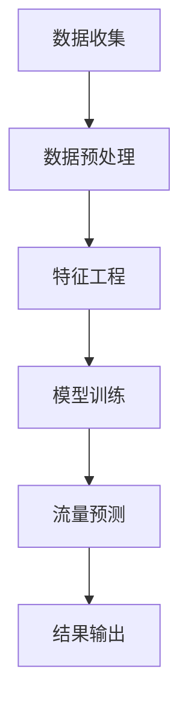

**伪代码示例：**
```python
# 数据收集
traffic_data = collect_traffic_data()

# 数据预处理
preprocessed_data = preprocess_data(traffic_data)

# 特征工程
features = feature_engineering(preprocessed_data)

# 模型训练
model = train_model(features)

# 流量预测
predicted_traffic = model.predict(current_traffic)

# 结果输出
output_traffic_prediction(predicted_traffic)
```

**4.1.2 智能交通信号控制**

智能交通信号控制是利用AI算法对交通信号灯进行实时调控，以优化交通流量，减少拥堵和等待时间。常见的智能交通信号控制方法包括基于规则的信号控制和基于AI的动态信号控制。

**核心概念与联系：**

**Mermaid流程图：**
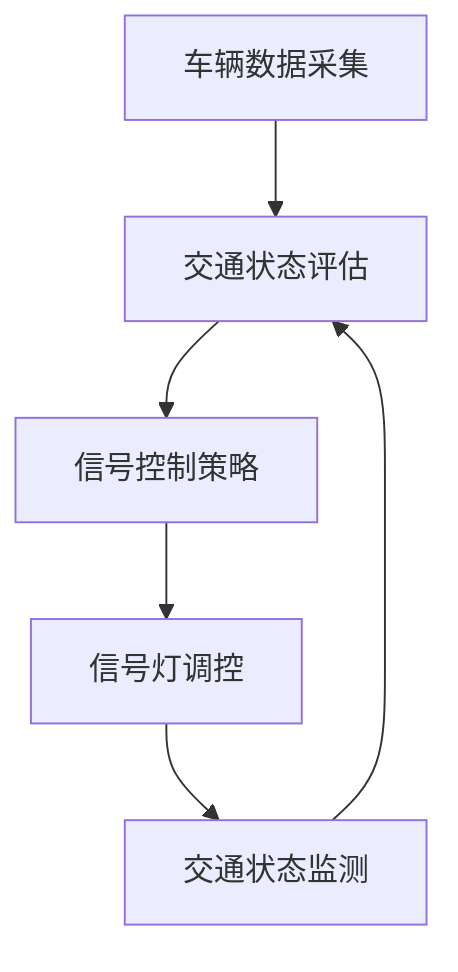

**伪代码示例：**
```python
# 车辆数据采集
vehicle_data = collect_vehicle_data()

# 交通状态评估
traffic_state = evaluate_traffic_state(vehicle_data)

# 信号控制策略
control_strategy = traffic_signal_control_strategy(traffic_state)

# 信号灯调控
update_traffic_signals(control_strategy)

# 交通状态监测
monitor_traffic_state()
```

**4.1.3 智能停车管理**

智能停车管理通过AI技术实现停车位的实时监测和智能调度，帮助驾驶员快速找到空闲停车位，减少寻找停车位的时间，提高停车效率。

**核心概念与联系：**

**Mermaid流程图：**
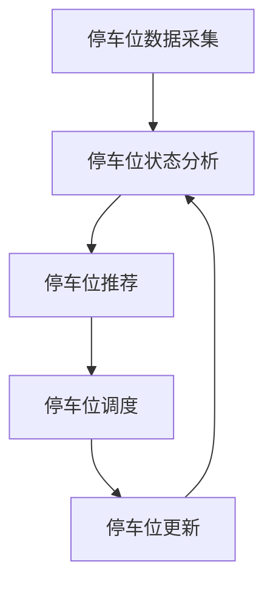

**伪代码示例：**
```python
# 停车位数据采集
parking_spot_data = collect_parking_spot_data()

# 停车位状态分析
parking_spot_state = analyze_parking_spot_state(parking_spot_data)

# 停车位推荐
recommended_spot = recommend_parking_spot(parking_spot_state)

# 停车位调度
schedule_parking_spot(recommended_spot)

# 停车位更新
update_parking_spot_state(parking_spot_state)
```

**4.1.4 智能公共交通系统**

智能公共交通系统通过AI技术实现公交车辆的实时调度、路径优化和乘客流量预测，以提高公交系统的运行效率和乘客满意度。

**核心概念与联系：**

**Mermaid流程图：**
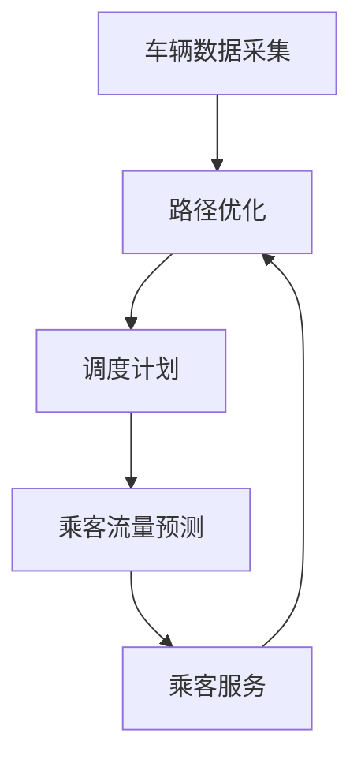

**伪代码示例：**
```python
# 车辆数据采集
bus_data = collect_bus_data()

# 路径优化
optimized_path = optimize_bus_path(bus_data)

# 调度计划
scheduling_plan = create_scheduling_plan(optimized_path)

# 乘客流量预测
predicted_passenger_flow = predict_passenger_flow(scheduling_plan)

# 乘客服务
provide_passenger_service(predicted_passenger_flow)
```

##### 4.2 智能公共服务

智能公共服务是智慧城市的重要组成部分，它利用AI技术为市民提供更加便捷、高效和个性化的公共服务，包括智能医疗、智能教育和智能社会保障等。

**4.2.1 智能医疗**

智能医疗通过AI技术实现医疗服务的智能化和个性化，包括疾病预测、智能诊断和个性化治疗等。

**核心概念与联系：**

**Mermaid流程图：**
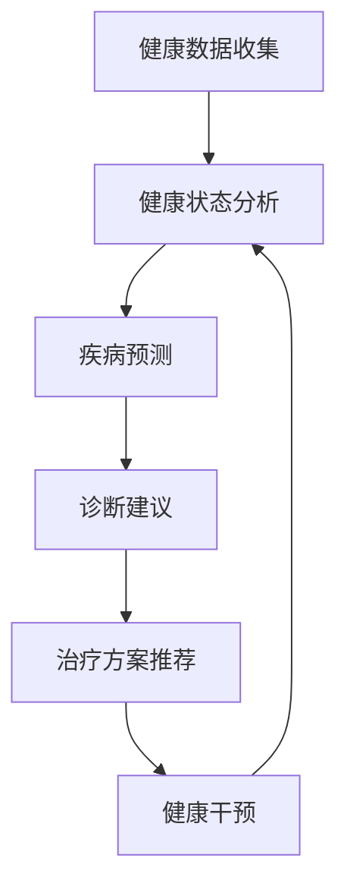

**伪代码示例：**
```python
# 健康数据收集
health_data = collect_health_data()

# 健康状态分析
health_state = analyze_health_state(health_data)

# 疾病预测
predicted_diseases = predict_diseases(health_state)

# 诊断建议
diagnosis_suggestion = provide_diagnosis_suggestion(predicted_diseases)

# 治疗方案推荐
treatment_plan = recommend_treatment_plan(diagnosis_suggestion)

# 健康干预
health_intervention = perform_health_intervention(treatment_plan)
```

**4.2.2 智能教育**

智能教育通过AI技术实现教育资源的智能化和个性化，包括智能教学、智能评估和个性化学习等。

**核心概念与联系：**

**Mermaid流程图：**
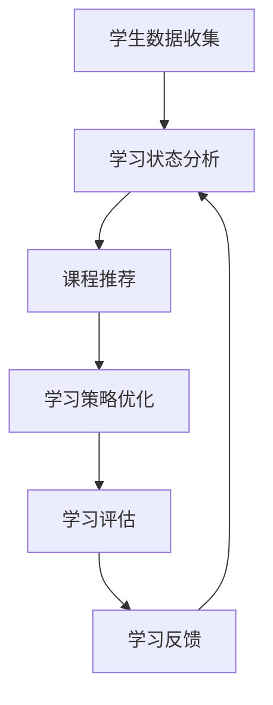

**伪代码示例：**
```python
# 学生数据收集
student_data = collect_student_data()

# 学习状态分析
learning_state = analyze_learning_state(student_data)

# 课程推荐
recommended_courses = recommend_courses(learning_state)

# 学习策略优化
optimized_learning_strategy = optimize_learning_strategy(recommended_courses)

# 学习评估
learning_evaluation = evaluate_learning(optimized_learning_strategy)

# 学习反馈
learning_feedback = provide_learning_feedback(learning_evaluation)
```

**4.2.3 智能社会保障**

智能社会保障通过AI技术实现社会保障服务的智能化和精准化，包括智能认证、智能评估和智能理赔等。

**核心概念与联系：**

**Mermaid流程图：**
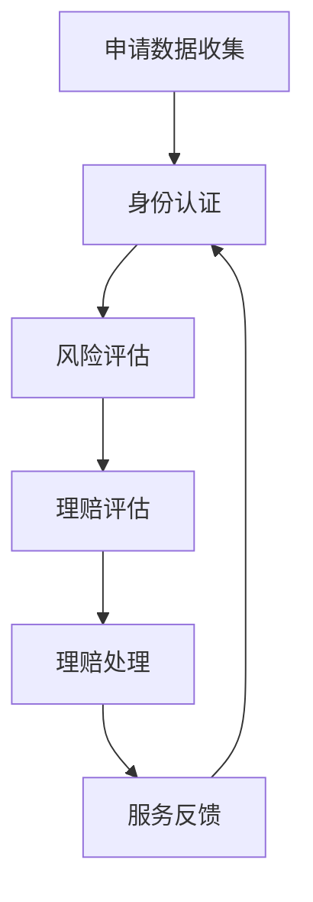

**伪代码示例：**
```python
# 申请数据收集
application_data = collect_application_data()

# 身份认证
identity_verified = verify_identity(application_data)

# 风险评估
risk_assessment = assess_risk(application_data)

# 理赔评估
claim_evaluation = evaluate_claim(risk_assessment)

# 理赔处理
claim_processed = process_claim(claim_evaluation)

# 服务反馈
service_feedback = provide_service_feedback(claim_processed)
```

##### 4.3 智能环境监测

智能环境监测是利用AI技术实现对城市环境的实时监测和分析，包括空气质量监测、水质监测和噪声监测等，以保障市民的健康和生活质量。

**4.3.1 智能气象监测**

智能气象监测通过AI技术实现对气象数据的实时监测和分析，包括温度、湿度、风速和降水等气象因素的预测和预警。

**核心概念与联系：**

**Mermaid流程图：**
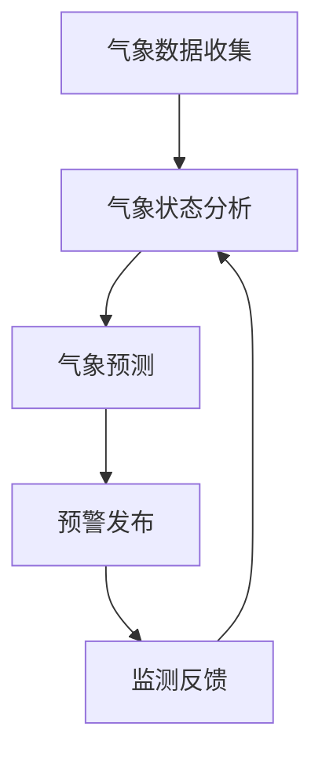

**伪代码示例：**
```python
# 气象数据收集
weather_data = collect_weather_data()

# 气象状态分析
weather_state = analyze_weather_state(weather_data)

# 气象预测
predicted_weather = predict_weather(weather_state)

# 预警发布
publish_weather_alert(predicted_weather)

# 监测反馈
receive_weather_feedback()
```

**4.3.2 智能空气质量监测**

智能空气质量监测通过AI技术实现对空气质量数据的实时监测和分析，包括PM2.5、PM10、CO、SO2等污染物的浓度监测和预警。

**核心概念与联系：**

**Mermaid流程图：**
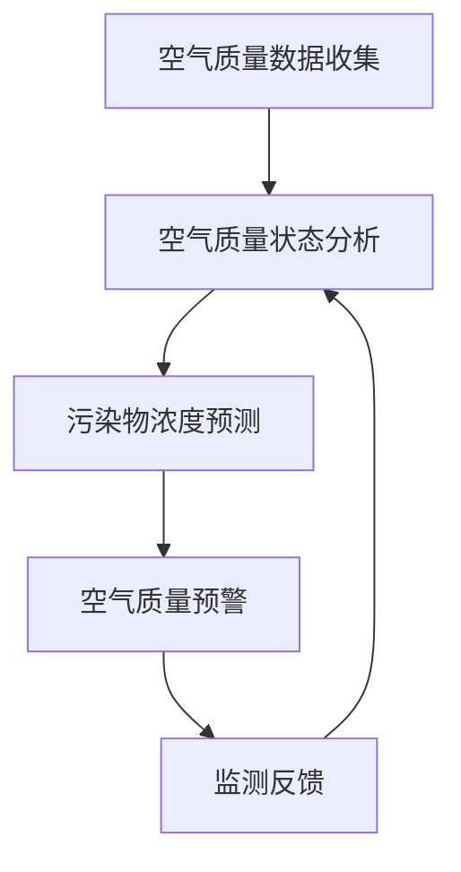

**伪代码示例：**
```python
# 空气质量数据收集
air_quality_data = collect_air_quality_data()

# 空气质量状态分析
air_quality_state = analyze_air_quality_state(air_quality_data)

# 污染物浓度预测
predicted_pollutants = predict_pollutants(air_quality_state)

# 空气质量预警
publish_air_quality_alert(predicted_pollutants)

# 监测反馈
receive_air_quality_feedback()
```

**4.3.3 智能水资源管理**

智能水资源管理通过AI技术实现对水资源的实时监测和分析，包括水质监测、水资源调配和水污染预警等，以确保水资源的可持续利用。

**核心概念与联系：**

**Mermaid流程图：**
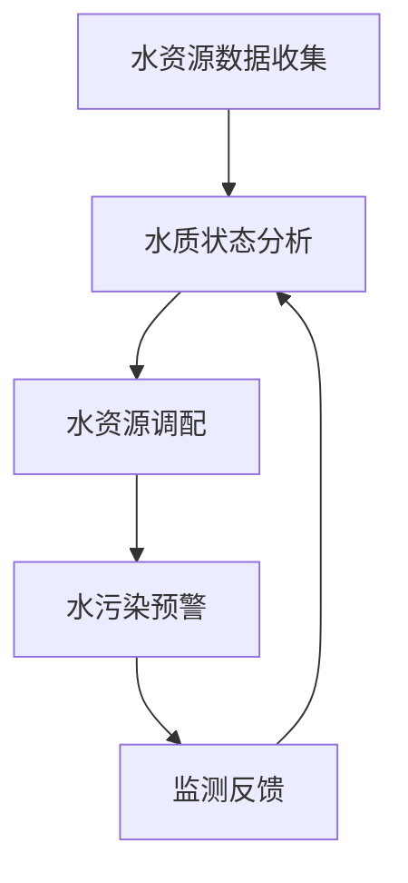

**伪代码示例：**
```python
# 水资源数据收集
water_resource_data = collect_water_resource_data()

# 水质状态分析
water_quality_state = analyze_water_quality_state(water_resource_data)

# 水资源调配
water_allocation = allocate_water_resources(water_quality_state)

# 水污染预警
publish_water_pollution_alert(water_allocation)

# 监测反馈
receive_water_resource_feedback()
```

##### 4.4 智能社区安全

智能社区安全是利用AI技术实现对社区安全的实时监测和管理，包括智能安防、智能监控和智能消防等，以提高社区的安全水平。

**4.4.1 智能安防系统**

智能安防系统通过AI技术实现对社区安全的实时监测和预警，包括人脸识别、视频监控和入侵检测等。

**核心概念与联系：**

**Mermaid流程图：**
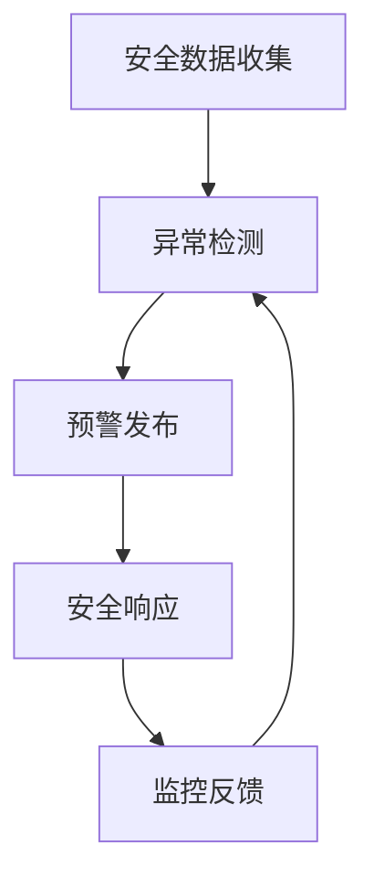

**伪代码示例：**
```python
# 安全数据收集
security_data = collect_security_data()

# 异常检测
anomalies_detected = detect_anomalies(security_data)

# 预警发布
publish_security_alert(anomalies_detected)

# 安全响应
respond_to_security_event()

# 监控反馈
receive_security_feedback()
```

**4.4.2 智能监控系统**

智能监控系统通过AI技术实现对社区监控的实时分析和优化，包括视频监控、动态跟踪和目标识别等。

**核心概念与联系：**

**Mermaid流程图：**


**伪代码示例：**
```python
# 监控数据收集
monitoring_data = collect_monitoring_data()

# 目标识别
detected_objects = identify_objects(monitoring_data)

# 轨迹分析
object_trajectories = analyze_trajectories(detected_objects)

# 异常检测
anomalies_detected = detect_anomalies(object_trajectories)

# 监控优化
optimize_monitoring(anomalies_detected)

# 监控反馈
receive_monitoring_feedback()
```

**4.4.3 智能消防系统**

智能消防系统通过AI技术实现对消防安全的实时监测和快速响应，包括火灾预警、消防设备和消防资源的智能调度等。

**核心概念与联系：**

**Mermaid流程图：**
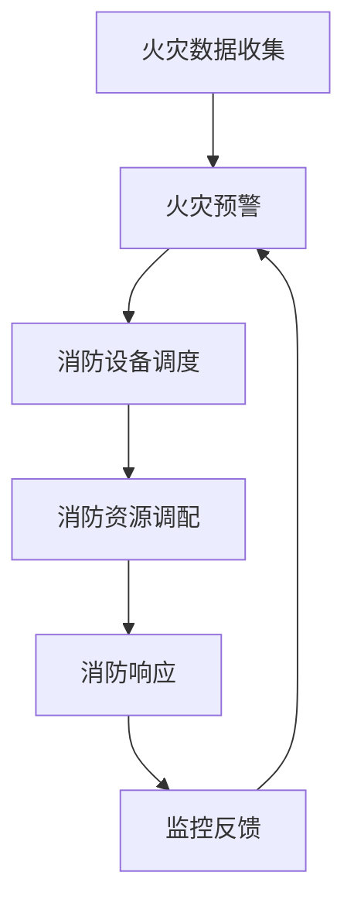

**伪代码示例：**
```python
# 火灾数据收集
fire_data = collect_fire_data()

# 火灾预警
fire_alarm_triggered = trigger_fire_alarm(fire_data)

# 消防设备调度
fire_equipment_dispatched = dispatch_fire_equipment(fire_alarm_triggered)

# 消防资源调配
fire_resources_allocated = allocate_fire_resources(fire_equipment_dispatched)

# 消防响应
respond_to_fire_event(fire_resources_allocated)

# 监控反馈
receive_fire_feedback()
```

### 第五部分: 可持续发展与设计

#### 第5章: 智慧城市与可持续发展

在当今全球面临的资源短缺、环境恶化、气候变化等挑战下，智慧城市与可持续发展成为城市发展的重要议题。智慧城市通过集成先进的信息技术，特别是人工智能（AI），能够为城市的可持续发展提供有力支持。本章将深入探讨智慧城市与可持续发展的关系，以及如何通过AI技术实现可持续发展。

##### 5.1 可持续发展的概念与原则

**5.1.1 可持续发展的定义**

可持续发展是指满足当前世代需求的同时，不损害后代满足其需求的能力。这个定义强调了三大支柱：经济、社会和环境。经济方面，可持续发展追求经济增长的可持续性；社会方面，可持续发展关注人类福祉和公平；环境方面，可持续发展强调环境保护和生态平衡。

**5.1.2 可持续发展的原则**

1. **公平性**：确保不同代际、地区和社会群体之间的公平性，尤其是关注弱势群体的需求。
2. **持续性**：保护自然资源，确保其长期可用性，避免过度开发和消耗。
3. **共同性**：可持续发展是全人类共同的责任，需要国际合作和共同努力。
4. **适应性**：能够适应环境变化和技术进步，具备灵活性和创新能力。
5. **综合性**：综合考虑经济、社会和环境因素，实现整体平衡。

**5.1.3 可持续发展的重要性**

1. **环境效益**：可持续发展有助于减少污染、保护生态系统，提高环境质量。
2. **社会效益**：可持续发展能够提高社会福利，减少贫困，促进社会和谐。
3. **经济效益**：可持续发展通过资源的高效利用和创新，推动经济增长和就业。
4. **国际地位**：实施可持续发展有助于提升国家在国际社会中的形象和地位。

##### 5.2 智慧城市与可持续发展的关系

**5.2.1 智慧城市对可持续发展的贡献**

智慧城市通过集成物联网、大数据和人工智能等技术，为可持续发展提供了有力支持。以下是智慧城市对可持续发展的几个关键贡献：

1. **资源优化利用**：智慧城市通过实时监测和数据分析，优化水资源、能源和材料的使用，减少浪费，提高资源利用效率。
2. **环境保护**：智慧城市通过智能环境监测和污染治理技术，实时监测环境质量，预防和控制污染，保护生态环境。
3. **交通效率提升**：智慧交通系统通过实时交通流量监测和智能信号控制，减少交通拥堵，降低碳排放，提高交通效率。
4. **城市管理优化**：智慧城市通过智能监控和管理，提高城市服务的响应速度和质量，降低城市管理成本，提升市民幸福感。
5. **社会治理创新**：智慧城市通过大数据分析和人工智能技术，提高社会治理的智能化水平，促进社会公平和和谐。

**5.2.2 可持续发展对智慧城市的需求**

可持续发展的实现离不开智慧城市的支持。可持续发展对智慧城市提出了以下需求：

1. **技术创新**：需要持续推动物联网、大数据、人工智能等关键技术的创新和应用，为可持续发展提供技术支撑。
2. **政策支持**：政府需要制定和实施相关政策，鼓励智慧城市技术的研发和应用，推动可持续发展。
3. **资金投入**：需要加大对智慧城市建设的资金投入，确保智慧城市项目得以顺利实施和可持续发展。
4. **人才培养**：需要培养和引进一批具备跨学科知识、技术创新能力和实践经验的可持续发展专业人才。
5. **公众参与**：需要提高公众对智慧城市和可持续发展的认知，鼓励公众参与智慧城市建设和决策过程，形成全社会共同推进可持续发展的合力。

**5.2.3 智慧城市与可持续发展的一致性**

智慧城市与可持续发展在目标、原则和方法上具有高度一致性。智慧城市通过信息技术和人工智能的应用，实现了资源的高效利用、环境的保护和治理、社会的和谐与进步，这与可持续发展的目标高度契合。同时，智慧城市的建设过程也需要遵循可持续发展的原则，如公平性、持续性、共同性和适应性等。

##### 5.3 可持续城市规划

**5.3.1 可持续城市规划的原则**

可持续城市规划应遵循以下原则：

1. **以人为本**：充分考虑市民的需求和福祉，确保城市规划的民主化和人性化。
2. **资源高效利用**：优化土地、水资源、能源和其他资源的利用，提高资源利用效率。
3. **环境友好**：保护生态环境，减少污染和资源浪费，实现城市环境的可持续发展。
4. **经济繁荣**：通过技术创新和产业升级，实现经济结构的优化和持续增长。
5. **社会和谐**：促进社会公平和包容，提高市民的幸福感和生活质量。
6. **弹性适应**：具备适应环境变化和技术进步的能力，提高城市管理的灵活性和可持续性。

**5.3.2 可持续城市规划的方法**

可持续城市规划应采用以下方法：

1. **需求分析**：分析市民的需求和期望，明确城市规划的目标和方向。
2. **数据驱动**：利用大数据和人工智能技术，进行城市数据的收集、分析和应用，为规划提供科学依据。
3. **多学科协作**：整合城市规划、环境科学、经济学、社会学等多学科知识，实现规划的综合性和协调性。
4. **公众参与**：鼓励公众参与城市规划的讨论和决策，提高规划的民主化和透明度。
5. **动态调整**：根据实时数据和需求变化，动态调整城市规划，实现规划的灵活性和适应性。

**5.3.3 可持续城市规划的实践案例**

以下是几个可持续城市规划的实践案例：

1. **丹麦的哥本哈根**：哥本哈根通过实施绿色交通政策和可再生能源计划，实现了城市交通的可持续发展和能源的高效利用。
2. **新加坡的智慧国家项目**：新加坡通过智慧城市规划，实现了交通管理、环境监测和公共服务的智能化，提高了城市的运营效率和市民的生活质量。
3. **中国深圳的智慧城市建设**：深圳通过智慧城市规划，推动了科技创新和产业升级，实现了经济结构的优化和城市的可持续发展。

##### 5.4 智慧城市的可持续运营

**5.4.1 智慧城市运营的概念与挑战**

智慧城市运营是指通过信息技术和人工智能技术，实现城市管理的智能化和高效化。智慧城市运营面临的挑战包括：

1. **数据安全**：如何确保城市数据的安全性和隐私保护。
2. **技术更新**：如何持续更新和升级智慧城市的技术基础设施。
3. **成本控制**：如何控制智慧城市建设和运营的成本，确保经济效益。
4. **人才短缺**：如何培养和引进一批具备跨学科知识和技术能力的专业人才。
5. **公众接受度**：如何提高公众对智慧城市技术和服务的接受度和认可度。

**5.4.2 智慧城市运营的可持续性策略**

为应对智慧城市运营的挑战，可以采取以下可持续性策略：

1. **数据治理**：建立完善的数据治理体系，确保城市数据的安全、合规和有效利用。
2. **技术持续创新**：持续推动技术创新，提高智慧城市技术的先进性和竞争力。
3. **成本效益分析**：通过成本效益分析，优化资源配置，提高智慧城市建设的经济效益。
4. **人才发展计划**：实施人才发展计划，培养和引进一批具备跨学科知识和技术能力的专业人才。
5. **公众参与与沟通**：加强公众参与和沟通，提高公众对智慧城市技术和服务的认知和认可。

**5.4.3 可持续运营的实践与展望**

在可持续运营方面，智慧城市需要不断探索和实践。以下是一些实践与展望：

1. **智慧城市运营平台**：建立统一的智慧城市运营平台，实现城市数据的集成、分析和应用，提高运营效率。
2. **绿色能源应用**：推广绿色能源应用，降低智慧城市运营的能源消耗和碳排放。
3. **智能资产管理**：利用智能技术进行城市资产的监控和管理，提高资产利用效率。
4. **智慧社区建设**：推动智慧社区建设，提高市民的生活质量和社会参与度。
5. **全球合作与交流**：加强全球合作与交流，学习借鉴其他国家和地区的智慧城市实践经验。

通过这些实践与展望，智慧城市可以实现可持续运营，为城市的可持续发展提供有力支持。

##### 5.5 智慧城市中的AI设计

**5.5.1 智能能源管理**

智能能源管理是智慧城市中的重要应用之一，它通过AI技术实现对能源的实时监测、分析和优化，提高能源利用效率，减少能源浪费。

**核心概念与联系：**

**Mermaid流程图：**
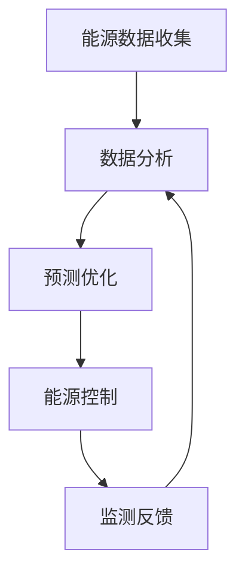

**伪代码示例：**
```python
# 能源数据收集
energy_data = collect_energy_data()

# 数据分析
analyzed_data = analyze_energy_data(energy_data)

# 预测优化
optimized_energy = optimize_energy_consumption(analyzed_data)

# 能源控制
control_energy_consumption(optimized_energy)

# 监测反馈
receive_energy_feedback()
```

**5.5.2 智能水资源管理**

智能水资源管理通过AI技术实现对水资源的实时监测、调配和保护，确保水资源的可持续利用。

**核心概念与联系：**

**Mermaid流程图：**
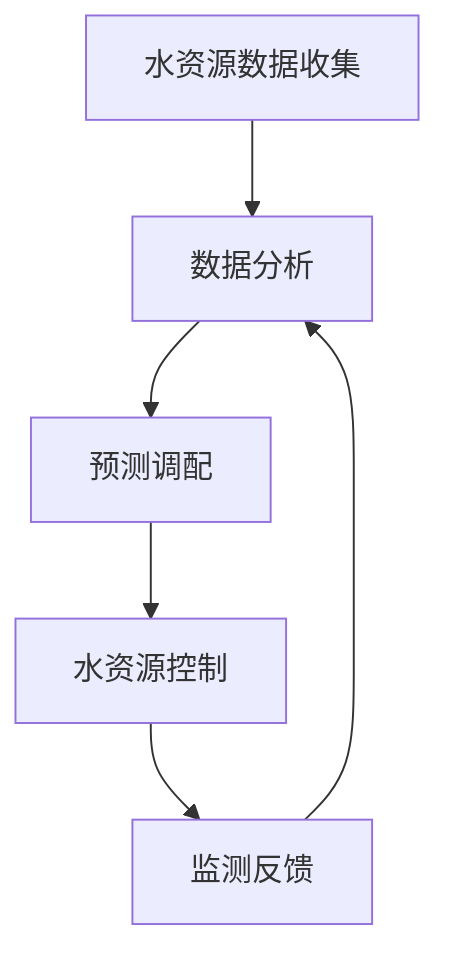

**伪代码示例：**
```python
# 水资源数据收集
water_resource_data = collect_water_resource_data()

# 数据分析
analyzed_data = analyze_water_resource_data(water_resource_data)

# 预测调配
predicted_allocation = predict_water_resource_allocation(analyzed_data)

# 水资源控制
control_water_resource_usage(predicted_allocation)

# 监测反馈
receive_water_resource_feedback()
```

**5.5.3 智能环境监测**

智能环境监测通过AI技术实现对空气质量、水质和噪声等环境因素的实时监测和分析，为环境治理和可持续发展提供支持。

**核心概念与联系：**

**Mermaid流程图：**


**伪代码示例：**
```python
# 环境数据收集
environment_data = collect_environment_data()

# 数据分析
analyzed_data = analyze_environment_data(environment_data)

# 污染预测
predicted_pollution = predict_environment_pollution(analyzed_data)

# 治理措施
apply_environmental_treatment(predicted_pollution)

# 监测反馈
receive_environment_feedback()
```

**5.5.4 智能农业**

智能农业通过AI技术实现对农作物的实时监测、分析和优化，提高农业生产效率，确保粮食安全和可持续发展。

**核心概念与联系：**

**Mermaid流程图：**
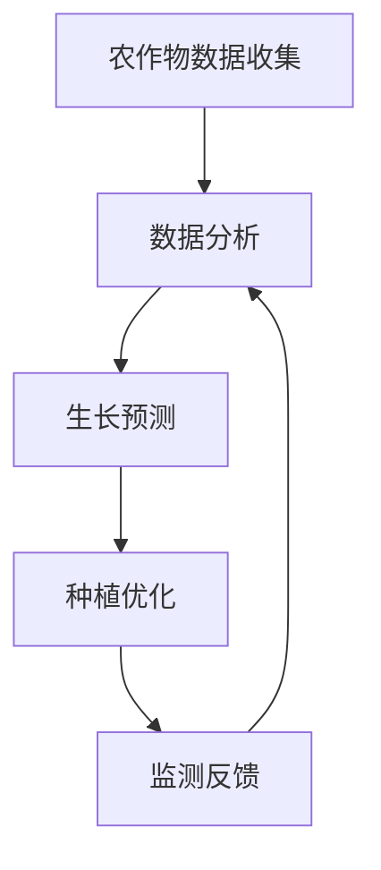

**伪代码示例：**
```python
# 农作物数据收集
crop_data = collect_crop_data()

# 数据分析
analyzed_data = analyze_crop_data(crop_data)

# 生长预测
predicted_growth = predict_crop_growth(analyzed_data)

# 种植优化
optimize_crop_planting(predicted_growth)

# 监测反馈
receive_crop_feedback()
```

### 第六部分：设计与实践

#### 第6章：AI与城市设计的实践案例

在智慧城市的建设过程中，人工智能（AI）技术的应用已经从理论研究走向实际应用，并在城市规划、交通管理、环境保护和公共服务等多个领域取得了显著成效。本章将通过分析若干具体案例，展示AI技术在城市设计中的成功应用，并提供实践中的经验与教训。

##### 6.1 智慧城市的实践案例

**6.1.1 案例一：新加坡的智慧国家项目**

新加坡的智慧国家项目是全球智慧城市建设的典范之一。该项目通过整合物联网、大数据和人工智能技术，实现了城市管理的智能化和高效化。以下是该项目的一些关键应用：

1. **智能交通系统**：利用AI技术进行交通流量预测和智能信号控制，有效减少了交通拥堵，提高了交通效率。通过实时监控和分析交通数据，系统能够在交通高峰期自动调整信号灯时间，优化交通流。

**核心概念与联系：**

**Mermaid流程图：**
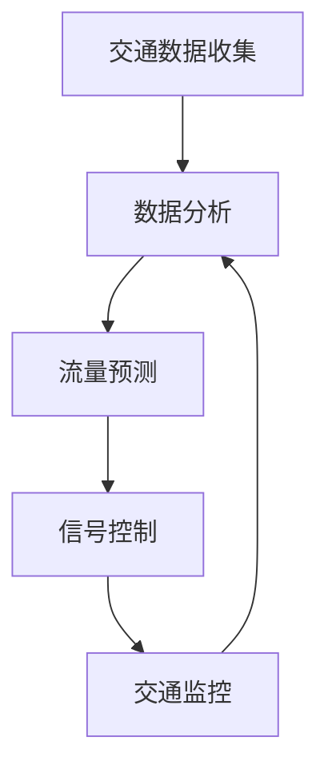

**伪代码示例：**
```python
# 交通数据收集
traffic_data = collect_traffic_data()

# 数据分析
analyzed_data = analyze_traffic_data(traffic_data)

# 流量预测
predicted_traffic = predict_traffic(analyzed_data)

# 信号控制
control_traffic_signals(predicted_traffic)

# 交通监控
monitor_traffic_flow()
```

2. **智能公共设施**：通过AI技术对公共设施的运行状态进行实时监控，如智能路灯、智能垃圾桶和智能公园等。这些设施可以根据环境条件和用户需求进行自动调节，提高资源利用效率。

**核心概念与联系：**

**Mermaid流程图：**
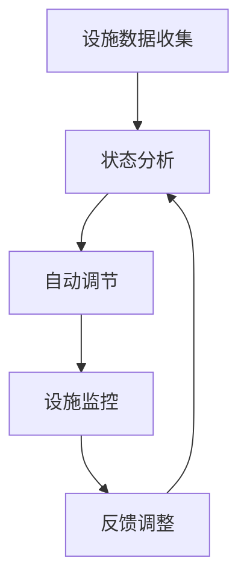

**伪代码示例：**
```python
# 设施数据收集
facility_data = collect_facility_data()

# 状态分析
facility_state = analyze_facility_state(facility_data)

# 自动调节
adjust_facility(facility_state)

# 设施监控
monitor_facility_state()

# 反馈调整
receive_facility_feedback()
```

3. **智能医疗系统**：通过AI技术实现医疗服务的智能化，包括智能诊断、智能药物配方和智能健康监测。这些系统不仅提高了医疗服务的效率，还能够为医生提供决策支持，改善患者体验。

**核心概念与联系：**

**Mermaid流程图：**
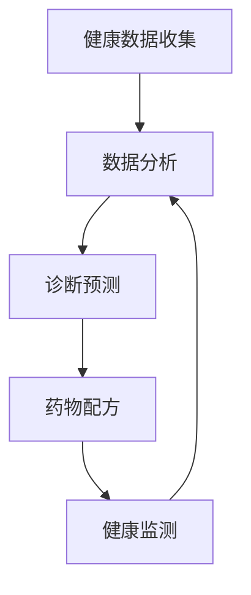

**伪代码示例：**
```python
# 健康数据收集
health_data = collect_health_data()

# 数据分析
analyzed_data = analyze_health_data(health_data)

# 诊断预测
diagnosis_prediction = predict_disease(analyzed_data)

# 药物配方
drug_formula = generate_drug_formula(diagnosis_prediction)

# 健康监测
health_monitoring = monitor_health_status()

# 反馈调整
update_health_plan(health_monitoring)
```

**6.1.2 案例二：深圳的智慧城市试点**

深圳是中国智慧城市建设的先行者之一，其智慧城市试点项目涵盖了多个领域，包括智能交通、智能能源管理、智能医疗和智能公共安全等。以下是该项目的一些关键应用：

1. **智能交通系统**：通过AI技术进行交通流量监测和智能信号控制，有效减少了交通拥堵，提高了交通效率。深圳还推出了智慧停车服务，通过实时监测和智能调度，提高了停车位的利用率。

**核心概念与联系：**

**Mermaid流程图：**
```mermaid
graph TD
A[交通数据收集] --> B[数据分析]
B --> C[流量预测]
C --> D[信号控制]
D --> E[停车管理]
E --> B
```

**伪代码示例：**
```python
# 交通数据收集
traffic_data = collect_traffic_data()

# 数据分析
analyzed_data = analyze_traffic_data(traffic_data)

# 流量预测
predicted_traffic = predict_traffic(analyzed_data)

# 信号控制
control_traffic_signals(predicted_traffic)

# 停车管理
parking_management = manage_parking_spots()

# 反馈调整
receive_traffic_feedback()
```

2. **智能能源管理**：通过AI技术进行能源监测和优化，提高了能源利用效率。深圳的智慧能源管理系统可以实时监测能源消耗，并根据需求调整能源分配，实现了能源的高效利用。

**核心概念与联系：**

**Mermaid流程图：**
```mermaid
graph TD
A[能源数据收集] --> B[数据分析]
B --> C[能源优化]
C --> D[能源调度]
D --> E[能源监测]
E --> B
```

**伪代码示例：**
```python
# 能源数据收集
energy_data = collect_energy_data()

# 数据分析
analyzed_data = analyze_energy_data(energy_data)

# 能源优化
optimized_energy = optimize_energy_consumption(analyzed_data)

# 能源调度
schedule_energy_distribution(optimized_energy)

# 能源监测
monitor_energy_usage()

# 反馈调整
receive_energy_feedback()
```

3. **智能医疗系统**：深圳通过建设智慧医疗中心，实现了医疗服务的智能化和便捷化。患者可以通过智慧医疗系统预约挂号、查询病历、进行健康咨询等，医生则可以通过系统进行远程诊断和治疗方案推荐。

**核心概念与联系：**

**Mermaid流程图：**
```mermaid
graph TD
A[医疗数据收集] --> B[数据分析]
B --> C[诊断预测]
C --> D[治疗方案]
D --> E[健康监测]
E --> B
```

**伪代码示例：**
```python
# 医疗数据收集
health_data = collect_health_data()

# 数据分析
analyzed_data = analyze_health_data(health_data)

# 诊断预测
diagnosis_prediction = predict_disease(analyzed_data)

# 治疗方案
treatment_plan = recommend_treatment_plan(diagnosis_prediction)

# 健康监测
health_monitoring = monitor_health_status()

# 反馈调整
update_health_plan(health_monitoring)
```

**6.1.3 案例三：中国的智慧城市建设趋势**

中国各地正在积极推进智慧城市建设，智慧交通、智慧能源、智慧医疗和智慧安防等应用逐渐普及。以下是中国的几个智慧城市建设趋势：

1. **智慧交通**：通过建设智能交通管理系统，实现交通流量预测、智能信号控制和智能停车管理，提高交通效率，减少拥堵。
2. **智慧能源**：通过智能电网和智慧能源管理系统，实现能源的高效利用和可持续发展，提高能源利用效率。
3. **智慧医疗**：通过智慧医疗平台和远程医疗服务，实现医疗服务的智能化和便捷化，提高医疗服务质量和效率。
4. **智慧安防**：通过智能监控和智能安防系统，提高城市的安全水平，保障市民的生命财产安全。

##### 6.2 智能交通系统的实践案例

**6.2.1 案例一：纽约的智能交通管理**

纽约市通过实施智能交通管理项目，有效缓解了交通拥堵问题。项目利用AI技术进行交通流量预测、智能信号控制和交通数据分析，实现了交通管理的智能化和高效化。以下是该项目的一些关键应用：

1. **交通流量预测**：通过分析历史交通数据、实时交通监控数据和节假日信息，AI算法可以预测未来某个时间段的交通流量，为交通管理部门提供决策依据。

**核心概念与联系：**

**Mermaid流程图：**
```mermaid
graph TD
A[历史数据] --> B[实时数据]
B --> C[节假日信息]
C --> D[流量预测]
D --> E[决策支持]
E --> B
```

**伪代码示例：**
```python
# 历史数据
historical_data = collect_historical_traffic_data()

# 实时数据
realtime_data = collect_realtime_traffic_data()

# 节假信息
holiday_info = collect_holiday_info()

# 流量预测
predicted_traffic = predict_traffic_flow(historical_data, realtime_data, holiday_info)

# 决策支持
provide_decision_support(predicted_traffic)
```

2. **智能信号控制**：利用AI技术，交通信号系统可以根据实时交通流量和交通状况，动态调整信号灯的时间，优化交通流。

**核心概念与联系：**

**Mermaid流程图：**
```mermaid
graph TD
A[实时数据] --> B[信号控制策略]
B --> C[交通状况]
C --> D[信号灯调控]
D --> E[交通监控]
E --> C
```

**伪代码示例：**
```python
# 实时数据
realtime_data = collect_realtime_traffic_data()

# 信号控制策略
signal_control_strategy = determine_signal_control_strategy(realtime_data)

# 交通状况
current_traffic_conditions = analyze_traffic_conditions(realtime_data)

# 信号灯调控
control_traffic_signals(signal_control_strategy, current_traffic_conditions)

# 交通监控
monitor_traffic_flow()
```

3. **智能停车管理**：通过实时监测和智能调度，智能停车系统可以帮助驾驶员快速找到空闲停车位，提高停车效率。

**核心概念与联系：**

**Mermaid流程图：**
```mermaid
graph TD
A[停车位数据] --> B[停车位状态分析]
B --> C[停车位推荐]
C --> D[停车调度]
D --> E[停车反馈]
E --> B
```

**伪代码示例：**
```python
# 停车位数据
parking_spot_data = collect_parking_spot_data()

# 停车位状态分析
parking_spot_state = analyze_parking_spot_state(parking_spot_data)

# 停车位推荐
recommended_spots = recommend_parking_spots(parking_spot_state)

# 停车调度
schedule_parking_spots(recommended_spots)

# 停车反馈
receive_parking_feedback()
```

**6.2.2 案例二：伦敦的智能交通方案**

伦敦市通过实施智能交通方案，显著改善了交通拥堵问题。项目利用AI技术进行交通流量监测、智能信号控制和公共交通优化，提高了交通效率和市民出行体验。以下是该项目的一些关键应用：

1. **交通流量监测**：通过安装在道路上的传感器和摄像头，实时监测交通流量和路况，为交通管理部门提供实时数据支持。

**核心概念与联系：**

**Mermaid流程图：**
```mermaid
graph TD
A[传感器数据] --> B[摄像头数据]
B --> C[交通流量监测]
C --> D[路况分析]
D --> E[决策支持]
E --> B
```

**伪代码示例：**
```python
# 传感器数据
sensor_data = collect_sensor_data()

# 摄像头数据
camera_data = collect_camera_data()

# 交通流量监测
traffic_flow = monitor_traffic_flow(sensor_data, camera_data)

# 路况分析
analyze_road_conditions(traffic_flow)

# 决策支持
provide_traffic_management_decisions()
```

2. **智能信号控制**：通过AI算法，智能信号系统可以根据实时交通流量和路况，动态调整信号灯时间，优化交通流。

**核心概念与联系：**

**Mermaid流程图：**
```mermaid
graph TD
A[实时数据] --> B[信号控制策略]
B --> C[交通状况]
C --> D[信号灯调控]
D --> E[交通监控]
E --> C
```

**伪代码示例：**
```python
# 实时数据
realtime_data = collect_realtime_traffic_data()

# 信号控制策略
signal_control_strategy = determine_signal_control_strategy(realtime_data)

# 交通状况
current_traffic_conditions = analyze_traffic_conditions(realtime_data)

# 信号灯调控
control_traffic_signals(signal_control_strategy, current_traffic_conditions)

# 交通监控
monitor_traffic_flow()
```

3. **公共交通优化**：通过AI技术优化公交车辆的调度和路径规划，提高公交系统的运行效率和准时性。

**核心概念与联系：**

**Mermaid流程图：**
```mermaid
graph TD
A[公交数据] --> B[调度优化]
B --> C[路径规划]
C --> D[车辆调度]
D --> E[公交监控]
E --> B
```

**伪代码示例：**
```python
# 公交数据
bus_data = collect_bus_data()

# 调度优化
scheduling_optimization = optimize_bus_scheduling(bus_data)

# 路径规划
route_planning = plan_bus_routes(scheduling_optimization)

# 车辆调度
schedule_buses(route_planning)

# 公交监控
monitor_bus_operations()
```

**6.2.3 案例三：中国的智能交通建设**

中国正在积极推进智能交通建设，通过引入AI技术，实现交通管理的智能化和数字化。以下是该项目的一些关键应用：

1. **智能交通信号控制**：通过AI算法，智能信号系统可以根据实时交通流量和路况，动态调整信号灯时间，优化交通流。

**核心概念与联系：**

**Mermaid流程图：**
```mermaid
graph TD
A[实时数据] --> B[信号控制策略]
B --> C[交通状况]
C --> D[信号灯调控]
D --> E[交通监控]
E --> C
```

**伪代码示例：**
```python
# 实时数据
realtime_data = collect_realtime_traffic_data()

# 信号控制策略
signal_control_strategy = determine_signal_control_strategy(realtime_data)

# 交通状况
current_traffic_conditions = analyze_traffic_conditions(realtime_data)

# 信号灯调控
control_traffic_signals(signal_control_strategy, current_traffic_conditions)

# 交通监控
monitor_traffic_flow()
```

2. **智能停车管理**：通过实时监测和智能调度，智能停车系统可以帮助驾驶员快速找到空闲停车位，提高停车效率。

**核心概念与联系：**

**Mermaid流程图：**
```mermaid
graph TD
A[停车位数据] --> B[停车位状态分析]
B --> C[停车位推荐]
C --> D[停车调度]
D --> E[停车反馈]
E --> B
```

**伪代码示例：**
```python
# 停车位数据
parking_spot_data = collect_parking_spot_data()

# 停车位状态分析
parking_spot_state = analyze_parking_spot_state(parking_spot_data)

# 停车位推荐
recommended_spots = recommend_parking_spots(parking_spot_state)

# 停车调度
schedule_parking_spots(recommended_spots)

# 停车反馈
receive_parking_feedback()
```

3. **交通流量预测**：通过AI技术分析历史交通数据和实时交通信息，预测未来交通流量，为交通管理部门提供决策依据。

**核心概念与联系：**

**Mermaid流程图：**
```mermaid
graph TD
A[历史数据] --> B[实时数据]
B --> C[流量预测]
C --> D[决策支持]
D --> E[交通监控]
E --> B
```

**伪代码示例：**
```python
# 历史数据
historical_data = collect_historical_traffic_data()

# 实时数据
realtime_data = collect_realtime_traffic_data()

# 流量预测
predicted_traffic = predict_traffic_flow(historical_data, realtime_data)

# 决策支持
provide_decision_support(predicted_traffic)

# 交通监控
monitor_traffic_flow()
```

##### 6.3 智能居住环境的实践案例

**6.3.1 案例一：美国的智能家居市场**

美国的智能家居市场发展迅速，智能家居设备广泛应用于家庭生活中。以下是智能家居市场的一些关键应用：

1. **智能照明**：通过AI技术，智能照明系统能够根据用户的行为和需求，自动调整灯光亮度和颜色，提高居住舒适度。

**核心概念与联系：**

**Mermaid流程图：**
```mermaid
graph TD
A[用户行为数据] --> B[照明控制策略]
B --> C[照明调节]
C --> D[舒适度提升]
D --> E[反馈调整]
E --> B
```

**伪代码示例：**
```python
# 用户行为数据
user_behavior_data = collect_user_behavior_data()

# 照明控制策略
lighting_control_strategy = determine_lighting_control_strategy(user_behavior_data)

# 照明调节
adjust_lighting(lighting_control_strategy)

# 舒适度提升
enhance_comfort_level()

# 反馈调整
receive_user_feedback()
```

2. **智能安防**：智能家居系统集成了智能摄像头、门窗传感器和入侵报警系统，实时监控家庭安全情况，保障家庭安全。

**核心概念与联系：**

**Mermaid流程图：**
```mermaid
graph TD
A[传感器数据] --> B[安全监控]
B --> C[入侵检测]
C --> D[报警系统]
D --> E[安全反馈]
E --> B
```

**伪代码示例：**
```python
# 传感器数据
sensor_data = collect_sensor_data()

# 安全监控
security_monitoring = monitor_home_security(sensor_data)

# 入侵检测
detect_invasion()

# 报警系统
trigger_alarm()

# 安全反馈
receive_security_alert()
```

3. **能源管理**：智能家居系统通过实时监测和数据分析，优化家庭能源使用，提高能源效率，降低能源消耗。

**核心概念与联系：**
```mermaid
graph TD
A[能源数据] --> B[数据分析]
B --> C[能源优化]
C --> D[能源监控]
D --> E[节能措施]
E --> B
```

**伪代码示例：**
```python
# 能源数据
energy_data = collect_energy_data()

# 数据分析
analyzed_data = analyze_energy_data(energy_data)

# 能源优化
optimized_energy_usage = optimize_energy_consumption(analyzed_data)

# 能源监控
monitor_energy_usage()

# 节能措施
apply_energy_saving_measures()
```

**6.3.2 案例二：欧洲的智能社区建设**

欧洲的智能社区建设取得了显著成效，通过引入AI技术，实现了社区的智能化管理和服务。以下是智能社区建设的一些关键应用：

1. **智能停车管理**：智能停车系统通过实时监测和智能调度，帮助居民快速找到空闲停车位，提高停车效率。

**核心概念与联系：**

**Mermaid流程图：**
```mermaid
graph TD
A[停车位数据] --> B[停车位状态分析]
B --> C[停车位推荐]
C --> D[停车调度]
D --> E[停车反馈]
E --> B
```

**伪代码示例：**
```python
# 停车位数据
parking_spot_data = collect_parking_spot_data()

# 停车位状态分析
parking_spot_state = analyze_parking_spot_state(parking_spot_data)

# 停车位推荐
recommended_spots = recommend_parking_spots(parking_spot_state)

# 停车调度
schedule_parking_spots(recommended_spots)

# 停车反馈
receive_parking_feedback()
```

2. **智能能源管理**：智能社区通过实时监测和智能调度，优化能源使用，提高能源效率，降低能源消耗。

**核心概念与联系：**

**Mermaid流程图：**
```mermaid
graph TD
A[能源数据] --> B[数据分析]
B --> C[能源优化]
C --> D[能源监控]
D --> E[节能措施]
E --> B
```

**伪代码示例：**
```python
# 能源数据
energy_data = collect_energy_data()

# 数据分析
analyzed_data = analyze_energy_data(energy_data)

# 能源优化
optimized_energy_usage = optimize_energy_consumption(analyzed_data)

# 能源监控
monitor_energy_usage()

# 节能措施
apply_energy_saving_measures()
```

3. **智能安防**：智能社区通过集成智能摄像头、门窗传感器和入侵报警系统，实现社区安全的智能化管理。

**核心概念与联系：**

**Mermaid流程图：**
```mermaid
graph TD
A[传感器数据] --> B[安全监控]
B --> C[入侵检测]
C --> D[报警系统]
D --> E[安全反馈]
E --> B
```

**伪代码示例：**
```python
# 传感器数据
sensor_data = collect_sensor_data()

# 安全监控
security_monitoring = monitor_community_security(sensor_data)

# 入侵检测
detect_invasion()

# 报警系统
trigger_alarm()

# 安全反馈
receive_security_alert()
```

**6.3.3 案例三：中国的智慧居住环境创新**

中国的智慧居住环境创新取得了一系列成果，通过引入AI技术，实现了居住环境的智能化和便捷化。以下是智慧居住环境创新的一些关键应用：

1. **智能家居**：智能家居系统集成了智能照明、智能安防、智能能源管理等功能，为居民提供便捷、舒适和智能化的居住环境。

**核心概念与联系：**

**Mermaid流程图：**
```mermaid
graph TD
A[用户需求数据] --> B[智能家居控制策略]
B --> C[家居设备控制]
C --> D[舒适度提升]
D --> E[用户反馈]
E --> B
```

**伪代码示例：**
```python
# 用户需求数据
user_demand_data = collect_user_demand_data()

# 智能家居控制策略
home_smart_control_strategy = determine_home_smart_control_strategy(user_demand_data)

# 家居设备控制
control_home_devices(home_smart_control_strategy)

# 舒适度提升
enhance_home_comfort()

# 用户反馈
receive_user_feedback()
```

2. **智慧社区**：智慧社区通过集成智能安防、智能停车、智能能源管理等功能，实现社区的智能化管理和高效服务。

**核心概念与联系：**

**Mermaid流程图：**
```mermaid
graph TD
A[社区数据] --> B[社区管理策略]
B --> C[社区服务控制]
C --> D[服务质量提升]
D --> E[社区反馈]
E --> B
```

**伪代码示例：**
```python
# 社区数据
community_data = collect_community_data()

# 社区管理策略
community_management_strategy = determine_community_management_strategy(community_data)

# 社区服务控制
control_community_services(community_management_strategy)

# 服务质量提升
enhance_community_service_quality()

# 社区反馈
receive_community_feedback()
```

3. **智慧城市**：智慧城市通过集成智能家居、智慧社区和城市公共服务等功能，实现城市生活的智能化和便捷化。

**核心概念与联系：**

**Mermaid流程图：**
```mermaid
graph TD
A[城市数据] --> B[城市管理策略]
B --> C[城市服务控制]
C --> D[城市生活质量提升]
D --> E[城市反馈]
E --> B
```

**伪代码示例：**
```python
# 城市数据
city_data = collect_city_data()

# 城市管理策略
city_management_strategy = determine_city_management_strategy(city_data)

# 城市服务控制
control_city_services(city_management_strategy)

# 城市生活质量提升
enhance_city_life_quality()

# 城市反馈
receive_city_feedback()
```

##### 6.4 公共设施的智能设计

**6.4.1 案例一：德国的智能停车场**

德国的智能停车场通过引入AI技术，实现了停车场的智能化管理和运营。以下是智能停车场的一些关键应用：

1. **智能停车管理**：智能停车场系统通过实时监测和智能调度，帮助驾驶员快速找到空闲停车位，提高停车效率。

**核心概念与联系：**

**Mermaid流程图：**
```mermaid
graph TD
A[停车位数据] --> B[停车位状态分析]
B --> C[停车位推荐]
C --> D[停车调度]
D --> E[停车反馈]
E --> B
```

**伪代码示例：**
```python
# 停车位数据
parking_spot_data = collect_parking_spot_data()

# 停车位状态分析
parking_spot_state = analyze_parking_spot_state(parking_spot_data)

# 停车位推荐
recommended_spots = recommend_parking_spots(parking_spot_state)

# 停车调度
schedule_parking_spots(recommended_spots)

# 停车反馈
receive_parking_feedback()
```

2. **智能照明**：智能停车场通过实时监测和智能控制，自动调整照明亮度和颜色，提高停车场的舒适度和节能效果。

**核心概念与联系：**

**Mermaid流程图：**
```mermaid
graph TD
A[停车场数据] --> B[照明控制策略]
B --> C[照明调节]
C --> D[节能效果]
D --> E[照明反馈]
E --> B
```

**伪代码示例：**
```python
# 停车场数据
parking_lot_data = collect_parking_lot_data()

# 照明控制策略
lighting_control_strategy = determine_lighting_control_strategy(parking_lot_data)

# 照明调节
adjust_lighting(lighting_control_strategy)

# 节能效果
evaluate_energy_saving()

# 照明反馈
receive_lighting_feedback()
```

3. **智能安防**：智能停车场集成了智能摄像头、入侵报警系统和传感器，实现停车场的实时监控和安全保障。

**核心概念与联系：**

**Mermaid流程图：**
```mermaid
graph TD
A[传感器数据] --> B[安全监控]
B --> C[入侵检测]
C --> D[报警系统]
D --> E[安全反馈]
E --> B
```

**伪代码示例：**
```python
# 传感器数据
sensor_data = collect_sensor_data()

# 安全监控
security_monitoring = monitor_parking_lot_security(sensor_data)

# 入侵检测
detect_invasion()

# 报警系统
trigger_alarm()

# 安全反馈
receive_security_alert()
```

**6.4.2 案例二：英国的智能公交系统**

英国的智能公交系统通过引入AI技术，实现了公交服务的智能化和高效化。以下是智能公交系统的一些关键应用：

1. **智能调度**：智能公交系统通过实时监控和数据分析，动态调整公交车的时间和路径，提高公交服务的准时性和效率。

**核心概念与联系：**

**Mermaid流程图：**
```mermaid
graph TD
A[公交数据] --> B[调度优化]
B --> C[路径规划]
C --> D[车辆调度]
D --> E[公交监控]
E --> B
```

**伪代码示例：**
```python
# 公交数据
bus_data = collect_bus_data()

# 调度优化
scheduling_optimization = optimize_bus_scheduling(bus_data)

# 路径规划
route_planning = plan_bus_routes(scheduling_optimization)

# 车辆调度
schedule_buses(route_planning)

# 公交监控
monitor_bus_operations()
```

2. **智能交通信号控制**：智能公交系统通过实时监控交通信号灯的状态，智能调整公交车通行时间，减少公交车在路口的等待时间。

**核心概念与联系：**

**Mermaid流程图：**
```mermaid
graph TD
A[交通信号灯数据] --> B[信号灯状态分析]
B --> C[信号灯控制策略]
C --> D[交通信号控制]
D --> E[公交监控]
E --> B
```

**伪代码示例：**
```python
# 交通信号灯数据
traffic_light_data = collect_traffic_light_data()

# 信号灯状态分析
traffic_light_state = analyze_traffic_light_state(traffic_light_data)

# 信号灯控制策略
signal_control_strategy = determine_traffic_light_control_strategy(traffic_light_state)

# 交通信号控制
control_traffic_signals(signal_control_strategy)

# 公交监控
monitor_bus_operations()
```

3. **智能乘客服务**：智能公交系统通过实时监控乘客流量和乘客需求，提供个性化的乘客服务，提高乘客的出行体验。

**核心概念与联系：**

**Mermaid流程图：**
```mermaid
graph TD
A[乘客数据] --> B[乘客服务策略]
B --> C[乘客服务]
C --> D[乘客反馈]
D --> E[乘客监控]
E --> B
```

**伪代码示例：**
```python
# 乘客数据
passenger_data = collect_passenger_data()

# 乘客服务策略
passenger_service_strategy = determine_passenger_service_strategy(passenger_data)

# 乘客服务
provide_passenger_service(passenger_service_strategy)

# 乘客反馈
receive_passenger_feedback()

# 乘客监控
monitor_passenger_flow()
```

**6.4.3 案例三：中国的智能医疗设施**

中国的智能医疗设施通过引入AI技术，实现了医疗服务的智能化和便捷化。以下是智能医疗设施的一些关键应用：

1. **智能诊断**：智能医疗系统通过AI技术分析医学图像和患者数据，提供精准的诊断建议，提高诊断准确率。

**核心概念与联系：**

**Mermaid流程图：**
```mermaid
graph TD
A[医学图像数据] --> B[数据分析]
B --> C[诊断建议]
C --> D[诊断结果]
D --> E[诊断反馈]
E --> B
```

**伪代码示例：**
```python
# 医学图像数据
medical_image_data = collect_medical_image_data()

# 数据分析
analyzed_data = analyze_medical_image_data(medical_image_data)

# 诊断建议
diagnosis_suggestion = provide_diagnosis_suggestion(analyzed_data)

# 诊断结果
diagnosis_result = diagnose_disease(diagnosis_suggestion)

# 诊断反馈
receive_diagnosis_feedback()

# 诊断监控
monitor_diagnosis_process()
```

2. **智能药物配方**：智能医疗系统通过AI技术分析患者数据和药物成分，提供个性化的药物配方，提高治疗效果。

**核心概念与联系：**

**Mermaid流程图：**
```mermaid
graph TD
A[患者数据] --> B[数据分析]
B --> C[药物配方建议]
C --> D[药物配方]
D --> E[药物反馈]
E --> B
```

**伪代码示例：**
```python
# 患者数据
patient_data = collect_patient_data()

# 数据分析
analyzed_data = analyze_patient_data(patient_data)

# 药物配方建议
drug_formula_suggestion = provide_drug_formula_suggestion(analyzed_data)

# 药物配方
drug_formula = generate_drug_formula(drug_formula_suggestion)

# 药物反馈
receive_drug_feedback()

# 药物监控
monitor_drug_efficacy()
```

3. **智能健康监测**：智能医疗系统通过实时监控患者健康数据，提供健康预警和建议，帮助患者进行自我健康管理。

**核心概念与联系：**

**Mermaid流程图：**
```mermaid
graph TD
A[健康数据] --> B[数据分析]
B --> C[健康预警]
C --> D[健康建议]
D --> E[健康反馈]
E --> B
```

**伪代码示例：**
```python
# 健康数据
health_data = collect_health_data()

# 数据分析
analyzed_data = analyze_health_data(health_data)

# 健康预警
health_alert = provide_health_alert(analyzed_data)

# 健康建议
health_advice = provide_health_advice(health_alert)

# 健康反馈
receive_health_feedback()

# 健康监控
monitor_health_status()
```

### 第七部分：未来展望

#### 第7章: AI与城市生活方式的未来

随着人工智能（AI）技术的不断发展和普及，城市生活方式正经历着深刻的变革。未来，AI将继续在城市设计、生活质量和可持续发展中发挥关键作用。本章将探讨AI与城市生活方式的未来发展趋势，并分析这些趋势对城市规划、公共设施和居民生活的影响。

##### 7.1 AI与城市生活方式的发展趋势

**7.1.1 AI技术的未来趋势**

AI技术的发展将继续推动城市生活方式的变革，以下是几个关键趋势：

1. **更加智能的感知系统**：未来的AI系统将具备更强大的感知能力，能够通过多模态数据（如视觉、听觉、触觉等）更全面地理解和响应城市环境。这将带来更加个性化和智能化的城市服务。

**7.1.2 城市生活方式的未来方向**

随着AI技术的进步，城市生活方式将向以下几个方向转变：

1. **智能化家居**：未来的智能家居将更加智能化和个性化，能够通过AI技术学习用户习惯，提供个性化的家居体验，如自动调节温度、光线和音乐等。
   
2. **智慧社区**：智慧社区将实现更高效的管理和运营，通过AI技术优化资源分配，提升居民的生活质量，如智能停车、智能照明和智能安防等。

3. **个性化公共服务**：AI技术将帮助城市提供更个性化的公共服务，如智能医疗、智能教育和智能社会保障等，以满足居民的多样化需求。

**7.1.3 AI与城市生活方式融合的挑战与机遇**

AI与城市生活方式的融合将带来一系列挑战和机遇：

1. **挑战**：

   - **隐私和安全**：AI技术需要保护用户隐私和确保数据安全，以防止数据泄露和滥用。
   - **技术更新**：AI技术发展迅速，城市需要不断更新和升级技术基础设施，以跟上技术发展的步伐。
   - **社会接受度**：公众对AI技术的接受度和信任度是一个挑战，需要通过教育和宣传提高公众的认知和信任。

2. **机遇**：

   - **效率提升**：AI技术能够显著提高城市管理的效率和公共服务的质量，减少资源浪费和成本。
   - **创新驱动**：AI技术的应用将推动城市产业创新，创造新的经济增长点。
   - **可持续发展**：AI技术可以帮助实现城市可持续发展，通过优化资源利用和减少环境污染，提高城市环境质量。

##### 7.2 可持续城市设计的前景

**7.2.1 智慧城市与可持续发展的未来关系**

智慧城市与可持续发展在未来将更加紧密地结合，智慧城市将成为实现可持续发展的重要工具。以下是智慧城市与可持续发展的未来关系：

1. **智慧能源管理**：AI技术将用于优化能源生产和分配，实现能源的高效利用和可持续发展。
   
2. **智能交通系统**：智能交通系统将通过AI技术实现交通流量优化，减少交通拥堵和碳排放，提高交通系统的可持续性。

3. **智能环境监测**：AI技术将用于实时监测和预测环境污染，实现环境问题的早期预警和快速响应。

**7.2.2 可持续城市设计的创新与实践**

未来的可持续城市设计将更加注重创新和实践：

1. **绿色建筑**：绿色建筑将成为城市设计的主流，通过AI技术实现建筑能效的优化和资源循环利用。

2. **智慧农业**：AI技术将用于智能农业管理，实现农业生产的精准化和可持续发展。

3. **智能水资源管理**：AI技术将用于智能水资源监测和调配，提高水资源的利用效率和保护水资源。

**7.2.3 可持续城市设计的全球视野**

全球范围内的可持续城市设计将呈现出以下趋势：

1. **城市化进程**：随着全球城市化进程的加快，智慧城市将成为解决城市化问题的重要手段，如人口管理、资源分配和环境保护等。

2. **技术创新**：各国将加大对AI技术的研发和应用，以推动智慧城市和可持续发展的发展。

3. **国际合作**：全球范围内的国际合作将进一步加强，共享智慧城市和可持续发展的最佳实践和技术。

##### 7.3 AI与城市设计的未来挑战

尽管AI与城市生活方式的结合带来了巨大的机遇，但也面临着一系列挑战：

**7.3.1 技术挑战与解决方案**

1. **计算能力**：随着AI算法的复杂性和数据处理量的增加，城市需要不断提升计算能力，以支持大规模的数据分析和处理。解决方案包括云计算和分布式计算。

2. **算法优化**：AI算法需要不断优化，以提高效率和准确性，以适应复杂多变的城市环境。解决方案包括算法研究和机器学习优化。

**7.3.2 社会挑战与伦理问题**

1. **隐私保护**：随着AI技术在城市中的应用，如何保护用户的隐私成为一个关键问题。解决方案包括制定隐私保护法规和加强数据加密。

2. **伦理问题**：AI技术在决策中的伦理问题，如算法偏见和公平性，需要引起重视。解决方案包括建立伦理准则和透明度机制。

**7.3.3 法规与政策制定的方向**

1. **法规制定**：政府需要制定相应的法规，规范AI技术在城市中的应用，确保其合法性和合规性。

2. **政策支持**：政府需要加大对智慧城市和可持续发展的政策支持，包括资金投入、技术研发和人才培养等。

通过应对这些挑战，AI与城市设计的未来将更加光明，为城市的可持续发展提供强大支持。

### 附录

#### 附录 A: 相关资源与工具

在探讨AI与城市生活方式的融合过程中，掌握相关资源与工具对于理解与应用这些技术至关重要。以下是一些关键的AI和城市设计与规划资源、工具以及实践案例。

##### A.1 AI相关资源

**A.1.1 开源框架与工具**

1. **TensorFlow**：由Google开发的开源机器学习框架，广泛应用于深度学习和人工智能领域。

**Mermaid流程图：**
```mermaid
graph TD
A[TensorFlow] --> B[深度学习]
B --> C[神经网络]
C --> D[数据预处理]
D --> E[模型训练]
E --> F[模型评估]
```

**伪代码示例：**
```python
import tensorflow as tf

# 定义模型
model = tf.keras.Sequential([
    tf.keras.layers.Dense(128, activation='relu', input_shape=(784,)),
    tf.keras.layers.Dropout(0.2),
    tf.keras.layers.Dense(10, activation='softmax')
])

# 编译模型
model.compile(optimizer='adam',
              loss='categorical_crossentropy',
              metrics=['accuracy'])

# 训练模型
model.fit(x_train, y_train, epochs=5)
```

2. **PyTorch**：由Facebook开发的另一款流行的开源机器学习框架，以其灵活的动态计算图而闻名。

**伪代码示例：**
```python
import torch
import torch.nn as nn
import torch.optim as optim

# 定义模型
model = nn.Sequential(nn.Linear(784, 128), nn.ReLU(), nn.Linear(128, 10))

# 定义损失函数和优化器
criterion = nn.CrossEntropyLoss()
optimizer = optim.Adam(model.parameters(), lr=0.001)

# 训练模型
for epoch in range(5):
    for inputs, targets in data_loader:
        optimizer.zero_grad()
        outputs = model(inputs)
        loss = criterion(outputs, targets)
        loss.backward()
        optimizer.step()
```

3. **Scikit-learn**：一个用于数据挖掘和数据分析的Python库，提供了许多经典的机器学习算法。

**伪代码示例：**
```python
from sklearn.datasets import load_iris
from sklearn.model_selection import train_test_split
from sklearn.neighbors import KNeighborsClassifier

# 加载数据
iris = load_iris()
X, y = iris.data, iris.target

# 分割数据
X_train, X_test, y_train, y_test = train_test_split(X, y, test_size=0.2, random_state=42)

# 训练模型
knn = KNeighborsClassifier(n_neighbors=3)
knn.fit(X_train, y_train)

# 测试模型
print(knn.score(X_test, y_test))
```

**A.1.2 学术资源与论文**

1. **AI相关期刊**：如《Artificial Intelligence》、《Journal of Artificial Intelligence Research》和《Neural Computation》等，提供了大量关于AI的最新研究成果。

2. **AI相关会议**：如国际人工智能与统计学会议（AISTATS）、国际机器学习会议（ICML）和国际人工智能联合会议（IJCAI）等，是AI领域的重要学术交流平台。

**A.1.3 人工智能社区与论坛**

1. **GitHub**：GitHub是AI项目代码和文档的重要存储库，用户可以访问和贡献各种AI项目。

2. **Stack Overflow**：Stack Overflow是一个编程问答社区，AI开发者可以在这里提问和解决技术问题。

3. **Reddit**：Reddit上的AI子版块（r/artificial）是一个活跃的AI讨论社区。

##### A.2 城市设计与规划资源

**A.2.1 城市设计指南与规范**

1. **美国城市规划协会（AICP）**：提供了一系列的城市规划指南和最佳实践。

2. **国际建筑大师协会（IAB）**：发布了多种关于建筑与城市设计的国际标准。

**A.2.2 智慧城市规划报告**

1. **世界经济论坛（WEF）**：发布了《未来城市报告》，探讨了智慧城市的发展趋势和挑战。

2. **联合国人居署（UN-Habitat）**：发布了《城市和居住区规划手册》，提供了城市规划的全面指导。

**A.2.3 城市设计案例与项目**

1. **纽约市总体规划（NYC OneNYC）**：纽约市的总体规划，涵盖交通、环境和社会等多个方面。

2. **新加坡智慧国家项目**：新加坡的智慧国家项目，展示了智慧城市技术的广泛应用。

##### A.3 实践案例与资料

**A.3.1 智慧城市案例集**

1. **深圳智慧城市试点**：深圳的智慧城市建设案例，展示了智能交通、智能医疗和智能公共安全等领域的应用。

2. **新加坡智慧国家项目**：新加坡的智慧国家项目，包括智能交通管理、智能能源管理和智能公共设施等。

**A.3.2 智能交通案例集**

1. **伦敦智能交通方案**：伦敦的智能交通管理项目，展示了智能信号控制和公共交通优化的实践。

2. **纽约智能交通管理**：纽约市的智能交通管理案例，通过AI技术优化交通流量和停车管理。

**A.3.3 智能居住环境案例集**

1. **美国智能家居市场**：美国智能家居市场的案例，展示了智能照明、智能安防和智能能源管理的应用。

2. **欧洲智能社区建设**：欧洲智能社区的建设案例，包括智能停车管理、智能能源管理和智能安防等。

