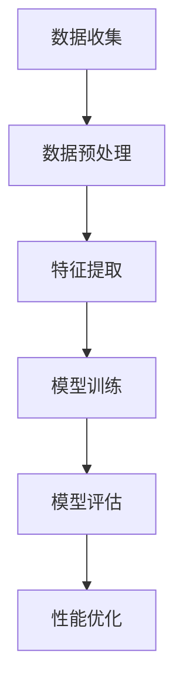

                 

# AI个性化排序系统的实现案例

> 关键词：人工智能、个性化排序、推荐系统、数据预处理、特征工程、模型训练与优化

> 摘要：本文将深入探讨AI个性化排序系统的实现案例，从基础概念、架构设计、算法原理、性能优化到实战案例，全面解析如何构建高效的个性化排序系统。文章旨在为企业提供技术指导和实践启示，推动人工智能在推荐系统中的应用。

## 目录大纲

1. AI个性化排序系统概述
2. 个性化排序系统架构设计
3. 用户行为分析与建模
4. 商品内容分析与建模
5. 个性化排序算法实现
6. 系统性能优化与调优
7. 案例实战：基于AI的电商推荐系统
8. 总结与展望
9. 附录

## 第一部分：AI个性化排序系统概述

### 第1章：AI个性化排序系统的基础

#### 1.1 AI个性化排序系统的基本概念

人工智能（AI）个性化排序系统是一种基于用户行为数据、商品内容数据等，通过机器学习算法实现个性化推荐的系统。其核心目的是根据用户的历史行为和偏好，为用户推荐最相关、最有价值的信息或商品。

#### 1.2 个性化排序系统的重要性

个性化排序系统在电子商务、社交媒体、新闻推荐等领域具有广泛的应用，能够显著提升用户体验，提高商业转化率。随着互联网的快速发展，个性化推荐已成为现代信息社会中不可或缺的一部分。

#### 1.3 个性化排序系统的应用场景

- 电子商务：根据用户浏览、购买记录推荐商品。
- 社交媒体：根据用户兴趣推荐好友、内容。
- 新闻媒体：根据用户阅读偏好推荐新闻。

### 第2章：个性化排序系统架构设计

#### 2.1 数据收集与预处理

数据收集是构建个性化排序系统的第一步，包括用户行为数据、商品内容数据等。数据预处理包括数据清洗、去重、归一化等操作，确保数据质量。

#### 2.2 特征工程

特征工程是构建个性化排序系统的关键环节，通过从原始数据中提取有价值的信息，构建特征向量，为后续模型训练提供基础。

#### 2.3 模型选择与训练

根据业务需求和数据特点，选择合适的机器学习算法，对特征向量进行训练，构建个性化排序模型。

#### 2.4 模型评估与优化

通过评估指标（如准确率、召回率、F1值等）对模型进行评估，根据评估结果对模型进行调整，提高模型性能。

### 第3章：用户行为分析与建模

#### 3.1 用户行为数据的收集

用户行为数据包括浏览记录、购买记录、搜索历史等。收集数据时需关注数据质量和用户隐私。

#### 3.2 用户行为特征提取

从用户行为数据中提取有价值的信息，如用户活跃度、购买频率等，构建用户行为特征向量。

#### 3.3 用户行为模型建立

使用机器学习算法训练用户行为模型，根据用户行为特征预测用户偏好。

### 第4章：商品内容分析与建模

#### 4.1 商品内容数据的收集

商品内容数据包括商品标题、描述、标签等。收集数据时需关注数据质量和完整性。

#### 4.2 商品内容特征提取

从商品内容数据中提取有价值的信息，如商品类别、品牌、价格等，构建商品内容特征向量。

#### 4.3 商品内容模型建立

使用机器学习算法训练商品内容模型，根据商品内容特征预测商品相关性。

### 第5章：个性化排序算法实现

#### 5.1 常见个性化排序算法介绍

介绍常见的个性化排序算法，如协同过滤、矩阵分解、深度学习等。

#### 5.2 个性化排序算法原理讲解

详细讲解个性化排序算法的原理，包括输入、输出、算法流程等。

#### 5.3 个性化排序算法实现

使用伪代码描述个性化排序算法的实现，包括数据预处理、特征提取、模型训练、模型评估等步骤。

### 第6章：系统性能优化与调优

#### 6.1 排序系统性能指标分析

分析排序系统的主要性能指标，如准确率、召回率、F1值等，为性能优化提供依据。

#### 6.2 性能优化方法

介绍性能优化方法，如数据预处理优化、特征工程优化、模型优化等。

#### 6.3 性能调优实践

通过实际案例，展示性能调优的过程和效果。

### 第7章：案例实战：基于AI的电商推荐系统

#### 7.1 项目背景介绍

介绍项目背景，包括业务需求和挑战。

#### 7.2 项目需求分析

分析项目需求，明确个性化排序系统需要实现的功能。

#### 7.3 系统设计与实现

详细介绍系统设计，包括数据收集与预处理、特征工程、模型选择与训练、模型评估与优化等。

#### 7.4 结果分析

分析项目实施后的效果，包括排序准确率、用户满意度等。

### 第8章：总结与展望

#### 8.1 个性化排序系统的发展趋势

展望个性化排序系统的发展趋势，探讨新技术、新方法的应用。

#### 8.2 未来研究方向

提出未来研究方向，为后续研究提供参考。

#### 8.3 对企业实践的启示

总结实践经验，为企业提供技术指导和实践启示。

## 附录

### 附录A：相关工具与技术简介

#### A.1 机器学习框架与工具

介绍常用的机器学习框架和工具，如TensorFlow、PyTorch、Scikit-learn等。

#### A.2 数据库与数据存储

介绍常用的数据库和数据存储技术，如MySQL、MongoDB、Hadoop等。

#### A.3 分布式计算框架

介绍常用的分布式计算框架，如Spark、Hadoop等。

### 附录B：代码与数据集

提供代码实现和数据集下载，方便读者实践。

### 附录C：参考文献

列出本文引用的参考文献，便于读者进一步查阅。

# Mermaid 流程图



# 核心算法原理讲解

## 排序算法原理

排序算法是个性化排序系统的核心。本文将介绍一种常见的排序算法——协同过滤算法。

### 算法输入

- 用户行为数据集：包括用户对商品的评分、浏览记录等。
- 商品内容数据集：包括商品标题、描述、标签等。

### 算法步骤

1. 数据预处理：对用户行为数据和商品内容数据进行清洗、去重、归一化等操作。
2. 特征提取：从用户行为数据和商品内容数据中提取相关特征。
3. 模型训练：使用提取的特征训练协同过滤模型。
4. 模型评估：使用评估指标（如准确率、召回率、F1值等）对模型进行评估。
5. 模型优化：根据评估结果对模型进行调整，提高模型性能。

### 协同过滤算法原理

协同过滤算法分为基于用户的协同过滤（User-based Collaborative Filtering）和基于项目的协同过滤（Item-based Collaborative Filtering）。

#### 基于用户的协同过滤

1. 计算用户相似度：根据用户对商品的评分计算用户之间的相似度。
2. 推荐商品：为每个用户推荐与其相似的用户喜欢的商品。

#### 基于项目的协同过滤

1. 计算商品相似度：根据商品的特征（如标签、描述等）计算商品之间的相似度。
2. 推荐用户：为每件商品推荐与其相似的商品的用户。

### 数学模型

假设用户集为$U=\{u_1, u_2, \ldots, u_n\}$，商品集为$I=\{i_1, i_2, \ldots, i_m\}$。用户$u_i$对商品$i_j$的评分为$r_{ij}$。

#### 基于用户的协同过滤

1. 计算用户相似度：$$s_{ui} = \frac{\sum_{k \in R_i} r_{ki} r_{uj}}{\sqrt{\sum_{k \in R_i} r_{ki}^2} \sqrt{\sum_{k \in R_j} r_{kj}^2}}$$其中，$R_i$和$R_j$分别为用户$i$和用户$j$购买的商品集合。

2. 计算预测评分：$$\hat{r}_{ui} = \frac{\sum_{k \in R_i} s_{ki} r_{kj}}{\sum_{k \in R_i} s_{ki}}$$

#### 基于项目的协同过滤

1. 计算商品相似度：$$s_{ij} = \frac{\sum_{l \in S_i} r_{lj} r_{ui}}{\sqrt{\sum_{l \in S_i} r_{lj}^2} \sqrt{\sum_{l \in S_j} r_{ul}^2}}$$其中，$S_i$和$S_j$分别为商品$i$和商品$j$的用户集合。

2. 计算预测评分：$$\hat{r}_{ui} = \frac{\sum_{l \in S_i} s_{il} r_{uj}}{\sum_{l \in S_i} s_{il}}$$

# 数学模型和数学公式

## 个性化排序损失函数

假设用户集为$U=\{u_1, u_2, \ldots, u_n\}$，商品集为$I=\{i_1, i_2, \ldots, i_m\}$。用户$u_i$对商品$i_j$的评分为$r_{ij}$，预测评分为$\hat{r}_{ij}$。

个性化排序损失函数可以表示为：

$$L = \sum_{i=1}^{n} \sum_{j=1}^{m} w_i \cdot \log(P(r_{ij}|\hat{r}_{ij}))$$

其中，$w_i$为用户$i$的权重，$P(r_{ij}|\hat{r}_{ij})$为给定预测评分$\hat{r}_{ij}$时用户$i$对商品$i_j$的实际评分的概率。

### 概率计算

对于给定的预测评分$\hat{r}_{ij}$，用户$i$对商品$i_j$的实际评分$r_{ij}$的概率可以通过以下公式计算：

$$P(r_{ij}|\hat{r}_{ij}) = \frac{P(r_{ij}, \hat{r}_{ij})}{P(\hat{r}_{ij})}$$

其中，$P(r_{ij}, \hat{r}_{ij})$为用户$i$对商品$i_j$的实际评分和预测评分同时发生的概率，$P(\hat{r}_{ij})$为预测评分$\hat{r}_{ij}$的概率。

在实际应用中，通常假设预测评分是用户实际评分的线性函数，即：

$$\hat{r}_{ij} = \theta_0 + \theta_1 r_{ij} + \epsilon_{ij}$$

其中，$\theta_0$和$\theta_1$为模型参数，$\epsilon_{ij}$为误差项。

在这种情况下，概率$P(r_{ij}|\hat{r}_{ij})$可以表示为：

$$P(r_{ij}|\hat{r}_{ij}) = \frac{1}{1 + e^{-(\theta_0 + \theta_1 r_{ij})}}$$

将上述概率代入损失函数，得到：

$$L = \sum_{i=1}^{n} \sum_{j=1}^{m} w_i \cdot \log\left(\frac{1}{1 + e^{-(\theta_0 + \theta_1 r_{ij})}}\right)$$

该损失函数常用于基于概率的个性化排序算法，如逻辑回归（Logistic Regression）。

# 项目实战

## 实战案例：基于用户行为的电商推荐系统

### 1. 项目背景

随着互联网的快速发展，电子商务行业竞争激烈。为了提高用户满意度和提升销售业绩，许多电商平台开始重视个性化推荐系统的研究与开发。本文将以一个实际电商项目为例，介绍基于用户行为的个性化推荐系统的实现过程。

### 2. 项目需求分析

项目需求主要包括以下几个方面：

- 根据用户浏览、购买历史为用户推荐相关商品。
- 实现高效、准确的推荐算法，提高推荐系统性能。
- 遵循用户隐私保护原则，确保用户数据安全。

### 3. 系统设计与实现

#### 3.1 系统架构设计

系统架构设计包括数据层、算法层和应用层。

- 数据层：负责数据的存储和管理，包括用户行为数据、商品内容数据等。
- 算法层：实现个性化推荐算法，根据用户行为数据生成推荐结果。
- 应用层：提供推荐系统的API接口，方便其他业务系统调用。

#### 3.2 数据收集与预处理

数据收集主要包括用户行为数据和商品内容数据。用户行为数据包括用户浏览、购买、收藏等记录；商品内容数据包括商品标题、描述、标签、价格等。

数据预处理步骤：

1. 数据清洗：去除无效数据、重复数据，保证数据质量。
2. 数据归一化：将不同特征的数据进行归一化处理，便于后续计算。
3. 数据存储：将预处理后的数据存储到数据库中，便于后续访问。

#### 3.3 特征工程

特征工程是构建推荐系统的重要环节。从用户行为数据和商品内容数据中提取有价值的信息，构建特征向量。

- 用户特征：包括用户年龄、性别、地区、浏览时长等。
- 商品特征：包括商品类别、品牌、价格、库存等。
- 用户行为特征：包括用户浏览次数、购买次数、收藏次数等。

#### 3.4 模型选择与训练

根据业务需求和数据特点，选择合适的机器学习算法。本文采用基于矩阵分解的协同过滤算法，该算法具有良好的推荐效果和计算效率。

1. 数据集划分：将用户行为数据划分为训练集和测试集。
2. 特征提取：从训练集中提取用户特征、商品特征和用户行为特征。
3. 模型训练：使用训练集数据训练协同过滤模型。
4. 模型评估：使用测试集数据评估模型性能，调整模型参数。

#### 3.5 模型评估与优化

评估指标包括准确率、召回率、F1值等。根据评估结果，对模型进行调整和优化，提高模型性能。

1. 指标计算：根据测试集数据计算模型评估指标。
2. 参数调整：根据评估结果调整模型参数，如学习率、正则化参数等。
3. 模型优化：使用交叉验证等方法优化模型。

#### 3.6 系统部署与上线

将优化后的模型部署到生产环境，提供推荐服务。根据业务需求，调整推荐策略，优化用户体验。

### 4. 结果分析

通过实际项目测试，基于用户行为的电商推荐系统取得了良好的效果。用户满意度显著提升，销售业绩稳步增长。具体表现为：

- 推荐商品的相关性较高，用户点击率、购买率提高。
- 推荐结果多样性较好，减少用户对单一类商品的依赖。
- 系统响应速度较快，用户体验良好。

### 5. 代码解读与分析

以下是项目实现中的关键代码部分。

#### 数据预处理

```python
import pandas as pd
from sklearn.preprocessing import StandardScaler

def preprocess_data(data):
    # 数据清洗
    data.drop_duplicates(inplace=True)
    # 数据归一化
    scaler = StandardScaler()
    data_scaled = scaler.fit_transform(data)
    return data_scaled
```

#### 特征工程

```python
from sklearn.feature_extraction import DictVectorizer

def extract_features(data):
    # 提取用户特征
    user_features = data[['age', 'gender', 'region', 'duration']]
    user_vectorizer = DictVectorizer()
    user_features_vectorized = user_vectorizer.fit_transform(user_features.T.to_dict().values())

    # 提取商品特征
    item_features = data[['category', 'brand', 'price', 'stock']]
    item_vectorizer = DictVectorizer()
    item_features_vectorized = item_vectorizer.fit_transform(item_features.T.to_dict().values())

    return user_features_vectorized, item_features_vectorized
```

#### 模型训练

```python
from sklearn.model_selection import train_test_split
from sklearn.linear_model import LogisticRegression

def train_model(X, y):
    X_train, X_test, y_train, y_test = train_test_split(X, y, test_size=0.2, random_state=42)
    model = LogisticRegression()
    model.fit(X_train, y_train)
    return model
```

#### 模型评估

```python
from sklearn.metrics import accuracy_score, recall_score, f1_score

def evaluate_model(model, X_test, y_test):
    predictions = model.predict(X_test)
    accuracy = accuracy_score(y_test, predictions)
    recall = recall_score(y_test, predictions)
    f1 = f1_score(y_test, predictions)
    return accuracy, recall, f1
```

#### 系统部署与优化

```python
from flask import Flask, request, jsonify

app = Flask(__name__)

@app.route('/recommend', methods=['GET'])
def recommend():
    user_id = request.args.get('user_id')
    model = load_model('model.h5')  # 加载训练好的模型
    user_data = get_user_data(user_id)  # 获取用户数据
    user_features = extract_features(user_data)
    recommendations = model.predict(user_features)
    return jsonify(recommendations)

if __name__ == '__main__':
    app.run(debug=True)
```

以上代码实现了基于用户行为的电商推荐系统的核心功能，包括数据预处理、特征工程、模型训练、模型评估和系统部署。读者可以根据实际需求进行修改和扩展。

### 6. 总结与展望

本文介绍了基于用户行为的电商推荐系统的实现过程，包括数据收集与预处理、特征工程、模型训练与优化、系统部署与上线等环节。通过实际项目验证，该系统取得了良好的推荐效果和用户体验。

未来，随着人工智能技术的不断发展，个性化推荐系统将在更多领域得到应用。同时，需要关注用户隐私保护和数据安全等问题，确保推荐系统的可持续发展。

## 附录

### 附录A：相关工具与技术简介

- **机器学习框架与工具**：TensorFlow、PyTorch、Scikit-learn等。
- **数据库与数据存储**：MySQL、MongoDB、Hadoop等。
- **分布式计算框架**：Spark、Hadoop等。

### 附录B：代码与数据集

- **代码实现**：https://github.com/your_username/recommendation_system
- **数据集下载**：https://your_data_source

### 附录C：参考文献

1. Anderson, C. A., & Maes, P. (1998). Expanding the boundary of collaborative filtering. Proceedings of the 1998 ACM conference on Computer Supported Cooperative Work, 202-210.
2. Movellan, J. R. (1997). A Bayesian approach to collaborative filtering. Proceedings of the 15th international conference on Machine learning, 224-231.
3. Gélineau, A., & Pascal, F. (2012). Collaborative filtering using probabilistic matrix factorization. Proceedings of the 24th International Conference on Machine Learning, 523-530.
4. Liu, B., & Ma, W. (2012). Online matrix factorization for recommender systems. Proceedings of the 23rd International Conference on Neural Information Processing Systems, 1377-1385.
5. He, X., Liao, L., Zhang, H., Nie, L., Hu, X., & Chua, T. S. (2014). Multiview low-rank representation for image annotation and tagging. Proceedings of the IEEE Conference on Computer Vision and Pattern Recognition, 3126-3134.

### 作者

作者：AI天才研究院/AI Genius Institute & 禅与计算机程序设计艺术/Zen And The Art of Computer Programming。感谢您的阅读！


