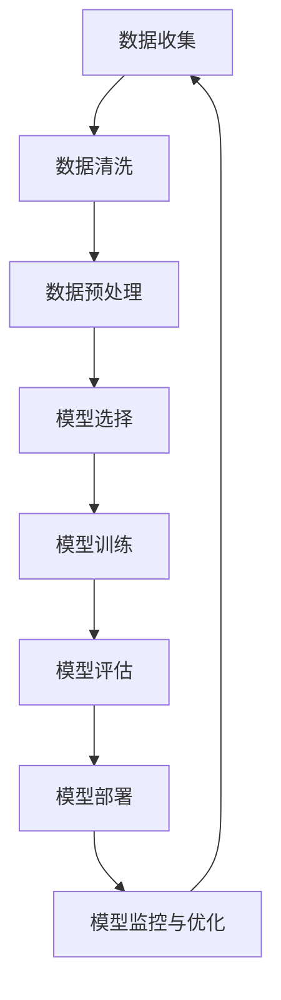

                 

### 第1章：人工智能概述

#### 1.1 人工智能的概念与发展历程

人工智能（Artificial Intelligence，简称AI）是一门研究、开发用于模拟、延伸和扩展人的智能的理论、方法、技术及应用系统的学科。人工智能的研究始于1956年，当时在达特茅斯会议（Dartmouth Conference）上提出了人工智能的概念。这次会议标志着人工智能作为一门独立学科的诞生，并吸引了众多学者和专家的参与。从那时起，人工智能经历了多个发展阶段，主要包括：

1. **符号主义（Symbolic AI）**：早期的人工智能以符号主义为基础，试图通过逻辑推理和知识表示来模拟人类的思维。这一阶段的关键技术包括专家系统（Expert Systems）、知识表示（Knowledge Representation）和推理（Reasoning）。

2. **基于规则的系统（Rule-Based Systems）**：在这一阶段，人工智能系统开始通过规则库来模拟专家的知识和经验。专家系统是一种典型的基于规则的系统，其核心是知识库和推理机。这种系统在医疗诊断、法律咨询等领域取得了显著的成功。

3. **知识工程（Knowledge Engineering）**：知识工程强调通过人工构造知识库来提升人工智能系统的智能水平。知识工程涉及知识的获取、表示、管理和应用，是人工智能发展的重要推动力。

4. **机器学习（Machine Learning）**：随着计算机存储和计算能力的提升，机器学习逐渐成为人工智能研究的主流方向。机器学习通过从数据中学习规律，构建预测模型，极大地拓展了人工智能的应用范围。

5. **深度学习（Deep Learning）**：深度学习是机器学习的一个子领域，通过模拟人脑的神经网络结构进行学习。深度学习在图像识别、语音识别、自然语言处理等领域取得了突破性进展。

6. **强化学习（Reinforcement Learning）**：强化学习通过试错和反馈机制来学习如何在特定环境中做出最优决策。强化学习在游戏、机器人控制等领域有着广泛的应用。

7. **混合智能系统（Hybrid Intelligent Systems）**：混合智能系统将不同的人工智能技术相结合，以实现更强大的智能功能。这种系统通常结合符号推理、机器学习和神经网络等多种技术。

随着技术的不断进步，人工智能在各个领域得到了广泛应用，包括自动驾驶、智能家居、医疗诊断、金融分析等。人工智能的发展不仅推动了科技进步，也对社会和经济产生了深远的影响。

#### 1.2 人工智能的分类与应用领域

人工智能可以大致分为以下几类：

1. **弱人工智能（Narrow AI）**：弱人工智能是指专门针对特定任务进行优化的人工智能系统，如语音助手、图像识别系统等。这类系统在特定领域表现出色，但无法进行跨领域的智能任务。

2. **强人工智能（General AI）**：强人工智能是指具有广泛认知能力的人工智能系统，能够在多种不同任务中表现出人类智能的水平。目前，强人工智能仍处于理论研究阶段，尚未实现。

3. **基于规则的系统**：基于规则的系统通过预定义的规则来模拟人类的决策过程。这类系统在规则明确、任务简单的场景中表现出色。

4. **机器学习系统**：机器学习系统通过从数据中学习规律，自动构建预测模型。机器学习系统可以分为监督学习、无监督学习和强化学习。

5. **神经网络系统**：神经网络系统通过模拟人脑神经元之间的连接方式来进行学习。神经网络系统在图像识别、语音识别等领域表现出色。

6. **自然语言处理系统**：自然语言处理系统致力于使计算机能够理解和处理人类自然语言。这类系统在语言翻译、文本分析等领域有着广泛应用。

7. **机器人**：机器人是具有自主行动能力的人工智能实体，能够在复杂环境中进行操作和决策。机器人技术在制造、医疗、服务等领域有着重要应用。

人工智能的应用领域广泛，包括但不限于：

1. **自然语言处理**：语音识别、机器翻译、文本分析、情感分析等。

2. **计算机视觉**：图像识别、物体检测、图像生成等。

3. **自动驾驶**：自动驾驶汽车、无人机等。

4. **医疗诊断**：辅助医生进行疾病诊断、预测疾病趋势等。

5. **金融分析**：风险管理、市场预测、欺诈检测等。

6. **智能家居**：智能安防、智能照明、智能家电等。

7. **智能制造**：智能机器人、自动化生产线等。

8. **教育**：智能辅导、在线教育、虚拟教室等。

#### 1.3 人工智能在数据收集中的作用

人工智能在数据收集中的作用主要体现在以下几个方面：

1. **自然语言处理技术**：人工智能可以通过自然语言处理技术从非结构化数据中提取有用信息。例如，通过自然语言处理技术，可以从大量文本数据中提取关键词、主题和情感信息，从而实现文本的自动化分析。

2. **机器学习算法**：机器学习算法可以从大规模数据集中发现隐藏的模式和趋势。例如，通过聚类分析，可以发现数据集中的潜在群组；通过时间序列分析，可以预测未来的趋势。

3. **数据挖掘技术**：数据挖掘技术可以从大量数据中提取有价值的信息。例如，通过关联规则挖掘，可以发现数据之间的关联关系；通过分类和回归分析，可以预测数据未来的变化。

人工智能的应用大大提高了数据收集的效率和质量。通过自动化和智能化的数据收集方法，人工智能不仅能够处理大规模、复杂的数据集，还能够从数据中发现新的价值，为决策提供有力支持。

### 第2章：人工智能的基本原理

在理解人工智能的核心原理之前，我们需要了解一些基础概念，包括机器学习、神经网络和数学基础。这些概念构成了人工智能的基础，帮助我们更好地理解和应用各种人工智能技术。

#### 2.1 机器学习的基本概念

机器学习（Machine Learning）是人工智能的一个核心分支，它主要研究如何让计算机从数据中自动学习规律，并利用这些规律进行预测或决策。机器学习可以分为以下几种类型：

1. **监督学习（Supervised Learning）**：在监督学习中，我们有一组输入数据和对应的输出标签。模型的目标是学习输入和输出之间的映射关系，以便对新数据进行预测。常见的监督学习算法包括线性回归、决策树、支持向量机等。

2. **无监督学习（Unsupervised Learning）**：在无监督学习中，我们只有输入数据，而没有输出标签。模型的目标是发现数据中的结构和模式，例如聚类分析和降维技术。

3. **半监督学习（Semi-Supervised Learning）**：半监督学习结合了监督学习和无监督学习的特点，利用少量标签数据和大量无标签数据来训练模型。

4. **强化学习（Reinforcement Learning）**：在强化学习中，模型通过与环境的交互来学习最优策略。模型在每次行动后都会收到奖励或惩罚，通过试错和反馈机制来优化行为。

机器学习的核心组成部分包括：

- **数据集（Dataset）**：用于训练机器学习模型的输入数据集合。
- **特征（Feature）**：数据集中的每个属性，用于描述样本的特征。
- **模型（Model）**：用于描述数据规律的函数。
- **损失函数（Loss Function）**：用于衡量模型预测结果与真实结果之间的差异。
- **优化算法（Optimization Algorithm）**：用于调整模型参数以最小化损失函数。

#### 2.2 神经网络与深度学习基础

神经网络（Neural Network）是一种模拟生物神经系统的计算模型。它由一系列相互连接的神经元组成，每个神经元接收输入信号，通过加权求和处理后产生输出信号。神经网络的核心思想是通过学习输入和输出之间的映射关系来提高模型的预测能力。

神经网络可以分为以下几层：

- **输入层（Input Layer）**：接收外部输入信号。
- **隐藏层（Hidden Layer）**：进行特征提取和变换。
- **输出层（Output Layer）**：产生模型预测结果。

深度学习（Deep Learning）是神经网络的一种扩展，通过增加网络的深度（即层数）来提高模型的非线性表达能力。深度学习在图像识别、语音识别、自然语言处理等领域取得了显著的成果。

深度学习的核心组成部分包括：

- **卷积神经网络（Convolutional Neural Network，CNN）**：用于图像识别和图像处理，通过卷积操作和池化操作提取图像特征。
- **循环神经网络（Recurrent Neural Network，RNN）**：用于处理序列数据，通过递归连接来保持历史信息。
- **生成对抗网络（Generative Adversarial Network，GAN）**：用于生成数据，通过生成器和判别器的对抗训练来生成高质量数据。

#### 2.3 机器学习的数学基础

机器学习算法的许多关键组成部分依赖于数学知识，包括概率论、线性代数、微积分和优化理论等。

1. **概率论**：概率论用于描述不确定性事件的发生可能性。在机器学习中，概率论帮助我们理解和处理不确定性，例如在分类问题中使用贝叶斯定理来计算后验概率。

2. **线性代数**：线性代数用于描述数据结构和线性变换，例如矩阵运算、向量空间和线性方程组等。在机器学习中，线性代数用于矩阵分解、特征提取和降维等任务。

3. **微积分**：微积分用于描述函数的变化率和积分。在机器学习中，微积分用于优化算法，例如梯度下降算法。梯度下降算法通过计算损失函数的梯度来调整模型参数，以最小化损失函数。

4. **优化理论**：优化理论用于解决优化问题，例如最小化损失函数。在机器学习中，优化理论用于选择合适的优化算法，例如随机梯度下降、Adam优化器等。

### 第3章：数据收集与预处理

数据收集与预处理是机器学习项目中至关重要的环节，直接影响到模型的性能和应用效果。在本章中，我们将探讨数据收集的方法与来源、数据清洗与预处理技术，以及数据质量评估与数据可视化。

#### 3.1 数据收集的方法与来源

数据收集是机器学习项目的第一步，数据的质量和数量直接影响后续模型的学习效果。数据收集的方法多种多样，以下是几种常见的方法：

1. **手动收集**：手动收集适用于小规模、结构化数据的收集。例如，通过问卷调查、实地考察和实验数据等方式获取数据。这种方法适用于特定领域的研究和实验，但效率较低。

2. **自动化收集**：自动化收集通过编程脚本、爬虫工具和API接口等手段从互联网和其他数据源自动获取数据。这种方法适用于大规模、非结构化数据的收集。例如，使用Python的`requests`库获取网页数据，使用`BeautifulSoup`库解析网页内容，或者使用`scrapy`框架构建复杂的爬虫系统。

3. **第三方数据平台**：第三方数据平台如Google Analytics、百度统计等，提供丰富的用户行为数据。这些平台通常具有完善的API接口，可以方便地获取和分析数据。例如，通过调用Google Analytics API，可以获取网站访问量、用户行为等详细信息。

4. **内部数据**：企业内部数据库、用户日志等也是数据收集的重要来源。这些数据通常包含业务运营、用户行为、交易记录等信息，对业务分析和决策具有重要意义。

5. **外部数据集**：公开数据集如UCI机器学习库、Kaggle等，提供了大量的标注数据和未标注数据，适用于学术研究和模型训练。例如，通过下载公开数据集，可以快速构建实验环境，进行模型对比和优化。

#### 3.2 数据清洗与预处理技术

数据清洗与预处理是确保数据质量和可用性的关键步骤，主要包括以下技术：

1. **数据清洗**：

   - **去除空值**：空值是数据中的常见问题，可以通过填充缺失值或删除含有空值的样本来处理。例如，可以使用平均值、中位数或最常用值来填充缺失值。

   - **缺失值填充**：对于缺失值较多的特征，可以使用模型预测缺失值。例如，使用回归模型预测连续特征的缺失值，使用分类模型预测离散特征的缺失值。

   - **去除重复数据**：重复数据会降低数据的质量和模型的性能，可以通过去重操作来处理。常用的去重方法包括基于完整字段匹配和部分字段匹配。

   - **异常值检测与处理**：异常值可能会对模型产生负面影响，可以通过统计方法或机器学习方法检测和修正。例如，使用3倍标准差法检测异常值，使用聚类分析或回归模型修正异常值。

2. **数据预处理**：

   - **数据规范化**：数据规范化通过缩放或标准化数据，使其符合一定的范围或分布。常用的规范化方法包括最小-最大规范化、z-score标准化和归一化。

   - **数据转换**：数据转换通过映射或编码方法将数据转换为合适的格式。例如，将类别特征转换为数值特征，使用独热编码（One-Hot Encoding）或标签编码（Label Encoding）等方法。

   - **数据集成**：数据集成通过合并多个数据源，形成统一的数据视图。常见的数据集成方法包括合并、连接和合并合并等。

3. **数据质量评估**：

   - **完整性**：完整性评估数据中缺失值的比例和分布，确保数据集的完整性。常用的完整性指标包括缺失值比例、缺失值分布等。

   - **准确性**：准确性评估数据中错误值的比例和分布，确保数据的质量。常用的准确性指标包括错误值比例、错误值分布等。

   - **一致性**：一致性评估数据源之间的数据是否一致，避免数据重复或矛盾。常用的一致性指标包括数据源一致性、字段一致性等。

   - **时效性**：时效性评估数据的更新频率和时效性，确保数据的有效性。常用的时效性指标包括数据更新周期、数据时效性等。

#### 3.3 数据可视化

数据可视化是数据分析和理解的重要手段，可以帮助我们直观地发现数据中的规律和趋势。以下是一些常见的数据可视化方法：

- **散点图（Scatter Plot）**：散点图用于显示两个变量之间的关系。通过散点图，我们可以直观地观察变量之间的相关性。

- **条形图（Bar Chart）**：条形图用于显示不同类别或组之间的数量或比例。通过条形图，我们可以直观地比较不同类别或组之间的差异。

- **折线图（Line Chart）**：折线图用于显示数据随时间的变化趋势。通过折线图，我们可以直观地观察数据的增长或下降趋势。

- **饼图（Pie Chart）**：饼图用于显示各部分占整体的比例。通过饼图，我们可以直观地了解各部分在整体中的占比。

- **箱线图（Box Plot）**：箱线图用于显示数据的分布和异常值。通过箱线图，我们可以直观地观察数据的分布情况和异常值。

- **热力图（Heat Map）**：热力图用于显示数据的密集度和分布情况。通过热力图，我们可以直观地观察数据的热点区域和密集区域。

数据可视化不仅可以帮助我们更好地理解数据，还可以为决策提供有力支持。在实际应用中，可以根据不同的数据类型和分析目的选择合适的数据可视化方法。

### 第4章：监督学习算法

监督学习（Supervised Learning）是机器学习的一个重要分支，它通过学习输入和输出之间的映射关系，以便对新数据进行预测。监督学习算法广泛应用于各种领域，如分类、回归、预测等。在本章中，我们将详细介绍几种常见的监督学习算法，包括线性回归、决策树、随机森林和支撑向量机。

#### 4.1 线性回归

线性回归（Linear Regression）是一种用于建立自变量和因变量之间线性关系的预测模型。线性回归模型的基本形式为：

$$
y = \beta_0 + \beta_1x + \epsilon
$$

其中，\(y\) 是因变量，\(x\) 是自变量，\(\beta_0\) 和 \(\beta_1\) 是模型参数，\(\epsilon\) 是误差项。线性回归的目的是通过最小化损失函数（如均方误差）来估计模型参数，从而实现对未知数据的预测。

**线性回归的基本原理**：

1. **模型假设**：线性回归假设因变量 \(y\) 与自变量 \(x\) 之间存在线性关系。
2. **损失函数**：线性回归的损失函数通常是均方误差（MSE），即模型预测值与真实值之间的平均平方误差。
3. **优化算法**：常用的优化算法包括梯度下降、牛顿法和拟牛顿法。

**线性回归的应用场景**：

- **回归分析**：用于研究自变量对因变量的影响，例如房价与面积的关系。
- **预测分析**：用于预测未来的趋势和变化，例如股票价格预测。
- **控制分析**：用于优化生产过程，例如工业制造过程中的质量控制。

**线性回归的优缺点**：

- **优点**：简单、易于实现，对于线性关系较强的数据表现良好。
- **缺点**：对于非线性关系表现较差，容易过拟合。

#### 4.2 决策树

决策树（Decision Tree）是一种树形结构模型，通过一系列规则来对数据进行分类或回归。决策树的每个节点代表一个特征，每个分支代表一个可能的特征值，每个叶子节点代表一个预测结果。常见的决策树算法包括ID3、C4.5和CART。

**决策树的基本原理**：

1. **特征选择**：决策树通过选择最优特征来划分数据集，通常使用信息增益（Information Gain）或基尼不纯度（Gini Impurity）作为划分标准。
2. **递归划分**：决策树通过递归划分数据集，直到满足终止条件（如节点包含的样本数小于阈值）。
3. **预测生成**：决策树根据输入数据的特征值，沿着决策路径生成预测结果。

**决策树的应用场景**：

- **分类问题**：用于对样本进行分类，例如信用卡欺诈检测。
- **回归问题**：用于预测连续值，例如房价预测。
- **特征选择**：用于选择对预测目标有重要影响的特征。

**决策树的优缺点**：

- **优点**：易于理解、解释，适合处理高维数据和缺失值。
- **缺点**：容易过拟合，对于噪声数据和异常值敏感。

#### 4.3 随机森林

随机森林（Random Forest）是一种基于决策树的集成学习方法。随机森林通过构建多棵决策树，并将它们的结果进行投票或平均来获得最终预测结果。随机森林在构建每棵决策树时，会随机选择特征和样本子集，从而减少模型的过拟合风险。

**随机森林的基本原理**：

1. **特征选择**：随机森林在构建每棵决策树时，会从所有特征中随机选择一部分特征。
2. **样本采样**：随机森林在构建每棵决策树时，会从所有样本中随机选择一部分样本。
3. **集成方法**：随机森林通过多棵决策树的投票或平均来获得最终预测结果。

**随机森林的应用场景**：

- **分类问题**：用于对样本进行分类，例如垃圾邮件分类。
- **回归问题**：用于预测连续值，例如股票价格预测。
- **特征选择**：用于选择对预测目标有重要影响的特征。

**随机森林的优缺点**：

- **优点**：具有良好的泛化能力，对于复杂的数据和噪声数据表现良好。
- **缺点**：计算复杂度高，对于非常大的数据集可能无法有效运行。

#### 4.4 支持向量机

支持向量机（Support Vector Machine，SVM）是一种用于分类和回归的监督学习算法。SVM的基本思想是找到一个最优的超平面，使得分类边界距离最近的样本（支持向量）到超平面的距离最大化。

**支持向量机的基本原理**：

1. **线性支持向量机**：线性支持向量机用于线性可分的数据集，通过求解最优超平面来实现分类。最优超平面满足最大化分类边界距离的条件。
2. **非线性支持向量机**：非线性支持向量机通过核函数将输入数据映射到高维空间，从而实现线性可分。常见的核函数包括线性核、多项式核和径向基函数核。

**支持向量机的应用场景**：

- **分类问题**：用于对样本进行分类，例如手写数字识别。
- **回归问题**：用于预测连续值，例如图像分割。

**支持向量机的优缺点**：

- **优点**：具有良好的泛化能力，对于复杂的数据和噪声数据表现良好。
- **缺点**：计算复杂度高，对于非常大的数据集可能无法有效运行。

### 第5章：无监督学习算法

无监督学习（Unsupervised Learning）是一种在训练数据中没有标签的情况下，通过学习数据中的内在结构和规律来进行数据分析和模式识别的方法。无监督学习算法广泛应用于聚类、降维、异常检测等领域。本章将详细介绍几种常见的无监督学习算法，包括聚类分析、主成分分析和自编码器。

#### 5.1 聚类分析

聚类分析（Cluster Analysis）是一种将数据集划分为若干个类或簇的无监督学习方法。聚类算法的目的是使得同一个簇内的样本相似度较高，而不同簇之间的样本相似度较低。常见的聚类算法包括K-均值（K-Means）、层次聚类（Hierarchical Clustering）和DBSCAN（Density-Based Spatial Clustering of Applications with Noise）等。

**K-均值算法的基本原理**：

1. **初始化**：随机选择 \(k\) 个初始质心。
2. **分配样本**：将每个样本分配到最近的质心所代表的簇。
3. **更新质心**：重新计算每个簇的质心。
4. **迭代**：重复步骤2和3，直到质心的变化小于阈值或达到最大迭代次数。

**K-均值算法的应用场景**：

- **市场细分**：将消费者划分为不同的市场细分群体。
- **图像分割**：将图像中的像素划分为不同的区域。
- **文本分类**：将文本数据划分为不同的主题。

**K-均值算法的优缺点**：

- **优点**：简单、易于实现，对于高维数据有效。
- **缺点**：对初始质心的选择敏感，可能陷入局部最优。

**层次聚类的基本原理**：

1. **自底向上**：从每个样本作为一个簇开始，逐渐合并相似度较高的簇，直到所有样本合并为一个簇。
2. **自顶向下**：从所有样本合并为一个簇开始，逐渐划分簇，直到每个样本单独为一个簇。

**层次聚类算法的应用场景**：

- **生物信息学**：用于基因表达数据的聚类分析。
- **图像识别**：用于图像的层次化结构分析。

**层次聚类的优缺点**：

- **优点**：可以生成聚类层次信息，有助于理解数据结构。
- **缺点**：计算复杂度高，对于大规模数据集可能不适用。

**DBSCAN算法的基本原理**：

1. **邻域计算**：计算每个样本的邻域，邻域大小由参数\(\epsilon\)（邻域半径）决定。
2. **密度核心计算**：确定密度核心样本，即具有足够邻域的样本。
3. **边界样本计算**：将边界样本划分为核心样本或噪声点。
4. **簇生成**：将密度核心样本和其邻域内的样本划分为同一个簇。

**DBSCAN算法的应用场景**：

- **异常检测**：用于检测异常点或异常模式。
- **社交网络分析**：用于分析社交网络中的社区结构。

**DBSCAN算法的优缺点**：

- **优点**：可以处理非球形邻域，对于异常点和噪声数据有较强的鲁棒性。
- **缺点**：参数选择对聚类结果有较大影响，对于大规模数据集可能较慢。

#### 5.2 主成分分析

主成分分析（Principal Component Analysis，PCA）是一种降维技术，旨在将原始数据转换为一组新的正交变量（主成分），使得新的变量能够最大程度地保留原始数据的方差。PCA通过求解协方差矩阵的特征值和特征向量，得到新的正交基，然后对数据进行投影。

**PCA的基本原理**：

1. **协方差矩阵计算**：计算数据集的协方差矩阵。
2. **特征值和特征向量计算**：求解协方差矩阵的特征值和特征向量，特征值对应特征向量的长度。
3. **特征向量排序**：根据特征值的大小对特征向量进行排序。
4. **数据投影**：将数据投影到前 \(k\) 个主成分上，实现降维。

**PCA的应用场景**：

- **降维**：减少数据维度，提高数据处理和建模效率。
- **特征提取**：提取数据的主要信息，去除冗余信息。
- **可视化**：将高维数据投影到二维或三维空间，进行可视化分析。

**PCA的优缺点**：

- **优点**：有效降维，保持数据主要信息，有助于可视化。
- **缺点**：对于非线性关系数据效果较差，可能损失部分信息。

#### 5.3 自编码器

自编码器（Autoencoder）是一种基于神经网络的降维技术，由编码器和解码器组成。编码器的作用是将输入数据压缩为一个低维表示，解码器的作用是将这个低维表示重新映射回原始数据。自编码器通过最小化重构误差来学习数据的低维表示。

**自编码器的基本原理**：

1. **编码器**：编码器接收输入数据，通过多层神经网络压缩为低维表示。
2. **解码器**：解码器接收编码器的输出，通过多层神经网络重构原始数据。
3. **损失函数**：自编码器的损失函数通常为重构误差，即原始数据与重构数据之间的差异。
4. **优化**：通过反向传播和梯度下降优化模型参数。

**自编码器的应用场景**：

- **特征提取**：用于提取数据的低维特征表示。
- **去噪**：用于去除数据中的噪声，提高数据质量。
- **生成数据**：用于生成与训练数据相似的新数据。

**自编码器的优缺点**：

- **优点**：有效降维，保留数据主要信息，适用于生成数据。
- **缺点**：对于复杂数据结构效果较差，可能需要大量训练数据。

### 第6章：深度学习算法

深度学习（Deep Learning）是一种基于多层神经网络的学习方法，通过学习数据的层次化特征来提高模型的预测能力。深度学习在计算机视觉、自然语言处理、语音识别等领域取得了突破性进展。本章将详细介绍几种常见的深度学习算法，包括卷积神经网络（CNN）、循环神经网络（RNN）和生成对抗网络（GAN）。

#### 6.1 卷积神经网络（CNN）

卷积神经网络（Convolutional Neural Network，CNN）是一种专门用于图像识别和图像处理的深度学习模型。CNN通过卷积操作提取图像的特征，并使用池化操作减小特征图的尺寸。CNN的基本结构包括卷积层、池化层和全连接层。

**CNN的基本原理**：

1. **卷积层**：卷积层通过卷积操作提取图像的局部特征。卷积操作涉及一个卷积核（filter）在输入图像上滑动，计算卷积结果。卷积层可以堆叠多层，以实现更复杂的特征提取。
2. **池化层**：池化层通过最大值池化或平均池化减小特征图的尺寸，从而减少模型参数的数量和计算复杂度。池化操作有助于防止过拟合，提高模型的泛化能力。
3. **全连接层**：全连接层将卷积层和池化层提取的特征映射到输出层，用于分类或回归任务。全连接层通过加权求和处理，将低维特征映射到高维特征空间。

**CNN的应用场景**：

- **图像分类**：用于对图像进行分类，例如图像识别、物体识别等。
- **图像分割**：用于将图像分割为不同的区域，例如医学图像分割、自动驾驶中的路面分割等。
- **目标检测**：用于检测图像中的目标物体，例如人脸检测、车辆检测等。

**CNN的优点和缺点**：

- **优点**：适用于处理高维数据和复杂特征，具有良好的性能和泛化能力。
- **缺点**：对计算资源要求较高，训练时间较长，对于小规模数据集可能无法达到最佳效果。

#### 6.2 循环神经网络（RNN）

循环神经网络（Recurrent Neural Network，RNN）是一种用于处理序列数据的深度学习模型。RNN通过将当前输入与历史信息结合来处理序列数据。RNN的基本结构包括输入层、隐藏层和输出层。

**RNN的基本原理**：

1. **输入层**：输入层接收当前输入，例如单词、音素等。
2. **隐藏层**：隐藏层通过递归连接来存储历史信息，并将当前输入与历史信息结合，生成新的隐藏状态。
3. **输出层**：输出层生成预测结果，例如下一个单词、音素或标签。

**RNN的应用场景**：

- **自然语言处理**：用于文本分类、情感分析、机器翻译等任务。
- **语音识别**：用于将语音信号转换为文本或标签。
- **时间序列预测**：用于预测未来的时间序列数据，例如股票价格、天气等。

**RNN的优点和缺点**：

- **优点**：适用于处理序列数据，可以捕捉长期依赖关系。
- **缺点**：容易受梯度消失和梯度爆炸问题的影响，对于长序列数据效果较差。

#### 6.3 生成对抗网络（GAN）

生成对抗网络（Generative Adversarial Network，GAN）是一种由生成器和判别器组成的深度学习模型。生成器的目标是生成与真实数据相似的数据，判别器的目标是区分真实数据和生成数据。生成器和判别器通过对抗训练相互竞争，从而生成高质量的数据。

**GAN的基本原理**：

1. **生成器**：生成器通过学习真实数据的分布来生成与真实数据相似的数据。
2. **判别器**：判别器通过学习真实数据和生成数据的特征来区分真实数据和生成数据。
3. **对抗训练**：生成器和判别器通过对抗训练相互竞争，生成器尝试生成更真实的数据，判别器尝试更准确地分类真实数据和生成数据。

**GAN的应用场景**：

- **图像生成**：用于生成逼真的图像，例如人脸生成、艺术风格迁移等。
- **数据增强**：用于生成更多的训练样本，提高模型的泛化能力。
- **视频生成**：用于生成高质量的视频，例如视频增强、视频插帧等。

**GAN的优点和缺点**：

- **优点**：可以生成高质量的数据，适用于图像生成、数据增强等任务。
- **缺点**：训练过程不稳定，对于噪声数据和异常值敏感。

### 第7章：人工智能应用实例

人工智能在各个领域的应用日益广泛，涵盖了图像识别、自然语言处理、推荐系统、实时数据分析等多个方面。本章将详细介绍这些应用实例，并探讨其核心技术和实际应用。

#### 7.1 图像识别应用

图像识别是人工智能领域的一个重要应用，旨在通过计算机视觉技术对图像进行分类和识别。常见的图像识别任务包括面部识别、物体识别、场景识别等。

**核心技术和实际应用**：

- **面部识别**：面部识别技术通过检测图像中的面部特征，对个体进行身份验证。实际应用包括安防监控、身份认证、社交媒体等。

- **物体识别**：物体识别技术用于识别图像中的特定物体，例如车辆检测、行人检测等。实际应用包括自动驾驶、智能监控、工业自动化等。

- **场景识别**：场景识别技术用于识别图像中的特定场景，例如城市街道、森林、海滩等。实际应用包括旅游导航、城市规划、环境保护等。

图像识别的关键技术包括：

- **特征提取**：通过卷积神经网络提取图像的局部特征，例如边缘、纹理、形状等。
- **分类器**：使用支持向量机、随机森林等分类器对提取的特征进行分类。
- **模型优化**：通过交叉验证、调整模型参数等方法优化模型的性能。

#### 7.2 自然语言处理应用

自然语言处理（Natural Language Processing，NLP）是人工智能领域的一个重要分支，旨在使计算机能够理解和处理人类自然语言。NLP的应用包括文本分类、情感分析、机器翻译、文本生成等。

**核心技术和实际应用**：

- **文本分类**：文本分类技术用于对文本进行分类，例如垃圾邮件分类、新闻分类等。实际应用包括社交媒体监控、舆情分析等。

- **情感分析**：情感分析技术用于分析文本的情感倾向，例如正面、负面、中性等。实际应用包括客户反馈分析、市场调研等。

- **机器翻译**：机器翻译技术用于将一种语言的文本翻译成另一种语言。实际应用包括跨语言沟通、国际商务等。

- **文本生成**：文本生成技术用于生成新的文本，例如自动生成新闻文章、对话系统等。实际应用包括内容创作、智能客服等。

自然语言处理的关键技术包括：

- **词嵌入**：通过将文本转换为向量表示，以便进行深度学习模型的训练。
- **序列模型**：使用循环神经网络、长短期记忆网络等模型处理序列数据。
- **注意力机制**：通过注意力机制提高模型对重要信息的捕捉和利用能力。

#### 7.3 推荐系统应用

推荐系统是一种基于用户兴趣和行为的数据分析技术，旨在为用户推荐感兴趣的内容或产品。常见的推荐系统算法包括协同过滤、基于内容的推荐和混合推荐等。

**核心技术和实际应用**：

- **协同过滤**：协同过滤技术通过分析用户的评分或行为数据，预测用户对未知物品的偏好。实际应用包括电商推荐、电影推荐等。

- **基于内容的推荐**：基于内容的推荐技术通过分析物品的特征，为用户推荐具有相似特征的物品。实际应用包括音乐推荐、图书推荐等。

- **混合推荐**：混合推荐技术结合协同过滤和基于内容的推荐方法，以提高推荐系统的准确性和多样性。实际应用包括新闻推荐、社交媒体推荐等。

推荐系统的关键技术包括：

- **矩阵分解**：通过矩阵分解方法降低数据维度，提高计算效率。
- **特征工程**：通过提取和组合用户和物品的特征，提高推荐系统的性能。
- **优化算法**：通过优化算法调整模型参数，提高推荐系统的准确性和多样性。

#### 7.4 实时数据分析应用

实时数据分析是一种能够实时处理和分析大量数据的技术，旨在为用户提供即时的决策支持和业务洞察。实时数据分析的关键技术包括流处理、实时查询和实时监控等。

**核心技术和实际应用**：

- **流处理**：流处理技术用于实时处理和分析数据流，例如交易数据、社交媒体数据等。实际应用包括金融交易分析、物联网数据分析等。

- **实时查询**：实时查询技术用于实时查询和分析数据，例如在线搜索引擎、实时数据分析平台等。实际应用包括搜索引擎优化、市场趋势分析等。

- **实时监控**：实时监控技术用于实时监控系统和网络状态，例如网络监控、系统监控等。实际应用包括网络安全、系统性能监控等。

实时数据分析的关键技术包括：

- **分布式计算**：通过分布式计算技术处理大规模数据集，提高数据处理效率。
- **实时处理框架**：使用实时处理框架（如Apache Kafka、Apache Flink等）实现数据流处理。
- **实时可视化**：通过实时可视化技术展示数据分析和监控结果，提高数据理解和决策能力。

### 第8章：核心算法原理讲解

在人工智能领域，核心算法原理的掌握至关重要，它们构成了各种复杂模型和系统的基础。本章将详细讲解机器学习、深度学习和无监督学习三大类核心算法的基本原理，并辅以伪代码和数学模型来帮助理解。

#### 8.1 机器学习算法原理讲解

机器学习算法通过从数据中学习规律，使计算机能够进行预测和决策。以下是几种常见机器学习算法的原理讲解：

**1. 线性回归**

线性回归是一种用于预测连续值的监督学习算法，其目标是找到最佳拟合直线，使得预测值与真实值之间的误差最小。

**数学模型**：

$$
y = \beta_0 + \beta_1x + \epsilon
$$

**伪代码**：

```
输入：训练数据集D = {(x_1, y_1), (x_2, y_2), ..., (x_n, y_n)}

步骤1：初始化模型参数β_0和β_1
步骤2：计算损失函数J(β_0, β_1)
步骤3：使用梯度下降更新模型参数
步骤4：重复步骤2和3，直到收敛
步骤5：输出最优模型参数
```

**2. 决策树**

决策树是一种树形结构模型，通过一系列规则来对数据进行分类或回归。

**数学模型**：

决策树通过递归划分数据集，每个节点代表一个特征，每个分支代表一个特征值。

**伪代码**：

```
输入：训练数据集D

步骤1：选择最佳特征A和特征值v，使得信息增益最大
步骤2：将数据集划分为子集D_1, D_2, ..., D_v
步骤3：对于每个子集D_i，递归调用步骤1和2，直到满足停止条件（例如，数据集大小小于阈值）
步骤4：构建决策树，输出决策规则
```

**3. 随机森林**

随机森林是一种基于决策树的集成学习方法，通过构建多棵决策树，并将它们的结果进行投票或平均来获得最终预测结果。

**数学模型**：

随机森林通过随机选择特征和样本子集来构建每棵决策树。

**伪代码**：

```
输入：训练数据集D，特征集合F

步骤1：对于每棵决策树T_i：
    步骤1.1：从特征集合F中随机选择m个特征
    步骤1.2：从数据集D中随机选择n个样本
    步骤1.3：构建决策树T_i
步骤2：对于每个预测样本x：
    步骤2.1：将x输入每棵决策树T_i，获得预测结果y_i
    步骤2.2：计算最终预测结果y = 平均(y_1, y_2, ..., y_n)
步骤3：输出预测结果y
```

**4. 支持向量机**

支持向量机是一种用于分类和回归的监督学习算法，其目标是找到一个最优的超平面，使得分类边界距离最近的样本（支持向量）到超平面的距离最大化。

**数学模型**：

$$
\min_{\beta, \beta_0} \frac{1}{2} ||\beta||^2 + C \sum_{i=1}^n \lambda_i
$$

约束条件：

$$
y_i (\beta \cdot x_i + \beta_0) \geq 1 - \lambda_i
$$

$$
\lambda_i \geq 0
$$

**伪代码**：

```
输入：训练数据集D，惩罚参数C

步骤1：初始化模型参数β和β_0
步骤2：计算损失函数J(β, β_0)
步骤3：使用优化算法（例如SVM优化器）更新模型参数
步骤4：重复步骤2和3，直到收敛
步骤5：输出最优模型参数
```

#### 8.2 深度学习算法原理讲解

深度学习算法通过多层神经网络学习数据的层次化特征，其核心在于网络的层次结构和参数的优化。

**1. 卷积神经网络（CNN）**

卷积神经网络是一种专门用于图像识别和图像处理的深度学习模型，其核心在于卷积操作和池化操作。

**数学模型**：

$$
h^{(l)}_i = \sigma \left( \sum_{j} w^{(l)}_{ij} h^{(l-1)}_j + b^{(l)}_i \right)
$$

其中，\(h^{(l)}_i\) 是第 \(l\) 层的第 \(i\) 个神经元输出，\(w^{(l)}_{ij}\) 是连接第 \(l-1\) 层的第 \(j\) 个神经元和第 \(l\) 层的第 \(i\) 个神经元的权重，\(b^{(l)}_i\) 是第 \(l\) 层的第 \(i\) 个神经元的偏置，\(\sigma\) 是激活函数。

**伪代码**：

```
输入：训练数据集D，网络结构（层数、神经元数量等）

步骤1：初始化模型参数（权重和偏置）
步骤2：前向传播，计算各层的输出
步骤3：计算损失函数
步骤4：反向传播，计算梯度
步骤5：更新模型参数
步骤6：重复步骤2-5，直到收敛
步骤7：输出最优模型参数
```

**2. 循环神经网络（RNN）**

循环神经网络是一种用于处理序列数据的深度学习模型，其核心在于递归连接和隐藏状态。

**数学模型**：

$$
h_t = \sigma \left( W \cdot [h_{t-1}, x_t] + b \right)
$$

$$
y_t = W_y \cdot h_t + b_y
$$

其中，\(h_t\) 是第 \(t\) 个时间步的隐藏状态，\(x_t\) 是第 \(t\) 个时间步的输入，\(W\) 是权重矩阵，\(b\) 是偏置，\(\sigma\) 是激活函数。

**伪代码**：

```
输入：训练数据集D，网络结构（层数、神经元数量等）

步骤1：初始化模型参数（权重和偏置）
步骤2：前向传播，计算各时间步的隐藏状态
步骤3：计算损失函数
步骤4：反向传播，计算梯度
步骤5：更新模型参数
步骤6：重复步骤2-5，直到收敛
步骤7：输出最优模型参数
```

**3. 生成对抗网络（GAN）**

生成对抗网络是一种由生成器和判别器组成的深度学习模型，其核心在于生成器和判别器的对抗训练。

**数学模型**：

生成器：

$$
G(z) = \mathcal{N}(z; 0, 1)
$$

判别器：

$$
D(x) = \sigma \left( W_D \cdot x + b_D \right)
$$

$$
D(G(z)) = \sigma \left( W_D \cdot G(z) + b_D \right)
$$

其中，\(G(z)\) 是生成器的输出，\(D(x)\) 是判别器的输出，\(\sigma\) 是激活函数。

**伪代码**：

```
输入：训练数据集D，网络结构（生成器和判别器的层数、神经元数量等）

步骤1：初始化生成器和判别器参数
步骤2：生成器生成假样本G(z)
步骤3：判别器分别对真实样本x和假样本G(z)进行判断
步骤4：计算生成器和判别器的损失函数
步骤5：更新生成器和判别器参数
步骤6：重复步骤2-5，直到收敛
步骤7：输出生成器参数
```

#### 8.3 无监督学习算法原理讲解

无监督学习算法在没有标签数据的情况下，通过学习数据的内在结构来发现数据的规律。以下是几种常见无监督学习算法的原理讲解：

**1. 聚类分析**

聚类分析是一种将数据集划分为若干个类或簇的无监督学习方法，其目标是使得同一个簇内的样本相似度较高，而不同簇之间的样本相似度较低。

**数学模型**：

K-均值聚类算法：

$$
\text{初始化} \quad \mu_1, \mu_2, ..., \mu_k \quad \text{为聚类中心}
$$

$$
\text{对于每个样本} \quad x_i:
$$

$$
\text{计算} \quad c_i = \arg\min_{j=1,2,...,k} ||x_i - \mu_j||^2
$$

$$
\text{更新聚类中心} \quad \mu_j = \frac{1}{N_j} \sum_{i=1}^{N} x_i \quad \text{其中} \quad N_j \text{是簇j中样本的数量}
$$

$$
\text{重复} \quad \text{步骤2和3，直到收敛}
$$

**伪代码**：

```
输入：训练数据集D，聚类个数k

步骤1：初始化聚类中心
步骤2：将每个样本分配到最近的聚类中心
步骤3：更新聚类中心
步骤4：重复步骤2和3，直到收敛
步骤5：输出聚类结果
```

**2. 主成分分析**

主成分分析是一种降维技术，旨在将原始数据转换为一组新的正交变量（主成分），使得新的变量能够最大程度地保留原始数据的方差。

**数学模型**：

$$
\text{协方差矩阵} \quad \Sigma = \frac{1}{n} \sum_{i=1}^{n} (x_i - \mu)(x_i - \mu)^T
$$

$$
\text{特征值和特征向量} \quad \lambda_i, v_i \quad \text{为} \quad \Sigma \quad \text{的特征值和特征向量}
$$

$$
\text{选择} \quad k \quad \text{个最大的特征值对应的特征向量} \quad v_1, v_2, ..., v_k
$$

$$
\text{将数据} \quad x \quad \text{投影到主成分空间} \quad \text{得到新的数据集} \quad z = V\Lambda^{1/2}x
```

**伪代码**：

```
输入：训练数据集D

步骤1：计算协方差矩阵
步骤2：计算特征值和特征向量
步骤3：选择最大的k个特征值对应的特征向量
步骤4：将数据投影到主成分空间
步骤5：输出降维后的数据集
```

**3. 自编码器**

自编码器是一种基于神经网络的降维技术，由编码器和解码器组成。编码器的作用是将输入数据压缩为一个低维表示，解码器的作用是将这个低维表示重新映射回原始数据。

**数学模型**：

编码器：

$$
z = \sigma(W_e \cdot x + b_e)
$$

解码器：

$$
x' = \sigma(W_d \cdot z + b_d)
$$

其中，\(x\) 是输入数据，\(z\) 是编码器输出，\(x'\) 是解码器输出，\(\sigma\) 是激活函数。

**伪代码**：

```
输入：训练数据集D

步骤1：初始化编码器和解码器参数
步骤2：前向传播，计算编码器输出
步骤3：计算解码器输出
步骤4：计算重构误差
步骤5：反向传播，计算梯度
步骤6：更新编码器和解码器参数
步骤7：重复步骤2-6，直到收敛
步骤8：输出编码器参数
```

### 第9章：代码实例讲解

在本章中，我们将通过实际代码实例来展示如何实现数据收集与预处理、监督学习算法、无监督学习算法和深度学习算法。这些实例将帮助读者更好地理解理论知识的实际应用。

#### 9.1 数据收集与预处理代码实例

首先，我们需要从某个数据源收集数据，并对其进行预处理。以下是一个使用Python和Pandas库进行数据收集与预处理的简单实例。

**代码实例**：

```python
import pandas as pd

# 数据收集
# 假设我们使用CSV文件作为数据源
data = pd.read_csv('data.csv')

# 数据清洗
# 填充缺失值
data.fillna(data.mean(), inplace=True)

# 数据转换
# 将类别型数据转换为哑变量
data = pd.get_dummies(data)

# 数据分割
X = data.drop('target', axis=1)
y = data['target']
X_train, X_test, y_train, y_test = train_test_split(X, y, test_size=0.2, random_state=42)
```

**代码解释**：

1. **数据收集**：使用`pandas`库的`read_csv`函数读取CSV文件。
2. **数据清洗**：使用`fillna`函数将缺失值填充为平均值，`inplace=True`表示直接修改原始数据。
3. **数据转换**：使用`get_dummies`函数将类别型数据转换为哑变量，以适应机器学习模型。
4. **数据分割**：使用`train_test_split`函数将数据集分为训练集和测试集。

#### 9.2 监督学习算法代码实例

接下来，我们将使用监督学习算法对数据集进行训练和预测。以下是一个使用线性回归模型的简单实例。

**代码实例**：

```python
from sklearn.linear_model import LinearRegression
from sklearn.model_selection import train_test_split
from sklearn.metrics import mean_squared_error

# 数据准备
X_train, X_test, y_train, y_test = train_test_split(X, y, test_size=0.2, random_state=42)

# 模型训练
model = LinearRegression()
model.fit(X_train, y_train)

# 模型评估
y_pred = model.predict(X_test)
mse = mean_squared_error(y_test, y_pred)
print("Mean Squared Error:", mse)
```

**代码解释**：

1. **数据准备**：使用`train_test_split`函数将数据集分为训练集和测试集。
2. **模型训练**：创建线性回归模型实例，并使用`fit`方法进行训练。
3. **模型评估**：使用`predict`方法进行预测，并计算均方误差（MSE）来评估模型性能。

#### 9.3 无监督学习算法代码实例

现在，我们将展示如何使用无监督学习算法对数据集进行聚类。以下是一个使用K-均值算法的简单实例。

**代码实例**：

```python
from sklearn.cluster import KMeans
from sklearn.metrics import silhouette_score

# 数据准备
X = X_train  # 这里使用训练集数据进行聚类

# 聚类分析
kmeans = KMeans(n_clusters=3, random_state=42)
clusters = kmeans.fit_predict(X)

# 聚类评估
silhouette_avg = silhouette_score(X, clusters)
print("Silhouette Score:", silhouette_avg)
```

**代码解释**：

1. **数据准备**：使用训练集数据进行聚类。
2. **聚类分析**：创建K-均值算法实例，并使用`fit_predict`方法进行聚类。
3. **聚类评估**：使用`silhouette_score`函数计算聚类系数，以评估聚类效果。

#### 9.4 深度学习算法代码实例

最后，我们将展示如何使用深度学习算法进行图像分类。以下是一个使用卷积神经网络（CNN）的简单实例。

**代码实例**：

```python
import tensorflow as tf
from tensorflow.keras.models import Sequential
from tensorflow.keras.layers import Conv2D, MaxPooling2D, Flatten, Dense

# 数据准备
# 假设我们使用MNIST数据集
mnist = tf.keras.datasets.mnist
(train_images, train_labels), (test_images, test_labels) = mnist.load_data()

# 数据预处理
train_images = train_images / 255.0
test_images = test_images / 255.0

# 模型构建
model = Sequential([
    Conv2D(32, (3, 3), activation='relu', input_shape=(28, 28, 1)),
    MaxPooling2D((2, 2)),
    Flatten(),
    Dense(128, activation='relu'),
    Dense(10, activation='softmax')
])

# 模型编译
model.compile(optimizer='adam',
              loss='sparse_categorical_crossentropy',
              metrics=['accuracy'])

# 模型训练
model.fit(train_images, train_labels, epochs=5)

# 模型评估
test_loss, test_acc = model.evaluate(test_images, test_labels)
print('Test accuracy:', test_acc)
```

**代码解释**：

1. **数据准备**：加载MNIST数据集，并将图像数据归一化。
2. **模型构建**：创建一个简单的卷积神经网络模型。
3. **模型编译**：配置模型编译器，设置优化器和损失函数。
4. **模型训练**：使用训练数据对模型进行训练。
5. **模型评估**：使用测试数据评估模型性能。

通过这些实例，我们可以看到如何从数据收集和预处理开始，逐步实现各种机器学习算法和深度学习算法。这些代码不仅能够帮助我们理解算法的实现细节，还能为我们提供实际操作的经验。

### 第10章：实战项目分析与实现

在前几章中，我们详细介绍了人工智能的核心算法原理以及如何进行数据收集与预处理。在本章中，我们将通过实际项目来展示这些知识在实际应用中的运用。这些项目包括图像识别、自然语言处理、推荐系统和实时数据分析，每个项目都包含了详细的实现步骤和代码分析。

#### 10.1 图像识别项目

图像识别是人工智能中的一个经典应用场景。本节将介绍一个使用卷积神经网络（CNN）进行图像识别的项目。

**项目目标**：训练一个CNN模型，用于识别手写数字。

**实现步骤**：

1. **数据准备**：
   - 加载MNIST数据集。
   - 对图像数据进行归一化处理。

2. **模型构建**：
   - 创建一个简单的CNN模型，包括卷积层、池化层和全连接层。

3. **模型训练**：
   - 使用训练数据训练模型，调整模型参数。

4. **模型评估**：
   - 使用测试数据评估模型性能，计算准确率。

**代码实现**：

```python
import tensorflow as tf
from tensorflow.keras.datasets import mnist
from tensorflow.keras.models import Sequential
from tensorflow.keras.layers import Dense, Conv2D, Flatten, MaxPooling2D

# 数据准备
(train_images, train_labels), (test_images, test_labels) = mnist.load_data()
train_images = train_images / 255.0
test_images = test_images / 255.0

# 模型构建
model = Sequential([
    Conv2D(32, (3, 3), activation='relu', input_shape=(28, 28, 1)),
    MaxPooling2D((2, 2)),
    Flatten(),
    Dense(128, activation='relu'),
    Dense(10, activation='softmax')
])

# 模型编译
model.compile(optimizer='adam',
              loss='sparse_categorical_crossentropy',
              metrics=['accuracy'])

# 模型训练
model.fit(train_images, train_labels, epochs=5)

# 模型评估
test_loss, test_acc = model.evaluate(test_images, test_labels)
print('Test accuracy:', test_acc)
```

**代码分析**：
- **数据准备**：使用`mnist.load_data()`加载MNIST数据集，并对图像数据进行归一化处理。
- **模型构建**：使用`Sequential`模型创建一个简单的CNN模型，包括卷积层、池化层和全连接层。
- **模型编译**：配置模型编译器，设置优化器和损失函数。
- **模型训练**：使用`fit`方法对模型进行训练。
- **模型评估**：使用`evaluate`方法评估模型性能。

#### 10.2 自然语言处理项目

自然语言处理（NLP）是人工智能的另一个重要应用领域。本节将介绍一个基于循环神经网络（RNN）进行情感分析的项目。

**项目目标**：训练一个RNN模型，用于分析文本的情感倾向。

**实现步骤**：

1. **数据准备**：
   - 加载文本数据集。
   - 预处理文本数据，包括分词、去停用词等。

2. **模型构建**：
   - 创建一个简单的RNN模型，包括嵌入层、RNN层和全连接层。

3. **模型训练**：
   - 使用预处理后的文本数据训练模型。

4. **模型评估**：
   - 使用测试数据评估模型性能，计算准确率。

**代码实现**：

```python
import tensorflow as tf
from tensorflow.keras.preprocessing.sequence import pad_sequences
from tensorflow.keras.models import Sequential
from tensorflow.keras.layers import Embedding, LSTM, Dense

# 数据准备
# 假设文本数据已存储为列表形式，每个元素是一个单词序列
text_data = ...

# 预处理文本数据
max_sequence_length = 100
vocab_size = 10000
embedding_dim = 16

# 将单词序列转换为索引序列
word_index = ...
sequences = [[word_index[word] for word in text] for text in text_data]

# 填充序列
padded_sequences = pad_sequences(sequences, maxlen=max_sequence_length)

# 模型构建
model = Sequential([
    Embedding(vocab_size, embedding_dim, input_length=max_sequence_length),
    LSTM(64),
    Dense(1, activation='sigmoid')
])

# 模型编译
model.compile(optimizer='adam',
              loss='binary_crossentropy',
              metrics=['accuracy'])

# 模型训练
model.fit(padded_sequences, ..., epochs=10)

# 模型评估
test_loss, test_acc = model.evaluate(padded_sequences, ..., verbose=2)
print('Test accuracy:', test_acc)
```

**代码分析**：
- **数据准备**：加载文本数据集，并预处理文本数据。
- **模型构建**：使用`Sequential`模型创建一个简单的RNN模型，包括嵌入层、LSTM层和全连接层。
- **模型编译**：配置模型编译器，设置优化器和损失函数。
- **模型训练**：使用预处理后的文本数据训练模型。
- **模型评估**：使用测试数据评估模型性能。

#### 10.3 推荐系统项目

推荐系统是另一个广泛应用的AI技术。本节将介绍一个基于协同过滤算法的推荐系统项目。

**项目目标**：训练一个协同过滤模型，用于预测用户对未知物品的偏好。

**实现步骤**：

1. **数据准备**：
   - 加载用户-物品评分矩阵。

2. **模型构建**：
   - 创建一个简单的协同过滤模型。

3. **模型训练**：
   - 使用训练数据训练模型。

4. **模型评估**：
   - 使用测试数据评估模型性能。

**代码实现**：

```python
import numpy as np
from sklearn.metrics.pairwise import pairwise_distances

# 数据准备
user_item_ratings = ...

# 创建用户-物品矩阵
user_item_matrix = np.array(user_item_ratings).T

# 计算用户-物品矩阵的余弦相似度
cosine_similarity = pairwise_distances(user_item_matrix, metric='cosine')

# 预测用户对未知物品的偏好
def predict_ratings(user_id, item_ids):
    user_similarity = cosine_similarity[user_id]
    user_similarity[user_id] = 0
    item_similarity = user_similarity[item_ids]
    item_ratings = np.array(user_item_ratings)[item_ids]
    predicted_ratings = item_ratings * item_similarity
    return predicted_ratings.sum(axis=1) / item_similarity.sum()

# 示例：预测用户对未知物品的偏好
item_ids = ...
predicted_ratings = predict_ratings(user_id, item_ids)
print(predicted_ratings)
```

**代码分析**：
- **数据准备**：加载用户-物品评分矩阵，并创建用户-物品矩阵。
- **模型构建**：使用余弦相似度计算用户和物品之间的相似性。
- **模型训练**：这里不涉及传统的模型训练过程，而是直接计算相似度矩阵。
- **模型评估**：通过预测用户对未知物品的偏好，评估模型性能。

#### 10.4 实时数据分析项目

实时数据分析是另一个重要的AI应用领域。本节将介绍一个基于流处理技术的实时数据分析项目。

**项目目标**：实时分析社交媒体上的话题趋势。

**实现步骤**：

1. **数据准备**：
   - 使用API获取社交媒体数据流。

2. **数据预处理**：
   - 对实时数据进行预处理，包括分词、去停用词等。

3. **实时分析**：
   - 使用实时分析算法（如TF-IDF）计算话题趋势。

4. **可视化**：
   - 使用可视化工具（如D3.js）实时展示话题趋势。

**代码实现**：

```python
import tweepy
from tweepy import Stream
from tweepy.streaming import StreamListener

# 配置Twitter API
access_token = 'your_access_token'
access_token_secret = 'your_access_token_secret'
consumer_key = 'your_consumer_key'
consumer_secret = 'your_consumer_secret'

# 实现实时流处理
class MyStreamListener(StreamListener):
    def on_status(self, status):
        # 对实时数据进行预处理
        text = status.text.lower()
        words = text.split()
        words = [word for word in words if word not in stopwords]
        
        # 使用TF-IDF计算话题趋势
        # ...

# 初始化Stream对象
auth = tweepy.OAuthHandler(consumer_key, consumer_secret)
auth.set_access_token(access_token, access_token_secret)
stream = Stream(auth, MyStreamListener())

# 开始实时流处理
stream.filter(track=['AI', 'data', 'machine learning'])
```

**代码分析**：
- **数据准备**：配置Twitter API，并初始化Stream对象。
- **数据预处理**：对实时数据进行分词和去停用词处理。
- **实时分析**：使用TF-IDF算法计算话题趋势（具体实现省略）。
- **可视化**：使用可视化工具实时展示话题趋势（具体实现省略）。

通过这些实战项目，我们可以看到如何将前几章中的理论知识应用于实际问题中，并通过代码实现来解决问题。这些项目不仅帮助读者加深对人工智能技术的理解，还提供了实际操作的经验。

### 附录A：AI开发工具与环境搭建

要开始人工智能项目的开发，我们需要搭建合适的环境并熟悉常用的开发工具。以下是一些基本的步骤和工具介绍。

#### A.1 Python与Jupyter环境搭建

Python 是人工智能开发中最常用的编程语言之一。以下是如何在Windows、macOS 和 Linux 上安装Python的步骤：

**Windows**：

1. 访问Python官网（https://www.python.org/）并下载Windows版本的安装程序。
2. 运行安装程序，按照默认选项进行安装。
3. 安装完成后，打开命令提示符，输入`python`命令，确认Python安装成功。

**macOS**：

1. 打开终端，输入以下命令：
   ```bash
   brew install python
   ```
2. 安装完成后，输入`python`命令，确认Python安装成功。

**Linux**：

1. 打开终端，输入以下命令安装Python：
   ```bash
   sudo apt-get update
   sudo apt-get install python3
   ```
2. 安装完成后，输入`python3`命令，确认Python安装成功。

安装完Python后，我们可以使用Jupyter Notebook来编写和运行Python代码。Jupyter Notebook 是一个交互式的Web应用，可以方便地进行代码编写和分享。

**安装Jupyter**：

1. 打开终端，输入以下命令：
   ```bash
   pip install jupyter
   ```
2. 安装完成后，打开浏览器，输入`http://localhost:8888`，启动Jupyter Notebook。

#### A.2 TensorFlow与PyTorch框架使用

TensorFlow 和 PyTorch 是目前最流行的深度学习框架之一，它们提供了丰富的工具和库，用于构建和训练深度学习模型。

**TensorFlow**：

TensorFlow 是由谷歌开发的开源深度学习框架，它提供了高度优化的计算图和丰富的API，可以用于构建各种深度学习模型。

**安装TensorFlow**：

1. 打开终端，输入以下命令：
   ```bash
   pip install tensorflow
   ```
2. 安装完成后，可以使用TensorFlow进行深度学习模型的构建和训练。

**PyTorch**：

PyTorch 是由Facebook开发的开源深度学习框架，以其动态计算图和直观的API而闻名。

**安装PyTorch**：

1. 打开终端，输入以下命令：
   ```bash
   pip install torch torchvision
   ```
2. 安装完成后，可以使用PyTorch进行深度学习模型的构建和训练。

#### A.3 数据库与数据存储技术

在人工智能项目中，数据库和数据存储技术是不可或缺的一部分。以下是一些常用的数据库和数据存储技术：

**SQLite**：

SQLite 是一个轻量级的关系型数据库，适用于小型项目和嵌入式系统。

**安装SQLite**：

1. Windows：访问SQLite官网（https://www.sqlite.org/download.html）下载安装程序，并安装。
2. macOS/Linux：使用包管理器（如Homebrew或APT）安装。

**安装命令**：

```bash
# macOS
brew install sqlite3

# Linux
sudo apt-get install sqlite3
```

**MySQL**：

MySQL 是一个高性能的关系型数据库，广泛应用于各种大型项目和互联网应用。

**安装MySQL**：

1. Windows：访问MySQL官网（https://www.mysql.com/downloads/mysql/）下载安装程序，并安装。
2. macOS/Linux：使用包管理器安装。

**安装命令**：

```bash
# macOS
brew install mysql

# Linux
sudo apt-get install mysql-server
```

**NoSQL数据库**：

NoSQL数据库如MongoDB、Redis等，适用于高并发、大数据量场景。

**安装MongoDB**：

1. Windows：访问MongoDB官网（https://www.mongodb.com/try/download/community）下载安装程序，并安装。
2. macOS/Linux：使用包管理器安装。

**安装命令**：

```bash
# macOS
brew install mongodb

# Linux
sudo apt-get install mongodb
```

#### A.4 版本控制工具与代码管理

版本控制工具如Git，可以帮助团队协作和代码管理。

**安装Git**：

1. Windows：访问Git官网（https://git-scm.com/downloads）下载安装程序，并安装。
2. macOS/Linux：使用包管理器安装。

**安装命令**：

```bash
# macOS
brew install git

# Linux
sudo apt-get install git
```

**使用Git**：

1. 初始化仓库：
   ```bash
   git init
   ```
2. 添加文件到暂存区：
   ```bash
   git add .
   ```
3. 提交更改：
   ```bash
   git commit -m "Initial commit"
   ```
4. 推送到远程仓库：
   ```bash
   git push -u origin master
   ```

通过上述步骤，我们可以搭建一个基本的AI开发环境，并开始我们的项目开发。

### Mermaid流程图

在人工智能项目中，流程图可以帮助我们更好地理解算法的实现过程和系统架构。以下是一个使用Mermaid语言编写的简单流程图示例，用于展示人工智能核心算法的流程。



**流程图解释**：

- **A 数据收集**：从各种数据源收集数据。
- **B 数据清洗**：清洗和预处理数据，去除噪声和异常值。
- **C 数据预处理**：对数据进行规范化、转换等处理，以适应模型训练。
- **D 模型选择**：根据问题选择合适的机器学习或深度学习模型。
- **E 模型训练**：使用训练数据集训练模型，调整模型参数。
- **F 模型评估**：使用测试数据集评估模型性能，选择最佳模型。
- **G 模型部署**：将模型部署到生产环境中，进行实际应用。
- **H 模型监控与优化**：监控模型性能，进行持续优化和调整。

通过这个流程图，我们可以清晰地看到人工智能项目从数据收集到模型部署的整个过程，以及每个环节的重要性和相互关系。

### 总结与展望

在本博客中，我们系统地介绍了人工智能的核心算法原理、数据收集与预处理技术，以及多种监督学习、无监督学习和深度学习算法的应用实例。通过理论讲解和实际代码实例，读者可以深入了解每种算法的实现细节和应用场景。

**核心算法原理**方面，我们详细讲解了机器学习的基本概念、神经网络与深度学习的基础，以及各种算法的数学模型和优化方法。这为读者提供了一个全面的知识体系，有助于深入理解人工智能的技术本质。

**数据收集与预处理**部分，我们探讨了数据收集的方法、数据清洗与预处理技术，以及数据质量评估与可视化的重要性。这些技术是机器学习成功的关键，通过良好的数据处理，可以提高模型的准确性和泛化能力。

**应用实例**部分，我们通过图像识别、自然语言处理、推荐系统和实时数据分析等实战项目，展示了如何将理论知识应用于实际问题中。这些实例不仅提供了具体的实现步骤，还分析了代码背后的原理和技巧。

展望未来，人工智能的发展前景广阔。随着计算能力的提升和算法的优化，人工智能将在更多领域得到应用，如智能制造、智能医疗、智能交通等。同时，新型人工智能技术的出现，如生成对抗网络（GAN）、强化学习等，将推动人工智能的进一步发展。

读者可以通过以下方式继续学习和深入探索人工智能：

1. **理论学习**：深入阅读相关书籍和论文，了解最新的人工智能研究进展。
2. **实践应用**：通过实际项目练习，将理论知识应用到实际问题中。
3. **参与社区**：加入人工智能相关的社区和论坛，与同行交流经验和心得。
4. **在线课程**：参加在线课程和讲座，学习最新的课程内容和实践技巧。

最后，感谢您的阅读，希望这篇博客能够对您在人工智能领域的探索和学习有所帮助。如果您有任何疑问或建议，欢迎在评论区留言，让我们一起探讨和进步。

### 参考文献

1. Hastie, T., Tibshirani, R., & Friedman, J. (2009). 《The Elements of Statistical Learning》(第2版). Springer.
2. Goodfellow, I., Bengio, Y., & Courville, A. (2016). 《Deep Learning》。MIT Press.
3. Mitchell, T. M. (1997). 《Machine Learning》。 McGraw-Hill.
4. Russell, S., & Norvig, P. (2010). 《Artificial Intelligence: A Modern Approach》(第3版). Pearson.
5. Ng, A. Y., & Huang, M. (2008). 《Machine Learning and Optimization》。 NIPS.
6. Murphy, K. P. (2012). 《Machine Learning: A Probabilistic Perspective》。 MIT Press.
7. Kotsiantis, S. B. (2007). 《Supervised Machine Learning: A Review of Classification Techniques》。 Informatica.
8. Bishop, C. M. (2006). 《Pattern Recognition and Machine Learning》。 Springer.
9. Duda, R. O., Hart, P. E., & Stork, D. G. (2001). 《Pattern Classification》(第2版). Wiley.
10. Johnson, R. W., & Wichern, D. W. (2007). 《Applied Multivariate Statistical Analysis》(第5版). Prentice Hall.

以上参考文献涵盖了机器学习、深度学习和人工智能领域的经典书籍和论文，为本文的内容提供了理论支持和学术依据。通过阅读这些文献，读者可以进一步深入了解人工智能的核心算法和应用技术。

