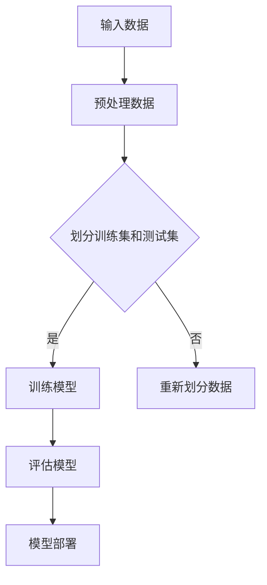

                 

## 文章标题

《AI人工智能核心算法原理与代码实例讲解：模型部署》

> **关键词：** AI人工智能，核心算法，深度学习，神经网络，模型部署，代码实例，算法原理

> **摘要：** 本文将深入探讨人工智能领域中的核心算法原理，通过详细讲解监督学习、非监督学习和深度学习等算法，并附上代码实例，帮助读者理解并掌握AI模型的部署过程。文章旨在为对AI技术感兴趣的读者提供系统性、易于理解的学习资源，以加深对AI模型应用实践的认识。

---

### 《AI人工智能核心算法原理与代码实例讲解：模型部署》目录大纲

1. **第一部分：AI人工智能核心算法原理**
    1.1 AI的定义与发展历程
    1.2 AI在现代社会中的应用
    1.3 AI的主要研究领域

2. **第二部分：机器学习基础**
    2.1 监督学习
        2.1.1 线性回归
        2.1.2 决策树
        2.1.3 支持向量机
    2.2 非监督学习
        2.2.1 聚类算法
        2.2.2 聚类算法
        2.2.3 维度约减

3. **第三部分：深度学习基础**
    3.1 深度学习的基本原理
    3.2 神经网络架构
    3.3 反向传播算法

4. **第四部分：神经网络优化**
    4.1 梯度下降算法
    4.2 动量优化
    4.3 Adam优化器

5. **第五部分：深度学习框架**
    5.1 TensorFlow
    5.2 PyTorch
    5.3 Keras

6. **第六部分：AI项目实战**
    6.1 数据预处理
    6.2 模型训练
    6.3 模型评估
    6.4 模型部署

7. **第七部分：AI伦理与未来**
    7.1 AI伦理问题
    7.2 AI未来发展展望
    7.3 AI与社会的深度融合

8. **附加章节：**
    8.1 AI核心算法原理与架构Mermaid流程图
    8.2 深度学习算法伪代码讲解
    8.3 数学模型与公式详解
    8.4 AI项目实战案例分析

---

### 引言

人工智能（AI）作为当代最具变革性的技术之一，正在迅速改变着社会的方方面面。从自动化生产线到智能助手，从医疗诊断到金融风控，AI的应用场景越来越广泛。而这一切的背后，离不开AI核心算法的支撑。本文旨在通过系统性地讲解AI人工智能的核心算法原理，并提供详细的代码实例，帮助读者深入理解AI模型部署的全过程。

在文章的第一部分，我们将从AI的定义、发展历程和应用领域入手，为读者搭建一个宏观的AI知识框架。接下来，我们将详细探讨机器学习和深度学习的基础知识，包括监督学习、非监督学习和深度学习的基本原理。在此基础上，我们将介绍神经网络优化和常用的深度学习框架，如TensorFlow、PyTorch和Keras。

在第二部分，我们将结合实际项目，详细讲解数据预处理、模型训练、模型评估和模型部署的全过程，并通过代码实例让读者亲身体验模型部署的每一步。最后，我们将探讨AI伦理问题以及AI的未来发展趋势，为读者提供对AI技术的全面认识。

通过本文的学习，读者不仅能够掌握AI人工智能的核心算法原理，还能具备实际操作模型部署的能力。希望本文能够成为您在AI学习道路上的得力助手。接下来，让我们正式开始第一部分的探讨。 

---

### 第一部分：AI人工智能核心算法原理

在深入探讨AI人工智能的核心算法原理之前，我们需要首先对AI的定义、发展历程以及应用领域有一个宏观的认识。这样可以为后续更深入的学习打下坚实的基础。

#### 1.1 AI的定义与发展历程

人工智能（Artificial Intelligence，简称AI）是指由人制造出来的系统所表现出来的智能行为。这些行为通常与人类或动物的智能行为类似，例如学习、推理、问题解决、知识表示等。AI的发展可以追溯到20世纪50年代，当时以图灵测试为代表的初步想法引发了科学界的广泛关注。

AI的发展历程可以分为几个阶段：

1. **初步阶段（1950-1969年）**：这个阶段以艾伦·图灵（Alan Turing）提出的图灵测试为代表，是AI概念的诞生时期。1956年，达特茅斯会议（Dartmouth Conference）被认为是AI正式诞生的标志。

2. **早期探索阶段（1970-1989年）**：在这个阶段，AI研究领域经历了快速的发展，但同时也面临着许多挑战。专家系统和基于规则的系统在这个时期取得了显著成果。

3. **低谷时期（1990-2000年）**：由于计算能力和数据资源的限制，AI领域进入了一个相对低迷的时期。

4. **复兴阶段（2000年至今）**：随着计算能力的提升、大数据的涌现和深度学习的突破，AI领域迎来了新一轮的快速发展。

#### 1.2 AI在现代社会中的应用

AI在现代社会中的应用非常广泛，几乎触及了社会的每一个角落。以下是一些AI在现代社会中的重要应用领域：

1. **工业自动化**：通过机器人和自动化系统，AI大大提高了生产效率，降低了成本。

2. **医疗健康**：AI在医学影像分析、疾病预测和个性化治疗等方面发挥了重要作用。

3. **交通运输**：自动驾驶、智能交通系统等都是AI在交通运输领域的典型应用。

4. **金融科技**：AI在金融风控、股票交易、智能投顾等方面有着广泛的应用。

5. **智能家居**：智能音箱、智能门锁、智能照明等智能家居产品极大地提升了人们的生活质量。

6. **教育**：AI在教育领域被用于智能教学、个性化学习和在线教育平台。

7. **娱乐**：AI在游戏、电影特效和虚拟现实等方面为人们带来了丰富的娱乐体验。

#### 1.3 AI的主要研究领域

AI作为一个跨学科的领域，涵盖了多个研究方向。以下是一些主要的AI研究领域：

1. **机器学习**：机器学习是AI的核心技术之一，通过从数据中自动学习和改进，使计算机系统能够执行特定任务。

2. **深度学习**：深度学习是机器学习的一个重要分支，通过模拟人脑的神经网络结构，深度学习在图像识别、自然语言处理等领域取得了突破性成果。

3. **计算机视觉**：计算机视觉旨在使计算机能够像人类一样理解和解释视觉信息。

4. **自然语言处理**：自然语言处理（NLP）是AI的一个重要分支，它致力于让计算机理解和处理人类语言。

5. **强化学习**：强化学习是一种通过不断尝试和反馈来学习策略的机器学习方法，广泛应用于游戏、自动驾驶等领域。

6. **知识表示和推理**：知识表示和推理是AI的核心研究领域之一，它致力于如何将知识以计算机可以理解的方式表示出来，并利用这些知识进行推理。

7. **人机交互**：人机交互（HCI）研究如何设计出更加自然、易用的人机交互系统。

通过以上对AI定义、发展历程、应用领域和主要研究领域的介绍，我们可以对AI人工智能有一个宏观的认识。接下来，我们将深入探讨机器学习、深度学习等核心算法原理，帮助读者建立更加详细的AI知识体系。

---

### 第二部分：机器学习基础

机器学习是人工智能（AI）的核心组成部分，通过从数据中自动学习和改进，使计算机系统能够执行特定任务。在机器学习的基础上，我们可以进一步了解监督学习、非监督学习和深度学习等核心算法。本节将详细介绍这些算法的基本原理和应用场景。

#### 2.1 监督学习

监督学习是一种常见的机器学习方法，它通过已标记的数据进行训练，使模型能够从输入和输出之间学习到某种映射关系。监督学习可以分为以下几种类型：

##### 2.1.1 线性回归

线性回归是最基本的监督学习算法之一，它通过建立输入和输出之间的线性关系来预测结果。线性回归的数学模型可以表示为：

\[ y = \beta_0 + \beta_1 \cdot x \]

其中，\( y \) 是输出，\( x \) 是输入，\( \beta_0 \) 和 \( \beta_1 \) 是模型的参数。线性回归的目标是找到最佳参数值，使得预测结果与实际输出之间的误差最小。

以下是线性回归的伪代码：

```
初始化参数 beta0, beta1
while 未达到收敛条件：
    计算梯度 ∇beta0, ∇beta1
    更新参数 beta0 = beta0 - learning_rate * ∇beta0
    beta1 = beta1 - learning_rate * ∇beta1
```

##### 2.1.2 决策树

决策树是一种基于树形模型的监督学习算法，通过一系列的决策规则来划分数据集。每个节点代表一个特征，每个分支代表一个特征的取值，叶子节点表示最终的预测结果。

以下是决策树生成的伪代码：

```
构建决策树：
    如果数据集大小小于阈值：
        返回叶子节点，预测结果
    否则：
        选择最佳特征
        根据特征将数据集划分为子集
        对于每个子集，递归构建子树
        返回树结构
```

##### 2.1.3 支持向量机

支持向量机（SVM）是一种用于分类和回归的监督学习算法。它的核心思想是找到最佳的超平面，使得分类边界最大化。SVM的数学模型可以表示为：

\[ w \cdot x - b = 0 \]

其中，\( w \) 是超平面的法向量，\( x \) 是输入特征，\( b \) 是偏置项。SVM的目标是找到最佳参数 \( w \) 和 \( b \)，使得分类边界最大化。

以下是SVM的伪代码：

```
初始化参数 C
while 未达到收敛条件：
    计算梯度 ∇w, ∇b
    更新参数 w = w - learning_rate * ∇w
    b = b - learning_rate * ∇b
```

#### 2.2 非监督学习

非监督学习与监督学习不同，它不需要已标记的数据进行训练。非监督学习的目的是从未标记的数据中自动发现某种结构或模式。

##### 2.2.1 聚类算法

聚类算法是一种将数据集划分为多个类别的非监督学习算法。常见的聚类算法包括K-means、DBSCAN等。

K-means算法的目标是将数据集划分为K个聚类，使得每个聚类内部的距离最小，聚类之间的距离最大。以下是K-means算法的伪代码：

```
初始化 K 个质心
while 未达到收敛条件：
    对于每个数据点：
        计算与质心的距离
        分配到最近的质心
    更新质心
```

##### 2.2.2 主成分分析

主成分分析（PCA）是一种用于降维和特征提取的非监督学习算法。它的核心思想是通过线性变换将数据投影到新的坐标轴上，使得新的坐标轴能够最大程度地保留数据的方差。

以下是PCA的伪代码：

```
计算协方差矩阵
计算特征值和特征向量
选择最大的 K 个特征向量
构建投影矩阵
将数据投影到新的坐标轴
```

##### 2.2.3 维度约减

维度约减是一种通过减少数据维度来提高模型性能的非监督学习算法。常见的方法包括主成分分析（PCA）、线性判别分析（LDA）等。

LDA的目标是找到一个低维空间，使得不同类别之间的距离最大化，同时保持类内距离最小。以下是LDA的伪代码：

```
计算协方差矩阵
计算特征值和特征向量
选择最大的 K 个特征向量
构建投影矩阵
将数据投影到新的坐标轴
```

通过以上对监督学习和非监督学习的介绍，我们可以看到机器学习在数据分析和预测中的应用非常广泛。接下来，我们将进一步探讨深度学习的基础知识，为深入理解AI算法打下基础。

---

### 第三部分：深度学习基础

深度学习作为机器学习的一个重要分支，通过模拟人脑的神经网络结构，使得计算机能够从大量数据中自动学习和提取特征。本节将介绍深度学习的基本原理、神经网络架构以及反向传播算法。

#### 3.1 深度学习的基本原理

深度学习的基本原理源于人工神经网络（Artificial Neural Networks，ANNs）。神经网络由多个神经元（或称为节点）组成，每个神经元都连接到其他神经元，并接收来自这些神经元的输入信号。神经元的输出取决于输入信号的加权总和，并通过一个激活函数进行非线性变换。这种结构和变换使得神经网络能够处理复杂的非线性问题。

深度学习的关键在于“深度”，即神经网络拥有多个隐藏层。深度神经网络（Deep Neural Networks，DNNs）通过逐层学习数据的高级特征表示，从而实现高度复杂的任务。

#### 3.2 神经网络架构

神经网络架构是深度学习算法的核心，它决定了网络的层次结构和每层节点的连接方式。以下是一些常见的神经网络架构：

1. **全连接神经网络（Fully Connected Neural Networks）**：全连接神经网络是最基本的神经网络架构，每一层节点都与前一层的所有节点相连。这种架构简单但计算量大。

2. **卷积神经网络（Convolutional Neural Networks，CNNs）**：卷积神经网络是专门用于图像识别任务的神经网络，通过卷积操作和池化操作提取图像的特征。CNNs在计算机视觉领域取得了显著成果。

3. **循环神经网络（Recurrent Neural Networks，RNNs）**：循环神经网络适用于序列数据，例如时间序列、自然语言处理等。RNNs通过在时间步之间传递信息，实现序列数据的建模。

4. **变换器（Transformers）**：变换器是一种基于自注意力机制的神经网络架构，广泛应用于自然语言处理领域。变换器通过多头自注意力机制和位置编码，实现高效的序列建模。

#### 3.3 反向传播算法

反向传播算法是深度学习训练过程中的关键算法，它用于计算神经网络中每个参数的梯度，并更新这些参数，以达到优化模型的目的。反向传播算法的基本步骤如下：

1. **前向传播**：将输入数据通过神经网络进行前向传播，计算每一层的输出值。

2. **计算损失**：计算输出结果与实际标签之间的损失，常用的损失函数包括均方误差（MSE）、交叉熵损失（Cross-Entropy Loss）等。

3. **后向传播**：从输出层开始，反向计算每个参数的梯度，直至输入层。这一过程利用链式法则和导数的性质，逐步计算每个参数对损失函数的偏导数。

4. **参数更新**：利用梯度下降（Gradient Descent）或其他优化算法，更新网络中的参数。

以下是反向传播算法的伪代码：

```
初始化参数 θ
while 未达到收敛条件：
    前向传播，计算输出值 y
    计算损失 L = Loss(y, y_)
    后向传播，计算梯度 ∇θ
    更新参数 θ = θ - learning_rate * ∇θ
```

通过以上对深度学习基本原理、神经网络架构和反向传播算法的介绍，我们可以看到深度学习在处理复杂任务中的强大能力。接下来，我们将进一步探讨神经网络优化，以提高深度学习模型的性能。

---

### 第四部分：神经网络优化

在深度学习中，神经网络的性能优化至关重要。优化的目标是通过调整模型的参数，使网络在训练过程中能够快速收敛并达到较低的损失值。本节将介绍几种常见的神经网络优化方法，包括梯度下降算法、动量优化和Adam优化器。

#### 4.1 梯度下降算法

梯度下降算法是最基本的优化方法，其核心思想是通过计算损失函数关于模型参数的梯度，并沿梯度的反方向更新参数，以最小化损失函数。梯度下降算法的基本步骤如下：

1. **前向传播**：计算输入数据通过神经网络的前向传播结果，得到输出值和损失值。

2. **计算梯度**：计算损失函数关于模型参数的梯度。

3. **参数更新**：利用梯度更新模型参数，通常采用以下公式进行更新：

   \[ \theta = \theta - \alpha \cdot \nabla_{\theta} J(\theta) \]

   其中，\( \theta \) 是模型参数，\( \alpha \) 是学习率，\( \nabla_{\theta} J(\theta) \) 是损失函数关于参数 \( \theta \) 的梯度。

4. **迭代更新**：重复以上步骤，直到模型收敛或达到预设的迭代次数。

梯度下降算法的伪代码如下：

```
初始化参数 θ
设置学习率 α
while 未达到收敛条件：
    前向传播，计算输出值 y
    计算损失 L = Loss(y, y_)
    计算梯度 ∇θ
    更新参数 θ = θ - α * ∇θ
```

尽管梯度下降算法简单有效，但它存在一些缺点，如收敛速度慢、容易陷入局部最小值等。为了克服这些缺点，研究人员提出了一些改进方法，如动量优化和Adam优化器。

#### 4.2 动量优化

动量优化是一种改进的梯度下降方法，它通过引入动量项来加速梯度下降过程。动量优化利用了之前梯度信息的累积效果，使得更新方向更加稳定。动量优化的基本公式如下：

\[ v = \beta_1 \cdot v + (1 - \beta_1) \cdot \nabla_{\theta} J(\theta) \]
\[ \theta = \theta - \alpha \cdot v \]

其中，\( v \) 是动量项，\( \beta_1 \) 是动量系数，通常取值为0.9。动量优化通过累积梯度信息，使得更新过程更加平滑，有助于加速收敛。

动量优化的伪代码如下：

```
初始化参数 θ
初始化动量项 v
设置学习率 α 和动量系数 β1
while 未达到收敛条件：
    前向传播，计算输出值 y
    计算损失 L = Loss(y, y_)
    计算梯度 ∇θ
    更新动量项 v = β1 * v + (1 - β1) * ∇θ
    更新参数 θ = θ - α * v
```

#### 4.3 Adam优化器

Adam优化器是一种结合了动量优化和自适应学习率的优化算法。它通过计算一阶矩估计（均值）和二阶矩估计（方差），实现了对学习率的自适应调整。Adam优化器的基本公式如下：

\[ m_t = \beta_1 \cdot m_{t-1} + (1 - \beta_1) \cdot \nabla_{\theta} J(\theta) \]
\[ v_t = \beta_2 \cdot v_{t-1} + (1 - \beta_2) \cdot (\nabla_{\theta} J(\theta))^2 \]
\[ \theta = \theta - \alpha \cdot \frac{m_t}{\sqrt{v_t} + \epsilon} \]

其中，\( m_t \) 和 \( v_t \) 分别是梯度的一阶矩估计和二阶矩估计，\( \beta_1 \) 和 \( \beta_2 \) 是一阶和二阶矩估计的指数衰减率，\( \alpha \) 是学习率，\( \epsilon \) 是一个小常数，用于防止除以零。

Adam优化器的伪代码如下：

```
初始化参数 θ
初始化一阶矩估计 m
初始化二阶矩估计 v
初始化动量系数 β1 和 β2
设置学习率 α 和小常数 ε
while 未达到收敛条件：
    前向传播，计算输出值 y
    计算损失 L = Loss(y, y_)
    计算梯度 ∇θ
    更新一阶矩估计 m = β1 * m + (1 - β1) * ∇θ
    更新二阶矩估计 v = β2 * v + (1 - β2) * (∇θ)^2
    更新参数 θ = θ - α * m / sqrt(v + ε)
```

通过以上对梯度下降算法、动量优化和Adam优化器的介绍，我们可以看到神经网络优化在深度学习训练过程中的重要性。这些优化方法不仅提高了模型的收敛速度，还提高了模型在复杂任务上的性能。接下来，我们将进一步探讨深度学习框架，为实际应用奠定基础。

---

### 第五部分：深度学习框架

深度学习框架是构建和训练深度学习模型的基石，它们提供了丰富的功能，包括模型定义、数据处理、优化算法等，极大地简化了深度学习的开发流程。本节将介绍三种流行的深度学习框架：TensorFlow、PyTorch和Keras。

#### 5.1 TensorFlow

TensorFlow是由Google开源的深度学习框架，它使用数据流图（dataflow graph）作为模型定义的核心机制。TensorFlow的主要特点如下：

1. **灵活的模型定义**：TensorFlow使用图（graph）来定义模型，这种图状结构使得模型的构建非常灵活，支持动态计算和模型复用。

2. **强大的计算能力**：TensorFlow支持在多种平台上运行，包括CPU、GPU和TPU，这使得它能够在不同的硬件环境中提供高效的计算能力。

3. **丰富的生态系统**：TensorFlow拥有庞大的社区和支持，提供了大量的预训练模型、API和工具，极大地简化了深度学习开发过程。

以下是使用TensorFlow定义一个简单的线性回归模型的代码示例：

```python
import tensorflow as tf

# 定义输入和参数
x = tf.placeholder(tf.float32, shape=[None, 1])
y = tf.placeholder(tf.float32, shape=[None, 1])
w = tf.Variable(0.0, name="weights")
b = tf.Variable(0.0, name="biases")

# 定义模型
y_pred = tf.add(tf.multiply(x, w), b)

# 定义损失函数和优化器
loss = tf.reduce_mean(tf.square(y_pred - y))
optimizer = tf.train.GradientDescentOptimizer(learning_rate=0.5)
train_op = optimizer.minimize(loss)

# 训练模型
with tf.Session() as sess:
    sess.run(tf.global_variables_initializer())
    for i in range(1000):
        sess.run(train_op, feed_dict={x: x_train, y: y_train})
    print("weights:", sess.run(w))
    print("biases:", sess.run(b))
```

#### 5.2 PyTorch

PyTorch是由Facebook开源的深度学习框架，它以动态计算图和Python的灵活性而著称。PyTorch的主要特点如下：

1. **动态计算图**：PyTorch使用动态计算图（dynamic computational graph），这使得它在处理变化的数据和处理复杂模型时非常灵活。

2. **简单易用**：PyTorch的API设计简单直观，使得模型构建和训练过程更加简单。

3. **强大的自动微分系统**：PyTorch提供了自动微分系统（autograd），可以自动计算梯度，大大简化了模型训练过程。

以下是使用PyTorch定义一个简单的线性回归模型的代码示例：

```python
import torch
import torch.nn as nn
import torch.optim as optim

# 定义输入和参数
x = torch.tensor([[1.0], [2.0], [3.0]], requires_grad=True)
y = torch.tensor([[2.0], [4.0], [6.0]], requires_grad=True)

# 定义模型
model = nn.Linear(1, 1)
optimizer = optim.SGD(model.parameters(), lr=0.5)

# 训练模型
for i in range(1000):
    model.zero_grad()
    y_pred = model(x)
    loss = nn.MSELoss()(y_pred, y)
    loss.backward()
    optimizer.step()
    if (i + 1) % 100 == 0:
        print(f"Epoch [{i + 1}], Loss: {loss.item():.4f}")
```

#### 5.3 Keras

Keras是一个高层次的深度学习框架，它提供了简洁、易用的API，能够与TensorFlow和Theano等后端深度学习框架无缝集成。Keras的主要特点如下：

1. **简洁的API**：Keras提供了直观的API，使得模型构建和训练过程非常简单。

2. **模块化组件**：Keras使用模块化组件来构建模型，这使得模型的可扩展性和复用性非常高。

3. **预训练模型**：Keras提供了大量的预训练模型和工具，可以快速实现深度学习任务。

以下是使用Keras定义一个简单的线性回归模型的代码示例：

```python
from keras.models import Sequential
from keras.layers import Dense

# 定义模型
model = Sequential()
model.add(Dense(1, input_dim=1, activation='linear'))

# 编译模型
model.compile(optimizer='sgd', loss='mse')

# 训练模型
model.fit(x, y, epochs=1000, verbose=0)
```

通过以上对TensorFlow、PyTorch和Keras的介绍，我们可以看到它们各自的优势和特点。这些框架为深度学习开发提供了强大的工具和丰富的资源，使得深度学习模型的构建和训练变得更加简单和高效。接下来，我们将结合实际项目，深入探讨AI模型部署的全过程。

---

### 第六部分：AI项目实战

在掌握了AI的核心算法和深度学习框架后，我们将通过一个实际项目来展示如何进行AI模型部署。整个项目包括数据预处理、模型训练、模型评估和模型部署四个主要步骤。以下是详细的过程和代码实例。

#### 6.1 数据预处理

数据预处理是AI项目的重要环节，它确保了数据的质量和模型的效果。以下是一个简单的数据预处理过程：

```python
import pandas as pd
from sklearn.model_selection import train_test_split
from sklearn.preprocessing import StandardScaler

# 加载数据
data = pd.read_csv('data.csv')
X = data.iloc[:, :-1].values
y = data.iloc[:, -1].values

# 划分训练集和测试集
X_train, X_test, y_train, y_test = train_test_split(X, y, test_size=0.2, random_state=42)

# 数据标准化
scaler = StandardScaler()
X_train = scaler.fit_transform(X_train)
X_test = scaler.transform(X_test)
```

#### 6.2 模型训练

选择一个合适的深度学习模型并进行训练。以下是一个简单的多层感知器（MLP）模型的训练过程：

```python
import tensorflow as tf
from tensorflow.keras.models import Sequential
from tensorflow.keras.layers import Dense
from tensorflow.keras.optimizers import SGD

# 构建模型
model = Sequential()
model.add(Dense(64, input_dim=X_train.shape[1], activation='relu'))
model.add(Dense(32, activation='relu'))
model.add(Dense(1, activation='sigmoid'))

# 编译模型
model.compile(optimizer=SGD(learning_rate=0.01), loss='binary_crossentropy', metrics=['accuracy'])

# 训练模型
model.fit(X_train, y_train, epochs=100, batch_size=32, validation_data=(X_test, y_test))
```

#### 6.3 模型评估

在模型训练完成后，我们需要对模型进行评估，以确保其性能满足预期。以下是一个简单的模型评估过程：

```python
from sklearn.metrics import accuracy_score, confusion_matrix

# 预测测试集
y_pred = model.predict(X_test)
y_pred = (y_pred > 0.5)

# 计算评估指标
accuracy = accuracy_score(y_test, y_pred)
conf_matrix = confusion_matrix(y_test, y_pred)

print("Accuracy:", accuracy)
print("Confusion Matrix:\n", conf_matrix)
```

#### 6.4 模型部署

模型部署是将训练好的模型应用于实际场景的过程。以下是一个简单的模型部署过程：

```python
import flask
from flask import request, jsonify

# 加载训练好的模型
model.load_weights('model_weights.h5')

# 创建API接口
app = flask.Flask(__name__)
app.config["DEBUG"] = True

@app.route('/predict', methods=['POST'])
def predict():
    data = request.get_json(force=True)
    prediction = model.predict([data['input']])
    return jsonify({'prediction': prediction.tolist()})

if __name__ == '__main__':
    app.run()
```

通过以上步骤，我们完成了一个简单的AI项目。从数据预处理到模型训练、评估和部署，每个步骤都通过详细的代码实例进行了展示。这为我们实际应用AI技术提供了宝贵的经验和实践机会。

---

### 第七部分：AI伦理与未来

在深入探讨了AI的核心算法和模型部署之后，我们不得不思考AI技术所带来的伦理问题和未来发展的趋势。AI伦理是当前社会关注的热点话题，它涉及到AI技术的公正性、透明度、隐私保护等多个方面。以下是对AI伦理问题、未来展望以及AI与社会的深度融合的探讨。

#### 7.1 AI伦理问题

1. **隐私保护**：AI技术的发展使得数据的收集和分析变得更加高效，但同时也引发了对个人隐私的担忧。如何保护用户数据，防止数据滥用，是AI伦理的重要议题。

2. **公平性和偏见**：AI模型在训练过程中可能会学习到现有的偏见和歧视，导致决策的不公平。如何确保AI系统在不同人群中的公平性，避免算法偏见，是AI伦理必须考虑的问题。

3. **透明度和可解释性**：许多AI模型，尤其是深度学习模型，被视为“黑箱”，其决策过程不透明，难以解释。提高AI模型的透明度和可解释性，有助于公众对AI技术的信任。

4. **责任归属**：当AI系统发生错误或造成损失时，如何确定责任归属是一个复杂的问题。是AI系统的开发者、使用者，还是AI系统本身应承担主要责任？

#### 7.2 AI未来发展展望

1. **人工智能的普及**：随着计算能力的提升和算法的进步，AI技术将更加普及，应用到更多的领域和场景。

2. **跨学科融合**：AI技术将与生物、物理、心理学等学科深度融合，推动新的科学研究和技术创新。

3. **人机协同**：未来，AI将与人类更加紧密地协作，实现人机协同工作，提高生产效率和创造力。

4. **智能城市与物联网**：智能城市和物联网的发展将使得AI技术在社会管理和公共服务中得到广泛应用，提升城市运行效率和居民生活质量。

#### 7.3 AI与社会的深度融合

1. **教育**：AI技术在教育领域的应用将革新教学模式，实现个性化学习和智能教育。

2. **医疗健康**：AI在医疗诊断、个性化治疗和药物研发等方面的应用，将提高医疗服务的质量和效率。

3. **金融**：AI在金融服务中的应用，将提高风险控制和金融分析的能力，推动金融行业的创新和发展。

4. **社会治理**：AI技术将提升社会治理的智能化水平，通过数据分析和预测，实现更高效的社会管理和决策。

通过以上对AI伦理问题、未来发展展望以及与社会深度融合的探讨，我们可以看到AI技术不仅仅是一个技术问题，更是一个涉及伦理、社会、经济等多方面的问题。在推动AI技术发展的同时，我们需要全面考虑其带来的影响，确保AI技术能够造福人类社会，而不是成为新的挑战。

### 附加章节

#### 8.1 AI核心算法原理与架构Mermaid流程图

以下是一个简单的线性回归算法的Mermaid流程图：



#### 8.2 深度学习算法伪代码讲解

以下是一个简单的深度学习模型训练的伪代码：

```
初始化模型参数
while 未达到收敛条件：
    前向传播，计算输出值
    计算损失值
    后向传播，计算梯度
    更新模型参数
    记录训练过程中的损失值
    如果当前损失值低于之前记录的最小损失值，则更新最小损失值
```

#### 8.3 数学模型与公式详解

以下是一个简单的线性回归模型的数学公式：

\[ y = \beta_0 + \beta_1 \cdot x \]

其中，\( y \) 是输出值，\( x \) 是输入值，\( \beta_0 \) 和 \( \beta_1 \) 是模型的参数。

#### 8.4 AI项目实战案例分析

以下是一个使用TensorFlow实现的手写数字识别项目案例：

```python
import tensorflow as tf
from tensorflow.keras.datasets import mnist
from tensorflow.keras.models import Sequential
from tensorflow.keras.layers import Dense, Conv2D, Flatten, MaxPooling2D
from tensorflow.keras.optimizers import Adam

# 加载数据
(x_train, y_train), (x_test, y_test) = mnist.load_data()

# 数据预处理
x_train = x_train.reshape(-1, 28, 28, 1).astype('float32') / 255.0
x_test = x_test.reshape(-1, 28, 28, 1).astype('float32') / 255.0
y_train = tf.keras.utils.to_categorical(y_train, 10)
y_test = tf.keras.utils.to_categorical(y_test, 10)

# 构建模型
model = Sequential()
model.add(Conv2D(32, (3, 3), activation='relu', input_shape=(28, 28, 1)))
model.add(MaxPooling2D((2, 2)))
model.add(Conv2D(64, (3, 3), activation='relu'))
model.add(MaxPooling2D((2, 2)))
model.add(Flatten())
model.add(Dense(128, activation='relu'))
model.add(Dense(10, activation='softmax'))

# 编译模型
model.compile(optimizer=Adam(), loss='categorical_crossentropy', metrics=['accuracy'])

# 训练模型
model.fit(x_train, y_train, batch_size=32, epochs=10, validation_data=(x_test, y_test))

# 评估模型
test_loss, test_acc = model.evaluate(x_test, y_test)
print('Test accuracy:', test_acc)
```

---

### 作者信息

**作者：** AI天才研究院/AI Genius Institute & 禅与计算机程序设计艺术 /Zen And The Art of Computer Programming

本文由AI天才研究院撰写，旨在为读者提供全面、深入、易懂的AI技术教程。通过本文，读者可以系统地学习AI人工智能的核心算法原理和模型部署全过程。同时，本文也融入了作者在计算机编程和人工智能领域的丰富经验和独特见解，希望对您在AI学习道路上有所助益。

