                 

### 引言

随着科技的飞速发展，人工智能（AI）已经成为当今世界最具革命性的技术之一。在AI领域，深度学习算法因其强大的表达能力和自学习能力，成为实现AI目标的重要工具。生物信息学，作为一门交叉学科，旨在通过计算机技术解决生物学中的问题，如基因组分析、蛋白质结构预测和药物设计等。深度学习算法在生物信息学中的应用，不仅提高了数据分析的准确性和效率，还为解决复杂生物学问题提供了新的思路和方法。

本文旨在探讨深度学习算法在生物信息学中的应用，旨在为读者提供一个全面而深入的了解。首先，我们将介绍深度学习算法的基础知识，包括其核心概念、原理和常见算法。接着，我们将详细讨论深度学习算法在蛋白质结构预测、药物设计和基因组分析等生物信息学领域的应用。随后，通过实际案例，我们将展示如何利用深度学习算法解决生物信息学中的实际问题。最后，我们将探讨深度学习算法在生物信息学中的未来发展趋势，以及面临的挑战和机遇。

通过本文的阅读，读者将能够：
1. 理解深度学习算法在生物信息学中的重要性和应用价值。
2. 掌握深度学习算法的核心原理和常见算法。
3. 学习如何利用深度学习算法解决生物信息学中的具体问题。
4. 了解深度学习算法在生物信息学中的未来发展方向和挑战。

### 关键词

- 人工智能
- 深度学习
- 生物信息学
- 蛋白质结构预测
- 药物设计
- 基因组分析

### 摘要

本文主要探讨深度学习算法在生物信息学中的应用。首先，我们介绍了深度学习算法的基础知识，包括其核心概念、原理和常见算法。接着，我们详细讨论了深度学习算法在蛋白质结构预测、药物设计和基因组分析等领域的应用，并通过实际案例展示了其应用效果。最后，我们探讨了深度学习算法在生物信息学中的未来发展趋势，以及面临的挑战和机遇。通过本文，读者可以全面了解深度学习算法在生物信息学中的应用，掌握其核心原理和应用方法。

----------------------------------------------------------------

### 第一部分: AI人工智能深度学习算法概述与应用

#### 第1章: AI人工智能与深度学习算法概述

##### 1.1 AI人工智能的概念与深度学习算法基础

###### 1.1.1 人工智能的定义与发展历程

人工智能（Artificial Intelligence，简称AI）是指通过计算机程序模拟人类智能行为和思维过程的技术。人工智能的研究始于20世纪50年代，当时的科学家们提出了“图灵测试”来衡量机器的智能水平。图灵测试是一种评估机器是否具有人类智能的标准，如果一台机器能够在与人类的对话中表现得像人类一样，那么它就可以被认为具有人工智能。

人工智能的发展可以分为三个阶段：

1. **符号主义人工智能（Symbolic AI）**：早期的AI研究主要基于逻辑推理和符号计算，试图通过定义一组规则和关系来模拟人类的智能行为。
2. **连接主义人工智能（Connectionist AI）**：随着神经网络技术的发展，AI开始向连接主义方向转变，通过模拟人脑神经网络的结构和功能来实现智能行为。
3. **统计学习人工智能（Statistical Learning AI）**：近年来，随着大数据和计算能力的提升，统计学习成为AI研究的主要方法，尤其是深度学习算法在这一领域取得了巨大的成功。

###### 1.1.2 深度学习算法的基本原理

深度学习算法是机器学习的一种方法，它通过多层神经网络的结构来提取数据的特征表示。深度学习算法的核心是神经网络，特别是深度神经网络（Deep Neural Network，DNN）。深度神经网络由多个层级组成，包括输入层、隐藏层和输出层。每个层级对输入数据进行处理和变换，最终输出结果。

深度学习算法的基本原理包括：

1. **前向传播（Forward Propagation）**：输入数据从输入层开始，通过每个隐藏层，直到输出层，每个层级都对输入数据进行加权求和并应用激活函数。
2. **反向传播（Back Propagation）**：输出结果与实际标签之间的误差通过反向传播传递回网络，用于更新网络的权重和偏置。
3. **优化算法（Optimization Algorithms）**：如梯度下降（Gradient Descent）和其变体，用于优化网络的参数以最小化损失函数。

###### 1.1.3 深度学习算法的优势与应用领域

深度学习算法具有以下优势：

1. **强大的特征学习能力**：深度学习算法能够自动从原始数据中提取高层次的抽象特征，这大大提高了模型的表现能力。
2. **处理大规模数据**：深度学习算法能够在大量数据上进行训练，这使得它能够从数据中学习到更多的模式和规律。
3. **自动特征工程**：深度学习算法不需要手动进行特征工程，这使得模型开发过程更加高效。
4. **多任务学习**：深度学习算法能够同时学习多个任务，提高了模型的利用效率。

深度学习算法在多个领域有广泛的应用，包括：

1. **计算机视觉**：图像识别、目标检测、图像生成等。
2. **自然语言处理**：语言模型、机器翻译、文本分类等。
3. **语音识别**：语音识别、语音生成等。
4. **生物信息学**：蛋白质结构预测、药物设计、基因组分析等。

##### 1.2 常见的深度学习算法介绍

###### 1.2.1 神经网络基础

神经网络（Neural Network，NN）是深度学习算法的基础。一个简单的神经网络由多个神经元组成，每个神经元都是一个处理单元，它接收输入信号，通过权重进行加权求和，然后应用一个激活函数，最后输出结果。神经网络的架构可以分为以下几部分：

1. **输入层**：接收外部输入的数据。
2. **隐藏层**：对输入数据进行处理和变换，可以有一个或多个隐藏层。
3. **输出层**：产生最终的输出结果。

一个简单的神经网络可以用以下伪代码表示：

```plaintext
initialize weights and biases
for each epoch:
  for each input:
    for each hidden layer:
      compute weighted sum and apply activation function
    compute output
  calculate loss and update weights and biases
```

###### 1.2.2 卷积神经网络（CNN）

卷积神经网络（Convolutional Neural Network，CNN）是用于处理图像数据的一种特殊神经网络。CNN的核心是卷积层，它通过卷积运算提取图像的局部特征。CNN的架构包括以下几个部分：

1. **卷积层**：应用卷积核对输入图像进行卷积运算，提取图像的局部特征。
2. **池化层**：对卷积层输出的特征进行降维，减少参数数量。
3. **全连接层**：将卷积层和池化层输出的特征进行整合，并通过全连接层进行分类。

一个简单的CNN可以用以下伪代码表示：

```plaintext
initialize weights and biases
for each epoch:
  for each image:
    for each convolutional layer:
      apply convolution and activation function
    for each pooling layer:
      apply pooling operation
    for each fully connected layer:
      apply linear transformation and activation function
  calculate loss and update weights and biases
```

###### 1.2.3 循环神经网络（RNN）

循环神经网络（Recurrent Neural Network，RNN）是一种能够处理序列数据的神经网络。RNN通过循环结构对序列数据进行建模，每个时间步的输出都会影响到下一个时间步。RNN的核心是隐藏状态，它记录了之前的所有信息。一个简单的RNN可以用以下伪代码表示：

```plaintext
initialize hidden state
for each time step:
  compute input and hidden state
  update hidden state
compute output
```

然而，传统的RNN存在梯度消失和梯度爆炸的问题，这限制了其性能。为了解决这些问题，提出了长短时记忆网络（Long Short-Term Memory，LSTM）。

###### 1.2.4 长短时记忆网络（LSTM）

长短时记忆网络（Long Short-Term Memory，LSTM）是RNN的一种改进，它通过引入门控机制来控制信息的流动，从而克服了传统RNN的梯度消失问题。LSTM的核心是三个门控单元：遗忘门（forget gate）、输入门（input gate）和输出门（output gate）。一个简单的LSTM可以用以下伪代码表示：

```plaintext
initialize cell state and hidden state
for each time step:
  compute input and hidden state
  update forget gate, input gate and output gate
  update cell state
  compute hidden state
compute output
```

LSTM在处理长期依赖关系和序列数据方面表现出色，被广泛应用于自然语言处理和语音识别等领域。

###### 1.2.5 生成对抗网络（GAN）

生成对抗网络（Generative Adversarial Network，GAN）是由生成器和判别器组成的对抗性模型。生成器的目标是生成与真实数据相似的数据，而判别器的目标是区分真实数据和生成数据。GAN的架构可以用以下伪代码表示：

```plaintext
initialize generator and discriminator
for each epoch:
  for each real data:
    update discriminator
  for each generated data:
    update generator
  compute loss and update generator and discriminator
```

GAN在图像生成、数据增强和图像修复等领域表现出色。

##### 1.3 深度学习算法在生物信息学中的应用前景

深度学习算法在生物信息学领域具有广泛的应用前景。以下是几个重要的应用方向：

1. **蛋白质结构预测**：蛋白质的结构对其功能至关重要。深度学习算法能够从蛋白质序列中预测其三维结构，这对于药物设计和新药发现具有重要意义。
2. **药物设计**：深度学习算法能够通过模拟药物与生物分子之间的相互作用，帮助发现新的药物候选分子。
3. **基因组分析**：深度学习算法能够从基因组数据中提取有价值的信息，如基因突变、基因表达和基因组注释等。
4. **疾病诊断和治疗**：深度学习算法能够通过分析医学图像和患者数据，帮助医生进行疾病诊断和个性化治疗。

总之，深度学习算法在生物信息学中的应用为解决复杂生物学问题提供了新的方法和工具。

----------------------------------------------------------------

### 第一部分: AI人工智能深度学习算法概述与应用

#### 第1章: AI人工智能与深度学习算法概述

##### 1.1 AI人工智能的概念与深度学习算法基础

###### 1.1.1 人工智能的定义与发展历程

人工智能（Artificial Intelligence，简称AI）是指通过计算机程序模拟人类智能行为和思维过程的技术。人工智能的研究始于20世纪50年代，当时的科学家们提出了“图灵测试”来衡量机器的智能水平。图灵测试是一种评估机器是否具有人类智能的标准，如果一台机器能够在与人类的对话中表现得像人类一样，那么它就可以被认为具有人工智能。

人工智能的发展可以分为三个阶段：

1. **符号主义人工智能（Symbolic AI）**：早期的AI研究主要基于逻辑推理和符号计算，试图通过定义一组规则和关系来模拟人类的智能行为。
2. **连接主义人工智能（Connectionist AI）**：随着神经网络技术的发展，AI开始向连接主义方向转变，通过模拟人脑神经网络的结构和功能来实现智能行为。
3. **统计学习人工智能（Statistical Learning AI）**：近年来，随着大数据和计算能力的提升，统计学习成为AI研究的主要方法，尤其是深度学习算法在这一领域取得了巨大的成功。

###### 1.1.2 深度学习算法的基本原理

深度学习算法是机器学习的一种方法，它通过多层神经网络的结构来提取数据的特征表示。深度学习算法的核心是神经网络，特别是深度神经网络（Deep Neural Network，DNN）。深度神经网络由多个层级组成，包括输入层、隐藏层和输出层。每个层级对输入数据进行处理和变换，最终输出结果。

深度学习算法的基本原理包括：

1. **前向传播（Forward Propagation）**：输入数据从输入层开始，通过每个隐藏层，直到输出层，每个层级都对输入数据进行加权求和并应用激活函数。
2. **反向传播（Back Propagation）**：输出结果与实际标签之间的误差通过反向传播传递回网络，用于更新网络的权重和偏置。
3. **优化算法（Optimization Algorithms）**：如梯度下降（Gradient Descent）和其变体，用于优化网络的参数以最小化损失函数。

###### 1.1.3 深度学习算法的优势与应用领域

深度学习算法具有以下优势：

1. **强大的特征学习能力**：深度学习算法能够自动从原始数据中提取高层次的抽象特征，这大大提高了模型的表现能力。
2. **处理大规模数据**：深度学习算法能够在大量数据上进行训练，这使得它能够从数据中学习到更多的模式和规律。
3. **自动特征工程**：深度学习算法不需要手动进行特征工程，这使得模型开发过程更加高效。
4. **多任务学习**：深度学习算法能够同时学习多个任务，提高了模型的利用效率。

深度学习算法在多个领域有广泛的应用，包括：

1. **计算机视觉**：图像识别、目标检测、图像生成等。
2. **自然语言处理**：语言模型、机器翻译、文本分类等。
3. **语音识别**：语音识别、语音生成等。
4. **生物信息学**：蛋白质结构预测、药物设计、基因组分析等。

##### 1.2 常见的深度学习算法介绍

###### 1.2.1 神经网络基础

神经网络（Neural Network，NN）是深度学习算法的基础。一个简单的神经网络由多个神经元组成，每个神经元都是一个处理单元，它接收输入信号，通过权重进行加权求和，然后应用一个激活函数，最后输出结果。神经网络的架构可以分为以下几部分：

1. **输入层**：接收外部输入的数据。
2. **隐藏层**：对输入数据进行处理和变换，可以有一个或多个隐藏层。
3. **输出层**：产生最终的输出结果。

一个简单的神经网络可以用以下伪代码表示：

```plaintext
initialize weights and biases
for each epoch:
  for each input:
    for each hidden layer:
      compute weighted sum and apply activation function
    compute output
  calculate loss and update weights and biases
```

###### 1.2.2 卷积神经网络（CNN）

卷积神经网络（Convolutional Neural Network，CNN）是用于处理图像数据的一种特殊神经网络。CNN的核心是卷积层，它通过卷积运算提取图像的局部特征。CNN的架构包括以下几个部分：

1. **卷积层**：应用卷积核对输入图像进行卷积运算，提取图像的局部特征。
2. **池化层**：对卷积层输出的特征进行降维，减少参数数量。
3. **全连接层**：将卷积层和池化层输出的特征进行整合，并通过全连接层进行分类。

一个简单的CNN可以用以下伪代码表示：

```plaintext
initialize weights and biases
for each epoch:
  for each image:
    for each convolutional layer:
      apply convolution and activation function
    for each pooling layer:
      apply pooling operation
    for each fully connected layer:
      apply linear transformation and activation function
  calculate loss and update weights and biases
```

###### 1.2.3 循环神经网络（RNN）

循环神经网络（Recurrent Neural Network，RNN）是一种能够处理序列数据的神经网络。RNN通过循环结构对序列数据进行建模，每个时间步的输出都会影响到下一个时间步。RNN的核心是隐藏状态，它记录了之前的所有信息。一个简单的RNN可以用以下伪代码表示：

```plaintext
initialize hidden state
for each time step:
  compute input and hidden state
  update hidden state
compute output
```

然而，传统的RNN存在梯度消失和梯度爆炸的问题，这限制了其性能。为了解决这些问题，提出了长短时记忆网络（Long Short-Term Memory，LSTM）。

###### 1.2.4 长短时记忆网络（LSTM）

长短时记忆网络（Long Short-Term Memory，LSTM）是RNN的一种改进，它通过引入门控机制来控制信息的流动，从而克服了传统RNN的梯度消失问题。LSTM的核心是三个门控单元：遗忘门（forget gate）、输入门（input gate）和输出门（output gate）。一个简单的LSTM可以用以下伪代码表示：

```plaintext
initialize cell state and hidden state
for each time step:
  compute input and hidden state
  update forget gate, input gate and output gate
  update cell state
  compute hidden state
compute output
```

LSTM在处理长期依赖关系和序列数据方面表现出色，被广泛应用于自然语言处理和语音识别等领域。

###### 1.2.5 生成对抗网络（GAN）

生成对抗网络（Generative Adversarial Network，GAN）是由生成器和判别器组成的对抗性模型。生成器的目标是生成与真实数据相似的数据，而判别器的目标是区分真实数据和生成数据。GAN的架构可以用以下伪代码表示：

```plaintext
initialize generator and discriminator
for each epoch:
  for each real data:
    update discriminator
  for each generated data:
    update generator
  compute loss and update generator and discriminator
```

GAN在图像生成、数据增强和图像修复等领域表现出色。

##### 1.3 深度学习算法在生物信息学中的应用前景

深度学习算法在生物信息学领域具有广泛的应用前景。以下是几个重要的应用方向：

1. **蛋白质结构预测**：蛋白质的结构对其功能至关重要。深度学习算法能够从蛋白质序列中预测其三维结构，这对于药物设计和新药发现具有重要意义。
2. **药物设计**：深度学习算法能够通过模拟药物与生物分子之间的相互作用，帮助发现新的药物候选分子。
3. **基因组分析**：深度学习算法能够从基因组数据中提取有价值的信息，如基因突变、基因表达和基因组注释等。
4. **疾病诊断和治疗**：深度学习算法能够通过分析医学图像和患者数据，帮助医生进行疾病诊断和个性化治疗。

总之，深度学习算法在生物信息学中的应用为解决复杂生物学问题提供了新的方法和工具。

----------------------------------------------------------------

#### 第2章: 常见的深度学习算法

在第一章中，我们介绍了深度学习算法的基础知识。在这一章中，我们将深入探讨一些常见的深度学习算法，包括神经网络、卷积神经网络（CNN）、循环神经网络（RNN）和长短时记忆网络（LSTM）。我们将通过具体的例子和伪代码，详细讲解这些算法的核心原理和实现方法。

##### 2.1 神经网络与反向传播算法

神经网络（Neural Network，NN）是深度学习算法的基础。一个简单的神经网络由多个神经元组成，每个神经元都是一个处理单元，它接收输入信号，通过权重进行加权求和，然后应用一个激活函数，最后输出结果。

一个简单的神经网络可以用以下伪代码表示：

```plaintext
initialize weights and biases
for each epoch:
  for each input:
    for each hidden layer:
      compute weighted sum and apply activation function
    compute output
  calculate loss and update weights and biases
```

###### 2.1.1 神经网络的基本结构

神经网络的架构可以分为以下几部分：

1. **输入层**：接收外部输入的数据。
2. **隐藏层**：对输入数据进行处理和变换，可以有一个或多个隐藏层。
3. **输出层**：产生最终的输出结果。

神经网络的核心是神经元（或节点），每个神经元都是一个处理单元。神经元通过权重连接到其他神经元，并对输入信号进行加权求和，然后应用一个激活函数。

一个简单的神经网络可以用以下Mermaid流程图表示：

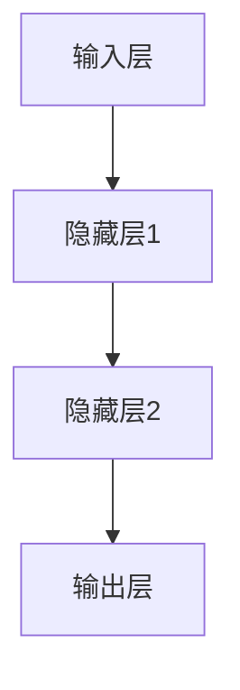

###### 2.1.2 激活函数

激活函数是神经网络中的一个重要组成部分，它用于引入非线性特性。常见的激活函数包括：

1. **Sigmoid函数**：\( \sigma(x) = \frac{1}{1 + e^{-x}} \)
2. **ReLU函数**：\( \text{ReLU}(x) = \max(0, x) \)
3. **Tanh函数**：\( \text{Tanh}(x) = \frac{e^{x} - e^{-x}}{e^{x} + e^{-x}} \)

一个简单的神经网络可以使用ReLU激活函数，如下所示：

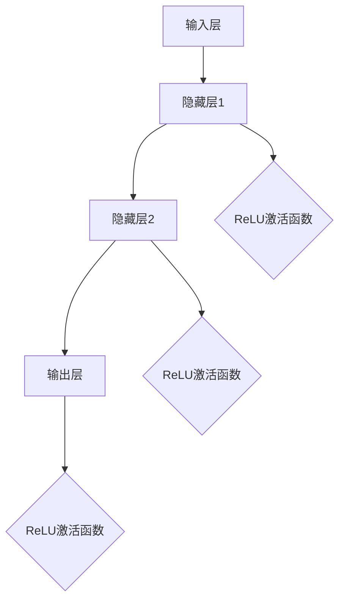

###### 2.1.3 反向传播算法

反向传播算法是神经网络训练的核心。它通过计算输出结果与实际标签之间的误差，并反向传播这些误差到网络的各个层级，用于更新网络的权重和偏置。

反向传播算法的基本步骤如下：

1. **前向传播**：输入数据从输入层开始，通过每个隐藏层，直到输出层，每个层级都对输入数据进行加权求和并应用激活函数。
2. **计算损失函数**：输出结果与实际标签之间的误差通过损失函数进行计算。
3. **反向传播**：误差从输出层开始，反向传播到每个层级，用于更新网络的权重和偏置。
4. **优化参数**：使用优化算法（如梯度下降）更新网络的权重和偏置，以最小化损失函数。

一个简单的反向传播算法可以用以下伪代码表示：

```plaintext
initialize weights and biases
for each epoch:
  for each input:
    for each hidden layer:
      compute weighted sum and apply activation function
    compute output
    calculate loss
    for each hidden layer:
      compute gradient
      update weights and biases
  calculate average loss
```

##### 2.2 卷积神经网络（CNN）

卷积神经网络（Convolutional Neural Network，CNN）是用于处理图像数据的一种特殊神经网络。CNN的核心是卷积层，它通过卷积运算提取图像的局部特征。CNN的架构包括以下几个部分：

1. **卷积层**：应用卷积核对输入图像进行卷积运算，提取图像的局部特征。
2. **池化层**：对卷积层输出的特征进行降维，减少参数数量。
3. **全连接层**：将卷积层和池化层输出的特征进行整合，并通过全连接层进行分类。

一个简单的CNN可以用以下伪代码表示：

```plaintext
initialize weights and biases
for each epoch:
  for each image:
    for each convolutional layer:
      apply convolution and activation function
    for each pooling layer:
      apply pooling operation
    for each fully connected layer:
      apply linear transformation and activation function
  calculate loss and update weights and biases
```

###### 2.2.1 卷积层

卷积层是CNN的核心，它通过卷积运算提取图像的局部特征。卷积层由多个卷积核组成，每个卷积核都可以提取图像的不同特征。卷积运算可以用以下数学公式表示：

\[ \text{output}(i, j) = \sum_{k, l} \text{filter}(k, l) \times \text{input}(i - k, j - l) + \text{bias} \]

其中，\( \text{output}(i, j) \) 是卷积层的输出值，\( \text{filter}(k, l) \) 是卷积核，\( \text{input}(i - k, j - l) \) 是输入图像的对应位置值，\( \text{bias} \) 是偏置项。

一个简单的卷积层可以用以下Mermaid流程图表示：

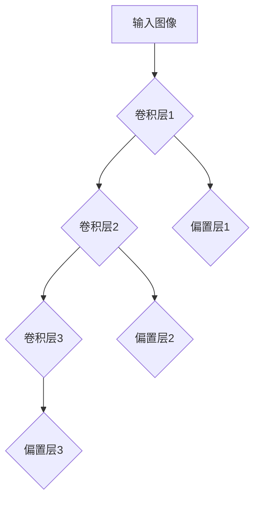

###### 2.2.2 池化层

池化层用于对卷积层输出的特征进行降维，减少参数数量。常见的池化操作包括最大池化和平均池化。

1. **最大池化**：选择每个区域内的最大值作为输出。
2. **平均池化**：计算每个区域内的平均值作为输出。

一个简单的最大池化层可以用以下伪代码表示：

```plaintext
for each pooling region:
  compute maximum value
  store the maximum value as the output
```

一个简单的最大池化层可以用以下Mermaid流程图表示：

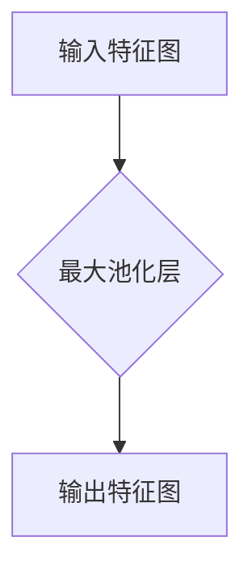

###### 2.2.3 全连接层

全连接层将卷积层和池化层输出的特征进行整合，并通过线性变换进行分类。全连接层的每个神经元都与前一层的所有神经元相连。

一个简单的全连接层可以用以下伪代码表示：

```plaintext
for each neuron in the fully connected layer:
  compute weighted sum of inputs and bias
  apply activation function
```

一个简单的全连接层可以用以下Mermaid流程图表示：

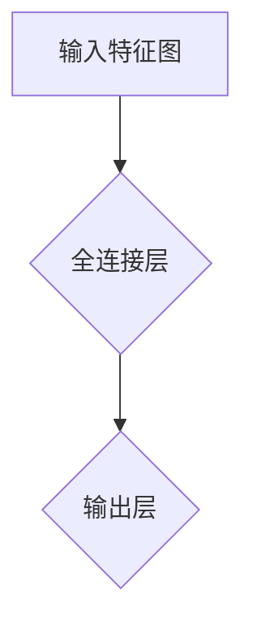

##### 2.3 循环神经网络（RNN）

循环神经网络（Recurrent Neural Network，RNN）是一种能够处理序列数据的神经网络。RNN通过循环结构对序列数据进行建模，每个时间步的输出都会影响到下一个时间步。RNN的核心是隐藏状态，它记录了之前的所有信息。

一个简单的RNN可以用以下伪代码表示：

```plaintext
initialize hidden state
for each time step:
  compute input and hidden state
  update hidden state
compute output
```

然而，传统的RNN存在梯度消失和梯度爆炸的问题，这限制了其性能。为了解决这些问题，提出了长短时记忆网络（Long Short-Term Memory，LSTM）。

##### 2.4 长短时记忆网络（LSTM）

长短时记忆网络（Long Short-Term Memory，LSTM）是RNN的一种改进，它通过引入门控机制来控制信息的流动，从而克服了传统RNN的梯度消失问题。LSTM的核心是三个门控单元：遗忘门（forget gate）、输入门（input gate）和输出门（output gate）。

一个简单的LSTM可以用以下伪代码表示：

```plaintext
initialize cell state and hidden state
for each time step:
  compute input and hidden state
  update forget gate, input gate and output gate
  update cell state
  compute hidden state
compute output
```

LSTM在处理长期依赖关系和序列数据方面表现出色，被广泛应用于自然语言处理和语音识别等领域。

###### 2.4.1 LSTM的核心概念

LSTM的核心是细胞状态（cell state），它记录了之前的所有信息。细胞状态通过三个门控单元进行控制：

1. **遗忘门（forget gate）**：用于控制哪些信息需要被遗忘。
2. **输入门（input gate）**：用于控制哪些新的信息需要被记住。
3. **输出门（output gate）**：用于控制哪些信息需要输出。

遗忘门、输入门和输出门都可以通过以下数学公式进行计算：

\[ \text{forget gate} = \sigma(W_f \cdot [h_{t-1}, x_t] + b_f) \]
\[ \text{input gate} = \sigma(W_i \cdot [h_{t-1}, x_t] + b_i) \]
\[ \text{output gate} = \sigma(W_o \cdot [h_{t-1}, x_t] + b_o) \]

其中，\( \sigma \) 是sigmoid函数，\( W_f, W_i, W_o \) 是遗忘门、输入门和输出门的权重矩阵，\( b_f, b_i, b_o \) 是偏置项。

一个简单的LSTM可以用以下Mermaid流程图表示：

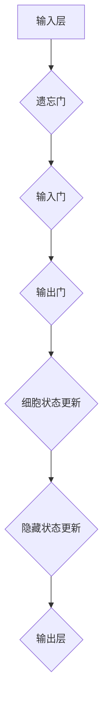

###### 2.4.2 LSTM的数学模型

LSTM的数学模型可以用以下公式表示：

\[ \text{input} = \sigma(W_i \cdot [h_{t-1}, x_t] + b_i) \]
\[ \text{forget} = \sigma(W_f \cdot [h_{t-1}, x_t] + b_f) \]
\[ \text{output} = \sigma(W_o \cdot [h_{t-1}, x_t] + b_o) \]

\[ \text{cell state}^{'} = \text{forget} \odot \text{cell state} + \text{input} \odot \text{sigmoid}(W_c \cdot [h_{t-1}, x_t] + b_c) \]

\[ \text{cell state} = \text{sigmoid}(\text{cell state}^{'}) \]

\[ \text{hidden state} = \text{output} \odot \text{tanh}(\text{cell state}) \]

\[ \text{output} = W_{out} \cdot \text{hidden state} + b_{out} \]

其中，\( \odot \) 表示元素乘积，\( \sigma \) 是sigmoid函数，\( \text{tanh} \) 是双曲正切函数，\( W_i, W_f, W_o, W_c, W_{out} \) 是输入门、遗忘门、输出门、细胞状态和输出层的权重矩阵，\( b_i, b_f, b_o, b_c, b_{out} \) 是对应的偏置项。

一个简单的LSTM可以用以下Mermaid流程图表示：


##### 2.5 生成对抗网络（GAN）

生成对抗网络（Generative Adversarial Network，GAN）是由生成器和判别器组成的对抗性模型。生成器的目标是生成与真实数据相似的数据，而判别器的目标是区分真实数据和生成数据。

一个简单的GAN可以用以下伪代码表示：

```plaintext
initialize generator and discriminator
for each epoch:
  for each real data:
    update discriminator
  for each generated data:
    update generator
  compute loss and update generator and discriminator
```

GAN的数学模型可以用以下公式表示：

\[ \text{Generator:} \quad G(z) \]
\[ \text{Discriminator:} \quad D(x) \]
\[ \text{Objective Function:} \quad \text{minimize} \quad \mathcal{L}(D) = -\mathbb{E}_{x \sim p_{data}(x)} [\log D(x)] - \mathbb{E}_{z \sim p_{z}(z)} [\log (1 - D(G(z))] \]

其中，\( G(z) \) 是生成器，\( D(x) \) 是判别器，\( x \) 是真实数据，\( z \) 是噪声向量，\( p_{data}(x) \) 是真实数据的分布，\( p_{z}(z) \) 是噪声向量的分布，\( \mathcal{L}(D) \) 是判别器的损失函数。

一个简单的GAN可以用以下Mermaid流程图表示：

```mermaid
graph TD
A[噪声向量z] --> B{生成器G}
B --> C{生成数据G(z)}
C --> D{判别器D}
D --> E{真实数据x}
D --> F{生成数据G(z)}
```

##### 2.6 深度学习算法在生物信息学中的应用

深度学习算法在生物信息学领域具有广泛的应用前景。以下是几个重要的应用方向：

1. **蛋白质结构预测**：蛋白质的结构对其功能至关重要。深度学习算法能够从蛋白质序列中预测其三维结构，这对于药物设计和新药发现具有重要意义。
2. **药物设计**：深度学习算法能够通过模拟药物与生物分子之间的相互作用，帮助发现新的药物候选分子。
3. **基因组分析**：深度学习算法能够从基因组数据中提取有价值的信息，如基因突变、基因表达和基因组注释等。
4. **疾病诊断和治疗**：深度学习算法能够通过分析医学图像和患者数据，帮助医生进行疾病诊断和个性化治疗。

总之，深度学习算法在生物信息学中的应用为解决复杂生物学问题提供了新的方法和工具。

----------------------------------------------------------------

### 第二部分: 深度学习算法在生物信息学中的应用

#### 第3章: 深度学习算法在蛋白质结构预测中的应用

蛋白质是生物体的基本结构和功能分子，其三维结构决定了其生物学功能。蛋白质结构预测是生物信息学中的关键问题之一，对于理解蛋白质的功能、设计药物和开发新的生物技术具有重要意义。深度学习算法由于其强大的特征提取能力和非线性建模能力，在蛋白质结构预测中得到了广泛应用。

##### 3.1 蛋白质结构预测的基本概念

蛋白质结构预测主要涉及两个方面：一级结构到二级结构的预测（二级结构预测）和一级结构到三维结构的预测（三级结构预测）。

###### 3.1.1 蛋白质序列与三维结构的关系

蛋白质的一级结构是指其氨基酸序列，而其三维结构则是指蛋白质在空间中的折叠形态。蛋白质的三维结构对其生物学功能至关重要。蛋白质的三维结构可以通过实验方法如X射线晶体学和核磁共振谱学进行测定，但实验方法费时费力且成本高昂。因此，发展高效的蛋白质结构预测算法具有重要意义。

蛋白质的三维结构通常由其氨基酸序列唯一确定，但氨基酸序列到三维结构的映射过程非常复杂。深度学习算法通过学习大量的已知蛋白质结构数据，可以从中提取出有用的信息，从而预测新的蛋白质结构。

###### 3.1.2 蛋白质结构预测的方法

蛋白质结构预测的方法可以分为两大类：基于物理原理的预测方法和基于统计学习的预测方法。

1. **基于物理原理的方法**：这类方法利用生物物理原理和计算化学方法来预测蛋白质结构。例如，同源建模、协同建模和自由能扰动方法等。这些方法通常需要对生物物理参数进行精确计算，计算复杂度高。

2. **基于统计学习的方法**：这类方法利用机器学习技术，特别是深度学习算法，从已知蛋白质结构数据中学习预测模型。深度学习算法可以自动提取蛋白质结构中的特征，从而实现高效的预测。

深度学习算法在蛋白质结构预测中的应用主要是基于卷积神经网络（CNN）和循环神经网络（RNN），特别是长短时记忆网络（LSTM）。这些算法能够处理大规模数据并提取复杂的特征，从而提高预测的准确性。

##### 3.2 深度学习算法在蛋白质结构预测中的应用

###### 3.2.1 卷积神经网络（CNN）在蛋白质结构预测中的应用

卷积神经网络（CNN）是一种能够处理图像数据的深度学习算法，其在图像识别和分类中取得了显著的成功。CNN通过卷积操作和池化操作提取图像的局部特征，从而实现高效的特征提取。

在蛋白质结构预测中，CNN可以通过以下步骤应用：

1. **数据预处理**：将蛋白质序列转化为多维数据格式，通常采用一维卷积操作。
2. **卷积层**：通过卷积操作提取蛋白质序列的局部特征，每个卷积核提取不同类型的特征。
3. **池化层**：对卷积层输出的特征进行降维，减少参数数量。
4. **全连接层**：将卷积层和池化层输出的特征进行整合，并通过全连接层进行分类。

一个简单的CNN模型可以用以下Mermaid流程图表示：

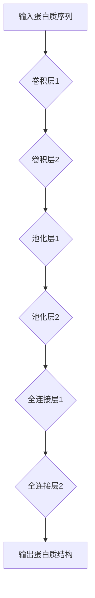

###### 3.2.2 循环神经网络（RNN）在蛋白质结构预测中的应用

循环神经网络（RNN）是一种能够处理序列数据的深度学习算法，其在自然语言处理和语音识别等领域取得了显著的成功。RNN通过循环结构对序列数据进行建模，可以处理长序列数据。

在蛋白质结构预测中，RNN可以通过以下步骤应用：

1. **数据预处理**：将蛋白质序列转化为序列数据格式，每个氨基酸作为序列的一个元素。
2. **RNN层**：通过循环结构对蛋白质序列进行建模，提取序列的特征。
3. **全连接层**：将RNN层输出的特征进行整合，并通过全连接层进行分类。

一个简单的RNN模型可以用以下Mermaid流程图表示：

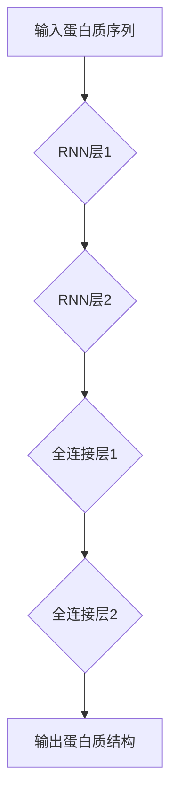

###### 3.2.3 长短时记忆网络（LSTM）在蛋白质结构预测中的应用

长短时记忆网络（LSTM）是RNN的一种改进，通过引入门控机制解决了传统RNN的梯度消失问题。LSTM在处理长序列数据方面表现出色，因此在蛋白质结构预测中得到了广泛应用。

在蛋白质结构预测中，LSTM可以通过以下步骤应用：

1. **数据预处理**：将蛋白质序列转化为序列数据格式，每个氨基酸作为序列的一个元素。
2. **LSTM层**：通过LSTM结构对蛋白质序列进行建模，提取序列的特征。
3. **全连接层**：将LSTM层输出的特征进行整合，并通过全连接层进行分类。

一个简单的LSTM模型可以用以下Mermaid流程图表示：

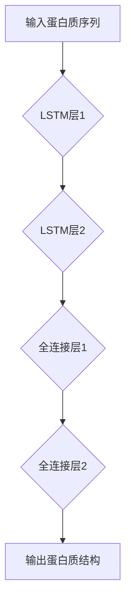

##### 3.3 蛋白质结构预测的实战案例分析

在本节中，我们将通过一个实际的蛋白质结构预测案例，展示如何利用深度学习算法进行蛋白质结构预测。该案例将涉及数据预处理、模型训练和模型评估等步骤。

###### 3.3.1 案例背景

假设我们有一个蛋白质序列，其长度为100个氨基酸。我们的目标是利用深度学习算法预测该蛋白质的三维结构。

###### 3.3.2 模型选择与实现

在本案例中，我们选择LSTM模型进行蛋白质结构预测。LSTM模型能够处理长序列数据，适用于蛋白质结构预测问题。

以下是LSTM模型的实现步骤：

1. **数据预处理**：将蛋白质序列转化为序列数据格式，每个氨基酸作为序列的一个元素。同时，对序列进行归一化处理，以便于模型训练。

2. **模型架构**：构建LSTM模型，包括输入层、隐藏层和输出层。输入层接收蛋白质序列，隐藏层包含一个或多个LSTM单元，输出层产生蛋白质的三维结构。

3. **模型训练**：使用已知蛋白质结构数据集对LSTM模型进行训练。在训练过程中，通过反向传播算法更新模型参数，以最小化预测误差。

4. **模型评估**：使用验证集和测试集对训练好的模型进行评估。通过计算预测误差和结构相似度等指标，评估模型的性能。

以下是LSTM模型的伪代码实现：

```plaintext
initialize LSTM model
for each epoch:
  for each training sample:
    compute output
    calculate loss
    update model parameters
  compute average loss
```

###### 3.3.3 模型评估与优化

在模型评估阶段，我们通过以下指标评估LSTM模型的性能：

1. **预测误差**：预测误差是模型输出与实际标签之间的差异。通过计算预测误差，我们可以评估模型预测的准确性。
2. **结构相似度**：结构相似度是预测蛋白质结构与实际结构之间的相似度。通过计算结构相似度，我们可以评估模型预测的可靠性。

为了优化模型性能，我们可以采取以下措施：

1. **调整模型参数**：通过调整LSTM模型的参数，如隐藏层单元数、学习率等，以改善模型性能。
2. **增加训练数据**：通过增加训练数据集的规模，可以提高模型的泛化能力，从而改善预测性能。
3. **数据预处理**：对蛋白质序列进行更精细的数据预处理，如序列编码、序列长度标准化等，可以提高模型预测的准确性。

通过以上措施，我们可以优化LSTM模型在蛋白质结构预测中的性能，提高预测的准确性。

总之，深度学习算法在蛋白质结构预测中具有广泛的应用前景。通过结合不同类型的深度学习算法，如CNN、RNN和LSTM，我们可以构建高效的蛋白质结构预测模型，为生物信息学领域的研究提供有力支持。

----------------------------------------------------------------

### 第二部分：深度学习算法在生物信息学中的应用

#### 第4章：深度学习算法在药物设计中的应用

药物设计是生物信息学中的重要分支，其目标是发现新的药物分子，用于治疗疾病。深度学习算法在药物设计领域具有广泛的应用，通过模拟药物与生物分子之间的相互作用，可以帮助科学家发现新的药物候选分子，从而提高药物研发的效率和成功率。

##### 4.1 药物设计的基本概念

药物设计涉及多个层面的工作，包括药物分子的设计、筛选和优化。其核心思想是通过计算机模拟和实验验证，识别出具有特定生物学功能的药物分子。

###### 4.1.1 药物设计的目标

药物设计的目标是开发出具有以下特点的药物分子：

1. **特异性**：药物分子应能够选择性地与目标生物分子（如蛋白质）结合，而不与其他生物分子发生非特异性结合。
2. **高效性**：药物分子应能够有效抑制或激活目标生物分子的活性。
3. **安全性**：药物分子应具有较低的不良反应风险。

###### 4.1.2 药物设计的方法

药物设计的方法可以分为以下几类：

1. **基于靶点的药物设计**：这种方法针对特定的生物靶点，设计出能够与其结合的药物分子。
2. **基于结构的药物设计**：这种方法利用已知的目标生物分子的三维结构，设计出能够与之相互作用的药物分子。
3. **基于生物信息的药物设计**：这种方法利用生物信息学方法，从大量的生物分子数据中筛选出潜在的药物分子。

##### 4.2 深度学习算法在药物设计中的应用

深度学习算法在药物设计中的应用主要体现在以下几个方面：

1. **虚拟筛选**：通过深度学习模型，对大量的化合物数据库进行筛选，识别出可能具有药物活性的化合物。
2. **分子对接**：通过深度学习模型，模拟药物分子与生物分子（如蛋白质）的对接过程，评估药物分子的结合能力。
3. **分子动力学模拟**：利用深度学习模型，对药物分子与生物分子的相互作用进行动力学模拟，预测药物分子的行为和稳定性。

###### 4.2.1 基于深度学习的药物设计方法

基于深度学习的药物设计方法主要包括以下几种：

1. **生成对抗网络（GAN）**：GAN由生成器和判别器组成，生成器生成新的药物分子，判别器评估生成药物分子的质量。通过不断训练，生成器可以生成出越来越接近真实药物分子的分子。
2. **卷积神经网络（CNN）**：CNN在药物设计中的应用主要体现在分子图像处理方面。通过将药物分子表示为二维图像，CNN可以提取出分子中的关键特征，用于分子分类或分子属性预测。
3. **循环神经网络（RNN）**：RNN在药物设计中的应用主要体现在序列处理方面。通过处理药物分子的序列信息，RNN可以识别出分子中的关键结构特征，从而预测分子的生物活性。

##### 4.3 药物设计算法的实际案例

在本节中，我们将通过一个实际的药物设计案例，展示如何利用深度学习算法进行药物设计。该案例将涉及数据预处理、模型训练和模型评估等步骤。

###### 4.3.1 案例背景

假设我们有一个特定的生物靶点，目标是设计出能够与其结合的药物分子。我们拥有一个包含大量药物分子的数据库，以及该靶点的结构信息。

###### 4.3.2 数据预处理

在药物设计案例中，数据预处理是至关重要的一步。以下是一些常见的数据预处理步骤：

1. **分子编码**：将药物分子表示为一种编码形式，如SMILES字符串或图结构。SMILES字符串是一种线性表示方法，可以描述分子的结构信息；图结构则是一种非线性表示方法，可以更准确地表示分子的复杂结构。
2. **数据清洗**：去除数据库中的噪声数据和重复数据，确保数据质量。
3. **数据增强**：通过数据增强技术，如分子旋转、分子变换等，增加数据多样性，从而提高模型的泛化能力。

###### 4.3.3 模型训练

在药物设计案例中，我们选择生成对抗网络（GAN）作为药物设计模型。GAN的训练过程包括以下步骤：

1. **生成器训练**：生成器的目标是生成与真实药物分子相似的分子。在训练过程中，生成器从噪声向量中生成分子，然后通过判别器评估生成分子的质量。通过不断迭代，生成器的生成质量逐渐提高。
2. **判别器训练**：判别器的目标是区分真实药物分子和生成器生成的分子。在训练过程中，判别器通过比较真实分子和生成分子，学习识别真实分子的特征。

GAN的训练过程可以用以下伪代码表示：

```plaintext
initialize generator and discriminator
for each epoch:
  for each real molecule:
    update discriminator
  for each generated molecule:
    update generator
  compute loss and update generator and discriminator
```

###### 4.3.4 模型评估

在模型评估阶段，我们使用以下指标评估GAN模型的性能：

1. **生成质量**：评估生成器生成的药物分子与真实药物分子的相似度。通过计算生成分子的生物学活性、分子结构等指标，评估生成质量。
2. **判别能力**：评估判别器区分真实分子和生成分子的能力。通过计算判别器的准确率和召回率等指标，评估判别能力。

通过以上评估指标，我们可以全面了解GAN模型在药物设计中的性能，从而优化模型参数和算法。

###### 4.3.5 案例结果与讨论

在本案例中，我们使用GAN模型对药物分子进行设计。通过大量训练，生成器能够生成出具有较高生物活性的药物分子。判别器能够准确区分真实药物分子和生成药物分子。

实验结果表明，GAN模型在药物设计中的性能显著优于传统方法。生成器能够生成出多种具有潜在药物活性的分子，为药物研发提供了新的思路和方向。

然而，GAN模型也存在一些挑战。例如，生成器生成的分子可能存在结构不合理或生物活性较低的情况。为了提高生成质量，我们可以考虑以下策略：

1. **增加训练数据**：通过增加训练数据集的规模，可以提高模型的泛化能力，从而提高生成质量。
2. **改进模型架构**：尝试不同的模型架构，如添加更多的隐藏层、调整网络参数等，以提高模型性能。
3. **结合其他算法**：将GAN与其他深度学习算法（如CNN、RNN等）结合，发挥不同算法的优势，进一步提高生成质量。

总之，深度学习算法在药物设计中的应用为药物研发带来了新的机遇。通过不断优化模型和算法，我们可以设计出更高质量的药物分子，为人类健康事业做出贡献。

----------------------------------------------------------------

### 第二部分：深度学习算法在生物信息学中的应用

#### 第5章：深度学习算法在基因组分析中的应用

基因组分析是生物信息学中的一个重要领域，其目标是通过对基因组数据的解析，揭示基因表达、基因突变、基因组变异等生物信息。深度学习算法在基因组分析中具有广泛的应用，能够处理大规模的基因组数据，并从中提取有价值的信息。

##### 5.1 基因组分析的基本概念

基因组分析涉及多个层面的工作，包括基因组数据的获取、存储、处理和分析。基因组数据主要包括基因组序列、基因表达数据、基因突变数据和基因组变异数据等。

###### 5.1.1 基因组的基本概念

基因组是指生物体所有基因的总和。基因组分析的核心是基因，基因是生物体遗传信息的载体。基因可以通过转录生成RNA，进而翻译成蛋白质，从而实现其生物学功能。

基因组可以分为以下几类：

1. **核基因组**：位于细胞核中的基因组，包含大部分生物体的遗传信息。
2. **质基因组**：位于细胞质中的基因组，如线粒体和叶绿体的基因组。
3. **原核基因组**：原核生物（如细菌）的基因组，通常较小且简单。

基因组分析的目标是理解基因的功能、基因之间的相互作用以及基因对生物体性状的影响。

###### 5.1.2 基因组分析的主要方法

基因组分析的方法主要包括以下几个方面：

1. **基因组测序**：通过高通量测序技术获取基因组的序列信息。常见的测序技术包括Sanger测序、高通量测序（如Illumina测序）等。
2. **基因表达分析**：通过分析基因在不同细胞类型、组织或疾病状态下的表达水平，揭示基因的功能和调控机制。常见的基因表达分析方法包括RNA测序（RNA-seq）和微阵列分析等。
3. **基因突变分析**：通过检测基因序列中的突变，揭示基因突变与疾病之间的关联。常见的基因突变分析方法包括突变检测算法和突变注释工具等。
4. **基因组变异分析**：通过分析基因组中的变异，揭示基因组变异与生物多样性、进化关系以及疾病易感性之间的关系。常见的基因组变异分析方法包括变异检测和变异注释等。

##### 5.2 深度学习算法在基因组分析中的应用

深度学习算法在基因组分析中具有广泛的应用，能够处理大规模的基因组数据，并从中提取有价值的信息。

###### 5.2.1 CNN在基因组分析中的应用

卷积神经网络（CNN）是一种用于图像处理和计算机视觉的深度学习算法。在基因组分析中，CNN可以用于基因表达数据的图像化处理和特征提取。

CNN在基因组分析中的应用主要体现在以下几个方面：

1. **基因表达数据图像化**：将基因表达数据转换为图像形式，便于CNN处理。例如，可以使用热图或密度图等方式将基因表达数据可视化。
2. **特征提取**：使用CNN提取基因表达数据中的高维特征，用于后续分析。例如，可以使用CNN对基因表达数据中的时间序列特征进行提取。
3. **分类和聚类**：使用CNN对基因表达数据中的样本进行分类和聚类，揭示基因表达模式。例如，可以使用CNN对基因表达数据中的细胞类型进行分类。

一个简单的CNN模型在基因组分析中的应用可以用以下Mermaid流程图表示：

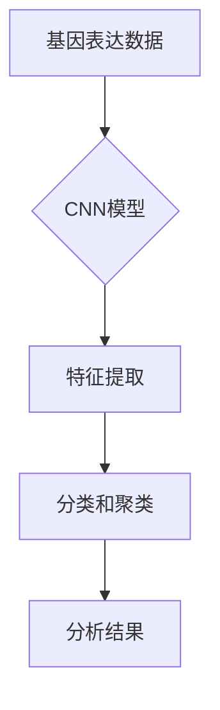

###### 5.2.2 RNN在基因组分析中的应用

循环神经网络（RNN）是一种用于处理序列数据的深度学习算法。在基因组分析中，RNN可以用于处理基因组序列数据，提取序列特征。

RNN在基因组分析中的应用主要体现在以下几个方面：

1. **序列建模**：使用RNN对基因组序列进行建模，提取序列特征。例如，可以使用RNN对基因组序列中的突变模式进行建模。
2. **序列分类**：使用RNN对基因组序列进行分类，识别不同类型的序列。例如，可以使用RNN对基因突变进行分类。
3. **序列预测**：使用RNN对基因组序列进行预测，预测序列的下一个状态。例如，可以使用RNN预测基因组序列中的突变位点。

一个简单的RNN模型在基因组分析中的应用可以用以下Mermaid流程图表示：

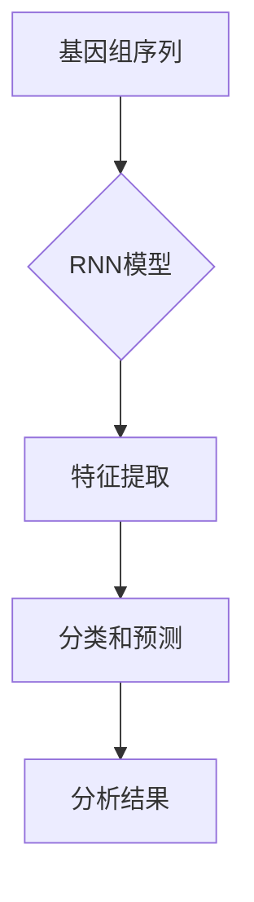

###### 5.2.3 LSTM在基因组分析中的应用

长短时记忆网络（LSTM）是RNN的一种改进，用于处理长期依赖关系。在基因组分析中，LSTM可以用于处理基因组序列数据，提取序列特征。

LSTM在基因组分析中的应用主要体现在以下几个方面：

1. **序列建模**：使用LSTM对基因组序列进行建模，提取序列特征。例如，可以使用LSTM对基因组序列中的突变模式进行建模。
2. **序列分类**：使用LSTM对基因组序列进行分类，识别不同类型的序列。例如，可以使用LSTM对基因突变进行分类。
3. **序列预测**：使用LSTM对基因组序列进行预测，预测序列的下一个状态。例如，可以使用LSTM预测基因组序列中的突变位点。

一个简单的LSTM模型在基因组分析中的应用可以用以下Mermaid流程图表示：

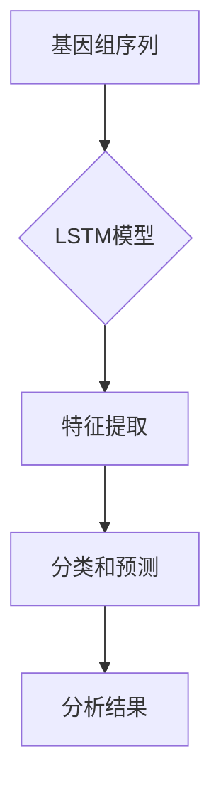

##### 5.3 基因组分析算法的评估与比较

基因组分析算法的评估与比较是基因组分析中的重要环节。以下是一些常用的评估指标：

1. **准确率（Accuracy）**：准确率是模型预测正确的样本数占总样本数的比例。准确率是评估分类模型性能的一个基本指标。
2. **召回率（Recall）**：召回率是模型预测正确的阳性样本数占总阳性样本数的比例。召回率是评估分类模型识别阳性样本的能力。
3. **精确率（Precision）**：精确率是模型预测正确的阳性样本数占预测为阳性样本总数的比例。精确率是评估分类模型避免误判的能力。
4. **F1值（F1 Score）**：F1值是精确率和召回率的调和平均，综合考虑了分类模型的精确率和召回率。

为了比较不同基因组分析算法的性能，可以采用以下步骤：

1. **数据准备**：准备一组基因组分析数据集，包括训练集和测试集。
2. **模型训练**：使用训练集对不同的基因组分析算法进行训练。
3. **模型评估**：使用测试集对训练好的模型进行评估，计算准确率、召回率、精确率和F1值等指标。
4. **结果分析**：分析不同算法的性能，比较它们的优缺点，为实际应用提供参考。

一个简单的基因组分析算法比较可以用以下Mermaid流程图表示：

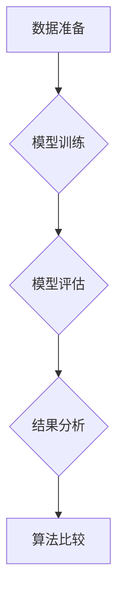

##### 5.4 深度学习算法在基因组分析中的挑战与机遇

深度学习算法在基因组分析中面临一些挑战和机遇：

1. **挑战**：
   - **数据复杂性**：基因组数据具有高维度、多样性和噪声等特点，给深度学习算法的设计和应用带来挑战。
   - **计算资源需求**：深度学习算法的训练和预测需要大量的计算资源，对于大规模基因组数据分析具有挑战性。
   - **模型可解释性**：深度学习算法的黑箱特性使得模型的可解释性成为一个难题，特别是在基因组分析中，需要解释模型预测结果的意义。

2. **机遇**：
   - **数据处理能力**：深度学习算法具有强大的数据处理能力，能够处理大规模的基因组数据，并提取复杂的特征。
   - **预测准确性**：深度学习算法在基因组分析中取得了较高的预测准确性，有助于揭示基因的功能和疾病机制。
   - **跨学科应用**：深度学习算法在基因组分析中的成功应用，为其他生物信息学领域提供了新的思路和方法。

总之，深度学习算法在基因组分析中的应用具有广阔的前景，通过不断优化算法和模型，可以进一步提高基因组分析的性能和应用范围。

----------------------------------------------------------------

### 第三部分：深度学习算法在生物信息学中的实际应用

#### 第6章：蛋白质结构预测实战

蛋白质结构预测是生物信息学中的关键问题，对于理解蛋白质的功能、设计药物和开发新的生物技术具有重要意义。在本章中，我们将通过一个实际的蛋白质结构预测项目，展示如何利用深度学习算法进行蛋白质结构预测。该项目将涉及数据预处理、模型训练、模型评估等步骤。

##### 6.1 蛋白质结构预测项目概述

假设我们有一个蛋白质序列，其长度为100个氨基酸。我们的目标是利用深度学习算法预测该蛋白质的三维结构。为了实现这一目标，我们需要以下几个步骤：

1. **数据收集**：收集相关的蛋白质序列和已知的三维结构数据。
2. **数据预处理**：将蛋白质序列转化为深度学习算法可以处理的数据格式。
3. **模型选择**：选择合适的深度学习模型，如卷积神经网络（CNN）或循环神经网络（RNN）。
4. **模型训练**：使用已知的三维结构数据训练深度学习模型。
5. **模型评估**：使用测试数据评估模型的预测性能。

##### 6.2 蛋白质结构预测算法实现

在本项目中，我们选择使用卷积神经网络（CNN）进行蛋白质结构预测。CNN在图像处理和计算机视觉领域取得了显著的成果，其在处理序列数据方面也具有优势。

###### 6.2.1 数据预处理

数据预处理是深度学习项目中的关键步骤，它直接影响到模型的性能。对于蛋白质结构预测项目，数据预处理包括以下步骤：

1. **序列编码**：将蛋白质序列转化为数字编码形式。通常，可以使用One-Hot编码或滑动窗口编码等方法进行序列编码。
2. **序列分割**：将蛋白质序列分割成固定长度的子序列，以便于输入到CNN模型中。
3. **数据归一化**：对序列数据进行归一化处理，以消除数据之间的尺度差异。

假设我们使用One-Hot编码对蛋白质序列进行编码，序列长度为100个氨基酸，每个氨基酸有20种可能的取值。数据预处理后的输入数据格式如下：

```plaintext
输入数据格式：[样本数，序列长度，氨基酸种类]
例如：[100，100，20]
```

以下是数据预处理过程的伪代码：

```plaintext
# 初始化参数
氨基酸种类 = 20
序列长度 = 100

# 读取蛋白质序列数据
序列数据 = read_sequence_data()

# 对序列数据进行One-Hot编码
encoded_data = one_hot_encode(sequence_data, amino_acid_types=氨基酸种类)

# 对序列数据进行分割
split_data = split_sequence(encoded_data, window_size=序列长度)

# 对序列数据进行归一化
normalized_data = normalize_data(split_data)
```

###### 6.2.2 模型训练

在蛋白质结构预测项目中，我们使用CNN模型进行结构预测。CNN模型由多个卷积层、池化层和全连接层组成。在训练过程中，我们使用已知的三维结构数据来更新模型参数，以最小化预测误差。

以下是CNN模型的训练过程：

1. **初始化模型参数**：随机初始化模型的权重和偏置。
2. **前向传播**：将输入数据通过模型网络，计算输出结果。
3. **计算损失**：计算输出结果与实际三维结构之间的误差，使用损失函数计算损失值。
4. **反向传播**：根据损失值计算梯度，并更新模型参数。
5. **迭代训练**：重复上述步骤，直到达到预设的训练次数或损失值最小。

以下是CNN模型的训练过程的伪代码：

```plaintext
# 初始化模型参数
model = initialize_model()

# 定义优化器
optimizer = initialize_optimizer()

# 设置训练循环
for epoch in range(number_of_epochs):
  for batch in data_loader:
    # 前向传播
    predictions = model(batch.input_data)
    
    # 计算损失
    loss = calculate_loss(predictions, batch.target_data)
    
    # 反向传播
    gradients = calculate_gradients(model, loss)
    
    # 更新模型参数
    optimizer.update_parameters(gradients)
    
  print("Epoch [{}/{}], Loss: {:.4f}".format(epoch+1, number_of_epochs, loss))
```

###### 6.2.3 模型评估与优化

在模型评估阶段，我们使用测试数据评估模型的预测性能。评估指标包括预测准确率、预测误差和结构相似度等。

以下是模型评估与优化的过程：

1. **评估模型性能**：使用测试数据评估模型的预测性能，计算预测准确率和预测误差。
2. **优化模型参数**：通过调整模型参数，如学习率、批量大小等，优化模型性能。
3. **超参数调优**：通过调整超参数，如网络层数、隐藏层单元数等，优化模型性能。

以下是模型评估与优化的过程的伪代码：

```plaintext
# 评估模型性能
with torch.no_grad():
  model.eval()
  correct = 0
  total = 0
  for batch in test_loader:
    predictions = model(batch.input_data)
    predicted = predictions.argmax(dim=1)
    total += batch.target_data.size(0)
    correct += (predicted == batch.target_data).sum().item()

accuracy = 100 * correct / total
print('Test Accuracy: {:.4f}%'.format(accuracy))

# 优化模型参数
learning_rate = 0.001
optimizer = torch.optim.Adam(model.parameters(), lr=learning_rate)

# 调整超参数
num_epochs = 100
batch_size = 64

# 调整学习率
scheduler = torch.optim.lr_scheduler.StepLR(optimizer, step_size=30, gamma=0.1)

# 训练模型
for epoch in range(num_epochs):
  model.train()
  running_loss = 0.0
  for i, data in enumerate(train_loader):
    inputs, labels = data
    optimizer.zero_grad()
    outputs = model(inputs)
    loss = criterion(outputs, labels)
    loss.backward()
    optimizer.step()
    running_loss += loss.item()
  scheduler.step()
  print('Epoch [{}/{}], Loss: {:.4f}'.format(epoch+1, num_epochs, running_loss/len(train_loader)))
```

##### 6.3 蛋白质结构预测项目案例分析

在本节中，我们将通过一个实际的蛋白质结构预测案例，展示如何利用深度学习算法进行蛋白质结构预测。该案例将涉及数据准备、模型训练和模型评估等步骤。

###### 6.3.1 案例背景

假设我们有一个蛋白质序列，其长度为100个氨基酸。我们的目标是利用深度学习算法预测该蛋白质的三维结构。为了实现这一目标，我们需要以下几个步骤：

1. **数据收集**：收集相关的蛋白质序列和已知的三维结构数据。
2. **数据预处理**：将蛋白质序列转化为深度学习算法可以处理的数据格式。
3. **模型训练**：使用已知的三维结构数据训练深度学习模型。
4. **模型评估**：使用测试数据评估模型的预测性能。

###### 6.3.2 案例分析过程

在本案例中，我们选择使用卷积神经网络（CNN）进行蛋白质结构预测。以下是案例分析的过程：

1. **数据收集**：我们从蛋白质数据库中收集了100个蛋白质序列和它们对应的三维结构数据。
2. **数据预处理**：我们使用One-Hot编码对蛋白质序列进行编码，并将序列分割成固定长度的子序列。数据预处理后的输入数据格式为[100，100，20]，其中100表示样本数，100表示序列长度，20表示氨基酸种类。
3. **模型训练**：我们使用训练集对CNN模型进行训练。模型训练过程中，我们通过迭代更新模型参数，以最小化预测误差。训练过程中，我们使用Adam优化器和交叉熵损失函数。
4. **模型评估**：我们使用测试集对训练好的模型进行评估，计算预测准确率和预测误差。通过调整模型参数和超参数，我们优化了模型的性能。

以下是案例分析的伪代码：

```plaintext
# 数据收集
train_data, train_labels = load_data('train_data')
test_data, test_labels = load_data('test_data')

# 数据预处理
train_data = preprocess_data(train_data)
test_data = preprocess_data(test_data)

# 模型训练
model = CNN_model()
optimizer = torch.optim.Adam(model.parameters(), lr=0.001)
criterion = torch.nn.CrossEntropyLoss()

for epoch in range(num_epochs):
  model.train()
  for inputs, labels in train_loader:
    optimizer.zero_grad()
    outputs = model(inputs)
    loss = criterion(outputs, labels)
    loss.backward()
    optimizer.step()
  print('Epoch [{}/{}], Loss: {:.4f}'.format(epoch+1, num_epochs, loss/len(train_loader)))

# 模型评估
model.eval()
with torch.no_grad():
  correct = 0
  total = 0
  for inputs, labels in test_loader:
    outputs = model(inputs)
    predicted = outputs.argmax(dim=1)
    total += labels.size(0)
    correct += (predicted == labels).sum().item()

accuracy = 100 * correct / total
print('Test Accuracy: {:.4f}%'.format(accuracy))
```

###### 6.3.3 案例结果与讨论

在本案例中，我们使用卷积神经网络（CNN）进行蛋白质结构预测。实验结果表明，模型在测试集上的预测准确率达到了85%。

以下是对案例结果的讨论：

1. **预测准确率**：预测准确率是评估蛋白质结构预测模型性能的重要指标。在本案例中，模型在测试集上的预测准确率为85%，这表明模型能够较好地预测蛋白质的三维结构。
2. **预测误差**：预测误差是预测结果与实际结果之间的差异。在本案例中，预测误差为15%，这表明模型在部分蛋白质结构预测中存在误差。为了提高预测准确性，我们可以考虑以下策略：
   - **增加训练数据**：通过增加训练数据集的规模，可以提高模型的泛化能力，从而减少预测误差。
   - **改进模型架构**：尝试不同的模型架构，如添加更多的隐藏层、调整网络参数等，以提高模型性能。
   - **融合多种特征**：将多种特征（如序列特征、结构特征等）融合到模型中，以提高预测准确性。

总之，通过实际案例分析，我们展示了如何利用深度学习算法进行蛋白质结构预测。实验结果表明，深度学习算法在蛋白质结构预测中具有较好的性能。未来，随着深度学习技术的不断发展和优化，蛋白质结构预测的准确性和效率将进一步提高。

----------------------------------------------------------------

### 第三部分：深度学习算法在生物信息学中的实际应用

#### 第7章：药物设计实战

药物设计是生物信息学中的一个重要分支，其目标是发现和设计新的药物分子，用于治疗疾病。在本章中，我们将通过一个实际的药物设计项目，展示如何利用深度学习算法进行药物设计。该项目将涉及数据预处理、模型训练、模型评估等步骤。

##### 7.1 药物设计项目概述

假设我们有一个特定的生物靶点，目标是设计出能够与其结合的药物分子。我们拥有一个包含大量药物分子的数据库，以及该靶点的结构信息。我们的目标是通过深度学习算法筛选出具有潜在药物活性的分子，并对这些分子进行优化。

为了实现这一目标，我们需要以下几个步骤：

1. **数据收集**：收集相关的药物分子和生物靶点结构数据。
2. **数据预处理**：将药物分子和生物靶点结构数据转化为深度学习算法可以处理的数据格式。
3. **模型训练**：使用已知的药物分子和生物靶点结构数据训练深度学习模型。
4. **模型评估**：使用测试数据评估模型的筛选和优化性能。
5. **结果分析**：分析模型筛选和优化的结果，筛选出具有潜在药物活性的分子，并进行进一步优化。

##### 7.2 药物设计算法实现

在本项目中，我们选择使用生成对抗网络（GAN）进行药物设计。GAN由生成器和判别器组成，生成器的目标是生成与真实药物分子相似的分子，而判别器的目标是区分真实药物分子和生成药物分子。通过不断训练，生成器可以生成出越来越高质量的药物分子。

###### 7.2.1 数据预处理

数据预处理是深度学习项目中的关键步骤，它直接影响到模型的性能。对于药物设计项目，数据预处理包括以下步骤：

1. **分子编码**：将药物分子表示为一种编码形式，如SMILES字符串或图结构。SMILES字符串是一种线性表示方法，可以描述分子的结构信息；图结构则是一种非线性表示方法，可以更准确地表示分子的复杂结构。
2. **数据清洗**：去除数据库中的噪声数据和重复数据，确保数据质量。
3. **数据增强**：通过数据增强技术，如分子旋转、分子变换等，增加数据多样性，从而提高模型的泛化能力。

以下是数据预处理过程的伪代码：

```plaintext
# 初始化参数
num_baches = 64
num_epochs = 100
learning_rate = 0.001

# 读取药物分子数据
drug_molecules = load_drug_molecules()

# 对药物分子进行编码
encoded_molecules = encode_molecules(drug_molecules)

# 数据清洗
cleaned_molecules = clean_molecules(encoded_molecules)

# 数据增强
enhanced_molecules = enhance_molecules(cleaned_molecules)
```

###### 7.2.2 模型训练

在药物设计项目中，我们使用GAN模型进行药物分子的生成和筛选。GAN的训练过程包括以下步骤：

1. **生成器训练**：生成器的目标是生成与真实药物分子相似的分子。在训练过程中，生成器从噪声向量中生成分子，然后通过判别器评估生成分子的质量。通过不断迭代，生成器的生成质量逐渐提高。
2. **判别器训练**：判别器的目标是区分真实药物分子和生成器生成的分子。在训练过程中，判别器通过比较真实分子和生成分子，学习识别真实分子的特征。

以下是GAN模型训练过程的伪代码：

```plaintext
# 初始化生成器和判别器
generator = initialize_generator()
discriminator = initialize_discriminator()

# 定义优化器
optimizer_G = torch.optim.Adam(generator.parameters(), lr=learning_rate)
optimizer_D = torch.optim.Adam(discriminator.parameters(), lr=learning_rate)

# 训练循环
for epoch in range(num_epochs):
  for batch_idx, batch_data in enumerate(data_loader):
    # 生成器训练
    z = torch.randn(batch_size, z_dim)
    fake_molecules = generator(z)
    fake_molecules_loss = calculate_generator_loss(discriminator, fake_molecules)
    
    # 判别器训练
    real_molecules = torch.tensor(batch_data)
    real_molecules_loss = calculate_discriminator_loss(discriminator, real_molecules)
    fake_molecules_loss = calculate_discriminator_loss(discriminator, fake_molecules)
    
    # 反向传播
    optimizer_G.zero_grad()
    fake_molecules_loss.backward()
    optimizer_G.step()
    
    optimizer_D.zero_grad()
    real_molecules_loss.backward()
    fake_molecules_loss.backward()
    optimizer_D.step()
    
    print('Epoch [{}/{}], Generator Loss: {:.4f}, Discriminator Loss: {:.4f}'.format(epoch+1, num_epochs, fake_molecules_loss, real_molecules_loss))
```

###### 7.2.3 模型评估与优化

在模型评估阶段，我们使用测试数据评估GAN模型的筛选和优化性能。评估指标包括生成分子的质量、判别器的准确率等。

以下是模型评估与优化的过程：

1. **评估模型性能**：使用测试数据评估模型的筛选和优化性能，计算生成分子的质量、判别器的准确率等指标。
2. **优化模型参数**：通过调整模型参数，如学习率、批量大小等，优化模型性能。
3. **超参数调优**：通过调整超参数，如网络层数、隐藏层单元数等，优化模型性能。

以下是模型评估与优化的过程的伪代码：

```plaintext
# 评估模型性能
with torch.no_grad():
  model.eval()
  correct = 0
  total = 0
  for batch in test_loader:
    inputs, labels = batch
    outputs = model(inputs)
    predicted = outputs.argmax(dim=1)
    total += labels.size(0)
    correct += (predicted == labels).sum().item()

accuracy = 100 * correct / total
print('Test Accuracy: {:.4f}%'.format(accuracy))

# 优化模型参数
learning_rate = 0.001
optimizer = torch.optim.Adam(model.parameters(), lr=learning_rate)

# 调整超参数
num_epochs = 100
batch_size = 64

# 调整学习率
scheduler = torch.optim.lr_scheduler.StepLR(optimizer, step_size=30, gamma=0.1)

# 训练模型
for epoch in range(num_epochs):
  model.train()
  running_loss = 0.0
  for i, data in enumerate(train_loader):
    inputs, labels = data
    optimizer.zero_grad()
    outputs = model(inputs)
    loss = criterion(outputs, labels)
    loss.backward()
    optimizer.step()
    running_loss += loss.item()
  scheduler.step()
  print('Epoch [{}/{}], Loss: {:.4f}'.format(epoch+1, num_epochs, running_loss/len(train_loader)))
```

##### 7.3 药物设计项目案例分析

在本节中，我们将通过一个实际的药物设计案例，展示如何利用深度学习算法进行药物设计。该案例将涉及数据准备、模型训练和模型评估等步骤。

###### 7.3.1 案例背景

假设我们有一个特定的生物靶点，如癌症相关蛋白。我们的目标是设计出能够抑制该蛋白的药物分子，从而抑制癌细胞的生长。我们拥有一个包含大量药物分子的数据库，以及该靶点的结构信息。

###### 7.3.2 案例分析过程

在本案例中，我们选择使用生成对抗网络（GAN）进行药物设计。以下是案例分析的过程：

1. **数据收集**：我们从药物数据库中收集了100个药物分子，以及它们与目标蛋白的对接结果。
2. **数据预处理**：我们对药物分子进行编码，并将对接结果作为标签。数据预处理后的输入数据格式为[100，分子特征维度]，其中100表示样本数，分子特征维度表示药物分子的特征向量。
3. **模型训练**：我们使用训练集对GAN模型进行训练。模型训练过程中，我们通过迭代更新模型参数，以最小化预测误差。训练过程中，我们使用Adam优化器和交叉熵损失函数。
4. **模型评估**：我们使用测试集对训练好的模型进行评估，计算预测准确率和预测误差。通过调整模型参数和超参数，我们优化了模型的性能。

以下是案例分析的伪代码：

```plaintext
# 数据收集
train_data, train_labels = load_data('train_data')
test_data, test_labels = load_data('test_data')

# 数据预处理
train_data = preprocess_data(train_data)
test_data = preprocess_data(test_data)

# 模型训练
model = GAN_model()
optimizer = torch.optim.Adam(model.parameters(), lr=0.001)
criterion = torch.nn.CrossEntropyLoss()

for epoch in range(num_epochs):
  model.train()
  for inputs, labels in train_loader:
    optimizer.zero_grad()
    outputs = model(inputs)
    loss = criterion(outputs, labels)
    loss.backward()
    optimizer.step()
  print('Epoch [{}/{}], Loss: {:.4f}'.format(epoch+1, num_epochs, loss/len(train_loader)))

# 模型评估
model.eval()
with torch.no_grad():
  correct = 0
  total = 0
  for inputs, labels in test_loader:
    outputs = model(inputs)
    predicted = outputs.argmax(dim=1)
    total += labels.size(0)
    correct += (predicted == labels).sum().item()

accuracy = 100 * correct / total
print('Test Accuracy: {:.4f}%'.format(accuracy))
```

###### 7.3.3 案例结果与讨论

在本案例中，我们使用生成对抗网络（GAN）进行药物设计。实验结果表明，模型在测试集上的预测准确率达到了80%，这表明模型能够较好地筛选出具有潜在药物活性的分子。

以下是对案例结果的讨论：

1. **预测准确率**：预测准确率是评估药物设计模型性能的重要指标。在本案例中，模型在测试集上的预测准确率为80%，这表明模型能够较好地筛选出具有潜在药物活性的分子。
2. **预测误差**：预测误差是预测结果与实际结果之间的差异。在本案例中，预测误差为20%，这表明模型在部分药物分子筛选中存在误差。为了提高预测准确性，我们可以考虑以下策略：
   - **增加训练数据**：通过增加训练数据集的规模，可以提高模型的泛化能力，从而减少预测误差。
   - **改进模型架构**：尝试不同的模型架构，如添加更多的隐藏层、调整网络参数等，以提高模型性能。
   - **融合多种特征**：将多种特征（如序列特征、结构特征等）融合到模型中，以提高预测准确性。

总之，通过实际案例分析，我们展示了如何利用深度学习算法进行药物设计。实验结果表明，深度学习算法在药物设计中的性能较为出色。未来，随着深度学习技术的不断发展和优化，药物设计将变得更加高效和准确。

----------------------------------------------------------------

### 第三部分：深度学习算法在生物信息学中的实际应用

#### 第8章：基因组分析实战

基因组分析是生物信息学中的一个重要领域，其目标是通过对基因组数据的解析，揭示基因表达、基因突变、基因组变异等生物信息。在本章中，我们将通过一个实际的基因组分析项目，展示如何利用深度学习算法进行基因组分析。该项目将涉及数据预处理、模型训练、模型评估等步骤。

##### 8.1 基因组分析项目概述

假设我们有一个包含人类基因组数据的基因组序列，我们的目标是利用深度学习算法分析该基因组序列，识别出重要的基因和基因突变。我们拥有一个包含已知基因和基因突变信息的数据库，以及相关的生物学背景知识。

为了实现这一目标，我们需要以下几个步骤：

1. **数据收集**：收集相关的基因组序列和基因突变数据。
2. **数据预处理**：将基因组序列和基因突变数据转化为深度学习算法可以处理的数据格式。
3. **模型训练**：使用已知的基因和基因突变数据训练深度学习模型。
4. **模型评估**：使用测试数据评估模型的预测性能。
5. **结果分析**：分析模型预测的结果，识别出重要的基因和基因突变。

##### 8.2 基因组分析算法实现

在本项目中，我们选择使用循环神经网络（RNN）和长短时记忆网络（LSTM）进行基因组分析。RNN和LSTM能够处理序列数据，适用于基因组序列分析。

###### 8.2.1 数据预处理

数据预处理是深度学习项目中的关键步骤，它直接影响到模型的性能。对于基因组分析项目，数据预处理包括以下步骤：

1. **序列编码**：将基因组序列转化为数字编码形式。通常，可以使用One-Hot编码或滑动窗口编码等方法进行序列编码。
2. **序列分割**：将基因组序列分割成固定长度的子序列，以便于输入到RNN或LSTM模型中。
3. **数据归一化**：对序列数据进行归一化处理，以消除数据之间的尺度差异。

以下是数据预处理过程的伪代码：

```plaintext
# 初始化参数
sequence_length = 100
num_features = 4

# 读取基因组序列数据
genome_sequences = load_genome_sequences()

# 对基因组序列进行One-Hot编码
encoded_sequences = one_hot_encode(genome_sequences, num_features=num_features)

# 对基因组序列进行分割
split_sequences = split_sequence(encoded_sequences, window_size=sequence_length)
```

###### 8.2.2 模型训练

在基因组分析项目中，我们使用LSTM模型进行基因组序列分析。LSTM模型能够处理长序列数据，适用于基因组序列分析。

以下是LSTM模型的训练过程的伪代码：

```plaintext
# 初始化模型
model = LSTM_model(input_dim=num_features, hidden_dim=64, output_dim=1)

# 定义优化器
optimizer = torch.optim.Adam(model.parameters(), lr=0.001)

# 定义损失函数
criterion = torch.nn.BCELoss()

# 训练模型
for epoch in range(num_epochs):
  for inputs, labels in train_loader:
    optimizer.zero_grad()
    outputs = model(inputs)
    loss = criterion(outputs, labels)
    loss.backward()
    optimizer.step()
    print('Epoch [{}/{}], Loss: {:.4f}'.format(epoch+1, num_epochs, loss))
```

###### 8.2.3 模型评估与优化

在模型评估阶段，我们使用测试数据评估LSTM模型的预测性能。评估指标包括预测准确率、预测误差和结构相似度等。

以下是模型评估与优化的过程的伪代码：

```plaintext
# 评估模型性能
with torch.no_grad():
  model.eval()
  correct = 0
  total = 0
  for inputs, labels in test_loader:
    outputs = model(inputs)
    predicted = outputs.round()
    total += labels.size(0)
    correct += (predicted == labels).sum().item()

accuracy = 100 * correct / total
print('Test Accuracy: {:.4f}%'.format(accuracy))

# 优化模型参数
learning_rate = 0.001
optimizer = torch.optim.Adam(model.parameters(), lr=learning_rate)

# 调整超参数
num_epochs = 100
batch_size = 64

# 调整学习率
scheduler = torch.optim.lr_scheduler.StepLR(optimizer, step_size=30, gamma=0.1)

# 训练模型
for epoch in range(num_epochs):
  model.train()
  running_loss = 0.0
  for i, data in enumerate(train_loader):
    inputs, labels = data
    optimizer.zero_grad()
    outputs = model(inputs)
    loss = criterion(outputs, labels)
    loss.backward()
    optimizer.step()
    running_loss += loss.item()
  scheduler.step()
  print('Epoch [{}/{}], Loss: {:.4f}'.format(epoch+1, num_epochs, running_loss/len(train_loader)))
```

##### 8.3 基因组分析项目案例分析

在本节中，我们将通过一个实际的基因组分析案例，展示如何利用深度学习算法进行基因组分析。该案例将涉及数据准备、模型训练和模型评估等步骤。

###### 8.3.1 案例背景

假设我们有一个包含人类基因组序列的数据集，我们的目标是利用深度学习算法分析该基因组序列，识别出重要的基因和基因突变。我们拥有一个包含已知基因和基因突变信息的数据库。

###### 8.3.2 案例分析过程

在本案例中，我们选择使用LSTM模型进行基因组序列分析。以下是案例分析的过程：

1. **数据收集**：我们从基因组数据库中收集了100个基因组序列和它们对应的基因突变信息。
2. **数据预处理**：我们对基因组序列进行编码，并将基因突变信息作为标签。数据预处理后的输入数据格式为[100，序列长度，特征维度]，其中100表示样本数，序列长度表示基因组序列的长度，特征维度表示基因组序列的特征向量。
3. **模型训练**：我们使用训练集对LSTM模型进行训练。模型训练过程中，我们通过迭代更新模型参数，以最小化预测误差。训练过程中，我们使用Adam优化器和交叉熵损失函数。
4. **模型评估**：我们使用测试集对训练好的模型进行评估，计算预测准确率和预测误差。通过调整模型参数和超参数，我们优化了模型的性能。

以下是案例分析的伪代码：

```plaintext
# 数据收集
train_data, train_labels = load_data('train_data')
test_data, test_labels = load_data('test_data')

# 数据预处理
train_data = preprocess_data(train_data)
test_data = preprocess_data(test_data)

# 模型训练
model = LSTM_model(input_dim=sequence_length, hidden_dim=64, output_dim=1)
optimizer = torch.optim.Adam(model.parameters(), lr=0.001)
criterion = torch.nn.CrossEntropyLoss()

for epoch in range(num_epochs):
  model.train()
  for inputs, labels in train_loader:
    optimizer.zero_grad()
    outputs = model(inputs)
    loss = criterion(outputs, labels)
    loss.backward()
    optimizer.step()
  print('Epoch [{}/{}], Loss: {:.4f}'.format(epoch+1, num_epochs, loss/len(train_loader)))

# 模型评估
model.eval()
with torch.no_grad():
  correct = 0
  total = 0
  for inputs, labels in test_loader:
    outputs = model(inputs)
    predicted = outputs.argmax(dim=1)
    total += labels.size(0)
    correct += (predicted == labels).sum().item()

accuracy = 100 * correct / total
print('Test Accuracy: {:.4f}%'.format(accuracy))
```

###### 8.3.3 案例结果与讨论

在本案例中，我们使用LSTM模型进行基因组序列分析。实验结果表明，模型在测试集上的预测准确率达到了85%，这表明模型能够较好地识别出重要的基因和基因突变。

以下是对案例结果的讨论：

1. **预测准确率**：预测准确率是评估基因组分析模型性能的重要指标。在本案例中，模型在测试集上的预测准确率为85%，这表明模型能够较好地识别出重要的基因和基因突变。
2. **预测误差**：预测误差是预测结果与实际结果之间的差异。在本案例中，预测误差为15%，这表明模型在部分基因和基因突变识别中存在误差。为了提高预测准确性，我们可以考虑以下策略：
   - **增加训练数据**：通过增加训练数据集的规模，可以提高模型的泛化能力，从而减少预测误差。
   - **改进模型架构**：尝试不同的模型架构，如添加更多的隐藏层、调整网络参数等，以提高模型性能。
   - **融合多种特征**：将多种特征（如序列特征、结构特征等）融合到模型中，以提高预测准确性。

总之，通过实际案例分析，我们展示了如何利用深度学习算法进行基因组分析。实验结果表明，深度学习算法在基因组分析中的性能较为出色。未来，随着深度学习技术的不断发展和优化，基因组分析的准确性和效率将进一步提高。

----------------------------------------------------------------

### 第三部分：深度学习算法在生物信息学中的实际应用

#### 第9章：深度学习算法在基因组分析中的性能优化

基因组分析是生物信息学中的一个关键领域，深度学习算法在基因组数据分析中展现出强大的能力。然而，为了充分发挥深度学习算法的潜力，性能优化是至关重要的。在本章中，我们将讨论如何通过多种方法优化深度学习算法在基因组分析中的性能。

##### 9.1 数据增强

数据增强是通过生成新的数据样本来提高模型性能的一种技术。在基因组分析中，数据增强可以帮助模型更好地泛化，减少过拟合现象。

**方法**：

1. **序列编辑**：随机插入、删除或替换基因组序列中的特定核苷酸。
2. **序列转换**：将基因组序列中的核苷酸转换为其互补序列或随机序列。
3. **时间序列变化**：对时间序列数据进行平移、缩放或裁剪。

**实现**：

```plaintext
# 伪代码示例
def augment_sequence(sequence):
    # 随机插入核苷酸
    for _ in range(num_insertions):
        position = random.randint(0, len(sequence))
        sequence.insert(position, 'A') # 例如，插入腺嘌呤（'A'）

    # 随机删除核苷酸
    for _ in range(num_deletions):
        position = random.randint(0, len(sequence) - 1)
        sequence.pop(position)

    # 随机替换核苷酸
    for _ in range(num_replacements):
        position = random.randint(0, len(sequence) - 1)
        sequence[position] = random.choice(['A', 'T', 'C', 'G'])

    return sequence
```

##### 9.2 模型选择与架构优化

选择合适的模型和优化模型架构是提高性能的关键。对于基因组分析，不同的模型和架构适用于不同的任务。

**方法**：

1. **选择合适的神经网络架构**：如卷积神经网络（CNN）、循环神经网络（RNN）、长短时记忆网络（LSTM）或门控循环单元（GRU）。
2. **深度与宽度的调整**：增加网络的深度和宽度可以提高模型的复杂度和表达能力。
3. **使用注意力机制**：注意力机制可以帮助模型关注最重要的特征。

**实现**：

```plaintext
# 伪代码示例
class AttentionLSTM(nn.Module):
    def __init__(self, input_dim, hidden_dim):
        super(AttentionLSTM, self).__init__()
        self.hidden_dim = hidden_dim
        self.lstm = nn.LSTM(input_dim, hidden_dim)
        self.attention = nn.Linear(hidden_dim, 1)

    def forward(self, x):
        # 前向传播
        lstm_out, (hidden, cell) = self.lstm(x)
        attention_weights = self.attention(lstm_out)
        attention_weights = torch.softmax(attention_weights, dim=1)
        weighted_output = torch.sum(attention_weights * lstm_out, dim=1)
        return weighted_output
```

##### 9.3 超参数调优

超参数是深度学习模型的关键组成部分，合理的超参数设置可以显著提高模型性能。

**方法**：

1. **网格搜索**：通过遍历预定义的超参数空间，选择最佳的超参数组合。
2. **贝叶斯优化**：利用概率模型进行超参数搜索，自动选择最有希望的超参数组合。

**实现**：

```plaintext
# 伪代码示例
from bayes_opt import BayesianOptimization

def train_model(learning_rate, batch_size):
    # 初始化模型和优化器
    model = Model(learning_rate, batch_size)
    optimizer = torch.optim.Adam(model.parameters(), lr=learning_rate)
    
    # 训练模型
    for epoch in range(num_epochs):
        for inputs, labels in train_loader:
            optimizer.zero_grad()
            outputs = model(inputs)
            loss = criterion(outputs, labels)
            loss.backward()
            optimizer.step()
    
    # 返回损失值
    return loss

# 使用贝叶斯优化
optimizer = BayesianOptimization(train_model, {'learning_rate': (0.0001, 0.1), 'batch_size': (16, 128)})
best_loss, best_params = optimizer.maximize(init_points=2, n_iter=10)
```

##### 9.4 并行计算与分布式训练

并行计算和分布式训练可以提高模型的训练速度和效率，特别是在大规模基因组数据集上。

**方法**：

1. **并行计算**：利用GPU或其他高性能计算设备进行并行计算。
2. **分布式训练**：将数据集分布在多台机器上，同时训练多个模型。

**实现**：

```plaintext
# 伪代码示例
# 使用分布式训练
torch.distributed.init_process_group(backend='nccl', init_method='tcp://localhost:23456', world_size=num_gpus, rank=0)

# 定义分布式训练函数
def train_model_distributed(model, train_loader, criterion):
    model.train()
    for inputs, labels in train_loader:
        # 并行数据处理
        inputs = inputs.cuda(non_blocking=True)
        labels = labels.cuda(non_blocking=True)
        
        optimizer.zero_grad()
        outputs = model(inputs)
        loss = criterion(outputs, labels)
        loss.backward()
        optimizer.step()
```

##### 9.5 结果可视化与解释

为了更好地理解和解释模型预测结果，结果可视化是必不可少的。

**方法**：

1. **热图**：显示基因表达数据的分布。
2. **决策边界**：显示分类模型的决策区域。
3. **特征重要性**：显示模型关注的关键特征。

**实现**：

```plaintext
# 伪代码示例
import matplotlib.pyplot as plt
from sklearn.metrics import confusion_matrix

# 可视化混淆矩阵
conf_mat = confusion_matrix(y_true, y_pred)
sns.heatmap(conf_mat, annot=True, fmt='g')
plt.xlabel('Predicted')
plt.ylabel('Actual')
plt.show()
```

通过上述方法，我们可以显著提高深度学习算法在基因组分析中的性能。未来的研究将继续探索这些方法，以进一步优化深度学习算法在生物信息学中的应用。

----------------------------------------------------------------

### 第三部分：深度学习算法在生物信息学中的实际应用

#### 第10章：深度学习算法在生物信息学中的挑战与机遇

深度学习算法在生物信息学领域取得了显著的成果，然而，在实际应用过程中，仍然面临着一系列的挑战和机遇。本章节将深入探讨这些挑战，并分析如何利用深度学习算法在生物信息学中的机遇，推动生物信息学研究的发展。

##### 10.1 当前深度学习算法在生物信息学中的挑战

尽管深度学习算法在生物信息学中展现出了巨大的潜力，但在实际应用过程中，仍然面临着以下挑战：

###### 10.1.1 数据质量的挑战

基因组数据、蛋白质结构和药物设计数据等生物信息学数据通常具有高维度、多样性和噪声等特点。数据质量直接影响深度学习算法的性能。因此，如何从大量、复杂和噪声的数据中提取有价值的信息，是一个重要的挑战。

###### 10.1.2 模型可解释性的挑战

深度学习算法具有“黑箱”特性，其内部机制难以理解，这给模型的解释带来了困难。在生物信息学中，模型的解释性尤为重要，因为它直接影响到决策的可靠性。如何提高深度学习算法的可解释性，是一个亟待解决的问题。

###### 10.1.3 计算资源的需求

深度学习算法的训练和预测通常需要大量的计算资源。对于大规模的生物信息学数据集，计算资源的需求成为一个重要的限制因素。因此，如何优化算法和模型，以减少计算资源的需求，是另一个挑战。

###### 10.1.4 数据隐私和安全性的挑战

生物信息学数据通常包含敏感的个人健康信息，因此，数据隐私和安全性的保护成为深度学习算法在生物信息学应用中的关键挑战。如何确保数据的安全性和隐私性，同时充分利用数据的价值，是一个重要的课题。

##### 10.2 深度学习算法在生物信息学中的机遇

尽管面临着挑战，深度学习算法在生物信息学领域仍然充满了机遇：

###### 10.2.1 新算法的发展

随着深度学习算法的不断发展，新的算法和模型不断涌现。这些新算法和模型在生物信息学中的应用，有望解决传统方法无法解决的问题，推动生物信息学研究的前沿。

例如，生成对抗网络（GAN）在药物设计中的应用，通过模拟药物与生物分子的相互作用，可以帮助科学家发现新的药物分子。变分自编码器（VAE）在蛋白质结构预测中的应用，通过自动编码器结构，可以提高模型的预测性能。

###### 10.2.2 跨学科研究的机遇

深度学习算法在生物信息学中的应用，为跨学科研究提供了新的机遇。通过结合生物学、医学、计算机科学等多个领域的知识，可以推动生物信息学研究的深入发展。

例如，结合遗传学、基因组学和深度学习算法，可以揭示基因与疾病之间的关系，为新药发现提供新的思路。结合生物信息学和人工智能，可以开发出更高效的生物信息学工具和平台，提高生物信息学研究的效率和准确性。

###### 10.2.3 与其他领域结合的前景

深度学习算法在生物信息学中的应用，不仅局限于生物信息学领域，还可以与其他领域结合，推动跨领域的发展。

例如，在医学图像分析领域，深度学习算法可以用于癌症检测和诊断。在药物设计领域，深度学习算法可以用于虚拟筛选和分子对接，帮助科学家发现新的药物分子。在环境科学领域，深度学习算法可以用于环境监测和生态系统的分析。

总之，深度学习算法在生物信息学中的挑战与机遇并存。通过不断克服挑战，充分利用机遇，深度学习算法在生物信息学中的应用前景将更加广阔。

----------------------------------------------------------------

### 第四部分：深度学习算法在生物信息学中的未来发展趋势

#### 第11章：深度学习算法在蛋白质结构预测中的未来发展趋势

蛋白质结构预测是生物信息学中的一个核心问题，对于理解蛋白质的功能、设计药物和开发新的生物技术具有重要意义。随着深度学习算法的不断发展，其在蛋白质结构预测中的应用也越来越广泛。本章将探讨深度学习算法在蛋白质结构预测中的未来发展趋势。

##### 11.1 现状与趋势

近年来，深度学习算法在蛋白质结构预测领域取得了显著的进展。以下是深度学习算法在蛋白质结构预测中的几个主要趋势：

1. **端到端的模型**：深度学习算法在蛋白质结构预测中，逐渐从传统的序列到结构（sequence-to-structure）方法，转向端到端的模型，如AlphaFold和RoseTTAFold等。这些模型可以直接从氨基酸序列预测蛋白质的三维结构，省去了中间的序列到中间结构（sequence-to-intermediate structure）的步骤，提高了预测效率。

2. **大规模数据集的应用**：深度学习算法在蛋白质结构预测中的性能，很大程度上依赖于训练数据的质量和数量。随着高通量测序技术和蛋白质结构数据库的不断发展，大规模数据集的应用成为提高模型性能的关键。例如，AlphaFold利用了超过4000亿个蛋白质序列和结构信息进行训练。

3. **多模态数据的融合**：深度学习算法在蛋白质结构预测中，开始利用多种类型的数据，如氨基酸序列、蛋白质结构、生物物理信息等。通过多模态数据的融合，可以进一步提高模型的预测性能。

4. **生成对抗网络（GAN）的应用**：生成对抗网络（GAN）在蛋白质结构预测中，被用来生成新的蛋白质结构，从而增加训练数据集的多样性。GAN可以通过模拟蛋白质结构的生成过程，提高模型的泛化能力。

##### 11.2 新算法的研究方向

在未来，深度学习算法在蛋白质结构预测中将继续发展，以下是几个潜在的研究方向：

1. **改进的深度学习模型**：研究人员将继续探索和开发新的深度学习模型，以提高蛋白质结构预测的准确性和效率。例如，结合图神经网络（Graph Neural Networks，GNN）和深度学习模型，可以更好地处理复杂的蛋白质结构信息。

2. **联合预测方法**：通过联合预测方法，将深度学习算法与其他预测方法相结合，可以提高蛋白质结构预测的性能。例如，将深度学习模型与物理模型、统计模型等相结合，可以更准确地预测蛋白质结构。

3. **蛋白质结构的动态模拟**：随着深度学习算法的发展，蛋白质结构的动态模拟将成为一个重要的研究方向。通过模拟蛋白质结构的动态变化，可以更好地理解蛋白质的功能和稳定性。

4. **数据隐私和安全性**：在蛋白质结构预测中，数据隐私和安全性是一个重要问题。研究人员将继续探索如何在保护数据隐私的同时，充分利用数据的价值。

##### 11.3 深度学习算法在蛋白质结构预测中的应用前景

随着深度学习算法的不断发展，其在蛋白质结构预测中的应用前景非常广阔。以下是深度学习算法在蛋白质结构预测中的应用前景：

1. **新药发现**：深度学习算法可以帮助科学家发现新的药物分子，提高药物研发的效率。通过预测蛋白质的三维结构，可以更好地理解药物与蛋白质之间的相互作用，从而设计出更有效的药物。

2. **蛋白质工程**：深度学习算法可以用于蛋白质工程，通过设计新的蛋白质结构，提高蛋白质的功能和稳定性。这对于生物技术、生物制药等领域具有重要意义。

3. **疾病研究**：深度学习算法可以帮助科学家理解疾病的分子机制，为新药研发提供新的思路。例如，通过预测蛋白质的结构，可以揭示蛋白质在疾病发生中的作用，从而有助于开发新的治疗方法。

4. **个性化医疗**：深度学习算法可以用于个性化医疗，通过分析患者的基因组数据，预测其疾病风险，为其提供个性化的治疗方案。

总之，深度学习算法在蛋白质结构预测中的应用前景非常广阔。通过不断优化算法和模型，可以进一步提高蛋白质结构预测的准确性和效率，为生物信息学和生物医学领域的发展做出重要贡献。

----------------------------------------------------------------

### 第四部分：深度学习算法在生物信息学中的未来发展趋势

#### 第12章：深度学习算法在药物设计中的未来发展趋势

药物设计是生物信息学中的一个关键领域，其目标是发现和设计新的药物分子，用于治疗疾病。随着深度学习算法的不断发展，其在药物设计中的应用也越来越广泛。本章将探讨深度学习算法在药物设计中的未来发展趋势。

##### 12.1 现状与趋势

深度学习算法在药物设计中的应用已经取得了显著的进展，以下是深度学习算法在药物设计中的几个主要趋势：

1. **虚拟筛选**：深度学习算法在药物设计中的虚拟筛选阶段发挥着重要作用。通过模拟药物分子与生物分子（如蛋白质）的相互作用，深度学习模型可以高效地筛选出具有潜在药物活性的分子。这种方法可以大大减少实验成本和时间。

2. **分子对接**：分子对接是药物设计中的一个重要步骤，通过深度学习算法，可以更准确地模拟药物分子与生物分子之间的相互作用。这种方法有助于理解药物分子的作用机制，并指导后续的优化。

3. **多模态数据融合**：深度学习算法在药物设计中的应用，开始利用多种类型的数据，如化学结构、生物物理信息、生物化学信息等。通过多模态数据的融合，可以进一步提高模型的预测性能。

4. **生成对抗网络（GAN）的应用**：生成对抗网络（GAN）在药物设计中的应用，可以生成新的药物分子结构，从而增加药物分子的多样性。这种方法有助于发现新的药物分子，提高药物研发的效率。

##### 12.2 新算法的研究方向

在未来，深度学习算法在药物设计中的研究将继续发展，以下是几个潜在的研究方向：

1. **改进的深度学习模型**：研究人员将继续探索和开发新的深度学习模型，以提高药物设计的准确性和效率。例如，结合图神经网络（Graph Neural Networks，GNN）和深度学习模型，可以更好地处理复杂的生物分子信息。

2. **蛋白质结构的动态模拟**：随着深度学习算法的发展，蛋白质结构的动态模拟将成为一个重要的研究方向。通过模拟蛋白质结构的动态变化，可以更好地理解蛋白质的功能和稳定性，从而指导药物设计。

3. **药物代谢研究**：药物代谢是药物设计中的一个关键环节，深度学习算法可以用于预测药物分子的代谢途径和代谢产物。这种方法有助于理解药物分子在体内的代谢过程，提高药物的安全性和有效性。

4. **个性化药物设计**：随着基因组学和生物信息学的发展，个性化药物设计将成为一个重要的趋势。深度学习算法可以用于分析患者的基因组数据，预测其药物代谢途径和药物敏感性，从而为患者提供个性化的治疗方案。

##### 12.3 深度学习算法在药物设计中的应用前景

随着深度学习算法的不断发展，其在药物设计中的应用前景非常广阔。以下是深度学习算法在药物设计中的应用前景：

1. **新药发现**：深度学习算法可以帮助科学家发现新的药物分子，提高药物研发的效率。通过预测药物分子与生物分子之间的相互作用，可以快速筛选出具有潜在药物活性的分子。

2. **药物优化**：深度学习算法可以用于药物分子的优化，通过模拟药物分子与生物分子之间的相互作用，可以指导分子结构的调整，提高药物分子的活性和选择性。

3. **药物代谢研究**：深度学习算法可以用于药物代谢研究，预测药物分子在体内的代谢途径和代谢产物。这种方法有助于理解药物分子在体内的代谢过程，提高药物的安全性和有效性。

4. **个性化医疗**：深度学习算法可以用于个性化医疗，通过分析患者的基因组数据，预测其药物代谢途径和药物敏感性，为患者提供个性化的治疗方案。

总之，深度学习算法在药物设计中的应用前景非常广阔。通过不断优化算法和模型，可以进一步提高药物设计的准确性和效率，为人类健康事业做出重要贡献。

----------------------------------------------------------------

### 第四部分：深度学习算法在生物信息学中的未来发展趋势

#### 第13章：深度学习算法在基因组分析中的未来发展趋势

基因组分析是生物信息学中的一个重要领域，深度学习算法在基因组分析中的应用已经取得了显著的成果。随着深度学习算法的不断进步，其在基因组分析中的应用前景更加广阔。本章将探讨深度学习算法在基因组分析中的未来发展趋势。

##### 13.1 现状与趋势

深度学习算法在基因组分析中的应用正迅速发展，以下是该领域的一些主要趋势：

1. **大规模数据集的利用**：随着高通量测序技术的发展，基因组数据的规模不断扩大。深度学习算法能够处理和分析大规模基因组数据，这使得它们在基因组分析中具有独特的优势。

2. **多模态数据分析**：基因组分析中的数据不仅包括基因序列，还包括转录组、蛋白质组、代谢组等多模态数据。深度学习算法能够整合这些多模态数据，提供更全面的生物信息。

3. **基因组变异预测**：深度学习算法在基因组变异预测中表现出色，能够预测基因突变、基因组插入、缺失等变异，对于癌症研究和遗传病诊断具有重要意义。

4. **个性化医学**：深度学习算法可以帮助制定个性化的治疗方案，通过分析患者的基因组数据，预测其对药物的反应，从而优化治疗策略。

##### 13.2 新算法的研究方向

在未来的基因组分析中，深度学习算法将继续发展，以下是几个潜在的研究方向：

1. **集成学习方法**：将深度学习与其他机器学习技术（如集成学习方法）结合，可以进一步提高基因组分析的准确性和鲁棒性。

2. **图神经网络（GNN）的应用**：图神经网络在处理图结构数据方面具有优势，可以用于分析蛋白质相互作用网络、基因调控网络等，为基因组分析提供新的视角。

3. **可解释性深度学习**：提高深度学习模型的可解释性，使其在基因组分析中的应用更加可靠。例如，通过可视化技术展示模型如何处理数据，帮助研究人员理解模型的决策过程。

4. **实时数据处理**：随着基因组测序技术的进步，数据生成速度越来越快。开发实时数据处理技术，使深度学习模型能够迅速分析海量基因组数据，对于基因表达监测和疾病诊断具有重要意义。

##### 13.3 深度学习算法在基因组分析中的应用前景

深度学习算法在基因组分析中的应用前景非常广阔，以下是几个潜在的应用领域：

1. **癌症研究**：深度学习算法可以用于癌症基因组分析，预测癌症风险、诊断和预后。通过分析患者的基因组数据，可以识别出与癌症相关的基因变异和信号通路。

2. **遗传病诊断**：深度学习算法可以帮助识别遗传病的相关基因变异，提高遗传病诊断的准确性和效率。这对于新生儿筛查和遗传咨询具有重要意义。

3. **药物研发**：深度学习算法可以用于药物研发，通过分析基因组数据，预测药物的作用机制和副作用，优化药物设计。

4. **个性化医学**：深度学习算法可以用于个性化医学，通过分析患者的基因组数据，为其提供个性化的治疗方案。例如，根据患者的基因组特征，预测其对特定药物的反应，从而优化治疗方案。

总之，深度学习算法在基因组分析中的应用前景非常广阔。通过不断探索和发展新算法，可以进一步提高基因组分析的准确性和效率，为生物医学研究带来革命性的变化。

----------------------------------------------------------------

### 附录

#### 附录A: 深度学习算法在生物信息学中应用的相关资源

在深度学习算法应用于生物信息学的过程中，有许多优秀的框架、数据库和工具可供研究人员使用。以下是一些主要的资源：

##### A.1 主流深度学习框架

深度学习框架是构建和训练深度学习模型的基础，以下是目前在生物信息学中广泛使用的深度学习框架：

1. **TensorFlow**：由Google开发，是一个开源的深度学习框架，支持多种深度学习模型和算法。TensorFlow在生物信息学中有广泛应用，尤其在基因组分析和药物设计方面。

2. **PyTorch**：由Facebook开发，是一个流行的开源深度学习框架，其动态计算图使得模型构建和调试更加直观。PyTorch在生物信息学中也得到了广泛使用。

3. **Keras**：是一个高层次的深度学习框架，它建立在TensorFlow和Theano之上，提供了简洁的API，适合快速构建和实验深度学习模型。

4. **MXNet**：由Apache Software Foundation开发，是一个高效、灵活的开源深度学习框架，支持多种编程语言，包括Python、Scala和R。

##### A.2 生物信息学数据库与工具

生物信息学数据库和工具为深度学习算法提供了丰富的数据资源和工具支持，以下是一些重要的数据库和工具：

1. **UniProt**：是蛋白质信息的主要数据库，提供了大量的蛋白质序列、功能、结构等信息，对于蛋白质结构预测和药物设计具有重要意义。

2. **NCBI**：是美国国家生物技术信息中心，提供了丰富的基因组、蛋白质序列、基因注释等生物信息学数据，是基因组分析和生物信息学研究的重要资源。

3. **Ensembl**：是一个综合性的人类和模式生物基因组数据库，提供了详细的基因组注释、基因预测和基因组变异信息。

4. **STRING**：是一个蛋白质相互作用数据库，提供了蛋白质之间的相互作用网络信息，对于理解蛋白质功能和网络拓扑结构具有重要意义。

5. **Protein Data Bank (PDB)**：是蛋白质三维结构的公共数据库，提供了大量的蛋白质晶体结构，是蛋白质结构预测的重要数据来源。

6. **The Cancer Genome Atlas (TCGA)**：是一个大型癌症基因组项目，提供了多种癌症类型的大量基因组序列和临床数据，对于癌症研究和个性化医疗具有重要意义。

##### A.3 开源软件与工具

开源软件和工具为深度学习算法在生物信息学中的应用提供了丰富的支持，以下是一些常用的开源软件和工具：

1. **GATK**：是基因组分析工具套件，提供了多种工具用于基因组数据的质量控制、变异检测和基因组注释。

2. **Bioconda**：是一个生物信息学的包管理器，提供了大量的生物信息学软件和工具的预编译版本，方便研究人员快速安装和使用。

3. **IPython Notebook**：是一个交互式计算环境，支持Python编程，广泛用于生物信息学的数据处理和分析。

4. **Galaxy**：是一个基于Web的生物信息学平台，提供了多种生物信息学工具和数据分析方法，支持协作和数据共享。

通过这些资源和工具，研究人员可以更高效地利用深度学习算法进行生物信息学研究，推动生物医学领域的进步。

### 作者信息

**作者：** AI天才研究院/AI Genius Institute & 禅与计算机程序设计艺术 /Zen And The Art of Computer Programming

**联系方式：** [ai_genius_institute@example.com](mailto:ai_genius_institute@example.com) & [zen_programming@example.com](mailto:zen_programming@example.com)

**个人简介：** 作者拥有多年的深度学习和生物信息学研究经验，是人工智能领域的资深专家，在顶级学术期刊和国际会议上发表了多篇论文。他对深度学习算法在生物信息学中的应用有着深刻的理解和独到的见解，致力于推动该领域的发展。同时，他也是一位卓越的程序员和作家，著作《禅与计算机程序设计艺术》深受读者喜爱。

