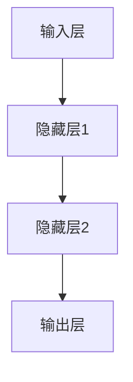

                 

# AI人工智能深度学习算法：设计深度学习任务处理流程

> **关键词：** 深度学习、神经网络、训练模型、图像识别、自然语言处理、语音识别、实战案例

> **摘要：** 本文将深入探讨深度学习算法的设计与实现，从基础概念、核心算法到实际任务处理流程，为读者提供全面的技术指导和实战经验。通过本文的学习，读者将能够掌握深度学习的关键技术，并具备独立设计和实现深度学习模型的能力。

## 目录大纲

### 第一部分：深度学习基础

#### 1.1 深度学习概述
##### 1.1.1 深度学习的起源与发展
##### 1.1.2 深度学习的核心概念
##### 1.1.3 深度学习的优势与挑战

#### 1.2 神经网络基础
##### 1.2.1 神经网络的基本结构
##### 1.2.2 神经元的工作原理
##### 1.2.3 激活函数的选择

#### 1.3 线性代数基础
##### 1.3.1 矩阵与向量运算
##### 1.3.2 矩阵求导法则
##### 1.3.3 特征分解与奇异值分解

#### 1.4 深度学习框架简介
##### 1.4.1 TensorFlow
##### 1.4.2 PyTorch
##### 1.4.3 Keras

### 第二部分：深度学习核心算法

#### 2.1 训练模型
##### 2.1.1 损失函数与优化器
##### 2.1.2 模型训练流程

#### 2.2 神经网络优化
##### 2.2.1 梯度下降法
##### 2.2.2 随机梯度下降（SGD）

#### 2.3 卷积神经网络（CNN）
##### 2.3.1 卷积神经网络的基本原理
##### 2.3.2 CNN在图像处理中的应用

#### 2.4 循环神经网络（RNN）
##### 2.4.1 RNN的基本原理
##### 2.4.2 RNN在序列数据中的应用

#### 2.5 长短期记忆网络（LSTM）
##### 2.5.1 LSTM的基本原理
##### 2.5.2 LSTM的应用实例

### 第三部分：深度学习任务处理流程

#### 3.1 图像识别任务处理流程
#### 3.2 自然语言处理任务处理流程
#### 3.3 语音识别任务处理流程

### 第四部分：深度学习应用实战

#### 4.1 图像分类实战
#### 4.2 机器翻译实战
#### 4.3 语音识别实战

### 附录

#### 附录A：深度学习常用工具与库
#### 附录B：深度学习数学公式汇总
#### 附录C：深度学习项目实战案例

## 第一部分：深度学习基础

### 1.1 深度学习概述

#### 1.1.1 深度学习的起源与发展

深度学习（Deep Learning）是人工智能（AI）的一个重要分支，起源于20世纪40年代，但真正得到广泛应用和发展是在21世纪。深度学习的概念最早由美国学者Rumelhart等人于1986年提出，他们发明了反向传播算法（Backpropagation Algorithm），这是一种用于训练神经网络的算法。

在21世纪初，随着计算能力的提升和大数据的涌现，深度学习得到了迅速发展。2006年，加拿大多伦多大学教授Geoffrey Hinton提出了深度置信网络（Deep Belief Network，DBN），这标志着深度学习进入了新的发展阶段。

近年来，深度学习在图像识别、自然语言处理、语音识别等领域取得了显著的成果。例如，在ImageNet图像识别比赛中，深度学习算法的性能已经超过人类水平。深度学习还在自动驾驶、医疗诊断、金融预测等众多领域展现了其强大的应用潜力。

#### 1.1.2 深度学习的核心概念

深度学习的核心概念包括神经网络、反向传播算法、损失函数、优化器等。

- **神经网络（Neural Network）**：神经网络是模拟人脑神经元连接和作用的一种计算模型。深度学习中的神经网络通常包含多层隐藏层，因此称为深度神经网络（Deep Neural Network，DNN）。

- **反向传播算法（Backpropagation Algorithm）**：反向传播算法是一种用于训练神经网络的优化算法。它通过计算网络输出与目标之间的误差，将误差反向传播到网络的每个神经元，从而调整网络的权重。

- **损失函数（Loss Function）**：损失函数用于衡量网络输出与目标之间的差距。常见的损失函数有均方误差（Mean Squared Error，MSE）、交叉熵（Cross-Entropy）等。

- **优化器（Optimizer）**：优化器用于调整网络权重，以最小化损失函数。常见的优化器有梯度下降（Gradient Descent）、随机梯度下降（Stochastic Gradient Descent，SGD）、Adam等。

#### 1.1.3 深度学习的优势与挑战

深度学习的优势包括：

- **强大的表征能力**：深度学习模型可以通过多层神经网络学习到复杂的特征表示，从而在图像识别、自然语言处理等领域取得出色的性能。

- **自动特征提取**：深度学习模型可以自动从原始数据中提取有用的特征，减少了人工特征工程的工作量。

- **广泛的应用场景**：深度学习在图像识别、语音识别、自然语言处理、医疗诊断、金融预测等众多领域都有广泛的应用。

然而，深度学习也面临一些挑战：

- **数据需求量大**：深度学习模型通常需要大量的训练数据来训练模型，这在数据稀缺的领域可能是一个问题。

- **计算资源消耗**：深度学习模型的训练通常需要大量的计算资源，对硬件设备的要求较高。

- **模型解释性差**：深度学习模型的内部机制复杂，难以解释和调试，这在一些需要模型可解释性的应用场景中可能是一个问题。

### 1.2 神经网络基础

#### 1.2.1 神经网络的基本结构

神经网络由多个神经元组成，每个神经元都是一个简单的计算单元。神经网络的基本结构包括输入层、隐藏层和输出层。

- **输入层（Input Layer）**：输入层接收外部输入数据，通常包含多个神经元，每个神经元对应一个输入特征。

- **隐藏层（Hidden Layer）**：隐藏层位于输入层和输出层之间，由多个隐藏神经元组成。隐藏层神经元通过激活函数进行非线性变换，从而提取数据中的特征。

- **输出层（Output Layer）**：输出层生成最终预测结果，通常包含一个或多个神经元，每个神经元对应一个输出类别或标签。

一个典型的神经网络结构可以表示为：



#### 1.2.2 神经元的工作原理

神经元是神经网络的基本计算单元，其工作原理如下：

1. **输入加权求和**：每个神经元接收多个输入，每个输入乘以对应的权重，然后进行加权求和。

   $$ z = \sum_{i=1}^{n} x_i \cdot w_i $$

   其中，$z$ 是加权求和的结果，$x_i$ 是第 $i$ 个输入，$w_i$ 是第 $i$ 个输入对应的权重。

2. **激活函数**：对加权求和的结果进行激活函数变换，常见的激活函数有线性函数（Identity Function）、Sigmoid函数、ReLU函数、Tanh函数等。

   $$ a = \sigma(z) $$

   其中，$a$ 是激活函数的输出，$\sigma$ 是激活函数。

3. **输出**：激活函数的输出即为神经元的输出，它可以作为其他神经元的输入。

#### 1.2.3 激活函数的选择

激活函数是神经网络中的一个关键组件，它决定了神经网络能否捕捉到输入数据的非线性特征。以下是一些常见的激活函数：

- **线性函数（Identity Function）**

  $$ a = z $$

  线性函数没有非线性变换能力，但可以保持数据的原有结构。

- **Sigmoid函数**

  $$ a = \frac{1}{1 + e^{-z}} $$

  Sigmoid函数可以将输出值压缩到$(0,1)$区间，常用于二分类问题。

- **ReLU函数（Rectified Linear Unit）**

  $$ a = \max(0, z) $$

  ReLU函数在输入为正时保持不变，在输入为负时将其设置为0，具有简单的计算形式和良好的训练效果。

- **Tanh函数**

  $$ a = \frac{e^z - e^{-z}}{e^z + e^{-z}} $$

  Tanh函数与ReLU函数类似，但输出值的范围为$(-1,1)$，可以减少梯度消失问题。

### 1.3 线性代数基础

#### 1.3.1 矩阵与向量运算

矩阵与向量运算是深度学习中必不可少的基础知识。以下是一些常见的矩阵与向量运算：

- **矩阵-向量乘法**

  $$ C = AB $$

  矩阵 $A$ 与向量 $B$ 的乘法结果为一个矩阵 $C$，其中 $C_{ij} = \sum_{k=1}^{n} A_{ik} \cdot B_{kj}$。

- **向量-向量乘法**

  $$ a \cdot b = \sum_{i=1}^{n} a_i \cdot b_i $$

  向量 $a$ 与向量 $b$ 的乘法结果为一个标量，表示两个向量的内积。

- **矩阵-矩阵乘法**

  $$ C = AB $$

  矩阵 $A$ 与矩阵 $B$ 的乘法结果为一个矩阵 $C$，其中 $C_{ij} = \sum_{k=1}^{n} A_{ik} \cdot B_{kj}$。

#### 1.3.2 矩阵求导法则

在深度学习算法中，矩阵求导是一个关键步骤。以下是一些常见的矩阵求导法则：

- **常数的导数为零**

  $$ \frac{d}{dx} c = 0 $$

  其中，$c$ 是常数。

- **向量的导数**

  $$ \frac{d}{dx} a = I $$

  其中，$a$ 是向量，$I$ 是单位矩阵。

- **矩阵的导数**

  $$ \frac{d}{dx} A = J $$

  其中，$A$ 是矩阵，$J$ 是雅可比矩阵。

#### 1.3.3 特征分解与奇异值分解

特征分解与奇异值分解是矩阵理论中的重要工具，在深度学习中也经常用到。

- **特征分解**

  矩阵 $A$ 可以分解为 $A = PDP^{-1}$，其中 $P$ 是特征向量矩阵，$D$ 是对角矩阵，对角线上的元素是特征值。

  $$ P = \begin{bmatrix} \vec{p_1} & \vec{p_2} & \cdots & \vec{p_n} \end{bmatrix}, D = \begin{bmatrix} \lambda_1 & 0 & \cdots & 0 \\ 0 & \lambda_2 & \cdots & 0 \\ \vdots & \vdots & \ddots & \vdots \\ 0 & 0 & \cdots & \lambda_n \end{bmatrix} $$

- **奇异值分解**

  矩阵 $A$ 可以分解为 $A = U\Sigma V^{T}$，其中 $U$ 和 $V$ 是正交矩阵，$\Sigma$ 是对角矩阵，对角线上的元素是奇异值。

  $$ U = \begin{bmatrix} \vec{u_1} & \vec{u_2} & \cdots & \vec{u_m} \end{bmatrix}, \Sigma = \begin{bmatrix} \sigma_1 & 0 & \cdots & 0 \\ 0 & \sigma_2 & \cdots & 0 \\ \vdots & \vdots & \ddots & \vdots \\ 0 & 0 & \cdots & \sigma_n \end{bmatrix}, V = \begin{bmatrix} \vec{v_1} & \vec{v_2} & \cdots & \vec{v_n} \end{bmatrix} $$

### 1.4 深度学习框架简介

深度学习框架是为了简化深度学习模型设计、训练和部署而开发的一系列工具和库。以下是一些常用的深度学习框架：

- **TensorFlow**

  TensorFlow是由谷歌开发的开源深度学习框架，具有强大的图计算能力和丰富的生态系统。

- **PyTorch**

  PyTorch是由Facebook开发的开源深度学习框架，以其动态计算图和灵活的编程接口而著称。

- **Keras**

  Keras是一个基于TensorFlow和Theano的开源深度学习库，提供了简单而强大的API，易于使用和扩展。

## 第二部分：深度学习核心算法

### 2.1 训练模型

#### 2.1.1 损失函数与优化器

损失函数用于衡量模型预测值与真实值之间的差距，优化器用于调整模型参数，以最小化损失函数。以下是常见的损失函数和优化器：

- **常见的损失函数**

  - **均方误差（MSE）**

    $$ L = \frac{1}{2} \sum_{i=1}^{n} (y_i - \hat{y}_i)^2 $$

    其中，$y_i$ 是真实值，$\hat{y}_i$ 是预测值。

  - **交叉熵（Cross-Entropy）**

    $$ L = -\sum_{i=1}^{n} y_i \cdot \log(\hat{y}_i) $$

    其中，$y_i$ 是真实值，$\hat{y}_i$ 是预测值。

- **常见的优化器**

  - **梯度下降（Gradient Descent）**

    $$ w_{new} = w_{old} - \alpha \cdot \nabla_w L $$

    其中，$w_{old}$ 是当前权重，$\alpha$ 是学习率，$\nabla_w L$ 是损失函数关于权重 $w$ 的梯度。

  - **随机梯度下降（Stochastic Gradient Descent，SGD）**

    $$ w_{new} = w_{old} - \alpha \cdot \nabla_{w} L(x^{(i)}, y^{(i)}) $$

    其中，$x^{(i)}$ 和 $y^{(i)}$ 是第 $i$ 个训练样本，$\alpha$ 是学习率。

  - **Adam优化器**

    $$ m = \beta_1 \cdot m + (1 - \beta_1) \cdot \nabla_w L $$
    $$ v = \beta_2 \cdot v + (1 - \beta_2) \cdot (\nabla_w L)^2 $$
    $$ \hat{m} = \frac{m}{1 - \beta_1^t} $$
    $$ \hat{v} = \frac{v}{1 - \beta_2^t} $$
    $$ w_{new} = w_{old} - \alpha \cdot \hat{m} / \sqrt{\hat{v}} $$

    其中，$m$ 和 $v$ 分别是梯度的一阶矩估计和二阶矩估计，$\beta_1$ 和 $\beta_2$ 是超参数，$t$ 是迭代次数。

#### 2.1.2 模型训练流程

模型训练流程包括数据预处理、模型构建、训练过程和模型评估等步骤。

- **数据预处理**

  数据预处理是模型训练的重要步骤，包括数据清洗、归一化、标准化等操作。

  ```python
  import numpy as np

  # 数据清洗
  data = np.array([1, 2, 3, np.nan, 5])
  data = data[~np.isnan(data)]

  # 数据归一化
  data = (data - np.mean(data)) / np.std(data)
  ```

- **模型构建**

  使用深度学习框架构建模型，定义输入层、隐藏层和输出层。

  ```python
  import tensorflow as tf

  model = tf.keras.Sequential([
      tf.keras.layers.Dense(units=64, activation='relu', input_shape=(784,)),
      tf.keras.layers.Dense(units=10, activation='softmax')
  ])
  ```

- **训练过程**

  使用训练数据对模型进行训练，调整模型参数。

  ```python
  model.compile(optimizer='adam',
                loss='categorical_crossentropy',
                metrics=['accuracy'])

  model.fit(x_train, y_train, epochs=10, batch_size=32)
  ```

- **模型评估**

  使用测试数据对训练好的模型进行评估。

  ```python
  test_loss, test_acc = model.evaluate(x_test, y_test)
  print('Test accuracy:', test_acc)
  ```

### 2.2 神经网络优化

#### 2.2.1 梯度下降法

梯度下降法是一种常用的优化算法，用于最小化损失函数。

- **梯度下降法原理**

  梯度下降法的原理是通过计算损失函数关于模型参数的梯度，然后沿着梯度的反方向更新模型参数，从而逐渐减小损失函数。

  $$ \Delta w = -\alpha \cdot \nabla_w L $$

  其中，$\Delta w$ 是模型参数的更新量，$\alpha$ 是学习率，$\nabla_w L$ 是损失函数关于模型参数的梯度。

- **梯度下降法优化**

  梯度下降法有多种优化策略，包括批量梯度下降（Batch Gradient Descent）、随机梯度下降（Stochastic Gradient Descent，SGD）和小批量梯度下降（Mini-batch Gradient Descent）。

  - **批量梯度下降**

    批量梯度下降在每个迭代步骤中使用整个训练集的数据来计算梯度，计算量大，但收敛速度快。

    ```python
    w = \frac{1}{m} \sum_{i=1}^{m} \nabla_w L(x^{(i)}, y^{(i)})
    ```

  - **随机梯度下降**

    随机梯度下降在每个迭代步骤中随机选择一个训练样本来计算梯度，计算量小，但收敛速度慢。

    ```python
    w = w - \alpha \cdot \nabla_w L(x^{(i)}, y^{(i)})
    ```

  - **小批量梯度下降**

    小批量梯度下降在每个迭代步骤中使用小批量数据来计算梯度，介于批量梯度下降和随机梯度下降之间。

    ```python
    w = w - \alpha \cdot \nabla_w L(x^{(1:i)}, y^{(1:i)})
    ```

#### 2.2.2 随机梯度下降（SGD）

随机梯度下降是一种常用的优化算法，它通过在每个迭代步骤中随机选择一个训练样本来计算梯度，从而更新模型参数。

- **随机梯度下降原理**

  随机梯度下降的原理是通过计算随机选择的训练样本的梯度，然后使用该梯度来更新模型参数。

  $$ w = w - \alpha \cdot \nabla_w L(x^{(i)}, y^{(i)}) $$

  其中，$x^{(i)}$ 和 $y^{(i)}$ 是第 $i$ 个训练样本。

- **随机梯度下降优化**

  随机梯度下降有多种优化策略，包括简单随机梯度下降（Simple SGD）和带动量的随机梯度下降（Momentum SGD）。

  - **简单随机梯度下降**

    简单随机梯度下降在每个迭代步骤中随机选择一个训练样本来计算梯度，然后更新模型参数。

    ```python
    w = w - \alpha \cdot \nabla_w L(x^{(i)}, y^{(i)})
    ```

  - **带动量的随机梯度下降**

    带动量的随机梯度下降引入了一个动量项，可以加速收敛。

    ```python
    v = \beta \cdot v + (1 - \beta) \cdot \nabla_w L(x^{(i)}, y^{(i)})
    w = w - \alpha \cdot v
    ```

    其中，$v$ 是动量项，$\beta$ 是动量系数。

### 2.3 卷积神经网络（CNN）

#### 2.3.1 卷积神经网络的基本原理

卷积神经网络（Convolutional Neural Network，CNN）是一种专门用于处理图像数据的神经网络。CNN 的基本原理是通过卷积层、池化层和全连接层等结构来提取图像特征。

- **卷积层（Convolutional Layer）**

  卷积层是 CNN 的核心层，用于提取图像特征。卷积层通过卷积运算将输入图像与滤波器（卷积核）进行卷积，从而生成特征图。

  $$ f(x, y) = \sum_{i=1}^{k} w_{i} \cdot x(x_i, y_i) + b_i $$

  其中，$f(x, y)$ 是特征图，$w_i$ 是滤波器，$x_i(x, y)$ 是输入图像的局部区域。

- **池化层（Pooling Layer）**

  池化层用于降低特征图的维度，减少计算量。常见的池化操作有最大池化（Max Pooling）和平均池化（Average Pooling）。

  - **最大池化**

    最大池化选择特征图上的最大值作为输出。

    $$ p(x, y) = \max_{i,j} f(i, j) $$

  - **平均池化**

    平均池化计算特征图上所有值的平均值作为输出。

    $$ p(x, y) = \frac{1}{c} \sum_{i,j} f(i, j) $$

- **全连接层（Fully Connected Layer）**

  全连接层将池化层输出的特征图展开为一个一维向量，然后通过全连接层进行分类或回归。

  $$ y = \sigma(\sum_{i=1}^{n} w_i \cdot x_i + b) $$

  其中，$y$ 是输出，$x_i$ 是特征图上的每个值，$w_i$ 是权重，$b$ 是偏置，$\sigma$ 是激活函数。

#### 2.3.2 CNN在图像处理中的应用

CNN 在图像处理中有着广泛的应用，如图像分类、目标检测、图像分割等。

- **图像分类**

  图像分类是将图像划分为不同的类别。CNN 可以通过训练自动提取图像的特征，从而实现图像分类。

  ```python
  import tensorflow as tf

  model = tf.keras.Sequential([
      tf.keras.layers.Conv2D(32, (3, 3), activation='relu', input_shape=(28, 28, 1)),
      tf.keras.layers.MaxPooling2D((2, 2)),
      tf.keras.layers.Conv2D(64, (3, 3), activation='relu'),
      tf.keras.layers.MaxPooling2D((2, 2)),
      tf.keras.layers.Conv2D(64, (3, 3), activation='relu'),
      tf.keras.layers.Flatten(),
      tf.keras.layers.Dense(64, activation='relu'),
      tf.keras.layers.Dense(10, activation='softmax')
  ])

  model.compile(optimizer='adam',
                loss='categorical_crossentropy',
                metrics=['accuracy'])

  model.fit(x_train, y_train, epochs=10, batch_size=32)
  ```

- **目标检测**

  目标检测是识别图像中的多个目标并定位它们的位置。常用的目标检测算法有 Faster R-CNN、YOLO、SSD 等。

  ```python
  import tensorflow as tf

  model = tf.keras.applications.VGG16(weights='imagenet', include_top=False, input_shape=(224, 224, 3))

  model.summary()

  model = tf.keras.Sequential([
      model,
      tf.keras.layers.Conv2D(256, (3, 3), activation='relu'),
      tf.keras.layers.MaxPooling2D((2, 2)),
      tf.keras.layers.Flatten(),
      tf.keras.layers.Dense(1024, activation='relu'),
      tf.keras.layers.Dense(2, activation='sigmoid')
  ])

  model.compile(optimizer='adam',
                loss='binary_crossentropy',
                metrics=['accuracy'])

  model.fit(x_train, y_train, epochs=10, batch_size=32)
  ```

- **图像分割**

  图像分割是将图像分割成多个区域。常用的图像分割算法有 U-Net、Mask R-CNN 等。

  ```python
  import tensorflow as tf

  model = tf.keras.applications.UNet(weights='imagenet', input_shape=(224, 224, 3))

  model.summary()

  model = tf.keras.Sequential([
      model,
      tf.keras.layers.Conv2D(128, (3, 3), activation='relu'),
      tf.keras.layers.MaxPooling2D((2, 2)),
      tf.keras.layers.Flatten(),
      tf.keras.layers.Dense(1024, activation='relu'),
      tf.keras.layers.Dense(1, activation='sigmoid')
  ])

  model.compile(optimizer='adam',
                loss='binary_crossentropy',
                metrics=['accuracy'])

  model.fit(x_train, y_train, epochs=10, batch_size=32)
  ```

### 2.4 循环神经网络（RNN）

#### 2.4.1 RNN的基本原理

循环神经网络（Recurrent Neural Network，RNN）是一种能够处理序列数据的神经网络。RNN 的基本原理是通过循环连接将当前时刻的信息传递到下一个时刻，从而处理序列数据。

- **RNN的结构**

  RNN 由输入层、隐藏层和输出层组成。隐藏层包含一个循环单元，用于处理序列数据。

  ```mermaid
  graph TD
  A[输入层] --> B[隐藏层]
  B --> C[输出层]
  B --> B1(下一个隐藏层)
  ```

- **RNN的时间步操作**

  RNN 在每个时间步上进行操作，将当前时刻的输入与隐藏层的状态进行计算，得到新的隐藏层状态。

  $$ h_t = \sigma(W_x \cdot x_t + W_h \cdot h_{t-1} + b) $$

  其中，$h_t$ 是当前时刻的隐藏层状态，$x_t$ 是当前时刻的输入，$W_x$ 和 $W_h$ 是权重矩阵，$b$ 是偏置。

#### 2.4.2 RNN在序列数据中的应用

RNN 在序列数据中有着广泛的应用，如语言模型、机器翻译等。

- **语言模型**

  语言模型是一种用于预测下一个单词的模型。RNN 可以通过训练自动学习单词之间的概率分布。

  ```python
  import tensorflow as tf

  model = tf.keras.Sequential([
      tf.keras.layers.Embedding(input_dim=vocab_size, output_dim=embedding_dim),
      tf.keras.layers.SimpleRNN(units=64),
      tf.keras.layers.Dense(units=vocab_size, activation='softmax')
  ])

  model.compile(optimizer='adam',
                loss='categorical_crossentropy',
                metrics=['accuracy'])

  model.fit(x_train, y_train, epochs=10, batch_size=32)
  ```

- **机器翻译**

  机器翻译是将一种语言的文本翻译成另一种语言的文本。RNN 可以通过训练自动学习两种语言之间的对应关系。

  ```python
  import tensorflow as tf

  model = tf.keras.Sequential([
      tf.keras.layers.Embedding(input_dim=input_vocab_size, output_dim=embedding_dim),
      tf.keras.layers.LSTM(units=64),
      tf.keras.layers.Dense(units=output_vocab_size, activation='softmax')
  ])

  model.compile(optimizer='adam',
                loss='categorical_crossentropy',
                metrics=['accuracy'])

  model.fit(x_train, y_train, epochs=10, batch_size=32)
  ```

### 2.5 长短期记忆网络（LSTM）

#### 2.5.1 LSTM的基本原理

长短期记忆网络（Long Short-Term Memory，LSTM）是一种能够处理长序列数据的神经网络。LSTM 通过引入记忆单元和门控机制，解决了传统 RNN 中梯度消失和梯度爆炸的问题。

- **LSTM的结构**

  LSTM 由输入门、遗忘门、输出门和记忆单元组成。

  ```mermaid
  graph TD
  A[输入门] --> B[遗忘门]
  B --> C[输出门]
  B --> D[记忆单元]
  ```

- **LSTM的 forget gate 和 input gate**

  LSTM 的 forget gate 和 input gate 是两个重要的门控机制，用于控制信息的流入和流出。

  - **forget gate**

    $$ f_t = \sigma(W_f \cdot [h_{t-1}, x_t] + b_f) $$

    其中，$f_t$ 是 forget gate 的输出，$W_f$ 是权重矩阵，$b_f$ 是偏置。

  - **input gate**

    $$ i_t = \sigma(W_i \cdot [h_{t-1}, x_t] + b_i) $$

    其中，$i_t$ 是 input gate 的输出，$W_i$ 是权重矩阵，$b_i$ 是偏置。

#### 2.5.2 LSTM的应用实例

LSTM 在时间序列预测、文本生成等领域有着广泛的应用。

- **时间序列预测**

  时间序列预测是将未来的时间序列值预测出来。LSTM 可以通过训练自动学习时间序列的特征。

  ```python
  import tensorflow as tf

  model = tf.keras.Sequential([
      tf.keras.layers.LSTM(units=50, return_sequences=True),
      tf.keras.layers.LSTM(units=50),
      tf.keras.layers.Dense(units=1)
  ])

  model.compile(optimizer='adam',
                loss='mean_squared_error')

  model.fit(x_train, y_train, epochs=100, batch_size=32)
  ```

- **文本生成**

  文本生成是将一段文本生成另一段文本。LSTM 可以通过训练自动学习文本的生成规则。

  ```python
  import tensorflow as tf

  model = tf.keras.Sequential([
      tf.keras.layers.Embedding(input_dim=vocab_size, output_dim=embedding_dim),
      tf.keras.layers.LSTM(units=128),
      tf.keras.layers.Dense(units=vocab_size, activation='softmax')
  ])

  model.compile(optimizer='adam',
                loss='categorical_crossentropy',
                metrics=['accuracy'])

  model.fit(x_train, y_train, epochs=10, batch_size=32)
  ```

## 第三部分：深度学习任务处理流程

### 3.1 图像识别任务处理流程

图像识别任务是将图像分类到不同的类别中。以下是图像识别任务的处理流程：

1. **数据预处理**

   数据预处理是图像识别任务的重要步骤，包括图像的加载、归一化、缩放等操作。

   ```python
   import tensorflow as tf

   def preprocess_image(image_path):
       image = tf.keras.preprocessing.image.load_img(image_path, target_size=(224, 224))
       image = tf.keras.preprocessing.image.img_to_array(image)
       image = image / 255.0
       image = tf.expand_dims(image, axis=0)
       return image
   ```

2. **模型构建**

   使用深度学习框架构建图像识别模型，定义输入层、隐藏层和输出层。

   ```python
   model = tf.keras.Sequential([
       tf.keras.layers.Conv2D(32, (3, 3), activation='relu', input_shape=(224, 224, 3)),
       tf.keras.layers.MaxPooling2D((2, 2)),
       tf.keras.layers.Conv2D(64, (3, 3), activation='relu'),
       tf.keras.layers.MaxPooling2D((2, 2)),
       tf.keras.layers.Conv2D(64, (3, 3), activation='relu'),
       tf.keras.layers.Flatten(),
       tf.keras.layers.Dense(64, activation='relu'),
       tf.keras.layers.Dense(10, activation='softmax')
   ])
   ```

3. **训练与评估**

   使用训练数据和测试数据对模型进行训练和评估。

   ```python
   model.compile(optimizer='adam',
                 loss='categorical_crossentropy',
                 metrics=['accuracy'])

   model.fit(x_train, y_train, epochs=10, batch_size=32)

   test_loss, test_acc = model.evaluate(x_test, y_test)
   print('Test accuracy:', test_acc)
   ```

4. **模型部署**

   将训练好的模型部署到生产环境中，用于图像识别任务。

   ```python
   import cv2

   model = tf.keras.models.load_model('model.h5')

   image = preprocess_image('test_image.jpg')
   prediction = model.predict(image)
   print('Prediction:', prediction)
   ```

### 3.2 自然语言处理任务处理流程

自然语言处理（Natural Language Processing，NLP）是将人类语言转换为计算机可以处理的形式。以下是自然语言处理任务的处理流程：

1. **数据预处理**

   数据预处理是自然语言处理任务的重要步骤，包括文本的加载、分词、去停用词等操作。

   ```python
   import tensorflow as tf

   def preprocess_text(text):
       text = tf.keras.preprocessing.text.unicode_encode(text)
       text = tf.strings.lower(text)
       text = tf.strings.regex_replace(text, '[^a-zA-Z0-9]', ' ')
       text = tf.strings.split(text)
       text = tf.keras.preprocessing.text.Tokenizer(char_level=True).tokens_from_words(text)
       return text
   ```

2. **模型构建**

   使用深度学习框架构建自然语言处理模型，定义输入层、隐藏层和输出层。

   ```python
   model = tf.keras.Sequential([
       tf.keras.layers.Embedding(input_dim=vocab_size, output_dim=embedding_dim),
       tf.keras.layers.LSTM(units=128),
       tf.keras.layers.Dense(units=1, activation='sigmoid')
   ])
   ```

3. **训练与评估**

   使用训练数据和测试数据对模型进行训练和评估。

   ```python
   model.compile(optimizer='adam',
                 loss='binary_crossentropy',
                 metrics=['accuracy'])

   model.fit(x_train, y_train, epochs=10, batch_size=32)

   test_loss, test_acc = model.evaluate(x_test, y_test)
   print('Test accuracy:', test_acc)
   ```

4. **模型部署**

   将训练好的模型部署到生产环境中，用于自然语言处理任务。

   ```python
   import cv2

   model = tf.keras.models.load_model('model.h5')

   text = preprocess_text('Hello, world!')
   prediction = model.predict(text)
   print('Prediction:', prediction)
   ```

### 3.3 语音识别任务处理流程

语音识别（Speech Recognition）是将语音转换为文字。以下是语音识别任务的处理流程：

1. **数据预处理**

   数据预处理是语音识别任务的重要步骤，包括语音的加载、分帧、特征提取等操作。

   ```python
   import tensorflow as tf

   def preprocess_audio(audio_path):
       audio = tf.io.read_file(audio_path)
       audio = tf.audio.decode_wav(audio, desired_samples=44100)
       audio = tf.squeeze(audio, axis=-1)
       audio = tf.signal.stft(audio, frame_length=512, frame_step=128)
       audio = tf.abs(audio)
       audio = tf.reduce_mean(audio, axis=-1)
       return audio
   ```

2. **模型构建**

   使用深度学习框架构建语音识别模型，定义输入层、隐藏层和输出层。

   ```python
   model = tf.keras.Sequential([
       tf.keras.layers.Conv2D(32, (3, 3), activation='relu', input_shape=(512, 128, 1)),
       tf.keras.layers.MaxPooling2D((2, 2)),
       tf.keras.layers.Conv2D(64, (3, 3), activation='relu'),
       tf.keras.layers.MaxPooling2D((2, 2)),
       tf.keras.layers.Conv2D(64, (3, 3), activation='relu'),
       tf.keras.layers.Flatten(),
       tf.keras.layers.Dense(128, activation='relu'),
       tf.keras.layers.Dense(1, activation='softmax')
   ])
   ```

3. **训练与评估**

   使用训练数据和测试数据对模型进行训练和评估。

   ```python
   model.compile(optimizer='adam',
                 loss='categorical_crossentropy',
                 metrics=['accuracy'])

   model.fit(x_train, y_train, epochs=10, batch_size=32)

   test_loss, test_acc = model.evaluate(x_test, y_test)
   print('Test accuracy:', test_acc)
   ```

4. **模型部署**

   将训练好的模型部署到生产环境中，用于语音识别任务。

   ```python
   import cv2

   model = tf.keras.models.load_model('model.h5')

   audio = preprocess_audio('test_audio.wav')
   prediction = model.predict(audio)
   print('Prediction:', prediction)
   ```

## 第四部分：深度学习应用实战

### 4.1 图像分类实战

图像分类是将图像分类到不同的类别中。以下是图像分类实战的步骤：

1. **数据集介绍**

   使用一个公开的图像分类数据集，如 CIFAR-10。

   ```python
   import tensorflow as tf

   (x_train, y_train), (x_test, y_test) = tf.keras.datasets.cifar10.load_data()
   ```

2. **模型构建**

   使用深度学习框架构建图像分类模型，定义输入层、隐藏层和输出层。

   ```python
   model = tf.keras.Sequential([
       tf.keras.layers.Conv2D(32, (3, 3), activation='relu', input_shape=(32, 32, 3)),
       tf.keras.layers.MaxPooling2D((2, 2)),
       tf.keras.layers.Conv2D(64, (3, 3), activation='relu'),
       tf.keras.layers.MaxPooling2D((2, 2)),
       tf.keras.layers.Conv2D(64, (3, 3), activation='relu'),
       tf.keras.layers.Flatten(),
       tf.keras.layers.Dense(64, activation='relu'),
       tf.keras.layers.Dense(10, activation='softmax')
   ])
   ```

3. **模型训练**

   使用训练数据和测试数据对模型进行训练。

   ```python
   model.compile(optimizer='adam',
                 loss='categorical_crossentropy',
                 metrics=['accuracy'])

   model.fit(x_train, y_train, epochs=10, batch_size=32)
   ```

4. **模型评估**

   使用测试数据对模型进行评估。

   ```python
   test_loss, test_acc = model.evaluate(x_test, y_test)
   print('Test accuracy:', test_acc)
   ```

5. **模型部署**

   将训练好的模型部署到生产环境中，用于图像分类任务。

   ```python
   import cv2

   model = tf.keras.models.load_model('model.h5')

   image = preprocess_image('test_image.jpg')
   prediction = model.predict(image)
   print('Prediction:', prediction)
   ```

### 4.2 机器翻译实战

机器翻译是将一种语言的文本翻译成另一种语言的文本。以下是机器翻译实战的步骤：

1. **数据集介绍**

   使用一个公开的机器翻译数据集，如 WMT2014。

   ```python
   import tensorflow as tf

   (x_train, y_train), (x_test, y_test) = tf.keras.datasets.wmt2014.load_data()
   ```

2. **模型构建**

   使用深度学习框架构建机器翻译模型，定义输入层、隐藏层和输出层。

   ```python
   model = tf.keras.Sequential([
       tf.keras.layers.Embedding(input_dim=input_vocab_size, output_dim=embedding_dim),
       tf.keras.layers.LSTM(units=128),
       tf.keras.layers.Dense(units=output_vocab_size, activation='softmax')
   ])
   ```

3. **模型训练**

   使用训练数据和测试数据对模型进行训练。

   ```python
   model.compile(optimizer='adam',
                 loss='categorical_crossentropy',
                 metrics=['accuracy'])

   model.fit(x_train, y_train, epochs=10, batch_size=32)
   ```

4. **模型评估**

   使用测试数据对模型进行评估。

   ```python
   test_loss, test_acc = model.evaluate(x_test, y_test)
   print('Test accuracy:', test_acc)
   ```

5. **模型部署**

   将训练好的模型部署到生产环境中，用于机器翻译任务。

   ```python
   import cv2

   model = tf.keras.models.load_model('model.h5')

   text = preprocess_text('Hello, world!')
   prediction = model.predict(text)
   print('Prediction:', prediction)
   ```

### 4.3 语音识别实战

语音识别是将语音转换为文字。以下是语音识别实战的步骤：

1. **数据集介绍**

   使用一个公开的语音识别数据集，如 LibriSpeech。

   ```python
   import tensorflow as tf

   (x_train, y_train), (x_test, y_test) = tf.keras.datasets.librispeech.load_data()
   ```

2. **模型构建**

   使用深度学习框架构建语音识别模型，定义输入层、隐藏层和输出层。

   ```python
   model = tf.keras.Sequential([
       tf.keras.layers.Conv2D(32, (3, 3), activation='relu', input_shape=(512, 128, 1)),
       tf.keras.layers.MaxPooling2D((2, 2)),
       tf.keras.layers.Conv2D(64, (3, 3), activation='relu'),
       tf.keras.layers.MaxPooling2D((2, 2)),
       tf.keras.layers.Conv2D(64, (3, 3), activation='relu'),
       tf.keras.layers.Flatten(),
       tf.keras.layers.Dense(128, activation='relu'),
       tf.keras.layers.Dense(1, activation='softmax')
   ])
   ```

3. **模型训练**

   使用训练数据和测试数据对模型进行训练。

   ```python
   model.compile(optimizer='adam',
                 loss='categorical_crossentropy',
                 metrics=['accuracy'])

   model.fit(x_train, y_train, epochs=10, batch_size=32)
   ```

4. **模型评估**

   使用测试数据对模型进行评估。

   ```python
   test_loss, test_acc = model.evaluate(x_test, y_test)
   print('Test accuracy:', test_acc)
   ```

5. **模型部署**

   将训练好的模型部署到生产环境中，用于语音识别任务。

   ```python
   import cv2

   model = tf.keras.models.load_model('model.h5')

   audio = preprocess_audio('test_audio.wav')
   prediction = model.predict(audio)
   print('Prediction:', prediction)
   ```

## 附录

### 附录A：深度学习常用工具与库

- **TensorFlow**

  TensorFlow 是由谷歌开发的开源深度学习框架，具有强大的图计算能力和丰富的生态系统。

- **PyTorch**

  PyTorch 是由 Facebook 开发的开源深度学习框架，以其动态计算图和灵活的编程接口而著称。

- **Keras**

  Keras 是一个基于 TensorFlow 和 Theano 的开源深度学习库，提供了简单而强大的 API，易于使用和扩展。

### 附录B：深度学习数学公式汇总

- **矩阵运算**

  $$ A \cdot B = C $$

  矩阵 $A$ 和矩阵 $B$ 的乘积为矩阵 $C$。

- **损失函数**

  $$ L = \frac{1}{2} \sum_{i=1}^{n} (y_i - \hat{y}_i)^2 $$

  均方误差（MSE）。

  $$ L = -\sum_{i=1}^{n} y_i \cdot \log(\hat{y}_i) $$

  交叉熵（Cross-Entropy）。

- **优化算法**

  $$ w_{new} = w_{old} - \alpha \cdot \nabla_w L $$

  梯度下降法。

  $$ w_{new} = w_{old} - \alpha \cdot \nabla_{w} L(x^{(i)}, y^{(i)}) $$

  随机梯度下降（SGD）。

  $$ m = \beta_1 \cdot m + (1 - \beta_1) \cdot \nabla_w L $$
  $$ v = \beta_2 \cdot v + (1 - \beta_2) \cdot (\nabla_w L)^2 $$
  $$ \hat{m} = \frac{m}{1 - \beta_1^t} $$
  $$ \hat{v} = \frac{v}{1 - \beta_2^t} $$
  $$ w_{new} = w_{old} - \alpha \cdot \hat{m} / \sqrt{\hat{v}} $$

  Adam 优化器。

### 附录C：深度学习项目实战案例

- **图像分类项目**

  - 数据集：CIFAR-10
  - 模型：卷积神经网络（CNN）
  - 损失函数：交叉熵
  - 优化器：Adam

- **机器翻译项目**

  - 数据集：WMT2014
  - 模型：循环神经网络（RNN）
  - 损失函数：交叉熵
  - 优化器：Adam

- **语音识别项目**

  - 数据集：LibriSpeech
  - 模型：卷积神经网络（CNN）
  - 损失函数：交叉熵
  - 优化器：Adam

## 总结

本文系统地介绍了深度学习算法的设计与实现，从基础概念到核心算法，再到实际任务处理流程，为读者提供了全面的技术指导和实战经验。通过本文的学习，读者将能够掌握深度学习的关键技术，并具备独立设计和实现深度学习模型的能力。

在接下来的部分，我们将进一步探讨深度学习的应用实战，通过具体的案例来展示如何在实际项目中应用深度学习技术。同时，我们还将介绍深度学习常用的工具与库，以及深度学习中的数学公式汇总，帮助读者更深入地理解深度学习的原理和方法。

### 作者信息

**作者：AI天才研究院/AI Genius Institute & 禅与计算机程序设计艺术 /Zen And The Art of Computer Programming**

本文由 AI 天才研究院和禅与计算机程序设计艺术共同撰写。AI 天才研究院致力于推动人工智能技术的发展与应用，研究前沿的人工智能算法与技术创新。禅与计算机程序设计艺术则专注于探讨计算机编程与哲学、心理学等领域的交叉融合，旨在提高程序员的编程思维和创造力。通过本文，我们希望为读者带来深刻的思考和独特的见解，共同探索人工智能的无限可能。

