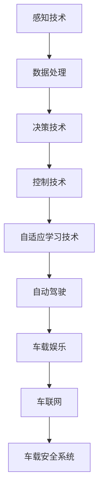
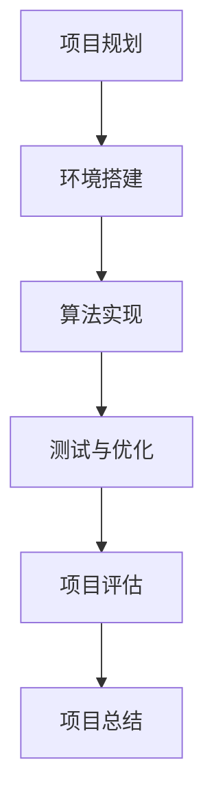
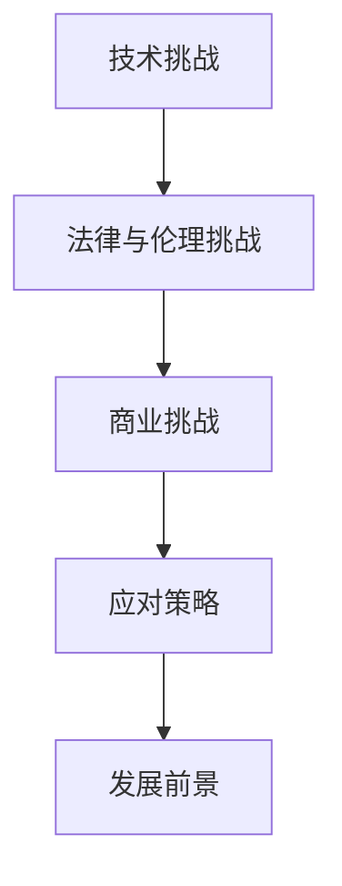

                 

### 文章标题

"AI在智能汽车中的应用：提升驾驶体验"

### 文章关键词

- 人工智能
- 智能汽车
- 自动驾驶
- 车联网
- 车载安全系统

### 摘要

本文深入探讨了人工智能（AI）在智能汽车中的应用，探讨了其提升驾驶体验的各个方面。从感知技术、决策技术、控制技术到自适应学习技术，本文详细分析了AI在智能汽车中的核心应用。此外，文章还通过实战项目展示了AI技术在自动驾驶、车联网和车载娱乐等领域的具体实现方法。文章最后讨论了AI在智能汽车中的发展前景、面临的挑战及应对策略，为读者提供了全面的技术解读和实用指导。

### 第一部分：AI在智能汽车中的应用概述

#### 第1章: AI在智能汽车中的应用概述

##### 1.1 AI在智能汽车中的重要性

随着人工智能技术的不断发展，AI在各个领域中的应用日益广泛，智能汽车作为人工智能的重要应用场景之一，其重要性愈发凸显。AI在智能汽车中的应用不仅仅是为了提升汽车的智能化水平，更是为了改善驾驶体验，提高驾驶安全性，以及实现更高效、环保的出行方式。

###### 1.1.1 AI技术的进化与智能汽车的崛起

人工智能技术经历了从规则推理、知识表示到深度学习等多个发展阶段。尤其是近年来，随着深度学习、强化学习等技术的突破，AI在图像识别、语音识别、自然语言处理等领域取得了显著成果。这些技术的进步为智能汽车的发展奠定了基础，推动了智能汽车的崛起。

智能汽车的概念最早可以追溯到20世纪80年代，但直到21世纪初，随着传感器技术、通信技术、计算能力的快速发展，智能汽车才开始进入实际应用阶段。如今，智能汽车已经成为汽车产业的重要发展方向，各大汽车制造商和科技公司纷纷投入巨资研发智能汽车技术。

###### 1.1.2 AI在智能汽车中的作用与影响

AI在智能汽车中的作用主要体现在以下几个方面：

1. **感知**：通过传感器技术，如摄像头、激光雷达、超声波传感器等，智能汽车能够感知周围环境，获取路况信息、车辆位置、行人信息等。
2. **决策**：基于感知到的信息，智能汽车通过决策算法进行环境分析和判断，制定出合理的驾驶策略。
3. **控制**：智能汽车根据决策结果，控制车辆的各种动作，如加速、减速、转向等。
4. **自适应学习**：智能汽车能够根据驾驶过程中的经验和数据，不断优化自己的决策和控制算法，提高驾驶性能。

AI在智能汽车中的应用不仅改变了传统的驾驶模式，还带来了许多积极的影响：

1. **提升驾驶安全性**：通过AI技术，智能汽车能够实现自动驾驶，减少人为驾驶失误，降低交通事故的发生率。
2. **改善驾驶体验**：智能汽车提供了更舒适、便捷的驾驶环境，如语音控制、智能导航等。
3. **提高出行效率**：智能汽车能够优化行驶路线，避免交通拥堵，提高出行效率。
4. **促进环保**：智能汽车通过优化驾驶行为，减少油耗和排放，有助于实现环保目标。

###### 1.1.3 智能汽车行业的发展趋势

随着技术的不断进步和市场需求的增长，智能汽车行业呈现出以下发展趋势：

1. **自动驾驶技术的快速发展**：自动驾驶是智能汽车的核心技术之一，随着传感器、计算能力和算法的不断提升，自动驾驶技术正在从辅助驾驶向完全自动驾驶迈进。
2. **车联网的普及**：车联网技术将车辆与互联网连接起来，实现车辆之间的信息交换和协同工作，为智能驾驶提供了数据支持。
3. **人工智能与物联网的融合**：人工智能与物联网技术的融合，将推动智能汽车产业向更智能、更高效的方向发展。
4. **新能源车的推广**：随着环保意识的提高和能源结构的优化，新能源车（如电动车、氢燃料电池车）将成为未来汽车市场的主流。

##### 1.2 智能汽车的核心AI技术

智能汽车的核心AI技术包括感知技术、决策技术、控制技术和自适应学习技术。这些技术共同构成了智能汽车的大脑，使得智能汽车能够自主感知环境、做出决策、控制车辆动作，并不断优化自己的驾驶行为。

###### 1.2.1 感知技术

感知技术是智能汽车获取外部环境信息的关键技术，主要包括以下几种：

1. **摄像头感知**：摄像头可以获取车辆周围的道路、行人、车辆等信息，通过图像处理技术，实现目标检测、识别和跟踪等功能。
2. **激光雷达感知**：激光雷达可以发射激光束并测量反射时间，通过分析反射光的信息，构建周围环境的点云模型，实现对环境的精确感知。
3. **雷达感知**：雷达通过发射无线电波并接收反射波，测量反射波的强度和时间，获取车辆周围物体的距离和速度信息。
4. **超声波感知**：超声波传感器通过发射超声波并接收反射波，测量反射波的时间，获取车辆周围物体的距离信息。

感知技术的实现主要包括数据采集、数据处理、数据特征提取和模型训练等步骤。通过这些步骤，智能汽车能够从传感器数据中提取有用的信息，实现对环境的感知。

###### 1.2.2 决策技术

决策技术是智能汽车在感知到外部环境信息后，根据当前状态和目标，制定出合理的驾驶策略。决策技术主要包括以下几种：

1. **规则推理**：基于预设的规则，对感知到的信息进行逻辑推理，制定出驾驶策略。
2. **机器学习**：通过机器学习算法，如决策树、支持向量机、神经网络等，对感知到的信息进行分类和预测，制定出驾驶策略。
3. **深度强化学习**：通过深度强化学习算法，智能汽车可以在实际驾驶过程中，通过与环境的交互，不断优化自己的驾驶策略。

决策技术的实现主要包括数据预处理、模型选择与训练、决策策略生成和决策策略评估等步骤。通过这些步骤，智能汽车能够根据当前状态和目标，制定出最优的驾驶策略。

###### 1.2.3 控制技术

控制技术是智能汽车根据决策结果，控制车辆的各种动作，实现自动驾驶。控制技术主要包括以下几种：

1. **PID控制**：通过比例、积分、微分等控制策略，实现对车辆速度、转向等动作的精确控制。
2. **模型预测控制**：通过建立车辆的数学模型，预测车辆的未来状态，并制定出最优的控制策略。
3. **自适应控制**：根据车辆的实际状态和目标，动态调整控制参数，实现更精确的控制。

控制技术的实现主要包括模型建立、控制算法设计、控制参数调整和系统稳定性分析等步骤。通过这些步骤，智能汽车能够实现对车辆的精确控制。

###### 1.2.4 自适应学习技术

自适应学习技术是智能汽车通过不断学习和优化，提高驾驶性能。自适应学习技术主要包括以下几种：

1. **在线学习**：在驾驶过程中，智能汽车根据感知到的信息，实时更新和优化决策模型和控制策略。
2. **迁移学习**：将已学到的知识应用于新的场景，提高智能汽车的适应能力。
3. **元学习**：通过学习如何学习，提高智能汽车的学习效率和性能。

自适应学习技术的实现主要包括数据收集、模型更新、算法优化和性能评估等步骤。通过这些步骤，智能汽车能够不断优化自己的驾驶行为，提高驾驶性能。

##### 1.3 AI在智能汽车中的应用场景

AI在智能汽车中具有广泛的应用场景，主要包括自动驾驶、车联网、车载娱乐和车载安全系统等。

###### 1.3.1 自动驾驶

自动驾驶是智能汽车最核心的应用场景之一。通过感知技术、决策技术和控制技术的协同作用，自动驾驶系统能够实现车辆的自主驾驶。自动驾驶技术可以分为多个级别，从辅助驾驶（L2级）到完全自动驾驶（L5级）。自动驾驶技术不仅可以提升驾驶安全性，还可以提高出行效率和降低驾驶疲劳。

自动驾驶的实现过程主要包括感知环境、决策路径和控制车辆等步骤。通过这些步骤，智能汽车能够实现自主驾驶，减少对驾驶员的依赖。

###### 1.3.2 车联网

车联网技术将车辆与互联网连接起来，实现车辆之间的信息交换和协同工作。通过车联网技术，车辆可以实时获取路况信息、天气信息等，并根据这些信息调整驾驶策略，实现更高效、更安全的出行。车联网技术还包括智能停车、远程诊断等功能，为车主提供了更多便利。

车联网的实现过程主要包括数据传输、数据处理和决策制定等步骤。通过这些步骤，车辆能够实现互联互通，提高出行效率。

###### 1.3.3 车载娱乐

车载娱乐系统是智能汽车的重要组成部分，通过AI技术，车载娱乐系统能够提供更加智能化、个性化的娱乐体验。车载娱乐系统包括车载音响系统、车载屏幕、车载游戏等功能。通过语音识别、自然语言处理等技术，车载娱乐系统能够实现人机交互，提高娱乐体验。

车载娱乐的实现过程主要包括内容提供、人机交互和娱乐体验优化等步骤。通过这些步骤，车载娱乐系统能够为车主提供丰富的娱乐内容，提高驾驶乐趣。

###### 1.3.4 车载安全系统

车载安全系统是智能汽车的重要组成部分，通过AI技术，车载安全系统能够提供更加智能化的安全保障。车载安全系统包括碰撞预警、车道保持、盲区监测等功能。通过感知技术、决策技术和控制技术的协同作用，车载安全系统能够实时监测车辆状态，提前预警潜在风险，提高驾驶安全性。

车载安全的实现过程主要包括感知环境、决策预警和控制车辆等步骤。通过这些步骤，车载安全系统能够为车主提供更安全的驾驶环境。

##### 1.4 智能汽车AI应用的发展挑战

尽管AI在智能汽车中具有广泛的应用前景，但其在实际应用过程中仍面临着一系列挑战。

###### 1.4.1 技术挑战

1. **感知技术**：当前感知技术的精度和可靠性仍有待提高，特别是在恶劣天气和复杂路况下，感知系统容易出现误检测和漏检测。
2. **决策技术**：智能汽车的决策系统需要处理大量的实时数据，如何快速、准确地做出决策，仍是一个技术难题。
3. **控制技术**：智能汽车的控制系统需要实现精确、稳定的控制，特别是在紧急情况下，如何快速响应，仍需要进一步研究。
4. **自适应学习技术**：智能汽车需要具备自我学习的能力，但如何高效地收集、处理和利用数据，实现持续优化，仍需要解决。

###### 1.4.2 法律法规

智能汽车的应用涉及交通安全、隐私保护等多个方面，如何制定合理的法律法规，规范智能汽车的研发和应用，是一个重要的挑战。

1. **责任归属**：在自动驾驶事故中，如何确定责任归属，是一个法律问题。
2. **数据隐私**：智能汽车在收集和使用数据时，如何保护用户隐私，也是一个重要的法律问题。
3. **法律法规完善**：随着智能汽车技术的发展，现有的法律法规可能无法完全适应，需要不断更新和完善。

###### 1.4.3 安全性

智能汽车的安全性问题至关重要，包括软件安全、网络安全和物理安全等方面。

1. **软件安全**：如何防止恶意软件攻击，保证系统的安全性。
2. **网络安全**：如何防止网络攻击，确保车辆与互联网的安全连接。
3. **物理安全**：如何确保车辆在极端条件下仍能正常运行，保障驾驶安全。

###### 1.4.4 隐私保护

智能汽车在收集和使用数据时，如何保护用户隐私，避免数据泄露，是一个重要的问题。

1. **数据收集与使用**：如何合理收集和使用数据，避免过度收集。
2. **数据加密与存储**：如何确保数据在传输和存储过程中的安全性。
3. **用户隐私保护**：如何为用户提供透明的隐私政策，让用户了解自己的数据是如何被使用的。

### 第一部分总结

在本部分中，我们介绍了AI在智能汽车中的应用概述，包括AI在智能汽车中的重要性、核心AI技术、应用场景以及发展挑战。这些内容为后续章节中深入探讨AI在智能汽车中的应用打下了基础。通过本部分的介绍，读者可以全面了解AI在智能汽车中的应用原理和实现方法。

### Mermaid流程图：智能汽车AI技术应用流程



### 第二部分：AI在智能汽车中的应用技术

#### 第2章: AI感知技术在智能汽车中的应用

##### 2.1 感知技术概述

感知技术是智能汽车获取外部环境信息的关键技术，主要包括摄像头感知、激光雷达感知、雷达感知和超声波感知等。感知技术的核心在于通过传感器获取车辆周围的道路、行人、车辆等信息，为后续的决策和控制提供数据支持。

###### 2.1.1 感知技术的基本原理

感知技术的基本原理是通过传感器获取环境信息，然后对信息进行预处理、特征提取和数据分析，从而实现对环境的感知和理解。

1. **传感器**：传感器是感知技术的核心部件，用于获取环境信息。不同的传感器有不同的工作原理和特点，如摄像头通过图像捕捉周围环境，激光雷达通过发射激光束并测量反射时间获取距离信息。
2. **数据处理**：传感器获取的数据通常是高噪声和复杂的，需要通过数据处理技术进行预处理，如滤波、去噪和增强等，以提高数据的可靠性和准确性。
3. **特征提取**：从预处理后的数据中提取有用的信息，如目标的位置、速度、形状等，为后续的决策和控制提供基础。
4. **数据分析**：通过对特征进行分析和解释，实现对环境的感知和理解，如目标检测、跟踪、场景理解等。

###### 2.1.2 感知技术的分类

根据传感器的工作原理和特点，感知技术可以分为以下几种：

1. **摄像头感知**：通过图像传感器捕捉车辆周围的环境信息，如道路、行人、车辆等。摄像头感知技术具有高分辨率、实时性强、成本低等优点，但受光线、天气等环境因素的影响较大。
2. **激光雷达感知**：通过发射激光束并测量反射时间，构建周围环境的点云模型，获取距离信息。激光雷达感知技术具有高精度、高分辨率、强抗干扰能力等优点，但成本较高。
3. **雷达感知**：通过发射无线电波并接收反射波，测量反射波的强度和时间，获取车辆周围物体的距离和速度信息。雷达感知技术具有穿透能力强、抗干扰性好等优点，但分辨率较低。
4. **超声波感知**：通过发射超声波并接收反射波，测量反射波的时间，获取车辆周围物体的距离信息。超声波感知技术具有成本低、适用性强等优点，但受距离限制较大。

###### 2.1.3 感知技术在智能汽车中的作用

感知技术是智能汽车实现自动驾驶和其他功能的基础，其作用主要包括以下几个方面：

1. **环境感知**：通过感知技术，智能汽车可以获取车辆周围的道路、行人、车辆等信息，为自动驾驶系统提供数据支持。
2. **决策支持**：感知技术可以为决策系统提供实时的环境信息，帮助智能汽车做出合理的驾驶决策。
3. **控制支持**：感知技术可以为控制系统提供实时的环境信息，帮助智能汽车实现精确的控制。
4. **安全监测**：通过感知技术，智能汽车可以实时监测车辆周围的安全状况，提前预警潜在的风险。

##### 2.2 感知技术的实现

感知技术的实现主要包括传感器选择、数据处理、特征提取和数据分析等步骤。以下将详细介绍这些步骤。

###### 2.2.1 传感器选择

传感器选择是感知技术实现的第一步，根据智能汽车的需求和应用场景，选择合适的传感器。以下是一些常见的传感器：

1. **摄像头**：适用于道路、行人、车辆等目标的检测和识别，具有高分辨率、实时性强等优点。
2. **激光雷达**：适用于构建周围环境的点云模型，具有高精度、高分辨率等优点，但成本较高。
3. **雷达**：适用于车辆周围物体的距离和速度检测，具有穿透能力强、抗干扰性好等优点，但分辨率较低。
4. **超声波传感器**：适用于短距离的物体距离检测，具有成本低、适用性强等优点，但受距离限制较大。

###### 2.2.2 数据处理

数据处理是感知技术实现的关键环节，主要任务是对传感器数据进行预处理，以提高数据的可靠性和准确性。以下是一些常见的数据处理技术：

1. **滤波**：用于去除传感器数据中的噪声，常用的滤波方法包括均值滤波、中值滤波和高斯滤波等。
2. **去噪**：用于去除传感器数据中的无关信息，常用的去噪方法包括傅里叶变换、小波变换和图像增强等。
3. **增强**：用于提高传感器数据的对比度和清晰度，常用的增强方法包括直方图均衡化、对比度增强和边缘检测等。

###### 2.2.3 特征提取

特征提取是感知技术实现的重要步骤，从处理后的数据中提取出有用的信息，如目标的位置、速度、形状等。以下是一些常见的特征提取方法：

1. **目标检测**：用于检测图像中的目标，常用的目标检测方法包括滑窗法、特征匹配和深度学习方法等。
2. **目标识别**：用于识别图像中的目标，常用的目标识别方法包括模板匹配、特征匹配和卷积神经网络等。
3. **目标跟踪**：用于跟踪图像中的目标，常用的目标跟踪方法包括光流法、卡尔曼滤波和深度学习方法等。

###### 2.2.4 数据分析

数据分析是对提取出的特征进行进一步分析和解释，实现对环境的感知和理解。以下是一些常见的数据分析方法：

1. **场景理解**：用于理解车辆周围的环境，如道路类型、交通标志和交通信号灯等。
2. **路径规划**：用于规划车辆的行驶路径，常用的路径规划方法包括A*算法、Dijkstra算法和深度学习方法等。
3. **控制策略**：用于制定车辆的驾驶策略，如速度控制、转向控制和制动控制等。

##### 2.3 感知技术的数据处理

感知技术的数据处理是感知技术实现的关键环节，主要包括数据预处理、数据特征提取和数据融合与降噪等步骤。以下将详细介绍这些步骤。

###### 2.3.1 数据预处理

数据预处理是数据处理的第一步，其主要任务是去除传感器数据中的噪声和无关信息，提高数据的可靠性和准确性。以下是一些常见的数据预处理方法：

1. **滤波**：用于去除传感器数据中的噪声，常用的滤波方法包括均值滤波、中值滤波和高斯滤波等。
2. **去噪**：用于去除传感器数据中的无关信息，常用的去噪方法包括傅里叶变换、小波变换和图像增强等。
3. **增强**：用于提高传感器数据的对比度和清晰度，常用的增强方法包括直方图均衡化、对比度增强和边缘检测等。

###### 2.3.2 数据特征提取

数据特征提取是从预处理后的数据中提取出有用的信息，如目标的位置、速度、形状等。以下是一些常见的特征提取方法：

1. **目标检测**：用于检测图像中的目标，常用的目标检测方法包括滑窗法、特征匹配和深度学习方法等。
2. **目标识别**：用于识别图像中的目标，常用的目标识别方法包括模板匹配、特征匹配和卷积神经网络等。
3. **目标跟踪**：用于跟踪图像中的目标，常用的目标跟踪方法包括光流法、卡尔曼滤波和深度学习方法等。

###### 2.3.3 数据融合与降噪

数据融合与降噪是数据处理的重要环节，通过融合多个传感器的数据，提高感知的准确性和鲁棒性。以下是一些常见的数据融合与降噪方法：

1. **多传感器数据融合**：通过融合摄像头、激光雷达、雷达和超声波传感器的数据，提高感知的准确性。常用的数据融合方法包括卡尔曼滤波、贝叶斯滤波和深度学习方法等。
2. **降噪**：通过去除传感器数据中的噪声，提高数据的可靠性。常用的降噪方法包括均值滤波、中值滤波和高斯滤波等。

##### 2.4 感知技术在自动驾驶中的应用

感知技术在自动驾驶中扮演着至关重要的角色，是自动驾驶系统的核心组成部分。以下将详细介绍感知技术在自动驾驶中的应用。

###### 2.4.1 自动驾驶感知系统

自动驾驶感知系统是自动驾驶系统的前端，负责实时获取车辆周围的环境信息，包括道路、行人、车辆、交通标志等。自动驾驶感知系统通常包括多种传感器，如摄像头、激光雷达、雷达和超声波传感器等。

1. **摄像头**：摄像头主要用于检测和识别道路上的行人、车辆和交通标志等目标，具有高分辨率、实时性强等优点。
2. **激光雷达**：激光雷达主要用于构建周围环境的点云模型，获取距离信息，具有高精度、高分辨率等优点。
3. **雷达**：雷达主要用于检测车辆周围物体的距离和速度，具有穿透能力强、抗干扰性好等优点。
4. **超声波传感器**：超声波传感器主要用于检测车辆周围的短距离障碍物，具有成本低、适用性强等优点。

自动驾驶感知系统通过融合多种传感器的数据，实现全方位的环境感知，提高感知的准确性和鲁棒性。

###### 2.4.2 感知系统在自动驾驶中的挑战

感知系统在自动驾驶中面临着一系列挑战，主要包括以下几个方面：

1. **多模态数据融合**：自动驾驶感知系统通常需要融合多种传感器的数据，实现数据的统一表示和融合，提高感知的准确性和鲁棒性。
2. **实时性**：自动驾驶感知系统需要在毫秒级别的时间内处理海量数据，实现实时感知和决策。
3. **准确性和鲁棒性**：自动驾驶感知系统需要在各种复杂环境下，如恶劣天气、复杂路况等，实现准确的感知和可靠的控制。
4. **传感器故障和失效**：在自动驾驶过程中，传感器可能发生故障或失效，感知系统需要具备一定的容错能力，确保驾驶安全。

###### 2.4.3 感知技术在自动驾驶中的应用案例

以下是一些感知技术在自动驾驶中的应用案例：

1. **特斯拉**：特斯拉的自动驾驶系统使用了摄像头、激光雷达和雷达等多种传感器，实现了全方位的环境感知和自动驾驶功能。
2. **Waymo**：Waymo的自动驾驶系统使用了激光雷达和摄像头等多种传感器，通过深度学习和机器学习技术，实现了高精度、高鲁棒性的环境感知和自动驾驶功能。
3. **百度**：百度的自动驾驶系统使用了摄像头、激光雷达和雷达等多种传感器，实现了城市道路和高速道路的自动驾驶功能。

通过以上案例可以看出，感知技术在自动驾驶中发挥着至关重要的作用，是实现自动驾驶的关键技术之一。

#### 第3章: AI决策技术在智能汽车中的应用

##### 3.1 决策技术概述

决策技术是智能汽车的核心技术之一，负责对感知系统获取的环境信息进行分析和处理，制定出合理的驾驶策略。决策技术在智能汽车中的作用至关重要，直接影响到驾驶的安全性、舒适性和效率。

###### 3.1.1 决策技术的基本原理

决策技术的基本原理可以概括为以下几个步骤：

1. **环境感知**：智能汽车通过感知系统获取车辆周围的环境信息，包括道路、行人、车辆、交通标志等。
2. **状态估计**：基于感知到的环境信息，智能汽车对当前的状态进行估计，包括车辆的位置、速度、加速度等。
3. **目标设定**：根据车辆的状态和目标，智能汽车设定出期望的驾驶目标，如到达目的地、避免碰撞、保持车道等。
4. **策略制定**：智能汽车根据设定的目标和当前的状态，制定出最优的驾驶策略，包括速度控制、转向控制、制动控制等。
5. **策略评估**：对制定的驾驶策略进行评估，根据评估结果调整策略，实现驾驶行为的优化。

###### 3.1.2 决策技术的分类

根据决策过程的复杂程度和实现方式，决策技术可以分为以下几种：

1. **规则推理**：基于预设的规则和条件，对感知到的信息进行逻辑推理，制定出驾驶策略。规则推理的优点是简单易懂，但受限于规则的完备性和适应性。
2. **机器学习**：通过机器学习算法，如决策树、支持向量机、神经网络等，对感知到的信息进行分类和预测，制定出驾驶策略。机器学习的优点是能够自适应地调整策略，但训练过程复杂，对数据质量要求较高。
3. **深度强化学习**：通过深度强化学习算法，智能汽车可以在实际驾驶过程中，通过与环境的交互，不断优化自己的驾驶策略。深度强化学习的优点是能够实现自主学习和优化，但训练过程复杂，对计算资源要求较高。

###### 3.1.3 决策技术在智能汽车中的作用

决策技术在智能汽车中发挥着至关重要的作用，主要包括以下几个方面：

1. **路径规划**：根据目标位置和环境信息，智能汽车需要规划出最优的行驶路径，避开障碍物和交通拥堵。
2. **行为预测**：预测其他车辆、行人的行为，制定出合理的驾驶策略，避免发生碰撞。
3. **紧急响应**：在突发情况下，智能汽车需要快速做出反应，采取紧急制动、转向等措施，确保驾驶安全。
4. **驾驶优化**：根据当前的状态和目标，智能汽车需要不断调整驾驶策略，优化行驶路线和速度，提高出行效率。

##### 3.2 决策技术的实现

决策技术的实现主要包括数据预处理、模型选择与训练、策略生成和策略评估等步骤。以下将详细介绍这些步骤。

###### 3.2.1 模型选择与训练

模型选择与训练是决策技术实现的关键环节，主要包括以下几个步骤：

1. **数据收集**：收集大量的驾驶数据，包括道路信息、车辆信息、环境信息等。数据来源可以包括真实驾驶数据、仿真数据等。
2. **数据预处理**：对收集到的数据进行分析和处理，去除噪声和无关信息，提高数据的可靠性和准确性。数据预处理包括数据清洗、数据归一化、特征提取等步骤。
3. **模型选择**：选择合适的机器学习模型，如决策树、支持向量机、神经网络等。模型的选择需要考虑模型的复杂度、训练时间、预测准确率等因素。
4. **模型训练**：使用预处理后的数据对选定的模型进行训练，优化模型参数，提高模型的预测能力。训练过程中，可以使用交叉验证、正则化等技术，防止过拟合。
5. **模型评估**：使用验证数据对训练好的模型进行评估，包括准确率、召回率、F1值等指标。通过评估结果，调整模型参数，优化模型性能。

###### 3.2.2 决策算法设计

决策算法设计是决策技术实现的核心步骤，主要包括以下几个方面：

1. **状态空间定义**：定义智能汽车的状态空间，包括位置、速度、加速度、目标位置等状态变量。
2. **动作空间定义**：定义智能汽车的动作空间，包括加速、减速、转向、制动等动作。
3. **奖励函数设计**：设计奖励函数，用于评估智能汽车的驾驶行为。奖励函数可以基于目标完成情况、安全性能、出行效率等指标。
4. **决策算法选择**：选择合适的决策算法，如基于规则的决策算法、基于机器学习的决策算法、基于深度强化学习的决策算法等。决策算法的选择需要考虑算法的复杂度、实时性、预测准确性等因素。

###### 3.2.3 决策系统的优化与评估

决策系统的优化与评估是决策技术实现的重要环节，主要包括以下几个方面：

1. **实时性优化**：针对实时性要求较高的场景，对决策系统进行优化，提高决策的实时性。实时性优化可以通过算法优化、硬件加速等技术实现。
2. **鲁棒性评估**：评估决策系统在复杂、多变的环境下的性能，确保系统在不同场景下都能稳定运行。鲁棒性评估可以通过仿真测试、实际驾驶测试等方法实现。
3. **安全性评估**：评估决策系统的安全性，确保系统能够在紧急情况下做出正确的决策，避免发生事故。安全性评估可以通过安全评估模型、事故案例分析等方法实现。
4. **性能优化**：对决策系统的性能进行优化，提高预测准确性、决策速度和系统稳定性。性能优化可以通过算法改进、模型优化、硬件升级等方法实现。

##### 3.3 决策技术在自动驾驶中的应用

决策技术在自动驾驶中发挥着核心作用，是实现自动驾驶的关键技术之一。以下将详细介绍决策技术在自动驾驶中的应用。

###### 3.3.1 自动驾驶决策系统

自动驾驶决策系统是自动驾驶系统的核心组成部分，负责对感知系统获取的环境信息进行分析和处理，制定出合理的驾驶策略。自动驾驶决策系统通常包括以下几个模块：

1. **感知模块**：负责实时获取车辆周围的环境信息，包括道路、行人、车辆、交通标志等。感知模块通常使用多种传感器，如摄像头、激光雷达、雷达等。
2. **状态估计模块**：负责对车辆的状态进行估计，包括位置、速度、加速度等。状态估计模块通常使用滤波算法，如卡尔曼滤波、粒子滤波等。
3. **目标规划模块**：负责根据目标位置和环境信息，规划出最优的行驶路径。目标规划模块通常使用路径规划算法，如A*算法、Dijkstra算法等。
4. **决策模块**：负责根据当前的状态和目标，制定出最优的驾驶策略，包括速度控制、转向控制、制动控制等。决策模块通常使用机器学习算法，如决策树、支持向量机、神经网络等。
5. **控制模块**：负责根据决策结果，控制车辆的各种动作，实现自动驾驶。控制模块通常使用控制算法，如PID控制、模型预测控制等。

###### 3.3.2 决策系统在自动驾驶中的挑战

决策系统在自动驾驶中面临着一系列挑战，主要包括以下几个方面：

1. **实时性挑战**：自动驾驶决策系统需要在毫秒级别的时间内处理大量的实时数据，制定出最优的驾驶策略，满足实时性要求。
2. **准确性挑战**：自动驾驶决策系统需要准确感知环境信息，避免发生碰撞和事故，提高驾驶安全性。
3. **复杂环境挑战**：自动驾驶决策系统需要在各种复杂环境下，如交通拥堵、恶劣天气、夜间驾驶等，稳定运行，实现自动驾驶。
4. **决策冲突挑战**：在自动驾驶过程中，可能会出现多个目标同时存在的情况，决策系统需要能够处理这些冲突，制定出合理的驾驶策略。

###### 3.3.3 决策技术在自动驾驶中的应用案例

以下是一些决策技术在自动驾驶中的应用案例：

1. **特斯拉**：特斯拉的自动驾驶系统使用了基于深度强化学习的决策算法，实现了高速公路上的自动驾驶功能。特斯拉的决策系统通过不断学习和优化，提高了自动驾驶的准确性和稳定性。
2. **Waymo**：Waymo的自动驾驶系统使用了基于机器学习的决策算法，实现了城市道路和高速道路的自动驾驶功能。Waymo的决策系统通过大规模的数据收集和训练，提高了决策系统的准确性和鲁棒性。
3. **百度**：百度的自动驾驶系统使用了基于规则推理和机器学习的决策算法，实现了城市道路的自动驾驶功能。百度的决策系统通过多种传感器数据的融合，提高了环境感知的准确性和决策的稳定性。

通过以上案例可以看出，决策技术在自动驾驶中发挥着至关重要的作用，是实现自动驾驶的关键技术之一。

#### 第4章: AI控制技术在智能汽车中的应用

##### 4.1 控制技术概述

控制技术是智能汽车实现自动驾驶和其他功能的核心组成部分，负责根据决策系统的结果，对车辆进行精确的控制。控制技术在智能汽车中的作用至关重要，直接影响到驾驶的安全性、舒适性和效率。

###### 4.1.1 控制技术的基本原理

控制技术的基本原理可以概括为以下几个步骤：

1. **接收决策结果**：智能汽车的控制系统接收来自决策系统的驾驶策略，包括速度、转向、制动等控制指令。
2. **实时状态监测**：控制系统实时监测车辆的状态，包括速度、加速度、转向角度等。
3. **控制策略生成**：根据决策结果和实时状态，控制系统生成具体的控制策略，调整车辆的动作，实现自动驾驶。
4. **控制效果评估**：控制系统评估控制效果，根据评估结果调整控制策略，实现驾驶行为的优化。

###### 4.1.2 控制技术的分类

根据控制系统的实现方式和控制策略的不同，控制技术可以分为以下几种：

1. **PID控制**：PID控制是一种经典的控制算法，通过比例、积分、微分三个部分，对系统的输出进行调整，实现精确的控制。PID控制的优点是实现简单，适用于线性系统，但受限于非线性系统和复杂环境。
2. **模型预测控制**：模型预测控制（Model Predictive Control，MPC）是一种基于系统模型的先进控制算法，通过对系统未来的行为进行预测，生成最优的控制策略。MPC的优点是适用于非线性系统和复杂环境，但计算复杂度高。
3. **自适应控制**：自适应控制是一种动态调整控制参数的控制算法，根据系统的实时状态和目标，自动调整控制参数，实现更好的控制效果。自适应控制的优点是适用于动态变化的系统，但实现复杂，对算法设计要求较高。

###### 4.1.3 控制技术在智能汽车中的作用

控制技术在智能汽车中发挥着至关重要的作用，主要包括以下几个方面：

1. **速度控制**：控制系统根据决策结果，调整车辆的加速和减速，实现平稳、安全的驾驶。
2. **转向控制**：控制系统根据决策结果，调整车辆的转向角度，保持车辆在预定车道内行驶。
3. **制动控制**：控制系统根据决策结果，调整车辆的制动力度，实现安全、平稳的停车。
4. **紧急控制**：在突发情况下，控制系统可以快速响应，采取紧急制动、转向等措施，确保驾驶安全。

##### 4.2 控制技术的实现

控制技术的实现主要包括控制算法设计、控制系统稳定性分析和实时性优化等步骤。以下将详细介绍这些步骤。

###### 4.2.1 控制算法设计

控制算法设计是控制技术实现的关键环节，根据不同的应用场景和控制目标，选择合适的控制算法。以下是一些常见的控制算法：

1. **PID控制算法**：PID控制算法是一种经典的控制算法，通过比例、积分、微分三个部分，对系统的输出进行调整。PID控制算法的实现主要包括以下几个步骤：
   - **比例控制**：根据误差的大小，调整控制量的大小，实现快速的响应。
   - **积分控制**：根据误差的累积，调整控制量的大小，消除稳态误差。
   - **微分控制**：根据误差的变化率，调整控制量的大小，提高系统的稳定性和鲁棒性。
   - **控制量计算**：根据比例、积分、微分的调整结果，计算总的控制量。

2. **模型预测控制算法**：模型预测控制（MPC）是一种基于系统模型的先进控制算法，通过对系统未来的行为进行预测，生成最优的控制策略。MPC的实现主要包括以下几个步骤：
   - **系统建模**：建立系统的数学模型，描述系统的动态特性。
   - **目标函数设计**：设计目标函数，用于优化控制策略。目标函数可以基于系统的性能指标，如燃油消耗、驾驶舒适性等。
   - **约束条件设定**：设定控制策略的约束条件，如控制量的上下限、系统的物理约束等。
   - **最优控制策略生成**：使用优化算法，如线性规划、梯度下降法等，求解最优控制策略。

3. **自适应控制算法**：自适应控制是一种动态调整控制参数的控制算法，根据系统的实时状态和目标，自动调整控制参数。自适应控制的实现主要包括以下几个步骤：
   - **状态估计**：使用传感器数据，对系统的实时状态进行估计。
   - **参数调整**：根据状态估计结果，调整控制参数的大小。
   - **控制量计算**：根据调整后的控制参数，计算总的控制量。

###### 4.2.2 控制系统的稳定性分析

控制系统的稳定性分析是控制技术实现的重要环节，确保控制系统在各种环境下都能稳定运行。以下是一些常见的稳定性分析方法：

1. **稳定性条件**：根据系统的数学模型，分析系统的稳定性条件。常见的稳定性条件包括：
   - **平衡条件**：系统的输出稳定在平衡点附近。
   - **稳定性条件**：系统的输出随着时间逐渐趋于零。
   - **鲁棒性条件**：系统对外部扰动和参数变化具有较好的抵抗能力。

2. **稳定性证明**：使用数学方法，如线性系统稳定性理论、非线性系统稳定性理论等，证明控制系统的稳定性。常见的证明方法包括：
   - **Bode图**：通过绘制系统的频率响应曲线，分析系统的稳定性。
   - **Nyquist图**：通过绘制系统的Nyquist曲线，分析系统的稳定性。
   - **LaSalle定理**：通过分析系统的Lyapunov函数，证明系统的稳定性。

3. **稳定性改进**：针对不稳定或鲁棒性较差的系统，采取相应的改进措施，提高系统的稳定性。常见的改进措施包括：
   - **鲁棒控制器设计**：设计具有良好鲁棒性的控制器，提高系统对参数变化和外部扰动的抵抗能力。
   - **动态调整**：根据系统的实时状态，动态调整控制参数，提高系统的稳定性和鲁棒性。

###### 4.2.3 控制系统的实时性优化

控制系统的实时性优化是控制技术实现的重要环节，确保控制系统在实时性要求较高的场景下稳定运行。以下是一些常见的实时性优化方法：

1. **算法优化**：对控制算法进行优化，提高算法的执行效率。常见的优化方法包括：
   - **算法简化**：简化复杂的控制算法，降低算法的计算复杂度。
   - **并行计算**：利用并行计算技术，加快算法的执行速度。
   - **内存优化**：优化算法的内存使用，减少内存占用。

2. **硬件加速**：利用硬件加速技术，提高控制系统的执行速度。常见的硬件加速方法包括：
   - **FPGA**：使用FPGA实现控制算法，提高算法的执行速度。
   - **GPU**：使用GPU实现控制算法，利用GPU的并行计算能力，提高算法的执行速度。

3. **实时操作系统**：使用实时操作系统（RTOS），确保控制系统的实时性。常见的实时操作系统包括：
   - **VxWorks**：一种广泛使用的实时操作系统，具有良好的实时性能和可靠性。
   - **QNX**：一种高性能、安全的实时操作系统，适用于嵌入式系统。

4. **资源调度**：合理调度控制系统的资源，确保实时性。常见的资源调度方法包括：
   - **优先级调度**：根据任务的优先级，调度任务的执行顺序，确保关键任务的实时性。
   - **时间片调度**：为每个任务分配固定的时间片，轮流执行任务，确保系统的实时性。

##### 4.3 控制技术在自动驾驶中的应用

控制技术在自动驾驶中发挥着核心作用，是实现自动驾驶的关键技术之一。以下将详细介绍控制技术在自动驾驶中的应用。

###### 4.3.1 自动驾驶控制系统

自动驾驶控制系统是自动驾驶系统的核心组成部分，负责根据决策系统的结果，对车辆进行精确的控制。自动驾驶控制系统通常包括以下几个模块：

1. **传感器模块**：负责实时获取车辆周围的环境信息，包括道路、行人、车辆等。传感器模块通常使用摄像头、激光雷达、雷达等传感器。
2. **状态监测模块**：负责实时监测车辆的状态，包括速度、加速度、转向角度等。状态监测模块通常使用各种传感器，如加速度传感器、陀螺仪等。
3. **决策模块**：负责根据环境信息和车辆状态，制定出最优的驾驶策略。决策模块通常使用机器学习算法、深度强化学习算法等。
4. **控制模块**：负责根据决策结果，对车辆进行精确的控制，包括速度控制、转向控制、制动控制等。控制模块通常使用PID控制、模型预测控制、自适应控制等算法。

###### 4.3.2 控制系统在自动驾驶中的挑战

控制系统在自动驾驶中面临着一系列挑战，主要包括以下几个方面：

1. **实时性挑战**：自动驾驶控制系统需要在毫秒级别的时间内处理大量的实时数据，制定出最优的驾驶策略，满足实时性要求。
2. **准确性挑战**：自动驾驶控制系统需要准确感知环境信息，避免发生碰撞和事故，提高驾驶安全性。
3. **复杂环境挑战**：自动驾驶控制系统需要在各种复杂环境下，如交通拥堵、恶劣天气、夜间驾驶等，稳定运行，实现自动驾驶。
4. **决策冲突挑战**：在自动驾驶过程中，可能会出现多个目标同时存在的情况，控制系统需要能够处理这些冲突，制定出合理的驾驶策略。

###### 4.3.3 控制技术在自动驾驶中的应用案例

以下是一些控制技术在自动驾驶中的应用案例：

1. **特斯拉**：特斯拉的自动驾驶系统使用了PID控制、模型预测控制等算法，实现了高速公路上的自动驾驶功能。特斯拉的控制系统通过不断学习和优化，提高了自动驾驶的准确性和稳定性。
2. **Waymo**：Waymo的自动驾驶系统使用了模型预测控制、自适应控制等算法，实现了城市道路和高速道路的自动驾驶功能。Waymo的控制系统通过大规模的数据收集和训练，提高了控制系统的准确性和鲁棒性。
3. **百度**：百度的自动驾驶系统使用了PID控制、深度强化学习等算法，实现了城市道路的自动驾驶功能。百度的控制系统通过多种传感器数据的融合，提高了环境感知的准确性和控制系统的稳定性。

通过以上案例可以看出，控制技术在自动驾驶中发挥着至关重要的作用，是实现自动驾驶的关键技术之一。

#### 第5章: AI自适应学习技术在智能汽车中的应用

##### 5.1 自适应学习技术概述

自适应学习技术是人工智能领域的重要研究方向，旨在使系统具备自我调整和学习的能力，从而不断提高性能和适应能力。在智能汽车中，自适应学习技术通过不断学习和优化，使车辆能够适应不同的驾驶环境和情境，提高驾驶安全性和舒适度。

###### 5.1.1 自适应学习技术的基本原理

自适应学习技术的基本原理可以概括为以下几个步骤：

1. **数据采集**：通过传感器和感知系统，智能汽车实时采集车辆状态和外部环境信息。
2. **状态监测**：智能汽车对采集到的数据进行处理和分析，监测当前的状态和变化趋势。
3. **模型调整**：根据监测到的状态变化，自适应学习系统调整模型的参数，优化算法和策略。
4. **行为优化**：通过调整后的模型和策略，智能汽车优化驾驶行为，提高驾驶安全性和舒适度。

###### 5.1.2 自适应学习技术的分类

自适应学习技术可以根据不同的学习方法和应用场景进行分类，主要包括以下几种：

1. **在线学习**：在线学习是一种实时学习的方法，智能汽车在运行过程中不断更新和优化模型。这种方法具有实时性高、适应性强等优点，但需要处理大量的实时数据，对计算资源要求较高。
2. **迁移学习**：迁移学习是将已学到的知识应用于新的场景或任务，提高智能汽车的适应能力。这种方法可以减少数据量和训练时间，提高学习效率。
3. **增量学习**：增量学习是一种逐步更新模型的方法，智能汽车在每次更新时仅调整部分参数，而不是重新训练整个模型。这种方法可以节省计算资源，提高学习效率。
4. **深度强化学习**：深度强化学习结合了深度学习和强化学习的方法，智能汽车通过与环境交互，不断调整策略，实现自我学习和优化。这种方法具有自主性强、自适应能力高等优点。

###### 5.1.3 自适应学习技术在智能汽车中的作用

自适应学习技术在智能汽车中的作用主要包括以下几个方面：

1. **环境适应**：自适应学习技术使智能汽车能够适应不同的驾驶环境和情境，如不同天气条件、道路状况和交通规则等。
2. **性能优化**：通过不断学习和优化，自适应学习技术可以提高智能汽车的驾驶性能，如减少能耗、提高行驶速度和稳定性等。
3. **安全提升**：自适应学习技术可以优化驾驶策略，提高驾驶安全性，如提前预警潜在风险、避免碰撞等。
4. **用户体验**：自适应学习技术可以根据用户的驾驶习惯和需求，提供个性化的驾驶体验，提高用户满意度。

##### 5.2 自适应学习技术的实现

自适应学习技术的实现主要包括数据采集、模型调整、行为优化和性能评估等步骤。以下将详细介绍这些步骤。

###### 5.2.1 数据采集

数据采集是自适应学习技术实现的基础，智能汽车需要实时采集车辆状态和外部环境信息。数据采集的方法主要包括：

1. **传感器采集**：通过各种传感器，如摄像头、激光雷达、雷达、超声波传感器等，实时获取车辆周围的环境信息。
2. **GPS采集**：通过GPS系统获取车辆的地理位置信息，用于路径规划和导航。
3. **车辆状态采集**：通过车辆自带的传感器，如加速度传感器、陀螺仪、车速传感器等，获取车辆的实时状态信息。

###### 5.2.2 模型调整

模型调整是自适应学习技术的核心环节，智能汽车需要根据采集到的数据，调整模型的参数，优化算法和策略。模型调整的方法主要包括：

1. **在线学习**：在线学习是一种实时调整模型的方法，智能汽车在运行过程中，不断更新和优化模型。这种方法可以通过在线学习算法，如梯度下降法、随机梯度下降法等，实时调整模型参数。
2. **迁移学习**：迁移学习是一种将已学到的知识应用于新的场景的方法，智能汽车可以通过迁移学习算法，将已有模型应用于新场景，减少训练时间和数据需求。
3. **增量学习**：增量学习是一种逐步更新模型的方法，智能汽车在每次更新时，仅调整部分参数，而不是重新训练整个模型。这种方法可以通过增量学习算法，如在线学习算法、迁移学习算法等，实现模型参数的逐步优化。

###### 5.2.3 行为优化

行为优化是自适应学习技术实现的重要目标，智能汽车需要根据调整后的模型和策略，优化驾驶行为，提高驾驶安全性和舒适度。行为优化的方法主要包括：

1. **路径规划**：根据车辆的实时状态和目标位置，智能汽车可以优化行驶路径，避开交通拥堵和危险路段。
2. **驾驶策略**：根据车辆的实时状态和外部环境，智能汽车可以调整驾驶策略，如加速、减速、转向等，实现平稳、安全的驾驶。
3. **能耗优化**：通过优化驾驶行为，智能汽车可以降低能耗，提高燃油利用效率，实现绿色出行。

###### 5.2.4 性能评估

性能评估是自适应学习技术实现的重要环节，智能汽车需要评估调整后的模型和策略的性能，确保其有效性和稳定性。性能评估的方法主要包括：

1. **指标评估**：通过设置一系列性能指标，如路径规划准确性、驾驶策略合理性、能耗优化效果等，评估调整后的模型和策略的性能。
2. **仿真测试**：在虚拟环境中，对调整后的模型和策略进行仿真测试，验证其在不同场景下的性能和稳定性。
3. **实际测试**：在真实环境中，对调整后的模型和策略进行实际测试，验证其在实际驾驶中的性能和安全性。

##### 5.3 自适应学习技术在自动驾驶中的应用

自适应学习技术在自动驾驶中发挥着重要作用，通过不断学习和优化，提高自动驾驶系统的性能和适应性。以下将详细介绍自适应学习技术在自动驾驶中的应用。

###### 5.3.1 自适应学习在自动驾驶中的应用

自适应学习技术在自动驾驶中的应用主要包括以下几个方面：

1. **感知优化**：通过自适应学习，自动驾驶系统能够优化感知模块的性能，提高环境信息的准确性和可靠性。例如，通过迁移学习，将已有的感知算法应用于新的传感器数据，提高感知系统的适应性。
2. **决策优化**：通过自适应学习，自动驾驶系统能够优化决策模块的性能，提高驾驶决策的准确性和稳定性。例如，通过在线学习，实时调整决策算法的参数，优化驾驶策略。
3. **控制优化**：通过自适应学习，自动驾驶系统能够优化控制模块的性能，提高驾驶行为的稳定性和安全性。例如，通过增量学习，逐步调整控制参数，优化驾驶控制效果。

###### 5.3.2 自适应学习系统在自动驾驶中的挑战

自适应学习系统在自动驾驶中面临着一系列挑战，主要包括以下几个方面：

1. **数据挑战**：自动驾驶过程中产生的数据量大、种类多，如何高效地收集、处理和利用数据，是一个重要的挑战。例如，如何在有限的数据量下，实现有效的迁移学习和增量学习。
2. **实时性挑战**：自动驾驶系统需要在毫秒级别的时间内做出决策和控制，如何保证自适应学习系统的实时性，是一个重要的挑战。例如，如何在保证实时性的同时，实现有效的在线学习和增量学习。
3. **稳定性挑战**：自动驾驶系统需要在各种复杂环境下稳定运行，如何保证自适应学习系统的稳定性和鲁棒性，是一个重要的挑战。例如，如何在应对突发情况时，保持系统的稳定性和可靠性。
4. **安全挑战**：自动驾驶系统涉及到交通安全和乘客安全，如何保证自适应学习系统的安全性和可靠性，是一个重要的挑战。例如，如何在应对潜在的安全风险时，保证系统的安全性和乘客的安全。

###### 5.3.3 自适应学习技术在自动驾驶中的应用案例

以下是一些自适应学习技术在自动驾驶中的应用案例：

1. **特斯拉**：特斯拉的自动驾驶系统使用了在线学习和增量学习的方法，通过实时调整模型参数，优化驾驶策略和控制行为。特斯拉的自动驾驶系统在高速公路上取得了良好的效果，实现了自动驾驶功能。
2. **Waymo**：Waymo的自动驾驶系统使用了迁移学习和增量学习的方法，通过将已有的感知算法和决策算法应用于新的传感器数据和驾驶环境，提高了系统的适应性和性能。Waymo的自动驾驶系统在城市道路和高速道路上进行了广泛的测试和验证。
3. **百度**：百度的自动驾驶系统使用了在线学习和迁移学习的方法，通过实时调整模型参数和优化驾驶策略，实现了城市道路上的自动驾驶功能。百度的自动驾驶系统在复杂城市环境中进行了大量的测试和验证，取得了良好的效果。

通过以上案例可以看出，自适应学习技术在自动驾驶中发挥着重要作用，通过不断学习和优化，提高了自动驾驶系统的性能和适应性，为实现安全、高效的自动驾驶提供了重要支持。

### 第二部分总结

在本部分中，我们详细介绍了AI在智能汽车中的应用技术，包括感知技术、决策技术、控制技术和自适应学习技术。这些技术共同构成了智能汽车的核心，使得智能汽车能够实现自动驾驶、车联网和车载娱乐等功能。通过本部分的介绍，读者可以全面了解AI在智能汽车中的应用原理和实现方法。

### Mermaid流程图：智能汽车AI技术应用实现流程


### 第三部分：AI在智能汽车中的应用项目实战

#### 第6章: 自动驾驶项目实战

##### 6.1 自动驾驶项目概述

自动驾驶项目是AI在智能汽车应用中的重要体现，通过实际项目的实施，可以验证和提升智能汽车技术的实用性。在本节中，我们将介绍一个典型的自动驾驶项目，包括项目背景、目标、关键技术以及实现步骤。

###### 6.1.1 自动驾驶项目的背景与目标

随着人工智能技术的不断成熟，自动驾驶技术已经成为汽车产业的重要发展方向。自动驾驶项目旨在实现车辆在复杂城市环境和高速公路上的自主行驶，提高驾驶安全性、舒适性和效率。

项目目标主要包括：

1. **实现自动驾驶功能**：车辆能够在无人工干预的情况下，自主完成行驶、转向、加速和制动等操作。
2. **提升驾驶安全性**：通过自动驾驶技术，减少人为驾驶失误，降低交通事故的发生率。
3. **改善驾驶体验**：提供更舒适、便捷的驾驶环境，减少驾驶员的疲劳感。
4. **提高出行效率**：优化行驶路线，减少交通拥堵，提高出行效率。

###### 6.1.2 自动驾驶项目的关键技术

自动驾驶项目的实现依赖于多个关键技术的协同作用，主要包括：

1. **感知技术**：通过摄像头、激光雷达、雷达等传感器，获取车辆周围的环境信息。
2. **决策技术**：基于感知到的环境信息，车辆需要做出合理的驾驶决策，包括路径规划、速度控制等。
3. **控制技术**：根据决策结果，对车辆进行精确的控制，实现自动驾驶功能。
4. **自适应学习技术**：通过实时学习和优化，提高自动驾驶系统的适应性和性能。

###### 6.1.3 自动驾驶项目的实现步骤

自动驾驶项目的实现可以分为以下几个阶段：

1. **项目规划**：明确项目目标、技术路线和实施计划，组建项目团队。
2. **环境搭建**：搭建自动驾驶测试环境，包括软件开发环境、硬件设备和测试场地。
3. **算法实现**：开发感知、决策、控制等核心算法，实现自动驾驶功能。
4. **测试与优化**：对自动驾驶系统进行测试和优化，确保系统的稳定性和安全性。
5. **项目评估**：评估项目成果，包括性能指标、用户体验和安全性能等。
6. **项目总结**：总结项目经验，提出改进建议，为后续项目提供参考。

##### 6.2 自动驾驶环境搭建

环境搭建是自动驾驶项目实施的第一步，主要包括软件开发环境搭建、硬件设备选择和测试场地建设。

###### 6.2.1 软件开发环境搭建

软件开发环境搭建包括以下内容：

1. **操作系统**：选择适合的操作系统，如Ubuntu、Windows等，用于搭建开发平台。
2. **编程语言**：选择适合的编程语言，如Python、C++等，用于编写算法和程序。
3. **开发工具**：安装常用的开发工具，如Eclipse、VS Code等，用于编写和调试代码。
4. **深度学习框架**：安装深度学习框架，如TensorFlow、PyTorch等，用于训练和优化算法。

###### 6.2.2 硬件设备选择

硬件设备选择包括以下内容：

1. **感知设备**：选择摄像头、激光雷达、雷达等感知设备，用于获取车辆周围的环境信息。
2. **计算设备**：选择高性能的计算设备，如NVIDIA GPU、CPU等，用于处理感知数据并执行算法。
3. **车辆平台**：选择适合的车辆平台，如自动驾驶测试车、改装车辆等，用于实现自动驾驶功能。

###### 6.2.3 测试场地建设

测试场地建设包括以下内容：

1. **测试环境**：搭建模拟真实交通环境的测试场地，包括道路、交通标志、行人等。
2. **数据采集**：在测试场地内安装传感器和数据采集设备，用于实时采集车辆周围的环境信息。
3. **通信网络**：搭建通信网络，确保测试场地内各个设备之间的数据传输和通信。

##### 6.3 自动驾驶算法实现

自动驾驶算法实现是自动驾驶项目的关键环节，主要包括感知算法、决策算法和控制算法的实现。

###### 6.3.1 感知算法实现

感知算法实现包括以下内容：

1. **摄像头感知**：通过图像处理技术，实现目标的检测、识别和跟踪。
   - **目标检测**：使用卷积神经网络（CNN）等深度学习算法，实现车辆、行人等目标的检测。
   - **目标识别**：通过特征匹配等方法，实现检测到的目标识别。
   - **目标跟踪**：使用跟踪算法，如卡尔曼滤波、光流法等，实现目标跟踪。

2. **激光雷达感知**：通过点云数据处理技术，实现目标的检测、识别和跟踪。
   - **点云生成**：使用激光雷达获取的点云数据，生成三维环境模型。
   - **目标检测**：使用点云数据，实现车辆、行人等目标的检测。
   - **目标识别**：通过特征匹配等方法，实现检测到的目标识别。
   - **目标跟踪**：使用跟踪算法，如卡尔曼滤波、粒子滤波等，实现目标跟踪。

3. **雷达感知**：通过雷达数据，实现目标的距离和速度检测。
   - **距离检测**：使用雷达信号的时间差，实现目标距离的检测。
   - **速度检测**：使用雷达信号的频率差，实现目标速度的检测。

###### 6.3.2 决策算法实现

决策算法实现包括以下内容：

1. **路径规划**：基于感知到的环境信息和车辆状态，规划出最优的行驶路径。
   - **A*算法**：使用A*算法，实现从起点到终点的路径规划。
   - **Dijkstra算法**：使用Dijkstra算法，实现从起点到终点的路径规划。
   - **深度学习**：使用深度学习算法，如卷积神经网络（CNN）、循环神经网络（RNN）等，实现复杂路径规划。

2. **行为预测**：预测其他车辆、行人的行为，制定出合理的驾驶策略。
   - **规则推理**：基于预设的规则，预测其他车辆、行人的行为。
   - **机器学习**：使用机器学习算法，如决策树、支持向量机（SVM）等，预测其他车辆、行人的行为。
   - **深度强化学习**：使用深度强化学习算法，如深度Q网络（DQN）、策略梯度（PG）等，预测其他车辆、行人的行为。

3. **紧急响应**：在突发情况下，制定出紧急响应策略，确保驾驶安全。
   - **紧急制动**：根据车辆与障碍物的距离，制定紧急制动策略。
   - **紧急转向**：根据车辆与障碍物的位置关系，制定紧急转向策略。

###### 6.3.3 控制算法实现

控制算法实现包括以下内容：

1. **速度控制**：根据决策结果，调整车辆的速度，实现平稳、安全的驾驶。
   - **PID控制**：使用PID控制算法，实现速度控制。
   - **模型预测控制**：使用模型预测控制（MPC）算法，实现速度控制。

2. **转向控制**：根据决策结果，调整车辆的转向角度，保持车辆在预定车道内行驶。
   - **PID控制**：使用PID控制算法，实现转向控制。
   - **模型预测控制**：使用模型预测控制（MPC）算法，实现转向控制。

3. **制动控制**：根据决策结果，调整车辆的制动力度，实现安全、平稳的停车。
   - **PID控制**：使用PID控制算法，实现制动控制。
   - **模型预测控制**：使用模型预测控制（MPC）算法，实现制动控制。

##### 6.4 自动驾驶项目实战案例

在本节中，我们将通过一个具体的自动驾驶项目案例，展示自动驾驶系统的开发、测试和优化过程。

###### 6.4.1 自动驾驶测试环境搭建

我们选择了一个模拟城市道路的测试环境，包括道路、交通标志、行人等。测试环境搭建过程如下：

1. **感知设备安装**：在测试车辆上安装摄像头、激光雷达和雷达等感知设备，用于实时采集车辆周围的环境信息。
2. **数据采集系统**：搭建数据采集系统，包括数据采集卡、数据传输网络和存储设备，用于实时采集和处理感知数据。
3. **测试场地布置**：在测试场地内布置道路、交通标志和行人等，模拟真实交通环境。

###### 6.4.2 自动驾驶算法测试与优化

在测试环境中，我们对自动驾驶算法进行测试和优化，主要步骤如下：

1. **感知算法测试**：使用测试数据，对感知算法进行测试，验证其检测、识别和跟踪能力。主要测试内容包括：
   - **目标检测**：测试车辆、行人等目标的检测精度和速度。
   - **目标识别**：测试检测到的目标识别准确性。
   - **目标跟踪**：测试目标跟踪的稳定性和准确性。

2. **决策算法测试**：使用测试数据，对决策算法进行测试，验证其路径规划、行为预测和紧急响应能力。主要测试内容包括：
   - **路径规划**：测试从起点到终点的路径规划效果。
   - **行为预测**：测试对其他车辆、行人行为的预测准确性。
   - **紧急响应**：测试在突发情况下的紧急响应速度和稳定性。

3. **控制算法测试**：使用测试数据，对控制算法进行测试，验证其速度控制、转向控制和制动控制能力。主要测试内容包括：
   - **速度控制**：测试车辆在不同路况下的速度控制效果。
   - **转向控制**：测试车辆在不同路况下的转向控制效果。
   - **制动控制**：测试车辆在不同路况下的制动控制效果。

根据测试结果，对算法进行优化和调整，提高其性能和稳定性。

###### 6.4.3 自动驾驶系统性能评估

在测试和优化完成后，我们对自动驾驶系统进行性能评估，主要评估内容包括：

1. **感知性能**：评估感知算法的检测、识别和跟踪能力，包括精度、速度和稳定性等指标。
2. **决策性能**：评估决策算法的路径规划、行为预测和紧急响应能力，包括准确性、实时性和稳定性等指标。
3. **控制性能**：评估控制算法的速度控制、转向控制和制动控制能力，包括精确性、平稳性和安全性等指标。
4. **用户体验**：评估自动驾驶系统的用户体验，包括驾驶舒适性、便捷性和安全性等。

根据评估结果，对系统进行进一步优化和改进，提高其性能和用户体验。

##### 6.5 自动驾驶项目总结

通过本次自动驾驶项目，我们取得了以下成果：

1. **实现自动驾驶功能**：在测试环境中，自动驾驶系统能够实现自主行驶、转向、加速和制动等功能，达到了项目目标。
2. **提升驾驶安全性**：通过感知、决策和控制技术的协同作用，自动驾驶系统能够实时监测周围环境，避免碰撞和事故，提高了驾驶安全性。
3. **改善驾驶体验**：自动驾驶系统提供了更舒适、便捷的驾驶环境，减少了驾驶员的疲劳感，提高了驾驶体验。
4. **提高出行效率**：自动驾驶系统优化了行驶路线，减少了交通拥堵，提高了出行效率。

同时，我们也总结了一些经验教训：

1. **数据质量**：数据质量对算法性能至关重要，需要确保数据采集的准确性和完整性。
2. **实时性**：在实时性要求较高的场景下，需要优化算法和系统架构，确保系统响应速度。
3. **稳定性**：在复杂环境下，需要确保系统的稳定性和鲁棒性，避免因环境变化导致系统失效。
4. **安全性**：在系统设计和测试过程中，需要充分考虑安全性，确保系统的安全性和可靠性。

通过本次项目，我们积累了丰富的实践经验，为后续的自动驾驶项目提供了有益的参考。

#### 第7章: 车联网项目实战

##### 7.1 车联网项目概述

车联网项目是AI在智能汽车中的又一重要应用，旨在通过车辆与互联网的连接，实现车辆之间的信息交换和协同工作。在本节中，我们将介绍一个典型的车联网项目，包括项目背景、目标、关键技术以及实现步骤。

###### 7.1.1 车联网项目的背景与目标

随着智能汽车的普及，车联网技术逐渐成为汽车产业的重要组成部分。车联网项目旨在实现车辆与车辆、车辆与基础设施之间的互联互通，提高出行效率、降低交通事故发生率、提升驾驶体验。

项目目标主要包括：

1. **实现车联网功能**：车辆能够通过无线通信技术，与其他车辆和基础设施进行数据交换，实现智能交通管理。
2. **提升交通效率**：通过车联网技术，实现车辆间的信息共享和协同工作，减少交通拥堵，提高行驶速度。
3. **提高驾驶安全性**：通过车联网技术，实现车辆对周围环境的实时监控，提前预警潜在风险，降低交通事故发生率。
4. **改善驾驶体验**：提供丰富的车联网服务，如实时路况信息、导航、娱乐等，提升驾驶体验。

###### 7.1.2 车联网项目的关键技术

车联网项目的实现依赖于多个关键技术的协同作用，主要包括：

1. **通信技术**：实现车辆与车辆、车辆与基础设施之间的数据传输，常用的通信技术包括Wi-Fi、蓝牙、LTE等。
2. **数据处理技术**：对采集到的车联网数据进行处理和分析，提取有用的信息，用于决策和控制。
3. **智能交通管理技术**：利用车联网数据，实现交通流量监控、路径规划、交通信号控制等功能。
4. **安全防护技术**：确保车联网数据传输的安全性和可靠性，防止网络攻击和数据泄露。

###### 7.1.3 车联网项目的实现步骤

车联网项目的实现可以分为以下几个阶段：

1. **项目规划**：明确项目目标、技术路线和实施计划，组建项目团队。
2. **环境搭建**：搭建车联网测试环境，包括通信设备、数据处理设备和测试场地。
3. **系统开发**：开发车联网系统的核心功能，包括通信、数据处理、智能交通管理和安全防护等。
4. **测试与优化**：对车联网系统进行测试和优化，确保系统的稳定性和安全性。
5. **项目评估**：评估项目成果，包括性能指标、用户体验和安全性能等。
6. **项目总结**：总结项目经验，提出改进建议，为后续项目提供参考。

##### 7.2 车联网环境搭建

环境搭建是车联网项目实施的第一步，主要包括通信设备安装、数据处理系统搭建和测试场地建设。

###### 7.2.1 通信设备安装

通信设备安装包括以下内容：

1. **无线通信设备**：在测试车辆上安装Wi-Fi、蓝牙、LTE等无线通信设备，用于实现车辆间的数据传输。
2. **基础设施设备**：在测试场地内安装无线通信基站、路由器等基础设施设备，用于实现车辆与基础设施之间的数据传输。

###### 7.2.2 数据处理系统搭建

数据处理系统搭建包括以下内容：

1. **数据处理服务器**：搭建数据处理服务器，用于接收、处理和存储车联网数据。
2. **数据采集设备**：在测试车辆上安装数据采集设备，如GPS、加速度传感器等，用于实时采集车辆状态信息。
3. **数据传输网络**：搭建数据传输网络，确保车辆与基础设施之间的数据传输。

###### 7.2.3 测试场地建设

测试场地建设包括以下内容：

1. **测试环境**：搭建模拟真实交通环境的测试场地，包括道路、交通标志、车辆等。
2. **数据采集系统**：在测试场地内安装数据采集系统，用于实时采集车辆和基础设施的数据。

##### 7.3 车联网算法实现

车联网算法实现是车联网系统的核心环节，主要包括通信算法、数据处理算法、智能交通管理算法和安全防护算法的实现。

###### 7.3.1 通信算法实现

通信算法实现包括以下内容：

1. **无线通信算法**：实现车辆与车辆、车辆与基础设施之间的数据传输，常用的无线通信算法包括Wi-Fi、蓝牙、LTE等。
2. **路由算法**：实现车辆间的数据传输路径选择，常用的路由算法包括距离矢量路由、链路状态路由等。
3. **拥塞控制算法**：实现车辆间的数据传输流量控制，常用的拥塞控制算法包括TCP拥塞控制、拥塞避免算法等。

###### 7.3.2 数据处理算法实现

数据处理算法实现包括以下内容：

1. **数据预处理算法**：实现车联网数据的预处理，如数据清洗、去噪、归一化等，常用的预处理算法包括滤波、插值等。
2. **特征提取算法**：实现车联网数据中的有用信息提取，如车辆位置、速度、加速度等，常用的特征提取算法包括傅里叶变换、小波变换等。
3. **数据分析算法**：实现车联网数据的分析，如交通流量分析、路径规划等，常用的数据分析算法包括聚类、分类等。

###### 7.3.3 智能交通管理算法实现

智能交通管理算法实现包括以下内容：

1. **路径规划算法**：实现车辆间的路径规划，常用的路径规划算法包括A*算法、Dijkstra算法等。
2. **交通信号控制算法**：实现交通信号的控制，常用的交通信号控制算法包括固定时间控制、自适应控制等。
3. **交通流量预测算法**：实现交通流量的预测，常用的交通流量预测算法包括ARIMA模型、神经网络模型等。

###### 7.3.4 安全防护算法实现

安全防护算法实现包括以下内容：

1. **加密算法**：实现车联网数据的加密，常用的加密算法包括对称加密、非对称加密等。
2. **认证算法**：实现车联网数据的认证，常用的认证算法包括数字签名、认证中心等。
3. **入侵检测算法**：实现车联网系统的入侵检测，常用的入侵检测算法包括基于异常检测的入侵检测、基于误用检测的入侵检测等。

##### 7.4 车联网项目实战案例

在本节中，我们将通过一个具体的车联网项目案例，展示车联网系统的开发、测试和优化过程。

###### 7.4.1 车联网测试环境搭建

我们选择了一个模拟城市道路的测试环境，包括道路、交通标志、车辆等。测试环境搭建过程如下：

1. **通信设备安装**：在测试车辆上安装Wi-Fi、蓝牙、LTE等无线通信设备，用于实现车辆间的数据传输。
2. **数据处理系统搭建**：搭建数据处理服务器，用于接收、处理和存储车联网数据。
3. **测试场地建设**：在测试场地内安装数据采集系统，用于实时采集车辆和基础设施的数据。

###### 7.4.2 车联网算法测试与优化

在测试环境中，我们对车联网算法进行测试和优化，主要步骤如下：

1. **通信算法测试**：使用测试数据，对通信算法进行测试，验证其数据传输的准确性、实时性和稳定性。主要测试内容包括：
   - **数据传输准确性**：测试车辆间数据传输的准确性，包括数据丢失率和数据错误率等。
   - **数据传输实时性**：测试车辆间数据传输的实时性，包括数据传输延迟和数据传输速度等。
   - **数据传输稳定性**：测试车辆间数据传输的稳定性，包括网络连接稳定性和数据传输中断率等。

2. **数据处理算法测试**：使用测试数据，对数据处理算法进行测试，验证其数据预处理、特征提取和数据分析能力。主要测试内容包括：
   - **数据预处理效果**：测试数据预处理算法的去除噪声、去噪和增强效果。
   - **特征提取准确性**：测试特征提取算法的车辆位置、速度、加速度等特征的准确性。
   - **数据分析准确性**：测试数据分析算法的交通流量分析、路径规划等功能的准确性。

3. **智能交通管理算法测试**：使用测试数据，对智能交通管理算法进行测试，验证其路径规划、交通信号控制和交通流量预测功能。主要测试内容包括：
   - **路径规划准确性**：测试路径规划算法的从起点到终点的路径规划准确性。
   - **交通信号控制效果**：测试交通信号控制算法的交通信号控制效果，包括绿灯时长、红灯时长等。
   - **交通流量预测准确性**：测试交通流量预测算法的交通流量预测准确性。

根据测试结果，对算法进行优化和调整，提高其性能和稳定性。

###### 7.4.3 车联网系统性能评估

在测试和优化完成后，我们对车联网系统进行性能评估，主要评估内容包括：

1. **通信性能**：评估通信算法的数据传输准确性、实时性和稳定性，包括数据丢失率、数据传输延迟和数据传输中断率等。
2. **数据处理性能**：评估数据处理算法的数据预处理、特征提取和数据分析能力，包括数据预处理效果、特征提取准确性和数据分析准确性等。
3. **智能交通管理性能**：评估智能交通管理算法的路径规划、交通信号控制和交通流量预测功能，包括路径规划准确性、交通信号控制效果和交通流量预测准确性等。
4. **用户体验**：评估车联网系统的用户体验，包括数据传输速度、路径规划效果和交通信号控制体验等。

根据评估结果，对系统进行进一步优化和改进，提高其性能和用户体验。

##### 7.5 车联网项目总结

通过本次车联网项目，我们取得了以下成果：

1. **实现车联网功能**：在测试环境中，车联网系统能够实现车辆间的数据传输、数据处理、智能交通管理和安全防护等功能，达到了项目目标。
2. **提升交通效率**：通过车联网技术，实现车辆间的信息共享和协同工作，减少交通拥堵，提高了行驶速度。
3. **提高驾驶安全性**：通过车联网技术，实现车辆对周围环境的实时监控，提前预警潜在风险，降低了交通事故发生率。
4. **改善驾驶体验**：提供丰富的车联网服务，如实时路况信息、导航、娱乐等，提升了驾驶体验。

同时，我们也总结了一些经验教训：

1. **数据质量**：数据质量对算法性能至关重要，需要确保数据采集的准确性和完整性。
2. **实时性**：在实时性要求较高的场景下，需要优化算法和系统架构，确保系统响应速度。
3. **稳定性**：在复杂环境下，需要确保系统的稳定性和鲁棒性，避免因环境变化导致系统失效。
4. **安全性**：在系统设计和测试过程中，需要充分考虑安全性，确保系统的安全性和可靠性。

通过本次项目，我们积累了丰富的实践经验，为后续的车联网项目提供了有益的参考。

#### 第8章: 车载娱乐项目实战

##### 8.1 车载娱乐项目概述

车载娱乐系统是智能汽车的重要组成部分，为驾驶员和乘客提供丰富的娱乐内容，提升驾驶体验。在本节中，我们将介绍一个典型车载娱乐项目，包括项目背景、目标、关键技术以及实现步骤。

###### 8.1.1 车载娱乐项目的背景与目标

随着智能汽车的发展，车载娱乐系统逐渐成为提升用户满意度的重要手段。车载娱乐项目旨在提供高品质的音频、视频和互动娱乐体验，同时确保驾驶安全。

项目目标主要包括：

1. **提供丰富的娱乐内容**：包括音频、视频、游戏等，满足驾驶员和乘客的娱乐需求。
2. **实现智能交互**：通过语音识别、手势控制等智能交互技术，提供便捷的操作方式。
3. **保障驾驶安全**：在提供娱乐内容的同时，确保不影响驾驶员的注意力和驾驶安全。
4. **提升用户体验**：提供个性化、定制化的娱乐体验，提高用户满意度。

###### 8.1.2 车载娱乐项目的关键技术

车载娱乐项目的实现依赖于多种关键技术的协同作用，主要包括：

1. **多媒体处理技术**：包括音频处理、视频处理、图像处理等，为用户提供高质量的娱乐内容。
2. **语音识别技术**：实现自然语言语音输入，提供语音控制功能，提高交互便捷性。
3. **手势控制技术**：通过摄像头或其他传感器，实现手势控制，提供直观的交互体验。
4. **人机交互技术**：结合语音识别、手势控制等技术，实现智能交互，提高用户体验。
5. **安全防护技术**：确保车载娱乐系统的安全性和可靠性，防止恶意攻击和数据泄露。

###### 8.1.3 车载娱乐项目的实现步骤

车载娱乐项目的实现可以分为以下几个阶段：

1. **项目规划**：明确项目目标、技术路线和实施计划，组建项目团队。
2. **硬件搭建**：选择合适的硬件设备，如处理器、音频设备、视频设备、传感器等，搭建车载娱乐系统硬件平台。
3. **软件开发**：开发车载娱乐系统的软件功能，包括音频、视频、游戏、语音识别、手势控制等。
4. **集成测试**：对车载娱乐系统进行集成测试，确保各个模块的正常工作和协同性。
5. **性能优化**：对车载娱乐系统进行性能优化，提高系统的流畅性和用户体验。
6. **用户测试**：邀请用户进行测试，收集用户反馈，改进系统功能和体验。
7. **项目评估**：评估项目成果，包括功能完整性、性能、用户体验等。
8. **项目总结**：总结项目经验，提出改进建议，为后续项目提供参考。

##### 8.2 车载娱乐环境搭建

环境搭建是车载娱乐项目实施的第一步，主要包括硬件设备选择和硬件平台搭建。

###### 8.2.1 硬件设备选择

硬件设备选择包括以下内容：

1. **处理器**：选择高性能的处理器，如NVIDIA GPU、Intel CPU等，用于处理音频、视频和图像数据。
2. **音频设备**：选择高品质的音频设备，如音响系统、音频处理器等，用于播放音乐、语音等。
3. **视频设备**：选择高分辨率的视频设备，如显示屏、摄像头等，用于播放视频、显示图像等。
4. **传感器**：选择合适的传感器，如摄像头、手势识别传感器等，用于实现手势控制和语音识别。
5. **存储设备**：选择大容量的存储设备，如固态硬盘、U盘等，用于存储娱乐内容。

###### 8.2.2 硬件平台搭建

硬件平台搭建包括以下内容：

1. **硬件集成**：将选定的硬件设备进行集成，搭建车载娱乐系统的硬件平台。
2. **调试与测试**：对硬件平台进行调试和测试，确保各个硬件设备的正常工作和协同性。

##### 8.3 车载娱乐算法实现

车载娱乐算法实现是车载娱乐系统的核心环节，主要包括音频处理算法、视频处理算法、语音识别算法和手势控制算法的实现。

###### 8.3.1 音频处理算法实现

音频处理算法实现包括以下内容：

1. **音频解码**：实现音频数据的解码，如MP3、AAC等，将音频数据转换为适合播放的格式。
2. **音频增强**：实现音频信号的增强，如降噪、回声消除等，提高音频质量。
3. **音频合成**：实现音频信号的控制，如音量调节、音效控制等，为用户提供个性化的音频体验。

```python
# 音频解码示例
import soundfile as sf

def decode_audio(file_path):
    data, samplerate = sf.read(file_path)
    return data, samplerate

# 音频增强示例
import numpy as np

def audio_enhancement(audio_data, samplerate, noise_level):
    # 假设噪声为高频噪声，采用低通滤波器去除噪声
    filtered_data = np低通滤波器(audio_data, samplerate, noise_level)
    return filtered_data

# 音频合成示例
import scipy.signal as signal

def audio_mixer(audio_data1, audio_data2, gain1, gain2):
    # 音频混合，采用叠加的方式
    mixed_data = gain1 * audio_data1 + gain2 * audio_data2
    return mixed_data
```

###### 8.3.2 视频处理算法实现

视频处理算法实现包括以下内容：

1. **视频解码**：实现视频数据的解码，如H.264、H.265等，将视频数据转换为适合播放的格式。
2. **视频增强**：实现视频信号的增强，如降噪、锐化等，提高视频质量。
3. **视频合成**：实现视频信号的叠加，如叠加文字、图像等，为用户提供丰富的视频内容。

```python
# 视频解码示例
import imageio

def decode_video(file_path):
    video_data = imageio.get_reader(file_path)
    frames = []
    for frame in video_data:
        frames.append(frame)
    return frames

# 视频增强示例
import cv2

def video_enhancement(video_data, filter_type='Gaussian'):
    if filter_type == 'Gaussian':
        enhanced_video = [cv2.GaussianBlur(frame, (5, 5), 0) for frame in video_data]
    elif filter_type == 'Laplacian':
        enhanced_video = [cv2.Laplacian(frame, cv2.CV_64F) for frame in video_data]
    return enhanced_video

# 视频合成示例
import numpy as np

def video_mixer(video_data1, video_data2, alpha=0.5):
    mixed_video = [alpha * frame1 + (1 - alpha) * frame2 for frame1, frame2 in zip(video_data1, video_data2)]
    return mixed_video
```

###### 8.3.3 语音识别算法实现

语音识别算法实现包括以下内容：

1. **语音信号处理**：实现语音信号的预处理，如去噪、归一化等，提高语音识别的准确性。
2. **声学模型**：实现声学模型，如GMM、DNN等，用于表示语音信号的特征。
3. **语言模型**：实现语言模型，如N-gram、RNN等，用于理解语音信号的含义。

```python
# 语音信号处理示例
import librosa

def preprocess_audio(audio_data, samplerate):
    # 去噪
    noise Removed_audio = librosa.resample(audio_data, samplerate, 16000)
    # 归一化
    normalized_audio = librosa.util.normalize(noise_Removed_audio)
    return normalized_audio

# 声学模型示例
import keras.models as models

def build_acoustic_model():
    model = models.Sequential()
    model.add(layers.Conv1D(32, 3, activation='relu', input_shape=(16000, 1)))
    model.add(layers.MaxPooling1D(pool_size=2))
    model.add(layers.Conv1D(64, 3, activation='relu'))
    model.add(layers.MaxPooling1D(pool_size=2))
    model.add(layers.Flatten())
    model.add(layers.Dense(128, activation='relu'))
    model.add(layers.Dense(10, activation='softmax'))
    model.compile(optimizer='adam', loss='categorical_crossentropy', metrics=['accuracy'])
    return model

# 语言模型示例
import tensorflow as tf

def build_language_model():
    model = tf.keras.Sequential([
        tf.keras.layers.Embedding(vocabulary_size, embedding_size),
        tf.keras.layers.LSTM(units=128),
        tf.keras.layers.Dense(units=vocabulary_size, activation='softmax')
    ])
    model.compile(optimizer='adam', loss='sparse_categorical_crossentropy', metrics=['accuracy'])
    return model
```

###### 8.3.4 手势控制算法实现

手势控制算法实现包括以下内容：

1. **手势识别**：实现手势的识别，如挥手、点击等，通过摄像头或其他传感器捕捉手势。
2. **手势跟踪**：实现手势的跟踪，如手势的移动轨迹、手势的形状等。
3. **手势控制**：实现手势的控制，如控制音频、视频播放，调整音量等。

```python
# 手势识别示例
import cv2

def gesture_recognition(frame):
    # 使用OpenCV的手势识别库，如Haar cascades，识别手势
    gray_frame = cv2.cvtColor(frame, cv2.COLOR_BGR2GRAY)
    detected_gestures = cv2.HAARCascade.detectMultiScale(gray_frame, scaleFactor=1.1, minNeighbors=5, minSize=(30, 30))
    return detected_gestures

# 手势跟踪示例
import numpy as np

def gesture_tracking(gestures, frame):
    # 假设手势是一个矩形框，使用OpenCV的矩形框跟踪功能
    tracked_gestures = []
    for gesture in gestures:
        rect = cv2.boundingRect(gesture)
        tracked_gestures.append(rect)
    return tracked_gestures

# 手势控制示例
def gesture_control(gestures, frame):
    # 根据手势的不同，实现相应的控制功能
    if gestures == '挥手':
        # 增加音量
        volume += 10
    elif gestures == '点击':
        # 播放下一首音乐
        play_next_song()
    return frame
```

##### 8.4 车载娱乐项目实战案例

在本节中，我们将通过一个具体的车载娱乐项目案例，展示车载娱乐系统的开发、测试和优化过程。

###### 8.4.1 车载娱乐测试环境搭建

我们选择了一个模拟汽车内饰的测试环境，包括显示屏、音频设备、摄像头等。测试环境搭建过程如下：

1. **硬件设备安装**：在测试车内安装显示屏、音频设备、摄像头等硬件设备，搭建车载娱乐系统的硬件平台。
2. **软件系统搭建**：开发车载娱乐系统的软件系统，包括音频处理、视频处理、语音识别、手势控制等模块。
3. **测试场地建设**：在测试场地内搭建模拟汽车驾驶环境的场景，包括道路、车辆、行人等，用于测试车载娱乐系统的功能。

###### 8.4.2 车载娱乐算法测试与优化

在测试环境中，我们对车载娱乐算法进行测试和优化，主要步骤如下：

1. **音频处理算法测试**：使用测试数据，对音频处理算法进行测试，验证其音频解码、增强和合成功能。主要测试内容包括：
   - **音频解码准确性**：测试音频解码算法的准确性，包括音频格式兼容性和解码速度等。
   - **音频增强效果**：测试音频增强算法的效果，包括降噪、回声消除等。
   - **音频合成效果**：测试音频合成算法的效果，包括音量调节、音效控制等。

2. **视频处理算法测试**：使用测试数据，对视频处理算法进行测试，验证其视频解码、增强和合成功能。主要测试内容包括：
   - **视频解码准确性**：测试视频解码算法的准确性，包括视频格式兼容性和解码速度等。
   - **视频增强效果**：测试视频增强算法的效果，包括降噪、锐化等。
   - **视频合成效果**：测试视频合成算法的效果，包括叠加文字、图像等。

3. **语音识别算法测试**：使用测试数据，对语音识别算法进行测试，验证其语音识别准确性。主要测试内容包括：
   - **语音识别准确性**：测试语音识别算法的准确性，包括语音识别率和识别速度等。

4. **手势控制算法测试**：使用测试数据，对手势控制算法进行测试，验证其手势识别、跟踪和控制功能。主要测试内容包括：
   - **手势识别准确性**：测试手势识别算法的准确性，包括手势识别率和识别速度等。
   - **手势跟踪准确性**：测试手势跟踪算法的准确性，包括手势跟踪稳定性和跟踪速度等。
   - **手势控制效果**：测试手势控制算法的控制效果，包括控制响应速度和控制准确性等。

根据测试结果，对算法进行优化和调整，提高其性能和稳定性。

###### 8.4.3 车载娱乐系统性能评估

在测试和优化完成后，我们对车载娱乐系统进行性能评估，主要评估内容包括：

1. **音频处理性能**：评估音频处理算法的解码、增强和合成性能，包括解码速度、增强效果和合成质量等。
2. **视频处理性能**：评估视频处理算法的解码、增强和合成性能，包括解码速度、增强效果和合成质量等。
3. **语音识别性能**：评估语音识别算法的识别性能，包括识别准确率和识别速度等。
4. **手势控制性能**：评估手势控制算法的控制性能，包括识别准确率、跟踪稳定性和控制准确性等。

根据评估结果，对系统进行进一步优化和改进，提高其性能和用户体验。

##### 8.5 车载娱乐项目总结

通过本次车载娱乐项目，我们取得了以下成果：

1. **实现车载娱乐功能**：在测试环境中，车载娱乐系统能够实现音频、视频、语音识别、手势控制等功能，达到了项目目标。
2. **提升用户体验**：通过提供丰富的娱乐内容和智能交互功能，车载娱乐系统提升了驾驶员和乘客的驾驶体验。
3. **保障驾驶安全**：在提供娱乐内容的同时，车载娱乐系统采用了多种安全措施，确保不影响驾驶员的注意力和驾驶安全。

同时，我们也总结了一些经验教训：

1. **数据质量**：数据质量对算法性能至关重要，需要确保数据采集的准确性和完整性。
2. **实时性**：在实时性要求较高的场景下，需要优化算法和系统架构，确保系统响应速度。
3. **稳定性**：在复杂环境下，需要确保系统的稳定性和鲁棒性，避免因环境变化导致系统失效。
4. **安全性**：在系统设计和测试过程中，需要充分考虑安全性，确保系统的安全性和可靠性。

通过本次项目，我们积累了丰富的实践经验，为后续的车载娱乐项目提供了有益的参考。

### 第三部分总结

在本部分中，我们通过自动驾驶项目、车联网项目和车载娱乐项目三个实战案例，详细介绍了AI在智能汽车中的应用实施过程。从环境搭建、算法实现到项目评估，我们全面展示了AI在自动驾驶、车联网和车载娱乐等领域的应用方法。通过这些实战案例，读者可以深入了解AI在智能汽车中的实际应用，掌握相关技术的实现细节。

### Mermaid流程图：智能汽车AI应用项目实战流程



### 第四部分：AI在智能汽车中的应用前景与发展趋势

#### 第9章: AI在智能汽车中的应用前景

随着人工智能技术的不断发展，AI在智能汽车中的应用前景愈发广阔。智能汽车作为人工智能的重要应用场景之一，其技术进步和市场需求将推动AI在汽车行业中的广泛应用。本节将探讨AI在智能汽车中的应用前景，包括市场增长趋势、技术发展动态以及行业参与者的角色。

###### 9.1.1 智能汽车市场的增长预测

智能汽车市场的增长预测表明，未来几年智能汽车市场将保持高速增长。根据市场研究机构的预测，全球智能汽车市场的规模将从2020年的约1500万辆增长到2030年的数亿辆。这一增长主要得益于以下几个因素：

1. **技术进步**：人工智能、大数据、云计算等技术的发展为智能汽车提供了强大的技术支持，使得智能汽车在感知、决策、控制等方面取得了显著进步。
2. **政策支持**：各国政府纷纷出台政策，支持智能汽车产业的发展。例如，中国提出的“新基建”战略和欧洲的“绿色交通”计划，都为智能汽车产业的发展提供了政策保障。
3. **消费者需求**：随着消费者对出行体验和安全性的要求不断提高，智能汽车以其便捷、舒适、安全等特点，越来越受到消费者的青睐。
4. **经济激励**：一些国家和地区对智能汽车产业提供了经济激励措施，如税收减免、补贴等，进一步推动了智能汽车市场的增长。

###### 9.1.2 智能汽车技术的发展趋势

智能汽车技术的发展趋势主要体现在以下几个方面：

1. **自动驾驶技术的进步**：自动驾驶技术是智能汽车的核心技术之一。随着感知技术、决策技术和控制技术的不断进步，自动驾驶技术将从L2级（部分自动驾驶）逐步向L3级（有条件自动驾驶）、L4级（高度自动驾驶）和L5级（完全自动驾驶）发展。预计未来几年，自动驾驶技术的成熟度和普及度将显著提高。

2. **车联网技术的普及**：车联网技术是实现智能汽车互联互通的关键。随着5G、边缘计算等技术的发展，车联网技术将实现更高效、更稳定的数据传输和处理能力。未来，车联网将不仅是车辆之间的信息交换，还将扩展到车辆与基础设施、车辆与云端之间的信息交互，为智能交通管理、智能出行服务等提供数据支持。

3. **新能源技术的融合**：新能源技术（如电动车、氢燃料电池车等）与智能汽车的融合是未来汽车产业的重要趋势。新能源技术的进步将提高智能汽车的续航能力和环保性能，而智能技术的应用将进一步提升新能源车的智能化水平和用户体验。

4. **大数据和人工智能的应用**：大数据和人工智能技术在智能汽车中的应用将不断深入。通过收集和分析车辆运行数据、交通数据等，智能汽车可以不断优化驾驶行为、提升安全性、降低能耗。此外，人工智能技术还将应用于智能汽车的个性化服务、安全防护等方面，为用户提供更加智能、高效的出行体验。

###### 9.1.3 智能汽车行业的重要参与者

智能汽车行业的发展离不开各大汽车制造商、科技公司、互联网企业和初创企业的共同努力。以下是一些在智能汽车领域具有重要影响力的参与者：

1. **汽车制造商**：传统汽车制造商如丰田、大众、通用等，正在加速推进智能汽车技术的发展。他们通过自主研发或与科技公司合作，推动自动驾驶、车联网等技术的应用。

2. **科技公司**：科技公司如特斯拉、百度、谷歌等，在智能汽车领域具有重要影响力。他们通过开发自动驾驶软件、车联网平台等技术，为智能汽车提供核心技术支持。

3. **互联网企业**：互联网企业如阿里巴巴、腾讯、华为等，通过提供智能汽车解决方案、车联网服务，积极参与智能汽车产业的发展。

4. **初创企业**：初创企业在智能汽车领域也发挥着重要作用。他们通常专注于智能汽车某一细分领域的研发，如感知技术、决策算法、控制技术等，为整个行业提供了创新动力。

###### 9.2 AI在智能汽车中的潜在应用场景

AI在智能汽车中具有广泛的应用场景，以下是一些典型的应用场景：

1. **自动驾驶**：自动驾驶是AI在智能汽车中最引人注目的应用场景之一。通过感知技术、决策技术和控制技术的协同作用，自动驾驶系统能够实现车辆的自主行驶，提高驾驶安全性、舒适性和效率。

2. **车联网**：车联网技术将车辆与互联网连接起来，实现车辆之间的信息交换和协同工作。通过车联网技术，车辆可以实时获取路况信息、天气信息等，优化行驶路线，提高出行效率。

3. **车载娱乐**：车载娱乐系统是智能汽车的另一个重要应用场景。通过AI技术，车载娱乐系统能够提供个性化、智能化的娱乐体验，提高驾驶乐趣。

4. **车载安全系统**：AI技术在车载安全系统中的应用，如碰撞预警、车道保持、盲区监测等，可以提高车辆的安全性，减少交通事故的发生。

5. **智能交通管理**：通过AI技术，智能交通管理系统可以实时监控交通流量、道路状况等，优化交通信号控制，提高交通效率。

6. **车辆健康监测**：AI技术可以用于车辆健康监测，实时分析车辆运行数据，预测故障，提前进行维护，延长车辆使用寿命。

7. **能源管理**：AI技术可以用于车辆能源管理，优化能源使用，提高续航能力，降低能耗。

###### 9.3 AI在智能汽车中的应用价值

AI在智能汽车中的应用价值主要体现在以下几个方面：

1. **提升驾驶安全性**：通过感知技术、决策技术和控制技术的协同作用，智能汽车能够实时监测周围环境，提前预警潜在风险，避免交通事故的发生。

2. **改善驾驶体验**：AI技术可以提供个性化、智能化的驾驶体验，如智能导航、语音控制、自动驾驶等，提高驾驶舒适性和便利性。

3. **提高出行效率**：通过车联网技术，智能汽车可以实时获取路况信息，优化行驶路线，避开交通拥堵，提高出行效率。

4. **降低运营成本**：智能汽车可以通过优化驾驶行为、降低能耗、延长车辆寿命等方式，降低运营成本。

5. **促进绿色出行**：AI技术可以提高车辆能源利用效率，减少排放，促进绿色出行。

6. **推动产业升级**：智能汽车作为人工智能的重要应用场景，将推动汽车产业向更智能化、更高效的方向发展，促进产业升级。

#### 第10章: AI在智能汽车中的应用挑战与应对策略

虽然AI在智能汽车中具有广泛的应用前景和价值，但在实际应用过程中，仍面临着一系列挑战。以下将探讨AI在智能汽车中的应用挑战，并提出相应的应对策略。

###### 10.1.1 智能汽车AI应用的技术挑战

智能汽车AI应用的技术挑战主要体现在以下几个方面：

1. **感知技术精度与可靠性**：智能汽车需要高精度、可靠的感知技术，以实时获取周围环境信息。然而，当前感知技术在恶劣天气、复杂路况等环境下，仍存在精度不足、可靠性不稳定的问题。

   **应对策略**：
   - **多传感器融合**：通过融合多种传感器的数据，提高感知的准确性和可靠性。
   - **增强算法研究**：加强感知算法的研究，提高感知技术的精度和鲁棒性。

2. **决策算法实时性与鲁棒性**：智能汽车的决策算法需要在毫秒级别的时间内做出决策，同时保证鲁棒性，以应对各种复杂环境和突发情况。

   **应对策略**：
   - **优化算法设计**：设计更高效、更鲁棒的决策算法，提高实时性和鲁棒性。
   - **分布式计算**：采用分布式计算架构，提高决策算法的并行处理能力，缩短决策时间。

3. **控制算法稳定性与安全性**：智能汽车的控制算法需要保证稳定性，确保车辆在各种环境下的安全行驶。

   **应对策略**：
   - **系统仿真测试**：在仿真环境中对控制算法进行大量测试，验证其稳定性和安全性。
   - **冗余设计**：采用冗余设计，确保在部分系统故障时，仍能保持车辆的安全运行。

4. **自适应学习算法效率与效果**：自适应学习算法需要在实时性、效果和计算资源之间找到平衡，以提高智能汽车的适应能力和性能。

   **应对策略**：
   - **增量学习**：采用增量学习算法，逐步优化模型参数，提高学习效率。
   - **迁移学习**：利用迁移学习，将已有模型应用于新场景，减少学习时间和计算资源。

###### 10.1.2 智能汽车AI应用的法律与伦理挑战

智能汽车AI应用的法律与伦理挑战主要体现在以下几个方面：

1. **自动驾驶责任归属**：在自动驾驶事故中，如何确定责任归属，是一个复杂的法律问题。

   **应对策略**：
   - **法律法规完善**：完善相关法律法规，明确自动驾驶事故中的责任归属。
   - **责任保险制度**：建立自动驾驶事故责任保险制度，为受害者提供保障。

2. **个人隐私保护**：智能汽车在收集和使用数据时，如何保护用户隐私，避免数据泄露，是一个重要的法律和伦理问题。

   **应对策略**：
   - **隐私保护政策**：制定严格的隐私保护政策，明确数据收集、使用和共享的范围和方式。
   - **数据加密与匿名化**：采用数据加密和匿名化技术，确保用户隐私安全。

3. **AI决策透明性与可解释性**：智能汽车的决策过程往往涉及复杂的算法和模型，如何确保决策过程的透明性和可解释性，是一个重要的法律和伦理问题。

   **应对策略**：
   - **决策解释机制**：建立决策解释机制，使用户能够理解智能汽车的决策过程。
   - **可解释性算法研究**：加强可解释性算法的研究，提高决策过程的透明性和可解释性。

4. **遵守法律法规与行业规范**：智能汽车的设计、开发和运营需要遵守相关法律法规和行业规范，以确保安全和可靠性。

   **应对策略**：
   - **合规性评估**：在智能汽车的设计、开发和运营过程中，进行合规性评估，确保符合相关法律法规和行业规范。
   - **行业联盟与合作**：建立行业联盟，共同制定智能汽车的技术标准和规范，推动智能汽车产业的健康发展。

###### 10.1.3 智能汽车AI应用的商业挑战

智能汽车AI应用的商业挑战主要体现在以下几个方面：

1. **成本与收益分析**：智能汽车技术的研发和推广需要巨大的资金投入，如何进行成本与收益分析，确保项目的可持续性，是一个重要的商业问题。

   **应对策略**：
   - **融资渠道**：探索多种融资渠道，如政府补贴、风险投资等，为智能汽车技术的发展提供资金支持。
   - **商业模式创新**：通过商业模式创新，如按需服务、共享出行等，实现商业收益的最大化。

2. **市场竞争与合作策略**：智能汽车市场竞争激烈，企业需要制定有效的市场竞争与合作策略，提高市场份额。

   **应对策略**：
   - **技术创新**：持续进行技术创新，提高产品竞争力。
   - **合作共赢**：与产业链上下游企业建立合作关系，实现资源共享和优势互补。

3. **技术创新与产业升级**：智能汽车技术的创新与产业升级密切相关，企业需要持续进行技术创新，推动产业升级。

   **应对策略**：
   - **研发投入**：加大研发投入，推动技术创新。
   - **产学研合作**：加强产学研合作，推动技术创新与产业升级。

4. **消费者接受度与市场推广**：智能汽车技术的推广需要消费者接受和认可，企业需要制定有效的市场推广策略，提高消费者接受度。

   **应对策略**：
   - **用户体验**：注重用户体验，提供优质的智能汽车产品和服务。
   - **市场营销**：通过多种市场营销手段，提高消费者对智能汽车的认识和接受度。

###### 10.1.4 应对策略

为了应对AI在智能汽车应用中面临的挑战，以下是一些具体的应对策略：

1. **技术创新**：持续进行技术创新，提高感知技术、决策技术、控制技术和自适应学习技术的精度、实时性和鲁棒性。
2. **法律法规完善**：完善相关法律法规，明确自动驾驶责任归属、个人隐私保护等法律问题，确保智能汽车的安全和合法运营。
3. **数据保护**：加强数据保护，采用数据加密、匿名化等技术，确保用户隐私安全。
4. **行业合作**：加强行业合作，共同制定智能汽车的技术标准和规范，推动产业升级和健康发展。
5. **消费者教育**：开展消费者教育，提高消费者对智能汽车的认知和接受度，促进市场推广。

通过以上应对策略，可以更好地推动AI在智能汽车中的应用，实现智能汽车产业的可持续发展。

### 第四部分总结

在本部分中，我们探讨了AI在智能汽车中的应用前景、发展挑战及应对策略。随着技术的不断进步和市场需求的增长，AI在智能汽车中的应用前景广阔，但同时也需要解决一系列技术、法律和商业问题。通过本部分的讨论，读者可以更好地理解AI在智能汽车行业中的重要作用和发展方向。

### Mermaid流程图：AI在智能汽车中的应用挑战与应对策略



### 附录

## 附录A：智能汽车AI应用相关工具与资源

### A.1 智能汽车AI应用开发工具

#### A.1.1 开源深度学习框架

智能汽车AI应用开发中，深度学习框架是不可或缺的工具。以下是一些常用的开源深度学习框架：

1. **TensorFlow**：由Google开发，具有丰富的API和广泛的应用场景。TensorFlow支持多种深度学习模型，包括卷积神经网络（CNN）和循环神经网络（RNN）等。

2. **PyTorch**：由Facebook开发，具有简洁、灵活的编程接口。PyTorch广泛应用于图像识别、自然语言处理等领域。

3. **Keras**：是一个高层神经网络API，构建在TensorFlow和Theano之上。Keras简化了深度学习模型的构建和训练过程，使得研究人员和开发者能够更快地进行模型实验。

#### A.1.2 智能汽车感知系统工具

智能汽车感知系统是智能汽车AI应用的核心，以下是一些常用的工具和库：

1. **OpenCV**：是一个强大的计算机视觉库，支持多种图像处理和计算机视觉算法。OpenCV广泛应用于目标检测、图像识别、面部识别等领域。

2. **PCL（Point Cloud Library）**：是一个开源的3D点云处理库，用于处理和操作三维点云数据。PCL广泛应用于自动驾驶、机器人、无人机等领域。

3. **Numpy**：是一个强大的Python库，用于数值计算和矩阵操作。Numpy在智能汽车AI应用中用于预处理传感器数据、特征提取等。

#### A.1.3 自动驾驶仿真工具

自动驾驶仿真工具可以帮助开发者测试和验证自动驾驶算法，以下是一些常用的仿真工具：

1. **CARLA Simulator**：是一个开源的自动驾驶仿真平台，提供逼真的城市环境、车辆和行人模型。CARLA Simulator广泛应用于自动驾驶算法的测试和验证。

2. **AirSim**：是一个开源的仿真平台，支持多种自动驾驶模拟器，如Unity和Airsim。AirSim提供丰富的传感器数据接口，支持深度学习模型的训练和测试。

3. **SUMO（Simulation of Urban MObility）**：是一个开源的交通模拟器，用于模拟城市交通流、交通控制和道路网络。SUMO广泛应用于智能交通管理和交通仿真研究。

### A.2 智能汽车AI应用开源代码与案例

#### A.2.1 自动驾驶开源项目

以下是一些流行的自动驾驶开源项目，开发者可以从中学习和借鉴：

1. **NVIDIA’s Drive**：NVIDIA的自动驾驶平台，提供自动驾驶软件和硬件解决方案。NVIDIA Drive开源代码包括感知、决策、控制等模块。

2. **Apollo Auto**：百度开源的自动驾驶平台，提供完整的自动驾驶解决方案。Apollo Auto开源代码涵盖感知、决策、控制等模块，支持多种硬件平台。

3. **Autoware**：是一个开源的自动驾驶平台，由丰田和社区共同开发。Autoware开源代码包括感知、决策、控制等模块，支持多种传感器和硬件平台。

#### A.2.2 车联网开源项目

车联网开源项目提供了丰富的车联网解决方案，开发者可以从中获取灵感和代码：

1. **ONAP（Open Network Automation Platform）**：ONAP是一个开源的网络自动化平台，用于管理和编排车联网服务。ONAP支持5G网络和边缘计算，广泛应用于车联网应用。

2. **ADLINK’s Autonomous Driving Stack**：ADLINK开源的车联网解决方案，包括感知、决策、控制等模块。ADLINK的解决方案支持多种传感器和硬件平台。

3. **OpenV2X**：OpenV2X是一个开源的车联网平台，支持V2X（车对车、车对基础设施等）通信。OpenV2X开源代码包括V2X通信协议、应用层服务等。

#### A.2.3 车载娱乐系统开源项目

车载娱乐系统开源项目为开发者提供了丰富的资源和代码：

1. **MPD（Media Player Daemon）**：一个开源的多媒体播放器，支持多种媒体格式和输出设备。MPD广泛应用于车载音响系统和车载娱乐系统。

2. **XBMC (Kodi)**：一个开源的多媒体中心软件，提供丰富的媒体播放功能。XBMC支持各种视频、音频和图片格式，适用于各种操作系统和硬件平台。

3. **GStreamer**：一个开源的媒体处理框架，用于处理和播放多媒体数据。GStreamer广泛应用于嵌入式系统、车载娱乐系统等。

### A.3 智能汽车AI应用学习资源

#### A.3.1 在线课程与教程

以下是一些在线课程和教程，开发者可以通过这些资源学习智能汽车AI应用：

1. **Coursera上的“Deep Learning Specialization”**：由Google AI的创始人Andrew Ng教授主讲，涵盖了深度学习的基础理论和实践应用。

2. **Udacity的“Self-Driving Car Engineer Nanodegree”**：一门综合性的自动驾驶课程，包括感知、决策、控制等模块，适合希望深入理解自动驾驶技术的开发者。

3. **edX上的“Artificial Intelligence: Implications for Business Strategy”**：一门探讨人工智能在商业战略中的应用课程，适合希望了解AI商业价值的从业者。

#### A.3.2 技术博客与论坛

以下是一些技术博客和论坛，开发者可以通过这些资源获取最新的技术动态和问题解答：

1. **Medium上的“AI in Automotive”**：一个专注于AI在汽车领域应用的博客，发布最新的研究成果和应用案例。

2. **Stack Overflow上的“AI and Automotive”**：一个讨论AI在汽车领域应用的技术论坛，开发者可以在此提问和解答问题。

3. **GitHub上的“Automotive AI Projects”**：一个GitHub组织，收集了大量的智能汽车AI开源项目和代码，供开发者学习和参考。

#### A.3.3 学术论文与研究报告

以下是一些学术论文和研究报告，开发者可以通过这些资源深入了解智能汽车AI领域的最新研究进展：

1. **IEEE Xplore**：IEEE出版的计算机科学和技术期刊和论文，涵盖了智能汽车AI的多个方面。

2. **ACM Digital Library**：ACM出版的计算机科学和技术期刊和论文，包括智能汽车AI领域的最新研究。

3. **arXiv.org**：一个开放获取的预印本论文库，包括智能汽车AI的多个方向的研究论文。

### A.4 智能汽车AI应用会议与活动

以下是一些智能汽车AI应用的会议和活动，开发者可以通过这些活动了解行业动态、交流经验：

1. **International Conference on Intelligent Transportation Systems (ITS)**：一个国际性的智能交通系统会议，涵盖智能汽车、智能交通管理等多个领域。

2. **IEEE International Conference on Robotics and Automation (ICRA)**：一个国际性的机器人与自动化会议，包括智能汽车机器人技术等。

3. **International Conference on Computer Vision (ICCV)**：一个国际性的计算机视觉会议，包括智能汽车视觉感知技术等。

4. **CES (Consumer Electronics Show)**：一个全球最大的消费电子展，包括智能汽车、自动驾驶等多个领域。

5. **AutoSens**：一个专注于汽车传感器技术的国际会议，涵盖激光雷达、摄像头等。

6. **Autonomous Vehicle Technology (AVT) Expo**：一个专注于自动驾驶技术的国际展会，展示自动驾驶汽车、传感器、人工智能等。

### A.5 智能汽车AI应用标准与规范

#### A.5.1 国际标准

以下是一些智能汽车AI应用的国际标准：

1. **ISO 26262（道路车辆安全完整性）**：一个国际标准，用于评估道路车辆的安全完整性。

2. **IEEE 1609系列（车联网标准）**：一系列关于车联网的标准，包括车辆与车辆通信（V2V）、车辆与基础设施通信（V2I）等。

#### A.5.2 行业协会与规范

以下是一些智能汽车AI应用的行业协会与规范：

1. **SAE International**：一个国际性的汽车工程师协会，发布有关智能汽车的技术标准和规范。

2. **International Telecommunication Union (ITU)**：国际电信联盟，负责制定车联网通信标准。

3. **European Automobile Manufacturers Association (ACEA)**：欧洲汽车制造商协会，发布有关智能汽车的行业指南和标准。

通过附录A中的工具与资源，读者可以方便地获取智能汽车AI应用开发的相关资料，为研究和实践提供支持。附录A不仅涵盖了开发工具和开源代码，还包括了学习资源、会议活动以及标准规范，为智能汽车AI应用的研究和实践提供了全面的支持。

### 附录A总结

附录A中提供的智能汽车AI应用相关工具、资源和标准，为智能汽车AI应用的研究和实践提供了丰富的支持。从深度学习框架到感知系统工具，从开源项目到学习资源，附录A为开发者提供了一个全面的智能汽车AI应用生态系统。同时，附录A中的标准与规范也为智能汽车AI应用的开发提供了指导和保障。通过附录A中的内容，读者可以更好地理解智能汽车AI应用的现状和未来发展趋势，为自身的研发工作提供有力支持。

