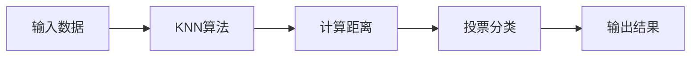
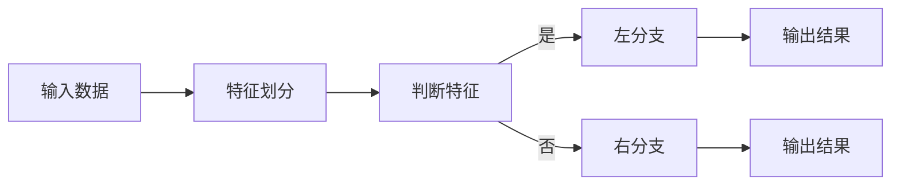
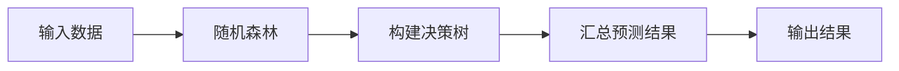
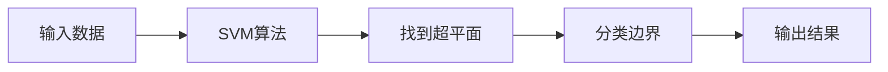
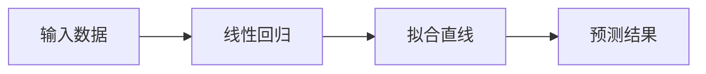
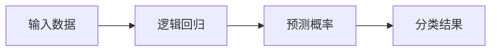
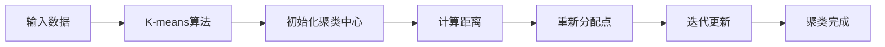
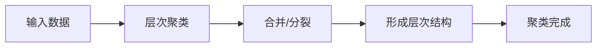
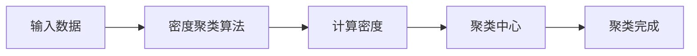
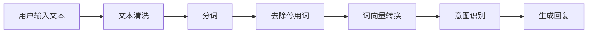

                 

### 第一部分：AI在电商客户服务中的应用基础

在数字化的今天，电子商务已经渗透到了我们生活的方方面面。然而，随着电商平台的竞争加剧，如何提升客户服务质量成为电商企业关注的焦点。人工智能（AI）的兴起为电商客户服务带来了前所未有的变革。本部分将深入探讨AI在电商客户服务中的应用基础，为读者揭开AI提升电商客户服务满意度的神秘面纱。

#### 第1章：AI在电商客户服务的概述

##### 1.1 AI在电商客户服务中的重要性

随着电商行业的发展，客户服务的需求日益增长。传统的客户服务方式已经难以满足消费者的期望，而AI技术的引入则为电商客户服务带来了新的可能。AI在电商客户服务中的重要性主要体现在以下几个方面：

###### 1.1.1 电商客户服务面临的挑战

- **客户需求多样化**：消费者的需求变得更加多样化，传统的人工客服难以在短时间内满足各种个性化需求。
- **客服规模庞大**：电商平台往往需要处理大量的客户咨询，人工客服的数量和效率难以跟上业务的增长。
- **服务成本高昂**：传统客服服务需要大量的人力成本，对企业而言是一项巨大的负担。

###### 1.1.2 AI技术如何解决这些问题

- **提升服务效率**：AI客服可以同时处理大量客户咨询，大大提高服务效率。
- **个性化服务**：通过数据分析，AI客服能够更好地了解客户需求，提供个性化的服务。
- **降低服务成本**：AI客服可以替代一部分人工客服，从而降低人力成本。

###### 1.1.3 AI在电商客户服务中的应用前景

随着技术的不断进步，AI在电商客户服务中的应用前景十分广阔。未来，AI有望实现更智能的客服体验，进一步提升客户满意度。

##### 1.2 AI在电商客户服务的应用场景

AI在电商客户服务中的应用场景丰富多样，以下是一些典型的应用：

###### 1.2.1 客户身份识别与验证

- **生物识别技术**：通过人脸识别、指纹识别等生物特征识别技术，提高客户身份验证的准确性。
- **多因子认证**：结合密码、手机验证等多种认证方式，确保客户账户的安全性。

###### 1.2.2 智能客服机器人

- **自然语言处理**：利用自然语言处理技术，实现与客户的智能对话。
- **情感分析**：通过情感分析技术，理解客户的情绪和需求，提供更贴心的服务。

###### 1.2.3 个性化推荐系统

- **协同过滤**：基于用户的历史行为和偏好，为用户推荐相关商品。
- **内容推荐**：通过分析商品的特征和描述，为用户推荐感兴趣的商品。

###### 1.2.4 风险管理与反欺诈

- **行为分析**：通过分析客户的购物行为，识别潜在的风险和欺诈行为。
- **实时监控**：利用实时数据分析，快速识别和处理异常情况。

##### 1.3 AI技术在电商客户服务中的核心原理

AI技术在电商客户服务中的应用离不开以下核心技术的支撑：

###### 1.3.1 机器学习算法

- **分类算法**：用于分类客户的咨询类型，如产品咨询、售后服务等。
- **聚类算法**：用于分析客户群体，为个性化推荐提供数据支持。
- **回归算法**：用于预测客户的购买行为，优化营销策略。

###### 1.3.2 自然语言处理技术

- **文本分类**：将客户的咨询文本分类到相应的类别中。
- **语义分析**：理解客户的咨询意图，提供更加精准的回复。
- **情感分析**：分析客户的情绪，提供情感化的服务。

###### 1.3.3 计算机视觉技术

- **图像识别**：识别客户的购物偏好，推荐相关商品。
- **人脸识别**：验证客户身份，提高服务安全性。

##### 1.4 AI在电商客户服务中的发展趋势

随着AI技术的不断进步，其在电商客户服务中的应用将更加深入和广泛。以下是一些发展趋势：

###### 1.4.1 技术进步带来的挑战与机遇

- **算法优化**：随着算法的不断发展，AI客服的智能化程度将进一步提高。
- **数据处理**：随着数据量的增加，如何高效地处理和分析数据成为关键挑战。

###### 1.4.2 未来应用场景的预测

- **全渠道服务**：AI客服将不仅仅局限于线上平台，还将拓展到线下门店，实现线上线下无缝对接。
- **智能客服决策**：通过大数据分析和机器学习，AI客服将能够自主决策，提供更加个性化的服务。

通过以上分析，我们可以看到AI技术在电商客户服务中具有重要的应用价值。在接下来的章节中，我们将深入探讨AI在电商客户服务中的具体应用，为电商企业提供实用的解决方案。

## 第一部分：AI在电商客户服务中的应用基础

### 第1章：AI在电商客户服务的概述

#### 1.1 AI在电商客户服务中的重要性

随着电商行业的迅猛发展，客户服务质量成为电商平台竞争力的关键因素之一。传统的客户服务方式由于人力成本高、响应速度慢，已无法满足消费者对快速、高效、个性化的服务需求。此时，AI技术的引入为电商客户服务带来了革命性的变革。

##### 1.1.1 电商客户服务面临的挑战

1. **客户需求多样化**：现代消费者拥有广泛的购物需求和偏好，他们期望能够快速获得个性化的服务。
2. **客服规模庞大**：电商平台每天需要处理海量的客户咨询，这给人工客服带来了巨大的工作压力。
3. **服务成本高昂**：人工客服的薪资、培训成本逐年上升，对于中小型电商平台来说，这是一项沉重的负担。

##### 1.1.2 AI技术如何解决这些问题

1. **提升服务效率**：AI客服可以同时处理大量客户咨询，自动分类问题，减少客服人员的重复劳动，从而提高整体工作效率。
2. **个性化服务**：AI客服通过大数据分析，能够深入了解客户的历史行为和偏好，从而提供个性化的服务建议，提升客户满意度。
3. **降低服务成本**：AI客服可以替代一部分人工客服，减少企业的人力成本，同时节省培训和维护成本。

##### 1.1.3 AI在电商客户服务中的应用前景

随着人工智能技术的不断进步，AI在电商客户服务中的应用前景十分广阔。未来，AI客服将更加智能化，能够处理更复杂的客户咨询，实现更高效的服务。同时，随着5G、物联网等技术的发展，AI客服将能够无缝接入多种渠道，提供更加全面的服务。

#### 1.2 AI在电商客户服务的应用场景

AI技术在电商客户服务中有着广泛的应用场景，以下是一些典型的应用：

##### 1.2.1 客户身份识别与验证

- **生物识别技术**：利用人脸识别、指纹识别等技术，提高客户身份验证的准确性和安全性。
- **多因子认证**：结合密码、手机验证等多种认证方式，确保客户账户的安全性。

##### 1.2.2 智能客服机器人

- **自然语言处理**：利用自然语言处理技术，实现与客户的智能对话，理解客户的意图和需求。
- **情感分析**：通过情感分析技术，分析客户的情绪，提供更加人性化的服务。

##### 1.2.3 个性化推荐系统

- **协同过滤**：基于用户的购物行为和偏好，为用户推荐相关的商品。
- **内容推荐**：通过分析商品的属性和描述，为用户推荐可能感兴趣的商品。

##### 1.2.4 风险管理与反欺诈

- **行为分析**：通过分析客户的购物行为，识别潜在的风险和欺诈行为。
- **实时监控**：利用实时数据分析，快速识别和处理异常情况。

#### 1.3 AI技术在电商客户服务中的核心原理

AI技术在电商客户服务中的应用，离不开以下核心技术的支撑：

##### 1.3.1 机器学习算法

- **分类算法**：用于分类客户的咨询内容，如产品咨询、售后服务等。
- **聚类算法**：用于分析客户群体，为个性化推荐提供数据支持。
- **回归算法**：用于预测客户的购买行为，优化营销策略。

##### 1.3.2 自然语言处理技术

- **文本分类**：将客户的咨询文本分类到相应的类别中。
- **语义分析**：理解客户的咨询意图，提供更加精准的回复。
- **情感分析**：分析客户的情绪，提供情感化的服务。

##### 1.3.3 计算机视觉技术

- **图像识别**：识别客户的购物偏好，推荐相关的商品。
- **人脸识别**：验证客户身份，提高服务安全性。

#### 1.4 AI在电商客户服务中的发展趋势

随着人工智能技术的不断进步，AI在电商客户服务中的应用将更加深入和广泛。以下是一些发展趋势：

##### 1.4.1 技术进步带来的挑战与机遇

- **算法优化**：随着算法的不断发展，AI客服的智能化程度将进一步提高。
- **数据处理**：随着数据量的增加，如何高效地处理和分析数据成为关键挑战。

##### 1.4.2 未来应用场景的预测

- **全渠道服务**：AI客服将不仅仅局限于线上平台，还将拓展到线下门店，实现线上线下无缝对接。
- **智能客服决策**：通过大数据分析和机器学习，AI客服将能够自主决策，提供更加个性化的服务。

通过以上分析，我们可以看到AI技术在电商客户服务中具有重要的应用价值。在接下来的章节中，我们将深入探讨AI在电商客户服务中的具体应用，为电商企业提供实用的解决方案。

### 第2章：机器学习算法在电商客户服务中的应用

#### 2.1 机器学习基础

##### 2.1.1 机器学习概述

机器学习（Machine Learning，ML）是人工智能（AI）的一个重要分支，它使计算机系统能够从数据中学习，从而进行决策和预测。机器学习的关键在于算法，这些算法能够从数据中提取特征，并使用这些特征来训练模型，使系统能够对未知数据进行预测。

##### 2.1.2 监督学习算法

监督学习（Supervised Learning）是机器学习中的一种类型，它使用已标记的数据集来训练模型。已标记的数据集意味着每个数据点都有一个相应的标签或输出，模型通过学习这些数据点来预测新的、未见过的数据点的标签。

- **分类算法**：用于将数据点分为不同的类别。常见的分类算法包括：
  - **K近邻算法（K-Nearest Neighbors，KNN）**：基于距离最近的K个邻居进行分类。
  - **决策树算法**：通过树形结构对数据进行分类。
  - **随机森林算法**：结合多棵决策树进行分类，提高模型的鲁棒性。
  - **支持向量机（Support Vector Machine，SVM）**：通过寻找超平面来最大化分类边界。

- **回归算法**：用于预测连续的数值输出。常见的回归算法包括：
  - **线性回归算法**：通过拟合一条直线来预测数值。
  - **逻辑回归算法**：一种特殊的线性回归，用于预测二分类问题。

##### 2.1.3 非监督学习算法

非监督学习（Unsupervised Learning）是另一种机器学习类型，它不使用标记的数据集。非监督学习的目标是发现数据中的内在结构和规律。

- **聚类算法**：用于将相似的数据点分组在一起。常见的聚类算法包括：
  - **K-means算法**：基于距离相似性进行聚类。
  - **层次聚类算法**：通过层次结构将数据点逐步聚类。
  - **密度聚类算法**：基于密度分布进行聚类。

#### 2.2 分类算法在电商客户服务中的应用

分类算法在电商客户服务中有着广泛的应用，以下是一些具体的分类算法及其在电商中的应用：

##### 2.2.1 K近邻算法（KNN）

KNN算法是一种简单但有效的分类算法，它基于“相似性”原理，即如果一个新数据点的K个最近邻居都属于某个类别，则该数据点也属于这个类别。

- **应用场景**：用于客户分类，例如根据客户的购物历史和行为特征，将客户分为高价值客户、一般客户等，以便进行有针对性的营销和服务。



##### 2.2.2 决策树算法

决策树算法通过一系列的决策节点来对数据进行分类。每个节点代表一个特征，每个分支代表该特征的取值。

- **应用场景**：用于产品分类，例如根据产品的价格、品牌、性能等特征，将产品分为高端、中端、低端产品，以便进行市场定位和价格策略的制定。



##### 2.2.3 随机森林算法

随机森林算法是一种集成学习方法，它通过构建多棵决策树并汇总它们的预测结果来提高模型的准确性。

- **应用场景**：用于客户细分，例如根据客户的购买行为和偏好，构建随机森林模型来预测客户的潜在购买倾向，从而进行精准营销。



##### 2.2.4 支持向量机算法（SVM）

SVM算法通过找到一个最佳的超平面，将不同类别的数据点分开。它特别适用于高维空间。

- **应用场景**：用于客户行为预测，例如根据客户的购买历史和浏览行为，使用SVM模型预测客户的购买概率，从而进行精准营销和客户保留。



#### 2.3 回归算法在电商客户服务中的应用

回归算法用于预测连续的数值输出，这在电商客户服务中有着广泛的应用，例如预测销售量、客户留存率等。

##### 2.3.1 线性回归算法

线性回归算法通过拟合一条直线来预测数值输出。

- **应用场景**：用于预测销售量，例如根据历史销售数据，使用线性回归模型预测未来某时间段的销售量，以便进行库存管理和营销策略的制定。



##### 2.3.2 逻辑回归算法

逻辑回归算法是一种特殊的线性回归，它用于预测二分类问题。

- **应用场景**：用于预测客户留存，例如根据客户的购买历史和行为特征，使用逻辑回归模型预测客户是否会再次购买，从而进行客户保留策略的制定。



#### 2.4 聚类算法在电商客户服务中的应用

聚类算法用于将相似的数据点分组在一起，这在电商客户服务中有着广泛的应用，例如客户细分和市场细分。

##### 2.4.1 K-means算法

K-means算法是一种基于距离的聚类方法，它将数据点分为K个簇，使得每个簇内的数据点之间距离最小，簇与簇之间距离最大。

- **应用场景**：用于客户细分，例如根据客户的购物行为和偏好，使用K-means算法将客户分为不同的群体，以便进行精准营销和服务。



##### 2.4.2 层次聚类算法

层次聚类算法通过逐步合并或分裂数据点，形成层次结构，用于聚类分析。

- **应用场景**：用于市场细分，例如根据消费者的购买习惯和偏好，使用层次聚类算法将市场划分为不同的细分市场，以便进行定制化营销策略。



##### 2.4.3 密度聚类算法

密度聚类算法通过计算数据点的密度分布来进行聚类，适用于非均匀分布的数据。

- **应用场景**：用于挖掘潜在客户，例如根据消费者的行为数据，使用密度聚类算法发现潜在的高价值客户，以便进行针对性的营销和服务。



通过以上机器学习算法的应用，电商客户服务可以更好地理解客户需求，提高服务质量和效率。在接下来的章节中，我们将继续探讨自然语言处理技术在电商客户服务中的应用。

### 第3章：自然语言处理技术在电商客户服务中的应用

#### 3.1 自然语言处理基础

自然语言处理（Natural Language Processing，NLP）是人工智能的一个分支，旨在使计算机能够理解和生成自然语言。NLP技术广泛应用于电商客户服务中，用于提升客户体验和服务质量。

##### 3.1.1 自然语言处理概述

自然语言处理涉及多个子领域，包括：

- **文本分类**：将文本数据分类到预定义的类别中，例如将客户咨询分类到产品咨询、售后服务等。
- **命名实体识别**：识别文本中的命名实体，如人名、地名、组织名等。
- **情感分析**：分析文本中的情感倾向，如正面、负面或中立。
- **实体识别**：识别文本中的特定实体，如商品名称、品牌等。
- **机器翻译**：将一种语言的文本翻译成另一种语言。

##### 3.1.2 词嵌入技术

词嵌入（Word Embedding）是将词汇映射到高维空间中的向量表示。词嵌入技术通过捕捉词汇之间的语义关系，使计算机能够更好地理解和处理自然语言。

- **Word2Vec**：一种基于神经网络的词嵌入技术，通过训练模型来生成词汇的向量表示。
- **GloVe**：全局向量表示（Global Vectors for Word Representation），通过训练单词和其上下文的关系来生成词向量。

##### 3.1.3 语言模型

语言模型（Language Model）是用于预测下一个单词或词汇的概率分布的模型。语言模型在电商客户服务中用于自动生成回复、智能客服机器人等应用。

- **n-gram模型**：一种简单的语言模型，基于n个连续单词的历史出现频率来预测下一个单词。
- **神经网络语言模型**：通过神经网络来捕捉复杂的语言结构，如长短时记忆网络（LSTM）、变换器（Transformer）等。

#### 3.2 基于自然语言处理的智能客服机器人

智能客服机器人是NLP技术在电商客户服务中的一个重要应用。智能客服机器人能够自动处理客户的咨询，提供24/7的服务，提高客户满意度。

##### 3.2.1 智能客服机器人概述

智能客服机器人通过NLP技术实现与客户的自然语言交互。其主要功能包括：

- **自动回复**：基于预定义的规则和语言模型，自动生成回复。
- **理解客户意图**：通过情感分析和实体识别，理解客户的咨询意图。
- **多轮对话**：支持多轮对话，逐步获取更多信息，提供更准确的回复。

##### 3.2.2 对话管理

对话管理（Dialogue Management）是智能客服机器人的核心功能，负责控制对话流程。对话管理包括以下几个关键步骤：

- **意图识别**：通过情感分析和实体识别，识别客户的意图。
- **上下文维护**：记录对话历史，以便在后续对话中引用。
- **对话策略**：根据意图和上下文，选择合适的回复策略。

##### 3.2.3 知识图谱

知识图谱（Knowledge Graph）是一种用于表示实体及其关系的图形结构。在智能客服机器人中，知识图谱用于提供丰富的信息，增强对话的准确性。

- **实体关系表示**：知识图谱将实体及其关系进行结构化表示，如“商品A属于品牌B”。
- **问答系统**：基于知识图谱，智能客服机器人可以回答关于实体和关系的问题。

#### 3.3 个性化推荐系统

个性化推荐系统（Personalized Recommendation System）是电商客户服务中的另一个重要应用。通过NLP技术，个性化推荐系统可以提供更准确的商品推荐，提高客户的购买意愿和满意度。

##### 3.3.1 推荐系统概述

个性化推荐系统基于用户的历史行为和偏好，为用户推荐相关的商品。推荐系统通常包括以下组成部分：

- **用户模型**：记录用户的历史行为和偏好，如浏览记录、购买记录等。
- **商品模型**：描述商品的特征和属性，如价格、品牌、分类等。
- **推荐算法**：根据用户模型和商品模型，生成推荐列表。

##### 3.3.2 协同过滤算法

协同过滤算法（Collaborative Filtering）是推荐系统中最常用的算法之一，它通过分析用户之间的相似性来推荐商品。

- **基于用户的协同过滤**：找到与目标用户最相似的邻居用户，推荐邻居用户喜欢的商品。
- **基于项目的协同过滤**：找到与目标商品最相似的其他商品，推荐给用户。

##### 3.3.3 内容推荐算法

内容推荐算法（Content-based Recommendation）通过分析商品的内容特征，为用户推荐相关的商品。

- **基于属性的推荐**：根据用户的历史行为和偏好，提取用户的属性，推荐具有相似属性的商品。
- **基于文本的推荐**：通过分析商品描述和评论，提取关键词和主题，为用户推荐相关的商品。

#### 3.4 情感分析在电商客户服务中的应用

情感分析（Sentiment Analysis）是NLP技术中的一个重要应用，它用于分析客户的情感倾向，提供更个性化的服务。

##### 3.4.1 情感分析概述

情感分析通过分析文本中的情感倾向，判断文本是正面、负面还是中立。情感分析通常包括以下步骤：

- **文本预处理**：对文本进行清洗和分词，提取有用的信息。
- **情感分类**：使用机器学习算法，将文本分类为正面、负面或中立。
- **情感极性分析**：对文本进行情感极性分析，判断情感的强度。

##### 3.4.2 情感分类算法

情感分类算法通过分析文本的语法和语义特征，判断文本的情感倾向。

- **基于规则的方法**：使用预定义的规则进行情感分类。
- **基于机器学习的方法**：使用监督学习算法，如支持向量机（SVM）、随机森林（Random Forest）等，进行情感分类。
- **基于深度学习的方法**：使用深度学习模型，如卷积神经网络（CNN）、长短时记忆网络（LSTM）等，进行情感分类。

##### 3.4.3 情感极性分析

情感极性分析通过分析文本的情感极性，判断情感的强度。情感极性分析通常包括以下步骤：

- **情感极性分类**：将文本分类为正面、负面或中立。
- **情感强度评估**：对情感极性进行量化，如使用正负分数表示情感的强度。

通过自然语言处理技术在电商客户服务中的应用，企业可以更好地理解客户的需求和情感，提供更个性化的服务和推荐。在接下来的章节中，我们将继续探讨AI在电商客户服务中的具体应用案例。

### 第4章：AI在电商客服机器人中的应用

#### 4.1 电商客服机器人概述

电商客服机器人是AI技术在电商客户服务中的一个重要应用，它通过自然语言处理（NLP）和机器学习技术，提供自动化、高效且个性化的客户服务。电商客服机器人能够处理大量客户的咨询请求，快速响应，提供准确的信息和解决方案，从而提升客户满意度和忠诚度。

##### 4.1.1 电商客服机器人的功能

电商客服机器人的主要功能包括：

1. **自动回复**：基于预定义的规则和模板，机器人能够自动生成回复，提高客服效率。
2. **智能对话**：通过NLP技术，机器人能够理解客户的意图和问题，提供准确且个性化的回答。
3. **情感分析**：通过情感分析技术，机器人能够识别客户的情绪，提供贴心的服务。
4. **多轮对话**：支持多轮对话，逐步获取更多信息，提供更准确的回复。
5. **知识库管理**：机器人可以维护和更新知识库，提供最新的商品信息和公司政策。

##### 4.1.2 电商客服机器人的架构

电商客服机器人通常包括以下几个主要组件：

1. **前端界面**：与用户进行交互的界面，可以是网站、APP或微信聊天窗口等。
2. **对话管理模块**：负责管理对话流程，包括意图识别、上下文维护和对话策略。
3. **自然语言处理模块**：用于处理自然语言输入，包括文本预处理、情感分析和意图识别。
4. **知识库**：存储各种问题的答案和解决方案，机器人可以从知识库中获取信息。
5. **后端服务**：包括数据库、计算资源和API接口，用于支持机器人的运行和扩展。

##### 4.2 电商客服机器人开发实战

##### 4.2.1 环境搭建

要开发一个电商客服机器人，首先需要搭建一个合适的开发环境。以下是一个基本的开发环境搭建步骤：

1. **选择开发框架**：根据项目需求选择合适的开发框架，如Rasa、ChatterBot等。
2. **安装依赖**：安装开发框架所需的依赖库，如Python、TensorFlow、PyTorch等。
3. **配置数据库**：配置用于存储用户数据和对话记录的数据库，如MySQL、MongoDB等。
4. **搭建服务器**：配置服务器，用于部署和运行机器人，如使用Docker容器化技术。

##### 4.2.2 基础功能实现

实现电商客服机器人基础功能包括以下几个方面：

1. **文本预处理**：对用户输入的文本进行清洗和分词，提取有用的信息。
2. **情感分析**：使用情感分析技术识别用户的情绪，如开心、愤怒等。
3. **意图识别**：通过训练模型，识别用户的意图，如询问商品信息、投诉建议等。
4. **自动回复**：基于预定义的规则和模板，生成自动回复。
5. **多轮对话**：支持多轮对话，逐步获取更多信息，提供更准确的回复。

以下是一个简单的文本预处理流程：



##### 4.2.3 高级功能实现

高级功能的实现需要更复杂的算法和模型，以下是一些高级功能的实现方法：

1. **个性化推荐**：通过分析用户的历史行为和偏好，为用户推荐相关的商品。
2. **多语言支持**：使用机器翻译技术，实现多语言交互。
3. **图像识别**：通过图像识别技术，识别用户上传的图片，提供更直观的服务。
4. **语音交互**：通过语音识别和语音合成技术，实现语音交互。

以下是一个简单的个性化推荐算法实现：

```python
# 假设用户历史行为数据存储在user_behavior中
user_behavior = {
    'user1': {'item1': 5, 'item2': 3, 'item3': 4},
    'user2': {'item4': 2, 'item5': 5, 'item6': 3},
    # ...
}

def recommend_items(user_id):
    # 计算用户的平均评分
    user_average = sum(user_behavior[user_id].values()) / len(user_behavior[user_id].keys())
    
    # 为用户推荐评分高于平均值的商品
    recommendations = []
    for item, score in user_behavior[user_id].items():
        if score > user_average:
            recommendations.append(item)
    
    return recommendations

# 示例：为用户1推荐商品
recommendations = recommend_items('user1')
print(recommendations)
```

##### 4.3 电商客服机器人性能评估

评估电商客服机器人的性能是确保其有效性和可靠性的关键。以下是一些常用的评估指标和方法：

1. **准确率**：评估机器人正确识别用户意图和生成回复的能力。准确率越高，说明机器人性能越好。
2. **召回率**：评估机器人能够识别出的用户意图占所有实际意图的比例。召回率越高，说明机器人能够更全面地理解用户。
3. **F1值**：综合评估准确率和召回率，F1值是准确率和召回率的调和平均数，用于衡量机器人性能的平衡性。
4. **用户满意度**：通过用户反馈和满意度调查，评估机器人提供服务的用户满意度。

以下是一个简单的性能评估示例：

```python
from sklearn.metrics import classification_report

# 假设ground_truth为实际意图，predictions为机器人预测的意图
ground_truth = ['商品咨询', '售后服务', '投诉建议', '商品咨询']
predictions = ['商品咨询', '投诉建议', '投诉建议', '商品咨询']

report = classification_report(ground_truth, predictions)
print(report)
```

##### 4.4 电商客服机器人案例分析

##### 4.4.1 案例一：某电商平台客服机器人案例

某大型电商平台引入了AI客服机器人，通过以下步骤实现了高效客户服务：

1. **数据收集**：收集用户的历史行为数据，包括购物记录、咨询记录等。
2. **模型训练**：使用收集的数据训练意图识别模型，实现高效意图识别。
3. **系统部署**：将训练好的模型部署到生产环境，提供实时客服服务。
4. **用户反馈**：收集用户反馈，不断优化和改进机器人性能。

通过引入AI客服机器人，该电商平台实现了以下成果：

- **客户满意度提升**：用户反馈表明，客服机器人的响应速度和准确性显著提高，客户满意度显著提升。
- **服务效率提升**：机器人能够同时处理大量客户咨询，客服人员的工作量显著减少。
- **运营成本降低**：通过自动化处理客户咨询，企业的人力成本显著降低。

##### 4.4.2 案例二：某电商平台客服机器人案例

另一家电商平台在引入AI客服机器人时，采用了以下策略：

1. **多轮对话**：通过支持多轮对话，机器人能够获取更多用户信息，提供更准确的回答。
2. **情感分析**：通过情感分析，机器人能够识别用户的情绪，提供更个性化的服务。
3. **知识图谱**：使用知识图谱技术，机器人能够提供丰富的信息，增强用户交互体验。

通过这些策略，该电商平台实现了以下成果：

- **用户体验优化**：用户在互动中感受到更加贴心的服务，用户体验显著提升。
- **业务增长**：通过个性化推荐和智能客服，企业的销售额和用户转化率显著提升。
- **运营优化**：通过自动化处理客户咨询，企业的运营效率显著提升。

通过以上案例，我们可以看到AI客服机器人在电商客户服务中的应用效果显著。在未来的发展中，随着AI技术的不断进步，电商客服机器人将发挥更加重要的作用，为电商平台提供更高效、个性化的客户服务。

### 第5章：个性化推荐系统在电商客户服务中的应用

#### 5.1 个性化推荐系统概述

个性化推荐系统是电商客户服务中的一项重要技术，它通过分析用户的历史行为和偏好，为用户推荐相关的商品或服务，从而提高用户的购物体验和满意度。个性化推荐系统的核心在于“个性化”，即根据用户的独特需求和兴趣，提供定制化的推荐内容。

##### 5.1.1 个性化推荐系统的作用

个性化推荐系统在电商客户服务中具有以下几个重要作用：

1. **提升用户体验**：通过提供与用户兴趣和需求相关的推荐，个性化推荐系统能够提升用户的购物体验，减少用户在搜索和浏览过程中的时间成本。
2. **增加销售额**：个性化推荐系统能够帮助电商平台发现潜在的销售机会，通过精准的推荐，提高用户的购买转化率，从而增加销售额。
3. **降低运营成本**：通过自动化推荐，个性化推荐系统可以减少人工客服的工作量，降低运营成本。

##### 5.1.2 个性化推荐系统的分类

个性化推荐系统根据不同的方法和技术，可以分为以下几类：

1. **基于内容的推荐**：这种推荐方法通过分析商品的属性和描述，将用户可能感兴趣的商品推荐给用户。例如，如果用户之前浏览了某一类商品，推荐系统可能会推荐同一类别的其他商品。

2. **基于协同过滤的推荐**：协同过滤（Collaborative Filtering）是推荐系统中最常用的方法之一，它通过分析用户之间的相似性来推荐商品。协同过滤分为两种类型：

   - **基于用户的协同过滤**：找到与目标用户相似的其他用户，推荐这些用户喜欢的商品。
   - **基于项目的协同过滤**：找到与目标商品相似的其他商品，推荐给用户。

3. **混合推荐**：混合推荐方法结合了基于内容和基于协同过滤的推荐方法，通过综合两种方法的优点，提高推荐系统的准确性和多样性。

#### 5.2 协同过滤算法在电商客户服务中的应用

协同过滤算法是推荐系统中的核心技术之一，它通过分析用户之间的相似性或商品之间的相似性来生成推荐列表。以下详细介绍协同过滤算法在电商客户服务中的应用。

##### 5.2.1 协同过滤算法概述

协同过滤算法可以分为两类：基于用户的协同过滤和基于项目的协同过滤。

1. **基于用户的协同过滤**：这种方法通过分析用户之间的相似度，找到与目标用户相似的用户，推荐这些用户喜欢的商品。计算用户相似度的常用方法包括：

   - **用户-用户基于余弦相似度的协同过滤**：
     $$\text{similarity}(u_i, u_j) = \frac{\text{dot}(r_i, r_j)}{\|r_i\|\|r_j\|}$$
     其中，$r_i$ 和 $r_j$ 分别表示用户 $u_i$ 和 $u_j$ 的评分向量，$\text{dot}$ 表示点积，$\|\|$ 表示向量的模。

   - **用户-用户基于Pearson相关系数的协同过滤**：
     $$\text{similarity}(u_i, u_j) = \frac{\text{cov}(r_i, r_j)}{\sqrt{\text{var}(r_i)\text{var}(r_j)}}$$
     其中，$\text{cov}$ 表示协方差，$\text{var}$ 表示方差。

2. **基于项目的协同过滤**：这种方法通过分析商品之间的相似度，找到与目标商品相似的其他商品，推荐给用户。计算商品相似度的常用方法包括：

   - **项目-项目基于余弦相似度的协同过滤**：
     $$\text{similarity}(i, j) = \frac{\text{dot}(r_i, r_j)}{\|r_i\|\|r_j\|}$$
     其中，$r_i$ 和 $r_j$ 分别表示商品 $i$ 和 $j$ 的用户评分向量。

   - **项目-项目基于Jaccard相似度的协同过滤**：
     $$\text{similarity}(i, j) = 1 - \frac{|S_i \cup S_j|}{|S_i \cap S_j|}$$
     其中，$S_i$ 和 $S_j$ 分别表示商品 $i$ 和 $j$ 的用户集合。

##### 5.2.2 基于用户的协同过滤算法

基于用户的协同过滤算法通过以下步骤生成推荐列表：

1. **计算用户相似度**：根据用户评分数据计算用户之间的相似度，选择相似度最高的用户作为邻居。
2. **预测邻居评分**：利用用户之间的相似度预测邻居用户对目标用户的评分。
3. **生成推荐列表**：根据预测的评分，为用户生成推荐列表。

以下是基于用户的协同过滤算法的伪代码：

```python
# 输入：用户评分矩阵R，目标用户id u，邻居数量k
# 输出：推荐列表

# 步骤1：计算用户相似度
similarity_matrix = []
for u_neighbor in range(num_users):
    if u_neighbor != u:
        similarity = calculate_similarity(R[u], R[u_neighbor])
        similarity_matrix.append(similarity)

# 步骤2：选择相似度最高的邻居
neighbors = select_top_k(neighbors, k)

# 步骤3：预测邻居评分
predicted_ratings = []
for neighbor in neighbors:
    predicted_rating = predict_rating(u, neighbor, similarity_matrix)
    predicted_ratings.append(predicted_rating)

# 步骤4：生成推荐列表
recommendations = generate_recommendations(predicted_ratings)
return recommendations
```

##### 5.2.3 基于项目的协同过滤算法

基于项目的协同过滤算法通过以下步骤生成推荐列表：

1. **计算商品相似度**：根据用户评分数据计算商品之间的相似度，选择相似度最高的商品作为邻居。
2. **预测邻居评分**：利用商品之间的相似度预测邻居用户对目标用户的评分。
3. **生成推荐列表**：根据预测的评分，为用户生成推荐列表。

以下是基于项目的协同过滤算法的伪代码：

```python
# 输入：用户评分矩阵R，目标用户id u，邻居数量k
# 输出：推荐列表

# 步骤1：计算商品相似度
similarity_matrix = []
for item_neighbor in range(num_items):
    if item_neighbor != item:
        similarity = calculate_similarity(R[u][item_neighbor], R[u][item])
        similarity_matrix.append(similarity)

# 步骤2：选择相似度最高的邻居
neighbors = select_top_k(neighbors, k)

# 步骤3：预测邻居评分
predicted_ratings = []
for neighbor in neighbors:
    predicted_rating = predict_rating(u, neighbor, similarity_matrix)
    predicted_ratings.append(predicted_rating)

# 步骤4：生成推荐列表
recommendations = generate_recommendations(predicted_ratings)
return recommendations
```

通过以上介绍，我们可以看到协同过滤算法在电商客户服务中的应用具有重要意义。在接下来的章节中，我们将继续探讨内容推荐算法及其在电商客户服务中的应用。

### 第5章：个性化推荐系统在电商客户服务中的应用（续）

#### 5.3 内容推荐算法在电商客户服务中的应用

内容推荐算法是电商客户服务中另一种重要的推荐方法，它与协同过滤算法不同，主要基于商品的内容特征和用户的兴趣特征来生成推荐。内容推荐算法可以提供更加个性化和精准的推荐结果，从而提高用户的满意度和转化率。

##### 5.3.1 内容推荐算法概述

内容推荐算法的核心思想是通过分析商品和用户的特征信息，找到两者之间的相关性，并根据相关性生成推荐列表。以下是几种常见的内容推荐算法：

1. **基于属性的推荐**：这种方法通过分析商品的属性（如颜色、尺寸、价格等）和用户的偏好，为用户推荐具有相似属性的商品。

2. **基于文本的推荐**：这种方法通过分析商品描述和用户评论，提取关键词和主题，为用户推荐相关的内容。例如，如果用户浏览了某个商品并给出了正面评论，推荐系统可能会推荐具有相似描述的商品。

3. **基于模型的推荐**：这种方法使用机器学习模型来预测用户对商品的潜在兴趣，例如使用协同过滤模型、矩阵分解模型等。

##### 5.3.2 基于属性的推荐算法

基于属性的推荐算法是一种简单但有效的方法，它通过分析商品和用户之间的属性匹配来生成推荐。以下是一个基于属性的推荐算法的示例：

```python
# 输入：用户属性矩阵U，商品属性矩阵V，用户id u，商品id i
# 输出：推荐分数

def content_based_recommendation(u, i):
    # 步骤1：计算用户和商品的相似度
    similarity = calculate_similarity(U[u], V[i])
    
    # 步骤2：计算推荐分数
    recommendation_score = similarity * user_preference[u] * item_popularity[i]
    
    return recommendation_score
```

在上述算法中，`U` 和 `V` 分别表示用户属性矩阵和商品属性矩阵，`u` 和 `i` 分别表示用户和商品，`user_preference[u]` 和 `item_popularity[i]` 分别表示用户对商品的偏好和商品的受欢迎程度。

##### 5.3.3 基于文本的推荐算法

基于文本的推荐算法通过分析商品描述和用户评论，提取关键词和主题，为用户推荐相关的内容。以下是一个基于文本的推荐算法的示例：

```python
# 输入：用户评论列表C，商品描述列表D，用户id u，商品id i
# 输出：推荐分数

from sklearn.feature_extraction.text import TfidfVectorizer
from sklearn.metrics.pairwise import cosine_similarity

def text_based_recommendation(u, i):
    # 步骤1：将用户评论和商品描述转换为向量
    user_reviews_vector = TfidfVectorizer().fit_transform(C[u])
    item_description_vector = TfidfVectorizer().fit_transform([D[i]])
    
    # 步骤2：计算相似度
    similarity = cosine_similarity(user_reviews_vector, item_description_vector)
    
    # 步骤3：计算推荐分数
    recommendation_score = similarity[0][0] * user_engagement[u] * item_popularity[i]
    
    return recommendation_score
```

在上述算法中，`C` 和 `D` 分别表示用户评论列表和商品描述列表，`u` 和 `i` 分别表示用户和商品，`user_engagement[u]` 和 `item_popularity[i]` 分别表示用户的活跃程度和商品的受欢迎程度。

##### 5.3.4 混合推荐算法

为了提高推荐系统的性能和准确性，可以采用混合推荐算法，结合基于属性和基于文本的推荐方法。以下是一个简单的混合推荐算法示例：

```python
# 输入：用户属性矩阵U，商品属性矩阵V，用户评论列表C，商品描述列表D，用户id u，商品id i
# 输出：推荐分数

def hybrid_recommendation(u, i):
    # 步骤1：计算基于属性的推荐分数
    attribute_score = content_based_recommendation(u, i)
    
    # 步骤2：计算基于文本的推荐分数
    text_score = text_based_recommendation(u, i)
    
    # 步骤3：计算总推荐分数
    recommendation_score = (attribute_score + text_score) / 2
    
    return recommendation_score
```

通过以上算法，电商客户服务可以提供更加个性化和精准的推荐，从而提升用户的购物体验和满意度。在接下来的章节中，我们将进一步探讨情感分析在电商客户服务中的应用。

### 第6章：情感分析在电商客户服务中的应用

#### 6.1 情感分析概述

情感分析（Sentiment Analysis），也称为意见挖掘，是一种利用自然语言处理（NLP）和机器学习技术，从文本中识别和提取情感倾向的过程。情感分析在电商客户服务中扮演着关键角色，它可以帮助企业了解客户的情感状态，优化客户体验，并提高客户满意度。

##### 6.1.1 情感分析的作用

情感分析在电商客户服务中的作用主要体现在以下几个方面：

1. **客户满意度评估**：通过对客户评论和反馈的情感分析，企业可以了解客户对产品的满意程度，及时发现产品和服务中的问题，从而提升整体服务质量。

2. **市场研究**：情感分析可以为企业提供有关消费者情绪趋势和需求的信息，帮助企业制定更有针对性的市场策略。

3. **个性化服务**：通过分析客户的情感倾向，企业可以为不同情感倾向的客户提供个性化的服务和建议，提高客户的忠诚度。

4. **产品改进**：情感分析可以帮助企业识别哪些产品或服务受到负面评价，从而有针对性地进行产品改进。

##### 6.1.2 情感分析的方法

情感分析通常包括以下几个步骤：

1. **数据收集**：收集客户评论、产品评价、社交媒体帖子等文本数据。

2. **数据预处理**：对收集的文本数据清洗，去除无关信息（如HTML标签、停用词等），并进行分词和词性标注。

3. **特征提取**：将预处理后的文本转换为机器学习算法可以处理的特征向量。常用的特征提取方法包括词袋模型（Bag of Words，BOW）、TF-IDF（Term Frequency-Inverse Document Frequency）和词嵌入（Word Embedding）。

4. **情感分类**：使用分类算法（如朴素贝叶斯、支持向量机、随机森林和深度学习模型）对文本进行情感分类，将文本分为正面、负面或中性。

5. **情感极性分析**：进一步分析文本的情感极性，确定情感的强度，如“非常满意”、“有点不满意”等。

##### 6.2 情感分类算法在电商客户服务中的应用

情感分类算法是情感分析的核心，它将文本分类为正面、负面或中性。以下介绍几种常见的情感分类算法：

1. **朴素贝叶斯算法**：朴素贝叶斯是一种基于贝叶斯定理的简单分类算法，它假设特征之间相互独立。在情感分类中，朴素贝叶斯通过计算每个类别的条件概率，选择概率最大的类别作为预测结果。

2. **支持向量机（SVM）**：SVM是一种基于间隔最大化的分类算法，它通过找到一个最优的超平面来分离不同类别的数据点。在情感分类中，SVM通过训练模型来对文本进行分类。

3. **随机森林（Random Forest）**：随机森林是一种基于决策树集成的算法，它通过构建多棵决策树并汇总它们的预测结果来提高模型的准确性和鲁棒性。在情感分类中，随机森林可以处理大量特征，适用于复杂文本数据的分类。

4. **深度学习模型**：深度学习模型（如卷积神经网络（CNN）、长短时记忆网络（LSTM）和变换器（Transformer））在情感分类中表现优异，它们能够捕捉文本的深层结构和语义关系。

以下是一个基于朴素贝叶斯情感分类算法的伪代码示例：

```python
# 输入：训练集D，测试集T
# 输出：分类结果

# 步骤1：训练朴素贝叶斯模型
model = train_naive_bayes(D)

# 步骤2：对测试集进行情感分类
predictions = []
for text in T:
    sentiment = model.classify(text)
    predictions.append(sentiment)

# 步骤3：评估分类结果
accuracy = evaluate_predictions(predictions, T)
print("Accuracy:", accuracy)
```

##### 6.3 情感极性分析在电商客户服务中的应用

情感极性分析是情感分析中的一个重要分支，它不仅判断文本是否为正面、负面或中性，还分析情感的强度。情感极性分析可以帮助企业了解客户对产品的具体评价，从而采取相应的措施。

1. **基于规则的极性分析**：这种方法通过预定义的规则和标签来分析情感的强度。例如，如果文本中包含“非常满意”这样的词汇，则认为情感强度为高。

2. **基于机器学习的极性分析**：这种方法使用机器学习算法来预测情感的强度。例如，可以使用回归算法来预测情感的极性分数，分数越高，情感强度越高。

以下是一个基于机器学习情感极性分析算法的伪代码示例：

```python
# 输入：训练集D，测试集T
# 输出：情感极性分数

# 步骤1：训练极性分析模型
model = train_sentiment_polarity(D)

# 步骤2：对测试集进行情感极性分析
polarity_scores = []
for text in T:
    score = model.predict_polarity_score(text)
    polarity_scores.append(score)

# 步骤3：分析情感极性
for score in polarity_scores:
    if score > 0.5:
        sentiment = "Positive"
    elif score < -0.5:
        sentiment = "Negative"
    else:
        sentiment = "Neutral"
    print("Text:", text, "Sentiment:", sentiment)
```

通过情感分类和情感极性分析，电商客户服务可以更好地理解客户情感，优化服务策略，提升客户满意度。在接下来的章节中，我们将探讨AI在电商客户服务中的风险管理与反欺诈应用。

### 第7章：AI在电商客户服务中的风险管理与反欺诈

#### 7.1 风险管理与反欺诈概述

在电子商务领域，风险管理与反欺诈是一项至关重要的任务。随着网络购物的普及，欺诈行为日益增多，这不仅损害了消费者的利益，也严重影响了电商平台的声誉和运营。因此，采用AI技术进行风险管理与反欺诈显得尤为重要。

##### 7.1.1 风险管理与反欺诈的重要性

- **保护消费者权益**：有效的风险管理与反欺诈措施可以确保消费者的支付安全，减少因欺诈导致的财务损失。
- **维护平台声誉**：防止欺诈行为的发生，有助于维护电商平台的公信力和用户信任。
- **提升运营效率**：AI技术能够自动化识别和阻止欺诈行为，减轻人工处理的负担，提高运营效率。

##### 7.1.2 风险管理与反欺诈的方法

AI技术在风险管理与反欺诈中的应用主要包括以下几种方法：

- **行为分析**：通过对用户行为的监测和分析，识别异常行为模式，如频繁的登录尝试、不寻常的交易等。
- **实时监控**：利用实时数据分析技术，对交易进行实时监控，发现并阻止潜在的风险和欺诈行为。
- **机器学习模型**：通过训练机器学习模型，对历史数据进行分析，识别欺诈模式和风险信号。
- **多因子认证**：结合多种认证方式（如密码、短信验证、生物识别等），提高账户安全性。

#### 7.2 机器学习在风险管理与反欺诈中的应用

机器学习技术在风险管理与反欺诈中的应用，使得系统能够从历史数据中学习并预测潜在的风险。以下是一些关键的机器学习应用：

##### 7.2.1 机器学习概述

机器学习（Machine Learning，ML）是一种让计算机系统从数据中学习，并做出决策的技术。机器学习主要包括两种类型：

- **监督学习（Supervised Learning）**：通过已标记的数据集训练模型，以便对新的数据进行预测。例如，通过历史交易数据来训练模型，预测未来的交易是否为欺诈。
- **非监督学习（Unsupervised Learning）**：没有已标记的数据集，模型通过分析数据，寻找数据中的结构和模式。例如，通过分析用户行为数据，识别出异常行为模式。

##### 7.2.2 监督学习在风险管理与反欺诈中的应用

监督学习在风险管理与反欺诈中有着广泛的应用，以下是一些具体的算法：

1. **逻辑回归（Logistic Regression）**：逻辑回归是一种常用的分类算法，通过构建概率模型，预测交易是否为欺诈。逻辑回归模型的伪代码如下：

```python
# 输入：特征矩阵X，标签向量y
# 输出：欺诈概率预测

# 步骤1：初始化模型参数
w = initialize_parameters()

# 步骤2：迭代优化模型参数
for epoch in range(num_epochs):
    for x, y in data_loader(X, y):
        prediction = sigmoid(dot(x, w))
        loss = logistic_loss(y, prediction)
        gradient = compute_gradient(x, y, prediction)
        w -= learning_rate * gradient

# 步骤3：预测欺诈概率
def predict(x):
    return sigmoid(dot(x, w))

# 测试模型
predictions = [predict(x) for x in test_data]
evaluate_predictions(predictions, test_labels)
```

2. **决策树（Decision Tree）**：决策树通过一系列的决策规则来分类数据，适合处理高维数据。决策树的伪代码如下：

```python
# 输入：特征矩阵X，标签向量y
# 输出：决策树模型

def build_tree(X, y):
    # 步骤1：计算信息增益
    gain = calculate_entropy(y) - calculate_information_gain(y, X[:, feature])

    # 步骤2：选择最优特征
    best_feature = select_best_feature(X, y, gain)

    # 步骤3：递归构建子树
    for value in unique_values(X[:, best_feature]):
        left subtree = build_tree(X[X[:, best_feature] == value], y[X[:, best_feature] == value])
        right subtree = build_tree(X[X[:, best_feature] != value], y[X[:, best_feature] != value])

    return TreeNode(feature=best_feature, threshold=value, left=left_subtree, right=right_subtree)

# 测试模型
def classify实例(node, x):
    if is_leaf(node):
        return node.label
    if x[node.feature] <= node.threshold:
        return classify实例(node.left, x)
    else:
        return classify实例(node.right, x)

# 测试数据
predictions = [classify实例(root, x) for x in test_data]
evaluate_predictions(predictions, test_labels)
```

3. **随机森林（Random Forest）**：随机森林是一种基于决策树的集成学习方法，通过构建多棵决策树并汇总它们的预测结果来提高模型的准确性和鲁棒性。随机森林的伪代码如下：

```python
# 输入：特征矩阵X，标签向量y，树的数量n
# 输出：随机森林模型

def build_random_forest(X, y, n):
    forests = []
    for _ in range(n):
        # 步骤1：随机抽取特征子集
        features = random.sample(range(num_features), num_features // 2)

        # 步骤2：随机抽样训练数据
        X_subset, y_subset = random_subset(X, y)

        # 步骤3：构建单棵决策树
        tree = build_tree(X_subset, y_subset)

        # 步骤4：添加到森林
        forests.append(tree)

    return forests

# 预测
def predict(forests, x):
    predictions = [classify实例(tree, x) for tree in forests]
    return majority_vote(predictions)

# 测试模型
predictions = [predict(forests, x) for x in test_data]
evaluate_predictions(predictions, test_labels)
```

##### 7.2.3 非监督学习在风险管理与反欺诈中的应用

非监督学习在风险管理与反欺诈中的应用主要包括聚类和异常检测等。

1. **聚类算法**：聚类算法可以将相似的用户或交易分为一组，帮助识别潜在的欺诈群体。常见的聚类算法有K-means、层次聚类等。

   - **K-means算法**：K-means算法是一种基于距离的聚类方法，将数据分为K个簇。算法伪代码如下：

     ```python
     # 输入：数据集X，簇数量K
     # 输出：聚类结果

     def k_means(X, K):
         # 步骤1：初始化聚类中心
         centroids = initialize_centroids(X, K)

         # 步骤2：迭代更新聚类中心
         for _ in range(num_iterations):
             # 步骤2.1：分配数据点到最近的簇
             clusters = assign_points_to_clusters(X, centroids)

             # 步骤2.2：更新聚类中心
             centroids = update_centroids(clusters, K)

         return centroids

     # 测试模型
     centroids = k_means(X, K)
     ```

   - **层次聚类算法**：层次聚类算法通过层次结构逐步聚类，适用于数据结构复杂的场景。算法伪代码如下：

     ```python
     # 输入：数据集X
     # 输出：聚类层次结构

     def hierarchical_clustering(X):
         # 步骤1：初始化层次结构
         hierarchy = initialize_hierarchy(X)

         # 步骤2：逐步合并或分裂聚类
         while not_is_leaf(hierarchy):
             # 步骤2.1：选择最近的聚类合并
             new_cluster = merge_closest_clusters(hierarchy)

             # 步骤2.2：更新层次结构
             hierarchy = update_hierarchy(hierarchy, new_cluster)

         return hierarchy

     # 测试模型
     hierarchy = hierarchical_clustering(X)
     ```

2. **异常检测算法**：异常检测算法用于识别数据中的异常值或异常模式，有助于发现潜在的欺诈行为。常见的异常检测算法有孤立森林（Isolation Forest）、局部异常因子（Local Outlier Factor，LOF）等。

   - **孤立森林算法**：孤立森林算法通过随机抽样和隔离节点来识别异常值。算法伪代码如下：

     ```python
     # 输入：数据集X
     # 输出：异常分数

     def isolation_forest(X):
         # 步骤1：初始化孤立森林
         forest = initialize_isolation_forest(X)

         # 步骤2：计算异常分数
         scores = []
         for x in X:
             score = calculate_score(x, forest)
             scores.append(score)

         return scores

     # 测试模型
     scores = isolation_forest(X)
     ```

   - **局部异常因子算法**：局部异常因子算法通过比较数据点与其邻居的距离来识别异常值。算法伪代码如下：

     ```python
     # 输入：数据集X，邻居数量k
     # 输出：异常分数

     def local_outlier_factor(X, k):
         # 步骤1：计算局部异常因子
         lof = calculate_local_outlier_factor(X, k)

         # 步骤2：计算异常分数
         scores = [lof(x) for x in X]

         return scores

     # 测试模型
     scores = local_outlier_factor(X, k)
     ```

通过上述机器学习和非监督学习技术，电商客户服务可以更有效地识别和防范欺诈行为，保护消费者和平台的利益。在接下来的章节中，我们将进一步探讨AI在电商客户服务中的应用前景。

### 第8章：AI在电商客户服务中的应用前景

随着人工智能技术的快速发展，AI在电商客户服务中的应用前景日益广阔。以下从技术进步、行业需求和应用趋势三个方面，探讨AI在电商客户服务中的未来发展方向。

#### 8.1 技术进步带来的挑战与机遇

##### 8.1.1 人工智能技术的快速发展

人工智能技术的快速发展为电商客户服务带来了前所未有的机遇。例如，深度学习技术的应用使得智能客服机器人的对话能力大幅提升，自然语言处理（NLP）技术的进步使得情感分析和语义理解更加精准，计算机视觉技术的提升使得图像识别和视频分析更加高效。

##### 8.1.2 挑战

1. **数据处理**：随着数据量的激增，如何高效地处理和分析大量数据成为关键挑战。数据预处理、数据存储和数据安全等问题需要得到有效解决。
2. **算法优化**：虽然AI技术在电商客户服务中的应用取得了显著成果，但如何进一步提高算法的准确性和效率，仍是需要持续关注和解决的问题。
3. **技术更新**：AI技术更新迅速，企业需要不断跟进最新技术，确保其在电商客户服务中的应用始终保持领先地位。

##### 8.1.3 机遇

1. **个性化服务**：随着AI技术的进步，电商客户服务可以提供更加个性化的服务，满足消费者的多样化需求。
2. **全渠道整合**：通过AI技术，电商平台可以整合线上线下渠道，提供无缝衔接的服务体验。
3. **智能化决策**：AI技术可以帮助企业实现智能化决策，优化运营策略，提高业务效率。

#### 8.2 电商行业对AI技术的需求

随着电商行业的快速发展，企业对AI技术的需求日益增长。以下从客户体验、运营效率和数据分析三个方面，分析电商行业对AI技术的需求。

##### 8.2.1 客户体验

1. **个性化推荐**：通过AI技术，电商平台可以提供个性化的商品推荐，提高用户购物体验和满意度。
2. **智能客服**：AI客服机器人能够24/7为用户提供高效、贴心的服务，解决用户问题，提升客户满意度。
3. **情感分析**：通过情感分析，企业可以了解用户情感倾向，提供更加个性化的服务和建议。

##### 8.2.2 运营效率

1. **库存管理**：AI技术可以帮助企业实现智能化库存管理，预测商品需求，优化库存水平。
2. **供应链优化**：通过AI技术，企业可以优化供应链流程，降低运营成本，提高物流效率。
3. **欺诈检测**：AI技术可以实时监控交易行为，识别和防范欺诈行为，保障交易安全。

##### 8.2.3 数据分析

1. **用户行为分析**：AI技术可以帮助企业深入分析用户行为数据，挖掘用户需求和市场趋势。
2. **数据可视化**：通过数据可视化技术，企业可以更直观地了解数据，制定更加精准的营销策略。
3. **预测分析**：AI技术可以预测用户行为和市场需求，为企业提供决策支持。

#### 8.3 AI在电商客户服务中的应用趋势

随着AI技术的不断进步和行业需求的变化，AI在电商客户服务中的应用趋势将呈现以下几个特点：

##### 8.3.1 智能化水平提升

未来，AI在电商客户服务中的应用将更加智能化，智能客服机器人将能够实现更加复杂的任务，如复杂问题的解答、个性化推荐的生成等。

##### 8.3.2 多渠道整合

随着5G、物联网等技术的发展，AI客服将不仅仅局限于线上平台，还将拓展到线下门店，实现线上线下无缝对接，提供更加全面的服务。

##### 8.3.3 数据驱动

未来，电商平台将更加注重数据驱动，通过大数据分析和机器学习技术，优化运营策略，提高业务效率。

##### 8.3.4 个性化服务

个性化服务将是未来电商客户服务的重要趋势，通过AI技术，企业可以提供更加个性化的商品推荐、情感化服务和精准营销。

##### 8.3.5 安全保障

随着AI技术在电商客户服务中的应用，数据安全和隐私保护将变得尤为重要。未来，电商平台将采取更加严格的数据保护措施，确保用户信息安全。

综上所述，AI在电商客户服务中的应用前景广阔，未来将不断推动电商行业的变革和发展。企业应抓住AI技术的机遇，不断优化和提升客户服务质量，提高市场竞争力。

### 第9章：AI在电商客户服务中的社会责任

随着人工智能（AI）在电商客户服务中的广泛应用，其带来的社会责任问题也日益凸显。在这一章中，我们将探讨AI在电商客户服务中的伦理问题，并分析企业在实施AI技术时所需承担的社会责任。

#### 9.1 AI在电商客户服务中的伦理问题

AI技术在电商客户服务中的应用虽然带来了诸多便利，但也引发了一系列伦理问题，这些问题的处理关系到企业的社会责任和品牌形象。

##### 9.1.1 数据隐私

在AI应用中，数据隐私是一个至关重要的问题。电商客户服务依赖于收集和分析大量用户数据，包括购买历史、浏览行为和社交信息等。这些数据如果被滥用或泄露，可能会导致用户隐私受到侵犯。因此，企业必须确保数据的收集、存储和使用遵循隐私保护法规，如《通用数据保护条例》（GDPR）。

##### 9.1.2 透明度与解释性

AI系统，尤其是深度学习模型，通常被视为“黑箱”，即其内部工作机制难以理解和解释。这在电商客户服务中可能导致用户对系统决策的不信任。为了增强透明度，企业需要开发可解释的AI模型，让用户了解AI决策的原因。

##### 9.1.3 公平性与歧视问题

AI系统可能会在无意中放大现有的社会偏见，导致不公平和歧视。例如，如果训练数据存在偏见，AI客服机器人可能会对某些用户群体产生不公平的对待。企业必须确保AI系统的训练数据是多样且无偏见的，并定期评估系统是否存在偏见。

#### 9.2 AI在电商客户服务中的社会责任

企业在使用AI技术时，不仅要遵守相关法律法规，还要主动承担社会责任，确保AI技术在电商客户服务中的应用能够造福社会。

##### 9.2.1 责任定义

企业社会责任（Corporate Social Responsibility，CSR）是指企业在追求经济利益的同时，关注环境、社会和治理（ESG）等方面的责任。在AI应用中，企业的社会责任包括确保数据隐私、提升透明度、促进公平性和推动可持续发展。

##### 9.2.2 企业社会责任

1. **数据隐私保护**：企业应采取严格的数据保护措施，确保用户数据的安全和隐私。例如，采用加密技术保护数据传输和存储，定期进行安全审计和风险评估。

2. **透明度和解释性**：企业应提高AI系统的透明度，让用户了解系统的决策过程。可以通过发布AI系统的白皮书、用户指南和在线问答等方式，帮助用户理解AI系统的运作原理。

3. **公平性和无歧视**：企业应确保AI系统的训练数据和决策过程是公平和无歧视的。例如，通过定期审查和调整训练数据，消除潜在的偏见，并采用公平性评估工具来检测和纠正系统偏差。

##### 9.2.3 政策与法规

政府和企业需要共同努力，制定和完善与AI应用相关的政策和法规，以规范AI在电商客户服务中的使用。

1. **法律法规**：政府应制定数据隐私保护、透明度和公平性相关的法律法规，确保企业遵守。例如，制定《人工智能伦理法》或《数字伦理条例》。

2. **行业规范**：行业协会可以制定AI应用的技术规范和行为准则，推动企业共同遵守。例如，发布AI伦理指南或行业标准。

3. **监管机制**：政府应建立有效的监管机制，对企业的AI应用进行监督和评估，确保其符合社会责任。例如，成立AI监管机构或设立专门的AI合规审查部门。

综上所述，AI在电商客户服务中的社会责任是企业不可推卸的责任。通过加强数据隐私保护、提高透明度、确保公平性和无歧视，企业不仅能够提升客户服务质量，还能树立良好的社会形象，推动AI技术的健康和可持续发展。

### 第10章：案例研究：成功与挑战

在本章中，我们将通过两个具体的电商客户服务案例，探讨AI技术的成功应用及其面临的主要挑战。这些案例不仅展示了AI技术如何提升电商客户服务的质量和效率，也揭示了在实施过程中可能遇到的障碍和解决方案。

#### 10.1 成功案例分享

##### 10.1.1 案例一：某电商平台AI客服机器人成功案例

某知名电商平台通过引入AI客服机器人，大幅提升了客户服务的质量和效率。该平台AI客服机器人的成功经验包括以下几个方面：

1. **个性化服务**：AI客服机器人能够根据用户的购物历史和偏好，提供个性化的商品推荐和咨询服务。例如，用户在浏览某一类商品时，机器人会主动推荐相关的优惠活动和同类商品。

2. **多轮对话管理**：通过自然语言处理技术，AI客服机器人能够理解用户的复杂问题和情感需求，支持多轮对话，提供准确的解答和建议。这大大提升了用户体验，减少了用户等待时间。

3. **情感分析**：AI客服机器人通过情感分析技术，能够识别用户的情绪，并根据情感倾向提供相应的回复。例如，当用户表达不满时，机器人会自动切换到安抚模式，提供解决方案。

4. **实时监控与反馈**：平台通过实时监控系统，跟踪AI客服机器人的性能和用户反馈，及时发现和解决潜在问题。这有助于持续优化机器人的服务能力，提升用户满意度。

##### 10.1.2 案例二：某电商平台个性化推荐系统成功案例

另一家电商平台通过构建强大的个性化推荐系统，显著提高了用户的购物体验和转化率。该平台的个性化推荐系统成功经验包括：

1. **多维度数据分析**：平台通过对用户行为数据的全面分析，包括浏览记录、购买记录、搜索关键词等，构建了详细的用户画像。这些数据为个性化推荐提供了坚实的基础。

2. **混合推荐算法**：平台采用了基于协同过滤和基于内容的混合推荐算法，综合了用户行为和商品特征，提供精准的商品推荐。这种方法不仅提升了推荐的准确性，也增加了推荐列表的多样性。

3. **实时推荐**：个性化推荐系统能够实时分析用户行为，动态调整推荐策略，为用户提供最新的商品信息。例如，用户在浏览某一商品时，系统会立即推荐相关的配件或相似商品。

4. **用户反馈机制**：平台建立了用户反馈机制，收集用户对推荐结果的反馈，并根据反馈调整推荐策略。这有助于持续优化推荐系统，提高用户满意度。

#### 10.2 挑战与解决方案

尽管AI技术在电商客户服务中取得了显著成功，但在实际应用过程中也面临一系列挑战。以下是一些主要挑战及其可能的解决方案：

##### 10.2.1 挑战一：数据质量与隐私保护

**问题**：电商客户服务依赖于大量用户数据，但数据质量直接影响AI系统的性能。同时，用户对数据隐私保护的需求也越来越高，如何在保证数据质量的同时保护用户隐私成为一大挑战。

**解决方案**：
- **数据清洗**：定期对用户数据进行清洗，去除重复、不准确或无关的数据，提高数据质量。
- **隐私保护技术**：采用数据脱敏、加密等技术，确保用户数据在传输和存储过程中的安全性。
- **透明度**：建立透明的数据使用政策，明确告知用户数据收集的目的和使用方式，提高用户信任。

##### 10.2.2 挑战二：算法偏见与公平性

**问题**：如果AI系统的训练数据存在偏见，可能会导致算法在决策过程中产生不公平的结果，从而影响用户体验。

**解决方案**：
- **公平性评估**：定期对AI系统进行公平性评估，检测是否存在偏见，并采取相应的措施进行修正。
- **多样化数据集**：使用多样化且无偏见的数据集进行模型训练，减少算法偏见。
- **算法可解释性**：提高算法的可解释性，让用户了解AI决策的原因，增强用户对AI系统的信任。

##### 10.2.3 挑战三：技术更新与维护成本

**问题**：AI技术更新迅速，电商平台需要不断跟进新技术，以确保AI系统的竞争力。同时，维护和更新AI系统也需要大量的人力和财力投入。

**解决方案**：
- **技术合作与研发**：与专业的AI研发团队合作，共同推进技术更新和系统优化。
- **持续学习与迭代**：建立持续学习机制，定期更新模型和算法，以适应不断变化的市场需求。
- **成本控制**：优化运营流程，提高AI系统的效率和效益，控制技术更新和维护成本。

通过上述成功案例和挑战分析，我们可以看到AI技术在电商客户服务中的应用既有巨大潜力，也面临一系列挑战。企业需要在不断优化和提升AI技术的同时，关注数据质量、隐私保护和算法公平性等问题，确保AI技术在电商客户服务中的可持续发展。

### 附录

#### 附录A：AI在电商客户服务中的应用资源

在AI技术在电商客户服务中的应用过程中，开发工具与框架、数据集与案例以及参考文献与扩展阅读是不可或缺的资源。以下列举了一些常用的资源，为开发者和研究人员提供参考。

##### A.1 开发工具与框架

1. **TensorFlow**：由Google开源的机器学习框架，广泛应用于深度学习和数据科学领域。

   - 官网：[https://www.tensorflow.org/](https://www.tensorflow.org/)

2. **PyTorch**：由Facebook开源的深度学习框架，提供灵活的动态计算图，适用于研究和工业应用。

   - 官网：[https://pytorch.org/](https://pytorch.org/)

3. **Scikit-learn**：一个Python开源库，提供了丰富的机器学习算法和工具，适用于电商客户服务中的数据处理和模型训练。

   - 官网：[https://scikit-learn.org/](https://scikit-learn.org/)

4. **Rasa**：一个开源的聊天机器人和虚拟助手框架，适用于构建智能客服机器人。

   - 官网：[https://rasa.com/](https://rasa.com/)

5. **ChatterBot**：一个开源的Python库，用于构建简单的聊天机器人，支持多种语言和平台。

   - 官网：[https://chatterbot.dev/](https://chatterbot.dev/)

##### A.2 数据集与案例

1. **公开数据集**：
   - **Amazon Review Dataset**：包含大量Amazon用户评价，可用于情感分析和推荐系统。
   - **MNIST Dataset**：手写数字图像数据集，常用于图像识别和深度学习模型训练。

2. **电商平台数据集**：
   - **阿里巴巴电商数据集**：包含大量用户行为数据和商品信息，可用于研究个性化推荐和用户行为分析。
   - **京东电商数据集**：提供详细的用户购物记录和商品数据，可用于构建预测模型和推荐系统。

3. **案例研究数据集**：
   - **Etsy User Behavior Dataset**：包含Etsy平台用户行为数据，可用于分析用户行为模式和推荐系统优化。
   - **京东智能客服数据集**：提供京东智能客服系统中的用户咨询数据和回复数据，可用于研究对话管理和情感分析。

##### A.3 参考文献与扩展阅读

1. **相关书籍**：
   - 《机器学习》（周志华著）：详细介绍了机器学习的基础理论和算法。
   - 《深度学习》（Ian Goodfellow等著）：系统讲解了深度学习的基础知识和技术。
   - 《人工智能：一种现代方法》（Stuart Russell & Peter Norvig著）：全面介绍了人工智能的理论和实践。

2. **学术论文**：
   - “User Modeling and User-Adapted Interaction” by John T. Riedl。
   - “Recommender Systems: The Textbook” by Francesco Ricci, Lior Rokach, Bracha Shapira。
   - “Sentiment Analysis and Opinion Mining” by Bo Sun, Xiaodong Liu, Hui Xiong。

3. **报告与白皮书**：
   - “AI in Retail: The Road Ahead” by McKinsey & Company。
   - “The State of AI in China” by Stanford University。
   - “AI for Social Good” by The World Economic Forum。

通过这些资源，开发者可以深入了解AI在电商客户服务中的应用，掌握相关技术和方法，从而为电商平台提供更加智能、高效的客户服务。同时，这些资源也为学术研究和工业应用提供了丰富的素材和参考。

