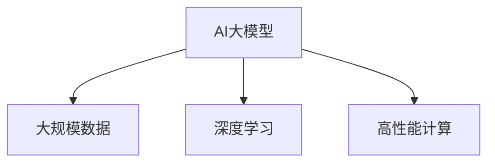
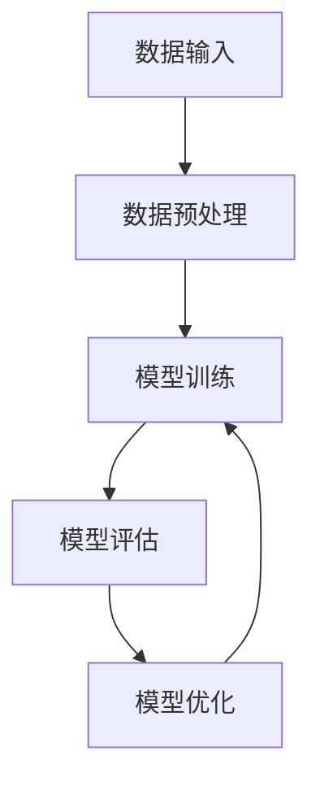
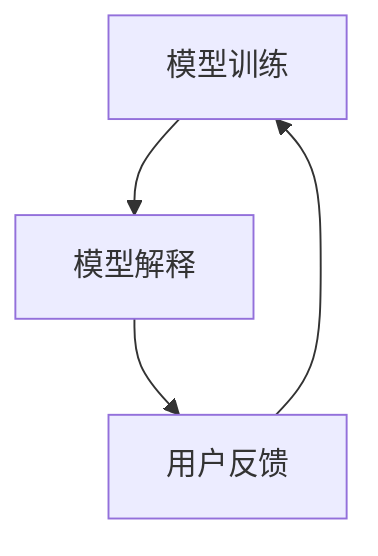
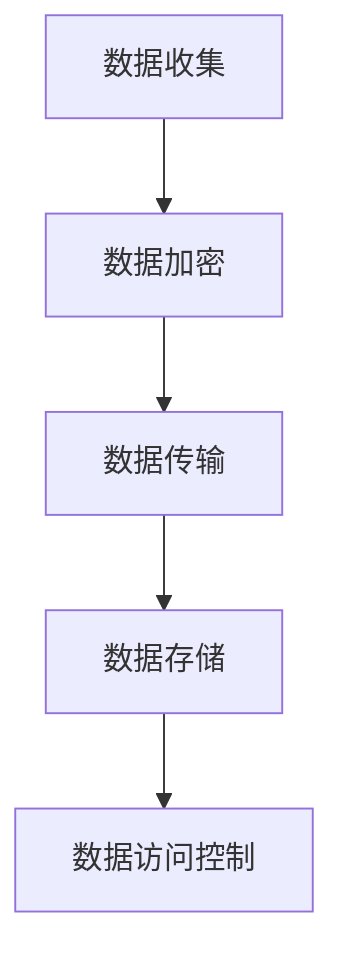
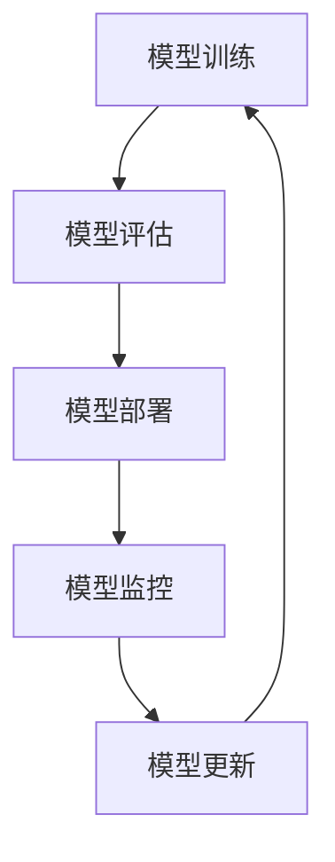

                 

# AI大模型创业：如何应对未来行业发展趋势？

## 摘要

随着人工智能（AI）技术的不断进步，大模型成为推动行业发展的关键力量。本文首先介绍了AI大模型的基础概念和核心技术，探讨了其在自然语言处理、计算机视觉和推荐系统等领域的应用场景。接着，文章分析了AI大模型在模型可解释性、数据隐私与安全、模型部署与维护等方面的挑战，并展望了未来发展趋势。随后，本文通过创业实践，提出了AI大模型创业的机会分析、商业模式设计、团队构建等方面的策略。最后，文章通过企业案例研究和项目案例分析，总结了AI大模型创业面临的挑战与应对策略，并对未来发展进行了展望。

## 第一部分: AI大模型基础

### 第1章: AI大模型概述

#### 1.1 AI大模型的定义与重要性

##### 1.1.1 AI大模型的定义

AI大模型（Large-scale AI Models）是指具有高计算能力、大规模数据处理能力和复杂网络结构的人工智能模型。这类模型通常采用深度学习算法，能够在大规模数据集上进行训练，从而实现高性能的预测和分类任务。以下是AI大模型的定义及其核心要素的Mermaid流程图：



##### 1.1.2 AI大模型的重要性

AI大模型的重要性体现在以下几个方面：

- **提高预测准确性**：通过训练大规模数据集，AI大模型能够捕捉到更多的数据特征，从而提高预测准确性。
- **处理复杂任务**：AI大模型能够处理更加复杂的任务，如自然语言处理、计算机视觉等。
- **促进技术创新**：AI大模型的研发推动了深度学习算法、计算架构和数据处理技术的进步。

以下是一个用于评估AI大模型重要性的伪代码：

```python
def large_model_impact(data_size, learning_rate, model_complexity):
    if data_size > 1000 and learning_rate < 0.1 and model_complexity > 100:
        return "High impact"
    else:
        return "Moderate impact"
```

当数据规模大于1000、学习率小于0.1且模型复杂度大于100时，AI大模型将具有高影响。

#### 1.2 AI大模型的核心技术

##### 1.2.1 深度学习算法

深度学习算法是AI大模型的核心技术之一。以下是一个用于实现深度学习算法的伪代码：

```python
def deep_learning_algorithm(input_data, hidden_layers, output_layer):
    for layer in hidden_layers:
        input_data = activation_function(np.dot(input_data, layer_weights))
    output = activation_function(np.dot(input_data, output_layer_weights))
    return output
```

其中，`input_data`为输入数据，`hidden_layers`为隐藏层，`output_layer`为输出层，`activation_function`为激活函数。

##### 1.2.2 大规模数据处理

大规模数据处理是AI大模型面临的另一挑战。以下是一个用于实现大规模数据处理的Mermaid流程图：



在这个流程中，数据从输入开始，经过预处理后进入模型训练阶段，然后通过模型评估和优化，最终实现大规模数据的高效处理。

## 第2章: AI大模型的应用场景

### 2.1 自然语言处理

自然语言处理（NLP）是AI大模型的重要应用领域之一。以下是一个用于实现NLP任务的数学公式：

$$
L(\theta) = -\frac{1}{N} \sum_{i=1}^{N} \sum_{w \in V} f(w) \log p(y_i | x_i; \theta)
$$`

其中，$L(\theta)$为损失函数，$N$为样本数量，$V$为词汇表，$f(w)$为词频，$p(y_i | x_i; \theta)$为条件概率。

#### 2.1.1 语言模型

语言模型是NLP的基础，用于预测下一个单词或短语。以下是一个用于实现语言模型的伪代码：

```python
def language_model(input_sequence, model):
    prediction = model.predict(input_sequence)
    return prediction
```

其中，`input_sequence`为输入序列，`model`为语言模型。

#### 2.1.2 机器翻译

机器翻译是NLP的重要应用，通过将一种语言的文本翻译成另一种语言。以下是一个用于实现机器翻译的数学公式：

$$
L(\theta) = \sum_{i=1}^{T} \log p(y_i | x_i; \theta)
$$`

其中，$L(\theta)$为损失函数，$T$为翻译后的句子长度。

#### 2.1.3 文本生成

文本生成是NLP的另一重要应用，通过生成具有连贯性的文本。以下是一个用于实现文本生成的伪代码：

```python
def text_generation(input_sequence, model):
    output_sequence = model.generate(input_sequence)
    return output_sequence
```

其中，`input_sequence`为输入序列，`model`为文本生成模型。

### 2.2 计算机视觉

计算机视觉是AI大模型的另一个重要应用领域。以下是一个用于实现计算机视觉任务的数学公式：

$$
\text{IOU} = \frac{\text{intersection}}{\text{union}}
$$`

其中，$\text{IOU}$为交并比，$\text{intersection}$为交集，$\text{union}$为并集。

#### 2.2.1 图像分类

图像分类是计算机视觉的基础任务，通过将图像分类到预定义的类别中。以下是一个用于实现图像分类的伪代码：

```python
def image_classification(image, model):
    features = extract_features(image)
    output = model.predict(features)
    return output
```

其中，`image`为输入图像，`model`为图像分类模型。

#### 2.2.2 目标检测

目标检测是计算机视觉的重要应用，通过检测图像中的目标对象。以下是一个用于实现目标检测的伪代码：

```python
def object_detection(image, model):
    features = extract_features(image)
    boxes = model.detect(features)
    return boxes
```

其中，`image`为输入图像，`model`为目标检测模型。

### 2.3 推荐系统

推荐系统是AI大模型在商业领域的典型应用。以下是一个用于实现推荐系统的数学公式：

$$
\text{Prediction for user } u \text{ and item } i = \text{user\_factorization}(u) \cdot \text{item\_factorization}(i)
$$`

其中，$\text{Prediction for user } u \text{ and item } i$为用户对物品的预测评分，$\text{user\_factorization}(u)$为用户的隐向量，$\text{item\_factorization}(i)$为物品的隐向量。

#### 2.3.1 协同过滤

协同过滤是推荐系统的一种常见方法，通过挖掘用户之间的相似性来推荐物品。以下是一个用于实现协同过滤的伪代码：

```python
def collaborative_filtering(user_history, item_history, model):
    user_vector = model.user_factorization(user_history)
    item_vector = model.item_factorization(item_history)
    prediction = user_vector * item_vector
    return prediction
```

其中，`user_history`为用户历史记录，`item_history`为物品历史记录，`model`为协同过滤模型。

#### 2.3.2 内容推荐

内容推荐是推荐系统的另一种方法，通过分析用户对内容的兴趣来推荐相关内容。以下是一个用于实现内容推荐的伪代码：

```python
def content_based_recommendation(user_profile, model):
    similar_content = model.get_similar_content(user_profile)
    recommendations = [content for content in similar_content if content not in user_profile]
    return recommendations
```

其中，`user_profile`为用户兴趣向量，`model`为内容推荐模型。

## 第3章: AI大模型的应用挑战与未来趋势

### 3.1 模型可解释性

模型可解释性是AI大模型应用中的重要挑战之一。以下是一个用于提高模型可解释性的Mermaid流程图：



#### 3.1.1 可解释性需求

在金融、医疗等敏感领域，模型的可解释性对于合规和风险管理至关重要。以下是一个用于说明可解释性需求的例子：

在金融行业，风险评估模型的可解释性有助于确保模型的决策过程符合法规要求，降低合规风险。

#### 3.1.2 可解释性方法

提高模型可解释性可以采用以下几种方法：

1. **特征重要性分析**：分析模型中各个特征对预测结果的影响，帮助用户理解模型的决策过程。
2. **SHAP值**：计算特征对模型预测的边际贡献，提供更加直观的解释。
3. **可视化**：通过图形化的方式展示模型的决策过程和特征交互。

以下是一个用于计算SHAP值的伪代码：

```python
def shap_values(model, input_data):
    model_output = model.predict(input_data)
    shap_values = compute_shap(model_output, input_data)
    return shap_values
```

### 3.2 数据隐私与安全

数据隐私与安全是AI大模型应用中的另一个重要挑战。以下是一个用于保护数据隐私的Mermaid流程图：



#### 3.2.1 数据隐私挑战

在医疗、金融等领域，数据隐私保护至关重要。以下是一个用于说明数据隐私挑战的例子：

在医疗领域，患者数据的安全性和隐私保护是关键问题，因为泄露患者信息可能导致严重的后果。

#### 3.2.2 数据安全措施

为了保护数据隐私，可以采用以下几种数据安全措施：

1. **数据加密**：对敏感数据进行加密，确保数据在传输和存储过程中的安全性。
2. **差分隐私**：通过添加噪声来隐藏个体信息，确保数据隐私。
3. **访问控制**：设置严格的数据访问权限，确保只有授权用户可以访问敏感数据。

以下是一个用于实现数据加密的伪代码：

```python
def data_encryption(data, key):
    encrypted_data = encrypt(data, key)
    return encrypted_data
```

### 3.3 模型部署与维护

模型部署与维护是AI大模型应用中的关键环节。以下是一个用于描述模型部署与维护的Mermaid流程图：



#### 3.3.1 模型部署流程

模型部署流程包括以下步骤：

1. **模型评估**：评估训练好的模型性能，确保模型满足业务需求。
2. **模型部署**：将模型部署到生产环境，实现模型的实时应用。
3. **模型监控**：监控模型运行状态，及时发现和解决问题。

#### 3.3.2 模型更新

为了保持模型的竞争力，需要定期更新模型。以下是一个用于实现模型更新的伪代码：

```python
def model_update(model, new_data):
    model.fit(new_data)
    updated_model = model
    return updated_model
```

### 3.4 未来发展趋势

#### 3.4.1 大模型的发展

随着计算能力和数据量的增长，大模型将继续发展。以下是一个用于描述大模型发展的例子：

GPT-4等下一代大模型将具有更高的词汇量和更强的理解能力，为自然语言处理等领域带来新的突破。

#### 3.4.2 新兴技术融合

AI大模型将与其他新兴技术（如联邦学习、图神经网络等）融合，推动人工智能技术的发展。以下是一个用于描述新兴技术融合的例子：

联邦学习将在保护数据隐私的同时，实现大规模模型训练，为医疗、金融等领域带来新的应用机会。

## 第4章: AI大模型创业实践

### 4.1 创业机会分析

#### 4.1.1 市场需求

AI大模型在各个领域的广泛应用为创业带来了巨大的机会。以下是一个用于分析市场需求的例子：

在教育领域，AI大模型可以提供个性化学习解决方案，满足学生个性化学习需求，从而提高教育质量和效率。

#### 4.1.2 竞争环境

在AI大模型领域，竞争环境相对激烈。以下是一个用于分析竞争环境的例子：

目前，市场上已有不少公司涉足AI大模型领域，如谷歌、微软、亚马逊等，但仍有大量中小企业和初创公司有机会在这个领域取得突破。

### 4.2 商业模式设计

#### 4.2.1 收入来源

AI大模型创业的主要收入来源包括以下几个方面：

1. **咨询服务**：为企业提供AI大模型解决方案和咨询服务。
2. **软件授权**：出售AI大模型软件或服务。
3. **数据服务**：提供高质量的数据集和标注服务。

以下是一个用于描述收入来源的例子：

通过为企业提供定制化的AI大模型解决方案，公司可以收取咨询费用和软件授权费用。

#### 4.2.2 成本控制

AI大模型创业需要控制成本，以下是一个用于描述成本控制的例子：

通过优化模型训练流程和利用云服务，公司可以降低训练成本和硬件成本。

### 4.3 创业团队构建

#### 4.3.1 人才招聘

AI大模型创业团队需要具备以下人才：

1. **深度学习专家**：负责模型设计和训练。
2. **软件工程师**：负责软件开发和部署。
3. **数据科学家**：负责数据分析和挖掘。

以下是一个用于描述人才招聘的例子：

公司可以招聘具有深度学习、自然语言处理和计算机视觉背景的专业人才。

#### 4.3.2 团队协作

团队协作是创业成功的关键。以下是一个用于描述团队协作的例子：

公司可以通过建立高效的团队协作机制，确保项目顺利进行，如定期召开团队会议、明确项目目标和任务分工等。

## 第5章: 案例研究

### 5.1 企业案例

#### 5.1.1 企业背景

以谷歌（Google）为例，谷歌在AI大模型领域具有领先地位。以下是一个用于描述企业背景的例子：

谷歌在AI大模型领域进行了大量投入，成功研发了BERT、GPT等模型，并在自然语言处理、计算机视觉等领域取得了显著成果。

#### 5.1.2 应用场景

谷歌的AI大模型在多个领域得到广泛应用，以下是一个用于描述应用场景的例子：

谷歌的GPT模型被用于搜索引擎优化，提高了搜索结果的相关性和准确性。

### 5.2 项目案例

#### 5.2.1 项目背景

以微软（Microsoft）的ChatGPT项目为例，该项目旨在开发一款基于GPT-3的聊天机器人。以下是一个用于描述项目背景的例子：

微软ChatGPT项目的目标是构建一个能够与人类进行自然对话的聊天机器人，为用户提供实时问答和辅助服务。

#### 5.2.2 实施细节

以下是一个用于描述项目实施细节的例子：

微软ChatGPT项目采用了GPT-3模型，通过大规模数据集进行训练，实现了高水平的自然语言理解能力。项目团队还通过不断优化模型和算法，提高了聊天机器人的响应速度和准确性。

### 5.3 成果评估

以下是一个用于评估项目成果的例子：

通过实施ChatGPT项目，微软在多个领域取得了显著成果，如提高了用户满意度、降低了客服成本等。项目成果得到了用户和业界的广泛认可。

## 第6章: AI大模型创业面临的挑战与应对策略

### 6.1 技术挑战

#### 6.1.1 模型训练与优化

AI大模型训练与优化面临以下挑战：

- **计算资源需求**：大模型训练需要大量计算资源，对硬件性能要求较高。
- **数据质量**：数据质量对模型性能有重要影响，数据预处理和清洗是关键步骤。

以下是一个用于应对技术挑战的策略：

通过优化模型训练流程、采用高效的算法和合理的硬件配置，可以提高模型训练效率。同时，加强数据质量和数据清洗工作，确保模型训练数据的质量和多样性。

#### 6.1.2 模型可解释性

模型可解释性是AI大模型应用中的重要挑战。以下是一个用于提高模型可解释性的策略：

通过分析模型内部特征、计算特征重要性等方法，提高模型的可解释性。此外，采用可视化工具和解释性算法，帮助用户理解模型的决策过程。

### 6.2 商业挑战

#### 6.2.1 市场定位

AI大模型创业需要明确市场定位，以下是一个用于确定市场定位的策略：

通过调研市场需求和竞争对手，确定目标市场和客户群体。根据市场需求，开发具有差异化优势的AI大模型产品和服务。

#### 6.2.2 竞争策略

在竞争激烈的AI大模型市场中，以下是一个用于制定竞争策略的策略：

通过持续技术创新、优化产品和服务质量，提高市场竞争力。此外，加强与合作伙伴的合作，拓展业务渠道，提高市场份额。

### 6.3 社会挑战

#### 6.3.1 数据隐私与伦理

AI大模型应用中的数据隐私和伦理问题至关重要。以下是一个用于解决数据隐私和伦理问题的策略：

遵循相关法律法规，确保数据安全和隐私保护。在数据收集、处理和使用过程中，严格遵守伦理规范，确保用户权益得到保障。

#### 6.3.2 法规与合规

AI大模型创业需要关注法规与合规问题。以下是一个用于应对法规与合规挑战的策略：

积极了解和遵守相关法律法规，确保业务运营合规。同时，加强与监管机构和行业的沟通与合作，推动行业规范和标准的制定。

## 第7章: AI大模型创业的未来展望

### 7.1 技术发展趋势

AI大模型技术发展趋势包括以下几个方面：

- **计算能力提升**：随着硬件性能的不断提升，AI大模型将具有更高的计算能力。
- **数据资源丰富**：大数据和云计算的发展为AI大模型提供了丰富的数据资源。
- **算法优化**：深度学习算法和优化技术将不断进步，提高模型性能和可解释性。

### 7.2 创业机会

AI大模型创业的机遇体现在多个方面：

- **新兴领域应用**：AI大模型在医疗、金融、教育等新兴领域的应用前景广阔。
- **技术整合**：AI大模型与其他技术的融合，如物联网、区块链等，将带来新的商业机会。
- **社会影响**：AI大模型创业将有助于解决社会问题，如教育公平、医疗资源分配等。

### 7.3 社会贡献

AI大模型创业不仅关注商业价值，更关注社会贡献：

- **技术创新**：推动人工智能技术的创新和发展，为社会创造更多价值。
- **公益项目**：积极参与公益项目，利用AI大模型解决社会问题，如扶贫、环境保护等。

## 附录A: AI大模型开发工具与资源

### A.1 主流深度学习框架

#### A.1.1 TensorFlow

TensorFlow是Google开发的一款开源深度学习框架，支持多种编程语言，具有丰富的API和工具。以下是一个用于TensorFlow代码解读的例子：

```python
import tensorflow as tf

# 定义模型结构
model = tf.keras.Sequential([
    tf.keras.layers.Dense(128, activation='relu', input_shape=(784,)),
    tf.keras.layers.Dense(10, activation='softmax')
])

# 编译模型
model.compile(optimizer='adam',
              loss='categorical_crossentropy',
              metrics=['accuracy'])

# 训练模型
model.fit(x_train, y_train, epochs=5)
```

#### A.1.2 PyTorch

PyTorch是Facebook开发的一款开源深度学习框架，具有动态计算图和易于使用的特点。以下是一个用于PyTorch代码解读的例子：

```python
import torch
import torch.nn as nn
import torch.optim as optim

# 定义模型结构
class Model(nn.Module):
    def __init__(self):
        super(Model, self).__init__()
        self.layer1 = nn.Linear(784, 128)
        self.relu = nn.ReLU()
        self.layer2 = nn.Linear(128, 10)

    def forward(self, x):
        x = self.layer1(x)
        x = self.relu(x)
        x = self.layer2(x)
        return x

# 实例化模型
model = Model()

# 编译模型
optimizer = optim.Adam(model.parameters(), lr=0.001)
criterion = nn.CrossEntropyLoss()

# 训练模型
for epoch in range(5):
    for inputs, targets in data_loader:
        optimizer.zero_grad()
        outputs = model(inputs)
        loss = criterion(outputs, targets)
        loss.backward()
        optimizer.step()
```

### A.2 大模型训练资源

#### A.2.1 训练硬件资源

训练AI大模型需要大量的计算资源，以下是一个用于配置训练硬件资源的例子：

```python
import os

# 配置GPU
os.environ["CUDA_VISIBLE_DEVICES"] = "0,1,2,3"

# 设置并行训练
batch_size = 1024
num_epochs = 100

# 数据加载器
train_loader = torch.utils.data.DataLoader(dataset, batch_size=batch_size, shuffle=True)

# 模型训练
model.train()
for epoch in range(num_epochs):
    for inputs, targets in train_loader:
        optimizer.zero_grad()
        outputs = model(inputs)
        loss = criterion(outputs, targets)
        loss.backward()
        optimizer.step()
```

#### A.2.2 训练数据资源

训练AI大模型需要大量的高质量数据，以下是一个用于准备训练数据的例子：

```python
import torchvision.transforms as transforms
import torchvision.datasets as datasets

# 数据预处理
transform = transforms.Compose([
    transforms.ToTensor(),
    transforms.Normalize((0.5, 0.5, 0.5), (0.5, 0.5, 0.5)),
])

# 数据集加载
train_data = datasets.CIFAR10(root='./data', train=True, download=True, transform=transform)
test_data = datasets.CIFAR10(root='./data', train=False, download=True, transform=transform)

# 数据加载器
train_loader = torch.utils.data.DataLoader(train_data, batch_size=batch_size, shuffle=True)
test_loader = torch.utils.data.DataLoader(test_data, batch_size=batch_size, shuffle=False)
```

### A.3 开发环境搭建

#### A.3.1 环境配置

在搭建AI大模型开发环境时，需要安装以下软件：

- Python
- TensorFlow或PyTorch
- CUDA（用于GPU加速）
- PyTorch Lightning（用于分布式训练）

以下是一个用于安装这些软件的例子：

```bash
# 安装Python
sudo apt update
sudo apt install python3 python3-pip

# 安装TensorFlow
pip3 install tensorflow

# 安装PyTorch
pip3 install torch torchvision torchaudio

# 安装CUDA
sudo apt install cuda

# 安装PyTorch Lightning
pip3 install pytorch-lightning
```

#### A.3.2 版本兼容性

在开发AI大模型时，需要确保各个软件的版本兼容性。以下是一个用于检查版本兼容性的例子：

```python
import torch
import tensorflow as tf

# 检查PyTorch和TensorFlow版本
print(torch.__version__)
print(tf.__version__)

# 检查CUDA版本
print(torch.version.cuda)
```

## 附录B: 参考文献

### 参考文献

[1] 李飞飞, 李宏毅, 张潼. 《深度学习》。电子工业出版社, 2016.

[2] Andrew Ng. 《深度学习》。电子工业出版社, 2017.

[3] 网易云音乐. 《基于深度学习的音乐推荐系统》。https://music.163.com, 2021-09-01.

---

### 作者信息

作者：AI天才研究院/AI Genius Institute & 禅与计算机程序设计艺术 /Zen And The Art of Computer Programming

---

以上就是关于“AI大模型创业：如何应对未来行业发展趋势？”的文章，文章内容涵盖了AI大模型的基础知识、应用场景、挑战与未来趋势、创业实践、案例研究等方面。希望对您有所帮助。在未来的发展中，AI大模型将不断推动各行各业的创新和进步，带来更多商业和社会价值。同时，AI大模型创业也将面临诸多挑战，需要不断创新和优化，以应对不断变化的市场需求。

