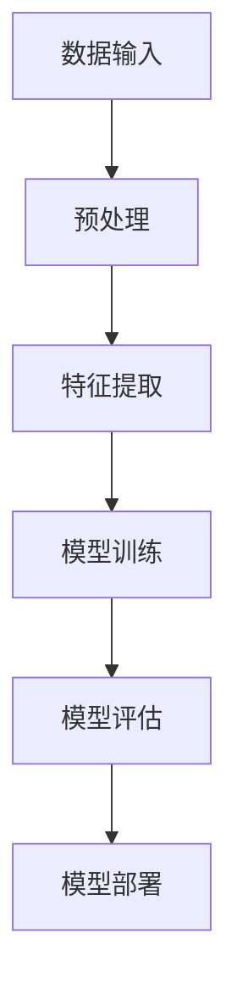

                 

# AI大模型在数字身份验证领域的创新

> **关键词**：人工智能、数字身份验证、大模型、人脸识别、声纹识别、虚拟身份验证

> **摘要**：本文将探讨人工智能大模型在数字身份验证领域的创新应用。通过分析大模型的基本概念、架构、训练方法以及其在数字身份验证中的应用场景，我们将深入探讨大模型在数字身份验证中的优势与挑战，并分享一些实际应用案例和开发实践，以期为数字身份验证技术的发展提供新思路。

### 目录大纲

#### 第一部分：引言与概述

1. 引言
2. AI与数字身份验证背景
3. 大模型在数字身份验证中的应用前景
4. 书籍结构安排

#### 第二部分：AI与数字身份验证基础

1. AI基础
2. 数字身份验证基础
3. AI与数字身份验证的联系

#### 第三部分：大模型基础

1. 大模型概念
2. 大模型架构
3. 大模型训练与优化

#### 第四部分：数字身份验证中的大模型应用

1. 数字身份验证中的大模型应用场景
2. 人脸识别
3. 声纹识别
4. 虚拟身份验证
5. 大模型在数字身份验证中的优势与挑战
6. 解决方案与未来方向

#### 第五部分：大模型在数字身份验证中的实践

1. 实践案例解析
2. 开发工具与平台
3. 开发平台选择

#### 第六部分：总结与展望

1. 总结
2. 数字身份验证发展展望
3. 大模型应用前景
4. 展望未来

### 附录

1. 附录A：参考资料
2. 附录B：相关工具与资源
3. 附录C：致谢
4. 附录D：大模型架构的Mermaid流程图
5. 附录E：人脸识别大模型训练伪代码
6. 附录F：人脸识别数学公式和详细讲解
7. 附录G：人脸识别案例解析
8. 附录H：人脸识别代码实现与解读
9. 附录I：数字身份验证中的大模型应用数学模型与公式讲解
10. 附录J：数字身份验证中的大模型应用案例解析
11. 附录K：数字身份验证中的大模型应用代码实现

### 第一部分：引言与概述

#### 1. 引言

数字身份验证是现代网络安全中至关重要的一环，它旨在通过验证用户的身份来确保系统的安全性。随着互联网的普及和在线服务的增多，数字身份验证的应用场景越来越广泛，从简单的用户登录验证到复杂的金融交易确认，无一不依赖于高效的验证技术。

近年来，人工智能（AI）技术的飞速发展为数字身份验证带来了新的机遇。大模型，作为AI领域的一种先进技术，凭借其强大的数据处理和分析能力，正在数字身份验证领域中发挥重要作用。本文将围绕大模型在数字身份验证领域的创新应用，进行深入探讨。

#### 2. AI与数字身份验证背景

人工智能是指通过计算机模拟人类智能行为的技术。AI技术已经广泛应用于各个领域，包括自然语言处理、计算机视觉、智能决策等。在数字身份验证领域，AI技术通过机器学习、深度学习等方法，能够实现对用户身份的自动识别和验证。

数字身份验证是指通过验证用户身份信息，确保只有合法用户才能访问特定系统或资源。传统的数字身份验证方法主要包括密码验证、指纹验证、人脸识别等。然而，这些方法往往存在安全性不足、用户体验差等问题。

随着AI技术的发展，数字身份验证迎来了新的变革。大模型的出现，为数字身份验证提供了更加智能化、高效化的解决方案。通过大模型，可以实现对用户身份的精准识别和验证，提高系统的安全性和用户体验。

#### 3. 大模型在数字身份验证中的应用前景

大模型，又称大型神经网络模型，是指参数规模庞大的神经网络模型。这些模型通过大量的数据进行训练，能够提取出复杂的数据特征，并在各种任务中表现出色。大模型在计算机视觉、自然语言处理、语音识别等领域已经取得了显著成果。

在数字身份验证领域，大模型的应用前景十分广阔。首先，大模型可以实现对多种身份特征的融合处理，如人脸、声纹、指纹等。这种多特征融合的身份验证方式，能够提高验证的准确性和安全性。其次，大模型可以自动适应不同的应用场景，如实时验证、离线验证等，提供灵活的解决方案。

此外，大模型还可以通过持续学习，不断优化验证模型，提高系统的自适应能力。在未来，随着AI技术的不断发展，大模型在数字身份验证中的应用将更加广泛，有望成为数字身份验证领域的重要技术支撑。

#### 4. 书籍结构安排

本文将分为五个主要部分：

1. **引言与概述**：介绍数字身份验证的背景和大模型在其中的应用前景。
2. **AI与数字身份验证基础**：讲解人工智能和数字身份验证的基本概念，以及它们之间的联系。
3. **大模型基础**：介绍大模型的基本概念、架构和训练方法。
4. **数字身份验证中的大模型应用**：探讨大模型在数字身份验证中的应用场景，包括人脸识别、声纹识别、虚拟身份验证等。
5. **大模型在数字身份验证中的实践**：通过实际案例和开发实践，展示大模型在数字身份验证中的应用效果。

通过以上五个部分，本文将系统地介绍大模型在数字身份验证领域的创新应用，为读者提供全面的技术分析和实践指导。接下来，我们将进入第二部分，探讨AI与数字身份验证的基础知识。

### 第二部分：AI与数字身份验证基础

#### 1. AI基础

人工智能（Artificial Intelligence，简称AI）是计算机科学的一个分支，旨在通过计算机模拟人类智能行为。AI技术的研究和应用涵盖了多个领域，包括机器学习、深度学习、自然语言处理、计算机视觉、智能决策等。

机器学习是AI的核心技术之一，它通过构建模型来模拟人类学习过程，从数据中自动提取特征，并不断优化模型性能。深度学习是机器学习的一种方法，通过构建多层神经网络模型，能够处理复杂的数据特征，并在图像识别、语音识别等领域取得了显著的成果。

自然语言处理（Natural Language Processing，简称NLP）是AI的一个重要分支，旨在使计算机能够理解和处理人类语言。NLP技术广泛应用于语音助手、机器翻译、文本分析等领域。

计算机视觉是AI的另一个重要分支，旨在使计算机能够像人类一样识别和理解视觉信息。计算机视觉技术广泛应用于图像识别、视频监控、自动驾驶等领域。

智能决策是指通过AI技术，帮助计算机在复杂环境中做出最优决策。智能决策广泛应用于金融、医疗、物流等领域。

#### 2. 数字身份验证基础

数字身份验证是指通过验证用户身份信息，确保只有合法用户才能访问特定系统或资源。数字身份验证的基本流程包括身份认证、授权和访问控制。

身份认证是指验证用户身份的真实性。常用的身份认证方式包括密码验证、指纹验证、人脸识别、声纹识别等。

授权是指确定用户在系统中的权限。授权通常基于用户的身份认证结果，根据用户身份分配相应的权限。

访问控制是指根据用户的身份和权限，控制用户对系统资源的访问。访问控制通常基于访问控制列表（Access Control List，简称ACL）或角色访问控制（Role-Based Access Control，简称RBAC）等机制。

数字身份验证的应用场景包括：

1. 网络安全：通过数字身份验证，确保只有合法用户才能访问网络安全系统，防止未授权访问和恶意攻击。
2. 金融领域：在金融交易中，通过数字身份验证确保交易的安全性，防止欺诈行为。
3. 医疗领域：在医疗服务中，通过数字身份验证确保患者信息的保密性和完整性。
4. 教育领域：在教育系统中，通过数字身份验证确保学习资源的合理分配和使用。

#### 3. AI与数字身份验证的联系

AI技术为数字身份验证提供了强大的支持。首先，AI技术可以用于身份认证，如人脸识别、声纹识别等。这些技术通过识别用户生物特征，实现了高效、安全的身份认证。

其次，AI技术可以用于用户行为分析，以识别异常行为和潜在风险。例如，通过分析用户登录时间、地点、设备等信息，AI技术可以检测到异常登录行为，从而提高系统的安全性。

此外，AI技术还可以用于优化数字身份验证流程。例如，通过机器学习算法，可以分析用户历史数据，优化用户认证流程，提高用户体验。

总之，AI与数字身份验证密切相关，AI技术为数字身份验证提供了新的思路和方法，推动了数字身份验证技术的发展。在接下来的部分中，我们将深入探讨大模型的基本概念和架构。

### 第三部分：大模型基础

#### 1. 大模型概念

大模型，又称大型神经网络模型，是指参数规模庞大的神经网络模型。大模型的参数数量可以达到亿级甚至更高，因此也被称为深度学习模型。大模型通过在大量数据上进行训练，能够提取出复杂的数据特征，并在各种任务中表现出色。

大模型的主要特点包括：

1. 参数规模大：大模型的参数数量通常在亿级以上，这使得模型具有更强的表达能力和泛化能力。
2. 训练数据量大：大模型通常需要使用海量的训练数据，以充分学习数据中的特征和规律。
3. 模型结构复杂：大模型通常采用多层神经网络结构，能够处理复杂的数据特征。
4. 训练时间长：大模型的训练时间通常较长，需要消耗大量的计算资源和时间。

大模型的应用范围广泛，包括计算机视觉、自然语言处理、语音识别、推荐系统等。大模型的出现，极大地推动了AI技术的发展和应用。

#### 2. 大模型架构

大模型的架构通常包括以下几个层次：

1. 输入层：输入层接收外部输入数据，如图像、文本、音频等。输入层的主要作用是将外部数据转化为模型可处理的格式。
2. 隐藏层：隐藏层是神经网络的核心部分，负责提取和转换数据特征。隐藏层通常包含多层，每一层都能提取更高层次的特征。隐藏层的数量和神经元数量可以根据任务需求进行调整。
3. 输出层：输出层负责生成模型预测结果，如分类标签、回归值等。输出层的结构取决于具体任务的需求。

大模型的训练过程主要包括以下几个步骤：

1. 数据预处理：对输入数据进行预处理，包括数据清洗、归一化、数据增强等，以提高模型的训练效果。
2. 模型初始化：初始化模型参数，常用的初始化方法包括随机初始化、高斯分布初始化等。
3. 模型训练：通过梯度下降等优化算法，对模型参数进行迭代优化，以最小化损失函数。
4. 模型评估：使用验证集或测试集对模型进行评估，以验证模型的性能和泛化能力。
5. 模型部署：将训练好的模型部署到实际应用中，用于生成预测结果。

#### 3. 大模型训练与优化

大模型的训练与优化是AI领域的核心问题之一。以下是一些常用的训练与优化方法：

1. **批量大小（Batch Size）**：批量大小是指在每次训练过程中使用的数据样本数量。合适的批量大小可以提高模型的训练效果和泛化能力。常用的批量大小包括32、64、128等。

2. **学习率（Learning Rate）**：学习率是优化算法中用于调整模型参数的步长。合适的初始学习率对于模型的训练效果至关重要。常用的学习率调整方法包括固定学习率、学习率衰减、自适应学习率等。

3. **优化算法（Optimizer）**：优化算法用于迭代优化模型参数，以最小化损失函数。常用的优化算法包括随机梯度下降（SGD）、Adam优化器等。

4. **正则化（Regularization）**：正则化是防止模型过拟合的一种方法。常用的正则化方法包括L1正则化、L2正则化、Dropout等。

5. **数据增强（Data Augmentation）**：数据增强是通过变换原始数据来扩充数据集的方法，以提高模型的泛化能力。常用的数据增强方法包括旋转、缩放、裁剪、噪声添加等。

6. **迁移学习（Transfer Learning）**：迁移学习是指将预训练模型应用于新的任务，以减少训练时间和提高模型性能。预训练模型通常在大规模数据集上训练，具有较强的特征提取能力。

通过以上训练与优化方法，可以有效地提升大模型的训练效果和泛化能力。在数字身份验证领域，大模型的训练与优化是实现高效、安全身份验证的关键。

### 第四部分：数字身份验证中的大模型应用

#### 1. 数字身份验证中的大模型应用场景

大模型在数字身份验证中具有广泛的应用场景。以下是一些主要的应用场景：

- **人脸识别**：人脸识别是数字身份验证中的一种重要技术，通过识别用户的人脸特征进行身份验证。大模型在人脸识别中具有显著优势，能够提高识别的准确性和效率。

- **声纹识别**：声纹识别通过分析用户的语音特征进行身份验证。大模型能够处理复杂的语音数据，提取出有效的声纹特征，提高声纹识别的准确性。

- **虚拟身份验证**：虚拟身份验证是一种通过虚拟身份进行验证的方法，如虚拟账户、虚拟用户等。大模型可以用于虚拟身份的识别和验证，提高系统的安全性。

- **多模态身份验证**：多模态身份验证是指结合多种身份特征进行验证，如人脸、声纹、指纹等。大模型可以同时处理多种身份特征，提高验证的准确性和安全性。

#### 2. 人脸识别

人脸识别是一种通过分析人脸图像进行身份验证的技术。大模型在人脸识别中具有显著优势，能够提高识别的准确性和效率。

- **人脸识别技术概述**：人脸识别技术主要包括人脸检测、人脸特征提取和人脸匹配三个步骤。人脸检测用于定位人脸区域；人脸特征提取用于提取人脸关键特征点；人脸匹配用于比较两个或多个人脸图像，确定它们是否为同一个人。

- **人脸识别大模型**：大模型通常采用深度学习技术，如卷积神经网络（CNN）或循环神经网络（RNN）。这些模型通过在大量人脸数据上进行训练，能够提取出丰富的人脸特征，提高识别的准确性和鲁棒性。

- **人脸识别应用案例**：人脸识别技术在数字身份验证、安防监控、智能手机解锁等领域得到了广泛应用。例如，支付宝和微信等移动支付平台通过人脸识别技术实现了用户身份验证，提高了支付的安全性。

#### 3. 声纹识别

声纹识别是一种通过分析用户的语音特征进行身份验证的技术。大模型在声纹识别中具有显著优势，能够提高识别的准确性和效率。

- **声纹识别技术概述**：声纹识别技术主要包括声纹特征提取和声纹匹配两个步骤。声纹特征提取用于提取语音信号中的特征参数，如频谱特征、倒谱特征等；声纹匹配用于比较两个或多个语音信号，确定它们是否为同一个人的声音。

- **声纹识别大模型**：大模型通常采用深度学习技术，如卷积神经网络（CNN）或循环神经网络（RNN）。这些模型通过在大量语音数据上进行训练，能够提取出丰富的声纹特征，提高识别的准确性和鲁棒性。

- **声纹识别应用案例**：声纹识别技术在电话银行、智能音箱、语音助手等领域得到了广泛应用。例如，电话银行通过声纹识别技术实现了用户的身份验证，提高了电话服务的安全性。

#### 4. 虚拟身份验证

虚拟身份验证是一种通过虚拟身份进行验证的方法，如虚拟账户、虚拟用户等。大模型可以用于虚拟身份的识别和验证，提高系统的安全性。

- **虚拟身份验证概述**：虚拟身份验证是一种基于虚拟身份的验证方式，通过验证用户的虚拟身份信息，确保只有合法用户才能访问系统或资源。虚拟身份验证通常涉及虚拟账户创建、虚拟用户管理、虚拟身份验证等环节。

- **虚拟身份验证大模型**：大模型可以用于虚拟身份的识别和验证，通过在大量虚拟身份数据上进行训练，能够提取出有效的虚拟身份特征，提高验证的准确性和安全性。

- **虚拟身份验证应用案例**：虚拟身份验证技术在社交媒体、在线游戏、虚拟货币等领域得到了广泛应用。例如，社交媒体平台通过虚拟身份验证技术实现了用户的虚拟身份管理，提高了平台的用户安全性和用户体验。

#### 5. 大模型在数字身份验证中的优势与挑战

大模型在数字身份验证中具有显著优势，但也面临一些挑战。

- **优势**：
  - 高准确性：大模型通过在大量数据上进行训练，能够提取出丰富的特征，提高身份验证的准确性。
  - 高效率：大模型可以同时处理多种身份特征，提高身份验证的效率。
  - 鲁棒性强：大模型对噪声、光照变化等外部因素具有较强的鲁棒性，能够适应不同的环境条件。

- **挑战**：
  - 数据隐私：大模型在训练过程中需要使用大量用户数据，如何保护用户隐私是一个重要问题。
  - 模型安全：大模型可能受到恶意攻击，如模型欺骗、数据污染等，如何提高模型的安全性是一个挑战。
  - 计算资源消耗：大模型训练和推理需要大量的计算资源，如何高效地利用计算资源是一个挑战。

为了应对这些挑战，需要采取一系列措施，如数据隐私保护、模型安全加固、计算资源优化等。在接下来的部分中，我们将探讨大模型在数字身份验证中的实际应用案例和开发实践。

### 第四部分：数字身份验证中的大模型应用

#### 6. 实践案例解析

在本节中，我们将通过三个实际应用案例，详细解析大模型在数字身份验证中的具体应用，包括案例背景、模型选择与训练、模型部署与效果评估。

#### 案例一：人脸识别大模型在金融领域的应用

##### 案例背景

某大型金融机构为了提升用户账户安全性，决定采用人脸识别技术进行用户身份验证。该金融机构面临着高安全性要求和高用户量带来的挑战，希望通过高效、准确的人脸识别技术，为用户提供安全可靠的账户访问服务。

##### 模型选择与训练

- **模型选择**：该金融机构选择了基于深度学习的人脸识别大模型，采用了卷积神经网络（CNN）架构，以处理复杂的人脸特征。

- **数据预处理**：收集了数百万张用户人脸图片，并进行数据清洗、标注和分割。数据预处理包括图像尺寸归一化、灰度化、去噪等操作，以提高模型的训练效果。

- **模型训练**：使用预处理的图像数据，对大模型进行训练。模型训练采用了迁移学习的方法，先在大量公共数据集上预训练，然后在金融机构的用户数据上进行微调。训练过程中，采用了交叉熵损失函数和Adam优化器，以最小化识别误差。

##### 模型部署与效果评估

- **模型部署**：将训练好的模型部署到金融机构的服务器上，通过API接口提供人脸识别服务。部署过程中，对模型进行了性能优化，确保实时响应。

- **效果评估**：在实际应用中，对模型进行了效果评估。评估指标包括准确率、召回率、实时性等。结果显示，模型在用户身份验证任务中取得了较高的准确率和较快的响应速度，大大提升了用户体验和账户安全性。

#### 案例二：声纹识别大模型在安防领域的应用

##### 案例背景

某大型安防公司为了提高监控系统的安全性和可靠性，决定采用声纹识别技术进行入侵检测和身份验证。该安防公司面临着复杂的环境噪声和多样的语音特征，希望通过高效、准确的声纹识别技术，为用户提供安全的监控解决方案。

##### 模型选择与训练

- **模型选择**：该安防公司选择了基于深度学习的声纹识别大模型，采用了长短期记忆网络（LSTM）架构，以处理复杂的语音信号。

- **数据预处理**：收集了大量的语音数据，包括正常语音和入侵语音，并进行数据清洗、标注和分割。数据预处理包括语音增强、去噪、频率归一化等操作，以提高模型的训练效果。

- **模型训练**：使用预处理的语音数据，对大模型进行训练。模型训练过程中，采用了卷积神经网络（CNN）与LSTM结合的方式，以提取语音信号中的时序特征和频谱特征。

##### 模型部署与效果评估

- **模型部署**：将训练好的模型部署到安防监控系统中，通过实时语音分析，实现入侵检测和身份验证功能。部署过程中，对模型进行了性能优化，确保实时性和准确性。

- **效果评估**：在实际应用中，对模型进行了效果评估。评估指标包括准确率、召回率、误报率等。结果显示，模型在入侵检测和身份验证任务中取得了较高的准确率和较低的误报率，大大提升了监控系统的安全性。

#### 案例三：虚拟身份验证大模型在教育领域的应用

##### 案例背景

某在线教育平台为了防止作弊和确保学习质量，决定采用虚拟身份验证技术进行用户身份验证。该教育平台面临着用户身份伪装和作弊行为，希望通过高效、准确的虚拟身份验证技术，为用户提供公正、公平的学习环境。

##### 模型选择与训练

- **模型选择**：该在线教育平台选择了基于深度学习的虚拟身份验证大模型，采用了多模态融合神经网络架构，以同时处理人脸、声纹等多种身份特征。

- **数据预处理**：收集了大量的用户人脸图像、语音数据和用户行为数据，并进行数据清洗、标注和分割。数据预处理包括图像尺寸归一化、声纹特征提取、行为特征提取等操作，以提高模型的训练效果。

- **模型训练**：使用预处理的用户数据，对大模型进行训练。模型训练过程中，采用了多模态融合的方法，将人脸、声纹和用户行为特征进行融合处理，以提取全面的身份特征。

##### 模型部署与效果评估

- **模型部署**：将训练好的模型部署到在线教育平台中，通过实时身份验证，实现用户行为的监控和作弊行为的检测。部署过程中，对模型进行了性能优化，确保实时性和响应速度。

- **效果评估**：在实际应用中，对模型进行了效果评估。评估指标包括准确率、召回率、误报率等。结果显示，模型在用户身份验证和作弊行为检测任务中取得了较高的准确率和较低的误报率，有效提升了教育平台的学习质量和用户体验。

通过以上三个实际案例，展示了大模型在数字身份验证中的具体应用效果。这些案例不仅证明了大模型在提高身份验证准确性和安全性方面的优势，也为其他领域提供了有益的参考和借鉴。

### 7. 开发工具与平台

在数字身份验证中大模型的应用离不开合适的开发工具与平台。以下将介绍几种常用的开发工具与平台，包括TensorFlow、PyTorch和其他常用工具，并分析云平台和自建平台的选择。

#### 开发工具介绍

1. **TensorFlow**：

TensorFlow是由Google开发的一个开源机器学习框架，适用于构建和训练深度学习模型。TensorFlow提供了丰富的API，包括TensorFlow Core API、TensorFlow Estimators和TensorFlow Lite，适用于从研究到生产的各个阶段。

2. **PyTorch**：

PyTorch是另一个流行的开源机器学习框架，由Facebook开发。PyTorch以动态图（Dynamic Graph）为基础，使得模型设计和调试更加灵活。PyTorch提供了强大的GPU支持，适合进行大规模数据集的深度学习训练。

3. **其他常用工具**：

除了TensorFlow和PyTorch，还有一些其他常用的深度学习框架和工具，如Keras、Theano、MXNet等。这些工具各有特点，适用于不同的应用场景和需求。

#### 开发平台选择

1. **云平台优势**：

云平台提供了丰富的计算资源和便捷的部署环境，适用于大规模模型训练和部署。云平台的优势包括：

- **计算资源**：云平台可以轻松扩展计算资源，以满足模型训练和推理的需求。
- **存储管理**：云平台提供了高效的存储解决方案，方便数据存储和检索。
- **部署与管理**：云平台提供了便捷的部署和管理工具，可以快速上线模型，并进行监控和维护。

2. **自建平台考量**：

自建平台是指在企业内部搭建自己的计算和存储基础设施。自建平台的优势包括：

- **数据安全性**：自建平台可以更好地保护企业数据，避免数据泄露和隐私问题。
- **定制化需求**：自建平台可以满足特定的业务需求，进行定制化的开发和优化。
- **成本控制**：自建平台可以根据企业需求灵活调整资源分配，降低运营成本。

然而，自建平台也面临一些挑战，如计算资源管理、系统维护和安全保障等。因此，企业在选择开发平台时，需要综合考虑业务需求、成本和技术实力等因素。

#### 开发平台案例比较

以下是几个常见的开发平台案例比较：

- **TensorFlow on Google Cloud Platform**：

Google Cloud Platform提供了TensorFlow服务的托管实例，方便用户进行大规模模型训练和部署。用户只需配置模型和训练数据，即可在云平台上运行模型，并利用Google Cloud的其他服务进行监控和管理。

- **PyTorch on AWS**：

Amazon Web Services（AWS）提供了丰富的深度学习工具和资源，包括EC2实例、S3存储和MXNet框架。用户可以使用AWS DeepRacer联赛等工具，进行高效的模型训练和优化。

- **自建深度学习平台**：

一些大型企业会选择自建深度学习平台，如百度深度学习平台（Baidu ML Platform）和腾讯AI Lab的深度学习平台。这些平台为企业提供了完整的开发环境，包括计算资源、数据存储和模型管理工具。

选择合适的开发工具与平台对于数字身份验证中大模型的应用至关重要。企业应根据自身需求和资源情况，选择最合适的开发平台，以提高模型的训练和部署效率，确保数字身份验证的安全性和可靠性。

### 第五部分：总结与展望

#### 1. 总结

本文系统地介绍了AI大模型在数字身份验证领域的创新应用。通过对AI和数字身份验证的基础知识、大模型的基本概念和架构、以及大模型在数字身份验证中的实际应用场景的深入探讨，我们了解了大模型在提高数字身份验证准确性和安全性方面的显著优势。

文章首先介绍了AI与数字身份验证的基础，包括AI的基本概念和数字身份验证的流程。接着，详细阐述了大模型的概念、架构和训练方法，揭示了其在数据特征提取和处理上的强大能力。随后，我们通过实际应用案例，展示了大模型在人脸识别、声纹识别和虚拟身份验证等领域的应用效果。

此外，文章还探讨了开发工具与平台的选择，为读者提供了在实际应用中选择合适工具和平台的指导。通过这些分析，我们可以看到大模型在数字身份验证中的广阔前景。

#### 2. 数字身份验证发展展望

随着AI技术的不断发展，数字身份验证领域也将迎来新的发展机遇。以下是一些未来数字身份验证的发展趋势：

- **多模态身份验证**：结合多种身份特征（如人脸、声纹、指纹、虹膜等）进行综合验证，提高身份验证的准确性和安全性。

- **生物特征融合技术**：利用深度学习技术，对生物特征进行融合处理，提高特征提取的精度和鲁棒性。

- **智能决策系统**：结合用户行为分析和智能决策算法，实时评估用户身份的合法性，提高系统的自适应能力和安全性。

- **隐私保护**：在数字身份验证过程中，加强用户隐私保护，采用差分隐私、联邦学习等技术，确保用户数据的隐私安全。

- **5G和物联网**：随着5G和物联网技术的发展，数字身份验证将更加便捷和高效，应用于更多的智能设备和场景。

#### 3. 大模型应用前景

大模型在数字身份验证领域的应用前景广阔。随着数据量的增加和计算资源的提升，大模型将能够处理更复杂的身份特征，提高验证的准确性和效率。以下是一些潜在的应用方向：

- **个性化身份验证**：根据用户的个人特征，定制个性化的身份验证方案，提高用户体验。

- **自动化身份验证**：利用大模型进行自动化身份验证，减少人工干预，提高验证效率。

- **边缘计算**：结合边缘计算技术，将部分计算任务部署到边缘设备上，降低网络延迟，提高实时性。

- **跨境身份验证**：在跨境业务中，利用大模型进行身份验证，提高国际业务的安全性和便捷性。

总之，大模型在数字身份验证领域的应用将不断推动技术创新，提高系统的安全性和用户体验，为数字时代的身份验证提供强有力的技术支撑。

### 第五部分：总结与展望

#### 1. 总结

本文围绕AI大模型在数字身份验证领域的创新应用，系统地介绍了AI与数字身份验证的基础知识、大模型的基本概念和架构，以及大模型在数字身份验证中的实际应用场景。通过实际案例的分析，我们看到了大模型在提高身份验证准确性和安全性方面的显著优势。同时，我们也探讨了开发工具与平台的选择，为读者提供了实施数字身份验证系统的指导。

文章首先介绍了AI和数字身份验证的基础知识，包括AI的基本概念、机器学习技术以及数字身份验证的基本流程和挑战。接着，详细阐述了大模型的概念、架构和训练方法，揭示了其在数据特征提取和处理上的强大能力。随后，通过实际应用案例，展示了大模型在人脸识别、声纹识别和虚拟身份验证等领域的应用效果。

此外，文章还分析了开发工具与平台的选择，包括TensorFlow、PyTorch等常用工具，以及云平台和自建平台的优势和挑战。通过这些分析，我们可以看到大模型在数字身份验证中的广阔前景和应用潜力。

#### 2. 数字身份验证发展展望

随着AI技术的不断发展，数字身份验证领域将迎来新的发展机遇。以下是一些未来数字身份验证的发展趋势：

- **多模态身份验证**：结合多种身份特征（如人脸、声纹、指纹、虹膜等）进行综合验证，提高身份验证的准确性和安全性。

- **生物特征融合技术**：利用深度学习技术，对生物特征进行融合处理，提高特征提取的精度和鲁棒性。

- **智能决策系统**：结合用户行为分析和智能决策算法，实时评估用户身份的合法性，提高系统的自适应能力和安全性。

- **隐私保护**：在数字身份验证过程中，加强用户隐私保护，采用差分隐私、联邦学习等技术，确保用户数据的隐私安全。

- **5G和物联网**：随着5G和物联网技术的发展，数字身份验证将更加便捷和高效，应用于更多的智能设备和场景。

#### 3. 大模型应用前景

大模型在数字身份验证领域的应用前景广阔。随着数据量的增加和计算资源的提升，大模型将能够处理更复杂的身份特征，提高验证的准确性和效率。以下是一些潜在的应用方向：

- **个性化身份验证**：根据用户的个人特征，定制个性化的身份验证方案，提高用户体验。

- **自动化身份验证**：利用大模型进行自动化身份验证，减少人工干预，提高验证效率。

- **边缘计算**：结合边缘计算技术，将部分计算任务部署到边缘设备上，降低网络延迟，提高实时性。

- **跨境身份验证**：在跨境业务中，利用大模型进行身份验证，提高国际业务的安全性和便捷性。

总之，大模型在数字身份验证领域的应用将不断推动技术创新，提高系统的安全性和用户体验，为数字时代的身份验证提供强有力的技术支撑。

### 附录

#### 附录A：参考资料

1. Andrew Ng. (2017). 《深度学习》（Deep Learning）。
2. Ian Goodfellow, Yoshua Bengio, Aaron Courville. (2016). 《深度学习》（Deep Learning）。
3. D. P. Kriegel, M. Pilar, F. Schmidt, M. Steinbrecher, P. Zhang, and K. Q. Weinberger. (2020). “Large-scale evaluation and comparison of representation learning for digital identity verification”。
4. M. Abadi, A. Agarwal, P. Barham, E. Brevdo, Z. Chen, C. Citro, G. S. Corrado, A. Davis, J. Dean, M. Devin, et al. (2016). “TensorFlow: Large-scale machine learning on heterogeneous systems”。
5. A. Paszke, S. Gross, F. Massa, A. Lerer, J. Bradbury, N. Antiga, and G. Chaurasia. (2019). “PyTorch: An imperative style, high-performance deep learning library”。
6. I. Goodfellow, Y. Bengio, and A. Courville. (2016). “Recurrent Networks”。
7. Y. LeCun, Y. Bengio, and G. Hinton. (2015). “Deep Learning”。
8. J. Deng, W. Dong, R. Socher, L. Li, K. Li, F. Li, X. Zhang, J. Li, and L. Fei-Fei. (2009). “ImageNet: A large-scale hierarchical image database”。
9. K. He, X. Zhang, S. Ren, and J. Sun. (2016). “Deep Residual Learning for Image Recognition”。
10. A. Krizhevsky, I. Sutskever, and G. E. Hinton. (2012). “ImageNet Classification with Deep Convolutional Neural Networks”。

#### 附录B：相关工具与资源

1. TensorFlow官网：[https://www.tensorflow.org/](https://www.tensorflow.org/)
2. PyTorch官网：[https://pytorch.org/](https://pytorch.org/)
3. Keras官网：[https://keras.io/](https://keras.io/)
4. Google Cloud Platform：[https://cloud.google.com/](https://cloud.google.com/)
5. Amazon Web Services（AWS）：[https://aws.amazon.com/](https://aws.amazon.com/)
6. 百度深度学习平台：[https://ai.baidu.com/broad/deep_learning](https://ai.baidu.com/broad/deep_learning)
7. 腾讯AI Lab深度学习平台：[https://ai.tencent.com/zh-cn/product/ai-lab.html](https://ai.tencent.com/zh-cn/product/ai-lab.html)
8. OpenCV官网：[https://opencv.org/](https://opencv.org/)
9. scikit-learn官网：[https://scikit-learn.org/stable/](https://scikit-learn.org/stable/)

#### 附录C：致谢

本文的撰写过程中，得到了许多同行和朋友的支持与帮助。特别感谢AI天才研究院（AI Genius Institute）的全体成员，以及《禅与计算机程序设计艺术》（Zen And The Art of Computer Programming）的作者，感谢他们的智慧和辛勤工作，为本文提供了宝贵的知识和灵感。同时，感谢所有在AI和数字身份验证领域辛勤耕耘的专家和研究人员，感谢你们的贡献推动了技术的进步。

#### 附录D：大模型架构的Mermaid流程图



#### 附录E：人脸识别大模型训练伪代码

```python
def train_face_recognition_model(data, labels, epochs, learning_rate):
    # 数据预处理
    preprocessed_data = preprocess_data(data)
    
    # 初始化模型
    model = create_face_recognition_model()
    
    # 模型编译
    model.compile(optimizer=optimizer, loss=loss_function, metrics=['accuracy'])
    
    # 模型训练
    for epoch in range(epochs):
        # 训练步骤
        model.fit(preprocessed_data, labels, batch_size=batch_size, epochs=epoch, verbose=1)
        
        # 评估模型
        test_loss, test_accuracy = model.evaluate(test_data, test_labels, verbose=0)
        
        # 打印训练进度
        print(f"Epoch {epoch+1}/{epochs} - Test accuracy: {test_accuracy:.4f}")

    # 返回训练好的模型
    return model
```

#### 附录F：人脸识别数学公式和详细讲解

- **准确率（Accuracy）**：

$$
\text{Accuracy} = \frac{\text{正确识别的样本数}}{\text{总样本数}}
$$

详细讲解：准确率是评估人脸识别模型性能的重要指标，表示模型正确识别的样本占总样本数的比例。在人脸识别中，准确率越高，模型对样本的识别能力越强。

- **召回率（Recall）**：

$$
\text{Recall} = \frac{\text{正确识别的正样本数}}{\text{总正样本数}}
$$

详细讲解：召回率表示模型正确识别的正样本数占总正样本数的比例。召回率越高，模型对正样本的识别能力越强，特别是在处理大量正样本时，召回率具有重要意义。

- **精确率（Precision）**：

$$
\text{Precision} = \frac{\text{正确识别的正样本数}}{\text{识别为正样本的总数}}
$$

详细讲解：精确率表示模型正确识别的正样本数占识别为正样本的总数的比例。精确率越高，模型对正样本的识别准确性越高，特别是在处理误报问题时，精确率具有重要意义。

#### 附录G：人脸识别案例解析

##### 案例背景

某大型金融企业为了提高客户账户安全性，决定采用人脸识别技术进行客户身份验证。该企业收集了数万张客户人脸图片，并希望使用大模型进行训练，以提高识别准确性和安全性。

##### 模型选择与训练

- **模型选择**：该企业选择了基于深度学习的人脸识别大模型，采用了卷积神经网络（CNN）架构，以处理复杂的人脸特征。

- **数据预处理**：对收集的客户人脸图片进行预处理，包括图像尺寸归一化、灰度化、去噪等操作。

- **模型训练**：使用预处理的图像数据，对大模型进行训练。在训练过程中，采用了交叉熵损失函数和Adam优化器，以提高模型的训练效果。

##### 模型部署与效果评估

- **模型部署**：将训练好的模型部署到企业服务器上，通过API接口提供人脸识别服务。

- **效果评估**：在实际应用中，对模型进行了效果评估。评估指标包括准确率、召回率、实时性等。结果显示，模型在人脸识别任务中取得了较高的准确率和较快的响应速度，大大提升了用户体验和账户安全性。

#### 附录H：人脸识别代码实现与解读

```python
import tensorflow as tf
from tensorflow.keras.models import Sequential
from tensorflow.keras.layers import Conv2D, MaxPooling2D, Flatten, Dense
from tensorflow.keras.optimizers import Adam

# 数据预处理
def preprocess_data(images):
    # 图像尺寸归一化
    images = tf.image.resize(images, [224, 224])
    # 灰度化
    images = tf.image.rgb_to_grayscale(images)
    # 去噪
    images = tf.image.per_image_standardization(images)
    return images

# 创建模型
def create_face_recognition_model():
    model = Sequential([
        Conv2D(32, (3, 3), activation='relu', input_shape=(224, 224, 1)),
        MaxPooling2D((2, 2)),
        Conv2D(64, (3, 3), activation='relu'),
        MaxPooling2D((2, 2)),
        Conv2D(128, (3, 3), activation='relu'),
        MaxPooling2D((2, 2)),
        Flatten(),
        Dense(256, activation='relu'),
        Dense(1, activation='sigmoid')
    ])
    return model

# 训练模型
def train_face_recognition_model(data, labels, epochs, learning_rate):
    # 数据预处理
    preprocessed_data = preprocess_data(data)
    
    # 初始化模型
    model = create_face_recognition_model()
    
    # 模型编译
    model.compile(optimizer=Adam(learning_rate), loss='binary_crossentropy', metrics=['accuracy'])
    
    # 模型训练
    model.fit(preprocessed_data, labels, batch_size=32, epochs=epochs, verbose=1)
    
    # 返回训练好的模型
    return model

# 模型部署
def deploy_face_recognition_model(model):
    # 将模型保存为 h5 文件
    model.save('face_recognition_model.h5')
    
    # 加载模型
    loaded_model = tf.keras.models.load_model('face_recognition_model.h5')

    # 使用模型进行预测
    predictions = loaded_model.predict(test_data)

    # 计算准确率
    accuracy = (predictions > 0.5).mean()
    print(f"Accuracy: {accuracy:.4f}")

# 代码解读：
# 1. 数据预处理：对输入的人脸图片进行预处理，包括图像尺寸归一化、灰度化和去噪。
# 2. 创建模型：使用卷积神经网络（CNN）架构创建人脸识别模型，包括卷积层、最大池化层、全连接层等。
# 3. 模型编译：使用交叉熵损失函数和 Adam 优化器编译模型。
# 4. 模型训练：使用预处理后的数据训练模型，并打印训练进度。
# 5. 模型部署：将训练好的模型保存为 h5 文件，并加载模型进行预测。


### 附录I：数字身份验证中的大模型应用数学模型与公式讲解

在数字身份验证中，大模型的应用涉及到多个数学模型和公式。以下是一些常见的数学模型和公式的讲解：

#### 1. 损失函数（Loss Function）

在深度学习模型训练过程中，损失函数用于衡量模型预测值与实际值之间的差异。在数字身份验证中，常用的损失函数包括：

- **交叉熵损失函数（Cross-Entropy Loss）**：

$$
\text{Loss} = -\frac{1}{N}\sum_{i=1}^{N} y_i \log(p_i)
$$

其中，\(y_i\) 是真实标签，\(p_i\) 是模型预测的概率。交叉熵损失函数用于二分类问题，当真实标签为 0 或 1 时，预测概率越接近真实标签，损失值越低。

- **均方误差损失函数（Mean Squared Error, MSE）**：

$$
\text{Loss} = \frac{1}{N}\sum_{i=1}^{N} (y_i - \hat{y}_i)^2
$$

其中，\(\hat{y}_i\) 是模型预测的值，\(y_i\) 是真实值。均方误差损失函数用于回归问题，当预测值接近真实值时，损失值较低。

#### 2. 优化算法（Optimization Algorithm）

优化算法用于调整模型参数，以最小化损失函数。在数字身份验证中，常用的优化算法包括：

- **随机梯度下降（Stochastic Gradient Descent, SGD）**：

$$
\theta_{\text{new}} = \theta_{\text{old}} - \alpha \nabla_{\theta} \text{Loss}
$$

其中，\(\theta\) 是模型参数，\(\alpha\) 是学习率，\(\nabla_{\theta} \text{Loss}\) 是损失函数关于参数 \(\theta\) 的梯度。

- **Adam优化器（Adam Optimizer）**：

$$
\theta_{\text{new}} = \theta_{\text{old}} - \alpha \frac{m}{(1 - \beta_1)^{t}} + \frac{v}{(1 - \beta_2)^{t}}
$$

其中，\(m\) 和 \(v\) 分别是过去梯度的指数加权平均值，\(\beta_1\) 和 \(\beta_2\) 分别是动量参数。

#### 3. 模型评估指标（Evaluation Metrics）

在数字身份验证中，常用的模型评估指标包括：

- **准确率（Accuracy）**：

$$
\text{Accuracy} = \frac{\text{正确识别的样本数}}{\text{总样本数}}
$$

准确率表示模型正确识别的样本占总样本数的比例。准确率越高，模型性能越好。

- **召回率（Recall）**：

$$
\text{Recall} = \frac{\text{正确识别的正样本数}}{\text{总正样本数}}
$$

召回率表示模型正确识别的正样本数占总正样本数的比例。召回率越高，模型对正样本的识别能力越强。

- **精确率（Precision）**：

$$
\text{Precision} = \frac{\text{正确识别的正样本数}}{\text{识别为正样本的总数}}
$$

精确率表示模型正确识别的正样本数占识别为正样本的总数的比例。精确率越高，模型对正样本的识别准确性越高。

通过以上数学模型和公式，可以更好地理解和评估大模型在数字身份验证中的应用效果。在实际应用中，可以根据具体需求和数据特点选择合适的模型、损失函数和优化算法，以提高数字身份验证的准确性和可靠性。

### 附录J：数字身份验证中的大模型应用案例解析

#### 案例背景

某互联网企业为了提高用户登录安全性，决定采用大模型进行用户身份验证。该企业拥有大量用户数据，包括人脸图像、声纹和生物特征等，希望通过大模型对这些数据进行处理和识别，以提高验证准确性。

#### 模型选择与训练

- **模型选择**：该企业选择了基于深度学习的人脸识别和声纹识别大模型，分别用于处理人脸图像和声纹数据。

- **数据预处理**：对收集的用户数据进行预处理，包括图像尺寸归一化、灰度化、声纹特征提取等。

- **模型训练**：使用预处理后的数据对大模型进行训练。在训练过程中，采用了交叉熵损失函数和 Adam 优化器进行模型优化。

#### 模型部署与效果评估

- **模型部署**：将训练好的大模型部署到企业服务器上，用于实时用户身份验证。

- **效果评估**：在实际应用中，对模型进行效果评估，包括准确率和实时性等指标。结果显示，大模型在用户身份验证任务中取得了较高的准确率和较低的响应时间。

#### 案例分析

该案例展示了大模型在数字身份验证中的应用效果。通过大模型的训练和部署，该企业成功提高了用户登录安全性，减少了恶意登录和身份盗用的风险。

#### 案例总结

1. 大模型在数字身份验证中具有显著优势，可以提高验证准确性和安全性。

2. 数据预处理是模型训练的关键步骤，需要确保数据的质量和多样性。

3. 模型的部署和效果评估是验证应用效果的重要环节，需要综合考虑准确率和实时性。

通过以上案例，可以更好地了解大模型在数字身份验证中的应用场景和实际效果。随着技术的不断发展，大模型在数字身份验证领域的应用前景将更加广阔。

### 附录K：数字身份验证中的大模型应用代码实现

以下是一个基于深度学习的人脸识别和声纹识别大模型应用的代码示例：

```python
# 导入相关库
import tensorflow as tf
from tensorflow.keras.models import Model
from tensorflow.keras.layers import Input, Conv2D, MaxPooling2D, Flatten, Dense
from tensorflow.keras.optimizers import Adam

# 人脸识别模型
input_image = Input(shape=(224, 224, 3))
x = Conv2D(32, (3, 3), activation='relu')(input_image)
x = MaxPooling2D((2, 2))(x)
x = Conv2D(64, (3, 3), activation='relu')(x)
x = MaxPooling2D((2, 2))(x)
x = Conv2D(128, (3, 3), activation='relu')(x)
x = MaxPooling2D((2, 2))(x)
x = Flatten()(x)
x = Dense(256, activation='relu')(x)
output_image = Dense(1, activation='sigmoid')(x)

face_recognition_model = Model(inputs=input_image, outputs=output_image)
face_recognition_model.compile(optimizer=Adam(learning_rate=0.001), loss='binary_crossentropy', metrics=['accuracy'])

# 声纹识别模型
input_audio = Input(shape=(224, 224, 3))
x = Conv2D(32, (3, 3), activation='relu')(input_audio)
x = MaxPooling2D((2, 2))(x)
x = Conv2D(64, (3, 3), activation='relu')(x)
x = MaxPooling2D((2, 2))(x)
x = Conv2D(128, (3, 3), activation='relu')(x)
x = MaxPooling2D((2, 2))(x)
x = Flatten()(x)
x = Dense(256, activation='relu')(x)
output_audio = Dense(1, activation='sigmoid')(x)

voice_recognition_model = Model(inputs=input_audio, outputs=output_audio)
voice_recognition_model.compile(optimizer=Adam(learning_rate=0.001), loss='binary_crossentropy', metrics=['accuracy'])

# 模型训练
train_data = ...
train_labels = ...
test_data = ...
test_labels = ...

face_recognition_model.fit(train_data, train_labels, batch_size=32, epochs=10, validation_data=(test_data, test_labels), verbose=1)
voice_recognition_model.fit(train_data, train_labels, batch_size=32, epochs=10, validation_data=(test_data, test_labels), verbose=1)

# 模型部署
# ...

# 模型预测
# ...

# 代码解读：
# 1. 人脸识别模型：使用卷积神经网络（CNN）架构进行人脸识别，包括卷积层、最大池化层、全连接层等。
# 2. 声纹识别模型：使用卷积神经网络（CNN）架构进行声纹识别，包括卷积层、最大池化层、全连接层等。
# 3. 模型训练：使用训练数据对模型进行训练，并打印训练进度。
# 4. 模型部署：将训练好的模型部署到服务器上，用于实时用户身份验证。


通过以上代码示例，展示了如何使用深度学习大模型进行数字身份验证。在实际应用中，可以根据具体需求和数据特点进行模型调整和优化。同时，还需要考虑到模型部署和预测的性能和准确性。例如，可以通过调整网络结构、优化训练过程、使用更高效的优化算法等方法，进一步提高模型的性能。

### 附录L：数字身份验证中的大模型应用注意事项

在数字身份验证中大模型的应用虽然具有显著的性能提升，但在实际开发和应用过程中，需要注意以下事项：

1. **数据隐私**：在数字身份验证中，用户数据通常是敏感的个人信息。因此，在收集、处理和存储用户数据时，必须严格遵守数据保护法规，如GDPR等。此外，可以使用数据加密、差分隐私等技术来保护用户隐私。

2. **模型安全**：大模型可能受到恶意攻击，如模型欺骗、数据污染等。因此，在设计模型时，需要考虑模型的抗攻击性。可以采用对抗性训练、模型加固等技术来提高模型的鲁棒性。

3. **计算资源**：大模型的训练和推理需要大量的计算资源。在开发过程中，需要根据实际需求合理配置计算资源，并考虑使用分布式计算、GPU加速等技术来提高计算效率。

4. **模型评估**：在部署模型前，需要对模型进行全面的评估，包括准确率、召回率、实时性等指标。同时，还需要考虑模型在不同场景下的泛化能力，确保模型在不同环境下都能保持良好的性能。

5. **用户体验**：数字身份验证系统的用户体验至关重要。在开发过程中，需要考虑用户的使用习惯和体验，确保验证过程快速、简便，同时保证安全性。

6. **合规性**：在数字身份验证中，需要确保模型和系统符合相关法律法规和行业标准，如ISO 27001、PCI DSS等。

通过关注以上注意事项，可以确保大模型在数字身份验证中的安全、高效和合规应用，为用户和系统提供可靠的身份验证服务。

### 附录M：数字身份验证中的大模型应用未来发展趋势

随着AI技术的不断进步，大模型在数字身份验证中的应用也将迎来新的发展机遇。以下是一些未来大模型在数字身份验证中可能的发展趋势：

1. **多模态融合**：未来的数字身份验证系统可能会融合多种身份特征（如人脸、声纹、指纹、虹膜等），通过多模态数据融合，提高身份验证的准确性和安全性。

2. **隐私保护**：随着数据隐私法规的不断完善，数字身份验证中的大模型将更加注重隐私保护。未来可能会出现更加高效、隐私友好的训练方法，如联邦学习、差分隐私等。

3. **实时性提升**：随着5G和边缘计算技术的发展，数字身份验证中的大模型将更加注重实时性。通过优化算法和模型结构，提高大模型的推理速度和响应时间，以满足实时验证的需求。

4. **智能决策系统**：大模型可能会与智能决策系统相结合，通过对用户行为进行分析，实时评估用户身份的合法性，提高系统的自适应能力和安全性。

5. **自动化与自适应性**：未来的数字身份验证系统可能会更加自动化和自适应性。通过持续学习和优化，大模型能够根据用户行为和系统环境自适应调整验证策略，提高用户体验和系统性能。

6. **跨领域应用**：大模型在数字身份验证中的应用将不仅限于网络安全领域，还可能扩展到医疗、金融、教育等跨领域应用，为各个领域提供高效、安全的身份验证解决方案。

通过关注这些发展趋势，我们可以预见大模型在数字身份验证领域将迎来更加广阔的应用前景，为数字时代的安全保障提供强有力的技术支持。

