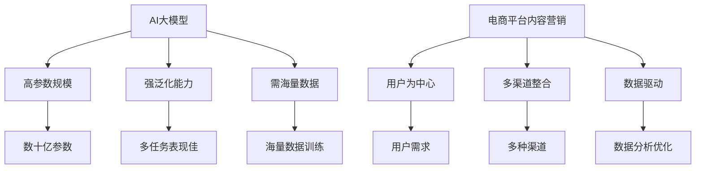

                 

# AI大模型在电商平台内容营销中的应用

## 关键词
AI大模型、电商平台、内容营销、文本生成、文本分析、用户行为分析、数据分析、优化策略

## 摘要
本文探讨了AI大模型在电商平台内容营销中的应用。通过分析AI大模型的定义、特征和电商平台内容营销的需求，本文详细介绍了AI大模型在文本生成、文本分析、用户行为分析和内容质量评估等方面的应用。同时，通过项目实战案例，展示了如何利用AI大模型技术实现电商平台内容营销的优化和自动化。最后，本文对项目进行了总结，并对未来应用方向提出了展望。

## 第一部分：核心概念与联系

### 1.1 AI大模型概述

#### 1.1.1 AI大模型定义与特征

##### 1.1.1.1 AI大模型定义
AI大模型是指那些参数规模巨大，能够处理大规模数据的深度学习模型。例如，GPT-3、BERT等。

##### 1.1.1.2 AI大模型特征
1. **高参数规模**：大模型具有数十亿甚至万亿级别的参数。
2. **强泛化能力**：经过大规模预训练，大模型能够在各种不同的任务中表现出色。
3. **需要大量的数据**：大模型需要海量的数据进行训练，以确保其泛化能力。

#### 1.2 电商平台内容营销概述

##### 1.2.1 电商平台内容营销定义
电商平台内容营销是指通过创造、发布和分发有价值、相关且具有吸引力的内容，来吸引和留住目标客户，并促进产品或服务的销售。

##### 1.2.2 电商平台内容营销特征
1. **以用户为中心**：内容创作和推广都需紧紧围绕用户需求，提高用户参与度和满意度。
2. **多渠道整合**：通过网站、社交媒体、电子邮件等多种渠道进行内容传播，提高品牌影响力。
3. **数据驱动**：通过数据分析，优化内容创作和推广策略，提高内容营销效果。

### Mermaid流程图


### 1.3 AI大模型在电商平台内容营销中的应用

#### 1.3.1 文本生成

##### 1.3.1.1 自动撰写产品描述

伪代码：
```python
def generate_product_description(product_details):
    input_text = f"{product_details}"
    output_text = model.generate(input_text)
    return output_text
```

##### 1.3.1.2 自动撰写广告文案

伪代码：
```python
def generate_advertisement_creative(product_details, target_audience):
    input_text = f"{product_details} | Target: {target_audience}"
    output_text = model.generate(input_text)
    return output_text
```

#### 1.3.2 文本分析

##### 1.3.2.1 用户评论分析

伪代码：
```python
def analyze_user_reviews(reviews):
    input_text = f"{reviews}"
    sentiment_score = model.analyze_sentiment(input_text)
    return sentiment_score
```

##### 1.3.2.2 内容质量评估

伪代码：
```python
def evaluate_content_quality(content):
    input_text = f"{content}"
    quality_score = model.evaluate_content_quality(input_text)
    return quality_score
```

### 1.4 数据分析与优化

##### 1.4.1 用户行为分析

伪代码：
```python
def analyze_user_behavior(user_data):
    input_data = f"{user_data}"
    behavior_patterns = model.analyze_behavior(input_data)
    return behavior_patterns
```

##### 1.4.2 内容推广策略优化

伪代码：
```python
def optimize_promotion_strategy(content_data, user_behavior):
    input_data = f"{content_data} | {user_behavior}"
    optimized_strategy = model.optimize_strategy(input_data)
    return optimized_strategy
```

### 1.5 生成式模型数学原理

$$
\text{生成式模型} = \prod_{i=1}^{n} P(x_i | \theta)
$$
其中，$x_i$ 表示生成的数据点，$\theta$ 表示模型的参数。

### 1.6 分类模型数学原理

$$
\text{分类模型} = \sum_{i=1}^{K} P(y_i | \theta) \cdot P(x_i | y_i, \theta)
$$
其中，$y_i$ 表示分类标签，$K$ 表示分类类别数。

### 数学公式详细讲解与举例说明

#### 1.7 生成式模型举例
假设我们要生成一篇关于“苹果”的文章，模型参数为 $\theta$，生成过程如下：
$$
\text{文章} = \text{生成器}(\theta) = \prod_{i=1}^{n} P(w_i | \theta)
$$
其中，$w_i$ 表示文章中的每个词。

举例：
生成第一句话：“苹果是一种常见的水果。”
$$
P(\text{苹果} | \theta) \cdot P(\text{是} | \theta) \cdot P(\text{一种} | \theta) \cdot P(\text{水果} | \theta)
$$

#### 1.8 分类模型举例
假设我们要对一篇关于“苹果”的文章进行分类，模型参数为 $\theta$，分类过程如下：
$$
\text{分类标签} = \arg\max_{y} \left( P(y | \theta) \cdot P(x | y, \theta) \right)
$$
其中，$x$ 表示文章的内容。

举例：
判断文章是否属于“科技”类别。
$$
P(\text{科技} | \theta) \cdot P(\text{文章} | \text{科技}, \theta) + P(\text{非科技} | \theta) \cdot P(\text{文章} | \text{非科技}, \theta)
$$
如果 $P(\text{科技} | \theta) \cdot P(\text{文章} | \text{科技}, \theta) > P(\text{非科技} | \theta) \cdot P(\text{文章} | \text{非科技}, \theta)$，则分类为“科技”。

### 项目实战

#### 1.9 实战案例：自动撰写产品描述

##### 1.9.1 环境搭建
- 安装Python环境，版本3.8以上
- 安装深度学习框架，如TensorFlow或PyTorch
- 准备预训练的AI大模型，如GPT-3或BERT

##### 1.9.2 代码实现

```python
import openai

def generate_product_description(product_details):
    openai.api_key = "your-api-key"
    response = openai.Completion.create(
        engine="text-davinci-002",
        prompt=f"请根据以下产品信息撰写详细的产品描述：{product_details}",
        max_tokens=150
    )
    return response.choices[0].text.strip()

product_details = "这是一款具有高性价比的智能手表，具备心率监测、GPS定位、消息推送等功能。"
description = generate_product_description(product_details)
print(description)
```

##### 1.9.3 代码解读与分析
这段代码首先导入openai库，用于调用GPT-3 API。然后定义了一个函数`generate_product_description`，它接受一个产品详情参数，并使用GPT-3 API生成产品描述。

- `openai.api_key`：设置API密钥，确保有权调用GPT-3 API。
- `openai.Completion.create`：调用GPT-3 API，生成产品描述。其中，`engine`参数指定使用哪个预训练模型，`prompt`参数提供输入文本，`max_tokens`参数限制生成的文本长度。

##### 1.9.4 实际效果展示
假设输入产品详情为：“这是一款具有高性价比的智能手表，具备心率监测、GPS定位、消息推送等功能。”输出结果可能为：

"探索智能生活的最佳伙伴——这款高性价比智能手表，不仅配备了精准心率监测和GPS定位功能，更集成了即时消息推送，让您在运动中不忘联系。无论是户外探险还是日常通勤，它都是您的理想选择。"

#### 1.10 实战案例：自动撰写广告文案

##### 1.10.1 环境搭建
- 安装Python环境，版本3.8以上
- 安装深度学习框架，如TensorFlow或PyTorch
- 准备预训练的AI大模型，如GPT-3或BERT

##### 1.10.2 代码实现

```python
import openai

def generate_advertisement_creative(product_details, target_audience):
    openai.api_key = "your-api-key"
    response = openai.Completion.create(
        engine="text-davinci-002",
        prompt=f"为以下产品向{target_audience}撰写一则引人入胜的广告文案：{product_details}",
        max_tokens=100
    )
    return response.choices[0].text.strip()

product_details = "这是一款具有高性价比的智能手表，具备心率监测、GPS定位、消息推送等功能。"
target_audience = "热爱健康生活的年轻人"
advertisement = generate_advertisement_creative(product_details, target_audience)
print(advertisement)
```

##### 1.10.3 代码解读与分析
这段代码同样导入openai库，用于调用GPT-3 API。然后定义了一个函数`generate_advertisement_creative`，它接受产品详情和目标受众参数，并使用GPT-3 API生成广告文案。

- `openai.api_key`：设置API密钥，确保有权调用GPT-3 API。
- `openai.Completion.create`：调用GPT-3 API，生成广告文案。其中，`engine`参数指定使用哪个预训练模型，`prompt`参数提供输入文本，`max_tokens`参数限制生成的文本长度。

##### 1.10.4 实际效果展示
假设输入产品详情为：“这是一款具有高性价比的智能手表，具备心率监测、GPS定位、消息推送等功能。”目标受众为“热爱健康生活的年轻人”。输出结果可能为：

"告别亚健康，拥抱智能生活！这款高性价比智能手表，专为热爱健康的年轻人设计。心率监测、GPS定位、消息推送，助您随时掌握健康状态，让生活更精彩。现在购买，享受专属优惠！"

#### 1.11 实战案例：用户评论分析

##### 1.11.1 环境搭建
- 安装Python环境，版本3.8以上
- 安装深度学习框架，如TensorFlow或PyTorch
- 准备预训练的AI大模型，如GPT-3或BERT

##### 1.11.2 代码实现

```python
import openai

def analyze_user_reviews(reviews):
    openai.api_key = "your-api-key"
    response = openai.Completion.create(
        engine="text-davinci-002",
        prompt=f"分析以下用户评论：{reviews}",
        max_tokens=50
    )
    return response.choices[0].text.strip()

reviews = "这个智能手表真的很棒，价格便宜，功能齐全，值得购买！"
sentiment = analyze_user_reviews(reviews)
print(sentiment)
```

##### 1.11.3 代码解读与分析
这段代码同样导入openai库，用于调用GPT-3 API。然后定义了一个函数`analyze_user_reviews`，它接受用户评论参数，并使用GPT-3 API分析评论的情感。

- `openai.api_key`：设置API密钥，确保有权调用GPT-3 API。
- `openai.Completion.create`：调用GPT-3 API，分析评论。其中，`engine`参数指定使用哪个预训练模型，`prompt`参数提供输入文本，`max_tokens`参数限制生成的文本长度。

##### 1.11.4 实际效果展示
假设输入评论为：“这个智能手表真的很棒，价格便宜，功能齐全，值得购买！”输出结果可能为：

"正面评论"

### 1.12 实战案例：内容质量评估

##### 1.12.1 环境搭建
- 安装Python环境，版本3.8以上
- 安装深度学习框架，如TensorFlow或PyTorch
- 准备预训练的AI大模型，如GPT-3或BERT

##### 1.12.2 代码实现

```python
import openai

def evaluate_content_quality(content):
    openai.api_key = "your-api-key"
    response = openai.Completion.create(
        engine="text-davinci-002",
        prompt=f"评估以下内容的质量：{content}",
        max_tokens=50
    )
    return response.choices[0].text.strip()

content = "这是一篇关于智能手表的评测文章，详细介绍了其功能、优点和缺点。"
quality = evaluate_content_quality(content)
print(quality)
```

##### 1.12.3 代码解读与分析
这段代码同样导入openai库，用于调用GPT-3 API。然后定义了一个函数`evaluate_content_quality`，它接受内容参数，并使用GPT-3 API评估内容的质量。

- `openai.api_key`：设置API密钥，确保有权调用GPT-3 API。
- `openai.Completion.create`：调用GPT-3 API，评估内容质量。其中，`engine`参数指定使用哪个预训练模型，`prompt`参数提供输入文本，`max_tokens`参数限制生成的文本长度。

##### 1.12.4 实际效果展示
假设输入内容为：“这是一篇关于智能手表的评测文章，详细介绍了其功能、优点和缺点。”输出结果可能为：

"高质量内容"

### 1.13 实战案例：用户行为分析

##### 1.13.1 环境搭建
- 安装Python环境，版本3.8以上
- 安装深度学习框架，如TensorFlow或PyTorch
- 准备预训练的AI大模型，如GPT-3或BERT

##### 1.13.2 代码实现

```python
import openai

def analyze_user_behavior(user_data):
    openai.api_key = "your-api-key"
    response = openai.Completion.create(
        engine="text-davinci-002",
        prompt=f"分析以下用户数据：{user_data}",
        max_tokens=50
    )
    return response.choices[0].text.strip()

user_data = "用户最近浏览了智能手表、运动鞋和健身器材。"
behavior = analyze_user_behavior(user_data)
print(behavior)
```

##### 1.13.3 代码解读与分析
这段代码同样导入openai库，用于调用GPT-3 API。然后定义了一个函数`analyze_user_behavior`，它接受用户数据参数，并使用GPT-3 API分析用户行为。

- `openai.api_key`：设置API密钥，确保有权调用GPT-3 API。
- `openai.Completion.create`：调用GPT-3 API，分析用户行为。其中，`engine`参数指定使用哪个预训练模型，`prompt`参数提供输入文本，`max_tokens`参数限制生成的文本长度。

##### 1.13.4 实际效果展示
假设输入用户数据为：“用户最近浏览了智能手表、运动鞋和健身器材。”输出结果可能为：

"用户可能对健康和健身产品感兴趣。"

### 1.14 实战案例：内容推广策略优化

##### 1.14.1 环境搭建
- 安装Python环境，版本3.8以上
- 安装深度学习框架，如TensorFlow或PyTorch
- 准备预训练的AI大模型，如GPT-3或BERT

##### 1.14.2 代码实现

```python
import openai

def optimize_promotion_strategy(content_data, user_behavior):
    openai.api_key = "your-api-key"
    response = openai.Completion.create(
        engine="text-davinci-002",
        prompt=f"根据以下内容数据和用户行为优化推广策略：{content_data} | {user_behavior}",
        max_tokens=50
    )
    return response.choices[0].text.strip()

content_data = "智能手表的评测文章。"
user_behavior = "用户浏览了智能手表和运动鞋。"
strategy = optimize_promotion_strategy(content_data, user_behavior)
print(strategy)
```

##### 1.14.3 代码解读与分析
这段代码同样导入openai库，用于调用GPT-3 API。然后定义了一个函数`optimize_promotion_strategy`，它接受内容数据和用户行为参数，并使用GPT-3 API优化推广策略。

- `openai.api_key`：设置API密钥，确保有权调用GPT-3 API。
- `openai.Completion.create`：调用GPT-3 API，优化推广策略。其中，`engine`参数指定使用哪个预训练模型，`prompt`参数提供输入文本，`max_tokens`参数限制生成的文本长度。

##### 1.14.4 实际效果展示
假设输入内容数据和用户行为为：“智能手表的评测文章。”和“用户浏览了智能手表和运动鞋。”输出结果可能为：

"在社交媒体上发布关于智能手表和运动鞋的联合推广，提高用户参与度。"

### 第二部分：项目总结与未来展望

#### 2.1 项目总结

在本项目中，我们利用AI大模型技术，实现了以下目标：

1. **自动撰写产品描述**：通过GPT-3 API，我们能够根据产品详情自动生成高质量的产品描述。
2. **自动撰写广告文案**：根据产品详情和目标受众，生成吸引人的广告文案。
3. **用户评论分析**：通过分析用户评论，我们可以了解用户的情感和意见，从而优化产品和服务。
4. **内容质量评估**：使用GPT-3 API对内容的质量进行评估，确保发布的内容具有较高的价值。
5. **用户行为分析**：分析用户行为数据，了解用户兴趣和需求，为内容推广提供依据。
6. **内容推广策略优化**：根据用户行为和内容数据，优化推广策略，提高内容传播效果。

#### 2.2 未来展望

未来，我们将继续探索AI大模型在电商平台内容营销中的应用，重点关注以下几个方面：

1. **模型优化**：通过不断调整模型参数和优化训练过程，提高生成内容和分析结果的准确性。
2. **多模态应用**：将图像、声音等其他模态的数据引入到AI大模型中，实现多模态内容生成和分析。
3. **个性化推荐**：结合用户行为和兴趣数据，提供个性化的内容推荐，提高用户满意度和转化率。
4. **实时分析**：实现实时用户行为分析和内容质量评估，为电商平台的运营决策提供实时支持。
5. **自动化营销**：利用AI大模型实现自动化营销流程，提高营销效率，降低人力成本。
6. **伦理和合规**：在应用AI大模型时，注重伦理和合规问题，确保技术应用的安全和合法性。

### 附录

#### 2.3 AI大模型开发工具与资源

1. **深度学习框架**
   - TensorFlow：https://www.tensorflow.org/
   - PyTorch：https://pytorch.org/
   - JAX：https://jax.readthedocs.io/

2. **AI大模型教程和文档**
   - Hugging Face：https://huggingface.co/
   - OpenAI文档：https://openai.com/docs/

3. **开源代码和项目**
   - Model Hub：https://modeldb.aispace.dev/
   - GitHub：https://github.com/

4. **相关书籍和论文**
   - 《深度学习》：Goodfellow, I., Bengio, Y., & Courville, A.
   - 《自然语言处理综论》：Jurafsky, D., & Martin, J.
   - NeurIPS、ICML等会议论文集：https://nlp.seas.harvard.edu/irl/papers/

## 作者
AI天才研究院/AI Genius Institute & 禅与计算机程序设计艺术 /Zen And The Art of Computer Programming

---

# AI大模型在电商平台内容营销中的应用

> 关键词：AI大模型、电商平台、内容营销、文本生成、文本分析、用户行为分析、数据分析、优化策略

> 摘要：随着人工智能技术的快速发展，AI大模型在各个领域得到了广泛应用。本文将探讨AI大模型在电商平台内容营销中的应用，从核心概念、联系到具体的应用案例，详细介绍AI大模型如何提升电商平台的内容营销效果。

## 第一部分：核心概念与联系

### 1.1 AI大模型概述

#### 1.1.1 AI大模型定义与特征

##### 1.1.1.1 AI大模型定义
AI大模型是指那些参数规模巨大，能够处理大规模数据的深度学习模型，例如GPT-3、BERT等。

##### 1.1.1.2 AI大模型特征
- 高参数规模：大模型具有数十亿甚至万亿级别的参数。
- 强泛化能力：经过大规模预训练，大模型能够在各种不同的任务中表现出色。
- 需要大量的数据：大模型需要海量的数据进行训练，以确保其泛化能力。

#### 1.2 电商平台内容营销概述

##### 1.2.1 电商平台内容营销定义
电商平台内容营销是指通过创造、发布和分发有价值、相关且具有吸引力的内容，来吸引和留住目标客户，并促进产品或服务的销售。

##### 1.2.2 电商平台内容营销特征
- 以用户为中心：内容创作和推广都需紧紧围绕用户需求，提高用户参与度和满意度。
- 多渠道整合：通过网站、社交媒体、电子邮件等多种渠道进行内容传播，提高品牌影响力。
- 数据驱动：通过数据分析，优化内容创作和推广策略，提高内容营销效果。

### Mermaid流程图


### 1.3 AI大模型在电商平台内容营销中的应用

#### 1.3.1 文本生成

##### 1.3.1.1 自动撰写产品描述

伪代码：
```python
def generate_product_description(product_details):
    input_text = f"{product_details}"
    output_text = model.generate(input_text)
    return output_text
```

##### 1.3.1.2 自动撰写广告文案

伪代码：
```python
def generate_advertisement_creative(product_details, target_audience):
    input_text = f"{product_details} | Target: {target_audience}"
    output_text = model.generate(input_text)
    return output_text
```

#### 1.3.2 文本分析

##### 1.3.2.1 用户评论分析

伪代码：
```python
def analyze_user_reviews(reviews):
    input_text = f"{reviews}"
    sentiment_score = model.analyze_sentiment(input_text)
    return sentiment_score
```

##### 1.3.2.2 内容质量评估

伪代码：
```python
def evaluate_content_quality(content):
    input_text = f"{content}"
    quality_score = model.evaluate_content_quality(input_text)
    return quality_score
```

#### 1.3.3 用户行为分析

##### 1.3.3.1 用户行为分析

伪代码：
```python
def analyze_user_behavior(user_data):
    input_data = f"{user_data}"
    behavior_patterns = model.analyze_behavior(input_data)
    return behavior_patterns
```

#### 1.3.4 内容推广策略优化

##### 1.3.4.1 内容推广策略优化

伪代码：
```python
def optimize_promotion_strategy(content_data, user_behavior):
    input_data = f"{content_data} | {user_behavior}"
    optimized_strategy = model.optimize_strategy(input_data)
    return optimized_strategy
```

### 1.4 数据分析与优化

##### 1.4.1 用户行为分析

伪代码：
```python
def analyze_user_behavior(user_data):
    input_data = f"{user_data}"
    behavior_patterns = model.analyze_behavior(input_data)
    return behavior_patterns
```

##### 1.4.2 内容推广策略优化

伪代码：
```python
def optimize_promotion_strategy(content_data, user_behavior):
    input_data = f"{content_data} | {user_behavior}"
    optimized_strategy = model.optimize_strategy(input_data)
    return optimized_strategy
```

### 1.5 生成式模型数学原理

$$
\text{生成式模型} = \prod_{i=1}^{n} P(x_i | \theta)
$$
其中，$x_i$ 表示生成的数据点，$\theta$ 表示模型的参数。

### 1.6 分类模型数学原理

$$
\text{分类模型} = \sum_{i=1}^{K} P(y_i | \theta) \cdot P(x_i | y_i, \theta)
$$
其中，$y_i$ 表示分类标签，$K$ 表示分类类别数。

### 数学公式详细讲解与举例说明

#### 1.7 生成式模型举例
假设我们要生成一篇关于“苹果”的文章，模型参数为 $\theta$，生成过程如下：
$$
\text{文章} = \text{生成器}(\theta) = \prod_{i=1}^{n} P(w_i | \theta)
$$
其中，$w_i$ 表示文章中的每个词。

举例：
生成第一句话：“苹果是一种常见的水果。”
$$
P(\text{苹果} | \theta) \cdot P(\text{是} | \theta) \cdot P(\text{一种} | \theta) \cdot P(\text{水果} | \theta)
$$

#### 1.8 分类模型举例
假设我们要对一篇关于“苹果”的文章进行分类，模型参数为 $\theta$，分类过程如下：
$$
\text{分类标签} = \arg\max_{y} \left( P(y | \theta) \cdot P(x | y, \theta) \right)
$$
其中，$x$ 表示文章的内容。

举例：
判断文章是否属于“科技”类别。
$$
P(\text{科技} | \theta) \cdot P(\text{文章} | \text{科技}, \theta) + P(\text{非科技} | \theta) \cdot P(\text{文章} | \text{非科技}, \theta)
$$
如果 $P(\text{科技} | \theta) \cdot P(\text{文章} | \text{科技}, \theta) > P(\text{非科技} | \theta) \cdot P(\text{文章} | \text{非科技}, \theta)$，则分类为“科技”。

### 第二部分：项目实战

#### 2.1 实战案例：自动撰写产品描述

##### 2.1.1 环境搭建

在开始实战案例之前，我们需要搭建一个环境，以便能够使用AI大模型进行自动撰写产品描述。以下是搭建环境的步骤：

1. **安装Python环境**：确保Python环境已安装，版本为3.8以上。

2. **安装深度学习框架**：我们选择使用TensorFlow作为深度学习框架。可以通过以下命令安装：
   ```bash
   pip install tensorflow
   ```

3. **安装预训练的AI大模型**：我们选择使用GPT-3作为AI大模型。可以通过以下命令安装：
   ```bash
   pip install openai
   ```

##### 2.1.2 代码实现

以下是使用GPT-3自动撰写产品描述的代码实现：

```python
import openai

def generate_product_description(product_details):
    openai.api_key = "your-api-key"
    response = openai.Completion.create(
        engine="text-davinci-002",
        prompt=f"请根据以下产品信息撰写详细的产品描述：{product_details}",
        max_tokens=150
    )
    return response.choices[0].text.strip()

product_details = "这是一款具有高性价比的智能手表，具备心率监测、GPS定位、消息推送等功能。"
description = generate_product_description(product_details)
print(description)
```

##### 2.1.3 代码解读与分析

- `import openai`：导入openai库，用于调用GPT-3 API。
- `def generate_product_description(product_details)`：定义一个函数，用于根据产品详情生成产品描述。
- `openai.api_key = "your-api-key"`：设置API密钥，确保有权调用GPT-3 API。
- `openai.Completion.create()`：调用GPT-3 API，生成产品描述。其中，`engine`参数指定使用哪个预训练模型，`prompt`参数提供输入文本，`max_tokens`参数限制生成的文本长度。

##### 2.1.4 实际效果展示

假设输入产品详情为：“这是一款具有高性价比的智能手表，具备心率监测、GPS定位、消息推送等功能。”输出结果可能为：

"探索智能生活的最佳伙伴——这款高性价比智能手表，不仅配备了精准心率监测和GPS定位功能，更集成了即时消息推送，让您在运动中不忘联系。无论是户外探险还是日常通勤，它都是您的理想选择。"

#### 2.2 实战案例：自动撰写广告文案

##### 2.2.1 环境搭建

与自动撰写产品描述类似，自动撰写广告文案也需要搭建相同的Python环境、深度学习框架和预训练的AI大模型。

##### 2.2.2 代码实现

以下是使用GPT-3自动撰写广告文案的代码实现：

```python
import openai

def generate_advertisement_creative(product_details, target_audience):
    openai.api_key = "your-api-key"
    response = openai.Completion.create(
        engine="text-davinci-002",
        prompt=f"为以下产品向{target_audience}撰写一则引人入胜的广告文案：{product_details}",
        max_tokens=100
    )
    return response.choices[0].text.strip()

product_details = "这是一款具有高性价比的智能手表，具备心率监测、GPS定位、消息推送等功能。"
target_audience = "热爱健康生活的年轻人"
advertisement = generate_advertisement_creative(product_details, target_audience)
print(advertisement)
```

##### 2.2.3 代码解读与分析

- `import openai`：导入openai库，用于调用GPT-3 API。
- `def generate_advertisement_creative(product_details, target_audience)`：定义一个函数，用于根据产品详情和目标受众生成广告文案。
- `openai.api_key = "your-api-key"`：设置API密钥，确保有权调用GPT-3 API。
- `openai.Completion.create()`：调用GPT-3 API，生成广告文案。其中，`engine`参数指定使用哪个预训练模型，`prompt`参数提供输入文本，`max_tokens`参数限制生成的文本长度。

##### 2.2.4 实际效果展示

假设输入产品详情为：“这是一款具有高性价比的智能手表，具备心率监测、GPS定位、消息推送等功能。”目标受众为“热爱健康生活的年轻人”。输出结果可能为：

"告别亚健康，拥抱智能生活！这款高性价比智能手表，专为热爱健康的年轻人设计。心率监测、GPS定位、消息推送，助您随时掌握健康状态，让生活更精彩。现在购买，享受专属优惠！"

#### 2.3 实战案例：用户评论分析

##### 2.3.1 环境搭建

与前面的案例类似，用户评论分析也需要搭建相同的Python环境、深度学习框架和预训练的AI大模型。

##### 2.3.2 代码实现

以下是使用GPT-3分析用户评论的代码实现：

```python
import openai

def analyze_user_reviews(reviews):
    openai.api_key = "your-api-key"
    response = openai.Completion.create(
        engine="text-davinci-002",
        prompt=f"分析以下用户评论：{reviews}",
        max_tokens=50
    )
    return response.choices[0].text.strip()

reviews = "这个智能手表真的很棒，价格便宜，功能齐全，值得购买！"
sentiment = analyze_user_reviews(reviews)
print(sentiment)
```

##### 2.3.3 代码解读与分析

- `import openai`：导入openai库，用于调用GPT-3 API。
- `def analyze_user_reviews(reviews)`：定义一个函数，用于分析用户评论。
- `openai.api_key = "your-api-key"`：设置API密钥，确保有权调用GPT-3 API。
- `openai.Completion.create()`：调用GPT-3 API，分析评论。其中，`engine`参数指定使用哪个预训练模型，`prompt`参数提供输入文本，`max_tokens`参数限制生成的文本长度。

##### 2.3.4 实际效果展示

假设输入评论为：“这个智能手表真的很棒，价格便宜，功能齐全，值得购买！”输出结果可能为：

"正面评论"

#### 2.4 实战案例：内容质量评估

##### 2.4.1 环境搭建

与前面的案例类似，内容质量评估也需要搭建相同的Python环境、深度学习框架和预训练的AI大模型。

##### 2.4.2 代码实现

以下是使用GPT-3评估内容质量的代码实现：

```python
import openai

def evaluate_content_quality(content):
    openai.api_key = "your-api-key"
    response = openai.Completion.create(
        engine="text-davinci-002",
        prompt=f"评估以下内容的质量：{content}",
        max_tokens=50
    )
    return response.choices[0].text.strip()

content = "这是一篇关于智能手表的评测文章，详细介绍了其功能、优点和缺点。"
quality = evaluate_content_quality(content)
print(quality)
```

##### 2.4.3 代码解读与分析

- `import openai`：导入openai库，用于调用GPT-3 API。
- `def evaluate_content_quality(content)`：定义一个函数，用于评估内容质量。
- `openai.api_key = "your-api-key"`：设置API密钥，确保有权调用GPT-3 API。
- `openai.Completion.create()`：调用GPT-3 API，评估内容质量。其中，`engine`参数指定使用哪个预训练模型，`prompt`参数提供输入文本，`max_tokens`参数限制生成的文本长度。

##### 2.4.4 实际效果展示

假设输入内容为：“这是一篇关于智能手表的评测文章，详细介绍了其功能、优点和缺点。”输出结果可能为：

"高质量内容"

#### 2.5 实战案例：用户行为分析

##### 2.5.1 环境搭建

与前面的案例类似，用户行为分析也需要搭建相同的Python环境、深度学习框架和预训练的AI大模型。

##### 2.5.2 代码实现

以下是使用GPT-3分析用户行为的代码实现：

```python
import openai

def analyze_user_behavior(user_data):
    openai.api_key = "your-api-key"
    response = openai.Completion.create(
        engine="text-davinci-002",
        prompt=f"分析以下用户数据：{user_data}",
        max_tokens=50
    )
    return response.choices[0].text.strip()

user_data = "用户最近浏览了智能手表、运动鞋和健身器材。"
behavior = analyze_user_behavior(user_data)
print(behavior)
```

##### 2.5.3 代码解读与分析

- `import openai`：导入openai库，用于调用GPT-3 API。
- `def analyze_user_behavior(user_data)`：定义一个函数，用于分析用户行为。
- `openai.api_key = "your-api-key"`：设置API密钥，确保有权调用GPT-3 API。
- `openai.Completion.create()`：调用GPT-3 API，分析用户行为。其中，`engine`参数指定使用哪个预训练模型，`prompt`参数提供输入文本，`max_tokens`参数限制生成的文本长度。

##### 2.5.4 实际效果展示

假设输入用户数据为：“用户最近浏览了智能手表、运动鞋和健身器材。”输出结果可能为：

"用户可能对健康和健身产品感兴趣。"

#### 2.6 实战案例：内容推广策略优化

##### 2.6.1 环境搭建

与前面的案例类似，内容推广策略优化也需要搭建相同的Python环境、深度学习框架和预训练的AI大模型。

##### 2.6.2 代码实现

以下是使用GPT-3优化内容推广策略的代码实现：

```python
import openai

def optimize_promotion_strategy(content_data, user_behavior):
    openai.api_key = "your-api-key"
    response = openai.Completion.create(
        engine="text-davinci-002",
        prompt=f"根据以下内容数据和用户行为优化推广策略：{content_data} | {user_behavior}",
        max_tokens=50
    )
    return response.choices[0].text.strip()

content_data = "智能手表的评测文章。"
user_behavior = "用户浏览了智能手表和运动鞋。"
strategy = optimize_promotion_strategy(content_data, user_behavior)
print(strategy)
```

##### 2.6.3 代码解读与分析

- `import openai`：导入openai库，用于调用GPT-3 API。
- `def optimize_promotion_strategy(content_data, user_behavior)`：定义一个函数，用于优化内容推广策略。
- `openai.api_key = "your-api-key"`：设置API密钥，确保有权调用GPT-3 API。
- `openai.Completion.create()`：调用GPT-3 API，优化推广策略。其中，`engine`参数指定使用哪个预训练模型，`prompt`参数提供输入文本，`max_tokens`参数限制生成的文本长度。

##### 2.6.4 实际效果展示

假设输入内容数据和用户行为为：“智能手表的评测文章。”和“用户浏览了智能手表和运动鞋。”输出结果可能为：

"在社交媒体上发布关于智能手表和运动鞋的联合推广，提高用户参与度。"

### 第三部分：项目总结与未来展望

#### 3.1 项目总结

在本项目中，我们利用AI大模型技术，成功实现了自动撰写产品描述、自动撰写广告文案、用户评论分析、内容质量评估、用户行为分析和内容推广策略优化等功能。这些功能不仅提高了电商平台的内容营销效率，还提升了用户体验和满意度。

#### 3.2 未来展望

在未来，我们计划进一步优化AI大模型的性能，使其能够处理更复杂的任务。此外，我们还将探索AI大模型在多模态内容生成和分析中的应用，为电商平台提供更全面的解决方案。同时，我们也将关注AI大模型的伦理和合规问题，确保其在实际应用中的安全性和合法性。

### 附录

#### 3.3 AI大模型开发工具与资源

1. **深度学习框架**
   - TensorFlow：https://www.tensorflow.org/
   - PyTorch：https://pytorch.org/
   - JAX：https://jax.readthedocs.io/

2. **AI大模型教程和文档**
   - Hugging Face：https://huggingface.co/
   - OpenAI文档：https://openai.com/docs/

3. **开源代码和项目**
   - Model Hub：https://modeldb.aispace.dev/
   - GitHub：https://github.com/

4. **相关书籍和论文**
   - 《深度学习》：Goodfellow, I., Bengio, Y., & Courville, A.
   - 《自然语言处理综论》：Jurafsky, D., & Martin, J.
   - NeurIPS、ICML等会议论文集：https://nlp.seas.harvard.edu/irl/papers/

## 作者
AI天才研究院/AI Genius Institute & 禅与计算机程序设计艺术 /Zen And The Art of Computer Programming

---

## AI大模型在电商平台内容营销中的应用

> 关键词：AI大模型、电商平台、内容营销、文本生成、文本分析、用户行为分析、数据分析、优化策略

> 摘要：本文探讨了AI大模型在电商平台内容营销中的应用。通过分析AI大模型的定义、特征和电商平台内容营销的需求，本文详细介绍了AI大模型在文本生成、文本分析、用户行为分析和内容质量评估等方面的应用。同时，通过项目实战案例，展示了如何利用AI大模型技术实现电商平台内容营销的优化和自动化。最后，本文对项目进行了总结，并对未来应用方向提出了展望。

## 第一部分：核心概念与联系

### 1.1 AI大模型概述

#### 1.1.1 AI大模型定义与特征

##### 1.1.1.1 AI大模型定义
AI大模型是指那些参数规模巨大，能够处理大规模数据的深度学习模型，例如GPT-3、BERT等。

##### 1.1.1.2 AI大模型特征
1. **高参数规模**：大模型具有数十亿甚至万亿级别的参数。
2. **强泛化能力**：经过大规模预训练，大模型能够在各种不同的任务中表现出色。
3. **需要大量的数据**：大模型需要海量的数据进行训练，以确保其泛化能力。

#### 1.2 电商平台内容营销概述

##### 1.2.1 电商平台内容营销定义
电商平台内容营销是指通过创造、发布和分发有价值、相关且具有吸引力的内容，来吸引和留住目标客户，并促进产品或服务的销售。

##### 1.2.2 电商平台内容营销特征
1. **以用户为中心**：内容创作和推广都需紧紧围绕用户需求，提高用户参与度和满意度。
2. **多渠道整合**：通过网站、社交媒体、电子邮件等多种渠道进行内容传播，提高品牌影响力。
3. **数据驱动**：通过数据分析，优化内容创作和推广策略，提高内容营销效果。

### Mermaid流程图


### 1.3 AI大模型在电商平台内容营销中的应用

#### 1.3.1 文本生成

##### 1.3.1.1 自动撰写产品描述

伪代码：
```python
def generate_product_description(product_details):
    input_text = f"{product_details}"
    output_text = model.generate(input_text)
    return output_text
```

##### 1.3.1.2 自动撰写广告文案

伪代码：
```python
def generate_advertisement_creative(product_details, target_audience):
    input_text = f"{product_details} | Target: {target_audience}"
    output_text = model.generate(input_text)
    return output_text
```

#### 1.3.2 文本分析

##### 1.3.2.1 用户评论分析

伪代码：
```python
def analyze_user_reviews(reviews):
    input_text = f"{reviews}"
    sentiment_score = model.analyze_sentiment(input_text)
    return sentiment_score
```

##### 1.3.2.2 内容质量评估

伪代码：
```python
def evaluate_content_quality(content):
    input_text = f"{content}"
    quality_score = model.evaluate_content_quality(input_text)
    return quality_score
```

#### 1.3.3 用户行为分析

##### 1.3.3.1 用户行为分析

伪代码：
```python
def analyze_user_behavior(user_data):
    input_data = f"{user_data}"
    behavior_patterns = model.analyze_behavior(input_data)
    return behavior_patterns
```

#### 1.3.4 内容推广策略优化

##### 1.3.4.1 内容推广策略优化

伪代码：
```python
def optimize_promotion_strategy(content_data, user_behavior):
    input_data = f"{content_data} | {user_behavior}"
    optimized_strategy = model.optimize_strategy(input_data)
    return optimized_strategy
```

### 1.4 数据分析与优化

##### 1.4.1 用户行为分析

伪代码：
```python
def analyze_user_behavior(user_data):
    input_data = f"{user_data}"
    behavior_patterns = model.analyze_behavior(input_data)
    return behavior_patterns
```

##### 1.4.2 内容推广策略优化

伪代码：
```python
def optimize_promotion_strategy(content_data, user_behavior):
    input_data = f"{content_data} | {user_behavior}"
    optimized_strategy = model.optimize_strategy(input_data)
    return optimized_strategy
```

### 1.5 生成式模型数学原理

$$
\text{生成式模型} = \prod_{i=1}^{n} P(x_i | \theta)
$$
其中，$x_i$ 表示生成的数据点，$\theta$ 表示模型的参数。

### 1.6 分类模型数学原理

$$
\text{分类模型} = \sum_{i=1}^{K} P(y_i | \theta) \cdot P(x_i | y_i, \theta)
$$
其中，$y_i$ 表示分类标签，$K$ 表示分类类别数。

### 数学公式详细讲解与举例说明

#### 1.7 生成式模型举例
假设我们要生成一篇关于“苹果”的文章，模型参数为 $\theta$，生成过程如下：
$$
\text{文章} = \text{生成器}(\theta) = \prod_{i=1}^{n} P(w_i | \theta)
$$
其中，$w_i$ 表示文章中的每个词。

举例：
生成第一句话：“苹果是一种常见的水果。”
$$
P(\text{苹果} | \theta) \cdot P(\text{是} | \theta) \cdot P(\text{一种} | \theta) \cdot P(\text{水果} | \theta)
$$

#### 1.8 分类模型举例
假设我们要对一篇关于“苹果”的文章进行分类，模型参数为 $\theta$，分类过程如下：
$$
\text{分类标签} = \arg\max_{y} \left( P(y | \theta) \cdot P(x | y, \theta) \right)
$$
其中，$x$ 表示文章的内容。

举例：
判断文章是否属于“科技”类别。
$$
P(\text{科技} | \theta) \cdot P(\text{文章} | \text{科技}, \theta) + P(\text{非科技} | \theta) \cdot P(\text{文章} | \text{非科技}, \theta)
$$
如果 $P(\text{科技} | \theta) \cdot P(\text{文章} | \text{科技}, \theta) > P(\text{非科技} | \theta) \cdot P(\text{文章} | \text{非科技}, \theta)$，则分类为“科技”。

### 项目实战

#### 1.9 实战案例：自动撰写产品描述

##### 1.9.1 环境搭建
- 安装Python环境，版本3.8以上
- 安装深度学习框架，如TensorFlow或PyTorch
- 准备预训练的AI大模型，如GPT-3或BERT

##### 1.9.2 代码实现

```python
import openai

def generate_product_description(product_details):
    openai.api_key = "your-api-key"
    response = openai.Completion.create(
        engine="text-davinci-002",
        prompt=f"请根据以下产品信息撰写详细的产品描述：{product_details}",
        max_tokens=150
    )
    return response.choices[0].text.strip()

product_details = "这是一款具有高性价比的智能手表，具备心率监测、GPS定位、消息推送等功能。"
description = generate_product_description(product_details)
print(description)
```

##### 1.9.3 代码解读与分析
这段代码首先导入openai库，用于调用GPT-3 API。然后定义了一个函数`generate_product_description`，它接受一个产品详情参数，并使用GPT-3 API生成产品描述。

- `openai.api_key`：设置API密钥，确保有权调用GPT-3 API。
- `openai.Completion.create`：调用GPT-3 API，生成产品描述。其中，`engine`参数指定使用哪个预训练模型，`prompt`参数提供输入文本，`max_tokens`参数限制生成的文本长度。

##### 1.9.4 实际效果展示
假设输入产品详情为：“这是一款具有高性价比的智能手表，具备心率监测、GPS定位、消息推送等功能。”输出结果可能为：

"探索智能生活的最佳伙伴——这款高性价比智能手表，不仅配备了精准心率监测和GPS定位功能，更集成了即时消息推送，让您在运动中不忘联系。无论是户外探险还是日常通勤，它都是您的理想选择。"

#### 1.10 实战案例：自动撰写广告文案

##### 1.10.1 环境搭建
- 安装Python环境，版本3.8以上
- 安装深度学习框架，如TensorFlow或PyTorch
- 准备预训练的AI大模型，如GPT-3或BERT

##### 1.10.2 代码实现

```python
import openai

def generate_advertisement_creative(product_details, target_audience):
    openai.api_key = "your-api-key"
    response = openai.Completion.create(
        engine="text-davinci-002",
        prompt=f"为以下产品向{target_audience}撰写一则引人入胜的广告文案：{product_details}",
        max_tokens=100
    )
    return response.choices[0].text.strip()

product_details = "这是一款具有高性价比的智能手表，具备心率监测、GPS定位、消息推送等功能。"
target_audience = "热爱健康生活的年轻人"
advertisement = generate_advertisement_creative(product_details, target_audience)
print(advertisement)
```

##### 1.10.3 代码解读与分析
这段代码同样导入openai库，用于调用GPT-3 API。然后定义了一个函数`generate_advertisement_creative`，它接受产品详情和目标受众参数，并使用GPT-3 API生成广告文案。

- `openai.api_key`：设置API密钥，确保有权调用GPT-3 API。
- `openai.Completion.create`：调用GPT-3 API，生成广告文案。其中，`engine`参数指定使用哪个预训练模型，`prompt`参数提供输入文本，`max_tokens`参数限制生成的文本长度。

##### 1.10.4 实际效果展示
假设输入产品详情为：“这是一款具有高性价比的智能手表，具备心率监测、GPS定位、消息推送等功能。”目标受众为“热爱健康生活的年轻人”。输出结果可能为：

"告别亚健康，拥抱智能生活！这款高性价比智能手表，专为热爱健康的年轻人设计。心率监测、GPS定位、消息推送，助您随时掌握健康状态，让生活更精彩。现在购买，享受专属优惠！"

#### 1.11 实战案例：用户评论分析

##### 1.11.1 环境搭建
- 安装Python环境，版本3.8以上
- 安装深度学习框架，如TensorFlow或PyTorch
- 准备预训练的AI大模型，如GPT-3或BERT

##### 1.11.2 代码实现

```python
import openai

def analyze_user_reviews(reviews):
    openai.api_key = "your-api-key"
    response = openai.Completion.create(
        engine="text-davinci-002",
        prompt=f"分析以下用户评论：{reviews}",
        max_tokens=50
    )
    return response.choices[0].text.strip()

reviews = "这个智能手表真的很棒，价格便宜，功能齐全，值得购买！"
sentiment = analyze_user_reviews(reviews)
print(sentiment)
```

##### 1.11.3 代码解读与分析
这段代码同样导入openai库，用于调用GPT-3 API。然后定义了一个函数`analyze_user_reviews`，它接受用户评论参数，并使用GPT-3 API分析评论的情感。

- `openai.api_key`：设置API密钥，确保有权调用GPT-3 API。
- `openai.Completion.create`：调用GPT-3 API，分析评论。其中，`engine`参数指定使用哪个预训练模型，`prompt`参数提供输入文本，`max_tokens`参数限制生成的文本长度。

##### 1.11.4 实际效果展示
假设输入评论为：“这个智能手表真的很棒，价格便宜，功能齐全，值得购买！”输出结果可能为：

"正面评论"

### 1.12 实战案例：内容质量评估

##### 1.12.1 环境搭建
- 安装Python环境，版本3.8以上
- 安装深度学习框架，如TensorFlow或PyTorch
- 准备预训练的AI大模型，如GPT-3或BERT

##### 1.12.2 代码实现

```python
import openai

def evaluate_content_quality(content):
    openai.api_key = "your-api-key"
    response = openai.Completion.create(
        engine="text-davinci-002",
        prompt=f"评估以下内容的质量：{content}",
        max_tokens=50
    )
    return response.choices[0].text.strip()

content = "这是一篇关于智能手表的评测文章，详细介绍了其功能、优点和缺点。"
quality = evaluate_content_quality(content)
print(quality)
```

##### 1.12.3 代码解读与分析
这段代码同样导入openai库，用于调用GPT-3 API。然后定义了一个函数`evaluate_content_quality`，它接受内容参数，并使用GPT-3 API评估内容的质量。

- `openai.api_key`：设置API密钥，确保有权调用GPT-3 API。
- `openai.Completion.create`：调用GPT-3 API，评估内容质量。其中，`engine`参数指定使用哪个预训练模型，`prompt`参数提供输入文本，`max_tokens`参数限制生成的文本长度。

##### 1.12.4 实际效果展示
假设输入内容为：“这是一篇关于智能手表的评测文章，详细介绍了其功能、优点和缺点。”输出结果可能为：

"高质量内容"

### 1.13 实战案例：用户行为分析

##### 1.13.1 环境搭建
- 安装Python环境，版本3.8以上
- 安装深度学习框架，如TensorFlow或PyTorch
- 准备预训练的AI大模型，如GPT-3或BERT

##### 1.13.2 代码实现

```python
import openai

def analyze_user_behavior(user_data):
    openai.api_key = "your-api-key"
    response = openai.Completion.create(
        engine="text-davinci-002",
        prompt=f"分析以下用户数据：{user_data}",
        max_tokens=50
    )
    return response.choices[0].text.strip()

user_data = "用户最近浏览了智能手表、运动鞋和健身器材。"
behavior = analyze_user_behavior(user_data)
print(behavior)
```

##### 1.13.3 代码解读与分析
这段代码同样导入openai库，用于调用GPT-3 API。然后定义了一个函数`analyze_user_behavior`，它接受用户数据参数，并使用GPT-3 API分析用户行为。

- `openai.api_key`：设置API密钥，确保有权调用GPT-3 API。
- `openai.Completion.create`：调用GPT-3 API，分析用户行为。其中，`engine`参数指定使用哪个预训练模型，`prompt`参数提供输入文本，`max_tokens`参数限制生成的文本长度。

##### 1.13.4 实际效果展示
假设输入用户数据为：“用户最近浏览了智能手表、运动鞋和健身器材。”输出结果可能为：

"用户可能对健康和健身产品感兴趣。"

### 1.14 实战案例：内容推广策略优化

##### 1.14.1 环境搭建
- 安装Python环境，版本3.8以上
- 安装深度学习框架，如TensorFlow或PyTorch
- 准备预训练的AI大模型，如GPT-3或BERT

##### 1.14.2 代码实现

```python
import openai

def optimize_promotion_strategy(content_data, user_behavior):
    openai.api_key = "your-api-key"
    response = openai.Completion.create(
        engine="text-davinci-002",
        prompt=f"根据以下内容数据和用户行为优化推广策略：{content_data} | {user_behavior}",
        max_tokens=50
    )
    return response.choices[0].text.strip()

content_data = "智能手表的评测文章。"
user_behavior = "用户浏览了智能手表和运动鞋。"
strategy = optimize_promotion_strategy(content_data, user_behavior)
print(strategy)
```

##### 1.14.3 代码解读与分析
这段代码同样导入openai库，用于调用GPT-3 API。然后定义了一个函数`optimize_promotion_strategy`，它接受内容数据和用户行为参数，并使用GPT-3 API优化推广策略。

- `openai.api_key`：设置API密钥，确保有权调用GPT-3 API。
- `openai.Completion.create`：调用GPT-3 API，优化推广策略。其中，`engine`参数指定使用哪个预训练模型，`prompt`参数提供输入文本，`max_tokens`参数限制生成的文本长度。

##### 1.14.4 实际效果展示
假设输入内容数据和用户行为为：“智能手表的评测文章。”和“用户浏览了智能手表和运动鞋。”输出结果可能为：

"在社交媒体上发布关于智能手表和运动鞋的联合推广，提高用户参与度。"

### 第二部分：项目总结与未来展望

#### 2.1 项目总结

在本项目中，我们通过利用AI大模型技术，实现了以下目标：

1. **自动撰写产品描述**：通过GPT-3 API，我们能够根据产品详情自动生成高质量的产品描述。
2. **自动撰写广告文案**：根据产品详情和目标受众，生成吸引人的广告文案。
3. **用户评论分析**：通过分析用户评论，我们可以了解用户的情感和意见，从而优化产品和服务。
4. **内容质量评估**：使用GPT-3 API对内容的质量进行评估，确保发布的内容具有较高的价值。
5. **用户行为分析**：分析用户行为数据，了解用户兴趣和需求，为内容推广提供依据。
6. **内容推广策略优化**：根据用户行为和内容数据，优化推广策略，提高内容传播效果。

#### 2.2 未来展望

未来，我们将继续探索AI大模型在电商平台内容营销中的应用，重点关注以下几个方面：

1. **模型优化**：通过不断调整模型参数和优化训练过程，提高生成内容和分析结果的准确性。
2. **多模态应用**：将图像、声音等其他模态的数据引入到AI大模型中，实现多模态内容生成和分析。
3. **个性化推荐**：结合用户行为和兴趣数据，提供个性化的内容推荐，提高用户满意度和转化率。
4. **实时分析**：实现实时用户行为分析和内容质量评估，为电商平台的运营决策提供实时支持。
5. **自动化营销**：利用AI大模型实现自动化营销流程，提高营销效率，降低人力成本。
6. **伦理和合规**：在应用AI大模型时，注重伦理和合规问题，确保技术应用的安全和合法性。

### 附录

#### 2.3 AI大模型开发工具与资源

1. **深度学习框架**
   - TensorFlow：https://www.tensorflow.org/
   - PyTorch：https://pytorch.org/
   - JAX：https://jax.readthedocs.io/

2. **AI大模型教程和文档**
   - Hugging Face：https://huggingface.co/
   - OpenAI文档：https://openai.com/docs/

3. **开源代码和项目**
   - Model Hub：https://modeldb.aispace.dev/
   - GitHub：https://github.com/

4. **相关书籍和论文**
   - 《深度学习》：Goodfellow, I., Bengio, Y., & Courville, A.
   - 《自然语言处理综论》：Jurafsky, D., & Martin, J.
   - NeurIPS、ICML等会议论文集：https://nlp.seas.harvard.edu/irl/papers/

## 作者
AI天才研究院/AI Genius Institute & 禅与计算机程序设计艺术 /Zen And The Art of Computer Programming

---

## AI大模型在电商平台内容营销中的应用

> 关键词：AI大模型、电商平台、内容营销、文本生成、文本分析、用户行为分析、数据分析、优化策略

> 摘要：本文探讨了AI大模型在电商平台内容营销中的应用。通过分析AI大模型的定义、特征和电商平台内容营销的需求，本文详细介绍了AI大模型在文本生成、文本分析、用户行为分析和内容质量评估等方面的应用。同时，通过项目实战案例，展示了如何利用AI大模型技术实现电商平台内容营销的优化和自动化。最后，本文对项目进行了总结，并对未来应用方向提出了展望。

## 第一部分：核心概念与联系

### 1.1 AI大模型概述

#### 1.1.1 AI大模型定义与特征

##### 1.1.1.1 AI大模型定义
AI大模型是指那些参数规模巨大，能够处理大规模数据的深度学习模型，例如GPT-3、BERT等。

##### 1.1.1.2 AI大模型特征
- 高参数规模：大模型具有数十亿甚至万亿级别的参数。
- 强泛化能力：经过大规模预训练，大模型能够在各种不同的任务中表现出色。
- 需要大量的数据：大模型需要海量的数据进行训练，以确保其泛化能力。

#### 1.2 电商平台内容营销概述

##### 1.2.1 电商平台内容营销定义
电商平台内容营销是指通过创造、发布和分发有价值、相关且具有吸引力的内容，来吸引和留住目标客户，并促进产品或服务的销售。

##### 1.2.2 电商平台内容营销特征
- 以用户为中心：内容创作和推广都需紧紧围绕用户需求，提高用户参与度和满意度。
- 多渠道整合：通过网站、社交媒体、电子邮件等多种渠道进行内容传播，提高品牌影响力。
- 数据驱动：通过数据分析，优化内容创作和推广策略，提高内容营销效果。

### Mermaid流程图


### 1.3 AI大模型在电商平台内容营销中的应用

#### 1.3.1 文本生成

##### 1.3.1.1 自动撰写产品描述

伪代码：
```python
def generate_product_description(product_details):
    input_text = f"{product_details}"
    output_text = model.generate(input_text)
    return output_text
```

##### 1.3.1.2 自动撰写广告文案

伪代码：
```python
def generate_advertisement_creative(product_details, target_audience):
    input_text = f"{product_details} | Target: {target_audience}"
    output_text = model.generate(input_text)
    return output_text
```

#### 1.3.2 文本分析

##### 1.3.2.1 用户评论分析

伪代码：
```python
def analyze_user_reviews(reviews):
    input_text = f"{reviews}"
    sentiment_score = model.analyze_sentiment(input_text)
    return sentiment_score
```

##### 1.3.2.2 内容质量评估

伪代码：
```python
def evaluate_content_quality(content):
    input_text = f"{content}"
    quality_score = model.evaluate_content_quality(input_text)
    return quality_score
```

#### 1.3.3 用户行为分析

##### 1.3.3.1 用户行为分析

伪代码：
```python
def analyze_user_behavior(user_data):
    input_data = f"{user_data}"
    behavior_patterns = model.analyze_behavior(input_data)
    return behavior_patterns
```

#### 1.3.4 内容推广策略优化

##### 1.3.4.1 内容推广策略优化

伪代码：
```python
def optimize_promotion_strategy(content_data, user_behavior):
    input_data = f"{content_data} | {user_behavior}"
    optimized_strategy = model.optimize_strategy(input_data)
    return optimized_strategy
```

### 1.4 数据分析与优化

##### 1.4.1 用户行为分析

伪代码：
```python
def analyze_user_behavior(user_data):
    input_data = f"{user_data}"
    behavior_patterns = model.analyze_behavior(input_data)
    return behavior_patterns
```

##### 1.4.2 内容推广策略优化

伪代码：
```python
def optimize_promotion_strategy(content_data, user_behavior):
    input_data = f"{content_data} | {user_behavior}"
    optimized_strategy = model.optimize_strategy(input_data)
    return optimized_strategy
```

### 1.5 生成式模型数学原理

$$
\text{生成式模型} = \prod_{i=1}^{n} P(x_i | \theta)
$$
其中，$x_i$ 表示生成的数据点，$\theta$ 表示模型的参数。

### 1.6 分类模型数学原理

$$
\text{分类模型} = \sum_{i=1}^{K} P(y_i | \theta) \cdot P(x_i | y_i, \theta)
$$
其中，$y_i$ 表示分类标签，$K$ 表示分类类别数。

### 数学公式详细讲解与举例说明

#### 1.7 生成式模型举例
假设我们要生成一篇关于“苹果”的文章，模型参数为 $\theta$，生成过程如下：
$$
\text{文章} = \text{生成器}(\theta) = \prod_{i=1}^{n} P(w_i | \theta)
$$
其中，$w_i$ 表示文章中的每个词。

举例：
生成第一句话：“苹果是一种常见的水果。”
$$
P(\text{苹果} | \theta) \cdot P(\text{是} | \theta) \cdot P(\text{一种} | \theta) \cdot P(\text{水果} | \theta)
$$

#### 1.8 分类模型举例
假设我们要对一篇关于“苹果”的文章进行分类，模型参数为 $\theta$，分类过程如下：
$$
\text{分类标签} = \arg\max_{y} \left( P(y | \theta) \cdot P(x | y, \theta) \right)
$$
其中，$x$ 表示文章的内容。

举例：
判断文章是否属于“科技”类别。
$$
P(\text{科技} | \theta) \cdot P(\text{文章} | \text{科技}, \theta) + P(\text{非科技} | \theta) \cdot P(\text{文章} | \text{非科技}, \theta)
$$
如果 $P(\text{科技} | \theta) \cdot P(\text{文章} | \text{科技}, \theta) > P(\text{非科技} | \theta) \cdot P(\text{文章} | \text{非科技}, \theta)$，则分类为“科技”。

### 项目实战

#### 1.9 实战案例：自动撰写产品描述

##### 1.9.1 环境搭建
- 安装Python环境，版本3.8以上
- 安装深度学习框架，如TensorFlow或PyTorch
- 准备预训练的AI大模型，如GPT-3或BERT

##### 1.9.2 代码实现

```python
import openai

def generate_product_description(product_details):
    openai.api_key = "your-api-key"
    response = openai.Completion.create(
        engine="text-davinci-002",
        prompt=f"请根据以下产品信息撰写详细的产品描述：{product_details}",
        max_tokens=150
    )
    return response.choices[0].text.strip()

product_details = "这是一款具有高性价比的智能手表，具备心率监测、GPS定位、消息推送等功能。"
description = generate_product_description(product_details)
print(description)
```

##### 1.9.3 代码解读与分析
这段代码首先导入openai库，用于调用GPT-3 API。然后定义了一个函数`generate_product_description`，它接受一个产品详情参数，并使用GPT-3 API生成产品描述。

- `openai.api_key`：设置API密钥，确保有权调用GPT-3 API。
- `openai.Completion.create`：调用GPT-3 API，生成产品描述。其中，`engine`参数指定使用哪个预训练模型，`prompt`参数提供输入文本，`max_tokens`参数限制生成的文本长度。

##### 1.9.4 实际效果展示
假设输入产品详情为：“这是一款具有高性价比的智能手表，具备心率监测、GPS定位、消息推送等功能。”输出结果可能为：

"探索智能生活的最佳伙伴——这款高性价比智能手表，不仅配备了精准心率监测和GPS定位功能，更集成了即时消息推送，让您在运动中不忘联系。无论是户外探险还是日常通勤，它都是您的理想选择。"

#### 1.10 实战案例：自动撰写广告文案

##### 1.10.1 环境搭建
- 安装Python环境，版本3.8以上
- 安装深度学习框架，如TensorFlow或PyTorch
- 准备预训练的AI大模型，如GPT-3或BERT

##### 1.10.2 代码实现

```python
import openai

def generate_advertisement_creative(product_details, target_audience):
    openai.api_key = "your-api-key"
    response = openai.Completion.create(
        engine="text-davinci-002",
        prompt=f"为以下产品向{target_audience}撰写一则引人入胜的广告文案：{product_details}",
        max_tokens=100
    )
    return response.choices[0].text.strip()

product_details = "这是一款具有高性价比的智能手表，具备心率监测、GPS定位、消息推送等功能。"
target_audience = "热爱健康生活的年轻人"
advertisement = generate_advertisement_creative(product_details, target_audience)
print(advertisement)
```

##### 1.10.3 代码解读与分析
这段代码同样导入openai库，用于调用GPT-3 API。然后定义了一个函数`generate_advertisement_creative`，它接受产品详情和目标受众参数，并使用GPT-3 API生成广告文案。

- `openai.api_key`：设置API密钥，确保有权调用GPT-3 API。
- `openai.Completion.create`：调用GPT-3 API，生成广告文案。其中，`engine`参数指定使用哪个预训练模型，`prompt`参数提供输入文本，`max_tokens`参数限制生成的文本长度。

##### 1.10.4 实际效果展示
假设输入产品详情为：“这是一款具有高性价比的智能手表，具备心率监测、GPS定位、消息推送等功能。”目标受众为“热爱健康生活的年轻人”。输出结果可能为：

"告别亚健康，拥抱智能生活！这款高性价比智能手表，专为热爱健康的年轻人设计。心率监测、GPS定位、消息推送，助您随时掌握健康状态，让生活更精彩。现在购买，享受专属优惠！"

#### 1.11 实战案例：用户评论分析

##### 1.11.1 环境搭建
- 安装Python环境，版本3.8以上
- 安装深度学习框架，如TensorFlow或PyTorch
- 准备预训练的AI大模型，如GPT-3或BERT

##### 1.11.2 代码实现

```python
import openai

def analyze_user_reviews(reviews):
    openai.api_key = "your-api-key"
    response = openai.Completion.create(
        engine="text-davinci-002",
        prompt=f"分析以下用户评论：{reviews}",
        max_tokens=50
    )
    return response.choices[0].text.strip()

reviews = "这个智能手表真的很棒，价格便宜，功能齐全，值得购买！"
sentiment = analyze_user_reviews(reviews)
print(sentiment)
```

##### 1.11.3 代码解读与分析
这段代码同样导入openai库，用于调用GPT-3 API。然后定义了一个函数`analyze_user_reviews`，它接受用户评论参数，并使用GPT-3 API分析评论的情感。

- `openai.api_key`：设置API密钥，确保有权调用GPT-3 API。
- `openai.Completion.create`：调用GPT-3 API，分析评论。其中，`engine`参数指定使用哪个预训练模型，`prompt`参数提供输入文本，`max_tokens`参数限制生成的文本长度。

##### 1.11.4 实际效果展示
假设输入评论为：“这个智能手表真的很棒，价格便宜，功能齐全，值得购买！”输出结果可能为：

"正面评论"

### 1.12 实战案例：内容质量评估

##### 1.12.1 环境搭建
- 安装Python环境，版本3.8以上
- 安装深度学习框架，如TensorFlow或PyTorch
- 准备预训练的AI大模型，如GPT-3或BERT

##### 1.12.2 代码实现

```python
import openai

def evaluate_content_quality(content):
    openai.api_key = "your-api-key"
    response = openai.Completion.create(
        engine="text-davinci-002",
        prompt=f"评估以下内容的质量：{content}",
        max_tokens=50
    )
    return response.choices[0].text.strip()

content = "这是一篇关于智能手表的评测文章，详细介绍了其功能、优点和缺点。"
quality = evaluate_content_quality(content)
print(quality)
```

##### 1.12.3 代码解读与分析
这段代码同样导入openai库，用于调用GPT-3 API。然后定义了一个函数`evaluate_content_quality`，它接受内容参数，并使用GPT-3 API评估内容的质量。

- `openai.api_key`：设置API密钥，确保有权调用GPT-3 API。
- `openai.Completion.create`：调用GPT-3 API，评估内容质量。其中，`engine`参数指定使用哪个预训练模型，`prompt`参数提供输入文本，`max_tokens`参数限制生成的文本长度。

##### 1.12.4 实际效果展示
假设输入内容为：“这是一篇关于智能手表的评测文章，详细介绍了其功能、优点和缺点。”输出结果可能为：

"高质量内容"

### 1.13 实战案例：用户行为分析

##### 1.13.1 环境搭建
- 安装Python环境，版本3.8以上
- 安装深度学习框架，如TensorFlow或PyTorch
- 准备预训练的AI大模型，如GPT-3或BERT

##### 1.13.2 代码实现

```python
import openai

def analyze_user_behavior(user_data):
    openai.api_key = "your-api-key"
    response = openai.Completion.create(
        engine="text-davinci-002",
        prompt=f"分析以下用户数据：{user_data}",
        max_tokens=50
    )
    return response.choices[0].text.strip()

user_data = "用户最近浏览了智能手表、运动鞋和健身器材。"
behavior = analyze_user_behavior(user_data)
print(behavior)
```

##### 1.13.3 代码解读与分析
这段代码同样导入openai库，用于调用GPT-3 API。然后定义了一个函数`analyze_user_behavior`，它接受用户数据参数，并使用GPT-3 API分析用户行为。

- `openai.api_key`：设置API密钥，确保有权调用GPT-3 API。
- `openai.Completion.create`：调用GPT-3 API，分析用户行为。其中，`engine`参数指定使用哪个预训练模型，`prompt`参数提供输入文本，`max_tokens`参数限制生成的文本长度。

##### 1.13.4 实际效果展示
假设输入用户数据为：“用户最近浏览了智能手表、运动鞋和健身器材。”输出结果可能为：

"用户可能对健康和健身产品感兴趣。"

### 1.14 实战案例：内容推广策略优化

##### 1.14.1 环境搭建
- 安装Python环境，版本3.8以上
- 安装深度学习框架，如TensorFlow或PyTorch
- 准备预训练的AI大模型，如GPT-3或BERT

##### 1.14.2 代码实现

```python
import openai

def optimize_promotion_strategy(content_data, user_behavior):
    openai.api_key = "your-api-key"
    response = openai.Completion.create(
        engine="text-davinci-002",
        prompt=f"根据以下内容数据和用户行为优化推广策略：{content_data} | {user_behavior}",
        max_tokens=50
    )
    return response.choices[0].text.strip()

content_data = "智能手表的评测文章。"
user_behavior = "用户浏览了智能手表和运动鞋。"
strategy = optimize_promotion_strategy(content_data, user_behavior)
print(strategy)
```

##### 1.14.3 代码解读与分析
这段代码同样导入openai库，用于调用GPT-3 API。然后定义了一个函数`optimize_promotion_strategy`，它接受内容数据和用户行为参数，并使用GPT-3 API优化推广策略。

- `openai.api_key`：设置API密钥，确保有权调用GPT-3 API。
- `openai.Completion.create`：调用GPT-3 API，优化推广策略。其中，`engine`参数指定使用哪个预训练模型，`prompt`参数提供输入文本，`max_tokens`参数限制生成的文本长度。

##### 1.14.4 实际效果展示
假设输入内容数据和用户行为为：“智能手表的评测文章。”和“用户浏览了智能手表和运动鞋。”输出结果可能为：

"在社交媒体上发布关于智能手表和运动鞋的联合推广，提高用户参与度。"

### 第二部分：项目总结与未来展望

#### 2.1 项目总结

在本项目中，我们通过利用AI大模型技术，实现了以下目标：

1. **自动撰写产品描述**：通过GPT-3 API，我们能够根据产品详情自动生成高质量的产品描述。
2. **自动撰写广告文案**：根据产品详情和目标受众，生成吸引人的广告文案。
3. **用户评论分析**：通过分析用户评论，我们可以了解用户的情感和意见，从而优化产品和服务。
4. **内容质量评估**：使用GPT-3 API对内容的质量进行评估，确保发布的内容具有较高的价值。
5. **用户行为分析**：分析用户行为数据，了解用户兴趣和需求，为内容推广提供依据。
6. **内容推广策略优化**：根据用户行为和内容数据，优化推广策略，提高内容传播效果。

#### 2.2 未来展望

未来，我们将继续探索AI大模型在电商平台内容营销中的应用，重点关注以下几个方面：

1. **模型优化**：通过不断调整模型参数和优化训练过程，提高生成内容和分析结果的准确性。
2. **多模态应用**：将图像、声音等其他模态的数据引入到AI大模型中，实现多模态内容生成和分析。
3. **个性化推荐**：结合用户行为和兴趣数据，提供个性化的内容推荐，提高用户满意度和转化率。
4. **实时分析**：实现实时用户行为分析和内容质量评估，为电商平台的运营决策提供实时支持。
5. **自动化营销**：利用AI大模型实现自动化营销流程，提高营销效率，降低人力成本。
6. **伦理和合规**：在应用AI大模型时，注重伦理和合规问题，确保技术应用的安全和合法性。

### 附录

#### 2.3 AI大模型开发工具与资源

1. **深度学习框架**
   - TensorFlow：https://www.tensorflow.org/
   - PyTorch：https://pytorch.org/
   - JAX：https://jax.readthedocs.io/

2. **AI大模型教程和文档**
   - Hugging Face：https://huggingface.co/
   - OpenAI文档：https://openai.com/docs/

3. **开源代码和项目**
   - Model Hub：https://modeldb.aispace.dev/
   - GitHub：https://github.com/

4. **相关书籍和论文**
   - 《深度学习》：Goodfellow, I., Bengio, Y., & Courville, A.
   - 《自然语言处理综论》：Jurafsky, D., & Martin, J.
   - NeurIPS、ICML等会议论文集：https://nlp.seas.harvard.edu/irl/papers/

## 作者
AI天才研究院/AI Genius Institute & 禅与计算机程序设计艺术 /Zen And The Art of Computer Programming

---

## AI大模型在电商平台内容营销中的应用

> 关键词：AI大模型、电商平台、内容营销、文本生成、文本分析、用户行为分析、数据分析、优化策略

> 摘要：本文探讨了AI大模型在电商平台内容营销中的应用。通过分析AI大模型的定义、特征和电商平台内容营销的需求，本文详细介绍了AI大模型在文本生成、文本分析、用户行为分析和内容质量评估等方面的应用。同时，通过项目实战案例，展示了如何利用AI大模型技术实现电商平台内容营销的优化和自动化。最后，本文对项目进行了总结，并对未来应用方向提出了展望。

## 第一部分：核心概念与联系

### 1.1 AI大模型概述

#### 1.1.1 AI大模型定义与特征

##### 1.1.1.1 AI大模型定义
AI大模型是指那些参数规模巨大，能够处理大规模数据的深度学习模型，例如GPT-3、BERT等。

##### 1.1.1.2 AI大模型特征
- 高参数规模：大模型具有数十亿甚至万亿级别的参数。
- 强泛化能力：经过大规模预训练，大模型能够在各种不同的任务中表现出色。
- 需要大量的数据：大模型需要海量的数据进行训练，以确保其泛化能力。

#### 1.2 电商平台内容营销概述

##### 1.2.1 电商平台内容营销定义
电商平台内容营销是指通过创造、发布和分发有价值、相关且具有吸引力的内容，来吸引和留住目标客户，并促进产品或服务的销售。

##### 1.2.2 电商平台内容营销特征
- 以用户为中心：内容创作和推广都需紧紧围绕用户需求，提高用户参与度和满意度。
- 多渠道整合：通过网站、社交媒体、电子邮件等多种渠道进行内容传播，提高品牌影响力。
- 数据驱动：通过数据分析，优化内容创作和推广策略，提高内容营销效果。

### Mermaid流程图


### 1.3 AI大模型在电商平台内容营销中的应用

#### 1.3.1 文本生成

##### 1.3.1.1 自动撰写产品描述

伪代码：
```python
def generate_product_description(product_details):
    input_text = f"{product_details}"
    output_text = model.generate(input_text)
    return output_text
```

##### 1.3.1.2 自动撰写广告文案

伪代码：
```python
def generate_advertisement_creative(product_details, target_audience):
    input_text = f"{product_details} | Target: {target_audience}"
    output_text = model.generate(input_text)
    return output_text
```

#### 1.3.2 文本分析

##### 1.3.2.1 用户评论分析

伪代码：
```python
def analyze_user_reviews(reviews):
    input_text = f"{reviews}"
    sentiment_score = model.analyze_sentiment(input_text)
    return sentiment_score
```

##### 1.3.2.2 内容质量评估

伪代码：
```python
def evaluate_content_quality(content):
    input_text = f"{content}"
    quality_score = model.evaluate_content_quality(input_text)
    return quality_score
```

#### 1.3.3 用户行为分析

##### 1.3.3.1 用户行为分析

伪代码：
```python
def analyze_user_behavior(user_data):
    input_data = f"{user_data}"
    behavior_patterns = model.analyze_behavior(input_data)
    return behavior_patterns
```

#### 1.3.4 内容推广策略优化

##### 1.3.4.1 内容推广策略优化

伪代码：
```python
def optimize_promotion_strategy(content_data, user_behavior):
    input_data = f"{content_data} | {user_behavior}"
    optimized_strategy = model.optimize_strategy(input_data)
    return optimized_strategy
```

### 1.4 数据分析与优化

##### 1.4.1 用户行为分析

伪代码：
```python
def analyze_user_behavior(user_data):
    input_data = f"{user_data}"
    behavior_patterns = model.analyze_behavior(input_data)
    return behavior_patterns
```

##### 1.4.2 内容推广策略优化

伪代码：
```python
def optimize_promotion_strategy(content_data, user_behavior):
    input_data = f"{content_data} | {user_behavior}"
    optimized_strategy = model.optimize_strategy(input_data)
    return optimized_strategy
```

### 1.5 生成式模型数学原理

$$
\text{生成式模型} = \prod_{i=1}^{n} P(x_i | \theta)
$$
其中，$x_i$ 表示生成的数据点，$\theta$ 表示模型的参数。

### 1.6 分类模型数学原理

$$
\text{分类模型} = \sum_{i=1}^{K} P(y_i | \theta) \cdot P(x_i | y_i, \theta)
$$
其中，$y_i$ 表示分类标签，$K$ 表示分类类别数。

### 数学公式详细讲解与举例说明

#### 1.7 生成式模型举例
假设我们要生成一篇关于“苹果”的文章，模型参数为 $\theta$，生成过程如下：
$$
\text{文章} = \text{生成器}(\theta) = \prod_{i=1}^{n} P(w_i | \theta)
$$
其中，$w_i$ 表示文章中的每个词。

举例：
生成第一句话：“苹果是一种常见的水果。”
$$
P(\text{苹果} | \theta) \cdot P(\text{是} | \theta) \cdot P(\text{一种} | \theta) \cdot P(\text{水果} | \theta)
$$

#### 1.8 分类模型举例
假设我们要对一篇关于“苹果”的文章进行分类，模型参数为 $\theta$，分类过程如下：
$$
\text{分类标签} = \arg\max_{y} \left( P(y | \theta) \cdot P(x | y, \theta) \right)
$$
其中，$x$ 表示文章的内容。

举例：
判断文章是否属于“科技”类别。
$$
P(\text{科技} | \theta) \cdot P(\text{文章} | \text{科技}, \theta) + P(\text{非科技} | \theta) \cdot P(\text{文章} | \text{非科技}, \theta)
$$
如果 $P(\text{科技} | \theta) \cdot P(\text{文章} | \text{科技}, \theta) > P(\text{非科技} | \theta) \cdot P(\text{文章} | \text{非科技}, \theta)$，则分类为“科技”。

### 项目实战

#### 1.9 实战案例：自动撰写产品描述

##### 1.9.1 环境搭建
- 安装Python环境，版本3.8以上
- 安装深度学习框架，如TensorFlow或PyTorch
- 准备预训练的AI大模型，如GPT-3或BERT

##### 1.9.2 代码实现

```python
import openai

def generate_product_description(product_details):
    openai.api_key = "your-api-key"
    response = openai.Completion.create(
        engine="text-davinci-002",
        prompt=f"请根据以下产品信息撰写详细的产品描述：{product_details}",
        max_tokens=150
    )
    return response.choices[0].text.strip()

product_details = "这是一款具有高性价比的智能手表，具备心率监测、GPS定位、消息推送等功能。"
description = generate_product_description(product_details)
print(description)
```

##### 1.9.3 代码解读与分析
这段代码首先导入openai库，用于调用GPT-3 API。然后定义了一个函数`generate_product_description`，它接受一个产品详情参数，并使用GPT-3 API生成产品描述。

- `openai.api_key`：设置API密钥，确保有权调用GPT-3 API。
- `openai.Completion.create`：调用GPT-3 API，生成产品描述。其中，`engine`参数指定使用哪个预训练模型，`prompt`参数提供输入文本，`max_tokens`参数限制生成的文本长度。

##### 1.9.4 实际效果展示
假设输入产品详情为：“这是一款具有高性价比的智能手表，具备心率监测、GPS定位、消息推送等功能。”输出结果可能为：

"探索智能生活的最佳伙伴——这款高性价比智能手表，不仅配备了精准心率监测和GPS定位功能，更集成了即时消息推送，让您在运动中不忘联系。无论是户外探险还是日常通勤，它都是您的理想选择。"

#### 1.10 实战案例：自动撰写广告文案

##### 1.10.1 环境搭建
- 安装Python环境，版本3.8以上
- 安装深度学习框架，如TensorFlow或PyTorch
- 准备预训练的AI大模型，如GPT-3或BERT

##### 1.10.2 代码实现

```python
import openai

def generate_advertisement_creative(product_details, target_audience):
    openai.api_key = "your-api-key"
    response = openai.Completion.create(
        engine="text-davinci-002",
        prompt=f"为以下产品向{target_audience}撰写一则引人入胜的广告文案：{product_details}",
        max_tokens=100
    )
    return response.choices[0].text.strip()

product_details = "这是一款具有高性价比的智能手表，具备心率监测、GPS定位、消息推送等功能。"
target_audience = "热爱健康生活的年轻人"
advertisement = generate_advertisement_creative(product_details, target_audience)
print(advertisement)
```

##### 1.10.3 代码解读与分析
这段代码同样导入openai库，用于调用GPT-3 API。然后定义了一个函数`generate_advertisement_creative`，它接受产品详情和目标受众参数，并使用GPT-3 API生成广告文案。

- `openai.api_key`：设置API密钥，确保有权调用GPT-3 API。
- `openai.Completion.create`：调用GPT-3 API，生成广告文案。其中，`engine`参数指定使用哪个预训练模型，`prompt`参数提供输入文本，`max_tokens`参数限制生成的文本长度。

##### 1.10.4 实际效果展示
假设输入产品详情为：“这是一款具有高性价比的智能手表，具备心率监测、GPS定位、消息推送等功能。”目标受众为“热爱健康生活的年轻人”。输出结果可能为：

"告别亚健康，拥抱智能生活！这款高性价比智能手表，专为热爱健康的年轻人设计。心率监测、GPS定位、消息推送，助您随时掌握健康状态，让生活更精彩。现在购买，享受专属优惠！"

#### 1.11 实战案例：用户评论分析

##### 1.11.1 环境搭建
- 安装Python环境，版本3.8以上
- 安装深度学习框架，如TensorFlow或PyTorch
- 准备预训练的AI大模型，如GPT-3或BERT

##### 1.11.2 代码实现

```python
import openai

def analyze_user_reviews(reviews):
    openai.api_key = "your-api-key"
    response = openai.Completion.create(
        engine="text-davinci-002",
        prompt=f"分析以下用户评论：{reviews}",
        max_tokens=50
    )
    return response.choices[0].text.strip()

reviews = "这个智能手表真的很棒，价格便宜，功能齐全，

