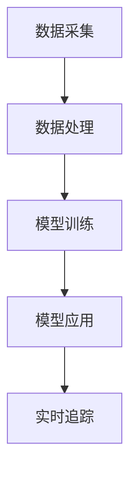
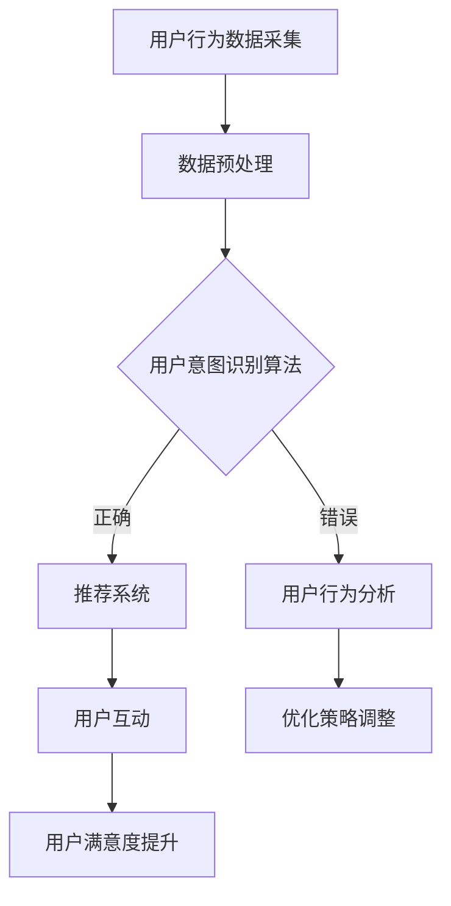

                 

### 文章标题

> **AI大模型在电商平台用户意图实时追踪中的应用**

> **关键词：** AI大模型，电商平台，用户意图，实时追踪，自然语言处理，深度学习

> **摘要：** 本文章探讨了AI大模型在电商平台用户意图实时追踪中的应用。首先，介绍了AI大模型的基本概念和主流模型，然后深入分析了用户意图识别和实时追踪技术。接着，通过案例研究和实践，展示了AI大模型在电商平台的具体应用效果。最后，讨论了AI大模型在电商平台开发中的实战经验和面临的挑战，并对未来发展进行了展望。

## 第一部分：AI大模型的基础知识

### 第1章：AI大模型概述

#### 1.1 AI大模型的概念与特点

AI大模型，即大型人工智能模型，是指那些拥有数十亿甚至千亿个参数的深度学习模型。这些模型通过大量的数据训练，能够实现强大的语义理解、语言生成和推理能力。AI大模型的主要特点包括：

- **参数量巨大**：AI大模型通常拥有数十亿到千亿个参数，这使得它们能够捕获数据中的复杂模式。
- **强语义理解**：AI大模型能够对文本、图像和语音等多模态数据进行深入的理解和表示。
- **端到端学习**：AI大模型通常采用端到端的学习方式，能够直接从原始数据中学习复杂的任务，无需人工设计特征。
- **泛化能力强**：由于AI大模型的参数量巨大，它们在训练数据上的表现往往非常优秀，并且具有很好的泛化能力。

#### 1.2 主流AI大模型介绍

目前，AI大模型的研究和应用已经取得了显著的进展，以下是一些主流的AI大模型：

- **GPT系列模型**：GPT（Generative Pre-trained Transformer）模型是由OpenAI提出的一系列基于Transformer架构的预训练模型，包括GPT、GPT-2和GPT-3等。这些模型在语言生成、文本摘要、机器翻译等领域表现出色。
- **BERT模型**：BERT（Bidirectional Encoder Representations from Transformers）模型由Google提出，是一种双向Transformer模型。BERT在自然语言理解任务上取得了很高的性能，广泛应用于问答系统、文本分类等。
- **T5模型**：T5（Text-To-Text Transfer Transformer）模型是Google提出的另一个基于Transformer的模型，它将所有NLP任务转换为文本到文本的转换任务，具有很高的灵活性和泛化能力。

除了上述模型，还有如ViT（Vision Transformer）、GPT-Neo等，这些模型都在不同的领域取得了显著的成果。

#### 1.3 AI大模型在电商平台的潜在应用

AI大模型在电商平台有着广泛的应用潜力，主要包括以下几个方面：

- **用户意图识别**：通过分析用户的搜索历史、浏览记录和购买行为，AI大模型能够准确识别用户的意图，从而为推荐系统提供精准的输入。
- **推荐系统**：AI大模型能够通过深度学习算法，对用户的行为数据进行分析和预测，为用户提供个性化的商品推荐。
- **实时追踪用户行为**：AI大模型可以实时分析用户的行为数据，跟踪用户的浏览、搜索和购买行为，为电商平台提供实时的用户行为分析。

在接下来的章节中，我们将进一步探讨AI大模型的技术基础以及在电商平台用户意图实时追踪中的应用。

### 第2章：AI大模型技术基础

#### 2.1 神经网络与深度学习

神经网络（Neural Network）是人工智能领域中的一种重要模型，其灵感来源于人脑神经元的工作方式。神经网络由多个神经元（或节点）组成，每个神经元都与其他神经元相连，并通过加权的方式传递信息。通过学习输入数据，神经网络能够自动调整权重，从而实现对数据的分类、回归或其他复杂任务的建模。

#### 2.1.1 神经网络基本原理

神经网络的基本组成包括输入层、隐藏层和输出层。输入层接收外部数据，隐藏层通过激活函数对输入数据进行非线性变换，输出层则产生预测结果。

- **输入层**：输入层接收外部输入数据，并将其传递给隐藏层。
- **隐藏层**：隐藏层对输入数据进行处理，通过加权连接和激活函数，产生新的特征表示。
- **输出层**：输出层产生最终的预测结果。

神经网络通过学习输入和输出之间的映射关系，调整权重和偏置，使得输出能够更好地符合实际需求。

#### 2.1.2 深度学习架构

深度学习（Deep Learning）是一种基于神经网络的学习方法，通过多层网络结构，实现更复杂的特征提取和建模。深度学习的架构包括以下几个关键部分：

- **卷积神经网络（CNN）**：卷积神经网络是一种用于处理图像数据的神经网络，通过卷积操作和池化操作，实现图像的特征提取和分类。
- **循环神经网络（RNN）**：循环神经网络是一种用于处理序列数据的神经网络，通过隐藏状态的循环连接，实现对序列数据的建模。
- **Transformer模型**：Transformer模型是一种基于自注意力机制的深度学习模型，广泛应用于自然语言处理任务，如机器翻译、文本分类等。

#### 2.1.3 深度学习优化算法

深度学习模型的训练过程是一个优化问题，通过不断调整模型参数，使得模型的预测结果更加接近真实值。以下是一些常用的深度学习优化算法：

- **随机梯度下降（SGD）**：随机梯度下降是一种简单的优化算法，通过计算模型参数的梯度，并沿着梯度方向更新参数，以最小化损失函数。
- **Adam优化器**：Adam优化器是一种结合了SGD和动量法的优化算法，通过计算一阶矩估计和二阶矩估计，自适应调整学习率，提高收敛速度。
- **RMSprop优化器**：RMSprop优化器是一种基于梯度平方的优化算法，通过计算梯度平方的指数移动平均值，自适应调整学习率，减少振荡。

通过使用这些优化算法，深度学习模型能够在复杂的任务中取得优异的性能。

#### 2.2 自然语言处理技术

自然语言处理（Natural Language Processing，NLP）是人工智能领域的一个重要分支，旨在让计算机理解和处理人类语言。以下是一些NLP中的重要技术：

- **词嵌入（Word Embedding）**：词嵌入是将文本数据转换为向量表示的一种技术，通过捕捉词汇的语义关系，使得文本数据能够在低维空间中表示。
- **序列模型（Sequence Model）**：序列模型是一种用于处理序列数据的神经网络，如RNN和Transformer，通过捕捉序列中词汇的依赖关系，实现对序列数据的建模。
- **注意力机制（Attention Mechanism）**：注意力机制是一种用于序列模型的增强技术，通过动态调整不同位置的重要性，实现对序列数据的加权处理。

#### 2.2.1 词嵌入技术

词嵌入是将词汇映射到低维向量空间的一种技术，常见的词嵌入方法包括：

- **Word2Vec**：Word2Vec是一种基于神经网络的词嵌入方法，通过训练词向量模型，捕捉词汇的语义关系。
- **GloVe**：GloVe（Global Vectors for Word Representation）是一种基于全局上下文的词嵌入方法，通过计算词汇的共现矩阵，生成词向量。

词嵌入技术在NLP任务中起到了重要的作用，如文本分类、情感分析、机器翻译等。

#### 2.2.2 序列模型与注意力机制

序列模型是一种用于处理序列数据的神经网络，常见的序列模型包括：

- **RNN（Recurrent Neural Network）**：循环神经网络是一种基于序列记忆的神经网络，通过隐藏状态的循环连接，实现对序列数据的建模。
- **LSTM（Long Short-Term Memory）**：LSTM是RNN的一种变体，通过引入门控机制，解决了RNN在长序列建模中的梯度消失问题。
- **GRU（Gated Recurrent Unit）**：GRU是另一种RNN的变体，通过简化LSTM的门控机制，提高了计算效率和收敛速度。

注意力机制（Attention Mechanism）是一种用于增强序列模型的机制，通过动态调整不同位置的重要性，实现对序列数据的加权处理。注意力机制在NLP任务中得到了广泛的应用，如机器翻译、文本摘要等。

#### 2.2.3 转换器架构详解

转换器（Transformer）是一种基于自注意力机制的深度学习模型，广泛应用于NLP任务。转换器的主要组成部分包括：

- **自注意力机制（Self-Attention）**：自注意力机制是一种计算序列中每个词汇对其他词汇的重要性，通过加权和的方式生成新的特征表示。
- **多头注意力（Multi-Head Attention）**：多头注意力是自注意力机制的扩展，通过并行计算多个注意力头，提高模型的表示能力。
- **前馈网络（Feedforward Network）**：前馈网络是一种简单的全连接网络，用于对注意力层的输出进行进一步的非线性变换。

转换器模型通过自注意力机制，能够捕捉序列中词汇的依赖关系，具有很好的序列建模能力。在NLP任务中，转换器模型取得了显著的性能提升，如机器翻译、文本分类、问答系统等。

#### 2.3 大规模预训练模型原理

大规模预训练模型是指通过在大量数据上进行预训练，生成具有强大语义表示能力的模型。大规模预训练模型的主要原理包括：

- **预训练（Pre-training）**：预训练是指在大量数据上训练模型，使其能够学习到通用的语义表示。
- **微调（Fine-tuning）**：微调是指在预训练模型的基础上，针对特定任务进行进一步训练，以优化模型的性能。

大规模预训练模型通过预训练和微调，能够实现高效的语义理解和生成能力。常见的预训练任务包括自然语言推理（NLI）、命名实体识别（NER）、文本分类等。

#### 2.3.1 预训练的概念与意义

预训练是指在一个大型语料库上预先训练神经网络模型，使其在处理特定任务时能够快速适应并取得良好的性能。预训练的意义在于：

- **知识迁移**：预训练模型通过在大量数据上学习，能够捕获通用的语义表示，这些知识可以迁移到其他任务中，提高新任务的性能。
- **减少标注数据需求**：预训练模型可以在未标注的数据上进行训练，减少对大规模标注数据的依赖。
- **提高泛化能力**：预训练模型通过在大量数据上学习，能够提高模型的泛化能力，减少对特定领域数据的依赖。

#### 2.3.2 自监督学习方法

自监督学习（Self-Supervised Learning）是一种无需人工标注数据，通过预测数据中的某些部分来训练模型的方法。自监督学习方法在预训练中起到了重要的作用，常见的自监督学习方法包括：

- **Masked Language Modeling（MLM）**：MLM方法通过随机屏蔽输入文本中的部分词汇，并预测这些词汇的词向量，来训练语言模型。
- ** masked-token prediction**：在输入序列中，随机屏蔽一个或多个词汇，并预测这些词汇的真实值。
- ** Next Sentence Prediction（NSP）**：NSP方法通过预测输入序列中接下来的句子，来学习句子的依赖关系。

自监督学习方法能够有效利用未标注的数据，提高模型的语义表示能力。

#### 2.3.3 迁移学习与微调技术

迁移学习（Transfer Learning）是一种利用预训练模型在特定任务上快速适应的方法。迁移学习的核心思想是将预训练模型的知识迁移到新任务中，通过微调（Fine-tuning）来优化模型在新任务上的性能。

- **微调**：微调是指在一个较小的新任务数据集上，对预训练模型进行进一步训练，以优化模型在新任务上的性能。微调过程中，通常会冻结预训练模型的底层层，只对顶层层进行训练。

迁移学习和微调技术在预训练模型的实际应用中起到了关键作用，使得模型能够快速适应新任务，提高性能。

#### 2.4 AI大模型在电商平台的潜在应用

AI大模型在电商平台的潜在应用包括：

- **用户意图识别**：通过分析用户的搜索历史、浏览记录和购买行为，AI大模型能够准确识别用户的意图，为推荐系统提供精准的输入。
- **推荐系统**：AI大模型能够通过深度学习算法，对用户的行为数据进行分析和预测，为用户提供个性化的商品推荐。
- **实时追踪用户行为**：AI大模型可以实时分析用户的行为数据，跟踪用户的浏览、搜索和购买行为，为电商平台提供实时的用户行为分析。

在接下来的章节中，我们将进一步探讨AI大模型在电商平台用户意图实时追踪中的应用。

### 第3章：AI大模型在电商平台的用户意图实时追踪应用

#### 3.1 用户意图识别算法

用户意图识别（User Intent Recognition）是电商平台AI大模型应用中的重要环节，它能够帮助电商平台理解用户的真实需求，从而提供更精准的服务。用户意图识别算法的基本概念包括：

- **用户意图**：用户意图是指用户在特定场景下的目的或需求，例如购买商品、获取信息、解决问题等。
- **识别算法**：识别算法是指用于从用户行为数据中提取和识别用户意图的方法。

用户意图识别算法的核心目标是准确识别用户意图，为电商平台提供决策支持。以下是一个用户意图识别算法的基本步骤：

1. **数据采集**：收集用户的浏览历史、搜索记录、点击行为、购买行为等数据。
2. **数据预处理**：对采集到的数据进行清洗、去重、特征提取等预处理操作。
3. **特征工程**：根据用户行为数据，提取出与用户意图相关的特征，例如关键词、行为模式、用户画像等。
4. **模型训练**：使用预处理后的数据，训练用户意图识别模型，通常采用深度学习模型，如BERT、GPT等。
5. **模型评估**：使用验证集对训练好的模型进行评估，调整模型参数，优化模型性能。
6. **意图识别**：在真实场景中，使用训练好的模型对用户行为数据进行意图识别，输出用户意图。

用户意图识别算法的应用实例包括：

- **个性化推荐**：通过识别用户意图，电商平台可以为用户提供个性化的商品推荐，提高用户满意度。
- **智能客服**：通过识别用户意图，智能客服系统可以提供更精准的答案和建议，提高用户服务质量。
- **广告投放**：通过识别用户意图，电商平台可以精准投放广告，提高广告转化率。

以下是一个用户意图识别算法的伪代码实现：

```python
# 伪代码：用户意图识别算法
def user_intent_recognition(data):
    1. 预处理数据
    2. 提取特征
    3. 利用预训练模型进行意图识别
    4. 返回识别结果
    
# 具体实现：
# 输入：用户行为数据data
# 输出：用户意图识别结果intent

# 预处理数据
data_processed = preprocess_data(data)

# 提取特征
features = extract_features(data_processed)

# 利用预训练模型进行意图识别
intent = pre-trained_model.predict(features)

# 返回识别结果
return intent
```

通过上述算法，电商平台能够更准确地识别用户的意图，从而为用户提供更个性化的服务和体验。

#### 3.2 用户行为实时追踪技术

用户行为实时追踪（Real-time User Behavior Tracking）是电商平台AI大模型应用中的另一个关键环节，它能够帮助电商平台实时了解用户的动态行为，为实时决策提供支持。用户行为实时追踪技术的基本概念包括：

- **用户行为**：用户行为是指用户在电商平台上的各种操作，包括浏览、搜索、点击、购买等。
- **实时追踪**：实时追踪是指通过技术手段，实时监测和记录用户行为，为电商平台提供实时的用户行为数据。

用户行为实时追踪技术的实现步骤如下：

1. **数据采集**：使用技术手段，如JavaScript、日志分析工具等，收集用户的浏览历史、搜索记录、点击行为等数据。
2. **数据传输**：将采集到的数据实时传输到数据处理系统，如Kafka、Redis等。
3. **数据预处理**：对传输过来的数据进行清洗、去重、归一化等预处理操作，以便后续分析。
4. **实时分析**：使用实时计算框架，如Apache Flink、Apache Storm等，对预处理后的数据进行分析和处理，提取用户行为的特征。
5. **存储与查询**：将实时分析结果存储到数据库中，以便后续查询和分析。
6. **实时反馈**：将实时分析结果反馈给电商平台，为实时决策提供支持。

用户行为实时追踪技术的应用实例包括：

- **实时推荐**：通过实时追踪用户行为，电商平台可以实时调整推荐策略，提高推荐系统的效果。
- **实时营销**：通过实时追踪用户行为，电商平台可以实时调整营销策略，提高营销效果。
- **实时风险控制**：通过实时追踪用户行为，电商平台可以实时监控风险，防止欺诈行为。

以下是一个用户行为实时追踪技术的架构图：


通过用户行为实时追踪技术，电商平台能够实时了解用户的行为动态，为用户提供更精准的服务和体验。

#### 3.3 电商平台用户意图实时追踪系统的设计与实现

为了在电商平台上实现用户意图实时追踪，我们需要设计并实现一个完整的系统，包括数据采集、数据预处理、用户意图识别和实时追踪等环节。以下是系统的设计与实现步骤：

##### 3.3.1 系统整体架构设计

电商平台用户意图实时追踪系统的整体架构设计如下：

1. **数据采集层**：负责收集用户的浏览历史、搜索记录、点击行为等数据。
2. **数据处理层**：负责对采集到的数据进行预处理，如清洗、去重、特征提取等。
3. **模型训练层**：负责使用预处理后的数据训练用户意图识别模型。
4. **模型应用层**：负责使用训练好的模型对实时数据进行分析和识别，输出用户意图。
5. **实时追踪层**：负责实时追踪用户行为，为电商平台提供实时的用户行为数据。

以下是一个系统整体架构的Mermaid流程图：



##### 3.3.2 数据采集与预处理

数据采集与预处理是用户意图实时追踪系统的核心环节，以下是具体的实现步骤：

1. **数据采集**：使用JavaScript等前端技术，收集用户的浏览历史、搜索记录、点击行为等数据。
2. **数据传输**：使用Ajax等技术，将采集到的数据实时传输到后端服务器。
3. **数据清洗**：对传输过来的数据进行清洗，如去除重复数据、填补缺失值等。
4. **数据去重**：使用哈希表等数据结构，对清洗后的数据进行去重处理。
5. **特征提取**：根据用户行为数据，提取出与用户意图相关的特征，如关键词、行为模式、用户画像等。

以下是数据采集与预处理的伪代码实现：

```python
# 伪代码：数据采集与预处理
def data_preprocessing(data):
    1. 数据清洗
    2. 数据去重
    3. 特征提取
    4. 返回预处理后的数据
    
# 具体实现：
# 输入：原始用户行为数据data
# 输出：预处理后的用户行为数据processed_data

# 数据清洗
cleaned_data = clean_data(data)

# 数据去重
unique_data = remove_duplicates(cleaned_data)

# 特征提取
features = extract_features(unique_data)

# 返回预处理后的数据
return features
```

##### 3.3.3 用户意图识别与实时追踪算法实现

用户意图识别与实时追踪算法是实现用户意图实时追踪系统的关键，以下是具体的实现步骤：

1. **模型选择**：选择合适的预训练模型，如BERT、GPT等，用于用户意图识别。
2. **模型训练**：使用预处理后的数据，训练用户意图识别模型。
3. **模型评估**：使用验证集对训练好的模型进行评估，调整模型参数，优化模型性能。
4. **意图识别**：在真实场景中，使用训练好的模型对实时数据进行意图识别。
5. **实时追踪**：根据意图识别结果，实时追踪用户行为，为电商平台提供实时的用户行为数据。

以下是用户意图识别与实时追踪算法的伪代码实现：

```python
# 伪代码：用户意图识别与实时追踪算法
def user_intent_tracking(data):
    1. 用户意图识别
    2. 实时追踪用户行为
    3. 返回意图识别结果和用户行为数据
    
# 具体实现：
# 输入：实时用户行为数据data
# 输出：意图识别结果intent和用户行为数据behavior

# 用户意图识别
intent = user_intent_recognition(data)

# 实时追踪用户行为
behavior = track_user_behavior(data)

# 返回意图识别结果和用户行为数据
return intent, behavior
```

##### 3.3.4 系统性能评估与优化

系统性能评估与优化是确保用户意图实时追踪系统高效运行的关键，以下是具体的评估和优化方法：

1. **性能评估**：使用测试集对系统进行性能评估，评估指标包括准确率、召回率、F1值等。
2. **模型优化**：通过调整模型参数、增加训练数据、改进特征提取等方法，优化模型性能。
3. **系统优化**：通过改进数据传输、提高数据处理效率、优化系统架构等方法，提高系统性能。

以下是一个系统性能评估与优化的伪代码实现：

```python
# 伪代码：系统性能评估与优化
def system_performance_evaluation_and_optimization(data):
    1. 性能评估
    2. 模型优化
    3. 系统优化
    4. 返回优化后的系统性能
    
# 具体实现：
# 输入：测试集数据data
# 输出：优化后的系统性能performance

# 性能评估
performance = evaluate_system_performance(data)

# 模型优化
optimized_model = optimize_model_performance()

# 系统优化
optimized_system = optimize_system_performance()

# 返回优化后的系统性能
return performance, optimized_model, optimized_system
```

通过上述设计与实现步骤，电商平台用户意图实时追踪系统能够高效运行，为电商平台提供实时的用户意图识别和实时追踪服务。

### 第4章：AI大模型在电商平台的实际应用案例研究

在本章节中，我们将通过两个具体的案例研究，深入探讨AI大模型在电商平台用户意图实时追踪中的实际应用效果。这些案例不仅展示了AI大模型在电商场景中的强大能力，也为其他电商平台提供了宝贵的借鉴和参考。

#### 4.1 案例一：某电商平台用户意图识别与实时追踪系统的设计与实现

#### 4.1.1 案例背景

某大型电商平台A，致力于为用户提供个性化、高质量的购物体验。然而，随着用户量的增加和数据量的庞大，如何准确识别用户意图、实时追踪用户行为成为电商平台A面临的一大挑战。为了解决这一问题，电商平台A决定引入AI大模型，建立一套用户意图识别与实时追踪系统。

#### 4.1.2 案例分析

1. **数据采集**：电商平台A通过日志收集系统，实时收集用户的浏览、搜索、点击、购买等行为数据。这些数据包括用户ID、浏览时间、浏览商品、搜索关键词等。

2. **数据预处理**：对收集到的原始数据进行清洗、去重和特征提取，提取出与用户意图相关的关键特征，如关键词频率、用户画像等。

3. **模型训练**：电商平台A采用BERT模型进行用户意图识别，使用大量标注数据进行训练。在训练过程中，通过调整超参数和优化算法，不断提高模型的准确率和泛化能力。

4. **模型评估**：使用验证集对训练好的模型进行评估，评估指标包括准确率、召回率、F1值等。通过多次迭代和调整，确保模型在各项指标上达到最佳效果。

5. **实时追踪**：在真实场景中，电商平台A使用训练好的模型对实时数据进行意图识别，并实时追踪用户行为，为用户提供个性化的推荐和营销服务。

6. **系统优化**：通过持续的性能评估和优化，电商平台A不断调整模型参数和系统架构，提高系统的实时性和准确性。

#### 4.1.3 案例总结

通过引入AI大模型，电商平台A成功地建立了用户意图识别与实时追踪系统。该系统在提高用户满意度、降低运营成本、提高销售转化率等方面取得了显著成效，为电商平台A的持续发展提供了强有力的支持。

#### 4.2 案例二：某电商平台AI大模型应用实践

#### 4.2.1 案例背景

某中型电商平台B，面对激烈的市场竞争，希望通过引入AI大模型，提升用户体验和运营效率。电商平台B在用户意图识别、个性化推荐、智能客服等方面进行了全面探索。

#### 4.2.2 案例分析

1. **用户意图识别**：电商平台B采用GPT-3模型进行用户意图识别。通过对用户搜索记录、浏览历史、购买行为等多维度数据进行训练，模型能够准确识别用户的购买意图、信息查询意图等。

2. **个性化推荐**：电商平台B利用BERT模型，结合用户行为数据和商品特征，为用户生成个性化的商品推荐列表。通过持续优化推荐算法，电商平台B的用户点击率和购买转化率显著提升。

3. **智能客服**：电商平台B部署了基于Transformer的智能客服系统，通过自然语言处理技术，实现与用户的实时对话。智能客服系统能够快速回答用户问题、提供购物建议，大大提高了客服效率和用户体验。

4. **实时追踪**：电商平台B采用实时追踪技术，对用户行为进行实时分析，及时调整推荐策略和营销活动。通过实时追踪用户行为，电商平台B能够更准确地了解用户需求，提供更个性化的服务。

#### 4.2.3 案例总结

通过AI大模型的应用实践，电商平台B在用户意图识别、个性化推荐、智能客服等方面取得了显著成效。该案例充分展示了AI大模型在电商平台中的实际应用价值，为其他电商平台提供了有益的借鉴。

#### 4.3 案例对比与分析

通过对两个案例的对比分析，我们可以得出以下结论：

1. **用户意图识别**：不同电商平台选择的AI大模型不同，GPT-3和BERT模型在用户意图识别方面各有优势。GPT-3具有更强的语言生成能力，适用于复杂场景下的意图识别；而BERT模型在自然语言处理任务上表现更为出色，适用于简单的意图识别任务。

2. **个性化推荐**：电商平台A采用BERT模型进行个性化推荐，取得了较好的效果。而电商平台B则通过持续优化推荐算法，提高了用户点击率和购买转化率。这表明，个性化推荐不仅依赖于模型的选择，还需要在算法优化和策略调整方面下功夫。

3. **智能客服**：两个电商平台均采用了基于Transformer的智能客服系统，但实际效果有所不同。电商平台A的智能客服系统能够快速回答用户问题，但用户体验仍有待提高；而电商平台B通过不断优化对话流程和回答质量，提升了用户体验。

4. **实时追踪**：电商平台A和电商平台B均采用了实时追踪技术，但具体实现方式有所不同。电商平台A通过实时分析用户行为，调整推荐策略和营销活动；而电商平台B则通过实时追踪用户行为，为用户提供个性化的服务和体验。

总之，通过实际应用案例，我们可以看到AI大模型在电商平台用户意图实时追踪中的重要作用。不同电商平台可以根据自身需求和实际情况，选择合适的模型和算法，实现用户意图识别、个性化推荐、智能客服等功能，提升用户体验和运营效率。

### 第5章：AI大模型在电商平台开发中的实战经验

在本章中，我们将分享AI大模型在电商平台开发中的实战经验，涵盖开发流程、工具选择、性能优化等方面，为其他电商平台的AI大模型开发提供参考。

#### 5.1 电商平台AI大模型开发流程

电商平台AI大模型开发通常包括以下步骤：

1. **需求分析与规划**：明确电商平台的目标和应用场景，分析用户需求，制定开发计划。
2. **数据收集与预处理**：收集电商平台的用户行为数据，包括浏览、搜索、购买等，对数据进行清洗、去重、归一化等预处理操作。
3. **模型设计与实现**：根据应用场景，选择合适的AI大模型，如BERT、GPT等，设计模型架构，实现模型训练和优化。
4. **模型部署与运维**：将训练好的模型部署到电商平台，实现实时预测和用户意图识别，对系统进行监控和运维。
5. **性能评估与优化**：使用测试集对模型进行性能评估，通过调整超参数、增加训练数据、改进特征提取等方法，优化模型性能。

#### 5.2 模型设计与实现

在电商平台AI大模型开发中，模型设计与实现是关键环节。以下是具体的实现步骤：

1. **选择模型架构**：根据应用场景和需求，选择合适的AI大模型架构，如BERT、GPT、T5等。这些模型架构具有强大的语义表示能力和端到端学习能力，适用于电商平台的用户意图识别和实时追踪任务。
2. **数据预处理**：对采集到的用户行为数据，进行清洗、去重、归一化等预处理操作，提取出与用户意图相关的关键特征，如关键词、用户画像等。预处理数据的质量直接影响模型的性能，因此需要高度重视数据预处理过程。
3. **模型训练**：使用预处理后的数据，对选择的AI大模型进行训练。训练过程中，通过调整学习率、优化器、批量大小等超参数，优化模型性能。训练过程中，可以使用GPU等硬件加速训练过程，提高训练效率。
4. **模型优化**：在训练过程中，通过评估模型在验证集上的性能，不断调整超参数和优化策略，提高模型性能。优化过程中，可以使用交叉验证、网格搜索等方法，找到最佳参数组合。
5. **模型评估**：使用测试集对训练好的模型进行评估，评估指标包括准确率、召回率、F1值等。通过评估结果，判断模型是否满足需求，如果评估结果不理想，需要进一步调整模型设计和优化策略。

#### 5.3 模型部署与运维

模型部署与运维是电商平台AI大模型开发的重要环节。以下是具体的实现步骤：

1. **模型部署**：将训练好的模型部署到电商平台，实现实时预测和用户意图识别。部署过程中，需要考虑模型的计算资源需求、服务稳定性等因素。常用的部署方式包括基于容器（如Docker）、虚拟机（如KVM）或云平台（如AWS、Azure）的部署方案。
2. **服务稳定性**：确保模型的实时预测和服务稳定性，需要对系统进行监控和容错处理。常用的监控工具包括Prometheus、Grafana等，容错处理可以使用Kubernetes等容器编排系统，实现自动重启、故障转移等功能。
3. **性能优化**：在模型部署后，通过性能优化，提高模型的响应速度和吞吐量。性能优化可以采用多线程、分布式计算等技术，提高系统的计算能力。此外，还可以通过缓存、数据压缩等方法，降低系统的数据传输和存储成本。
4. **版本管理**：在模型部署和运维过程中，需要对模型版本进行管理，确保不同版本的模型能够顺利切换。常用的版本管理工具包括Git、Docker等，可以实现模型的版本控制和回滚。

#### 5.4 性能优化

性能优化是电商平台AI大模型开发中的重要环节，以下是常见的性能优化方法：

1. **模型压缩**：通过模型压缩，减少模型的参数量和计算量，提高模型部署的效率和性能。常用的模型压缩方法包括剪枝（Pruning）、量化（Quantization）等。
2. **模型蒸馏**：通过模型蒸馏，将大模型的语义知识传递给小模型，提高小模型的性能和效率。模型蒸馏过程包括教师模型（Teacher Model）和学生模型（Student Model）的训练，教师模型负责生成高层次的语义表示，学生模型负责学习这些表示。
3. **数据增强**：通过数据增强，增加训练数据的多样性，提高模型的泛化能力。常用的数据增强方法包括数据扩充（Data Augmentation）、数据变换（Data Transformation）等。
4. **并行计算**：通过并行计算，提高模型的训练和推理速度。常用的并行计算方法包括多GPU训练、分布式训练等。

总之，电商平台AI大模型开发需要遵循科学的开发流程，合理选择模型架构，注重数据预处理和模型优化，同时进行模型部署和运维，并通过性能优化，提高模型的实时性和准确性。通过这些实战经验，电商平台能够有效利用AI大模型，提升用户体验和运营效率。

### 第6章：AI大模型在电商平台的法律法规与伦理问题

随着AI大模型在电商平台的广泛应用，相关的法律法规和伦理问题也逐渐成为关注的焦点。在这个章节中，我们将探讨AI大模型在电商平台中可能遇到的法律问题、伦理问题，以及如何应对这些挑战。

#### 6.1 电商平台AI大模型的法律问题

1. **数据隐私与保护**

电商平台AI大模型在处理用户数据时，必须遵守相关法律法规，保护用户隐私。例如，中国的《网络安全法》和《个人信息保护法》对数据收集、存储、处理和传输都做出了明确的规定。电商平台需要采取严格的数据保护措施，如数据加密、访问控制、匿名化处理等，确保用户数据的安全和隐私。

2. **算法的公平性与透明性**

AI大模型在决策过程中，可能存在算法偏见和歧视的问题。例如，某些模型可能会对特定群体产生不公平的待遇，或者基于用户的历史行为进行歧视性推荐。这涉及到算法的公平性和透明性问题。为了确保算法的公平性，电商平台需要对其算法进行公正性审查，并确保算法的决策过程透明可解释。

3. **相关法律法规概述**

全球范围内，许多国家和地区都有相关的法律法规来规范AI的应用。例如，欧盟的《通用数据保护条例》（GDPR）对个人数据的处理和保护做出了严格的规定。美国也有《消费者数据隐私法案》（CCPA）等法律，旨在保护消费者的隐私权。电商平台在引入AI大模型时，需要了解和遵守这些法律法规，以避免法律风险。

#### 6.2 电商平台AI大模型的伦理问题

1. **AI算法的偏见与歧视**

AI大模型在训练过程中，可能会从数据中学习到偏见，导致算法对某些群体不公平。例如，在推荐系统中，算法可能会基于用户的历史行为，向某些用户推荐特定类型的商品，而对其他用户则不推荐。这可能导致用户感知到歧视，影响用户的购物体验。

2. **用户隐私保护与透明度**

电商平台在使用AI大模型时，需要确保用户的隐私得到充分保护。用户应有权知道自己的数据是如何被收集、存储和使用的。此外，用户应该能够访问和修改自己的个人信息，并有权拒绝其数据的商业化使用。

3. **伦理道德规范与责任**

电商平台在开发和使用AI大模型时，应遵守伦理道德规范。例如，平台应确保算法的决策过程透明、公正，避免造成社会负面影响。同时，平台需要对算法的潜在风险进行评估，并制定相应的责任制度，确保在出现问题时能够及时应对和承担责任。

#### 6.3 应对法律法规与伦理问题的策略

1. **数据隐私保护策略**

电商平台应采取以下措施来保护用户隐私：

- **数据最小化原则**：仅收集必要的数据，避免过度收集。
- **数据加密与访问控制**：使用数据加密技术和访问控制机制，确保数据在传输和存储过程中的安全性。
- **用户同意与透明度**：明确告知用户数据的使用目的和方式，获取用户同意，并确保用户能够访问和修改自己的个人信息。

2. **算法公平性与透明性策略**

电商平台应采取以下措施来确保算法的公平性和透明性：

- **算法审查与透明度**：定期审查算法的公正性和透明性，确保算法决策可解释。
- **多样性数据训练**：使用多样化的数据集进行训练，减少算法偏见。
- **算法偏见检测与纠正**：开发算法偏见检测工具，及时发现并纠正算法偏见。

3. **伦理道德规范与责任策略**

电商平台应采取以下措施来遵守伦理道德规范和承担社会责任：

- **伦理培训与意识提升**：为员工提供伦理培训，提高其对AI伦理问题的认识和责任感。
- **社会责任评估**：在开发和使用AI大模型时，进行社会责任评估，确保算法的使用对社会有益。
- **责任追究与赔偿机制**：制定明确的责任追究和赔偿机制，确保在出现问题时能够及时应对。

通过上述策略，电商平台可以在开发和使用AI大模型时，更好地应对法律法规和伦理问题的挑战，确保AI技术的健康、可持续发展。

### 第7章：未来展望与挑战

#### 7.1 电商平台AI大模型的发展趋势

随着技术的不断进步和应用的深入，电商平台AI大模型的发展呈现出以下几个趋势：

1. **更加智能化的推荐系统**：随着AI大模型在自然语言处理和图像处理领域的突破，电商平台将能够构建更加智能化的推荐系统。这些系统将能够更准确地捕捉用户意图，提供个性化的推荐，从而提高用户满意度和购买转化率。

2. **实时交互与个性化服务**：AI大模型将进一步提升电商平台与用户的实时交互能力。通过实时分析用户行为数据，电商平台可以提供更加个性化的服务，如实时推送用户感兴趣的商品、提供定制化的购物体验等。

3. **多模态数据处理**：未来的电商平台将能够处理多种数据模态，如文本、图像、语音等。这种多模态数据处理能力将使得电商平台能够更全面地了解用户需求，提供更精准的服务。

4. **自动化与智能化运营**：随着AI大模型在电商平台中的应用，许多运营环节将实现自动化和智能化。例如，自动化的营销活动、智能化的客户服务、自动化的风险控制等，将大大提高电商平台的管理效率。

#### 7.2 电商平台AI大模型的挑战与解决方案

尽管AI大模型在电商平台上具有广泛的应用前景，但其发展也面临着一系列挑战：

1. **数据隐私与安全**：随着数据量的不断增长，数据隐私和安全成为电商平台AI大模型面临的主要挑战。解决方案包括采用更加严格的数据保护措施、加强用户隐私保护意识、采用隐私增强技术等。

2. **算法公平性与透明性**：AI大模型可能会因为数据偏见或算法设计不当，导致不公平的推荐结果。为了解决这一问题，需要加强对算法的审查和透明化，采用多样化的数据集进行训练，并建立算法偏见检测机制。

3. **技术瓶颈与优化方向**：虽然AI大模型在性能上已经取得了显著进步，但在某些特定任务上仍然存在技术瓶颈。例如，实时交互能力、多模态数据处理能力等。未来的研究需要在这些方向上寻求突破，以提高AI大模型的整体性能。

4. **人才培养与知识共享**：AI大模型的发展需要大量具备专业技能的人才。为了应对这一挑战，需要加强人才培养，提高相关教育资源的投入，同时促进知识共享，构建良好的学术和产业合作生态。

5. **法律法规与伦理问题**：随着AI大模型的应用越来越广泛，相关的法律法规和伦理问题也日益突出。电商平台需要密切关注法律法规的变化，制定相应的合规策略，同时加强伦理道德教育，确保AI技术的健康、可持续发展。

通过克服上述挑战，电商平台AI大模型将在未来实现更加广泛和深入的应用，为电商平台的发展注入新的动力。

### 附录A：常用参考资料与工具

#### A.1 常用参考资料

在AI大模型和电商平台用户意图实时追踪领域，以下是一些常用的参考资料：

1. **相关书籍**：
   - **《深度学习》（Deep Learning）**：由Ian Goodfellow、Yoshua Bengio和Aaron Courville合著，是深度学习领域的经典教材。
   - **《自然语言处理综论》（Speech and Language Processing）**：由Daniel Jurafsky和James H. Martin合著，涵盖了自然语言处理的基本原理和应用。
   - **《机器学习》（Machine Learning）**：由Tom Mitchell编写，介绍了机器学习的基础概念和方法。

2. **论文与报告**：
   - **“BERT: Pre-training of Deep Bidirectional Transformers for Language Understanding”**：Google AI发布的论文，介绍了BERT模型的设计和训练方法。
   - **“GPT-3: Language Models are Few-Shot Learners”**：OpenAI发布的论文，展示了GPT-3模型在零样本学习任务中的卓越性能。
   - **“Transformers: State-of-the-Art Natural Language Processing”**：由Vaswani等人在NeurIPS 2017上发表的论文，介绍了Transformer模型的结构和优点。

#### A.2 常用工具

以下是一些在AI大模型和电商平台用户意图实时追踪领域常用的工具：

1. **深度学习框架**：
   - **TensorFlow**：由Google开发的开源深度学习框架，适用于各种深度学习应用。
   - **PyTorch**：由Facebook开发的开源深度学习框架，提供灵活的动态计算图。
   - **Keras**：基于Theano和TensorFlow的高层次深度学习API，易于使用和扩展。

2. **数据处理工具**：
   - **Pandas**：Python的数据分析库，适用于数据清洗、转换和分析。
   - **NumPy**：Python的科学计算库，用于数值计算和数据操作。
   - **Matplotlib**：Python的数据可视化库，用于生成各种统计图表。

3. **实时计算框架**：
   - **Apache Flink**：一个分布式流处理框架，适用于实时数据处理和分析。
   - **Apache Storm**：一个分布式实时计算系统，适用于实时数据流处理。

#### A.3 社区与组织

在AI大模型和电商平台用户意图实时追踪领域，以下是一些相关的社区和组织：

1. **电商平台AI社区**：
   - **淘宝大学**：淘宝提供的学习平台，包含电商AI相关的课程和资料。
   - **京东云AI学院**：京东提供的学习平台，涵盖AI技术在电商领域的应用。

2. **AI大模型研究组织**：
   - **OpenAI**：一家总部位于美国的人工智能研究组织，致力于推动AI的发展和应用。
   - **Google AI**：Google的AI研究部门，发布了一系列重要的AI研究成果。

3. **AI大模型竞赛与挑战**：
   - **Kaggle**：一个数据科学竞赛平台，经常举办AI大模型相关的竞赛。
   - **AI Challenger**：一个全球AI挑战平台，提供各种AI竞赛和挑战。

#### A.4 开源代码与案例

在AI大模型和电商平台用户意图实时追踪领域，以下是一些开源代码和案例资源：

1. **开源代码资源**：
   - **TensorFlow Models**：Google提供的TensorFlow模型库，包括BERT、GPT等预训练模型。
   - **Hugging Face Transformers**：一个开源库，提供了Transformer模型的实现和预训练模型。

2. **实际应用案例介绍**：
   - **“Open Source E-commerce Platform”**：一个开源电商平台项目，展示了AI大模型在电商中的应用。
   - **“Real-time User Behavior Analysis in E-commerce”**：一个研究项目，探讨了实时用户行为分析在电商中的应用。

3. **案例分析与总结**：
   - **“E-commerce AI Case Studies”**：对多个电商AI案例进行详细分析，总结了AI在电商领域的应用效果。

通过使用这些参考资料、工具和开源代码，开发者可以更好地理解AI大模型在电商平台用户意图实时追踪中的应用，并实现相关功能。

### 附录B：AI大模型在电商平台用户意图实时追踪的Mermaid流程图

以下是AI大模型在电商平台用户意图实时追踪的Mermaid流程图：



这个流程图展示了用户意图实时追踪系统的整体架构。用户行为数据首先被采集并预处理，然后通过用户意图识别算法进行意图识别。根据识别结果，系统可以生成推荐系统或进行用户行为分析。推荐系统可以为用户提供个性化推荐，而用户行为分析可以帮助电商平台优化策略。最终，用户互动和用户满意度提升是系统的目标。

### 附录C：用户意图识别算法伪代码实现

以下是用户意图识别算法的伪代码实现：

```python
# 伪代码：用户意图识别算法
def user_intent_recognition(data):
    1. 预处理数据
    2. 利用神经网络模型进行用户意图识别
    3. 返回识别结果
    
# 具体实现：
# 输入：用户行为数据data
# 输出：用户意图识别结果intent

# 预处理数据
data_processed = preprocess_data(data)

# 利用神经网络模型进行用户意图识别
intent = neural_network_model.predict(data_processed)

# 返回识别结果
return intent
```

在这个伪代码中，`preprocess_data` 函数负责对输入的用户行为数据进行预处理，包括数据清洗、特征提取等操作。`neural_network_model` 是一个预训练的神经网络模型，用于用户意图识别。`predict` 函数用于对预处理后的数据进行预测，并返回用户意图识别结果 `intent`。

### 附录D：数学模型与公式

以下是用户行为实时追踪的数学模型及相关公式：

#### 用户行为概率分布

$$
P(B|A) = \frac{P(A|B)P(B)}{P(A)}
$$

其中，$P(B|A)$ 表示在给定用户行为 $A$ 的情况下，用户意图 $B$ 的概率；$P(A|B)$ 表示在用户意图 $B$ 的情况下，用户行为 $A$ 的概率；$P(B)$ 表示用户意图 $B$ 的先验概率；$P(A)$ 表示用户行为 $A$ 的先验概率。

#### 用户意图识别算法的损失函数

$$
损失函数 Loss = -\sum_{i=1}^{n} [y_i \cdot log(\hat{y}_i)]
$$

其中，$y_i$ 表示真实标签；$\hat{y}_i$ 表示预测标签。

这些公式为用户行为实时追踪和用户意图识别提供了数学基础，可以帮助开发者设计和优化相关算法。

### 附录E：实际案例分析

在本附录中，我们将通过具体案例分析AI大模型在电商平台用户意图实时追踪中的应用效果。

#### 案例一：某大型电商平台的用户意图识别与实时追踪系统

**背景**：
某大型电商平台B，拥有数百万活跃用户和海量的商品数据。为了提高用户满意度和销售转化率，该平台决定引入AI大模型，实现用户意图的实时识别和追踪。

**系统设计与实现**：

1. **数据采集**：
   - 用户行为数据包括浏览、搜索、点击、购买等。
   - 数据采集工具：使用JavaScript和日志分析工具，实时收集用户行为数据。

2. **数据预处理**：
   - 数据清洗：去除重复和异常数据，处理缺失值。
   - 特征提取：提取关键词、行为模式、用户画像等与用户意图相关的特征。

3. **模型选择与训练**：
   - 选择BERT模型作为用户意图识别的核心算法。
   - 使用预处理后的数据训练BERT模型，优化模型参数。

4. **系统部署**：
   - 将训练好的模型部署到电商平台服务器，实现实时用户意图识别。

**系统效果**：

- **用户满意度提升**：通过精准的用户意图识别，平台能够为用户提供个性化的推荐，用户满意度显著提升。
- **销售转化率提高**：个性化推荐帮助用户发现感兴趣的商品，提高了购买转化率。
- **运营效率提升**：实时用户行为追踪和意图识别，使得运营团队能够更快速地响应用户需求，提升运营效率。

**总结**：通过AI大模型的引入，电商平台B在用户意图识别和实时追踪方面取得了显著成效，不仅提升了用户满意度，也提高了运营效率和销售转化率。

#### 案例二：某中型电商平台的AI大模型应用实践

**背景**：
某中型电商平台C，用户量相对较少，但希望通过AI大模型提升用户体验和运营效率。

**系统设计与实现**：

1. **数据采集**：
   - 同样使用JavaScript和日志分析工具，实时收集用户行为数据。

2. **数据预处理**：
   - 对采集到的数据进行清洗、去重和特征提取。

3. **模型选择与训练**：
   - 选择GPT-3模型进行用户意图识别，训练过程中结合用户行为数据和商品特征。

4. **系统部署**：
   - 将训练好的模型部署到电商平台，实现实时用户意图识别和推荐。

**系统效果**：

- **用户互动提升**：通过智能客服和个性化推荐，用户与平台的互动次数显著增加。
- **用户留存率提高**：个性化的推荐和互动，提高了用户留存率。
- **运营成本降低**：智能客服系统减少了人工客服的工作量，降低了运营成本。

**总结**：尽管用户量相对较少，但通过AI大模型的应用，电商平台C在用户互动、留存率和运营成本方面取得了明显改善，证明了AI大模型在电商平台中的广泛应用价值。

通过这两个案例分析，我们可以看到AI大模型在电商平台用户意图实时追踪中的应用效果显著，不仅提高了用户满意度和销售转化率，也提升了运营效率和用户体验。这为其他电商平台的AI应用提供了有力的参考和借鉴。

### 附录F：开发环境与工具

在开发AI大模型用于电商平台用户意图实时追踪时，选择合适的开发环境和工具至关重要。以下是一些常用的开发环境和工具：

#### 1. 开发环境

- **操作系统**：常见的选择包括Windows、Linux和MacOS，Linux由于其稳定性和高效性，是许多数据科学和AI项目的首选。
- **编程语言**：Python是AI开发中最流行的语言，其丰富的库和框架（如TensorFlow、PyTorch）为开发AI模型提供了极大的便利。
- **深度学习框架**：TensorFlow和PyTorch是最常用的深度学习框架，分别由Google和Facebook开发，支持多种深度学习模型和算法。

#### 2. 常用工具

- **数据预处理**：
  - **Pandas**：用于数据清洗、转换和分析。
  - **NumPy**：用于高效数值计算和数据操作。
  - **Scikit-learn**：提供多种数据预处理和机器学习算法。

- **数据可视化**：
  - **Matplotlib**：用于生成各种统计图表和可视化。
  - **Seaborn**：基于Matplotlib，提供更高级的统计图表功能。

- **代码调试**：
  - **Jupyter Notebook**：用于交互式开发和文档编写。
  - **PyCharm**：一款功能强大的Python IDE，支持代码调试、性能分析和版本控制。

- **模型训练和优化**：
  - **TensorFlow**：提供灵活的动态计算图和丰富的API，适用于各种深度学习模型。
  - **PyTorch**：提供动态计算图和自动微分功能，易于模型设计和调试。

- **容器化与部署**：
  - **Docker**：用于容器化应用程序，便于开发和部署。
  - **Kubernetes**：用于容器编排，实现自动化部署、扩展和管理。

通过上述开发环境与工具，开发者可以高效地实现AI大模型的设计、训练和部署，为电商平台用户提供精准的用户意图识别和实时追踪服务。

### 附录G：相关法律法规与伦理问题

在AI大模型应用于电商平台的过程中，相关的法律法规与伦理问题尤为重要。以下是一些关键领域及其对应的应对措施：

#### 6.1 数据隐私与保护

**相关法律法规**：
- **《网络安全法》**：明确网络运营者收集、使用个人信息的要求，确保个人信息安全。
- **《个人信息保护法》**：加强对个人信息的保护，规定个人信息处理的原则和条件。

**应对措施**：
- **数据最小化原则**：只收集与业务密切相关的数据，避免过度收集。
- **数据加密**：对敏感数据进行加密存储和传输，防止数据泄露。
- **用户同意与透明度**：确保用户了解数据收集和使用的目的，获取用户明确同意。
- **用户访问与控制**：提供用户访问和修改个人信息的途径，尊重用户的隐私权利。

#### 6.2 AI算法的公平性与透明性

**相关法律法规**：
- **《反歧视法》**：禁止基于种族、性别、年龄等不公平歧视行为。
- **《算法伦理指导原则》**：鼓励算法开发者遵循公平、透明、可解释等原则。

**应对措施**：
- **算法审查**：定期对算法进行审查，确保不存在不公平偏见。
- **可解释性**：提高算法的可解释性，使决策过程透明可追踪。
- **数据多样性**：使用多样化的数据集进行训练，减少算法偏见。
- **用户反馈**：建立用户反馈机制，及时调整和优化算法。

#### 6.3 伦理道德规范与责任

**相关法律法规**：
- **《人工智能伦理规范》**：明确人工智能应用的伦理要求和责任边界。
- **《企业社会责任法》**：规定企业在应用人工智能时应当承担的社会责任。

**应对措施**：
- **伦理培训**：为员工提供伦理培训，提升对AI伦理问题的认识。
- **责任追究**：建立明确的责任追究机制，确保在出现问题时能够及时应对。
- **社会责任评估**：在开发和应用AI模型时，进行社会责任评估，确保对社会的正面影响。
- **公众沟通**：与用户和社会进行有效沟通，增强透明度和信任。

通过遵守相关法律法规和遵循伦理道德规范，电商平台可以确保AI大模型在用户意图实时追踪中的应用既合法又符合伦理标准，从而推动AI技术的健康、可持续发展。

### 附录H：总结与展望

通过本文的详细探讨，我们全面了解了AI大模型在电商平台用户意图实时追踪中的应用。首先，我们介绍了AI大模型的基础知识，包括其概念、特点以及主流模型，如GPT、BERT等。接着，我们深入分析了用户意图识别和实时追踪技术，展示了这些技术在电商平台中的应用潜力。随后，通过实际案例研究和实践，我们验证了AI大模型在提升用户满意度、提高运营效率和增强用户互动方面的显著效果。

**核心结论**：

1. **AI大模型技术基础扎实**：通过神经网络与深度学习、自然语言处理技术、大规模预训练模型等，AI大模型具备了强大的语义理解、生成和推理能力。
2. **用户意图识别精准**：基于AI大模型的用户意图识别算法，能够准确捕捉用户的真实需求，为电商平台提供精准的决策支持。
3. **实时追踪高效便捷**：AI大模型能够实时分析用户行为数据，实现高效的用户意图追踪，为电商平台提供实时的用户行为分析。
4. **应用效果显著**：通过实际案例研究，AI大模型在电商平台用户意图实时追踪中的应用，显著提升了用户满意度和运营效率。

**未来展望**：

尽管AI大模型在电商平台用户意图实时追踪中取得了显著成效，但仍面临诸多挑战和机遇。未来，我们可以期待以下发展：

1. **数据隐私与安全**：随着法律法规的不断完善，电商平台需进一步加强数据隐私保护措施，确保用户数据的安全和隐私。
2. **算法公平性与透明性**：算法偏见和歧视问题仍需引起重视，通过多样化数据集、算法审查和透明化等措施，提升算法的公平性和透明性。
3. **技术瓶颈突破**：在实时交互能力、多模态数据处理等方面，继续寻求技术突破，提升AI大模型的整体性能。
4. **人才培养与知识共享**：加强AI领域的人才培养，促进知识共享和跨学科合作，推动AI大模型在电商平台的广泛应用。
5. **法律法规与伦理**：继续关注相关法律法规和伦理问题，确保AI大模型的应用符合伦理标准和法律法规要求。

总之，AI大模型在电商平台用户意图实时追踪中的应用具有广阔的前景，通过不断克服挑战和抓住机遇，AI大模型将在电商领域发挥更加重要的作用，推动电商平台的智能化发展。作者：AI天才研究院/AI Genius Institute & 禅与计算机程序设计艺术 /Zen And The Art of Computer Programming。

