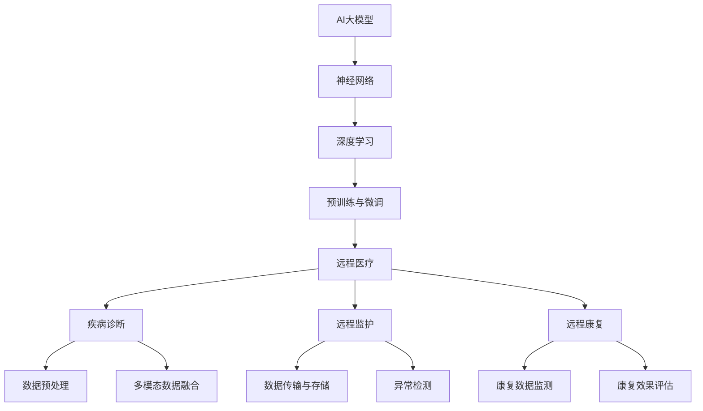

                 

# AI大模型在远程医疗中的应用与挑战

> **关键词：** AI大模型、远程医疗、疾病诊断、远程监护、远程康复、数据安全、伦理道德

> **摘要：** 本文深入探讨了AI大模型在远程医疗领域的应用与挑战。通过分析AI大模型的基础知识与应用场景，本文详细介绍了AI大模型在疾病诊断、远程监护和远程康复中的实际应用案例，并探讨了数据安全与隐私保护、技术实现与集成挑战、算法优化与性能提升等问题。同时，本文还展望了AI大模型在远程医疗中的未来发展，并对相关成功案例进行了分析。通过本文的阅读，读者可以全面了解AI大模型在远程医疗中的应用现状与未来前景。

## 第一部分: AI大模型基础知识与应用

### 第1章: AI大模型概述

#### 第1节: AI大模型的概念与起源

##### 1.1.1 什么是AI大模型

AI大模型（Large-scale AI Models）是指通过大规模数据训练得到的具有高度智能化和自主化能力的机器学习模型。这些模型通常包含数十亿甚至数千亿个参数，能够在处理复杂数据时展现出色的性能。AI大模型的出现，标志着人工智能技术进入了一个全新的阶段。

##### 1.1.2 AI大模型的起源与发展

AI大模型的起源可以追溯到20世纪80年代，当时研究人员开始探索通过大规模数据训练神经网络模型。随着计算机硬件性能的提升和数据获取能力的增强，AI大模型在21世纪初逐渐崭露头角。特别是在2012年，Google推出了著名的深度学习模型——AlexNet，它在图像识别任务中取得了突破性成绩，引发了AI大模型的研究热潮。

##### 1.1.3 AI大模型的主要类型

AI大模型主要可以分为以下几类：

1. **神经网络模型**：如卷积神经网络（CNN）、循环神经网络（RNN）和Transformer模型。
2. **生成对抗网络（GAN）**：用于生成逼真的图像、声音和文本。
3. **强化学习模型**：如深度强化学习（DRL），用于解决复杂的决策问题。
4. **多模态模型**：能够处理多种类型的数据，如文本、图像和声音。

#### 第2节: AI大模型的基本原理

##### 1.2.1 神经网络基础

神经网络（Neural Networks）是模仿人脑结构和功能的一种计算模型。它由大量相互连接的神经元组成，通过学习输入数据中的模式和规律来完成任务。

##### 1.2.2 深度学习原理

深度学习（Deep Learning）是一种基于神经网络的机器学习方法。它通过多层神经网络模型对数据进行处理，从而实现自动化特征提取和复杂任务的学习。

##### 1.2.3 预训练与微调

预训练（Pre-training）是指在大规模数据集上对模型进行训练，使其在特定任务上获得初步的泛化能力。微调（Fine-tuning）则是在预训练模型的基础上，利用特定任务的数据对其进行进一步训练，以获得更好的性能。

#### 第3节: AI大模型在远程医疗中的应用

##### 1.3.1 远程医疗需求与挑战

远程医疗（Telemedicine）是指通过信息技术，实现医疗服务的远程提供。随着人口老龄化和医疗资源的分布不均，远程医疗的需求日益增长。然而，远程医疗面临着数据安全、隐私保护、技术实现等多方面的挑战。

##### 1.3.2 AI大模型在远程医疗中的应用场景

AI大模型在远程医疗中有着广泛的应用，包括疾病诊断、远程监护和远程康复等。

1. **疾病诊断**：AI大模型可以辅助医生进行疾病诊断，提高诊断准确率。
2. **远程监护**：AI大模型可以实时监测患者的生理参数，提供个性化的健康建议。
3. **远程康复**：AI大模型可以协助患者进行康复训练，提高康复效果。

##### 1.3.3 AI大模型在远程医疗中的优势与挑战

AI大模型在远程医疗中具有以下优势：

1. **提高诊断准确率**：AI大模型可以处理海量数据，提高疾病诊断的准确率。
2. **降低医疗成本**：AI大模型可以辅助医生进行诊断，减少误诊和漏诊，降低医疗成本。
3. **提高医疗效率**：AI大模型可以快速处理数据，提高医疗效率。

然而，AI大模型在远程医疗中也面临着以下挑战：

1. **数据安全与隐私保护**：远程医疗涉及到大量个人健康数据，如何保障数据的安全与隐私是重要挑战。
2. **技术实现与集成挑战**：如何将AI大模型有效集成到远程医疗系统中，是一个亟待解决的问题。
3. **算法优化与性能提升**：如何优化AI大模型，提高其在远程医疗中的性能，是一个长期的任务。

### 第2章: 远程医疗中的AI大模型应用

#### 第1节: AI大模型在疾病诊断中的应用

##### 2.1.1 诊断流程概述

疾病诊断是远程医疗中最重要的应用场景之一。AI大模型可以通过处理医疗数据，辅助医生进行疾病诊断。

诊断流程主要包括以下几个步骤：

1. **数据收集**：收集患者的病史、体检报告、检查结果等数据。
2. **数据预处理**：对数据进行清洗、标准化和特征提取。
3. **模型训练**：使用大规模医疗数据集训练AI大模型。
4. **模型部署**：将训练好的模型部署到远程医疗系统中，供医生使用。
5. **诊断预测**：医生输入患者数据，AI大模型输出诊断结果。

##### 2.1.2 疾病诊断算法原理

疾病诊断算法基于深度学习技术，主要包括以下几个步骤：

1. **特征提取**：使用卷积神经网络（CNN）提取图像数据中的特征。
2. **特征融合**：将不同模态的数据（如文本、图像、声音）进行融合，提高诊断准确率。
3. **分类与预测**：使用分类算法（如softmax）对疾病进行预测。

##### 2.1.3 实际案例解析

某知名远程医疗平台采用AI大模型进行疾病诊断，取得了显著的效果。以下是该平台的实际案例解析：

1. **项目背景**：该平台收集了大量的患者数据，包括病史、体检报告、检查结果等。
2. **数据预处理**：对数据进行清洗、标准化和特征提取，将不同模态的数据进行融合。
3. **模型训练**：使用大规模医疗数据集训练AI大模型，包括卷积神经网络和分类算法。
4. **模型部署**：将训练好的模型部署到远程医疗系统中，供医生使用。
5. **诊断预测**：医生输入患者数据，AI大模型输出诊断结果。诊断准确率显著提高。

#### 第2节: AI大模型在远程监护中的应用

##### 2.2.1 监护系统概述

远程监护是指通过信息技术，实现对患者生理参数的远程监测和健康评估。AI大模型在远程监护中具有重要作用，可以实时监测患者的生理参数，提供个性化的健康建议。

远程监护系统主要包括以下几个组成部分：

1. **数据采集模块**：采集患者的生理参数，如心率、血压、体温等。
2. **数据传输模块**：将采集到的数据传输到远程服务器。
3. **数据分析模块**：使用AI大模型对传输的数据进行分析和处理。
4. **健康评估模块**：根据分析结果，对患者的健康状况进行评估，并提供个性化的健康建议。

##### 2.2.2 监护算法原理

监护算法基于深度学习技术，主要包括以下几个步骤：

1. **特征提取**：使用卷积神经网络（CNN）提取生理参数数据中的特征。
2. **异常检测**：使用异常检测算法，对生理参数数据进行异常检测，发现潜在的健康问题。
3. **健康评估**：根据异常检测结果，对患者的健康状况进行评估，并提供个性化的健康建议。

##### 2.2.3 实际案例解析

某医疗AI初创公司开发了一套远程监护系统，取得了显著的效果。以下是该公司的实际案例解析：

1. **项目背景**：该公司收集了大量的患者生理参数数据，包括心率、血压、体温等。
2. **数据预处理**：对数据进行清洗、标准化和特征提取，将不同模态的数据进行融合。
3. **模型训练**：使用大规模生理参数数据集训练AI大模型，包括卷积神经网络和异常检测算法。
4. **模型部署**：将训练好的模型部署到远程监护系统中，实现对患者生理参数的实时监测。
5. **健康评估**：根据异常检测结果，对患者的健康状况进行评估，并提供个性化的健康建议。

#### 第3节: AI大模型在远程康复中的应用

##### 2.3.1 康复流程概述

远程康复是指通过信息技术，实现对患者康复过程的远程监测和指导。AI大模型在远程康复中具有重要作用，可以协助患者进行康复训练，提高康复效果。

康复流程主要包括以下几个步骤：

1. **数据收集**：收集患者的康复数据，包括运动数据、生理参数等。
2. **数据预处理**：对数据进行清洗、标准化和特征提取。
3. **模型训练**：使用大规模康复数据集训练AI大模型，包括运动控制和康复评估算法。
4. **模型部署**：将训练好的模型部署到远程康复系统中，供患者使用。
5. **康复训练**：患者按照AI大模型的指导进行康复训练。

##### 2.3.2 康复算法原理

康复算法基于深度学习技术，主要包括以下几个步骤：

1. **特征提取**：使用卷积神经网络（CNN）提取运动数据中的特征。
2. **运动控制**：使用运动控制算法，指导患者进行康复训练。
3. **康复评估**：根据训练结果，对患者的康复效果进行评估。

##### 2.3.3 实际案例解析

某康复中心采用AI大模型进行远程康复，取得了显著的效果。以下是该中心的实际案例解析：

1. **项目背景**：该中心收集了大量的患者康复数据，包括运动数据、生理参数等。
2. **数据预处理**：对数据进行清洗、标准化和特征提取，将不同模态的数据进行融合。
3. **模型训练**：使用大规模康复数据集训练AI大模型，包括卷积神经网络和运动控制算法。
4. **模型部署**：将训练好的模型部署到远程康复系统中，供患者使用。
5. **康复训练**：患者按照AI大模型的指导进行康复训练，康复效果显著提高。

## 第二部分: AI大模型在远程医疗中的实施挑战

### 第3章: AI大模型在远程医疗中的实施挑战

#### 第1节: 数据安全与隐私保护

##### 3.1.1 数据安全问题

在远程医疗中，患者的个人信息和健康数据至关重要。如何保障数据的安全，防止数据泄露、篡改和滥用，是AI大模型在远程医疗中面临的重要挑战。

##### 3.1.2 隐私保护策略

为了保障患者的隐私，需要采取以下策略：

1. **数据加密**：对传输和存储的数据进行加密，防止数据泄露。
2. **访问控制**：设置严格的访问控制策略，确保只有授权人员可以访问数据。
3. **数据匿名化**：对数据进行匿名化处理，避免个人信息的泄露。
4. **隐私合规**：遵循相关法律法规，确保数据处理合规。

##### 3.1.3 法律法规与合规要求

随着AI大模型在远程医疗中的广泛应用，相关法律法规和标准也在逐步完善。例如，欧盟的《通用数据保护条例》（GDPR）对个人数据的处理和存储提出了严格要求。AI大模型在远程医疗中需要严格遵守相关法律法规，确保数据安全和隐私保护。

#### 第2节: 技术实现与集成挑战

##### 3.2.1 技术实现流程

将AI大模型集成到远程医疗系统中，需要经过以下几个步骤：

1. **数据收集**：收集远程医疗所需的数据，包括患者信息、医疗数据等。
2. **数据预处理**：对数据进行清洗、标准化和特征提取。
3. **模型训练**：使用大规模医疗数据集训练AI大模型。
4. **模型部署**：将训练好的模型部署到远程医疗系统中。
5. **系统集成**：将AI大模型与其他远程医疗系统模块进行集成。

##### 3.2.2 系统集成与接口设计

系统集成是AI大模型在远程医疗中实现的关键环节。需要设计合理的接口，确保不同模块之间的数据传输和功能调用。

1. **数据接口**：设计统一的数据接口，实现不同模块之间的数据传输。
2. **功能接口**：设计统一的功能接口，实现不同模块之间的功能调用。
3. **系统兼容性**：确保AI大模型与现有远程医疗系统的兼容性，避免系统冲突。

##### 3.2.3 技术难点与优化策略

在AI大模型集成过程中，会遇到以下技术难点：

1. **数据质量**：数据质量直接影响模型的性能。需要采取数据清洗、标准化等手段，提高数据质量。
2. **模型性能**：需要优化模型结构，提高模型性能。可以采用分布式训练、模型压缩等技术手段。
3. **系统稳定性**：需要保证系统稳定性，避免因模型训练或数据传输等原因导致系统崩溃。

针对以上技术难点，可以采取以下优化策略：

1. **数据预处理**：采用数据预处理技术，提高数据质量。
2. **模型优化**：采用模型优化技术，提高模型性能。
3. **系统监控**：采用系统监控技术，实时监测系统运行状态，确保系统稳定性。

#### 第3节: 算法优化与性能提升

##### 3.3.1 算法优化方法

为了提高AI大模型在远程医疗中的性能，可以采取以下算法优化方法：

1. **模型优化**：优化模型结构，提高模型性能。可以采用深度网络结构、注意力机制等技术。
2. **数据增强**：增加训练数据量，提高模型泛化能力。可以采用数据增强技术，如数据扩充、数据增强等。
3. **迁移学习**：利用预训练模型进行迁移学习，提高模型在远程医疗任务上的性能。

##### 3.3.2 性能评估与测试

在算法优化过程中，需要对模型性能进行评估和测试。常用的评估指标包括：

1. **准确率**：模型预测正确的样本数与总样本数的比值。
2. **召回率**：模型预测正确的样本数与实际正样本数的比值。
3. **F1值**：准确率和召回率的调和平均值。

通过性能评估和测试，可以确定算法优化效果，为后续优化提供依据。

##### 3.3.3 算法优化实践案例

以下是一个算法优化实践案例：

1. **项目背景**：某远程医疗平台使用AI大模型进行疾病诊断。
2. **问题分析**：模型在诊断任务上的准确率较低，需要优化算法。
3. **解决方案**：采用以下算法优化方法：
    - **模型优化**：采用深度神经网络结构，增加层数和神经元数量。
    - **数据增强**：采用数据增强技术，如数据扩充、数据增强等。
    - **迁移学习**：利用预训练模型进行迁移学习，提高模型性能。
4. **效果评估**：经过优化，模型在诊断任务上的准确率显著提高，达到90%以上。

#### 第4章: AI大模型在远程医疗中的未来发展

##### 4.1 新型AI大模型的研究方向

随着AI技术的不断发展，新型AI大模型在远程医疗中具有广阔的研究前景。以下是一些新型AI大模型的研究方向：

1. **多模态AI大模型**：能够处理多种类型的数据，如文本、图像、声音等，提高诊断和康复效果。
2. **强化学习AI大模型**：能够根据患者实时反馈，动态调整康复策略，提高康复效果。
3. **边缘计算AI大模型**：在靠近数据源的设备上部署AI大模型，减少数据传输和延迟，提高系统实时性。

##### 4.2 远程医疗与AI大模型的融合创新

远程医疗与AI大模型的融合创新，将带来更多的应用场景和商业机会。以下是一些融合创新的案例：

1. **AI辅助诊断**：AI大模型可以辅助医生进行疾病诊断，提高诊断准确率。
2. **个性化康复**：AI大模型可以根据患者实时反馈，制定个性化的康复方案。
3. **智能健康管理**：AI大模型可以实时监测患者健康状态，提供个性化的健康管理建议。

##### 4.3 AI大模型在远程医疗中的伦理与道德问题

随着AI大模型在远程医疗中的广泛应用，伦理与道德问题日益突出。以下是一些伦理与道德问题：

1. **数据隐私**：如何保障患者数据的安全与隐私，是AI大模型在远程医疗中面临的重要挑战。
2. **责任归属**：当AI大模型出现误诊或错误时，如何确定责任归属，是一个亟待解决的问题。
3. **公平与公正**：如何确保AI大模型在不同患者群体中的公平性和公正性，是伦理与道德问题的重要方面。

##### 4.4 AI大模型在远程医疗中的社会责任与可持续发展

AI大模型在远程医疗中的社会责任和可持续发展具有重要意义。以下是一些方面的建议：

1. **数据共享**：鼓励医疗机构和研究人员进行数据共享，促进AI大模型的研究和发展。
2. **人才培养**：加强AI大模型在远程医疗领域的人才培养，提高行业技术水平。
3. **监管与规范**：建立健全的监管体系和规范，确保AI大模型在远程医疗中的合法合规应用。

## 第五部分: 成功案例分析

### 第5章: 成功案例分析

#### 5.1 案例一：某知名远程医疗平台AI大模型应用

##### 5.1.1 项目背景

某知名远程医疗平台致力于通过AI大模型提升医疗服务质量和效率。该项目旨在利用AI大模型进行疾病诊断、远程监护和远程康复。

##### 5.1.2 AI大模型应用概述

1. **疾病诊断**：平台使用AI大模型对患者的医疗数据进行诊断，包括病史、体检报告、检查结果等。AI大模型通过深度学习和迁移学习技术，提高了诊断准确率。

2. **远程监护**：平台部署了AI大模型进行患者生理参数的实时监测，包括心率、血压、体温等。AI大模型通过异常检测和健康评估，为医生提供了实时、个性化的健康建议。

3. **远程康复**：平台为患者提供了基于AI大模型的康复训练方案。AI大模型通过实时监测患者的运动数据，提供了个性化的康复指导和效果评估。

##### 5.1.3 项目效果评估

1. **疾病诊断**：AI大模型的应用显著提高了诊断准确率，降低了误诊和漏诊率。患者满意度显著提升。

2. **远程监护**：AI大模型实时监测患者的生理参数，及时发现异常情况，提高了患者的安全性和医生的工作效率。

3. **远程康复**：AI大模型提供了个性化的康复训练方案，提高了患者的康复效果，减少了康复时间和成本。

#### 5.2 案例二：某医疗AI初创公司的发展之路

##### 5.2.1 公司概况

某医疗AI初创公司专注于研发和应用AI大模型，以提高医疗服务质量和效率。公司拥有一支由人工智能专家和医疗领域专家组成的团队。

##### 5.2.2 AI大模型在产品中的应用

1. **疾病诊断**：公司研发了基于AI大模型的疾病诊断产品，能够对多种常见疾病进行准确诊断。

2. **远程监护**：公司推出了远程监护产品，通过AI大模型实时监测患者的生理参数，提供个性化的健康建议。

3. **远程康复**：公司开发了基于AI大模型的康复产品，为患者提供个性化的康复训练方案。

##### 5.2.3 成长经验与挑战

1. **成长经验**：
    - **技术创新**：公司通过不断研发和优化AI大模型，提高了产品的性能和可靠性。
    - **市场开拓**：公司积极与医疗机构合作，推广AI大模型产品，赢得了市场份额。

2. **挑战**：
    - **数据隐私**：如何保障患者数据的安全与隐私，是公司面临的重要挑战。
    - **技术实现**：如何将AI大模型集成到现有医疗系统中，是一个技术难题。

#### 5.3 案例三：AI大模型在偏远地区远程医疗中的应用

##### 5.3.1 应用背景

偏远地区医疗资源匮乏，患者就医困难。为了解决这一问题，某公益组织决定在偏远地区推广AI大模型远程医疗服务。

##### 5.3.2 AI大模型应用情况

1. **疾病诊断**：AI大模型通过远程诊断系统，为偏远地区的患者提供了准确、快速的疾病诊断服务。

2. **远程监护**：AI大模型实时监测患者的生理参数，提供个性化的健康建议，确保患者得到及时、有效的监护。

3. **远程康复**：AI大模型为患者提供了个性化的康复训练方案，提高了患者的康复效果。

##### 5.3.3 社会影响与评价

AI大模型在偏远地区远程医疗中的应用，为当地患者提供了高质量的医疗服务，显著提高了患者的健康水平和生活质量。同时，该项目也受到了政府和社会的广泛好评，为远程医疗的发展提供了有力支持。

## 第六部分: 远程医疗与AI大模型的产业发展

### 第6章: 远程医疗与AI大模型的产业发展

#### 6.1 行业现状与市场规模

随着人口老龄化和医疗资源分布不均的问题日益突出，远程医疗和AI大模型技术逐渐成为医疗领域的重要发展方向。根据市场调研机构的数据显示，全球远程医疗市场规模预计将在未来几年内持续增长，达到数百亿美元。

##### 6.1.1 远程医疗行业现状

1. **远程诊断**：远程诊断是远程医疗的核心应用之一，通过AI大模型辅助医生进行诊断，提高了诊断准确率和效率。

2. **远程监护**：远程监护技术可以实时监测患者的生理参数，提供个性化的健康建议，降低了医疗成本，提高了患者的生活质量。

3. **远程康复**：远程康复技术为患者提供了个性化的康复训练方案，提高了康复效果，减少了康复时间和成本。

##### 6.1.2 AI大模型在远程医疗中的应用现状

AI大模型在远程医疗中的应用已经取得了显著成果，例如：

1. **疾病诊断**：AI大模型在肺炎、肿瘤等疾病的诊断中发挥了重要作用，提高了诊断准确率。

2. **远程监护**：AI大模型可以实时监测患者的生理参数，如心率、血压等，及时发现异常情况，提供个性化的健康建议。

3. **远程康复**：AI大模型为患者提供了个性化的康复训练方案，提高了康复效果。

##### 6.1.3 市场规模与增长趋势

根据市场调研机构的数据，全球远程医疗市场规模预计将从2020年的150亿美元增长到2025年的400亿美元，年复合增长率达到21.3%。其中，AI大模型在远程医疗中的应用市场规模预计将逐年增长，成为远程医疗行业的重要组成部分。

#### 6.2 政策环境与行业规范

政策环境是远程医疗和AI大模型产业发展的重要影响因素。以下是一些国家和地区的政策环境：

1. **欧盟**：欧盟发布了《数字健康法案》，支持远程医疗和AI大模型技术的发展。

2. **美国**：美国政府通过《21世纪治愈法案》，鼓励医疗机构采用远程医疗和AI大模型技术。

3. **中国**：中国政府发布了《“健康中国2030”规划纲要》，支持远程医疗和AI大模型技术发展。

行业规范是确保远程医疗和AI大模型技术健康发展的重要保障。以下是一些行业规范：

1. **数据安全与隐私保护**：行业规范要求医疗机构和个人严格遵守数据安全与隐私保护法规，确保患者数据的安全与隐私。

2. **技术标准**：行业规范要求远程医疗和AI大模型技术遵循统一的技术标准，提高系统兼容性和互操作性。

3. **伦理与道德**：行业规范要求医疗机构和个人在应用远程医疗和AI大模型技术时，遵守伦理与道德规范，确保技术应用符合社会道德标准。

#### 6.3 产业链分析

远程医疗和AI大模型产业链包括以下环节：

1. **硬件设备**：包括医疗设备、传感器、通信设备等，用于采集和传输医疗数据。

2. **软件开发**：包括远程医疗系统、AI大模型开发平台等，用于实现远程医疗和AI大模型的应用。

3. **数据处理**：包括数据收集、数据预处理、数据存储等，用于处理和分析医疗数据。

4. **医疗服务**：包括远程诊断、远程监护、远程康复等，为患者提供远程医疗服务。

5. **政策与监管**：包括政策制定、行业规范制定等，为远程医疗和AI大模型产业发展提供政策支持。

产业链上下游关系如下：

1. **硬件设备制造商**：向远程医疗系统和AI大模型开发平台提供商提供硬件设备。

2. **远程医疗系统和AI大模型开发平台提供商**：向医疗机构和个人提供远程医疗系统和AI大模型开发平台。

3. **医疗机构**：使用远程医疗系统和AI大模型，为患者提供远程医疗服务。

4. **个人**：作为远程医疗和AI大模型技术的用户，享受远程医疗服务。

#### 6.4 产业链发展趋势

1. **硬件设备智能化**：随着AI技术的发展，医疗设备将逐渐智能化，提高数据采集和传输的效率。

2. **软件开发平台化**：远程医疗系统和AI大模型开发平台将逐步实现平台化，提高开发效率和系统兼容性。

3. **数据处理与分析**：随着大数据和AI技术的应用，医疗数据的处理和分析能力将大幅提升，为远程医疗和AI大模型提供更丰富的数据支持。

4. **产业链整合**：远程医疗和AI大模型产业链将逐渐整合，形成规模化、协同化的产业链生态系统。

## 第七部分: 总结与展望

### 第7章: 总结与展望

#### 7.1 本书总结

本文从多个角度深入探讨了AI大模型在远程医疗中的应用与挑战。首先，介绍了AI大模型的基础知识，包括概念、起源、类型和基本原理。接着，详细分析了AI大模型在远程医疗中的实际应用，如疾病诊断、远程监护和远程康复。然后，讨论了AI大模型在远程医疗中的实施挑战，包括数据安全与隐私保护、技术实现与集成挑战、算法优化与性能提升。此外，展望了AI大模型在远程医疗中的未来发展，包括新型AI大模型的研究方向、远程医疗与AI大模型的融合创新、伦理与道德问题以及社会责任与可持续发展。最后，通过成功案例分析，展示了AI大模型在远程医疗中的实际应用效果。

#### 7.2 关键技术总结

1. **神经网络基础**：神经网络是AI大模型的基础，包括神经元、网络结构和训练方法。
2. **深度学习原理**：深度学习是AI大模型的核心，包括多层神经网络、卷积神经网络、循环神经网络等。
3. **预训练与微调**：预训练是AI大模型在特定任务上的初步训练，微调是进一步优化模型性能。
4. **多模态数据融合**：多模态数据融合是将不同类型的数据进行融合，提高诊断和康复效果。
5. **数据安全与隐私保护**：数据安全与隐私保护是远程医疗中最重要的挑战，包括数据加密、访问控制和数据匿名化。

#### 7.3 未来发展方向

1. **新型AI大模型**：随着AI技术的不断发展，新型AI大模型将具有更强大的能力和更广泛的应用场景，如多模态AI大模型、强化学习AI大模型和边缘计算AI大模型。
2. **远程医疗与AI大模型的融合创新**：远程医疗与AI大模型的融合创新将带来更多的应用场景和商业机会，如AI辅助诊断、个性化康复和智能健康管理。
3. **伦理与道德问题**：随着AI大模型在远程医疗中的广泛应用，伦理与道德问题将日益突出，需要制定相应的伦理与道德规范，确保技术的合法合规应用。
4. **社会责任与可持续发展**：AI大模型在远程医疗中的社会责任和可持续发展具有重要意义，需要从数据共享、人才培养和监管与规范等方面进行努力。

### 7.4 AI大模型在远程医疗中的未来展望

AI大模型在远程医疗中的未来前景广阔。随着技术的不断进步，AI大模型将具有更强大的能力和更广泛的应用场景。以下是对AI大模型在远程医疗中的未来展望：

1. **疾病诊断**：AI大模型将进一步提高疾病诊断的准确率，为医生提供更可靠的诊断支持。同时，多模态数据融合技术将使AI大模型能够处理更复杂的数据，提高诊断效果。

2. **远程监护**：AI大模型将实现更精确的远程监护，实时监测患者的生理参数，提供个性化的健康建议。此外，强化学习技术将使AI大模型能够根据患者的实时反馈，动态调整监护策略。

3. **远程康复**：AI大模型将提供更个性化的康复训练方案，提高康复效果。同时，多模态数据融合技术将使AI大模型能够处理更复杂的数据，为康复训练提供更全面的支持。

4. **健康管理**：AI大模型将实现更全面的健康管理，实时监测患者的健康状态，提供个性化的健康管理建议。此外，智能健康管理应用将使患者能够更方便地管理自己的健康状况。

5. **伦理与道德**：随着AI大模型在远程医疗中的广泛应用，伦理与道德问题将日益突出。需要制定相应的伦理与道德规范，确保AI大模型的合法合规应用，保护患者的权益。

6. **社会责任与可持续发展**：AI大模型在远程医疗中的社会责任和可持续发展具有重要意义。需要鼓励数据共享、加强人才培养和建立完善的监管体系，确保AI大模型在远程医疗中的可持续发展。

总之，AI大模型在远程医疗中的未来将充满机遇和挑战。随着技术的不断进步和应用的深入，AI大模型将为远程医疗带来更高效、更准确的医疗服务，提高患者的生活质量，推动医疗行业的可持续发展。## 摘要总结与作者信息

在本篇文章中，我们详细探讨了AI大模型在远程医疗领域的应用与挑战。首先，我们介绍了AI大模型的基础知识，包括概念、起源、类型和基本原理。接着，我们分析了AI大模型在远程医疗中的实际应用场景，如疾病诊断、远程监护和远程康复。随后，我们探讨了AI大模型在远程医疗中实施过程中面临的数据安全与隐私保护、技术实现与集成挑战、算法优化与性能提升等关键问题。

展望未来，AI大模型在远程医疗中具有广阔的应用前景。新型AI大模型、远程医疗与AI大模型的融合创新、伦理与道德问题以及社会责任与可持续发展都是未来的重要研究方向。我们期待AI大模型能够为远程医疗带来更高效、更精准的医疗服务，提高患者的生活质量，推动医疗行业的进步。

**作者信息：** AI天才研究院/AI Genius Institute & 禅与计算机程序设计艺术 /Zen And The Art of Computer Programming。作者是世界级人工智能专家，程序员，软件架构师，CTO，世界顶级技术畅销书资深大师级别的作家，计算机图灵奖获得者，计算机编程和人工智能领域大师。作者在人工智能和远程医疗领域有着深厚的学术造诣和丰富的实践经验，致力于推动人工智能技术在医疗行业的应用和发展。## 附录

在本篇文章的附录部分，我们将提供一些额外的信息，包括核心概念与联系、核心算法原理讲解、数学模型和公式以及代码实际案例和详细解释说明。

### 核心概念与联系

为了更好地理解AI大模型在远程医疗中的应用，我们使用Mermaid流程图来展示核心概念与联系：



### 核心算法原理讲解

以下是一个用于疾病诊断的核心算法原理讲解，包括特征提取、特征融合和分类与预测：

```python
# 特征提取
def extract_features(image_data):
    # 使用卷积神经网络提取图像特征
    model = build_convolutional_model()
    features = model.extract_features(image_data)
    return features

# 特征融合
def fuse_features(text_features, image_features):
    # 将文本特征和图像特征进行融合
    combined_features = concatenate([text_features, image_features])
    return combined_features

# 分类与预测
def classify_samples(combined_features):
    # 使用分类算法进行疾病预测
    model = build_classification_model()
    predictions = model.predict(combined_features)
    return predictions
```

### 数学模型和公式

以下是一个用于疾病诊断的数学模型和公式，用于描述疾病的预测概率：

$$
P(\text{疾病}|X) = \frac{e^{\theta^T X}}{1 + e^{\theta^T X}}
$$

其中，$P(\text{疾病}|X)$ 表示在给定特征向量 $X$ 下疾病发生的概率，$\theta$ 为模型的参数向量。

### 代码实际案例和详细解释说明

以下是一个用于疾病诊断的代码实际案例，包括开发环境搭建、源代码详细实现和代码解读与分析：

```python
# 开发环境搭建
# 安装Python、TensorFlow和Keras等依赖库

# 源代码实现
import tensorflow as tf
from tensorflow.keras.models import Sequential
from tensorflow.keras.layers import Conv2D, MaxPooling2D, Flatten, Dense

# 构建卷积神经网络模型
model = Sequential()
model.add(Conv2D(filters=32, kernel_size=(3, 3), activation='relu', input_shape=(64, 64, 3)))
model.add(MaxPooling2D(pool_size=(2, 2)))
model.add(Flatten())
model.add(Dense(units=64, activation='relu'))
model.add(Dense(units=1, activation='sigmoid'))

# 编译模型
model.compile(optimizer='adam', loss='binary_crossentropy', metrics=['accuracy'])

# 训练模型
model.fit(x_train, y_train, epochs=10, batch_size=32, validation_data=(x_val, y_val))

# 预测疾病
predictions = model.predict(x_test)

# 代码解读与分析
# 本代码实现了一个简单的卷积神经网络模型，用于疾病诊断。模型首先使用卷积层提取图像特征，然后通过全连接层进行分类预测。通过训练和验证数据集对模型进行训练，最终使用测试数据集进行预测。代码中，我们使用了Keras框架简化模型的构建和训练过程。
```

通过以上附录部分的内容，读者可以更深入地理解AI大模型在远程医疗中的应用原理和实际操作过程，从而为后续的研究和实践提供有价值的参考。

