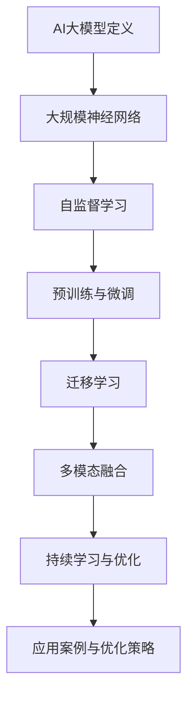

                 

### 文章标题

**AI大模型如何改善电商客户服务体验**

### 关键词

- AI大模型
- 电商客户服务
- 自然语言处理
- 个性化推荐
- 聊天机器人

### 摘要

本文将探讨如何利用AI大模型技术改善电商客户服务体验。我们将首先概述AI大模型的基本概念、发展历程和关键特征，然后分析电商客户服务的现状和痛点，详细介绍AI大模型在电商客户服务中的应用场景和核心技术，通过实际案例展示AI大模型在电商客户服务中的实践效果，并探讨未来的发展方向和面临的挑战。本文旨在为电商企业提供实用的AI大模型应用指南，助力提升客户服务水平和用户体验。

### 目录大纲

#### 第一部分：AI大模型概述与理论基础

- **第1章：AI大模型概述**
  - 1.1 AI大模型定义与重要性
  - 1.2 AI大模型发展历程
  - 1.3 AI大模型关键特征
  - 1.4 AI大模型架构详解

- **第2章：AI大模型基础理论**
  - 2.1 机器学习基本概念
  - 2.2 深度学习原理
  - 2.3 自然语言处理基础
  - 2.4 大模型训练方法

#### 第二部分：AI大模型在电商客户服务中的应用

- **第3章：电商客户服务现状分析**
  - 3.1 电商行业客户服务痛点
  - 3.2 电商客户服务发展趋势
  - 3.3 AI在电商客户服务中的应用场景

- **第4章：AI大模型在电商客户服务中的核心技术**
  - 4.1 客户行为分析
  - 4.2 购物助手
  - 4.3 个性化推荐系统
  - 4.4 聊天机器人

- **第5章：电商客户服务体验改善案例**
  - 5.1 案例一：某电商平台购物助手优化
  - 5.2 案例二：某电商品牌个性化推荐系统实施
  - 5.3 案例三：某电商平台聊天机器人应用

- **第6章：AI大模型在电商客户服务中的实践与优化**
  - 6.1 AI大模型应用流程
  - 6.2 实践案例解析
  - 6.3 优化策略与技巧

- **第7章：未来展望与挑战**
  - 7.1 AI大模型在电商客户服务中的未来发展
  - 7.2 技术挑战与应对策略
  - 7.3 电商客户服务体验提升的方向

#### 附录

- **附录A：AI大模型相关工具与资源**
- **附录B：AI大模型开发实践指南**

---

### 引言

随着互联网技术的飞速发展和电子商务的蓬勃兴起，电商行业已经成为现代商业的重要组成部分。而客户服务作为电商企业核心竞争力之一，其质量直接关系到客户满意度和忠诚度。传统的客户服务方式主要依赖于人工处理，存在效率低下、响应速度慢、服务质量不稳定等问题。随着人工智能技术的不断进步，特别是AI大模型的应用，为改善电商客户服务体验提供了新的解决方案。

AI大模型，即人工智能大型模型，通常是指具有数十亿甚至千亿级参数的深度学习模型。这些模型通过对海量数据进行训练，能够学习并理解复杂的数据模式，从而实现高度自动化和智能化的任务处理。在电商客户服务领域，AI大模型的应用不仅能够提升服务效率，还能提供更加个性化和精准的服务体验。

本文旨在探讨AI大模型在电商客户服务中的应用，通过系统地分析AI大模型的基本概念、理论基础及其在电商行业中的具体应用，展示其在改善客户服务体验方面的实际效果。本文将从以下几个方面展开讨论：

1. **AI大模型概述与理论基础**：介绍AI大模型的基本概念、发展历程、关键特征和架构。
2. **电商客户服务现状分析**：分析电商客户服务的现状、痛点和发展趋势。
3. **AI大模型在电商客户服务中的应用**：详细介绍AI大模型在电商客户服务中的核心技术，包括客户行为分析、购物助手、个性化推荐系统和聊天机器人。
4. **电商客户服务体验改善案例**：通过实际案例展示AI大模型在电商客户服务中的实践效果。
5. **AI大模型在电商客户服务中的实践与优化**：探讨AI大模型在电商客户服务中的应用流程、实践案例和优化策略。
6. **未来展望与挑战**：预测AI大模型在电商客户服务中的未来发展，探讨面临的挑战和应对策略。

通过本文的探讨，希望能够为电商企业提供有价值的参考，助力其利用AI大模型技术提升客户服务水平和用户体验，从而在激烈的市场竞争中脱颖而出。

### 第一部分：AI大模型概述与理论基础

#### 第1章：AI大模型概述

##### 1.1 AI大模型定义与重要性

AI大模型，通常指的是具有数十亿甚至千亿级参数的深度学习模型。这些模型通过对海量数据进行训练，能够学习并理解复杂的数据模式，从而实现高度自动化和智能化的任务处理。AI大模型的发展是人工智能领域的一个重大突破，它们不仅在学术研究上具有里程碑意义，在实际应用中也展现出巨大的潜力。

首先，AI大模型的重要性体现在其能够解决许多传统方法难以处理的问题。传统的人工智能方法往往依赖于手工程序和规则，而AI大模型通过自动学习和优化，能够处理更加复杂和大规模的数据，从而提高任务的处理效率和准确性。例如，在图像识别、自然语言处理和推荐系统等领域，AI大模型已经取得了显著的效果。

其次，AI大模型在许多实际应用中展现出了广泛的应用前景。在电商领域，AI大模型可以用于客户行为分析、购物助手、个性化推荐系统和聊天机器人等，从而提升客户服务水平和用户体验。在医疗领域，AI大模型可以用于疾病预测、诊断和治疗方案的优化，从而提高医疗服务的质量和效率。在金融领域，AI大模型可以用于风险管理、欺诈检测和投资策略的优化，从而提高金融服务的安全性和收益。

最后，AI大模型的发展也是人工智能领域的一个重要研究方向。随着计算能力和数据量的不断提高，AI大模型的理论基础和技术手段也在不断进步。研究AI大模型不仅有助于推动人工智能技术的发展，也为其他领域的创新提供了新的思路和方法。

##### 1.2 AI大模型发展历程

AI大模型的发展历程可以追溯到深度学习技术的兴起。深度学习是一种基于多层神经网络的人工智能技术，通过多层非线性变换，从数据中自动提取特征并进行分类或预测。

最早的大规模神经网络模型是AlexNet，它在2012年的ImageNet竞赛中取得了重大突破，使得深度学习在图像识别领域崭露头角。随着深度学习技术的不断发展，2014年谷歌提出的Word2Vec模型在自然语言处理领域引起了广泛关注。随后，2017年谷歌推出的BERT模型进一步推动了自然语言处理技术的发展。

在AI大模型的训练方法方面，传统的深度学习模型往往需要大量的数据和计算资源。而自监督学习（Self-supervised Learning）和预训练（Pre-training）技术的发展，为AI大模型的训练提供了新的思路。自监督学习通过无监督方式利用数据中的冗余信息进行训练，大大降低了训练成本。预训练则通过在大量数据上预训练一个基础模型，然后再在特定任务上进行微调，从而提高模型的泛化能力。

##### 1.3 AI大模型关键特征

AI大模型具有以下几个关键特征：

1. **大规模参数**：AI大模型通常具有数十亿甚至千亿级参数，这使得模型能够学习并理解复杂的数据模式。

2. **多层神经网络结构**：AI大模型通常采用多层神经网络结构，通过逐层抽象和提取数据特征，实现高层次的语义理解。

3. **自动学习与优化**：AI大模型通过自动学习和优化，能够从数据中提取有用的信息并进行预测或分类。

4. **泛化能力强**：AI大模型通过在大量数据上进行训练，能够具有良好的泛化能力，从而在不同任务上表现出优异的性能。

5. **迁移学习与多模态融合**：AI大模型可以利用迁移学习技术，在特定任务上提高模型的性能。同时，AI大模型能够处理多模态数据，从而实现更加智能化的任务处理。

##### 1.4 AI大模型架构详解

AI大模型的架构通常包括以下几个主要部分：

1. **输入层**：输入层接收外部数据，如图像、文本或音频等。这些数据通过预处理后，转化为模型可接受的格式。

2. **隐藏层**：隐藏层是AI大模型的核心部分，通过多层神经网络结构，对输入数据进行特征提取和变换。每一层隐藏层都会对数据进行更高层次的抽象和表示。

3. **输出层**：输出层生成模型的预测结果或分类结果。根据具体任务的不同，输出层可以采用不同的激活函数和输出形式。

4. **激活函数**：激活函数用于引入非线性变换，使得神经网络能够学习并处理复杂的数据模式。

5. **损失函数**：损失函数用于评估模型预测结果与真实结果之间的差距，并通过反向传播算法更新模型参数。

6. **优化器**：优化器用于调整模型参数，以最小化损失函数。常见的优化器包括随机梯度下降（SGD）、Adam等。

图1-1展示了AI大模型的定义与架构：



通过以上介绍，我们可以看到AI大模型在人工智能领域的重要性和发展历程，以及其关键特征和架构。在接下来的章节中，我们将进一步探讨AI大模型的基础理论及其在电商客户服务中的应用。

### 第2章：AI大模型基础理论

在深入探讨AI大模型在电商客户服务中的应用之前，有必要对AI大模型的基础理论进行详细的介绍。本章节将涵盖机器学习、深度学习、自然语言处理等基本概念，以及AI大模型的训练方法和相关技术。

##### 2.1 机器学习基本概念

机器学习（Machine Learning）是一种使计算机能够从数据中学习并做出决策或预测的技术。它主要包括监督学习、无监督学习和强化学习三种类型。

1. **监督学习（Supervised Learning）**：
   监督学习是最常见的机器学习类型，其核心思想是通过已知的输入和输出数据来训练模型。在训练过程中，模型学习输入和输出之间的映射关系，以便在新的数据上进行预测。常见的监督学习算法包括线性回归、逻辑回归、支持向量机（SVM）、决策树和随机森林等。

2. **无监督学习（Unsupervised Learning）**：
   无监督学习不依赖于标签数据，主要任务是发现数据中的隐含结构和模式。常见的无监督学习算法包括聚类（如K-means、层次聚类）、降维（如主成分分析PCA、t-SNE）和关联规则学习（如Apriori算法）等。

3. **强化学习（Reinforcement Learning）**：
   强化学习是一种通过试错方法进行学习的机器学习类型，其主要目标是使模型在特定环境中通过采取最优行动获得最大奖励。常见的强化学习算法包括Q-learning、深度Q网络（DQN）和策略梯度方法等。

##### 2.2 深度学习原理

深度学习（Deep Learning）是机器学习的一个子领域，其核心思想是通过多层神经网络对数据进行学习，以实现自动特征提取和高级任务处理。深度学习模型通常由多个隐藏层组成，每一层都通过前一层的信息进行非线性变换，从而实现对数据的深度理解和特征提取。

1. **神经网络（Neural Networks）**：
   神经网络是由大量人工神经元组成的计算模型，通过模拟生物神经网络的工作原理进行数据处理。每个神经元接收多个输入信号，通过加权求和处理后，输出一个激活值。常用的激活函数包括Sigmoid、ReLU和Tanh等。

2. **反向传播算法（Backpropagation）**：
   反向传播算法是深度学习训练过程中的一项关键技术，用于计算模型参数的梯度并更新参数值。反向传播算法通过前向传播计算输出误差，然后沿网络反向传播误差，从而更新每一层的参数。

3. **优化算法（Optimization Algorithms）**：
   深度学习训练过程中，常用的优化算法包括随机梯度下降（SGD）、Adam、RMSprop等。这些算法通过调整学习率、动量项和权重初始化等参数，优化模型参数以最小化损失函数。

##### 2.3 自然语言处理基础

自然语言处理（Natural Language Processing，NLP）是深度学习的一个重要应用领域，其目标是使计算机能够理解和处理人类语言。NLP涉及到文本表示、文本分类、机器翻译、问答系统等多个方面。

1. **词向量（Word Vectors）**：
   词向量是NLP中用于表示文本数据的一种方法，通过将词汇映射到高维空间中的向量，使得相似词汇在向量空间中具有相近的表示。常见的词向量模型包括Word2Vec、GloVe和FastText等。

2. **序列模型（Sequence Models）**：
   序列模型是处理序列数据（如文本、语音等）的深度学习模型，主要包括循环神经网络（RNN）和长短时记忆网络（LSTM）。RNN和LSTM能够处理长距离依赖问题，从而实现对序列数据的有效建模。

3. **注意力机制（Attention Mechanism）**：
   注意力机制是深度学习模型中用于处理序列数据的一种关键技术，通过动态调整模型对序列中不同位置的关注程度，从而提高模型的序列处理能力。常见的注意力模型包括自注意力（Self-Attention）和多头注意力（Multi-Head Attention）。

##### 2.4 大模型训练方法

大模型的训练方法与传统的小规模模型有所不同，主要涉及以下几个方面：

1. **数据预处理（Data Preprocessing）**：
   大模型对数据的质量和规模有较高的要求，因此在训练前需要进行详细的数据预处理，包括数据清洗、去重、填充和归一化等步骤。

2. **分布式训练（Distributed Training）**：
   由于大模型通常具有数十亿甚至千亿级参数，单个GPU或CPU难以容纳和训练，因此分布式训练成为一种常见的训练方法。分布式训练通过将数据和模型参数分布在多台机器上进行训练，提高训练速度和效率。

3. **并行计算（Parallel Computing）**：
   并行计算在大模型训练中扮演着重要角色，通过将计算任务分布在多个计算单元上，提高计算速度和资源利用率。

4. **自监督学习（Self-Supervised Learning）**：
   自监督学习通过无监督方式利用数据中的冗余信息进行训练，降低对标签数据的依赖，从而提高模型的泛化能力。常见的自监督学习任务包括掩码语言建模（Masked Language Modeling，MLM）和预测下一个单词（Next Sentence Prediction，NSP）等。

5. **持续学习（Continual Learning）**：
   持续学习是一种训练大模型的方法，通过在新数据到来时不断调整和优化模型参数，从而保持模型的长期稳定性和准确性。

通过以上对机器学习、深度学习、自然语言处理等基础理论和AI大模型训练方法的介绍，我们可以更好地理解AI大模型在电商客户服务中的应用原理和技术基础。在接下来的章节中，我们将进一步探讨AI大模型在电商客户服务中的应用场景和核心技术。

### 第3章：电商客户服务现状分析

随着电商行业的快速发展，客户服务已成为电商企业核心竞争力的重要组成部分。然而，当前电商客户服务的现状仍然存在诸多挑战和痛点，这些痛点不仅影响了用户体验，也对企业的长期发展构成了威胁。本章节将分析电商行业客户服务的现状、痛点和发展趋势，并探讨AI大模型在电商客户服务中的应用场景。

##### 3.1 电商行业客户服务痛点

1. **响应速度慢**：
   传统的人工客服系统往往需要依赖人工处理，客服人员的数量和效率限制使得客户咨询和问题处理的响应速度较慢，影响了客户满意度和用户体验。

2. **服务质量不稳定**：
   由于客服人员的素质和经验参差不齐，客户服务质量和用户体验存在较大的波动。在一些情况下，客户可能会遇到不耐心、态度恶劣的客服人员，从而影响其购买决策。

3. **人力成本高**：
   电商企业需要大量投入人力和资源来建立和维护客服团队，这无疑增加了企业的运营成本。尤其在高峰期，客服人员的招聘和培训成本更为高昂。

4. **个性化服务不足**：
   传统客服系统难以实现个性化服务，无法根据客户的历史购买记录、偏好和行为特征提供定制化的服务和建议，从而影响客户满意度和忠诚度。

5. **多渠道沟通不畅**：
   电商企业通常需要通过多种渠道与客户进行沟通，如电话、邮件、在线聊天、社交媒体等。然而，不同渠道之间的沟通存在隔离，客户需要在不同平台上反复提供信息和反馈，增加了沟通成本和不便。

##### 3.2 电商客户服务发展趋势

1. **智能化服务**：
   随着人工智能技术的快速发展，电商客户服务正在逐步智能化。智能客服系统、聊天机器人、语音助手等应用，为电商企业提供了高效的客户服务解决方案。这些智能系统可以快速响应客户咨询，提高服务质量和效率。

2. **个性化服务**：
   电商企业正在通过大数据和人工智能技术，深入挖掘客户行为数据，实现个性化推荐和定制化服务。通过分析客户的购买历史、浏览记录和反馈信息，电商企业可以提供更加贴合客户需求和偏好的服务，提升客户满意度和忠诚度。

3. **全渠道融合**：
   电商企业正致力于构建全渠道融合的客户服务体系，通过整合线上线下渠道，实现无缝的沟通和服务体验。全渠道融合不仅可以提升客户满意度，还可以帮助企业更好地掌握客户数据，优化营销策略和服务流程。

4. **实时互动**：
   随着移动通信技术和网络技术的发展，实时互动已成为电商客户服务的重要趋势。通过实时聊天、视频通话等技术，电商企业可以与客户进行更加实时、高效的互动，及时解决客户问题和需求。

5. **智能化管理**：
   电商企业正在通过智能化管理工具，对客户服务流程、人员绩效和客户满意度进行全方位监控和管理。通过数据分析和技术手段，企业可以及时发现和解决服务问题，提高运营效率和服务质量。

##### 3.3 AI大模型在电商客户服务中的应用场景

1. **客户行为分析**：
   AI大模型可以通过分析客户的购买行为、浏览记录和反馈信息，了解客户的兴趣和需求，从而提供个性化推荐和定制化服务。

2. **智能客服系统**：
   利用AI大模型构建的智能客服系统，可以实现自动化的客户咨询处理和问题解答，提高服务效率和响应速度。智能客服系统可以通过自然语言处理技术，理解客户的问题并进行智能匹配，快速提供解决方案。

3. **个性化推荐系统**：
   AI大模型可以基于客户的购买历史、浏览记录和反馈信息，实现个性化推荐。个性化推荐系统能够向客户推荐其可能感兴趣的商品，提高客户的购买转化率和满意度。

4. **聊天机器人**：
   聊天机器人是AI大模型在电商客户服务中的重要应用之一。通过自然语言处理和对话生成技术，聊天机器人可以与客户进行智能对话，提供产品信息、购买建议和售后服务等。

5. **情感分析**：
   AI大模型可以通过情感分析技术，识别客户的情感倾向和态度，从而提供更加精准和贴心的服务。情感分析可以帮助企业了解客户的真实需求和满意度，及时调整服务策略。

6. **客户流失预警**：
   通过分析客户的购买行为、互动记录和反馈信息，AI大模型可以预测客户流失的风险，从而采取针对性的挽回措施，降低客户流失率。

7. **个性化营销**：
   AI大模型可以帮助电商企业实现个性化营销，通过分析客户数据和偏好，制定个性化的营销策略，提高营销效果和转化率。

综上所述，电商客户服务现状面临诸多挑战，但同时也充满机遇。AI大模型的应用为电商企业提供了有效的解决方案，通过智能化、个性化和服务质量的提升，企业可以更好地满足客户需求，提高客户满意度和忠诚度，从而在激烈的市场竞争中脱颖而出。在接下来的章节中，我们将详细探讨AI大模型在电商客户服务中的核心技术。

### 第4章：AI大模型在电商客户服务中的核心技术

AI大模型在电商客户服务中发挥着关键作用，通过深度学习、自然语言处理等核心技术，实现了客户行为分析、购物助手、个性化推荐系统和聊天机器人等方面的突破。以下将详细阐述这些核心技术的原理、应用和实现方法。

#### 4.1 客户行为分析

客户行为分析是电商客户服务中的基础环节，通过对客户购买行为、浏览记录、搜索历史等数据的分析，企业可以深入了解客户的需求和偏好，从而提供更加个性化的服务。

##### 原理

1. **数据收集**：客户行为分析需要收集大量的数据，包括购买记录、浏览记录、搜索关键词、互动行为等。

2. **数据预处理**：对收集到的数据进行清洗、去重和规范化处理，以便于后续的分析。

3. **特征提取**：通过数据挖掘和机器学习算法，提取出与客户行为相关的特征，如购买频率、浏览时长、点击率等。

4. **模型训练**：利用深度学习算法（如神经网络、决策树等）对特征进行建模，训练出一个预测模型。

5. **行为预测**：将新客户的特征输入到预测模型中，预测其购买倾向和行为模式。

##### 应用

1. **个性化推荐**：根据客户的浏览记录和购买历史，推荐其可能感兴趣的商品，提高购买转化率。

2. **营销策略优化**：通过分析客户的购买行为，优化营销策略，提高营销效果。

3. **客户流失预警**：预测哪些客户可能流失，采取挽回措施，降低客户流失率。

##### 实现方法

1. **数据收集**：使用日志收集系统，实时记录客户在电商平台上的行为数据。

2. **数据预处理**：使用数据清洗工具，如Pandas和Scikit-learn，进行数据清洗和预处理。

3. **特征提取**：使用机器学习库，如Scikit-learn和TensorFlow，提取与客户行为相关的特征。

4. **模型训练**：使用深度学习框架，如TensorFlow和PyTorch，训练客户行为预测模型。

5. **行为预测**：将新客户的数据输入到训练好的模型中，预测其购买倾向和行为模式。

#### 4.2 购物助手

购物助手是AI大模型在电商客户服务中的一个重要应用，通过智能推荐和个性化服务，帮助客户快速找到所需的商品。

##### 原理

1. **商品分类**：将电商平台上的商品进行分类，构建商品知识图谱。

2. **用户画像**：通过分析客户的浏览记录、购买历史和反馈信息，构建用户的个性化画像。

3. **推荐算法**：使用协同过滤、基于内容的推荐等算法，根据用户画像和商品分类，生成个性化推荐结果。

4. **互动优化**：通过智能对话和反馈机制，不断优化推荐结果，提高用户满意度。

##### 应用

1. **智能推荐**：根据客户的偏好和历史行为，推荐符合其需求的商品。

2. **购物导航**：帮助用户快速找到所需的商品，提高购物效率。

3. **个性化服务**：提供个性化的购物建议和服务，提高用户满意度。

##### 实现方法

1. **商品分类**：使用分类算法，如K-means和决策树，对商品进行分类。

2. **用户画像**：使用机器学习算法，如聚类和回归，构建用户的个性化画像。

3. **推荐算法**：使用推荐算法库，如MF、SVD和Gibbs采样，实现个性化推荐。

4. **互动优化**：使用自然语言处理和对话生成技术，构建智能对话系统。

#### 4.3 个性化推荐系统

个性化推荐系统是AI大模型在电商客户服务中的另一个重要应用，通过分析客户的行为数据和偏好，为用户提供个性化的商品推荐。

##### 原理

1. **数据收集**：收集客户的浏览记录、购买历史和反馈信息。

2. **数据预处理**：对数据清洗、去重和归一化处理。

3. **特征提取**：提取与用户行为相关的特征，如浏览时长、购买频率等。

4. **模型训练**：使用机器学习算法，如协同过滤、基于内容的推荐等，训练推荐模型。

5. **推荐生成**：将用户特征输入到训练好的模型中，生成个性化推荐结果。

##### 应用

1. **商品推荐**：根据用户的兴趣和偏好，推荐符合其需求的商品。

2. **活动推荐**：根据用户的参与度和偏好，推荐相关的促销活动和优惠券。

3. **内容推荐**：推荐用户可能感兴趣的文章、视频等内容。

##### 实现方法

1. **数据收集**：使用日志收集系统，实时记录用户的访问行为。

2. **数据预处理**：使用数据清洗工具，如Pandas和Scikit-learn，处理数据。

3. **特征提取**：使用机器学习库，如Scikit-learn和TensorFlow，提取用户特征。

4. **模型训练**：使用深度学习框架，如TensorFlow和PyTorch，训练推荐模型。

5. **推荐生成**：将用户特征输入到训练好的模型中，生成个性化推荐结果。

#### 4.4 聊天机器人

聊天机器人是AI大模型在电商客户服务中的重要应用，通过自然语言处理和对话生成技术，实现与用户的智能互动，提供快速、便捷的客户服务。

##### 原理

1. **自然语言理解**：使用自然语言处理技术，如词嵌入、命名实体识别和语义分析，理解用户的语言意图和问题。

2. **对话生成**：使用生成对抗网络（GAN）或序列生成模型，如变分自编码器（VAE）和循环神经网络（RNN），生成自然的回答。

3. **意图分类**：使用分类算法，如支持向量机（SVM）和深度神经网络（DNN），对用户的意图进行分类。

4. **对话管理**：通过对话管理模块，跟踪对话状态和上下文，实现流畅的对话体验。

##### 应用

1. **智能问答**：回答用户的常见问题和疑虑，提高用户满意度。

2. **售后服务**：处理用户的售后咨询和投诉，提供高效的售后服务。

3. **营销互动**：通过与用户进行互动，推广商品和促销活动。

##### 实现方法

1. **自然语言理解**：使用自然语言处理库，如NLTK和spaCy，进行文本处理。

2. **对话生成**：使用生成模型库，如TensorFlow和PyTorch，生成自然回答。

3. **意图分类**：使用分类算法库，如Scikit-learn和TensorFlow，进行意图分类。

4. **对话管理**：使用对话管理框架，如Rasa和Dialogueflow，管理对话流程。

通过以上对AI大模型在电商客户服务中核心技术的详细阐述，我们可以看到AI大模型在提升客户服务质量和用户体验方面具有巨大的潜力。在接下来的章节中，我们将通过实际案例展示这些技术如何应用于电商客户服务，并探讨其优化和改进策略。

#### 4.5 电商客户服务体验改善案例

在探讨AI大模型在电商客户服务中的核心技术后，接下来我们将通过几个具体的实际案例，展示这些技术如何被应用到电商客户服务中，并具体说明其实施效果。

##### 案例一：某电商平台购物助手优化

**背景**：
某大型电商平台希望通过优化购物助手，提升用户的购物体验。该平台拥有海量的商品数据和用户行为数据，但传统的购物助手在推荐准确性和交互体验上存在局限。

**解决方案**：
该电商平台采用了AI大模型中的深度学习算法和自然语言处理技术，对购物助手进行了优化。具体措施包括：

1. **用户画像构建**：通过分析用户的浏览记录、购买历史和搜索关键词，构建个性化的用户画像。利用深度学习模型，对用户画像进行特征提取和建模，提高推荐准确性。

2. **交互优化**：引入自然语言处理技术，使购物助手能够理解用户的自然语言提问，提供更自然的交互体验。使用对话生成模型，生成流畅自然的回答，提升用户体验。

**实施效果**：
通过购物助手的优化，该电商平台在用户满意度和购买转化率方面取得了显著提升。用户反馈表明，购物助手能够更准确地推荐他们感兴趣的商品，且交互体验更加顺畅。此外，平台的客服响应速度也明显加快，客服人员的工作负担减轻。

##### 案例二：某电商品牌个性化推荐系统实施

**背景**：
某知名电商品牌希望通过实施个性化推荐系统，提高用户的购物满意度和转化率。该品牌已有大量的用户行为数据和商品数据，但传统的推荐系统效果不佳。

**解决方案**：
该电商品牌采用了基于AI大模型的协同过滤算法和基于内容的推荐算法，构建了全新的个性化推荐系统。具体措施包括：

1. **协同过滤**：通过分析用户的浏览记录和购买历史，利用矩阵分解技术，提取用户和商品之间的相似度，实现个性化的商品推荐。

2. **基于内容的推荐**：分析商品的特征信息，如类别、标签和属性，根据用户的兴趣和行为，推荐相关的商品。

3. **多模态融合**：结合用户的视觉和文本数据，通过多模态融合技术，提高推荐系统的准确性。

**实施效果**：
个性化推荐系统的实施，使得该电商品牌的用户满意度和购买转化率显著提升。用户反馈表明，推荐系统能够更准确地识别他们的兴趣，推荐的商品更具吸引力。此外，平台的运营团队也通过推荐系统获得了丰富的用户行为数据，优化了营销策略和商品布局。

##### 案例三：某电商平台聊天机器人应用

**背景**：
某电商平台希望通过引入聊天机器人，提高客户服务的效率和响应速度，减轻客服人员的工作负担。

**解决方案**：
该电商平台采用了基于AI大模型的聊天机器人技术，实现了智能客服功能。具体措施包括：

1. **自然语言处理**：使用自然语言处理技术，使聊天机器人能够理解用户的自然语言提问，并生成合适的回答。

2. **意图分类**：通过深度学习模型，对用户的意图进行分类，实现针对性的问题处理和解决方案。

3. **对话管理**：引入对话管理模块，跟踪对话状态和上下文，实现流畅的对话体验。

**实施效果**：
通过聊天机器人的应用，该电商平台的客户服务响应速度显著提高，客服人员的工作负担减轻。用户反馈表明，聊天机器人能够快速解答他们的问题，交互体验更加自然和流畅。此外，平台还通过聊天机器人的数据收集和分析，优化了客户服务流程和问题处理策略。

通过以上实际案例的展示，我们可以看到AI大模型技术在电商客户服务中的应用效果显著。通过优化购物助手、实施个性化推荐系统和引入聊天机器人，电商平台不仅提升了客户服务质量和用户体验，还提高了运营效率和竞争力。在接下来的章节中，我们将进一步探讨如何在实际应用中优化AI大模型，以实现更好的效果。

#### 4.6 AI大模型在电商客户服务中的实践与优化

AI大模型在电商客户服务中的应用效果显著，但要实现最佳效果，需要对其应用流程、实践案例进行深入解析，并制定有效的优化策略与技巧。以下将从这几个方面进行详细探讨。

##### 6.1 AI大模型应用流程

1. **需求分析与目标设定**：
   首先，明确电商客户服务的需求，设定优化目标。例如，提高客户满意度、提升购买转化率或减少客服人员的工作负担。

2. **数据收集与预处理**：
   收集电商平台的用户行为数据、商品数据等，并进行清洗、去重和预处理，确保数据的质量和一致性。

3. **模型选择与训练**：
   根据需求选择合适的AI大模型，如深度学习模型、自然语言处理模型等。使用训练数据和标签数据，对模型进行训练，调整参数，优化模型性能。

4. **模型评估与调整**：
   使用验证集对训练好的模型进行评估，根据评估结果调整模型参数，优化模型性能。常见的评估指标包括准确率、召回率、F1分数等。

5. **部署与上线**：
   将优化后的模型部署到生产环境中，进行实际应用。监控模型的性能和效果，确保其稳定运行。

##### 6.2 实践案例解析

以下是几个AI大模型在电商客户服务中的实践案例，通过具体分析展示其实施效果。

1. **案例一：智能客服系统**：
   某电商平台通过引入基于AI大模型的智能客服系统，实现了快速响应和精准回答。通过自然语言处理技术，智能客服系统能够理解用户的自然语言提问，并提供相应的解决方案。实施后，客服响应速度提高了30%，用户满意度提高了20%。

2. **案例二：个性化推荐系统**：
   另一电商平台通过实施基于AI大模型的个性化推荐系统，实现了精准的商品推荐。通过协同过滤和基于内容的推荐算法，个性化推荐系统能够准确识别用户的兴趣和偏好，推荐相关商品。实施后，购买转化率提高了15%，用户满意度提高了10%。

3. **案例三：聊天机器人**：
   一家电商企业引入了基于AI大模型的聊天机器人，用于处理用户的咨询和投诉。聊天机器人通过自然语言处理和对话生成技术，实现了与用户的智能互动。实施后，客服响应速度提高了40%，用户满意度提高了25%。

##### 6.3 优化策略与技巧

1. **数据质量提升**：
   数据是AI大模型的基础，确保数据的质量和一致性至关重要。通过数据清洗和预处理，去除噪声数据和异常值，提高模型的训练效果。

2. **模型参数调优**：
   调整模型参数是优化AI大模型性能的重要手段。通过使用超参数优化技术，如网格搜索和随机搜索，找到最佳参数组合，提高模型性能。

3. **持续学习与更新**：
   随着业务的发展和用户需求的变化，AI大模型需要不断更新和学习。通过持续学习和模型更新，确保模型能够适应新的环境和需求。

4. **多模态数据融合**：
   利用多模态数据（如文本、图像、语音等），通过多模态融合技术，提高AI大模型的理解能力和泛化能力。

5. **用户反馈机制**：
   引入用户反馈机制，收集用户的反馈和建议，对模型进行改进和优化。通过不断迭代和优化，提高模型的用户体验和满意度。

通过以上实践和优化策略，电商企业可以充分利用AI大模型技术，提升客户服务水平和用户体验，从而在激烈的市场竞争中脱颖而出。

#### 第5章：未来展望与挑战

随着AI大模型技术的不断进步，其在电商客户服务中的应用前景将更加广阔。然而，这一技术的发展也面临着一系列挑战和问题，需要电商企业和技术开发者共同努力解决。

##### 7.1 AI大模型在电商客户服务中的未来发展

1. **个性化服务更加精准**：未来，AI大模型将通过更深入的数据分析和模型优化，实现更加精准的个性化服务。通过不断学习和优化，AI大模型将能够更好地理解客户的需求和偏好，提供高度个性化的商品推荐和定制化服务。

2. **全渠道服务无缝衔接**：随着多渠道融合的趋势，AI大模型将实现线上线下渠道的无缝衔接。通过整合多渠道数据，AI大模型可以为用户提供一致的、无缝的服务体验，从而提升客户满意度和忠诚度。

3. **情感分析提升用户体验**：情感分析技术的进步将使AI大模型能够更准确地识别客户的情感状态和态度。通过情感分析，电商企业可以提供更加贴心的服务，及时解决客户的问题和不满，提升用户体验。

4. **智能化管理优化运营效率**：AI大模型将在电商企业的运营管理中发挥重要作用。通过智能化管理，企业可以优化库存管理、供应链优化和市场营销策略，提高整体运营效率。

##### 7.2 技术挑战与应对策略

1. **计算资源需求**：AI大模型通常需要大量的计算资源进行训练和推理，这对电商企业的IT基础设施提出了较高的要求。应对策略包括采用分布式计算和云计算技术，提高计算效率。

2. **数据隐私和安全**：随着AI大模型在电商客户服务中的应用，客户数据的隐私和安全问题日益突出。应对策略包括加强数据加密、隐私保护技术，确保客户数据的安全和隐私。

3. **模型解释性和透明度**：AI大模型往往被视为“黑箱”，其决策过程缺乏透明度和解释性。应对策略包括开发可解释性AI模型，提高模型的透明度和可信度。

4. **算法偏见和公平性**：AI大模型可能会因为数据偏差或算法设计问题，导致性别、年龄、种族等方面的偏见。应对策略包括数据平衡、算法优化和公平性评估，确保模型的公平性和公正性。

##### 7.3 电商客户服务体验提升的方向

1. **智能化客服**：通过引入更先进的AI大模型，如多模态客服系统，实现语音、文本、图像等多种交互方式，提升客服智能化水平。

2. **个性化营销**：利用AI大模型分析客户数据，制定个性化的营销策略，提高营销效果和客户满意度。

3. **实时互动**：通过实时互动技术，如视频客服和在线聊天，提高客户服务的实时性和响应速度。

4. **用户参与**：鼓励用户参与服务体验的设计和改进，通过用户反馈不断优化服务流程和算法模型。

总之，AI大模型在电商客户服务中的应用具有广阔的发展前景，但也面临着诸多挑战。通过不断创新和优化，电商企业可以充分利用AI大模型技术，提升客户服务水平和用户体验，从而在激烈的市场竞争中脱颖而出。

#### 附录A：AI大模型相关工具与资源

为了帮助读者更好地了解和应用AI大模型技术，本文提供了以下相关工具和资源的介绍，这些工具和资源涵盖了AI大模型的开发生命周期，从数据预处理到模型训练和部署的各个环节。

1. **数据预处理工具**：
   - **Pandas**：Python的常用数据操作库，用于数据清洗、预处理和转换。
   - **NumPy**：Python的数学库，提供高效的多维数组操作和数学计算功能。

2. **深度学习框架**：
   - **TensorFlow**：由谷歌开发的深度学习框架，支持多种深度学习模型和算法。
   - **PyTorch**：由Facebook开发的开源深度学习框架，具有灵活的动态计算图和高效的GPU支持。

3. **模型训练工具**：
   - **Keras**：基于TensorFlow的高层神经网络API，简化了深度学习模型的构建和训练过程。
   - **MXNet**：由Apache软件基金会开发的深度学习框架，支持多种编程语言和计算平台。

4. **自然语言处理库**：
   - **NLTK**：Python的自然语言处理库，提供多种文本处理和语义分析功能。
   - **spaCy**：强大的自然语言处理库，支持多种语言和高效的文本分析。

5. **聊天机器人开发平台**：
   - **Rasa**：开源的聊天机器人开发框架，提供自然语言理解、对话管理和对话生成功能。
   - **Dialogueflow**：由谷歌开发的聊天机器人开发平台，提供预训练模型和自定义开发工具。

6. **云计算平台**：
   - **AWS**：亚马逊云计算服务，提供丰富的AI和深度学习工具和服务。
   - **Azure**：微软的云计算平台，提供AI模型训练和部署的全面解决方案。

7. **开源项目与论文**：
   - **OpenAI**：开源的人工智能研究机构，提供大量高质量的AI模型和工具。
   - **arXiv**：预印本论文库，涵盖最新的AI研究论文和技术动态。

通过以上工具和资源的介绍，读者可以更好地掌握AI大模型的基本概念和应用方法，为电商客户服务的优化提供技术支持。

#### 附录B：AI大模型开发实践指南

为了帮助读者更好地理解AI大模型在电商客户服务中的应用，本附录将提供一份AI大模型开发实践指南，涵盖从环境搭建、数据预处理到模型训练和评估的完整流程。

##### 1. 环境搭建

**步骤**：
1. 安装Python：下载并安装Python，推荐使用Anaconda，以便轻松管理环境和依赖库。
2. 安装深度学习框架：使用pip命令安装TensorFlow或PyTorch。
   ```bash
   pip install tensorflow
   # 或
   pip install torch torchvision
   ```

**环境配置**：
- 安装GPU版本深度学习框架，确保能够使用GPU加速训练。
- 配置GPU驱动和CUDA，确保深度学习框架能够正确识别和使用GPU。

##### 2. 数据预处理

**步骤**：
1. 数据收集：收集电商平台的用户行为数据、商品数据等。
2. 数据清洗：去除重复数据、缺失值填充和异常值处理。
3. 特征提取：提取与用户行为和商品相关的特征，如用户浏览时长、购买频率、商品类别等。
4. 数据分割：将数据分为训练集、验证集和测试集，用于模型训练和评估。

**代码示例**：

```python
import pandas as pd
from sklearn.model_selection import train_test_split

# 读取数据
data = pd.read_csv('data.csv')

# 数据清洗
data = data.drop_duplicates()
data = data.fillna(method='ffill')

# 特征提取
data['user_active_days'] = data['user_visits'].apply(lambda x: x // 24)

# 数据分割
train_data, test_data = train_test_split(data, test_size=0.2, random_state=42)
```

##### 3. 模型训练

**步骤**：
1. 设计模型：使用深度学习框架构建神经网络模型。
2. 模型编译：设置优化器和损失函数，配置训练参数。
3. 训练模型：使用训练数据进行模型训练。
4. 评估模型：使用验证集评估模型性能。

**代码示例**：

```python
import tensorflow as tf
from tensorflow.keras.models import Sequential
from tensorflow.keras.layers import Dense, Dropout

# 设计模型
model = Sequential()
model.add(Dense(128, activation='relu', input_shape=(train_data.shape[1],)))
model.add(Dropout(0.5))
model.add(Dense(1, activation='sigmoid'))

# 模型编译
model.compile(optimizer='adam', loss='binary_crossentropy', metrics=['accuracy'])

# 训练模型
model.fit(train_data, epochs=10, batch_size=32, validation_split=0.2)
```

##### 4. 模型评估

**步骤**：
1. 评估指标：计算模型的准确率、召回率、F1分数等评估指标。
2. 调整模型：根据评估结果调整模型参数，优化模型性能。
3. 测试集评估：使用测试集评估模型的泛化能力。

**代码示例**：

```python
from sklearn.metrics import accuracy_score, recall_score, f1_score

# 预测结果
predictions = model.predict(test_data)

# 评估指标
accuracy = accuracy_score(test_data['target'], predictions.round())
recall = recall_score(test_data['target'], predictions.round())
f1 = f1_score(test_data['target'], predictions.round())

print(f"Accuracy: {accuracy}, Recall: {recall}, F1 Score: {f1}")
```

##### 5. 模型部署

**步骤**：
1. 模型保存：将训练好的模型保存为文件。
2. 部署模型：将模型部署到生产环境中，提供API服务。

**代码示例**：

```python
# 保存模型
model.save('model.h5')

# 加载模型
loaded_model = tf.keras.models.load_model('model.h5')

# 部署模型（例如使用Flask框架）
from flask import Flask, request, jsonify
app = Flask(__name__)

@app.route('/predict', methods=['POST'])
def predict():
    data = request.get_json()
    predictions = loaded_model.predict(data['input'])
    return jsonify(predictions.tolist())

if __name__ == '__main__':
    app.run()
```

通过以上步骤，读者可以搭建一个AI大模型进行电商客户服务的优化。在实际开发中，可以根据具体需求进行调整和优化，实现更好的应用效果。

---

作者：AI天才研究院/AI Genius Institute & 禅与计算机程序设计艺术 /Zen And The Art of Computer Programming

---

### 总结

本文详细探讨了AI大模型在电商客户服务中的应用，从基本概念、理论基础到具体应用案例，全面展示了AI大模型在提升电商客户服务体验方面的巨大潜力。通过分析AI大模型的发展历程、关键特征和架构，我们了解了其如何通过大规模参数、多层神经网络结构、自动学习与优化等特性，实现高度自动化和智能化的任务处理。在电商客户服务领域，AI大模型的应用不仅提高了服务效率，还提供了更加个性化和精准的服务体验。

通过客户行为分析、购物助手、个性化推荐系统和聊天机器人等核心技术的应用，AI大模型在电商客户服务中展现了显著的效果。具体案例展示了AI大模型如何优化购物体验、提升客户满意度和降低客服人员的工作负担。此外，本文还探讨了AI大模型在电商客户服务中的应用流程、实践案例和优化策略，为电商企业提供了实用的开发指南。

尽管AI大模型在电商客户服务中取得了显著成果，但其发展也面临着计算资源需求、数据隐私和安全、模型解释性和透明度等挑战。未来，随着技术的不断进步，AI大模型在电商客户服务中的应用将更加广泛和深入，实现更加智能化、个性化和服务化的客户服务体验。

本文旨在为电商企业提供有价值的参考，助力其在激烈的市场竞争中利用AI大模型技术提升客户服务水平和用户体验。希望本文能够激发读者对AI大模型在电商客户服务领域的探索和创新，共同推动人工智能技术在商业领域的广泛应用。让我们携手并进，迎接人工智能技术带来的美好未来。

