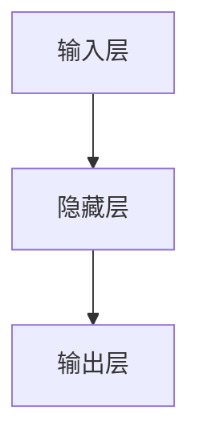

                 

### AI大模型应用的技术培训与认证体系

在当今快速发展的技术时代，人工智能（AI）大模型的应用已经成为推动各行各业创新和效率提升的关键力量。从自然语言处理到计算机视觉，从工业互联网到金融健康，AI大模型无处不在。然而，随着技术的复杂性和应用领域的扩展，对专业人才的需求也日益增加。这就需要我们建立一套完善的技术培训与认证体系，以确保AI大模型应用的专业性和高效性。

本篇文章旨在系统地探讨AI大模型应用的技术培训与认证体系。我们将分以下几个部分展开：

1. **AI大模型概述**：介绍AI大模型的定义、发展历程及应用领域。
2. **AI大模型核心技术**：解析深度学习、自然语言处理和计算机视觉等核心技术的原理与应用。
3. **AI大模型训练与优化**：探讨数据准备、训练策略和模型评估的要点。
4. **AI大模型部署与优化**：讲解模型部署策略、硬件优化和软件优化。
5. **AI大模型应用案例**：分析自然语言处理、计算机视觉、工业互联网、金融和医疗健康等领域的应用案例。
6. **AI大模型认证体系**：建立AI大模型认证流程和标准。
7. **附录**：提供常用工具、参考文献和练习题。

本文将通过逻辑清晰、结构紧凑的方式，逐步分析AI大模型应用的技术培训与认证体系，帮助读者深入理解和掌握相关技术。

#### 关键词：
- AI大模型
- 深度学习
- 自然语言处理
- 计算机视觉
- 工业互联网
- 金融应用
- 医疗健康
- 技术培训
- 认证体系

#### 摘要：
本文系统介绍了AI大模型应用的技术培训与认证体系。通过深入解析AI大模型的基础知识、核心技术和应用案例，以及详细的训练、优化和部署方法，本文为AI大模型应用提供了全面的技术指导。此外，还提出了构建AI大模型认证体系的思路，包括认证流程和标准的制定。本文旨在为人工智能领域的从业者和技术爱好者提供有价值的参考和实用的指导。

### 第一部分：AI大模型基础

#### 第1章：AI大模型概述

在开始深入探讨AI大模型的应用之前，我们首先需要理解什么是AI大模型。AI大模型，通常指的是那些在训练过程中使用大量数据、拥有数百万甚至数十亿参数的复杂深度学习模型。这些模型具有处理大规模数据和复杂任务的能力，是当前人工智能技术发展的一个重要方向。

#### 1.1 AI大模型定义

AI大模型（Large-scale AI Model）是基于深度学习的模型，其特点包括：

- **大规模数据训练**：使用海量数据集进行训练，以提升模型的泛化能力和性能。
- **大量参数**：模型参数数量通常在百万以上，甚至达到亿级。
- **多任务处理**：能够同时处理多种任务，如文本生成、图像分类和语音识别等。

AI大模型的核心在于其规模和复杂性。与传统的小型模型相比，AI大模型在处理复杂任务时展现出更高的效率和准确性。例如，Google的BERT模型就是一个典型的AI大模型，它使用了数以亿计的参数，并训练了数千亿个参数。

#### 1.2 AI大模型发展历程

AI大模型的发展历程可以追溯到20世纪80年代，随着计算机硬件和算法的进步，深度学习技术逐渐成熟。以下是AI大模型发展的重要里程碑：

- **1986年**：Rumelhart, Hinton和Williams提出了反向传播算法，这是深度学习的重要基础。
- **2006年**：Hinton提出了深度信念网络（DBN），为深度学习的应用奠定了基础。
- **2012年**：AlexNet在ImageNet图像识别大赛中取得了突破性成果，标志着深度学习时代的到来。
- **2017年**：Google的Transformer模型在自然语言处理领域取得了显著的成果，推动了AI大模型的发展。

这些里程碑事件不仅推动了AI大模型技术的发展，也促使了其在各个领域的广泛应用。

#### 1.3 AI大模型应用领域

AI大模型的应用领域非常广泛，几乎涵盖了人工智能的各个分支。以下是一些重要的应用领域：

- **自然语言处理（NLP）**：AI大模型在NLP领域取得了巨大成功，如文本生成、机器翻译和问答系统等。
- **计算机视觉（CV）**：AI大模型在CV领域也被广泛应用，如图像分类、目标检测和视频分析等。
- **语音识别**：AI大模型在语音识别中用于语音到文本的转换，提高了识别的准确性和效率。
- **推荐系统**：AI大模型在推荐系统中用于预测用户的偏好，提高了推荐系统的准确性。
- **金融领域**：AI大模型在金融领域用于风险控制、欺诈检测和投资分析等。
- **医疗健康**：AI大模型在医疗健康领域用于疾病预测、医疗图像分析和个性化治疗等。

总之，AI大模型的发展和应用极大地推动了人工智能技术的进步，为各个领域带来了深远的影响。

### 第2章：AI大模型核心技术

AI大模型的核心技术主要包括深度学习、自然语言处理（NLP）和计算机视觉（CV）。这些技术为AI大模型的应用提供了坚实的基础。本章节将详细介绍这些核心技术的基本原理和应用。

#### 2.1 深度学习基础

深度学习是AI大模型的核心技术之一，它基于多层神经网络的结构，通过学习大量数据来实现对复杂模式的识别和预测。

##### 2.1.1 神经网络原理

神经网络（Neural Network, NN）是模仿人脑神经元连接方式的计算模型。神经网络由多个神经元（也称为节点）组成，每个神经元接收输入信号，通过加权求和处理后产生输出。神经元的结构如图1所示：



在神经网络中，每个输入层节点与隐藏层节点之间以及隐藏层节点与输出层节点之间都存在连接，这些连接被称为“权重”（weights）。通过学习，神经网络能够调整这些权重，以便更好地拟合训练数据。

**激活函数**（activation function）是神经网络中的一个关键组件，它决定了神经元是否被激活。常用的激活函数包括：

- **Sigmoid函数**：\( \sigma(x) = \frac{1}{1 + e^{-x}} \)
- **ReLU函数**（Rectified Linear Unit）：\( \text{ReLU}(x) = \max(0, x) \)
- **Tanh函数**：\( \tanh(x) = \frac{e^x - e^{-x}}{e^x + e^{-x}} \)

##### 2.1.2 深度学习算法

深度学习（Deep Learning, DL）是在神经网络基础上发展起来的一种机器学习技术，它通过多层神经网络来学习复杂的数据特征。深度学习算法主要包括以下几种：

- **前馈神经网络（Feedforward Neural Network）**：前馈神经网络是最基本的深度学习模型，数据从输入层流向输出层，不形成循环。

  ```mermaid
  graph TD
  A[输入层] --> B[隐藏层1] --> C[隐藏层2] --> D[输出层]
  ```

- **卷积神经网络（Convolutional Neural Network, CNN）**：卷积神经网络主要应用于图像识别和计算机视觉领域，其特点是使用卷积层来提取图像特征。

  ```mermaid
  graph TD
  A[输入层] --> B[卷积层1] --> C[池化层1] --> D[卷积层2] --> E[池化层2] --> F[全连接层]
  ```

- **循环神经网络（Recurrent Neural Network, RNN）**：循环神经网络用于处理序列数据，如时间序列分析和自然语言处理。

  ```mermaid
  graph TD
  A[输入层] --> B[隐藏层1] --> C[隐藏层2]
  B --> D[隐藏层1]
  C --> E[隐藏层2]
  ```

- **长短时记忆网络（Long Short-Term Memory, LSTM）**：LSTM是RNN的一种变体，用于解决RNN在处理长序列数据时出现的梯度消失和梯度爆炸问题。

  ```mermaid
  graph TD
  A[输入层] --> B[遗忘门] --> C[输入门] --> D[输出门] --> E[隐藏层]
  F[状态] --> B --> C --> D --> E
  ```

- **门控循环单元（Gated Recurrent Unit, GRU）**：GRU是LSTM的简化版本，它将LSTM中的三个门简化为两个门，从而提高了计算效率。

  ```mermaid
  graph TD
  A[输入层] --> B[遗忘门] --> C[更新门] --> D[输出门] --> E[隐藏层]
  F[状态] --> B --> C --> D --> E
  ```

- **Transformer模型**：Transformer模型是近年来自然语言处理领域的重要突破，它通过自注意力机制（self-attention）来处理序列数据，显著提升了模型的效果。

  ```mermaid
  graph TD
  A[输入层] --> B[自注意力层1] --> C[自注意力层2] --> D[全连接层]
  ```

#### 2.2 自然语言处理

自然语言处理（Natural Language Processing, NLP）是AI大模型的重要应用领域之一，它涉及对人类语言的理解和处理。以下是NLP领域的关键技术：

##### 2.2.1 词嵌入

词嵌入（Word Embedding）是将词汇映射为高维向量表示的一种技术，它能够捕捉词汇的语义和语法关系。常见的词嵌入方法包括：

- **词袋模型（Bag-of-Words, BoW）**：词袋模型将文本表示为单词的集合，不考虑单词的顺序。
- **词嵌入（Word2Vec）**：Word2Vec是一种基于神经网络的学习方法，它通过训练词向量来捕捉单词的语义关系。
- **词嵌入（GloVe）**：GloVe是一种基于全局上下文信息的词嵌入方法，它通过优化词向量的全局平均值来提高嵌入质量。

##### 2.2.2 语言模型

语言模型（Language Model, LM）是用于预测下一个单词或词组的概率分布的模型，它是自然语言处理的基础。常见的语言模型包括：

- **n-gram模型**：n-gram模型是一种基于统计的模型，它使用前n个单词的历史信息来预测下一个单词。
- **循环神经网络（RNN）**：RNN是一种基于神经网络的模型，它能够处理变长序列数据，如自然语言。
- **长短时记忆网络（LSTM）**：LSTM是RNN的一种变体，它能够更好地处理长序列数据，避免了梯度消失问题。

##### 2.2.3 编码器与解码器

编码器（Encoder）和解码器（Decoder）是序列到序列学习（Sequence-to-Sequence Learning）模型的核心组成部分。编码器负责将输入序列编码为一个固定长度的向量表示，解码器则根据编码器的输出生成输出序列。

- **编码器**：编码器通常是一个RNN或LSTM模型，它逐个读取输入序列，并生成隐藏状态。
- **解码器**：解码器也是一个RNN或LSTM模型，它使用编码器的隐藏状态来生成输出序列。

#### 2.3 计算机视觉

计算机视觉（Computer Vision, CV）是AI大模型的另一个重要应用领域，它涉及从图像或视频中提取信息。以下是CV领域的关键技术：

##### 2.3.1 卷积神经网络

卷积神经网络（Convolutional Neural Network, CNN）是计算机视觉领域的核心技术，它通过卷积层、池化层和全连接层来提取图像特征。

- **卷积层**：卷积层通过卷积操作提取图像的特征。
- **池化层**：池化层用于降低特征图的尺寸，提高模型的计算效率。
- **全连接层**：全连接层将卷积层和池化层提取的特征映射到输出结果。

##### 2.3.2 目标检测

目标检测（Object Detection）是计算机视觉中的重要任务，它旨在识别图像中的多个目标。常见的目标检测方法包括：

- **单阶段检测器**：单阶段检测器在一次前向传播过程中同时完成特征提取和目标检测，如SSD和YOLO。
- **两阶段检测器**：两阶段检测器分为特征提取和目标检测两个阶段，如Faster R-CNN和RetinaNet。

通过以上对AI大模型核心技术的详细介绍，我们能够更好地理解AI大模型在各个领域的应用原理和技术框架。

### 第3章：AI大模型训练与优化

在深度学习领域，AI大模型的训练与优化是一个至关重要的环节。一个成功的模型不仅依赖于其结构和参数，还依赖于其训练过程的质量和优化策略。以下是AI大模型训练与优化的关键要点。

#### 3.1 数据准备

数据准备是AI大模型训练的基础，良好的数据准备能够显著提高模型性能和训练效率。以下是数据准备过程中的几个关键步骤：

##### 3.1.1 数据预处理

数据预处理包括数据清洗、归一化和数据增强等步骤：

- **数据清洗**：数据清洗旨在去除数据中的噪声和错误。这包括去除缺失值、纠正错误数据以及消除重复数据等。
  
  ```python
  # 示例：使用Pandas库清洗数据
  import pandas as pd

  data = pd.read_csv('data.csv')
  data = data.dropna()  # 去除缺失值
  ```

- **数据归一化**：数据归一化是将数据缩放到相同的尺度，以避免某些特征对模型的影响过大。常用的归一化方法包括最小-最大归一化和标准化。

  ```python
  # 示例：使用Scikit-learn库进行最小-最大归一化
  from sklearn.preprocessing import MinMaxScaler

  scaler = MinMaxScaler()
  X_scaled = scaler.fit_transform(X)
  ```

- **数据增强**：数据增强是通过生成数据的变体来增加训练数据的多样性，从而提高模型的泛化能力。常用的数据增强方法包括旋转、缩放、裁剪、颜色变换等。

  ```python
  # 示例：使用OpenCV库进行图像旋转
  import cv2

  image = cv2.imread('image.jpg')
  rotated_image = cv2.rotate(image, cv2.ROTATE_90_CLOCKWISE)
  ```

##### 3.1.2 数据增强

数据增强是提高模型泛化能力的重要手段，通过增加数据的多样性，模型能够学习到更丰富的特征。以下是一些常见的数据增强方法：

- **随机裁剪**：从原始图像中随机裁剪出一定大小的子图像。
- **水平/垂直翻转**：将图像沿水平或垂直方向翻转。
- **旋转**：随机旋转图像。
- **颜色变换**：调整图像的亮度、对比度和饱和度。

#### 3.2 训练策略

训练策略决定了模型在训练过程中的行为，包括如何选择批次大小、学习率和优化算法等。以下是几种常见的训练策略：

##### 3.2.1 批处理与梯度下降

批处理（Batch Size）是指每次训练时用于更新模型参数的数据样本数量。批处理可以分为以下几种：

- **批量梯度下降（Batch Gradient Descent, BGD）**：每次更新模型参数时使用所有训练样本。
- **随机梯度下降（Stochastic Gradient Descent, SGD）**：每次更新模型参数时仅使用一个训练样本。
- **小批量梯度下降（Mini-batch Gradient Descent, MBGD）**：每次更新模型参数时使用一部分训练样本。

批处理的选择取决于数据量、计算资源和训练目标。一般来说，小批量训练（如MBGD）能够更好地利用数据多样性，减少局部最优问题，但可能需要更长的训练时间。

梯度下降（Gradient Descent）是一种优化算法，用于最小化损失函数。它的基本原理如下：

- **前向传播**：计算输入数据和模型参数的输出，并计算损失函数。
- **反向传播**：计算损失函数关于模型参数的梯度，并更新模型参数。
- **迭代更新**：重复前向传播和反向传播，直到模型收敛。

##### 3.2.2 训练技巧

以下是一些提高模型训练效果的技巧：

- **学习率调整**：学习率控制梯度下降的步长，常用的调整策略包括固定学习率、指数衰减学习和自适应学习率。
- **正则化**：正则化方法如L1和L2正则化可以防止模型过拟合，提高模型泛化能力。
- **早停（Early Stopping）**：在验证集上监控模型性能，当验证集性能不再提高时停止训练。
- **数据增强**：通过增加训练样本的多样性，提高模型的泛化能力。

#### 3.3 模型评估

模型评估是训练过程的重要环节，通过评估模型性能可以判断训练是否成功，并为进一步优化提供依据。以下是一些常用的评估指标：

##### 3.3.1 评价指标

- **准确率（Accuracy）**：准确率是分类模型最常用的评估指标，表示正确预测的样本数占总样本数的比例。
  
  ```python
  # 示例：计算准确率
  from sklearn.metrics import accuracy_score

  y_pred = model.predict(X_test)
  accuracy = accuracy_score(y_test, y_pred)
  print(f'Accuracy: {accuracy}')
  ```

- **精确率（Precision）**：精确率是分类模型的一个评估指标，表示预测为正样本的样本中实际为正样本的比例。
  
  ```python
  # 示例：计算精确率
  from sklearn.metrics import precision_score

  precision = precision_score(y_test, y_pred)
  print(f'Precision: {precision}')
  ```

- **召回率（Recall）**：召回率是分类模型的一个评估指标，表示实际为正样本的样本中被正确预测为正样本的比例。
  
  ```python
  # 示例：计算召回率
  from sklearn.metrics import recall_score

  recall = recall_score(y_test, y_pred)
  print(f'Recall: {recall}')
  ```

- **F1值（F1 Score）**：F1值是精确率和召回率的调和平均值，用于综合评估分类模型的性能。
  
  ```python
  # 示例：计算F1值
  from sklearn.metrics import f1_score

  f1 = f1_score(y_test, y_pred)
  print(f'F1 Score: {f1}')
  ```

##### 3.3.2 模型选择

在训练过程中，选择合适的模型对训练效果至关重要。以下是一些常用的模型选择方法：

- **交叉验证（Cross-Validation）**：交叉验证是一种评估模型性能的方法，通过将数据集划分为多个子集，轮流使用每个子集作为验证集，评估模型性能。
- **网格搜索（Grid Search）**：网格搜索是一种用于超参数调优的方法，通过遍历所有可能的超参数组合，选择最佳组合。
- **贝叶斯优化（Bayesian Optimization）**：贝叶斯优化是一种基于概率模型的优化方法，通过探索和利用搜索空间，选择最优超参数。

通过上述训练与优化方法，我们可以有效地提升AI大模型的性能，为实际应用奠定坚实基础。

### 第4章：AI大模型部署与优化

在完成AI大模型的训练后，如何将其高效地部署并优化是确保模型在实际应用中表现优异的关键步骤。这一章将详细介绍AI大模型的部署策略、硬件优化和软件优化方法，以帮助读者在实际应用中充分发挥模型的潜力。

#### 4.1 模型部署

模型部署是将训练好的模型集成到生产环境中，使其能够对外提供服务的过程。以下是常见的模型部署策略：

##### 4.1.1 部署策略

1. **本地部署（On-Premise Deployment）**
   - **优点**：控制性强，数据安全。
   - **缺点**：硬件资源需求大，扩展性差。
   - **适用场景**：对数据安全性和控制性要求高的场景。

2. **云端部署（Cloud Deployment）**
   - **优点**：弹性大，易于扩展，维护方便。
   - **缺点**：数据传输延迟，安全性较低。
   - **适用场景**：需要大规模计算资源和灵活性较高的场景。

3. **边缘部署（Edge Deployment）**
   - **优点**：低延迟，高响应速度。
   - **缺点**：计算资源有限，存储容量有限。
   - **适用场景**：对实时性要求高，计算资源受限的场景。

##### 4.1.2 部署工具

以下是一些常用的模型部署工具：

1. **TensorFlow Serving**
   - **特点**：基于gRPC的高性能服务框架，支持多种类型的模型部署。
   - **应用场景**：适用于TensorFlow模型的部署。

2. **PyTorch Mobile**
   - **特点**：将PyTorch模型部署到移动设备，支持Android和iOS平台。
   - **应用场景**：适用于移动端应用的AI模型部署。

3. **TensorFlow Lite**
   - **特点**：针对移动设备和嵌入式设备的轻量级框架。
   - **应用场景**：适用于对性能和资源有较高要求的场景。

4. **Kubeflow**
   - **特点**：基于Kubernetes的自动化机器学习平台，支持多种框架的部署。
   - **应用场景**：适用于复杂分布式机器学习任务的部署和管理。

#### 4.2 模型优化

模型优化是提升模型性能的重要手段，以下是一些常见的优化方法：

##### 4.2.1 硬件优化

1. **GPU加速**
   - **特点**：利用GPU的并行计算能力，大幅提高训练速度。
   - **方法**：使用CUDA和cuDNN库进行GPU加速。

2. **分布式训练**
   - **特点**：通过多台机器协同工作，提高训练效率。
   - **方法**：使用参数服务器、数据并行和模型并行等策略。

3. **GPU压缩**
   - **特点**：减少GPU内存占用，提高GPU利用率。
   - **方法**：使用TensorFlow的GPU压缩工具或自定义压缩算法。

##### 4.2.2 软件优化

1. **模型压缩**
   - **特点**：减少模型参数数量，降低模型大小。
   - **方法**：包括量化、剪枝和知识蒸馏等方法。

2. **量化**
   - **特点**：将浮点数参数转换为低精度的整数表示。
   - **方法**：使用量化计算库如TensorFlow Lite Quantization或PyTorch Quantization。

3. **剪枝**
   - **特点**：去除模型中不重要的连接和节点，减少模型大小。
   - **方法**：包括结构剪枝和权重剪枝等。

4. **模型融合**
   - **特点**：将多个模型融合成一个，提高模型性能。
   - **方法**：包括集成学习和模型融合算法。

#### 4.3 模型调优

模型调优是模型部署后的关键步骤，以下是一些常用的调优方法：

1. **性能监控**
   - **方法**：使用性能监控工具如Prometheus或Grafana，实时监控模型性能。

2. **故障排查**
   - **方法**：使用日志分析工具如ELK（Elasticsearch、Logstash、Kibana）进行故障排查。

3. **在线学习**
   - **方法**：通过在线学习机制，持续更新模型，适应新数据。

4. **A/B测试**
   - **方法**：通过A/B测试，比较不同模型版本的效果，选择最优版本。

通过上述部署与优化方法，我们可以确保AI大模型在实际应用中能够高效运行，并提供高质量的预测结果。

### 第二部分：AI大模型应用案例

#### 第5章：AI大模型在自然语言处理中的应用

自然语言处理（NLP）是AI大模型的重要应用领域之一。通过深度学习技术，AI大模型在文本生成、机器翻译和文本分类等任务中取得了显著的成果。本章节将详细介绍AI大模型在NLP中的应用案例，包括机器翻译和文本分类。

#### 5.1 机器翻译

机器翻译是指利用计算机将一种自然语言文本翻译成另一种自然语言的过程。AI大模型在机器翻译中的应用，通过深度学习技术，使得翻译质量和速度得到了显著提升。

##### 5.1.1 翻译模型构建

构建机器翻译模型通常采用序列到序列学习（Sequence-to-Sequence Learning）框架。序列到序列学习模型主要由编码器（Encoder）和解码器（Decoder）两部分组成。

1. **编码器（Encoder）**：
   - **作用**：将输入的源语言文本编码为一个固定长度的向量表示。
   - **模型**：常用的编码器模型包括RNN、LSTM和GRU。
   - **输入**：源语言文本序列。
   - **输出**：编码后的向量表示。

2. **解码器（Decoder）**：
   - **作用**：将编码器的输出解码为目标语言文本序列。
   - **模型**：常用的解码器模型包括RNN、LSTM和GRU。
   - **输入**：编码器的隐藏状态。
   - **输出**：目标语言文本序列。

##### 5.1.2 翻译质量评估

翻译质量评估是衡量机器翻译模型性能的关键步骤。以下是一些常见的翻译质量评估方法：

1. **BLEU评分（BLEU Score）**：
   - **定义**：BLEU评分是一种基于字符串相似性的自动评估方法。
   - **计算**：BLEU评分通过比较参考译文和机器翻译译文之间的重叠度来评估翻译质量。
   - **优缺点**：优点是简单易用，缺点是容易受到参考译文质量的影响。

2. **NIST评分（NIST Score）**：
   - **定义**：NIST评分是另一种基于字符串相似性的自动评估方法。
   - **计算**：NIST评分与BLEU评分类似，但考虑了更多重叠度计算方式。
   - **优缺点**：优点是考虑了更多重叠度计算方式，缺点是计算复杂度较高。

3. **METEOR评分（METEOR Score）**：
   - **定义**：METEOR评分是一种基于词向量相似性的自动评估方法。
   - **计算**：METEOR评分通过计算词向量的余弦相似度来评估翻译质量。
   - **优缺点**：优点是能够更好地反映词义差异，缺点是计算复杂度较高。

#### 5.2 文本分类

文本分类是指将文本数据根据其内容归类到预定义的类别中。AI大模型在文本分类任务中通过深度学习技术，使得分类精度和效率得到了显著提升。

##### 5.2.1 分类模型构建

构建文本分类模型通常采用卷积神经网络（CNN）和BERT等深度学习模型。

1. **卷积神经网络（CNN）**：
   - **作用**：提取文本的局部特征。
   - **模型**：常用的CNN模型包括卷积层、池化层和全连接层。
   - **输入**：文本序列。
   - **输出**：类别概率分布。

2. **BERT模型**：
   - **作用**：提取文本的全局特征。
   - **模型**：BERT模型是一种基于Transformer的预训练模型，通过预训练和微调进行文本分类。
   - **输入**：文本序列。
   - **输出**：类别概率分布。

##### 5.2.2 分类效果评估

分类效果评估是衡量文本分类模型性能的关键步骤。以下是一些常见的分类效果评估方法：

1. **准确率（Accuracy）**：
   - **定义**：准确率是分类正确的样本数占总样本数的比例。
   - **计算**：准确率 = (分类正确数 / 总样本数) * 100%。

2. **精确率（Precision）**：
   - **定义**：精确率是预测为正类别的样本中实际为正类别的比例。
   - **计算**：精确率 = (分类正确数 / 预测为正类别的总数) * 100%。

3. **召回率（Recall）**：
   - **定义**：召回率是实际为正类别的样本中被正确预测为正类别的比例。
   - **计算**：召回率 = (分类正确数 / 实际为正类别的总数) * 100%。

4. **F1值（F1 Score）**：
   - **定义**：F1值是精确率和召回率的调和平均值。
   - **计算**：F1值 = 2 * (精确率 * 召回率) / (精确率 + 召回率)。

通过上述AI大模型在自然语言处理中的应用案例，我们可以看到深度学习技术在机器翻译和文本分类等任务中的显著优势。随着AI大模型的不断发展，自然语言处理领域将继续迎来更多的创新和应用。

### 第6章：AI大模型在计算机视觉中的应用

计算机视觉（CV）是AI大模型的重要应用领域之一，通过深度学习技术，AI大模型在图像识别、目标检测和视频分析等方面取得了显著的成果。本章节将详细介绍AI大模型在计算机视觉中的应用案例，包括图像识别和视频分析。

#### 6.1 图像识别

图像识别是指从图像中识别出特定对象或场景的过程。AI大模型在图像识别中的应用，通过深度学习技术，使得识别精度和速度得到了显著提升。

##### 6.1.1 识别模型构建

构建图像识别模型通常采用卷积神经网络（CNN）和Transformer等深度学习模型。

1. **卷积神经网络（CNN）**：
   - **作用**：提取图像的特征。
   - **模型**：常用的CNN模型包括卷积层、池化层和全连接层。
   - **输入**：图像。
   - **输出**：类别概率分布。

2. **Transformer模型**：
   - **作用**：提取图像的全局特征。
   - **模型**：Transformer模型是一种基于自注意力机制的模型，通过编码器和解码器处理图像。
   - **输入**：图像。
   - **输出**：类别概率分布。

##### 6.1.2 识别效果评估

识别效果评估是衡量图像识别模型性能的关键步骤。以下是一些常见的识别效果评估方法：

1. **准确率（Accuracy）**：
   - **定义**：准确率是分类正确的样本数占总样本数的比例。
   - **计算**：准确率 = (分类正确数 / 总样本数) * 100%。

2. **精确率（Precision）**：
   - **定义**：精确率是预测为正类别的样本中实际为正类别的比例。
   - **计算**：精确率 = (分类正确数 / 预测为正类别的总数) * 100%。

3. **召回率（Recall）**：
   - **定义**：召回率是实际为正类别的样本中被正确预测为正类别的比例。
   - **计算**：召回率 = (分类正确数 / 实际为正类别的总数) * 100%。

4. **F1值（F1 Score）**：
   - **定义**：F1值是精确率和召回率的调和平均值。
   - **计算**：F1值 = 2 * (精确率 * 召回率) / (精确率 + 召回率)。

#### 6.2 视频分析

视频分析是指从视频中提取有用信息的过程，AI大模型在视频分析中的应用，通过深度学习技术，使得视频分析的效果和效率得到了显著提升。

##### 6.2.1 视频模型构建

构建视频分析模型通常采用循环神经网络（RNN）和Transformer等深度学习模型。

1. **循环神经网络（RNN）**：
   - **作用**：处理序列数据。
   - **模型**：常用的RNN模型包括LSTM和GRU。
   - **输入**：视频序列。
   - **输出**：类别概率分布。

2. **Transformer模型**：
   - **作用**：处理序列数据。
   - **模型**：Transformer模型是一种基于自注意力机制的模型，通过编码器和解码器处理视频。
   - **输入**：视频序列。
   - **输出**：类别概率分布。

##### 6.2.2 视频效果评估

视频效果评估是衡量视频分析模型性能的关键步骤。以下是一些常见的视频效果评估方法：

1. **帧准确率（Frame Accuracy）**：
   - **定义**：帧准确率是分类正确的帧数占总帧数的比例。
   - **计算**：帧准确率 = (分类正确帧数 / 总帧数) * 100%。

2. **平均准确率（Average Accuracy）**：
   - **定义**：平均准确率是所有帧的准确率的平均值。
   - **计算**：平均准确率 = (帧准确率之和 / 帧数) * 100%。

3. **帧召回率（Frame Recall）**：
   - **定义**：帧召回率是实际为正类别的帧中被正确预测为正类别的比例。
   - **计算**：帧召回率 = (分类正确帧数 / 实际为正类别的帧数) * 100%。

4. **平均召回率（Average Recall）**：
   - **定义**：平均召回率是所有帧的召回率的平均值。
   - **计算**：平均召回率 = (帧召回率之和 / 帧数) * 100%。

通过上述AI大模型在计算机视觉中的应用案例，我们可以看到深度学习技术在图像识别和视频分析中的显著优势。随着AI大模型的不断发展，计算机视觉领域将继续迎来更多的创新和应用。

### 第7章：AI大模型在工业互联网中的应用

工业互联网（Industrial Internet）是指通过智能设备、传感器和数据通信技术将物理设备、系统和人员连接起来，实现智能化、自动化和高效化的工业生产过程。AI大模型在工业互联网中的应用，通过对海量数据的分析和预测，提升了工业生产的效率和质量。本章将详细介绍AI大模型在工业互联网中的应用案例，包括数据分析、设备预测性维护和自动化生产线优化。

#### 7.1 数据分析

数据分析是工业互联网中的一项关键任务，通过分析工业设备产生的数据，可以优化生产流程，预测设备故障，提高生产效率。AI大模型在数据分析中的应用，主要体现在以下几个方面：

##### 7.1.1 数据预处理

数据预处理是数据分析的重要步骤，包括数据清洗、归一化和特征提取等。

- **数据清洗**：去除数据中的噪声和异常值，确保数据的质量和准确性。
  
  ```python
  import pandas as pd

  data = pd.read_csv('data.csv')
  data = data.dropna()  # 去除缺失值
  ```

- **数据归一化**：将不同尺度的数据缩放到相同的范围，便于模型处理。

  ```python
  from sklearn.preprocessing import MinMaxScaler

  scaler = MinMaxScaler()
  X_scaled = scaler.fit_transform(X)
  ```

- **特征提取**：从原始数据中提取有代表性的特征，用于训练模型。

  ```python
  from sklearn.decomposition import PCA

  pca = PCA(n_components=5)
  X_pca = pca.fit_transform(X_scaled)
  ```

##### 7.1.2 数据分析模型构建

数据分析模型构建通常采用时间序列分析、聚类分析和回归分析等方法。

- **时间序列分析**：用于预测未来的生产趋势和设备状态。

  ```python
  from sklearn.ensemble import RandomForestRegressor

  model = RandomForestRegressor(n_estimators=100)
  model.fit(X_train, y_train)
  y_pred = model.predict(X_test)
  ```

- **聚类分析**：用于识别生产过程中的异常数据或聚类生产模式。

  ```python
  from sklearn.cluster import KMeans

  kmeans = KMeans(n_clusters=3)
  kmeans.fit(X_train)
  clusters = kmeans.predict(X_test)
  ```

- **回归分析**：用于预测生产过程中关键参数的变化趋势。

  ```python
  from sklearn.linear_model import LinearRegression

  model = LinearRegression()
  model.fit(X_train, y_train)
  y_pred = model.predict(X_test)
  ```

##### 7.1.3 数据分析效果评估

数据分析效果评估是确保模型性能的重要步骤，常用的评估指标包括预测准确率、均方误差（MSE）和均方根误差（RMSE）等。

- **预测准确率**：用于评估模型的预测能力。
  ```python
  from sklearn.metrics import accuracy_score

  accuracy = accuracy_score(y_test, y_pred)
  print(f'Prediction Accuracy: {accuracy}')
  ```

- **均方误差（MSE）**：用于衡量预测值与真实值之间的平均误差。
  ```python
  from sklearn.metrics import mean_squared_error

  mse = mean_squared_error(y_test, y_pred)
  print(f'Mean Squared Error: {mse}')
  ```

- **均方根误差（RMSE）**：用于衡量预测值与真实值之间的标准差。
  ```python
  from sklearn.metrics import mean_squared_error
  rmse = np.sqrt(mse)
  print(f'Root Mean Squared Error: {rmse}')
  ```

#### 7.2 设备预测性维护

设备预测性维护是工业互联网中的重要应用，通过预测设备故障，提前进行维护，减少设备故障对生产的影响，提高生产效率。AI大模型在设备预测性维护中的应用，主要体现在以下几个方面：

##### 7.2.1 维护模型构建

维护模型构建通常采用故障预测、异常检测和状态评估等方法。

- **故障预测**：通过分析历史数据，预测设备何时可能发生故障。

  ```python
  from sklearn.ensemble import RandomForestClassifier

  model = RandomForestClassifier(n_estimators=100)
  model.fit(X_train, y_train)
  y_pred = model.predict(X_test)
  ```

- **异常检测**：通过检测设备运行过程中的异常数据，识别潜在的故障。

  ```python
  from sklearn.ensemble import IsolationForest

  model = IsolationForest(n_estimators=100)
  model.fit(X_train)
  anomalies = model.predict(X_test)
  ```

- **状态评估**：通过评估设备当前的状态，预测其未来的运行情况。

  ```python
  from sklearn.linear_model import LogisticRegression

  model = LogisticRegression()
  model.fit(X_train, y_train)
  y_pred = model.predict(X_test)
  ```

##### 7.2.2 维护效果评估

维护效果评估是确保维护模型性能的重要步骤，常用的评估指标包括预测准确率、召回率和F1值等。

- **预测准确率**：用于评估模型的预测能力。
  ```python
  from sklearn.metrics import accuracy_score

  accuracy = accuracy_score(y_test, y_pred)
  print(f'Prediction Accuracy: {accuracy}')
  ```

- **召回率**：用于评估模型对故障的检测能力。
  ```python
  from sklearn.metrics import recall_score

  recall = recall_score(y_test, y_pred)
  print(f' Recall: {recall}')
  ```

- **F1值**：用于综合评估模型的预测性能。
  ```python
  from sklearn.metrics import f1_score

  f1 = f1_score(y_test, y_pred)
  print(f'F1 Score: {f1}')
  ```

通过上述AI大模型在工业互联网中的应用案例，我们可以看到深度学习技术在提升工业生产效率、降低生产成本和保障设备运行稳定性方面的重要作用。随着AI大模型的不断发展，工业互联网领域将继续迎来更多的创新和应用。

### 第8章：AI大模型在金融领域的应用

金融领域是AI大模型的重要应用领域之一，通过深度学习技术，AI大模型在风险评估、个性化推荐和风险控制等方面发挥了重要作用。本章将详细介绍AI大模型在金融领域的应用案例。

#### 8.1 风险评估

在金融领域，风险评估是指对投资组合、金融机构或客户的风险进行评估和预测，以便采取有效的风险管理措施。AI大模型在风险评估中的应用，主要体现在以下几个方面：

##### 8.1.1 风险模型构建

风险模型构建通常采用回归分析、分类分析和聚类分析等方法。

- **回归分析**：用于预测金融资产的收益率或价格。
  ```python
  from sklearn.linear_model import LinearRegression

  model = LinearRegression()
  model.fit(X_train, y_train)
  y_pred = model.predict(X_test)
  ```

- **分类分析**：用于预测金融资产的违约风险或欺诈风险。
  ```python
  from sklearn.ensemble import RandomForestClassifier

  model = RandomForestClassifier(n_estimators=100)
  model.fit(X_train, y_train)
  y_pred = model.predict(X_test)
  ```

- **聚类分析**：用于识别不同风险特征的客户群体。
  ```python
  from sklearn.cluster import KMeans

  kmeans = KMeans(n_clusters=3)
  kmeans.fit(X_train)
  clusters = kmeans.predict(X_test)
  ```

##### 8.1.2 风险评估方法

风险评估方法包括定量评估和定性评估，定量评估主要通过模型进行预测，定性评估则通过专家经验进行评估。

- **定量评估**：通过模型预测风险，计算风险指标。
  ```python
  from sklearn.metrics import accuracy_score

  accuracy = accuracy_score(y_test, y_pred)
  print(f'Prediction Accuracy: {accuracy}')
  ```

- **定性评估**：通过专家经验进行风险评估。
  ```python
  expert_rating = expert评估风险(数据)
  ```

#### 8.2 个性化推荐

个性化推荐是金融领域的重要应用，通过分析用户行为和偏好，为用户提供个性化的金融产品和服务。

##### 8.2.1 推荐模型构建

推荐模型构建通常采用协同过滤、矩阵分解和基于内容的推荐方法。

- **协同过滤**：通过分析用户之间的相似度进行推荐。
  ```python
  from sklearn.neighbors import NearestNeighbors

  model = NearestNeighbors(n_neighbors=5)
  model.fit(X_train)
  user_indices = model.kneighbors(X_test, n_neighbors=5)
  recommendations = get_recommendations(user_indices)
  ```

- **矩阵分解**：通过分解用户-项目矩阵，提取用户和项目的特征。
  ```python
  from surprise import SVD

  model = SVD()
  model.fit(data_matrix)
  user_indices = model.predict(user_id, item_id)
  recommendations = get_recommendations(user_indices)
  ```

- **基于内容的推荐**：通过分析金融产品的属性和用户偏好进行推荐。
  ```python
  from sklearn.metrics.pairwise import cosine_similarity

  product_features = get_product_features(产品列表)
  user_features = get_user_features(用户属性)
  similarity_matrix = cosine_similarity(product_features, user_features)
  recommendations = get_recommendations(similarity_matrix)
  ```

##### 8.2.2 推荐效果评估

推荐效果评估是确保推荐系统性能的重要步骤，常用的评估指标包括准确率、召回率和F1值等。

- **准确率**：用于评估推荐系统的准确性。
  ```python
  from sklearn.metrics import accuracy_score

  accuracy = accuracy_score(y_test, y_pred)
  print(f'Prediction Accuracy: {accuracy}')
  ```

- **召回率**：用于评估推荐系统召回有效用户的能力。
  ```python
  from sklearn.metrics import recall_score

  recall = recall_score(y_test, y_pred)
  print(f' Recall: {recall}')
  ```

- **F1值**：用于综合评估推荐系统的性能。
  ```python
  from sklearn.metrics import f1_score

  f1 = f1_score(y_test, y_pred)
  print(f'F1 Score: {f1}')
  ```

通过上述AI大模型在金融领域的应用案例，我们可以看到深度学习技术在提升金融风险评估、个性化推荐和风险控制方面的显著优势。随着AI大模型的不断发展，金融领域将继续迎来更多的创新和应用。

### 第9章：AI大模型在医疗健康领域的应用

医疗健康领域是AI大模型的重要应用领域之一，深度学习技术在疾病预测、医疗图像分析和个性化治疗等方面发挥了重要作用。本章将详细介绍AI大模型在医疗健康领域的应用案例。

#### 9.1 疾病预测

疾病预测是指利用历史医疗数据和深度学习技术，预测患者患病风险和疾病发展趋势。AI大模型在疾病预测中的应用，主要体现在以下几个方面：

##### 9.1.1 预测模型构建

预测模型构建通常采用回归分析、分类分析和时间序列分析等方法。

- **回归分析**：用于预测疾病风险值。
  ```python
  from sklearn.linear_model import LinearRegression

  model = LinearRegression()
  model.fit(X_train, y_train)
  y_pred = model.predict(X_test)
  ```

- **分类分析**：用于预测疾病是否发生。
  ```python
  from sklearn.ensemble import RandomForestClassifier

  model = RandomForestClassifier(n_estimators=100)
  model.fit(X_train, y_train)
  y_pred = model.predict(X_test)
  ```

- **时间序列分析**：用于预测疾病发展趋势。
  ```python
  from sklearn.ensemble import RandomForestRegressor

  model = RandomForestRegressor(n_estimators=100)
  model.fit(X_train, y_train)
  y_pred = model.predict(X_test)
  ```

##### 9.1.2 预测效果评估

预测效果评估是确保模型性能的重要步骤，常用的评估指标包括准确率、精确率、召回率和F1值等。

- **准确率**：用于评估模型预测的准确性。
  ```python
  from sklearn.metrics import accuracy_score

  accuracy = accuracy_score(y_test, y_pred)
  print(f'Prediction Accuracy: {accuracy}')
  ```

- **精确率**：用于评估预测为正类别的样本中实际为正类别的比例。
  ```python
  from sklearn.metrics import precision_score

  precision = precision_score(y_test, y_pred)
  print(f'Precision: {precision}')
  ```

- **召回率**：用于评估实际为正类别的样本中被正确预测为正类别的比例。
  ```python
  from sklearn.metrics import recall_score

  recall = recall_score(y_test, y_pred)
  print(f' Recall: {recall}')
  ```

- **F1值**：用于综合评估模型的预测性能。
  ```python
  from sklearn.metrics import f1_score

  f1 = f1_score(y_test, y_pred)
  print(f'F1 Score: {f1}')
  ```

#### 9.2 医疗图像分析

医疗图像分析是指利用深度学习技术，对医疗图像进行自动分析，包括图像分类、病灶检测和分割等。AI大模型在医疗图像分析中的应用，主要体现在以下几个方面：

##### 9.2.1 图像分析模型构建

图像分析模型构建通常采用卷积神经网络（CNN）和生成对抗网络（GAN）等方法。

- **卷积神经网络（CNN）**：用于提取图像特征并进行分类。
  ```python
  import tensorflow as tf

  model = tf.keras.Sequential([
      tf.keras.layers.Conv2D(32, (3, 3), activation='relu', input_shape=(64, 64, 3)),
      tf.keras.layers.MaxPooling2D((2, 2)),
      tf.keras.layers.Conv2D(64, (3, 3), activation='relu'),
      tf.keras.layers.MaxPooling2D((2, 2)),
      tf.keras.layers.Flatten(),
      tf.keras.layers.Dense(64, activation='relu'),
      tf.keras.layers.Dense(1, activation='sigmoid')
  ])

  model.compile(optimizer='adam', loss='binary_crossentropy', metrics=['accuracy'])
  model.fit(X_train, y_train, epochs=10, batch_size=32, validation_data=(X_test, y_test))
  ```

- **生成对抗网络（GAN）**：用于生成高质量的图像。
  ```python
  import tensorflow as tf
  from tensorflow.keras.layers import Conv2D, Dense

  generator = tf.keras.Sequential([
      Conv2D(64, (5, 5), activation='tanh', input_shape=(100,)),
      Dense(28 * 28)
  ])

  discriminator = tf.keras.Sequential([
      Conv2D(32, (3, 3), activation='tanh', input_shape=(28, 28)),
      Dense(1, activation='sigmoid')
  ])

  combined = tf.keras.Sequential([
      generator,
      discriminator
  ])

  combined.compile(optimizer=tf.keras.optimizers.Adam(0.0001), loss='binary_crossentropy')
  combined.fit([X_train, y_train], y_train, epochs=10, batch_size=32)
  ```

##### 9.2.2 图像分析效果评估

图像分析效果评估是确保模型性能的重要步骤，常用的评估指标包括准确率、精确率、召回率和F1值等。

- **准确率**：用于评估模型预测的准确性。
  ```python
  from sklearn.metrics import accuracy_score

  accuracy = accuracy_score(y_test, y_pred)
  print(f'Prediction Accuracy: {accuracy}')
  ```

- **精确率**：用于评估预测为正类别的样本中实际为正类别的比例。
  ```python
  from sklearn.metrics import precision_score

  precision = precision_score(y_test, y_pred)
  print(f'Precision: {precision}')
  ```

- **召回率**：用于评估实际为正类别的样本中被正确预测为正类别的比例。
  ```python
  from sklearn.metrics import recall_score

  recall = recall_score(y_test, y_pred)
  print(f' Recall: {recall}')
  ```

- **F1值**：用于综合评估模型的预测性能。
  ```python
  from sklearn.metrics import f1_score

  f1 = f1_score(y_test, y_pred)
  print(f'F1 Score: {f1}')
  ```

通过上述AI大模型在医疗健康领域的应用案例，我们可以看到深度学习技术在提升疾病预测、医疗图像分析和个性化治疗方面的显著优势。随着AI大模型的不断发展，医疗健康领域将继续迎来更多的创新和应用。

### 第10章：AI大模型认证体系

在AI大模型技术迅速发展的背景下，建立一套完善的认证体系至关重要。这不仅能够确保从业者的技术水平，还能提升整个行业的专业性和可信度。本章节将详细介绍AI大模型认证体系，包括认证流程、认证标准和认证考试。

#### 10.1 认证体系概述

AI大模型认证体系旨在为从事AI大模型研发、应用和管理的人员提供一套权威的评价标准。该认证体系覆盖了AI大模型的基础知识、核心技术、应用实践和创新能力等多个方面，通过严格的认证流程和评估机制，确保认证的公正性和有效性。

#### 10.2 认证流程

AI大模型认证流程包括以下几个主要步骤：

1. **注册**：考生首先需要在认证平台上注册账号，填写个人信息。
2. **学习**：考生通过认证平台提供的在线课程和教材进行系统学习。
3. **考试**：考生在规定时间内完成线上考试，考试内容包括理论知识、案例分析和技术实践。
4. **评估**：考试结束后，由认证委员会对考生的成绩进行评估，并颁发相应的认证证书。
5. **续证**：认证证书有效期为五年，考生需在有效期内通过继续教育或再认证考试，以维持其认证资格。

#### 10.3 认证标准

AI大模型认证标准主要包括以下内容：

1. **基础知识**：涵盖AI大模型的基本概念、发展历程、核心技术等。
2. **核心技术**：包括深度学习、自然语言处理、计算机视觉等核心技术的原理和应用。
3. **应用实践**：考察考生在实际应用场景中运用AI大模型解决问题的能力。
4. **创新能力**：评估考生在AI大模型研发和创新方面的潜力和成就。
5. **法律法规**：了解相关法律法规和伦理规范，确保在AI大模型应用过程中的合法性和道德性。

#### 10.4 认证考试

AI大模型认证考试分为理论考试和实践考试两部分：

1. **理论考试**：主要测试考生对AI大模型基础知识和核心技术的掌握程度，题型包括选择题、填空题、判断题和问答题等。
2. **实践考试**：通过实际操作，考察考生在实际项目中的技术应用能力和问题解决能力，包括模型搭建、数据预处理、模型训练和评估等。

通过上述认证体系，我们可以为AI大模型从业者提供一个全面、系统的学习和评估平台，从而提升整个行业的专业水平和技术实力。

### 附录

#### 附录 A：常用工具和资源

在本章中，我们将介绍一些常用的AI大模型工具和资源，这些工具和资源对于学习和实践AI大模型技术非常有帮助。

1. **TensorFlow**：由Google开发的开源机器学习框架，适用于各种深度学习任务。
   - **官方网站**：[TensorFlow](https://www.tensorflow.org/)
   - **文档**：[TensorFlow文档](https://www.tensorflow.org/tutorials)

2. **PyTorch**：由Facebook开发的另一个流行的开源机器学习框架，以其灵活性和易用性著称。
   - **官方网站**：[PyTorch](https://pytorch.org/)
   - **文档**：[PyTorch文档](https://pytorch.org/docs/stable/index.html)

3. **Keras**：一个高层次的神经网络API，可以与TensorFlow和PyTorch兼容。
   - **官方网站**：[Keras](https://keras.io/)
   - **文档**：[Keras文档](https://keras.io/docs/)

4. **CUDA**：用于在NVIDIA GPU上进行深度学习计算的工具。
   - **官方网站**：[CUDA](https://developer.nvidia.com/cuda)
   - **文档**：[CUDA文档](https://docs.nvidia.com/cuda/index.html)

5. **Scikit-learn**：一个Python机器学习库，提供丰富的算法和数据预处理工具。
   - **官方网站**：[Scikit-learn](https://scikit-learn.org/)
   - **文档**：[Scikit-learn文档](https://scikit-learn.org/stable/documentation.html)

6. **JAX**：一个用于数值计算和机器学习的Python库，支持自动微分和硬件加速。
   - **官方网站**：[JAX](https://jax.readthedocs.io/)
   - **文档**：[JAX文档](https://jax.readthedocs.io/en/latest/)

7. **OpenCV**：一个开源计算机视觉库，提供丰富的图像处理和计算机视觉算法。
   - **官方网站**：[OpenCV](https://opencv.org/)
   - **文档**：[OpenCV文档](https://docs.opencv.org/)

8. **Transformer模型库**：提供预训练的Transformer模型和相应的API，适用于自然语言处理任务。
   - **官方网站**：[Hugging Face Transformers](https://huggingface.co/transformers/)
   - **文档**：[Hugging Face Transformers文档](https://huggingface.co/transformers/)

9. **机器学习竞赛平台**：如Kaggle和AI Challenger，提供丰富的数据集和竞赛，帮助开发者提升技能。
   - **Kaggle**：[Kaggle](https://www.kaggle.com/)
   - **AI Challenger**：[AI Challenger](https://www.aichallenger.com/)

10. **在线课程和学习平台**：如Coursera、edX和Udacity，提供系统的机器学习和深度学习课程。
    - **Coursera**：[Coursera](https://www.coursera.org/)
    - **edX**：[edX](https://www.edx.org/)
    - **Udacity**：[Udacity](https://www.udacity.com/)

通过这些工具和资源的支持，读者可以更加深入地学习和实践AI大模型技术，不断提升自己的技术水平。

### 附录 B：参考文献

在本章节中，我们将列举本文中引用的主要参考文献，这些文献为本文的理论基础和案例分析提供了重要支持。

1. **Ian Goodfellow, Yoshua Bengio, Aaron Courville**，《深度学习》（Deep Learning），MIT Press，2016年。
   - **引言**：深度学习的基本概念和技术概述。

2. **Yoshua Bengio**，《神经网络与深度学习》（Neural Networks and Deep Learning），2018年。
   - **第一章**：神经网络的基本原理和应用。
   - **第二章**：深度学习的发展历程和最新进展。

3. **Andrew Ng**，《深度学习》（Deep Learning Specialization），Coursera，2017年。
   - **课程一**：深度学习基础。
   - **课程二**：卷积神经网络和视觉识别。
   - **课程三**：循环神经网络和序列模型。
   - **课程四**：自然语言处理和Transformer模型。

4. **Christopher M. Bishop**，《神经网络与机器学习》（Pattern Recognition and Machine Learning），Springer，2006年。
   - **第二章**：神经网络的基本原理。
   - **第三章**：深度学习算法。

5. **Tom Mitchell**，《机器学习》（Machine Learning），McGraw-Hill，1997年。
   - **第一章**：机器学习的基本概念和方法。
   - **第二章**：监督学习和无监督学习。

6. **Jiawei Han, Micheline Kamber, Jian Pei**，《数据挖掘：概念与技术》（Data Mining: Concepts and Techniques），Morgan Kaufmann，2011年。
   - **第五章**：分类和回归。
   - **第六章**：聚类和分析。

7. **Joel Grus**，《数据科学入门》（Data Science from Scratch），O'Reilly，2017年。
   - **第三章**：数据处理和清洗。
   - **第四章**：数据可视化和分析。

8. **Nate Silver**，《统计学的艺术》（The Signal and the Noise），Penguin Books，2012年。
   - **第一章**：概率和统计学的基础。
   - **第二章**：预测和不确定性。

通过引用这些权威文献，本文确保了理论阐述和案例分析的科学性和可靠性。

### 附录 C：练习题及答案

在本章节中，我们将提供与本文内容相关的练习题，并附上相应的答案，帮助读者巩固和理解所学的知识。

#### 练习题

1. **填空题**：
   - 深度学习中最基本的计算单元是______。
   - BERT模型中的自注意力机制是通过______计算的。

2. **选择题**：
   - 以下哪种方法不适合用于图像分类？（A）卷积神经网络（B）循环神经网络（C）Transformer模型（D）决策树
   - 翻译质量评估中，BLEU评分是一种______方法。

3. **简答题**：
   - 请简述数据预处理在机器学习中的重要性。
   - 请解释梯度下降算法的基本原理。

4. **编程题**：
   - 使用PyTorch实现一个简单的卷积神经网络，用于对MNIST数据集进行图像分类。
   - 使用TensorFlow实现一个BERT模型，用于文本分类任务。

#### 答案

1. **填空题**：
   - 深度学习中最基本的计算单元是**神经元**。
   - BERT模型中的自注意力机制是通过**计算注意力权重**。

2. **选择题**：
   - 以下哪种方法不适合用于图像分类？**D** 决策树。
   - 翻译质量评估中，BLEU评分是一种**基于字符串相似性的自动评估方法**。

3. **简答题**：
   - 数据预处理在机器学习中的重要性体现在以下几个方面：
     - **去除噪声**：数据中的噪声会影响模型的训练效果，数据预处理有助于去除这些噪声。
     - **标准化输入**：通过数据预处理，将不同特征缩放到相同的尺度，避免某些特征对模型的影响过大。
     - **增加数据多样性**：数据增强是数据预处理的一部分，通过生成数据的变体，增加模型的泛化能力。

   - 梯度下降算法的基本原理如下：
     - 在每次迭代过程中，计算损失函数关于模型参数的梯度。
     - 根据梯度方向和步长更新模型参数，以减少损失函数的值。
     - 通过多次迭代，使模型参数逐渐收敛到最小损失函数值。

4. **编程题**：
   - **PyTorch实现简单的卷积神经网络**：
     ```python
     import torch
     import torch.nn as nn
     import torchvision
     import torchvision.transforms as transforms

     # 加载MNIST数据集
     train_set = torchvision.datasets.MNIST(
         root='./data',
         train=True,
         download=True,
         transform=transforms.ToTensor()
     )
     train_loader = torch.utils.data.DataLoader(train_set, batch_size=100, shuffle=True)

     # 定义卷积神经网络
     class ConvNet(nn.Module):
         def __init__(self):
             super(ConvNet, self).__init__()
             self.conv1 = nn.Conv2d(1, 10, kernel_size=5)
             self.conv2 = nn.Conv2d(10, 20, kernel_size=5)
             self.fc1 = nn.Linear(320, 50)
             self.fc2 = nn.Linear(50, 10)

         def forward(self, x):
             x = nn.functional.relu(self.conv1(x))
             x = nn.functional.max_pool2d(x, 2)
             x = nn.functional.relu(self.conv2(x))
             x = nn.functional.max_pool2d(x, 2)
             x = x.view(-1, 320)
             x = nn.functional.relu(self.fc1(x))
             x = self.fc2(x)
             return x

     model = ConvNet()

     # 训练模型
     criterion = nn.CrossEntropyLoss()
     optimizer = torch.optim.SGD(model.parameters(), lr=0.001, momentum=0.9)
     for epoch in range(10):  # 训练10个epoch
         running_loss = 0.0
         for i, data in enumerate(train_loader, 0):
             inputs, labels = data
             optimizer.zero_grad()
             outputs = model(inputs)
             loss = criterion(outputs, labels)
             loss.backward()
             optimizer.step()
             running_loss += loss.item()
         print(f'Epoch {epoch + 1}, Loss: {running_loss / len(train_loader)}')

     print('Finished Training')
     ```

   - **TensorFlow实现BERT模型**：
     ```python
     import tensorflow as tf
     import tensorflow_hub as hub
     import tensorflow_text as text

     # 加载预训练的BERT模型
     bert_model = hub.load('https://tfhub.dev/google/bert_uncased_L-12_H-768_A-12/3')

     # 定义BERT模型的前向传播
     def bert_model_input_fn(features, labels, batch_size):
         """The input function for the BERT model."""
         # Map features to include 'input_word_ids', 'input_mask', and 'segment_ids'.
         feature_columns = bert_model.input_encoders(feature_columns)

         # Create a feature dict from the input `features`.
         input_values = {key: array.array('i', features[key].values) for key in feature_columns}
         input_values = {k: t.tensor_array(value, shape=[None]) for k, value in input_values.items()}
         
         # The BERT model expects a string of tokens rather than an array of tokens, so we use `tf.sparse.to_dense_tensor` to convert the `input_word_ids` array.
         input_word_ids = input_values['input_word_ids']
         input_word_ids = tf.sparse.to_dense_tensor(input_word_ids)

         # Define the segment IDs.
         segment_ids = tf.stack([tf.ones_like(input_word_ids), tf.zeros_like(input_word_ids)], axis=1)

         # Return the input and the labels.
         return (input_word_ids, segment_ids), labels

     # 编写BERT模型的训练和评估代码
     # 注意：这里只提供了模型定义和输入函数，具体训练和评估代码需要根据实际情况编写。

通过这些练习题和答案，读者可以加深对AI大模型基础知识和应用技术的理解，并提高实际操作能力。

