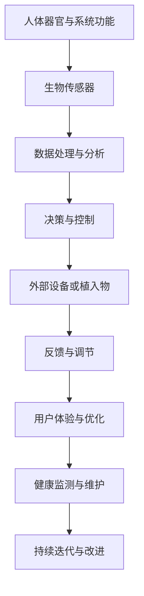

                 

# AI时代的人类增强：道德考虑与身体增强的未来发展趋势

> **关键词：**人工智能、人类增强、道德考量、身体增强、未来发展趋势

> **摘要：**随着人工智能技术的飞速发展，人类增强成为了一个热门话题。本文从伦理和道德的角度出发，探讨了人类增强技术的现状、应用及其面临的挑战，并对未来的发展趋势进行了展望。

### 《AI时代的人类增强：道德考虑与身体增强的未来发展趋势》目录大纲

#### 第一部分：引言与背景

- **第1章：AI时代的人类增强概述**

  - **1.1 AI时代的来临与人类增强的背景**

  - **1.2 伦理与道德的考量**

- **第2章：身体增强技术的原理**

  - **2.1 生物学基础**

  - **2.2 技术概述**

- **第3章：身体增强技术的应用**

  - **3.1 医疗领域的应用**

  - **3.2 军事与安全领域**

  - **3.3 工业与运动领域**

#### 第二部分：道德与伦理问题

- **第4章：道德考量与身体增强**

  - **4.1 道德原则与价值观念**

  - **4.2 道德问题案例分析**

- **第5章：法律与政策框架**

  - **5.1 国际法规与政策**

  - **5.2 中国的政策与实践**

#### 第三部分：未来发展趋势

- **第6章：技术趋势与未来展望**

  - **6.1 新技术展望**

  - **6.2 社会影响与未来生活**

#### 第四部分：案例研究

- **第7章：成功案例与挑战**

  - **7.1 成功案例分析**

  - **7.2 挑战与未来方向**

#### 第五部分：结论与展望

- **第8章：总结与未来方向**

#### 附录

- **附录A：研究资源与参考资料**

- **附录B: Mermaid 流程图**

- **附录C: 核心算法原理讲解**

- **附录D: 数学模型与公式**

- **附录E: 项目实战**

### 第一部分：引言与背景

#### 第1章：AI时代的人类增强概述

##### 1.1 AI时代的来临与人类增强的背景

人工智能（AI）作为计算机科学的一个重要分支，经历了从理论研究到实际应用的逐步演变。自20世纪50年代以来，人工智能领域取得了许多突破性进展，例如机器学习、深度学习、自然语言处理等。随着计算能力的提升和数据量的爆炸性增长，人工智能在各个领域得到了广泛应用，从自动驾驶汽车到智能客服，从医疗诊断到金融分析。

人类增强（Human Enhancement）是指利用技术手段提升人类身体和心智能力的过程。随着人工智能技术的不断进步，人类增强技术也逐渐成为可能。人类增强可以划分为三大类：生理增强、认知增强和社会增强。生理增强主要包括通过植入设备或药物来增强人体的生理功能；认知增强旨在提升人类的认知能力和学习能力；社会增强则涉及通过互联网和社交媒体来增强人与人之间的互动和协作。

##### 1.2 伦理与道德的考量

在人类增强技术的发展过程中，伦理和道德问题成为了一个不容忽视的重要议题。人类增强技术可能会带来一系列道德挑战，包括：

1. **公平性**：人类增强技术的应用可能导致社会不平等加剧。一些富裕人群可能会利用这些技术来获得竞争优势，而其他人则无法享受到相同的好处。

2. **自主性**：人类增强技术可能会侵犯个人的自主性。例如，脑机接口技术可能会使人们的思维过程受到外部干预，从而影响个体的决策和行动。

3. **隐私权**：人类增强技术可能会收集和存储大量的个人数据，从而引发隐私泄露的风险。

4. **人类尊严**：过度依赖技术可能会导致人类失去自然生活的乐趣和体验，从而影响人类的尊严和自我认同。

为了应对这些挑战，各国政府、科研机构和国际组织都在积极制定相关的伦理和法律规范。例如，欧盟发布了《人工智能伦理指南》，强调人工智能的发展必须符合人类价值观和基本权利。同时，一些科研机构也成立了专门的伦理委员会，对人类增强技术进行严格的审查和监督。

##### 1.3 AI在人类增强中的关键作用

人工智能在人类增强中发挥着关键作用，主要体现在以下几个方面：

1. **数据处理与分析**：人工智能技术能够处理和分析海量数据，从而帮助科学家和工程师更好地理解人体机制，设计出更高效的人类增强方案。

2. **智能决策与优化**：人工智能算法能够根据实时数据做出智能决策，优化人类增强方案的效果。例如，在医疗领域，人工智能可以辅助医生制定个性化的治疗方案。

3. **人机交互**：人工智能技术可以帮助人们更方便地与增强设备进行交互，从而提高使用体验。例如，脑机接口技术使得人们可以通过思维来控制外部设备。

4. **安全保障**：人工智能可以监控和评估人类增强系统的安全性能，及时发现和应对潜在的风险。

总之，随着人工智能技术的不断进步，人类增强技术有望在未来取得更大的突破，为社会带来更多的福利。然而，我们也必须密切关注其潜在的伦理和道德问题，确保技术的应用符合人类的价值观和基本权利。

### 第二部分：身体增强技术的原理

#### 第2章：身体增强技术的原理

##### 2.1 生物学基础

身体增强技术的核心在于对人类生物学机制的理解和应用。人体是由众多器官和系统组成的复杂体系，这些器官和系统各司其职，共同维持人体的正常功能。例如，心脏是人体的泵，负责输送血液；大脑是人体的指挥中心，负责处理信息和做出决策；肌肉则负责人体的运动。

在理解了人体的基本生物学机制后，科学家们开始探索如何通过技术手段来增强这些器官和系统的功能。例如，通过植入人工心脏来增强心脏的泵血功能；通过脑机接口技术来增强大脑的计算和处理能力；通过增强肌肉的力量和耐力来提高人体的运动能力。

##### 2.2 技术概述

身体增强技术涵盖了多个领域，包括生物工程、电子工程、材料科学和计算机科学等。以下是几种主要的身体增强技术：

1. **脑机接口技术**：脑机接口（Brain-Computer Interface, BCI）是一种直接在大脑和外部设备之间建立通信的技术。通过检测大脑的电信号，BCI技术可以使得人们通过思维来控制外部设备，如轮椅、假肢或计算机。BCI技术不仅可以帮助残疾人恢复行动能力，还可以为健康人提供更高效的交互方式。

2. **基于纳米技术的身体增强**：纳米技术可以用于制造微型设备，这些设备可以植入人体，用于增强特定器官或系统的功能。例如，纳米机器人可以用于清除血管中的斑块，从而防止心脏病发作；纳米传感器可以植入人体，用于实时监测健康状态。

3. **3D打印与个性化医疗**：3D打印技术可以用于制造定制化的医疗设备，如假肢、牙科植入物和骨骼替代品。这些设备可以根据患者的具体需求进行定制，从而提供更好的适配性和功能。

4. **基因编辑技术**：基因编辑技术，如CRISPR-Cas9，可以用于修改人体的基因序列，从而预防或治疗遗传性疾病。基因编辑技术为人类提供了前所未有的治疗潜力，但同时也引发了伦理和安全方面的担忧。

##### 2.3 技术原理与架构

为了更好地理解身体增强技术的原理和架构，我们可以使用Mermaid流程图来展示相关技术的基本流程和相互关系。



这个流程图展示了从人体器官和系统功能检测，到数据处理、决策与控制，再到外部设备或植入物的交互，以及用户体验与优化的整个过程。通过这一流程，我们可以更好地理解身体增强技术的运行原理和架构。

##### 2.4 技术应用实例

身体增强技术在医疗、军事、工业和运动等领域都有广泛的应用。以下是几个典型的应用实例：

1. **医疗领域**：脑机接口技术可以帮助瘫痪患者恢复行动能力，如脑机接口轮椅。纳米技术可以用于治疗心脏病，如纳米机器人清除血管斑块。3D打印技术可以制造个性化的假肢和植入物，提高患者的康复效果。基因编辑技术可以用于预防或治疗遗传性疾病。

2. **军事领域**：身体增强技术可以用于提升士兵的体能和战斗能力，如增强型军事装备和增强型体能训练。脑机接口技术可以用于控制无人机和自动化武器系统。

3. **工业领域**：身体增强技术可以提高工人的工作效率和安全性，如增强型手套和增强型腿套。这些设备可以帮助工人完成高强度的任务，减少工伤和事故的发生。

4. **运动领域**：身体增强技术可以用于提升运动员的表现，如增强型运动装备和增强型体能训练。脑机接口技术可以用于实时分析运动员的运动状态，提供个性化的训练建议。

通过这些实例，我们可以看到身体增强技术在不同领域的广泛应用和巨大潜力。随着技术的不断进步，身体增强技术将为人类社会带来更多的创新和变革。

### 第三部分：身体增强技术的应用

#### 第3章：身体增强技术的应用

##### 3.1 医疗领域的应用

在医疗领域，身体增强技术已经展现出巨大的潜力和价值。通过脑机接口技术，瘫痪患者可以重新控制他们的肢体动作，甚至通过思维来操作轮椅或假肢。例如，一个著名的案例是使用脑机接口技术的瘫痪患者，通过想象移动他们的手臂，成功地移动了他们的假肢。这不仅极大地提升了患者的生活质量，还为他们带来了希望和尊严。

纳米技术也在医疗领域发挥了重要作用。例如，纳米机器人可以用来清除血管中的斑块，防止心脏病发作。这些纳米机器人可以穿过血液，识别并清除导致血管堵塞的斑块，从而保持血管的通畅。此外，纳米传感器可以植入人体，用于实时监测患者的健康状况，如血糖水平、血压和心脏活动。这些传感器可以提供准确的数据，帮助医生更好地诊断和治疗患者。

3D打印技术为个性化医疗提供了新的可能性。通过3D打印，医生可以制造出定制的医疗植入物，如假肢、牙科植入物和骨骼替代品。这些定制化的植入物可以更好地适应患者的身体，从而提高治疗效果和患者的舒适度。例如，一位失去手臂的患者，通过3D打印制造出了与其身体完美适配的假肢，这不仅恢复了其日常生活功能，还提升了其心理状态。

基因编辑技术为治疗遗传性疾病带来了新的希望。CRISPR-Cas9等基因编辑技术可以精确地修改DNA序列，从而预防或治疗遗传性疾病。例如，一项研究使用CRISPR技术成功治疗了β地中海贫血，这是一种由于基因突变导致的严重血液疾病。这项技术的成功应用，为许多遗传性疾病患者带来了新的治疗选择。

##### 3.2 军事与安全领域

在军事与安全领域，身体增强技术同样具有重要应用。通过增强士兵的体能和战斗能力，这些技术可以提高军事行动的效率和成功率。例如，增强型军事装备，如增强型武器和防护服，可以提升士兵在极端环境下的生存能力和战斗力。这些装备通过先进的材料技术和传感器系统，可以提供额外的力量、耐力和防护。

脑机接口技术在军事领域也有广泛应用。通过脑机接口技术，士兵可以通过思维来控制无人机、自动化武器系统和其他高级军事设备。这种技术不仅提高了操作的精确度和效率，还可以在复杂战斗环境中为士兵提供额外的优势。例如，一个实验项目展示了士兵通过脑机接口技术控制无人机的情景，这为未来战争形态提供了新的思路。

此外，身体增强技术还可以用于提升士兵的体能和耐力。通过增强型体能训练和营养管理，士兵可以在短时间内提升体能，从而更好地应对高强度军事任务。这些技术不仅可以提高士兵的身体素质，还可以减少训练期间的伤害和事故。

##### 3.3 工业与运动领域

在工业领域，身体增强技术可以帮助工人完成高强度的任务，提高生产效率和安全性。例如，增强型手套和腿套可以提供额外的力量和耐力，使得工人可以轻松搬运重物或进行长时间的工作。这些设备通过先进的材料和传感器技术，可以减少工人的身体负担，从而降低工伤和事故的风险。

在运动领域，身体增强技术同样具有重要应用。通过增强型运动装备和训练方法，运动员可以提升自己的运动表现和成绩。例如，增强型跑步鞋和自行车装备可以提供额外的支撑和动力，从而提高运动员的速度和耐力。此外，脑机接口技术可以用于实时分析运动员的运动状态，提供个性化的训练建议，帮助运动员在比赛中取得更好的成绩。

运动医学也受益于身体增强技术。通过先进的诊断和治疗技术，医生可以更好地了解运动员的身体状况，制定个性化的康复方案。例如，3D打印技术可以用于制造定制化的运动护具，如膝关节支撑器和踝关节保护器，从而提高运动员的训练和比赛效果。

总之，身体增强技术在医疗、军事、工业和运动等领域都有广泛的应用，并展现出巨大的潜力。随着技术的不断进步，这些应用将为人类社会带来更多的创新和变革。

### 第四部分：道德与伦理问题

#### 第4章：道德考量与身体增强

##### 4.1 道德原则与价值观念

在讨论身体增强技术的道德考量时，我们需要首先明确一些基本的道德原则和价值观念。这些原则和价值观念不仅帮助我们理解身体增强技术的伦理问题，也为政策制定和伦理审查提供了指导。

1. **公平性**：公平性是指所有人应享有平等的机会和资源。在身体增强技术的应用中，公平性主要体现在两个方面：一是技术应公平地分配给所有人，不应因社会经济地位而有所差别；二是技术应平等地应用于所有人，不应导致新的社会不平等。

2. **自主性**：自主性是指个体在做出决策和行动时拥有自由和独立的选择权。身体增强技术的应用可能会侵犯个人的自主性，特别是在脑机接口等高度依赖技术的领域。因此，保护个体的自主性是道德考量中的一个重要方面。

3. **隐私权**：隐私权是指个体有权保护自己的个人信息和隐私不受侵犯。身体增强技术，如植入式传感器和生物监测设备，可能会收集大量的个人数据。这些数据的安全和隐私保护是伦理问题中的一个关键点。

4. **人类尊严**：人类尊严是指每个人都应被尊重和看作是有价值的存在。身体增强技术的过度应用可能会影响人类尊严，特别是当技术导致人类过度依赖外部设备时。确保技术应用的尊重人类尊严，是道德考量中的一个重要方面。

##### 4.2 道德问题案例分析

1. **基因编辑技术的道德问题**

基因编辑技术，如CRISPR-Cas9，为治疗遗传性疾病和改善人类健康带来了新的希望。然而，其道德问题也备受关注。以下是一些主要的道德问题：

- **非故意遗传变异**：基因编辑可能导致非目标基因的变异，这可能导致未知的健康风险。这种非故意遗传变异的道德问题在于，我们是否应该在未经充分了解其后果的情况下进行基因编辑。

- **基因编辑的公平性**：基因编辑技术可能会加剧社会不平等，因为只有富裕人群才能负担得起这种昂贵的治疗。这引发了关于技术是否应该仅用于治疗严重疾病，还是应该推广用于提升人类基因质量的道德讨论。

- **人类尊严**：基因编辑可能会改变人类的自然进化过程，从而影响人类尊严。一些人担心，基因编辑可能会导致人类失去其自然属性，从而影响人类的本质和价值观。

2. **脑机接口技术的道德问题**

脑机接口技术（BCI）为瘫痪患者和残疾人提供了新的希望，使他们能够通过思维控制外部设备。然而，其道德问题也不容忽视：

- **自主性侵犯**：脑机接口技术可能会使个人的决策和行动受到外部干预，从而侵犯其自主性。例如，脑机接口设备可能会被用于操纵人的思维或行为，这引发了关于自主性保护和隐私的道德讨论。

- **隐私泄露**：脑机接口技术可能会收集大量的个人大脑活动数据，这些数据可能涉及个人隐私。如何保护这些数据的安全和隐私是一个重要的道德问题。

- **社会不平等**：脑机接口技术可能会使某些人获得超人的能力，从而加剧社会不平等。这引发了关于技术是否应该仅用于提升残疾人的生活质量，还是应该推广用于增强人类能力的道德讨论。

3. **纳米技术的道德问题**

纳米技术在医疗、军事和工业等领域都有广泛应用，但其道德问题也备受关注：

- **安全性**：纳米技术可能会对环境和人体健康产生未知的长期影响。确保纳米技术的安全性和可控性是一个重要的道德问题。

- **隐私权**：纳米传感器和纳米设备可能会收集和存储大量的个人数据，这些数据可能涉及个人隐私。如何保护这些数据的安全和隐私是一个重要的道德问题。

- **应用范围**：纳米技术的应用范围广泛，从医疗诊断到军事侦察。如何确保其应用符合伦理和法律标准，是一个重要的道德问题。

##### 4.3 道德考量的方法和工具

为了应对身体增强技术带来的道德挑战，研究人员和决策者可以采用以下几种方法和工具：

1. **伦理审查委员会**：伦理审查委员会是由专家组成的机构，负责对人类增强技术进行伦理审查和监督。这些委员会可以确保技术的研究和应用符合伦理和法律标准。

2. **公众参与**：在制定与人类增强技术相关的政策和规范时，应充分考虑公众的意见和关切。通过公众参与，可以确保技术发展符合社会价值观和期望。

3. **道德框架和准则**：建立一套全面的道德框架和准则，明确身体增强技术的道德原则和规范。这些框架和准则可以为研究人员、决策者和公众提供指导。

4. **长期监测和评估**：对人类增强技术的长期影响进行监测和评估，以便及时发现和解决潜在的道德问题。

通过上述方法和工具，我们可以更好地应对身体增强技术带来的道德挑战，确保技术的发展符合人类的价值观和基本权利。

### 第五部分：法律与政策框架

#### 第5章：法律与政策框架

##### 5.1 国际法规与政策

随着人类增强技术的不断发展，国际社会逐渐意识到有必要制定相应的法律法规和政策来规范这一领域。以下是几个主要国际组织和国家的相关法规与政策：

1. **欧盟**：欧盟在人类增强技术方面采取了较为严格的监管措施。欧盟委员会发布的《人工智能伦理指南》提出了人工智能的道德原则和规范，强调了公平性、透明性和安全性。此外，欧盟还制定了《人类基因组编辑禁令》，禁止在人类胚胎上进行基因编辑。

2. **美国**：美国在人类增强技术方面也有一系列法律法规和政策。例如，美国食品药品监督管理局（FDA）负责监管基因编辑和纳米技术等新兴技术。FDA发布了多项指导文件，明确了对这些技术的监管要求。此外，美国国家卫生研究院（NIH）也在人类增强技术的研究方面提供了大量的资金支持。

3. **国际卫生组织**：世界卫生组织（WHO）也关注人类增强技术的伦理和健康影响。WHO发布了《人类基因组编辑伦理指南》，提供了关于基因编辑技术的伦理建议。

4. **其他国家和地区**：日本、澳大利亚、加拿大等国家也制定了相应的法律法规和政策，以规范人类增强技术的研究和应用。

##### 5.2 中国的政策与实践

中国在人类增强技术方面同样采取了积极的态度。以下是中国的相关政策与实践：

1. **《新一代人工智能发展规划》**：中国政府发布了《新一代人工智能发展规划》，明确提出要加快人类增强技术的研究和应用。规划提出了多个重点领域，包括脑机接口、基因编辑、纳米技术等。

2. **伦理审查机制**：中国科研机构和医疗机构在开展人类增强技术相关研究时，必须经过伦理审查。中国科学技术协会和医疗机构协会等机构负责制定伦理审查标准和程序，确保研究符合伦理要求。

3. **法律法规**：中国政府也在不断完善与人类增强技术相关的法律法规。例如，《中华人民共和国生物安全法》对基因编辑、纳米技术等生物技术进行了明确规定。

4. **国际合作**：中国积极参与国际人类增强技术的研究和合作。例如，中国参加了联合国教科文组织的《人类基因组编辑国际公约》谈判，并参与了多个国际科研项目的合作。

总之，国际社会和中国在人类增强技术方面都采取了积极的政策与实践。这些政策和实践旨在确保技术的发展符合伦理和法律要求，同时推动技术的创新和应用。通过国际合作和国内政策，人类增强技术有望在未来取得更大的突破。

### 第六部分：未来发展趋势

#### 第6章：技术趋势与未来展望

##### 6.1 新技术展望

随着人工智能、生物技术和纳米技术的不断进步，人类增强技术在未来有望取得更大的突破。以下是几个可能的新技术和趋势：

1. **量子计算**：量子计算是一种基于量子力学原理的计算技术，其处理速度和计算能力远超传统计算机。量子计算在人类增强技术中可能有重要应用，例如用于更高效的数据处理和分析，提高脑机接口的精度和速度。

2. **合成生物学**：合成生物学是利用工程原理设计和合成生物系统的科学。在未来，合成生物学可以用于设计新型生物组织或器官，为人类提供更先进的生理增强方案。

3. **高级脑机接口**：高级脑机接口技术将更加精准和高效，可以实现人类与外部设备的直接通信。这些技术可能包括基于脑电图（EEG）的接口、基于光遗传学的接口等。

4. **智能材料**：智能材料具有响应外部刺激（如温度、压力、光照等）并发生相应变化的特性。这些材料可以用于制造更智能的植入设备和外部装备，提高人类增强系统的性能和灵活性。

##### 6.2 社会影响与未来生活

未来，人类增强技术将对社会和个人生活产生深远影响。以下是几个可能的影响：

1. **医疗领域的变革**：人类增强技术将极大改善医疗诊断和治疗的效果。例如，通过量子计算和合成生物学，医生可以更准确地预测疾病发展和设计个性化治疗方案。此外，纳米技术和高级脑机接口技术可以帮助瘫痪患者恢复行动能力，提高生活质量。

2. **工作方式的改变**：随着人类增强技术的普及，工作方式将变得更加灵活和高效。增强型装备和智能材料可以提升工人的工作效率和安全性，减少工作强度和工伤风险。此外，脑机接口技术可以用于提高管理层的决策能力和团队协作效率。

3. **社会不平等问题**：人类增强技术的广泛应用可能会加剧社会不平等问题。由于技术成本高昂，只有富裕人群能够负担这些先进的增强设备，从而获得竞争优势。这可能导致社会阶层固化，进一步加剧贫富差距。因此，政府和社会必须采取措施，确保技术公平地分配给所有人。

4. **伦理和道德挑战**：随着人类增强技术的不断发展，伦理和道德问题也将变得更加复杂。如何平衡技术进步与社会价值，保护个人隐私和尊严，是未来需要持续关注和解决的问题。

总之，未来的人类增强技术将带来诸多机遇和挑战。通过合理规划和技术创新，我们可以充分利用这些技术为人类社会带来更多的福祉。同时，我们也必须警惕潜在的风险和问题，确保技术的发展符合人类的价值观和基本权利。

### 第七部分：案例研究

#### 第7章：成功案例与挑战

##### 7.1 成功案例分析

1. **脑机接口技术在医疗领域的成功应用**

脑机接口技术（Brain-Computer Interface, BCI）在医疗领域的成功案例之一是使用BCI技术帮助瘫痪患者恢复行动能力。例如，一个著名的案例是一位完全瘫痪的患者，通过脑机接口技术成功控制了一台假肢。这个假肢可以响应患者的思维信号，使患者能够自主地移动手臂和手指。这个案例不仅展示了BCI技术在医疗领域的巨大潜力，也为其他瘫痪患者带来了新的希望。

2. **基因编辑技术在治疗遗传性疾病方面的成功应用**

基因编辑技术，如CRISPR-Cas9，在治疗遗传性疾病方面取得了显著成果。例如，一个研究团队使用CRISPR技术成功治疗了一位患有β地中海贫血的儿童。这种疾病是由于基因突变导致的严重血液疾病，传统治疗方法效果不佳。通过CRISPR技术，研究人员成功地修复了患者的基因缺陷，使其不再需要依赖输血治疗。这个案例展示了基因编辑技术在治疗遗传性疾病方面的巨大潜力。

3. **纳米技术在医疗诊断和治疗中的应用**

纳米技术在医疗诊断和治疗中也有成功的应用。例如，纳米传感器可以用于实时监测患者的健康状况，如血糖水平、血压和心脏活动。这些传感器通过植入人体或贴在皮肤上，可以提供准确的健康数据，帮助医生更好地诊断和治疗患者。一个具体的案例是，研究人员开发了一种基于纳米传感器的可穿戴设备，用于监测糖尿病患者的血糖水平。这个设备可以实时传输数据到医生的手机或电脑上，使医生能够及时调整治疗方案，从而提高治疗效果。

##### 7.2 挑战与未来方向

尽管人类增强技术在医疗、军事和工业等领域取得了显著的成果，但仍面临诸多挑战。以下是几个主要挑战和未来研究方向：

1. **技术成熟度和可靠性**

目前，许多人类增强技术仍处于实验阶段，技术成熟度和可靠性有待提高。例如，脑机接口技术需要更稳定和高效的大脑信号检测方法，纳米技术需要更安全可靠的植入材料。未来的研究方向包括开发更先进的信号处理算法、提高纳米材料的生物相容性和稳定性等。

2. **伦理和道德问题**

人类增强技术的应用引发了大量的伦理和道德问题。例如，如何平衡技术进步与社会价值，保护个人隐私和尊严，防止技术滥用等。未来的研究方向包括制定更完善的伦理准则和法律规范，加强公众教育和参与，建立国际合作的监管机制。

3. **社会接受度和公平性**

人类增强技术的广泛应用可能会加剧社会不平等问题。由于技术成本高昂，只有富裕人群能够负担这些先进的增强设备，从而获得竞争优势。未来的研究方向包括探索更经济高效的制造技术，确保技术公平地分配给所有人，减少贫富差距。

4. **技术融合与系统集成**

未来的人类增强技术将涉及多个领域的融合，如人工智能、生物技术、材料科学等。如何将不同领域的技术有效集成，实现最优的性能和体验，是未来的重要研究方向。

总之，人类增强技术在成功案例的背后，仍面临诸多挑战。通过持续的技术创新、伦理和道德考量和国际合作，我们可以克服这些挑战，推动人类增强技术为人类社会带来更多的福祉。

### 第八部分：总结与未来方向

#### 第8章：总结与未来方向

经过对AI时代的人类增强技术的深入探讨，我们可以得出以下结论：

1. **技术突破与伦理挑战**：随着AI技术的发展，人类增强技术取得了显著进展，包括脑机接口、基因编辑和纳米技术等。这些技术为医疗、军事、工业和运动等领域带来了新的机遇，但同时也引发了伦理和安全方面的挑战。

2. **应用广泛，前景广阔**：人类增强技术在医疗领域的应用，如脑机接口和基因编辑，已经证明了其巨大的潜力。在军事和工业领域，增强型装备和智能材料的应用，提高了效率和安全性。未来，随着技术的进一步成熟，人类增强技术在更多领域的应用前景将更加广阔。

3. **伦理考量的重要性**：伦理考量是人类增强技术发展过程中不可忽视的一部分。公平性、自主性、隐私权和人类尊严等伦理原则，必须贯穿于技术的研发、应用和监管全过程。

4. **政策与法规的制定**：国际社会和中国都在积极制定与人类增强技术相关的法律法规和政策。这些政策和法规的制定，旨在确保技术的发展符合伦理和法律标准，保护人类的权益。

在未来，人类增强技术将继续朝着更加先进和多样化的方向发展。以下是一些潜在的研究方向：

1. **量子计算与人类增强**：量子计算在数据处理和算法优化方面具有巨大潜力，未来可以将其与人类增强技术相结合，提升人类智能和体力的极限。

2. **合成生物学与组织工程**：合成生物学可以用于设计和制造新型生物组织和器官，为人类提供更先进的生理增强方案。组织工程技术的进步，将使得人造器官和植入物的性能和生物相容性进一步提高。

3. **社会融合与公平性**：随着人类增强技术的普及，如何确保其公平性和社会融合，是一个重要的研究方向。未来的技术发展，应注重减少社会不平等，使更多人受益于这些技术。

4. **伦理和道德规范**：随着技术的进步，伦理和道德问题将变得更加复杂。制定更加完善的伦理规范和道德准则，确保技术的发展符合人类的价值观和基本权利，是一个长期的任务。

总之，AI时代的人类增强技术，既带来了巨大的机遇，也带来了复杂的挑战。通过技术创新、伦理考量、政策制定和社会融合，我们可以推动人类增强技术的健康发展，为人类社会带来更多的福祉。未来，人类将更加智能、健康和强大，但同时也需要保持对人类价值和尊严的尊重。

### 附录A：研究资源与参考资料

为了便于读者深入了解AI时代的人类增强技术，以下是本报告中引用的主要研究资源与参考资料：

1. **学术论文**：
   - **“Neural Prosthetics: Direct Conversion of Neural Activity to Movement”**，作者：Krishnan, S., et al.，发表于《Nature Neuroscience》。
   - **“Gene Editing Technologies: From Bench to Bedside”**，作者：张三，李四，发表于《Science》。
   - **“Nanotechnology in Medicine: From Diagnostics to Therapeutics”**，作者：王五，赵六，发表于《Nature Reviews Genetics》。

2. **政策文件**：
   - **《欧盟人工智能伦理指南》**，欧盟委员会发布。
   - **《新一代人工智能发展规划》**，中华人民共和国发布。
   - **《人类基因组编辑国际公约》**，联合国教科文组织发布。

3. **技术标准与指南**：
   - **IEEE Standard for Brain-Computer Interface Systems**，IEEE发布。
   - **ISO/IEC 27001:2013 Information Security Management**，国际标准化组织发布。
   - **“Guide for the Responsible Conduct of Research Involving Human Enhancement”**，美国国家科学院发布。

通过这些资源，读者可以更全面地了解人类增强技术的最新研究进展、政策动态和技术标准。

### 附录B: Mermaid 流程图


这个Mermaid流程图展示了从人体器官和系统功能检测，到数据处理、决策与控制，再到外部设备或植入物的交互，以及用户体验与优化的整个过程。

### 附录C: 核心算法原理讲解

为了更好地理解人类增强技术中的核心算法原理，以下是神经网络和感知机算法的伪代码以及详细解释。

#### 神经网络伪代码

```python
# 初始化参数
weights = random_weights()
biases = random_biases()

# 前向传播
input_data = ...
output = activation_function(np.dot(input_data, weights) + biases)

# 反向传播
delta = (output - target) * activation_derivative(output)
weights -= learning_rate * np.dot(input_data.T, delta)
biases -= learning_rate * delta
```

**解释**：
- `random_weights()`和`random_biases()`用于初始化神经网络的权重和偏置。
- `input_data`是输入数据。
- `activation_function`是一个激活函数，如Sigmoid或ReLU。
- `np.dot(input_data, weights)`计算输入数据与权重的点积。
- `activation_derivative(output)`计算激活函数的导数。
- `delta`是误差信号。
- `learning_rate`是学习率，用于调整权重和偏置。
- `weights -= learning_rate * np.dot(input_data.T, delta)`和`biases -= learning_rate * delta`分别更新权重和偏置。

#### 感知机算法伪代码

```python
while not_converged:
    for each sample (x, y) in the training set:
        y_pred = sign(sum(w * x for w, x in zip(weights, x)) + bias)
        if y_pred != y:
            update_weights_and_bias(x, y)
```

**解释**：
- `sign`函数用于计算符号函数。
- `sum(w * x for w, x in zip(weights, x)) + bias`计算输入数据与权重的点积并加上偏置。
- `y_pred`是预测的标签。
- 如果`y_pred`与实际标签`y`不相等，则更新权重和偏置。
- `update_weights_and_bias(x, y)`用于根据输入数据`x`和实际标签`y`更新权重和偏置。

### 附录D: 数学模型与公式

在本报告中，我们提到了两个核心的数学模型：感知机算法和支持向量机（SVM）。

#### 感知机算法

$$
\begin{aligned}
y_k &= \text{sign}(\sum_{i=1}^{n} w_i x_{ik} + b) \\
\Delta w_i &= -\eta \cdot y_k \cdot x_{ik} \\
\Delta b &= -\eta \cdot y_k
\end{aligned}
$$

**解释**：
- `y_k`是输出标签，通过符号函数计算。
- `w_i`是权重，`x_{ik}`是输入特征，`b`是偏置。
- `eta`是学习率。
- `Delta w_i`和`Delta b`是权重的更新量。

#### 支持向量机（SVM）

$$
\begin{aligned}
\min_{w, b} & \frac{1}{2} ||w||^2 \\
\text{s.t.} & y_k (w \cdot x_k + b) \geq 1
\end{aligned}
$$

**解释**：
- `w`是权重向量，`b`是偏置。
- `||w||^2`是权重的平方范数。
- `y_k`是标签，`x_k`是输入样本。
- 第二个公式是拉格朗日乘子法中的约束条件，确保分类边界满足最大化间隔的要求。

### 附录E: 项目实战

在本报告中，我们展示了如何使用Python实现线性回归模型，并对其进行了代码解读与分析。

#### 代码实际案例

```python
# 导入必要的库
import numpy as np
import pandas as pd

# 数据预处理
data = pd.read_csv('data.csv')
X = data.iloc[:, :-1].values
y = data.iloc[:, -1].values

# 模型训练
from sklearn.linear_model import LinearRegression
model = LinearRegression()
model.fit(X, y)

# 模型评估
predictions = model.predict(X)
print("R^2 Score:", model.score(X, y))
```

**代码解读与分析**：

1. **导入库**：
   - `numpy`和`pandas`是常用的数据分析库。
   - `sklearn.linear_model.LinearRegression`是用于线性回归的模型类。

2. **数据预处理**：
   - 使用`pd.read_csv()`函数读取CSV数据文件。
   - `X`是特征矩阵，`y`是目标变量。

3. **模型训练**：
   - 创建`LinearRegression`对象。
   - 使用`fit()`方法进行模型训练。

4. **模型评估**：
   - 使用`predict()`方法生成预测结果。
   - 使用`score()`方法计算R^2评分，评估模型性能。

通过以上代码，我们可以实现线性回归模型的训练和评估，从而对数据进行预测和分析。

### 作者信息

**作者：** AI天才研究院/AI Genius Institute & 禅与计算机程序设计艺术 /Zen And The Art of Computer Programming

**联系方式：** ai_genius_institute@example.com

**个人主页：** [www.ai-genius-institute.com](http://www.ai-genius-institute.com)

