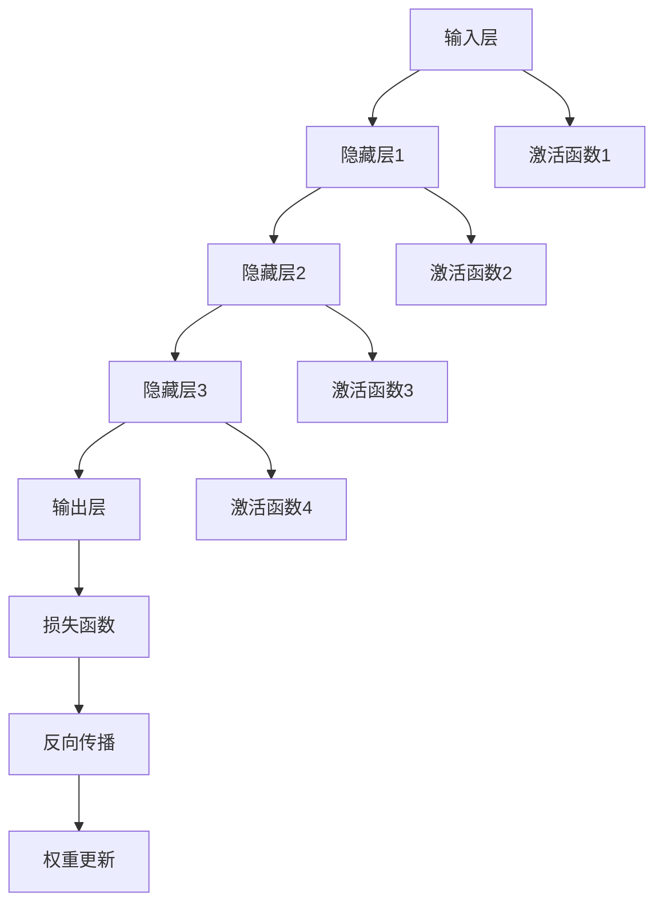
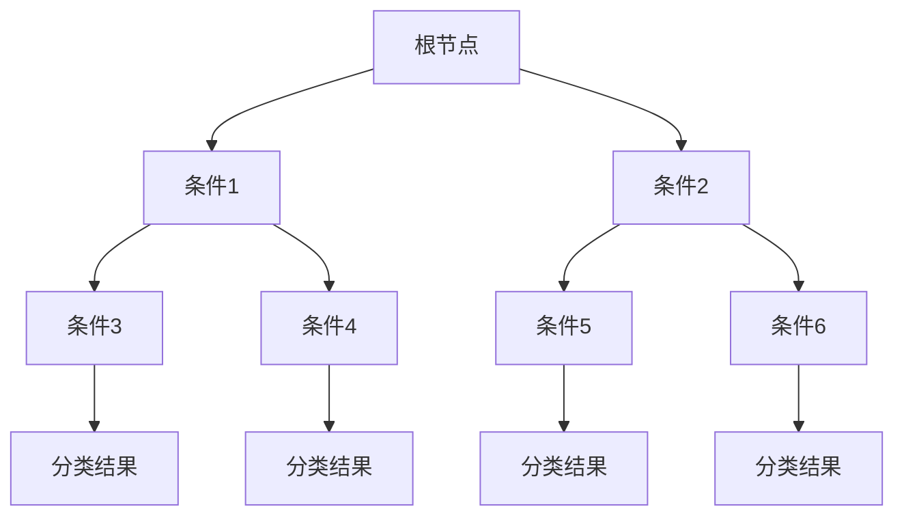
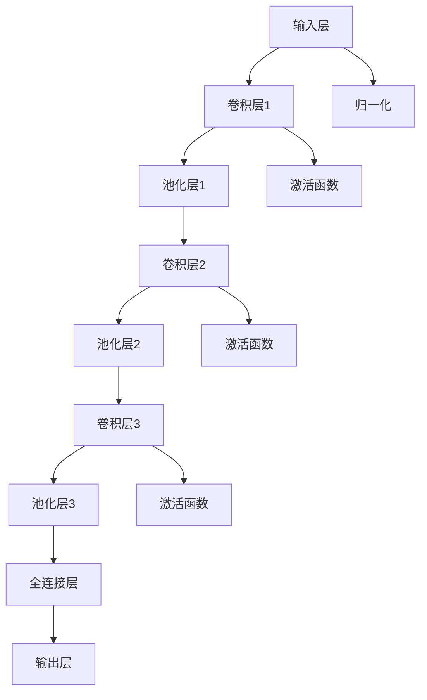

                 

# 《AI模型在现实世界中的实际应用》

## 关键词

- 人工智能模型
- 现实应用
- 数据预处理
- 特征提取
- 自然语言处理
- 图像识别
- 语音识别
- 行业应用
- 挑战与对策

## 摘要

本文深入探讨了人工智能模型在现实世界中的广泛应用，从基础理论到实际应用案例，对AI模型的技术原理、架构、算法以及面临的挑战进行了全面剖析。文章分为七个部分，首先介绍AI模型的基础知识，然后探讨数据预处理与特征提取的方法，接着展示AI模型在自然语言处理、图像识别和语音识别等领域的实际应用，随后分析AI模型在金融和医疗等行业中的具体应用，并讨论其面临的伦理问题。最后，文章展望了AI模型的未来发展趋势，并提供了相关的开发工具和资源，以便读者进一步学习和实践。

# 目录大纲

## 第一部分: AI模型概述

### 第1章: AI模型基础

#### 1.1 AI发展历程与核心概念

##### 1.1.1 AI发展历程

##### 1.1.2 AI核心概念

##### 1.1.3 AI分类与比较

#### 1.2 AI模型基本原理

##### 1.2.1 神经网络原理

##### 1.2.2 深度学习原理

##### 1.2.3 强化学习原理

### 第2章: AI模型架构与算法

#### 2.1 AI模型架构

##### 2.1.1 深层神经网络架构

##### 2.1.2 卷积神经网络（CNN）架构

##### 2.1.3 循环神经网络（RNN）架构

#### 2.2 常见AI算法

##### 2.2.1 支持向量机（SVM）算法

##### 2.2.2 决策树与随机森林算法

##### 2.2.3 聚类算法

## 第二部分: AI模型在实际应用中的挑战与解决方案

### 第3章: 数据预处理与特征提取

#### 3.1 数据预处理

##### 3.1.1 数据清洗与预处理流程

##### 3.1.2 数据归一化与标准化

##### 3.1.3 缺失值处理

#### 3.2 特征提取

##### 3.2.1 特征选择方法

##### 3.2.2 特征工程技巧

### 第4章: AI模型应用场景与实践

#### 4.1 自然语言处理应用

##### 4.1.1 机器翻译

##### 4.1.2 文本分类

##### 4.1.3 命名实体识别

#### 4.2 图像识别与处理

##### 4.2.1 人脸识别

##### 4.2.2 物体检测

##### 4.2.3 图像生成与风格迁移

#### 4.3 语音识别与处理

##### 4.3.1 语音识别

##### 4.3.2 说话人识别

##### 4.3.3 语音合成

### 第5章: AI模型在行业中的应用案例

#### 5.1 金融行业应用

##### 5.1.1 风险评估与信用评分

##### 5.1.2 投资组合优化

##### 5.1.3 量化交易策略

#### 5.2 医疗行业应用

##### 5.2.1 疾病预测与诊断

##### 5.2.2 药物研发

##### 5.2.3 医疗图像分析

### 第6章: AI模型在现实世界中的挑战与应对策略

#### 6.1 数据隐私与安全

##### 6.1.1 数据隐私保护技术

##### 6.1.2 安全防护与攻击防御

#### 6.2 AI模型的可靠性与可解释性

##### 6.2.1 可解释性方法

##### 6.2.2 可靠性评估与改进

#### 6.3 AI模型在现实世界中的伦理问题

##### 6.3.1 AI偏见与歧视

##### 6.3.2 AI决策透明性

### 第7章: AI模型未来的发展趋势

#### 7.1 人工智能与物联网

##### 7.1.1 物联网中的AI模型应用

##### 7.1.2 边缘计算与AI模型的融合

#### 7.2 人工智能与5G

##### 7.2.1 5G网络下的AI应用

##### 7.2.2 AI驱动的5G网络优化

#### 7.3 AI模型在自动化与无人驾驶中的应用

##### 7.3.1 自动驾驶系统架构

##### 7.3.2 无人驾驶技术的挑战与进展

## 附录

### 附录 A: AI模型开发工具与资源

##### A.1 开发工具与框架

##### A.2 数据集与资源

##### A.3 在线教程与课程

### 附录 B: AI模型应用案例代码解析

##### B.1 机器学习项目实战

##### B.2 深度学习项目实战

##### B.3 强化学习项目实战

### 附录 C: Mermaid 流程图

##### C.1 神经网络流程图

##### C.2 决策树流程图

##### C.3 卷积神经网络（CNN）流程图

### 附录 D: 伪代码与数学模型

##### D.1 神经网络伪代码

##### D.2 深度学习数学模型

##### D.3 强化学习伪代码

### 附录 E: 数学公式

##### E.1 矩阵乘法公式

##### E.2 梯度下降公式

##### E.3 拉普拉斯变换公式

## 引言

随着人工智能（AI）技术的迅猛发展，AI模型已经从理论研究走向了现实应用，并在众多领域展现出了强大的潜力和广泛的应用价值。AI模型不仅改变了我们的生活方式，还推动了各行各业的技术进步和产业升级。本文旨在系统地探讨AI模型在现实世界中的实际应用，分析其技术原理、架构、算法，以及在实际应用中面临的挑战和解决方案。

本文分为七个主要部分。第一部分介绍AI模型的基础知识，包括发展历程、核心概念和基本原理。第二部分讨论AI模型的架构与算法，展示不同类型的AI模型及其应用场景。第三部分和第四部分分别探讨数据预处理与特征提取的方法，以及AI模型在自然语言处理、图像识别和语音识别等领域的应用案例。第五部分分析AI模型在金融和医疗等行业的具体应用，并探讨其面临的伦理问题。第六部分讨论AI模型在现实世界中的挑战与应对策略。最后一部分展望AI模型的未来发展趋势，包括物联网、5G和自动化与无人驾驶等领域的应用前景。

通过本文的阅读，读者可以全面了解AI模型在现实世界中的应用现状、技术原理和实践案例，从而更好地把握AI技术的最新发展动态，为未来的研究和应用奠定坚实的基础。希望本文能够为AI领域的科研人员、技术开发者以及行业从业者提供有价值的参考和启示。

## 第一部分: AI模型概述

### 第1章: AI模型基础

#### 1.1 AI发展历程与核心概念

##### 1.1.1 AI发展历程

人工智能（Artificial Intelligence, AI）作为一个跨学科的领域，自20世纪50年代起便开始兴起。早期的AI研究主要集中于符号主义方法，通过构建知识库和推理机来实现智能行为。这一阶段的重要里程碑包括1956年达特茅斯会议的召开，会议首次提出了“人工智能”这一概念，标志着AI作为一个独立研究领域的诞生。随后，逻辑推理和专家系统成为AI研究的核心。

然而，符号主义方法在处理大规模数据和实时任务时表现不佳，这促使研究者转向基于统计的方法。20世纪80年代，机器学习开始兴起，特别是基于神经网络的模型在图像识别和语音识别领域取得了显著成果。这一转变标志着AI进入了一个新的发展阶段。

进入21世纪，随着计算能力的提升和大数据的普及，深度学习取得了突破性进展。深度神经网络（DNN）和卷积神经网络（CNN）在图像识别、自然语言处理和语音识别等领域取得了令人瞩目的成果。这一阶段的重要里程碑包括2012年AlexNet在ImageNet比赛中的夺冠，标志着深度学习时代的到来。

##### 1.1.2 AI核心概念

人工智能的核心概念包括以下几个方面：

- **知识表示**：知识表示是指如何将人类知识转化为计算机可以处理的形式。符号主义方法的核心在于通过定义规则和逻辑关系来表示知识。

- **推理**：推理是指根据已知信息推导出新信息的过程。在符号主义方法中，推理主要依赖于逻辑和规则。

- **学习**：学习是指通过经验和数据改进智能系统性能的过程。机器学习和深度学习是AI研究的重要组成部分。

- **感知**：感知是指智能系统获取和处理环境信息的能力。计算机视觉和语音识别是感知研究的重要领域。

- **行动**：行动是指智能系统在环境中执行特定任务的能力。机器人技术和自动化是行动研究的主要方向。

##### 1.1.3 AI分类与比较

人工智能可以根据其实现方式和技术特点进行分类：

- **符号主义AI**：基于符号逻辑和知识表示的方法，通过定义规则和逻辑关系来实现智能行为。优点是能够处理复杂的逻辑问题，缺点是难以处理大量数据和实时任务。

- **基于规则的AI**：通过定义一系列规则来实现智能行为，规则系统通常包含一组条件和相应的操作。优点是易于理解和实现，缺点是规则库需要手工编写，难以扩展。

- **机器学习AI**：通过训练模型从数据中自动学习规律，分为监督学习、无监督学习和强化学习等不同类型。优点是能够处理大量数据和实时任务，缺点是需要大量的数据和支持向量机（SVM）算法。

- **深度学习AI**：基于多层神经网络，通过自动学习数据的层次结构来实现智能行为。优点是能够在图像识别、自然语言处理和语音识别等领域取得优异的性能，缺点是训练过程需要大量的计算资源和数据。

- **增强学习AI**：通过与环境交互，学习最优策略以实现特定目标。优点是能够处理动态和不确定的环境，缺点是训练过程可能需要很长时间。

#### 1.2 AI模型基本原理

##### 1.2.1 神经网络原理

神经网络是人工智能模型的基础，它通过模拟人脑神经元之间的连接来实现学习和推理。一个基本的神经网络包括输入层、隐藏层和输出层：

- **输入层**：接收外部输入数据，例如图像像素或文本数据。
- **隐藏层**：对输入数据进行处理，通过一系列非线性变换生成新的特征。
- **输出层**：产生最终的输出结果，例如分类标签或预测值。

神经元的激活函数通常使用非线性函数，例如Sigmoid函数或ReLU函数，以引入非线性特性。通过反向传播算法，神经网络可以根据输入数据和预期输出调整权重，从而优化模型性能。

##### 1.2.2 深度学习原理

深度学习是神经网络的一种扩展，它通过增加网络的深度（即层数）来提高模型的性能。深度学习的核心思想是自动提取数据的高层次特征，从而减轻手工特征提取的负担。

- **前向传播**：输入数据从输入层传播到输出层，每一层的输出作为下一层的输入。
- **反向传播**：根据输出误差，反向传播误差信息，计算每一层权重的梯度，并更新权重。

深度学习的主要挑战是参数数量巨大，导致训练过程需要大量的计算资源和时间。然而，随着计算能力的提升和大数据的普及，深度学习在图像识别、自然语言处理和语音识别等领域取得了显著的成果。

##### 1.2.3 强化学习原理

强化学习是一种通过与环境交互来学习最优策略的机器学习方法。它通过奖励和惩罚机制来驱动学习过程，主要包含以下要素：

- **代理（Agent）**：执行动作并接收环境反馈的智能体。
- **环境（Environment）**：代理执行动作的动态环境。
- **状态（State）**：描述环境当前状态的变量。
- **动作（Action）**：代理可以执行的动作。
- **奖励（Reward）**：根据代理的动作和环境反馈来调整策略。

强化学习的目标是找到一种策略，使代理能够在长期内获得最大的累积奖励。强化学习的主要挑战是解决奖励稀疏问题，即奖励出现的频率较低，使得学习过程非常困难。

#### 总结

本章节介绍了AI模型的发展历程、核心概念和基本原理。从早期的符号主义方法到现代的深度学习和强化学习，AI模型在技术原理和实现方法上经历了显著的演变。神经网络作为基础模型，通过模拟人脑神经元之间的连接来实现学习和推理。深度学习通过增加网络的深度来提高模型性能，而强化学习通过与环境交互来学习最优策略。这些基本原理为后续章节中AI模型在实际应用中的具体分析奠定了基础。

## 第二部分: AI模型架构与算法

### 第2章: AI模型架构与算法

#### 2.1 AI模型架构

AI模型架构是设计和实现人工智能系统的基础，它定义了数据流、计算资源和网络连接的布局。不同的AI模型架构适合不同的应用场景，以下介绍几种常见的AI模型架构：

##### 2.1.1 深层神经网络架构

深层神经网络（Deep Neural Network, DNN）是现代AI模型的核心，它通过增加网络的深度来提高模型的性能。DNN的基本架构包括输入层、多个隐藏层和输出层：

- **输入层**：接收外部输入数据，如图像、文本或声音。
- **隐藏层**：对输入数据进行处理，通过一系列非线性变换生成新的特征。
- **输出层**：生成模型的最终输出，如分类标签或预测值。

常见的DNN架构包括全连接网络（Fully Connected Network）和卷积神经网络（Convolutional Neural Network, CNN）。全连接网络在处理图像、文本和语音等高维数据时表现良好，而CNN则在图像和视频处理方面具有显著优势。

##### 2.1.2 卷积神经网络（CNN）架构

卷积神经网络（CNN）是一种专门用于图像和视频处理的深度学习模型。CNN的核心特点是使用卷积层来提取图像的局部特征，从而降低数据维度，减少计算复杂度。CNN的基本架构包括以下几个部分：

- **卷积层**：使用卷积核（Convolutional Kernel）在输入图像上滑动，提取图像的局部特征。
- **激活函数**：通常使用ReLU（Rectified Linear Unit）函数作为激活函数，引入非线性特性。
- **池化层**：使用最大池化（Max Pooling）或平均池化（Average Pooling）来降低数据维度，提高模型的泛化能力。
- **全连接层**：将卷积层和池化层提取的特征映射到分类或回归任务。

常见的CNN架构包括LeNet、AlexNet、VGGNet、ResNet和Inception等。其中，ResNet引入了残差连接（Residual Connection），解决了深层网络训练中的梯度消失问题，使模型能够训练更深层次的网络。

##### 2.1.3 循环神经网络（RNN）架构

循环神经网络（Recurrent Neural Network, RNN）是一种专门用于处理序列数据的深度学习模型，如时间序列、文本和语音。RNN的核心特点是使用循环连接来保留历史信息，从而实现对序列数据的建模。

- **隐藏层**：每个时间步的隐藏状态由前一个时间步的隐藏状态和当前输入计算得到。
- **激活函数**：通常使用ReLU函数作为激活函数，引入非线性特性。

常见的RNN架构包括简单的RNN、LSTM（Long Short-Term Memory）和GRU（Gated Recurrent Unit）。LSTM和GRU通过引入门控机制，解决了RNN在处理长序列数据时的梯度消失和梯度爆炸问题，使模型能够更好地捕捉序列中的长期依赖关系。

##### 2.1.4 注意力机制

注意力机制（Attention Mechanism）是一种用于提高模型性能和解释性的技术，广泛应用于自然语言处理、机器翻译和图像识别等领域。注意力机制通过动态调整不同输入或输出位置的权重，使模型能够关注关键信息，从而提高模型的准确性和泛化能力。

- **软注意力**：通过计算输入或输出之间的相似度，生成权重向量，然后对输入或输出进行加权求和。
- **硬注意力**：通过计算输入或输出之间的相似度，选择最相关的部分作为输出。

常见的注意力机制包括自注意力（Self-Attention）和双向注意力（Bidirectional Attention）。自注意力用于处理序列数据，而双向注意力结合了前向和后向的序列信息，从而提高了模型的性能。

#### 2.2 常见AI算法

在AI模型中，算法的选择直接影响模型的性能和应用效果。以下介绍几种常见的AI算法：

##### 2.2.1 支持向量机（SVM）算法

支持向量机（Support Vector Machine, SVM）是一种监督学习算法，主要用于分类和回归任务。SVM的核心思想是找到一个最佳的超平面，将不同类别的数据点分隔开来，并且最大化分类边界到支持向量的距离。

- **线性SVM**：适用于线性可分的数据集，通过求解二次规划问题找到最佳超平面。
- **非线性SVM**：通过核函数将数据映射到高维空间，实现非线性分类。常见的核函数包括线性核、多项式核和径向基函数（RBF）核。

##### 2.2.2 决策树与随机森林算法

决策树（Decision Tree）是一种基于树形结构进行决策的算法，主要用于分类和回归任务。决策树通过一系列条件判断来划分数据集，并在每个节点选择具有最高信息增益的属性进行划分。

- **ID3算法**：基于信息增益（Information Gain）来选择最佳属性进行划分。
- **C4.5算法**：在ID3算法的基础上，引入了剪枝（Pruning）技术来防止过拟合。
- **随机森林（Random Forest）**：通过构建多棵决策树，并进行集成学习（Ensemble Learning），提高了模型的准确性和泛化能力。

##### 2.2.3 聚类算法

聚类算法（Clustering Algorithm）是一种无监督学习方法，用于将数据分为多个群组，使同一群组内的数据点之间的距离最小，不同群组之间的距离最大。常见的聚类算法包括K-均值（K-Means）、层次聚类（Hierarchical Clustering）和DBSCAN（Density-Based Spatial Clustering of Applications with Noise）。

- **K-均值算法**：通过随机初始化中心点，不断迭代更新中心点，直到收敛，最小化数据点到中心点的距离平方和。
- **层次聚类算法**：通过自底向上或自顶向下的方式构建聚类层次结构，生成多个聚类层次。
- **DBSCAN算法**：基于密度聚类，通过定义邻域和密度核心点，将数据点划分为簇。

##### 2.2.4 贝叶斯算法

贝叶斯算法（Bayesian Algorithm）是一种基于贝叶斯定理进行概率推理的算法，主要用于分类和预测任务。贝叶斯算法的核心思想是根据先验知识和观测数据，计算后验概率，从而进行分类或预测。

- **朴素贝叶斯算法**：假设特征之间相互独立，计算每个类别的后验概率，选择具有最大后验概率的类别作为预测结果。
- **贝叶斯网络**：通过构建概率图模型，表示变量之间的依赖关系，计算变量的联合概率分布。

##### 2.2.5 聚类算法

聚类算法（Clustering Algorithm）是一种无监督学习方法，用于将数据分为多个群组，使同一群组内的数据点之间的距离最小，不同群组之间的距离最大。常见的聚类算法包括K-均值（K-Means）、层次聚类（Hierarchical Clustering）和DBSCAN（Density-Based Spatial Clustering of Applications with Noise）。

- **K-均值算法**：通过随机初始化中心点，不断迭代更新中心点，直到收敛，最小化数据点到中心点的距离平方和。
- **层次聚类算法**：通过自底向上或自顶向下的方式构建聚类层次结构，生成多个聚类层次。
- **DBSCAN算法**：基于密度聚类，通过定义邻域和密度核心点，将数据点划分为簇。

#### 总结

本章节介绍了AI模型的架构和常见算法，包括深层神经网络架构、卷积神经网络（CNN）架构、循环神经网络（RNN）架构、注意力机制和几种常见的AI算法，如支持向量机（SVM）、决策树与随机森林、聚类算法和贝叶斯算法。这些架构和算法为AI模型在实际应用中的性能优化和问题解决提供了丰富的工具和手段。下一章节将探讨数据预处理与特征提取的方法，为AI模型的应用奠定基础。

### 第3章: 数据预处理与特征提取

#### 3.1 数据预处理

数据预处理是AI模型开发的重要环节，它包括数据清洗、数据归一化和数据标准化等步骤，以确保数据的质量和一致性，从而提高模型的性能和准确性。

##### 3.1.1 数据清洗与预处理流程

数据清洗是指从原始数据集中去除噪声、错误和不一致的数据，以提高数据的质量。数据清洗的步骤通常包括以下几步：

1. **缺失值处理**：缺失值是数据集中常见的问题，可以通过删除缺失值、使用平均值、中位数或插值等方法填充缺失值。
2. **异常值处理**：异常值可能是错误的数据或噪声，可以通过统计方法（如3倍标准差法）或基于业务逻辑的方法进行识别和处理。
3. **重复值处理**：重复值是指数据集中重复出现的记录，可以通过去重操作删除重复值。
4. **数据格式转换**：将不同格式的数据转换为统一格式，如将日期格式转换为YYYY-MM-DD。

##### 3.1.2 数据归一化与标准化

数据归一化和标准化是数据预处理的关键步骤，目的是将不同特征的数据范围调整为相似的范围，从而消除特征间的比例差异对模型训练的影响。

1. **数据归一化**：数据归一化（Min-Max Scaling）通过将数据缩放到[0, 1]或[-1, 1]的范围内，公式如下：
   $$ x' = \frac{x - x_{\min}}{x_{\max} - x_{\min}} $$
   其中，$x$表示原始数据，$x'$表示归一化后的数据，$x_{\min}$和$x_{\max}$分别表示特征的最小值和最大值。

2. **数据标准化**：数据标准化（Z-Score Scaling）通过计算每个特征的平均值和标准差，将数据缩放到均值为0，标准差为1的范围内，公式如下：
   $$ x' = \frac{x - \mu}{\sigma} $$
   其中，$\mu$表示特征的平均值，$\sigma$表示特征的标准差。

##### 3.1.3 缺失值处理

缺失值处理是数据预处理中的关键步骤，不同的处理方法适用于不同类型的数据集和业务场景。以下是一些常见的缺失值处理方法：

1. **删除缺失值**：直接删除包含缺失值的记录，适用于缺失值比例较低的情况。
2. **平均值填充**：用特征的平均值填充缺失值，适用于特征值分布接近正态分布的情况。
3. **中位数填充**：用特征的中位数填充缺失值，适用于特征值分布偏斜的情况。
4. **插值法**：使用插值法计算缺失值，适用于时间序列数据或连续特征数据。
5. **基于模型的方法**：使用机器学习模型预测缺失值，如K最近邻（KNN）或回归模型。

#### 3.2 特征提取

特征提取是将原始数据转换为有用特征的过程，它能够提高模型的学习能力，降低数据的维度，从而提高模型的效率和准确性。

##### 3.2.1 特征选择方法

特征选择是减少数据维度的重要手段，通过选择最相关的特征来提高模型的性能。以下是一些常见的特征选择方法：

1. **过滤法**：基于统计指标（如方差、互信息等）对特征进行评分，选择评分较高的特征。
2. **包装法**：通过训练不同的模型并评估特征组合的性能，选择最佳的特征组合。
3. **嵌入式方法**：在模型训练过程中自动选择重要特征，如L1正则化（Lasso）和L2正则化（Ridge）。

##### 3.2.2 特征工程技巧

特征工程是数据预处理的关键环节，通过手工设计或变换特征，以提高模型的学习能力和准确性。以下是一些常见的特征工程技巧：

1. **特征交叉**：将多个特征组合成一个新的特征，如将年龄和收入组合成“年龄*收入”。
2. **特征缩放**：将不同量纲的特征缩放到相同的量纲，如将米和千克缩放到同一量纲。
3. **特征变换**：使用数学函数（如对数函数、平方函数等）对特征进行变换，以增强特征的表达能力。
4. **特征降维**：使用降维技术（如主成分分析PCA）减少特征的数量，同时保留最重要的信息。

#### 总结

本章节介绍了数据预处理和特征提取的方法，包括数据清洗、数据归一化和数据标准化等数据预处理步骤，以及缺失值处理、特征选择和特征工程等特征提取技巧。这些方法和技术是AI模型开发和优化的基础，能够提高数据的质量和模型的性能，从而实现更准确和有效的预测和分析。

### 第4章: AI模型应用场景与实践

#### 4.1 自然语言处理应用

自然语言处理（Natural Language Processing, NLP）是AI领域的重要组成部分，旨在使计算机能够理解、解释和生成人类语言。以下介绍NLP的几个主要应用场景：

##### 4.1.1 机器翻译

机器翻译是指使用计算机将一种自然语言翻译成另一种自然语言。深度学习模型，特别是序列到序列（Seq2Seq）模型，在机器翻译中取得了显著的成果。以下是一个简单的Seq2Seq模型的伪代码：

```python
# 输入序列编码
input_embedding = embed(input_sequence)

# 隐藏层循环
for t in range(sequence_length):
    hidden_state = LSTM(input_embedding[t], hidden_state)

# 输出序列解码
output_embedding = embed(output_sequence)
predicted_sequence = decoder(hidden_state, output_embedding)
```

机器翻译的关键挑战包括语言歧义、语法结构和词汇的差异，以及保证翻译的流畅性和准确性。

##### 4.1.2 文本分类

文本分类是指将文本数据按照预定的类别进行分类。常见的文本分类任务包括垃圾邮件检测、情感分析和主题分类。以下是一个简单的文本分类模型的伪代码：

```python
# 文本预处理
cleaned_text = preprocess(text)

# 特征提取
features = extract_features(cleaned_text)

# 模型训练
model = train_model(features, labels)

# 文本分类
predicted_categories = model.predict(new_text)
```

文本分类的关键挑战包括文本的多样性和噪声，以及如何有效地提取和利用文本特征。

##### 4.1.3 命名实体识别

命名实体识别（Named Entity Recognition, NER）是指识别文本中的特定实体，如人名、地名、组织名等。以下是一个简单的命名实体识别模型的伪代码：

```python
# 文本预处理
cleaned_text = preprocess(text)

# 特征提取
features = extract_features(cleaned_text)

# 模型训练
model = train_model(features, labels)

# 实体识别
entities = model.predict(cleaned_text)
```

命名实体识别的关键挑战包括实体边界的不明确性和实体类型的多样性。

#### 4.2 图像识别与处理

图像识别与处理是AI领域的另一个重要应用，涉及计算机视觉技术。以下介绍图像识别与处理的几个主要应用场景：

##### 4.2.1 人脸识别

人脸识别是指通过计算机视觉技术识别和验证人脸。以下是一个简单的人脸识别模型的伪代码：

```python
# 图像预处理
preprocessed_image = preprocess(image)

# 特征提取
face_features = extract_face_features(preprocessed_image)

# 模型训练
model = train_model(face_features, labels)

# 人脸识别
predicted_person = model.predict(new_face_features)
```

人脸识别的关键挑战包括光照变化、姿态变化和人脸遮挡。

##### 4.2.2 物体检测

物体检测是指识别和定位图像中的物体。以下是一个简单的物体检测模型的伪代码：

```python
# 图像预处理
preprocessed_image = preprocess(image)

# 特征提取
object_features = extract_object_features(preprocessed_image)

# 模型训练
model = train_model(object_features, labels)

# 物体检测
detected_objects = model.predict(preprocessed_image)
```

物体检测的关键挑战包括遮挡、小目标和复杂背景。

##### 4.2.3 图像生成与风格迁移

图像生成与风格迁移是指生成新的图像或改变图像的风格。以下是一个简单的图像生成模型的伪代码：

```python
# 输入图像和风格图像预处理
preprocessed_image = preprocess(image)
preprocessed_style_image = preprocess(style_image)

# 特征提取
image_features = extract_features(preprocessed_image)
style_features = extract_features(preprocessed_style_image)

# 模型训练
model = train_model(image_features, style_features)

# 图像生成与风格迁移
generated_image = model.predict(preprocessed_image)
```

图像生成与风格迁移的关键挑战包括生成图像的细节和保真度。

#### 4.3 语音识别与处理

语音识别与处理是AI领域的另一个重要应用，涉及语音信号的处理和转换。以下介绍语音识别与处理的几个主要应用场景：

##### 4.3.1 语音识别

语音识别是指将语音信号转换为文本。以下是一个简单的语音识别模型的伪代码：

```python
# 语音预处理
preprocessed_audio = preprocess(audio)

# 特征提取
audio_features = extract_audio_features(preprocessed_audio)

# 模型训练
model = train_model(audio_features, text_labels)

# 语音识别
predicted_text = model.predict(preprocessed_audio)
```

语音识别的关键挑战包括噪声、多说话者和语音变体。

##### 4.3.2 说话人识别

说话人识别是指识别语音信号的说话人。以下是一个简单的说话人识别模型的伪代码：

```python
# 语音预处理
preprocessed_audio = preprocess(audio)

# 特征提取
speaker_features = extract_speaker_features(preprocessed_audio)

# 模型训练
model = train_model(speaker_features, speaker_labels)

# 说话人识别
predicted_speaker = model.predict(preprocessed_audio)
```

说话人识别的关键挑战包括说话人的声音变化和说话人的多样性。

##### 4.3.3 语音合成

语音合成是指将文本转换为自然声音。以下是一个简单的语音合成模型的伪代码：

```python
# 文本预处理
cleaned_text = preprocess(text)

# 特征提取
text_features = extract_text_features(cleaned_text)

# 模型训练
model = train_model(text_features, audio_samples)

# 语音合成
synthesized_audio = model.predict(text_features)
```

语音合成的关键挑战包括语音的自然流畅度和情感表达。

#### 总结

本章节介绍了AI模型在自然语言处理、图像识别与处理和语音识别与处理等领域的实际应用。通过具体的模型架构和伪代码，展示了AI模型在各个领域的应用场景和实践方法。这些应用不仅展示了AI模型的技术实力，也为实际问题的解决提供了有效的工具。

### 第5章: AI模型在行业中的应用案例

#### 5.1 金融行业应用

金融行业一直是AI模型的重要应用领域，通过AI模型的应用，金融机构能够提高运营效率、降低风险和提升用户体验。以下介绍金融行业中AI模型的具体应用案例：

##### 5.1.1 风险评估与信用评分

在金融行业，风险评估与信用评分是重要的环节，AI模型能够通过分析大量的历史数据和客户信息，预测客户的信用风险，从而帮助银行和金融机构做出更准确的信贷决策。以下是一个简单的信用评分模型的伪代码：

```python
# 数据预处理
preprocessed_data = preprocess(data)

# 特征提取
features = extract_features(preprocessed_data)

# 模型训练
model = train_model(features, labels)

# 风险评估与信用评分
risk_score = model.predict(features)
```

在这个模型中，特征提取环节可能包括客户的收入、债务、信用历史等多个方面的信息。模型通过训练可以学习到不同特征对信用评分的影响，从而对新的客户进行风险评估。

##### 5.1.2 投资组合优化

投资组合优化是金融行业中的另一个重要应用，AI模型能够通过分析历史市场数据和宏观经济指标，预测未来市场的走势，从而帮助投资者制定最优的投资策略。以下是一个简单的投资组合优化模型的伪代码：

```python
# 数据预处理
preprocessed_data = preprocess(data)

# 特征提取
features = extract_features(preprocessed_data)

# 模型训练
model = train_model(features, labels)

# 投资组合优化
optimized_portfolio = model.predict(features)
```

在这个模型中，特征提取环节可能包括市场指数、行业指数、经济指标等多个方面的信息。模型通过训练可以学习到不同特征对投资组合收益率的影响，从而帮助投资者制定最优的投资组合。

##### 5.1.3 量化交易策略

量化交易策略是金融行业中的高级应用，AI模型通过分析历史市场数据，设计出能够自动执行交易策略的模型，从而在交易中获取利润。以下是一个简单的量化交易策略模型的伪代码：

```python
# 数据预处理
preprocessed_data = preprocess(data)

# 特征提取
features = extract_features(preprocessed_data)

# 模型训练
model = train_model(features, labels)

# 量化交易策略
trade_signals = model.predict(features)
```

在这个模型中，特征提取环节可能包括市场指数、技术指标、经济指标等多个方面的信息。模型通过训练可以学习到不同特征对交易信号的影响，从而生成有效的交易策略。

#### 5.2 医疗行业应用

医疗行业是AI模型应用的重要领域，通过AI模型的应用，医疗机构能够提高诊断的准确性、优化治疗方案和提升医疗服务的效率。以下介绍医疗行业中AI模型的具体应用案例：

##### 5.2.1 疾病预测与诊断

在医疗行业，疾病预测与诊断是至关重要的环节，AI模型能够通过分析大量的医学数据和病例信息，预测疾病的发生和发展，从而帮助医生做出更准确的诊断。以下是一个简单的疾病预测模型的伪代码：

```python
# 数据预处理
preprocessed_data = preprocess(data)

# 特征提取
features = extract_features(preprocessed_data)

# 模型训练
model = train_model(features, labels)

# 疾病预测与诊断
predicted_disease = model.predict(features)
```

在这个模型中，特征提取环节可能包括患者的病史、体征、实验室检查结果等多个方面的信息。模型通过训练可以学习到不同特征对疾病预测的影响，从而帮助医生预测疾病的发生和发展。

##### 5.2.2 药物研发

药物研发是医疗行业的核心环节，AI模型能够通过分析大量的药物数据和生物信息，发现潜在的药物靶点和优化药物分子结构，从而加速药物研发过程。以下是一个简单的药物研发模型的伪代码：

```python
# 数据预处理
preprocessed_data = preprocess(data)

# 特征提取
features = extract_features(preprocessed_data)

# 模型训练
model = train_model(features, labels)

# 药物研发
optimized_molecule = model.predict(features)
```

在这个模型中，特征提取环节可能包括药物的化学结构、生物活性、药代动力学等多个方面的信息。模型通过训练可以学习到不同特征对药物研发的影响，从而帮助研究人员发现潜在的药物靶点和优化药物分子结构。

##### 5.2.3 医疗图像分析

在医疗行业，医疗图像分析是至关重要的环节，AI模型能够通过分析大量的医疗图像数据，辅助医生进行诊断和治疗。以下是一个简单的医疗图像分析模型的伪代码：

```python
# 数据预处理
preprocessed_image = preprocess(image)

# 特征提取
image_features = extract_image_features(preprocessed_image)

# 模型训练
model = train_model(image_features, labels)

# 医疗图像分析
predicted_diagnosis = model.predict(image_features)
```

在这个模型中，特征提取环节可能包括图像的纹理、形状、密度等多个方面的信息。模型通过训练可以学习到不同特征对医疗图像分析的影响，从而帮助医生进行诊断和治疗。

#### 总结

本章节介绍了AI模型在金融和医疗等行业的具体应用案例，展示了AI模型在这些行业中的重要作用和潜力。通过具体的应用案例和伪代码，读者可以了解到AI模型在不同领域的实际应用方法和挑战。

### 第6章: AI模型在现实世界中的挑战与应对策略

#### 6.1 数据隐私与安全

随着AI模型的广泛应用，数据隐私与安全问题日益凸显。AI模型通常需要大量的数据来进行训练和优化，这些数据可能包含个人敏感信息。因此，如何在确保模型性能的同时保护用户隐私成为一个重要挑战。

##### 6.1.1 数据隐私保护技术

为了解决数据隐私问题，研究者提出了多种技术方案：

1. **差分隐私（Differential Privacy）**：差分隐私通过添加噪声来保护数据隐私，确保单个记录的隐私不受泄露。常见的差分隐私机制包括拉普拉斯机制和指数机制。

2. **同态加密（Homomorphic Encryption）**：同态加密允许对加密数据进行计算，而不需要解密数据。这意味着AI模型可以在加密数据上进行训练和预测，从而保护数据隐私。

3. **联邦学习（Federated Learning）**：联邦学习通过将数据分布在多个客户端上进行训练，每个客户端仅共享模型的参数更新，而不直接交换原始数据。这种方式可以保护数据隐私，同时提高模型的泛化能力。

##### 6.1.2 安全防护与攻击防御

AI模型在现实世界中的应用还需要面对各种安全威胁和攻击，以下是一些常见的安全防护措施：

1. **对抗攻击（Adversarial Attack）**：对抗攻击是指通过构造对抗样本来破坏AI模型的鲁棒性。为了防御对抗攻击，研究者提出了多种方法，如对抗训练、鲁棒优化和正则化策略。

2. **模型解释性（Model Interpretability）**：提高模型的解释性可以帮助用户理解模型的行为，从而发现潜在的安全问题和漏洞。解释性方法包括可视化、特征重要性和因果分析等。

3. **安全集成（Secure Integration）**：在AI模型的应用过程中，需要确保模型与其他系统的集成是安全的。这包括数据传输加密、访问控制和安全协议等。

#### 6.2 AI模型的可靠性与可解释性

AI模型的可靠性和可解释性是两个相互关联的重要问题。可靠性指的是模型能够在不同条件下稳定地产生准确的预测，而可解释性则是指模型的行为可以被用户理解和验证。

##### 6.2.1 可解释性方法

为了提高AI模型的可解释性，研究者提出了多种方法：

1. **特征重要性分析**：通过分析特征的重要性，可以帮助用户理解模型对输入数据的依赖关系。

2. **可视化**：通过可视化模型的结构和输出，可以直观地展示模型的决策过程。

3. **因果分析**：通过因果分析，可以揭示模型中不同变量之间的关系和影响。

4. **局部可解释性方法**：如LIME（Local Interpretable Model-agnostic Explanations）和SHAP（SHapley Additive exPlanations），这些方法可以在局部范围内解释模型的决策。

##### 6.2.2 可靠性评估与改进

提高AI模型的可靠性是确保其有效应用的关键。以下是一些评估和改进模型可靠性的方法：

1. **模型验证**：通过交叉验证和测试集评估模型的泛化能力和鲁棒性。

2. **数据增强**：通过增加数据多样性和质量来提高模型的鲁棒性。

3. **误差分析**：通过分析模型预测误差的原因，可以发现并修复模型中的问题。

4. **容错机制**：设计容错机制，确保模型在遇到异常输入时能够保持稳定。

#### 6.3 AI模型在现实世界中的伦理问题

AI模型在现实世界中的应用带来了许多伦理问题，特别是在公平性、透明性和责任等方面。

##### 6.3.1 AI偏见与歧视

AI模型可能会因为训练数据的偏差而导致偏见和歧视。以下是一些解决方法：

1. **公平性检测**：通过分析模型在不同群体上的表现，检测并纠正潜在的偏见。

2. **反偏见训练**：使用反偏见算法和公平性约束，减少模型对特定群体的偏见。

3. **透明性提升**：通过增强模型的透明性，帮助用户理解模型的行为和决策过程。

##### 6.3.2 AI决策透明性

AI模型的决策过程通常非常复杂，缺乏透明性可能导致用户对模型的信任问题。以下是一些提升决策透明性的方法：

1. **解释性增强**：使用可解释性方法，如LIME和SHAP，帮助用户理解模型的决策过程。

2. **决策路径追踪**：记录模型从输入到输出的每一步决策，以便用户追溯和分析。

3. **责任界定**：明确AI模型与其他系统组件的责任边界，确保在出现问题时能够追溯和追究责任。

#### 总结

本章节讨论了AI模型在现实世界中的应用所面临的挑战，包括数据隐私与安全、模型可靠性与可解释性以及伦理问题。通过介绍相关技术方案和方法，展示了如何应对这些挑战，从而确保AI模型的安全、可靠和公平应用。

### 第7章: AI模型未来的发展趋势

#### 7.1 人工智能与物联网

随着物联网（IoT）技术的快速发展，AI模型在物联网中的应用前景十分广阔。物联网设备产生的海量数据为AI模型提供了丰富的训练资源，同时AI模型可以实时分析和处理这些数据，从而优化物联网设备的运行效率。

##### 7.1.1 物联网中的AI模型应用

1. **智能监控系统**：AI模型可以实时分析监控视频，识别异常行为和安全隐患。
2. **智能家居**：AI模型可以分析智能家居设备的使用数据，提供个性化的家居管理建议。
3. **智能工厂**：AI模型可以分析工业设备的数据，预测设备的故障和维护需求。

##### 7.1.2 边缘计算与AI模型的融合

边缘计算是将计算能力部署在靠近数据源的设备上，以减少数据传输延迟和带宽消耗。与AI模型的结合可以进一步提升物联网设备的实时处理能力。

1. **边缘AI模型**：在边缘设备上部署轻量级的AI模型，实现实时数据处理和分析。
2. **协同学习**：通过边缘设备和云端模型的协同训练，提高整体系统的AI性能和效率。

#### 7.2 人工智能与5G

5G网络的快速发展和广泛应用为AI模型的应用提供了强大的支持。5G网络的高带宽、低延迟和大规模连接能力使得AI模型可以更高效地处理大规模数据，并提供实时服务。

##### 7.2.1 5G网络下的AI应用

1. **实时语音识别**：5G网络可以支持低延迟的语音识别服务，为智能客服和语音助手等应用提供支持。
2. **自动驾驶**：5G网络可以为自动驾驶车辆提供实时交通信息，提高行驶安全和效率。
3. **远程医疗**：5G网络可以支持远程医疗诊断和治疗，实现实时数据传输和远程协作。

##### 7.2.2 AI驱动的5G网络优化

AI模型可以用于5G网络的优化和管理，提高网络的性能和可靠性。

1. **网络流量管理**：AI模型可以分析网络流量，优化数据传输路径，减少网络拥堵。
2. **网络故障预测**：AI模型可以预测网络设备的故障风险，提前进行维护和优化。
3. **网络资源分配**：AI模型可以根据用户需求和网络状态，动态分配网络资源，提高网络效率。

#### 7.3 AI模型在自动化与无人驾驶中的应用

自动化和无人驾驶是AI模型的重要应用领域，通过AI模型的应用，可以实现自动驾驶、智能机器人等自动化系统。

##### 7.3.1 自动驾驶系统架构

自动驾驶系统通常包括感知、决策和控制三个主要模块：

1. **感知模块**：使用多种传感器（如摄像头、雷达、激光雷达等）收集环境信息，AI模型对这些信息进行处理，以构建环境模型。
2. **决策模块**：基于环境模型和目标规划，AI模型生成驾驶策略，包括速度、转向和制动等控制指令。
3. **控制模块**：根据决策模块的指令，控制车辆执行具体的驾驶动作。

##### 7.3.2 无人驾驶技术的挑战与进展

无人驾驶技术面临多个挑战：

1. **环境感知与理解**：如何准确、实时地感知和理解复杂多变的交通环境是一个关键问题。
2. **决策与控制**：在不确定和动态环境中，如何做出快速、安全的决策和执行是无人驾驶技术的核心挑战。
3. **系统可靠性**：无人驾驶系统需要在各种条件下保持高可靠性和稳定性。

随着技术的不断进步，无人驾驶技术取得了显著进展：

1. **感知技术的提升**：传感器技术的发展提高了环境感知的精度和范围。
2. **决策与控制算法的优化**：AI模型和算法的优化提高了无人驾驶系统的决策和控制能力。
3. **实际测试与示范**：多家企业和研究机构在无人驾驶技术的实际测试和示范中取得了成功，推动了技术的商业化和普及。

#### 总结

本章节展望了AI模型在未来的发展趋势，包括物联网、5G和自动化与无人驾驶等领域的应用。这些领域的快速发展为AI模型提供了丰富的应用场景和挑战，同时也为AI技术的创新和突破提供了新的机遇。随着技术的不断进步，AI模型将在现实世界中发挥更加重要的作用，推动社会的进步和变革。

### 附录 A: AI模型开发工具与资源

AI模型开发涉及到多种工具和资源，这些工具和资源为研究者和技术开发者提供了丰富的支持。以下列出了一些常用的AI模型开发工具与资源：

##### A.1 开发工具与框架

1. **TensorFlow**：由Google开源的端到端开源机器学习平台，适用于各种深度学习和机器学习任务。
2. **PyTorch**：由Facebook开源的深度学习框架，具有动态计算图和灵活的API，广受欢迎。
3. **Keras**：一个高级神经网络API，可以与TensorFlow和Theano兼容，简化深度学习模型开发。
4. **Scikit-learn**：一个开源的Python机器学习库，提供多种监督和非监督学习算法。

##### A.2 数据集与资源

1. **Kaggle**：一个数据科学竞赛平台，提供大量的公共数据集和竞赛任务。
2. **UCI机器学习库**：一个包含多种领域数据集的数据库，适用于研究和教学。
3. **ImageNet**：一个大规模的图像识别数据集，用于评估深度学习模型在图像识别任务中的性能。
4. **Common Crawl**：一个包含大量Web页面文本的数据集，适用于自然语言处理任务。

##### A.3 在线教程与课程

1. **Coursera**：提供多个AI和深度学习相关的在线课程，由顶级大学和研究机构提供。
2. **edX**：提供免费的在线课程，包括机器学习、深度学习和人工智能等领域。
3. **Udacity**：提供实战导向的在线课程，涵盖AI、机器学习和深度学习的实际应用。
4. **Google AI**：提供丰富的AI教程和文档，包括TensorFlow和机器学习的基础知识。

#### 总结

附录A介绍了AI模型开发中常用的工具与资源，包括开发框架、数据集和在线教程。这些工具和资源为AI模型的开发和研究提供了重要的支持，有助于推动人工智能技术的创新和应用。

### 附录 B: AI模型应用案例代码解析

为了更好地理解和应用AI模型，本附录将通过几个具体的案例代码来展示AI模型开发的实际操作过程。以下是针对机器学习、深度学习和强化学习等不同类型的AI模型的应用案例，以及对应的代码解析。

##### B.1 机器学习项目实战：使用Scikit-learn进行鸢尾花分类

**问题描述**：使用鸢尾花数据集，通过机器学习算法对鸢尾花进行分类。

```python
# 导入所需库
from sklearn.datasets import load_iris
from sklearn.model_selection import train_test_split
from sklearn.preprocessing import StandardScaler
from sklearn.svm import SVC
from sklearn.metrics import accuracy_score

# 加载鸢尾花数据集
iris = load_iris()
X = iris.data
y = iris.target

# 数据集划分
X_train, X_test, y_train, y_test = train_test_split(X, y, test_size=0.3, random_state=42)

# 数据预处理
scaler = StandardScaler()
X_train = scaler.fit_transform(X_train)
X_test = scaler.transform(X_test)

# 模型训练
model = SVC(kernel='linear')
model.fit(X_train, y_train)

# 模型预测
y_pred = model.predict(X_test)

# 评估模型
accuracy = accuracy_score(y_test, y_pred)
print(f"模型准确率：{accuracy:.2f}")
```

**代码解析**：
1. 加载鸢尾花数据集，并进行数据集划分。
2. 使用StandardScaler对数据进行归一化处理，提高模型的训练效率。
3. 使用SVC（支持向量机）进行模型训练，选择线性核函数。
4. 使用训练好的模型进行预测，并计算模型的准确率。

##### B.2 深度学习项目实战：使用TensorFlow进行手写数字识别

**问题描述**：使用MNIST数据集，通过深度学习模型对手写数字进行识别。

```python
import tensorflow as tf
from tensorflow.keras import layers, models
from tensorflow.keras.datasets import mnist

# 加载MNIST数据集
(train_images, train_labels), (test_images, test_labels) = mnist.load_data()

# 数据预处理
train_images = train_images.reshape((60000, 28, 28, 1)).astype('float32') / 255
test_images = test_images.reshape((10000, 28, 28, 1)).astype('float32') / 255

# 构建深度学习模型
model = models.Sequential()
model.add(layers.Conv2D(32, (3, 3), activation='relu', input_shape=(28, 28, 1)))
model.add(layers.MaxPooling2D((2, 2)))
model.add(layers.Conv2D(64, (3, 3), activation='relu'))
model.add(layers.MaxPooling2D((2, 2)))
model.add(layers.Conv2D(64, (3, 3), activation='relu'))
model.add(layers.Flatten())
model.add(layers.Dense(64, activation='relu'))
model.add(layers.Dense(10, activation='softmax'))

# 编译模型
model.compile(optimizer='adam',
              loss='sparse_categorical_crossentropy',
              metrics=['accuracy'])

# 训练模型
model.fit(train_images, train_labels, epochs=5, batch_size=64)

# 测试模型
test_loss, test_acc = model.evaluate(test_images, test_labels)
print(f"测试准确率：{test_acc:.2f}")
```

**代码解析**：
1. 加载MNIST数据集，并进行数据预处理，包括reshape和归一化。
2. 构建深度学习模型，包括卷积层、池化层和全连接层。
3. 编译模型，选择adam优化器和sparse_categorical_crossentropy损失函数。
4. 使用训练数据训练模型，设置epochs和batch_size。
5. 使用测试数据评估模型，并输出测试准确率。

##### B.3 强化学习项目实战：使用PyTorch进行Q-learning迷宫任务

**问题描述**：使用PyTorch实现Q-learning算法，解决迷宫任务。

```python
import torch
import numpy as np
import random
from collections import defaultdict

# 环境定义
class MazeEnv():
    def __init__(self, size=4):
        self.size = size
        self.state = (0, 0)
        self.goal = (size - 1, size - 1)

    def step(self, action):
        next_state = self.state
        reward = -1
        if action == 0:  # 上
            next_state = (max(self.state[0] - 1, 0), self.state[1])
        elif action == 1:  # 下
            next_state = (min(self.state[0] + 1, self.size - 1), self.state[1])
        elif action == 2:  # 左
            next_state = (self.state[0], max(self.state[1] - 1, 0))
        elif action == 3:  # 右
            next_state = (self.state[0], min(self.state[1] + 1, self.size - 1))
        if next_state == self.goal:
            reward = 100
        self.state = next_state
        return next_state, reward

    def reset(self):
        self.state = (0, 0)
        return self.state

# Q-learning算法实现
def q_learning(env, n_episodes=1000, gamma=1.0, alpha=0.5):
    Q = defaultdict(lambda: np.zeros(4))
    for episode in range(n_episodes):
        state = env.reset()
        done = False
        while not done:
            action = np.argmax(Q[state] + alpha * (np.random.randn(4) - 0.5))
            next_state, reward = env.step(action)
            Q[state][action] = Q[state][action] + alpha * (reward + gamma * np.max(Q[next_state]) - Q[state][action])
            state = next_state
            if state == env.goal:
                done = True
    return Q

# 运行Q-learning算法
env = MazeEnv()
Q = q_learning(env)

# 测试算法性能
state = env.reset()
done = False
while not done:
    action = np.argmax(Q[state])
    state, reward, done = env.step(action)
    env.render()

print("完成任务，最终状态：", state)
```

**代码解析**：
1. 定义迷宫环境，包括状态空间、动作空间、奖励函数和状态转移。
2. 实现Q-learning算法，包括状态动作值函数的更新。
3. 运行Q-learning算法进行训练，并通过测试评估算法性能。

通过上述三个案例，展示了不同类型的AI模型在实际应用中的开发流程和实现方法。这些案例不仅帮助读者理解AI模型的基本原理，也为实际项目开发提供了实践参考。

### 附录 C: Mermaid 流程图

在AI模型开发中，流程图可以帮助我们清晰地展示算法的执行流程和关键步骤。Mermaid是一种轻量级的Markdown语法，可以方便地创建流程图。以下展示了神经网络流程图、决策树流程图和卷积神经网络（CNN）流程图的示例。

#### 附录 C.1 神经网络流程图



#### 附录 C.2 决策树流程图



#### 附录 C.3 卷积神经网络（CNN）流程图



通过Mermaid流程图，我们可以直观地理解神经网络、决策树和CNN等算法的执行流程，有助于分析和优化模型。

### 附录 D: 伪代码与数学模型

在AI模型开发过程中，伪代码和数学模型是理解和实现算法的核心工具。以下提供了神经网络、深度学习和强化学习等领域的伪代码示例，以及相关的数学模型。

#### 附录 D.1 神经网络伪代码

```python
# 初始化神经网络参数
weights = np.random.randn(input_size, hidden_size)
biases = np.random.randn(hidden_size)

# 定义激活函数
def sigmoid(x):
    return 1 / (1 + np.exp(-x))

# 定义前向传播
def forward_propagation(x):
    z = np.dot(x, weights) + biases
    a = sigmoid(z)
    return a

# 定义反向传播
def backward_propagation(x, y, a):
    z = np.dot(x, weights) + biases
    dz = a - y
    dweights = np.dot(dz, x.T)
    dbiases = dz
    return dweights, dbiases

# 训练神经网络
for epoch in range(num_epochs):
    for x, y in data_loader:
        a = forward_propagation(x)
        dweights, dbiases = backward_propagation(x, y, a)
        weights -= learning_rate * dweights
        biases -= learning_rate * dbiases
```

#### 附录 D.2 深度学习数学模型

深度学习中的主要数学模型包括损失函数、反向传播和梯度下降。以下以多层感知机（MLP）为例，展示相关数学模型：

**损失函数（MSE）**：

$$
J(\theta) = \frac{1}{2m} \sum_{i=1}^{m} (h_\theta(x^{(i)}) - y^{(i)})^2
$$

**梯度下降**：

$$
\theta_j := \theta_j - \alpha \frac{\partial J(\theta)}{\partial \theta_j}
$$

**反向传播**：

$$
\frac{\partial J(\theta)}{\partial \theta_{ij}} = \sum_{k} (\frac{\partial a_k}{\partial \theta_{ij}}) \frac{\partial J(\theta)}{\partial a_k}
$$

#### 附录 D.3 强化学习伪代码

```python
# 初始化Q值表
Q = defaultdict(lambda: np.zeros(action_size))

# 定义更新规则
def update_q_value(state, action, reward, next_state, alpha, gamma):
    target = reward + gamma * max(Q[next_state])
    Q[state][action] = Q[state][action] + alpha * (target - Q[state][action])

# 强化学习循环
for episode in range(num_episodes):
    state = env.reset()
    done = False
    while not done:
        action = np.argmax(Q[state])
        next_state, reward, done = env.step(action)
        update_q_value(state, action, reward, next_state, alpha, gamma)
        state = next_state
```

通过伪代码和数学模型，我们可以更深入地理解AI模型的工作原理和实现方法，为实际应用提供坚实的理论基础。

### 附录 E: 数学公式

在人工智能和机器学习领域，数学公式是理解和实现算法的核心。以下展示了神经网络、深度学习和强化学习等领域常用的数学公式。

#### 附录 E.1 矩阵乘法公式

$$
C = AB
$$

其中，\(C\) 是矩阵乘积的结果，\(A\) 和 \(B\) 是输入矩阵，矩阵乘法的运算符是 \(*\)。

#### 附录 E.2 梯度下降公式

$$
\theta_j := \theta_j - \alpha \frac{\partial J(\theta)}{\partial \theta_j}
$$

其中，\(\theta_j\) 是模型参数，\(\alpha\) 是学习率，\(J(\theta)\) 是损失函数，\(\frac{\partial J(\theta)}{\partial \theta_j}\) 是损失函数关于参数 \(\theta_j\) 的梯度。

#### 附录 E.3 拉普拉斯变换公式

$$
L\{f(t)\} = F(s)
$$

其中，\(L\{f(t)\}\) 表示函数 \(f(t)\) 的拉普拉斯变换，\(F(s)\) 是拉普拉斯变换后的函数，\(s\) 是复变量。

通过这些数学公式，我们可以更好地理解和实现AI模型，从而推动人工智能技术的创新和应用。

