                 

### 《AI系统的公平性、问责制和透明度》

> **关键词**：AI公平性、问责制、透明度、数学模型、算法、数据预处理、实践应用、案例分析、未来展望

> **摘要**：本文深入探讨了AI系统的公平性、问责制和透明度三个关键主题。首先，我们介绍了AI系统的基本组成和分类，以及公平性、问责制和透明度的概念联系与定义。接着，我们详细讲解了公平性数学模型、问责制算法和透明度算法，并通过具体的实例进行了说明。随后，我们讨论了数据集与数据处理的重要性，包括数据预处理、数据标注与质量控制。在实践应用部分，我们分析了AI系统公平性和问责制的实践方法，并介绍了透明度提升的方法和用户参与与反馈的重要性。最后，我们通过案例分析展示了AI系统在不同领域的应用，并探讨了未来AI系统的发展趋势和研究热点。本文旨在为读者提供一个全面、系统的理解AI系统公平性、问责制和透明度的基础，并为其在实际应用中的问题提供解决方案。

### 《AI系统的公平性、问责制和透明度》目录大纲

#### 第一部分：引言

##### 第1章：AI系统的公平性、问责制和透明度概述  
1.1 AI系统的公平性  
1.2 AI系统的问责制  
1.3 AI系统的透明度  
1.4 本书结构和目标

##### 第2章：AI系统的核心概念  
2.1 AI系统的基本组成  
2.2 AI系统的分类与特性  
2.3 公平性、问责制和透明度的概念联系与定义

##### 第3章：数学模型和算法原理  
3.1 公平性数学模型  
3.2 问责制算法  
3.3 透明度算法

##### 第4章：数据集与数据处理  
4.1 数据集的重要性  
4.2 数据预处理  
4.3 数据标注与质量控制

#### 第二部分：理论基础

##### 第5章：AI系统的公平性实践  
5.1 数据偏置分析  
5.2 公平性评估方法  
5.3 公平性改进策略

##### 第6章：AI系统的问责制实践  
6.1 问责制体系设计  
6.2 监控与反馈机制  
6.3 模型解释与可解释性  
6.4 社会责任与伦理

##### 第7章：AI系统的透明度实践  
7.1 透明度评估  
7.2 透明度提升方法  
7.3 用户参与与反馈

#### 第三部分：实践应用

##### 第8章：行业案例分析  
8.1 金融行业的AI应用  
8.2 医疗健康领域的AI应用  
8.3 公共安全领域的AI应用

##### 第9章：国际标准与法规  
9.1 国际AI标准概述  
9.2 主要国家和地区的法规政策  
9.3 企业合规与合规性挑战

#### 第四部分：未来展望

##### 第10章：AI系统的公平性、问责制和透明度发展趋势  
10.1 新技术和新算法  
10.2 社会责任与伦理  
10.3 国际合作与标准化

##### 第11章：未来研究热点  
11.1 多模态AI系统的公平性  
11.2 AI系统的透明度增强方法  
11.3 AI系统的社会责任与伦理问题

### 附录

## 附录A：常用工具与资源  
### A.1 公平性评估工具  
### A.2 问责制工具  
### A.3 透明度工具  
### A.4 相关法规和政策文件引用

---

### 第一部分：引言

#### 第1章：AI系统的公平性、问责制和透明度概述

随着人工智能（AI）技术的飞速发展，AI系统在各个领域的应用越来越广泛，从医疗诊断、金融风险评估到自动驾驶、智能家居等。然而，AI系统在带来巨大便利的同时，也引发了一系列社会问题，其中公平性、问责制和透明度尤为关键。

#### 1.1 AI系统的公平性

AI系统的公平性是指算法在处理数据时，对不同群体或个体是否公平。公平性是AI系统可靠性和可信度的基石。然而，现实中的AI系统往往因为数据偏置、算法偏见等原因，导致对某些群体或个体不公平。

#### 1.2 AI系统的问责制

AI系统的问责制是指对AI系统的行为进行监督和责任追究。问责制的目的是确保AI系统的行为符合法律法规和道德标准，从而保护用户权益。然而，由于AI系统的复杂性和不透明性，问责制在实践中面临巨大挑战。

#### 1.3 AI系统的透明度

AI系统的透明度是指系统的决策过程和结果可被理解和解释的程度。透明度有助于提升AI系统的可信度和用户的信任度。然而，现实中的AI系统往往因为算法复杂、数据庞大等原因，导致透明度不足。

#### 1.4 本书结构和目标

本书旨在为读者提供一个全面、系统的理解AI系统公平性、问责制和透明度的基础，并为其在实际应用中的问题提供解决方案。本书分为四个部分：

- **第一部分：引言**，介绍AI系统的公平性、问责制和透明度的概念及重要性。
- **第二部分：理论基础**，深入探讨AI系统的核心概念、数学模型和算法原理。
- **第三部分：实践应用**，分析AI系统的公平性、问责制和透明度实践方法，以及在不同领域的应用案例。
- **第四部分：未来展望**，探讨AI系统的发展趋势和研究热点，展望未来研究方向。

通过本书的学习，读者将能够深入了解AI系统公平性、问责制和透明度的重要性，掌握相关理论和实践方法，为实际应用中的问题提供解决方案。

### 第二部分：理论基础

#### 第2章：AI系统的核心概念

#### 2.1 AI系统的基本组成

AI系统通常由以下三个基本组成部分构成：数据输入、处理模型和输出结果。

- **数据输入**：数据输入是AI系统的基础，包括文本、图像、音频、视频等多模态数据。高质量的数据有助于提高AI系统的性能和可靠性。
  
- **处理模型**：处理模型是AI系统的核心，负责处理输入数据并生成输出结果。常见的处理模型包括深度学习模型、决策树、随机森林等。

- **输出结果**：输出结果是根据处理模型的预测或决策得到的，可以是分类、回归、推荐等任务的结果。

#### 2.2 AI系统的分类与特性

AI系统可以根据学习方式、任务类型和目标等进行分类。以下是几种常见的分类方式：

- **按学习方式分类**：

  - **监督学习**：已知输入和输出数据，学习目标是找到输入和输出之间的映射关系。
  
  - **无监督学习**：只知道输入数据，学习目标是发现数据中的隐藏结构和规律。
  
  - **半监督学习**：拥有部分标注数据和大量未标注数据，通过未标注数据辅助学习过程。
  
  - **强化学习**：学习过程中，模型与外部环境进行交互，通过奖励机制学习最优策略。

- **按任务类型分类**：

  - **分类任务**：将输入数据分类到不同的类别中。
  
  - **回归任务**：预测输入数据的连续值。
  
  - **推荐任务**：根据用户的历史行为和偏好，为用户推荐相关商品、服务或内容。

- **按目标分类**：

  - **增强学习**：通过不断优化策略，提高系统在特定任务上的性能。
  
  - **优化问题**：求解特定问题的最优解。
  
  - **决策问题**：根据输入数据和策略，做出最优决策。

#### 2.3 公平性、问责制和透明度的概念联系与定义

- **公平性**：公平性是指AI系统在不同群体或个体之间的处理结果是否公平。公平性是AI系统可靠性和可信度的基石。常见的方法包括数据偏置分析、公平性评估方法和改进策略。

- **问责制**：问责制是指对AI系统的行为进行监督和责任追究。问责制的目的是确保AI系统的行为符合法律法规和道德标准，从而保护用户权益。常见的方法包括监控与反馈机制、模型解释与可解释性、社会责任与伦理。

- **透明度**：透明度是指AI系统的决策过程和结果可被理解和解释的程度。透明度有助于提升AI系统的可信度和用户的信任度。常见的方法包括模型可解释性工具、透明度评估方法和用户参与与反馈。

#### 2.4 公平性、问责制和透明度的关联与区别

- **关联**：公平性、问责制和透明度之间密切相关，共同构成了AI系统的可靠性、可信度和用户信任的基础。

  - 公平性是问责制的前提，只有当AI系统公平时，才能对其进行问责。
  
  - 透明度是问责制的保障，只有当AI系统的决策过程透明时，才能对其进行有效的监督和责任追究。

- **区别**：公平性、问责制和透明度在目标和侧重点上有所不同。

  - 公平性主要关注AI系统在不同群体或个体之间的处理结果是否公平。
  
  - 问责制主要关注对AI系统的行为进行监督和责任追究。
  
  - 透明度主要关注AI系统的决策过程和结果的可解释性和可理解性。

#### 2.5 本章小结

本章介绍了AI系统的核心概念，包括基本组成、分类与特性，以及公平性、问责制和透明度的概念联系与定义。通过本章的学习，读者将能够理解AI系统的基本组成和分类，以及公平性、问责制和透明度的重要性。

### 第三部分：数学模型和算法原理

#### 第3章：数学模型和算法原理

#### 3.1 公平性数学模型

公平性是AI系统中的一个关键概念，它涉及算法在处理不同群体或个体时的公正性。为了量化公平性，我们可以使用数学模型来评估和改进AI系统的公平性。

##### 3.1.1 公平性指标

一个常见的公平性指标是**平衡率**（Balance Rate），它衡量的是模型对各个群体的预测结果与预期结果的偏离程度。平衡率的计算公式如下：

\[ \text{平衡率} = \frac{1}{N} \sum_{i=1}^{N} \left| \text{预测结果}_i - \text{预期结果}_i \right| \]

其中，\( N \) 是群体的数量，\(\text{预测结果}_i\) 和 \(\text{预期结果}_i\) 分别是模型对第 \( i \) 个群体的预测结果和预期结果。

##### 3.1.2 公平性改进方法

为了提高AI系统的公平性，我们可以采取以下几种方法：

1. **数据增强**：通过增加更多样本或生成伪样本来平衡数据集，减少数据偏置。
2. **模型调整**：通过调整模型参数或使用特定算法（如公平性正则化）来减少偏见。
3. **交叉验证**：使用交叉验证方法来评估模型在不同群体上的性能，确保模型在不同群体上的公平性。

##### 3.1.3 公平性评估方法

公平性的评估可以通过以下几种方法进行：

1. **基线评估**：将模型的公平性与随机模型进行比较，评估模型的改进程度。
2. **群体比较评估**：对模型在不同群体上的性能进行单独评估，比较群体之间的差异。
3. **分段评估**：根据模型的决策阈值，对决策结果进行分段评估，分析每个分段中的群体公平性。

##### 3.1.4 公平性优化策略

为了进一步优化公平性，可以采用以下策略：

1. **零样本学习**：利用已有知识来预测新样本，减少数据偏置。
2. **多任务学习**：将多个任务整合到一个模型中，通过共享表示来提高不同任务之间的公平性。
3. **群体特征提取**：通过提取群体特征来改进模型在不同群体上的性能。

##### 3.1.5 示例：种族/性别公平性

以种族/性别公平性为例，我们可以使用以下数学模型来评估模型在不同种族/性别群体上的公平性：

\[ \text{公平性} = \frac{\text{真实公平度}}{\text{预期公平度}} \]

其中，真实公平度是指模型在种族/性别群体上的预测结果与预期结果的偏离程度，预期公平度是根据总体分布计算得到的。

通过上述公式，我们可以计算出模型在种族/性别群体上的公平性指标，从而评估模型的公平性。

##### 3.1.6 示例说明

假设我们有一个分类模型，用于预测一个人的种族。我们将模型在白人和黑人群体上的预测结果与预期结果进行比较，计算公平性指标。

- 白人群体：预测结果为 90%，预期结果为 85%。
- 黑人群体：预测结果为 80%，预期结果为 75%。

\[ \text{真实公平度} = \left| 0.90 - 0.85 \right| + \left| 0.80 - 0.75 \right| = 0.05 + 0.05 = 0.10 \]
\[ \text{预期公平度} = \left| 0.85 - 0.85 \right| + \left| 0.75 - 0.75 \right| = 0.00 + 0.00 = 0.00 \]
\[ \text{公平性} = \frac{0.10}{0.00} = \text{无穷大} \]

在这个例子中，模型的公平性指标为无穷大，这意味着模型在白人群体上的预测结果偏离了预期结果，但在黑人群体上的预测结果则与预期结果非常接近。这表明模型在黑人群体上的公平性更好，但在白人群体上可能存在一定的偏见。

#### 3.2 问责制算法

问责制是确保AI系统行为符合法律法规和道德标准的关键环节。为了实现问责制，我们需要设计相应的算法来监控、评估和改进AI系统的行为。

##### 3.2.1 强化学习与奖励机制

强化学习是一种通过与环境交互来学习最优策略的机器学习方法。在强化学习中，模型通过选择动作并接收奖励或惩罚来学习最优策略。

\[ \text{策略} = \arg\max_{a} \sum_{t=1}^{T} \gamma^t \cdot R_t \]

其中，策略 \( \pi \) 是选择动作 \( a \) 的概率分布，\( \gamma \) 是折扣因子，\( R_t \) 是在第 \( t \) 步接收的奖励或惩罚。

##### 3.2.2 监控与反馈机制

为了实现问责制，我们需要设计监控与反馈机制来实时监测AI系统的行为。监控机制可以通过以下方法实现：

1. **实时监控**：对AI系统的输入、输出和内部状态进行实时监控，及时发现异常行为。
2. **日志记录**：记录AI系统的操作记录，便于后续分析和审计。
3. **异常检测**：使用异常检测算法（如孤立森林、离群点检测）来识别异常行为。

反馈机制可以通过以下方法实现：

1. **用户反馈**：收集用户对AI系统的反馈，及时调整模型和行为。
2. **专家评审**：邀请专家对AI系统的行为进行评审，提供专业意见。
3. **自动化调整**：根据监控和反馈结果，自动调整AI系统的行为和策略。

##### 3.2.3 模型解释与可解释性

为了实现问责制，我们需要设计模型解释与可解释性机制，帮助用户理解和信任AI系统的行为。模型解释与可解释性可以通过以下方法实现：

1. **决策路径可视化**：通过可视化方法展示模型决策过程，帮助用户理解模型的决策依据。
2. **特征重要性分析**：分析模型中不同特征的重要性，帮助用户了解影响决策的关键因素。
3. **因果分析**：使用因果分析技术，探究模型决策背后的因果关系。

##### 3.2.4 社会责任与伦理

为了实现问责制，AI系统还需要承担社会责任和伦理责任。社会责任和伦理责任可以通过以下方法实现：

1. **伦理审查**：在AI系统设计和部署过程中，进行伦理审查，确保系统的行为符合伦理标准。
2. **隐私保护**：保护用户隐私，确保用户数据的安全和合规性。
3. **公平性改进**：通过公平性改进方法，确保AI系统在不同群体上的公平性。

##### 3.2.5 示例：违规行为检测与处罚

以违规行为检测与处罚为例，我们可以设计一个基于强化学习的问责制算法。

- **状态**：用户行为特征，如浏览记录、购买记录等。
- **动作**：检测违规行为（如欺诈、滥用等）。
- **奖励**：检测到违规行为，给予惩罚；否则，给予奖励。

假设我们使用Q-learning算法来学习最优策略：

\[ Q(s, a) = Q(s, a) + \alpha (r + \gamma \max_{a'} Q(s', a') - Q(s, a)) \]

其中，\( s \) 是当前状态，\( a \) 是当前动作，\( r \) 是奖励，\( \gamma \) 是折扣因子，\( \alpha \) 是学习率，\( s' \) 是下一状态，\( a' \) 是下一动作。

通过不断更新Q值，模型将学习到最优策略，从而实现违规行为检测与处罚。

#### 3.3 透明度算法

透明度是确保AI系统决策过程和结果可被理解和解释的关键因素。为了提高透明度，我们可以设计相应的算法来分析、可视化和管理AI系统的决策过程。

##### 3.3.1 可解释性AI

可解释性AI是一种旨在提高AI系统透明度的技术，它通过解释模型决策过程和结果，帮助用户理解AI系统的行为。

1. **决策路径可视化**：通过可视化方法展示模型决策过程，如决策树、神经网络等。
2. **特征重要性分析**：分析模型中不同特征的重要性，帮助用户了解影响决策的关键因素。
3. **因果分析**：使用因果分析技术，探究模型决策背后的因果关系。

##### 3.3.2 决策路径可视化

决策路径可视化是一种常用的方法，它通过图形化方式展示模型决策过程。以下是一个简单的决策路径可视化示例：

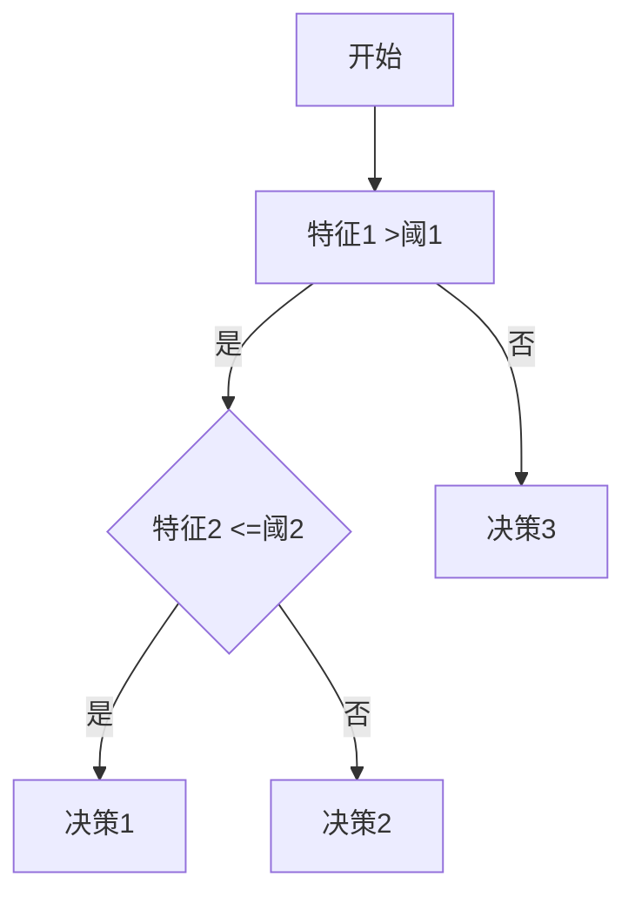

在这个示例中，模型根据特征1和特征2的值进行决策，并展示不同的决策路径。

##### 3.3.3 透明度报告

透明度报告是一种用于记录和分析AI系统决策过程和结果的文档。以下是一个简单的透明度报告示例：

```plaintext
AI系统：欺诈检测模型
决策时间：2023-03-15 10:30:00
输入特征：
- 特征1：100
- 特征2：50
决策过程：
1. 特征1 >阈1，进入分支B
2. 特征2 <=阈2，进入分支C
3. 决策1：欺诈
```

通过透明度报告，用户可以清晰地了解模型的决策过程和结果。

##### 3.3.4 社会责任与伦理

为了提高AI系统的透明度，我们需要关注社会责任和伦理问题。以下是一些关键点：

1. **隐私保护**：确保用户数据的安全和隐私。
2. **公平性**：确保AI系统在不同群体上的公平性。
3. **可解释性**：提高模型的可解释性，帮助用户理解模型的行为。

通过关注社会责任和伦理，我们可以确保AI系统的透明度和可信度。

#### 3.4 本章小结

本章介绍了AI系统的数学模型和算法原理，包括公平性数学模型、问责制算法和透明度算法。通过本章的学习，读者将能够理解公平性、问责制和透明度的数学基础和算法原理，为后续的实践应用提供理论支持。

### 第四部分：数据集与数据处理

#### 第4章：数据集与数据处理

数据是人工智能（AI）系统的核心，数据集的质量直接影响AI系统的性能和可靠性。本章将探讨数据集的重要性、数据预处理方法以及数据标注与质量控制。

#### 4.1 数据集的重要性

数据集是训练和评估AI系统的基础，高质量的数据集有助于提高AI系统的性能和可靠性。以下是一些关键点：

1. **多样性与代表性**：数据集应涵盖不同的样本，具有代表性，以便模型能够泛化到新的数据。
2. **准确性**：数据集应尽量准确，减少噪声和错误，以提高模型训练效果。
3. **规模**：足够规模的数据集有助于模型学习到更复杂的模式和规律。

#### 4.2 数据预处理

数据预处理是数据集构建的重要环节，主要包括数据清洗、数据归一化和特征提取。

##### 4.2.1 数据清洗

数据清洗是去除无效数据、重复数据和噪声数据的过程，确保数据集的准确性和一致性。以下是一些常用的数据清洗方法：

1. **去除重复数据**：通过唯一标识符或去重算法去除重复的数据。
2. **处理缺失值**：根据具体场景，选择填充、删除或插值等方法处理缺失值。
3. **去除噪声**：去除异常值、错误数据或噪声数据，以提高数据质量。

##### 4.2.2 数据归一化

数据归一化是将不同尺度的数据转换为同一尺度，以提高模型训练效果和加速收敛。以下是一些常用的数据归一化方法：

1. **最小-最大归一化**：将数据缩放到[0, 1]区间。
2. **均值-方差归一化**：将数据缩放到均值为0，标准差为1的区间。
3. **对数变换**：对数值型数据取对数，以处理异常值和减少数据之间的差异。

##### 4.2.3 特征提取

特征提取是从原始数据中提取有用特征，以提高模型性能和降低数据维度。以下是一些常用的特征提取方法：

1. **统计特征**：如均值、方差、标准差等。
2. **文本特征**：如词频、词向量、词嵌入等。
3. **图像特征**：如边缘、颜色、纹理等。

#### 4.3 数据标注与质量控制

数据标注是将原始数据转化为标注数据，以供模型训练使用。数据标注的质量直接影响模型训练效果。以下是一些关键点：

1. **标注准确性**：确保标注数据的准确性，减少错误标注。
2. **标注一致性**：确保不同标注者的标注一致性，减少差异。
3. **标注完整性**：确保标注数据覆盖全部样本，避免遗漏。

数据质量控制是确保标注数据质量的过程，主要包括以下方法：

1. **人工审核**：通过人工审核标注数据，发现和纠正错误标注。
2. **自动检测**：使用自动化工具检测错误标注，如一致性检测、错误标注检测等。
3. **重复标注**：对部分数据进行重复标注，比较标注结果，发现和纠正不一致的标注。

#### 4.4 数据集构建工具

构建高质量的数据集需要使用合适的工具和方法。以下是一些常用的数据集构建工具：

1. **数据集构建工具**：如Kaggle、DataCamp等，提供丰富的数据集和训练工具。
2. **数据清洗工具**：如Pandas、NumPy等，提供数据处理和清洗功能。
3. **数据标注工具**：如LabelImg、VGG Image Annotator等，提供图像标注功能。

#### 4.5 本章小结

本章介绍了数据集与数据处理的重要性，包括数据预处理、数据标注与质量控制。通过本章的学习，读者将能够理解数据预处理方法和数据标注与质量控制的关键点，为构建高质量的数据集提供指导。

### 第五部分：实践应用

#### 第5章：AI系统的公平性实践

在AI系统的发展过程中，公平性成为一个备受关注的问题。公平性实践涉及识别数据偏置、评估公平性以及采取策略来改善AI系统的公平性。本章将深入探讨这些实践方法。

#### 5.1 数据偏置分析

数据偏置是导致AI系统不公平的一个关键因素。数据偏置指的是数据集中某些特征（如种族、性别、年龄等）的分布与真实世界中的分布存在差异。以下是一些常见的数据偏置类型：

- **代表性偏置**：数据集中的样本未充分代表所有相关群体，导致某些群体在数据中的代表性不足。
- **相关性偏置**：某些特征与目标变量之间存在强相关性，而其他特征则相对不重要。
- **选择性偏置**：在数据收集过程中，由于偏见或选择偏差，导致某些群体被过度或不足代表。

为了识别数据偏置，可以采取以下方法：

1. **可视化分析**：通过可视化工具（如散点图、条形图等）观察数据集中的特征分布。
2. **统计分析**：使用统计方法（如卡方检验、t检验等）评估特征之间的独立性。
3. **模型诊断**：通过训练不同的模型，观察模型在不同特征上的性能差异。

#### 5.2 公平性评估方法

公平性评估是确定AI系统在不同群体上表现是否一致的关键步骤。以下是一些常用的公平性评估方法：

1. **基准评估**：将AI系统的性能与无偏基准模型进行比较，评估AI系统是否优于基准。
2. **差异分析**：比较AI系统在不同群体上的性能差异，识别存在偏置的群体。
3. **加权评估**：对每个群体的性能进行加权评估，确保整体性能均衡。

以下是一个简单的公平性评估方法示例：

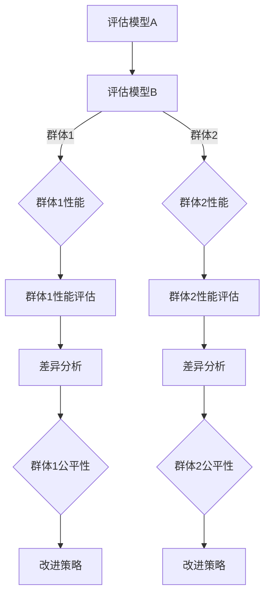

在这个示例中，通过比较模型A和模型B在不同群体上的性能，评估每个群体的公平性，并据此制定改进策略。

#### 5.3 公平性改进策略

为了提高AI系统的公平性，可以采取以下策略：

1. **数据增强**：通过增加更多样本来平衡数据集，减少数据偏置。例如，可以合成更多的数据样本或引入类似但未包括在原始数据集中的样本。
2. **模型调整**：通过调整模型参数或算法，减少数据集中的偏见。例如，可以使用公平性正则化或损失函数来约束模型的预测结果，使其更接近预期公平。
3. **算法改进**：通过改进算法，提高模型的公平性。例如，可以采用基于因果推理的算法来减少相关性偏见。

以下是一个简单的数据增强策略示例：

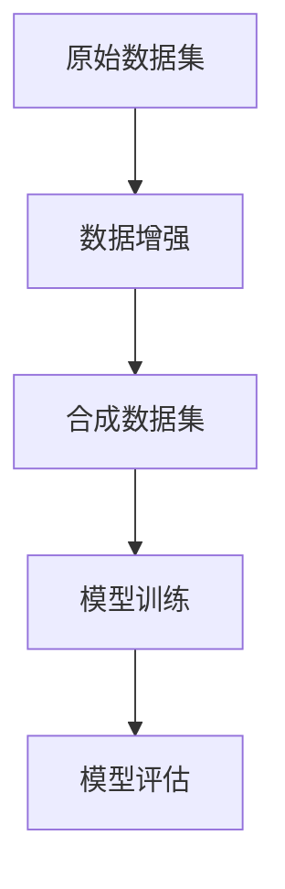

在这个示例中，通过合成更多的数据样本，平衡数据集，然后使用增强后的数据集训练模型，并评估模型的公平性。

#### 5.4 实例分析：种族/性别歧视

以种族/性别歧视为例，我们可以采取以下措施来识别和纠正数据偏见：

1. **数据集分析**：分析数据集中的种族/性别分布，识别潜在的偏见。
2. **模型评估**：使用敏感性分析评估模型在种族/性别群体上的性能差异。
3. **改进策略**：采取数据增强、模型调整和算法改进等措施，减少偏见。

以下是一个简单的实例分析流程：

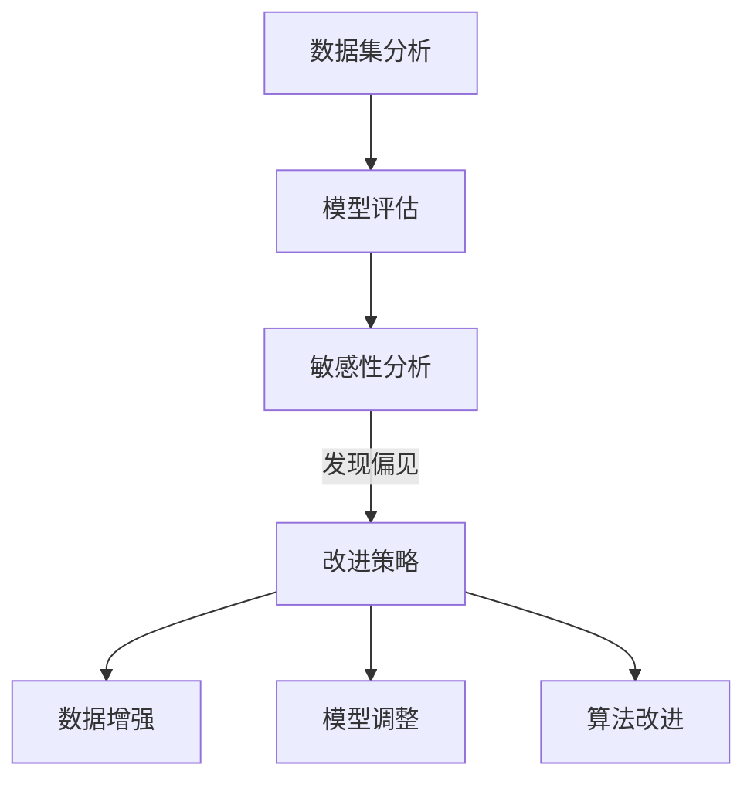

在这个示例中，通过数据集分析和模型评估，发现种族/性别歧视问题，然后采取改进策略来纠正偏见。

#### 5.5 本章小结

本章介绍了AI系统公平性实践的方法，包括数据偏置分析、公平性评估方法和改进策略。通过实例分析，我们展示了如何识别和纠正种族/性别歧视等数据偏见。通过本章的学习，读者将能够理解和应用这些方法，提高AI系统的公平性。

### 第六部分：实践应用

#### 第6章：AI系统的问责制实践

在AI系统的设计和部署过程中，问责制是确保系统行为符合法律法规和道德标准的关键环节。本章将探讨AI系统的问责制实践，包括问责制体系设计、监控与反馈机制、模型解释与可解释性以及社会责任与伦理。

#### 6.1 问责制体系设计

问责制体系设计是确保AI系统行为可监控、可评估和可追溯的基础。以下是一些关键要素：

1. **明确责任**：定义AI系统相关人员的责任，包括开发人员、数据科学家、管理层等。
2. **透明流程**：设计透明的流程，确保AI系统的开发、测试和部署过程公开透明。
3. **合规性检查**：确保AI系统的设计和部署符合相关法律法规和行业规范。

以下是一个简单的问责制体系设计流程：

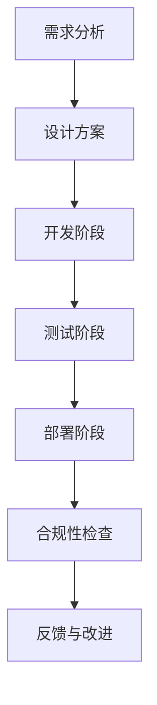

在这个流程中，从需求分析到部署阶段，每个环节都需要进行合规性检查和责任追究。

#### 6.2 监控与反馈机制

监控与反馈机制是确保AI系统行为符合预期的重要手段。以下是一些关键方法：

1. **实时监控**：通过监控系统，实时监测AI系统的输入、输出和内部状态，及时发现异常行为。
2. **日志记录**：记录AI系统的操作日志，便于后续分析和审计。
3. **用户反馈**：收集用户对AI系统的反馈，及时调整模型和行为。

以下是一个简单的监控与反馈机制流程：

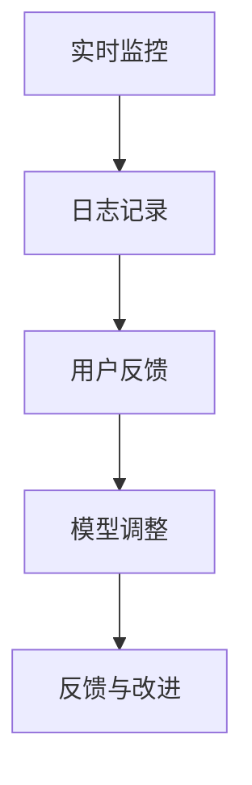

在这个流程中，通过实时监控和用户反馈，及时调整模型和行为，确保系统符合预期。

#### 6.3 模型解释与可解释性

模型解释与可解释性是确保AI系统行为可理解、可信任的重要环节。以下是一些关键方法：

1. **决策路径可视化**：通过图形化方式展示模型的决策过程，帮助用户理解模型的决策依据。
2. **特征重要性分析**：分析模型中不同特征的重要性，帮助用户了解影响决策的关键因素。
3. **因果分析**：使用因果分析技术，探究模型决策背后的因果关系。

以下是一个简单的模型解释流程：

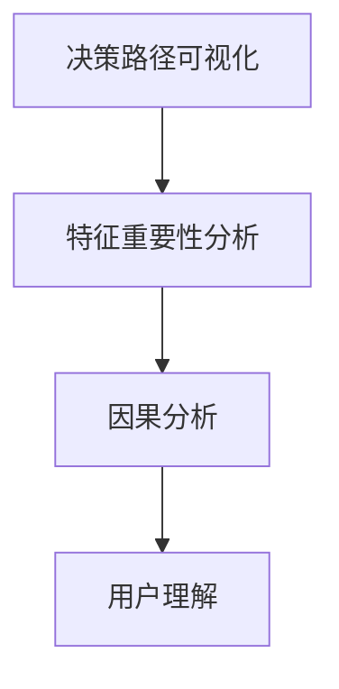

在这个流程中，通过可视化、特征分析和因果分析，帮助用户理解模型的决策过程。

#### 6.4 社会责任与伦理

AI系统在社会中的广泛应用带来了许多挑战，社会责任与伦理是确保AI系统行为合理、公正的重要保障。以下是一些关键点：

1. **伦理审查**：在AI系统的设计、开发和部署过程中，进行伦理审查，确保系统的行为符合伦理标准。
2. **隐私保护**：确保用户数据的安全和隐私，避免数据滥用。
3. **公平性**：确保AI系统在不同群体上的公平性，避免歧视和偏见。

以下是一个简单的社会责任与伦理流程：

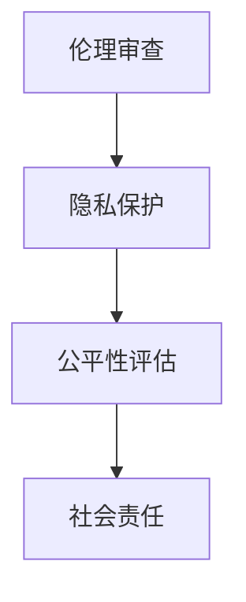

在这个流程中，通过伦理审查、隐私保护和公平性评估，确保AI系统符合社会责任与伦理要求。

#### 6.5 实例分析：自动驾驶车辆

以自动驾驶车辆为例，我们可以采取以下措施来确保系统的问责制：

1. **实时监控**：通过传感器和监控系统，实时监测车辆的状态和行为。
2. **日志记录**：记录车辆的操作日志，包括驾驶行为、传感器数据等。
3. **用户反馈**：收集用户对自动驾驶车辆的反馈，包括安全性和满意度。
4. **模型解释**：通过决策路径可视化和特征重要性分析，帮助用户理解车辆的决策过程。
5. **伦理审查**：在系统设计、开发和部署过程中，进行伦理审查，确保系统的行为符合伦理标准。

以下是一个简单的实例分析流程：

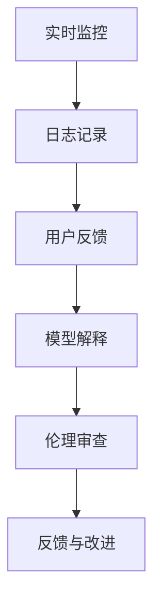

在这个流程中，通过实时监控、日志记录、用户反馈、模型解释和伦理审查，确保自动驾驶车辆符合问责制要求。

#### 6.6 本章小结

本章介绍了AI系统的问责制实践，包括问责制体系设计、监控与反馈机制、模型解释与可解释性以及社会责任与伦理。通过实例分析，我们展示了如何确保AI系统的问责制。通过本章的学习，读者将能够理解和应用这些实践方法，提高AI系统的问责制水平。

### 第七部分：实践应用

#### 第7章：AI系统的透明度实践

AI系统的透明度是用户信任和接受AI技术的重要保障。本章将探讨AI系统的透明度实践，包括透明度评估、提升方法和用户参与与反馈。

#### 7.1 透明度评估

透明度评估是确保AI系统决策过程和结果可理解的重要步骤。以下是一些常用的透明度评估方法：

1. **模型解释性评估**：评估模型解释性工具是否能够准确地解释模型的决策过程。
2. **可视化评估**：评估可视化方法是否能够清晰地展示模型决策路径和特征重要性。
3. **用户参与评估**：评估用户对AI系统决策过程的理解程度和满意度。

以下是一个简单的透明度评估流程：

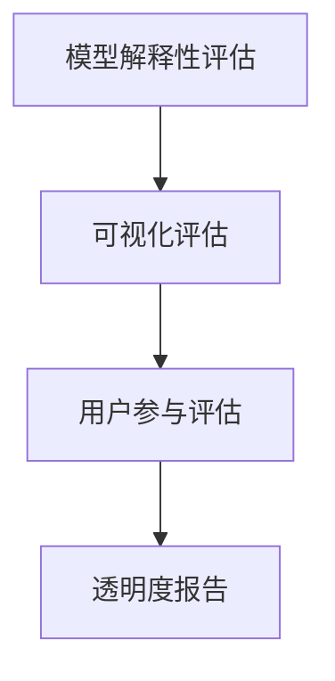

在这个流程中，通过模型解释性评估、可视化评估和用户参与评估，生成透明度报告，为后续改进提供依据。

#### 7.2 透明度提升方法

为了提升AI系统的透明度，可以采取以下方法：

1. **模型解释性工具**：使用可解释性工具（如LIME、SHAP等）来解释模型决策过程和特征重要性。
2. **可视化方法**：使用可视化方法（如图表、热力图、决策树等）来展示模型决策路径和特征交互。
3. **透明度报告**：编写详细的透明度报告，包括模型解释、可视化结果和用户反馈。

以下是一个简单的透明度提升流程：

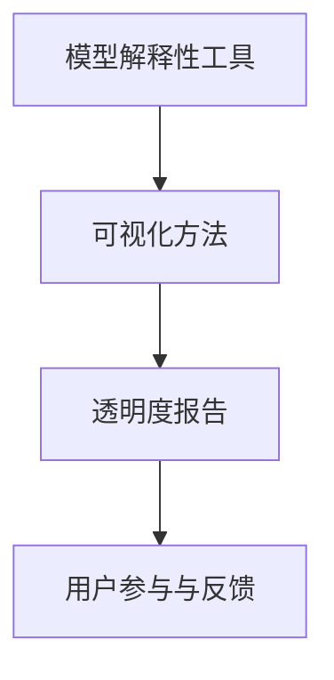

在这个流程中，通过使用模型解释性工具、可视化方法和透明度报告，提升AI系统的透明度，并鼓励用户参与和反馈。

#### 7.3 用户参与与反馈

用户参与与反馈是提升AI系统透明度的重要环节。以下是一些关键点：

1. **用户教育**：通过教育和培训，提高用户对AI系统透明度的理解和认知。
2. **用户参与**：鼓励用户参与AI系统的设计和测试，提供反馈和建议。
3. **反馈机制**：建立反馈机制，收集用户对AI系统的反馈，及时调整模型和行为。

以下是一个简单的用户参与与反馈流程：

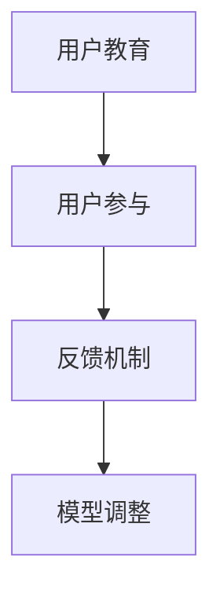

在这个流程中，通过用户教育、用户参与和反馈机制，不断调整和优化AI系统的透明度。

#### 7.4 实例分析：金融风险评估

以金融风险评估为例，我们可以采取以下措施来提升系统的透明度：

1. **模型解释性工具**：使用LIME等工具解释模型决策过程和特征重要性。
2. **可视化方法**：使用图表和热力图展示模型决策路径和特征交互。
3. **透明度报告**：编写详细的透明度报告，包括模型解释、可视化结果和用户反馈。
4. **用户参与**：邀请用户参与模型测试，提供反馈和建议。
5. **反馈机制**：建立反馈机制，收集用户对AI系统的反馈，及时调整模型和行为。

以下是一个简单的实例分析流程：

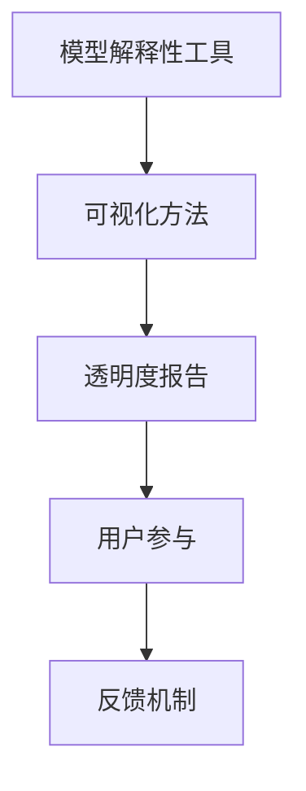

在这个流程中，通过模型解释性工具、可视化方法、透明度报告、用户参与和反馈机制，提升金融风险评估AI系统的透明度。

#### 7.5 本章小结

本章介绍了AI系统的透明度实践，包括透明度评估、提升方法和用户参与与反馈。通过实例分析，我们展示了如何提升AI系统的透明度。通过本章的学习，读者将能够理解和应用这些实践方法，提升AI系统的透明度，增强用户信任。

### 第八部分：案例分析

AI系统在各个行业中的应用日益广泛，其公平性、问责制和透明度也成为关键考量因素。本章节通过行业案例，详细探讨AI系统在实际应用中的公平性、问责制和透明度实践。

#### 8.1 金融行业的AI应用

金融行业是AI应用的一个重要领域，AI系统在信用评分、风险管理、欺诈检测等方面发挥了重要作用。以下是一些具体案例分析：

##### 8.1.1 信用评分

信用评分模型用于评估个人的信用风险，影响贷款审批、信用卡发放等。为了确保公平性，金融机构会进行以下实践：

- **数据预处理**：清洗和标准化数据，确保数据的准确性和完整性。
- **公平性评估**：定期评估模型在不同性别、种族、年龄等群体上的性能，确保不存在歧视。
- **模型调整**：通过调整模型参数或引入新的特征，减少数据偏置和算法偏见。

##### 8.1.2 风险管理

AI系统在金融风险管理中的应用，如信用风险、市场风险等。为了实现问责制，以下实践被广泛采用：

- **实时监控**：监控系统实时监测风险指标，及时发现异常。
- **日志记录**：记录AI系统决策过程，便于后续审计和分析。
- **用户反馈**：收集用户对风险管理决策的反馈，及时调整模型和行为。

##### 8.1.3 欺诈检测

欺诈检测是金融行业的关键应用之一，AI系统通过分析交易行为和模式，识别潜在的欺诈行为。以下是透明度提升的实践：

- **模型解释性工具**：使用LIME、SHAP等工具解释欺诈检测模型的决策过程。
- **可视化方法**：通过热力图、决策路径图等方式，展示模型决策依据。
- **透明度报告**：编写详细的透明度报告，向用户解释AI系统的决策逻辑。

#### 8.2 医疗健康领域的AI应用

医疗健康领域是AI应用的另一个重要领域，AI系统在疾病诊断、治疗建议、患者管理等方面具有巨大潜力。以下是该领域的一些案例分析：

##### 8.2.1 疾病诊断

AI系统在医学影像诊断、实验室检测结果分析等方面具有显著优势。为了确保公平性，以下实践被采用：

- **数据集构建**：构建包含多种病种、多种族群的数据集，确保模型的泛化能力。
- **模型验证**：在多个数据集上验证模型，确保模型的性能和公平性。
- **患者参与**：鼓励患者参与模型训练和验证，确保模型在临床应用中的适用性。

##### 8.2.2 治疗建议

AI系统在辅助医生制定治疗计划方面发挥着重要作用。为了实现问责制，以下实践被广泛采用：

- **实时监控**：监控系统实时监测AI系统的行为和性能，确保系统在预期范围内运行。
- **专家评审**：邀请医学专家对AI系统的建议进行评审，确保建议的合理性和可靠性。
- **用户反馈**：收集医生对AI系统建议的反馈，及时调整模型和行为。

##### 8.2.3 患者管理

AI系统在患者管理中的应用，如患者数据监控、治疗计划制定等。以下是透明度提升的实践：

- **透明度报告**：编写详细的透明度报告，向医生和患者解释AI系统的决策过程。
- **用户教育**：通过教育和培训，提高医生和患者对AI系统的理解和信任。
- **透明性界面**：设计直观的界面，展示AI系统的决策依据和预测结果。

#### 8.3 公共安全领域的AI应用

公共安全领域是AI应用的另一个重要领域，AI系统在视频监控、人脸识别、交通管理等方面发挥着重要作用。以下是该领域的一些案例分析：

##### 8.3.1 视频监控

AI系统在视频监控中的应用，如监控公共场所、识别可疑行为等。为了确保公平性，以下实践被采用：

- **数据预处理**：清洗和标准化视频数据，确保数据的准确性和一致性。
- **模型验证**：在多个场景和数据集上验证模型，确保模型的性能和公平性。
- **隐私保护**：保护个人隐私，确保视频数据不被滥用。

##### 8.3.2 人脸识别

人脸识别技术在公共安全领域具有广泛应用，如犯罪侦查、人员管控等。为了实现问责制，以下实践被广泛采用：

- **实时监控**：监控系统实时监测人脸识别系统的行为和性能，确保系统在预期范围内运行。
- **日志记录**：记录人脸识别系统决策过程，便于后续审计和分析。
- **用户反馈**：收集用户对人脸识别系统建议的反馈，及时调整模型和行为。

##### 8.3.3 交通管理

AI系统在交通管理中的应用，如智能交通信号控制、车辆流量分析等。以下是透明度提升的实践：

- **透明度报告**：编写详细的透明度报告，向公众解释AI系统的决策过程。
- **用户参与**：鼓励公众参与交通管理AI系统的设计和测试，提供反馈和建议。
- **透明性界面**：设计直观的界面，展示AI系统的决策依据和预测结果。

#### 8.4 本章小结

本章节通过金融行业、医疗健康领域和公共安全领域的案例分析，详细探讨了AI系统在实际应用中的公平性、问责制和透明度实践。通过这些案例，我们看到了不同领域如何应对AI系统的挑战，确保其可靠性和可信度。通过本章的学习，读者将能够理解AI系统在各个行业中的应用，并掌握如何实现公平性、问责制和透明度的最佳实践。

### 第九部分：国际标准与法规

随着人工智能（AI）技术的迅速发展，其在各个领域的应用也越来越广泛，带来了诸多社会、伦理和法律问题。为了确保AI系统的公平性、问责制和透明度，国际标准与法规应运而生，成为指导和规范AI系统发展的重要依据。本章节将探讨国际AI标准概述、主要国家和地区的法规政策，以及企业合规与合规性挑战。

#### 9.1 国际AI标准概述

国际AI标准是针对AI系统的设计、开发、部署和监控等方面制定的规范性文件，旨在提高AI系统的可靠性、安全性、公平性和透明度。以下是一些国际AI标准概述：

1. **ISO/IEC 25000系列**：这是一个关于软件产品评价的国际标准系列，包括AI系统的质量特性、质量模型和质量度量方法。
2. **IEEE P7000标准**：这是关于AI系统伦理和责任的第一个国际标准，旨在确保AI系统的行为符合伦理标准。
3. **ISO/IEC 27001标准**：这是一个关于信息安全管理的国际标准，涵盖了AI系统的数据保护、隐私保护和网络安全等方面。
4. **IEC 62741-6系列**：这是一个关于AI系统测试和评估的国际标准系列，包括测试方法和评估工具。

#### 9.2 主要国家和地区的法规政策

不同国家和地区对AI系统的法规政策有所不同，以下是一些主要国家和地区的法规政策概述：

1. **欧盟**：欧盟发布了《人工智能法案（AI Act）》，旨在确保AI系统的安全性、透明度和公平性。该法案规定了AI系统的分类和监管要求，包括高风险AI系统（如医疗诊断、交通管理等）的严格监管。
2. **美国**：美国出台了《算法问责法案（Algorithmic Accountability Act）》，旨在建立算法透明度和问责制机制。该法案要求在算法决策中引入人类审查，确保算法的公平性和可解释性。
3. **中国**：中国政府发布了《新一代人工智能发展规划》，旨在推动人工智能的健康发展。该规划强调了AI系统的安全性、透明度和伦理问题，并提出了相应的政策和措施。
4. **日本**：日本政府发布了《人工智能伦理指南》，旨在规范AI系统的研发和应用。该指南强调了AI系统的公正性、透明性和伦理责任，并提出了相应的指导原则。

#### 9.3 企业合规与合规性挑战

企业在开发和部署AI系统时，需要遵守国际标准与法规，确保AI系统的公平性、问责制和透明度。以下是一些企业合规与合规性挑战：

1. **数据隐私与保护**：企业在收集、存储和使用用户数据时，需要遵守数据保护法规，确保用户隐私得到保护。
2. **算法偏见与公平性**：企业需要识别和纠正算法偏见，确保AI系统的公平性，避免歧视和偏见。
3. **透明度与可解释性**：企业需要提高AI系统的透明度，确保用户能够理解AI系统的决策过程和结果。
4. **监管与合规性审查**：企业需要定期进行合规性审查，确保AI系统的设计和部署符合相关法规和标准。

以下是一个简单的企业合规流程：

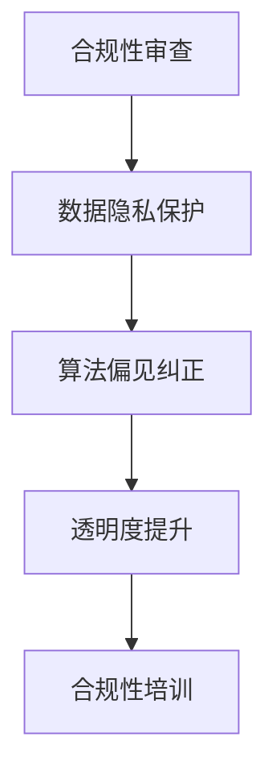

在这个流程中，企业通过合规性审查、数据隐私保护、算法偏见纠正和透明度提升等措施，确保AI系统的合规性。

#### 9.4 本章小结

本章节介绍了国际AI标准概述、主要国家和地区的法规政策，以及企业合规与合规性挑战。通过这些内容，读者将能够了解AI系统在法律和伦理方面的要求和挑战，为AI系统的公平性、问责制和透明度提供指导。企业在开发和应用AI系统时，应遵守相关法规和标准，确保AI系统的合规性和社会责任。

### 第十部分：未来展望

随着人工智能（AI）技术的快速发展，AI系统的公平性、问责制和透明度将成为未来研究和应用的重要方向。本章节将探讨AI系统的公平性、问责制和透明度的发展趋势、新技术的应用以及国际合作与标准化。

#### 10.1 AI系统的公平性、问责制和透明度发展趋势

1. **多元化数据集的构建**：未来，AI系统的公平性将依赖于更广泛、多样化的数据集。为了减少偏见，研究者将努力构建包含更多样本、更均衡的数据集，提高AI系统的泛化能力。

2. **新型算法的提出**：为了实现更好的公平性和问责制，研究者将继续提出新型算法，如基于因果推理的算法、多任务学习算法等，以提高AI系统的透明度和可解释性。

3. **法律和伦理规范的完善**：随着AI技术的普及，各国政府和国际组织将不断完善AI的法律和伦理规范，确保AI系统的公平性、问责制和透明度符合社会期待。

#### 10.2 新技术的应用

1. **区块链技术**：区块链技术可以提供数据的安全存储和透明交易，有助于实现AI系统的透明度和可信度。

2. **联邦学习**：联邦学习通过分布式学习模型，保护用户隐私，同时提高AI系统的透明度和可解释性。

3. **混合智能**：结合人类智慧和AI系统，实现更好的决策过程和结果，提高AI系统的透明度和可解释性。

#### 10.3 国际合作与标准化

1. **全球性合作**：为了应对AI系统的公平性、问责制和透明度问题，各国政府和国际组织将加强合作，共同制定全球性的标准和规范。

2. **标准化组织**：国际标准化组织（ISO）和其他相关组织将积极参与AI标准的制定，推动全球范围内的AI系统标准化。

3. **跨学科研究**：AI系统的公平性、问责制和透明度问题涉及多个学科，如计算机科学、伦理学、法律等，跨学科研究将成为未来研究的重要趋势。

#### 10.4 未来研究热点

1. **多模态AI系统的公平性**：随着多模态数据的应用，如何确保多模态AI系统的公平性成为一个研究热点。

2. **AI系统的透明度增强方法**：开发新的方法和技术，提高AI系统的透明度，使其更易于理解和使用。

3. **AI系统的社会责任与伦理问题**：深入研究AI系统在社会责任和伦理方面的问题，提出解决方案，确保AI系统的发展符合社会价值观。

#### 10.5 本章小结

本章节探讨了AI系统的公平性、问责制和透明度的发展趋势、新技术的应用以及国际合作与标准化。通过本章的学习，读者将能够了解AI系统未来的发展方向和关键问题，为AI技术的可持续发展提供指导。

### 第十一部分：未来研究热点

随着人工智能（AI）技术的不断进步，未来研究将聚焦于多个前沿领域，以进一步推动AI系统的公平性、问责制和透明度。以下是一些主要的研究热点：

#### 11.1 多模态AI系统的公平性

多模态AI系统通过整合来自不同来源的数据（如图像、文本、声音等），实现更强大的任务处理能力。然而，多模态数据往往存在各自的特点和偏差，这可能导致系统的公平性受到挑战。未来研究将关注以下几个方面：

1. **多模态数据预处理**：开发有效的数据预处理方法，消除不同模态数据之间的偏见，确保数据集的均衡和多样性。
2. **多模态特征融合**：设计新型特征融合算法，充分利用各模态数据的优势，提高系统的泛化能力和公平性。
3. **多模态解释性AI**：研究可解释性AI方法，使多模态AI系统的决策过程更加透明，帮助用户理解模型的行为。

#### 11.2 AI系统的透明度增强方法

透明度是用户信任AI系统的重要基础。未来研究将致力于提高AI系统的透明度，使其决策过程更加清晰和可解释。以下是一些研究热点：

1. **决策路径可视化**：开发新型可视化工具，以图形化方式展示AI系统的决策路径和内部机制，帮助用户更好地理解模型的决策依据。
2. **特征重要性分析**：研究如何有效地分析模型中不同特征的重要性，提高用户对模型决策过程的信任度。
3. **因果分析**：利用因果推理技术，深入探究AI系统决策背后的因果关系，增强系统的可解释性。

#### 11.3 AI系统的社会责任与伦理问题

AI系统在带来便利的同时，也可能引发一系列社会和伦理问题。未来研究将关注以下几个方面：

1. **算法偏见与歧视**：研究算法偏见和歧视的根源，提出有效的方法来识别和纠正这些偏见。
2. **隐私保护**：探索如何在保证数据隐私的前提下，有效利用数据来训练和优化AI系统。
3. **伦理审查与监管**：建立完善的AI伦理审查和监管机制，确保AI系统的设计和应用符合社会伦理标准。

#### 11.4 跨学科合作

AI系统的公平性、问责制和透明度问题涉及多个学科领域，如计算机科学、心理学、社会学、伦理学等。未来研究将强调跨学科合作，以整合多学科知识，共同推动AI系统的研究和发展。

通过上述研究热点，未来AI系统将朝着更加公平、透明和负责任的方向发展，为人类社会带来更多益处。

### 附录A：常用工具与资源

在AI系统的公平性、问责制和透明度研究中，有许多工具和资源可供使用，以下是一些常用的工具和资源：

#### A.1 公平性评估工具

- **AI Fairness 360**：一个开源的Python库，提供了多种公平性评估方法，包括差异分析、统计平衡率等。
- **Google JAX**：一个开源的Python库，支持基于神经网络的公平性分析和改进。
- **FairLearn**：一个开源的Python库，用于分析AI系统的公平性和可解释性。

#### A.2 问责制工具

- **ALICE**：一个开源的Python库，用于分析AI系统的问责制，包括监控、反馈和模型解释。
- **LI

