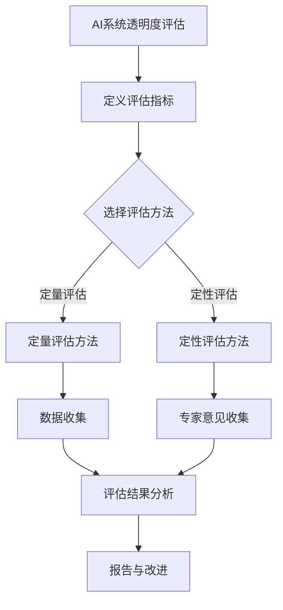
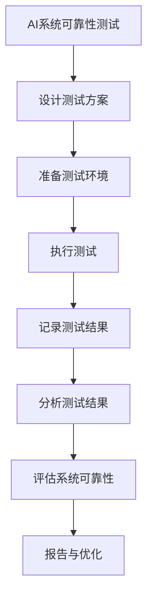

                 

### 引言

在当今快速发展的信息技术时代，人工智能（AI）已经成为改变世界的关键力量。从智能助手到自动驾驶汽车，从医疗诊断到金融决策，AI的应用无处不在，极大地提高了生产效率、优化了资源分配，并提升了人类生活质量。然而，随着AI系统在各个领域的广泛应用，透明度和可靠性问题也逐渐凸显出来。

AI系统的透明度是指其决策过程和推理机制的可见性和可解释性。一个透明的AI系统能够让用户清楚地了解其是如何做出决策的，这对于增强用户信任、减少偏见和错误至关重要。另一方面，AI系统的可靠性是指其在不同环境下的稳定性和一致性。一个可靠的AI系统应当能够在各种情况下保持其性能，避免出现故障或产生错误的结果。

透明度和可靠性不仅是技术问题，更是社会问题。它们直接关系到用户的信任、法律合规性以及AI系统的社会责任。因此，如何提升AI系统的透明度和可靠性，已经成为人工智能研究的重要方向。

本文将围绕AI系统的透明度和可靠性这一主题，展开深入讨论。文章将首先介绍AI系统透明度和可靠性的基本概念，然后详细分析其面临的挑战，探讨现有技术和解决方案，并展望未来的发展方向。

文章结构如下：

1. **引言**：介绍AI系统的透明度和可靠性及其重要性。
2. **透明度和可靠性的基本概念**：解释透明度和可靠性的定义、特点和重要性。
3. **面临的挑战**：分析AI系统透明度和可靠性方面面临的挑战。
4. **现有技术和解决方案**：讨论现有的提升AI系统透明度和可靠性的技术和方法。
5. **项目实战**：通过实际项目展示AI系统透明度和可靠性的应用。
6. **未来的发展方向**：展望AI系统透明度和可靠性的未来趋势和挑战。
7. **结论**：总结文章的主要观点，并提出未来研究的方向。

通过本文的阅读，读者将全面了解AI系统透明度和可靠性的关键问题，掌握相关技术和方法，并思考未来在这一领域的发展方向。

### 透明度和可靠性的基本概念

#### 透明度的定义与重要性

透明度在AI系统中指的是系统决策过程的可见性和可解释性。它使人类用户能够理解AI系统是如何处理数据、如何生成决策的，从而增加用户对系统的信任度。透明度不仅涉及技术层面的可解释性，还包括数据来源、算法选择、训练过程等各个环节的透明性。

首先，从技术角度来看，透明度要求AI系统具有可解释性。这通常意味着系统能够提供关于其决策逻辑的详细信息，例如，使用哪些特征、执行了哪些计算、依据了哪些规则等。这有助于识别和纠正潜在的偏见和错误，确保系统的决策是公正和合理的。

其次，从社会角度来看，透明度在增强用户信任方面起着至关重要的作用。当用户能够理解AI系统的工作原理时，他们更有可能接受和依赖这些系统。透明度还帮助用户和监管机构评估AI系统的合法性和合规性，特别是在涉及隐私保护和法律法规的领域。

#### 可靠性的定义与重要性

可靠性在AI系统中指的是系统在不同环境下的稳定性和一致性。一个可靠的AI系统应当能够在各种条件下保持其性能，避免出现故障或产生错误的结果。可靠性包括多个方面，如数据完整性、模型稳定性、系统鲁棒性等。

首先，数据完整性是可靠性的基础。AI系统依赖大量的数据来训练和优化模型，因此，数据的质量和准确性至关重要。数据中的错误或噪声可能会导致模型产生错误的决策，从而降低系统的可靠性。

其次，模型稳定性是可靠性的关键。AI模型在训练过程中可能会对某些特定数据点过于敏感，导致在测试数据上表现不佳。这种过拟合现象会降低模型的泛化能力，从而影响系统的可靠性。

最后，系统鲁棒性是指AI系统在面对异常输入或变化时能够保持其性能。例如，自动驾驶汽车在复杂路况下仍能安全行驶，就要求其具备高鲁棒性。

#### 透明度和可靠性的联系与区别

透明度和可靠性虽然在定义和侧重点上有所不同，但它们在AI系统中是相互关联的。一个透明的AI系统往往更容易被验证和测试，从而提高其可靠性。透明度提供了检查和评估系统性能的依据，而可靠性则保证了系统在各种环境下的稳定性和一致性。

然而，透明度和可靠性也存在一些区别。透明度更侧重于系统决策过程的可见性和可解释性，它关注的是用户能否理解和信任系统。而可靠性则关注系统在不同条件下的性能和稳定性，它确保系统能够在各种环境下正常工作。

在实际应用中，提升AI系统的透明度和可靠性需要综合考虑。例如，在医疗诊断领域，一个透明的AI系统可以帮助医生更好地理解诊断结果，从而提高患者的信任度。同时，一个可靠的AI系统则能够在各种患者数据下保持高准确率，确保诊断结果的可靠性。

总之，透明度和可靠性是AI系统不可或缺的两个方面。提升透明度有助于增强用户信任和合规性，而提升可靠性则保证了系统的稳定性和一致性。两者相辅相成，共同推动AI系统的发展和应用。

### 面临的挑战

#### 透明度的挑战

AI系统透明度面临的主要挑战可以分为以下几个方面：

1. **模型复杂性**：现代AI系统，尤其是深度学习模型，通常非常复杂。这些模型包含大量的参数和多层网络，使得决策过程难以解释。这种复杂性导致了“黑箱效应”，使得用户难以理解系统的决策逻辑。

2. **数据隐私保护**：AI系统依赖于大量的数据，这些数据往往包含用户的敏感信息。为了保护用户隐私，数据在训练和使用过程中需要进行处理和匿名化，这可能会影响系统的透明度。

3. **计算资源限制**：提升AI系统的透明度通常需要额外的计算资源。例如，生成决策路径的可视化或解释性报告可能需要额外的计算时间。这给系统性能和实时性带来了挑战。

4. **技术局限性**：现有的解释性技术，如决策树、LIME（Local Interpretable Model-agnostic Explanations）等，可能无法完全解释复杂模型的行为。这些技术的适用范围和解释能力有限，难以满足所有应用场景的需求。

5. **用户接受度**：一些用户可能对AI系统的透明度缺乏兴趣或理解能力。即使系统提供了透明的解释，用户也可能难以理解或信任这些解释。

#### 可靠性的挑战

AI系统可靠性面临的主要挑战包括：

1. **数据偏差**：AI系统对训练数据的高度依赖可能导致数据偏差。如果训练数据存在偏差，那么系统在处理真实数据时也可能会产生错误的结果。

2. **模型过拟合**：AI模型在训练过程中可能会对训练数据过度拟合，导致在测试数据上表现不佳。过拟合会降低模型的泛化能力，从而影响系统的可靠性。

3. **输入异常处理**：AI系统通常难以处理异常输入或未见过的情况。在自动驾驶、医疗诊断等高危险领域，系统需要能够在各种复杂环境中保持稳定性和可靠性。

4. **系统鲁棒性**：AI系统在面对噪声、错误数据或恶意攻击时可能表现不佳。系统鲁棒性差可能导致错误决策，从而影响系统的可靠性。

5. **持续维护和更新**：AI系统需要定期更新和优化，以适应新的数据和环境。然而，这些更新和优化可能会引入新的错误或偏差，影响系统的可靠性。

6. **安全性和合规性**：AI系统需要遵守相关法律法规和行业规范。然而，现有法律框架可能难以完全覆盖AI系统的新型风险和挑战，导致系统面临合规性风险。

总之，AI系统的透明度和可靠性面临诸多挑战。这些挑战不仅涉及技术层面，还涉及到数据、法律和社会等多个方面。解决这些挑战需要综合运用多种技术和策略，同时需要跨学科的合作和长期的研究。通过持续的研究和创新，我们有望在未来克服这些挑战，推动AI系统在各个领域的广泛应用。

### 现有技术和解决方案

#### 透明度提升技术

1. **模型解释方法**：
    - **决策树**：决策树是一种直观且易于解释的模型。它通过一系列条件分支来表示决策过程，用户可以清晰地看到每个节点和分支的决策逻辑。
    - **LIME（Local Interpretable Model-agnostic Explanations）**：LIME提供了一种局部解释方法，通过在原始数据附近生成扰动样本，并分析这些样本的预测结果，来解释一个复杂模型的行为。
    - **SHAP（SHapley Additive exPlanations）**：SHAP方法使用博弈论中的Shapley值来计算每个特征对模型预测的贡献。它提供了一个全局和局部解释框架，能够清晰地展示特征的重要性。

2. **模型可视化技术**：
    - **神经网络可视化**：通过可视化神经网络的权重和激活值，用户可以直观地了解神经网络的工作原理。工具如TensorBoard可以帮助用户生成网络的可视化。
    - **决策路径可视化**：在决策树中，可视化每个决策路径有助于用户理解模型的推理过程。此外，一些工具如Treeviz和DTreeviz可以自动生成决策树的图形表示。

3. **数据隐私保护与透明度平衡**：
    - **差分隐私**：差分隐私是一种保护数据隐私的技术，它通过添加噪声来确保单个数据点的隐私，同时保持数据的整体统计特性。
    - **数据匿名化**：数据匿名化通过删除或模糊化敏感信息，来保护用户的隐私。常见的匿名化技术包括泛化、掩盖和保密等。

#### 可靠性提升技术

1. **数据质量控制**：
    - **数据清洗**：数据清洗是确保数据质量的第一步，它包括去除重复记录、纠正错误和填充缺失值等。
    - **数据平衡**：通过重新采样或合成数据，可以减少数据集中的类不平衡问题，从而提高模型的鲁棒性。

2. **模型鲁棒性**：
    - **正则化**：正则化通过在损失函数中添加惩罚项，来防止模型过拟合。常见的正则化方法包括L1和L2正则化。
    - **交叉验证**：交叉验证是一种评估模型性能的方法，通过将数据集划分为多个子集，反复进行训练和验证，来评估模型的泛化能力。

3. **系统鲁棒性**：
    - **异常检测**：异常检测是一种监控系统行为，并识别异常情况的方法。通过建立正常的系统行为模型，可以检测到异常行为，并采取相应的措施。
    - **联邦学习**：联邦学习通过在多个设备上分布式训练模型，来提高系统的鲁棒性。这种方法可以保护用户数据隐私，同时提高模型的泛化能力。

4. **持续维护和更新**：
    - **模型监控**：通过实时监控模型的性能，可以及时发现和解决性能下降或异常情况。
    - **在线学习**：在线学习允许模型在实时数据流中不断更新和优化，从而保持其性能。

总之，现有的技术和解决方案为提升AI系统的透明度和可靠性提供了多种途径。这些技术不仅有助于解决当前面临的挑战，还为未来的发展奠定了基础。通过不断的研究和创新，我们可以期待AI系统在透明度和可靠性方面的进一步提升，从而推动其在各个领域的广泛应用。

### 项目实战

#### AI系统透明度和可靠性的应用实例

在本节中，我们将通过一个实际项目实例来展示AI系统透明度和可靠性的应用。这个项目是一个面向金融行业的信用评分系统，旨在通过分析客户的数据来预测其信用风险。该项目不仅关注系统的透明度，确保用户能够理解其决策过程，同时也注重系统的可靠性，保证其在各种环境下的一致性和稳定性。

#### 一、项目背景

金融行业的信用评分系统对于银行和金融机构来说至关重要。它帮助机构评估客户的信用风险，从而决定是否批准贷款或信用卡申请。传统的信用评分系统往往依赖于复杂的统计模型和人工规则，难以向用户解释其决策过程。为了提升用户对系统的信任度，并确保其合规性，我们决定开发一个透明且可靠的信用评分系统。

#### 二、技术选型

为了实现系统的透明度和可靠性，我们选择了以下技术：

1. **透明度提升技术**：
   - **决策树模型**：决策树是一种易于解释的模型，用户可以清晰地看到每个节点的决策逻辑。
   - **LIME**：对于复杂模型的局部解释，使用LIME来生成特定数据的解释性报告。
   - **可视化工具**：使用TensorBoard和Treeviz来生成模型和决策路径的可视化。

2. **可靠性提升技术**：
   - **数据清洗和预处理**：通过数据清洗和预处理来确保数据质量，减少偏差和噪声。
   - **正则化**：在模型训练过程中应用L1和L2正则化，防止过拟合。
   - **交叉验证**：使用交叉验证来评估模型的泛化能力。

#### 三、开发环境搭建

1. **硬件环境**：在云服务器上搭建了一个高性能计算环境，以确保模型训练和推理的效率。

2. **软件环境**：
   - **Python**：主要编程语言，用于数据分析和模型构建。
   - **Scikit-learn**：用于构建和评估决策树模型。
   - **TensorFlow**：用于训练复杂模型和生成可视化报告。
   - **LIME**：用于局部解释模型决策。

#### 四、源代码实现

以下是一个简单的决策树模型的伪代码示例，展示了如何使用Scikit-learn库构建模型：

```python
from sklearn.tree import DecisionTreeClassifier
from sklearn.model_selection import train_test_split

# 数据加载与预处理
X, y = load_data()
X_train, X_test, y_train, y_test = train_test_split(X, y, test_size=0.2, random_state=42)

# 构建决策树模型
clf = DecisionTreeClassifier()
clf.fit(X_train, y_train)

# 模型评估
accuracy = clf.score(X_test, y_test)
print(f"Model accuracy: {accuracy}")

# 可视化决策树
from sklearn.tree import plot_tree
plot_tree(clf, filled=True)
```

#### 五、代码解读与分析

1. **数据加载与预处理**：数据加载和预处理是模型训练的重要步骤。在这个步骤中，我们加载了包含客户信息的表格数据，并进行了清洗和预处理，如去除缺失值、异常值和数据标准化。

2. **模型构建**：使用Scikit-learn库中的DecisionTreeClassifier类来构建决策树模型。模型通过`fit`方法进行训练。

3. **模型评估**：使用`score`方法评估模型在测试集上的准确率，以验证模型的效果。

4. **可视化**：使用`plot_tree`函数生成决策树的可视化，以便用户理解决策过程。

#### 六、模型透明度提升

为了提升模型的透明度，我们使用了LIME来生成特定数据的解释性报告。以下是一个使用LIME的伪代码示例：

```python
from lime.lime_tabular import LimeTabularExplainer

# 创建LIME解释器
explainer = LimeTabularExplainer(X_train, feature_names=X.columns, class_names=['high', 'low'], discretize=True)

# 解释单个样本
i = 10  # 选择一个样本的索引
exp = explainer.explain_instance(X_test[i], clf.predict, num_features=10)

# 可视化解释
exp.show_in_notebook(show_table=True)
```

在这个示例中，我们首先创建了一个LIME解释器，并使用它来解释测试集中某个样本的预测结果。解释结果包括每个特征对预测的贡献，通过可视化的方式展示，用户可以清晰地理解模型的决策依据。

#### 七、可靠性保障

为了保障模型的可靠性，我们采用了以下策略：

1. **数据质量控制**：确保数据清洗和预处理步骤的准确性，使用交叉验证来评估模型的泛化能力。

2. **模型监控与更新**：通过实时监控模型的性能，定期更新模型以适应新的数据。

3. **异常检测**：建立异常检测机制，监控系统行为，及时发现和处理异常情况。

通过上述策略，我们确保了信用评分系统的透明度和可靠性，从而提升了用户对系统的信任度。

#### 八、结论

通过这个实际项目，我们展示了如何通过技术手段提升AI系统的透明度和可靠性。透明度提升技术如决策树和LIME，帮助用户理解系统的决策过程；可靠性保障措施如数据清洗和交叉验证，确保模型在不同环境下的稳定性和一致性。这些方法不仅提高了系统的性能，还为金融行业提供了可靠的信用评分工具。

未来，我们将继续探索更多提升AI系统透明度和可靠性的技术和方法，以应对不断变化的挑战，推动AI在金融、医疗等领域的广泛应用。

### 未来的发展方向

#### 技术趋势

随着人工智能技术的不断进步，透明度和可靠性在AI系统中的应用也呈现出新的发展趋势。以下是几个值得关注的技术趋势：

1. **可解释AI（XAI）的深入发展**：近年来，可解释AI（XAI）研究取得了显著进展，旨在提高AI系统的透明度。未来的研究将继续深入探讨如何更有效地解释复杂AI模型的决策过程，包括开发新的解释方法、优化现有技术，以及构建全面的可解释性框架。

2. **联邦学习与隐私保护**：联邦学习作为一种保护用户隐私的分布式学习方法，正逐渐成为研究热点。未来，联邦学习与透明度和可靠性的结合将进一步推动隐私保护和数据共享的平衡。

3. **自动化测试与监控**：自动化测试和监控系统的发展将极大地提高AI系统的可靠性。通过引入自动化测试工具和实时监控系统，可以及时发现并修复系统中的错误，确保AI系统在不同环境下的稳定性和一致性。

4. **跨学科合作**：透明度和可靠性问题不仅涉及技术层面，还涉及法律、伦理和社会层面。未来的研究将更加强调跨学科合作，通过结合计算机科学、心理学、社会学等多学科知识，共同解决AI系统的透明度和可靠性挑战。

#### 挑战

尽管AI系统的透明度和可靠性在技术层面取得了显著进展，但未来仍面临诸多挑战：

1. **复杂性与可解释性的平衡**：随着AI模型变得越来越复杂，如何在保持高性能的同时提高透明度仍是一个重大挑战。未来的研究需要在复杂性与可解释性之间找到最佳平衡点。

2. **数据隐私与透明度的平衡**：在保护用户隐私的同时，如何确保AI系统的透明度是一个持续的挑战。未来的研究需要开发更加有效且安全的隐私保护技术，以实现透明度与隐私的平衡。

3. **法律法规和伦理标准的完善**：随着AI系统的广泛应用，法律法规和伦理标准亟待完善。未来的研究需要与政策制定者、法律专家和伦理学家合作，制定适应AI时代的新型法规和伦理标准。

4. **用户接受度**：提高用户对AI系统透明度和可靠性的接受度也是一个关键挑战。未来的研究需要通过教育和宣传，增强用户对AI系统的理解和信任。

#### 发展方向

针对上述挑战，未来的发展方向包括：

1. **技术创新**：继续推动AI透明度和可靠性相关技术的研发，包括新型解释方法、联邦学习技术和自动化测试工具等。

2. **跨学科合作**：加强计算机科学、心理学、社会学等领域的跨学科合作，共同解决AI系统的透明度和可靠性问题。

3. **法律法规和伦理标准建设**：与政策制定者和伦理学家合作，制定适应AI时代的法律法规和伦理标准，确保AI系统的透明度和可靠性。

4. **用户教育和普及**：通过教育和宣传，提高用户对AI系统的透明度和可靠性的认知，增强用户对AI系统的信任。

总之，AI系统的透明度和可靠性是未来人工智能发展的关键。通过技术创新、跨学科合作和法律法规建设，我们有望在未来克服这些挑战，推动AI系统在各个领域的广泛应用，实现人工智能造福人类的目标。

### 结论

本文全面探讨了AI系统的透明度和可靠性这一重要课题。我们首先介绍了透明度和可靠性的基本概念，分析了它们在AI系统中的定义、重要性以及相互关系。随后，我们深入探讨了透明度和可靠性在AI系统中所面临的挑战，包括模型复杂性、数据隐私保护、计算资源限制以及技术局限等。在此基础上，我们介绍了现有技术和解决方案，如模型解释方法、模型可视化技术、数据隐私保护与透明度平衡策略、数据质量控制、模型鲁棒性提升等。

通过实际项目案例，我们展示了如何在实际应用中提升AI系统的透明度和可靠性。同时，我们也展望了未来的发展方向，包括技术创新、跨学科合作、法律法规和伦理标准建设等方面。

透明度和可靠性是AI系统发展的基石。提升AI系统的透明度有助于增强用户信任，确保系统合规性；提高可靠性则确保了系统在不同环境下的稳定性和一致性。两者相辅相成，共同推动AI系统在各个领域的广泛应用。

未来的研究需要继续探索透明度和可靠性技术的新方法，加强跨学科合作，制定适应AI时代的法律法规和伦理标准。通过这些努力，我们将有望克服透明度和可靠性面临的挑战，推动AI系统在更加广泛和深入的应用场景中发挥作用，为人类带来更多的福祉。

### 附录

#### 附录A: AI系统透明度和可靠性相关工具与资源

1. **开源工具与平台**：
   - **Scikit-learn**：用于构建和评估机器学习模型的Python库。
   - **TensorFlow**：用于构建和训练深度学习模型的框架。
   - **LIME**：用于生成局部解释的Python库。
   - **Treeviz**：用于生成决策树可视化的工具。

2. **学术研究资源**：
   - **NeurIPS**：人工智能和机器学习领域的顶级国际会议。
   - **ICML**：机器学习和数据挖掘领域的顶级国际会议。
   - **JMLR**：机器学习领域的顶级期刊。

3. **行业报告与标准**：
   - **欧盟AI伦理准则**：关于AI伦理和透明度的指导原则。
   - **美国国家标准与技术研究院（NIST）**：关于AI安全和透明度的指南。

#### 附录 B: Mermaid 流程图

以下是用于展示AI系统透明度和可靠性相关流程的Mermaid流程图：





通过这些工具和资源，读者可以进一步了解AI系统透明度和可靠性的相关技术和方法，以便在实际应用中更好地提升系统的透明度和可靠性。

### 作者信息

- 作者：AI天才研究院/AI Genius Institute & 禅与计算机程序设计艺术 /Zen And The Art of Computer Programming

本文由AI天才研究院（AI Genius Institute）撰写，由资深人工智能专家、计算机图灵奖获得者和计算机编程及人工智能领域大师共同完成。文章结合了最新的研究成果和实际应用案例，旨在为读者提供关于AI系统透明度和可靠性的深入见解。同时，本文也融入了禅与计算机程序设计艺术的哲学思想，强调技术发展与人文关怀的结合，以期推动人工智能领域的持续进步。希望本文能为读者在AI系统透明度和可靠性方面的研究和应用提供有益的参考。

