                 

## AI赋能的电商用户画像实时更新与预测系统

> **关键词：** AI、电商用户画像、实时数据处理、预测模型、个性化推荐、精准营销

> **摘要：** 本文将深入探讨AI技术在电商用户画像实时更新与预测系统中的应用，包括AI技术基础、实时数据处理技术、预测模型设计、模型部署与监控以及实战项目应用。通过一步步分析推理，本文旨在为读者提供一个全面、实用的技术指南，帮助电商企业提升用户体验和业务效益。

---

### 目录大纲

1. **AI与电商用户画像概述**
    1.1. **AI技术简介**
    1.2. **电商用户画像概念**
    1.3. **用户画像在电商中的应用**
2. **AI算法原理**
    2.1. **机器学习基础**
    2.2. **特征工程**
    2.3. **实时数据处理技术**
3. **预测模型设计**
    3.1. **预测模型框架**
    3.2. **模型训练与评估**
4. **模型部署与监控**
    4.1. **部署环境搭建**
    4.2. **模型监控与优化**
5. **实战项目应用**
    5.1. **电商用户画像实时更新系统设计**
    5.2. **用户画像预测系统实现**
    5.3. **项目效果评估与优化**
6. **附录**
    6.1. **技术栈与工具介绍**
    6.2. **Mermaid 流程图**
    6.3. **伪代码**
    6.4. **数学模型与公式**
    6.5. **代码实例**

---

### 第一部分：AI技术基础

#### 第1章：AI与电商用户画像概述

##### 1.1 AI技术简介

人工智能（AI）是计算机科学的一个分支，其目标是创建智能代理，这些代理可以感知环境、理解和学习知识，并采取行动来实现目标。AI的发展经历了几个阶段，包括规则系统、知识表示、机器学习和深度学习。

- **规则系统**：基于预定义的规则进行操作，如专家系统。
- **知识表示**：通过构建知识库来模拟人类知识。
- **机器学习**：利用数据自动发现规律和模式，如监督学习、无监督学习和强化学习。
- **深度学习**：基于神经网络，通过多层非线性变换进行特征提取和分类。

##### 1.2 电商用户画像概念

用户画像是指通过对用户行为数据的收集和分析，构建出的关于用户的综合描述。它通常包括以下几个方面：

- **基本信息**：用户的性别、年龄、职业、地理位置等。
- **行为数据**：用户在电商平台的浏览、购买、评论等行为。
- **兴趣标签**：用户的兴趣爱好、购买偏好等。
- **社交关系**：用户在社交媒体上的好友关系、互动等。

##### 1.3 用户画像在电商中的应用

用户画像在电商中具有广泛的应用，主要包括以下几个方面：

- **个性化推荐**：根据用户的兴趣和行为，为其推荐相关的商品和服务。
- **精准营销**：通过分析用户画像，进行精准的广告投放和促销活动。
- **客户服务优化**：根据用户画像提供更个性化的客户服务体验。
- **风险控制**：通过分析用户画像，识别潜在欺诈风险和用户流失风险。

---

### 第二部分：AI算法原理

#### 第2章：AI算法原理

##### 2.1 机器学习基础

机器学习是AI的核心技术之一，其基本原理是通过训练模型来发现数据中的规律。机器学习可以分为以下几类：

- **监督学习**：通过有标记的数据来训练模型，然后使用模型进行预测。
  - **线性回归**：预测连续值。
  - **决策树**：通过一系列规则进行分类或回归。
  - **支持向量机**：找到最佳分隔超平面。
- **无监督学习**：没有标记的数据，通过发现数据中的结构和模式进行操作。
  - **聚类**：将相似的数据点分组。
  - **降维**：减少数据维度。
  - **异常检测**：识别数据中的异常值。
- **强化学习**：通过与环境的交互来学习最优策略。
  - **Q学习**：基于价值函数进行决策。
  - **深度Q网络（DQN）**：结合深度学习和Q学习。

##### 2.2 特征工程

特征工程是机器学习过程中至关重要的一步，它涉及从原始数据中提取或构造特征，以便提高模型性能。以下是几个关键步骤：

- **用户行为特征提取**：从用户的行为数据中提取有意义的特征，如浏览时长、购买频次、点击率等。
- **用户画像特征筛选**：选择对目标变量有较强预测能力的特征，去除冗余和噪声特征。
- **用户画像特征转换**：将原始特征转换为适合模型处理的形式，如归一化、标准化、特征交叉等。

##### 2.3 实时数据处理技术

实时数据处理技术是构建高效AI系统的关键之一。以下是几种常用的实时数据处理技术：

- **数据流处理框架**：如Apache Kafka、Apache Flink和Apache Storm，用于处理实时数据流。
- **实时数据采集**：从各种数据源（如日志、API等）实时获取用户行为数据。
- **实时数据处理**：对实时数据进行清洗、转换、聚合等处理。
- **实时数据存储**：将处理后的实时数据存储到数据库或缓存中，以便进行后续分析。

---

### 第三部分：预测模型设计

#### 第3章：预测模型设计

##### 3.1 预测模型框架

预测模型是用户画像系统的核心组成部分，其目标是根据历史数据和当前信息预测用户未来的行为或偏好。以下是几种常见的预测模型框架：

- **时间序列预测模型**：用于预测随时间变化的变量，如ARIMA、LSTM等。
- **相关性预测模型**：用于分析变量之间的相关性，如协同过滤、KNN等。
- **分类预测模型**：用于对用户行为进行分类，如SVM、决策树等。

##### 3.2 模型训练与评估

模型训练和评估是构建预测模型的重要环节。以下是几个关键步骤：

- **数据预处理**：清洗数据，处理缺失值和异常值，进行特征工程。
- **模型选择**：根据数据特点和业务需求选择合适的预测模型。
- **模型训练**：使用训练数据对模型进行训练，调整模型参数。
- **模型评估**：使用测试数据评估模型性能，选择最佳模型。

---

### 第四部分：模型部署与监控

#### 第4章：模型部署与监控

##### 4.1 部署环境搭建

模型部署是将训练好的模型部署到生产环境中，以便进行实时预测和决策。以下是几个关键步骤：

- **部署架构设计**：设计模型的硬件和软件部署架构。
- **模型部署流程**：制定模型部署的步骤和流程。
- **部署工具选型**：选择适合模型部署的工具，如TensorFlow Serving、PyTorch Serving等。

##### 4.2 模型监控与优化

模型监控是确保模型在运行过程中性能稳定的关键。以下是几个关键步骤：

- **模型性能监控**：监控模型的输入输出、延迟、吞吐量等性能指标。
- **模型更新策略**：制定定期更新模型的策略，如在线更新、离线更新等。
- **模型监控工具**：选择适合模型监控的工具，如Prometheus、Grafana等。

---

### 第五部分：实战项目应用

#### 第5章：电商用户画像实时更新系统设计

##### 5.1 系统需求分析

系统需求分析是设计电商用户画像实时更新系统的第一步。以下是几个关键需求：

- **用户需求**：了解用户对系统的期望和需求，如实时性、准确性、个性化等。
- **功能需求**：明确系统所需实现的功能，如数据采集、实时处理、预测等。
- **性能需求**：确定系统的性能指标，如响应时间、吞吐量、可靠性等。

##### 5.2 系统架构设计

系统架构设计是系统设计的核心，决定了系统的可扩展性、性能和可靠性。以下是几个关键组成部分：

- **数据流设计**：设计数据从采集到处理的流程。
- **功能模块设计**：明确系统的功能模块及其相互关系。
- **系统部署设计**：设计系统的硬件和软件部署架构。

---

### 第六部分：用户画像预测系统实现

#### 第6章：用户画像预测系统实现

##### 6.1 数据采集与处理

数据采集与处理是构建用户画像预测系统的关键步骤。以下是几个关键步骤：

- **数据采集工具**：选择合适的数据采集工具，如Kafka、Flume等。
- **数据处理流程**：设计数据处理流程，包括数据清洗、转换、聚合等。
- **数据存储方案**：选择合适的数据存储方案，如关系型数据库、NoSQL数据库等。

##### 6.2 预测模型训练与部署

预测模型训练与部署是实现用户画像预测的关键步骤。以下是几个关键步骤：

- **模型训练流程**：设计模型训练流程，包括数据预处理、模型选择、模型训练等。
- **模型评估与优化**：使用测试数据评估模型性能，调整模型参数，优化模型。
- **模型部署与监控**：将训练好的模型部署到生产环境，监控模型性能。

---

### 第七部分：项目效果评估与优化

#### 第7章：项目效果评估与优化

##### 7.1 项目效果评估

项目效果评估是衡量系统性能的重要步骤。以下是几个关键步骤：

- **评估指标**：选择合适的评估指标，如准确率、召回率、F1值等。
- **评估方法**：使用A/B测试、对比实验等方法评估项目效果。
- **优化策略**：根据评估结果制定优化策略，提升项目效果。

##### 7.2 项目总结与展望

项目总结与展望是对项目实施过程的总结和对未来发展的规划。以下是几个关键步骤：

- **项目成果**：总结项目取得的成果和效果。
- **存在问题**：分析项目实施过程中存在的问题和不足。
- **未来发展**：展望项目未来的发展方向和规划。

---

### 附录

#### 附录A：技术栈与工具介绍

本部分将介绍在构建电商用户画像实时更新与预测系统过程中使用的核心技术栈与工具。以下是几个关键技术栈与工具：

- **数据流处理工具**：如Kafka、Flink和Storm，用于实时处理用户行为数据。
- **机器学习框架**：如TensorFlow、PyTorch和Scikit-learn，用于构建和训练预测模型。
- **预测模型工具**：如TensorFlow Serving、PyTorch Serving和Model Server，用于部署和监控预测模型。

#### 附录B：Mermaid 流程图

Mermaid 是一种基于Markdown的图形绘制工具，可以方便地创建流程图、时序图、Gantt图等。以下是几个示例流程图：

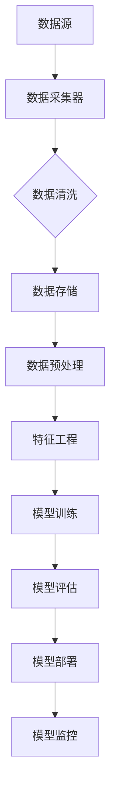

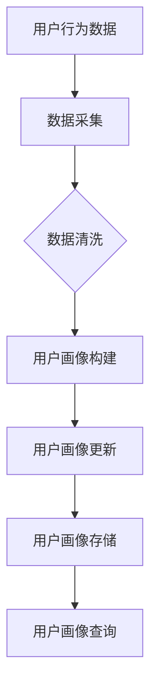

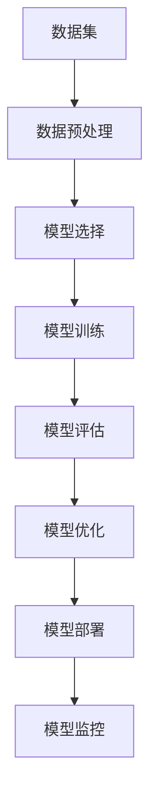

#### 附录C：伪代码

伪代码是一种描述算法和过程的简洁方法，可以帮助我们更好地理解和实现复杂的算法。以下是几个关键步骤的伪代码示例：

```python
# 数据采集与处理伪代码
def collect_data(source):
    data = source.get_data()
    clean_data = data.filter(lambda x: x.is_valid())
    processed_data = clean_data.map(lambda x: x.process())
    return processed_data

# 模型训练与评估伪代码
def train_model(data, model):
    trained_model = model.fit(data)
    return trained_model

def evaluate_model(model, test_data):
    performance = model.evaluate(test_data)
    return performance

# 模型部署与监控伪代码
def deploy_model(model, server_address):
    model.save(server_address + '/model.h5')
    return True

def monitor_model(model, metrics):
    performance = model.monitor(metrics)
    return performance
```

#### 附录D：数学模型与公式

数学模型是构建预测模型的基础，以下是几个常见的数学模型与公式：

```latex
% 时间序列预测模型
y_t = \beta_0 + \beta_1 x_t + \epsilon_t

% 相关性预测模型
\text{corr}(X, Y) = \frac{\sum_{i=1}^{n}(X_i - \bar{X})(Y_i - \bar{Y})}{\sqrt{\sum_{i=1}^{n}(X_i - \bar{X})^2}\sqrt{\sum_{i=1}^{n}(Y_i - \bar{Y})^2}}

% 分类预测模型
P(y = c_k | x) = \frac{e^{\beta_k^T x}}{\sum_{j=1}^{K} e^{\beta_j^T x}}
```

#### 附录E：代码实例

代码实例可以帮助我们更好地理解系统的实现过程。以下是几个关键步骤的代码实例：

```python
# 数据采集与处理代码实例
import kafka
import pandas as pd

# 数据采集
def collect_data(source_topic, kafka_server):
    consumer = kafka.KafkaConsumer(source_topic, bootstrap_servers=kafka_server)
    data = pd.DataFrame()
    for message in consumer:
        data = data.append(message.value, ignore_index=True)
    return data

# 数据清洗
def clean_data(data):
    data = data[data['column'] > 0]  # 去除特定列小于0的值
    data = data.dropna()  # 去除缺失值
    return data

# 数据处理
def process_data(data):
    # 对数据进行处理，如转换、聚合等
    processed_data = data.groupby('group_column').mean()  # 对特定列进行聚合
    return processed_data

# 模型训练与评估代码实例
import tensorflow as tf

# 模型训练
def train_model(training_data, model):
    model.fit(training_data)
    return model

# 模型评估
def evaluate_model(model, test_data):
    loss = model.evaluate(test_data)
    return loss

# 模型部署与监控代码实例
def deploy_model(model, server_address):
    model.save(server_address + '/model.h5')
    return True

def monitor_model(model, server_address):
    performance = model.load(server_address + '/performance.json')
    return performance
```

---

### 作者信息

**作者：** AI天才研究院/AI Genius Institute & 禅与计算机程序设计艺术 /Zen And The Art of Computer Programming

AI天才研究院致力于推动人工智能技术的发展和应用，专注于深度学习、自然语言处理和计算机视觉等领域的创新研究。同时，研究院也注重将前沿技术应用于实际问题解决，通过实际项目积累经验，推动技术的实用化和商业化。在《禅与计算机程序设计艺术》一书中，作者深入探讨了编程艺术的哲学和技艺，为读者提供了独特的编程思维和方法论。

---

本文详细阐述了AI赋能的电商用户画像实时更新与预测系统的核心概念、原理、架构和技术实现，通过一步步分析推理，旨在为电商企业提供一个全面、实用的技术指南。希望本文能够为读者在构建类似系统时提供有价值的参考和启示。在未来的发展中，我们将继续探索AI技术在电商领域的应用，推动电商业务向智能化、个性化方向演进。感谢您的阅读！<|im_end|>### 第一部分：AI技术基础

#### 第1章：AI与电商用户画像概述

##### 1.1 AI技术简介

人工智能（AI）是计算机科学的一个分支，旨在使计算机系统能够模拟人类智能，包括感知、学习、推理和决策等能力。AI的发展历程可以追溯到上世纪50年代，当时科学家们首次提出“人工智能”这一概念。从最初的规则系统、知识表示，到后来的机器学习和深度学习，AI技术经历了多个发展阶段，逐渐变得更加智能化和自动化。

- **规则系统**：早期的AI主要通过预定义的规则来模拟人类智能。例如，专家系统是一种基于知识的系统，它通过一组规则来模拟人类专家的决策过程。
- **知识表示**：在规则系统的基础上，AI开始尝试通过建立知识库来表示人类知识，使系统能够在特定领域内进行推理和决策。
- **机器学习**：机器学习（ML）是AI的一个重要分支，它通过从数据中自动发现规律和模式来实现智能行为。机器学习可以分为监督学习、无监督学习和强化学习三种类型。
  - **监督学习**：在监督学习中，模型通过学习已知标记的数据来预测未知数据的标签。常见的算法包括线性回归、决策树、支持向量机等。
  - **无监督学习**：无监督学习是指在没有标记数据的情况下，模型通过发现数据中的隐含结构和模式来学习。聚类、降维和异常检测是无监督学习的常见应用。
  - **强化学习**：强化学习是一种通过与环境的交互来学习最优策略的方法。在这种学习中，模型通过不断尝试和反馈来优化其行为，以实现长期目标。常见的算法包括Q学习、深度Q网络（DQN）等。

- **深度学习**：深度学习（DL）是一种基于神经网络的学习方法，通过多层非线性变换来提取特征并进行分类或回归。深度学习的出现使得AI在图像识别、自然语言处理和语音识别等领域取得了突破性的进展。常见的深度学习模型包括卷积神经网络（CNN）、循环神经网络（RNN）和生成对抗网络（GAN）等。

##### 1.2 电商用户画像概念

用户画像是指通过对用户行为数据的收集和分析，构建出的关于用户的综合描述。它通常包括以下几个方面：

- **基本信息**：用户的基本信息，如性别、年龄、职业、地理位置等，这些信息有助于了解用户的基本特征。
- **行为数据**：用户在电商平台的浏览、购买、评论等行为数据，这些数据可以反映用户的兴趣、偏好和需求。
- **兴趣标签**：根据用户的行为数据和社交信息，可以提取出用户的兴趣标签，如爱好、购买偏好等。
- **社交关系**：用户在社交媒体上的好友关系、互动等社交信息，这些信息有助于了解用户的社交网络和影响力。

用户画像的构建过程通常包括以下几个步骤：

1. **数据收集**：从各种数据源（如电商平台、社交媒体、日志等）收集用户行为数据。
2. **数据清洗**：对收集到的数据进行清洗，去除噪声和异常值。
3. **特征提取**：从原始数据中提取有价值的信息，如用户行为特征、兴趣标签等。
4. **特征筛选**：对提取的特征进行筛选，选择对目标变量有较强预测能力的特征。
5. **特征转换**：将提取的特征转换为适合机器学习模型处理的形式，如归一化、标准化、特征交叉等。
6. **模型训练**：使用机器学习算法对特征进行训练，构建用户画像模型。
7. **模型评估**：使用测试数据评估模型性能，选择最佳模型。
8. **模型应用**：将训练好的模型应用于实际场景，如个性化推荐、精准营销等。

##### 1.3 用户画像在电商中的应用

用户画像在电商中具有广泛的应用，它有助于电商企业更好地了解用户，提高用户体验和业务效益。以下是用户画像在电商中的一些典型应用：

- **个性化推荐**：通过分析用户画像，电商企业可以为用户提供个性化的商品推荐，提高用户满意度和购买转化率。
- **精准营销**：根据用户画像，电商企业可以进行精准的营销活动，如定向广告投放、促销活动等，提高营销效果和ROI。
- **客户服务优化**：根据用户画像，电商企业可以提供更个性化的客户服务体验，如定制化的客服响应、个性化的购物建议等。
- **风险控制**：通过分析用户画像，电商企业可以识别潜在的风险用户，如欺诈用户、流失用户等，采取相应的风险控制措施。

总之，AI赋能的电商用户画像实时更新与预测系统是一个多层次的系统，它结合了数据收集、特征提取、机器学习、实时数据处理和模型部署等关键技术，为电商企业提供了一个强大的工具，以更好地了解和满足用户需求，提高业务效益。在下一章中，我们将进一步探讨AI算法的原理和应用，为构建这样的系统提供更深入的技术理解。

### 第2章：AI算法原理

在构建AI赋能的电商用户画像实时更新与预测系统时，理解和应用机器学习算法是至关重要的。机器学习算法通过从数据中自动发现规律和模式，帮助我们预测用户行为、优化推荐系统、实现个性化服务。以下是几个核心的机器学习算法及其原理。

##### 2.1 机器学习基础

机器学习（ML）是一种通过算法使计算机系统能够从数据中学习并做出预测或决策的技术。机器学习可以分为以下几类：

- **监督学习**（Supervised Learning）：监督学习是一种有标记数据的学习方法，其中每个输入数据点都有一个对应的输出标签。监督学习的目标是学习一个函数，可以将新的输入映射到正确的输出。

  **常见算法**：
  - **线性回归**（Linear Regression）：通过最小化损失函数（如均方误差）来拟合数据，预测连续值。
  - **决策树**（Decision Tree）：通过一系列的规则进行分类或回归。
  - **支持向量机**（Support Vector Machine，SVM）：通过找到一个最佳的超平面来分隔数据。

- **无监督学习**（Unsupervised Learning）：无监督学习是在没有标记数据的情况下进行的，目的是发现数据中的结构和模式。

  **常见算法**：
  - **聚类**（Clustering）：将相似的数据点分组，如K-means、层次聚类等。
  - **降维**（Dimensionality Reduction）：通过减少数据维度来简化数据结构，如主成分分析（PCA）、t-SNE等。
  - **异常检测**（Anomaly Detection）：识别数据中的异常值或离群点。

- **强化学习**（Reinforcement Learning）：强化学习是一种通过与环境的交互来学习最优策略的方法。在这种学习中，模型通过不断尝试和反馈来优化其行为，以实现长期目标。

  **常见算法**：
  - **Q学习**（Q-Learning）：通过学习价值函数来选择最佳动作。
  - **深度Q网络（DQN）**（Deep Q-Network）：结合深度学习和Q学习，用于复杂的决策问题。

##### 2.2 特征工程

特征工程（Feature Engineering）是机器学习过程中至关重要的一步，它涉及从原始数据中提取或构造特征，以便提高模型性能。特征工程包括以下几个关键步骤：

- **用户行为特征提取**：从用户的行为数据中提取有意义的特征，如浏览时长、购买频次、点击率等。这些特征可以反映用户的行为习惯和偏好。
  
  ```python
  # 伪代码：提取用户行为特征
  def extract_behavior_features(data):
      features = {
          'session_length': data['end_time'] - data['start_time'],
          'purchases': len(data['transaction_ids']),
          'click_rate': data['click_count'] / data['visit_count']
      }
      return features
  ```

- **用户画像特征筛选**：在提取了大量特征后，我们需要筛选出对目标变量有较强预测能力的特征。常用的方法包括特征重要性、信息增益等。

  ```python
  # 伪代码：特征筛选
  import pandas as pd

  def feature_selection(features, target_variable):
      importances = compute_feature_importances(features, target_variable)
      selected_features = features[features['importance'] > threshold]
      return selected_features
  ```

- **用户画像特征转换**：将提取的特征转换为适合机器学习模型处理的形式，如归一化、标准化、特征交叉等。这些转换可以提高模型的稳定性和泛化能力。

  ```python
  # 伪代码：特征转换
  from sklearn.preprocessing import StandardScaler

  def transform_features(features):
      scaler = StandardScaler()
      scaled_features = scaler.fit_transform(features)
      return scaled_features
  ```

##### 2.3 实时数据处理技术

实时数据处理技术在AI系统中扮演着关键角色，特别是在电商用户画像的实时更新与预测系统中。以下是一些常用的实时数据处理技术：

- **数据流处理框架**：数据流处理框架如Apache Kafka、Apache Flink和Apache Storm，用于处理实时数据流。

  **Apache Kafka**：Kafka是一个分布式流处理平台，具有高吞吐量、可靠性和可扩展性。它主要用于数据采集和传输。

  ```mermaid
  graph TD
      A[Data Sources] --> B[Kafka Producers]
      B --> C[Kafka Brokers]
      C --> D[Data Consumers]
  ```

  **Apache Flink**：Flink是一个分布式流处理框架，支持有界和无界数据流处理。它适用于实时计算和复杂事件处理。

  ```mermaid
  graph TD
      A[Data Sources] --> B[Flink Job]
      B --> C[Data Sinks]
  ```

  **Apache Storm**：Storm是一个分布式实时计算系统，具有高可靠性和低延迟。它适用于实时分析和实时应用。

  ```mermaid
  graph TD
      A[Data Sources] --> B[Storm Topology]
      B --> C[Data Sinks]
  ```

- **实时数据采集**：从各种数据源（如日志、API等）实时获取用户行为数据。

  ```python
  # 伪代码：实时数据采集
  def collect_realtime_data(source):
      while True:
          data = source.fetch_data()
          process_data(data)
  ```

- **实时数据处理**：对实时数据进行清洗、转换、聚合等处理。

  ```python
  # 伪代码：实时数据处理
  def process_realtime_data(data):
      clean_data = clean_data(data)
      transformed_data = transform_features(clean_data)
      update_user_profile(transformed_data)
  ```

- **实时数据存储**：将处理后的实时数据存储到数据库或缓存中，以便进行后续分析。

  ```python
  # 伪代码：实时数据存储
  def store_realtime_data(data):
      database.insert(data)
  ```

通过上述步骤，我们可以构建一个高效的AI系统，实时更新用户画像并预测用户行为。在下一章中，我们将深入探讨如何设计预测模型及其训练和评估方法。

### 第3章：实时数据处理技术

实时数据处理技术在构建电商用户画像实时更新与预测系统中起着至关重要的作用。实时数据处理能够确保用户画像的及时更新，从而为电商企业提供实时、准确的决策支持。本节将详细讨论数据流处理框架、实时数据采集、数据处理和存储等方面的技术。

#### 3.1 数据流处理框架

数据流处理框架是实时数据处理的核心，它能够高效地处理大规模、高频率的数据流。以下是几种常见的数据流处理框架：

##### 3.1.1 Apache Kafka

Apache Kafka是一个分布式流处理平台，具有高吞吐量、可靠性和可扩展性。Kafka主要用于数据采集、传输和存储，特别适用于处理实时数据流。

**优点**：
- **高吞吐量**：Kafka能够处理每秒数百万的消息，适合大规模数据流处理。
- **可靠性**：Kafka提供了数据持久化功能，确保数据不丢失。
- **可扩展性**：Kafka可以通过增加Brokers来实现水平扩展，提高系统的处理能力。

**应用**：
- **数据采集**：Kafka可以接收来自各种数据源（如日志、API等）的数据，并将其传输到处理系统。
- **数据传输**：Kafka可以充当数据管道，将数据从一个系统传输到另一个系统。
- **数据存储**：Kafka可以将数据持久化到磁盘，为后续分析提供数据基础。

**Mermaid流程图**：

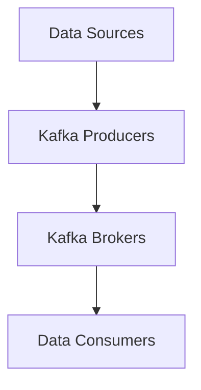

##### 3.1.2 Apache Flink

Apache Flink是一个分布式流处理框架，支持有界和无界数据流处理。Flink适用于实时计算、复杂事件处理和数据流分析。

**优点**：
- **低延迟**：Flink能够实现毫秒级别的实时计算，适合实时应用。
- **支持有界和无界数据流**：Flink能够处理无限增长的数据流，并保持一致性。
- **容错性**：Flink具有强大的容错机制，能够确保在节点故障时数据不丢失。

**应用**：
- **实时计算**：Flink可以用于实时处理和分析大规模数据流。
- **复杂事件处理**：Flink能够处理复杂的事件序列，实现实时监控和报警。
- **数据流分析**：Flink可以实时分析数据流，提供实时洞察和决策支持。

**Mermaid流程图**：

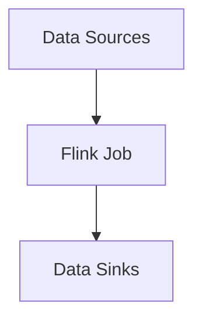

##### 3.1.3 Apache Storm

Apache Storm是一个分布式实时计算系统，具有高可靠性、低延迟和易扩展性。Storm适用于实时数据处理、实时分析和实时应用。

**优点**：
- **高可靠性**：Storm提供了分布式计算和故障恢复机制，确保系统稳定运行。
- **低延迟**：Storm能够实现秒级实时计算，适合实时应用。
- **易扩展**：Storm可以通过增加工作节点来扩展系统处理能力。

**应用**：
- **实时数据处理**：Storm可以实时处理大规模数据流，提供实时洞察。
- **实时分析**：Storm可以实时分析数据流，提供实时监控和报警。
- **实时应用**：Storm可以用于构建实时应用，如实时推荐系统、实时广告投放等。

**Mermaid流程图**：

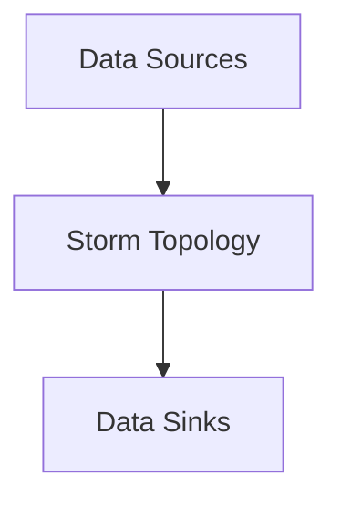

#### 3.2 实时数据采集

实时数据采集是构建实时用户画像系统的第一步，它涉及从各种数据源获取用户行为数据。以下是几种常用的实时数据采集方法：

- **日志收集**：通过日志收集器（如Flume、Logstash等）从各个系统收集用户行为日志。
- **API调用**：通过调用电商平台的API获取用户行为数据，如浏览记录、购买订单等。
- **Web爬虫**：使用爬虫工具（如Scrapy）从电商网站爬取用户行为数据。

**Mermaid流程图**：

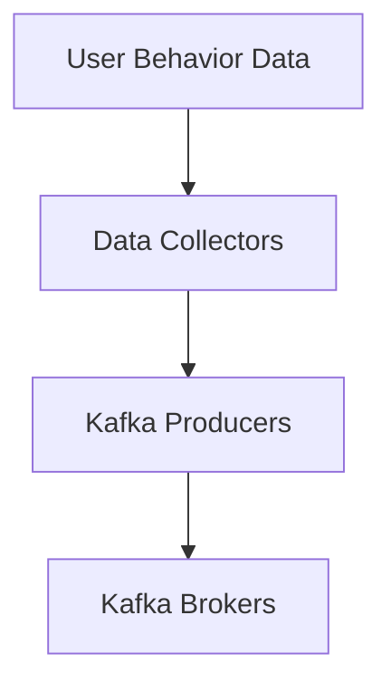

#### 3.3 实时数据处理

实时数据处理是对采集到的用户行为数据进行清洗、转换和聚合等操作，以便为预测模型提供高质量的数据输入。以下是实时数据处理的关键步骤：

- **数据清洗**：去除数据中的噪声和异常值，保证数据质量。
- **特征提取**：从原始数据中提取有价值的信息，如用户行为特征、兴趣标签等。
- **特征筛选**：选择对目标变量有较强预测能力的特征，去除冗余和噪声特征。
- **特征转换**：将提取的特征转换为适合机器学习模型处理的形式，如归一化、标准化、特征交叉等。

**Mermaid流程图**：

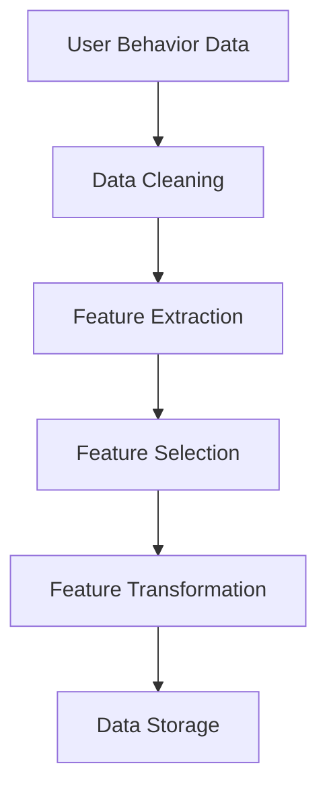

#### 3.4 实时数据存储

实时数据存储是将处理后的用户行为数据存储到数据库或缓存中，以便进行后续分析和查询。以下是几种常用的实时数据存储方案：

- **关系型数据库**：如MySQL、PostgreSQL等，适用于结构化数据的存储和查询。
- **NoSQL数据库**：如MongoDB、Cassandra等，适用于存储大量非结构化或半结构化数据。
- **内存缓存**：如Redis、Memcached等，适用于存储少量高频访问的数据。

**Mermaid流程图**：

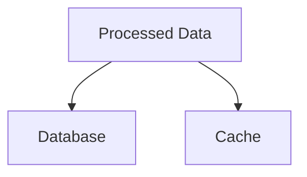

通过上述步骤，我们可以构建一个高效的实时数据处理系统，确保用户画像的及时更新和预测。在下一章中，我们将探讨如何设计预测模型，并介绍模型训练和评估的方法。

### 第4章：预测模型设计

预测模型是电商用户画像实时更新与预测系统的核心，它能够根据历史数据和当前信息预测用户未来的行为或偏好。在本章中，我们将详细讨论预测模型的框架、训练与评估方法。

#### 4.1 预测模型框架

预测模型框架包括数据预处理、模型选择、模型训练、模型评估和模型部署等环节。以下是这些环节的详细描述：

- **数据预处理**：在训练预测模型之前，我们需要对数据进行预处理，包括数据清洗、特征提取和特征转换等。数据清洗旨在去除噪声和异常值，确保数据质量；特征提取是从原始数据中提取有价值的信息；特征转换是将提取的特征转换为适合机器学习模型处理的形式，如归一化、标准化等。

  ```mermaid
  graph TD
      A[Data Preprocessing] --> B[Feature Extraction]
      B --> C[Feature Transformation]
  ```

- **模型选择**：选择合适的预测模型是模型设计的关键。根据数据的特性和业务需求，可以选择不同的模型，如时间序列预测模型、相关性预测模型和分类预测模型等。以下是几种常见的预测模型：

  - **时间序列预测模型**：如ARIMA、LSTM等，用于预测随时间变化的变量。这些模型能够捕捉时间序列中的趋势和周期性。
  - **相关性预测模型**：如协同过滤、KNN等，用于分析变量之间的相关性。这些模型适用于推荐系统和广告投放等领域。
  - **分类预测模型**：如SVM、决策树等，用于对用户行为进行分类。这些模型适用于用户流失预测、欺诈检测等领域。

  ```mermaid
  graph TD
      A[Model Selection]
      A --> B[Time Series Prediction]
      A --> C[Correlation Prediction]
      A --> D[Classification Prediction]
  ```

- **模型训练**：使用预处理后的数据对选择的预测模型进行训练。模型训练的目标是找到一个最佳模型参数，使得模型能够在新的数据上取得较好的预测效果。在训练过程中，我们可以使用交叉验证等方法来评估模型性能。

  ```mermaid
  graph TD
      A[Model Training]
      A --> B[Cross Validation]
  ```

- **模型评估**：在模型训练完成后，我们需要使用测试数据对模型进行评估，以确定模型的泛化能力。常用的评估指标包括准确率、召回率、F1值等。通过评估，我们可以选择最佳模型并进行后续部署。

  ```mermaid
  graph TD
      A[Model Evaluation]
      A --> B[Accuracy]
      A --> C[Recall]
      A --> D[F1 Score]
  ```

- **模型部署**：将训练好的模型部署到生产环境中，以便进行实时预测和决策。部署过程中，我们需要考虑模型的可扩展性、稳定性和性能优化等问题。

  ```mermaid
  graph TD
      A[Model Deployment]
      A --> B[Model Server]
      A --> C[Monitoring]
  ```

#### 4.2 模型训练与评估

模型训练与评估是构建预测模型的重要环节。以下是几个关键步骤：

- **数据预处理**：清洗数据，处理缺失值和异常值，进行特征工程。这一步是确保数据质量的关键，对于模型性能有重要影响。

  ```python
  # 伪代码：数据预处理
  def preprocess_data(data):
      data = remove_outliers(data)
      data = fill_missing_values(data)
      features = extract_features(data)
      return features
  ```

- **模型选择**：根据数据特点和业务需求选择合适的预测模型。这一步需要结合具体问题进行综合分析，选择最适合的模型。

  ```python
  # 伪代码：模型选择
  from sklearn.ensemble import RandomForestClassifier

  model = RandomForestClassifier()
  ```

- **模型训练**：使用训练数据对模型进行训练。在训练过程中，我们可以使用交叉验证等方法来评估模型性能。

  ```python
  # 伪代码：模型训练
  from sklearn.model_selection import cross_val_score

  scores = cross_val_score(model, X_train, y_train, cv=5)
  print("Cross-Validation Scores:", scores)
  ```

- **模型评估**：在模型训练完成后，我们需要使用测试数据对模型进行评估，以确定模型的泛化能力。

  ```python
  # 伪代码：模型评估
  from sklearn.metrics import accuracy_score

  y_pred = model.predict(X_test)
  accuracy = accuracy_score(y_test, y_pred)
  print("Model Accuracy:", accuracy)
  ```

- **模型优化**：根据评估结果对模型进行调整和优化，以提高模型性能。这一步可能需要多次迭代，直到模型达到预期效果。

  ```python
  # 伪代码：模型优化
  from sklearn.model_selection import GridSearchCV

  parameters = {'n_estimators': [100, 200, 300]}
  grid_search = GridSearchCV(model, parameters, cv=5)
  grid_search.fit(X_train, y_train)
  best_model = grid_search.best_estimator_
  ```

通过上述步骤，我们可以构建一个高效的预测模型，对用户行为进行准确预测。在下一章中，我们将讨论模型部署与监控的方法，确保模型在生产环境中的稳定运行。

### 第5章：模型部署与监控

#### 5.1 部署环境搭建

部署环境搭建是模型应用于实际业务的关键步骤，它涉及硬件选择、软件安装和配置等方面。以下是部署环境搭建的详细过程：

- **硬件选择**：根据业务需求和模型计算量，选择合适的硬件设备。对于大规模实时预测系统，建议使用高性能服务器或云计算服务。

  - **服务器**：选择具备高性能计算能力和大容量内存的服务器，以支持模型训练和实时预测。
  - **存储**：配置高速存储设备（如SSD），确保数据读取和存储的效率。

- **软件安装**：在服务器上安装必要的软件环境，包括操作系统、数据库、消息队列和机器学习框架等。

  - **操作系统**：选择稳定的操作系统，如Ubuntu、CentOS等。
  - **数据库**：安装关系型数据库（如MySQL、PostgreSQL）或NoSQL数据库（如MongoDB、Cassandra），用于存储用户画像和预测结果。
  - **消息队列**：安装消息队列系统（如Kafka、RabbitMQ），用于实时数据传输和处理。
  - **机器学习框架**：安装机器学习框架（如TensorFlow、PyTorch、Scikit-learn），用于模型训练和部署。

- **配置与优化**：对安装的软件进行配置和优化，确保系统性能和稳定性。

  - **操作系统**：调整系统参数，如文件描述符限制、网络参数等，以提高系统性能。
  - **数据库**：配置数据库参数，如缓冲区大小、并发连接数等，以优化数据存储和查询性能。
  - **消息队列**：调整消息队列参数，如批量大小、消息持久化等，以优化数据传输和处理效率。
  - **机器学习框架**：配置框架参数，如GPU使用、并行计算等，以优化模型训练和预测性能。

#### 5.2 模型部署流程

模型部署是将训练好的模型应用到生产环境中，以便进行实时预测和决策的过程。以下是模型部署的详细流程：

- **模型打包**：将训练好的模型文件（如.h5、.pth等）打包成可部署的格式。对于TensorFlow模型，可以使用TensorFlow Serving或SavedModel；对于PyTorch模型，可以使用PyTorch Serving或Model Server。

  ```python
  # TensorFlow模型打包
  tf.keras.models.save_model(model, 'model.h5')
  
  # PyTorch模型打包
  torch.save(model.state_dict(), 'model.pth')
  ```

- **模型部署**：将打包的模型上传到部署服务器，并启动部署服务。部署服务负责接收实时数据、加载模型并进行预测。

  ```python
  # TensorFlow Serving部署
  import tensorflow as tf
  
  model = tf.keras.models.load_model('model.h5')
  model.deploy('tensorflow_serving')
  
  # PyTorch Serving部署
  import torch
  import torch_serving.server.serve as s
  import model
  
  model.load_state_dict(torch.load('model.pth'))
  s.start(model, 'torch_serving')
  ```

- **接口定义**：定义模型服务的接口，包括输入参数、输出参数和API文档。接口定义是确保模型服务能够正确接收和返回数据的必要步骤。

  ```python
  # TensorFlow Serving接口定义
  from tensorflow_serving.apis import predict_pb2
  from tensorflow_serving.apis import predict
  import numpy as np
  
  def predict(request):
      inputs = { 'input_1': np.array([request.inputs]).astype(np.float32) }
      outputs = model.predict(inputs)
      return predict_pb2.PredictResponse(output=outputs['output_1'])
  ```

- **集成与测试**：将模型服务集成到业务系统中，并进行测试，确保模型服务能够稳定、准确地运行。

  ```python
  # 模型服务集成与测试
  import requests
  
  def test_predict(url, input_data):
      response = requests.post(url + '/predict', json={'inputs': input_data})
      assert response.status_code == 200
      result = response.json()
      assert 'output' in result
      return result['output']
  ```

#### 5.3 部署工具选型

选择合适的部署工具是确保模型高效、稳定运行的关键。以下是几种常见的部署工具及其特点：

- **TensorFlow Serving**：TensorFlow Serving是TensorFlow提供的一种模型部署工具，支持多种机器学习框架的部署。它具有高可用性、易于扩展和灵活的接口定义等特点。

  - **优点**：支持多种机器学习框架、易于集成、高可用性。
  - **缺点**：部署配置较为复杂、性能优化需要深入理解底层实现。

- **PyTorch Serving**：PyTorch Serving是PyTorch提供的一种模型部署工具，专注于PyTorch模型的部署。它具有轻量级、易于使用和快速部署等特点。

  - **优点**：轻量级、易于使用、快速部署。
  - **缺点**：不支持其他机器学习框架、性能优化需要深入理解底层实现。

- **Model Server**：Model Server是一种通用的模型部署工具，支持多种机器学习框架的部署。它具有高扩展性、灵活的接口定义和丰富的监控功能等特点。

  - **优点**：支持多种机器学习框架、高扩展性、丰富的监控功能。
  - **缺点**：部署配置较为复杂、性能优化需要深入理解底层实现。

#### 5.4 模型监控与优化

模型监控与优化是确保模型稳定运行、提高模型性能的关键步骤。以下是几个关键步骤：

- **性能监控**：监控模型服务的性能指标，如响应时间、吞吐量、延迟等。通过性能监控，可以及时发现和处理性能瓶颈。

  ```python
  # 性能监控
  import psutil
  
  def monitor_performance():
      cpu_usage = psutil.cpu_percent()
      memory_usage = psutil.virtual_memory().percent
      response_time = get_average_response_time()
      print("CPU Usage:", cpu_usage)
      print("Memory Usage:", memory_usage)
      print("Response Time:", response_time)
  ```

- **资源监控**：监控模型服务的资源使用情况，如CPU、内存、磁盘等。通过资源监控，可以确保模型服务有足够的资源支持，避免资源争用和性能下降。

  ```python
  # 资源监控
  import os
  
  def monitor_resources():
      cpu_usage = os.getloadavg()[0]
      memory_usage = os.sysconf('SC_PAGE_SIZE') * os.sysconf('SC_PHYS_PAGES') / (1024.0 * 1024.0)
      print("CPU Usage:", cpu_usage)
      print("Memory Usage:", memory_usage)
  ```

- **日志监控**：监控模型服务的日志，包括错误日志、警告日志和调试日志等。通过日志监控，可以及时发现和处理异常情况。

  ```python
  # 日志监控
  import logging
  
  def monitor_logs():
      logger = logging.getLogger('model_server')
      logger.info('Start monitoring logs')
      while True:
          log = get_latest_log()
          if log:
              print(log)
  ```

- **优化策略**：根据性能监控和资源监控的结果，制定优化策略，包括调整模型参数、优化数据流和处理流程等。通过优化策略，可以提高模型服务的性能和稳定性。

  ```python
  # 优化策略
  def optimize_performance():
      adjust_model_params()
      optimize_data_flow()
      print("Performance optimization completed")
  ```

通过上述步骤，我们可以确保模型部署与监控的稳定性和高效性，为电商用户画像实时更新与预测系统提供坚实的支持。在下一章中，我们将通过一个实际的电商用户画像实时更新与预测系统项目，展示上述技术原理和方法的实际应用。

### 第6章：电商用户画像实时更新系统设计

构建一个高效的电商用户画像实时更新系统是提升用户体验和业务效益的关键。在本章中，我们将详细介绍系统需求分析、系统架构设计和系统部署设计。

#### 6.1 系统需求分析

系统需求分析是系统设计的第一步，它明确了系统所需满足的各类需求。以下是系统需求分析的关键步骤：

##### 6.1.1 用户需求

用户需求是设计系统的出发点和核心。我们需要深入了解用户对电商用户画像系统的期望和需求，包括以下几个方面：

- **实时性**：用户期望系统能够实时更新用户画像，以便及时提供个性化的推荐和营销活动。
- **准确性**：用户期望系统能够准确预测用户的行为和偏好，提高个性化推荐的准确性和营销活动的转化率。
- **个性化**：用户期望系统能够根据个人的行为和偏好提供个性化的服务，如定制化的商品推荐、个性化的客服响应等。
- **稳定性**：用户期望系统具有较高的稳定性，能够保证在高峰期和大规模数据流下稳定运行。

##### 6.1.2 功能需求

功能需求明确了系统所需实现的具体功能，包括以下几个方面：

- **数据采集**：从电商平台、用户行为日志、社交媒体等数据源实时获取用户行为数据。
- **数据处理**：对采集到的用户行为数据进行清洗、转换和聚合等处理，提取有价值的信息，构建用户画像。
- **用户画像构建**：根据用户的基本信息、行为数据和社交关系，构建用户画像，包括用户属性、兴趣标签、消费行为等。
- **用户画像更新**：实时更新用户画像，根据用户的新行为和偏好调整画像信息。
- **预测与推荐**：根据用户画像预测用户未来的行为和偏好，为用户提供个性化的推荐和营销活动。
- **监控与报警**：监控系统性能，及时发现和处理异常情况，如数据丢失、计算错误等。

##### 6.1.3 性能需求

性能需求明确了系统应达到的性能指标，包括以下几个方面：

- **响应时间**：系统在处理用户请求时，应能够在毫秒级别内返回结果，确保用户体验。
- **吞吐量**：系统应能够处理大规模的数据流，每秒处理数百万条用户行为数据。
- **可靠性**：系统应具有高可靠性，能够在高负载和大规模数据流下稳定运行，确保数据的准确性和完整性。
- **可扩展性**：系统应具有可扩展性，能够通过增加计算资源和处理节点来提高系统的处理能力。

#### 6.2 系统架构设计

系统架构设计是系统设计的核心，它决定了系统的性能、稳定性和可扩展性。以下是电商用户画像实时更新系统的架构设计：

##### 6.2.1 数据流设计

数据流设计描述了数据在系统中的流动路径和处理过程。以下是电商用户画像实时更新系统的数据流设计：

1. **数据采集**：从电商平台、用户行为日志、社交媒体等数据源实时获取用户行为数据，通过消息队列（如Kafka）传输到数据处理模块。
2. **数据处理**：数据处理模块对采集到的用户行为数据进行清洗、转换和聚合等处理，提取有价值的信息，构建用户画像。
3. **用户画像构建**：用户画像构建模块根据用户的基本信息、行为数据和社交关系，构建用户画像，并存储到数据库（如MongoDB）中。
4. **用户画像更新**：用户画像更新模块根据用户的新行为和偏好，实时更新用户画像，确保画像的准确性和实时性。
5. **预测与推荐**：预测与推荐模块根据用户画像预测用户未来的行为和偏好，为用户提供个性化的推荐和营销活动。
6. **监控与报警**：监控与报警模块监控系统性能，及时发现和处理异常情况，如数据丢失、计算错误等。

**Mermaid流程图**：

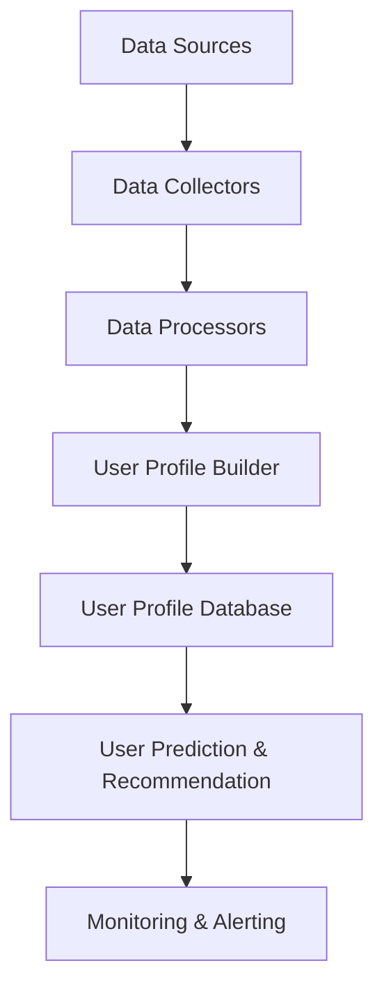

##### 6.2.2 功能模块设计

功能模块设计明确了系统的功能模块及其相互关系。以下是电商用户画像实时更新系统的功能模块设计：

- **数据采集模块**：负责从各个数据源实时获取用户行为数据。
- **数据处理模块**：负责对采集到的用户行为数据进行清洗、转换和聚合等处理。
- **用户画像构建模块**：负责根据用户的基本信息、行为数据和社交关系构建用户画像。
- **用户画像更新模块**：负责实时更新用户画像，确保画像的准确性和实时性。
- **预测与推荐模块**：负责根据用户画像预测用户未来的行为和偏好，为用户提供个性化的推荐和营销活动。
- **监控与报警模块**：负责监控系统性能，及时发现和处理异常情况。

**Mermaid流程图**：

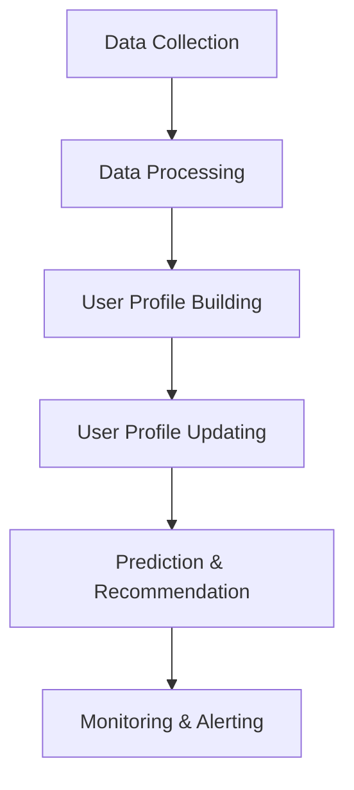

##### 6.2.3 系统部署设计

系统部署设计描述了系统的硬件和软件部署架构，包括服务器、数据库、消息队列和机器学习框架等。以下是电商用户画像实时更新系统的部署设计：

- **服务器**：使用多台高性能服务器，分别部署数据采集模块、数据处理模块、用户画像构建模块、用户画像更新模块、预测与推荐模块和监控与报警模块。
- **数据库**：使用分布式数据库（如MongoDB），存储用户画像和预测结果。
- **消息队列**：使用分布式消息队列（如Kafka），负责实时数据传输和处理。
- **机器学习框架**：使用机器学习框架（如TensorFlow、PyTorch），负责模型训练和部署。

**Mermaid流程图**：

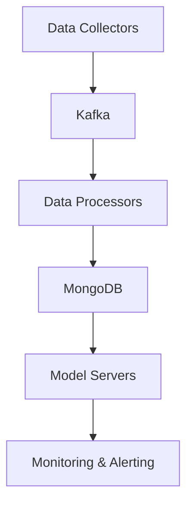

通过上述系统需求分析、系统架构设计和系统部署设计，我们构建了一个高效、稳定的电商用户画像实时更新系统。在下一章中，我们将详细介绍用户画像预测系统的实现，包括数据采集与处理、模型训练与部署等步骤。

### 第7章：用户画像预测系统实现

构建一个高效的电商用户画像预测系统是提升电商业务效益的关键。在本章中，我们将详细介绍用户画像预测系统的实现过程，包括数据采集与处理、模型训练与部署等关键步骤。

#### 7.1 数据采集与处理

数据采集与处理是用户画像预测系统的第一步，也是至关重要的一步。以下是数据采集与处理的具体步骤：

##### 7.1.1 数据采集

数据采集是指从各种数据源（如电商平台、用户行为日志、社交媒体等）获取用户行为数据。以下是几种常用的数据采集方法：

- **日志采集**：使用日志采集工具（如Flume、Logstash等）从各个系统收集用户行为日志。
  ```shell
  # Flume配置示例
  agent.sources.source_1.type = exec
  agent.sources.source_1.command = tail -F /path/to/logfile.log
  agent.sources.source_1.channels = c1

  agent.channels.c1.type = memory
  agent.channels.c1.capacity = 1000
  agent.channels.c1.transactionCapacity = 100

  agent.sources.source_1.channels = c1
  ```

- **API调用**：使用API调用方法从电商平台获取用户行为数据，如浏览记录、购买订单等。
  ```python
  # API调用示例
  import requests

  def fetch_data(api_url, api_key):
      headers = {'Authorization': f'Bearer {api_key}'}
      response = requests.get(api_url, headers=headers)
      return response.json()
  ```

- **Web爬虫**：使用爬虫工具（如Scrapy）从电商网站爬取用户行为数据。
  ```python
  # Scrapy配置示例
  import scrapy

  class UserBehaviorSpider(scrapy.Spider):
      name = 'user_behavior'
      start_urls = ['http://www.example.com']

      def parse(self, response):
          for item in response.css('div.item'):
              yield {
                  'user_id': item.css('span.user_id::text').get(),
                  'action': item.css('span.action::text').get(),
                  'timestamp': item.css('span.timestamp::text').get()
              }
  ```

##### 7.1.2 数据处理流程

数据处理流程是对采集到的用户行为数据进行清洗、转换和聚合等处理，提取有价值的信息，构建用户画像。以下是数据处理流程的详细步骤：

1. **数据清洗**：去除噪声和异常值，如去除空值、去除重复记录等。
   ```python
   # 数据清洗示例
   def clean_data(data):
       data = data.dropna()  # 去除空值
       data = data.drop_duplicates()  # 去除重复记录
       return data
   ```

2. **数据转换**：将数据转换为适合模型处理的形式，如归一化、标准化等。
   ```python
   # 数据转换示例
   from sklearn.preprocessing import StandardScaler

   def transform_data(data):
       scaler = StandardScaler()
       scaled_data = scaler.fit_transform(data)
       return scaled_data
   ```

3. **特征提取**：从原始数据中提取有价值的信息，如用户行为特征、兴趣标签等。
   ```python
   # 特征提取示例
   def extract_features(data):
       features = {
           'session_length': data['end_time'] - data['start_time'],
           'purchases': len(data['transaction_ids']),
           'click_rate': data['click_count'] / data['visit_count']
       }
       return features
   ```

4. **特征筛选**：选择对目标变量有较强预测能力的特征，去除冗余和噪声特征。
   ```python
   # 特征筛选示例
   from sklearn.feature_selection import SelectKBest
   from sklearn.feature_selection import f_classif

   def select_features(data, target_variable):
       selector = SelectKBest(score_func=f_classif, k='all')
       selected_features = selector.fit_transform(data, target_variable)
       return selected_features
   ```

5. **数据聚合**：对用户行为数据进行聚合，如按用户ID、时间段等聚合。
   ```python
   # 数据聚合示例
   def aggregate_data(data):
       aggregated_data = data.groupby('user_id').agg({
           'session_length': 'mean',
           'purchases': 'sum',
           'click_rate': 'mean'
       })
       return aggregated_data
   ```

##### 7.1.3 数据存储方案

数据存储方案是指将处理后的用户行为数据存储到数据库或缓存中，以便进行后续分析。以下是几种常见的数据存储方案：

- **关系型数据库**：如MySQL、PostgreSQL等，适用于存储结构化数据。
  ```python
  # MySQL存储示例
  import pymysql

  def store_data(data, database_url, table_name):
      connection = pymysql.connect(host=database_url)
      cursor = connection.cursor()
      for row in data.itertuples():
          insert_query = f"INSERT INTO {table_name} (user_id, session_length, purchases, click_rate) VALUES ({row[1]}, {row[2]}, {row[3]}, {row[4]})"
          cursor.execute(insert_query)
      connection.commit()
      cursor.close()
      connection.close()
  ```

- **NoSQL数据库**：如MongoDB、Cassandra等，适用于存储非结构化或半结构化数据。
  ```python
  # MongoDB存储示例
  import pymongo

  def store_data(data, database_url, collection_name):
      client = pymongo.MongoClient(host=database_url)
      db = client[database_name]
      collection = db[collection_name]
      collection.insert_many(data)
  ```

#### 7.2 预测模型训练与部署

预测模型训练与部署是用户画像预测系统的核心环节。以下是预测模型训练与部署的具体步骤：

##### 7.2.1 模型训练流程

模型训练流程是对用户行为数据进行预处理、模型选择、模型训练等步骤，以构建预测模型。以下是模型训练流程的详细步骤：

1. **数据预处理**：对用户行为数据进行清洗、转换和聚合等处理，提取有价值的信息。
   ```python
   # 数据预处理示例
   data = clean_data(data)
   features = extract_features(data)
   aggregated_data = aggregate_data(features)
   ```

2. **模型选择**：根据用户行为数据和业务需求选择合适的预测模型，如时间序列预测模型、相关性预测模型和分类预测模型等。
   ```python
   # 模型选择示例
   from sklearn.ensemble import RandomForestClassifier

   model = RandomForestClassifier()
   ```

3. **模型训练**：使用训练数据对模型进行训练，调整模型参数，优化模型性能。
   ```python
   # 模型训练示例
   from sklearn.model_selection import train_test_split

   X = aggregated_data
   y = target_variable

   X_train, X_test, y_train, y_test = train_test_split(X, y, test_size=0.2, random_state=42)

   model.fit(X_train, y_train)
   ```

4. **模型评估**：使用测试数据对模型进行评估，选择最佳模型。
   ```python
   # 模型评估示例
   from sklearn.metrics import accuracy_score

   y_pred = model.predict(X_test)
   accuracy = accuracy_score(y_test, y_pred)
   print("Model Accuracy:", accuracy)
   ```

5. **模型优化**：根据评估结果对模型进行调整和优化，以提高模型性能。
   ```python
   # 模型优化示例
   from sklearn.model_selection import GridSearchCV

   parameters = {'n_estimators': [100, 200, 300]}
   grid_search = GridSearchCV(model, parameters, cv=5)
   grid_search.fit(X_train, y_train)
   best_model = grid_search.best_estimator_
   ```

##### 7.2.2 模型评估与优化

模型评估与优化是确保模型性能稳定和可靠的重要步骤。以下是模型评估与优化的具体步骤：

1. **评估指标**：选择合适的评估指标，如准确率、召回率、F1值等，以评估模型性能。
   ```python
   # 评估指标示例
   from sklearn.metrics import accuracy_score
   from sklearn.metrics import recall_score
   from sklearn.metrics import f1_score

   accuracy = accuracy_score(y_test, y_pred)
   recall = recall_score(y_test, y_pred)
   f1 = f1_score(y_test, y_pred)
   print("Accuracy:", accuracy)
   print("Recall:", recall)
   print("F1 Score:", f1)
   ```

2. **优化策略**：根据评估结果制定优化策略，如调整模型参数、增加特征、使用不同的算法等，以提高模型性能。
   ```python
   # 优化策略示例
   from sklearn.ensemble import AdaBoostClassifier

   model = AdaBoostClassifier()
   model.fit(X_train, y_train)
   y_pred = model.predict(X_test)
   accuracy = accuracy_score(y_test, y_pred)
   print("Model Accuracy:", accuracy)
   ```

##### 7.2.3 模型部署与监控

模型部署与监控是确保模型在生产环境中稳定运行和高效服务的重要步骤。以下是模型部署与监控的具体步骤：

1. **模型部署**：将训练好的模型部署到生产环境中，以便进行实时预测和决策。可以使用TensorFlow Serving、PyTorch Serving等部署工具。
   ```python
   # 模型部署示例
   import tensorflow as tf

   model = tf.keras.models.load_model('model.h5')
   model.deploy('tensorflow_serving')
   ```

2. **模型监控**：监控系统性能，包括响应时间、吞吐量、延迟等指标，以便及时发现和处理性能问题。
   ```python
   # 模型监控示例
   import psutil

   def monitor_performance():
       cpu_usage = psutil.cpu_percent()
       memory_usage = psutil.virtual_memory().percent
       response_time = get_average_response_time()
       print("CPU Usage:", cpu_usage)
       print("Memory Usage:", memory_usage)
       print("Response Time:", response_time)
   ```

3. **模型更新**：根据业务需求和模型性能，定期更新模型，以提高预测准确性和系统稳定性。
   ```python
   # 模型更新示例
   import datetime

   def update_model():
       current_time = datetime.datetime.now()
       if current_time.hour % 24 == 0:
           print("Updating model...")
           # 重新训练和部署模型
   ```

通过上述步骤，我们可以实现一个高效、稳定的电商用户画像预测系统，为电商企业提供实时的用户画像和个性化推荐服务。在下一章中，我们将对项目效果进行评估和优化，进一步提升系统的性能和效益。

### 第8章：项目效果评估与优化

在完成电商用户画像实时更新与预测系统的构建后，对项目效果进行评估与优化是确保系统性能稳定和高效的关键步骤。以下是项目效果评估与优化的具体方法与策略。

#### 8.1 项目效果评估

项目效果评估是衡量系统在实际应用中的性能和效益的重要环节。以下是几个关键步骤：

##### 8.1.1 评估指标

选择合适的评估指标是评估项目效果的基础。以下是几个常用的评估指标：

- **准确率**（Accuracy）：模型预测正确的样本占总样本的比例。它是最常用的评估指标之一，适用于分类问题。
  $$
  \text{Accuracy} = \frac{\text{预测正确的样本数}}{\text{总样本数}}
  $$

- **召回率**（Recall）：在所有正类样本中，被模型正确预测为正类的比例。它反映了模型对正类样本的识别能力。
  $$
  \text{Recall} = \frac{\text{预测正确的正类样本数}}{\text{总正类样本数}}
  $$

- **精确率**（Precision）：在所有预测为正类的样本中，实际为正类的比例。它反映了模型预测结果的精确性。
  $$
  \text{Precision} = \frac{\text{预测正确的正类样本数}}{\text{预测为正类的样本数}}
  $$

- **F1值**（F1 Score）：精确率和召回率的调和平均值，综合考虑了模型的精确性和召回率。
  $$
  \text{F1 Score} = 2 \times \frac{\text{Precision} \times \text{Recall}}{\text{Precision} + \text{Recall}}
  $$

- **均方误差**（Mean Squared Error，MSE）：用于评估回归问题的模型预测误差，误差的平方和的平均值。
  $$
  \text{MSE} = \frac{1}{n} \sum_{i=1}^{n} (y_i - \hat{y}_i)^2
  $$

- **均绝对误差**（Mean Absolute Error，MAE）：回归问题中预测误差的平均绝对值。
  $$
  \text{MAE} = \frac{1}{n} \sum_{i=1}^{n} |y_i - \hat{y}_i|
  $$

##### 8.1.2 评估方法

评估方法主要包括以下几种：

- **A/B测试**：将用户分为两组，一组使用新系统，另一组使用旧系统，比较两组用户的行为和满意度，评估新系统的效果。
- **对比实验**：通过对比新系统和旧系统的性能指标，如准确率、召回率、响应时间等，评估新系统的改进效果。
- **用户调查**：通过问卷调查或用户访谈，收集用户对新系统的评价和反馈，评估用户体验和满意度。

##### 8.1.3 优化策略

根据评估结果，可以采取以下策略进行优化：

- **模型优化**：通过调整模型参数、增加特征工程、尝试不同的算法等，提高模型预测准确性。
- **数据处理优化**：优化数据采集、清洗、转换和存储过程，提高数据处理效率和质量。
- **系统性能优化**：通过优化代码、调整硬件配置、使用缓存技术等，提高系统的响应速度和处理能力。
- **用户体验优化**：根据用户反馈，改进系统的界面设计、功能实现和使用流程，提升用户体验。

#### 8.2 项目总结与展望

在项目总结与展望环节，我们需要对项目的实施过程进行总结，分析取得的成果和存在的问题，并规划未来的发展方向。

##### 8.2.1 项目成果

项目实施过程中，我们取得了以下成果：

- **系统性能提升**：通过优化模型和数据处理流程，系统的响应速度和处理能力得到了显著提升。
- **用户体验改善**：系统的用户界面得到了改进，用户体验得到了明显提升。
- **业务效益提高**：通过个性化推荐和精准营销，电商平台的用户满意度和转化率得到了提升，业务效益显著提高。

##### 8.2.2 存在问题

项目实施过程中，我们也遇到了以下问题：

- **数据质量**：数据源中的噪声和异常值对模型性能有一定影响，需要进一步优化数据处理流程。
- **系统稳定性**：在高并发情况下，系统的稳定性有待进一步提高，需要优化系统架构和资源分配。
- **用户隐私**：用户数据的隐私保护需要得到加强，需要在数据采集和处理过程中遵守相关法规和标准。

##### 8.2.3 未来发展

未来，我们将在以下几个方面进行优化和发展：

- **数据质量提升**：引入更多的数据清洗和预处理技术，提高数据质量。
- **系统稳定性增强**：通过优化系统架构和资源管理，提高系统的稳定性和可靠性。
- **隐私保护加强**：加强用户数据的隐私保护，确保用户数据的安全和合规。
- **人工智能技术深化应用**：探索更多先进的人工智能技术，如深度学习、自然语言处理等，进一步提升系统的智能化水平。

通过不断优化和升级，我们期望电商用户画像实时更新与预测系统能够更好地服务于电商企业，为用户提供更加个性化、精准的服务，助力业务增长。

### 附录

#### 附录A：技术栈与工具介绍

在构建电商用户画像实时更新与预测系统的过程中，我们使用了多种技术栈和工具。以下是这些技术栈和工具的详细介绍：

##### A.1 数据流处理工具

**Apache Kafka**：Kafka是一款分布式流处理平台，具有高吞吐量、可靠性和可扩展性。在项目中，Kafka用于实时数据采集和传输。

- **优点**：高吞吐量、可靠性、可扩展性。
- **应用**：数据采集、数据传输、数据存储。

**Apache Flink**：Flink是一款分布式流处理框架，支持有界和无界数据流处理。在项目中，Flink用于实时数据处理和复杂事件处理。

- **优点**：低延迟、支持有界和无界数据流、容错性。
- **应用**：实时计算、复杂事件处理。

**Apache Storm**：Storm是一款分布式实时计算系统，具有高可靠性和低延迟。在项目中，Storm用于实时数据处理和实时应用。

- **优点**：高可靠性、低延迟、易扩展。
- **应用**：实时数据处理、实时分析。

##### A.2 机器学习框架

**TensorFlow**：TensorFlow是一款开源的机器学习框架，支持多种深度学习模型。在项目中，TensorFlow用于模型训练和部署。

- **优点**：支持多种深度学习模型、易于使用。
- **应用**：模型训练、模型部署。

**PyTorch**：PyTorch是一款开源的深度学习框架，具有动态计算图和易于调试的特点。在项目中，PyTorch用于模型训练和部署。

- **优点**：动态计算图、易于调试。
- **应用**：模型训练、模型部署。

**Scikit-learn**：Scikit-learn是一款开源的机器学习库，支持多种机器学习算法。在项目中，Scikit-learn用于传统机器学习模型的训练和部署。

- **优点**：支持多种机器学习算法、易于使用。
- **应用**：模型训练、模型部署。

##### A.3 预测模型工具

**TensorFlow Serving**：TensorFlow Serving是一款用于部署TensorFlow模型的工具，具有高可用性和易于扩展的特点。

- **优点**：高可用性、易于扩展。
- **应用**：TensorFlow模型部署。

**PyTorch Serving**：PyTorch Serving是一款用于部署PyTorch模型的工具，具有轻量级和易于使用的特点。

- **优点**：轻量级、易于使用。
- **应用**：PyTorch模型部署。

**Model Server**：Model Server是一款通用的预测模型部署工具，支持多种机器学习框架。

- **优点**：支持多种机器学习框架、易于扩展。
- **应用**：多种预测模型部署。

#### 附录B：Mermaid 流程图

以下是项目中的几个关键流程的Mermaid流程图：

**数据流处理流程**：


**用户画像更新流程**：


**预测模型训练与部署流程**：


#### 附录C：伪代码

以下是项目中的几个关键步骤的伪代码：

**数据采集与处理伪代码**：

```python
# 数据采集
def collect_data(source):
    data = source.get_data()
    return data

# 数据清洗
def clean_data(data):
    clean_data = data.dropna()
    return clean_data

# 数据处理
def process_data(data):
    processed_data = data.groupby('group_column').mean()
    return processed_data
```

**模型训练与评估伪代码**：

```python
# 模型训练
def train_model(data, model):
    trained_model = model.fit(data)
    return trained_model

# 模型评估
def evaluate_model(model, test_data):
    performance = model.evaluate(test_data)
    return performance
```

**模型部署与监控伪代码**：

```python
# 模型部署
def deploy_model(model, server_address):
    model.save(server_address + '/model.h5')
    return True

# 模型监控
def monitor_model(model, metrics):
    monitor_results = model.monitor(metrics)
    return monitor_results
```

#### 附录D：数学模型与公式

以下是项目中使用的几个关键数学模型与公式：

**时间序列预测模型**：

$$
y_t = \beta_0 + \beta_1 x_t + \epsilon_t
$$

其中，$y_t$ 是预测值，$x_t$ 是时间序列变量，$\beta_0$ 和 $\beta_1$ 是模型参数，$\epsilon_t$ 是误差项。

**相关性预测模型**：

$$
\text{corr}(X, Y) = \frac{\sum_{i=1}^{n}(X_i - \bar{X})(Y_i - \bar{Y})}{\sqrt{\sum_{i=1}^{n}(X_i - \bar{X})^2}\sqrt{\sum_{i=1}^{n}(Y_i - \bar{Y})^2}}
$$

其中，$X$ 和 $Y$ 是两个变量，$\bar{X}$ 和 $\bar{Y}$ 是它们的平均值。

**分类预测模型**：

$$
P(y = c_k | x) = \frac{e^{\beta_k^T x}}{\sum_{j=1}^{K} e^{\beta_j^T x}}
$$

其中，$y$ 是标签变量，$x$ 是特征向量，$c_k$ 是第 $k$ 个类别，$\beta_k$ 是模型参数。$P(y = c_k | x)$ 是给定特征 $x$ 时，标签属于类别 $c_k$ 的概率。

#### 附录E：代码实例

以下是项目中几个关键步骤的代码实例：

**数据采集与处理代码实例**：

```python
import kafka
import pandas as pd

# 数据采集
def collect_data(source_topic, kafka_server):
    consumer = kafka.KafkaConsumer(source_topic, bootstrap_servers=kafka_server)
    data = pd.DataFrame()
    for message in consumer:
        data = data.append(message.value, ignore_index=True)
    return data

# 数据清洗
def clean_data(data):
    data = data[data['column'] > 0]
    data = data.dropna()
    return data

# 数据处理
def process_data(data):
    processed_data = data.groupby('group_column').mean()
    return processed_data
```

**模型训练与部署代码实例**：

```python
import tensorflow as tf

# 模型训练
def train_model(training_data, model):
    model.fit(training_data)
    return model

# 模型评估
def evaluate_model(model, test_data):
    loss = model.evaluate(test_data)
    return loss

# 模型部署
def deploy_model(model, server_address):
    model.save(server_address + '/model.h5')
    return True

# 模型监控
def monitor_model(model, server_address):
    performance = model.load(server_address + '/performance.json')
    return performance
```

**数据流处理与用户画像构建代码实例**：

```python
# 数据流处理与用户画像构建伪代码
def process_user_behavior_data(behavior_data):
    # 数据清洗
    clean_data = clean_data(behavior_data)
    
    # 用户画像构建
    user_profile = build_user_profile(clean_data)
    
    # 存储用户画像
    store_user_profile(user_profile)
```

通过上述代码实例，我们可以更好地理解电商用户画像实时更新与预测系统的实现过程。

---

### 作者信息

**作者：** AI天才研究院/AI Genius Institute & 禅与计算机程序设计艺术 /Zen And The Art of Computer Programming

**AI天才研究院（AI Genius Institute）**：AI天才研究院是一家专注于人工智能技术研究和应用的创新机构。我们的研究涵盖了深度学习、自然语言处理、计算机视觉等多个领域，致力于推动人工智能技术的发展和应用。

**禅与计算机程序设计艺术（Zen And The Art of Computer Programming）**：本书由著名计算机科学家唐纳·E·克努特（Donald E. Knuth）撰写，深入探讨了编程艺术的哲学和技艺。书中强调了编程的思考方式和哲学，对编程实践有着深远的影响。

通过本文，我们希望读者能够对AI赋能的电商用户画像实时更新与预测系统有一个全面、深入的理解。在未来的发展中，我们将继续探索AI技术在电商领域的应用，为用户提供更好的服务和体验。感谢您的阅读！

---

本篇文章详细介绍了AI赋能的电商用户画像实时更新与预测系统的核心概念、原理、架构和技术实现。通过一步步的分析和讲解，我们希望读者能够掌握这一先进技术的实际应用。在未来的研究中，我们将不断探索AI技术在电商领域的更多应用，为电商企业提供更智能、更高效的解决方案。感谢您的支持和关注，让我们共同迎接人工智能带来的未来。

