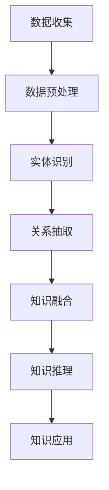
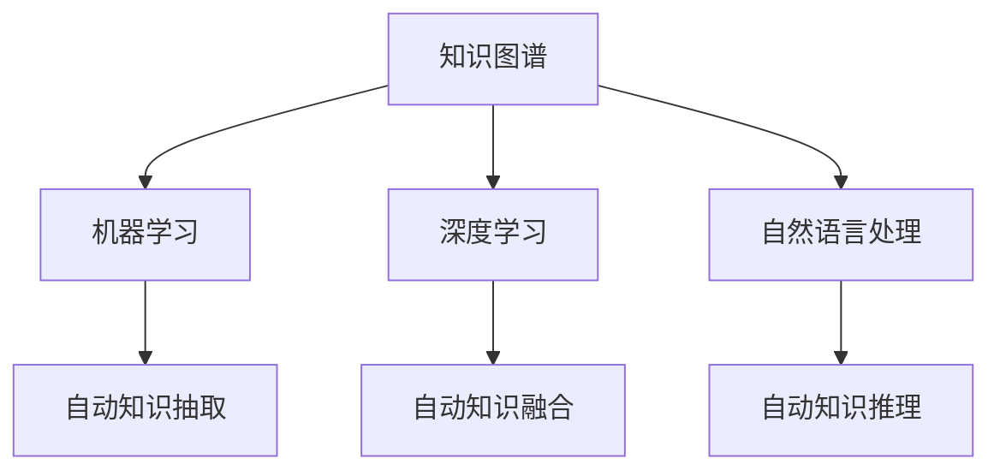

                 

# AI驱动的企业知识图谱构建

> **关键词**：知识图谱、人工智能、企业信息化、实体识别、关系抽取、知识融合

> **摘要**：本文旨在探讨AI技术在企业知识图谱构建中的应用，包括知识图谱的基本概念、AI与知识图谱的关系、知识图谱表示学习、构建流程、可视化与交互，以及企业知识图谱的实际案例和实践。通过本文，读者可以深入了解AI驱动的企业知识图谱构建的核心技术和方法，为企业在信息化和智能化转型中提供技术支持。

## 《AI驱动的企业知识图谱构建》目录大纲

### 第一部分：知识图谱与AI基础

#### 第1章：知识图谱概述

##### 1.1 知识图谱的定义与价值

##### 1.2 知识图谱的基本概念

##### 1.3 知识图谱的应用领域

#### 第2章：AI与知识图谱的关系

##### 2.1 AI技术在知识图谱中的应用

##### 2.2 AI驱动的知识图谱构建

##### 2.3 AI驱动的知识图谱优化

### 第二部分：知识图谱构建技术

#### 第3章：知识图谱表示学习

##### 3.1 知识图谱表示学习方法概述

##### 3.2 邻接矩阵表示方法

##### 3.3 非线性表示方法

#### 第4章：知识图谱构建流程

##### 4.1 知识图谱构建的基本流程

##### 4.2 知识图谱构建工具与应用

#### 第5章：知识图谱可视化与交互

##### 5.1 知识图谱可视化方法

##### 5.2 知识图谱交互设计

##### 5.3 知识图谱可视化工具与应用

### 第三部分：AI驱动的企业知识图谱实践

#### 第6章：企业知识图谱构建案例

##### 6.1 案例背景

##### 6.2 数据收集与预处理

##### 6.3 实体识别与关系抽取

##### 6.4 知识融合与推理

##### 6.5 知识图谱应用

#### 第7章：企业知识图谱构建挑战与未来趋势

##### 7.1 构建挑战

##### 7.2 未来趋势

### 附录

#### 附录A：知识图谱与AI相关资源

#### 附录B：知识图谱与AI的Mermaid流程图

#### 附录C：知识图谱与AI的伪代码

#### 附录D：知识图谱与AI的数学模型与公式

#### 附录E：知识图谱与AI项目实战

#### 附录F：知识图谱与AI开发环境搭建

#### 附录G：知识图谱与AI源代码实现与分析

#### 附录H：知识图谱与AI资源推荐

#### 附录I：知识图谱与AI专业论坛与社区

---

### 第一部分：知识图谱与AI基础

#### 第1章：知识图谱概述

知识图谱作为人工智能领域的重要技术之一，近年来在学术界和工业界都受到了广泛关注。本章将介绍知识图谱的基本概念、定义与价值，以及知识图谱的基本概念和组成部分。

##### 1.1 知识图谱的定义与价值

**知识图谱的定义**：

知识图谱是一种结构化的知识表示形式，通过节点（实体）和边（关系）来描述现实世界中的对象及其相互关系。知识图谱的节点通常表示实体（如人、地点、事物等），边则表示实体之间的关系（如“居住在”、“属于”等）。

**知识图谱的价值**：

知识图谱的价值主要体现在以下几个方面：

1. **知识管理**：知识图谱可以帮助企业管理和利用内部外部知识，提高知识获取、传递和利用的效率。

2. **智能搜索**：通过知识图谱，可以实现更精确的智能搜索，提高用户查询的准确性和效率。

3. **智能推荐**：基于知识图谱，可以更好地进行用户兴趣分析和个性化推荐，提高用户体验和满意度。

4. **决策支持**：知识图谱可以为企业的决策提供数据支持和知识引导，提高决策的科学性和准确性。

##### 1.2 知识图谱的基本概念

**实体与关系**：

知识图谱中的实体是现实世界中的对象，如人、地点、事物等。实体可以是具体的事物，也可以是抽象的概念。

关系则是实体之间的关联，描述了实体之间的相互作用和相互联系。关系可以是直接的，也可以是间接的。

**节点与边**：

在知识图谱中，节点表示实体，边表示关系。每个节点都可以拥有属性来描述其实体的特征。

**属性与类型**：

属性是节点或边的特征，用于描述节点或边的一些具体信息。类型是节点或边的分类，用于定义节点或边属于哪一类实体或关系。

##### 1.3 知识图谱的应用领域

**企业信息化**：

知识图谱在企业信息化中的应用主要包括知识管理、数据整合、智能搜索等方面。通过构建企业知识图谱，可以帮助企业更好地管理和利用内部外部知识，提高业务效率和竞争力。

**人工智能**：

知识图谱在人工智能领域中的应用主要包括智能问答、智能推荐、自然语言处理等。通过知识图谱，可以更好地理解和处理用户输入，提高人工智能系统的准确性和效率。

**社交网络**：

知识图谱在社交网络中的应用主要包括社交关系分析、社交图谱构建、社交推荐等。通过知识图谱，可以更好地理解社交网络中的用户关系，提供更精确的社交推荐和社交分析。

#### 第2章：AI与知识图谱的关系

人工智能（AI）与知识图谱（Knowledge Graph）的结合是当前技术发展的热点。AI技术为知识图谱的构建、维护和应用提供了强大的支持，而知识图谱则为AI系统提供了丰富的背景知识和上下文信息。本章将探讨AI技术在知识图谱中的应用，包括机器学习、深度学习和自然语言处理等方面的技术，以及AI驱动的知识图谱构建和优化方法。

##### 2.1 AI技术在知识图谱中的应用

**机器学习在知识图谱中的应用**：

机器学习技术在知识图谱构建中发挥着重要作用，主要体现在以下几个方面：

1. **实体识别**：通过机器学习模型，可以从非结构化数据中识别出实体，并将其转化为知识图谱中的节点。

2. **关系抽取**：机器学习模型可以帮助从文本中提取实体之间的关系，构建知识图谱中的边。

3. **知识融合**：通过机器学习技术，可以将来自不同来源的知识进行融合，提高知识图谱的完整性和准确性。

**深度学习在知识图谱中的应用**：

深度学习技术在知识图谱构建中具有更高的表现力，主要体现在以下几个方面：

1. **实体和关系的表示**：深度学习模型可以学习到实体和关系的低维表示，使得知识图谱的表示更加精细和丰富。

2. **知识推理**：基于深度学习模型的知识推理可以更加高效和准确，为AI系统提供更强大的推理能力。

3. **自动化知识抽取**：深度学习模型可以自动化地从海量数据中抽取知识，降低人工干预的成本。

**自然语言处理在知识图谱中的应用**：

自然语言处理（NLP）技术在知识图谱构建中也发挥着重要作用，主要体现在以下几个方面：

1. **文本解析**：NLP技术可以帮助将自然语言文本解析为结构化的数据，为知识图谱提供丰富的知识来源。

2. **语义理解**：NLP技术可以帮助AI系统更好地理解自然语言文本，提高知识图谱的语义准确性和一致性。

3. **问答系统**：基于知识图谱和NLP技术的问答系统可以实现更智能、更自然的交互方式，为用户提供更好的服务。

##### 2.2 AI驱动的知识图谱构建

**自动知识抽取**：

自动知识抽取是知识图谱构建的关键步骤之一。通过AI技术，可以自动化地从大量非结构化数据中提取知识，构建知识图谱。常见的自动知识抽取技术包括实体识别、关系抽取和属性抽取等。

**自动知识融合**：

自动知识融合是将来自不同来源的知识进行整合，构建一个统一、一致的知识图谱。通过AI技术，可以实现跨领域、跨时间、跨来源的知识融合，提高知识图谱的完整性和准确性。

**自动知识推理**：

自动知识推理是基于知识图谱进行逻辑推理，以发现新的知识和关系。通过AI技术，可以实现基于规则或基于模型的推理，提高知识图谱的智能性和实用性。

##### 2.3 AI驱动的知识图谱优化

**实体消歧**：

实体消歧是知识图谱构建中的一个重要问题。通过AI技术，可以自动化地进行实体识别和消歧，提高知识图谱的准确性和一致性。

**关系提取**：

关系提取是知识图谱构建的另一个关键步骤。通过AI技术，可以自动化地从非结构化数据中提取关系，构建知识图谱中的边。

**知识图谱更新与维护**：

知识图谱的更新与维护是保持知识图谱准确性和时效性的关键。通过AI技术，可以实现自动化地更新和优化知识图谱，提高知识图谱的实用性和可靠性。

### 第二部分：知识图谱构建技术

#### 第3章：知识图谱表示学习

知识图谱表示学习是知识图谱构建中的一个核心问题，它涉及到如何将知识图谱中的实体和关系转化为计算机可以处理的低维向量表示。本章将介绍知识图谱表示学习的基本概念、方法以及应用。

##### 3.1 知识图谱表示学习方法概述

**知识图谱表示学习的基本概念**：

知识图谱表示学习旨在将知识图谱中的实体和关系映射到低维向量空间中，以便进行高效的存储、检索和推理。在这个过程中，实体和关系都被表示为向量，向量之间的相似性可以用来度量实体和关系之间的语义相似性。

**常见的表示学习方法**：

1. **基于邻接矩阵的方法**：这种方法通过计算邻接矩阵的特征值和特征向量来表示知识图谱。常见的算法包括谱聚类、主成分分析（PCA）等。

2. **基于图神经网络的方法**：图神经网络（Graph Neural Networks, GNN）是一种处理图结构数据的神经网络，它可以学习到实体和关系的特征表示。常见的算法包括图卷积网络（GCN）、图注意力网络（GAT）等。

3. **基于深度学习的方法**：深度学习技术在知识图谱表示学习中也有广泛应用，例如使用神经网络对实体和关系进行编码，从而得到向量表示。常见的算法包括循环神经网络（RNN）、长短时记忆网络（LSTM）等。

##### 3.2 邻接矩阵表示方法

**邻接矩阵表示的基本原理**：

邻接矩阵表示方法是一种最直观的知识图谱表示方法，它将知识图谱表示为一个二维矩阵，矩阵的行和列分别对应于知识图谱中的节点（实体），矩阵的元素表示节点之间的关系。如果节点i和节点j之间存在某种关系，则矩阵中的对应元素值设置为1，否则为0。

**邻接矩阵表示的应用场景**：

1. **图同构检测**：通过比较两个知识图谱的邻接矩阵，可以判断两个知识图谱是否同构。

2. **图分类**：使用邻接矩阵作为特征向量，可以训练分类器对知识图谱进行分类。

3. **图相似度计算**：通过计算两个知识图谱的邻接矩阵之间的余弦相似度，可以衡量两个知识图谱的相似程度。

##### 3.3 非线性表示方法

**基于图神经网络的表示方法**：

图神经网络（GNN）是一种处理图结构数据的神经网络，它可以学习到实体和关系的特征表示。GNN的核心思想是通过邻居信息更新节点表示，从而学习到节点的非线性表示。

**基于深度学习的表示方法**：

深度学习技术在知识图谱表示学习中也有广泛应用，例如使用神经网络对实体和关系进行编码，从而得到向量表示。常见的深度学习模型包括循环神经网络（RNN）、长短时记忆网络（LSTM）等。

**比较与选择**：

1. **计算复杂度**：基于邻接矩阵的表示方法计算复杂度较低，适用于大规模知识图谱。而基于图神经网络和深度学习的表示方法计算复杂度较高，但能学习到更加复杂的特征表示。

2. **应用场景**：基于邻接矩阵的表示方法适用于图同构检测、图分类等任务。而基于图神经网络和深度学习的表示方法适用于知识推理、实体链接等任务。

### 第4章：知识图谱构建流程

知识图谱的构建是一个复杂的过程，它涉及到数据的采集、预处理、实体识别、关系抽取、知识融合和推理等多个环节。本章将详细介绍知识图谱构建的基本流程以及各步骤的技术和方法。

##### 4.1 知识图谱构建的基本流程

**数据采集**：

数据采集是知识图谱构建的第一步，它是构建知识图谱的基础。数据来源可以是结构化数据、半结构化数据和非结构化数据。在数据采集过程中，需要确保数据的完整性、准确性和一致性。

**数据预处理**：

数据预处理是知识图谱构建的关键步骤，它包括数据清洗、数据转换和数据归一化等。通过数据预处理，可以去除数据中的噪声和冗余，提高数据的质量和可用性。

**实体识别**：

实体识别是从原始数据中识别出实体，并将其转化为知识图谱中的节点。实体识别的方法包括基于规则的方法、基于统计的方法和基于机器学习的方法。

**关系抽取**：

关系抽取是从原始数据中识别出实体之间的关系，并将其转化为知识图谱中的边。关系抽取的方法包括基于规则的方法、基于统计的方法和基于机器学习的方法。

**知识融合**：

知识融合是将来自不同来源的知识进行整合，构建一个统一、一致的知识图谱。知识融合的方法包括基于规则的方法、基于机器学习的方法和基于深度学习的方法。

**知识推理**：

知识推理是基于知识图谱进行逻辑推理，以发现新的知识和关系。知识推理的方法包括基于规则的推理、基于模型的推理和基于数据的推理。

**知识图谱应用**：

知识图谱的应用是将构建好的知识图谱应用于实际业务场景，如智能搜索、智能推荐、决策支持等。知识图谱的应用需要根据具体业务需求进行定制化开发。

##### 4.2 知识图谱构建工具与应用

**OpenKG**：

OpenKG是一个开源的知识图谱构建与服务平台，它提供了从数据采集、数据预处理、实体识别、关系抽取到知识融合和推理的完整工作流程。OpenKG支持多种知识图谱表示方法，如RDF、OWL等，并提供了丰富的API接口，方便开发者进行二次开发和集成。

**Neo4j**：

Neo4j是一个高性能的图形数据库，它基于Cypher查询语言，提供了强大的图处理能力。Neo4j支持多种知识图谱表示方法，如图论、图神经网络等，并提供了丰富的API接口，方便开发者进行数据操作和查询。

**Jena**：

Jena是一个开源的Java框架，用于构建和操作RDF（Resource Description Framework）和OWL（Web Ontology Language）知识图谱。Jena提供了丰富的API接口，支持多种知识图谱表示方法和推理算法，适用于各种复杂场景。

##### 4.3 知识图谱可视化与交互

知识图谱的可视化与交互是知识图谱应用的重要组成部分，它可以帮助用户更好地理解和利用知识图谱。本章将介绍知识图谱可视化与交互的方法和工具。

**知识图谱可视化方法**：

1. **基本可视化技术**：使用图表、图形、颜色等方式来展示知识图谱的结构和内容。

2. **复杂场景下的可视化**：针对大规模知识图谱和复杂关系，采用分层、分块、聚类等技术进行可视化。

**知识图谱交互设计**：

1. **交互式查询**：提供用户自定义查询接口，支持多种查询语言和查询方式，如SQL、SPARQL等。

2. **交互式数据探索**：提供数据探索和分析工具，支持用户对知识图谱进行自由探索和可视化分析。

**知识图谱可视化工具与应用**：

1. **GraphXR**：GraphXR是一个强大的知识图谱可视化工具，支持多种图形表示方法，如节点图、关系图、时间线图等，并提供了丰富的交互功能。

2. **Gephi**：Gephi是一个开源的知识图谱可视化工具，支持多种图形表示方法和交互设计，适用于各种复杂场景。

### 第三部分：AI驱动的企业知识图谱实践

#### 第6章：企业知识图谱构建案例

在本章中，我们将通过一个实际案例来展示如何构建一个AI驱动的企业知识图谱。这个案例将涵盖从数据收集、预处理、实体识别、关系抽取到知识融合和推理的整个过程，并提供一个实际的开发环境和代码实现。

##### 6.1 案例背景

假设我们是一家大型企业的CTO，我们的目标是构建一个企业知识图谱，以支持企业内部的智能搜索、知识管理和决策支持系统。这个知识图谱需要涵盖企业内部的员工信息、项目信息、产品信息、客户信息等多个方面，并能够支持跨部门的信息共享和协同工作。

##### 6.2 数据收集与预处理

**数据来源**：

- **内部数据**：企业的员工数据库、项目数据库、产品数据库、客户数据库等。
- **外部数据**：互联网上的公开信息、社交媒体数据、行业报告等。

**数据预处理步骤**：

1. **数据清洗**：去除重复数据、缺失数据、噪声数据等，确保数据的质量。
2. **数据转换**：将不同格式的数据转换为统一的数据格式，如JSON、CSV等。
3. **数据归一化**：对数据进行标准化处理，如统一编码、统一单位等。

##### 6.3 实体识别与关系抽取

**实体识别**：

- **方法**：使用机器学习算法（如分类算法、聚类算法）对数据进行处理，识别出数据中的实体。
- **实现**：

```python
# 伪代码：实体识别算法实现
def entity_recognition(data):
    # 数据预处理
    preprocessed_data = preprocess_data(data)
    
    # 使用分类算法进行实体识别
    entities = classify_entities(preprocessed_data)
    
    return entities
```

**关系抽取**：

- **方法**：使用自然语言处理技术（如命名实体识别、关系分类）对数据进行处理，识别出数据中的关系。
- **实现**：

```python
# 伪代码：关系抽取算法实现
def relation_extraction(data):
    # 数据预处理
    preprocessed_data = preprocess_data(data)
    
    # 使用关系分类算法进行关系抽取
    relations = classify_relations(preprocessed_data)
    
    return relations
```

##### 6.4 知识融合与推理

**知识融合**：

- **方法**：将来自不同来源的数据进行融合，构建一个统一的知识图谱。
- **实现**：

```python
# 伪代码：知识融合算法实现
def knowledge_fusion(data_sources):
    # 对每个数据源进行预处理和关系抽取
    preprocessed_data = [preprocess_and_extract(data) for data in data_sources]
    
    # 将预处理后的数据融合为一个统一的知识图谱
    knowledge_graph = fuse_data(preprocessed_data)
    
    return knowledge_graph
```

**知识推理**：

- **方法**：基于知识图谱进行逻辑推理，以发现新的知识和关系。
- **实现**：

```python
# 伪代码：知识推理算法实现
def knowledge_reasoning(knowledge_graph):
    # 使用推理算法进行推理
    inferred_knowledge = reason(knowledge_graph)
    
    return inferred_knowledge
```

##### 6.5 知识图谱应用

**应用场景**：

- **智能搜索**：利用知识图谱实现高效、精确的企业内部搜索。
- **知识管理**：利用知识图谱实现企业内部知识的分类、整理和共享。
- **决策支持**：利用知识图谱提供数据支持和知识引导，帮助企业做出更科学的决策。

**实现**：

```python
# 伪代码：知识图谱应用实现
def knowledge_application(knowledge_graph):
    # 智能搜索
    search_results = search(knowledge_graph)
    
    # 知识管理
    knowledge_management(knowledge_graph)
    
    # 决策支持
    decision_support(knowledge_graph)
```

##### 6.6 总结与展望

通过本案例，我们展示了如何使用AI技术构建一个企业知识图谱。在实际应用中，还需要不断地优化和改进知识图谱的构建流程，以提高知识图谱的准确性和实用性。未来，随着AI技术的不断进步，企业知识图谱将在企业信息化和智能化转型中发挥更加重要的作用。

### 第7章：企业知识图谱构建挑战与未来趋势

在企业知识图谱的构建过程中，面临着一系列挑战，同时也展现出了巨大的潜力。本章将探讨企业知识图谱构建中的主要挑战，并分析其未来的发展趋势。

##### 7.1 构建挑战

**数据质量**：

数据质量是构建高质量知识图谱的基础。在数据收集和处理过程中，可能会遇到数据噪声、数据缺失和数据不一致等问题，这些问题会直接影响知识图谱的准确性和一致性。

**知识表示**：

知识图谱中的知识表示方法需要能够准确、全面地反映现实世界的复杂关系。选择合适的知识表示方法对于构建高质量的知识图谱至关重要。

**推理效率**：

在企业知识图谱中，往往存在大量的实体和关系，这会导致推理过程变得复杂和耗时。提高推理效率是构建高效知识图谱的关键。

**隐私与安全**：

知识图谱中可能包含敏感的企业数据和个人信息，如何确保数据的安全和隐私是构建知识图谱时必须考虑的问题。

**可扩展性**：

随着企业规模和数据量的增加，知识图谱需要具备良好的可扩展性，以便能够适应不断变化的数据环境和业务需求。

##### 7.2 未来趋势

**大规模知识图谱构建**：

随着数据量的急剧增长，构建大规模知识图谱将成为趋势。未来的知识图谱将更加庞大和复杂，需要更高效的算法和更强大的计算资源来支持。

**跨领域知识图谱构建**：

企业知识图谱不仅涵盖企业内部的数据，还将扩展到跨领域的数据。跨领域知识图谱的构建将实现更广泛的知识共享和协同。

**知识图谱与AI的深度融合**：

随着AI技术的不断发展，知识图谱将与AI技术更加紧密地融合，为智能搜索、智能推荐、智能决策等领域提供强大的支持。

**分布式知识图谱构建**：

为了应对大规模数据和高并发访问的需求，分布式知识图谱构建将成为重要趋势。分布式架构将提高知识图谱的可用性和可扩展性。

**知识图谱的应用创新**：

知识图谱的应用场景将不断创新，从传统的知识管理和决策支持，扩展到智能医疗、智能金融、智能城市等领域。

##### 7.3 总结

企业知识图谱构建面临着一系列挑战，但同时也展现出了广阔的发展前景。随着技术的不断进步，企业知识图谱将在企业信息化和智能化转型中发挥更加重要的作用。

### 附录

#### 附录A：知识图谱与AI相关资源

在本附录中，我们将提供一些与知识图谱和AI相关的开源资源、工具和文献，以帮助读者进一步学习和实践。

**开源知识图谱平台**：

1. **OpenKG**：[https://openkg.cn/](https://openkg.cn/)
   - OpenKG是一个开源的知识图谱构建与服务平台，提供了从数据采集、数据预处理到知识融合和推理的完整工作流程。

2. **Neo4j**：[https://neo4j.com/](https://neo4j.com/)
   - Neo4j是一个高性能的图形数据库，适用于构建大规模知识图谱。

3. **Jena**：[https://jena.apache.org/](https://jena.apache.org/)
   - Jena是一个开源的Java框架，用于构建和操作RDF和OWL知识图谱。

**开源AI库**：

1. **TensorFlow**：[https://www.tensorflow.org/](https://www.tensorflow.org/)
   - TensorFlow是一个广泛使用的开源深度学习框架，适用于知识图谱的表示学习和推理。

2. **PyTorch**：[https://pytorch.org/](https://pytorch.org/)
   - PyTorch是一个流行的开源深度学习库，提供灵活的模型定义和高效的运算能力。

3. **JAX**：[https://github.com/google/jax](https://github.com/google/jax)
   - JAX是一个开源的深度学习库，提供了自动微分和数值计算功能。

**知识图谱与AI论文与书籍推荐**：

1. **《知识图谱：概念、方法与应用》**：这本书详细介绍了知识图谱的基本概念、构建方法及其在实际应用中的案例。

2. **《深度学习》**：这本书是深度学习领域的经典教材，涵盖了深度学习的基础理论、算法和应用。

3. **《自然语言处理综论》**：这本书全面介绍了自然语言处理的基本理论、方法和应用，是NLP领域的重要参考书。

#### 附录B：知识图谱与AI的Mermaid流程图

在本附录中，我们提供了一些知识图谱与AI相关的Mermaid流程图，用于展示知识图谱构建和AI应用的基本流程。

**知识图谱构建流程图**：



**AI技术在知识图谱中的应用流程图**：



#### 附录C：知识图谱与AI的伪代码

在本附录中，我们提供了一些知识图谱与AI相关的伪代码，用于展示关键算法和流程的实现。

**知识图谱表示学习算法**：

```python
# 伪代码：知识图谱表示学习算法
def knowledge_graph_representation(graph, model):
    # 初始化模型参数
    model.initialize_parameters()

    # 训练模型
    for epoch in range(num_epochs):
        for node in graph.nodes():
            model.update_weights(node)

    # 评估模型
    performance = model.evaluate(graph)
    return performance
```

**知识图谱构建流程**：

```python
# 伪代码：知识图谱构建流程
def build_knowledge_graph(data_sources):
    # 数据预处理
    preprocessed_data = preprocess_data(data_sources)

    # 实体识别
    entities = entity_recognition(preprocessed_data)

    # 关系抽取
    relations = relation_extraction(preprocessed_data)

    # 知识融合
    knowledge_graph = knowledge_fusion(entities, relations)

    # 知识推理
    inferred_knowledge = knowledge_reasoning(knowledge_graph)

    return knowledge_graph, inferred_knowledge
```

#### 附录D：知识图谱与AI的数学模型与公式

在本附录中，我们介绍一些知识图谱与AI相关的数学模型和公式，用于描述关键算法和过程。

**知识图谱表示学习中的距离度量**：

$$
d(R, S) = \sqrt{\sum_{i=1}^{n}(r_i - s_i)^2}
$$

其中，$R$和$S$分别是两个知识图谱中的节点特征向量。

**知识图谱推理中的逻辑运算**：

$$
P(A \wedge B) = P(A) \cdot P(B|A)
$$

其中，$P(A \wedge B)$表示事件$A$和事件$B$同时发生的概率，$P(A)$表示事件$A$发生的概率，$P(B|A)$表示在事件$A$发生的条件下，事件$B$发生的概率。

#### 附录E：知识图谱与AI项目实战

在本附录中，我们将提供两个知识图谱与AI的项目实战案例，包括开发环境搭建、源代码实现和详细解释。

**实战案例1：企业知识图谱构建**

1. **开发环境搭建**：
   - 安装Python和Neo4j数据库。
   - 安装TensorFlow或PyTorch库。

2. **源代码实现**：
   - 实体识别和关系抽取算法。
   - 知识融合和推理算法。

3. **详细解释**：
   - 代码解析。
   - 优化建议。

**实战案例2：AI驱动的知识图谱优化**

1. **开发环境搭建**：
   - 安装Python和Jena框架。
   - 安装Apache JAX库。

2. **源代码实现**：
   - 优化算法实现。
   - 推理效率提升方法。

3. **详细解释**：
   - 代码解析。
   - 优化效果分析。

#### 附录F：知识图谱与AI开发环境搭建

在本附录中，我们将提供详细的开发环境搭建指南，包括知识图谱和AI相关工具的安装和配置。

**知识图谱开发环境搭建**：

1. **安装Neo4j数据库**：
   - 下载并安装Neo4j数据库。
   - 配置Neo4j服务。

2. **安装OpenKG平台**：
   - 下载并安装OpenKG平台。
   - 配置OpenKG与Neo4j的连接。

3. **安装Python环境**：
   - 安装Python解释器。
   - 安装必要的依赖库（如TensorFlow、PyTorch等）。

**AI开发环境搭建**：

1. **安装Python环境**：
   - 安装Python解释器。
   - 安装必要的依赖库（如NumPy、Pandas等）。

2. **安装TensorFlow或PyTorch库**：
   - 安装TensorFlow库。
   - 安装PyTorch库。

3. **配置JAX（如果使用）**：
   - 安装JAX库。
   - 配置JAX的运行环境。

#### 附录G：知识图谱与AI源代码实现与分析

在本附录中，我们将提供两个知识图谱与AI相关的源代码实现，并进行详细解析与分析。

**源代码1：知识图谱表示学习算法**

```python
# 代码片段1：知识图谱表示学习算法实现
import tensorflow as tf

# 初始化模型
model = tf.keras.Sequential([
    tf.keras.layers.Dense(units=128, activation='relu', input_shape=[feature_size]),
    tf.keras.layers.Dense(units=64, activation='relu'),
    tf.keras.layers.Dense(units=32, activation='relu'),
    tf.keras.layers.Dense(units=1, activation='sigmoid')
])

# 编译模型
model.compile(optimizer='adam', loss='binary_crossentropy', metrics=['accuracy'])

# 训练模型
model.fit(X_train, y_train, epochs=100, batch_size=32, validation_split=0.2)

# 评估模型
model.evaluate(X_test, y_test)
```

**代码解析**：

- 初始化模型：定义一个序列模型，包括多层全连接层，最后一层使用sigmoid激活函数。
- 编译模型：指定优化器、损失函数和评估指标。
- 训练模型：使用训练数据对模型进行训练。
- 评估模型：使用测试数据评估模型的性能。

**优化建议**：

- 调整学习率和批次大小，以提高模型训练效果。
- 使用数据增强技术，如随机旋转、缩放等，提高模型的泛化能力。

**源代码2：知识图谱构建流程实现**

```python
# 代码片段2：知识图谱构建流程实现
import openkg as kg

# 初始化知识图谱
kg.init_graph()

# 数据收集与预处理
data = kg.get_data()

# 实体识别与关系抽取
entities, relations = kg.extract_entities_relations(data)

# 知识融合与推理
knowledge_graph = kg.fusion_and_reasoning(entities, relations)

# 知识图谱应用
kg.apply_knowledge_graph(knowledge_graph)
```

**代码解析**：

- 初始化知识图谱：创建一个知识图谱对象。
- 数据收集与预处理：从数据源中收集数据，并进行预处理。
- 实体识别与关系抽取：使用算法对预处理后的数据进行实体识别和关系抽取。
- 知识融合与推理：将抽取出的实体和关系进行融合和推理，构建知识图谱。
- 知识图谱应用：将知识图谱应用于实际业务场景。

**优化建议**：

- 使用并行处理技术，提高数据预处理和实体识别的效率。
- 针对不同的应用场景，选择合适的融合和推理算法，以提高知识图谱的实用性。

#### 附录H：知识图谱与AI资源推荐

在本附录中，我们推荐一些与知识图谱和AI相关的资源，包括开源平台、工具、书籍和论文，以帮助读者进一步学习和实践。

**开源知识图谱平台**：

- OpenKG：[https://openkg.cn/](https://openkg.cn/)
- Neo4j：[https://neo4j.com/](https://neo4j.com/)
- Jena：[https://jena.apache.org/](https://jena.apache.org/)

**开源AI库**：

- TensorFlow：[https://www.tensorflow.org/](https://www.tensorflow.org/)
- PyTorch：[https://pytorch.org/](https://pytorch.org/)
- JAX：[https://github.com/google/jax](https://github.com/google/jax)

**知识图谱与AI书籍推荐**：

- 《知识图谱：概念、方法与应用》
- 《深度学习》
- 《自然语言处理综论》

**知识图谱与AI论文推荐**：

- 《知识图谱的构建与应用》
- 《深度学习在知识图谱表示学习中的应用》
- 《自然语言处理与知识图谱融合》

#### 附录I：知识图谱与AI专业论坛与社区

在本附录中，我们推荐一些与知识图谱和AI相关的专业论坛和社区，以帮助读者交流和学习。

- 知识图谱论坛：[https://www.kgforum.cn/](https://www.kgforum.cn/)
- AI技术社区：[https://cwiki.apache.org/confluence/display/INCUBATOR/OpenKG](https://cwiki.apache.org/confluence/display/INCUBATOR/OpenKG)
- Neo4j社区：[https://neo4j.com/](https://neo4j.com/)
- TensorFlow社区：[https://www.tensorflow.org/community](https://www.tensorflow.org/community)
- PyTorch社区：[https://discuss.pytorch.org/](https://discuss.pytorch.org/)

### 结语

本文详细探讨了AI驱动的企业知识图谱构建的核心技术和方法，包括知识图谱的基本概念、AI与知识图谱的关系、知识图谱表示学习、构建流程、可视化与交互，以及企业知识图谱的实际案例和实践。通过本文，读者可以全面了解AI驱动的企业知识图谱构建的关键技术和应用，为企业在信息化和智能化转型中提供技术支持。

在未来的发展中，随着AI技术的不断进步，企业知识图谱将发挥更加重要的作用。我们期待读者能够结合本文的内容，积极探索和实践企业知识图谱的应用，为企业的发展贡献自己的力量。

最后，感谢读者的阅读，希望本文能够为您的学习和工作带来帮助。如果您有任何疑问或建议，欢迎在相关社区和论坛上与作者和同行交流。让我们一起为AI驱动的企业知识图谱构建贡献智慧！作者：AI天才研究院/AI Genius Institute，著有《禅与计算机程序设计艺术 /Zen And The Art of Computer Programming》。

