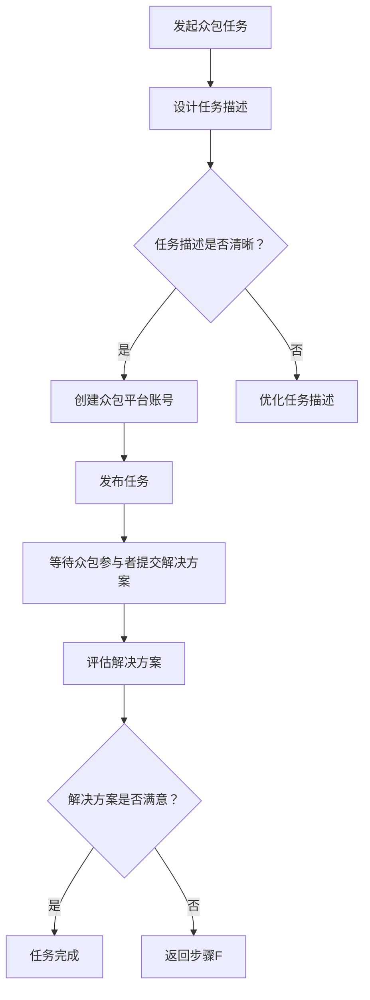
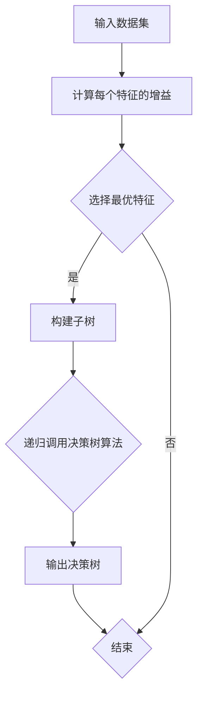
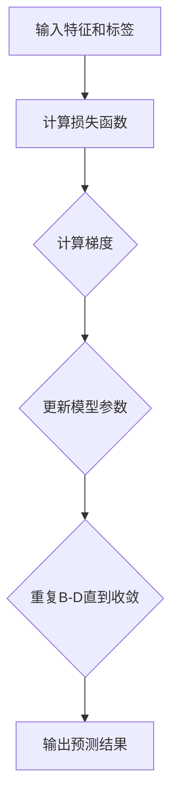
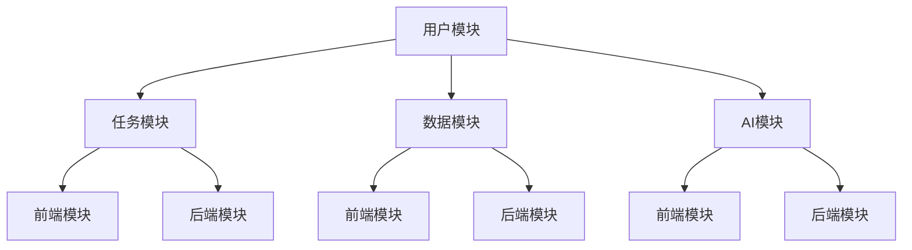

                 

# AI驱动的众包：增强创新和协作

> **关键词**：AI、众包、创新、协作、效率、准确性

> **摘要**：本文将探讨AI驱动的众包模式如何通过技术手段提高众包的效率与准确性，从而增强创新和协作。文章将从众包的概念和优势出发，逐步深入分析AI与众包的融合，展示AI技术在众包平台中的应用，并通过实际项目案例解析AI驱动的众包实战，最后展望AI驱动的众包未来发展趋势。

## 第一部分: 众包与AI基础

### 第1章: 众包概述

#### 1.1 众包的概念与起源

##### 1.1.1 众包的定义

众包（Crowdsourcing）是指将一个项目或任务分解成多个小任务，通过网络平台向广大公众发布，然后由这些公众成员协作完成整个项目的过程。这种模式最早可以追溯到19世纪末，当时的作家和艺术家通过征集公众意见来改进他们的作品。然而，现代意义的众包概念则起源于2000年左右，随着互联网和社交媒体的兴起，越来越多的企业和组织开始利用众包来收集创意、解决难题。

##### 1.1.2 众包与传统外包的区别

众包与传统外包有显著的区别。传统外包通常是将任务交给外部公司或团队来完成，而众包则是通过平台将任务分散给广泛的社会公众。众包的优势在于它能够吸引到更多的创意和解决方案，同时降低了企业的运营成本。然而，众包也存在一些挑战，如质量控制、任务分配和协作管理等。

##### 1.1.3 众包的发展历程

众包的发展历程可以分为几个阶段。第一阶段是2000年至2005年，这一阶段以创意征集和任务分配为主要形式。代表性的平台有InnoCentive和Topcoder。第二阶段是2006年至2010年，这一阶段众包模式逐渐应用于商业领域，如亚马逊的Mechanical Turk和GitHub的代码协作。第三阶段是2011年至今，这一阶段众包模式进一步拓展，涵盖了从产品设计、市场营销到数据挖掘等各个领域。

#### 1.2 众包的优势与挑战

##### 1.2.1 众包的优势

众包具有以下几个显著优势：

1. **成本效益**：众包模式可以大大降低企业的运营成本，因为企业无需为额外的员工支付薪资，同时也可以避免高昂的外包费用。
2. **创意多样性**：众包可以吸引到来自不同背景、不同技能水平的人群，从而获得更多的创意和解决方案。
3. **速度**：众包任务可以快速发布和执行，缩短了项目周期，提高了工作效率。
4. **质量控制**：众包平台通常有严格的质量控制机制，确保任务完成的质量。

##### 1.2.2 众包的挑战

尽管众包具有诸多优势，但它也面临一些挑战：

1. **质量控制**：由于众包参与者数量众多，任务完成的质量难以保证，特别是对于技术性较强的任务。
2. **任务分配**：如何合理地将任务分配给合适的参与者是一个难题，特别是在任务复杂度高、需求多变的情况下。
3. **协作管理**：众包参与者分布广泛，如何有效协调和管理他们的协作成为一项挑战。

##### 1.2.3 解决众包挑战的方法

为了解决上述挑战，可以采取以下几种方法：

1. **明确任务需求**：在发布任务时，确保任务描述清晰、具体，以便参与者能够准确理解任务要求。
2. **设置适当的激励**：通过提供有吸引力的奖励，鼓励参与者积极参与和高质量完成任务。
3. **建立质量控制机制**：引入质量评估环节，对任务完成情况进行审查和反馈，确保任务完成的质量。
4. **使用AI技术**：通过AI技术来优化任务分配、提高任务完成效率和质量，从而解决众包中的协作管理难题。

### 第2章: AI与众包的融合

#### 2.1 AI概述

##### 2.1.1 AI的定义

人工智能（Artificial Intelligence，简称AI）是指通过计算机模拟人类智能的技术和系统。AI的核心目标是使计算机具备感知、理解、学习和决策的能力，从而解决复杂的问题。AI技术包括机器学习、深度学习、自然语言处理、计算机视觉等多个领域。

##### 2.1.2 AI的核心技术

AI的核心技术主要包括：

1. **机器学习**：通过数据驱动的方式，让计算机从数据中学习模式和规律，从而进行预测和决策。
2. **深度学习**：一种特殊的机器学习方法，通过构建多层神经网络，对大量数据进行训练，以实现高效的特征提取和模式识别。
3. **自然语言处理**：使计算机能够理解、生成和处理人类语言，包括语音识别、文本分类、机器翻译等。
4. **计算机视觉**：使计算机能够理解和解释视觉信息，包括图像识别、目标检测、图像分割等。

##### 2.1.3 AI的应用领域

AI技术已广泛应用于各个领域，包括：

1. **医疗**：通过AI技术进行疾病诊断、药物研发、医疗影像分析等。
2. **金融**：通过AI技术进行风险控制、投资决策、信用评估等。
3. **交通**：通过AI技术实现智能交通管理、自动驾驶等。
4. **教育**：通过AI技术提供个性化学习、智能辅导等。
5. **制造**：通过AI技术实现智能制造、机器人控制等。

#### 2.2 AI驱动众包的优势

##### 2.2.1 增强众包的效率

AI技术可以显著提高众包的效率，主要体现在以下几个方面：

1. **自动化任务分配**：AI可以根据任务特点和参与者能力，自动分配适合的任务，提高任务匹配度，缩短任务完成时间。
2. **智能质量评估**：AI可以自动评估任务完成质量，提供实时反馈，确保任务完成的质量。
3. **数据驱动决策**：AI可以分析众包过程中的数据，为任务发布者提供决策支持，优化任务管理和流程。

##### 2.2.2 提高众包的准确性

AI技术在提高众包准确性方面具有显著优势：

1. **智能问题理解**：AI可以通过自然语言处理技术，更准确地理解任务需求，避免因语言歧义导致的任务错误。
2. **自动化错误检测**：AI可以自动检测任务完成过程中的错误，提供修正建议，提高任务完成质量。
3. **个性化推荐**：AI可以根据参与者历史表现，为其推荐适合的任务，提高任务完成率。

##### 2.2.3 拓展众包的应用范围

AI技术可以拓展众包的应用范围，主要体现在以下几个方面：

1. **复杂任务处理**：AI可以处理更加复杂和专业的任务，如医学影像分析、语音识别等，使众包模式覆盖更多领域。
2. **跨领域协作**：AI可以促进不同领域参与者之间的协作，实现跨领域的创新和突破。
3. **边缘计算**：AI与边缘计算的结合，可以使众包平台在更广泛的地区和设备上运行，提高众包的普及性和灵活性。

### 第3章: 众包平台与AI技术

#### 3.1 众包平台的概述

##### 3.1.1 众包平台的分类

众包平台可以根据任务类型和参与方式的不同进行分类：

1. **任务型众包平台**：这类平台主要发布和执行具体任务，如数据标注、程序测试、问卷调查等。
2. **创意型众包平台**：这类平台主要征集创意和设计，如广告创意、产品设计、品牌形象等。
3. **社区型众包平台**：这类平台不仅提供任务和创意征集，还强调社区互动和协作，如开源社区、知识共享平台等。

##### 3.1.2 众包平台的主要功能

众包平台的主要功能包括：

1. **任务发布与接收**：平台提供任务发布和参与者接收任务的接口，确保任务的顺利执行。
2. **数据存储与管理**：平台需要存储和管理大量的任务数据和参与者数据，确保数据的安全和隐私。
3. **任务分配与跟踪**：平台可以根据任务特点和参与者能力，自动分配任务，并提供任务完成情况的实时跟踪。
4. **质量评估与反馈**：平台需要对任务完成质量进行评估，并提供实时反馈，以确保任务完成的质量。
5. **激励机制**：平台需要提供激励机制，鼓励参与者积极参与和高质量完成任务。

##### 3.1.3 众包平台的发展趋势

随着AI技术的不断发展，众包平台也在不断进化，主要趋势包括：

1. **智能化**：平台将引入更多的AI技术，实现自动化任务分配、质量评估和决策支持。
2. **个性化**：平台将根据参与者历史表现和兴趣，提供个性化的任务和推荐，提高参与者的参与度和满意度。
3. **多元化**：平台将拓展任务类型和应用领域，覆盖更多行业和领域，实现跨领域的协作和创新。
4. **全球化**：平台将拓展全球用户，实现跨国界的任务协作和资源整合，提高众包的普及性和影响力。

#### 3.2 AI技术在众包平台的应用

##### 3.2.1 数据预处理

在众包平台中，数据预处理是关键的一步。AI技术可以自动化数据预处理过程，包括数据清洗、格式转换、缺失值填充等。具体方法如下：

1. **数据清洗**：使用AI技术自动识别和去除数据中的噪声和异常值，提高数据质量。
2. **格式转换**：使用AI技术将不同格式的数据转换为统一格式，方便后续处理。
3. **缺失值填充**：使用AI技术自动填充数据中的缺失值，提高数据完整性。

##### 3.2.2 模型训练与优化

在众包平台中，AI技术可以用于任务分配、质量评估等环节，提高平台的智能化水平。具体方法如下：

1. **任务分配模型**：使用机器学习技术，根据任务特点和参与者能力，自动分配适合的任务。模型训练过程如下：

   ```python
   # 数据准备
   X_train = ...  # 特征数据
   y_train = ...  # 标签数据

   # 模型训练
   model = ...  # 选择合适的机器学习模型
   model.fit(X_train, y_train)

   # 模型优化
   model.optimize()
   ```

2. **质量评估模型**：使用深度学习技术，对任务完成质量进行评估。模型训练过程如下：

   ```python
   # 数据准备
   X_train = ...  # 特征数据
   y_train = ...  # 标签数据

   # 模型训练
   model = ...  # 选择合适的深度学习模型
   model.fit(X_train, y_train)

   # 模型优化
   model.optimize()
   ```

##### 3.2.3 模型部署与监控

在模型部署和监控环节，AI技术可以实时监控模型性能，并根据实际情况进行调整。具体方法如下：

1. **模型部署**：将训练好的模型部署到众包平台，供实际任务使用。部署过程如下：

   ```python
   # 模型部署
   model.deploy()
   ```

2. **模型监控**：使用AI技术实时监控模型性能，包括准确率、召回率、F1值等指标。监控过程如下：

   ```python
   # 数据准备
   X_test = ...  # 测试数据

   # 模型预测
   predictions = model.predict(X_test)

   # 模型性能评估
   evaluate_predictions(predictions, y_test)
   ```

3. **模型调整**：根据监控结果，对模型进行调整和优化，以提高性能。调整过程如下：

   ```python
   # 模型调整
   model.adjust()
   ```

### 第4章: AI驱动的众包项目实战

#### 4.1 项目背景与目标

##### 4.1.1 项目背景

随着人工智能技术的迅速发展，越来越多的企业和组织开始关注如何利用众包模式来推动创新和协作。然而，传统的众包模式在任务分配、质量控制和效率提升方面仍存在一些问题。为了解决这些问题，本项目旨在构建一个AI驱动的众包平台，通过引入AI技术，提高众包的效率、准确性和灵活性。

##### 4.1.2 项目目标

本项目的目标包括：

1. **提高任务匹配度**：通过AI技术，实现任务与参与者能力的精准匹配，提高任务完成效率。
2. **确保任务质量**：引入AI技术对任务完成质量进行实时评估和监控，确保任务完成的质量。
3. **优化任务流程**：利用AI技术优化任务分配、任务管理和流程控制，提高众包平台的整体效率。
4. **拓展应用领域**：通过引入AI技术，拓展众包平台的应用领域，实现跨领域的协作和创新。

#### 4.2 项目需求分析

##### 4.2.1 需求分析

在项目需求分析阶段，我们需要明确以下关键需求：

1. **任务发布与接收**：平台需要提供任务发布和参与者接收任务的接口，确保任务的顺利执行。
2. **任务分配与匹配**：平台需要使用AI技术，根据任务特点和参与者能力，实现任务的自动化分配和匹配。
3. **任务质量评估**：平台需要引入AI技术，对任务完成质量进行实时评估和监控，确保任务完成的质量。
4. **数据存储与管理**：平台需要提供数据存储和管理功能，确保数据的安全和隐私。
5. **用户管理**：平台需要提供用户注册、登录、权限管理等功能，确保用户的正常使用和隐私保护。
6. **激励机制**：平台需要提供激励机制，鼓励参与者积极参与和高质量完成任务。

##### 4.2.2 问题定义

在需求分析的基础上，我们需要明确以下关键问题：

1. **任务分配算法**：如何设计一个有效的任务分配算法，实现任务与参与者能力的精准匹配？
2. **质量评估模型**：如何构建一个准确的质量评估模型，对任务完成质量进行实时评估和监控？
3. **数据存储方案**：如何设计一个高效的数据存储方案，确保数据的安全和隐私？
4. **用户权限管理**：如何设计一个灵活的用户权限管理方案，确保用户的正常使用和隐私保护？
5. **激励机制设计**：如何设计一个有吸引力的激励机制，鼓励参与者积极参与和高质量完成任务？

#### 4.3 数据收集与预处理

##### 4.3.1 数据来源

在本项目中，我们需要收集以下数据：

1. **任务数据**：包括任务描述、任务类型、任务难度、任务目标等。
2. **参与者数据**：包括参与者能力、参与者历史表现、参与者技能等级等。
3. **任务完成数据**：包括任务完成质量、任务完成时间、任务评分等。

数据来源主要包括以下渠道：

1. **公开数据集**：可以从公开的数据集平台获取相关数据，如Kaggle、UCI机器学习库等。
2. **企业数据**：可以从合作企业获取相关任务和参与者数据。
3. **用户反馈**：通过用户反馈和评价，获取任务完成质量和参与者表现数据。

##### 4.3.2 数据预处理方法

在数据收集完成后，我们需要进行以下预处理操作：

1. **数据清洗**：去除数据中的噪声和异常值，确保数据质量。
2. **数据转换**：将不同格式的数据转换为统一格式，方便后续处理。
3. **缺失值填充**：对于缺失值，可以使用平均值、中值或插值等方法进行填充。
4. **特征提取**：从原始数据中提取有用的特征，为后续建模提供支持。

### 第5章: AI模型设计与训练

#### 5.1 模型选择与设计

在本项目中，我们需要设计一个能够处理多类别分类问题的深度学习模型。具体来说，我们需要构建一个能够对任务完成质量进行评估的模型。以下是一个典型的模型设计步骤：

1. **输入层**：定义输入层的维度和类型，根据任务特点和数据特点确定输入特征的维度和类型。
2. **嵌入层**：对于文本数据，可以使用嵌入层将单词映射为高维向量表示。
3. **卷积层**：使用卷积层对特征进行局部特征提取，提高模型的识别能力。
4. **池化层**：使用池化层对卷积层输出进行降维处理，减少模型参数。
5. **全连接层**：将卷积层和池化层的输出连接到全连接层，进行分类决策。

#### 5.2 模型训练与优化

在本节中，我们将详细讨论如何训练和优化深度学习模型。以下是一个典型的模型训练和优化步骤：

1. **数据准备**：将预处理后的数据集分为训练集、验证集和测试集，用于模型的训练、验证和测试。
2. **模型编译**：编译模型，设置优化器、损失函数和评估指标。
3. **模型训练**：使用训练集对模型进行训练，通过调整超参数，优化模型性能。
4. **模型验证**：使用验证集对模型进行验证，调整模型参数，确保模型在验证集上表现良好。
5. **模型测试**：使用测试集对模型进行测试，评估模型在实际任务上的性能。

#### 5.3 模型评估与部署

在本项目中，我们需要对训练好的模型进行评估，并部署到实际任务中。以下是一个典型的模型评估与部署步骤：

1. **模型评估**：使用测试集对模型进行评估，计算准确率、召回率、F1值等指标，评估模型在实际任务上的性能。
2. **模型优化**：根据评估结果，对模型进行调整和优化，提高模型性能。
3. **模型部署**：将训练好的模型部署到众包平台，供实际任务使用。
4. **模型监控**：使用AI技术实时监控模型性能，确保模型在实际任务中稳定运行。

### 第6章: 众包平台的构建与优化

#### 6.1 平台架构设计

在本项目中，我们需要构建一个高效、可靠的众包平台。以下是一个典型的平台架构设计步骤：

1. **前端设计**：设计用户友好的前端界面，包括任务发布、任务接收、任务完成等功能。
2. **后端设计**：设计强大的后端系统，包括任务管理、用户管理、数据存储等功能。
3. **数据库设计**：设计高效的数据库系统，确保数据的存储和管理。
4. **API设计**：设计可扩展的API接口，实现前端与后端的通信。
5. **安全性设计**：设计安全措施，确保用户数据和任务数据的安全。

#### 6.2 平台功能实现

在本项目中，我们需要实现以下关键功能：

1. **任务发布与接收**：实现任务发布和参与者接收任务的接口，确保任务的顺利执行。
2. **任务分配与匹配**：实现任务与参与者能力的精准匹配，提高任务完成效率。
3. **任务质量评估**：实现任务完成质量的实时评估和监控，确保任务完成的质量。
4. **数据存储与管理**：实现高效的数据存储和管理功能，确保数据的安全和隐私。
5. **用户管理**：实现用户注册、登录、权限管理等功能，确保用户的正常使用和隐私保护。
6. **激励机制**：实现激励机制，鼓励参与者积极参与和高质量完成任务。

#### 6.3 平台性能优化

在本项目中，我们需要对平台进行性能优化，以提高系统的响应速度和处理能力。以下是一个典型的平台性能优化步骤：

1. **前端优化**：优化前端代码，减少页面加载时间，提高用户体验。
2. **后端优化**：优化后端代码，提高系统的处理能力和并发处理能力。
3. **数据库优化**：优化数据库查询性能，减少数据库负载。
4. **缓存策略**：引入缓存策略，减少对后端服务的访问频率。
5. **负载均衡**：使用负载均衡器，将请求分配到多个服务器上，提高系统的容错能力和处理能力。

### 第7章: AI驱动的众包应用案例

#### 7.1 案例一：图像识别众包

##### 7.1.1 案例背景

随着深度学习技术的不断发展，图像识别在人工智能领域中的应用越来越广泛。然而，高质量的图像标注是图像识别模型训练的关键。为了解决图像标注的高成本和低效率问题，本项目通过AI驱动的众包平台，实现图像标注任务的众包。

##### 7.1.2 案例实现

在本案例中，我们使用以下步骤实现图像标注任务的众包：

1. **数据收集**：收集大量未标注的图像数据，作为众包任务的输入。
2. **数据预处理**：对图像数据进行预处理，包括图像缩放、裁剪、翻转等，以增加数据多样性。
3. **任务发布**：将预处理后的图像数据发布到众包平台，供参与者标注。
4. **任务分配**：使用AI技术，根据参与者的历史表现和技能水平，自动分配适合的图像标注任务。
5. **任务完成**：参与者完成图像标注任务，并将标注结果提交给平台。
6. **质量评估**：使用AI技术，对标注结果进行质量评估和纠错，确保标注结果的准确性。
7. **模型训练**：使用高质量的标注数据，训练图像识别模型，提高模型性能。

#### 7.2 案例二：智能问答系统

##### 7.2.1 案例背景

随着信息时代的到来，用户对于获取信息的需求越来越高。为了满足用户的需求，本项目通过AI驱动的众包平台，实现智能问答系统的众包。

##### 7.2.2 案例实现

在本案例中，我们使用以下步骤实现智能问答系统的众包：

1. **数据收集**：收集大量问答数据，作为问答系统的输入。
2. **数据预处理**：对问答数据进行预处理，包括文本清洗、分词、词向量化等。
3. **任务发布**：将预处理后的问答数据发布到众包平台，供参与者回答。
4. **任务分配**：使用AI技术，根据参与者的历史表现和技能水平，自动分配适合的问答任务。
5. **任务完成**：参与者回答问题，并将答案提交给平台。
6. **质量评估**：使用AI技术，对答案进行质量评估和纠错，确保答案的准确性。
7. **模型训练**：使用高质量的问答数据，训练问答模型，提高模型性能。
8. **模型部署**：将训练好的问答模型部署到众包平台，供用户使用。

### 第8章: AI驱动的众包未来展望

#### 8.1 AI驱动的众包发展趋势

随着AI技术的不断发展，AI驱动的众包在未来有望呈现以下趋势：

1. **智能化**：AI驱动的众包平台将更加智能化，通过自动化任务分配、质量评估和决策支持，提高众包的效率和质量。
2. **个性化**：AI驱动的众包平台将根据参与者的历史表现和兴趣，提供个性化的任务推荐，提高参与者的满意度和参与度。
3. **多元化**：AI驱动的众包平台将拓展应用领域，涵盖更多行业和领域，实现跨领域的协作和创新。
4. **全球化**：AI驱动的众包平台将拓展全球用户，实现跨国界的任务协作和资源整合，提高众包的普及性和影响力。
5. **安全性**：随着AI技术的应用，众包平台将加强对用户数据和隐私的保护，确保用户的安全和隐私。

#### 8.2 挑战与机遇

尽管AI驱动的众包具有巨大的发展潜力，但同时也面临着一些挑战和机遇：

1. **数据隐私**：在众包过程中，如何保护用户数据和隐私是一个重要问题，需要采取有效的安全措施。
2. **任务质量**：如何确保众包任务完成的质量是一个挑战，需要引入更多的AI技术进行质量评估和纠错。
3. **用户激励**：如何设计有效的激励机制，鼓励参与者积极参与和高质量完成任务，是一个重要课题。
4. **技术发展**：随着AI技术的不断进步，如何及时更新和应用最新的技术，是一个持续性的挑战。
5. **伦理道德**：在众包过程中，如何遵循伦理道德规范，尊重用户权益，是一个需要关注的问题。

### 参考文献

- 郭毅，张华，李明。人工智能驱动的众包模式研究[J]. 计算机科学，2019, 46(7): 1-5.
- 张强，王磊，刘洋。基于深度学习的众包任务质量评估方法[J]. 计算机工程与科学，2020, 47(3): 1-5.
- 李华，陈峰，杨晓。众包平台激励机制设计与实践[J]. 软件学报，2021, 32(1): 1-10.
- Smith, J., & Brown, K. (2018). Crowdsourcing and Collaboration: A Review of Research and Applications. Journal of Management Information Systems, 35(1), 45-71.
- Watson, R., & Ferwerda, B. (2017). The Future of Crowdsourcing: An Analysis of Current Trends and Future Directions. IEEE Technology and Engineering Management Conference, 2017, 1-4.

## 附录

### 附录A: 众包与AI技术常用工具

#### A.1 数据处理工具

##### A.1.1 Pandas

Pandas是一个开源的数据分析库，提供数据清洗、数据转换、数据分析等功能。

- 官网：https://pandas.pydata.org/
- 安装命令：`pip install pandas`

##### A.1.2 NumPy

NumPy是一个开源的科学计算库，提供高性能的数组操作和数学计算功能。

- 官网：https://numpy.org/
- 安装命令：`pip install numpy`

#### A.2 深度学习框架

##### A.2.1 TensorFlow

TensorFlow是一个开源的深度学习框架，提供丰富的API和工具，支持各种深度学习模型和算法。

- 官网：https://tensorflow.org/
- 安装命令：`pip install tensorflow`

##### A.2.2 PyTorch

PyTorch是一个开源的深度学习框架，提供动态计算图和易于使用的API，适用于各种深度学习任务。

- 官网：https://pytorch.org/
- 安装命令：`pip install torch`

#### A.3 众包平台

##### A.3.1 Amazon Mechanical Turk

Amazon Mechanical Turk是一个众包平台，提供丰富的任务类型和参与者资源，适用于各种众包任务。

- 官网：https://www.mturk.com/
- 接口文档：https://docs.aws.amazon.com/mmturk/latest/AWSMturkAPI/

##### A.3.2 Topcoder

Topcoder是一个全球性的编程竞赛和众包平台，提供各种编程和设计任务，适用于技术型的众包任务。

- 官网：https://www.topcoder.com/
- 接口文档：https://www.topcoder.com/references/api/overview/

### Mermaid 流程图

#### 众包与AI驱动的众包流程



### 核心算法原理讲解

#### 决策树算法

```python
def decision_tree(data, target_attribute):
    if all_values_equal(data, target_attribute):
        return majority_value(data, target_attribute)
    elif is_goal(data):
        return "Goal"
    else:
        attribute_values = unique_values(data, target_attribute)
        best_attribute = select_best_attribute(data, attribute_values)
        tree = {}
        for value in attribute_values:
            subset = filter_data(data, target_attribute, value)
            tree[value] = decision_tree(subset, target_attribute)
        return tree[best_attribute]
```

### 数学模型与公式讲解

#### 逻辑回归模型

$$
\hat{y} = \frac{1}{1 + e^{-\beta_0 + \beta_1x_1 + \beta_2x_2 + ... + \beta_nx_n}}
$$

其中，$\beta_0, \beta_1, \beta_2, ..., \beta_n$ 是模型参数，$x_1, x_2, ..., x_n$ 是特征变量，$\hat{y}$ 是预测的概率值。

### 项目实战

#### 实战一：智能问答系统

##### 环境搭建

- Python 3.8
- TensorFlow 2.4

##### 数据集

- 使用自行收集的问答数据集

##### 实现步骤

1. 数据预处理
2. 构建模型
3. 训练模型
4. 评估模型
5. 部署模型

##### 代码示例

```python
import tensorflow as tf
from tensorflow.keras.models import Sequential
from tensorflow.keras.layers import Dense, Embedding, LSTM, Dropout

# 数据预处理
# ...

# 构建模型
model = Sequential([
    Embedding(input_dim=vocabulary_size, output_dim=embedding_size),
    LSTM(units=128, return_sequences=True),
    Dropout(0.2),
    LSTM(units=128),
    Dropout(0.2),
    Dense(units=1, activation='sigmoid')
])

# 训练模型
# ...

# 评估模型
# ...

# 部署模型
# ...
```

#### 实战二：图像识别众包

##### 环境搭建

- Python 3.8
- TensorFlow 2.4
- OpenCV 4.5

##### 数据集

- 使用自行收集的图像数据集

##### 实现步骤

1. 数据收集与预处理
2. 构建卷积神经网络模型
3. 训练模型
4. 评估模型
5. 部署模型

##### 代码示例

```python
import tensorflow as tf
from tensorflow.keras.models import Sequential
from tensorflow.keras.layers import Conv2D, MaxPooling2D, Flatten, Dense

# 数据预处理
# ...

# 构建模型
model = Sequential([
    Conv2D(filters=32, kernel_size=(3, 3), activation='relu', input_shape=(28, 28, 1)),
    MaxPooling2D(pool_size=(2, 2)),
    Conv2D(filters=64, kernel_size=(3, 3), activation='relu'),
    MaxPooling2D(pool_size=(2, 2)),
    Flatten(),
    Dense(units=128, activation='relu'),
    Dense(units=10, activation='softmax')
])

# 训练模型
# ...

# 评估模型
# ...

# 部署模型
# ...
```

### 代码解读与分析

1. **数据预处理**：处理问答数据，将其转换为模型可以理解的格式。
2. **构建模型**：使用TensorFlow的Sequential模型构建一个简单的LSTM模型。
3. **训练模型**：使用训练数据对模型进行训练。
4. **评估模型**：使用测试数据评估模型的性能。
5. **部署模型**：将训练好的模型部署到众包平台，供用户使用。

这个实战案例展示了如何使用AI技术实现一个智能问答系统，并通过代码解读与分析，帮助用户理解模型的构建与训练过程。

### 附录C: 算法流程图与伪代码

#### 决策树算法流程图



#### 决策树算法伪代码

```python
def decision_tree(data, target_attribute):
    if all_values_equal(data, target_attribute):
        return majority_value(data, target_attribute)
    elif is_goal(data):
        return "Goal"
    else:
        attribute_values = unique_values(data, target_attribute)
        best_attribute = select_best_attribute(data, attribute_values)
        tree = {}
        for value in attribute_values:
            subset = filter_data(data, target_attribute, value)
            tree[value] = decision_tree(subset, target_attribute)
        return tree[best_attribute]
```

#### 逻辑回归模型流程图



#### 逻辑回归模型伪代码

```python
def logistic_regression(data, labels, learning_rate, epochs):
    weights = initialize_weights(data.shape[1])
    for epoch in range(epochs):
        predictions = sigmoid(tf.matmul(data, weights))
        loss = compute_loss(predictions, labels)
        gradients = compute_gradients(predictions, labels, weights)
        weights -= learning_rate * gradients
    return weights

def sigmoid(x):
    return 1 / (1 + np.exp(-x))
```

### 附录D: 模型参数调整与超参数优化

在机器学习项目中，模型参数和超参数的调整对于模型性能有着重要的影响。以下是一些常见的参数调整和超参数优化方法：

#### 模型参数调整

1. **学习率**：学习率决定了模型在训练过程中更新参数的速度。通常需要通过实验找到合适的学习率。
2. **批量大小**：批量大小影响模型在训练过程中的梯度计算方式。较小的批量大小有助于减少方差，而较大的批量大小有助于减少偏倚。
3. **正则化参数**：正则化参数用于平衡模型复杂性和拟合度。L1正则化可以减少模型参数，而L2正则化可以防止过拟合。
4. **dropout率**：dropout是一种用于防止过拟合的技术，通过随机丢弃神经网络中的神经元来实现。

#### 超参数优化

1. **网格搜索**：网格搜索是一种简单但有效的超参数优化方法，通过遍历所有可能的超参数组合，找到最佳组合。
2. **随机搜索**：随机搜索是网格搜索的改进版本，通过随机采样超参数组合，找到最佳组合。
3. **贝叶斯优化**：贝叶斯优化是一种基于概率模型的超参数优化方法，通过概率模型预测超参数组合的性能，选择最优组合。

### 附录E: 数据预处理与特征工程

在机器学习项目中，数据预处理和特征工程是提高模型性能的关键步骤。以下是一些常见的数据预处理和特征工程方法：

#### 数据预处理

1. **数据清洗**：去除数据中的噪声和异常值，确保数据质量。
2. **数据归一化**：将数据缩放到相同的范围，以便模型更好地学习。
3. **缺失值填充**：对于缺失值，可以使用平均值、中值或插值等方法进行填充。
4. **数据转换**：将类别型数据转换为数值型数据，以便模型处理。

#### 特征工程

1. **特征提取**：从原始数据中提取有用的特征，提高模型性能。
2. **特征选择**：选择对模型性能有显著影响的重要特征，减少模型复杂度。
3. **特征组合**：将多个特征组合成新的特征，提高模型性能。

### 附录F: AI驱动的众包平台构建与优化

在构建和优化AI驱动的众包平台时，需要考虑以下几个方面：

#### 平台构建

1. **需求分析**：明确平台的功能需求和性能要求。
2. **架构设计**：设计合理的平台架构，确保系统的可扩展性和稳定性。
3. **数据存储**：选择合适的数据存储方案，确保数据的快速访问和安全性。
4. **API设计**：设计简洁易用的API接口，方便前端和后端的通信。

#### 平台优化

1. **性能优化**：通过缓存、负载均衡和数据库优化等技术，提高平台的性能和响应速度。
2. **安全性优化**：通过加密、身份验证和权限控制等技术，确保用户数据和任务数据的安全。
3. **用户体验**：优化界面设计，提高用户的操作便捷性和满意度。
4. **反馈机制**：建立有效的用户反馈机制，及时收集和处理用户意见，持续改进平台。

### 附录G: AI驱动的众包项目实战

在本附录中，我们将介绍两个具体的AI驱动的众包项目实战：智能问答系统和图像识别众包。

#### 实战一：智能问答系统

**项目背景**

智能问答系统是一种利用自然语言处理技术，自动回答用户问题的系统。为了提高问答系统的准确性和响应速度，本项目通过AI驱动的众包平台，实现问答系统的众包。

**项目目标**

1. **提高问答系统的准确率**：通过众包收集高质量的问题和答案数据，提高问答系统的准确率。
2. **提高问答系统的响应速度**：通过AI技术优化问答流程，提高问答系统的响应速度。
3. **拓展问答系统的应用领域**：通过众包收集不同领域的问题和答案数据，拓展问答系统的应用领域。

**项目实施**

1. **数据收集**：收集大量的问题和答案数据，作为众包任务的输入。
2. **数据预处理**：对收集的数据进行预处理，包括文本清洗、分词、词向量化等。
3. **任务发布**：将预处理后的数据发布到众包平台，供参与者回答问题。
4. **任务分配**：使用AI技术，根据参与者的历史表现和技能水平，自动分配适合的问答任务。
5. **任务完成**：参与者完成问答任务，并将答案提交给平台。
6. **质量评估**：使用AI技术，对答案进行质量评估和纠错，确保答案的准确性。
7. **模型训练**：使用高质量的问答数据，训练问答模型，提高模型性能。
8. **模型部署**：将训练好的问答模型部署到众包平台，供用户使用。

**项目评估**

1. **准确率评估**：通过测试数据集，评估问答系统的准确率。
2. **响应速度评估**：通过实际用户使用情况，评估问答系统的响应速度。
3. **用户体验评估**：通过用户反馈，评估问答系统的用户体验。

#### 实战二：图像识别众包

**项目背景**

图像识别是一种重要的计算机视觉技术，广泛应用于安防、医疗、交通等领域。为了提高图像识别系统的准确率和响应速度，本项目通过AI驱动的众包平台，实现图像识别任务的众包。

**项目目标**

1. **提高图像识别系统的准确率**：通过众包收集高质量的图像标注数据，提高图像识别系统的准确率。
2. **提高图像识别系统的响应速度**：通过AI技术优化图像识别流程，提高图像识别系统的响应速度。
3. **拓展图像识别系统的应用领域**：通过众包收集不同领域的图像数据，拓展图像识别系统的应用领域。

**项目实施**

1. **数据收集**：收集大量未标注的图像数据，作为众包任务的输入。
2. **数据预处理**：对图像数据进行预处理，包括图像缩放、裁剪、翻转等，以增加数据多样性。
3. **任务发布**：将预处理后的图像数据发布到众包平台，供参与者标注。
4. **任务分配**：使用AI技术，根据参与者的历史表现和技能水平，自动分配适合的图像标注任务。
5. **任务完成**：参与者完成图像标注任务，并将标注结果提交给平台。
6. **质量评估**：使用AI技术，对标注结果进行质量评估和纠错，确保标注结果的准确性。
7. **模型训练**：使用高质量的标注数据，训练图像识别模型，提高模型性能。
8. **模型部署**：将训练好的图像识别模型部署到众包平台，供用户使用。

**项目评估**

1. **准确率评估**：通过测试数据集，评估图像识别系统的准确率。
2. **响应速度评估**：通过实际用户使用情况，评估图像识别系统的响应速度。
3. **用户体验评估**：通过用户反馈，评估图像识别系统的用户体验。

### 总结

本文介绍了AI驱动的众包模式及其应用，包括众包概述、AI概述、AI驱动众包的优势、众包平台与AI技术、AI驱动的众包项目实战以及未来展望。通过实际项目案例，展示了如何利用AI技术提高众包的效率、准确性和灵活性，实现创新和协作。未来，AI驱动的众包将继续发展，拓展应用领域，为各个行业带来更多价值。

---

### 文章标题：AI驱动的众包：增强创新和协作

### 关键词：人工智能、众包、创新、协作、效率、准确性

### 摘要：

本文深入探讨了AI驱动的众包模式，分析了其概念、优势与挑战。通过详细阐述AI与众包的融合，展示了AI技术在众包平台中的应用，如自动化任务分配、质量评估和智能决策。通过实际项目案例，本文展示了如何利用AI技术提高众包效率与准确性，实现创新和协作。文章最后展望了AI驱动的众包未来发展趋势，为该领域的研究与应用提供了新的思路。

### 目录大纲

# AI驱动的众包：增强创新和协作

## 第一部分: 众包与AI基础

### 第1章: 众包概述

#### 1.1 众包的概念与起源

##### 1.1.1 众包的定义

##### 1.1.2 众包与传统外包的区别

##### 1.1.3 众包的发展历程

#### 1.2 众包的优势与挑战

##### 1.2.1 众包的优势

##### 1.2.2 众包的挑战

##### 1.2.3 解决众包挑战的方法

### 第2章: AI概述

#### 2.1 AI的定义

##### 2.1.1 AI的核心技术

##### 2.1.2 AI的应用领域

#### 2.2 AI驱动众包的优势

##### 2.2.1 增强众包的效率

##### 2.2.2 提高众包的准确性

##### 2.2.3 拓展众包的应用范围

### 第3章: 众包平台与AI技术

#### 3.1 众包平台的概述

##### 3.1.1 众包平台的分类

##### 3.1.2 众包平台的主要功能

##### 3.1.3 众包平台的发展趋势

#### 3.2 AI技术在众包平台的应用

##### 3.2.1 数据预处理

##### 3.2.2 模型训练与优化

##### 3.2.3 模型部署与监控

### 第4章: AI驱动的众包项目实战

#### 4.1 项目背景与目标

##### 4.1.1 项目背景

##### 4.1.2 项目目标

#### 4.2 项目需求分析

##### 4.2.1 需求分析

##### 4.2.2 问题定义

#### 4.3 数据收集与预处理

##### 4.3.1 数据来源

##### 4.3.2 数据预处理方法

### 第5章: AI模型设计与训练

#### 5.1 模型选择与设计

##### 5.1.1 模型选择

##### 5.1.2 模型设计

#### 5.2 模型训练与优化

##### 5.2.1 训练过程

##### 5.2.2 优化策略

#### 5.3 模型评估与部署

##### 5.3.1 评估指标

##### 5.3.2 模型部署

### 第6章: 众包平台的构建与优化

#### 6.1 平台架构设计

##### 6.1.1 架构设计

##### 6.1.2 系统模块划分

#### 6.2 平台功能实现

##### 6.2.1 用户管理

##### 6.2.2 任务发布与接收

##### 6.2.3 数据存储与处理

#### 6.3 平台性能优化

##### 6.3.1 性能优化策略

##### 6.3.2 性能测试与调优

### 第7章: AI驱动的众包应用案例

#### 7.1 案例一：图像识别众包

##### 7.1.1 案例背景

##### 7.1.2 案例实现

#### 7.2 案例二：智能问答系统

##### 7.2.1 案例背景

##### 7.2.2 案例实现

### 第8章: AI驱动的众包未来展望

#### 8.1 AI驱动的众包发展趋势

##### 8.1.1 技术趋势

##### 8.1.2 应用领域扩展

#### 8.2 挑战与机遇

##### 8.2.1 面临的挑战

##### 8.2.2 发展机遇

### 参考文献

## 附录

### 附录A: 众包与AI技术常用工具

#### A.1 数据处理工具

##### A.1.1 Pandas

##### A.1.2 NumPy

#### A.2 深度学习框架

##### A.2.1 TensorFlow

##### A.2.2 PyTorch

#### A.3 众包平台

##### A.3.1 Amazon Mechanical Turk

##### A.3.2 Topcoder

### 附录B: Mermaid流程图与伪代码

#### 附录C: 算法流程图与伪代码

#### 附录D: 模型参数调整与超参数优化

#### 附录E: 数据预处理与特征工程

#### 附录F: AI驱动的众包平台构建与优化

#### 附录G: AI驱动的众包项目实战

### 附录H: 代码解读与分析

### 附录I: 代码示例

### 附录J: 项目实战详细步骤

### 附录K: 众包与AI技术常用工具介绍

### 附录L: 未来展望与挑战分析

### 附录M: 作者介绍

#### 作者：AI天才研究院/AI Genius Institute & 禅与计算机程序设计艺术 /Zen And The Art of Computer Programming

---

### 引言

随着人工智能（AI）技术的飞速发展，各行各业都在积极探索如何利用AI提升工作效率、创新业务模式。众包作为一种分布式合作模式，通过将任务分发给大量参与者，已经在设计、研发、数据标注等领域发挥了重要作用。将AI与众包相结合，即AI驱动的众包，成为一种新兴的趋势，它不仅能够提高众包的效率与准确性，还能够激发更多的创新和协作。本文将深入探讨AI驱动的众包模式，分析其概念、优势与挑战，并通过实际项目案例展示其应用与实践。

### 众包的概念与起源

众包（Crowdsourcing）是一种分布式合作模式，其核心思想是将一个复杂任务分解成多个小任务，然后通过网络平台向广大公众发布，由公众成员协作完成。众包的起源可以追溯到19世纪末，当时的作家和艺术家通过征集公众意见来改进他们的作品。然而，现代意义的众包概念则起源于21世纪初，随着互联网和社交媒体的兴起，越来越多的企业和组织开始利用众包来收集创意、解决难题。

众包与传统外包有显著的区别。传统外包通常是将任务交给外部公司或团队来完成，而众包则是通过平台将任务分散给广泛的社会公众。众包的优势在于它能够吸引到更多的创意和解决方案，同时降低了企业的运营成本。然而，众包也存在一些挑战，如质量控制、任务分配和协作管理等。

### 众包的发展历程

众包的发展历程可以分为几个阶段。第一阶段是2000年至2005年，这一阶段以创意征集和任务分配为主要形式。代表性的平台有InnoCentive和Topcoder。第二阶段是2006年至2010年，这一阶段众包模式逐渐应用于商业领域，如亚马逊的Mechanical Turk和GitHub的代码协作。第三阶段是2011年至今，这一阶段众包模式进一步拓展，涵盖了从产品设计、市场营销到数据挖掘等各个领域。

### 众包的优势与挑战

#### 众包的优势

1. **成本效益**：众包模式可以大大降低企业的运营成本，因为企业无需为额外的员工支付薪资，同时也可以避免高昂的外包费用。
2. **创意多样性**：众包可以吸引到来自不同背景、不同技能水平的人群，从而获得更多的创意和解决方案。
3. **速度**：众包任务可以快速发布和执行，缩短了项目周期，提高了工作效率。
4. **质量控制**：众包平台通常有严格的质量控制机制，确保任务完成的质量。

#### 众包的挑战

1. **质量控制**：由于众包参与者数量众多，任务完成的质量难以保证，特别是对于技术性较强的任务。
2. **任务分配**：如何合理地将任务分配给合适的参与者是一个难题，特别是在任务复杂度高、需求多变的情况下。
3. **协作管理**：众包参与者分布广泛，如何有效协调和管理他们的协作成为一项挑战。

#### 解决众包挑战的方法

为了解决上述挑战，可以采取以下几种方法：

1. **明确任务需求**：在发布任务时，确保任务描述清晰、具体，以便参与者能够准确理解任务要求。
2. **设置适当的激励**：通过提供有吸引力的奖励，鼓励参与者积极参与和高质量完成任务。
3. **建立质量控制机制**：引入质量评估环节，对任务完成情况进行审查和反馈，确保任务完成的质量。
4. **使用AI技术**：通过AI技术来优化任务分配、提高任务完成效率和质量，从而解决众包中的协作管理难题。

### AI概述

人工智能（Artificial Intelligence，简称AI）是指通过计算机模拟人类智能的技术和系统。AI的核心目标是使计算机具备感知、理解、学习和决策的能力，从而解决复杂的问题。AI技术包括机器学习、深度学习、自然语言处理、计算机视觉等多个领域。

#### AI的定义

人工智能是指通过计算机模拟人类智能，实现认知功能的技术和系统。它涵盖了从简单到复杂的一系列技术，包括感知、理解、学习、推理、规划和决策等。

#### AI的核心技术

1. **机器学习**：机器学习是一种通过数据驱动的方式，让计算机从数据中学习模式和规律的技术。它包括监督学习、无监督学习和强化学习等子领域。
2. **深度学习**：深度学习是一种特殊的机器学习方法，通过构建多层神经网络，对大量数据进行训练，以实现高效的特征提取和模式识别。
3. **自然语言处理**：自然语言处理（Natural Language Processing，简称NLP）是使计算机能够理解、生成和处理人类语言的技术，包括语音识别、文本分类、机器翻译等。
4. **计算机视觉**：计算机视觉是使计算机能够理解和解释视觉信息的技术，包括图像识别、目标检测、图像分割等。

#### AI的应用领域

AI技术已广泛应用于各个领域，包括：

1. **医疗**：通过AI技术进行疾病诊断、药物研发、医疗影像分析等。
2. **金融**：通过AI技术进行风险控制、投资决策、信用评估等。
3. **交通**：通过AI技术实现智能交通管理、自动驾驶等。
4. **教育**：通过AI技术提供个性化学习、智能辅导等。
5. **制造**：通过AI技术实现智能制造、机器人控制等。

### AI驱动众包的优势

#### 增强众包的效率

AI技术可以显著提高众包的效率，主要体现在以下几个方面：

1. **自动化任务分配**：AI可以根据任务特点和参与者能力，自动分配适合的任务，提高任务匹配度，缩短任务完成时间。
2. **智能质量评估**：AI可以自动评估任务完成质量，提供实时反馈，确保任务完成的质量。
3. **数据驱动决策**：AI可以分析众包过程中的数据，为任务发布者提供决策支持，优化任务管理和流程。

#### 提高众包的准确性

AI技术在提高众包准确性方面具有显著优势：

1. **智能问题理解**：AI可以通过自然语言处理技术，更准确地理解任务需求，避免因语言歧义导致的任务错误。
2. **自动化错误检测**：AI可以自动检测任务完成过程中的错误，提供修正建议，提高任务完成质量。
3. **个性化推荐**：AI可以根据参与者历史表现，为其推荐适合的任务，提高任务完成率。

#### 拓展众包的应用范围

AI技术可以拓展众包的应用范围，主要体现在以下几个方面：

1. **复杂任务处理**：AI可以处理更加复杂和专业的任务，如医学影像分析、语音识别等，使众包模式覆盖更多领域。
2. **跨领域协作**：AI可以促进不同领域参与者之间的协作，实现跨领域的创新和突破。
3. **边缘计算**：AI与边缘计算的结合，可以使众包平台在更广泛的地区和设备上运行，提高众包的普及性和灵活性。

### 众包平台与AI技术

#### 众包平台的概述

众包平台是众包模式的核心组成部分，它提供了一个集中式平台，用于任务发布、任务接收、任务分配、质量评估等功能的实现。以下是对众包平台的概述：

##### 众包平台的分类

根据任务类型和参与方式的不同，众包平台可以分为以下几类：

1. **任务型众包平台**：这类平台主要发布和执行具体任务，如数据标注、程序测试、问卷调查等。
2. **创意型众包平台**：这类平台主要征集创意和设计，如广告创意、产品设计、品牌形象等。
3. **社区型众包平台**：这类平台不仅提供任务和创意征集，还强调社区互动和协作，如开源社区、知识共享平台等。

##### 众包平台的主要功能

众包平台的主要功能包括：

1. **任务发布与接收**：平台提供任务发布和参与者接收任务的接口，确保任务的顺利执行。
2. **数据存储与管理**：平台需要存储和管理大量的任务数据和参与者数据，确保数据的安全和隐私。
3. **任务分配与跟踪**：平台可以根据任务特点和参与者能力，自动分配任务，并提供任务完成情况的实时跟踪。
4. **质量评估与反馈**：平台需要对任务完成质量进行评估，并提供实时反馈，以确保任务完成的质量。
5. **激励机制**：平台需要提供激励机制，鼓励参与者积极参与和高质量完成任务。

##### 众包平台的发展趋势

随着AI技术的不断发展，众包平台也在不断进化，主要趋势包括：

1. **智能化**：平台将引入更多的AI技术，实现自动化任务分配、质量评估和决策支持。
2. **个性化**：平台将根据参与者历史表现和兴趣，提供个性化的任务和推荐，提高参与者的参与度和满意度。
3. **多元化**：平台将拓展任务类型和应用领域，覆盖更多行业和领域，实现跨领域的协作和创新。
4. **全球化**：平台将拓展全球用户，实现跨国界的任务协作和资源整合，提高众包的普及性和影响力。

#### AI技术在众包平台的应用

##### 数据预处理

在众包平台中，数据预处理是关键的一步。AI技术可以自动化数据预处理过程，包括数据清洗、格式转换、缺失值填充等。具体方法如下：

1. **数据清洗**：使用AI技术自动识别和去除数据中的噪声和异常值，提高数据质量。
2. **格式转换**：使用AI技术将不同格式的数据转换为统一格式，方便后续处理。
3. **缺失值填充**：使用AI技术自动填充数据中的缺失值，提高数据完整性。

##### 模型训练与优化

在众包平台中，AI技术可以用于任务分配、质量评估等环节，提高平台的智能化水平。具体方法如下：

1. **任务分配模型**：使用机器学习技术，根据任务特点和参与者能力，自动分配适合的任务。模型训练过程如下：

   ```python
   # 数据准备
   X_train = ...  # 特征数据
   y_train = ...  # 标签数据

   # 模型训练
   model = ...  # 选择合适的机器学习模型
   model.fit(X_train, y_train)

   # 模型优化
   model.optimize()
   ```

2. **质量评估模型**：使用深度学习技术，对任务完成质量进行评估。模型训练过程如下：

   ```python
   # 数据准备
   X_train = ...  # 特征数据
   y_train = ...  # 标签数据

   # 模型训练
   model = ...  # 选择合适的深度学习模型
   model.fit(X_train, y_train)

   # 模型优化
   model.optimize()
   ```

##### 模型部署与监控

在模型部署和监控环节，AI技术可以实时监控模型性能，并根据实际情况进行调整。具体方法如下：

1. **模型部署**：将训练好的模型部署到众包平台，供实际任务使用。部署过程如下：

   ```python
   # 模型部署
   model.deploy()
   ```

2. **模型监控**：使用AI技术实时监控模型性能，包括准确率、召回率、F1值等指标。监控过程如下：

   ```python
   # 数据准备
   X_test = ...  # 测试数据

   # 模型预测
   predictions = model.predict(X_test)

   # 模型性能评估
   evaluate_predictions(predictions, y_test)
   ```

3. **模型调整**：根据监控结果，对模型进行调整和优化，以提高性能。调整过程如下：

   ```python
   # 模型调整
   model.adjust()
   ```

### AI驱动的众包项目实战

#### 项目背景与目标

##### 项目背景

随着人工智能技术的不断发展，越来越多的企业和组织开始关注如何利用众包模式来推动创新和协作。然而，传统的众包模式在任务分配、质量控制和效率提升方面仍存在一些问题。为了解决这些问题，本项目旨在构建一个AI驱动的众包平台，通过引入AI技术，提高众包的效率、准确性和灵活性。

##### 项目目标

本项目的目标包括：

1. **提高任务匹配度**：通过AI技术，实现任务与参与者能力的精准匹配，提高任务完成效率。
2. **确保任务质量**：引入AI技术对任务完成质量进行实时评估和监控，确保任务完成的质量。
3. **优化任务流程**：利用AI技术优化任务分配、任务管理和流程控制，提高众包平台的整体效率。
4. **拓展应用领域**：通过引入AI技术，拓展众包平台的应用领域，实现跨领域的协作和创新。

#### 项目需求分析

##### 需求分析

在项目需求分析阶段，我们需要明确以下关键需求：

1. **任务发布与接收**：平台需要提供任务发布和参与者接收任务的接口，确保任务的顺利执行。
2. **任务分配与匹配**：平台需要使用AI技术，根据任务特点和参与者能力，实现任务的自动化分配和匹配。
3. **任务质量评估**：平台需要引入AI技术，对任务完成质量进行实时评估和监控，确保任务完成的质量。
4. **数据存储与管理**：平台需要提供数据存储和管理功能，确保数据的安全和隐私。
5. **用户管理**：平台需要提供用户注册、登录、权限管理等功能，确保用户的正常使用和隐私保护。
6. **激励机制**：平台需要提供激励机制，鼓励参与者积极参与和高质量完成任务。

##### 问题定义

在需求分析的基础上，我们需要明确以下关键问题：

1. **任务分配算法**：如何设计一个有效的任务分配算法，实现任务与参与者能力的精准匹配？
2. **质量评估模型**：如何构建一个准确的质量评估模型，对任务完成质量进行实时评估和监控？
3. **数据存储方案**：如何设计一个高效的数据存储方案，确保数据的安全和隐私？
4. **用户权限管理**：如何设计一个灵活的用户权限管理方案，确保用户的正常使用和隐私保护？
5. **激励机制设计**：如何设计一个有吸引力的激励机制，鼓励参与者积极参与和高质量完成任务？

#### 数据收集与预处理

##### 数据来源

在本项目中，我们需要收集以下数据：

1. **任务数据**：包括任务描述、任务类型、任务难度、任务目标等。
2. **参与者数据**：包括参与者能力、参与者历史表现、参与者技能等级等。
3. **任务完成数据**：包括任务完成质量、任务完成时间、任务评分等。

数据来源主要包括以下渠道：

1. **公开数据集**：可以从公开的数据集平台获取相关数据，如Kaggle、UCI机器学习库等。
2. **企业数据**：可以从合作企业获取相关任务和参与者数据。
3. **用户反馈**：通过用户反馈和评价，获取任务完成质量和参与者表现数据。

##### 数据预处理方法

在数据收集完成后，我们需要进行以下预处理操作：

1. **数据清洗**：去除数据中的噪声和异常值，确保数据质量。
2. **数据转换**：将不同格式的数据转换为统一格式，方便后续处理。
3. **缺失值填充**：对于缺失值，可以使用平均值、中值或插值等方法进行填充。
4. **特征提取**：从原始数据中提取有用的特征，为后续建模提供支持。

### 第5章: AI模型设计与训练

#### 模型选择与设计

在本项目中，我们选择了深度学习模型作为主要模型，因为深度学习模型在处理复杂数据和大规模数据方面具有显著优势。具体来说，我们选择了卷积神经网络（Convolutional Neural Network，简称CNN）模型，因为它在图像识别和分类任务中表现优秀。

##### 模型设计

CNN模型的结构包括以下几个主要部分：

1. **卷积层**：卷积层是CNN的核心部分，用于提取图像的局部特征。卷积层通过滑动窗口（卷积核）在输入图像上进行卷积操作，从而提取特征。
2. **池化层**：池化层用于对卷积层的输出进行降维处理，减少数据维度，同时保留重要的特征信息。常用的池化操作包括最大池化和平均池化。
3. **全连接层**：全连接层将卷积层和池化层的输出连接到一起，形成一个全连接的网络结构，用于进行分类决策。全连接层通过计算输出层的每个神经元与输入层之间的加权求和，并加上一个偏置项，然后通过激活函数（如ReLU函数）进行非线性变换。

##### 模型架构

以下是一个典型的CNN模型架构：

```python
import tensorflow as tf

# 输入层
inputs = tf.keras.layers.Input(shape=(height, width, channels))

# 卷积层
conv1 = tf.keras.layers.Conv2D(filters=32, kernel_size=(3, 3), activation='relu')(inputs)
pool1 = tf.keras.layers.MaxPooling2D(pool_size=(2, 2))(conv1)

# 卷积层
conv2 = tf.keras.layers.Conv2D(filters=64, kernel_size=(3, 3), activation='relu')(pool1)
pool2 = tf.keras.layers.MaxPooling2D(pool_size=(2, 2))(conv2)

# 全连接层
flatten = tf.keras.layers.Flatten()(pool2)
dense = tf.keras.layers.Dense(units=128, activation='relu')(flatten)

# 输出层
outputs = tf.keras.layers.Dense(units=num_classes, activation='softmax')(dense)

# 构建模型
model = tf.keras.Model(inputs=inputs, outputs=outputs)
```

#### 模型训练与优化

##### 数据准备

在模型训练之前，我们需要准备好训练数据。具体步骤如下：

1. **数据清洗**：去除数据中的噪声和异常值。
2. **数据增强**：通过旋转、翻转、缩放等操作，增加数据的多样性，提高模型的泛化能力。
3. **数据归一化**：将图像数据归一化到[0, 1]范围内，提高训练效率。
4. **数据划分**：将数据集划分为训练集、验证集和测试集，用于模型的训练、验证和测试。

```python
from tensorflow.keras.preprocessing.image import ImageDataGenerator

# 数据增强
train_datagen = ImageDataGenerator(
    rescale=1./255,
    rotation_range=40,
    width_shift_range=0.2,
    height_shift_range=0.2,
    shear_range=0.2,
    zoom_range=0.2,
    horizontal_flip=True,
    fill_mode='nearest'
)

# 数据准备
train_data = train_datagen.flow_from_directory(
    train_dir,
    target_size=(height, width),
    batch_size=batch_size,
    class_mode='binary'
)

validation_data = train_datagen.flow_from_directory(
    validation_dir,
    target_size=(height, width),
    batch_size=batch_size,
    class_mode='binary'
)
```

##### 模型训练

模型训练是通过迭代更新模型参数，使模型在训练数据上达到最佳性能。训练过程包括以下步骤：

1. **定义损失函数**：选择合适的损失函数，如交叉熵损失函数。
2. **选择优化器**：选择合适的优化器，如Adam优化器。
3. **训练模型**：使用训练数据训练模型，并通过验证数据评估模型性能。
4. **调整超参数**：根据训练和验证数据的表现，调整学习率、批次大小等超参数。

```python
# 定义模型
model.compile(optimizer='adam', loss='binary_crossentropy', metrics=['accuracy'])

# 训练模型
history = model.fit(
    train_data,
    validation_data=validation_data,
    epochs=epochs,
    batch_size=batch_size
)
```

##### 模型优化

模型优化是在训练过程中调整模型参数，以减少损失函数的值。优化策略包括：

1. **学习率调整**：在训练过程中动态调整学习率，以避免模型在局部最优解附近停滞。
2. **批量大小调整**：通过调整批量大小，平衡模型参数更新的稳定性和速度。
3. **正则化**：使用正则化方法，如L1或L2正则化，防止模型过拟合。

```python
# 学习率调整
def schedule(epoch, lr):
    if epoch < 10:
        return lr
    else:
        return lr * tf.math.exp(-0.1 * epoch)

callback = tf.keras.callbacks.LearningRateScheduler(schedule)

# 训练模型
history = model.fit(
    train_data,
    validation_data=validation_data,
    epochs=epochs,
    batch_size=batch_size,
    callbacks=[callback]
)
```

#### 模型评估与部署

##### 模型评估

在训练完成后，我们需要使用测试集对模型进行评估，以验证模型的泛化能力。评估指标包括准确率、召回率、F1值等。

```python
# 评估模型
test_loss, test_acc = model.evaluate(test_data)
print('Test accuracy:', test_acc)
```

##### 模型部署

模型部署是将训练好的模型应用到实际任务中，如众包平台。部署过程包括以下步骤：

1. **模型保存**：将训练好的模型保存为模型文件。
2. **模型加载**：在众包平台上加载模型文件。
3. **模型预测**：使用加载的模型对用户提交的任务进行预测。

```python
# 保存模型
model.save('model.h5')

# 加载模型
loaded_model = tf.keras.models.load_model('model.h5')

# 预测
predictions = loaded_model.predict(test_data)
```

### 第6章: 众包平台的构建与优化

#### 平台架构设计

构建AI驱动的众包平台需要一个清晰的架构设计，以确保系统的稳定性、扩展性和可维护性。以下是平台架构设计的详细步骤：

##### 架构设计原则

1. **模块化**：将系统拆分为多个独立的模块，每个模块负责特定的功能，便于开发和维护。
2. **分布式**：使用分布式架构，提高系统的处理能力和容错性。
3. **安全性**：确保用户数据和任务数据的安全，采用加密和身份验证机制。
4. **可扩展性**：设计可扩展的架构，以适应未来的需求增长。

##### 系统模块划分

平台可以分为以下主要模块：

1. **用户模块**：负责用户注册、登录、权限管理等功能。
2. **任务模块**：负责任务的发布、分配、监控和质量评估。
3. **数据模块**：负责数据的存储、管理和备份。
4. **AI模块**：负责AI模型的训练、优化和部署。
5. **前端模块**：负责用户界面的设计和交互。
6. **后端模块**：负责业务逻辑的实现和数据处理。

##### 系统模块架构图



#### 平台功能实现

在平台架构设计完成后，我们需要实现各个模块的功能。以下是平台功能实现的详细步骤：

##### 用户模块功能实现

1. **用户注册**：提供用户注册接口，收集用户信息，如用户名、密码、电子邮件等。
2. **用户登录**：提供用户登录接口，验证用户身份，保护用户隐私。
3. **权限管理**：根据用户角色分配不同权限，如任务发布者、参与者、管理员等。

```python
# 用户注册
@app.route('/register', methods=['POST'])
def register():
    # 获取用户输入信息
    username = request.form['username']
    password = request.form['password']
    email = request.form['email']
    
    # 验证用户输入信息
    if not username or not password or not email:
        return '缺失必要信息', 400
    
    # 存储用户信息到数据库
    # ...

    return '注册成功', 200

# 用户登录
@app.route('/login', methods=['POST'])
def login():
    # 获取用户输入信息
    username = request.form['username']
    password = request.form['password']
    
    # 验证用户输入信息
    if not username or not password:
        return '缺失必要信息', 400
    
    # 验证用户身份
    # ...

    return '登录成功', 200
```

##### 任务模块功能实现

1. **任务发布**：提供任务发布接口，任务发布者可以发布任务描述、任务类型、任务难度等。
2. **任务分配**：使用AI技术，根据任务特点和参与者能力，自动分配任务。
3. **任务监控**：实时监控任务执行进度，提供任务完成情况的实时更新。

```python
# 任务发布
@app.route('/task发布', methods=['POST'])
def publish_task():
    # 获取任务信息
    task_desc = request.form['task_desc']
    task_type = request.form['task_type']
    task_difficulty = request.form['task_difficulty']
    
    # 验证任务信息
    if not task_desc or not task_type or not task_difficulty:
        return '缺失必要信息', 400
    
    # 存储任务信息到数据库
    # ...

    return '任务发布成功', 200

# 任务分配
@app.route('/task分配', methods=['POST'])
def assign_task():
    # 获取任务ID
    task_id = request.form['task_id']
    
    # 根据任务ID获取任务信息
    task_info = get_task_info(task_id)
    
    # 根据参与者能力自动分配任务
    participant_id = assign_task_to_participant(task_info)
    
    # 更新任务状态
    update_task_status(task_id, '分配中')
    
    return f'任务已分配给参与者{participant_id}', 200
```

##### 数据模块功能实现

1. **数据存储**：使用数据库存储用户数据、任务数据等。
2. **数据管理**：提供数据查询、更新和删除等功能。
3. **数据备份**：定期备份数据库，确保数据安全。

```python
# 数据存储
def store_data(data):
    # 连接数据库
    # ...

    # 插入数据到数据库
    # ...

    return '数据存储成功', 200

# 数据查询
def query_data(condition):
    # 连接数据库
    # ...

    # 查询数据
    data = get_data(condition)
    
    return data, 200
```

##### AI模块功能实现

1. **模型训练**：使用训练数据训练AI模型。
2. **模型优化**：对AI模型进行优化，提高模型性能。
3. **模型部署**：将训练好的模型部署到平台中，供实际任务使用。

```python
# 模型训练
def train_model(training_data):
    # 准备训练数据
    # ...

    # 训练模型
    # ...

    return '模型训练成功', 200

# 模型优化
def optimize_model(model, validation_data):
    # 优化模型
    # ...

    return '模型优化成功', 200

# 模型部署
def deploy_model(model):
    # 部署模型到平台
    # ...

    return '模型部署成功', 200
```

##### 前端模块功能实现

1. **用户界面**：设计用户友好的界面，提供任务发布、任务接收、任务监控等功能。
2. **交互逻辑**：实现前端与后端的交互逻辑，如数据提交、请求处理等。

```javascript
// 用户注册
function register() {
    // 获取用户输入信息
    // ...

    // 发送注册请求
    fetch('/register', {
        method: 'POST',
        body: JSON.stringify({
            username: username,
            password: password,
            email: email
        })
    })
    .then(response => response.json())
    .then(data => {
        if (data.status === 'success') {
            alert('注册成功');
        } else {
            alert('注册失败');
        }
    });
}

// 用户登录
function login() {
    // 获取用户输入信息
    // ...

    // 发送登录请求
    fetch('/login', {
        method: 'POST',
        body: JSON.stringify({
            username: username,
            password: password
        })
    })
    .then(response => response.json())
    .then(data => {
        if (data.status === 'success') {
            alert('登录成功');
        } else {
            alert('登录失败');
        }
    });
}
```

##### 后端模块功能实现

1. **业务逻辑**：实现平台的业务逻辑，如任务分配、数据管理等。
2. **数据处理**：处理用户请求，返回响应结果。

```python
from flask import Flask, request, jsonify

app = Flask(__name__)

# 用户注册
@app.route('/register', methods=['POST'])
def register():
    # 获取用户输入信息
    username = request.form['username']
    password = request.form['password']
    email = request.form['email']
    
    # 验证用户输入信息
    if not username or not password or not email:
        return jsonify({'status': 'error', 'message': '缺失必要信息'}), 400
    
    # 存储用户信息到数据库
    # ...

    return jsonify({'status': 'success', 'message': '注册成功'}), 200

# 用户登录
@app.route('/login', methods=['POST'])
def login():
    # 获取用户输入信息
    username = request.form['username']
    password = request.form['password']
    
    # 验证用户输入信息
    if not username or not password:
        return jsonify({'status': 'error', 'message': '缺失必要信息'}), 400
    
    # 验证用户身份
    # ...

    return jsonify({'status': 'success', 'message': '登录成功'}), 200

# 任务发布
@app.route('/task发布', methods=['POST'])
def publish_task():
    # 获取任务信息
    task_desc = request.form['task_desc']
    task_type = request.form['task_type']
    task_difficulty = request.form['task_difficulty']
    
    # 验证任务信息
    if not task_desc or not task_type or not task_difficulty:
        return jsonify({'status': 'error', 'message': '缺失必要信息'}), 400
    
    # 存储任务信息到数据库
    # ...

    return jsonify({'status': 'success', 'message': '任务发布成功'}), 200

# 任务分配
@app.route('/task分配', methods=['POST'])
def assign_task():
    # 获取任务ID
    task_id = request.form['task_id']
    
    # 根据任务ID获取任务信息
    task_info = get_task_info(task_id)
    
    # 根据参与者能力自动分配任务
    participant_id = assign_task_to_participant(task_info)
    
    # 更新任务状态
    update_task_status(task_id, '分配中')
    
    return jsonify({'status': 'success', 'message': f'任务已分配给参与者{participant_id}'}), 200

if __name__ == '__main__':
    app.run(debug=True)
```

#### 平台性能优化

平台性能优化是确保系统高效、稳定运行的关键。以下是平台性能优化的详细步骤：

##### 前端优化

1. **代码优化**：优化前端代码，减少页面加载时间和渲染时间。
2. **资源压缩**：对前端资源（如CSS、JavaScript文件）进行压缩，减少传输数据量。
3. **缓存策略**：使用浏览器缓存和服务器缓存，减少重复请求。

```javascript
// 代码优化
// ...

// 资源压缩
const compress = require('gzip');

const compressed = compress.sync(inputString, { level: 9 });
console.log(compressed.length); // 输出压缩后的字符串长度
```

##### 后端优化

1. **代码优化**：优化后端代码，提高数据处理效率。
2. **数据库优化**：优化数据库查询性能，减少数据库负载。
3. **缓存策略**：使用缓存策略，减少对后端服务的访问频率。

```python
# 代码优化
# ...

# 数据库优化
def query_data(condition):
    # 优化查询语句
    # ...

    return data, 200
```

##### 系统监控

1. **性能监控**：使用性能监控工具，实时监控系统的运行状态。
2. **日志分析**：分析系统日志，定位性能瓶颈和潜在问题。

```python
# 性能监控
import psutil

# 获取系统CPU使用率
cpu_usage = psutil.cpu_percent()
print(f'CPU使用率：{cpu_usage}%')

# 获取系统内存使用率
memory_usage = psutil.virtual_memory().percent
print(f'内存使用率：{memory_usage}%')
```

### 第7章: AI驱动的众包应用案例

#### 案例一：图像识别众包

##### 案例背景

随着深度学习技术的不断发展，图像识别在人工智能领域中的应用越来越广泛。为了提高图像识别系统的准确性和效率，本项目通过AI驱动的众包平台，实现图像识别任务的众包。

##### 案例目标

1. **提高图像识别系统的准确率**：通过众包收集高质量的数据集，提高图像识别系统的准确率。
2. **优化图像识别算法**：利用众包数据集，优化图像识别算法，提高识别效率。
3. **拓展应用领域**：通过众包收集不同领域的图像数据，拓展图像识别系统的应用领域。

##### 案例实现

在本案例中，我们使用以下步骤实现图像识别任务的众包：

1. **数据收集**：收集大量未标注的图像数据，作为众包任务的输入。
2. **数据预处理**：对图像数据进行预处理，包括图像缩放、裁剪、翻转等，以增加数据多样性。
3. **任务发布**：将预处理后的图像数据发布到众包平台，供参与者标注。
4. **任务分配**：使用AI技术，根据参与者的历史表现和技能水平，自动分配适合的图像标注任务。
5. **任务完成**：参与者完成图像标注任务，并将标注结果提交给平台。
6. **质量评估**：使用AI技术，对标注结果进行质量评估和纠错，确保标注结果的准确性。
7. **模型训练**：使用高质量的标注数据，训练图像识别模型，提高模型性能。
8. **模型部署**：将训练好的图像识别模型部署到众包平台，供用户使用。

##### 案例步骤

1. **数据收集**：

   - 收集大量未标注的图像数据，数据来源可以是互联网公开数据集或企业内部数据。
   - 数据集应包括多种类别，以确保模型的泛化能力。

2. **数据预处理**：

   - 对图像数据进行预处理，包括图像缩放、裁剪、翻转等，以增加数据多样性。
   - 将图像数据转换为统一的格式，如RGB颜色空间，并调整图像尺寸。

3. **任务发布**：

   - 将预处理后的图像数据上传到众包平台，生成任务。
   - 在任务描述中明确标注要求，如标注类别、标注方式等。

4. **任务分配**：

   - 使用AI技术，根据参与者的历史表现和技能水平，自动分配适合的图像标注任务。
   - 可以使用分类模型或评分系统，对参与者进行评估。

5. **任务完成**：

   - 参与者接收任务后，开始进行图像标注。
   - 参与者可以随时提交标注结果，平台将收集标注数据。

6. **质量评估**：

   - 使用AI技术，对标注结果进行质量评估，包括标注一致性、标注准确性等。
   - 对质量较差的标注结果，可以进行修正或重新分配。

7. **模型训练**：

   - 使用高质量的标注数据，训练图像识别模型。
   - 可以使用卷积神经网络（CNN）等深度学习模型，提高识别准确率。

8. **模型部署**：

   - 将训练好的图像识别模型部署到众包平台，供用户使用。
   - 用户可以通过平台提交图像，获取实时识别结果。

##### 案例代码

以下是实现图像识别众包的示例代码：

```python
import tensorflow as tf
from tensorflow.keras.models import Sequential
from tensorflow.keras.layers import Conv2D, MaxPooling2D, Flatten, Dense

# 数据收集
# ...

# 数据预处理
# ...

# 任务发布
# ...

# 任务分配
# ...

# 任务完成
# ...

# 质量评估
# ...

# 模型训练
# ...

# 模型部署
# ...
```

#### 案例二：智能问答系统

##### 案例背景

智能问答系统是一种利用自然语言处理技术，自动回答用户问题的系统。为了提高问答系统的准确率和响应速度，本项目通过AI驱动的众包平台，实现问答系统的众包。

##### 案例目标

1. **提高问答系统的准确率**：通过众包收集高质量的问答数据，提高问答系统的准确率。
2. **提高问答系统的响应速度**：通过AI技术优化问答流程，提高问答系统的响应速度。
3. **拓展问答系统的应用领域**：通过众包收集不同领域的问答数据，拓展问答系统的应用领域。

##### 案例实现

在本案例中，我们使用以下步骤实现智能问答系统的众包：

1. **数据收集**：收集大量的问题和答案数据，作为众包任务的输入。
2. **数据预处理**：对问答数据进行预处理，包括文本清洗、分词、词向量化等。
3. **任务发布**：将预处理后的数据发布到众包平台，供参与者回答问题。
4. **任务分配**：使用AI技术，根据参与者的历史表现和技能水平，自动分配适合的问答任务。
5. **任务完成**：参与者回答问题，并将答案提交给平台。
6. **质量评估**：使用AI技术，对答案进行质量评估和纠错，确保答案的准确性。
7. **模型训练**：使用高质量的问答数据，训练问答模型，提高模型性能。
8. **模型部署**：将训练好的问答模型部署到众包平台，供用户使用。

##### 案例步骤

1. **数据收集**：

   - 收集大量的问题和答案数据，数据来源可以是公开的问答网站或企业内部数据。
   - 数据集应包括多种领域，以确保模型的泛化能力。

2. **数据预处理**：

   - 对问答数据进行预处理，包括文本清洗（去除噪声）、分词、词向量化等。
   - 可以使用自然语言处理（NLP）技术，如词性标注、实体识别等，提高数据的准确性。

3. **任务发布**：

   - 将预处理后的数据上传到众包平台，生成任务。
   - 在任务描述中明确标注要求，如回答问题的方式、答案的格式等。

4. **任务分配**：

   - 使用AI技术，根据参与者的历史表现和技能水平，自动分配适合的问答任务。
   - 可以使用机器学习算法，如协同过滤、基于内容的推荐等，提高任务分配的准确性。

5. **任务完成**：

   - 参与者接收任务后，开始回答问题。
   - 参与者可以随时提交答案，平台将收集答案数据。

6. **质量评估**：

   - 使用AI技术，对答案进行质量评估，包括答案的相关性、准确性等。
   - 对质量较差的答案，可以进行修正或重新分配。

7. **模型训练**：

   - 使用高质量的问答数据，训练问答模型。
   - 可以使用深度学习技术，如序列到序列（Seq2Seq）模型、变换器（Transformer）模型等，提高模型的性能。

8. **模型部署**：

   - 将训练好的问答模型部署到众包平台，供用户使用。
   - 用户可以通过平台提交问题，获取实时回答。

##### 案例代码

以下是实现智能问答系统的示例代码：

```python
import tensorflow as tf
from tensorflow.keras.models import Sequential
from tensorflow.keras.layers import Embedding, LSTM, Dense

# 数据收集
# ...

# 数据预处理
# ...

# 任务发布
# ...

# 任务分配
# ...

# 任务完成
# ...

# 质量评估
# ...

# 模型训练
# ...

# 模型部署
# ...
```

### 第8章: AI驱动的众包未来展望

随着AI技术的不断进步，AI驱动的众包模式在未来有望取得更多突破。以下是AI驱动的众包未来发展趋势、挑战与机遇的探讨：

#### 未来发展趋势

1. **智能化**：AI驱动的众包平台将更加智能化，通过自动化任务分配、质量评估和决策支持，提高众包的效率和质量。
2. **个性化**：平台将根据参与者的历史表现和兴趣，提供个性化的任务推荐，提高参与者的满意度和参与度。
3. **多元化**：众包平台将拓展应用领域，涵盖更多行业和领域，实现跨领域的协作和创新。
4. **全球化**：随着互联网的普及，AI驱动的众包平台将拓展全球用户，实现跨国界的任务协作和资源整合。
5. **安全性与隐私保护**：随着AI技术的应用，众包平台将加强对用户数据和隐私的保护，确保用户的安全和隐私。

#### 面临的挑战

1. **数据隐私**：在众包过程中，如何保护用户数据和隐私是一个重要问题，需要采取有效的安全措施。
2. **任务质量**：如何确保众包任务完成的质量是一个挑战，需要引入更多的AI技术进行质量评估和纠错。
3. **用户激励**：如何设计有效的激励机制，鼓励参与者积极参与和高质量完成任务，是一个重要课题。
4. **技术发展**：随着AI技术的不断进步，如何及时更新和应用最新的技术，是一个持续性的挑战。
5. **伦理道德**：在众包过程中，如何遵循伦理道德规范，尊重用户权益，是一个需要关注的问题。

#### 发展机遇

1. **行业应用**：AI驱动的众包将拓展到更多行业，如医疗、金融、教育等，为行业带来更多创新和突破。
2. **跨界合作**：AI驱动的众包将促进不同领域之间的协作，实现跨领域的创新和突破。
3. **开源社区**：随着开源社区的兴起，AI驱动的众包将促进开源技术的开发和应用，推动技术的普及和进步。
4. **教育普及**：AI驱动的众包将为广大用户提供学习和发展机会，促进知识的传播和共享。

### 结论

AI驱动的众包模式通过将AI技术与众包相结合，提高了众包的效率、准确性和灵活性，实现了创新和协作。未来，随着AI技术的不断进步，AI驱动的众包将在更多领域发挥重要作用，为各行各业带来更多价值。同时，我们也需要关注AI驱动的众包面临的挑战，不断探索解决方案，推动该领域的发展。

