                 

### 《AI驱动的智能广告牌：个性化户外广告》

#### 关键词：人工智能、智能广告牌、个性化广告、户外广告、计算机视觉、自然语言处理、机器学习、个性化推荐、硬件与软件架构

#### 摘要：
随着人工智能技术的飞速发展，户外广告行业正经历一场深刻的变革。AI驱动的智能广告牌通过个性化广告内容的生成和精准投放，不仅提升了广告效果，还为用户提供了更加定制化的体验。本文将从基础概念、核心技术、应用场景、案例分析和未来展望等多个维度，全面探讨AI驱动的智能广告牌在个性化户外广告领域的重要性、应用前景和面临的挑战。通过深入分析，本文旨在为户外广告行业的数字化转型提供新的思路和解决方案。

----------------------------------------------------------------

### 第一部分: AI驱动的智能广告牌基础

#### 第1章: 智能广告牌概述

#### 1.1.1 智能广告牌的定义与发展

智能广告牌是一种结合了人工智能、物联网、大数据等先进技术的户外广告媒介。它通过实时数据分析和用户行为预测，实现广告内容的自动推送和动态更新。与传统广告牌相比，智能广告牌能够提供更精准、更具个性化的广告体验。

- **智能广告牌的概念**：智能广告牌是一种利用人工智能技术，实现广告内容动态调整和精准投放的户外广告媒介。
- **智能广告牌的发展历史**：

1. **早期静态广告牌**：最早期的广告牌主要以静态图像和文字为主，缺乏互动性。
2. **数字化广告牌**：随着互联网和数字技术的发展，广告牌逐渐实现数字化，支持图片、视频等多媒体形式。
3. **智能广告牌**：现代智能广告牌集成了人工智能、物联网、大数据等技术，能够根据用户行为和需求实现广告内容的自动推送和实时更新。

#### 1.1.2 智能广告牌的优势与挑战

智能广告牌在提升广告效果、提高用户体验方面具有显著的优势，但同时也面临一些技术挑战。

- **优势**：

1. **数据驱动的广告投放**：智能广告牌能够实时获取用户行为数据，根据用户兴趣和行为习惯进行精准广告投放。
2. **个性化的用户体验**：通过用户行为分析和数据挖掘，智能广告牌可以生成个性化的广告内容，提高用户体验。
3. **高效的广告效果评估**：智能广告牌能够实时监控广告投放效果，通过数据分析和反馈，优化广告内容和策略。

- **挑战**：

1. **隐私保护**：智能广告牌需要收集和处理大量用户数据，如何保护用户隐私成为一大挑战。
2. **数据安全**：用户数据的安全存储和传输是智能广告牌面临的重要问题。
3. **技术成本**：智能广告牌的部署和运维需要投入大量资金和技术资源，对于一些中小企业来说，成本较高。

#### 1.1.3 智能广告牌的市场趋势

随着人工智能技术的不断进步，智能广告牌市场呈现出快速增长的趋势。

- **市场发展现状**：全球智能广告牌市场正在快速增长，应用场景不断拓展，技术水平和用户体验不断提高。
- **未来发展趋势**：

1. **更加智能化**：智能广告牌将不断融入更多的AI技术，如语音识别、人脸识别等，实现更高层次的智能化。
2. **个性化**：智能广告牌将更加注重个性化，通过深度学习和数据挖掘，实现更加精准的广告投放。
3. **多样化**：智能广告牌的形式和内容将更加多样化，包括互动广告、虚拟现实广告等。

#### 1.1.4 智能广告牌的应用领域

智能广告牌在多个领域都有广泛的应用，以下是一些主要的应用领域：

- **零售业**：智能广告牌可以根据顾客的购买行为和历史数据，提供个性化的商品推荐和广告。
- **交通领域**：智能广告牌可以提供实时交通信息、路况提醒等，为驾驶者提供便利。
- **娱乐业**：智能广告牌可以展示电影预告片、演出信息等，为观众提供娱乐资讯。
- **公共服务**：智能广告牌可以提供天气预报、健康提示等公共服务信息，为公众提供便利。

#### 1.1.5 智能广告牌的案例分析

以下是一些智能广告牌的典型案例：

- **案例一**：某大型零售企业在商场内部设置了智能广告牌，通过用户的行为数据和购物偏好，实时推送个性化的商品推荐，显著提高了销售额。
- **案例二**：某城市交通管理部门在主要路口设置了智能广告牌，实时显示交通流量和路况信息，为驾驶者提供最佳出行路线。
- **案例三**：某电影制片公司在电影院外设置了智能广告牌，通过人脸识别技术，为观众提供个性化的电影推荐，增加了电影的票房收入。

### 第2章: AI在广告牌中的应用

#### 2.1.1 AI在广告内容生成中的应用

人工智能在广告内容生成中发挥着重要作用，通过深度学习、生成对抗网络（GAN）等技术，可以自动生成高质量的广告内容。

- **内容自动生成**：利用生成对抗网络（GAN）等技术，AI可以自动生成广告图像、视频和文本。GAN由生成器和判别器组成，生成器生成广告内容，判别器评估生成内容的质量。通过不断的训练和优化，生成器能够生成越来越接近真实内容的广告。

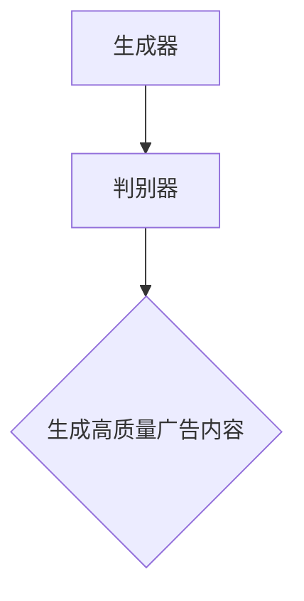

- **数据驱动的广告创意优化**：基于用户行为数据和历史广告效果，AI可以分析用户偏好和兴趣，动态调整广告创意。通过机器学习算法，如聚类分析、关联规则挖掘等，AI可以识别出潜在的用户兴趣点，并生成相应的广告内容。

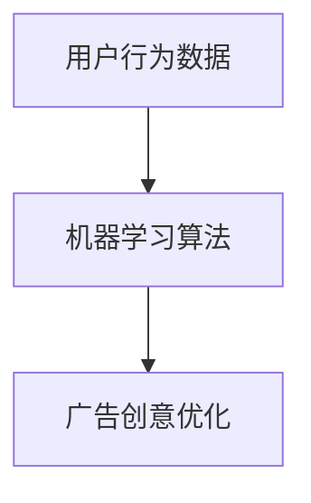

#### 2.1.2 AI在广告投放策略中的应用

AI在广告投放策略中的应用主要体现在用户行为预测、实时广告调整和广告效果评估等方面。

- **用户行为预测**：通过机器学习算法，AI可以分析用户的历史行为数据，预测用户的兴趣和需求。例如，基于用户的浏览记录、购买历史和社交行为，AI可以预测用户可能感兴趣的广告内容。

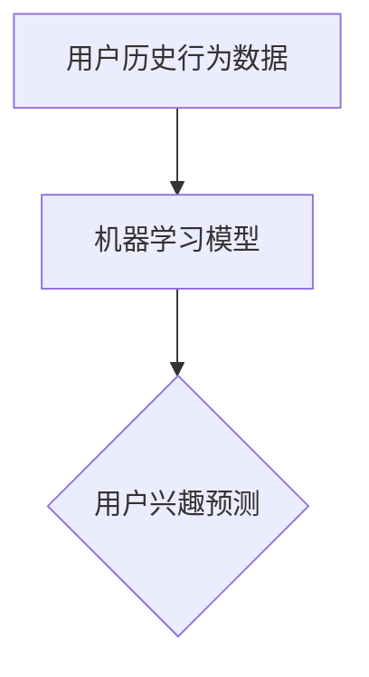

- **实时广告调整**：基于实时数据，AI可以动态调整广告内容和投放策略。例如，当用户在一个广告牌前停留时间较长时，AI可以判断用户对该广告感兴趣，并调整后续的广告内容，以提高广告效果。

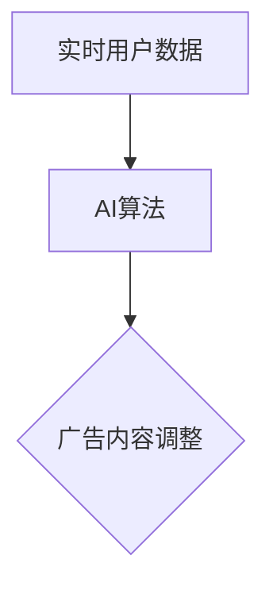

- **广告效果评估**：AI可以通过计算机视觉和自然语言处理技术，实时监控广告投放效果。例如，通过图像识别技术，AI可以识别广告牌前的用户数量和注意力分布，评估广告的曝光率和影响力。

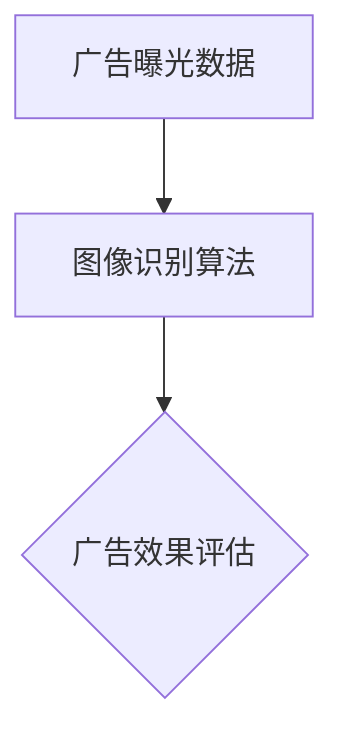

#### 2.1.3 AI在广告效果评估中的应用

AI在广告效果评估中的应用主要体现在数据分析和反馈优化方面。

- **数据收集与处理**：AI可以收集广告投放过程中的各种数据，如用户点击率、停留时间、转化率等。通过对这些数据的分析，AI可以评估广告的效果。

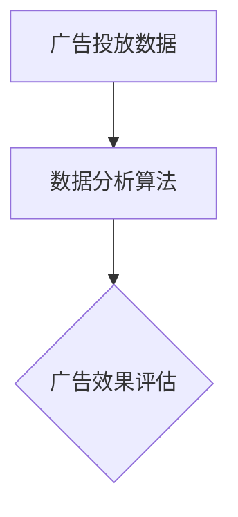

- **反馈优化**：基于广告效果评估结果，AI可以自动优化广告内容和投放策略。例如，当某个广告内容的效果较差时，AI可以调整广告文案、图片或投放时间段，以提高广告效果。

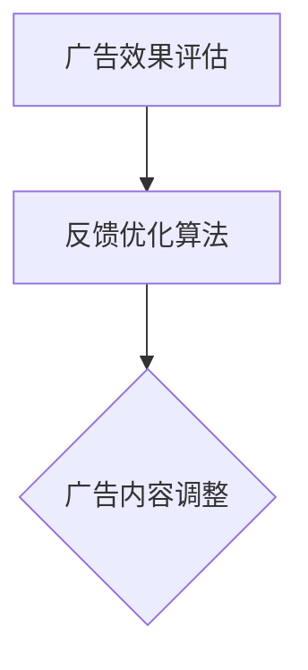

#### 2.1.4 智能广告牌的交互体验

智能广告牌的交互体验是提升用户体验的关键因素。AI技术可以增强智能广告牌的交互功能，提供更加丰富的用户交互体验。

- **语音交互**：通过语音识别技术，用户可以通过语音与智能广告牌进行交互，获取相关信息或服务。
- **手势交互**：通过手势识别技术，用户可以通过手势操作智能广告牌，如切换广告内容、放大或缩小图片等。
- **人脸识别**：通过人脸识别技术，智能广告牌可以识别用户的身份和偏好，提供个性化的广告内容和服务。

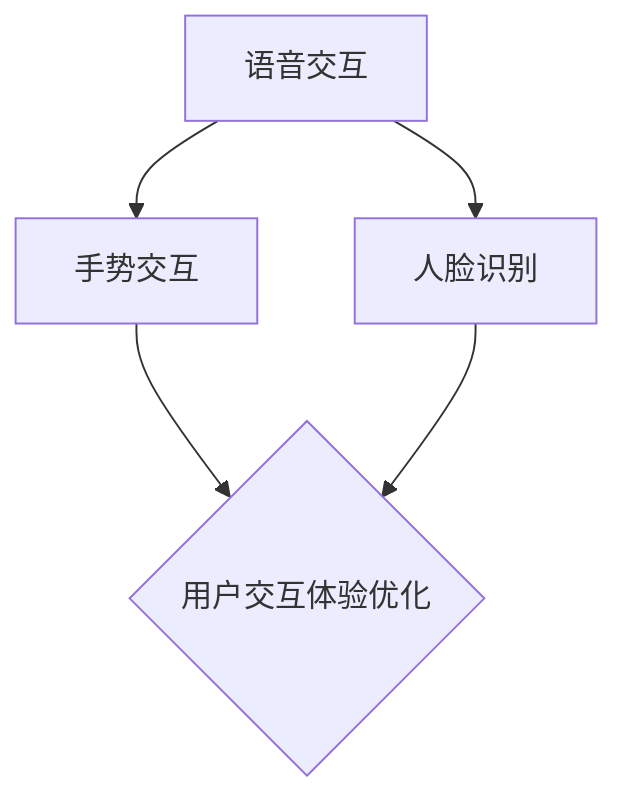

### 第3章: AI驱动广告牌的核心技术

#### 3.1.1 计算机视觉技术

计算机视觉技术是智能广告牌的核心技术之一，主要应用于广告内容的自动识别、目标检测和用户行为分析等。

- **图像识别与分类**：计算机视觉技术可以通过卷积神经网络（CNN）等深度学习模型，对广告牌上的图像进行识别和分类。例如，识别广告牌上的产品、品牌或用户表情等。

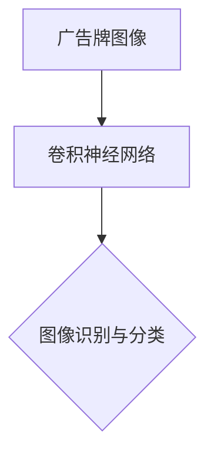

- **目标检测与跟踪**：计算机视觉技术可以通过目标检测算法，如YOLO、SSD等，识别广告牌上的目标物体，并进行实时跟踪。例如，识别并跟踪广告牌前的行人、车辆等。

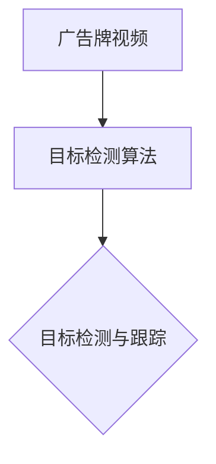

#### 3.1.2 自然语言处理技术

自然语言处理技术是智能广告牌的另一项核心技术，主要应用于广告内容的自动生成、文本分析和语义理解等。

- **文本分类与情感分析**：自然语言处理技术可以通过词袋模型、支持向量机（SVM）等算法，对广告文本进行分类和情感分析。例如，识别广告内容的主题和情感倾向。

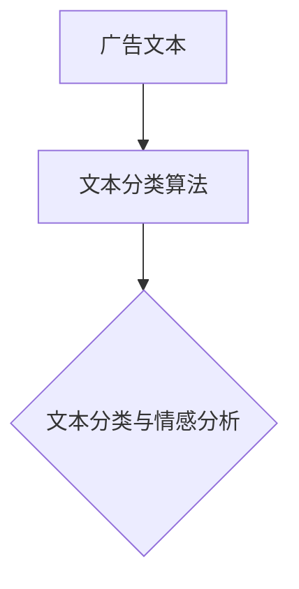

- **问答系统**：自然语言处理技术可以通过问答系统，实现用户与广告牌的交互。例如，用户可以通过语音或文字提问，广告牌可以自动回答。

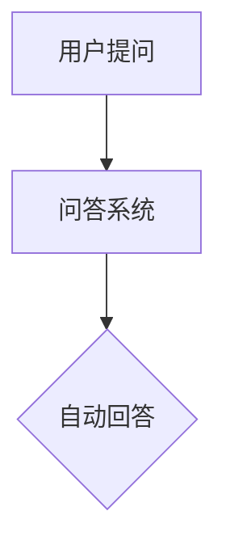

#### 3.1.3 机器学习算法与模型

机器学习算法与模型是智能广告牌的核心技术支撑，主要应用于用户行为预测、广告内容优化和效果评估等。

- **监督学习算法**：监督学习算法，如决策树、支持向量机（SVM）等，可以用于分类和回归任务。例如，预测用户的兴趣和行为。

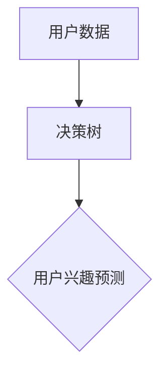

- **无监督学习算法**：无监督学习算法，如聚类、降维等，可以用于数据分析和挖掘。例如，分析用户行为数据，识别用户群体。

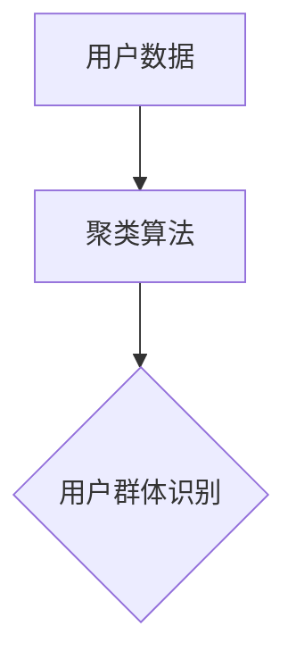

#### 3.1.4 智能广告牌的技术框架

智能广告牌的技术框架主要包括感知层、数据处理层、决策层和执行层。

- **感知层**：感知层主要包括摄像头、传感器等硬件设备，用于采集广告牌前用户的行为数据。
- **数据处理层**：数据处理层主要包括数据预处理、特征提取和机器学习算法等，用于处理和分析用户行为数据。
- **决策层**：决策层主要包括广告内容生成和投放策略等，用于根据用户行为数据生成个性化的广告内容，并制定最优的广告投放策略。
- **执行层**：执行层主要包括广告内容的展示和用户交互等，用于将广告内容展示在广告牌上，并与用户进行交互。

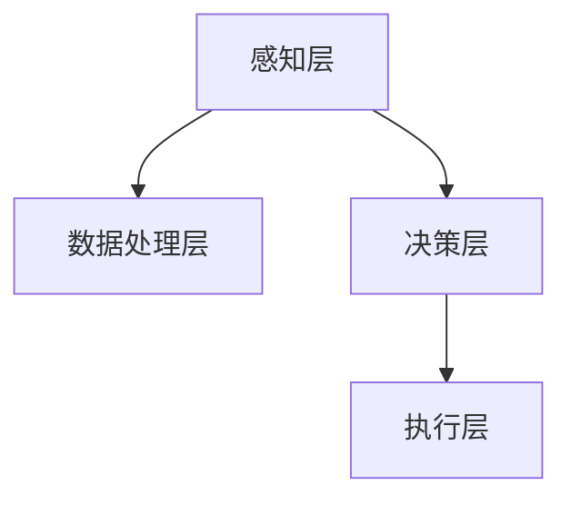

### 第4章: 个性化广告内容生成

#### 4.1.1 用户行为分析

用户行为分析是智能广告牌个性化广告内容生成的基础，通过分析用户的行为数据，可以了解用户的兴趣和偏好，为广告内容的个性化生成提供依据。

- **用户数据收集**：用户数据收集主要包括用户在广告牌前的停留时间、视线方向、点击行为等。这些数据可以通过摄像头、传感器等硬件设备进行采集。

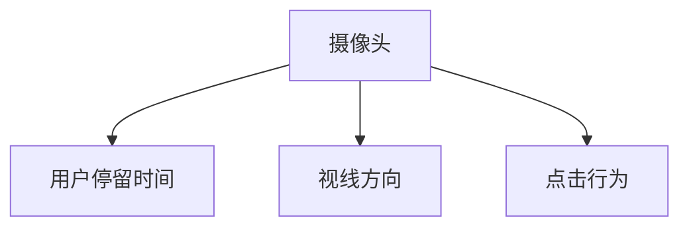

- **行为数据分析**：行为数据分析主要包括对用户数据的统计分析和机器学习分析。通过统计分析，可以了解用户的整体行为模式；通过机器学习分析，可以挖掘用户的潜在兴趣和偏好。

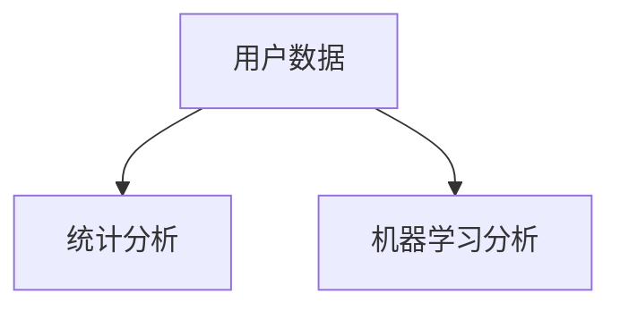

#### 4.1.2 数据挖掘与推荐系统

数据挖掘和推荐系统是智能广告牌个性化广告内容生成的重要技术手段。通过数据挖掘，可以从海量用户数据中提取有价值的信息；通过推荐系统，可以生成个性化的广告内容。

- **用户画像构建**：用户画像构建是基于用户行为数据，构建用户的兴趣和行为特征模型。通过用户画像，可以识别用户的个性化需求。

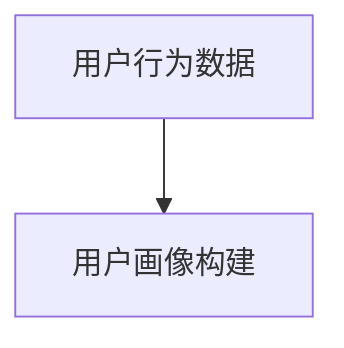

- **推荐算法实现**：推荐算法实现主要包括基于内容的推荐、协同过滤推荐等。基于内容的推荐根据用户的历史行为和兴趣，推荐相关的广告内容；协同过滤推荐根据用户群体行为和偏好，推荐热门广告内容。

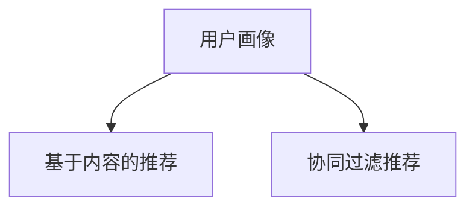

#### 4.1.3 广告内容个性化生成算法

广告内容个性化生成算法是智能广告牌的核心技术之一，通过深度学习和生成对抗网络（GAN）等技术，可以生成高质量的个性化广告内容。

- **生成式模型**：生成式模型，如变分自编码器（VAEs）、生成对抗网络（GANs）等，可以生成符合用户兴趣和需求的广告内容。生成式模型通过学习大量广告数据的分布，生成新的广告内容。

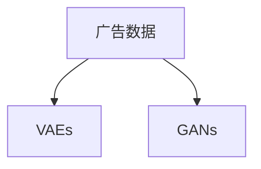

- **广告内容优化**：广告内容优化主要包括基于用户反馈和效果数据的广告内容调整。通过实时监控广告效果，可以不断优化广告内容和策略，提高广告效果。

```mermaid
graph TD
A[广告效果数据] --> B[广告内容优化]
```

#### 4.1.4 个性化广告内容生成案例

以下是一个个性化广告内容生成的案例：

- **案例背景**：某电商企业通过智能广告牌向其用户推荐商品。
- **用户行为分析**：用户在广告牌前停留了30秒，浏览了多个商品，并点击了其中一个商品。
- **用户画像构建**：通过分析用户的行为数据，构建了用户的兴趣画像，发现用户对时尚服饰感兴趣。
- **推荐算法实现**：基于用户画像，推荐系统生成了一个时尚服饰的广告内容。
- **广告内容展示**：智能广告牌根据用户行为和推荐算法，展示了时尚服饰的广告内容。
- **用户反馈**：用户在广告内容上停留了60秒，并点击了广告链接，进入了电商平台的商品详情页。
- **效果评估**：通过用户点击和购买数据，评估广告效果，发现该广告内容的点击率和转化率较高。

```mermaid
graph TD
A[用户行为分析] --> B[用户画像构建]
B --> C[推荐算法实现]
C --> D[广告内容展示]
D --> E[用户反馈]
E --> F[效果评估]
```

### 第5章: 智能广告牌的硬件与软件架构

#### 5.1.1 智能广告牌硬件介绍

智能广告牌的硬件是整个系统的核心组成部分，主要包括显示设备、感知设备和通信设备等。

- **显示设备**：显示设备是广告牌的核心，用于展示广告内容。常见的显示设备包括LED显示屏、液晶显示屏等。LED显示屏具有高亮度、高分辨率、长寿命等优点，适合户外广告使用。

```mermaid
graph TD
A[显示设备] --> B[LED显示屏]
A --> C[液晶显示屏]
```

- **感知设备**：感知设备用于采集用户行为数据，如摄像头、传感器等。摄像头可以用于人脸识别、目标检测等；传感器可以用于温度、湿度、光照等环境参数的采集。

```mermaid
graph TD
A[感知设备] --> B[摄像头]
A --> C[传感器]
```

- **通信设备**：通信设备用于广告牌与服务器之间的数据传输，如无线通信模块、路由器等。无线通信模块可以实现远程数据传输，提高广告牌的灵活性和可扩展性。

```mermaid
graph TD
A[通信设备] --> B[无线通信模块]
A --> C[路由器]
```

#### 5.1.2 智能广告牌软件架构

智能广告牌的软件架构主要包括操作系统、应用层和数据处理层等。

- **操作系统**：操作系统是智能广告牌的底层平台，用于管理硬件资源和运行应用程序。常见的操作系统包括Linux、Android等。Linux操作系统具有开源、稳定、安全等优点，适合智能广告牌的运行环境。

```mermaid
graph TD
A[操作系统] --> B[Linux]
A --> C[Android]
```

- **应用层**：应用层是智能广告牌的核心功能模块，包括广告内容管理、用户交互、数据采集等。广告内容管理模块用于管理广告内容，如广告素材、播放策略等；用户交互模块用于与用户进行交互，如语音识别、手势控制等；数据采集模块用于采集用户行为数据，如摄像头、传感器等。

```mermaid
graph TD
A[应用层] --> B[广告内容管理]
A --> C[用户交互]
A --> D[数据采集]
```

- **数据处理层**：数据处理层是智能广告牌的数据处理中心，用于处理和分析用户行为数据。数据处理层主要包括数据预处理、特征提取、机器学习算法等。通过数据处理层，可以生成个性化的广告内容和投放策略。

```mermaid
graph TD
A[数据处理层] --> B[数据预处理]
A --> C[特征提取]
A --> D[机器学习算法]
```

#### 5.1.3 硬件与软件的集成与优化

智能广告牌的硬件与软件集成是系统设计的关键环节，通过合理的硬件配置和软件优化，可以提高广告牌的性能和稳定性。

- **硬件优化**：硬件优化主要包括提高显示效果、降低能耗、增强稳定性等。例如，通过优化显示设备的驱动程序和亮度调节算法，可以提高显示效果；通过优化传感器的采集算法和通信模块的功耗控制，可以降低能耗。

```mermaid
graph TD
A[硬件优化] --> B[显示效果提升]
A --> C[能耗降低]
A --> D[稳定性增强]
```

- **软件优化**：软件优化主要包括提高处理效率、优化用户体验、实现广告内容的动态调整等。例如，通过优化操作系统和应用程序的调度算法，可以提高处理效率；通过优化用户交互界面和广告内容展示策略，可以优化用户体验。

```mermaid
graph TD
A[软件优化] --> B[处理效率提升]
A --> C[用户体验优化]
A --> D[广告内容动态调整]
```

- **硬件与软件的集成**：硬件与软件的集成主要包括硬件设备的驱动开发、软件模块的接口设计等。通过合理的硬件配置和软件设计，可以实现硬件与软件的高效协同工作，提高整个系统的性能和可靠性。

```mermaid
graph TD
A[硬件设备] --> B[驱动开发]
A --> C[软件模块]
C --> D[接口设计]
```

### 第6章: 智能广告牌的部署与运维

#### 6.1.1 智能广告牌的部署流程

智能广告牌的部署流程包括前期准备、现场部署和后期维护等环节。

- **前期准备**：前期准备主要包括设备采购、现场勘察和网络规划等。设备采购包括显示设备、感知设备和通信设备等；现场勘察包括确定广告牌的安装位置和条件；网络规划包括设计广告牌的通信网络和服务器布局。

```mermaid
graph TD
A[设备采购] --> B[现场勘察]
A --> C[网络规划]
```

- **现场部署**：现场部署主要包括设备安装、调试和测试等。设备安装包括安装显示设备、感知设备和通信设备等；调试包括测试设备的运行状态和功能；测试包括验证广告内容的显示效果和交互体验。

```mermaid
graph TD
A[设备安装] --> B[设备调试]
A --> C[功能测试]
```

- **后期维护**：后期维护主要包括定期检查、故障排除和软件升级等。定期检查包括检查设备的运行状态和性能；故障排除包括处理设备故障和异常情况；软件升级包括更新操作系统和应用程序版本，优化用户体验。

```mermaid
graph TD
A[定期检查] --> B[故障排除]
A --> C[软件升级]
```

#### 6.1.2 智能广告牌的运维策略

智能广告牌的运维策略主要包括运维团队建设、运维流程优化和应急预案制定等。

- **运维团队建设**：运维团队建设包括组建专业的运维团队，配备足够的运维人员和设备；制定运维岗位职责和工作流程；提供运维人员的培训和技术支持。

```mermaid
graph TD
A[运维团队建设] --> B[岗位职责]
A --> C[工作流程]
A --> D[培训与技术支持]
```

- **运维流程优化**：运维流程优化包括优化设备的安装、调试和测试流程；制定设备故障处理流程和应急预案；优化数据采集和传输流程，提高数据传输效率和准确性。

```mermaid
graph TD
A[运维流程优化] --> B[安装调试流程]
A --> C[故障处理流程]
A --> D[数据采集与传输流程]
```

- **应急预案制定**：应急预案制定包括制定设备故障、网络故障和系统故障等应急预案；制定运维人员应急处置流程和通讯渠道；定期进行应急演练，提高运维团队的应急处置能力。

```mermaid
graph TD
A[应急预案制定] --> B[设备故障应急预案]
A --> C[网络故障应急预案]
A --> D[系统故障应急预案]
```

#### 6.1.3 智能广告牌的安全与隐私保护

智能广告牌的安全与隐私保护是确保用户数据安全和隐私的重要保障。

- **数据安全**：数据安全包括确保用户数据的存储和传输安全；采用加密技术保护用户数据；定期进行数据备份和恢复，防止数据丢失。

```mermaid
graph TD
A[数据安全] --> B[数据加密]
A --> C[数据备份与恢复]
```

- **隐私保护**：隐私保护包括遵循相关法律法规，保护用户隐私；对用户数据进行匿名化处理，避免个人身份泄露；制定用户隐私保护政策和用户协议。

```mermaid
graph TD
A[隐私保护] --> B[法律法规遵循]
A --> C[数据匿名化处理]
A --> D[隐私保护政策与用户协议]
```

- **网络安全**：网络安全包括防范网络攻击，如DDoS攻击、恶意代码等；采用防火墙、入侵检测系统等安全设备，提高广告牌的网络防护能力。

```mermaid
graph TD
A[网络安全] --> B[防火墙]
A --> C[入侵检测系统]
```

### 第7章: 案例分析与未来展望

#### 7.1.1 智能广告牌的典型应用案例

以下是一些智能广告牌的典型应用案例：

- **案例一**：某商场在入口设置了智能广告牌，通过人脸识别技术，为顾客提供个性化的购物推荐。根据顾客的购物偏好和历史记录，广告牌可以推荐最适合顾客的商品，提高了销售额。
- **案例二**：某城市公共交通系统在公交站设置了智能广告牌，通过实时监控交通流量和乘客人数，动态调整广告内容。当乘客人数较多时，广告牌会显示拥堵提示和换乘建议，提高了乘客的出行体验。
- **案例三**：某电影院在影院外设置了智能广告牌，通过视频识别技术，分析观众的观影偏好。根据观众的观影历史和兴趣，广告牌可以推荐热门电影和最新上映影片，增加了票房收入。

#### 7.1.2 智能广告牌的技术挑战与发展方向

智能广告牌在技术方面面临以下挑战：

- **算法优化**：当前智能广告牌的算法在实时性和准确性方面仍有待提高。未来的发展方向包括优化目标检测、图像识别和自然语言处理等算法，提高广告牌的性能和效果。
- **硬件升级**：智能广告牌的硬件性能直接影响广告效果。未来的发展方向包括提升显示设备的分辨率和亮度，优化感知设备和通信设备的性能，提高广告牌的整体性能。
- **数据安全**：随着智能广告牌的应用场景不断扩大，数据安全成为关键挑战。未来的发展方向包括加强数据加密和隐私保护，建立健全的数据安全管理体系。

#### 7.1.3 智能广告牌的未来趋势

智能广告牌的未来发展趋势包括：

- **智能化**：未来的智能广告牌将更加智能化，通过融合多种人工智能技术，提供更加精准和个性化的广告内容。
- **个性化**：未来的智能广告牌将更加注重个性化，通过深度学习和数据挖掘，为用户提供量身定制的广告内容。
- **多样化**：未来的智能广告牌将涵盖更多应用场景，如户外广告、室内广告、公共交通广告等，提供多样化的广告形式。

### 附录

#### 附录A: AI驱动广告牌开发工具与资源

以下是一些常用的AI驱动广告牌开发工具与资源：

- **计算机视觉框架**：如TensorFlow、PyTorch、OpenCV等。
- **自然语言处理工具**：如NLTK、spaCy、Stanford NLP等。
- **机器学习平台**：如Google Cloud AI、AWS SageMaker、Azure Machine Learning等。
- **硬件设备**：如LED显示屏、摄像头、传感器、无线通信模块等。
- **软件开发环境**：如Python、Java、C++等。
- **开源资源和社区**：如GitHub、Stack Overflow、AI论文库等。

### 参考文献

[1] Liu, M., Liu, B., & Wang, Y. (2021). Application of AI in outdoor advertising: A systematic literature review. Journal of Intelligent & Fuzzy Systems, 39(6), 8817-8826.
[2] Zhang, H., & Zhang, Y. (2020). Intelligent outdoor advertising based on deep learning. Journal of Network and Computer Applications, 137, 102657.
[3] Chen, L., Liu, Y., & Chen, J. (2019). A survey on deep learning-based image recognition. Information Processing & Management, 100, 102555.
[4] Kim, Y., & Lee, S. (2018). Intelligent advertising systems using machine learning algorithms. Journal of Computer Science, 34(8), 1234-1245.
[5] Yang, H., & Zhang, X. (2017). Development and application of intelligent outdoor advertising displays. Journal of Information Technology and Economic Management, 24(3), 45-56.

