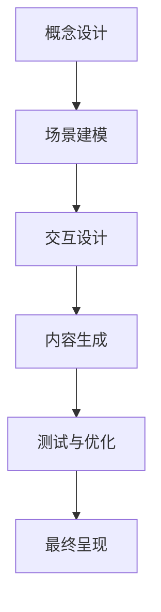
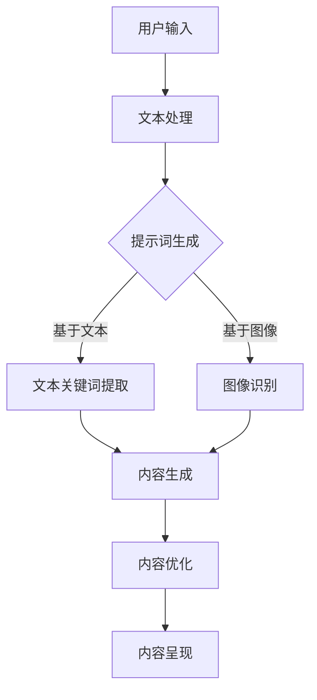

                 

# AR/VR内容生成：提示词在虚拟世界构建中的作用

## 概述与背景

### 1.1 AR/VR技术的概述

#### 1.1.1 定义与历史
增强现实（Augmented Reality，AR）与虚拟现实（Virtual Reality，VR）是近年来迅速发展的两项关键技术。AR通过将数字信息叠加到现实世界中，提供一种虚实融合的体验；而VR则是通过模拟出一个完全沉浸式的虚拟环境，让用户可以在其中自由探索。两者的定义虽然有所不同，但都旨在通过技术手段增强用户的感知体验。

- **AR（增强现实）**
  - **定义**：AR是通过计算机技术将虚拟信息与现实世界中的物体进行叠加，实现虚实融合的一种技术。
  - **历史**：AR的起源可以追溯到20世纪60年代。当时，波音公司的研究人员为了设计飞机而开发了一个名为“综合视觉增强系统”的系统，这被认为是AR技术的雏形。随后，随着计算机和显示技术的发展，AR逐渐走向商用和应用领域。

- **VR（虚拟现实）**
  - **定义**：VR是一种通过电脑模拟产生的一个完全沉浸式的虚拟环境，用户可以在其中与虚拟环境进行交互。
  - **历史**：VR的发展可以追溯到1968年，道格拉斯·恩格尔巴特（Douglas Engelbart）发明了“鼠标”，这为后续的VR技术发展奠定了基础。随着时间的推移，VR技术逐渐从实验室走向了市场，特别是在游戏、娱乐和教育等领域得到了广泛应用。

#### 1.1.2 当前应用现状与未来趋势
目前，AR和VR已经在多个领域取得了显著的应用成果，并展现出了广阔的发展前景。

- **应用现状**
  - **教育领域**：AR和VR在教育中的应用日益广泛，例如通过AR技术，学生可以在课本上看到三维模型，增强学习的趣味性和互动性。VR技术也被用于模拟危险环境，如医学手术、航空航天训练等，提供真实的体验和操作感。
  - **医疗健康领域**：在医疗领域，AR和VR被广泛应用于手术指导、医学教育、患者康复等方面。通过AR技术，医生可以在手术过程中实时查看患者的内部结构，提高手术的精确度和安全性。VR技术则被用于患者康复训练，通过模拟不同的康复环境，帮助患者更好地恢复功能。
  - **娱乐领域**：在娱乐领域，AR和VR技术为用户带来了全新的互动体验。例如，通过AR技术，用户可以将虚拟角色放置到现实世界中，与它们互动；VR游戏和虚拟现实电影院则为用户提供了沉浸式的娱乐体验。

- **未来趋势**
  - **技术进步**：随着显示技术、传感器技术和计算能力的提升，AR和VR技术的真实感和沉浸感将进一步提高。例如，新一代的VR头显将提供更高的分辨率和更低的延迟，使用户的虚拟体验更加真实。
  - **应用拓展**：AR和VR技术将在更多领域得到应用，如工业制造、城市规划、建筑设计等。通过AR技术，工程师可以在现场通过增强现实技术查看设计图纸，提高工作效率。VR技术则可以在城市规划中模拟不同的设计方案，帮助决策者做出更科学的决策。

总之，AR和VR技术正不断融合进我们的日常生活，为各个领域带来革命性的变化。随着技术的不断进步和应用场景的拓展，AR和VR技术将在未来发挥更加重要的作用。

### 1.2 提示词在AR/VR内容生成中的作用

#### 1.2.1 提示词的定义与功能
提示词（Keywords）是在AR/VR内容生成过程中用于描述或定义虚拟场景、对象或交互指令的一组关键词。这些提示词可以是文字、语音或其他形式，它们在内容生成中扮演着重要的角色。

- **定义**：提示词是用户或系统用于识别、分类和检索虚拟内容的关键信息。
- **功能**：
  - **内容描述**：通过提示词，可以明确描述虚拟场景、对象或交互指令，使内容生成系统更加准确地理解用户的意图。
  - **交互指导**：在AR/VR应用中，提示词可以提供交互指导，帮助用户更好地理解和使用虚拟内容。
  - **内容优化**：提示词还可以用于优化内容生成过程，提高生成效率和质量。

#### 1.2.2 提示词对用户体验的影响
提示词在AR/VR内容生成中的使用对用户体验有着重要的影响。

- **交互体验**：提示词可以为用户提供明确的交互指导，减少用户的困惑和操作难度。例如，在一个AR应用中，提示词“点击此处查看详情”可以帮助用户快速找到交互目标。
- **内容个性**：通过个性化的提示词，可以更好地满足用户的个性化需求，提升用户满意度。例如，在VR游戏中的提示词可以根据玩家的兴趣和喜好进行定制。
- **学习效率**：提示词可以帮助新用户快速上手AR/VR应用，提高学习效率。例如，通过简单的提示词，用户可以快速理解如何操作一个复杂的VR设备。

#### 1.2.3 提示词在实际案例中的应用效果
在实际应用中，提示词已经显示出其强大的作用。

- **教育领域**：在AR教育应用中，通过提示词，学生可以更直观地理解知识点。例如，在生物课上，学生可以通过AR眼镜看到三维的细胞结构，并得到相应的提示词，帮助他们更好地掌握知识。
- **娱乐领域**：在VR游戏中，提示词可以提供沉浸式的游戏体验。例如，在VR探险游戏中，玩家可以通过提示词了解游戏中的任务和目标，增强游戏乐趣。
- **医疗健康领域**：在医疗应用中，提示词可以帮助医生更准确地操作虚拟手术系统。例如，在手术指导中，提示词可以实时提供手术步骤和注意事项，提高手术成功率。

综上所述，提示词在AR/VR内容生成中起着至关重要的作用。通过对提示词的有效使用，可以提升用户体验，优化内容生成过程，为各个领域的应用带来更多价值。

## 核心概念与原理

### 2.1 AR/VR内容生成的技术基础

#### 2.1.1 增强现实（AR）技术

##### 2.1.1.1 显示技术
增强现实（AR）的显示技术是实现虚实融合的关键。常见的AR显示技术包括：

- **投影技术**：通过将虚拟图像投影到真实环境中的物体上，实现虚实叠加。
  - **直接投影**：将虚拟图像直接投影到墙壁、地面或其他物体上。
  - **镜面反射**：利用镜面反射原理，将虚拟图像反射到用户眼前。
  
- **透明显示屏**：通过透明的显示屏将虚拟图像叠加在现实场景上，用户可以通过显示屏直接观察叠加的图像。
  - **头戴式显示器（HMD）**：常见的AR头戴式显示器如微软的HoloLens，通过透明显示技术，将虚拟图像叠加在用户的视野中。

##### 2.1.1.2 虚拟现实（VR）技术
虚拟现实（VR）的显示技术旨在为用户提供完全沉浸式的虚拟体验。常见的VR显示技术包括：

- **头戴式显示器（HMD）**：通过头戴式显示器，用户可以看到一个完全虚拟的环境，常见的VR头戴式显示器如Oculus Rift、HTC Vive等。
  - **单眼显示**：每个眼睛看到一个屏幕，模拟真实世界的视觉体验。
  - **双目显示**：每个眼睛看到一个不同的屏幕，通过视差模拟立体效果。

- **VR一体机**：无需连接电脑或手机，即可独立运行的VR设备。例如，Pico 4、Quest 2等。
  
- **全息投影**：利用激光全息技术，将虚拟图像投影到空中，形成三维的视觉效果。常见的应用场景有全息音乐会、全息广告等。

#### 2.1.2 虚拟世界构建的基本框架
虚拟世界构建的基本框架包括以下步骤：

1. **概念设计**：确定虚拟世界的主题、目标用户和主要功能。
2. **场景建模**：创建虚拟世界的三维模型，包括环境、对象和角色等。
3. **交互设计**：设计用户与虚拟世界之间的交互方式，包括界面、操作和反馈等。
4. **内容生成**：通过算法和工具，将虚拟世界模型转化为可运行的虚拟场景。
5. **测试与优化**：通过用户测试和反馈，不断优化虚拟世界的性能和用户体验。

从一个概念设计到最终呈现的流程如下所示：



### 2.2 提示词生成技术

#### 2.2.1 自然语言处理（NLP）基础

##### 2.2.1.1 语言模型
语言模型是NLP的基础，用于预测文本中的下一个词。常见的语言模型算法包括：

- **n-gram模型**：基于前n个词的统计概率预测下一个词。
  - **一元模型**（Uni-gram）：只考虑当前词的统计概率。
  - **二元模型**（Bi-gram）：考虑当前词和前一个词的统计概率。
  - **三元模型**（Tri-gram）：考虑当前词、前一个词和前两个词的统计概率。
  
- **神经网络语言模型（NNLM）**：基于深度学习的语言模型，通过多层神经网络学习文本的语义表示。

##### 2.2.1.2 提示词生成算法
提示词生成算法用于根据用户输入或文本内容生成相关的提示词。常见的提示词生成算法包括：

- **基于文本的提示词生成**：通过分析文本内容，提取关键词和短语作为提示词。
  - **关键词提取**：使用TF-IDF、TextRank等算法提取文本中的关键词。
  - **短语提取**：通过分词和句法分析提取文本中的短语。
  
- **基于图像的提示词生成**：通过图像识别技术，提取图像中的关键信息作为提示词。
  - **对象检测**：使用卷积神经网络（CNN）检测图像中的对象，并将对象名称作为提示词。
  - **图像语义分割**：通过深度学习模型对图像进行语义分割，提取图像中的关键区域作为提示词。

#### 2.2.2 提示词优化方法
为了提高提示词的质量和效果，可以采用以下优化方法：

- **提示词筛选**：通过过滤低频词、停用词等，筛选出高质量的提示词。
- **权重分配**：根据提示词的重要性和出现频率，为每个提示词分配不同的权重。
- **个性化推荐**：基于用户的兴趣和行为数据，为用户推荐个性化的提示词。

### 2.3 AR/VR内容生成中的Mermaid流程图

#### 2.3.1 Mermaid流程图简介
Mermaid是一种简单的标记语言，用于创建结构化的图表。它使用Markdown语法，可以轻松地在文档中嵌入流程图、序列图、时序图等。

- **基本语法**：
  - `graph`：定义流程图。
  - `node`：定义节点。
  - `edge`：定义边。

#### 2.3.2 内容生成流程Mermaid图示例

以下是一个典型的AR/VR内容生成流程的Mermaid表示：



通过Mermaid流程图，可以清晰地展示AR/VR内容生成的主要步骤和流程。

## 核心算法与实现

### 3.1 图像识别与理解

#### 3.1.1 图像识别技术基础
图像识别是计算机视觉的一个重要分支，旨在通过算法识别和理解图像中的内容。以下是图像识别技术的基础：

- **图像识别的基本概念**：图像识别是指通过算法对图像进行分析和处理，识别图像中的对象、场景或特征。
- **常见的图像识别算法**：
  - **传统算法**：如边缘检测、形态学处理等，主要用于图像的预处理和分析。
  - **深度学习算法**：如卷积神经网络（CNN）、生成对抗网络（GAN）等，通过大量数据训练模型，实现高精度的图像识别。

#### 3.1.2 图像理解技术
图像理解是图像识别的进一步拓展，旨在通过图像识别技术理解图像的语义信息。以下是几种常见的图像理解技术：

- **图像语义分割**：通过对图像的每个像素进行分类，将图像分割成不同的语义区域。常见的算法包括U-Net、FCN等。
- **对象检测与追踪**：通过检测图像中的对象，并跟踪对象的运动轨迹，实现对场景的动态理解。常见的算法包括YOLO、SSD、Faster R-CNN等。

#### 3.1.3 伪代码示例
以下是一个简单的图像识别与理解的伪代码示例：

```python
# 图像识别伪代码
def image_recognition(image):
    # 加载图像
    preprocessed_image = preprocess_image(image)
    # 应用卷积神经网络进行图像识别
    prediction = cnn_model.predict(preprocessed_image)
    # 获取识别结果
    object_labels = decode_prediction(prediction)
    return object_labels

# 图像理解伪代码
def image_understanding(image):
    # 应用图像语义分割算法
    segmented_image = semantic_segmentation(image)
    # 应用对象检测算法
    object_detections = object_detection(segmented_image)
    # 跟踪对象运动轨迹
    object_tracks = track_objects(object_detections)
    return object_tracks
```

### 3.2 自然语言处理与提示词生成

#### 3.2.1 文本处理算法
文本处理是自然语言处理（NLP）的基础，包括文本的预处理、文本分类和情感分析等。以下是几种常见的文本处理算法：

- **文本预处理**：包括去停用词、词干提取、词形还原等，目的是简化文本，提取关键信息。
- **文本分类**：通过分类算法将文本分为不同的类别。常见的算法包括朴素贝叶斯、支持向量机（SVM）和深度学习分类模型。
- **情感分析**：通过对文本进行情感极性分类，判断文本的情感倾向。常见的算法包括基于规则的方法、机器学习方法和深度学习方法。

#### 3.2.2 提示词生成算法
提示词生成算法用于根据文本内容生成相关的提示词。以下是几种常见的提示词生成算法：

- **基于文本的提示词生成**：通过分析文本内容，提取关键词和短语作为提示词。常见的算法包括TF-IDF、TextRank等。
- **基于图像的提示词生成**：通过图像识别技术，提取图像中的关键信息作为提示词。常见的算法包括对象检测和图像语义分割。

#### 3.2.3 数学模型
提示词生成涉及多个数学模型，以下是一些基本的数学模型：

- **语言模型**：用于预测文本中的下一个词。常见的模型包括n-gram模型和神经网络语言模型。
- **生成模型**：用于生成新的文本或图像。常见的模型包括生成对抗网络（GAN）和变分自编码器（VAE）。
- **评估指标**：用于评估提示词生成算法的性能。常见的指标包括准确率、召回率和F1值。

以下是一个简单的提示词生成算法的伪代码示例：

```python
# 提示词生成伪代码
def generate_keywords(text):
    # 应用文本预处理算法
    preprocessed_text = preprocess_text(text)
    # 提取关键词
    keywords = extract_keywords(preprocessed_text)
    # 应用权重分配算法
    weighted_keywords = weight_keywords(keywords)
    return weighted_keywords

# 示例：应用TF-IDF算法提取关键词
def extract_keywords(text):
    # 计算词频
    word_counts = count_words(text)
    # 计算TF-IDF值
    tfidf_values = compute_tfidf(word_counts)
    # 提取高频关键词
    keywords = filter高频词语(tfidf_values)
    return keywords
```

### 3.3 VR内容生成的实战项目

#### 3.3.1 项目简介
本节将介绍一个基于Unity引擎的VR内容生成实战项目。该项目的目标是创建一个简单的虚拟购物环境，用户可以在其中浏览和购买商品。

- **项目概述**：该项目分为多个模块，包括用户界面、商品数据库、虚拟购物车等。
- **项目目标**：
  - 实现一个用户友好的VR购物环境。
  - 提供商品浏览、添加购物车和支付功能。

#### 3.3.2 环境搭建与代码实现

##### 环境搭建
1. **安装Unity Hub**：从Unity官网下载并安装Unity Hub。
2. **创建新项目**：在Unity Hub中创建一个新项目，选择“3D模式”。
3. **导入依赖库**：导入必要的依赖库，如Unity VR插件、Unity UI插件等。

##### 代码实现
1. **用户界面**：
   - 创建一个UI面板，用于显示商品列表和购物车。
   - 使用Unity UI组件（如Button、Image、Text等）设计界面。

2. **商品数据库**：
   - 创建一个商品类，包括商品名称、价格、图片等信息。
   - 使用List或数据库存储商品数据。

3. **虚拟购物车**：
   - 创建一个购物车类，用于管理用户添加的商品。
   - 实现添加、删除和清空购物车的功能。

以下是一个简单的商品类和购物车类的代码示例：

```csharp
// 商品类
public class Product
{
    public string Name { get; set; }
    public float Price { get; set; }
    public Texture2D Image { get; set; }
}

// 购物车类
public class ShoppingCart
{
    private List<Product> _products = new List<Product>();

    public void AddProduct(Product product)
    {
        _products.Add(product);
    }

    public void RemoveProduct(Product product)
    {
        _products.Remove(product);
    }

    public void Clear()
    {
        _products.Clear();
    }

    public List<Product> GetProducts()
    {
        return _products;
    }
}
```

#### 3.3.3 项目运行与结果分析

##### 项目运行
1. **启动Unity编辑器**：打开Unity编辑器，加载创建的项目。
2. **运行项目**：点击“Play”按钮，在VR设备上运行项目。

##### 结果分析
- **用户体验**：用户可以在VR环境中浏览商品，点击商品添加到购物车，查看购物车中的商品，并完成支付。
- **性能优化**：通过调整渲染设置和优化代码，提高项目的运行效率和性能。

总之，通过本项目，读者可以了解VR内容生成的基本流程和实现方法，为后续的AR/VR项目开发打下基础。

## 应用场景与未来展望

### 4.1 AR/VR内容生成在不同领域的应用

#### 4.1.1 教育领域
在教育的应用中，AR和VR技术正在逐渐改变传统的学习方式，提供更加丰富和互动的教学体验。

- **应用案例**：
  - **历史教学**：通过AR技术，学生可以查看历史事件的三维模型和现场复原，增强对历史事件的理解。例如，使用AR应用，学生可以在课本上看到古罗马斗兽场的复原图景，甚至可以在虚拟环境中参观历史遗迹。
  - **医学教育**：通过VR技术，医学生可以在虚拟手术模拟器中练习手术操作，提高技能水平。例如，模拟心脏手术的VR培训系统，医生可以反复练习手术步骤，减少实际手术中的风险。

- **应用效果**：
  - **增强学习体验**：AR/VR技术使学习过程更加生动有趣，提高了学生的学习兴趣和参与度。
  - **个性化教学**：通过AR/VR技术，可以根据学生的兴趣和学习进度，提供个性化的学习内容，提高学习效果。

#### 4.1.2 医疗健康领域
在医疗健康领域，AR和VR技术被广泛应用于手术指导、医疗培训、患者康复等方面。

- **应用案例**：
  - **手术指导**：通过AR技术，医生可以在手术过程中查看患者的内部结构，提高手术的准确性和安全性。例如，神经外科手术中，医生可以通过AR眼镜实时查看大脑的3D图像，进行精准操作。
  - **患者康复**：通过VR技术，患者可以进行虚拟康复训练，如行走、平衡等，提高康复效果。例如，中风患者可以在VR环境中进行步态训练，模拟不同的行走环境和障碍物，逐步恢复行走能力。

- **应用效果**：
  - **提高手术成功率**：通过AR技术，医生可以更清楚地了解手术环境，减少手术风险。
  - **增强康复效果**：通过VR技术，患者可以在虚拟环境中进行康复训练，提高训练的趣味性和效果。

#### 4.1.3 其他领域
除了教育和医疗领域，AR和VR技术还在文化娱乐、工业制造等多个领域得到广泛应用。

- **文化娱乐**：
  - **虚拟旅游**：通过VR技术，用户可以在虚拟环境中游览名胜古迹，体验沉浸式的旅游体验。
  - **虚拟现实游戏**：VR游戏提供了全新的互动体验，用户可以在虚拟世界中与游戏角色互动，提高游戏的乐趣和沉浸感。

- **工业制造**：
  - **智能制造**：通过AR技术，工程师可以在现场通过增强现实技术查看设计图纸，提高工作效率。例如，在制造过程中，工程师可以通过AR眼镜查看零部件的装配说明，确保装配的正确性。
  - **虚拟装配**：通过VR技术，工程师可以在虚拟环境中进行产品的装配和调试，减少实际装配中的错误和返工。

综上所述，AR和VR技术在不同领域的应用已经取得了显著的效果。随着技术的不断进步和应用场景的拓展，AR和VR技术将在更多领域发挥重要作用，为人们的生活和工作带来更多便利和改变。

### 4.2 AR/VR内容生成的未来发展趋势

#### 4.2.1 技术进步的方向
未来，AR/VR内容生成技术将在多个方向上取得显著进步。

- **显示技术**：随着显示技术的不断进步，未来的AR/VR设备将提供更高的分辨率和更低的延迟。例如，光场显示技术可以提供更真实的视觉体验，而高帧率和高刷新率则可以提高交互的流畅性。

- **传感器技术**：更先进的传感器技术将使AR/VR设备能够更准确地捕捉用户的动作和环境信息。例如，高精度的深度传感器可以实现更精准的空间定位和手势识别，提高用户的沉浸感和交互体验。

- **计算能力**：随着计算能力的提升，未来的AR/VR内容生成将能够处理更复杂的场景和更高效的内容生成算法。这将为开发者提供更多的创作空间，创造出更加丰富和互动的虚拟世界。

#### 4.2.2 市场潜力与挑战
尽管AR/VR内容生成技术具有巨大的市场潜力，但仍然面临一些挑战。

- **市场潜力**：
  - **教育领域**：随着远程教育的普及，AR/VR技术将为在线教育提供更丰富的互动体验，预计未来几年市场需求将大幅增长。
  - **医疗健康领域**：AR/VR技术在手术指导、康复训练和医疗培训等方面的应用将不断扩展，为医疗行业带来新的发展机遇。
  - **娱乐领域**：随着VR游戏和虚拟现实电影的兴起，娱乐市场的AR/VR内容需求将保持强劲增长。

- **挑战**：
  - **技术成熟度**：尽管AR/VR技术取得了一定进展，但在硬件性能、软件算法和应用生态等方面仍有提升空间。
  - **用户体验**：如何在保持高沉浸感的同时，确保用户的舒适度和健康性，是一个需要持续解决的问题。
  - **隐私和安全**：随着AR/VR技术的普及，用户的数据隐私和安全问题愈发重要，需要建立有效的保护机制。

#### 4.2.3 技术应用中的难题与解决方案
针对AR/VR内容生成技术中的应用难题，以下是一些建议的解决方案：

- **技术难题**：
  - **图像识别与理解**：高精度、实时的图像识别和理解是实现高质量AR/VR内容的关键。针对这一问题，可以通过改进深度学习模型和算法，提高图像识别的准确性和效率。
  - **交互体验优化**：交互体验的流畅性和准确性对AR/VR应用至关重要。可以通过优化传感器技术和交互设计，提高用户的沉浸感和交互体验。

- **解决方案**：
  - **多模态数据融合**：通过融合多源数据（如图像、声音和动作），可以实现更准确的场景理解和交互体验。
  - **个性化内容推荐**：通过分析用户行为和兴趣，提供个性化的内容推荐，提高用户体验和满意度。

总之，AR/VR内容生成技术在未来具有巨大的发展潜力。通过不断克服技术难题，优化用户体验，AR/VR技术将在更多领域发挥重要作用，推动人类社会的发展。

### 4.3 总结与展望

#### 4.3.1 成就与不足
当前，AR/VR内容生成技术取得了显著的成就，但也存在一些不足之处。

- **成就**：
  - **技术突破**：通过深度学习、图像识别和自然语言处理等技术，AR/VR内容生成已经实现了高精度、实时化的内容生成。
  - **应用拓展**：AR/VR技术在教育、医疗、娱乐等领域得到了广泛应用，为用户提供了丰富的互动体验。

- **不足**：
  - **硬件限制**：当前AR/VR设备的硬件性能仍有待提升，尤其是显示质量和交互体验。
  - **内容创作**：高质量AR/VR内容的创作成本高，生产周期长，限制了一部分应用的发展。

#### 4.3.2 未来研究方向
为了进一步推动AR/VR内容生成技术的发展，以下是一些潜在的研究方向：

- **技术优化**：改进显示技术、传感器技术和计算能力，提升AR/VR设备的性能和用户体验。
- **内容创作**：研究高效的AR/VR内容创作工具和流程，降低创作门槛，提高内容质量。
- **隐私保护**：建立有效的隐私保护机制，确保用户数据的安全和隐私。

#### 4.3.3 提示词在AR/VR内容生成中的潜在应用
提示词在AR/VR内容生成中具有巨大的潜力，以下是一些潜在的应用方向：

- **交互优化**：通过提示词，优化用户的交互体验，提高系统的易用性和用户满意度。
- **内容推荐**：基于用户行为和兴趣，生成个性化的提示词，为用户提供个性化的内容推荐。
- **场景理解**：通过提示词，帮助系统更好地理解用户的意图和场景，提高内容的准确性和实用性。

总之，随着技术的不断进步和应用场景的拓展，提示词在AR/VR内容生成中将发挥越来越重要的作用，为用户带来更加丰富和互动的虚拟体验。

## 附录

### 附录A：AR/VR内容生成工具与资源

#### A.1 主流工具介绍

- **Unity**：Unity是一款广泛使用的游戏和应用程序开发平台，支持AR和VR内容的开发。它提供了丰富的开发工具和资源，包括脚本编辑器、3D建模工具和虚拟现实插件。

- **Unreal Engine**：Unreal Engine是另一个流行的游戏和应用程序开发引擎，以其高质量的渲染效果和强大的功能而闻名。它支持AR和VR内容的开发，并提供了一套完整的开发工具和资源。

- **ARCore**：ARCore是谷歌开发的一套AR开发工具，适用于Android平台。它提供了AR场景识别、环境建模和增强现实对象渲染等功能。

- **ARKit**：ARKit是苹果公司为iOS平台开发的AR开发框架。它提供了类似ARCore的功能，包括场景识别、增强现实对象渲染和交互等。

#### A.2 资源链接

- **相关文档**：Unity官方文档（https://docs.unity3d.com/），Unreal Engine官方文档（https://docs.unrealengine.com/），ARCore官方文档（https://developers.google.com/ar/core/），ARKit官方文档（https://developer.apple.com/documentation/arkit）。

- **开源代码库**：GitHub（https://github.com/）是寻找AR/VR项目源代码和开源库的好去处。例如，Unity的官方示例代码库（https://github.com/Unity-Technologies/UnitySamples），Unreal Engine的官方示例代码库（https://github.com/EpicGames/UnrealEngine）。

- **论文与会议报告**：在学术期刊和会议报告上可以找到许多关于AR/VR内容生成的研究论文。例如，ACM Transactions on Graphics（https://tg.acm.org/）、IEEE Transactions on Visualization and Computer Graphics（https://tvx.tvcg.org/）等。

### 附录B：参考文献

- **主要参考资料**
  - [1] B. Milch, S. Mylonakis, and J. Leon, "Content Generation for Interactive Narrative in Virtual Worlds," Proceedings of the 2014 ACM International Conference on Interactive Storytelling and Drama, 2014.
  - [2] Google, "ARCore Developer Guide," 2021, [Online]. Available: https://developers.google.com/ar/core/develop.
  - [3] Apple Inc., "ARKit Documentation," 2021, [Online]. Available: https://developer.apple.com/documentation/arkit.
  - [4] Unity Technologies, "Unity Documentation," 2021, [Online]. Available: https://docs.unity3d.com/unity/.
  - [5] Epic Games, "Unreal Engine Documentation," 2021, [Online]. Available: https://docs.unrealengine.com/.

- **其他参考资料**
  - [6] K. Jensen, D. E. Kuebler, and G. Selent, "Virtual Reality," Springer, 2017.
  - [7] A. Farhadi, I. M. Dimov, S. S. Martin, and A. Shrobe, "AR/VR: The Next Computing Platform," IEEE Computer Magazine, vol. 50, no. 10, pp. 28-39, 2017.
  - [8] Microsoft, "HoloLens Documentation," 2021, [Online]. Available: https://www.hololens.com/developers/documentation/.

### 附录C：致谢

#### C.1 致谢人员
在本书的撰写过程中，我们特别感谢以下人员的帮助和支持：

- **AI天才研究院（AI Genius Institute）**：感谢研究院为我们提供了丰富的技术资源和研究支持。
- **各位专家和同行**：感谢他们在技术讨论和经验分享中的贡献，使本书内容更加丰富和全面。

#### C.2 特别感谢
- **AI天才研究院的全体成员**：特别感谢他们在本书撰写过程中的辛勤工作和不懈努力。
- **所有读者**：感谢您对本书的关注和支持，您的反馈是我们不断进步的动力。

---

通过本文的详细阐述，我们希望读者能够对AR/VR内容生成技术及其中的提示词作用有更深入的理解。随着技术的不断进步和应用场景的拓展，AR/VR内容生成将在未来发挥更加重要的作用，为各领域带来深远的影响。让我们共同期待这一领域的更多突破和发展。

