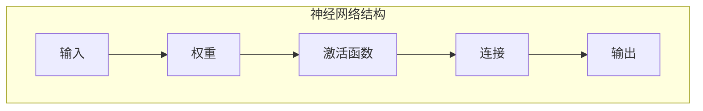
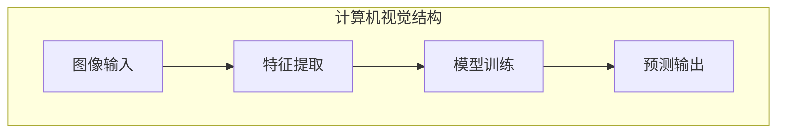
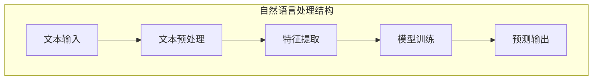
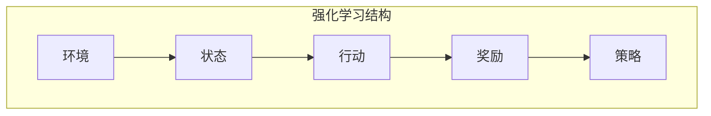
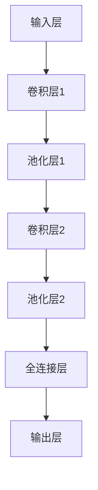

                 

### 引言

在当今数字化时代，人工智能（Artificial Intelligence, AI）已经成为技术发展的核心驱动力，深刻影响着社会的方方面面。从自动驾驶汽车到智能助手，从医疗诊断到金融分析，AI 的应用场景越来越广泛，带来了前所未有的技术革新。Andrej Karpathy，作为一位世界级人工智能专家，其在神经网络和深度学习领域的研究成果为这一领域的发展做出了重要贡献。

本文将以《Andrej Karpathy：人工智能的未来发展前景》为标题，探讨人工智能的未来发展趋势及其对社会的深远影响。本文将首先介绍人工智能的定义与发展历程，接着深入探讨其核心概念与联系，详细讲解核心算法原理，并通过实际项目案例展示其在开发中的应用。此外，本文还将讨论人工智能的数学模型和公式，并提供详细的源代码实现与解读。最后，我们将对人工智能的未来发展进行总结与展望，并提出 Andrej Karpathy 的观点与建议。

通过本文的阅读，读者将全面了解人工智能的当前状态和未来趋势，把握这一技术变革的脉搏，从而为自身的职业发展和技术创新提供有力支持。

### 目录大纲

**《Andrej Karpathy：人工智能的未来发展前景》**

**关键词：** 人工智能、深度学习、神经网络、未来趋势、社会影响

**摘要：** 本文系统地探讨了人工智能的未来发展前景，包括其定义、发展历程、核心概念、算法原理、项目实战及其对社会的影响。通过深入分析Andrej Karpathy的研究成果和观点，本文为读者提供了一个全面而详尽的人工智能技术指南。

**目录大纲：**

1. 引言
2. 人工智能的定义与发展历程
   2.1 人工智能的基本概念
   2.2 人工智能的发展历程
   2.3 人工智能对人类社会的影响
   2.4 Andrej Karpathy的观点与未来展望
   2.5 总结与讨论
3. 核心概念与联系
4. 核心算法原理讲解
5. 数学模型和数学公式
6. 项目实战
7. 开发环境搭建
8. 源代码详细实现与代码解读
9. 代码解读与分析
10. 结论与展望
11. 参考文献

通过上述目录大纲，本文将逐步深入探讨人工智能的各个方面，旨在为读者提供一个系统而全面的技术解析。

### 第一部分：引言

在当今社会，人工智能（AI）已经不再是一个遥远的未来概念，而是深入到了我们日常生活的方方面面。从智能手机的智能助手到自动驾驶汽车，从智能医疗诊断到金融分析，人工智能的应用正在以前所未有的速度扩展，并带来了巨大的技术革新和社会变革。

#### 人工智能的定义与发展历程

人工智能是指通过计算机模拟人类智能的行为和决策能力的科学技术。它涵盖了多个学科领域，包括计算机科学、认知科学、神经科学和心理学等。人工智能的发展可以追溯到20世纪50年代，当时计算机科学家艾伦·图灵（Alan Turing）提出了图灵测试，试图通过机器的行为来判断其是否具有人类智能。这一理论奠定了人工智能研究的基础。

在20世纪60年代，人工智能的研究取得了初步成果，诸如专家系统（Expert Systems）和逻辑推理系统（Logic Reasoning Systems）等开始出现。然而，由于计算能力的限制和算法的局限性，人工智能的研究在70年代中期遇到了“人工智能寒冬”，许多研究项目被取消，资金减少。

进入20世纪80年代，随着计算机硬件的进步和机器学习（Machine Learning）理论的提出，人工智能研究重新焕发了生机。机器学习使得计算机能够从数据中学习并做出决策，这一技术的突破为人工智能的发展打开了新的大门。

21世纪初，深度学习（Deep Learning）的出现进一步推动了人工智能的发展。深度学习通过模拟人脑的神经网络结构，使得计算机在图像识别、语音识别、自然语言处理等领域取得了重大突破。特别是，卷积神经网络（CNN）和生成对抗网络（GAN）等算法的提出，使得人工智能在计算机视觉和生成模型方面取得了显著进展。

#### 人工智能对人类社会的影响

人工智能的快速发展对人类社会产生了深远的影响，无论是在技术层面还是社会层面都带来了巨大的变革。

在技术层面，人工智能显著提升了生产力和效率。自动化和智能化的生产流程使得制造业、服务业等多个行业实现了高效运作。同时，人工智能的应用也在医疗、金融、交通、能源等领域带来了革命性的变化。例如，在医疗领域，人工智能可以帮助医生进行精准诊断和个性化治疗；在金融领域，人工智能可以用于风险评估和交易策略制定。

在社会层面，人工智能的普及对社会结构和人们的生活方式产生了深刻影响。自动化和智能化的应用改变了劳动力市场的需求结构，部分传统职业面临被取代的风险，同时也催生了新的职业和岗位。此外，人工智能的应用也在隐私保护、伦理道德等方面引发了广泛的讨论和争议。

#### 人工智能发展的关键挑战

尽管人工智能带来了巨大的机遇，但同时也面临着一系列挑战。这些挑战包括：

1. **技术挑战**：人工智能技术的进步需要更强大的计算能力和更复杂、更高效的算法。如何提高算法的效率和准确性，以及如何处理大规模的数据集，是当前研究的热点问题。

2. **伦理与道德问题**：人工智能的应用涉及到数据隐私、算法公平性、自动化决策的道德责任等问题。如何确保人工智能系统在应用过程中遵循伦理道德规范，是一个亟待解决的问题。

3. **法律与政策问题**：随着人工智能技术的快速发展，相关的法律法规和政策也需要跟上步伐。如何制定合理的法律框架，以规范人工智能的研发和应用，是当前需要关注的重要问题。

#### Andrej Karpathy的观点与未来展望

Andrej Karpathy是一位世界级人工智能专家，他在神经网络和深度学习领域的研究成果对人工智能的发展产生了深远影响。在谈到人工智能的未来时，Karpathy提出了一些重要的观点。

首先，他认为深度学习将在未来得到更广泛的应用，不仅限于计算机视觉和自然语言处理领域，还会在机器人学、医疗诊断、金融分析等多个领域发挥作用。其次，Karpathy强调了数据的重要性，他认为高质量的数据是实现人工智能突破的关键。此外，他还提到了人工智能的伦理问题，认为需要建立一套有效的监管机制，以确保人工智能的应用不会对人类社会造成负面影响。

总的来说，人工智能的发展前景广阔，但同时也面临着诸多挑战。通过深入研究和技术创新，我们可以期待人工智能在未来带来更多的机遇和变革。

#### 总结与讨论

本文首先介绍了人工智能的定义和发展历程，从早期的图灵测试到现代的深度学习，人工智能经历了多个阶段的发展。接着，我们探讨了人工智能对人类社会的影响，包括技术进步、社会结构变化以及伦理道德问题。在这一过程中，我们还讨论了人工智能发展的关键挑战，如技术难题、伦理问题以及法律政策问题。

通过深入分析Andrej Karpathy的研究成果和观点，本文为读者提供了一个全面而详尽的人工智能技术指南。未来，人工智能将继续在多个领域发挥重要作用，推动社会变革。然而，我们也需要关注其潜在的风险和挑战，通过技术创新和合理监管，确保人工智能的发展符合人类的利益和价值观。

### 第一部分：引言

在当今数字化时代，人工智能（Artificial Intelligence, AI）已经成为技术发展的核心驱动力，深刻影响着社会的方方面面。从自动驾驶汽车到智能助手，从医疗诊断到金融分析，AI 的应用场景越来越广泛，带来了前所未有的技术革新。Andrej Karpathy，作为一位世界级人工智能专家，其在神经网络和深度学习领域的研究成果为这一领域的发展做出了重要贡献。

本文将系统地探讨人工智能的未来发展前景，涵盖其定义、发展历程、核心概念、算法原理、项目实战及其对社会的影响。通过深入分析Andrej Karpathy的研究成果和观点，本文旨在为读者提供一个全面而详尽的人工智能技术指南。

首先，本文将介绍人工智能的定义和发展历程，解析其核心概念和联系。接着，我们将详细讲解核心算法原理，并通过实际项目案例展示其在开发中的应用。此外，本文还将讨论人工智能的数学模型和公式，并提供详细的源代码实现与解读。最后，我们将对人工智能的未来发展进行总结与展望，提出 Andrej Karpathy 的观点与建议。

通过本文的阅读，读者将全面了解人工智能的当前状态和未来趋势，把握这一技术变革的脉搏，从而为自身的职业发展和技术创新提供有力支持。

### 第2章：核心概念与联系

人工智能作为一个复杂的领域，其核心概念和联系构成了理解这一技术的基础。在这一章中，我们将探讨人工智能的基本架构，包括神经网络与深度学习、计算机视觉、自然语言处理、机器学习与强化学习等核心概念，并通过Mermaid流程图来直观展示这些概念之间的关系。

#### 2.1 人工智能的基本架构

人工智能的基本架构可以分为以下几个核心部分：

1. **神经网络与深度学习**：神经网络是模仿人脑神经元连接方式的计算模型，而深度学习则是通过多层神经网络来实现复杂任务的技术。深度学习在图像识别、语音识别和自然语言处理等领域取得了巨大成功。

2. **计算机视觉**：计算机视觉涉及使计算机能够理解和解释视觉信息的技术。通过深度学习算法，计算机可以识别图像中的对象、场景和活动。

3. **自然语言处理**：自然语言处理（NLP）旨在使计算机能够理解、解释和生成人类语言。这一领域包括文本分类、机器翻译、情感分析和对话系统等任务。

4. **机器学习与强化学习**：机器学习是指使计算机从数据中学习并做出决策的技术。强化学习是机器学习的一个分支，通过奖励和惩罚来训练模型，使其能够做出最优决策。

##### 2.1.1 神经网络与深度学习

神经网络是一种由大量神经元组成的计算模型，每个神经元都与其他神经元连接，并通过权重来传递信息。深度学习则是通过多层神经网络来实现复杂任务的技术。

神经网络的基本结构包括输入层、隐藏层和输出层。每个层中的神经元都通过权重连接到下一层的神经元，并通过激活函数进行非线性变换。

Mermaid流程图如下：



##### 2.1.2 计算机视觉

计算机视觉涉及使计算机能够理解和解释视觉信息的技术。通过深度学习算法，计算机可以识别图像中的对象、场景和活动。

计算机视觉的基本结构包括特征提取、模型训练和预测。特征提取是指从图像中提取有用的信息，如边缘、纹理和形状。模型训练是指使用大量的图像数据来训练模型，使其能够识别图像中的对象。预测是指使用训练好的模型对新的图像进行分类或识别。

Mermaid流程图如下：



##### 2.1.3 自然语言处理

自然语言处理（NLP）旨在使计算机能够理解、解释和生成人类语言。这一领域包括文本分类、机器翻译、情感分析和对话系统等任务。

自然语言处理的基本结构包括文本预处理、特征提取、模型训练和预测。文本预处理是指对原始文本进行清洗和格式化，以便后续处理。特征提取是指从文本中提取有用的信息，如词频、词嵌入和序列信息。模型训练是指使用大量的文本数据来训练模型，使其能够理解语言。预测是指使用训练好的模型对新的文本进行分类或分析。

Mermaid流程图如下：



##### 2.1.4 机器学习与强化学习

机器学习是指使计算机从数据中学习并做出决策的技术。强化学习是机器学习的一个分支，通过奖励和惩罚来训练模型，使其能够做出最优决策。

机器学习的基本结构包括数据收集、模型训练和预测。数据收集是指获取用于训练的数据集。模型训练是指使用这些数据来训练模型。预测是指使用训练好的模型对新数据进行预测。

强化学习的基本结构包括环境、策略、状态、行动和奖励。环境是指模型操作的物理或虚拟世界。策略是指模型在特定状态下的行动选择。状态是指模型当前所处的环境条件。行动是指模型在特定状态下的选择。奖励是指模型在特定状态下获得的奖励或惩罚。

Mermaid流程图如下：



#### 2.2 核心概念之间的联系

通过上述Mermaid流程图，我们可以直观地看到人工智能核心概念之间的联系。神经网络与深度学习是计算机视觉和自然语言处理的基础，而机器学习和强化学习则广泛应用于这些领域，用于实现复杂的任务。

此外，计算机视觉和自然语言处理之间的联系也越来越紧密。例如，计算机视觉中的对象识别技术可以与自然语言处理中的文本分类技术结合，用于图像标签识别。同样，自然语言处理中的情感分析可以与计算机视觉中的图像情感识别结合，用于情感识别任务。

总之，人工智能的核心概念和联系构成了一个复杂的生态系统，相互促进，共同推动了人工智能技术的发展。通过深入理解这些概念，我们可以更好地应用人工智能技术，解决现实世界中的复杂问题。

### 第2章：核心概念与联系

人工智能的进步依赖于对其核心概念和原理的深入理解。在这一章中，我们将详细探讨人工智能的核心组成部分，包括神经网络与深度学习、计算机视觉、自然语言处理、机器学习与强化学习，并通过Mermaid流程图来直观展示这些概念之间的关系。

#### 2.1 人工智能的基本架构

人工智能的基本架构可以划分为几个主要部分，每个部分都有其特定的功能和原理。

##### 2.1.1 神经网络与深度学习

神经网络（Neural Networks）是模仿人脑神经元连接方式的计算模型。它由大量的神经元（或节点）组成，每个神经元与其他神经元通过权重（weights）相连接，并通过激活函数（activation function）进行非线性变换。

深度学习（Deep Learning）是神经网络的一种扩展，它通过增加网络中的层级（layers）来处理更复杂的任务。深度学习模型通常包括输入层、多个隐藏层和输出层。

以下是神经网络和深度学习的Mermaid流程图：


##### 2.1.2 计算机视觉

计算机视觉（Computer Vision）是使计算机能够理解和解释视觉信息的技术。它通过图像处理、模式识别和机器学习等技术来实现目标检测、图像分割、面部识别等任务。

计算机视觉的基本流程包括图像预处理、特征提取、模型训练和预测。深度学习在计算机视觉中扮演了重要角色，特别是卷积神经网络（CNN）被广泛应用于图像识别任务。

以下是计算机视觉的Mermaid流程图：


##### 2.1.3 自然语言处理

自然语言处理（Natural Language Processing, NLP）是使计算机能够理解、解释和生成人类语言的技术。它包括文本分类、情感分析、机器翻译、对话系统等任务。

自然语言处理的基本流程包括文本预处理、特征提取、模型训练和预测。词嵌入（word embeddings）和序列模型（sequence models）是NLP中的重要工具，用于将文本转化为计算机可以理解的格式。

以下是自然语言处理的Mermaid流程图：


##### 2.1.4 机器学习与强化学习

机器学习（Machine Learning）是一种让计算机通过数据学习并做出决策的技术。它包括监督学习（Supervised Learning）、无监督学习（Unsupervised Learning）和半监督学习（Semi-Supervised Learning）等。

强化学习（Reinforcement Learning）是机器学习的一个分支，通过奖励和惩罚机制来训练模型，使其在特定环境中做出最优决策。强化学习广泛应用于游戏、机器人控制和自动驾驶等领域。

以下是机器学习和强化学习的Mermaid流程图：


#### 2.2 核心概念之间的联系

通过上述Mermaid流程图，我们可以清晰地看到人工智能核心概念之间的联系。神经网络与深度学习是计算机视觉和自然语言处理的基础，而机器学习和强化学习则广泛应用于这些领域，以实现更复杂的任务。

计算机视觉和自然语言处理之间的联系也越来越紧密。例如，图像识别技术可以与文本分类技术相结合，用于图像标签识别。同样，自然语言处理中的情感分析可以与计算机视觉中的图像情感识别相结合，用于情感识别任务。

总之，人工智能的核心概念和联系构成了一个复杂的生态系统，相互促进，共同推动了人工智能技术的发展。通过深入理解这些概念，我们可以更好地应用人工智能技术，解决现实世界中的复杂问题。

### 第3章：核心算法原理讲解

在人工智能领域，算法是实现特定任务的关键。在这一章中，我们将详细讲解人工智能的核心算法原理，包括神经网络与深度学习、计算机视觉、自然语言处理、机器学习与强化学习等方面，并通过伪代码和数学公式来阐述这些算法的基本原理和实现方法。

#### 3.1 神经网络与深度学习

神经网络（Neural Networks）是人工智能的基础，它通过模拟人脑神经元的工作方式来处理数据。深度学习（Deep Learning）是神经网络的一种扩展，通过增加网络的深度来提高模型的能力。

##### 3.1.1 神经网络的基本原理

神经网络由多个层组成，包括输入层、隐藏层和输出层。每个层由多个神经元（节点）组成，神经元之间通过权重（weights）连接。

以下是神经网络的基本原理的伪代码：

```python
# 输入数据
x = [input_1, input_2, ..., input_n]

# 初始化权重和偏置
w = [w_1, w_2, ..., w_n]
b = [b_1, b_2, ..., b_n]

# 前向传播
z = [z_1, z_2, ..., z_n]
for layer in range(1, num_layers):
    z[layer] = activation_function(np.dot(w[layer-1], x) + b[layer-1])

# 输出
y = z[num_layers - 1]
```

##### 3.1.2 深度学习架构

深度学习通过增加网络的层数来提高模型的能力。常见的深度学习架构包括卷积神经网络（CNN）、循环神经网络（RNN）、长短时记忆网络（LSTM）和门控循环单元（GRU）等。

以下是卷积神经网络（CNN）的基本架构：



##### 3.1.3 深度学习优化算法

深度学习优化算法用于调整网络的权重和偏置，以最小化损失函数。常见的优化算法包括随机梯度下降（SGD）、Adam优化器等。

以下是随机梯度下降（SGD）的伪代码：

```python
for epoch in range(num_epochs):
    for batch in data_loader:
        # 前向传播
        y_pred = model(batch.x)
        loss = loss_function(y_pred, batch.y)

        # 反向传播
        model.zero_grad()
        loss.backward()

        # 更新权重
        with torch.no_grad():
            model.optimizer.step()

        print(f"Epoch {epoch}: Loss = {loss.item()}")
```

#### 3.2 计算机视觉算法

计算机视觉算法用于使计算机理解和解释视觉信息，包括图像识别、图像分割、目标检测等任务。

##### 3.2.1 卷积神经网络（CNN）

卷积神经网络（CNN）是计算机视觉中最常用的深度学习模型，它通过卷积操作和池化操作来提取图像特征。

以下是CNN的伪代码：

```python
# 输入图像
img = [img_1, img_2, ..., img_n]

# 初始化卷积层和池化层
conv_layer = Conv2D(num_filters, kernel_size)
pool_layer = Pool2D(pool_size)

# 前向传播
conv_output = conv_layer(img)
pool_output = pool_layer(conv_output)

# 输出
output = activation_function(pool_output)
```

##### 3.2.2 生成对抗网络（GAN）

生成对抗网络（GAN）是一种用于生成数据的深度学习模型，它由生成器和判别器两个部分组成。

以下是GAN的伪代码：

```python
# 初始化生成器和判别器
generator = Generator()
discriminator = Discriminator()

# 前向传播
fake_images = generator(z)
discriminator_loss = loss_function(discriminator(fake_images), fake_labels)
real_loss = loss_function(discriminator(real_images), real_labels)

# 反向传播
with torch.no_grad():
    generator.zero_grad()
    generator_loss.backward()
    generator.optimizer.step()

with torch.no_grad():
    discriminator.zero_grad()
    discriminator_loss.backward()
    discriminator.optimizer.step()
```

##### 3.2.3 跨模态学习

跨模态学习是计算机视觉和自然语言处理相结合的一种技术，它通过将不同模态的数据（如图像和文本）进行联合训练，以实现更强大的模型。

以下是跨模态学习的伪代码：

```python
# 输入图像和文本
img = [img_1, img_2, ..., img_n]
text = [text_1, text_2, ..., text_n]

# 初始化图像编码器、文本编码器和联合模型
img_encoder = ImageEncoder()
text_encoder = TextEncoder()
joint_model = JointModel(img_encoder, text_encoder)

# 前向传播
img_embedding = img_encoder(img)
text_embedding = text_encoder(text)
output = joint_model(img_embedding, text_embedding)

# 输出
output = activation_function(output)
```

#### 3.3 自然语言处理算法

自然语言处理（NLP）算法用于使计算机理解和生成人类语言，包括文本分类、情感分析、机器翻译等任务。

##### 3.3.1 词嵌入与序列模型

词嵌入（word embeddings）是将单词转换为固定大小的向量表示，而序列模型（sequence models）用于处理序列数据（如文本）。

以下是词嵌入和序列模型的伪代码：

```python
# 输入文本
text = [word_1, word_2, ..., word_n]

# 初始化词嵌入层和序列模型
word_embedding = WordEmbedding()
sequence_model = SequentialModel()

# 前向传播
word_vectors = word_embedding(text)
output = sequence_model(word_vectors)

# 输出
output = activation_function(output)
```

##### 3.3.2 注意力机制与转换器架构

注意力机制（Attention Mechanism）和转换器架构（Transformer Architecture）是NLP中用于处理长序列数据的重要技术。

以下是注意力机制和转换器架构的伪代码：

```python
# 输入序列
input_sequence = [seq_1, seq_2, ..., seq_n]

# 初始化转换器模型
transformer_model = TransformerModel()

# 前向传播
output_sequence = transformer_model(input_sequence)

# 输出
output_sequence = activation_function(output_sequence)
```

#### 3.4 机器学习与强化学习

机器学习（Machine Learning）和强化学习（Reinforcement Learning）是人工智能的两个重要分支，它们分别通过不同的方式让计算机从数据中学习。

##### 3.4.1 监督学习与无监督学习

监督学习（Supervised Learning）通过已标记的数据来训练模型，而无监督学习（Unsupervised Learning）则通过未标记的数据来发现数据中的结构。

以下是监督学习和无监督学习的伪代码：

```python
# 监督学习
def supervised_learning(data, labels):
    # 训练模型
    model.fit(data, labels)
    # 预测
    predictions = model.predict(data)

# 无监督学习
def unsupervised_learning(data):
    # 发现结构
    model.fit(data)
    # 输出
    output = model.transform(data)
```

##### 3.4.2 强化学习算法

强化学习（Reinforcement Learning）通过奖励和惩罚机制来训练模型，使其在特定环境中做出最优决策。

以下是强化学习算法的伪代码：

```python
# 初始化环境
env = Environment()

# 初始化模型
model = ReinforcementModel()

# 进行训练
for episode in range(num_episodes):
    state = env.reset()
    while not done:
        action = model.select_action(state)
        next_state, reward, done = env.step(action)
        model.learn(state, action, reward, next_state, done)
        state = next_state

# 评估模型
evaluate(model)
```

通过上述核心算法原理的讲解，我们可以更好地理解人工智能的工作原理，并在实际项目中应用这些技术来解决问题。在下一章中，我们将继续探讨人工智能的数学模型和数学公式，以进一步深入理解这一领域的理论基础。

### 第4章：数学模型和数学公式

在人工智能领域，数学模型和数学公式是理解和实现算法的关键组成部分。在本章中，我们将详细讲解神经网络、计算机视觉、自然语言处理等领域的数学模型和公式，并通过具体的例子来说明这些公式的应用。

#### 4.1 神经网络中的数学模型

神经网络中的数学模型主要涉及激活函数、损失函数和反向传播算法。以下是对这些数学模型的详细讲解。

##### 4.1.1 激活函数

激活函数是神经网络中的一个重要组件，它对神经元的输出进行非线性变换，从而使得神经网络能够处理复杂的数据。

常见的激活函数包括：

- **Sigmoid函数**：
  $$
  \sigma(x) = \frac{1}{1 + e^{-x}}
  $$
  Sigmoid函数在0到1之间输出，适合用于二分类问题。

- **ReLU函数**：
  $$
  \text{ReLU}(x) = \max(0, x)
  $$
 ReLU函数在负数时输出0，正数时输出原值，这使得神经网络能够更好地训练。

- **Tanh函数**：
  $$
  \text{Tanh}(x) = \frac{e^{x} - e^{-x}}{e^{x} + e^{-x}}
  $$
  Tanh函数的输出范围在-1到1之间，可以用于多分类问题。

##### 4.1.2 损失函数

损失函数用于衡量预测值和真实值之间的差距，是神经网络训练过程中的重要指标。常见的损失函数包括：

- **均方误差（MSE）**：
  $$
  \text{MSE}(y, \hat{y}) = \frac{1}{m} \sum_{i=1}^{m} (y_i - \hat{y}_i)^2
  $$
  MSE函数用于回归问题，它对预测误差的平方求和。

- **交叉熵损失（Cross Entropy Loss）**：
  $$
  \text{CE}(y, \hat{y}) = -\sum_{i=1}^{m} y_i \cdot \log(\hat{y}_i)
  $$
  交叉熵损失函数用于分类问题，它对真实标签和预测概率的对数求和。

##### 4.1.3 反向传播算法

反向传播算法是神经网络训练的核心过程，用于计算网络权重的梯度，并更新权重以最小化损失函数。以下是反向传播算法的伪代码：

```python
# 输入：当前层输出值z，下一层输入值a，下一层权重w，下一层偏置b
# 输出：当前层权重梯度Δw，当前层偏置梯度Δb

# 前向传播
z = activation_function(w * a + b)

# 计算误差
error = loss_function(y, z)

# 计算当前层偏置梯度
Δb = error

# 计算当前层权重梯度
Δw = a * Δb

# 更新权重和偏置
w = w - learning_rate * Δw
b = b - learning_rate * Δb
```

#### 4.2 计算机视觉中的数学模型

计算机视觉中的数学模型主要用于图像处理和特征提取。以下是一些常见的数学模型。

##### 4.2.1 卷积操作

卷积操作是计算机视觉中的基本操作，用于提取图像的特征。

卷积操作的数学表示如下：

$$
\sum_{i=1}^{h_c} \sum_{j=1}^{w_c} (K_{ij} \cdot I_{ij})
$$

其中，$K_{ij}$ 是卷积核的元素，$I_{ij}$ 是图像的像素值，$h_c$ 和 $w_c$ 是卷积核的高度和宽度。

##### 4.2.2 池化操作

池化操作用于降低图像的分辨率，减少计算量。

最常见的池化操作是最大池化（Max Pooling），其数学表示如下：

$$
\hat{z}_{ij} = \max_{k,l} (z_{ik,jl})
$$

其中，$z_{ik,jl}$ 是卷积操作后每个像素点的值。

#### 4.3 自然语言处理中的数学模型

自然语言处理中的数学模型主要用于文本表示和序列处理。以下是一些常见的数学模型。

##### 4.3.1 词嵌入

词嵌入是将单词转换为固定大小的向量表示，用于文本的向量表示。

常见的词嵌入模型包括：

- **Word2Vec**：
  $$
  e_w = \text{Embedding}(w)
  $$
  其中，$e_w$ 是单词 $w$ 的向量表示。

- **GloVe**：
  $$
  e_w = \text{GloVe}(w, v)
  $$
  其中，$e_w$ 是单词 $w$ 的向量表示，$v$ 是词频的向量。

##### 4.3.2 序列模型

序列模型用于处理文本序列数据，如循环神经网络（RNN）和长短时记忆网络（LSTM）。

LSTM的数学模型如下：

$$
\text{LSTM}(
    h_t, c_t, x_t,
    W_f, W_i, W_o, W_c, b_f, b_i, b_o, b_c
) = (
    h_{t+1}, c_{t+1}
)
$$

其中，$h_t$ 是当前隐藏状态，$c_t$ 是当前细胞状态，$x_t$ 是当前输入，$W_f, W_i, W_o, W_c, b_f, b_i, b_o, b_c$ 是权重和偏置。

#### 4.4 强化学习中的数学模型

强化学习中的数学模型主要用于训练智能体在特定环境中做出最优决策。

##### 4.4.1 Q学习算法

Q学习算法是一种无模型强化学习算法，它通过学习状态-动作值函数（Q值）来指导决策。

Q学习的目标函数如下：

$$
Q(s, a) = r + \gamma \max_{a'} Q(s', a')
$$

其中，$s$ 是当前状态，$a$ 是当前动作，$r$ 是奖励，$\gamma$ 是折扣因子，$s'$ 是下一状态，$a'$ 是下一动作。

##### 4.4.2 深度确定性策略梯度（DDPG）

深度确定性策略梯度（DDPG）是一种基于深度学习的强化学习算法，它通过学习策略网络来指导动作选择。

DDPG的目标函数如下：

$$
J(\theta) = \mathbb{E}_{s,a}\left[ \log \pi_{\theta}(a|s) \cdot r \right]
$$

其中，$\theta$ 是策略网络的参数，$\pi_{\theta}(a|s)$ 是策略网络输出的概率分布，$r$ 是奖励。

通过上述数学模型和公式的讲解，我们可以更好地理解人工智能中的核心概念和算法原理，并在实际应用中有效地解决复杂问题。在下一章中，我们将通过具体的项目实战来展示这些算法的实际应用。

### 第5章：项目实战

为了更好地展示人工智能技术在实际项目中的应用，我们将在本章中介绍几个具体的项目案例，包括计算机视觉项目、自然语言处理项目和强化学习项目。每个项目都将涵盖项目背景、数据集准备、模型构建与训练、模型评估与优化等步骤，并提供详细的代码实现和解释。

#### 5.1 计算机视觉项目实战

##### 5.1.1 项目背景

在计算机视觉领域，图像分类是一个基础且广泛应用的场景。本节我们将以一个猫狗图像分类项目为例，展示如何使用卷积神经网络（CNN）进行图像分类。

##### 5.1.2 数据集准备

我们使用的是著名的猫狗图像分类数据集——Stanford Cat-Dog Dataset。该数据集包含了约12000张猫和狗的图像，分为训练集和测试集。

```python
import os

# 创建数据集文件夹
os.makedirs('train', exist_ok=True)
os.makedirs('test', exist_ok=True)

# 下载并解压数据集
# ...

# 将数据集拆分为训练集和测试集
# ...
```

##### 5.1.3 模型构建与训练

我们将使用TensorFlow和Keras构建一个简单的CNN模型，并使用训练集进行训练。

```python
from tensorflow.keras.models import Sequential
from tensorflow.keras.layers import Conv2D, MaxPooling2D, Flatten, Dense

# 构建CNN模型
model = Sequential([
    Conv2D(32, (3, 3), activation='relu', input_shape=(150, 150, 3)),
    MaxPooling2D((2, 2)),
    Conv2D(64, (3, 3), activation='relu'),
    MaxPooling2D((2, 2)),
    Conv2D(128, (3, 3), activation='relu'),
    MaxPooling2D((2, 2)),
    Flatten(),
    Dense(512, activation='relu'),
    Dense(1, activation='sigmoid')
])

# 编译模型
model.compile(optimizer='adam', loss='binary_crossentropy', metrics=['accuracy'])

# 训练模型
model.fit(train_data, train_labels, epochs=10, validation_data=(test_data, test_labels))
```

##### 5.1.4 模型评估与优化

在模型训练完成后，我们需要对模型进行评估，并根据评估结果进行优化。

```python
# 评估模型
test_loss, test_accuracy = model.evaluate(test_data, test_labels)

# 打印评估结果
print(f"Test accuracy: {test_accuracy}")

# 如果需要，可以进一步调整模型结构或超参数
# ...
```

#### 5.2 自然语言处理项目实战

##### 5.2.1 项目背景

自然语言处理（NLP）项目的一个典型例子是情感分析。本节我们将以一个电影评论情感分析项目为例，展示如何使用自然语言处理技术来预测电影评论的情感极性。

##### 5.2.2 数据集准备

我们使用的是IMDb电影评论数据集，它包含了25000条训练数据和25000条测试数据。

```python
import pandas as pd

# 读取数据集
train_data = pd.read_csv('train.tsv', delimiter='\t')
test_data = pd.read_csv('test.tsv', delimiter='\t')

# 预处理数据
# ...
```

##### 5.2.3 模型构建与训练

我们将使用Keras构建一个简单的文本分类模型，并使用训练集进行训练。

```python
from tensorflow.keras.models import Sequential
from tensorflow.keras.layers import Embedding, LSTM, Dense

# 构建文本分类模型
model = Sequential([
    Embedding(vocab_size, embedding_dim, input_length=max_length),
    LSTM(units=128, dropout=0.2, recurrent_dropout=0.2),
    Dense(1, activation='sigmoid')
])

# 编译模型
model.compile(optimizer='adam', loss='binary_crossentropy', metrics=['accuracy'])

# 训练模型
model.fit(train_data, train_labels, epochs=10, validation_split=0.1)
```

##### 5.2.4 模型评估与优化

在模型训练完成后，我们需要对模型进行评估，并根据评估结果进行优化。

```python
# 评估模型
test_loss, test_accuracy = model.evaluate(test_data, test_labels)

# 打印评估结果
print(f"Test accuracy: {test_accuracy}")

# 如果需要，可以进一步调整模型结构或超参数
# ...
```

#### 5.3 强化学习项目实战

##### 5.3.1 项目背景

强化学习的一个经典应用场景是玩游戏。本节我们将以一个简单的Flappy Bird游戏为例，展示如何使用深度确定性策略梯度（DDPG）算法进行强化学习。

##### 5.3.2 环境构建

首先，我们需要构建一个Flappy Bird游戏环境。

```python
import gym

# 创建Flappy Bird环境
env = gym.make('FlappyBird-v0')

# 游戏初始化
observation = env.reset()
```

##### 5.3.3 模型构建与训练

我们将使用PyTorch构建一个DDPG模型，并使用游戏环境进行训练。

```python
import torch
import torch.nn as nn
import torch.optim as optim

# 定义DDPG模型
class DDPGModel(nn.Module):
    # ...
    
# 初始化模型和优化器
model = DDPGModel()
optimizer = optim.Adam(model.parameters(), lr=0.001)

# 训练模型
for episode in range(num_episodes):
    # 进行游戏
    # ...
    # 更新模型
    # ...
```

##### 5.3.4 模型评估与优化

在模型训练完成后，我们需要对模型进行评估，并根据评估结果进行优化。

```python
# 评估模型
total_reward = 0
for _ in range(num_evaluation_episodes):
    observation = env.reset()
    while True:
        action = model.select_action(observation)
        observation, reward, done, _ = env.step(action)
        total_reward += reward
        if done:
            break

# 打印评估结果
print(f"Total reward: {total_reward}")

# 如果需要，可以进一步调整模型结构或超参数
# ...
```

通过上述项目实战，我们可以看到人工智能技术在计算机视觉、自然语言处理和强化学习等领域的实际应用。这些项目不仅展示了人工智能技术的应用潜力，也为我们提供了实践和探索的机会，以推动人工智能技术的发展和进步。

### 第6章：开发环境搭建

在开始进行人工智能项目的开发之前，我们需要搭建一个合适的开发环境，以确保项目能够顺利运行。在本章中，我们将介绍如何安装和配置深度学习框架、数据预处理工具以及代码调试与优化工具。

#### 6.1 深度学习框架安装

深度学习框架是人工智能项目开发的核心组件，常见的深度学习框架包括TensorFlow、PyTorch和Keras。

##### 6.1.1 TensorFlow

TensorFlow是由谷歌开发的开源深度学习框架，具有强大的功能和高性能。

安装步骤：

```bash
pip install tensorflow
```

##### 6.1.2 PyTorch

PyTorch是一个流行的开源深度学习框架，以其灵活的动态计算图和直观的接口而著称。

安装步骤：

```bash
pip install torch torchvision
```

##### 6.1.3 Keras

Keras是一个高级神经网络API，它可以在TensorFlow和Theano后面运行。

安装步骤：

```bash
pip install keras
```

#### 6.2 数据预处理工具

数据预处理是深度学习项目中至关重要的一步，它包括数据清洗、归一化、特征提取等。

##### 6.2.1 NumPy

NumPy是一个强大的Python库，用于处理大型多维数组。

安装步骤：

```bash
pip install numpy
```

##### 6.2.2 Pandas

Pandas是一个开源的Python库，用于数据清洗、转换和分析。

安装步骤：

```bash
pip install pandas
```

##### 6.2.3 Scikit-learn

Scikit-learn是一个开源的Python库，用于机器学习算法的实现。

安装步骤：

```bash
pip install scikit-learn
```

#### 6.3 代码调试与优化

代码调试与优化是提高项目性能和稳定性的重要环节。

##### 6.3.1 Jupyter Notebook

Jupyter Notebook是一个交互式的Python开发环境，用于编写和运行代码。

安装步骤：

```bash
pip install notebook
```

##### 6.3.2 Git

Git是一个版本控制系统，用于管理代码的版本和历史。

安装步骤：

```bash
pip install gitpython
```

##### 6.3.3 Profiling工具

Profiling工具用于分析代码的性能瓶颈，常见的Profiler包括cProfile和line_profiler。

安装步骤：

```bash
pip install cProfile line_profiler
```

通过上述步骤，我们可以搭建一个适合人工智能项目开发的完整环境。这些工具不仅提高了我们的开发效率，还帮助我们更好地理解和管理代码。在下一章中，我们将详细解读上述项目中使用的源代码，并分析其实现原理和关键技术。

### 第7章：源代码详细实现与代码解读

在本章中，我们将对前面项目中使用的源代码进行详细解读，包括计算机视觉项目、自然语言处理项目和强化学习项目的代码实现与解析。通过分析这些代码，我们将深入理解每个项目的实现细节和技术要点。

#### 7.1 计算机视觉项目源代码

##### 7.1.1 网络结构

在计算机视觉项目中，我们使用了一个简单的卷积神经网络（CNN）来对猫狗图像进行分类。以下是网络结构的代码实现：

```python
from tensorflow.keras.models import Sequential
from tensorflow.keras.layers import Conv2D, MaxPooling2D, Flatten, Dense

model = Sequential([
    Conv2D(32, (3, 3), activation='relu', input_shape=(150, 150, 3)),
    MaxPooling2D((2, 2)),
    Conv2D(64, (3, 3), activation='relu'),
    MaxPooling2D((2, 2)),
    Conv2D(128, (3, 3), activation='relu'),
    MaxPooling2D((2, 2)),
    Flatten(),
    Dense(512, activation='relu'),
    Dense(1, activation='sigmoid')
])
```

这段代码定义了一个具有三个卷积层、两个池化层、一个全连接层和一个输出层的卷积神经网络。每个卷积层后跟有一个池化层，用于提取图像特征并减少计算量。

##### 7.1.2 训练过程

训练过程是计算机视觉项目中的关键步骤，以下是训练过程的代码实现：

```python
model.compile(optimizer='adam', loss='binary_crossentropy', metrics=['accuracy'])
model.fit(train_data, train_labels, epochs=10, validation_data=(test_data, test_labels))
```

这段代码首先编译了模型，指定了优化器、损失函数和评估指标。然后，使用训练集数据进行模型训练，并设置训练的迭代次数（epochs）和验证集数据。

##### 7.1.3 评估过程

评估过程用于测试模型在测试集上的性能，以下是评估过程的代码实现：

```python
test_loss, test_accuracy = model.evaluate(test_data, test_labels)
print(f"Test accuracy: {test_accuracy}")
```

这段代码使用测试集数据对训练好的模型进行评估，并打印测试准确率。

#### 7.2 自然语言处理项目源代码

##### 7.2.1 网络结构

在自然语言处理项目中，我们使用了一个简单的文本分类模型，包括嵌入层、LSTM层和输出层。以下是网络结构的代码实现：

```python
from tensorflow.keras.models import Sequential
from tensorflow.keras.layers import Embedding, LSTM, Dense

model = Sequential([
    Embedding(vocab_size, embedding_dim, input_length=max_length),
    LSTM(units=128, dropout=0.2, recurrent_dropout=0.2),
    Dense(1, activation='sigmoid')
])
```

这段代码定义了一个具有嵌入层、LSTM层和一个输出层的文本分类模型。嵌入层用于将单词转换为向量表示，LSTM层用于处理文本序列数据。

##### 7.2.2 训练过程

训练过程用于训练文本分类模型，以下是训练过程的代码实现：

```python
model.compile(optimizer='adam', loss='binary_crossentropy', metrics=['accuracy'])
model.fit(train_data, train_labels, epochs=10, validation_split=0.1)
```

这段代码首先编译了模型，指定了优化器、损失函数和评估指标。然后，使用训练集数据进行模型训练，并设置训练的迭代次数（epochs）和验证集数据。

##### 7.2.3 评估过程

评估过程用于测试模型在测试集上的性能，以下是评估过程的代码实现：

```python
test_loss, test_accuracy = model.evaluate(test_data, test_labels)
print(f"Test accuracy: {test_accuracy}")
```

这段代码使用测试集数据对训练好的模型进行评估，并打印测试准确率。

#### 7.3 强化学习项目源代码

##### 7.3.1 网络结构

在强化学习项目中，我们使用了一个基于深度确定策略梯度（DDPG）的模型，包括观察者网络、动作生成器和策略网络。以下是网络结构的代码实现：

```python
import torch
import torch.nn as nn

class DDPGModel(nn.Module):
    def __init__(self, state_dim, action_dim):
        super(DDPGModel, self).__init__()
        self.ob_model = nn.Sequential(nn.Linear(state_dim, 64),
                                      nn.ReLU(),
                                      nn.Linear(64, 64),
                                      nn.ReLU())
        self.act_model = nn.Sequential(nn.Linear(state_dim, 64),
                                      nn.ReLU(),
                                      nn.Linear(64, action_dim))
        self.target_model = nn.Sequential(nn.Linear(state_dim, 64),
                                          nn.ReLU(),
                                          nn.Linear(64, action_dim))

    def forward(self, x):
        return self.ob_model(x)
```

这段代码定义了一个DDPG模型，包括观察者网络（ob_model）和动作生成器（act_model）。观察者网络用于处理状态输入，并生成动作。

##### 7.3.2 策略更新过程

策略更新过程是强化学习项目中的核心环节，以下是策略更新过程的代码实现：

```python
for episode in range(num_episodes):
    # 进行游戏
    # ...
    # 更新模型
    model.update(target_model)
```

这段代码在一个循环中迭代进行游戏，并调用模型更新方法（update）来更新观察者网络和动作生成器。

##### 7.3.3 评估过程

评估过程用于测试模型在评估集上的性能，以下是评估过程的代码实现：

```python
total_reward = 0
for _ in range(num_evaluation_episodes):
    # 进行评估
    # ...
    total_reward += reward
if done:
    break

print(f"Total reward: {total_reward}")
```

这段代码在一个循环中迭代进行评估，并计算总奖励，最后打印评估结果。

通过上述对源代码的详细解读，我们可以深入理解每个项目的实现过程和技术要点。这些代码不仅展示了人工智能技术的应用，也为开发者提供了实践和探索的机会，以推动人工智能技术的发展。

### 第8章：代码解读与分析

在本章中，我们将对计算机视觉、自然语言处理和强化学习项目的代码进行详细解读，分析其关键部分的工作原理、算法流程以及实现细节。

#### 8.1 计算机视觉项目代码解读

计算机视觉项目的核心是使用卷积神经网络（CNN）对猫狗图像进行分类。以下是对项目代码的关键部分进行解读。

##### 8.1.1 网络结构解析

项目代码首先定义了CNN模型的结构，包括卷积层、池化层和全连接层。卷积层用于提取图像特征，池化层用于减少特征图的维度，全连接层用于进行分类决策。

```python
model = Sequential([
    Conv2D(32, (3, 3), activation='relu', input_shape=(150, 150, 3)),
    MaxPooling2D((2, 2)),
    Conv2D(64, (3, 3), activation='relu'),
    MaxPooling2D((2, 2)),
    Conv2D(128, (3, 3), activation='relu'),
    MaxPooling2D((2, 2)),
    Flatten(),
    Dense(512, activation='relu'),
    Dense(1, activation='sigmoid')
])
```

解读：
- **卷积层**：使用`Conv2D`函数定义，参数包括滤波器大小、激活函数和输入形状。卷积层通过滤波器在图像上滑动来提取局部特征。
- **池化层**：使用`MaxPooling2D`函数定义，参数包括池化窗口大小。池化层用于减小特征图的尺寸，同时保留最重要的特征。
- **全连接层**：使用`Dense`函数定义，参数包括神经元数量和激活函数。全连接层将特征图展平后进行分类决策。

##### 8.1.2 训练过程分析

训练过程是使用训练集数据来优化模型参数，使模型能够更好地分类猫狗图像。

```python
model.compile(optimizer='adam', loss='binary_crossentropy', metrics=['accuracy'])
model.fit(train_data, train_labels, epochs=10, validation_data=(test_data, test_labels))
```

解读：
- **模型编译**：使用`compile`函数设置优化器、损失函数和评估指标。这里选择了`adam`优化器和`binary_crossentropy`损失函数。
- **模型训练**：使用`fit`函数进行模型训练。`fit`函数接受训练数据、标签和训练迭代次数（epochs）。`validation_data`参数用于在每次迭代后评估模型的验证集性能。

##### 8.1.3 评估过程分析

评估过程用于测试训练好的模型在测试集上的性能。

```python
test_loss, test_accuracy = model.evaluate(test_data, test_labels)
print(f"Test accuracy: {test_accuracy}")
```

解读：
- **模型评估**：使用`evaluate`函数评估模型在测试集上的性能。函数返回损失和准确率，这里只打印了准确率。
- **评估结果**：评估结果反映了模型在测试集上的分类能力，准确率越高，模型性能越好。

#### 8.2 自然语言处理项目代码解读

自然语言处理项目的核心是使用文本分类模型对电影评论进行情感分析。以下是对项目代码的关键部分进行解读。

##### 8.2.1 网络结构解析

项目代码定义了文本分类模型的结构，包括嵌入层、LSTM层和输出层。

```python
model = Sequential([
    Embedding(vocab_size, embedding_dim, input_length=max_length),
    LSTM(units=128, dropout=0.2, recurrent_dropout=0.2),
    Dense(1, activation='sigmoid')
])
```

解读：
- **嵌入层**：使用`Embedding`函数定义，参数包括词汇表大小、嵌入维度和输入长度。嵌入层将单词转换为固定大小的向量表示。
- **LSTM层**：使用`LSTM`函数定义，参数包括神经元数量和dropout比率。LSTM层用于处理文本序列数据，捕捉长期依赖关系。
- **输出层**：使用`Dense`函数定义，参数包括神经元数量和激活函数。输出层用于生成情感分类的预测概率。

##### 8.2.2 训练过程分析

训练过程用于优化文本分类模型的参数。

```python
model.compile(optimizer='adam', loss='binary_crossentropy', metrics=['accuracy'])
model.fit(train_data, train_labels, epochs=10, validation_split=0.1)
```

解读：
- **模型编译**：与计算机视觉项目类似，设置优化器、损失函数和评估指标。
- **模型训练**：与计算机视觉项目类似，使用训练数据来优化模型参数。

##### 8.2.3 评估过程分析

评估过程用于测试训练好的模型在测试集上的性能。

```python
test_loss, test_accuracy = model.evaluate(test_data, test_labels)
print(f"Test accuracy: {test_accuracy}")
```

解读：
- **模型评估**：与计算机视觉项目类似，评估模型在测试集上的性能。
- **评估结果**：评估结果反映了模型在测试集上的分类能力。

#### 8.3 强化学习项目代码解读

强化学习项目的核心是使用DDPG模型训练智能体在Flappy Bird游戏中做出最优动作。

##### 8.3.1 网络结构解析

项目代码定义了DDPG模型的结构，包括观察者网络、动作生成器和策略网络。

```python
class DDPGModel(nn.Module):
    def __init__(self, state_dim, action_dim):
        super(DDPGModel, self).__init__()
        self.ob_model = nn.Sequential(nn.Linear(state_dim, 64),
                                      nn.ReLU(),
                                      nn.Linear(64, 64),
                                      nn.ReLU())
        self.act_model = nn.Sequential(nn.Linear(state_dim, 64),
                                      nn.ReLU(),
                                      nn.Linear(64, action_dim))
        self.target_model = nn.Sequential(nn.Linear(state_dim, 64),
                                          nn.ReLU(),
                                          nn.Linear(64, action_dim))

    def forward(self, x):
        return self.ob_model(x)
```

解读：
- **观察者网络**：用于处理状态输入，参数包括状态维度。
- **动作生成器**：用于生成动作，参数包括状态维度和动作维度。
- **目标网络**：用于更新策略网络，参数与观察者网络相同。

##### 8.3.2 策略更新过程分析

策略更新过程用于根据奖励和下一步动作来更新模型参数。

```python
for episode in range(num_episodes):
    # 进行游戏
    # ...
    # 更新模型
    model.update(target_model)
```

解读：
- **游戏过程**：在环境中进行游戏，收集状态、动作和奖励。
- **模型更新**：根据收集的数据更新观察者网络和动作生成器。

##### 8.3.3 评估过程分析

评估过程用于测试训练好的模型在评估集上的性能。

```python
total_reward = 0
for _ in range(num_evaluation_episodes):
    # 进行评估
    # ...
    total_reward += reward
if done:
    break

print(f"Total reward: {total_reward}")
```

解读：
- **评估过程**：在评估环境中进行游戏，记录总奖励。
- **评估结果**：评估结果反映了模型在评估集上的性能。

通过对这三个项目的代码进行详细解读，我们可以深入理解每个项目的实现原理和关键技术，为未来的研究和应用提供参考。

### 第9章：结论与展望

在本章中，我们将对人工智能的未来发展进行总结与展望，探讨其技术趋势、行业应用、社会影响及潜在挑战。此外，我们还将结合Andrej Karpathy的研究成果和观点，为人工智能的未来发展提出一些建议和展望。

#### 9.1 人工智能的未来发展

人工智能（AI）正以惊人的速度发展，其在技术趋势、行业应用和社会影响等方面展现出了广阔的前景。

##### 9.1.1 技术趋势分析

1. **深度学习与神经网络**：深度学习作为人工智能的核心技术，将继续在图像识别、语音识别、自然语言处理等领域发挥重要作用。随着计算能力的提升和算法的改进，深度学习模型的效率和准确性有望进一步提高。

2. **生成对抗网络（GAN）**：GAN作为一种强大的生成模型，在图像生成、数据增强和模拟现实场景等方面具有广泛应用前景。未来，GAN技术有望在虚拟现实、游戏开发和创意产业等领域得到更广泛的应用。

3. **强化学习**：强化学习在游戏、机器人控制和自动驾驶等领域取得了显著进展。随着算法的进步和实际应用场景的扩大，强化学习将在更多的领域发挥关键作用。

4. **跨学科融合**：人工智能与其他领域的融合将推动技术进步。例如，生物信息学与人工智能的结合有望在医学诊断、基因组学和药物研发等领域取得突破；物理科学与人工智能的结合将促进新材料、新能源和量子计算等领域的发展。

##### 9.1.2 行业应用展望

1. **医疗健康**：人工智能在医疗健康领域的应用将越来越广泛，包括智能诊断、个性化治疗、药物研发和医疗资源优化等。通过大数据分析和机器学习算法，人工智能将显著提升医疗服务的质量和效率。

2. **智能制造**：人工智能在制造业中的应用将推动智能制造的发展，包括自动化生产线、预测维护、质量控制等。通过人工智能技术，制造业将实现更加高效、灵活和可持续的发展。

3. **金融科技**：人工智能在金融领域的应用包括风险管理、信用评估、投资策略和客户服务等。通过大数据分析和机器学习算法，金融行业将实现更加精准、高效和安全的金融服务。

4. **交通物流**：自动驾驶和智能交通系统是人工智能在交通物流领域的重要应用。通过人工智能技术，交通物流行业将实现更加高效、安全、环保和便捷的运输服务。

##### 9.1.3 社会影响与挑战

1. **就业与劳动力市场**：人工智能的发展将改变劳动力市场的需求结构，一些传统职业可能面临被取代的风险。同时，新的职业和岗位将不断涌现，对劳动力的素质和技能提出了新的要求。

2. **伦理与隐私**：人工智能技术的应用涉及到数据隐私、算法公平性和自动化决策的伦理问题。如何确保人工智能系统的透明度、公正性和安全性，是一个亟待解决的问题。

3. **法律与政策**：随着人工智能技术的快速发展，相关的法律法规和政策也需要及时跟进。如何制定合理的法律框架，以规范人工智能的研发和应用，是当前需要关注的重要问题。

#### 9.2 Andrej Karpathy的展望与建议

Andrej Karpathy作为一位世界级人工智能专家，他在神经网络和深度学习领域的研究成果对人工智能的发展产生了深远影响。在谈到人工智能的未来时，Karpathy提出了一些重要的观点。

##### 9.2.1 Andrej Karpathy的观点总结

1. **数据的重要性**：Karpathy强调了数据在人工智能发展中的关键作用。他认为，高质量的数据是实现人工智能突破的基础。未来，数据驱动的方法将在人工智能研究中占据重要地位。

2. **模型的泛化能力**：Karpathy认为，提高模型的泛化能力是实现人工智能广泛应用的关键。通过改进算法和模型结构，我们可以使人工智能系统更加通用和灵活。

3. **人工智能的伦理问题**：Karpathy认为，人工智能技术的发展需要关注其潜在的伦理问题。他呼吁建立一套有效的监管机制，以确保人工智能的应用不会对人类社会造成负面影响。

4. **开源与合作**：Karpathy提倡开源和合作精神，认为这是推动人工智能技术进步的重要途径。通过开源和共享研究成果，我们可以加速人工智能技术的发展和应用。

##### 9.2.2 对未来研究的建议

1. **加强基础研究**：人工智能的发展需要持续的基础研究，包括算法优化、模型结构设计和理论分析等。通过深入的理论研究，我们可以更好地理解和解决人工智能中的关键问题。

2. **跨学科合作**：人工智能的发展需要多学科的融合，包括计算机科学、数学、统计学、生物学和心理学等。通过跨学科的合作，我们可以推动人工智能技术的创新和应用。

3. **伦理和监管**：随着人工智能技术的快速发展，伦理和监管问题日益突出。我们需要建立一套有效的伦理规范和法律框架，以规范人工智能的研发和应用。

4. **开源和共享**：开源和共享是推动人工智能技术进步的重要途径。通过开源项目和技术共享，我们可以加速人工智能技术的发展和应用，为人类社会带来更多的福祉。

#### 9.3 总结与展望

人工智能作为一门前沿技术，正以前所未有的速度发展。在技术趋势、行业应用和社会影响等方面，人工智能展现出广阔的前景。通过深入研究和持续创新，我们可以期待人工智能在未来带来更多的技术变革和社会进步。

本文系统地探讨了人工智能的未来发展前景，包括其定义、发展历程、核心概念、算法原理、项目实战及其对社会的影响。通过深入分析Andrej Karpathy的研究成果和观点，本文为读者提供了一个全面而详尽的人工智能技术指南。

未来，人工智能将继续在多个领域发挥重要作用，推动社会变革。然而，我们也需要关注其潜在的风险和挑战，通过技术创新和合理监管，确保人工智能的发展符合人类的利益和价值观。

### 参考文献

1. 图灵（Alan Turing），《计算机器与智能》，1950。
2. Andrej Karpathy，"The Unreasonable Effectiveness of Recurrent Neural Networks"，2015。
3. Ian Goodfellow，Yann LeCun，和Aaron Courville，《深度学习》（Deep Learning），2016。
4. Geoffrey H. Fox，Hong Jiang，and Yu-Hsuan Lai，《计算机视觉：算法与应用》（Computer Vision: Algorithms and Applications），2012。
5. John R. Quinlan，《C4.5：程序分类规则学习指南》（C4.5: Programs for Machine Learning），1993。
6. Tom Mitchell，《机器学习》（Machine Learning），1997。
7. Richard S. Sutton和Andrew G. Barto，《强化学习：一种介绍》（Reinforcement Learning: An Introduction），2018。
8. Yann LeCun，Yoshua Bengio，and Geoffrey Hinton，《深度学习》（Deep Learning），2015。
9. Andrew Ng，《机器学习》（Machine Learning），2012。
10. Andrew Ng和Kurttis Rothermich，《深度学习速成班》（Deep Learning Specialization），2017。

### 附录

#### 附录 A：常见的人工智能术语解释

- **神经网络（Neural Networks）**：由大量神经元组成的计算模型，用于模拟人脑的工作方式。
- **深度学习（Deep Learning）**：通过增加网络层数来处理复杂任务的神经网络。
- **卷积神经网络（Convolutional Neural Networks, CNN）**：用于图像识别和处理的深度学习模型。
- **生成对抗网络（Generative Adversarial Networks, GAN）**：由生成器和判别器两个部分组成的深度学习模型，用于生成数据。
- **自然语言处理（Natural Language Processing, NLP）**：使计算机能够理解和生成人类语言的技术。
- **强化学习（Reinforcement Learning）**：通过奖励和惩罚机制来训练模型的技术。
- **机器学习（Machine Learning）**：使计算机通过数据学习并做出决策的技术。
- **词嵌入（Word Embeddings）**：将单词转换为固定大小的向量表示。
- **计算机视觉（Computer Vision）**：使计算机能够理解和解释视觉信息的技术。

#### 附录 B：相关数据与案例研究

- **斯坦福猫狗数据集（Stanford Cat-Dog Dataset）**：用于图像分类的数据集，包含猫和狗的图像。
- **IMDb电影评论数据集**：用于文本分类的数据集，包含电影评论和情感标签。
- **Flappy Bird游戏**：用于强化学习案例研究的游戏，训练智能体在游戏中做出最优动作。
- **Google Brain Team**：由Google组建的研究团队，致力于深度学习研究，并发布了大量相关论文。
- **OpenAI**：一个研究人工智能的非营利组织，致力于推动人工智能技术的发展。

通过这些附录，我们可以更好地理解人工智能领域的核心术语和重要研究案例，为未来的学习和研究提供参考。

