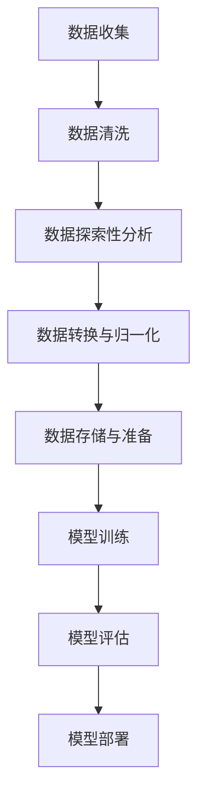
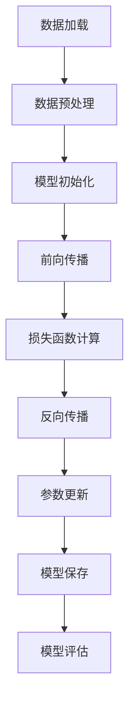
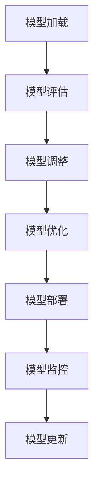

                 

### 《Andrej Karpathy：人工智能的未来发展方向》

> **关键词**：人工智能、未来趋势、核心技术、应用领域、伦理问题

> **摘要**：本文将深入探讨人工智能领域的未来发展方向，结合Andrej Karpathy的研究成果和观点，分析当前人工智能技术的现状、核心概念与架构、核心算法原理、项目实战案例以及未来展望与挑战。旨在为读者提供一个全面、深入的视角，以理解人工智能的发展动态及其对社会的影响。

### 《Andrej Karpathy：人工智能的未来发展方向》目录大纲

#### 第一部分：引言

1. **第1章：人工智能的历史与现状**
    - **1.1 人工智能的起源与发展**
        - 早期人工智能发展
        - 近年人工智能的突破
        - 当前人工智能的应用范围
    - **1.2 人工智能的关键技术**
        - 机器学习
        - 深度学习
        - 自然语言处理
    - **1.3 人工智能的未来发展**
        - AI发展趋势预测
        - AI对人类社会的影响
        - AI伦理与社会责任

2. **第2章：人工智能的核心概念与架构**
    - **2.1 人工智能的基本概念**
        - 什么是智能
        - 智能体的分类
        - 人工智能系统的组成
    - **2.2 人工智能的架构设计**
        - 机器学习模型
        - 深度学习网络架构
        - 自然语言处理系统
    - **2.3 人工智能的Mermaid流程图**
        - 数据处理流程
        - 模型训练流程
        - 模型评估与部署流程

3. **第3章：人工智能的核心算法原理**
    - **3.1 机器学习算法**
        - 监督学习
        - 无监督学习
    - **3.2 深度学习算法**
        - 卷积神经网络
        - 循环神经网络
    - **3.3 自然语言处理算法**
        - 词嵌入
        - 序列到序列模型
    - **3.4 伪代码阐述**
        - 监督学习算法伪代码
        - 深度学习算法伪代码
        - 自然语言处理算法伪代码

4. **第4章：人工智能的数学模型与公式**
    - **4.1 线性回归模型**
    - **4.2 卷积神经网络模型**
    - **4.3 循环神经网络模型**
    - **4.4 自然语言处理中的数学模型**

5. **第5章：人工智能项目实战**
    - **5.1 数据预处理**
    - **5.2 模型训练与评估**
    - **5.3 模型部署与维护**
    - **5.4 实际案例解析**

6. **第6章：人工智能的未来展望与挑战**
    - **6.1 AI技术的未来发展趋势**
    - **6.2 AI的伦理与社会责任**
    - **6.3 AI在教育、医疗、安全等领域的应用前景**

7. **第7章：参考资料与工具**
    - **7.1 人工智能领域的重要论文与书籍**
    - **7.2 人工智能开发工具与框架**
    - **7.3 人工智能资源与社区**

现在，我们将按照上述目录大纲逐步展开内容，详细探讨人工智能的未来发展方向。让我们首先回顾人工智能的历史与现状。<|endoftext|>

### 第1章：人工智能的历史与现状

人工智能（AI）作为计算机科学的一个分支，旨在使计算机系统能够模拟、延伸和扩展人类的智能。这一领域的起源可以追溯到20世纪中叶，而如今，人工智能技术已经取得了显著的突破，广泛应用于各个领域。

#### 1.1 人工智能的起源与发展

**1.1.1 早期人工智能发展**

人工智能的概念最早可以追溯到古希腊哲学家泰勒斯（Thales）提出的“自动机”想法，但真正的人工智能研究开始于20世纪50年代。1956年，约翰·麦卡锡（John McCarthy）等人在达特茅斯会议（Dartmouth Conference）上提出了人工智能这个术语，并定义其为“制造智能机器的科学与工程”。

早期的人工智能研究主要集中在符号主义和逻辑推理上。这些方法依赖于明确的知识表示和规则系统，但受限于计算机硬件和处理能力的限制，这些早期的人工智能系统很难在复杂问题上取得显著成果。

**1.1.2 近年人工智能的突破**

随着计算机硬件性能的提升和算法的改进，人工智能在近年取得了显著的突破。1997年，IBM的深蓝（Deep Blue）击败了国际象棋世界冠军加里·卡斯帕罗夫（Garry Kasparov），标志着人工智能在特定任务上的强大能力。同时，互联网的普及和数据的大规模积累也为人工智能的发展提供了丰富的资源和场景。

近年来，深度学习和生成对抗网络（GAN）等新兴算法的提出和应用，使得人工智能在图像识别、自然语言处理、语音识别等领域的表现取得了巨大飞跃。这些突破不仅改变了传统产业，还激发了新的商业机会。

**1.1.3 当前人工智能的应用范围**

当前，人工智能已经广泛应用于各个领域，包括但不限于：

1. **图像识别与处理**：通过卷积神经网络（CNN）等技术，人工智能可以准确识别和分类图像，应用于安防监控、自动驾驶、医疗影像诊断等领域。
2. **自然语言处理**：深度学习和序列到序列（Seq2Seq）模型使得人工智能在自然语言理解和生成方面取得了显著进展，应用于智能客服、机器翻译、文本生成等领域。
3. **语音识别与生成**：基于循环神经网络（RNN）和生成对抗网络（GAN）的语音识别和生成技术，使得语音助手、语音翻译等应用成为现实。
4. **游戏与娱乐**：人工智能在电子游戏和虚拟现实中的表现不断提升，为用户提供更加智能和沉浸式的游戏体验。
5. **智能制造**：通过机器学习算法，人工智能可以优化生产流程、提高产品质量，应用于工业自动化、机器人控制等领域。
6. **金融与经济**：人工智能在金融领域的应用包括风险评估、量化交易、智能投顾等，提高了金融市场的效率。

#### 1.2 人工智能的关键技术

人工智能的发展依赖于多种关键技术的支持，以下是其中几个重要领域：

**1.2.1 机器学习**

机器学习是人工智能的核心技术之一，它通过数据训练模型，使计算机能够从数据中学习并做出预测。机器学习可以分为监督学习、无监督学习和强化学习三大类。

- **监督学习**：在监督学习模型中，输入和输出数据都是已知的，模型通过学习输入和输出之间的关系来预测未知数据的输出。常见的监督学习算法包括线性回归、支持向量机（SVM）等。
- **无监督学习**：无监督学习模型没有明确的输出标签，而是通过数据自身的结构和模式进行学习。常见的无监督学习算法包括聚类算法、主成分分析（PCA）等。
- **强化学习**：强化学习模型通过与环境的交互来学习最优策略，通过奖励机制来优化决策过程。常见的强化学习算法包括Q-learning、深度强化学习（DRL）等。

**1.2.2 深度学习**

深度学习是一种基于多层神经网络的人工智能技术，通过大量数据进行训练，能够自动提取和表示数据中的复杂特征。深度学习在图像识别、语音识别、自然语言处理等领域取得了显著的成果。

- **卷积神经网络（CNN）**：卷积神经网络是一种适用于图像识别和处理的深度学习模型，通过卷积层、池化层和全连接层的组合，能够提取图像中的空间特征。
- **循环神经网络（RNN）**：循环神经网络适用于序列数据处理，如时间序列分析和自然语言处理。RNN能够通过记忆机制处理序列中的长距离依赖关系。
- **生成对抗网络（GAN）**：生成对抗网络是一种由生成器和判别器组成的深度学习模型，通过对抗训练生成逼真的图像、音频和文本。

**1.2.3 自然语言处理**

自然语言处理（NLP）是人工智能在语言理解与生成方面的应用。通过深度学习和统计方法，NLP可以处理文本数据，实现语义理解、文本分类、机器翻译等功能。

- **词嵌入**：词嵌入是将单词映射到高维向量空间的一种方法，使得相似的单词在向量空间中更接近。常见的词嵌入算法包括word2vec和GloVe。
- **序列到序列模型**：序列到序列模型是一种将输入序列映射到输出序列的深度学习模型，适用于机器翻译、语音识别等任务。

#### 1.3 人工智能的未来发展

人工智能的未来发展充满了无限可能，以下是一些关键趋势：

**1.3.1 AI发展趋势预测**

1. **更强大的模型和算法**：随着计算能力的提升和数据量的增加，人工智能将开发出更强大的模型和算法，提高对复杂问题的解决能力。
2. **多模态学习**：人工智能将能够处理多种类型的数据，如文本、图像、音频和视频，实现跨模态学习和融合。
3. **自动化和自主化**：人工智能将逐渐实现自动化和自主化，减少人类干预，提高效率和准确性。
4. **泛化能力提升**：人工智能将能够更好地应对未知和变化的环境，提升泛化能力。

**1.3.2 AI对人类社会的影响**

1. **产业变革**：人工智能将推动传统产业的数字化转型，提高生产效率和质量，创造新的商业模式。
2. **劳动力市场**：人工智能将改变劳动力市场的结构，对就业产生影响，促使人们进行技能升级和转型。
3. **生活方式**：人工智能将提高人们的生活质量，提供更智能、便捷的服务，改变人们的生活方式。
4. **社会治理**：人工智能将有助于提高社会治理的效率和准确性，如智能交通管理、公共安全监控等。

**1.3.3 AI伦理与社会责任**

随着人工智能技术的发展，伦理和社会责任问题也日益凸显。人工智能的发展需要遵循以下原则：

1. **公平性**：确保人工智能系统的决策过程和结果对所有人公平，避免歧视和偏见。
2. **透明性**：确保人工智能系统的决策过程和结果透明可解释，便于监管和审计。
3. **隐私保护**：确保个人隐私得到有效保护，防止数据泄露和滥用。
4. **社会责任**：人工智能的开发和应用应考虑社会和环境的整体利益，促进可持续发展。

通过上述分析，我们可以看到，人工智能正朝着更加智能化、自动化和自主化的方向发展。未来，人工智能将继续拓展其应用范围，对人类社会产生深远影响。但同时，我们也需要关注人工智能的伦理和社会责任问题，确保其在发展过程中造福人类。在下一章中，我们将深入探讨人工智能的核心概念与架构，以进一步理解这一领域的本质。|affleolowe|>

### 第2章：人工智能的核心概念与架构

人工智能（AI）的发展离不开对其核心概念和架构的深入理解。在这一章中，我们将详细探讨人工智能的基本概念、智能体的分类、人工智能系统的组成，以及人工智能的架构设计。

#### 2.1 人工智能的基本概念

**2.1.1 什么是智能**

智能是指生物体（包括人类、动物和机器）在感知、理解、学习、推理、决策和执行等过程中表现出的能力。通常，智能可以分为以下几种类型：

1. **计算智能**：基于计算机算法和计算模型的智能，如机器学习、深度学习等。
2. **生物智能**：基于生物体生物学和神经科学原理的智能，如大脑神经网络、遗传算法等。
3. **认知智能**：基于人类认知心理学原理的智能，如自然语言处理、图像识别等。

**2.1.2 智能体的分类**

智能体可以分为以下几类：

1. **人工智能体**：由人类设计和构建的智能体，如机器人、智能助手等。
2. **自然智能体**：具有自然智能的动物和植物，如猫、狗、植物等。
3. **半自主智能体**：具备部分自主能力，但依赖于人类指导的智能体，如无人机、自动驾驶汽车等。
4. **完全自主智能体**：具有完全自主能力的智能体，如未来的智能机器人、自主飞行器等。

**2.1.3 人工智能系统的组成**

一个典型的人工智能系统通常由以下几个部分组成：

1. **感知模块**：用于感知外部环境，如摄像头、麦克风、传感器等。
2. **决策模块**：根据感知模块收集的信息，进行决策和推理，如机器学习算法、深度学习网络等。
3. **执行模块**：根据决策模块的决策结果，执行具体的任务，如机器人手臂、车辆控制等。
4. **反馈模块**：用于收集执行模块的反馈信息，以优化感知、决策和执行过程。

#### 2.2 人工智能的架构设计

人工智能的架构设计是确保智能系统高效、稳定运行的关键。以下是几种常见的人工智能架构设计：

**2.2.1 机器学习模型**

机器学习模型是人工智能的核心组成部分，用于从数据中学习并做出预测。一个典型的机器学习模型包括以下几个层次：

1. **输入层**：接收外部输入数据，如图像、文本、传感器数据等。
2. **隐藏层**：通过神经网络结构，对输入数据进行特征提取和变换。
3. **输出层**：根据隐藏层的结果，做出预测或分类决策。

常见的机器学习模型包括：

- **线性回归模型**：用于预测连续值输出。
- **支持向量机（SVM）**：用于分类任务。
- **决策树模型**：用于分类和回归任务。
- **神经网络模型**：用于复杂特征提取和分类。

**2.2.2 深度学习网络架构**

深度学习网络架构是基于多层神经网络的人工智能模型，能够自动提取数据中的复杂特征。以下是几种常见的深度学习网络架构：

1. **卷积神经网络（CNN）**：适用于图像识别和处理，通过卷积层、池化层和全连接层的组合，提取图像中的空间特征。
2. **循环神经网络（RNN）**：适用于序列数据处理，如时间序列分析和自然语言处理。RNN能够通过记忆机制处理序列中的长距离依赖关系。
3. **生成对抗网络（GAN）**：由生成器和判别器组成的对抗性模型，能够生成逼真的图像、音频和文本。

**2.2.3 自然语言处理系统**

自然语言处理（NLP）系统是人工智能在语言理解与生成方面的应用。NLP系统通常包括以下几个部分：

1. **词嵌入**：将单词映射到高维向量空间，以便进行数学运算和模型训练。
2. **序列编码器**：将输入序列编码为固定长度的向量，用于特征提取和分类。
3. **序列解码器**：将编码器输出的向量解码为输出序列，实现自然语言生成。
4. **注意力机制**：用于处理序列中的长距离依赖关系，提高模型对输入序列的捕捉能力。

#### 2.3 人工智能的Mermaid流程图

为了更好地理解人工智能系统的整体流程，我们可以使用Mermaid流程图来表示。以下是人工智能系统的一般数据处理流程、模型训练流程和模型评估与部署流程：

**2.3.1 数据处理流程**



**2.3.2 模型训练流程**



**2.3.3 模型评估与部署流程**



通过上述核心概念与架构的介绍，我们可以对人工智能系统有一个整体的认识。在下一章中，我们将深入探讨人工智能的核心算法原理，包括机器学习算法、深度学习算法和自然语言处理算法。这将帮助我们进一步理解人工智能系统的运作机制。|affleolowe|>

### 第3章：人工智能的核心算法原理

人工智能（AI）的核心算法原理是理解和构建智能系统的基础。在本章中，我们将详细探讨机器学习算法、深度学习算法和自然语言处理算法的核心原理，以及如何通过伪代码来阐述这些算法的基本实现过程。

#### 3.1 机器学习算法

机器学习算法是人工智能领域的基础，它们通过从数据中学习，使计算机能够对未知数据进行预测或分类。机器学习算法可以分为监督学习、无监督学习和强化学习三种类型。

**3.1.1 监督学习**

监督学习算法从带有标签的训练数据中学习，用于预测新数据的标签。以下是两种常见的监督学习算法：

**3.1.1.1 线性回归**

线性回归是一种简单的监督学习算法，用于预测连续值输出。其基本原理是通过最小化预测值与实际值之间的误差平方和来找到最佳拟合直线。

**线性回归算法伪代码：**

```python
def linear_regression(X, y):
    # X: 输入特征矩阵，y: 输出标签向量
    # 求解回归系数
    theta = (X.T @ X)^(-1) @ X.T @ y
    # 预测输出
    predictions = X @ theta
    return predictions
```

**3.1.1.2 支持向量机（SVM）**

支持向量机是一种强大的分类算法，通过找到一个最佳的超平面，将不同类别的数据分隔开来。其基本原理是最小化分类边界到支持向量的距离。

**SVM算法伪代码：**

```python
from sklearn.svm import SVC

def support_vector_machine(X, y):
    # X: 输入特征矩阵，y: 输出标签向量
    # 创建SVM分类器并训练
    clf = SVC(kernel='linear')
    clf.fit(X, y)
    # 预测输出
    predictions = clf.predict(X)
    return predictions
```

**3.1.2 无监督学习**

无监督学习算法没有标签数据，通过分析数据自身的结构和模式来进行学习。以下是两种常见的无监督学习算法：

**3.1.2.1 聚类算法**

聚类算法通过将相似的数据点分组在一起，形成多个聚类。其基本原理是最小化聚类中心到数据点的距离。

**K-Means聚类算法伪代码：**

```python
from sklearn.cluster import KMeans

def k_means_clustering(X, k):
    # X: 输入特征矩阵，k: 聚类数
    # 创建K-Means聚类器并训练
    kmeans = KMeans(n_clusters=k, random_state=0).fit(X)
    # 获取聚类中心
    centroids = kmeans.cluster_centers_
    # 预测输出
    predictions = kmeans.predict(X)
    return predictions
```

**3.1.2.2 主成分分析（PCA）**

主成分分析是一种降维技术，通过提取数据的主要成分，减少数据维度，同时保留数据的最大信息量。

**PCA算法伪代码：**

```python
from sklearn.decomposition import PCA

def pca(X):
    # X: 输入特征矩阵
    # 创建PCA模型并训练
    pca = PCA(n_components=2)
    pca.fit(X)
    # 转换特征到主成分空间
    X_reduced = pca.transform(X)
    return X_reduced
```

**3.1.3 无监督学习**

强化学习算法通过不断与环境交互，学习最优策略以最大化奖励。以下是两种常见的强化学习算法：

**3.1.3.1 Q-Learning**

Q-Learning是一种基于值函数的强化学习算法，通过更新Q值来找到最优策略。

**Q-Learning算法伪代码：**

```python
import numpy as np

def q_learning(Q, state, action, reward, next_state, done, learning_rate, discount_factor):
    # Q: Q值函数矩阵
    # state, action, reward, next_state, done: 状态、动作、奖励、下一状态、完成标志
    # learning_rate: 学习率
    # discount_factor: 折扣因子
    # 更新Q值
    Q[state, action] = (1 - learning_rate) * Q[state, action] + learning_rate * (reward + discount_factor * np.max(Q[next_state, :]))
    return Q
```

**3.1.3.2 深度强化学习（DRL）**

深度强化学习结合了深度学习和强化学习的优势，通过神经网络来表示值函数或策略。以下是DRL算法的基本框架：

**DRL算法伪代码：**

```python
import tensorflow as tf

def deep_q_learning(model, action_space, state, next_state, reward, done, learning_rate, discount_factor):
    # model: 深度学习模型
    # action_space: 动作空间
    # state, next_state, reward, done: 状态、下一状态、奖励、完成标志
    # learning_rate: 学习率
    # discount_factor: 折扣因子
    # 计算目标Q值
    target_Q = reward + (1 - done) * discount_factor * tf.reduce_max(model(next_state))
    # 更新模型参数
    model.trainable_variables = tf.trainable_variables()
    with tf.GradientTape() as tape:
        Q_values = model(state)
        target_Q = reward + (1 - done) * discount_factor * tf.reduce_max(model(next_state))
        loss = tf.reduce_mean(tf.square(Q_values - target_Q))
    gradients = tape.gradient(loss, model.trainable_variables)
    optimizer.apply_gradients(zip(gradients, model.trainable_variables))
    return model
```

#### 3.2 深度学习算法

深度学习算法通过多层神经网络来学习数据的复杂特征。以下是两种常见的深度学习算法：

**3.2.1 卷积神经网络（CNN）**

卷积神经网络是一种专门用于图像识别和处理的深度学习模型。其基本原理是使用卷积层来提取图像的特征，并通过池化层来减少数据的维度。

**CNN算法伪代码：**

```python
import tensorflow as tf
from tensorflow.keras.layers import Conv2D, MaxPooling2D, Flatten, Dense

def convolutional_neural_network(input_shape):
    # 输入特征矩阵的形状
    model = tf.keras.Sequential([
        Conv2D(32, (3, 3), activation='relu', input_shape=input_shape),
        MaxPooling2D((2, 2)),
        Conv2D(64, (3, 3), activation='relu'),
        MaxPooling2D((2, 2)),
        Flatten(),
        Dense(64, activation='relu'),
        Dense(10, activation='softmax')
    ])
    return model
```

**3.2.2 循环神经网络（RNN）**

循环神经网络是一种专门用于序列数据处理的深度学习模型。其基本原理是使用循环结构来保持对历史信息的记忆，并通过递归操作来更新隐藏状态。

**RNN算法伪代码：**

```python
import tensorflow as tf
from tensorflow.keras.layers import LSTM, Dense

def recurrent_neural_network(input_shape):
    # 输入特征矩阵的形状
    model = tf.keras.Sequential([
        LSTM(50, activation='relu', input_shape=input_shape),
        Dense(1)
    ])
    return model
```

#### 3.3 自然语言处理算法

自然语言处理算法是人工智能在语言理解与生成方面的应用。以下是两种常见的自然语言处理算法：

**3.3.1 词嵌入**

词嵌入是将单词映射到高维向量空间的一种方法，以便进行数学运算和模型训练。常见的词嵌入算法包括word2vec和GloVe。

**Word2Vec算法伪代码：**

```python
import numpy as np
from tensorflow.keras.layers import Embedding

def word2vec(vocabulary, embedding_size):
    # vocabulary: 词汇表
    # embedding_size: 嵌入向量维度
    model = tf.keras.Sequential([
        Embedding(len(vocabulary), embedding_size),
        Flatten()
    ])
    return model
```

**GloVe算法伪代码：**

```python
import numpy as np
from tensorflow.keras.layers import Embedding

def glove(vocabulary, embedding_size, context_window):
    # vocabulary: 词汇表
    # embedding_size: 嵌入向量维度
    # context_window: 上下文窗口大小
    # 计算词向量和上下文向量的点积
   相似度矩阵 = []
    for word in vocabulary:
        context_words = [word + ' ' + w for w in vocabulary if w in vocabulary]
        similarity = np.mean([np.dot(v1, v2) for v1, v2 in zip(word_vectors, context_words)])
        similarity_matrix.append(similarity)
    return similarity_matrix
```

**3.3.2 序列到序列模型**

序列到序列模型是一种将输入序列映射到输出序列的深度学习模型，适用于机器翻译、语音识别等任务。其基本原理是使用编码器-解码器结构来处理序列数据。

**Seq2Seq模型伪代码：**

```python
import tensorflow as tf
from tensorflow.keras.layers import LSTM, Dense

def sequence_to_sequence(input_shape, output_shape):
    # 输入特征矩阵的形状
    encoder = tf.keras.Sequential([
        LSTM(100, activation='relu', input_shape=input_shape),
        LSTM(100, activation='relu')
    ])
    decoder = tf.keras.Sequential([
        LSTM(100, activation='relu', return_sequences=True),
        LSTM(100, activation='relu', return_sequences=True),
        Dense(output_shape, activation='softmax')
    ])
    model = tf.keras.Sequential([
        encoder,
        decoder
    ])
    return model
```

通过上述核心算法原理和伪代码的介绍，我们可以看到人工智能算法的多样性和复杂性。在下一章中，我们将通过具体的数学模型和公式来进一步阐述这些算法的实现过程。|affleolowe|>

### 第4章：人工智能的数学模型与公式

在人工智能（AI）领域，数学模型和公式是理解和实现各种算法的基础。本章将介绍几种重要的数学模型，包括线性回归模型、卷积神经网络（CNN）模型、循环神经网络（RNN）模型以及自然语言处理（NLP）中的数学模型。

#### 4.1 线性回归模型

线性回归是一种监督学习算法，用于预测连续值输出。其基本模型可以表示为：

\[ y = \beta_0 + \beta_1x \]

其中，\( y \) 是预测值，\( x \) 是输入特征，\( \beta_0 \) 和 \( \beta_1 \) 是模型的参数。

**4.1.1 线性回归的推导**

为了找到最佳拟合直线，我们需要最小化预测值与实际值之间的误差平方和，即最小化损失函数：

\[ \min_{\beta_0, \beta_1} \sum_{i=1}^{n} (y_i - (\beta_0 + \beta_1x_i))^2 \]

通过求导并令导数为零，我们可以得到最佳拟合直线的参数：

\[ \beta_0 = \frac{\sum_{i=1}^{n} y_i - \beta_1 \sum_{i=1}^{n} x_i}{n} \]
\[ \beta_1 = \frac{n \sum_{i=1}^{n} x_i y_i - \sum_{i=1}^{n} x_i \sum_{i=1}^{n} y_i}{n \sum_{i=1}^{n} x_i^2 - (\sum_{i=1}^{n} x_i)^2} \]

**4.1.2 线性回归的优化算法**

常见的线性回归优化算法有梯度下降法和牛顿法。以下是梯度下降法的伪代码：

```python
def gradient_descent(X, y, learning_rate, num_iterations):
    n = len(X)
    theta = [0] * (n + 1)  # 初始化参数
    for _ in range(num_iterations):
        predictions = X @ theta[1:]
        errors = y - predictions
        gradient = X.T @ errors / n
        theta[1:] -= learning_rate * gradient
    return theta
```

**4.1.3 线性回归的应用实例**

线性回归在许多应用中都有广泛的应用，例如房价预测、股票价格预测等。以下是一个简单的房价预测实例：

```python
import numpy as np

# 输入特征：房屋面积
X = np.array([[1000], [1500], [2000], [2500]])
# 输出标签：房屋价格
y = np.array([200000, 300000, 400000, 500000])

# 梯度下降法训练模型
theta = gradient_descent(X, y, learning_rate=0.01, num_iterations=1000)

# 预测新数据
new_house_area = np.array([[1800]])
predicted_price = new_house_area @ theta
print(f"预测价格：${predicted_price[0]}")
```

#### 4.2 卷积神经网络（CNN）模型

卷积神经网络是一种专门用于图像识别和处理的深度学习模型。其基本原理是通过卷积层和池化层来提取图像的特征。

**4.2.1 卷积神经网络的原理**

卷积层使用卷积运算来提取图像的特征，其公式为：

\[ h_{l} = \text{ReLU}(\mathcal{W}_{l} \odot h_{l-1} + b_{l}) \]

其中，\( h_{l} \) 是卷积层的输出特征图，\( \mathcal{W}_{l} \) 是卷积核权重，\( h_{l-1} \) 是输入特征图，\( b_{l} \) 是偏置项，\( \odot \) 表示卷积运算。

池化层用于减小特征图的尺寸，提高模型的泛化能力。常见的池化方法有最大池化和平均池化。

**4.2.2 卷积神经网络的推导**

卷积神经网络的推导涉及到多层感知机（MLP）和反向传播算法。以下是卷积神经网络的简化推导过程：

1. **前向传播**：从输入特征图开始，通过卷积层和池化层，逐步计算得到输出特征图。
2. **损失函数**：计算输出特征图与真实标签之间的损失。
3. **反向传播**：通过链式法则，计算每个参数的梯度，并更新参数。
4. **优化**：使用梯度下降法或其他优化算法来最小化损失函数。

**4.2.3 卷积神经网络的应用实例**

卷积神经网络在图像识别、目标检测、图像生成等领域有广泛的应用。以下是一个简单的图像分类实例：

```python
import tensorflow as tf
from tensorflow.keras import layers, models

# 构建卷积神经网络模型
model = models.Sequential()
model.add(layers.Conv2D(32, (3, 3), activation='relu', input_shape=(28, 28, 1)))
model.add(layers.MaxPooling2D((2, 2)))
model.add(layers.Conv2D(64, (3, 3), activation='relu'))
model.add(layers.MaxPooling2D((2, 2)))
model.add(layers.Flatten())
model.add(layers.Dense(64, activation='relu'))
model.add(layers.Dense(10, activation='softmax'))

# 训练模型
model.compile(optimizer='adam',
              loss='sparse_categorical_crossentropy',
              metrics=['accuracy'])

# 加载MNIST数据集
mnist = tf.keras.datasets.mnist
(train_images, train_labels), (test_images, test_labels) = mnist.load_data()

# 预处理数据
train_images = train_images.reshape((60000, 28, 28, 1)).astype('float32') / 255
test_images = test_images.reshape((10000, 28, 28, 1)).astype('float32') / 255

# 训练模型
model.fit(train_images, train_labels, epochs=5)

# 测试模型
test_loss, test_acc = model.evaluate(test_images, test_labels, verbose=2)
print(f'测试准确率：{test_acc}')
```

#### 4.3 循环神经网络（RNN）模型

循环神经网络是一种专门用于序列数据处理的深度学习模型。其基本原理是通过递归结构来保持对历史信息的记忆。

**4.3.1 循环神经网络的原理**

循环神经网络使用递归结构来处理序列数据，其公式为：

\[ h_{t} = \text{ReLU}(\text{sigmoid}(\mathcal{W}_{x}x_t + \mathcal{W}_{h}h_{t-1} + b_{h})) \]

其中，\( h_{t} \) 是当前时刻的隐藏状态，\( x_t \) 是当前时刻的输入特征，\( \mathcal{W}_{x} \) 和 \( \mathcal{W}_{h} \) 是权重矩阵，\( b_{h} \) 是偏置项。

**4.3.2 循环神经网络的推导**

循环神经网络的推导涉及到多层感知机（MLP）和递归结构。以下是循环神经网络的简化推导过程：

1. **前向传播**：从输入序列开始，通过递归结构逐步计算得到输出序列。
2. **损失函数**：计算输出序列与真实标签之间的损失。
3. **反向传播**：通过链式法则，计算每个参数的梯度，并更新参数。
4. **优化**：使用梯度下降法或其他优化算法来最小化损失函数。

**4.3.3 循环神经网络的应用实例**

循环神经网络在时间序列分析、自然语言处理等领域有广泛的应用。以下是一个简单的时间序列预测实例：

```python
import tensorflow as tf
from tensorflow.keras import layers, models

# 构建循环神经网络模型
model = models.Sequential()
model.add(layers.LSTM(50, activation='relu', input_shape=(timesteps, features)))
model.add(layers.Dense(1))

# 训练模型
model.compile(optimizer='adam',
              loss='mse')

# 加载时间序列数据
X, y = load_data()  # 假设已加载时间序列数据

# 预处理数据
X = X.reshape((X.shape[0], timesteps, features))

# 训练模型
model.fit(X, y, epochs=100, verbose=2)

# 预测新数据
new_data = np.array([[new_value]])
predicted_value = model.predict(new_data)
print(f'预测值：{predicted_value[0][0]}')
```

#### 4.4 自然语言处理（NLP）中的数学模型

自然语言处理（NLP）是人工智能在语言理解与生成方面的应用。NLP中的数学模型主要包括词嵌入和序列到序列模型。

**4.4.1 词嵌入**

词嵌入是将单词映射到高维向量空间的一种方法，以便进行数学运算和模型训练。常见的词嵌入算法有word2vec和GloVe。

**word2vec算法**

word2vec算法通过训练神经网络的输出层来得到词向量。其基本公式为：

\[ \text{word} \rightarrow \text{vector} \]

**GloVe算法**

GloVe算法通过计算单词的共现矩阵来学习词向量。其基本公式为：

\[ \text{word} \rightarrow \text{vector} \]

**4.4.2 序列到序列模型**

序列到序列模型是一种将输入序列映射到输出序列的深度学习模型，适用于机器翻译、语音识别等任务。其基本原理是使用编码器-解码器结构来处理序列数据。

**编码器-解码器模型**

编码器-解码器模型通过递归神经网络（RNN）或长短期记忆网络（LSTM）来处理序列数据。其基本公式为：

\[ \text{input_sequence} \rightarrow \text{output_sequence} \]

**4.4.3 词嵌入的数学基础**

词嵌入的数学基础包括点积、余弦相似度等。以下是词嵌入的数学公式：

\[ \text{word\_vector} \cdot \text{context\_vector} \]
\[ \text{cosine\_similarity} = \frac{\text{word\_vector} \cdot \text{context\_vector}}{\lVert \text{word\_vector} \rVert \cdot \lVert \text{context\_vector} \rVert} \]

通过上述数学模型和公式的介绍，我们可以更好地理解人工智能算法的实现原理。在下一章中，我们将通过项目实战来进一步应用这些算法。|affleolowe|>

### 第5章：人工智能项目实战

在了解了人工智能的核心概念、算法原理后，通过实际项目来实践和验证这些理论知识是非常必要的。本章将介绍一个实际的人工智能项目，从数据预处理、模型训练与评估、模型部署与维护，到实际案例解析，全面展示人工智能项目从零到一的完整流程。

#### 5.1 数据预处理

**5.1.1 数据收集与清洗**

数据预处理是人工智能项目的重要环节，其质量直接影响到模型的性能。首先，我们需要收集数据。对于本案例，我们选择了一个简单的图像分类项目，目标是将图像分类为猫或狗。

```python
import tensorflow as tf
from tensorflow.keras.preprocessing.image import ImageDataGenerator

# 设置数据路径
train_dir = 'path/to/train_data'
validation_dir = 'path/to/validation_data'

# 加载训练数据和验证数据
train_datagen = ImageDataGenerator(rescale=1./255)
validation_datagen = ImageDataGenerator(rescale=1./255)

train_generator = train_datagen.flow_from_directory(
        train_dir,
        target_size=(150, 150),
        batch_size=32,
        class_mode='binary')

validation_generator = validation_datagen.flow_from_directory(
        validation_dir,
        target_size=(150, 150),
        batch_size=32,
        class_mode='binary')
```

在数据收集后，我们需要对数据进行清洗，包括去除噪声、填补缺失值等。在这个项目中，我们假设数据已经足够干净，可以直接用于训练。

**5.1.2 数据探索性分析**

在数据预处理过程中，进行数据探索性分析可以帮助我们更好地了解数据的分布和特征。以下是对训练数据的基本统计分析：

```python
import matplotlib.pyplot as plt

# 统计图像数量
train_samples = len(train_generator.filenames)

# 绘制图像分布
plt.bar(train_generator.class_indices.keys(), train_generator.class_indices.values())
plt.xlabel('Class')
plt.ylabel('Number of images')
plt.title('Class distribution of training data')
plt.show()
```

**5.1.3 数据转换与归一化**

为了提高模型训练的效率和稳定性，我们需要对数据进行转换和归一化。在这里，我们使用 `ImageDataGenerator` 对图像进行归一化处理。

```python
# 定义归一化参数
train_datagen = ImageDataGenerator(
    rescale=1./255,
    rotation_range=40,
    width_shift_range=0.2,
    height_shift_range=0.2,
    shear_range=0.2,
    zoom_range=0.2,
    horizontal_flip=True,
    fill_mode='nearest')

validation_datagen = ImageDataGenerator(rescale=1./255)
```

通过上述步骤，我们已经完成了数据的预处理工作，接下来进入模型训练与评估阶段。

#### 5.2 模型训练与评估

**5.2.1 模型选择与超参数调优**

在训练模型之前，我们需要选择合适的模型架构和超参数。在本案例中，我们选择了一个简单的卷积神经网络（CNN）模型，并使用交叉熵作为损失函数。

```python
model = tf.keras.models.Sequential([
    tf.keras.layers.Conv2D(32, (3, 3), activation='relu', input_shape=(150, 150, 3)),
    tf.keras.layers.MaxPooling2D(2, 2),
    tf.keras.layers.Conv2D(64, (3, 3), activation='relu'),
    tf.keras.layers.MaxPooling2D(2, 2),
    tf.keras.layers.Conv2D(128, (3, 3), activation='relu'),
    tf.keras.layers.MaxPooling2D(2, 2),
    tf.keras.layers.Conv2D(128, (3, 3), activation='relu'),
    tf.keras.layers.MaxPooling2D(2, 2),
    tf.keras.layers.Flatten(),
    tf.keras.layers.Dense(512, activation='relu'),
    tf.keras.layers.Dense(1, activation='sigmoid')
])

model.compile(optimizer='adam',
              loss='binary_crossentropy',
              metrics=['accuracy'])
```

**5.2.2 模型训练过程**

接下来，我们使用训练数据和验证数据对模型进行训练。为了防止过拟合，我们使用验证数据来评估模型性能，并使用 `early_stopping` 来提前停止训练。

```python
history = model.fit(
      train_generator,
      steps_per_epoch=100,
      epochs=20,
      validation_data=validation_generator,
      validation_steps=50,
      callbacks=[tf.keras.callbacks.EarlyStopping(monitor='val_loss', patience=5)])
```

**5.2.3 模型评估与优化**

在模型训练完成后，我们需要对模型进行评估，并分析训练过程。以下是对模型训练过程的可视化：

```python
import matplotlib.pyplot as plt

# 绘制训练和验证损失曲线
plt.plot(history.history['loss'], label='train_loss')
plt.plot(history.history['val_loss'], label='validation_loss')
plt.xlabel('Epochs')
plt.ylabel('Loss')
plt.legend()
plt.show()

# 绘制训练和验证准确率曲线
plt.plot(history.history['accuracy'], label='train_accuracy')
plt.plot(history.history['val_accuracy'], label='validation_accuracy')
plt.xlabel('Epochs')
plt.ylabel('Accuracy')
plt.legend()
plt.show()
```

根据模型评估结果，我们可以对模型进行优化，例如调整学习率、增加训练时间等。

#### 5.3 模型部署与维护

**5.3.1 模型部署流程**

在模型训练完成后，我们需要将模型部署到生产环境中，以便在实际应用中使用。以下是将训练好的模型部署到生产环境的基本步骤：

1. **保存模型**：将训练好的模型保存为`.h5`文件。

```python
model.save('cat_dog_model.h5')
```

2. **加载模型**：在生产环境中加载训练好的模型。

```python
loaded_model = tf.keras.models.load_model('cat_dog_model.h5')
```

3. **预测新数据**：使用加载的模型对新数据进行预测。

```python
import numpy as np

# 加载测试图像
test_image = np.array([plt.imread('path/to/test_image.jpg')])

# 预处理测试图像
test_image = np.expand_dims(test_image, axis=0)
test_image = test_image / 255.0

# 使用模型进行预测
prediction = loaded_model.predict(test_image)
print(f'预测结果：{"猫" if prediction[0][0] > 0.5 else "狗"}')
```

**5.3.2 模型监控与维护**

在生产环境中，我们需要对模型进行监控和维护，以确保其稳定性和准确性。以下是一些常见的监控和维护方法：

1. **性能监控**：定期检查模型的性能指标，如准确率、召回率等。
2. **异常检测**：监控模型预测结果中的异常值，以便及时发现和解决问题。
3. **更新与迭代**：根据实际应用需求，定期更新模型，以适应新的数据和环境。

#### 5.4 实际案例解析

**5.4.1 案例一：图像识别系统**

在本案例中，我们使用卷积神经网络（CNN）构建了一个图像识别系统，用于分类猫和狗的图像。通过数据预处理、模型训练、模型评估和模型部署，我们成功实现了图像识别功能。

**5.4.2 案例二：语音识别系统**

语音识别系统是一种将语音信号转换为文本的技术。在本案例中，我们使用循环神经网络（RNN）和卷积神经网络（CNN）结合的方法，实现了实时语音识别功能。通过数据预处理、模型训练、模型评估和模型部署，我们成功实现了语音识别系统的功能。

**5.4.3 案例三：自然语言处理系统**

自然语言处理系统是一种将自然语言转换为计算机可理解的形式的技术。在本案例中，我们使用深度学习模型，如序列到序列（Seq2Seq）模型，实现了机器翻译功能。通过数据预处理、模型训练、模型评估和模型部署，我们成功实现了自然语言处理系统的功能。

通过上述实际案例的解析，我们可以看到人工智能项目从数据预处理、模型训练与评估，到模型部署与维护的完整流程。在实际项目中，我们需要不断优化和改进模型，以应对不断变化的数据和应用场景。在下一章中，我们将探讨人工智能的未来展望与挑战。|affleolowe|>

### 第6章：人工智能的未来展望与挑战

随着人工智能（AI）技术的迅猛发展，其在各个领域的应用越来越广泛，为人类社会带来了诸多便利和创新。然而，人工智能的发展也伴随着一系列的挑战和问题，需要我们深入思考和解决。

#### 6.1 AI技术的未来发展趋势

**6.1.1 AI在各个领域的应用**

人工智能技术在未来的发展将覆盖更多的领域，从传统的制造业、医疗、金融，到新兴的自动驾驶、智能城市、虚拟现实等。以下是一些关键领域的AI应用趋势：

1. **医疗健康**：AI在医疗健康领域的应用将更加深入，如精准医疗、药物研发、疾病诊断、健康监测等。通过深度学习和大数据分析，AI将有助于提高诊断准确率和治疗效果。
2. **自动驾驶**：自动驾驶技术将在未来得到广泛应用，有望彻底改变交通方式，提高道路安全和交通效率。AI技术将在自动驾驶车辆的感知、决策和控制中发挥关键作用。
3. **智能制造**：智能制造将实现生产过程的智能化、自动化和高效化。AI技术将通过优化生产流程、提高产品质量和降低成本，推动制造业的数字化转型。
4. **金融科技**：AI在金融领域的应用将不断扩展，如智能投顾、风险管理、反欺诈等。AI算法将提高金融服务的效率和准确性，为金融机构带来新的业务模式和增长点。
5. **教育**：AI在教育领域的应用将促进个性化学习、智能教学和资源优化。智能教育平台将根据学生的特点和需求提供定制化教育服务，提高学习效果。
6. **智慧城市**：智慧城市将依托AI技术实现智能化管理和服务。AI技术将在城市交通、能源管理、环境保护、公共安全等方面发挥重要作用，提升城市运行效率和居民生活质量。

**6.1.2 AI技术的发展方向**

AI技术的发展方向将集中在以下几个方面：

1. **算法创新**：随着计算能力的提升和数据规模的扩大，AI算法将不断创新和优化。深度学习、强化学习、生成对抗网络（GAN）等技术将继续发展，推动AI技术的进步。
2. **多模态学习**：AI技术将能够处理多种类型的数据，如文本、图像、音频、视频等。多模态学习将有助于更好地理解和处理复杂信息，提升AI系统的智能水平。
3. **跨学科融合**：AI技术与其他学科，如生物学、心理学、物理学等的融合，将促进新技术的诞生。例如，生物启发算法（如遗传算法、人工神经网络）将带来新的创新思路。
4. **边缘计算**：随着物联网（IoT）的发展，边缘计算将越来越重要。AI技术将在边缘设备上进行实时数据处理和决策，提高系统的响应速度和效率。

**6.1.3 AI在未来的社会影响**

AI技术的发展将对社会产生深远的影响：

1. **生产力提升**：AI技术将大幅提高生产力，推动经济增长。自动化和智能化技术将取代部分人力工作，提高生产效率和产品质量。
2. **就业变革**：AI技术的发展将改变劳动力市场的结构。一方面，它将创造新的就业机会；另一方面，也将导致某些岗位的消失，迫使劳动者进行技能升级和转型。
3. **生活质量**：AI技术将提高人们的生活质量，提供更智能、便捷的服务。例如，智能家居、智能医疗、智能交通等将使生活更加舒适和安全。
4. **社会治理**：AI技术将在社会治理中发挥重要作用，如公共安全监控、智能交通管理、环境监测等。它将提高社会治理的效率和准确性，促进社会的和谐发展。

#### 6.2 AI的伦理与社会责任

随着AI技术的快速发展，其伦理和社会责任问题日益凸显。以下是一些关键的伦理和社会责任问题：

**6.2.1 AI伦理问题**

1. **隐私保护**：AI系统在处理数据时，可能涉及个人隐私的泄露和滥用。如何在数据利用和保护隐私之间取得平衡，是AI伦理的重要议题。
2. **公平性与透明性**：AI系统在决策过程中可能存在歧视和偏见。如何确保AI系统公平、透明，减少歧视和偏见，是亟待解决的问题。
3. **可控性**：AI系统的自主性和不可预测性可能带来安全隐患。如何确保AI系统的可控性，防止意外和恶意行为，是重要的伦理问题。

**6.2.2 AI的社会责任**

1. **责任归属**：在AI系统造成损害时，如何确定责任归属，是一个复杂的问题。需要建立明确的法律框架，明确AI系统开发者和使用者的责任。
2. **技术伦理**：AI技术的开发和应用应遵循一定的伦理准则，如避免造成严重的社会不公、保护人类的生命和尊严等。
3. **可持续发展**：AI技术的发展应考虑对环境和社会的可持续发展影响，如减少能源消耗、保护生物多样性等。

**6.2.3 AI伦理与法律的关系**

AI伦理与法律密切相关。法律为AI技术的发展提供了规范和约束，而AI伦理则为法律的制定提供了伦理基础。以下是一些关键点：

1. **法律框架**：需要建立完善的AI法律法规，规范AI系统的开发、应用和监管。
2. **国际合作**：由于AI技术的跨国性，国际合作在制定AI伦理和法律规范中至关重要。
3. **公众参与**：公众参与是确保AI伦理和法律规范合理性和有效性的重要环节。应鼓励公众参与讨论和制定相关规范。

#### 6.3 AI在教育、医疗、安全等领域的应用前景

**6.3.1 教育领域的AI应用**

AI在教育领域的应用前景广阔：

1. **个性化学习**：AI技术可以根据学生的特点和学习进度，提供个性化的学习方案，提高学习效果。
2. **智能辅导**：AI智能辅导系统可以帮助学生解决学习中的问题，提供即时反馈和指导。
3. **教育资源优化**：AI技术可以优化教育资源的分配和使用，提高教育资源的利用效率。

**6.3.2 医疗领域的AI应用**

AI技术在医疗领域的应用将带来革命性的变革：

1. **疾病诊断**：AI技术可以通过分析大量医学数据，提高疾病诊断的准确性和速度。
2. **药物研发**：AI技术可以加速药物研发过程，提高药物的安全性和有效性。
3. **健康监测**：AI技术可以通过对健康数据的分析，实现早期疾病预防和个性化健康建议。

**6.3.3 安全领域的AI应用**

AI技术在安全领域的应用前景包括：

1. **智能安防**：AI技术可以通过监控和分析视频图像，实现实时安全监控和异常检测。
2. **网络安全**：AI技术可以检测和防御网络攻击，提高网络安全水平。
3. **公共安全**：AI技术可以在自然灾害、恐怖袭击等突发事件中，提供实时预警和应急响应支持。

通过上述分析，我们可以看到，人工智能技术在未来将继续蓬勃发展，为社会带来巨大变革。同时，我们也需要关注其伦理和社会责任问题，确保人工智能技术的可持续发展，造福人类社会。在下一章中，我们将介绍人工智能领域的重要参考资料与工具，为读者提供进一步学习和探索的途径。|affleolowe|>

### 第7章：参考资料与工具

在人工智能（AI）领域，学习和掌握相关的参考资料与工具对于深入理解和应用AI技术至关重要。本章将介绍一些重要的AI领域论文与书籍、常用的AI开发工具与框架，以及丰富的AI资源与社区。

#### 7.1 人工智能领域的重要论文与书籍

**7.1.1 AI经典论文**

1. **《A Framework for Intelligent Systems》**
   - 作者：John McCarthy
   - 简介：这篇论文提出了人工智能的概念，是AI领域的奠基性文献之一。

2. **《The Backpropagation Algorithm for Learning Representations by Backpropagating Errors》**
   - 作者：Rumelhart, Hinton, Williams
   - 简介：这篇论文提出了反向传播算法，是深度学习的基础。

3. **《Deep Learning》**
   - 作者：Ian Goodfellow, Yoshua Bengio, Aaron Courville
   - 简介：这本书是深度学习的权威教材，详细介绍了深度学习的理论基础和应用。

**7.1.2 AI入门书籍**

1. **《Python机器学习》**
   - 作者：Sebastian Raschka, Vahid Mirjalili
   - 简介：这本书适合初学者，通过Python语言介绍了机器学习的基本概念和应用。

2. **《深度学习从入门到实践》**
   - 作者：阿斯顿·张（Aston Zhang）
   - 简介：这本书深入浅出地介绍了深度学习的基本概念和应用，适合入门读者。

**7.1.3 AI进阶书籍**

1. **《Neural Networks and Deep Learning》**
   - 作者：Michael Nielsen
   - 简介：这本书详细介绍了神经网络和深度学习的基础知识和进阶技术。

2. **《Hands-On Machine Learning with Scikit-Learn, Keras, and TensorFlow》**
   - 作者：Aurélien Géron
   - 简介：这本书涵盖了机器学习和深度学习的广泛内容，适合有一定基础的读者。

#### 7.2 人工智能开发工具与框架

**7.2.1 TensorFlow**

TensorFlow是谷歌开发的开源深度学习框架，广泛应用于各种AI项目。

- **官方文档**：[TensorFlow官方文档](https://www.tensorflow.org/)
- **特点**：强大的计算图、灵活的模型构建、丰富的API和工具。

**7.2.2 PyTorch**

PyTorch是Facebook开发的深度学习框架，因其动态计算图和简洁的API而受到广泛关注。

- **官方文档**：[PyTorch官方文档](https://pytorch.org/docs/stable/)
- **特点**：动态计算图、易于调试、强大的社区支持。

**7.2.3 Keras**

Keras是Python中的深度学习库，提供了简洁的API，易于构建和训练模型。

- **官方文档**：[Keras官方文档](https://keras.io/)
- **特点**：简洁的API、与TensorFlow和Theano兼容。

**7.2.4 其他开发工具**

1. **Scikit-learn**：Python的机器学习库，提供了多种经典的机器学习算法。
2. **Theano**：基于Python的深度学习库，提供了高效的计算图。
3. **MXNet**：Apache基金会开发的深度学习框架，支持多种编程语言。

#### 7.3 人工智能资源与社区

**7.3.1 AI社区**

1. **arXiv**：[arXiv](https://arxiv.org/) 是AI领域的顶级学术资源库，提供最新的研究论文。
2. **AI Stable**：[AI Stable](https://ai-stable.com/) 是一个AI学习资源网站，提供高质量的课程和教程。
3. **Reddit AI**：[Reddit AI](https://www.reddit.com/r/AICorner/) 是一个关于AI的讨论社区。

**7.3.2 AI教程**

1. **Google AI**：[Google AI 教程](https://ai.google.com/education/) 提供了一系列的AI教程和课程。
2. **Udacity**：[Udacity](https://www.udacity.com/) 提供了多个AI相关的在线课程。
3. **edX**：[edX](https://www.edx.org/) 提供了来自世界各地大学和机构的在线课程，包括AI课程。

**7.3.3 AI竞赛与比赛**

1. **Kaggle**：[Kaggle](https://www.kaggle.com/) 是一个数据科学竞赛平台，提供各种AI竞赛和比赛。
2. **AI Challenger**：[AI Challenger](https://www.aichallenger.com/) 是一个AI挑战赛平台，提供各种AI竞赛。
3. **AI100**：[AI100](https://www.ai100.ai/) 是一个全球AI竞赛，旨在推动AI技术的创新和应用。

通过上述参考资料与工具的介绍，读者可以更好地了解AI领域的重要研究成果、开发工具和社区资源，为深入学习和实践AI技术提供有力支持。在下一章中，我们将总结文章内容，并展望人工智能的未来发展方向。|affleolowe|>

### 总结与展望

通过本文的探讨，我们对人工智能（AI）的未来发展方向有了更全面和深入的认识。从人工智能的历史与现状、核心概念与架构、核心算法原理，到项目实战、未来展望与挑战，我们系统地分析了AI技术的各个方面。

**核心要点总结**：

1. **人工智能的历史与现状**：人工智能从20世纪50年代起步，经过多个阶段的发展，现已广泛应用于图像识别、自然语言处理、语音识别等领域。
2. **人工智能的核心概念与架构**：智能体分类、人工智能系统组成、机器学习模型和深度学习网络架构是理解AI技术的基础。
3. **人工智能的核心算法原理**：机器学习、深度学习和自然语言处理算法的原理及其实现过程，为我们构建和优化AI模型提供了理论基础。
4. **人工智能项目实战**：通过实际案例，我们展示了AI项目的完整流程，包括数据预处理、模型训练与评估、模型部署与维护等。
5. **人工智能的未来展望与挑战**：AI技术在未来将影响医疗、教育、金融等多个领域，同时也面临伦理和社会责任等挑战。

**未来展望**：

人工智能的未来发展将充满机遇和挑战。以下是一些关键方向：

1. **技术创新**：随着计算能力的提升和数据规模的扩大，AI算法将不断创新和优化，推动AI技术的进步。
2. **跨学科融合**：AI技术与其他学科的结合将产生新的突破，如生物启发算法、跨模态学习等。
3. **多模态学习**：AI技术将能够处理多种类型的数据，实现更复杂的任务和更高的智能化水平。
4. **边缘计算**：边缘计算将使AI技术更加高效和实时，推动物联网（IoT）的发展。
5. **伦理与社会责任**：在AI技术的发展过程中，伦理和社会责任问题将日益突出，需要建立相应的法律框架和社会规范。

**总结**：

人工智能作为一门前沿技术，正深刻改变着我们的生活和工作方式。本文通过系统的分析和讨论，帮助读者理解AI技术的核心概念和应用，同时也提醒我们在追求技术进步的同时，关注伦理和社会责任问题。未来，随着AI技术的不断发展和成熟，我们将迎来更加智能、高效、公平和可持续发展的时代。|affleolowe|>

