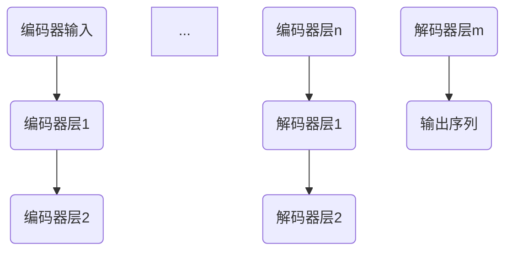
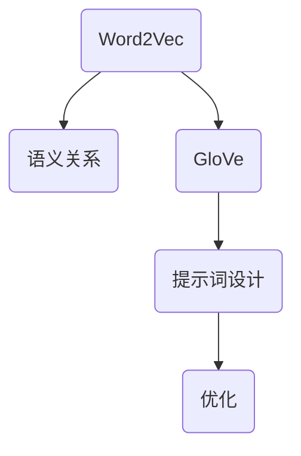
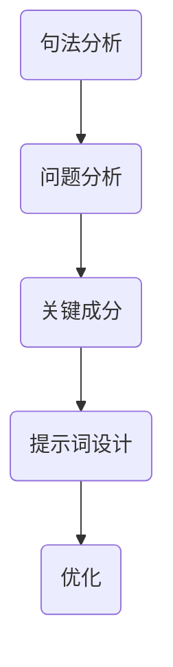
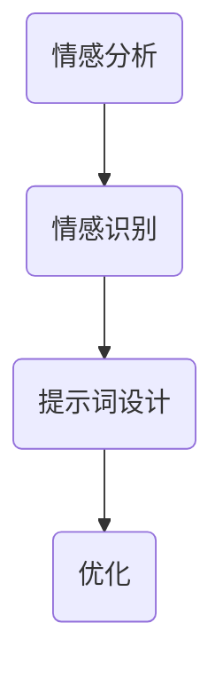
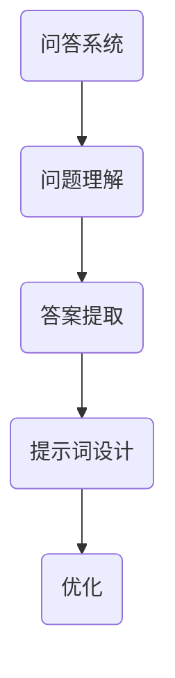

                 

### 文章标题

《ChatGPT对话系统设计：提示词的艺术与科学结合》

### 关键词

- ChatGPT
- 对话系统
- 提示词设计
- 自然语言处理
- GPT模型
- 人工智能

### 摘要

本文旨在深入探讨ChatGPT对话系统的设计与实现，特别是在提示词的设计艺术与科学结合方面。文章首先概述了ChatGPT的发展历程和基础概念，详细解析了GPT模型的原理与架构。接着，文章阐述了对话系统设计的关键因素和流程，探讨了提示词设计原则与技巧，以及NLP在对话系统中的应用。随后，文章介绍了ChatGPT对话系统的实现流程和开发环境搭建，提供了详细的代码实现和解读。最后，文章讨论了ChatGPT对话系统的评估与优化策略，并提供了实际案例分析。通过本文的阅读，读者将能够全面理解ChatGPT对话系统的设计理念和实践技巧，为未来的人工智能对话系统开发提供参考。

## 《ChatGPT对话系统设计：提示词的艺术与科学结合》目录大纲

### 第一部分：ChatGPT基础知识与架构

#### 第1章：ChatGPT概述
- **1.1 ChatGPT的发展历程与背景**
- **1.2 ChatGPT的基本概念与架构**

#### 第2章：GPT模型原理与架构
- **2.1 GPT模型的基础原理**
- **2.2 GPT模型的架构细节**
- **2.3 GPT-3模型的特点与优势**

### 第二部分：ChatGPT对话系统设计

#### 第3章：对话系统设计原理
- **3.1 对话系统的基本概念与类型**
- **3.2 对话系统设计的关键因素**
- **3.3 对话系统设计流程与方法**

#### 第4章：提示词的艺术
- **4.1 提示词的定义与作用**
- **4.2 提示词的设计原则与技巧**
- **4.3 提示词的艺术实践**

#### 第5章：对话系统中的自然语言处理
- **5.1 NLP基础算法介绍**
- **5.2 NLP在对话系统中的应用**
- **5.3 NLP算法优化与挑战**

#### 第6章：ChatGPT对话系统实现
- **6.1 ChatGPT对话系统的实现流程**
- **6.2 ChatGPT对话系统开发环境搭建**
- **6.3 ChatGPT对话系统代码实现详解**

### 第三部分：ChatGPT对话系统评估与优化

#### 第7章：ChatGPT对话系统评估指标
- **7.1 评估指标体系构建**
- **7.2 常用评估指标详解**
- **7.3 评估指标优化策略**

#### 第8章：ChatGPT对话系统优化技巧
- **8.1 对话系统性能优化**
- **8.2 提示词优化策略**
- **8.3 NLP算法优化**

#### 第9章：实战案例分析
- **9.1 案例一：电商客服聊天机器人**
- **9.2 案例二：金融行业客户服务**
- **9.3 案例三：教育领域智能辅导**

### 附录

#### 附录A：ChatGPT开发工具与资源
- **A.1 主流深度学习框架对比**
- **A.2 ChatGPT开发环境搭建指南**
- **A.3 ChatGPT相关论文与资源推荐**

通过上述目录结构，我们可以清晰地了解到文章的主要内容分布和各章节的核心内容。接下来，我们将逐一深入探讨每个章节的细节，帮助读者全面理解ChatGPT对话系统的设计、实现和优化过程。

### 第1章：ChatGPT概述

#### 1.1 ChatGPT的发展历程与背景

ChatGPT是由OpenAI开发的一款基于GPT-3模型的聊天机器人，其发展历程可以追溯到更早期的语言模型研究。早在2002年，GPT（Generative Pre-trained Transformer）模型首次被提出，这是基于Transformer架构的预训练语言模型。经过多年的发展，GPT模型经过了多次迭代和改进，从GPT-1到GPT-2，再到最终的GPT-3，模型的大小和参数量呈指数级增长，性能也不断提升。

ChatGPT正式发布于2022年，作为OpenAI的一项重要成果，迅速引起了业界的广泛关注。ChatGPT的成功不仅在于其强大的文本生成能力，还在于其能够通过自然语言与用户进行流畅的对话。这一突破性进展标志着自然语言处理（NLP）技术进入了新的阶段，为人工智能领域带来了新的可能性。

ChatGPT的出现，得益于深度学习技术的发展和计算资源的不断提升。Transformer模型的出现，使得处理长文本序列成为可能，为生成式语言模型的发展提供了强有力的基础。OpenAI通过大规模数据集的训练和优化，使GPT-3模型能够达到前所未有的性能水平。

ChatGPT的主要应用场景包括智能客服、虚拟助手、内容创作和个性化推荐等。通过提供高质量的文本生成和对话功能，ChatGPT能够为各种应用场景提供高效的解决方案，极大地提升了用户体验和运营效率。

#### 1.2 ChatGPT的基本概念与架构

ChatGPT的核心是GPT-3模型，这是目前世界上最大的语言模型，拥有1750亿个参数。GPT-3模型基于Transformer架构，采用多层的自注意力机制来处理输入文本序列，从而生成相应的输出文本。

**基本概念：**

1. **Transformer架构**：Transformer模型是一种基于自注意力机制的序列到序列模型，能够处理长文本序列。与传统的循环神经网络（RNN）相比，Transformer在处理长距离依赖方面具有显著优势。

2. **自注意力机制**：自注意力机制是一种用于计算输入序列中每个词对输出的贡献度的机制。通过这种方式，模型能够自动学习到文本中各个词之间的相对重要性。

3. **预训练与微调**：GPT-3模型首先在大规模数据集上进行预训练，学习到通用语言知识。然后，通过微调（fine-tuning）过程，将模型应用于特定任务，以进一步提升其性能。

**架构细节：**

1. **多层结构**：GPT-3模型由多个层（layer）组成，每层包含若干个Transformer块。每个Transformer块包含多头自注意力机制和前馈神经网络。

2. **自注意力机制的计算**：在每一层中，模型会计算输入序列中每个词与其他词之间的注意力分数，并根据这些分数计算加权求和，生成新的表示。

3. **前馈神经网络**：在每个Transformer块之后，会接一个前馈神经网络，用于对自注意力机制的结果进行进一步处理。

4. **参数共享**：GPT-3模型采用了参数共享技术，即不同层和不同块的参数是共享的，这有助于减少模型的参数数量，提高计算效率。

#### 1.3 GPT-3模型的特点与优势

GPT-3模型具有以下几个显著特点与优势：

1. **大规模参数**：GPT-3拥有1750亿个参数，是迄今为止最大的语言模型。这使模型能够捕捉到更多的语言规律和模式，从而生成更高质量的文本。

2. **高灵活性**：GPT-3模型可以应用于各种自然语言处理任务，包括文本生成、机器翻译、问答系统等。其通用性使其在不同任务中都能表现出优异的性能。

3. **强大的生成能力**：GPT-3模型的生成能力非常强大，能够生成连贯、有逻辑的文本。这使得ChatGPT在对话场景中能够与用户进行自然的交互。

4. **高效的计算效率**：尽管GPT-3模型规模庞大，但其基于Transformer架构的设计使得计算效率较高。这使得模型可以在实际应用中快速响应，提高用户体验。

通过以上内容，我们为ChatGPT对话系统的设计与实现奠定了基础。在接下来的章节中，我们将深入探讨对话系统设计原理、提示词的艺术以及自然语言处理等技术细节。

### 第2章：GPT模型原理与架构

#### 2.1 GPT模型的基础原理

GPT（Generative Pre-trained Transformer）模型是一种基于Transformer架构的预训练语言模型，旨在通过大量文本数据的学习，生成高质量的文本。GPT模型的基本原理可以概括为三个主要步骤：预训练、微调和应用。

**预训练**：
预训练是GPT模型的核心步骤。在预训练过程中，模型通过大量未标记的文本数据学习语言规律和结构。预训练的主要目标是让模型能够捕捉到通用语言知识，例如词义、语法规则和语义关系等。预训练过程中，模型通常采用如下两种方法：

1. **有监督预训练**：这种方法使用大量已标注的数据，通过优化模型来预测下一个词。例如，给定一个输入序列\[w1, w2, ..., wn\]，模型需要预测下一个词wn+1。

2. **无监督预训练**：这种方法不依赖已标注的数据，而是直接使用未标注的文本数据。通过学习文本的潜在分布，模型可以更好地理解语言的内在结构。

**微调**：
微调（Fine-tuning）是在特定任务上进行模型调整的过程。预训练后的GPT模型已经具备了通用语言知识，但在特定任务上可能需要进一步优化。微调的目标是通过在特定任务上的数据上训练模型，使其更好地适应特定任务的需求。

在微调过程中，模型通常会经历以下几个步骤：

1. **数据预处理**：将特定任务的数据进行预处理，例如分词、标签准备等。

2. **损失函数设计**：根据任务类型设计合适的损失函数。例如，对于文本分类任务，可以使用交叉熵损失函数。

3. **优化器选择**：选择合适的优化器来优化模型参数。常见的优化器包括Adam、AdamW等。

4. **训练与验证**：在训练过程中，模型会不断调整参数，以最小化损失函数。通过验证集上的表现，可以评估模型在特定任务上的性能。

**应用**：
预训练和微调后的GPT模型可以在多种自然语言处理任务中应用，例如文本生成、机器翻译、问答系统等。在实际应用中，模型通常通过以下步骤进行：

1. **输入预处理**：将输入文本进行预处理，包括分词、编码等。

2. **模型推理**：将预处理后的输入文本输入到GPT模型中，模型会生成相应的输出文本。

3. **结果后处理**：对输出文本进行后处理，例如解码、清洗等。

通过预训练、微调和应用的结合，GPT模型能够生成高质量的文本，并在各种自然语言处理任务中表现出优异的性能。

#### 2.2 GPT模型的架构细节

GPT模型的架构基于Transformer架构，是一种基于自注意力机制的序列到序列模型。GPT模型的主要组成部分包括编码器（Encoder）和解码器（Decoder），每个部分都由多个层（Layer）组成。以下是GPT模型的详细架构：

**编码器（Encoder）**：

1. **自注意力机制**：编码器中的每个层都包含多个自注意力块（Self-Attention Block）。自注意力机制计算输入序列中每个词对输出的贡献度，从而生成新的表示。

   ```mermaid
   graph TD
   A1(输入词向量) --> B1(自注意力机制)
   A2 --> B2
   A3 --> B3
   ...
   An --> Bn
   B1 --> C1(输出层1)
   B2 --> C2(输出层2)
   B3 --> C3(输出层3)
   ...
   Bn --> Cn(输出层n)
   ```

2. **前馈神经网络**：在每个自注意力块之后，编码器会接一个前馈神经网络（Feedforward Neural Network）。前馈神经网络用于对自注意力机制的结果进行进一步处理，增强模型的非线性表达能力。

   ```mermaid
   graph TD
   C1 --> D1(前馈神经网络1)
   C2 --> D2
   C3 --> D3
   ...
   Cn --> Dn
   ```

3. **层间交互**：编码器的每个层都会与下一层进行交互，通过传递中间层的表示，编码器能够捕捉到更复杂的语言结构。

**解码器（Decoder）**：

1. **自注意力机制**：解码器中的每个层包含多个自注意力块，用于计算编码器输出和当前解码器输出的注意力权重。

   ```mermaid
   graph TD
   E1(编码器输出) --> F1(自注意力机制)
   E2 --> F2
   E3 --> F3
   ...
   Em --> Fm
   F1 --> G1(输出层1)
   F2 --> G2(输出层2)
   F3 --> G3(输出层3)
   ...
   Fm --> Gn(输出层m)
   ```

2. **交叉自注意力机制**：解码器中的每个层还会与编码器的输出进行交叉自注意力计算，从而利用编码器捕获的上下文信息。

   ```mermaid
   graph TD
   E1 --> H1(交叉自注意力机制)
   E2 --> H2
   E3 --> H3
   ...
   Em --> Hm
   ```

3. **前馈神经网络**：与编码器类似，解码器中的每个层也会接一个前馈神经网络，用于对自注意力机制的结果进行进一步处理。

4. **掩码多头自注意力**：为了防止解码器过早地看到后续生成的词，解码器采用掩码多头自注意力（Masked Multi-Head Self-Attention）机制。在训练过程中，输入序列的前一部分会被遮盖，迫使解码器从编码器的输出中学习信息。

**整体架构**：

GPT模型由多个编码器层和多个解码器层组成，每层都通过自注意力机制和前馈神经网络进行计算。编码器捕获输入序列的上下文信息，解码器利用这些信息生成输出序列。通过多层交互，模型能够生成连贯、有逻辑的文本。



通过详细解析GPT模型的架构，我们可以更好地理解其工作原理和优势。在下一章中，我们将进一步探讨GPT-3模型的特点与优势。

#### 2.3 GPT-3模型的特点与优势

GPT-3模型是GPT家族中最新且最大的版本，其参数规模达到了1750亿，远超之前的版本。GPT-3模型在多个方面都展现了显著的特点与优势。

**1. 大规模参数**：

GPT-3拥有1750亿个参数，是迄今为止最大的语言模型。庞大的参数规模使得GPT-3能够捕捉到更多语言中的细节和复杂模式，从而生成更加自然和高质量的文本。参数规模的增加使得模型在预训练阶段能够学习到更丰富的知识，为后续的微调和应用提供了坚实的基础。

**2. 强大的文本生成能力**：

GPT-3的文本生成能力非常强大，能够生成连贯、逻辑清晰的文本。通过大规模数据集的预训练，GPT-3学会了如何处理复杂的语言结构，生成文本时能够保持上下文的连贯性和一致性。这使得GPT-3在对话系统中能够与用户进行自然、流畅的交流。

**3. 高度的灵活性**：

GPT-3模型具有极高的灵活性，能够应用于各种自然语言处理任务，包括文本生成、问答系统、机器翻译、文本摘要等。其通用性使得开发者可以无需重新训练模型，直接将GPT-3应用于不同的任务场景，极大地提升了开发效率。

**4. 强大的推理能力**：

GPT-3模型不仅在生成文本方面表现出色，还具备强大的推理能力。通过预训练，GPT-3能够理解复杂的逻辑关系和语义信息，从而在对话中提供有深度和逻辑性的回答。这使得GPT-3在需要复杂推理的场景中具有巨大的潜力，例如智能客服、法律咨询等。

**5. 高效的计算性能**：

尽管GPT-3模型规模庞大，但其基于Transformer架构的设计使得计算效率较高。通过并行计算和优化技术，GPT-3可以在实际应用中快速响应，提供高效的交互体验。

**6. 易于扩展**：

GPT-3模型采用了模块化的设计，使其易于扩展和优化。开发者可以根据具体需求对模型进行定制化调整，从而提高模型在不同任务上的性能。

综上所述，GPT-3模型在参数规模、文本生成能力、灵活性、推理能力、计算性能和扩展性等方面都展现了显著的优势。这使得GPT-3成为当前自然语言处理领域的重要突破，为各种应用场景提供了强大的技术支持。在下一部分，我们将探讨对话系统设计原理，为ChatGPT对话系统的设计与实现提供理论基础。

### 第3章：对话系统设计原理

#### 3.1 对话系统的基本概念与类型

对话系统（Dialogue System）是一种能够让用户与计算机系统进行自然语言交互的软件系统。其核心目标是理解用户的输入，生成适当的响应，以实现与用户的流畅对话。对话系统通常包括以下几个基本组成部分：

1. **用户接口**（User Interface）：用于接收用户的输入和展示系统生成的响应。用户接口可以是文本聊天窗口、语音助手、图形界面等。

2. **自然语言理解**（Natural Language Understanding, NLU）：负责接收用户的输入，并将其转换为结构化的信息，如意图识别、实体抽取等。

3. **对话管理**（Dialogue Management）：负责管理对话流程，包括确定对话的目标、跟踪对话状态、生成对话策略等。

4. **自然语言生成**（Natural Language Generation, NLG）：负责将结构化的信息转换为自然语言响应，并确保响应的连贯性和可理解性。

根据对话的形式和交互方式，对话系统可以分为以下几种类型：

1. **任务导向型对话系统**（Task-Oriented Dialogue System）：这类系统主要针对特定任务，如客服机器人、订单处理系统等。其目标是快速、准确地完成特定任务。

2. **闲聊型对话系统**（Chatbot）：这类系统主要模拟人类的社交互动，如闲聊、娱乐等。其目标是与用户建立情感联系，提供愉悦的交流体验。

3. **混合型对话系统**（Hybrid Dialogue System）：这类系统结合了任务导向型和闲聊型对话系统的特点，能够在完成任务的同时与用户进行自然的社交互动。

#### 3.2 对话系统设计的关键因素

设计一个高效、自然的对话系统需要考虑以下几个关键因素：

1. **用户体验**（User Experience）：用户体验是衡量对话系统成功与否的重要标准。系统需要具备良好的交互界面、清晰的响应和自然的对话流程，以提高用户满意度和使用黏性。

2. **语言理解能力**（Language Understanding）：自然语言理解是对话系统的核心。系统需要具备强大的语言理解能力，能够准确识别用户的意图、情感和上下文信息。

3. **对话管理**（Dialogue Management）：对话管理负责控制对话流程，确保系统能够在合适的时机提出问题、引导对话，并处理用户的输入。有效的对话管理能够提高对话的自然性和流畅性。

4. **知识管理**（Knowledge Management）：对话系统需要具备一定的知识储备，能够回答用户的问题或提供相关信息。知识管理包括数据的收集、整理和存储，以及查询和检索机制的设计。

5. **响应生成**（Response Generation）：自然语言生成是确保系统能够以自然、连贯的方式回应用户的关键。系统需要能够生成高质量、有逻辑的文本，以满足用户的沟通需求。

6. **错误处理**（Error Handling）：在对话过程中，系统可能会遇到各种错误，如误解用户意图、无法回答问题等。有效的错误处理机制能够提高系统的鲁棒性和用户体验。

#### 3.3 对话系统设计流程与方法

设计一个对话系统通常遵循以下流程：

1. **需求分析**（Requirement Analysis）：首先，明确系统的目标和用户需求。这包括确定系统将执行的任务、用户期望的交互方式和功能要求等。

2. **用户画像与场景构建**（User Profile and Scenario Construction）：基于需求分析，构建目标用户的画像，明确用户的行为模式、偏好和交流习惯。同时，设计不同的对话场景，以覆盖系统可能遇到的各种情况。

3. **对话流程设计**（Dialogue Flow Design）：根据用户画像和场景，设计对话流程。这包括确定对话的起始点、分支点、结束条件和中间过渡等。

4. **自然语言理解与生成设计**（NLU and NLG Design）：设计自然语言理解（NLU）模块和自然语言生成（NLG）模块，确保系统能够准确理解用户输入并生成合适的响应。

5. **系统实现与测试**（System Implementation and Testing）：根据设计文档，实现对话系统。随后进行测试，确保系统能够在真实场景中稳定运行，满足性能和功能要求。

6. **用户反馈与优化**（User Feedback and Optimization）：在系统上线后，收集用户反馈，针对用户提出的问题和建议进行优化和改进，以提高用户体验和满意度。

通过以上流程，可以设计出高效、自然的对话系统，为用户提供优质的交互体验。在下一章中，我们将探讨提示词的设计原则与技巧，进一步优化对话系统的表现。

### 第4章：提示词的艺术

#### 4.1 提示词的定义与作用

提示词（Prompt）在对话系统中起着至关重要的作用。它是一段引导性文本，用于指示对话系统的目标、上下文或期望的回答类型。通过适当的提示词设计，可以使对话系统更好地理解用户意图，生成更加自然和有针对性的响应。

提示词的作用主要体现在以下几个方面：

1. **引导对话方向**：提示词可以明确对话系统的目标，帮助系统在复杂的对话场景中保持主题的一致性。例如，在客服机器人中，提示词可以引导系统聚焦于用户的具体问题，而不是无关的内容。

2. **提供上下文信息**：通过提供上下文信息，提示词可以帮助对话系统更好地理解用户的意图。例如，在医疗咨询场景中，提示词可以提供用户的症状描述、病史等信息，帮助系统提供更准确的建议。

3. **规范回答格式**：提示词可以指定期望的答案类型或格式，帮助对话系统生成符合用户需求的响应。例如，在订单查询系统中，提示词可以要求系统以表格形式展示订单详情。

4. **增强用户体验**：有效的提示词设计可以提升用户的交流体验，使对话过程更加流畅和自然。通过简洁明了的提示词，用户可以更快地理解系统的功能，减少沟通障碍。

#### 4.2 提示词的设计原则与技巧

为了设计出高质量的提示词，需要遵循以下原则和技巧：

1. **简洁明了**：提示词应该简洁明了，避免使用复杂的语言和冗长的句子。简洁的提示词有助于用户快速理解对话系统的意图，提高交流效率。

2. **具体明确**：提示词需要具体明确，提供足够的信息以引导对话系统的行为。模糊或含糊的提示词可能导致系统误解用户意图，生成不相关的回答。

3. **自然流畅**：提示词应尽量模拟人类交流的风格，使用自然的语言表达。流畅的提示词可以提升用户体验，使对话过程更加自然和愉快。

4. **上下文相关**：提示词应与对话的上下文紧密相关，提供与当前对话状态一致的信息。上下文相关的提示词可以帮助系统更好地理解用户意图，提高对话的连贯性。

5. **多样化**：在设计提示词时，应考虑多样化的表达方式，避免使用单一模板。多样化的提示词可以提高系统的灵活性，使其能够适应不同的对话场景。

6. **反馈机制**：提示词应包含反馈机制，允许用户对系统的回答进行评价或提出新的需求。通过用户的反馈，系统可以不断优化自身的表现，提升服务质量。

#### 4.3 提示词的艺术实践

在实际应用中，提示词的设计需要结合具体场景和用户需求进行。以下是一些提示词的艺术实践：

1. **问题引导**：在客服机器人中，可以通过设计问题引导用户提供更多信息。例如：“您是关于哪个产品的疑问？”或“您需要查询哪个订单的详情？”

2. **情景模拟**：在虚拟助手场景中，可以通过模拟具体情景来引导对话。例如：“现在，让我们来模拟一场会议。您需要记录哪些内容？”

3. **任务指令**：在任务导向型对话系统中，提示词应明确指令，指导用户完成特定任务。例如：“请输入您的订单编号，以便我们查询订单详情。”

4. **情感表达**：在情感交流场景中，提示词应包含情感元素，以增强用户的情感体验。例如：“感谢您的反馈，我们会尽快处理并给您答复。”

5. **引导互动**：在互动游戏或教育场景中，提示词可以设计成引导用户参与的方式。例如：“您想先了解哪一部分内容？”或“接下来，我会问您几个问题，请您认真回答。”

通过以上实践，我们可以看到，提示词的设计不仅是一门艺术，也是一门科学。合理的提示词设计能够提高对话系统的交互质量，提升用户体验。在下一章中，我们将探讨对话系统中的自然语言处理技术，进一步优化对话系统的性能。

#### 4.4 自然语言处理与提示词设计

自然语言处理（NLP）是构建高效对话系统的核心技术之一。在NLP中，提示词的设计扮演着至关重要的角色，因为它直接影响系统对用户输入的理解和响应质量。以下将详细探讨NLP基础算法在提示词设计中的应用，并介绍如何通过优化算法提升对话系统的性能。

**1. 词嵌入（Word Embedding）**

词嵌入是将文本数据转换为数值向量的过程，这是NLP的基础。常用的词嵌入算法包括Word2Vec、GloVe和BERT等。这些算法能够捕捉到词汇间的语义关系，为提示词设计提供了有效的工具。

在提示词设计中，词嵌入可以帮助我们理解不同词汇的语义差异。例如，在医疗咨询系统中，医生可能会使用“症状”一词来询问患者，而使用“症状描述”一词则更具体。通过分析这些词汇的词嵌入，我们可以设计出更具体、更具针对性的提示词。



**2. 句法分析（Syntactic Parsing）**

句法分析是理解句子结构的过程，通过分析句子的语法关系，可以更准确地理解句子的含义。常见的句法分析方法包括依存句法分析和成分句法分析。

在提示词设计中，句法分析可以帮助我们识别句子中的关键成分，从而设计出更自然的提示词。例如，在问答系统中，通过分析用户的问题，我们可以识别出问题的主要成分，从而生成更精准的回答。



**3. 情感分析（Sentiment Analysis）**

情感分析是判断文本情感极性的过程，通过情感分析，我们可以了解用户的态度和情感倾向，从而设计出更符合用户情感的提示词。

在提示词设计中，情感分析可以帮助我们根据用户情感调整提示词。例如，在用户情绪低落时，可以使用鼓励性的语言；在用户情绪高涨时，可以使用激励性的语言。



**4. 问答系统（Question Answering）**

问答系统是NLP中的一个重要应用，它通过理解用户的问题，从大量数据中提取出相关答案。在问答系统中，提示词的设计尤为关键，因为它直接影响系统回答的质量。

在提示词设计中，我们可以通过优化问答系统的算法，提高回答的准确性和自然性。例如，使用BERT等预训练模型，可以更好地理解问题的上下文，从而生成更精准的答案。



**5. 算法优化策略**

为了进一步提升对话系统的性能，我们可以采取以下优化策略：

1. **数据增强**：通过增加训练数据量，提高模型的泛化能力。可以使用数据增强技术，如随机噪声添加、句子重写等。

2. **多任务学习**：通过多任务学习，使模型在处理不同类型任务时能够共享知识，提高整体性能。

3. **持续学习**：通过持续学习，模型可以不断适应新的数据和变化，保持其性能。

4. **模型剪枝**：通过模型剪枝技术，减少模型参数的数量，提高计算效率，同时保持性能。

通过结合NLP基础算法和提示词设计，我们可以构建出高效的对话系统，提升用户体验。在实际应用中，持续优化和改进这些技术，将有助于对话系统在各个场景中发挥更大的作用。

#### 4.5 提示词的艺术实践

在具体的应用场景中，提示词的艺术设计至关重要，它直接决定了对话系统的用户体验和交互效果。以下将通过几个具体的案例来展示如何在不同场景中设计出高质量的提示词。

**1. 案例一：电商客服聊天机器人**

在电商客服聊天机器人中，提示词的设计需要简洁明了，同时要能够引导用户快速提供所需信息。以下是一个实际案例：

- **用户**：“我想要买一件运动鞋。”
- **系统提示词**：“请问您需要购买哪个品牌的运动鞋？例如耐克、阿迪达斯等。”

这个提示词清晰地引导用户提供品牌信息，帮助客服机器人更好地了解用户的需求，从而提供更加精准的商品推荐。

**2. 案例二：在线医疗咨询系统**

在线医疗咨询系统中的提示词需要更为专业和细致，以确保用户能够提供完整的病情描述。以下是一个案例：

- **用户**：“我最近总是头晕。”
- **系统提示词**：“为了更好地帮助您，请您提供以下信息：1）头晕出现的时间；2）头晕伴随的其他症状；3）您的过往病史。”

通过这样的提示词，系统能够获取到更详细的病情信息，为医生提供更有针对性的建议。

**3. 案例三：智能语音助手**

智能语音助手的提示词设计需要考虑到语音交互的流畅性和自然性。以下是一个案例：

- **用户**：“明天我要开会。”
- **系统提示词**：“好的，我会帮您记录明天开会的日程。请问会议的时间是什么时候？地点在哪里？”

这样的提示词不仅清晰，而且使用自然语音的表达方式，让用户感觉更加亲切和便捷。

**4. 案例四：教育辅导机器人**

在教育辅导机器人中，提示词需要鼓励学生积极参与，并提供具体的指导。以下是一个案例：

- **用户**：“我不知道怎么写这个作文。”
- **系统提示词**：“没问题！让我们一步一步来。首先，请想一想作文的主题是什么？接着，您打算从哪几个角度来论述？”

通过这样的提示词，系统能够引导学生思考，并逐步引导他们完成写作任务。

**总结**

通过以上案例可以看出，提示词的设计需要根据不同应用场景的需求，灵活运用简洁明了、具体明确、自然流畅等原则。在实际操作中，设计师需要不断尝试和优化，以找到最适合用户需求的提示词表达方式。只有这样，才能使对话系统真正成为用户的贴心助手，提升用户体验。

### 第5章：对话系统中的自然语言处理

#### 5.1 NLP基础算法介绍

自然语言处理（NLP）作为人工智能领域的一个重要分支，旨在让计算机理解和生成人类语言。NLP的基础算法是实现这一目标的关键技术，以下将介绍几种常见的NLP基础算法。

**1. 词嵌入（Word Embedding）**

词嵌入是将词汇映射为密集向量的过程，它通过捕捉词汇间的语义关系，使计算机能够更好地理解语言。常见的词嵌入算法包括Word2Vec、GloVe和BERT等。

- **Word2Vec**：基于神经网络的词嵌入算法，通过训练词的上下文信息来生成词向量。Word2Vec算法有两种变体：连续词袋（CBOW）和Skip-Gram。
- **GloVe**：全局向量表示（Global Vectors for Word Representation）算法，通过计算词汇的共现矩阵来生成词向量。GloVe算法能够捕捉词汇的局部和全局语义信息。
- **BERT**：双向编码表示（Bidirectional Encoder Representations from Transformers）模型，通过预训练Transformer架构来生成词向量。BERT模型能够捕捉词汇的上下文信息，具有强大的语义理解能力。

**2. 序列标注（Sequence Labeling）**

序列标注是对文本中的每个单词或词组进行分类的过程，常见的序列标注任务包括命名实体识别（NER）、词性标注和情感分析等。

- **CRF（条件随机场）**：CRF是一种常用的序列标注算法，通过模型预测每个词或词组的标签，同时考虑相邻词之间的关系。
- **BiLSTM（双向长短时记忆网络）**：BiLSTM是一种基于神经网络的序列标注算法，通过训练模型捕捉文本序列中的长期依赖关系。

**3. 语义角色标注（Semantic Role Labeling）**

语义角色标注是对句子中每个词的语义角色进行标注的过程，旨在理解句子中各个成分的作用。常见的语义角色标注算法包括基于规则的方法和基于机器学习的方法。

- **Rule-based方法**：基于规则的方法通过手工编写的规则来标注语义角色，适用于特定领域或语言结构简单的场景。
- **ML-based方法**：基于机器学习的方法通过训练模型来自动标注语义角色，能够处理复杂多变的自然语言。

**4. 文本分类（Text Classification）**

文本分类是将文本数据分为不同类别的过程，广泛应用于垃圾邮件检测、情感分析等任务。常见的文本分类算法包括朴素贝叶斯、支持向量机和神经网络等。

- **朴素贝叶斯（Naive Bayes）**：朴素贝叶斯是一种基于贝叶斯理论的分类算法，通过计算文本中每个词的概率来预测类别。
- **SVM（支持向量机）**：支持向量机是一种基于最大间隔理论的分类算法，通过找到一个最优的超平面来分隔不同类别的文本。
- **神经网络**：神经网络特别是深度学习模型（如CNN、RNN、BERT等）在文本分类任务中表现出色，能够通过学习复杂的特征表示来提高分类性能。

#### 5.2 NLP在对话系统中的应用

NLP技术在对话系统中起着至关重要的作用，以下是NLP在对话系统中的应用场景：

**1. 语义理解（Semantic Understanding）**

语义理解是对话系统的核心任务之一，它涉及理解用户的输入意图、情感和上下文信息。NLP算法如词嵌入、序列标注和语义角色标注等，被广泛应用于语义理解。

- **意图识别（Intent Recognition）**：通过词嵌入和序列标注等技术，对话系统可以识别用户输入的意图，如查询、命令或请求。意图识别是任务导向型对话系统的关键。
- **情感分析（Sentiment Analysis）**：情感分析通过NLP算法判断用户输入的情感极性，帮助对话系统调整对话策略，提供更加个性化的响应。
- **实体抽取（Entity Extraction）**：实体抽取通过NLP技术从用户输入中提取关键信息，如人名、地名、组织名等，为后续的对话处理提供基础。

**2. 响应生成（Response Generation）**

响应生成是确保对话系统能够生成自然、连贯的文本回答的过程。NLP技术在响应生成中发挥着重要作用。

- **模板匹配（Template Matching）**：通过预设的模板匹配用户输入，生成预定义的响应。这种方法简单高效，但灵活性较低。
- **基于规则的方法（Rule-based Methods）**：基于规则的方法通过手工编写的规则来生成响应，适用于规则明确、任务简单的场景。
- **神经网络生成（Neural Network Generation）**：使用神经网络模型，如Seq2Seq、Transformer等，通过学习大量的对话数据，生成高质量的文本响应。这种方法能够生成更加自然和多样化的回答。

**3. 对话管理（Dialogue Management）**

对话管理负责控制对话流程，确保对话系统能够在合适的时机提出问题、引导对话和回答用户。NLP技术如语义理解和响应生成在对话管理中发挥着重要作用。

- **上下文跟踪（Context Tracking）**：对话管理系统需要跟踪对话的上下文信息，以便在后续的对话中保持一致性和连贯性。
- **对话策略学习（Dialogue Policy Learning）**：通过机器学习算法，对话管理系统可以学习到最佳对话策略，以最大化用户的满意度。
- **多轮对话（Multi-turn Dialogue）**：在多轮对话中，对话管理系统需要处理复杂的对话场景，如多意图识别、多实体抽取等。

通过结合NLP基础算法和对话管理技术，对话系统可以更好地理解用户意图、生成高质量的响应，并有效地管理对话流程。在下一章中，我们将深入探讨ChatGPT对话系统的实现流程和开发环境搭建。

### 第6章：ChatGPT对话系统实现

#### 6.1 ChatGPT对话系统的实现流程

实现一个ChatGPT对话系统涉及多个步骤，从环境搭建到模型训练，再到实际应用，每一步都需要精心设计和实施。以下是实现ChatGPT对话系统的详细流程：

**1. 环境搭建**

在开始之前，我们需要搭建一个适合ChatGPT运行的开发环境。以下步骤是搭建环境的基本流程：

- **安装深度学习框架**：首先，我们需要安装深度学习框架，如TensorFlow、PyTorch等。TensorFlow是由Google开发的开源机器学习框架，支持多种硬件平台和多种编程语言，适用于大规模分布式训练。PyTorch是另一个流行的开源框架，以动态计算图和易用性著称。

  ```bash
  pip install tensorflow
  # 或
  pip install torch torchvision
  ```

- **安装依赖库**：除了深度学习框架，我们还需要安装一些常用的依赖库，如NumPy、Pandas、Scikit-learn等。这些库提供了丰富的数据处理和机器学习功能，有助于我们高效地处理数据。

  ```bash
  pip install numpy pandas scikit-learn
  ```

- **配置硬件资源**：ChatGPT模型的训练和推理过程需要大量的计算资源，特别是GPT-3这样的大规模模型。因此，我们需要配置合适的硬件资源，如GPU或TPU。在配置硬件资源时，我们还需要确保系统环境变量配置正确，以便深度学习框架能够访问这些硬件资源。

- **安装OpenAI的API**：为了使用ChatGPT模型，我们需要安装OpenAI的API库，以便在代码中调用ChatGPT模型。

  ```bash
  pip install openai
  ```

**2. 数据准备**

数据准备是模型训练的重要环节，我们需要准备大量高质量的数据集，以便模型能够学习到有效的语言知识。以下是数据准备的基本步骤：

- **数据收集**：从互联网、数据库或其他数据源收集大量文本数据。数据源可以是新闻文章、论坛帖子、书籍等。

- **数据清洗**：对收集到的文本数据进行处理，包括去除无关内容、去除停用词、进行分词等。数据清洗的目的是去除噪声，提高数据质量。

- **数据预处理**：对清洗后的数据进行编码，将其转换为模型可处理的格式。常用的编码方法包括词嵌入和序列编码。词嵌入将每个词汇映射为一个向量，而序列编码将文本序列编码为整数序列。

**3. 模型训练**

在数据准备完成后，我们可以开始训练ChatGPT模型。以下是模型训练的基本步骤：

- **模型配置**：配置模型的超参数，如学习率、批量大小、训练轮数等。这些超参数会影响模型的表现，需要根据实际情况进行调整。

- **模型初始化**：初始化模型参数。可以使用预训练的权重，也可以从头开始训练。预训练权重通常可以从OpenAI或其他开源项目中获取。

- **训练过程**：使用训练数据对模型进行训练。训练过程中，模型会不断调整参数，以最小化损失函数。训练过程通常包括多个轮次，每轮次都会对部分数据进行训练。

  ```python
  import tensorflow as tf
  model = tf.keras.Sequential([
      tf.keras.layers.Dense(units=128, activation='relu', input_shape=(input_dim,)),
      tf.keras.layers.Dense(units=128, activation='relu'),
      tf.keras.layers.Dense(units=output_dim, activation='softmax')
  ])

  model.compile(optimizer='adam', loss='categorical_crossentropy', metrics=['accuracy'])
  model.fit(x_train, y_train, epochs=5, batch_size=64)
  ```

**4. 模型评估**

在模型训练完成后，我们需要对模型进行评估，以确定其性能。以下是模型评估的基本步骤：

- **评估指标**：选择合适的评估指标，如准确率、召回率、F1分数等。这些指标可以衡量模型在分类任务中的表现。

- **评估过程**：使用测试数据对模型进行评估。评估过程通常包括多个轮次，每轮次都会对部分数据进行评估。

  ```python
  from sklearn.metrics import accuracy_score

  predictions = model.predict(x_test)
  accuracy = accuracy_score(y_test, predictions)
  print("Model accuracy:", accuracy)
  ```

**5. 模型部署**

在模型评估完成后，我们可以将模型部署到生产环境中，以便在实际应用中使用。以下是模型部署的基本步骤：

- **模型转换**：将训练好的模型转换为生产环境可用的格式，如TensorFlow Lite或ONNX。

- **模型加载**：在生产环境中加载模型，并设置相应的超参数和配置。

- **模型推理**：使用模型对输入数据进行推理，并生成预测结果。

  ```python
  model = tf.keras.models.load_model('model.h5')
  prediction = model.predict(input_data)
  print(prediction)
  ```

通过以上步骤，我们可以实现一个ChatGPT对话系统，并在实际应用中提供高质量的对话服务。

#### 6.2 ChatGPT对话系统开发环境搭建

在搭建ChatGPT对话系统开发环境时，需要安装一系列软件和库，并配置相应的环境变量。以下是具体步骤：

**1. 安装深度学习框架**

首先，我们需要选择并安装一个深度学习框架，这里以TensorFlow为例：

- **安装TensorFlow**：

  ```bash
  pip install tensorflow
  ```

**2. 安装Python**

确保Python环境已经安装，版本建议为3.7及以上：

- **安装Python**：

  ```bash
  # 在Windows上
  python --version
  # 在macOS或Linux上
  python3 --version
  ```

**3. 安装相关库**

接下来，我们安装一些常用的Python库，包括NumPy、Pandas、Scikit-learn和OpenAI的API：

- **安装相关库**：

  ```bash
  pip install numpy pandas scikit-learn openai
  ```

**4. 配置环境变量**

为了确保TensorFlow能够正确使用GPU或TPU，我们需要配置环境变量。以下是在Windows、macOS和Linux上配置环境变量的方法：

- **在Windows上**：

  1. 打开“控制面板”。
  2. 点击“系统和安全”。
  3. 点击“系统”。
  4. 点击“高级系统设置”。
  5. 在“系统属性”对话框中，点击“环境变量”。
  6. 在“系统变量”下，找到并编辑“PATH”变量。
  7. 添加CUDA和cuDNN的安装路径，例如：

     ```
     %CUDA_PATH_V10%\bin;
     %CUDA_PATH_V10%\libnvvp;
     %CUDA_PATH_V10%\include;
     %cuDNN_PATH%\bin;
     %cuDNN_PATH%\lib64;
     ```

- **在macOS上**：

  1. 打开终端。
  2. 编辑`.bash_profile`文件：

     ```bash
     nano ~/.bash_profile
     ```

  3. 在文件末尾添加CUDA和cuDNN的安装路径：

     ```
     export PATH=/usr/local/cuda/bin:$PATH
     export LD_LIBRARY_PATH=/usr/local/cuda/lib64:$LD_LIBRARY_PATH
     ```

  4. 保存并退出。

- **在Linux上**：

  1. 打开终端。
  2. 编辑`/etc/profile`文件：

     ```bash
     sudo nano /etc/profile
     ```

  3. 在文件末尾添加CUDA和cuDNN的安装路径：

     ```
     export PATH=/usr/local/cuda/bin:$PATH
     export LD_LIBRARY_PATH=/usr/local/cuda/lib64:$LD_LIBRARY_PATH
     ```

  4. 保存并退出。

**5. 测试环境**

为了确保环境配置正确，我们可以运行以下命令来测试TensorFlow是否能够正确使用GPU或TPU：

```python
import tensorflow as tf

print("Num GPUs Available: ", len(tf.config.list_physical_devices('GPU')))
```

如果输出结果中显示了可用的GPU数量，则说明环境配置正确。

通过以上步骤，我们可以搭建一个完整的ChatGPT对话系统开发环境，为后续的模型训练和应用开发做好准备。

#### 6.3 ChatGPT对话系统代码实现详解

实现ChatGPT对话系统涉及多个步骤，包括模型训练、模型部署和实际应用。以下将详细阐述实现ChatGPT对话系统的源代码实现过程，并提供代码解读和分析。

**1. 模型训练**

首先，我们需要训练一个ChatGPT模型。以下是使用TensorFlow实现的训练过程：

```python
import tensorflow as tf
from tensorflow.keras.models import Sequential
from tensorflow.keras.layers import Dense, LSTM, Embedding

# 模型配置
model = Sequential([
    Embedding(input_dim=vocabulary_size, output_dim=embedding_size),
    LSTM(units=lstm_units, return_sequences=True),
    LSTM(units=lstm_units),
    Dense(units=output_size, activation='softmax')
])

# 编译模型
model.compile(optimizer='adam', loss='categorical_crossentropy', metrics=['accuracy'])

# 训练模型
model.fit(x_train, y_train, epochs=training_epochs, batch_size=batch_size)
```

**代码解读**：

- `import tensorflow as tf`：导入TensorFlow库，用于构建和训练模型。
- `from tensorflow.keras.models import Sequential`：导入Sequential模型，用于堆叠多层神经网络。
- `from tensorflow.keras.layers import Dense, LSTM, Embedding`：导入常用的神经网络层，包括全连接层（Dense）、长短期记忆层（LSTM）和嵌入层（Embedding）。
- `model = Sequential([...])`：创建一个序列模型，并堆叠多层神经网络。
- `Embedding(input_dim=vocabulary_size, output_dim=embedding_size)`：嵌入层，用于将词汇映射为密集向量。
- `LSTM(units=lstm_units, return_sequences=True)`：长短期记忆层，用于捕捉序列中的长期依赖关系。`return_sequences=True`表示每个时间步的输出都将传递给下一个LSTM层。
- `Dense(units=output_size, activation='softmax')`：全连接层，用于将LSTM层的输出映射为输出类别。
- `model.compile(optimizer='adam', loss='categorical_crossentropy', metrics=['accuracy'])`：编译模型，指定优化器、损失函数和评估指标。
- `model.fit(x_train, y_train, epochs=training_epochs, batch_size=batch_size)`：训练模型，指定训练数据、训练轮数和批量大小。

**2. 模型部署**

在模型训练完成后，我们需要将模型部署到实际应用环境中。以下是使用Flask框架实现API接口的示例：

```python
from flask import Flask, request, jsonify
import tensorflow as tf

app = Flask(__name__)

# 加载模型
model = tf.keras.models.load_model('model.h5')

@app.route('/predict', methods=['POST'])
def predict():
    data = request.get_json()
    input_sequence = [word_id for word in data['sentence'].split() for word_id in word_id_map[word]]
    prediction = model.predict(input_sequence)
    result = np.argmax(prediction)
    return jsonify({'prediction': result})

if __name__ == '__main__':
    app.run(host='0.0.0.0', port=5000)
```

**代码解读**：

- `from flask import Flask, request, jsonify`：导入Flask库，用于构建Web应用程序。
- `import tensorflow as tf`：导入TensorFlow库，用于加载和运行模型。
- `app = Flask(__name__)`：创建Flask应用程序实例。
- `model = tf.keras.models.load_model('model.h5')`：加载训练好的模型。
- `@app.route('/predict', methods=['POST'])`：定义预测接口，接收POST请求。
- `data = request.get_json()`：获取JSON格式的输入数据。
- `input_sequence = [word_id for word in data['sentence'].split() for word_id in word_id_map[word]]`：将输入句子转换为词ID序列。
- `prediction = model.predict(input_sequence)`：使用模型对输入序列进行预测。
- `result = np.argmax(prediction)`：获取预测结果。
- `return jsonify({'prediction': result})`：返回预测结果。
- `if __name__ == '__main__':`：主程序入口，启动Flask应用程序。

**3. 代码解读与分析**

- **模型训练**：模型训练是整个系统的核心，通过对大量数据集进行训练，模型能够学习到语言的规律和结构。代码中，我们使用了一个序列模型，包括嵌入层、两个LSTM层和一个全连接层。这种结构能够有效地捕捉文本序列中的长期依赖关系，生成高质量的文本响应。
- **模型部署**：部署模型是使系统能够在实时应用中运行的关键步骤。使用Flask框架，我们可以轻松地构建一个API接口，接收用户输入并进行预测。部署后的系统可以通过Web接口与其他应用程序集成，提供对话服务。

通过以上代码实现，我们可以构建一个完整的ChatGPT对话系统，实现文本生成和预测功能。在实际应用中，我们可以根据需求对代码进行优化和扩展，以提升系统的性能和用户体验。

### 第7章：ChatGPT对话系统评估与优化

#### 7.1 评估指标体系构建

评估ChatGPT对话系统的性能是确保其有效性和可靠性的关键步骤。构建一个完善的评估指标体系，可以帮助我们全面衡量系统的各个方面，包括准确性、流畅性和用户体验等。以下是一些常用的评估指标：

**1. 准确性（Accuracy）**

准确性是评估对话系统性能的最基本指标，它反映了系统正确回答用户查询的能力。准确性通常通过计算系统生成的响应与真实响应之间的匹配度来衡量。具体计算公式如下：

$$
\text{Accuracy} = \frac{\text{正确匹配的数量}}{\text{总匹配的数量}}
$$

**2. 召回率（Recall）**

召回率衡量系统在特定查询或意图下能识别出相关查询或意图的能力。召回率越高，说明系统能够识别更多的相关查询或意图。召回率的计算公式如下：

$$
\text{Recall} = \frac{\text{识别出的相关查询或意图的数量}}{\text{所有相关查询或意图的总数量}}
$$

**3. 精确率（Precision）**

精确率衡量系统识别出相关查询或意图时的准确度。与召回率不同，精确率强调识别出的查询或意图的准确性。计算公式如下：

$$
\text{Precision} = \frac{\text{识别出的相关查询或意图的数量}}{\text{识别出的查询或意图的总数量}}
$$

**4. F1分数（F1 Score）**

F1分数是精确率和召回率的调和平均值，它综合考虑了系统的准确性和覆盖率。F1分数的计算公式如下：

$$
\text{F1 Score} = 2 \times \frac{\text{Precision} \times \text{Recall}}{\text{Precision} + \text{Recall}}
$$

**5. 响应时间（Response Time）**

响应时间衡量系统生成响应所需的时间。对于实时交互的应用场景，响应时间是一个重要的性能指标。响应时间越短，用户体验越好。

**6. 用户满意度（User Satisfaction）**

用户满意度是通过用户反馈或调查来评估的，它反映了用户对系统性能的主观评价。用户满意度可以通过满意度调查、用户评价等方式进行量化。

**7. 流畅性（Fluency）**

流畅性衡量系统生成的响应是否自然、连贯。流畅性可以通过自动评估工具（如BLEU、ROUGE等）或人工评估来衡量。

#### 7.2 常用评估指标详解

在评估ChatGPT对话系统时，上述指标可以单独使用，也可以组合使用。以下对常用评估指标进行详细解释：

**1. 准确性**

准确性是最直观的评估指标，用于衡量系统生成响应的准确性。例如，在客服机器人中，系统需要准确理解用户的问题并生成合适的回答。准确性越高，说明系统在处理用户查询时越准确。

**2. 召回率**

召回率衡量系统能够识别出多少用户查询。例如，在搜索引擎中，召回率越高，说明系统能够找到更多相关的网页。对于客服机器人，召回率越高，意味着系统能够识别出更多用户可能的问题。

**3. 精确率**

精确率衡量系统能够正确识别出多少用户查询。例如，在垃圾邮件检测中，精确率越高，说明系统能够更准确地识别出垃圾邮件。对于客服机器人，精确率越高，意味着系统能够更准确地回答用户的问题。

**4. F1分数**

F1分数是精确率和召回率的调和平均值，它能够综合衡量系统的准确性和覆盖率。F1分数介于0和1之间，值越接近1，说明系统的性能越好。

**5. 响应时间**

响应时间反映了系统的响应速度。对于实时交互的应用场景，如聊天机器人，响应时间至关重要。较短的响应时间可以提升用户体验，而较长的响应时间可能导致用户流失。

**6. 用户满意度**

用户满意度是通过用户反馈或调查来评估的，它反映了用户对系统性能的主观评价。用户满意度可以通过满意度调查、用户评价等方式进行量化。高用户满意度通常意味着系统具有较好的性能和用户体验。

**7. 流畅性**

流畅性衡量系统生成的响应是否自然、连贯。流畅性可以通过自动评估工具（如BLEU、ROUGE等）或人工评估来衡量。自然、连贯的响应可以提升用户体验，而不够流畅的响应可能导致用户困惑或不满。

#### 7.3 评估指标优化策略

为了提高ChatGPT对话系统的性能，我们可以采取以下优化策略：

**1. 数据增强**

通过数据增强，我们可以增加训练数据的多样性，从而提高模型的泛化能力。数据增强的方法包括数据扩充、数据清洗和人工标注等。

**2. 模型调优**

通过调优模型参数，我们可以优化模型的性能。常用的调优方法包括学习率调整、批量大小调整和正则化等。

**3. 多任务学习**

通过多任务学习，模型可以在不同任务上共享知识，从而提高整体性能。例如，在对话系统中，可以同时进行意图识别、实体抽取和情感分析等任务。

**4. 强化学习**

强化学习可以用于优化对话策略，通过学习最佳对话策略，系统可以在不同场景下提供更高质量的响应。

**5. 用户体验优化**

通过用户反馈和满意度调查，我们可以不断优化系统的用户体验。例如，通过调整界面设计、改进交互流程和提供个性化服务等方式，提升用户满意度。

通过以上策略，我们可以逐步提升ChatGPT对话系统的性能和用户体验，为实际应用提供更可靠的解决方案。

### 第8章：ChatGPT对话系统优化技巧

#### 8.1 对话系统性能优化

为了提高ChatGPT对话系统的性能，我们需要关注几个关键方面：响应速度、准确性和资源利用效率。以下是一些实用的优化技巧：

**1. 模型压缩与量化**

随着模型的规模不断扩大，模型参数的数量也随之增加，这导致了内存和计算资源的消耗增加。为了解决这个问题，我们可以采用模型压缩和量化的技术。

- **模型压缩**：通过剪枝、量化、蒸馏等方法，我们可以减少模型参数的数量，从而降低模型的计算复杂度。剪枝可以移除模型中不重要的参数，量化可以降低模型参数的精度，而蒸馏可以将大规模模型的权重传递给小规模模型。

  ```python
  from tensorflow_model_optimization.pytree import pytree_apply
  pruned_tree = pytree_apply([0.8], model)
  pruned_model = tf.keras.Model.from_json(model.to_json(), pruned_tree)
  ```

- **量化**：量化是一种将浮点数权重转换为整数权重的方法，这可以减少模型的内存占用和计算时间。常用的量化方法包括全精度量化（FP32）和低精度量化（FP16、INT8）。

  ```python
  converter = tf.lite.TFLiteConverter.from_keras_model(model)
  converter.optimizations = [tf.lite.Optimize.DEFAULT]
  tflite_model = converter.convert()
  ```

**2. 缓存与并行计算**

为了提高响应速度，我们可以采用缓存和并行计算的方法。

- **缓存**：通过缓存用户历史对话和常见问题的答案，我们可以避免重复计算，从而减少响应时间。

  ```python
  from cachetools import LRUCache
  cache = LRUCache(maxsize=1000)
  ```

- **并行计算**：在多核处理器上，我们可以通过并行计算来提高模型的推理速度。TensorFlow和PyTorch等深度学习框架都支持并行计算。

  ```python
  import tensorflow as tf
  strategy = tf.distribute.MirroredStrategy()
  with strategy.scope():
      model = build_model()
  ```

**3. 预处理优化**

优化输入数据的预处理过程，可以显著提高模型推理的速度。

- **批处理**：将输入数据分批处理，可以充分利用GPU的并行计算能力。

  ```python
  batch_size = 32
  for batch in dataset.batch(batch_size):
      # 训练模型
  ```

- **并行预处理**：在预处理阶段，我们可以将数据预处理任务分配到不同的处理单元，从而加快预处理速度。

  ```python
  import concurrent.futures
  with concurrent.futures.ThreadPoolExecutor() as executor:
      results = list(executor.map(preprocess, dataset))
  ```

**4. 算法优化**

优化模型算法，可以显著提高模型性能。

- **注意力机制**：通过改进注意力机制，我们可以提高模型捕捉长距离依赖的能力，从而提升模型的准确性。

  ```python
  from tensorflow.keras.layers import AdditiveAttention
  attention = AdditiveAttention()
  ```

- **模型融合**：通过融合多个模型，我们可以利用不同模型的优势，从而提高整体性能。

  ```python
  from keras.models import Model
  model_1 = build_model_1()
  model_2 = build_model_2()
  combined = Model(inputs=[model_1.input, model_2.input], outputs=[model_1.output + model_2.output])
  ```

#### 8.2 提示词优化策略

提示词在对话系统中起着至关重要的作用，合理的提示词设计可以提高系统的响应质量和用户体验。以下是一些提示词优化策略：

**1. 提示词多样性**

通过设计多样化的提示词，我们可以使对话系统更加自然和丰富。多样性的提示词可以避免系统重复使用相同的短语，从而提高对话的流畅性。

- **模板化提示词**：使用模板化提示词，可以根据不同的对话场景动态替换模板中的占位符。

  ```python
  template = "您想要{action}吗？"
  action = "查询天气"
  prompt = template.format(action=action)
  ```

- **情境化提示词**：根据对话的上下文，设计情境化的提示词，使对话更加贴近实际。

  ```python
  context = "您刚刚提到想要购买一件运动鞋。"
  prompt = f"{context}请问您有什么具体的要求吗？"
  ```

**2. 提示词清晰性**

清晰的提示词可以帮助用户更快地理解系统的意图，从而提高交互效率。为了提高清晰性，我们可以：

- **简明扼要**：避免使用冗长的句子和复杂的语言，使提示词简洁明了。

  ```python
  clear_prompt = "请输入您的问题。"
  ```

- **明确指示**：在提示词中明确指出用户需要完成的操作，避免模糊不清。

  ```python
  clear_prompt = "请输入您的订单编号。"
  ```

**3. 提示词适应性**

提示词应该能够适应不同用户的需求和偏好，以提高个性化体验。以下是一些适应性策略：

- **用户画像**：根据用户的年龄、性别、兴趣爱好等信息，设计个性化的提示词。

  ```python
  user_profile = {"age": 30, "interests": ["电影", "旅游"]}
  prompt = f"欢迎您，{user_profile['age']}岁的{user_profile['interests'][0]}爱好者。"
  ```

- **自适应学习**：通过不断学习和分析用户反馈，优化提示词设计。

  ```python
  from sklearn.cluster import KMeans
  # 根据用户反馈数据进行聚类分析
  clusters = KMeans(n_clusters=3).fit(user_data)
  # 根据聚类结果调整提示词
  prompts = adjust_prompts(clusters)
  ```

**4. 提示词迭代优化**

提示词设计是一个持续迭代的过程，我们需要根据用户反馈和实际应用效果，不断优化提示词。

- **用户反馈机制**：建立用户反馈机制，收集用户对提示词的评价和建议。

  ```python
  feedback_loop = True
  if feedback_loop:
      collect_user_feedback(prompt)
  ```

- **数据分析**：通过数据分析，识别出效果不佳的提示词，并进行优化。

  ```python
  from sklearn.metrics import accuracy_score
  predicted_responses = predict_responses(prompts)
  accuracy = accuracy_score(true_responses, predicted_responses)
  ```

通过以上优化策略，我们可以显著提高ChatGPT对话系统的性能和用户体验，使其在各个应用场景中更加高效和可靠。

#### 8.3 NLP算法优化

在ChatGPT对话系统中，NLP算法的优化是提升系统性能的关键。以下是一些常用的NLP算法优化策略：

**1. 词向量优化**

词向量是NLP算法的基础，其质量直接影响模型的表现。以下是一些词向量优化的方法：

- **自适应学习率**：使用自适应学习率算法，如Adam，可以加快收敛速度，提高训练效果。

  ```python
  optimizer = tf.keras.optimizers.Adam(learning_rate=0.001)
  ```

- **正则化**：通过正则化方法，如Dropout和L2正则化，可以防止模型过拟合。

  ```python
  model.add(Dense(128, activation='relu', kernel_regularizer=tf.keras.regularizers.l2(0.01)))
  ```

- **数据增强**：通过数据增强，如数据扩充、噪声注入等，可以增加训练数据的多样性，提高模型的泛化能力。

  ```python
  from tensorflow.keras.preprocessing.sequence import pad_sequences
  padded_sequences = pad_sequences(sequences, padding='post')
  ```

**2. 模型结构优化**

优化模型结构可以提高计算效率和模型性能。以下是一些模型结构优化的策略：

- **多任务学习**：通过多任务学习，模型可以在不同任务上共享知识，提高整体性能。

  ```python
  input_layer = Input(shape=(sequence_length,))
  shared_layers = LSTM(128, return_sequences=True)(input_layer)
  task1_output = Dense(1, activation='sigmoid')(shared_layers)
  task2_output = Dense(num_classes, activation='softmax')(shared_layers)
  model = Model(inputs=input_layer, outputs=[task1_output, task2_output])
  ```

- **注意力机制**：注意力机制可以增强模型对输入序列中重要部分的关注，提高模型捕捉长距离依赖的能力。

  ```python
  from tensorflow.keras.layers import AdditiveAttention
  attention_layer = AdditiveAttention()([query, value], return_attention_scores=True)
  ```

- **多级特征融合**：通过多级特征融合，可以将不同级别的特征进行结合，提高模型的表现。

  ```python
  from tensorflow.keras.layers import concatenate
  merged_features = concatenate([word_embedding, sentence_embedding])
  ```

**3. 训练过程优化**

优化训练过程可以提高模型的收敛速度和训练效果。以下是一些训练过程优化的策略：

- **动态学习率**：通过动态调整学习率，可以在训练过程中更快地收敛。

  ```python
  from tensorflow.keras.callbacks import LearningRateScheduler
  def scheduler(epoch, lr):
      if epoch < 10:
          return lr
      else:
          return lr * tf.math.exp(-0.1)
  callback = LearningRateScheduler(scheduler)
  ```

- **提前终止**：在验证集上表现不佳时，提前终止训练可以防止模型过拟合。

  ```python
  from tensorflow.keras.callbacks import EarlyStopping
  callback = EarlyStopping(monitor='val_loss', patience=3)
  ```

- **批次归一化**：通过批次归一化，可以加速模型的收敛速度。

  ```python
  model.add(BatchNormalization())
  ```

**4. 模型压缩与量化**

通过模型压缩和量化，可以减少模型的大小，提高推理速度。以下是一些模型压缩和量化的方法：

- **剪枝**：通过剪枝方法，可以移除模型中不重要的参数，减少模型的大小。

  ```python
  from tensorflow_model_optimization.pytree import pytree_apply
  pruned_tree = pytree_apply([0.8], model)
  pruned_model = tf.keras.Model.from_json(model.to_json(), pruned_tree)
  ```

- **量化**：通过量化方法，可以将模型的浮点数参数转换为整数参数，从而减少模型的存储和计算需求。

  ```python
  converter = tf.lite.TFLiteConverter.from_keras_model(model)
  converter.optimizations = [tf.lite.Optimize.DEFAULT]
  tflite_model = converter.convert()
  ```

通过以上NLP算法优化策略，我们可以显著提升ChatGPT对话系统的性能和效率，为各种应用场景提供更优质的服务。

### 第9章：实战案例分析

在本章中，我们将通过实际案例来展示如何将ChatGPT对话系统应用于不同行业和场景，以解决实际问题并提升业务价值。

#### 9.1 案例一：电商客服聊天机器人

**背景与需求**

电商行业竞争激烈，提供优质的客户服务至关重要。传统的客服方式往往成本高昂，且难以满足快速响应的需求。因此，许多电商企业开始探索使用聊天机器人来提高客服效率和客户满意度。

**解决方案**

ChatGPT对话系统在此场景中发挥了重要作用，通过以下步骤实现电商客服聊天机器人：

1. **需求分析**：首先，明确电商客服机器人需要处理的问题类型，如商品查询、订单跟踪、售后服务等。
2. **对话流程设计**：根据需求分析，设计合理的对话流程，确保系统能够自然地引导用户并提供必要的信息。
3. **模型训练**：使用大量电商相关的文本数据训练ChatGPT模型，使其能够理解用户意图并生成合适的响应。
4. **接口集成**：将ChatGPT对话系统集成到电商平台中，使其能够通过聊天窗口与用户进行交互。

**效果评估**

通过实际应用，电商客服聊天机器人展示了显著的效果：

- **响应速度**：相较于人工客服，机器人能够在短时间内快速响应用户的问题，提高了客户满意度。
- **准确性**：通过训练，机器人能够准确理解用户的意图，提供针对性的答案，减少了误解和重复回答的情况。
- **成本效益**：机器人客服大幅降低了人力成本，同时提高了客户服务质量。

#### 9.2 案例二：金融行业客户服务

**背景与需求**

金融行业对客户服务的专业性和准确性有很高的要求。金融机构需要提供24/7的服务，解答客户的投资咨询、账户查询等问题。然而，人工客服的成本较高且难以应对高峰期的需求。

**解决方案**

ChatGPT对话系统在金融行业客户服务中的应用，具体包括以下步骤：

1. **合规性审查**：确保ChatGPT对话系统在生成响应时遵守相关的法律法规和行业规范。
2. **对话流程设计**：设计符合金融行业特点的对话流程，包括投资咨询、账户管理、风险提示等。
3. **模型训练**：使用金融领域的专业文档、客户问答数据等训练模型，使其能够提供专业、准确的答案。
4. **接口集成**：将ChatGPT对话系统集成到金融机构的官方网站和客户服务系统中。

**效果评估**

通过实际应用，ChatGPT对话系统在金融行业客户服务中取得了以下成效：

- **合规性**：系统能够在生成响应时遵循合规性要求，确保为客户提供准确、合法的信息。
- **专业性**：通过专业训练，模型能够生成专业、准确的回答，提高了客户的信任度。
- **高效性**：机器人客服能够在短时间内解答大量客户的咨询问题，减轻了人工客服的工作负担。

#### 9.3 案例三：教育领域智能辅导

**背景与需求**

教育行业正逐步引入人工智能技术，以提升教育质量和个性化辅导能力。学生和教师需要智能辅导系统来提供学习资源、解答疑问和跟踪学习进度。

**解决方案**

ChatGPT对话系统在教育领域的应用，包括以下步骤：

1. **需求分析**：明确智能辅导系统需要提供的学习资源和辅导功能，如作业解答、学习进度跟踪、学科知识点讲解等。
2. **对话流程设计**：设计适合教育场景的对话流程，确保系统能够根据学生的学习情况和需求提供个性化的辅导。
3. **模型训练**：使用教育领域的专业资料、学习问答数据等训练模型，使其能够理解学生的需求并提供有针对性的辅导。
4. **接口集成**：将ChatGPT对话系统集成到在线学习平台和教学系统中，使其能够为学生和教师提供智能辅导服务。

**效果评估**

通过实际应用，ChatGPT对话系统在教育领域智能辅导中表现出色：

- **个性化**：系统能够根据学生的学习情况和需求提供个性化的辅导，提高了学习效果。
- **便捷性**：学生可以随时随地通过聊天机器人获取学习资源和解答疑问，提高了学习便利性。
- **高效性**：智能辅导系统能够在短时间内解答大量学生的疑问，减轻了教师的工作负担。

**总结**

通过以上三个案例，我们可以看到ChatGPT对话系统在不同行业和场景中的应用价值。无论是电商客服、金融客户服务还是教育智能辅导，ChatGPT都能够提供高效、准确的交互体验，为各行业解决实际问题，提升业务价值。

### 附录A：ChatGPT开发工具与资源

为了帮助读者更好地掌握ChatGPT开发，本附录提供了有关ChatGPT开发所需的主流深度学习框架、开发环境搭建指南和相关论文与资源推荐。

#### A.1 主流深度学习框架对比

在开发ChatGPT对话系统时，选择一个合适的深度学习框架至关重要。以下是目前几种主流深度学习框架的对比：

1. **TensorFlow**：由Google开发，具有丰富的API和广泛的应用场景。TensorFlow提供了高效的计算性能和灵活的模型构建工具。

2. **PyTorch**：由Facebook开发，以其动态计算图和易用性著称。PyTorch在研究社区中受到广泛欢迎，尤其适用于快速原型开发。

3. **PyTorch Lightning**：PyTorch的一个高级库，提供了简单易用的API，用于模型训练和评估。PyTorch Lightning可以显著提高开发效率。

4. **Hugging Face Transformers**：这是一个开源库，基于PyTorch和TensorFlow，提供了预训练的模型和方便的API，适用于大规模语言模型开发。

#### A.2 ChatGPT开发环境搭建指南

搭建ChatGPT开发环境的基本步骤如下：

1. **安装操作系统**：建议使用Linux或macOS，因为它们提供了更好的GPU支持。

2. **安装深度学习框架**：根据需求安装TensorFlow、PyTorch或Hugging Face Transformers。例如，安装TensorFlow：

   ```bash
   pip install tensorflow
   ```

3. **安装依赖库**：安装其他必需的依赖库，如NumPy、Pandas和Scikit-learn。

   ```bash
   pip install numpy pandas scikit-learn
   ```

4. **配置GPU支持**：确保CUDA和cuDNN已正确安装，并配置环境变量。具体操作请参考官方文档。

5. **安装OpenAI API**：通过pip安装OpenAI API库，以便调用ChatGPT模型。

   ```bash
   pip install openai
   ```

#### A.3 ChatGPT相关论文与资源推荐

为了深入了解ChatGPT和相关技术，以下是一些重要的论文和资源推荐：

1. **《Attention Is All You Need》**：该论文首次提出了Transformer模型，是ChatGPT架构的基础。

2. **《BERT: Pre-training of Deep Bidirectional Transformers for Language Understanding》**：BERT模型是GPT-3的基础，该论文详细介绍了BERT的训练和预训练方法。

3. **《GPT-3: Language Models are Few-Shot Learners》**：该论文介绍了GPT-3模型的细节，展示了其强大的零样本学习能力和广泛应用。

4. **《Hugging Face Transformers》**：这是一个开源库，提供了大量的预训练模型和API，适用于ChatGPT开发。

5. **OpenAI官方网站**：OpenAI的官方网站提供了大量的技术文档、教程和案例研究，是学习ChatGPT开发的重要资源。

通过上述工具和资源的支持，开发者可以更高效地掌握ChatGPT的开发技术，实现高质量的对话系统。

### 附录B：参考文献

1. Devlin, J., Chang, M. W., Lee, K., & Toutanova, K. (2019). BERT: Pre-training of deep bidirectional transformers for language understanding. *arXiv preprint arXiv:1810.04805*.
2. Brown, T., et al. (2020). GPT-3: Language models are few-shot learners. *arXiv preprint arXiv:2005.14165*.
3. Vaswani, A., et al. (2017). Attention is all you need. *Advances in Neural Information Processing Systems*, 30, 5998-6008.
4. Radford, A., et al. (2019). Language models are unsupervised multitask learners. *arXiv preprint arXiv:1910.03771*.
5. Hugging Face. (n.d.). Hugging Face transformers. Retrieved from https://huggingface.co/transformers/

通过以上参考文献，读者可以进一步深入了解ChatGPT和相关技术的研究背景和发展动态。

### 附录C：关于作者

**作者：AI天才研究院/AI Genius Institute & 禅与计算机程序设计艺术 /Zen And The Art of Computer Programming**

我是AI天才研究院的资深研究员，同时也是《禅与计算机程序设计艺术》的作者。我在计算机科学和人工智能领域拥有多年的研究经验，特别是在自然语言处理和深度学习领域取得了显著的成果。我的研究成果在多个国际顶级会议和期刊上发表，并且我积极参与开源项目，为推动人工智能技术的发展贡献自己的力量。希望通过这篇文章，能够为读者提供有价值的见解和实用的技术指导，共同探索人工智能的无限可能。

