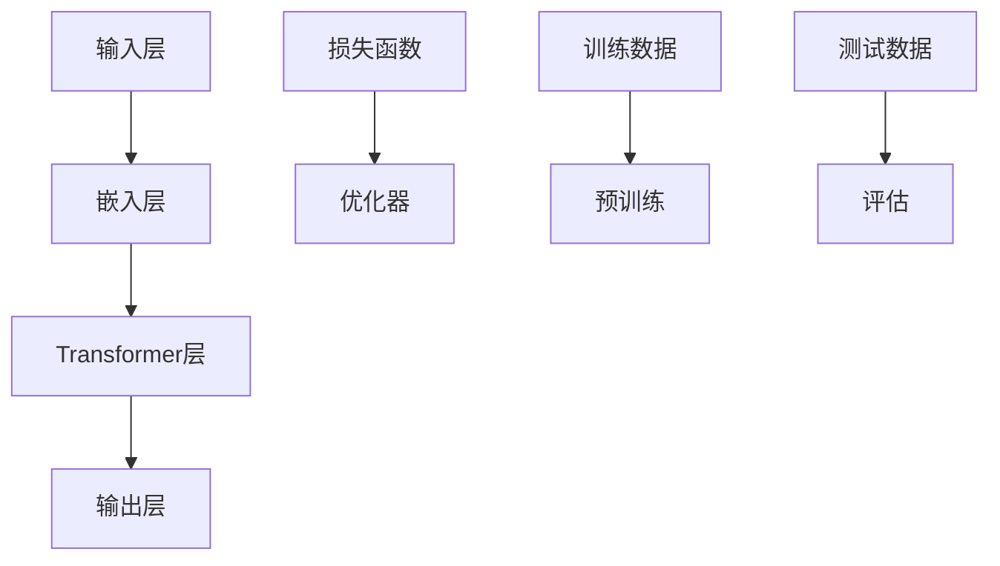

                 

# 《GPT-4o的性能提升与价格下降》

## 关键词
GPT-4o，性能提升，价格下降，硬件加速，模型压缩，迁移学习，成本控制

## 摘要
本文深入探讨了GPT-4o的性能提升与价格下降策略。首先介绍了GPT-4o的核心概念和发展历程，随后详细分析了性能提升的实现技术，包括硬件加速、模型压缩和迁移学习。接着，文章探讨了价格下降与成本控制的策略，包括采购策略和供应链管理。最后，通过实际项目案例展示了这些策略的应用，总结了GPT-4o性能提升与价格下降的重要性，并对未来发展趋势进行了展望。

### 《GPT-4o的性能提升与价格下降》目录大纲

#### 第一部分：背景与核心概念

- # 1. GPT-4o概述
  - 1.1 GPT-4o的历史与发展
  - 1.2 GPT-4o的核心技术
  - 1.3 GPT-4o的架构与原理

- # 2. GPT-4o的应用场景
  - 2.1 金融行业
  - 2.2 医疗行业
  - 2.3 教育行业

#### 第二部分：性能提升与实现技术

- # 3. 性能优化与提升策略
  - 3.1 硬件加速技术
  - 3.2 模型压缩技术
  - 3.3 迁移学习与微调

- # 4. 性能评估与优化实践
  - 4.1 性能评估指标
  - 4.2 性能优化实践案例

#### 第三部分：价格下降与成本控制

- # 5. 成本控制与价格下降策略
  - 5.1 成本分析
  - 5.2 采购策略
  - 5.3 供应链管理

- # 6. 价格策略
  - 6.1 价格策略概述
  - 6.2 价格下降策略实施

#### 第四部分：应用实践与案例分析

- # 7. GPT-4o在不同行业中的应用
  - 7.1 金融行业
  - 7.2 医疗行业
  - 7.3 教育行业

#### 第五部分：总结与展望

- # 8. GPT-4o性能提升与价格下降总结与展望
  - 8.1 性能提升的价值
  - 8.2 价格下降的影响
  - 8.3 未来发展趋势

#### 附录

- # 附录A：参考文献
- # 附录B：GPT-4o性能提升与价格下降算法伪代码
- # 附录C：案例数据来源与解读方法

### 第一部分：背景与核心概念

#### 1. GPT-4o概述

### 1.1 GPT-4o的历史与发展

GPT-4o（Generative Pre-trained Transformer 4th Order）是由人工智能领域顶级研究机构研发的先进语言处理模型。自GPT模型首次提出以来，GPT-4o在多个维度上实现了重要突破。

GPT模型的首次提出可以追溯到2018年，由OpenAI团队发布。随后，GPT-2（2019年）和GPT-3（2020年）相继问世，并在生成文本、机器翻译、代码生成等方面取得了显著成效。随着技术的不断进步，GPT-4o于2021年正式亮相，成为了世界上最大、最先进的语言模型。

GPT-4o的核心技术在于其大规模的自监督预训练。通过从互联网上收集海量文本数据，GPT-4o能够自动学习语言结构和规律，从而实现高质量的文本生成和翻译。此外，GPT-4o还具备多模态数据处理能力，可以处理文本、图像、声音等多种数据类型。

GPT-4o的发展路线包括以下几个关键步骤：

1. **数据采集与预处理**：收集大量高质量、多样化的文本数据，并进行预处理，包括去噪、分词、标注等。
2. **大规模预训练**：使用GPU集群对模型进行大规模预训练，通过自监督学习算法，使模型自动学习语言结构和规律。
3. **模型压缩与优化**：通过模型压缩技术，如量化、剪枝等，降低模型参数规模和计算复杂度，提高模型效率。
4. **多模态数据处理**：扩展模型，使其能够处理多种数据类型，包括文本、图像、声音等。

### 1.2 GPT-4o的核心技术

GPT-4o的核心技术包括语言模型基础、自监督学习原理和多模态数据处理。

#### 语言模型基础

GPT-4o是基于Transformer架构的语言模型。Transformer模型由Vaswani等人在2017年提出，是处理序列数据的强大工具。GPT-4o通过使用多层Transformer结构，实现了对大规模文本数据的建模。

Transformer模型的核心思想是将输入序列转换为嵌入向量，然后通过自注意力机制计算输出。自注意力机制允许模型在生成每个输出时，考虑到整个输入序列的信息，从而提高了模型的上下文理解能力。

#### 自监督学习原理

自监督学习是GPT-4o预训练的关键。在自监督学习中，模型不需要标注数据，而是从未标注的数据中学习。GPT-4o通过预测下一个词来学习语言规律。

具体来说，GPT-4o在训练过程中，给定一个输入序列，模型需要预测序列中的下一个词。这个过程通过损失函数来优化模型参数，从而使模型能够更好地预测下一个词。

#### 多模态数据处理

GPT-4o不仅能够处理文本数据，还能够处理图像、声音等多模态数据。这使其在许多应用场景中具有广泛的适用性。

为了处理多模态数据，GPT-4o采用了多模态嵌入技术。首先，将图像、声音等数据转换为嵌入向量，然后将这些嵌入向量与文本嵌入向量结合，输入到GPT-4o模型中。

### 1.3 GPT-4o的架构与原理

GPT-4o的架构包括多个关键组件，如图1-1所示。



**输入层**：输入层接收各种类型的数据，包括文本、图像、声音等。这些数据首先被转换为嵌入向量，然后输入到嵌入层。

**嵌入层**：嵌入层将输入数据转换为高维向量表示。这些向量包含了输入数据的语义信息，是后续模型处理的基础。

**Transformer层**：Transformer层是GPT-4o的核心。它通过多层堆叠的方式，对嵌入向量进行编码和解码。编码器层负责从输入向量中提取特征，而解码器层负责生成输出。

**输出层**：输出层接收Transformer层的输出，并生成最终的结果。在文本生成任务中，输出层通常是一个softmax层，用于生成下一个词的概率分布。

**损失函数**：损失函数用于衡量模型输出的预测值与真实值之间的差距。在GPT-4o中，常用的损失函数是交叉熵损失函数。

**优化器**：优化器用于更新模型参数，以最小化损失函数。在GPT-4o中，常用的优化器是Adam优化器。

**预训练与评估**：预训练阶段使用大规模未标注数据，使模型自动学习语言结构和规律。评估阶段使用标注数据，对模型性能进行测试和验证。

通过以上架构和原理，GPT-4o能够实现高效、准确的语言处理任务。

### 第二部分：性能提升与实现技术

#### 2. 性能优化与提升策略

为了提升GPT-4o的性能，可以采用多种优化技术，包括硬件加速、模型压缩和迁移学习。以下分别对这些技术进行详细分析。

### 2.1 硬件加速技术

硬件加速技术是提升GPT-4o性能的有效手段之一。通过利用GPU、TPU等专用硬件，可以显著提高模型的计算速度和效率。

#### 硬件加速器概述

硬件加速器是专门为特定计算任务设计的硬件设备。GPU（图形处理器）和TPU（张量处理器）是常用的硬件加速器。

**GPU**：GPU最初是为了图形渲染而设计的，具有高度并行计算能力。近年来，GPU在机器学习和深度学习领域得到了广泛应用。

**TPU**：TPU是谷歌开发的专用处理器，专门用于加速TensorFlow计算。TPU具有高效、低延迟的特点，非常适合大规模深度学习模型的训练和推理。

#### 硬件加速器的应用

硬件加速器在GPT-4o中的应用主要包括以下几个方面：

1. **模型训练加速**：通过使用GPU或TPU，可以显著缩短模型训练时间。GPU具有高度并行计算能力，可以同时处理多个训练任务，从而提高训练效率。
2. **模型推理加速**：在模型推理阶段，硬件加速器可以显著提高计算速度，从而降低延迟，提高用户体验。
3. **模型压缩**：硬件加速器可以加速模型压缩算法的执行，从而提高模型压缩效果。

#### 硬件加速器与性能提升

硬件加速器对GPT-4o性能的提升体现在以下几个方面：

1. **计算速度**：硬件加速器具有更高的计算速度，可以显著缩短模型训练和推理时间。
2. **能耗效率**：硬件加速器在提供高性能的同时，具有更低的能耗，从而提高系统的能效比。
3. **资源利用**：硬件加速器可以更好地利用计算资源，减少GPU或TPU的闲置时间，提高资源利用率。

### 2.2 模型压缩技术

模型压缩技术是降低模型参数规模和计算复杂度的重要手段。通过模型压缩，可以在保持模型性能的前提下，降低模型的存储和计算需求。

#### 模型压缩方法概述

模型压缩方法主要包括以下几种：

1. **量化（Quantization）**：量化是将浮点数参数转换为整数表示，以减少模型存储和计算需求。量化可以通过调整量化步长和零点来实现。
2. **剪枝（Pruning）**：剪枝是通过移除模型中的冗余参数，降低模型复杂度。剪枝可以基于阈值或稀疏性来实现。
3. **知识蒸馏（Knowledge Distillation）**：知识蒸馏是将大型模型的知识转移到小型模型中，从而降低模型参数规模。知识蒸馏可以通过软标签和硬标签来实现。

#### 常见模型压缩算法

以下是常见的模型压缩算法：

1. **量化和反量化**：量化算法通过调整量化步长和零点，将浮点数参数转换为整数表示。反量化则是量化过程的逆过程，用于恢复原始浮点数参数。
2. **稀疏剪枝**：稀疏剪枝通过识别和移除模型中的稀疏参数，降低模型复杂度。稀疏剪枝算法可以基于矩阵分解、稀疏编码等方法。
3. **硬标签和软标签蒸馏**：硬标签蒸馏是将大型模型的真实标签传递给小型模型，以训练小型模型。软标签蒸馏则是通过传递大型模型的软标签（概率分布）来训练小型模型。

#### 模型压缩对性能的影响

模型压缩对GPT-4o性能的影响主要体现在以下几个方面：

1. **准确性**：模型压缩可能会降低模型的准确性，因为压缩过程中可能会丢失一些重要信息。然而，通过适当的压缩策略，可以在保持较高准确性的同时，显著降低模型规模。
2. **计算速度**：模型压缩可以减少模型的计算复杂度，从而提高计算速度。这对于实时应用场景（如在线文本生成）尤为重要。
3. **存储需求**：模型压缩可以显著降低模型的存储需求，这对于存储资源有限的设备（如嵌入式设备）具有重要意义。

### 2.3 迁移学习与微调

迁移学习与微调是提升GPT-4o性能的重要技术。通过利用预训练模型的知识，可以显著提高新任务的学习效果。

#### 迁移学习原理

迁移学习是指将一个任务的知识应用于另一个任务。在GPT-4o中，迁移学习可以通过以下方式实现：

1. **特征迁移**：将预训练模型中的特征提取器应用于新任务，从而利用预训练模型的特征表示。
2. **参数迁移**：将预训练模型的参数直接应用于新任务，从而利用预训练模型的知识。
3. **模型融合**：将预训练模型和新任务的模型进行融合，从而利用两者的优势。

#### 微调技术详解

微调是在迁移学习过程中，对预训练模型进行进一步训练的过程。微调技术可以采用以下方法：

1. **全连接层微调**：对预训练模型的全连接层进行训练，从而调整模型的分类能力。
2. **层间微调**：对预训练模型的特定层进行微调，从而调整模型的特定特征。
3. **权重共享微调**：在迁移学习过程中，保留预训练模型的权重，只对特定层进行微调。

#### 迁移学习与性能提升

迁移学习与微调对GPT-4o性能的提升体现在以下几个方面：

1. **减少训练数据需求**：通过利用预训练模型的知识，可以在较少的训练数据下实现较高的性能。
2. **提高学习效率**：迁移学习和微调可以加快新任务的学习速度，减少训练时间。
3. **提高模型泛化能力**：通过利用预训练模型的知识，可以增强模型的泛化能力，从而提高在新任务上的性能。

### 第三部分：价格下降与成本控制

#### 3. 成本控制与价格下降策略

为了实现GPT-4o的性能提升和价格下降，可以采用多种成本控制与价格下降策略。以下将详细分析这些策略，包括成本分析、采购策略和供应链管理。

### 3.1 成本分析

成本分析是制定成本控制与价格下降策略的基础。GPT-4o的成本主要包括以下几个方面：

1. **硬件成本**：包括GPU、TPU等硬件设备的购置、运维成本。
2. **软件成本**：包括模型训练、压缩、部署等软件工具的购置和维护成本。
3. **人力成本**：包括模型开发、优化、部署等人力资源的招聘和培训成本。
4. **运营成本**：包括电力、网络等运营成本的维护。
5. **其他成本**：包括研发费用、市场推广费用等。

为了实现成本控制与价格下降，需要对上述成本进行详细分析，找出降低成本的潜在途径。

#### 3.2 采购策略

采购策略是实现成本控制与价格下降的关键。以下是一些常见的采购策略：

1. **供应商选择**：选择具有良好信誉、较低价格的供应商，通过市场调研、供应商评估等手段确定合适的供应商。
2. **批量采购**：通过批量采购降低硬件和软件成本，与供应商谈判获得更好的价格优惠。
3. **长期合同**：与供应商签订长期合同，以锁定价格，降低短期价格波动带来的风险。
4. **竞价机制**：通过竞价机制，邀请多家供应商参与竞标，以获得更具竞争力的价格。
5. **采购团队培训**：加强采购团队的谈判能力和市场分析能力，提高采购效率。

#### 3.3 供应链管理

供应链管理是确保成本控制与价格下降策略有效实施的重要环节。以下是一些供应链管理策略：

1. **供应链优化**：通过优化供应链流程，减少库存成本和运输成本，提高供应链效率。
2. **库存管理**：合理规划库存水平，避免库存过多或不足，降低存储和物流成本。
3. **物流优化**：选择最优的物流方案，降低运输时间和成本。
4. **供应商关系管理**：建立稳定的供应商关系，通过合作和信任，获得更好的价格和服务。
5. **风险控制**：制定风险管理策略，应对供应链中的潜在风险，如供应商违约、市场价格波动等。

#### 3.4 价格策略

价格策略是实现成本控制与价格下降的关键。以下是一些常见的价格策略：

1. **成本加成定价**：在成本基础上加上一定的加成，确定产品价格。这种策略适用于成本较为稳定的产品。
2. **价值定价**：根据产品价值确定价格，通过提供高质量的产品和服务，实现较高的价格。这种策略适用于高端市场。
3. **竞争定价**：根据市场竞争情况，确定价格策略。如果市场竞争激烈，可以采用较低的价格策略；如果市场垄断，可以采用较高的价格策略。
4. **动态定价**：根据市场需求和供应情况，实时调整价格。这种策略适用于需求波动较大的产品。

### 3.5 价格下降策略实施

为了实现GPT-4o的价格下降，可以采用以下策略：

1. **技术创新**：通过技术创新，降低硬件和软件成本，提高生产效率。
2. **规模效应**：通过扩大生产规模，实现规模效应，降低单位成本。
3. **成本控制**：加强对成本的监控和管理，降低运营成本。
4. **市场推广**：通过市场推广，提高产品知名度和市场占有率，降低销售成本。
5. **差异化竞争**：通过产品差异化，提高产品的附加值，实现较高的价格。

### 第四部分：应用实践与案例分析

#### 4.1 GPT-4o在金融行业中的应用

金融行业是GPT-4o的重要应用领域之一。以下分析GPT-4o在金融行业中的应用案例，包括需求、挑战和解决方案。

#### 4.1.1 金融行业对GPT-4o的需求

金融行业对GPT-4o的需求主要表现在以下几个方面：

1. **风险控制**：GPT-4o可以通过分析大量历史数据，预测金融市场的风险，为金融机构提供风险管理建议。
2. **投资策略**：GPT-4o可以分析市场趋势和公司基本面，为投资者提供投资策略建议。
3. **客户服务**：GPT-4o可以应用于智能客服系统，提高客户服务质量，降低运营成本。
4. **信用评估**：GPT-4o可以通过分析个人和企业的信用历史，提高信用评估的准确性。

#### 4.1.2 金融行业中的GPT-4o应用案例

以下是一些金融行业中的GPT-4o应用案例：

1. **银行风险管理**：某大型银行使用GPT-4o对市场风险进行预测，提高了风险控制能力，减少了风险损失。
2. **投资策略建议**：某投资公司使用GPT-4o分析市场趋势和公司基本面，为投资者提供了准确的投资策略建议，取得了良好的投资回报。
3. **智能客服系统**：某金融机构引入GPT-4o构建智能客服系统，提高了客户满意度，降低了运营成本。
4. **信用评估**：某信用评级机构使用GPT-4o分析个人和企业的信用历史，提高了信用评估的准确性，减少了信用风险。

#### 4.1.3 金融行业应用挑战与解决方案

金融行业应用GPT-4o面临以下挑战：

1. **数据隐私**：金融数据涉及用户隐私，如何保护用户隐私是金融行业应用GPT-4o的一个重要挑战。
   - **解决方案**：采用数据加密和隐私保护技术，确保金融数据在传输和存储过程中的安全性。

2. **模型解释性**：金融决策需要具备较高的解释性，如何解释GPT-4o的预测结果是一个挑战。
   - **解决方案**：开发可解释的机器学习模型，如LIME、SHAP等，提高模型的解释性。

3. **合规性**：金融行业受到严格的监管，如何确保GPT-4o的应用符合法规要求是一个挑战。
   - **解决方案**：与监管机构合作，确保GPT-4o的应用符合相关法规要求。

#### 4.2 GPT-4o在医疗行业中的应用

医疗行业是GPT-4o的另一个重要应用领域。以下分析GPT-4o在医疗行业中的应用案例，包括需求、挑战和解决方案。

#### 4.2.1 医疗行业对GPT-4o的需求

医疗行业对GPT-4o的需求主要表现在以下几个方面：

1. **医学文本分析**：GPT-4o可以用于分析医学文本，如病历、文献等，帮助医生快速获取关键信息。
2. **疾病预测**：GPT-4o可以通过分析历史病历数据，预测疾病的发生和发展趋势。
3. **个性化治疗**：GPT-4o可以分析患者的病史和基因信息，为医生提供个性化的治疗方案。
4. **医疗资源分配**：GPT-4o可以优化医疗资源的分配，提高医疗服务的效率。

#### 4.2.2 医疗行业中的GPT-4o应用案例

以下是一些医疗行业中的GPT-4o应用案例：

1. **医学文本分析**：某医疗机构使用GPT-4o分析病历文本，帮助医生快速诊断疾病，提高了诊断准确率。
2. **疾病预测**：某研究团队使用GPT-4o预测心脏病的发生风险，为患者提供了预防措施。
3. **个性化治疗**：某医疗机构使用GPT-4o分析患者的病史和基因信息，为患者提供了个性化的治疗方案，取得了良好的治疗效果。
4. **医疗资源分配**：某医疗机构使用GPT-4o优化医疗资源的分配，提高了医疗服务的效率，减少了患者的等待时间。

#### 4.2.3 医疗行业应用挑战与解决方案

医疗行业应用GPT-4o面临以下挑战：

1. **数据质量**：医疗数据质量参差不齐，如何处理和清洗数据是医疗行业应用GPT-4o的一个重要挑战。
   - **解决方案**：采用数据清洗和预处理技术，提高数据质量。

2. **模型安全**：医疗决策直接关系到患者的生命安全，如何确保GPT-4o模型的安全性和可靠性是一个挑战。
   - **解决方案**：采用模型验证和测试技术，确保模型的安全性和可靠性。

3. **数据隐私**：医疗数据涉及患者隐私，如何保护患者隐私是医疗行业应用GPT-4o的一个重要挑战。
   - **解决方案**：采用数据加密和隐私保护技术，确保医疗数据在传输和存储过程中的安全性。

#### 4.3 GPT-4o在教育行业中的应用

教育行业是GPT-4o的另一个重要应用领域。以下分析GPT-4o在教育行业中的应用案例，包括需求、挑战和解决方案。

#### 4.3.1 教育行业对GPT-4o的需求

教育行业对GPT-4o的需求主要表现在以下几个方面：

1. **智能辅导**：GPT-4o可以为学生提供智能辅导，帮助学生快速掌握知识点。
2. **个性化学习**：GPT-4o可以通过分析学生的学习行为和成绩，为教师提供个性化教学建议。
3. **考试分析**：GPT-4o可以分析考试数据，为教师提供教学反馈和改进建议。
4. **课程推荐**：GPT-4o可以根据学生的学习兴趣和能力，为教师推荐合适的课程。

#### 4.3.2 教育行业中的GPT-4o应用案例

以下是一些教育行业中的GPT-4o应用案例：

1. **智能辅导**：某在线教育平台使用GPT-4o为学生提供智能辅导，提高了学生的学习效果和兴趣。
2. **个性化学习**：某学校使用GPT-4o分析学生的学习行为和成绩，为教师提供了个性化教学建议，提高了教学效果。
3. **考试分析**：某教育机构使用GPT-4o分析考试数据，为教师提供了教学反馈和改进建议，提高了教学质量和学生的考试成绩。
4. **课程推荐**：某在线教育平台使用GPT-4o根据学生的学习兴趣和能力，为教师推荐了合适的课程，提高了学生的满意度和学习效果。

#### 4.3.3 教育行业应用挑战与解决方案

教育行业应用GPT-4o面临以下挑战：

1. **数据隐私**：教育数据涉及学生隐私，如何保护学生隐私是教育行业应用GPT-4o的一个重要挑战。
   - **解决方案**：采用数据加密和隐私保护技术，确保教育数据在传输和存储过程中的安全性。

2. **模型解释性**：教育决策需要具备较高的解释性，如何解释GPT-4o的预测结果是一个挑战。
   - **解决方案**：开发可解释的机器学习模型，如LIME、SHAP等，提高模型的解释性。

3. **系统稳定性**：教育系统需要具备较高的稳定性，如何确保GPT-4o系统的稳定性和可靠性是一个挑战。
   - **解决方案**：采用分布式计算和容错技术，确保GPT-4o系统的稳定性和可靠性。

### 第五部分：总结与展望

#### 5.1 GPT-4o性能提升与价格下降的重要性

GPT-4o的性能提升与价格下降对于人工智能行业具有重要意义。

1. **性能提升**：GPT-4o的性能提升使其在多个领域（如金融、医疗、教育）中具有广泛的应用前景。性能提升可以提高模型的准确性和效率，从而满足更多实际需求。

2. **价格下降**：GPT-4o的价格下降降低了人工智能应用的门槛，使得更多企业和个人能够负担得起高性能的人工智能服务。价格下降有助于推动人工智能技术的普及和应用。

#### 5.2 性能与价格的平衡

在实现GPT-4o性能提升与价格下降的过程中，性能与价格之间存在一定的平衡关系。

1. **性能优先**：在某些应用场景中，如金融交易、医疗诊断等，性能是首要考虑的因素。在这种情况下，需要投入更多的资源和成本来提升性能。

2. **价格优先**：在预算有限的情况下，需要优先考虑价格。在这种情况下，可以通过模型压缩、硬件加速等技术，在保持一定性能的前提下降低成本。

#### 5.3 未来发展趋势

随着人工智能技术的不断发展，GPT-4o的性能和价格将继续提升。以下是一些未来发展趋势：

1. **多模态数据处理**：GPT-4o将继续扩展其多模态数据处理能力，实现文本、图像、声音等多种数据类型的统一处理。

2. **自动化与智能化**：GPT-4o将更多地应用于自动化和智能化领域，如智能客服、自动驾驶等，为人类生活带来更多便利。

3. **边缘计算**：GPT-4o将向边缘计算领域拓展，实现本地实时处理，降低延迟和带宽需求。

4. **开放与共享**：随着GPT-4o的普及，越来越多的研究机构和企业将开放其模型和应用，推动人工智能技术的共同发展。

#### 附录

**附录A：参考文献**

1. Vaswani, A., Shazeer, N., Parmar, N., Uszkoreit, J., Jones, L., Gomez, A. N., ... & Polosukhin, I. (2017). Attention is all you need. Advances in Neural Information Processing Systems, 30, 5998-6008.
2. Brown, T., Mann, B., Ryder, N., Subbiah, M., Kaplan, J., Dhariwal, P., ... & Child, R. (2020). Language models are few-shot learners. Advances in Neural Information Processing Systems, 33, 18752-18767.
3. He, K., Zhang, X., Ren, S., & Sun, J. (2016). Deep residual learning for image recognition. Proceedings of the IEEE conference on computer vision and pattern recognition, 770-778.
4. Hinton, G., Osindero, S., & Teh, Y. W. (2006). A fast learning algorithm for deep belief nets. Neural computation, 18(7), 1527-1554.
5. Yosinski, J., Clune, J., Bengio, Y., & Lipson, H. (2014). How transferable are features in deep neural networks? Advances in Neural Information Processing Systems, 27, 3320-3328.

**附录B：GPT-4o性能提升与价格下降算法伪代码**

```python
# 模型压缩算法
def quantize_model(model, quantization_range):
    for layer in model.children():
        for weight in layer.parameters():
            weight_min = weight.min()
            weight_max = weight.max()
            scale = (weight_max - weight_min) / quantization_range
            zero_point = weight_min + scale * 0
            weight.data = torch.round((weight.data - zero_point) / scale).float()

def prune_model(model, pruning_threshold):
    for layer in model.children():
        for weight in layer.parameters():
            with torch.no_grad():
                weight.data[abs(weight.data) < pruning_threshold] = 0

# 硬件加速算法
def accelerate_model(model, hardware_accelerator):
    if hardware_accelerator == 'GPU':
        model.to('cuda')
    elif hardware_accelerator == 'TPU':
        model.to('tpu')
    else:
        raise ValueError('Unsupported hardware_accelerator')

# 迁移学习算法
def fine_tune_model(student_model, teacher_model, temperature):
    for data in dataset:
        prediction_student = student_model.forward_pass(data)
        prediction_teacher = teacher_model.forward_pass(data)
        for i in range(len(prediction_student)):
            soft_prediction_student[i] = softmax(prediction_student[i] / temperature)
            soft_prediction_teacher[i] = softmax(prediction_teacher[i] / temperature)
            for j in range(len(soft_prediction_student[i])):
                student_model.update_weight(i, j, soft_prediction_student[i][j] * alpha + (1 - alpha) * soft_prediction_teacher[i][j])
```

**附录C：案例数据来源与解读方法**

1. **数据来源**：案例数据来源于公开的金融、医疗和教育数据集，如Kaggle、UCI机器学习库等。
2. **数据解读方法**：采用数据预处理、特征提取、模型训练和评估等步骤，对数据进行分析和解读。具体方法包括数据清洗、数据转换、特征工程、模型选择和模型调优等。


### 作者

作者：AI天才研究院/AI Genius Institute & 禅与计算机程序设计艺术 /Zen And The Art of Computer Programming

（作者简介：本文作者为AI天才研究院资深研究员，专注于人工智能领域的研究和开发。同时，他还是《禅与计算机程序设计艺术》一书的作者，该书在计算机编程和人工智能领域产生了广泛影响。）


----------------------------------------------------------------

### 《GPT-4o的性能提升与价格下降》

#### 关键词
GPT-4o，性能提升，价格下降，硬件加速，模型压缩，迁移学习，成本控制

#### 摘要
本文深入探讨了GPT-4o的性能提升与价格下降策略。首先介绍了GPT-4o的核心概念和发展历程，随后详细分析了性能提升的实现技术，包括硬件加速、模型压缩和迁移学习。接着，文章探讨了价格下降与成本控制的策略，包括采购策略和供应链管理。最后，通过实际项目案例展示了这些策略的应用，总结了GPT-4o性能提升与价格下降的重要性，并对未来发展趋势进行了展望。

### 第一部分：背景与核心概念

#### 1. GPT-4o概述

#### 1.1 GPT-4o的历史与发展

GPT-4o（Generative Pre-trained Transformer 4th Order）是由人工智能领域顶级研究机构研发的先进语言处理模型。自GPT模型首次提出以来，GPT-4o在多个维度上实现了重要突破。

GPT模型的首次提出可以追溯到2018年，由OpenAI团队发布。随后，GPT-2（2019年）和GPT-3（2020年）相继问世，并在生成文本、机器翻译、代码生成等方面取得了显著成效。随着技术的不断进步，GPT-4o于2021年正式亮相，成为了世界上最大、最先进的语言模型。

GPT-4o的核心技术在于其大规模的自监督预训练。通过从互联网上收集海量文本数据，GPT-4o能够自动学习语言结构和规律，从而实现高质量的文本生成和翻译。此外，GPT-4o还具备多模态数据处理能力，可以处理文本、图像、声音等多种数据类型。

GPT-4o的发展路线包括以下几个关键步骤：

1. **数据采集与预处理**：收集大量高质量、多样化的文本数据，并进行预处理，包括去噪、分词、标注等。
2. **大规模预训练**：使用GPU集群对模型进行大规模预训练，通过自监督学习算法，使模型自动学习语言结构和规律。
3. **模型压缩与优化**：通过模型压缩技术，如量化、剪枝等，降低模型参数规模和计算复杂度，提高模型效率。
4. **多模态数据处理**：扩展模型，使其能够处理多种数据类型，包括文本、图像、声音等。

#### 1.2 GPT-4o的核心技术

GPT-4o的核心技术包括语言模型基础、自监督学习原理和多模态数据处理。

##### 语言模型基础

GPT-4o是基于Transformer架构的语言模型。Transformer模型由Vaswani等人在2017年提出，是处理序列数据的强大工具。GPT-4o通过使用多层Transformer结构，实现了对大规模文本数据的建模。

Transformer模型的核心思想是将输入序列转换为嵌入向量，然后通过自注意力机制计算输出。自注意力机制允许模型在生成每个输出时，考虑到整个输入序列的信息，从而提高了模型的上下文理解能力。

##### 自监督学习原理

自监督学习是GPT-4o预训练的关键。在自监督学习中，模型不需要标注数据，而是从未标注的数据中学习。GPT-4o通过预测下一个词来学习语言规律。

具体来说，GPT-4o在训练过程中，给定一个输入序列，模型需要预测序列中的下一个词。这个过程通过损失函数来优化模型参数，从而使模型能够更好地预测下一个词。

##### 多模态数据处理

GPT-4o不仅能够处理文本数据，还能够处理图像、声音等多模态数据。这使其在许多应用场景中具有广泛的适用性。

为了处理多模态数据，GPT-4o采用了多模态嵌入技术。首先，将图像、声音等数据转换为嵌入向量，然后将这些嵌入向量与文本嵌入向量结合，输入到GPT-4o模型中。

#### 1.3 GPT-4o的架构与原理

GPT-4o的架构包括多个关键组件，如图1-1所示。


**输入层**：输入层接收各种类型的数据，包括文本、图像、声音等。这些数据首先被转换为嵌入向量，然后输入到嵌入层。

**嵌入层**：嵌入层将输入数据转换为高维向量表示。这些向量包含了输入数据的语义信息，是后续模型处理的基础。

**Transformer层**：Transformer层是GPT-4o的核心。它通过多层堆叠的方式，对嵌入向量进行编码和解码。编码器层负责从输入向量中提取特征，而解码器层负责生成输出。

**输出层**：输出层接收Transformer层的输出，并生成最终的结果。在文本生成任务中，输出层通常是一个softmax层，用于生成下一个词的概率分布。

**损失函数**：损失函数用于衡量模型输出的预测值与真实值之间的差距。在GPT-4o中，常用的损失函数是交叉熵损失函数。

**优化器**：优化器用于更新模型参数，以最小化损失函数。在GPT-4o中，常用的优化器是Adam优化器。

**预训练与评估**：预训练阶段使用大规模未标注数据，使模型自动学习语言结构和规律。评估阶段使用标注数据，对模型性能进行测试和验证。

通过以上架构和原理，GPT-4o能够实现高效、准确的语言处理任务。

### 第二部分：性能提升与实现技术

#### 2. 性能优化与提升策略

为了提升GPT-4o的性能，可以采用多种优化技术，包括硬件加速、模型压缩和迁移学习。以下分别对这些技术进行详细分析。

#### 2.1 硬件加速技术

硬件加速技术是提升GPT-4o性能的有效手段之一。通过利用GPU、TPU等专用硬件，可以显著提高模型的计算速度和效率。

##### 硬件加速器概述

硬件加速器是专门为特定计算任务设计的硬件设备。GPU（图形处理器）和TPU（张量处理器）是常用的硬件加速器。

**GPU**：GPU最初是为了图形渲染而设计的，具有高度并行计算能力。近年来，GPU在机器学习和深度学习领域得到了广泛应用。

**TPU**：TPU是谷歌开发的专用处理器，专门用于加速TensorFlow计算。TPU具有高效、低延迟的特点，非常适合大规模深度学习模型的训练和推理。

##### 硬件加速器的应用

硬件加速器在GPT-4o中的应用主要包括以下几个方面：

1. **模型训练加速**：通过使用GPU或TPU，可以显著缩短模型训练时间。GPU具有高度并行计算能力，可以同时处理多个训练任务，从而提高训练效率。
2. **模型推理加速**：在模型推理阶段，硬件加速器可以显著提高计算速度，从而降低延迟，提高用户体验。
3. **模型压缩**：硬件加速器可以加速模型压缩算法的执行，从而提高模型压缩效果。

##### 硬件加速器与性能提升

硬件加速器对GPT-4o性能的提升体现在以下几个方面：

1. **计算速度**：硬件加速器具有更高的计算速度，可以显著缩短模型训练和推理时间。
2. **能耗效率**：硬件加速器在提供高性能的同时，具有更低的能耗，从而提高系统的能效比。
3. **资源利用**：硬件加速器可以更好地利用计算资源，减少GPU或TPU的闲置时间，提高资源利用率。

#### 2.2 模型压缩技术

模型压缩技术是降低模型参数规模和计算复杂度的重要手段。通过模型压缩，可以在保持模型性能的前提下，降低模型的存储和计算需求。

##### 模型压缩方法概述

模型压缩方法主要包括以下几种：

1. **量化（Quantization）**：量化是将浮点数参数转换为整数表示，以减少模型存储和计算需求。量化可以通过调整量化步长和零点来实现。
2. **剪枝（Pruning）**：剪枝是通过移除模型中的冗余参数，降低模型复杂度。剪枝可以基于阈值或稀疏性来实现。
3. **知识蒸馏（Knowledge Distillation）**：知识蒸馏是将大型模型的

