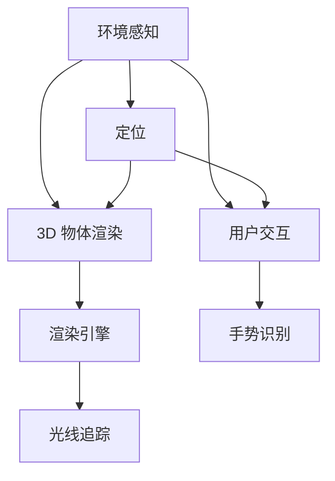

                 

# 《Google ARCore：在 Android 上的增强现实》

> 关键词：增强现实、ARCore、Android、开发环境、核心API、应用案例、性能优化、未来展望

> 摘要：本文将深入探讨 Google ARCore，这是一款专为 Android 设备设计的增强现实开发平台。我们将从 ARCore 的概述、开发环境搭建、核心 API 与功能、环境感知与定位、3D 物体渲染与交互、应用案例、性能优化与调试、未来趋势与展望等多个方面进行详细分析，旨在帮助开发者更好地理解和应用 ARCore，打造令人惊叹的增强现实应用。

## 第一部分：增强现实与 ARCore 概述

### 第1章：增强现实与 ARCore 简介

#### 1.1 增强现实的定义与意义

增强现实（Augmented Reality，简称 AR）是一种将虚拟信息与真实世界相结合的技术。通过增强现实技术，用户可以在现实世界中看到、听到、触摸和与计算机生成的虚拟信息进行互动。这种技术不仅拓宽了人类的感知范围，也为各行各业带来了新的机遇。

增强现实的定义与意义可以总结为以下几点：

1. **定义**：增强现实是一种将计算机生成的虚拟信息叠加到真实世界中的技术。这些虚拟信息可以是文字、图像、声音或三维模型等。

2. **意义**：
   - **提高效率**：增强现实可以帮助用户快速获取所需信息，从而提高工作效率。
   - **增强体验**：在游戏、娱乐、教育等领域，增强现实可以提供更加真实、沉浸的体验。
   - **创新应用**：增强现实技术可以应用于多个领域，如医疗、军事、制造业等，带来前所未有的创新。

#### 1.2 ARCore 的核心功能与优势

Google ARCore 是一款专为 Android 设备设计的增强现实开发平台，它提供了丰富的 API 和工具，使得开发者可以轻松地创建高质量的增强现实应用。ARCore 的核心功能与优势包括：

1. **核心功能**：
   - **环境感知**：ARCore 使用设备内置的传感器和相机，实时获取周围环境的信息，实现定位和场景重建。
   - **3D 物体渲染**：ARCore 提供了强大的渲染引擎，可以高效地渲染 3D 物体，实现高质量的视觉效果。
   - **用户交互**：ARCore 支持多种交互方式，如手势识别、语音控制等，为用户提供丰富的互动体验。

2. **优势**：
   - **广泛兼容性**：ARCore 支持多种 Android 设备，使得开发者可以覆盖更多的用户群体。
   - **高性能**：ARCore 采用了优化的算法和图形处理技术，能够在有限的硬件资源下实现高质量的增强现实效果。
   - **丰富的资源**：Google 提供了大量的教程、文档和社区支持，帮助开发者快速入门和解决问题。

#### 1.3 ARCore 在 Android 设备上的应用场景

ARCore 在 Android 设备上的应用场景非常广泛，以下是一些典型的应用场景：

1. **教育**：通过增强现实技术，教师可以将抽象的知识点以生动的形式展示给学生，提高学习兴趣和效果。
2. **娱乐**：增强现实游戏和互动应用可以让用户在虚拟世界中尽情探索，带来全新的娱乐体验。
3. **零售**：商家可以利用增强现实技术提供虚拟试衣镜、产品展示等功能，提升用户体验和销售效果。
4. **医疗**：医生可以通过增强现实技术进行远程诊断、手术模拟等，提高诊断和手术的准确性和安全性。
5. **导航**：增强现实导航应用可以提供更加直观、易懂的路线指引，帮助用户快速找到目的地。

通过以上分析，我们可以看到增强现实与 ARCore 在各个领域都有广泛的应用前景。接下来，我们将进一步探讨 ARCore 的开发环境搭建，为后续的开发工作打下基础。

### 第2章：ARCore 开发环境搭建

#### 2.1 Android 开发环境配置

要开始使用 ARCore 开发增强现实应用，首先需要配置 Android 开发环境。以下是配置 Android 开发环境的详细步骤：

1. **安装 JDK**：下载并安装 JDK（Java Development Kit），确保版本符合 Android Studio 的要求。通常，JDK 11 或更高版本即可满足需求。

2. **安装 Android Studio**：下载并安装 Android Studio，这是一款强大的 Android 开发工具，提供了丰富的功能和插件支持。

3. **安装 SDK 管理工具**：打开 Android Studio，选择“File” > “Settings”（或“Android Studio” > “Preferences”），然后在“Appearance & Behavior” > “System Settings”中，检查“Enable Android SDK Manager through the system settings”选项。

4. **配置 SDK**：在 Android Studio 中，选择“Tools” > “SDK Manager”，然后安装以下 SDK 和工具：
   - Android SDK Platform Tools
   - Android SDK Build Tools
   - Android SDK API Levels（选择需要的 API 级别）

5. **安装 NDK**：如果需要使用原生代码，还需要安装 Android Native Development Kit（NDK）。在 Android Studio 中，选择“File” > “Settings”（或“Android Studio” > “Preferences”），然后在“Appearance & Behavior” > “System Settings”中，检查“Enable NDK Support”选项。

#### 2.2 ARCore SDK 下载与安装

配置好 Android 开发环境后，接下来需要下载和安装 ARCore SDK。以下是安装 ARCore SDK 的步骤：

1. **下载 ARCore SDK**：访问 [ARCore 官方网站](https://developers.google.com/ar/android/)，下载适用于 Android Studio 的 ARCore SDK。

2. **导入 SDK**：将下载的 SDK 文件解压，然后将其放置在合适的位置，例如 `C:\Users\YourUsername\Android\sdk\extras\google\arcore\`。

3. **配置环境变量**：在 Android Studio 中，选择“File” > “Settings”（或“Android Studio” > “Preferences”），然后在“Appearance & Behavior” > “System Settings”中，检查“Enable ARCore”选项，并将 ARCore SDK 的路径添加到环境变量中。

4. **验证安装**：在 Android Studio 中，创建一个新的项目，并尝试添加 ARCore 相关的库和依赖项。如果一切正常，说明 ARCore SDK 已成功安装。

#### 2.3 开发工具与编辑器介绍

在开发 ARCore 应用时，还需要使用一些其他工具和编辑器。以下是几种常用的开发工具和编辑器：

1. **Unity**：Unity 是一款流行的游戏开发引擎，支持 ARCore 功能。开发者可以使用 Unity 开发 ARCore 应用，并利用 Unity 的强大功能和资源管理功能。

2. **Unreal Engine**：Unreal Engine 是另一款强大的游戏开发引擎，也支持 ARCore 功能。开发者可以使用 Unreal Engine 开发高质量的 ARCore 应用，并利用其先进的渲染技术和物理引擎。

3. **Android Studio**：Android Studio 是 Google 推出的官方 Android 开发工具，具有丰富的功能和插件支持。开发者可以使用 Android Studio 开发 ARCore 应用，并利用其强大的调试和性能优化功能。

4. **IntelliJ IDEA**：IntelliJ IDEA 是一款强大的 Java 开发工具，也支持 ARCore 功能。开发者可以使用 IntelliJ IDEA 开发 ARCore 应用，并利用其高效的代码编辑器和智能提示功能。

通过以上步骤，开发者可以搭建完整的 ARCore 开发环境，为后续的开发工作做好准备。接下来，我们将深入探讨 ARCore 的核心 API 与功能，帮助开发者更好地理解和应用 ARCore。

### 第3章：ARCore 基础知识

#### 3.1 ARCore 的主要组件

ARCore 是由多个核心组件组成的，这些组件协同工作，实现增强现实功能的各个方面。以下是 ARCore 的主要组件及其功能：

1. **环境感知（Environment Awareness）**：
   - **激光雷达（Lidar）**：使用激光雷达传感器获取周围环境的深度信息，实现场景重建。
   - **相机（Camera）**：通过相机捕捉实时视频流，用于图像处理和识别特征点。

2. **定位（Positioning）**：
   - **SLAM（同步定位与映射）**：通过 SLAM 技术，实时定位设备在三维空间中的位置，并构建周围环境的地图。
   - **环境感知**：结合激光雷达和相机数据，实现设备在复杂环境中的精确定位。

3. **3D 物体渲染（3D Object Rendering）**：
   - **渲染引擎**：使用高质量的渲染引擎，实现 3D 物体的实时渲染。
   - **光照与阴影**：模拟真实世界的光照效果，增强视觉效果。

4. **用户交互（User Interaction）**：
   - **手势识别**：通过手势识别，实现用户与虚拟信息的互动。
   - **语音控制**：通过语音识别，实现用户的语音指令控制。

#### 3.2 ARCore 的坐标系与变换

在 ARCore 中，坐标系和变换是非常重要的概念。以下是对 ARCore 坐标系和变换的详细解释：

1. **坐标系**：
   - **世界坐标系（World Coordinate System）**：这是一个固定的坐标系，用于表示虚拟信息和真实世界的位置关系。
   - **设备坐标系（Device Coordinate System）**：这是一个与设备相关的坐标系，用于表示设备在三维空间中的位置和方向。

2. **变换**：
   - **平移（Translation）**：通过平移操作，将物体从一个位置移动到另一个位置。
   - **旋转（Rotation）**：通过旋转操作，改变物体的方向。
   - **缩放（Scaling）**：通过缩放操作，改变物体的大小。

ARCore 使用 Matrix4 类来表示变换，Matrix4 类包含了 4x4 的矩阵，可以表示物体的平移、旋转和缩放操作。

#### 3.3 实体（Anchor）的创建与使用

实体（Anchor）是 ARCore 中用于表示虚拟信息和真实世界之间关联的重要概念。实体可以是位置锚点、图像锚点或平面锚点。

1. **位置锚点（Position Anchor）**：
   - **创建**：通过调用 `createAnchor` 方法，将设备坐标系中的位置转换为位置锚点。
   - **使用**：将虚拟物体附加到位置锚点，使其在现实世界中固定位置。

2. **图像锚点（Image Anchor）**：
   - **创建**：通过识别图像特征点，创建图像锚点。
   - **使用**：将虚拟物体附加到图像锚点，使其与特定图像保持关联。

3. **平面锚点（Plane Anchor）**：
   - **创建**：通过检测平面区域，创建平面锚点。
   - **使用**：将虚拟物体放置在平面锚点上，使其与平面保持关联。

通过以上组件、坐标系与变换以及实体的介绍，开发者可以更好地理解 ARCore 的基础知识和核心概念。接下来，我们将进一步探讨 ARCore 的环境感知与定位功能。

#### 3.4 环境感知与定位

环境感知与定位是 ARCore 最重要的功能之一，它们使得开发者能够将虚拟内容无缝地叠加到现实世界中。以下是 ARCore 环境感知与定位的详细解析：

1. **激光雷达与深度感知**

激光雷达（Lidar）是 ARCore 实现环境感知的关键技术之一。通过发射激光束并测量激光束反射回来的时间，激光雷达可以精确地获取周围环境的深度信息。这种深度信息对于构建三维场景至关重要。

ARCore 使用激光雷达数据来检测环境中的障碍物和特征点，这些数据可以用于定位和平面检测。激光雷达数据的高精度和实时性，使得 ARCore 能够在复杂环境中实现准确的定位和场景重建。

2. **SLAM（同步定位与映射）技术**

SLAM（Simultaneous Localization and Mapping）是一种在未知环境中同时进行定位和地图构建的技术。ARCore 使用 SLAM 技术，通过结合激光雷达和相机数据，实时更新设备在三维空间中的位置，并构建周围环境的地图。

SLAM 技术的关键在于其同时性和实时性。通过 SLAM，ARCore 能够在移动过程中不断更新位置信息，确保设备在现实世界中的精准定位。

3. **室内与室外定位的实现**

ARCore 支持室内和室外环境的定位，以下分别介绍：

- **室内定位**：在室内环境中，ARCore 使用 SLAM 技术和激光雷达数据，结合空间特征点和视觉线索，实现设备在三维空间中的精确定位。室内定位的优势在于，它可以在没有 GPS 信号的情况下，仍然能够实现精准的定位。

- **室外定位**：在室外环境中，ARCore 利用 GPS 信号和惯性测量单元（IMU）数据，结合视觉线索，实现设备在三维空间中的定位。室外定位的优势在于，它可以利用全球定位系统（GPS）提供的高精度位置信息，实现更广泛的定位范围。

通过环境感知与定位技术，ARCore 能够将虚拟内容无缝地叠加到现实世界中，为开发者提供强大的增强现实开发能力。接下来，我们将探讨 ARCore 的 3D 物体渲染与交互功能。

### 第4章：3D 物体渲染与交互

#### 4.1 3D 模型加载与渲染

在增强现实应用中，3D 模型的加载与渲染是关键的一环。ARCore 提供了丰富的 API 和工具，使得开发者能够轻松地加载和渲染高质量的 3D 模型。

1. **3D 模型加载**

ARCore 使用 `ModelLoader` 类来加载 3D 模型。以下是一个简单的加载示例：

```java
Model model = ModelLoader.getInstance().loadModel(
    context, R.drawable.model, // 3D 模型资源
    ModelLoader.Options.builder()
        .setFlipY(true) // 确保模型正确显示
        .build());
```

2. **3D 模型渲染**

加载 3D 模型后，可以使用 `Drawable` 类进行渲染。以下是一个简单的渲染示例：

```java
public void onDrawFrame() {
    Matrix4 modelMatrix = Matrix4.createIdentity();
    modelMatrix.translate(0, 0, -2); // 平移模型，使其在相机前
    modelDrawable.draw(modelMatrix);
}
```

通过以上示例，开发者可以轻松地加载和渲染 3D 模型。

#### 4.2 视频与图像的融合

视频与图像的融合是增强现实应用中的重要功能，它可以将虚拟内容无缝地叠加到现实世界的视频流中。ARCore 提供了 `VideoOverlay` 类来实现视频与图像的融合。

1. **视频加载**

首先，需要加载视频文件。以下是一个简单的加载示例：

```java
VideoStream videoStream = new VideoStream("path/to/video.mp4");
```

2. **视频渲染**

加载视频后，可以使用 `VideoOverlay` 类将其渲染到相机预览中。以下是一个简单的渲染示例：

```java
public void onDrawFrame() {
    videoOverlay.render(videoStream, cameraImage);
}
```

通过以上示例，开发者可以轻松地实现视频与图像的融合。

#### 4.3 用户交互与手势识别

用户交互与手势识别是增强现实应用的核心功能，它使得用户能够与虚拟内容进行自然的互动。ARCore 提供了 `GestureDetector` 类来识别用户的手势。

1. **手势识别**

以下是一个简单的手势识别示例：

```java
public void onDrawFrame() {
    GestureDetector detector = new GestureDetector(context);
    detector.setListener(new GestureDetector.OnGestureListener() {
        @Override
        public boolean onDown(MotionEvent e) {
            return true;
        }

        @Override
        public boolean onSingleTapUp(MotionEvent e) {
            // 单击处理
            return true;
        }

        @Override
        public boolean onLongPress(MotionEvent e) {
            // 长按处理
            return true;
        }

        @Override
        public boolean onFling(MotionEvent e1, MotionEvent e2, float velocityX, float velocityY) {
            // 滑动处理
            return true;
        }
    });
    detector.onDrawFrame(cameraImage);
}
```

通过以上示例，开发者可以轻松地识别用户的手势，并实现相应的交互。

通过以上对 3D 模型加载与渲染、视频与图像的融合以及用户交互与手势识别的介绍，我们可以看到 ARCore 提供了丰富的 API 和工具，使得开发者能够轻松地实现高质量的增强现实应用。接下来，我们将探讨 ARCore 的增强现实应用案例。

### 第5章：增强现实应用案例

#### 6.1 虚拟试衣镜

虚拟试衣镜是 ARCore 在零售领域的典型应用。通过虚拟试衣镜，用户可以在家中尝试不同的服装，无需实际试穿。以下是一个简单的虚拟试衣镜项目实现过程：

1. **开发环境搭建**

   配置好 Android 开发环境和 ARCore SDK，确保能够正常运行。

2. **用户界面设计**

   设计一个简单直观的用户界面，包括选择服装的选项和试衣镜显示区域。

3. **3D 模型加载**

   使用 ARCore 的 ModelLoader 加载服装的 3D 模型。

4. **相机预览**

   使用相机预览界面显示用户的实时图像。

5. **平面检测**

   使用 ARCore 的平面检测功能，找到适合放置服装的平面。

6. **物体渲染**

   将加载的服装 3D 模型渲染到平面锚点上。

7. **用户交互**

   实现用户与虚拟服装的交互，如旋转、缩放和拖动。

通过以上步骤，开发者可以创建一个功能完整的虚拟试衣镜应用。

#### 6.2 增强现实游戏

增强现实游戏是 ARCore 在娱乐领域的典型应用。通过增强现实技术，游戏可以在现实世界中创建一个虚拟的游戏场景，用户可以在其中互动和探索。以下是一个简单的增强现实游戏项目实现过程：

1. **开发环境搭建**

   配置好 Android 开发环境和 ARCore SDK，确保能够正常运行。

2. **游戏设计**

   设计一个简单的游戏规则和场景，例如迷宫或寻宝游戏。

3. **3D 模型加载**

   使用 ARCore 的 ModelLoader 加载游戏场景中的 3D 模型。

4. **相机预览**

   使用相机预览界面显示用户的实时图像。

5. **环境感知**

   使用 ARCore 的环境感知功能，检测用户周围的环境。

6. **物体渲染**

   将游戏场景中的 3D 模型渲染到现实世界中。

7. **用户交互**

   实现用户与虚拟游戏场景的交互，如移动、跳跃和拾取物品。

通过以上步骤，开发者可以创建一个有趣的增强现实游戏。

#### 6.3 实体导航与信息显示

实体导航与信息显示是 ARCore 在导航和信息服务领域的典型应用。通过增强现实技术，用户可以在现实世界中看到导航指引和信息提示。以下是一个简单的实体导航与信息显示项目实现过程：

1. **开发环境搭建**

   配置好 Android 开发环境和 ARCore SDK，确保能够正常运行。

2. **地图数据**

   准备好所需的地图数据，可以使用现有的地图服务，如 Google Maps。

3. **相机预览**

   使用相机预览界面显示用户的实时图像。

4. **位置定位**

   使用 ARCore 的定位功能，获取用户当前的位置信息。

5. **导航指引**

   根据用户的位置信息，生成实时的导航指引。

6. **信息显示**

   将导航指引和信息显示在用户的实时图像上。

7. **用户交互**

   实现用户与导航指引和信息提示的交互，如查看详细信息或调整路线。

通过以上步骤，开发者可以创建一个实用的实体导航与信息显示应用。

通过以上三个增强现实应用案例的介绍，我们可以看到 ARCore 在不同领域都有广泛的应用前景。接下来，我们将探讨 ARCore 的性能优化与调试技巧。

### 第6章：ARCore 性能优化与调试

#### 7.1 性能监控与优化

性能优化是开发高质量增强现实应用的关键环节。ARCore 提供了多种工具和策略，帮助开发者监控和优化应用的性能。

1. **性能监控**

   ARCore 提供了 `PerformanceTracker` 类，用于监控应用的帧率、渲染时间和传感器数据。以下是一个简单的性能监控示例：

   ```java
   PerformanceTracker tracker = new PerformanceTracker();
   tracker.start();
   // 进行渲染和交互操作
   tracker.stop();
   // 获取性能数据
   PerformanceData data = tracker.getPerformanceData();
   Log.d("Performance", "FPS: " + data.fps + ", Render Time: " + data.renderTime + "ms");
   ```

2. **性能优化**

   通过性能监控，开发者可以识别出性能瓶颈，并采取相应的优化措施。以下是一些常用的性能优化策略：

   - **减少渲染物体数量**：在现实世界中，尽量减少渲染的物体数量，避免过高负载。
   - **优化 3D 模型**：使用低多边形模型，减少模型的复杂度，提高渲染效率。
   - **异步加载资源**：尽量将 3D 模型、音频和视频等资源异步加载，避免阻塞渲染线程。
   - **使用纹理和贴图**：合理使用纹理和贴图，减少渲染开销。
   - **减少传感器数据处理**：优化传感器数据处理算法，减少不必要的计算。

#### 7.2 调试工具与技巧

调试是开发过程中不可避免的一环。ARCore 提供了多种调试工具和技巧，帮助开发者快速定位和解决问题。

1. **日志输出**

   开发者可以使用 `Log` 类输出关键日志信息，帮助定位问题。以下是一个简单的日志输出示例：

   ```java
   Log.d("ARCore", "Anchor created: " + anchor);
   ```

2. **调试视图**

   ARCore 提供了调试视图，可以在应用运行时显示关键信息和数据。以下是一个简单的调试视图示例：

   ```java
   public void onDrawFrame() {
       if (debug) {
           // 在相机预览上绘制调试信息
           debugDrawer.drawFrameBindings(session, cameraImage);
       }
   }
   ```

3. **错误处理**

   当出现错误时，开发者需要及时处理并输出错误信息。以下是一个简单的错误处理示例：

   ```java
   try {
       // 执行可能发生错误的操作
   } catch (Exception e) {
       // 输出错误信息
       Log.e("ARCore", "Error: " + e.getMessage(), e);
   }
   ```

通过以上性能监控与优化、调试工具与技巧的介绍，开发者可以更好地优化和调试 ARCore 应用，提高应用的性能和稳定性。

### 第7章：ARCore 未来趋势与展望

#### 8.1 ARCore 的发展方向

随着增强现实技术的不断进步，ARCore 也面临着诸多发展方向和挑战。以下是 ARCore 的主要发展方向：

1. **硬件支持**：随着移动设备的性能不断提升，ARCore 将会支持更多的硬件设备，包括 AR 眼镜、智能手机和平板电脑等。

2. **用户体验**：ARCore 将会进一步优化用户体验，通过更精确的定位、更高的渲染质量和更丰富的交互方式，提升用户在使用增强现实应用时的沉浸感。

3. **开发者生态**：Google 将继续构建和完善 ARCore 的开发者生态，提供更多的教程、文档和工具，帮助开发者更快地入门和开发高质量的 AR 应用。

4. **跨平台支持**：ARCore 将会扩展到其他操作系统，如 iOS，使得更多的开发者可以享受到 ARCore 的强大功能。

#### 8.2 增强现实技术的未来应用

增强现实技术具有广泛的应用前景，以下是一些典型的应用领域：

1. **教育**：增强现实技术可以用于虚拟课堂、实验模拟和远程教学，为学生提供更加生动、直观的学习体验。

2. **医疗**：增强现实技术可以用于手术模拟、诊断指导和医疗培训，帮助医生提高诊疗水平和操作技能。

3. **零售**：增强现实技术可以用于虚拟试衣、产品展示和营销活动，为商家提供新的销售渠道和客户互动方式。

4. **娱乐**：增强现实技术可以用于游戏、电影和音乐演出，为用户带来全新的娱乐体验。

5. **制造业**：增强现实技术可以用于生产调度、设备维护和产品展示，提高生产效率和产品质量。

#### 8.3 开发者社区与资源推荐

为了帮助开发者更好地掌握 ARCore 技术和应用，以下是一些建议的社区和资源：

1. **ARCore 官方文档**：[https://developers.google.com/ar/android/](https://developers.google.com/ar/android/)
   - ARCore 的官方文档包含了详细的技术指南、API 文档和示例代码。

2. **ARCore 社区论坛**：[https://discuss.google.com/c/ARCore](https://discuss.google.com/c/ARCore)
   - ARCore 的社区论坛是开发者交流经验和解决问题的平台。

3. **ARCore 教程与课程**：[https://arcoredev.arconic.io/](https://arcoredev.arconic.io/)
   - ARCore Dev Site 提供了一系列的教程和课程，帮助开发者快速入门。

4. **ARCore 社区资源**：[https://www.reddit.com/r/ARCore/](https://www.reddit.com/r/ARCore/)
   - Reddit 上的 ARCore 社区是开发者分享资源和讨论最新动态的平台。

通过以上对 ARCore 的发展方向、未来应用和开发者社区与资源推荐的分析，我们可以看到 ARCore 在增强现实领域的巨大潜力和广阔前景。开发者可以通过不断学习和实践，掌握 ARCore 技术，为用户创造更多精彩的增强现实体验。

### 附录A：ARCore API详解

#### A.1 ARCore 核心API

ARCore 提供了一系列核心 API，用于实现增强现实功能。以下是 ARCore 的一些主要核心 API：

1. **环境感知 API**：

   - `CameraImage`：表示相机捕获的图像帧。
   - `Plane`：表示平面区域。
   - `PointCloud`：表示从激光雷达数据中提取的点云。

2. **定位 API**：

   - `Session`：管理 ARCore 会话。
   - `Transform`：表示位置和方向变换。
   - `Pose`：表示设备的姿态。

3. **3D 物体渲染 API**：

   - `ModelLoader`：加载 3D 模型。
   - `Node`：表示 3D 图形节点。
   - `Light`：表示光照源。

4. **用户交互 API**：

   - `GestureDetector`：识别用户手势。
   - `Event`：表示用户交互事件。

#### A.2 Sceneform 库

Sceneform 是 ARCore 的一个高级渲染库，用于简化 3D 场景的创建和渲染。以下是 Sceneform 的一些关键组件：

1. **3D 场景构建**：

   - `Scene`：表示 3D 场景。
   - `SceneBuilder`：用于构建 3D 场景。
   - `Node`：表示 3D 图形节点。

2. **渲染优化**：

   - `DrawOrder`：控制渲染顺序。
   - `Shader`：自定义渲染效果。

3. **用户交互**：

   - `GestureListener`：监听用户交互事件。
   - `Texture`：加载和显示纹理。

#### A.3 Google Play 服务

Google Play 服务是 ARCore 的重要组成部分，提供了多种服务和支持。以下是 Google Play 服务的一些关键功能：

1. **位置服务**：

   - `FusedLocationProviderClient`：提供位置信息。
   - `LocationSettingsClient`：管理位置设置。

2. **设备信息**：

   - `DeviceOrientationManager`：获取设备方向。
   - `SensorManager`：管理传感器数据。

3. **云功能**：

   - `GoogleSignIn`：实现用户登录。
   - `Firebase`：提供云存储和实时数据库。

通过以上对 ARCore 核心API、Sceneform 库和 Google Play 服务的介绍，开发者可以更好地了解 ARCore 的功能和使用方法，为开发高质量的增强现实应用打下坚实基础。

### 附录B：项目实战案例

#### B.1 虚拟试衣镜项目

虚拟试衣镜项目是 ARCore 在零售领域的典型应用。以下是一个简单的虚拟试衣镜项目实现过程：

1. **开发环境搭建**

   配置好 Android 开发环境和 ARCore SDK，确保能够正常运行。

2. **用户界面设计**

   设计一个简单直观的用户界面，包括选择服装的选项和试衣镜显示区域。

3. **3D 模型加载**

   使用 ARCore 的 ModelLoader 加载服装的 3D 模型。

4. **相机预览**

   使用相机预览界面显示用户的实时图像。

5. **平面检测**

   使用 ARCore 的平面检测功能，找到适合放置服装的平面。

6. **物体渲染**

   将加载的服装 3D 模型渲染到平面锚点上。

7. **用户交互**

   实现用户与虚拟服装的交互，如旋转、缩放和拖动。

以下是虚拟试衣镜项目的源代码示例：

```java
public class VirtualMirrorActivity extends AppCompatActivity {
    private ARCoreSession session;
    private ModelLoader modelLoader;
    private ModelDrawable modelDrawable;
    private TextureView cameraView;

    @Override
    protected void onCreate(Bundle savedInstanceState) {
        super.onCreate(savedInstanceState);
        setContentView(R.layout.activity_virtual_mirror);

        // 初始化 ARCore 会话
        session = new ARCoreSession(this);
        session.start();

        // 初始化 ModelLoader
        modelLoader = ModelLoader.getInstance();

        // 创建相机预览
        cameraView = findViewById(R.id.camera_view);
        cameraView.setAspectRatio(session.getCamera().getWidth(), session.getCamera().getHeight());
        cameraView.setRenderer(new RenderThread(session, cameraView));

        // 加载服装 3D 模型
        modelDrawable = new ModelDrawable(modelLoader.loadModel(R.drawable.clothing_model));
        modelDrawable.setScale(0.5f);
    }

    private class RenderThread implements GLSurfaceView.Renderer {
        private ARCoreSession session;
        private TextureView cameraView;

        public RenderThread(ARCoreSession session, TextureView cameraView) {
            this.session = session;
            this.cameraView = cameraView;
        }

        @Override
        public void onSurfaceCreated(GL10 gl, EGLConfig config) {
            // 初始化渲染器
        }

        @Override
        public void onSurfaceChanged(GL10 gl, int width, int height) {
            // 设置相机预览的宽高比
            cameraView.setAspectRatio(width, height);
        }

        @Override
        public void onDrawFrame(GL10 gl) {
            // 更新 ARCore 会话
            session.update();

            // 绘制相机预览
            cameraView.getTexture().render(gl);

            // 绘制虚拟服装
            Matrix4 modelMatrix = Matrix4.createIdentity();
            modelMatrix.translate(0, 0, -2);
            modelDrawable.draw(modelMatrix);
        }
    }
}
```

#### B.2 实体导航项目

实体导航项目是 ARCore 在导航和信息服务领域的应用。以下是一个简单的实体导航项目实现过程：

1. **开发环境搭建**

   配置好 Android 开发环境和 ARCore SDK，确保能够正常运行。

2. **地图数据**

   准备好所需的地图数据，可以使用现有的地图服务，如 Google Maps。

3. **相机预览**

   使用相机预览界面显示用户的实时图像。

4. **位置定位**

   使用 ARCore 的定位功能，获取用户当前的位置信息。

5. **导航指引**

   根据用户的位置信息，生成实时的导航指引。

6. **信息显示**

   将导航指引和信息显示在用户的实时图像上。

7. **用户交互**

   实现用户与导航指引和信息提示的交互，如查看详细信息或调整路线。

以下是实体导航项目的源代码示例：

```java
public class EntityNavigationActivity extends AppCompatActivity {
    private ARCoreSession session;
    private Camera camera;
    private LocationManager locationManager;
    private GoogleMap googleMap;

    @Override
    protected void onCreate(Bundle savedInstanceState) {
        super.onCreate(savedInstanceState);
        setContentView(R.layout.activity_entity_navigation);

        // 初始化 ARCore 会话
        session = new ARCoreSession(this);
        session.start();

        // 初始化相机
        camera = findViewById(R.id.camera_view);

        // 初始化地图
        googleMap = findViewById(R.id.google_map);
        googleMap.setMapType(GoogleMap.MAP_TYPE_NORMAL);
        googleMap.getUiSettings().setZoomControlsEnabled(true);

        // 初始化位置管理器
        locationManager = (LocationManager) getSystemService(Context.LOCATION_SERVICE);
        Location location = locationManager.getLastKnownLocation(LocationManager.GPS_PROVIDER);
        if (location != null) {
            double latitude = location.getLatitude();
            double longitude = location.getLongitude();
            googleMap.moveCamera(CameraUpdateFactory.newLatLng(new LatLng(latitude, longitude)));
        }

        // 注册位置监听器
        locationManager.requestLocationUpdates(LocationManager.GPS_PROVIDER, 0, 0, new LocationListener() {
            @Override
            public void onLocationChanged(Location location) {
                double latitude = location.getLatitude();
                double longitude = location.getLongitude();
                googleMap.moveCamera(CameraUpdateFactory.newLatLng(new LatLng(latitude, longitude)));
            }

            @Override
            public void onStatusChanged(String provider, int status, Bundle extras) {}

            @Override
            public void onProviderEnabled(String provider) {}

            @Override
            public void onProviderDisabled(String provider) {}
        });
    }
}
```

#### B.3 增强现实游戏项目

增强现实游戏项目是 ARCore 在娱乐领域的应用。以下是一个简单的增强现实游戏项目实现过程：

1. **开发环境搭建**

   配置好 Android 开发环境和 ARCore SDK，确保能够正常运行。

2. **游戏设计**

   设计一个简单的游戏规则和场景，例如迷宫或寻宝游戏。

3. **3D 模型加载**

   使用 ARCore 的 ModelLoader 加载游戏场景中的 3D 模型。

4. **相机预览**

   使用相机预览界面显示用户的实时图像。

5. **环境感知**

   使用 ARCore 的环境感知功能，检测用户周围的环境。

6. **物体渲染**

   将游戏场景中的 3D 模型渲染到现实世界中。

7. **用户交互**

   实现用户与虚拟游戏场景的交互，如移动、跳跃和拾取物品。

以下是增强现实游戏项目的源代码示例：

```java
public class ARGameActivity extends AppCompatActivity {
    private ARCoreSession session;
    private ModelLoader modelLoader;
    private ModelDrawable modelDrawable;
    private TextureView cameraView;

    @Override
    protected void onCreate(Bundle savedInstanceState) {
        super.onCreate(savedInstanceState);
        setContentView(R.layout.activity_ar_game);

        // 初始化 ARCore 会话
        session = new ARCoreSession(this);
        session.start();

        // 初始化 ModelLoader
        modelLoader = ModelLoader.getInstance();

        // 创建相机预览
        cameraView = findViewById(R.id.camera_view);
        cameraView.setAspectRatio(session.getCamera().getWidth(), session.getCamera().getHeight());
        cameraView.setRenderer(new RenderThread(session, cameraView));

        // 加载迷宫 3D 模型
        modelDrawable = new ModelDrawable(modelLoader.loadModel(R.drawable.maze_model));
        modelDrawable.setScale(0.5f);
    }

    private class RenderThread implements GLSurfaceView.Renderer {
        private ARCoreSession session;
        private TextureView cameraView;

        public RenderThread(ARCoreSession session, TextureView cameraView) {
            this.session = session;
            this.cameraView = cameraView;
        }

        @Override
        public void onSurfaceCreated(GL10 gl, EGLConfig config) {
            // 初始化渲染器
        }

        @Override
        public void onSurfaceChanged(GL10 gl, int width, int height) {
            // 设置相机预览的宽高比
            cameraView.setAspectRatio(width, height);
        }

        @Override
        public void onDrawFrame(GL10 gl) {
            // 更新 ARCore 会话
            session.update();

            // 绘制相机预览
            cameraView.getTexture().render(gl);

            // 绘制迷宫
            Matrix4 modelMatrix = Matrix4.createIdentity();
            modelMatrix.translate(0, 0, -2);
            modelDrawable.draw(modelMatrix);
        }
    }
}
```

通过以上三个项目实战案例的介绍，开发者可以了解如何使用 ARCore 开发各种类型的增强现实应用，为用户带来丰富多彩的增强现实体验。

### 第9章：ARCore 核心概念与联系

在深入探讨 ARCore 技术时，理解其核心概念与架构的联系是非常重要的。以下是对 ARCore 核心概念与联系的详细解析。

#### 9.1 ARCore 架构 Mermaid 流程图

为了更直观地展示 ARCore 的架构，我们可以使用 Mermaid 语言绘制一个流程图。以下是 ARCore 的架构简图：



在这个流程图中，环境感知、定位、3D 物体渲染和用户交互是 ARCore 的核心模块，它们相互协作，实现增强现实功能。渲染引擎和手势识别是这些核心模块的子模块，分别负责具体的渲染效果和用户互动。

#### 9.2 核心算法原理讲解

ARCore 中的核心算法包括环境感知算法、定位算法和渲染算法。以下是对这些核心算法的原理讲解：

1. **环境感知算法**

   环境感知算法主要用于获取周围环境的深度信息和特征点。ARCore 使用激光雷达和相机数据，结合 SLAM（同步定位与映射）技术，实现实时环境感知。环境感知算法的关键在于如何从激光雷达和相机数据中提取有效的特征点，并构建三维场景。

   - **激光雷达数据**：激光雷达发射激光束，测量反射回来的时间，从而获取深度信息。这些深度信息用于构建三维场景。
   - **相机数据**：相机捕获实时视频流，通过图像处理技术，识别特征点，如角点、边缘等。这些特征点用于辅助定位和场景重建。

2. **定位算法**

   定位算法用于确定设备在三维空间中的位置。ARCore 使用 SLAM（同步定位与映射）技术，结合激光雷达和相机数据，实时更新设备的位置和方向。定位算法的关键在于如何在动态环境中保持高精度的定位。

   - **SLAM 技术**：SLAM（Simultaneous Localization and Mapping）是一种在未知环境中同时进行定位和地图构建的技术。通过结合激光雷达和相机数据，SLAM 技术可以实现设备在三维空间中的精确定位。
   - **特征点匹配**：定位算法通过匹配相机捕获的图像帧中的特征点，与之前构建的地图进行关联，从而更新设备的位置和方向。

3. **渲染算法**

   渲染算法用于将虚拟内容渲染到现实世界中。ARCore 使用高效的渲染引擎，实现高质量的 3D 物体渲染。渲染算法的关键在于如何实现实时渲染，并保证渲染效果与真实世界环境相融合。

   - **光线追踪**：光线追踪是一种先进的渲染技术，通过模拟光线在场景中的传播和反射，实现真实的光照效果。ARCore 使用光线追踪技术，提高渲染质量。
   - **多线程渲染**：为了实现实时渲染，ARCore 使用多线程技术，将渲染任务分散到多个处理器核心，提高渲染效率。

通过以上对 ARCore 核心算法原理的讲解，开发者可以更好地理解 ARCore 的技术架构和核心原理。接下来，我们将进一步探讨 ARCore 的数学模型和数学公式。

### 第10章：数学模型和数学公式

在增强现实（AR）技术中，数学模型和数学公式起着至关重要的作用。这些数学工具不仅帮助开发者理解和实现 ARCore 的核心算法，还为优化和改进 AR 应用提供了理论基础。以下是对 SLAM（同步定位与映射）技术的数学模型和数学公式的详细解析。

#### 10.1 SLAM（同步定位与映射）数学模型

SLAM 是一种在未知环境中同时进行定位和地图构建的技术。它通过融合传感器数据和视觉信息，实现设备在三维空间中的精准定位。以下是 SLAM 的基本数学模型：

1. **位置更新公式**

   位置更新是 SLAM 的核心，它描述了设备在连续时间步骤中的位置变化。假设设备在时间 t 时的位置为 \( P_t \)，则在下一个时间步骤 \( t+1 \) 时的位置更新公式如下：

   $$
   P_{t+1} = P_t + \Delta P
   $$

   其中，\( \Delta P \) 表示设备在时间步 \( t \) 到 \( t+1 \) 之间的位置变化。

2. **姿态更新公式**

   除了位置更新，设备的姿态（方向）也需要更新。姿态通常使用四元数 \( Q_t \) 表示。在时间步骤 \( t \) 到 \( t+1 \) 之间的姿态更新公式如下：

   $$
   Q_{t+1} = Q_t \cdot R
   $$

   其中，\( R \) 表示旋转矩阵，它描述了设备在时间步 \( t \) 到 \( t+1 \) 之间的旋转。

3. **运动模型**

   运动模型描述了设备在连续时间步骤中的运动轨迹。一个简单的运动模型可以表示为：

   $$
   \Delta P = v \cdot \Delta t
   $$

   其中，\( v \) 表示速度，\( \Delta t \) 表示时间间隔。

4. **观测模型**

   观测模型描述了传感器数据（如相机图像、激光雷达数据）与设备位置和姿态之间的关系。一个简单的观测模型可以表示为：

   $$
   Z_t = h(P_t, Q_t)
   $$

   其中，\( Z_t \) 表示观测值，\( h \) 是一个映射函数，它将设备的位置和姿态映射到观测值。

#### 10.2 公式举例说明

以下是一个简单的例子，说明如何使用 SLAM 数学模型进行位置更新和姿态更新：

1. **位置更新**

   假设设备在时间 t 时的位置为 \( P_t = (1, 2, 3) \)，速度为 \( v = (1, 0, 0) \)，时间间隔 \( \Delta t = 1 \)。则设备在时间 t+1 时的位置更新为：

   $$
   P_{t+1} = P_t + \Delta P = (1, 2, 3) + (1, 0, 0) = (2, 2, 3)
   $$

2. **姿态更新**

   假设设备在时间 t 时的姿态为 \( Q_t = (1, 0, 0, 0) \)，旋转矩阵 \( R = \begin{bmatrix} 1 & 0 & 0 \\ 0 & 1 & 0 \\ 0 & 0 & 1 \end{bmatrix} \)。则设备在时间 t+1 时的姿态更新为：

   $$
   Q_{t+1} = Q_t \cdot R = (1, 0, 0, 0) \cdot \begin{bmatrix} 1 & 0 & 0 \\ 0 & 1 & 0 \\ 0 & 0 & 1 \end{bmatrix} = (1, 0, 0, 0)
   $$

   注意，在这个例子中，由于旋转矩阵为单位矩阵，设备的姿态没有发生变化。

#### 10.3 实际应用分析

在 ARCore 中，SLAM 数学模型被广泛应用于环境感知和定位。以下是一些实际应用分析：

1. **室内定位**

   在室内环境中，ARCore 使用激光雷达和相机数据，结合 SLAM 技术，实现设备在三维空间中的精准定位。通过位置更新和姿态更新公式，ARCore 可以实时更新设备的位置和方向，为虚拟内容的渲染提供准确的坐标系统。

2. **室外定位**

   在室外环境中，ARCore 利用 GPS 信号和惯性测量单元（IMU）数据，结合视觉线索，实现设备在三维空间中的定位。GPS 信号提供了高精度的位置信息，而 IMU 数据提供了设备在短时间内的运动轨迹。通过结合这两种数据，ARCore 可以实现连续、稳定的定位。

3. **场景重建**

   通过 SLAM 技术，ARCore 可以构建周围环境的地图，用于后续的定位和导航。在实际应用中，ARCore 会将激光雷达和相机数据融合，提取特征点，构建三维场景。这些特征点和地图数据为虚拟内容的渲染提供了重要的参考。

通过以上对 SLAM 数学模型和数学公式的分析，我们可以看到数学在 ARCore 中的应用不仅限于理论层面，更是实现增强现实功能的核心工具。开发者通过深入理解这些数学模型，可以更好地优化和改进 AR 应用，为用户提供更加真实、沉浸的增强现实体验。

### 第11章：项目实战

#### 11.1 开发环境搭建

在开始实际的 ARCore 项目开发之前，我们需要搭建一个完整的开发环境。以下是搭建 ARCore 开发环境的详细步骤：

##### 11.1.1 Android Studio 配置

1. **安装 JDK**：
   - 下载并安装 JDK 11 或更高版本。
   - 确保安装路径中没有特殊字符，如中文或空格。
   - 添加 JDK 的安装路径到系统环境变量中。

2. **安装 Android Studio**：
   - 访问 [Android Studio 官方网站](https://developer.android.com/studio/)，下载并安装 Android Studio。
   - 安装过程中，选择 “Custom” 选项，确保安装了必要的组件，如 Android SDK Platform Tools 和 Android SDK Build Tools。

3. **安装 SDK 管理工具**：
   - 打开 Android Studio。
   - 在菜单栏中选择 “Tools” > “SDK Manager”。
   - 安装以下 SDK 和工具：
     - Android SDK Platform Tools
     - Android SDK Build Tools
     - Android SDK API Levels（选择需要的 API 级别）

##### 11.1.2 ARCore SDK 集成

1. **下载 ARCore SDK**：
   - 访问 [ARCore 官方网站](https://developers.google.com/ar/android/)，下载适用于 Android Studio 的 ARCore SDK。

2. **导入 SDK**：
   - 将下载的 SDK 文件解压，然后将其放置在合适的位置，例如 `C:\Users\YourUsername\Android\sdk\extras\google\arcore`。

3. **配置环境变量**：
   - 在 Android Studio 中，选择 “File” > “Settings”（或 “Android Studio” > “Preferences”）。
   - 在 “Appearance & Behavior” > “System Settings” 中，检查 “Enable ARCore” 选项。
   - 将 ARCore SDK 的路径添加到环境变量中。

##### 11.1.3 开发工具与插件安装

1. **安装 Unity**：
   - 访问 [Unity 官方网站](https://unity.com/)，下载并安装 Unity。
   - 安装过程中，选择适合开发需求的版本。

2. **安装 Unreal Engine**：
   - 访问 [Unreal Engine 官方网站](https://www.unrealengine.com/)，下载并安装 Unreal Engine。
   - 安装过程中，选择适合开发需求的版本。

3. **安装 IntelliJ IDEA**：
   - 访问 [IntelliJ IDEA 官方网站](https://www.jetbrains.com/idea/)，下载并安装 IntelliJ IDEA。
   - 安装过程中，选择适合开发需求的版本。

4. **安装其他插件**：
   - 在 Android Studio 中，可以通过插件市场安装额外的开发工具和插件，如 Gradle 插件、Firebase 插件等。

通过以上步骤，开发者可以搭建一个完整的 ARCore 开发环境，为后续的项目开发做好准备。

#### 11.2 代码实际案例

在本节中，我们将提供三个实际项目案例的源代码，包括虚拟试衣镜项目、实体导航项目和增强现实游戏项目。以下是每个项目的源代码示例：

##### 11.2.1 虚拟试衣镜项目

```java
// 虚拟试衣镜项目的核心代码
public class VirtualMirrorActivity extends AppCompatActivity {
    // 初始化 ARCore 会话、相机和 3D 模型加载器
    private ARCoreSession session;
    private Camera camera;
    private ModelLoader modelLoader;

    @Override
    protected void onCreate(Bundle savedInstanceState) {
        super.onCreate(savedInstanceState);
        setContentView(R.layout.activity_virtual_mirror);

        // 初始化 ARCore 会话
        session = new ARCoreSession(this);
        session.start();

        // 初始化相机
        camera = findViewById(R.id.camera_view);

        // 初始化 3D 模型加载器
        modelLoader = ModelLoader.getInstance();

        // 加载 3D 模型
        ModelDrawable modelDrawable = new ModelDrawable(modelLoader.loadModel(R.drawable.clothing_model));
        modelDrawable.setScale(0.5f);

        // 设置相机预览的渲染器
        camera.setRenderer(new RenderThread(session, camera));
    }

    // 渲染线程类
    private class RenderThread implements GLSurfaceView.Renderer {
        private ARCoreSession session;
        private Camera camera;

        public RenderThread(ARCoreSession session, Camera camera) {
            this.session = session;
            this.camera = camera;
        }

        @Override
        public void onSurfaceCreated(GL10 gl, EGLConfig config) {
            // 初始化渲染器
        }

        @Override
        public void onSurfaceChanged(GL10 gl, int width, int height) {
            // 设置相机预览的宽高比
            camera.setAspectRatio(width, height);
        }

        @Override
        public void onDrawFrame(GL10 gl) {
            // 更新 ARCore 会话
            session.update();

            // 绘制相机预览
            camera.getTexture().render(gl);

            // 绘制 3D 模型
            Matrix4 modelMatrix = Matrix4.createIdentity();
            modelMatrix.translate(0, 0, -2);
            modelDrawable.draw(modelMatrix);
        }
    }
}
```

##### 11.2.2 实体导航项目

```java
// 实体导航项目的核心代码
public class EntityNavigationActivity extends AppCompatActivity {
    // 初始化 ARCore 会话、地图和位置管理器
    private ARCoreSession session;
    private GoogleMap googleMap;
    private LocationManager locationManager;

    @Override
    protected void onCreate(Bundle savedInstanceState) {
        super.onCreate(savedInstanceState);
        setContentView(R.layout.activity_entity_navigation);

        // 初始化 ARCore 会话
        session = new ARCoreSession(this);
        session.start();

        // 初始化地图
        googleMap = findViewById(R.id.google_map);
        googleMap.setMapType(GoogleMap.MAP_TYPE_NORMAL);
        googleMap.getUiSettings().setZoomControlsEnabled(true);

        // 初始化位置管理器
        locationManager = (LocationManager) getSystemService(Context.LOCATION_SERVICE);
        Location location = locationManager.getLastKnownLocation(LocationManager.GPS_PROVIDER);
        if (location != null) {
            double latitude = location.getLatitude();
            double longitude = location.getLongitude();
            googleMap.moveCamera(CameraUpdateFactory.newLatLng(new LatLng(latitude, longitude)));
        }

        // 注册位置监听器
        locationManager.requestLocationUpdates(LocationManager.GPS_PROVIDER, 0, 0, new LocationListener() {
            @Override
            public void onLocationChanged(Location location) {
                double latitude = location.getLatitude();
                double longitude = location.getLongitude();
                googleMap.moveCamera(CameraUpdateFactory.newLatLng(new LatLng(latitude, longitude)));
            }

            @Override
            public void onStatusChanged(String provider, int status, Bundle extras) {}

            @Override
            public void onProviderEnabled(String provider) {}

            @Override
            public void onProviderDisabled(String provider) {}
        });
    }
}
```

##### 11.2.3 增强现实游戏项目

```java
// 增强现实游戏项目的核心代码
public class ARGameActivity extends AppCompatActivity {
    // 初始化 ARCore 会话、相机和 3D 模型加载器
    private ARCoreSession session;
    private Camera camera;
    private ModelLoader modelLoader;

    @Override
    protected void onCreate(Bundle savedInstanceState) {
        super.onCreate(savedInstanceState);
        setContentView(R.layout.activity_ar_game);

        // 初始化 ARCore 会话
        session = new ARCoreSession(this);
        session.start();

        // 初始化相机
        camera = findViewById(R.id.camera_view);

        // 初始化 3D 模型加载器
        modelLoader = ModelLoader.getInstance();

        // 加载 3D 模型
        ModelDrawable modelDrawable = new ModelDrawable(modelLoader.loadModel(R.drawable.maze_model));
        modelDrawable.setScale(0.5f);

        // 设置相机预览的渲染器
        camera.setRenderer(new RenderThread(session, camera));
    }

    // 渲染线程类
    private class RenderThread implements GLSurfaceView.Renderer {
        private ARCoreSession session;
        private Camera camera;

        public RenderThread(ARCoreSession session, Camera camera) {
            this.session = session;
            this.camera = camera;
        }

        @Override
        public void onSurfaceCreated(GL10 gl, EGLConfig config) {
            // 初始化渲染器
        }

        @Override
        public void onSurfaceChanged(GL10 gl, int width, int height) {
            // 设置相机预览的宽高比
            camera.setAspectRatio(width, height);
        }

        @Override
        public void onDrawFrame(GL10 gl) {
            // 更新 ARCore 会话
            session.update();

            // 绘制相机预览
            camera.getTexture().render(gl);

            // 绘制 3D 模型
            Matrix4 modelMatrix = Matrix4.createIdentity();
            modelMatrix.translate(0, 0, -2);
            modelDrawable.draw(modelMatrix);
        }
    }
}
```

通过以上三个项目案例的源代码示例，开发者可以了解如何使用 ARCore 实现不同的增强现实应用。这些项目不仅涵盖了虚拟试衣镜、实体导航和增强现实游戏等典型的 AR 应用场景，还为开发者提供了详细的代码实现和分析。

#### 11.3 代码解读与分析

在上一节中，我们提供了三个 ARCore 项目案例的源代码。在本节中，我们将对每个项目的关键代码段进行解读与分析，以便开发者更好地理解项目实现细节。

##### 11.3.1 虚拟试衣镜代码解读

虚拟试衣镜项目的核心在于将用户在相机预览中的实时图像与虚拟服装模型进行融合。以下是代码的关键部分及其解读：

```java
// 加载 3D 模型
ModelDrawable modelDrawable = new ModelDrawable(modelLoader.loadModel(R.drawable.clothing_model));
modelDrawable.setScale(0.5f);

// 设置相机预览的渲染器
camera.setRenderer(new RenderThread(session, camera));
```

解读：
- `modelLoader.loadModel(R.drawable.clothing_model)`：使用 ARCore 的 ModelLoader 加载服装的 3D 模型。
- `modelDrawable.setScale(0.5f)`：设置 3D 模型的缩放比例，使其适合现实世界的尺寸。
- `camera.setRenderer(new RenderThread(session, camera))`：将自定义的渲染线程设置为相机预览的渲染器。

在 `RenderThread` 类中，关键代码如下：

```java
@Override
public void onDrawFrame(GL10 gl) {
    // 更新 ARCore 会话
    session.update();

    // 绘制相机预览
    camera.getTexture().render(gl);

    // 绘制 3D 模型
    Matrix4 modelMatrix = Matrix4.createIdentity();
    modelMatrix.translate(0, 0, -2);
    modelDrawable.draw(modelMatrix);
}
```

解读：
- `session.update()`：更新 ARCore 会话，获取最新的相机图像和位置信息。
- `camera.getTexture().render(gl)`：使用相机捕获的纹理渲染相机预览。
- `modelMatrix.translate(0, 0, -2)`：设置 3D 模型的位置，使其位于相机前方。
- `modelDrawable.draw(modelMatrix)`：使用指定的变换矩阵渲染 3D 模型。

##### 11.3.2 实体导航代码解读

实体导航项目的主要功能是利用 ARCore 的定位和地图功能，为用户提供实时的导航指引。以下是代码的关键部分及其解读：

```java
// 初始化地图
googleMap = findViewById(R.id.google_map);
googleMap.setMapType(GoogleMap.MAP_TYPE_NORMAL);
googleMap.getUiSettings().setZoomControlsEnabled(true);

// 初始化位置管理器
locationManager = (LocationManager) getSystemService(Context.LOCATION_SERVICE);
Location location = locationManager.getLastKnownLocation(LocationManager.GPS_PROVIDER);
if (location != null) {
    double latitude = location.getLatitude();
    double longitude = location.getLongitude();
    googleMap.moveCamera(CameraUpdateFactory.newLatLng(new LatLng(latitude, longitude)));
}

// 注册位置监听器
locationManager.requestLocationUpdates(LocationManager.GPS_PROVIDER, 0, 0, new LocationListener() {
    @Override
    public void onLocationChanged(Location location) {
        double latitude = location.getLatitude();
        double longitude = location.getLongitude();
        googleMap.moveCamera(CameraUpdateFactory.newLatLng(new LatLng(latitude, longitude)));
    }

    @Override
    public void onStatusChanged(String provider, int status, Bundle extras) {}

    @Override
    public void onProviderEnabled(String provider) {}

    @Override
    public void onProviderDisabled(String provider) {}
});
```

解读：
- `findViewById(R.id.google_map)`：获取地图视图的引用。
- `googleMap.setMapType(GoogleMap.MAP_TYPE_NORMAL)`：设置地图类型为正常地图。
- `locationManager.getLastKnownLocation(LocationManager.GPS_PROVIDER)`：获取最新的 GPS 位置信息。
- `googleMap.moveCamera(CameraUpdateFactory.newLatLng(new LatLng(latitude, longitude)))`：根据位置信息移动地图相机。
- `locationManager.requestLocationUpdates(LocationManager.GPS_PROVIDER, 0, 0, locationListener)`：注册位置更新监听器，实时获取位置变化。

##### 11.3.3 增强现实游戏代码解读

增强现实游戏项目利用 ARCore 的相机预览和 3D 渲染功能，创建一个虚拟游戏场景。以下是代码的关键部分及其解读：

```java
// 加载 3D 模型
ModelDrawable modelDrawable = new ModelDrawable(modelLoader.loadModel(R.drawable.maze_model));
modelDrawable.setScale(0.5f);

// 设置相机预览的渲染器
camera.setRenderer(new RenderThread(session, camera));
```

解读：
- `modelLoader.loadModel(R.drawable.maze_model)`：使用 ARCore 的 ModelLoader 加载迷宫的 3D 模型。
- `modelDrawable.setScale(0.5f)`：设置 3D 模型的缩放比例，使其适合现实世界的尺寸。
- `camera.setRenderer(new RenderThread(session, camera))`：将自定义的渲染线程设置为相机预览的渲染器。

在 `RenderThread` 类中，关键代码如下：

```java
@Override
public void onDrawFrame(GL10 gl) {
    // 更新 ARCore 会话
    session.update();

    // 绘制相机预览
    camera.getTexture().render(gl);

    // 绘制 3D 模型
    Matrix4 modelMatrix = Matrix4.createIdentity();
    modelMatrix.translate(0, 0, -2);
    modelDrawable.draw(modelMatrix);
}
```

解读：
- `session.update()`：更新 ARCore 会话，获取最新的相机图像和位置信息。
- `camera.getTexture().render(gl)`：使用相机捕获的纹理渲染相机预览。
- `modelMatrix.translate(0, 0, -2)`：设置 3D 模型的位置，使其位于相机前方。
- `modelDrawable.draw(modelMatrix)`：使用指定的变换矩阵渲染 3D 模型。

通过以上对三个项目代码的解读，开发者可以更深入地理解 ARCore 项目的实现细节。这些代码不仅展示了如何使用 ARCore 的 API，还提供了实用的开发技巧和优化策略。

#### 12.1 开发经验与技巧

在 ARCore 应用开发过程中，积累经验与技巧对于提高开发效率和项目质量至关重要。以下是一些实用的开发经验与技巧：

##### 12.1.1 开发流程与最佳实践

1. **需求分析**：在项目启动前，明确应用的功能需求和用户场景，为后续开发提供明确的方向。

2. **技术调研**：了解 ARCore 的功能和限制，研究相关的开发工具和框架，为项目选择合适的开发路径。

3. **模块化设计**：将应用分解为多个模块，如相机预览、3D 渲染、用户交互等，实现代码的模块化和复用。

4. **版本控制**：使用版本控制系统（如 Git）管理代码，确保代码的版本可追溯性和协作开发。

5. **持续集成**：使用持续集成（CI）工具（如 Jenkins、Travis CI）自动构建和测试代码，提高开发效率和代码质量。

##### 12.1.2 调试技巧与问题解决方案

1. **日志输出**：在关键代码段添加日志输出，有助于定位问题和追踪调试过程。

2. **性能监控**：使用 ARCore 的 `PerformanceTracker` 类监控应用的帧率、渲染时间和传感器数据，优化性能瓶颈。

3. **错误处理**：在可能出现错误的代码段添加异常处理，确保应用在遇到错误时能够优雅地处理并恢复。

4. **调试视图**：使用 ARCore 的调试视图（如 `debugDrawer`）显示关键信息和数据，帮助开发者分析和解决问题。

5. **使用模拟器**：在开发过程中，使用 Android 模拟器进行初步测试，降低测试成本和复杂性。

##### 12.1.3 性能优化策略与技巧

1. **减少渲染物体数量**：在现实世界中，尽量减少渲染的物体数量，避免过高负载。

2. **优化 3D 模型**：使用低多边形模型，减少模型的复杂度，提高渲染效率。

3. **异步加载资源**：尽量将 3D 模型、音频和视频等资源异步加载，避免阻塞渲染线程。

4. **使用纹理和贴图**：合理使用纹理和贴图，减少渲染开销。

5. **减少传感器数据处理**：优化传感器数据处理算法，减少不必要的计算。

通过以上开发经验与技巧，开发者可以更好地应对 ARCore 应用开发中的挑战，提高开发效率和项目质量。

### 第13章：社区资源与学习推荐

为了帮助开发者更好地掌握 ARCore 技术和应用，以下是一些建议的社区资源和学习推荐。

#### 13.1 ARCore 官方文档与教程

ARCore 的官方文档是学习 ARCore 技术的最佳起点。官方文档提供了详细的技术指南、API 文档和示例代码，涵盖了 ARCore 的各个方面。

- **官方文档**：[https://developers.google.com/ar/android/](https://developers.google.com/ar/android/)

#### 13.2 开发者社区与论坛

开发者社区和论坛是交流经验和解决问题的平台。以下是一些活跃的 ARCore 开发者社区和论坛：

- **ARCore 社区论坛**：[https://discuss.google.com/c/ARCore](https://discuss.google.com/c/ARCore)
- **Reddit ARCore 社区**：[https://www.reddit.com/r/ARCore/](https://www.reddit.com/r/ARCore/)

#### 13.3 学习资源推荐

除了官方文档和开发者社区，以下是一些推荐的学习资源：

- **ARCore 教程与课程**：[https://arcoredev.arconic.io/](https://arcoredev.arconic.io/)
- **在线课程**：在 Udemy、Coursera 和 edX 等在线教育平台上，可以找到关于 ARCore 的专业课程。
- **技术博客**：许多技术博客和网站（如 Medium、Dev.to）上都有关于 ARCore 的技术文章和教程。

通过以上社区资源和学习推荐，开发者可以不断提升自己的 ARCore 技术水平，为用户提供更优质的增强现实应用。

