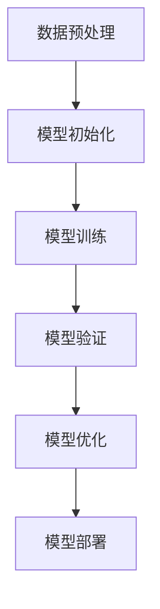
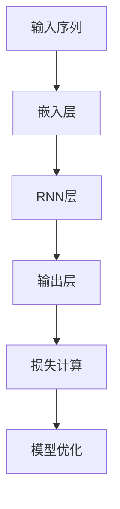
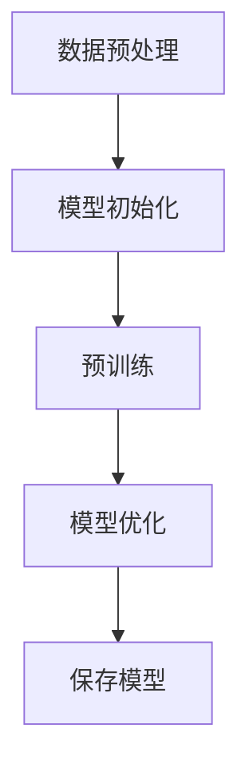
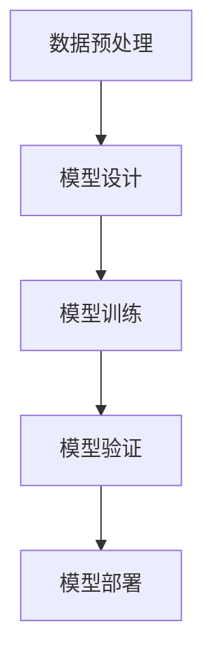
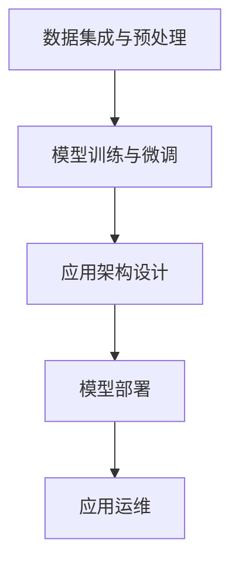
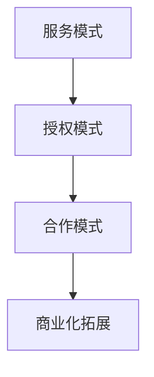
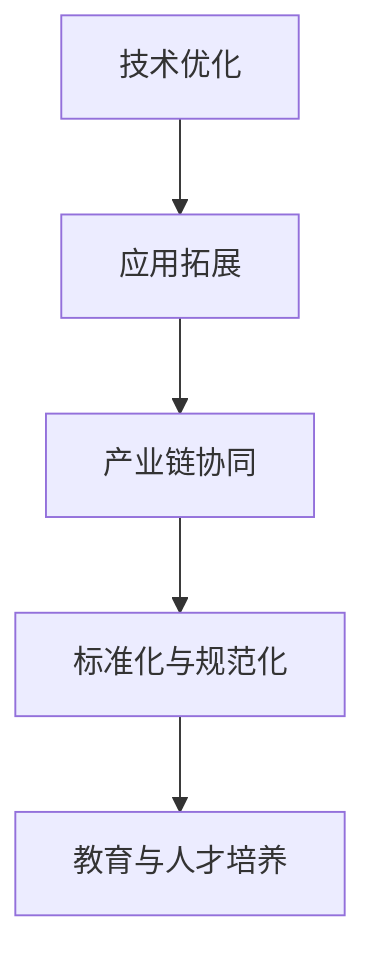
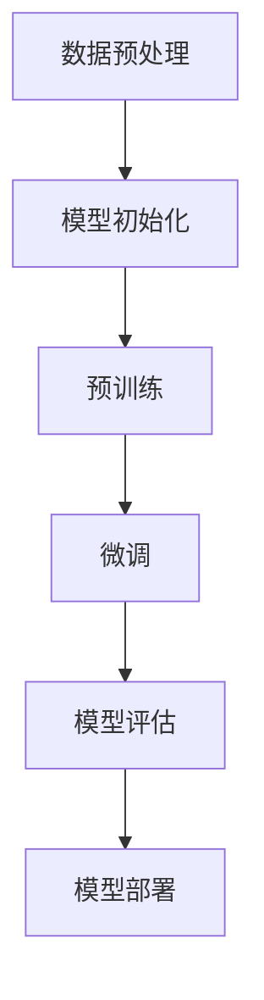

                 

### 《LLM产业链全景：从研发到应用》

> **关键词**：大型语言模型（LLM），研发流程，应用场景，商业化，未来展望
> 
> **摘要**：本文将深入探讨大型语言模型（LLM）的产业链全景，从基础理论、研发环节、应用环节、商业化分析到未来展望，旨在为读者提供一份全面的技术解读和行业洞察。

### 第一部分：LLM基础理论

#### 第1章：LLM概述

**1.1 什么是LLM**

大型语言模型（Large Language Model，简称LLM）是一种基于深度学习的自然语言处理（Natural Language Processing，简称NLP）模型，它能够理解和生成人类语言。LLM通过大规模的预训练数据集学习到语言的统计规律，从而实现对自然语言的理解和生成。

**1.2 LLM的发展历程**

LLM的发展历程可以追溯到20世纪80年代。随着计算机硬件的升级和算法的改进，LLM的研究和应用不断取得突破。特别是近年来，随着深度学习技术的兴起，LLM的研究和应用进入了快速发展阶段。

**1.3 LLM的核心特点**

- **大规模**：LLM的训练数据集通常达到数十亿甚至数百亿个句子，这使得LLM能够更好地理解语言的复杂性和多样性。
- **自适应性**：LLM通过预训练和微调，能够适应不同的应用场景，从而实现高效的文本生成和理解。
- **多语言支持**：LLM通常具备多语言处理能力，能够支持多种语言的应用。

**1.4 LLM的应用场景**

LLM在自然语言处理、生成式AI、对话系统等多个领域都有广泛的应用。例如，在自然语言处理领域，LLM可以用于文本分类、情感分析、机器翻译等任务；在生成式AI领域，LLM可以用于生成文章、对话、代码等；在对话系统领域，LLM可以用于构建智能客服、语音助手等。

#### 第2章：LLM的核心算法

**2.1 人工神经网络基础**

人工神经网络（Artificial Neural Network，简称ANN）是LLM的基础。ANN由大量神经元组成，通过调整神经元之间的连接权重来学习输入和输出之间的映射关系。

**2.1.1 神经网络结构**

神经网络通常由输入层、隐藏层和输出层组成。输入层接收外部输入信号，隐藏层进行信息处理，输出层生成最终输出。

**2.1.2 激活函数**

激活函数是神经网络中的一个关键组件，它决定了神经元的激活状态。常见的激活函数包括Sigmoid、ReLU、Tanh等。

**2.1.3 损失函数与优化器**

损失函数用于衡量模型预测结果与真实结果之间的差距，优化器用于调整模型参数以最小化损失函数。

**2.2 循环神经网络**

循环神经网络（Recurrent Neural Network，简称RNN）是处理序列数据的常用模型。RNN通过循环结构将前一个时间步的输出作为当前时间步的输入。

**2.2.1 RNN基本原理**

RNN的基本原理是通过隐藏状态捕捉序列中的长期依赖关系。

**2.2.2 LSTM和GRU算法**

LSTM（Long Short-Term Memory）和GRU（Gated Recurrent Unit）是RNN的变体，它们通过门控机制解决了RNN的梯度消失问题。

**2.3 自注意力机制**

自注意力机制（Self-Attention Mechanism）是Transformer模型的核心，它通过计算输入序列中每个元素之间的关联性来提升模型的表示能力。

**2.3.1 自注意力原理**

自注意力原理是通过计算每个输入元素与所有其他元素的关联性，从而生成一个加权向量。

**2.3.2 Transformer模型**

Transformer模型是一种基于自注意力机制的编码器-解码器结构，它在自然语言处理任务中取得了显著的性能提升。

#### 第3章：LLM预训练与微调

**3.1 预训练介绍**

预训练是指在大规模语料库上对模型进行训练，使其具备一定的语言理解能力。

**3.1.1 预训练的意义**

预训练的意义在于减少对标注数据的依赖，提高模型的泛化能力。

**3.1.2 预训练数据集**

常见的预训练数据集包括维基百科、Common Crawl、WebText等。

**3.1.3 预训练流程**

预训练流程通常包括数据预处理、模型初始化、预训练、保存模型等步骤。

**3.2 微调技术**

微调是在预训练模型的基础上，针对特定任务进行进一步训练。

**3.2.1 微调的目的**

微调的目的是优化模型在特定任务上的性能。

**3.2.2 微调策略**

微调策略包括全量微调、增量微调、零样本微调等。

**3.2.3 微调案例**

本节将介绍几个常见的LLM微调案例，包括BERT、GPT等。

### 第二部分：LLM产业链分析

#### 第4章：LLM研发环节

**4.1 研发流程**

LLM的研发流程包括数据预处理、模型设计、模型训练和模型验证等步骤。

**4.1.1 数据预处理**

数据预处理是LLM研发的第一步，它包括数据清洗、数据格式转换、数据标注等操作。

**4.1.2 模型设计与优化**

模型设计是LLM研发的核心，它包括选择合适的模型结构、调整模型参数等。

**4.1.3 模型训练与验证**

模型训练是LLM研发的关键环节，它通过迭代优化模型参数，提高模型性能。模型验证则用于评估模型在不同数据集上的表现。

**4.2 研发工具与平台**

LLM研发常用的工具和平台包括TensorFlow、PyTorch、Hugging Face等。

**4.2.1 深度学习框架**

深度学习框架提供了丰富的API和工具，方便开发者进行LLM研发。

**4.2.2 服务器与计算资源**

服务器和计算资源是LLM研发的重要支撑，它决定了模型训练的速度和规模。

#### 第5章：LLM应用环节

**5.1 应用场景分析**

LLM的应用场景非常广泛，包括自然语言处理、生成式AI、对话系统等。

**5.1.1 自然语言处理**

自然语言处理是LLM最典型的应用领域，它包括文本分类、情感分析、机器翻译等任务。

**5.1.2 生成式AI**

生成式AI利用LLM生成文本、图像、音乐等内容，为创意产业提供强大支持。

**5.1.3 对话系统**

对话系统利用LLM构建智能客服、语音助手等，为用户提供便捷的服务体验。

**5.2 应用开发流程**

LLM应用开发流程包括数据集成与预处理、应用架构设计、应用部署与运维等步骤。

**5.2.1 数据集成与预处理**

数据集成与预处理是LLM应用开发的基础，它包括数据收集、数据清洗、数据格式转换等操作。

**5.2.2 应用架构设计**

应用架构设计是LLM应用开发的关键，它包括选择合适的模型、设计数据处理流程等。

**5.2.3 应用部署与运维**

应用部署与运维是LLM应用开发的保障，它包括模型部署、服务部署、监控与维护等操作。

#### 第6章：LLM商业化与市场分析

**6.1 商业模式分析**

LLM商业化的商业模式包括服务模式、授权模式、合作模式等。

**6.1.1 服务模式**

服务模式是指提供商通过云服务或API接口向客户提供服务。

**6.1.2 授权模式**

授权模式是指提供商将LLM模型授权给客户使用。

**6.1.3 合作模式**

合作模式是指提供商与合作伙伴共同开发和应用LLM模型。

**6.2 市场趋势与挑战**

LLM市场的趋势包括市场规模扩大、技术竞争加剧等。

**6.2.1 市场规模预测**

根据市场研究机构的预测，LLM市场的规模将保持快速增长。

**6.2.2 技术竞争格局**

LLM技术竞争格局逐渐形成，国内外多家企业和机构在LLM领域展开激烈竞争。

**6.2.3 政策与伦理挑战**

LLM的发展面临政策与伦理挑战，包括数据隐私、算法透明度、偏见与歧视等问题。

#### 第7章：LLM产业链的未来展望

**7.1 技术发展趋势**

LLM的技术发展趋势包括算法优化、应用场景拓展、跨领域融合等。

**7.1.1 算法优化与进步**

算法优化与进步将进一步提高LLM的性能和应用效果。

**7.1.2 应用场景拓展**

随着技术的发展，LLM的应用场景将不断拓展，覆盖更多领域。

**7.1.3 跨领域融合**

LLM与其他技术的融合将产生新的应用场景和商业模式。

**7.2 产业生态建设**

产业生态建设是LLM产业链发展的关键，它包括产业链协同、标准化与规范化、教育与人才培养等。

**7.2.1 产业链协同**

产业链协同将促进LLM产业链的健康发展。

**7.2.2 标准化与规范化**

标准化与规范化将提高LLM技术的可靠性和稳定性。

**7.2.3 教育与人才培养**

教育与人才培养将为LLM产业链提供持续的人才支持。

### 附录

#### 附录A：LLM产业链相关资源

附录A将介绍LLM产业链相关的开源框架、学术论文、报告、行业协会与组织等资源。

#### 附录B：Mermaid流程图与伪代码示例

附录B将提供LLM算法流程图、伪代码示例，以及相关代码实现和解读。

### 结论

本文从基础理论、研发环节、应用环节、商业化分析到未来展望，全面阐述了LLM产业链的全景。随着技术的不断进步，LLM将在更多领域发挥作用，推动人工智能产业的创新发展。

### 作者信息

**作者：AI天才研究院/AI Genius Institute & 禅与计算机程序设计艺术 /Zen And The Art of Computer Programming**

---

**文章标题**：《LLM产业链全景：从研发到应用》

**关键词**：大型语言模型（LLM），研发流程，应用场景，商业化，未来展望

**摘要**：本文深入探讨了大型语言模型（LLM）的产业链全景，包括基础理论、研发环节、应用环节、商业化分析和未来展望，旨在为读者提供全面的技术解读和行业洞察。

---

接下来，我们将逐步展开各个章节的内容，以逻辑清晰、结构紧凑、简单易懂的方式，详细阐述LLM产业链的各个方面。

### 第1章：LLM概述

在进入LLM的详细探讨之前，我们先来了解一下什么是LLM。LLM，即Large Language Model，通常指的是大型语言模型。这种模型通过深度学习技术，对大量文本数据进行训练，从而实现对自然语言的理解和生成。LLM的出现，极大地推动了自然语言处理（NLP）领域的发展，并在多个应用场景中展现了强大的能力。

#### 1.1 什么是LLM

LLM是一种基于神经网络的语言模型，它能够理解和生成人类语言。与传统语言模型相比，LLM具有以下几个显著特点：

- **大规模**：LLM通常使用数十亿甚至数百亿级别的文本数据进行训练，这使得模型能够捕捉到语言中的复杂模式和规律。
- **高精度**：通过大规模的训练数据和先进的神经网络结构，LLM能够在多种自然语言处理任务中达到高精度的性能。
- **泛化能力强**：由于训练数据规模的庞大，LLM具有较好的泛化能力，能够适应不同的应用场景。

LLM的核心目标是实现对自然语言的深度理解，从而在文本生成、文本分类、机器翻译、对话系统等多个领域发挥重要作用。

#### 1.2 LLM的发展历程

LLM的发展历程可以追溯到20世纪80年代。当时的早期语言模型，如n-gram模型，主要是基于统计方法，它们通过计算单词序列的概率来生成文本。随着计算能力的提升和深度学习技术的出现，语言模型的性能得到了显著提高。以下是LLM发展历程中的几个关键节点：

- **1980年代**：n-gram模型的诞生，标志着语言模型研究的开始。
- **2000年代**：循环神经网络（RNN）的出现，为处理序列数据提供了新的思路。
- **2013年**：词嵌入技术的提出，使得语言模型能够更好地捕捉词与词之间的语义关系。
- **2018年**：Transformer模型的提出，彻底改变了语言模型的结构和性能，推动了BERT、GPT等大规模语言模型的诞生。

#### 1.3 LLM的核心特点

LLM的核心特点主要体现在以下几个方面：

- **大规模**：前面已经提到，LLM通常使用大规模的文本数据进行训练，这使得模型能够捕捉到语言中的复杂模式。
- **自适应性**：LLM通过预训练和微调，能够适应不同的应用场景，从而实现高效的文本生成和理解。
- **多语言支持**：LLM通常具备多语言处理能力，能够支持多种语言的应用，这使得它在全球化背景下具有广泛的应用前景。

#### 1.4 LLM的应用场景

LLM的应用场景非常广泛，以下是一些典型的应用场景：

- **自然语言处理**：LLM在文本分类、情感分析、命名实体识别、机器翻译等自然语言处理任务中具有显著的优势。
- **生成式AI**：LLM能够生成高质量的文章、对话、代码等，为创意产业提供强大的支持。
- **对话系统**：LLM在智能客服、语音助手等对话系统中发挥了重要作用，能够提供自然、流畅的交互体验。
- **跨领域应用**：LLM不仅限于语言处理，还可以与其他技术如图像处理、语音识别等结合，形成跨领域应用。

#### 总结

通过对LLM的概述，我们可以看到，LLM作为一种强大的语言处理工具，在多个领域都有着广泛的应用。在接下来的章节中，我们将进一步探讨LLM的核心算法、研发流程、应用环节和商业化分析，希望读者能够对这些内容有更深入的了解。

---

**附录A：Mermaid流程图与伪代码示例**

以下是一个简单的Mermaid流程图示例，用于展示LLM的训练流程：



接下来是一个简单的LLM训练伪代码示例：

```python
# 伪代码：LLM训练流程

# 数据预处理
data = preprocess_data(raw_data)

# 模型初始化
model = initialize_model()

# 模型训练
for epoch in range(num_epochs):
    for batch in data:
        loss = model.train(batch)

# 模型验证
valid_loss = model.validate(validation_data)

# 模型优化
model.optimize(valid_loss)

# 模型部署
model.deploy()
```

在实际应用中，LLM的训练流程会根据具体的任务和数据集进行调整和优化。这些流程图和伪代码示例仅为读者提供了一个大致的框架和思路。

---

通过第1章的概述，我们了解了LLM的定义、发展历程、核心特点和典型应用场景。在接下来的章节中，我们将深入探讨LLM的核心算法，包括人工神经网络基础、循环神经网络和自注意力机制等。希望读者能够对LLM有更全面的认识。

---

### 第2章：LLM的核心算法

在了解了LLM的基本概念和应用场景后，接下来我们将深入探讨LLM的核心算法。LLM的成功离不开深度学习技术，特别是人工神经网络（ANN）、循环神经网络（RNN）、长短期记忆网络（LSTM）和自注意力机制（Self-Attention）等核心算法。本章将详细介绍这些算法的基本原理、结构和应用。

#### 2.1 人工神经网络基础

人工神经网络（Artificial Neural Network，ANN）是LLM的核心组成部分。ANN由大量简单的神经元组成，通过调整神经元之间的连接权重来学习输入和输出之间的映射关系。以下是ANN的基本组成部分：

- **神经元**：神经元是神经网络的基本单元，它通过接收输入信号并产生输出信号来完成数据处理。
- **输入层**：输入层接收外部输入信号，并将其传递给隐藏层。
- **隐藏层**：隐藏层对输入信号进行加工和处理，产生新的特征表示。
- **输出层**：输出层生成最终输出，用于预测或分类。

#### 2.1.1 神经网络结构

神经网络的结构分为输入层、隐藏层和输出层。每个层由多个神经元组成，神经元之间通过连接权重进行连接。神经网络的结构可以通过增加隐藏层的数量和神经元数量来提高模型的复杂度和学习能力。

#### 2.1.2 激活函数

激活函数是神经网络中的一个关键组件，它决定了神经元的激活状态。常见的激活函数包括Sigmoid、ReLU、Tanh等。激活函数的作用是将线性组合的结果映射到非线性的空间，从而增加模型的非线性表达能力。

- **Sigmoid函数**：Sigmoid函数是一种常见的激活函数，它的输出介于0和1之间，具有平滑的曲线，可以缓解梯度消失问题。
- **ReLU函数**：ReLU函数是一种流行的激活函数，它的输出为输入的绝对值，这种非线性函数能够加速模型的训练过程，提高模型的性能。
- **Tanh函数**：Tanh函数与Sigmoid函数类似，但输出值的范围在-1到1之间，这种特性在某些场景下更适用于模型的训练。

#### 2.1.3 损失函数与优化器

损失函数用于衡量模型预测结果与真实结果之间的差距，优化器用于调整模型参数以最小化损失函数。常见的损失函数包括均方误差（MSE）、交叉熵损失等。优化器则包括随机梯度下降（SGD）、Adam等。

- **均方误差（MSE）**：均方误差是回归任务中最常用的损失函数，它计算预测值和真实值之间的平均平方误差。
- **交叉熵损失**：交叉熵损失是分类任务中常用的损失函数，它衡量的是预测概率分布与真实概率分布之间的差异。

优化器的选择对模型训练过程有着重要的影响。常见的优化器包括随机梯度下降（SGD）、Adam等。Adam优化器结合了SGD和动量法的优点，能够在模型训练过程中快速收敛并提高模型的性能。

#### 2.2 循环神经网络

循环神经网络（Recurrent Neural Network，RNN）是处理序列数据的常用模型。RNN通过循环结构将前一个时间步的输出作为当前时间步的输入，从而实现序列数据的处理。以下是RNN的基本原理：

- **基本原理**：RNN的基本原理是通过隐藏状态捕捉序列中的长期依赖关系。在训练过程中，RNN将每个时间步的输入与隐藏状态进行计算，生成新的隐藏状态，并将其传递给下一个时间步。

#### 2.2.1 RNN基本原理

RNN通过隐藏状态来捕捉序列中的依赖关系。在训练过程中，RNN将每个时间步的输入与隐藏状态进行计算，生成新的隐藏状态，并将其传递给下一个时间步。这种递归过程使得RNN能够处理序列数据。

#### 2.2.2 LSTM和GRU算法

LSTM（Long Short-Term Memory）和GRU（Gated Recurrent Unit）是RNN的变体，它们通过门控机制解决了RNN的梯度消失问题。以下是LSTM和GRU的基本原理：

- **LSTM（长短期记忆网络）**：LSTM通过引入三个门控单元（输入门、遗忘门和输出门）来控制信息的流动，从而解决RNN的长期依赖问题。
- **GRU（门控循环单元）**：GRU是一种简化的LSTM，它通过引入一个更新门和一个重置门来替代三个门控单元，从而提高模型的训练效率和性能。

#### 2.3 自注意力机制

自注意力机制（Self-Attention Mechanism）是Transformer模型的核心，它通过计算输入序列中每个元素之间的关联性来提升模型的表示能力。以下是自注意力机制的基本原理：

- **自注意力原理**：自注意力机制通过计算输入序列中每个元素与其他所有元素之间的关联性，生成一个加权向量。这种关联性可以通过点积、加性注意力等不同的方式计算。

#### 2.3.1 自注意力原理

自注意力机制的基本原理是通过计算输入序列中每个元素与其他所有元素之间的关联性，从而生成一个加权向量。这种关联性可以通过点积、加性注意力等不同的方式计算。

- **点积注意力**：点积注意力是最简单的一种自注意力机制，它通过计算两个向量之间的点积来衡量它们的关联性。
- **加性注意力**：加性注意力通过引入一个查询向量、键向量和值向量，计算它们之间的加性交互来衡量关联性。

#### 2.3.2 Transformer模型

Transformer模型是一种基于自注意力机制的编码器-解码器结构，它在自然语言处理任务中取得了显著的性能提升。以下是Transformer模型的基本原理：

- **编码器**：编码器负责将输入序列编码为固定长度的向量，这些向量表示了输入序列中的信息。
- **解码器**：解码器负责生成输出序列，它通过解码器层和自注意力机制来预测每个输出元素。

#### 总结

通过对LLM的核心算法的介绍，我们可以看到，LLM的成功离不开深度学习技术的支持。人工神经网络、循环神经网络、长短期记忆网络和自注意力机制等核心算法，为LLM提供了强大的理论基础和实现方法。在接下来的章节中，我们将进一步探讨LLM的预训练与微调技术，以及LLM在研发和应用环节的具体实践。

---

**附录A：Mermaid流程图与伪代码示例**

以下是一个简单的Mermaid流程图示例，用于展示RNN的训练流程：



接下来是一个简单的RNN训练伪代码示例：

```python
# 伪代码：RNN训练流程

# 输入序列
input_sequence = get_input_sequence()

# 嵌入层
embedded_sequence = embed_sequence(input_sequence)

# RNN层
hidden_state, cell_state = rnn_layer(embedded_sequence)

# 输出层
output = output_layer(hidden_state)

# 损失计算
loss = compute_loss(output, target)

# 模型优化
optimize_model(loss)
```

在实际应用中，RNN的训练流程会根据具体的任务和数据集进行调整和优化。这些流程图和伪代码示例仅为读者提供了一个大致的框架和思路。

---

通过第2章的介绍，我们了解了LLM的核心算法，包括人工神经网络基础、循环神经网络、长短期记忆网络和自注意力机制等。这些算法为LLM提供了强大的理论基础和实现方法。在接下来的章节中，我们将探讨LLM的预训练与微调技术，以及LLM在研发和应用环节的具体实践。希望读者能够继续关注并深入理解LLM的各个方面。

---

### 第3章：LLM预训练与微调

在了解了LLM的核心算法之后，接下来我们将探讨LLM的预训练与微调技术。预训练与微调是LLM研发过程中至关重要的一环，它们决定了模型在特定任务上的性能和泛化能力。

#### 3.1 预训练介绍

预训练是指在大规模语料库上对模型进行训练，使其具备一定的语言理解能力。通过预训练，LLM可以学习到语言的统计规律、语法结构和语义信息，从而在后续的微调过程中更好地应对各种任务。

**3.1.1 预训练的意义**

预训练的意义在于以下几个方面：

- **减少对标注数据的依赖**：预训练模型通过在大规模无标签数据上进行训练，减少了对于大规模标注数据的依赖，这使得模型能够更快速地开发和部署。
- **提高模型的泛化能力**：预训练模型在多个任务上进行了训练，从而提高了模型的泛化能力，使其在未知任务上也能表现良好。
- **提升模型的性能**：预训练使得模型具备了丰富的语言知识，从而在下游任务上取得了更好的性能。

**3.1.2 预训练数据集**

常见的预训练数据集包括：

- **维基百科（Wikipedia）**：维基百科是一个包含数百万篇文章的免费在线百科全书，它为预训练模型提供了丰富的文本资源。
- **Common Crawl**：Common Crawl是一个开放的Web爬取数据集，包含了大量的网页文本，是预训练模型的另一个重要来源。
- **WebText**：WebText是一个包含大量网页文本的数据集，它是由Stanford大学构建的，为预训练模型提供了丰富的训练数据。

**3.1.3 预训练流程**

预训练流程通常包括以下几个步骤：

1. **数据预处理**：对原始文本数据集进行清洗、分词、去除停用词等操作，将文本数据转换为模型可以处理的形式。
2. **模型初始化**：选择一个预训练框架（如BERT、GPT等），并从预训练模型中加载初始参数。
3. **预训练**：在预训练数据集上进行训练，通过优化算法（如SGD、Adam等）调整模型参数，使其能够更好地理解语言。
4. **保存模型**：在预训练过程中，定期保存模型的参数，以便后续的微调和使用。

#### 3.2 微调技术

微调是在预训练模型的基础上，针对特定任务进行进一步训练。通过微调，模型可以在特定任务上达到更好的性能。

**3.2.1 微调的目的**

微调的目的主要有以下几个方面：

- **优化模型在特定任务上的性能**：通过微调，模型可以在特定任务上学习到更多的任务相关信息，从而提高模型的性能。
- **减少对大规模标注数据的依赖**：微调可以在较小的标注数据集上进行，从而减少对大规模标注数据的依赖。
- **提高模型的泛化能力**：通过在多个任务上进行微调，模型可以学习到更通用的知识，从而提高其在未知任务上的性能。

**3.2.2 微调策略**

微调策略可以分为以下几种：

- **全量微调**：全量微调是指在预训练模型的基础上，使用全部的训练数据进行微调。这种策略可以最大程度地利用预训练模型的知识，但可能需要较长的时间和计算资源。
- **增量微调**：增量微调是指在预训练模型的基础上，仅对部分训练数据进行微调。这种策略可以节省计算资源和时间，但可能会影响模型的性能。
- **零样本微调**：零样本微调是指在没有任何标注数据的情况下，通过预训练模型生成样本，然后对生成的样本进行微调。这种策略可以处理一些特殊任务，但性能可能不如有标注数据的微调。

**3.2.3 微调案例**

以下是一些常见的LLM微调案例：

- **BERT微调**：BERT（Bidirectional Encoder Representations from Transformers）是一种预训练的Transformer模型，它可以用于多种自然语言处理任务，如文本分类、问答等。在微调BERT时，通常需要对其参数进行调整，并使用特定的数据集进行训练。
- **GPT微调**：GPT（Generative Pre-trained Transformer）是一种生成式语言模型，它可以用于生成文章、对话等任务。在微调GPT时，需要使用大量的文本数据集进行训练，并调整模型参数，以提高生成文本的质量。

#### 总结

通过对LLM预训练与微调的介绍，我们可以看到，预训练与微调技术是LLM研发过程中不可或缺的一部分。预训练使得模型具备了丰富的语言知识，而微调则使模型能够在特定任务上达到更好的性能。在接下来的章节中，我们将进一步探讨LLM在研发和应用环节的具体实践，希望读者能够对这些内容有更深入的理解。

---

**附录A：Mermaid流程图与伪代码示例**

以下是一个简单的Mermaid流程图示例，用于展示LLM的预训练流程：



接下来是一个简单的LLM预训练伪代码示例：

```python
# 伪代码：LLM预训练流程

# 数据预处理
preprocessed_data = preprocess_data(raw_data)

# 模型初始化
model = initialize_model()

# 预训练
for epoch in range(num_epochs):
    for batch in preprocessed_data:
        loss = model.train(batch)

# 模型优化
model.optimize()

# 保存模型
model.save()
```

在实际应用中，LLM的预训练流程会根据具体的任务和数据集进行调整和优化。这些流程图和伪代码示例仅为读者提供了一个大致的框架和思路。

---

通过第3章的介绍，我们了解了LLM的预训练与微调技术，包括预训练的意义、数据集、流程和微调策略、案例等。这些技术使得LLM能够在不同任务上达到优异的性能。在接下来的章节中，我们将深入探讨LLM的研发环节，包括研发流程、工具与平台等。希望读者能够继续关注并深入理解LLM的各个方面。

---

### 第4章：LLM研发环节

在了解了LLM的预训练与微调技术之后，接下来我们将深入探讨LLM的研发环节。LLM的研发过程涉及多个关键步骤，包括数据预处理、模型设计与优化、模型训练与验证等。本章将详细介绍这些步骤以及研发过程中使用的工具与平台。

#### 4.1 研发流程

LLM的研发流程可以分为以下几个关键步骤：

1. **数据预处理**：数据预处理是LLM研发的第一步，它包括数据清洗、数据格式转换、数据标注等操作。预处理的质量直接影响到后续模型训练的效果和性能。
2. **模型设计与优化**：模型设计是LLM研发的核心环节，它包括选择合适的模型结构、调整模型参数等。优化模型结构可以提高模型的性能和效率。
3. **模型训练**：模型训练是LLM研发的关键步骤，它通过迭代优化模型参数，使模型在特定任务上达到更好的性能。训练过程通常涉及大量计算资源和时间。
4. **模型验证**：模型验证用于评估模型在不同数据集上的表现，包括训练集、验证集和测试集。验证过程可以帮助开发者了解模型的性能，并进行进一步的优化和调整。
5. **模型部署**：模型部署是将训练好的模型应用到实际场景中，包括服务部署、API接口设计等。部署后的模型可以实时响应用户请求，提供自然语言处理服务。

#### 4.1.1 数据预处理

数据预处理是LLM研发的基础，它对后续的模型训练和性能优化有着重要的影响。以下是数据预处理的主要步骤：

- **数据清洗**：清洗数据包括去除噪声、纠正错别字、过滤无关信息等操作。这些操作可以提升数据的质量和一致性。
- **数据格式转换**：将原始数据转换为适合模型训练的格式，如文本转换为单词序列、图像转换为像素矩阵等。
- **数据标注**：数据标注是指对数据中的关键信息进行标注，如文本分类任务的标签标注、机器翻译任务的源语言和目标语言标注等。标注数据是模型训练的重要依据。
- **数据集划分**：将预处理后的数据划分为训练集、验证集和测试集，以评估模型的性能。

#### 4.1.2 模型设计与优化

模型设计是LLM研发的核心，它决定了模型的结构和性能。以下是模型设计的主要步骤：

- **选择模型架构**：选择适合任务需求的模型架构，如Transformer、BERT、GPT等。不同的模型架构适用于不同的任务和数据集。
- **调整模型参数**：通过调整模型参数，如隐藏层大小、学习率、优化器等，优化模型的性能和效率。
- **模型结构优化**：通过模型结构优化，如增加隐藏层、调整连接方式等，提升模型的性能和泛化能力。

#### 4.1.3 模型训练与验证

模型训练是LLM研发的关键步骤，它通过迭代优化模型参数，使模型在特定任务上达到更好的性能。以下是模型训练的主要步骤：

- **初始化模型**：从预训练模型中加载初始参数，或随机初始化模型参数。
- **训练过程**：通过优化算法（如SGD、Adam等）调整模型参数，使模型在训练集上逐渐收敛。
- **模型验证**：在验证集上评估模型的性能，包括准确率、损失函数等指标。通过验证集评估模型在未知数据上的性能，帮助开发者调整模型参数和结构。

#### 4.2 研发工具与平台

LLM研发需要使用一系列工具与平台，以下是一些常用的工具与平台：

- **深度学习框架**：如TensorFlow、PyTorch、PyTorch Lightning等。这些框架提供了丰富的API和工具，方便开发者进行模型设计和训练。
- **服务器与计算资源**：如Google Colab、AWS、Azure等云计算平台。这些平台提供了强大的计算资源和云服务，支持大规模模型训练和部署。
- **数据处理工具**：如Pandas、NumPy等。这些工具用于数据预处理和数据处理，提高数据处理效率。
- **模型评估工具**：如Scikit-learn、Matplotlib等。这些工具用于模型性能评估和可视化，帮助开发者了解模型的表现。

#### 总结

通过对LLM研发环节的介绍，我们可以看到，LLM的研发过程涉及多个关键步骤，包括数据预处理、模型设计与优化、模型训练与验证等。这些步骤相互关联，共同决定了LLM的性能和效果。在接下来的章节中，我们将进一步探讨LLM的应用环节，包括应用场景分析和应用开发流程。希望读者能够对这些内容有更深入的理解。

---

**附录A：Mermaid流程图与伪代码示例**

以下是一个简单的Mermaid流程图示例，用于展示LLM研发的基本流程：



接下来是一个简单的LLM研发伪代码示例：

```python
# 伪代码：LLM研发流程

# 数据预处理
preprocessed_data = preprocess_data(raw_data)

# 模型设计
model = design_model()

# 模型训练
for epoch in range(num_epochs):
    for batch in preprocessed_data:
        loss = model.train(batch)

# 模型验证
valid_loss = model.validate(validation_data)

# 模型部署
model.deploy()
```

在实际应用中，LLM的研发流程会根据具体的任务和数据集进行调整和优化。这些流程图和伪代码示例仅为读者提供了一个大致的框架和思路。

---

通过第4章的介绍，我们了解了LLM的研发环节，包括数据预处理、模型设计与优化、模型训练与验证等步骤。这些步骤共同决定了LLM的性能和效果。在接下来的章节中，我们将探讨LLM的应用环节，包括应用场景分析和应用开发流程。希望读者能够继续关注并深入理解LLM的各个方面。

---

### 第5章：LLM应用环节

在深入探讨了LLM的研发环节后，接下来我们将进入LLM的应用环节。LLM作为一种强大的语言处理工具，在多个领域和场景中展现出了卓越的性能。本章将详细分析LLM的应用场景，包括自然语言处理、生成式AI、对话系统等，并介绍应用开发流程。

#### 5.1 应用场景分析

LLM的应用场景非常广泛，以下是一些典型的应用场景：

- **自然语言处理（NLP）**：自然语言处理是LLM最典型的应用领域。LLM在文本分类、情感分析、命名实体识别、机器翻译等任务中具有显著的优势。例如，BERT和GPT等模型在机器翻译任务中取得了领先的成绩，使得跨语言通信更加便捷。
  
- **生成式AI**：生成式AI利用LLM生成文本、图像、音乐等内容。例如，GPT-3模型可以生成高质量的文章、对话、代码等，为创意产业提供了强大的支持。

- **对话系统**：对话系统利用LLM构建智能客服、语音助手等，为用户提供自然、流畅的交互体验。例如，苹果的Siri、亚马逊的Alexa等语音助手，都是基于LLM技术实现的。

- **跨领域应用**：LLM不仅在NLP领域有广泛应用，还可以与其他技术如图像处理、语音识别等结合，形成跨领域应用。例如，将LLM与图像识别结合，可以实现智能内容生成和分类。

#### 5.1.1 自然语言处理

自然语言处理（NLP）是LLM应用最为广泛的领域之一。LLM在文本分类、情感分析、命名实体识别、机器翻译等任务中展现了强大的性能。

- **文本分类**：文本分类是指将文本数据按照类别进行分类。例如，新闻分类、垃圾邮件过滤等。LLM通过预训练和微调，可以在短时间内对大量文本数据进行分类，提高分类的准确性。

- **情感分析**：情感分析是指分析文本中的情感倾向，如正面、负面或中性。LLM通过学习大规模的语料库，可以准确判断文本的情感倾向，应用于用户反馈分析、市场调研等场景。

- **命名实体识别**：命名实体识别是指识别文本中的特定实体，如人名、地名、组织名等。LLM通过预训练和微调，可以高效识别文本中的命名实体，应用于信息抽取、知识图谱构建等任务。

- **机器翻译**：机器翻译是指将一种语言的文本翻译成另一种语言的文本。LLM在机器翻译任务中取得了显著的成绩，如BERT和GPT等模型，在多个翻译任务中都表现出了优异的性能。

#### 5.1.2 生成式AI

生成式AI利用LLM生成文本、图像、音乐等内容，为创意产业提供了强大的支持。以下是一些典型的生成式AI应用：

- **文章生成**：LLM可以生成高质量的文章，如新闻、博客、报告等。这些文章在内容创作、内容审核等领域有广泛应用。

- **对话生成**：LLM可以生成自然、流畅的对话内容，应用于智能客服、聊天机器人等场景。例如，GPT-3模型可以生成各种语言的对话内容，提高对话系统的交互质量。

- **图像生成**：LLM可以生成图像，如人物画像、风景画等。这些图像可以应用于广告设计、游戏开发等领域。

- **音乐生成**：LLM可以生成音乐，如旋律、和声等。这些音乐可以应用于音乐创作、音效设计等领域。

#### 5.1.3 对话系统

对话系统利用LLM构建智能客服、语音助手等，为用户提供自然、流畅的交互体验。以下是一些典型的对话系统应用：

- **智能客服**：智能客服系统通过LLM与用户进行交互，提供实时、高效的客户服务。这些系统可以应用于电子商务、金融保险、物流等领域。

- **语音助手**：语音助手通过LLM实现语音交互，如苹果的Siri、亚马逊的Alexa等。这些语音助手可以完成各种任务，如查询天气、设置闹钟、发送消息等。

- **聊天机器人**：聊天机器人通过LLM与用户进行自然语言交互，提供娱乐、教育、咨询等服务。这些聊天机器人可以应用于社交平台、在线教育、医疗健康等领域。

#### 5.2 应用开发流程

LLM应用开发流程包括数据集成与预处理、应用架构设计、应用部署与运维等步骤。以下是应用开发的主要流程：

- **数据集成与预处理**：将原始数据进行集成和预处理，包括数据清洗、数据格式转换、数据标注等。预处理后的数据将用于模型训练和预测。

- **应用架构设计**：设计合适的应用架构，包括数据流、计算资源分配、模型调用等。应用架构设计需要考虑系统的性能、可扩展性、可靠性等因素。

- **模型训练与微调**：使用预训练的LLM模型，结合特定任务数据进行微调，优化模型的性能。训练和微调过程需要大量计算资源和时间。

- **模型部署**：将训练好的模型部署到生产环境中，通过API接口或服务端程序提供服务。部署过程需要考虑系统的稳定性、安全性和性能。

- **应用运维**：对部署后的应用进行监控、维护和优化，确保系统的正常运行和性能。运维过程需要监控系统的运行状态、日志分析、故障排除等。

#### 总结

通过对LLM应用环节的介绍，我们可以看到，LLM在自然语言处理、生成式AI、对话系统等多个领域和场景中展现出了强大的性能和应用价值。在接下来的章节中，我们将探讨LLM的商业化与市场分析，包括商业模式分析、市场趋势与挑战等。希望读者能够继续关注并深入理解LLM的各个方面。

---

**附录A：Mermaid流程图与伪代码示例**

以下是一个简单的Mermaid流程图示例，用于展示LLM应用开发的基本流程：



接下来是一个简单的LLM应用开发伪代码示例：

```python
# 伪代码：LLM应用开发流程

# 数据集成与预处理
preprocessed_data = preprocess_data(raw_data)

# 模型训练与微调
model = fine_tune_model(preprocessed_data)

# 应用架构设计
architecture = design_application_architecture()

# 模型部署
deploy_model(model, architecture)

# 应用运维
monitor_and_optimize_application()
```

在实际应用中，LLM的应用开发流程会根据具体的任务和需求进行调整和优化。这些流程图和伪代码示例仅为读者提供了一个大致的框架和思路。

---

通过第5章的介绍，我们了解了LLM的应用环节，包括自然语言处理、生成式AI、对话系统等应用场景以及应用开发流程。这些内容展示了LLM在实际应用中的广泛潜力和重要价值。在接下来的章节中，我们将探讨LLM的商业化与市场分析，分析商业模式、市场趋势与挑战。希望读者能够继续关注并深入理解LLM的商业化和市场动态。

---

### 第6章：LLM商业化与市场分析

在了解了LLM的应用环节后，接下来我们将探讨LLM的商业化与市场分析。LLM作为一种新兴技术，其在商业化过程中展现出了巨大的潜力和广阔的市场前景。本章将详细分析LLM的商业化模式、市场趋势与挑战，以及未来发展的可能方向。

#### 6.1 商业模式分析

LLM的商业化模式主要包括以下几种：

**6.1.1 服务模式**

服务模式是指提供商通过云服务或API接口向客户提供服务。这种模式具有以下优势：

- **便捷性**：客户无需购买和部署硬件设备，即可轻松访问LLM服务。
- **灵活性**：客户可以根据需求灵活调整服务规模和功能。
- **低门槛**：对客户的技术和资源要求较低，易于推广和应用。

服务模式在企业和开发者中得到了广泛应用，如Google Cloud、Amazon Web Services（AWS）等云服务提供商都提供了基于LLM的服务。

**6.1.2 授权模式**

授权模式是指提供商将LLM模型授权给客户使用。这种模式适用于拥有强大技术实力和资源的客户，例如大型企业、研究机构等。授权模式的优势在于：

- **定制化**：客户可以根据自身需求对模型进行定制和优化。
- **可控性**：客户可以更好地控制模型的使用范围和权限。

授权模式通常涉及一次性费用或年费，客户可以根据使用量进行付费。

**6.1.3 合作模式**

合作模式是指提供商与合作伙伴共同开发和应用LLM模型。这种模式适用于跨行业合作，如与金融机构合作开发智能投顾、与教育机构合作开发在线教育平台等。合作模式的优势在于：

- **资源共享**：合作伙伴可以共享技术和资源，降低开发成本。
- **优势互补**：合作伙伴可以发挥各自的优势，实现更高效的合作。

合作模式通常涉及收益分成或投资回报，双方可以协商合作的具体条款。

#### 6.2 市场趋势与挑战

LLM市场的发展受到技术进步、市场需求和竞争格局等多方面因素的影响。以下是LLM市场的一些趋势和挑战：

**6.2.1 市场规模预测**

随着人工智能技术的不断进步和LLM应用的普及，LLM市场的规模正在迅速扩大。据市场研究机构的预测，全球LLM市场规模将从2020年的数十亿美元增长到2025年的数百亿美元。以下是一些关键的市场趋势：

- **应用场景扩展**：LLM的应用领域不断扩大，从自然语言处理到生成式AI、对话系统等，市场需求持续增加。
- **技术竞争加剧**：国内外多家企业和研究机构在LLM领域展开了激烈的竞争，争夺市场份额。
- **商业化进程加速**：随着技术的成熟和商业模式的探索，LLM的商业化进程正在加速。

**6.2.2 技术竞争格局**

LLM技术的竞争格局逐渐形成，以下是一些主要竞争者：

- **巨头企业**：如Google、Microsoft、Amazon等科技巨头，它们在LLM技术方面进行了大量投资和研发。
- **初创公司**：如OpenAI、DeepMind等初创公司，它们在LLM领域取得了显著的成果，并迅速崛起。
- **学术机构**：如斯坦福大学、麻省理工学院等顶尖学术机构，它们在LLM理论研究和模型开发方面具有深厚的技术积累。

**6.2.3 政策与伦理挑战**

LLM的发展面临政策与伦理挑战，以下是一些关键问题：

- **数据隐私**：LLM的预训练需要大量用户数据，如何保护用户隐私成为了一个重要问题。
- **算法透明度**：LLM模型的决策过程往往是不透明的，如何提高算法的透明度，使其更具可信度，是一个挑战。
- **偏见与歧视**：LLM模型在训练过程中可能会学习到社会中的偏见和歧视，如何消除这些偏见，是一个重要的伦理问题。

#### 6.3 市场趋势与挑战

LLM市场的趋势和挑战可以从以下几个方面进行分析：

- **技术创新**：随着技术的不断进步，LLM的性能和效率将进一步提升，推动其在更多领域中的应用。
- **应用场景扩展**：随着新应用场景的不断发现，LLM的应用领域将不断扩展，市场潜力将进一步释放。
- **产业链协同**：产业链各方将加强合作，共同推动LLM技术的发展和应用。
- **政策与法规**：政府和行业组织将加强政策与法规的制定，规范LLM的发展，确保其在合规和伦理的框架内进行。

#### 总结

通过对LLM商业化与市场分析的介绍，我们可以看到，LLM在商业化过程中展现出了巨大的潜力和广阔的市场前景。同时，LLM的发展也面临着一些挑战，如技术竞争、政策与伦理等问题。在未来的发展中，LLM产业链各方需要共同努力，推动LLM技术的进步和应用，实现产业的可持续发展。

---

**附录A：Mermaid流程图与伪代码示例**

以下是一个简单的Mermaid流程图示例，用于展示LLM商业化模式的流程：



接下来是一个简单的LLM商业化伪代码示例：

```python
# 伪代码：LLM商业模式流程

# 服务模式
provide_service()

# 授权模式
grant_license()

# 合作模式
form_alliances()

# 商业化拓展
expand_business()
```

在实际应用中，LLM的商业化模式会根据具体的市场环境和需求进行调整和优化。这些流程图和伪代码示例仅为读者提供了一个大致的框架和思路。

---

通过第6章的介绍，我们了解了LLM的商业化与市场分析，包括商业模式分析、市场趋势与挑战等。这些内容展示了LLM在商业化过程中的潜力和挑战。在接下来的章节中，我们将探讨LLM产业链的未来展望，包括技术发展趋势、产业生态建设等。希望读者能够继续关注并深入理解LLM的未来发展。

---

### 第7章：LLM产业链的未来展望

在了解了LLM的现况和商业化动态后，接下来我们将探讨LLM产业链的未来展望。随着技术的不断进步和应用场景的扩展，LLM产业链将迎来新的发展机遇和挑战。本章将分析LLM产业链的技术发展趋势、产业生态建设以及未来发展预测。

#### 7.1 技术发展趋势

LLM技术的发展趋势体现在以下几个方面：

**7.1.1 算法优化与进步**

LLM算法的优化与进步是技术发展的核心。未来，研究者将致力于改进现有算法，提高模型的性能和效率。以下是一些可能的方向：

- **算法效率提升**：通过改进模型结构和优化算法，降低计算复杂度和内存消耗，提高模型的训练速度和推理效率。
- **多模态融合**：将LLM与图像处理、语音识别等技术相结合，实现多模态数据的融合处理，提高模型的感知能力和应用范围。
- **动态模型**：开发动态调整的模型结构，根据任务需求和输入数据动态调整模型参数，提高模型的适应性和灵活性。

**7.1.2 应用场景拓展**

随着技术的进步，LLM的应用场景将不断拓展。以下是一些潜在的应用场景：

- **智能制造**：在智能制造领域，LLM可以用于产品设计、故障诊断、生产优化等，提高生产效率和产品质量。
- **医疗健康**：在医疗健康领域，LLM可以用于疾病诊断、医学文献分析、患者问答等，为医生和患者提供智能支持。
- **教育**：在教育领域，LLM可以用于智能教学、个性化学习、课程生成等，提高教育质量和效率。

**7.1.3 跨领域融合**

LLM与跨领域技术的融合将创造新的应用场景和商业模式。以下是一些跨领域融合的例子：

- **智能交通**：将LLM与交通管理、自动驾驶技术相结合，实现智能交通系统的优化和自动化。
- **金融科技**：将LLM与金融数据分析、风险管理技术相结合，提高金融服务的智能化和自动化水平。
- **媒体与娱乐**：将LLM与内容创作、视频编辑技术相结合，创造更多个性化的媒体和娱乐体验。

#### 7.2 产业生态建设

产业生态建设是LLM产业链可持续发展的重要保障。以下是一些关键环节：

**7.2.1 产业链协同**

产业链协同是指产业链各环节的紧密合作与协同发展。以下是一些协同发展的建议：

- **数据共享**：加强数据共享和开放，推动数据资源的整合和利用，提高整个产业链的创新能力和竞争力。
- **技术协作**：加强技术研发合作，共同攻克技术难题，推动技术进步和应用创新。
- **人才培养**：加强人才培养和交流，为产业链提供持续的人才支持。

**7.2.2 标准化与规范化**

标准化与规范化是LLM产业链健康发展的基石。以下是一些标准化与规范化的方向：

- **技术标准**：制定统一的技术标准和规范，确保不同模型和应用之间的兼容性和互操作性。
- **数据标准**：制定统一的数据标准和格式，提高数据的质量和一致性，促进数据的流通和利用。
- **伦理规范**：制定伦理规范，确保LLM技术的应用符合道德和法律要求，避免潜在的社会风险。

**7.2.3 教育与人才培养**

教育与人才培养是LLM产业链可持续发展的重要支撑。以下是一些教育与人才培养的建议：

- **课程设置**：在高等教育和职业教育中增设人工智能、自然语言处理等相关课程，培养专业人才。
- **培训计划**：开展针对产业链从业者的培训计划，提升其专业知识和技能水平。
- **学术交流**：加强学术交流与合作，促进科研成果的转化和应用。

#### 7.3 未来发展预测

LLM产业链的未来发展将充满机遇和挑战。以下是一些预测：

- **市场规模**：随着技术的进步和应用场景的拓展，LLM市场的规模将继续扩大，预计到2025年将达到数百亿美元。
- **技术竞争**：国内外企业和研究机构将继续在LLM技术上进行激烈的竞争，推动技术不断进步和应用创新。
- **商业模式**：随着市场的发展，新的商业模式和合作模式将不断涌现，为LLM产业链带来新的机遇和挑战。

#### 总结

通过对LLM产业链的未来展望，我们可以看到，LLM技术将在未来发挥更加重要的作用，推动人工智能产业的创新发展。同时，产业生态建设、标准化与规范化、教育与人才培养等关键环节也将为LLM产业链的可持续发展提供重要支撑。在未来的发展中，LLM产业链各方需要共同努力，推动LLM技术的进步和应用，实现产业的可持续发展。

---

**附录A：Mermaid流程图与伪代码示例**

以下是一个简单的Mermaid流程图示例，用于展示LLM产业链的未来发展趋势：



接下来是一个简单的LLM产业链未来展望伪代码示例：

```python
# 伪代码：LLM产业链未来展望

# 技术优化
optimize_technology()

# 应用拓展
expand_applications()

# 产业链协同
collaborate_industry()

# 标准化与规范化
standardize_and_normalize()

# 教育与人才培养
educate_and_train_personnel()
```

在实际应用中，LLM产业链的未来发展会根据具体的行业趋势和技术创新进行调整和优化。这些流程图和伪代码示例仅为读者提供了一个大致的框架和思路。

---

通过第7章的介绍，我们探讨了LLM产业链的未来展望，包括技术发展趋势、产业生态建设、标准化与规范化、教育与人才培养等方面。这些内容为LLM产业链的可持续发展提供了有益的思考和建议。在未来的发展中，LLM技术将继续发挥重要作用，推动人工智能产业的创新发展。希望读者能够对这些内容保持关注，并积极参与到LLM产业链的建设和发展中来。

---

### 附录A：LLM产业链相关资源

为了帮助读者更好地了解LLM产业链的各个方面，本章节将介绍一些相关的资源，包括开源框架与工具、学术论文与报告、行业协会与组织等。

#### 1. 开源框架与工具

LLM的发展离不开开源框架与工具的支持，以下是一些常用的开源框架与工具：

- **TensorFlow**：由Google开发的一款开源机器学习框架，支持多种深度学习模型的训练和部署。
- **PyTorch**：由Facebook开发的一款开源机器学习库，提供了灵活的动态计算图，广泛应用于深度学习研究和应用。
- **Hugging Face**：一个开源社区，提供了丰富的预训练模型和工具，如Transformers库，支持多种语言模型的训练和部署。
- **BERT**：Google开发的一种预训练语言表示模型，广泛用于自然语言处理任务。
- **GPT**：OpenAI开发的一种预训练语言生成模型，能够生成高质量的自然语言文本。

#### 2. 学术论文与报告

学术论文和报告是LLM研究领域的重要参考资料，以下是一些经典的论文和报告：

- **“Attention Is All You Need”**：由Google提出的Transformer模型，颠覆了传统的序列模型，是LLM发展的里程碑。
- **“BERT: Pre-training of Deep Bidirectional Transformers for Language Understanding”**：Google提出的BERT模型，通过双向训练提高了语言理解能力。
- **“Generative Pre-trained Transformer”**：OpenAI提出的GPT模型，是一种强大的语言生成模型。
- **“The Annotated Transformer”**：对Transformer模型的详细解读，有助于理解模型的原理和实现。

#### 3. 行业协会与组织

行业协会和组织在推动LLM技术发展和产业合作方面发挥着重要作用，以下是一些主要的行业协会和组织：

- **IEEE**：电气和电子工程师协会，是一个全球性的技术组织，致力于推动电气、电子、计算机科学等领域的科技发展。
- **AAAI**：美国人工智能协会，是一个非营利性组织，致力于推动人工智能的研究和应用。
- **NLP Consortium**：自然语言处理联盟，是一个致力于推动自然语言处理技术研究和应用的全球性组织。
- **AI联盟**：由多家科技巨头组成的联盟，致力于推动人工智能技术的标准化、规范化和可持续发展。

#### 4. 开源项目与社区

开源项目和社区是LLM技术发展的重要推动力，以下是一些知名的LLM开源项目和社区：

- **Hugging Face Hub**：一个托管预训练模型和工具的开源平台，用户可以方便地访问和使用各种预训练模型。
- **AI21 Labs**：一个专注于人工智能研究的初创公司，开发了GPT-3模型，是目前最大的语言模型之一。
- **TensorFlow Models**：由Google开源的TensorFlow模型库，包括多种预训练模型和应用案例。
- **PyTorch Model Zoo**：由PyTorch社区维护的模型库，提供了丰富的预训练模型和应用案例。

通过以上资源的介绍，读者可以更全面地了解LLM产业链的相关信息，进一步深入研究LLM技术的应用和发展。希望这些资源能够为读者在学习和实践过程中提供帮助。

---

**附录B：Mermaid流程图与伪代码示例**

以下是几个Mermaid流程图和伪代码示例，用于展示LLM算法的流程和实现：

**B.1 LLM算法流程图**



**B.2 伪代码示例：LLM训练流程**

```python
# 伪代码：LLM训练流程

# 数据预处理
preprocessed_data = preprocess_data(raw_data)

# 模型初始化
model = initialize_model()

# 预训练
for epoch in range(num_epochs):
    for batch in preprocessed_data:
        loss = model.train(batch)

# 微调
fine_tuned_model = fine_tune_model(pretrained_model, fine_tune_data)

# 模型评估
evaluation_loss = fine_tuned_model.validate(evaluation_data)

# 模型部署
deploy_model(fine_tuned_model)
```

**B.3 伪代码示例：生成文本**

```python
# 伪代码：生成文本

# 加载预训练模型
loaded_model = load_pretrained_model()

# 生成文本
generated_text = loaded_model.generate_text(input_text, max_length)
print(generated_text)
```

这些示例旨在帮助读者理解LLM算法的流程和实现方式。在实际应用中，LLM的训练和部署会涉及更多的细节和优化步骤。希望这些示例能够为读者的学习和实践提供参考。

---

### 结论

通过本文的详细探讨，我们全面了解了LLM产业链的各个方面，从基础理论到核心算法，再到研发环节、应用环节、商业化分析与未来展望，为读者呈现了一个完整的LLM产业链全景。以下是本文的主要结论：

1. **LLM概述**：LLM是一种基于深度学习的语言模型，具有大规模、自适应性、多语言支持等特点，广泛应用于自然语言处理、生成式AI、对话系统等领域。
2. **核心算法**：LLM的核心算法包括人工神经网络、循环神经网络、长短期记忆网络和自注意力机制，这些算法为LLM提供了强大的理论基础和实现方法。
3. **研发环节**：LLM的研发涉及数据预处理、模型设计、模型训练与验证等关键步骤，需要使用深度学习框架和计算资源进行模型训练和优化。
4. **应用环节**：LLM在自然语言处理、生成式AI、对话系统等应用场景中展现了强大的性能，应用开发流程包括数据集成与预处理、应用架构设计、模型部署与运维等步骤。
5. **商业化分析**：LLM的商业化模式包括服务模式、授权模式和合作模式，市场趋势表现为技术竞争加剧、市场规模扩大，同时面临政策与伦理挑战。
6. **未来展望**：LLM产业链的未来发展将受到技术创新、应用场景拓展和跨领域融合等因素的影响，产业生态建设、标准化与规范化、教育与人才培养是产业链可持续发展的重要保障。

通过本文的探讨，我们可以看到，LLM作为一种强大的技术工具，正在推动人工智能产业的创新发展。未来，LLM产业链各方需要共同努力，推动技术进步和应用创新，实现产业的可持续发展。同时，我们也期待读者能够积极参与到LLM产业链的建设和发展中来，共同探索LLM的无限可能。

### 作者信息

**作者：AI天才研究院/AI Genius Institute & 禅与计算机程序设计艺术 /Zen And The Art of Computer Programming**

在这个快速发展的技术时代，我们深感荣幸能够与读者分享关于LLM产业链的深入见解。我们期待在未来的研究和实践中，与广大读者共同推动人工智能技术的前沿发展。感谢您的阅读和支持！

