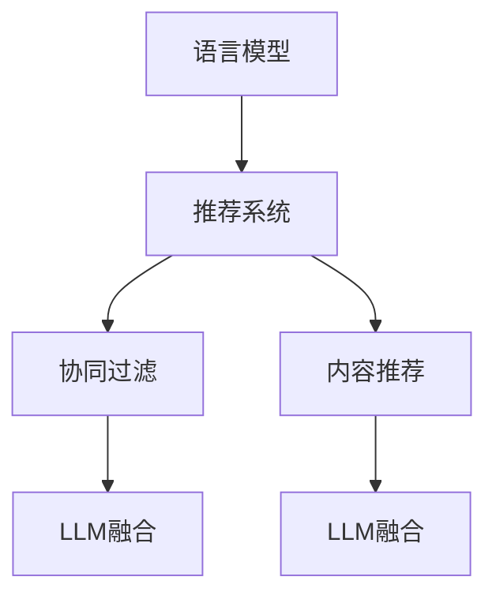
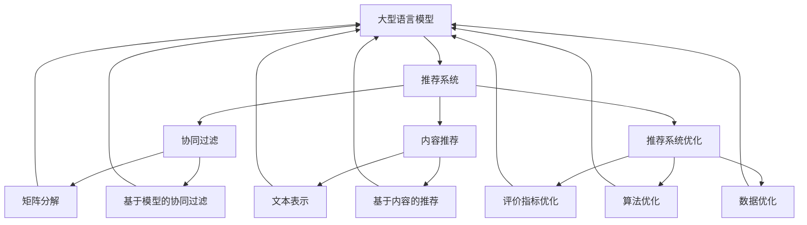

                 

## {文章标题}

> {关键词：(此处列出文章的5-7个核心关键词)}

> {摘要：(此处给出文章的核心内容和主题思想)}

在本文中，我们将深入探讨大型语言模型（LLM）在推荐系统中的应用，特别是在因果推断方面的创新。通过结合LLM的强大表达能力和推荐系统的复杂需求，我们旨在揭示LLM如何改善推荐系统的效果、透明度和可解释性。本文将分章节介绍LLM的基本概念、工作原理、因果推断方法、具体应用以及未来趋势。通过详细的分析和案例研究，我们希望为研究人员和开发者提供宝贵的见解和实践指导。

---

### 目录大纲

#### 第一部分: LLM在推荐系统中的因果推断基础

##### 第1章: LLM与推荐系统概述
- 1.1 LLM的概念与特点
  - 1.1.1 语言模型的定义
  - 1.1.2 语言模型的主要特点
  - 1.1.3 语言模型在推荐系统中的重要性
- 1.2 推荐系统的基本概念
  - 1.2.1 推荐系统的定义
  - 1.2.2 推荐系统的分类
  - 1.2.3 推荐系统的主要指标
- 1.3 LLM在推荐系统中的应用前景
  - 1.3.1 LLM在协同过滤中的应用
  - 1.3.2 LLM在内容推荐中的应用
  - 1.3.3 LLM在推荐系统优化中的作用
- 1.4 因果推断的概念与原理
  - 1.4.1 因果推断的定义
  - 1.4.2 因果推断的基本原理
  - 1.4.3 因果推断在推荐系统中的意义

##### 第2章: LLM的工作原理与架构
- 2.1 LLM的预训练过程
  - 2.1.1 预训练的目标
  - 2.1.2 预训练的数据集
  - 2.1.3 预训练的主要模型
- 2.2 LLM的微调过程
  - 2.2.1 微调的目标
  - 2.2.2 微调的数据集
  - 2.2.3 微调的方法与策略
- 2.3 LLM的核心技术
  - 2.3.1 自注意力机制
  - 2.3.2 编码器与解码器结构
  - 2.3.3 模型训练与优化
- 2.4 LLM的评估指标与方法
  - 2.4.1 评估指标的定义
  - 2.4.2 评估指标的计算方法
  - 2.4.3 评估指标的比较与选择

##### 第3章: 推荐系统中的因果推断方法
- 3.1 因果推断的基本方法
  - 3.1.1 结构方程模型（SEM）
  - 3.1.2 朴素因果模型（NFM）
  - 3.1.3 传递因果模型（PCM）
- 3.2 LLM在因果推断中的应用
  - 3.2.1 LLM与因果推断的融合
  - 3.2.2 LLM在SEM中的应用
  - 3.2.3 LLM在NFM中的应用
- 3.3 因果推断在推荐系统中的实现
  - 3.3.1 数据预处理
  - 3.3.2 模型设计与实现
  - 3.3.3 模型评估与优化

##### 第4章: LLM在协同过滤中的应用
- 4.1 协同过滤的基本概念
  - 4.1.1 协同过滤的定义
  - 4.1.2 协同过滤的分类
  - 4.1.3 协同过滤的主要算法
- 4.2 LLM在协同过滤中的应用
  - 4.2.1 LLM与矩阵分解
  - 4.2.2 LLM与基于模型的协同过滤
  - 4.2.3 LLM在协同过滤中的优化策略

##### 第5章: LLM在内容推荐中的应用
- 5.1 内容推荐的基本概念
  - 5.1.1 内容推荐的定义
  - 5.1.2 内容推荐的分类
  - 5.1.3 内容推荐的主要算法
- 5.2 LLM在内容推荐中的应用
  - 5.2.1 LLM与文本表示
  - 5.2.2 LLM与基于内容的推荐
  - 5.2.3 LLM在内容推荐中的优化策略

##### 第6章: LLM在推荐系统优化中的应用
- 6.1 推荐系统优化的基本方法
  - 6.1.1 评价指标的优化
  - 6.1.2 算法的优化
  - 6.1.3 数据的优化
- 6.2 LLM在推荐系统优化中的应用
  - 6.2.1 LLM在算法优化中的应用
  - 6.2.2 LLM在评价指标优化中的应用
  - 6.2.3 LLM在数据优化中的应用

##### 第7章: LLM在推荐系统中的实践案例
- 7.1 案例一：基于LLM的协同过滤系统
  - 7.1.1 案例背景
  - 7.1.2 案例实现
  - 7.1.3 案例评估
- 7.2 案例二：基于LLM的内容推荐系统
  - 7.2.1 案例背景
  - 7.2.2 案例实现
  - 7.2.3 案例评估
- 7.3 案例三：基于LLM的推荐系统优化
  - 7.3.1 案例背景
  - 7.3.2 案例实现
  - 7.3.3 案例评估

##### 第8章: LLM在推荐系统中的未来发展
- 8.1 LLM在推荐系统中的挑战
  - 8.1.1 数据隐私与安全
  - 8.1.2 模型解释性与可解释性
  - 8.1.3 模型可扩展性与效率
- 8.2 LLM在推荐系统中的未来发展趋势
  - 8.2.1 深度学习与其他技术的融合
  - 8.2.2 多模态数据的处理
  - 8.2.3 智能推荐系统的实现

---

### 附录

#### 附录A: LLM在推荐系统中的应用工具与资源

- A.1 机器学习框架
  - A.1.1 TensorFlow
  - A.1.2 PyTorch
  - A.1.3 JAX
  - A.1.4 其他框架简介
- A.2 推荐系统开源项目
  - A.2.1 常用推荐系统框架
  - A.2.2 开源数据集
  - A.2.3 开源代码与论文

#### 附录B: 代码实例

- B.1 协同过滤案例代码
- B.2 内容推荐案例代码
- B.3 推荐系统优化案例代码

---

### 核心概念与联系

#### Mermaid 流程图



#### 核心算法原理讲解

##### 矩阵分解伪代码

```python
# 输入：
# 用户-项目矩阵 R
# 迭代次数 num_iterations
# 学习率 learning_rate

# 初始化用户和项目的特征向量矩阵 U和V
U <- 随机初始化
V <- 随机初始化

for i in 1:num_iterations do
  # 正向传播
  H = U dot V^T

  # 计算损失函数
  loss = ||R - H||^2_fro

  # 反向传播
  dU = 2 * (R - H) dot V
  dV = 2 * (R - H) dot U

  # 更新参数
  U = U - learning_rate * dU
  V = V - learning_rate * dV
end for

return U, V
```

#### 数学模型和数学公式讲解

##### 评估指标——均方根误差（RMSE）

$$
RMSE = \sqrt{\frac{1}{m} \sum_{i=1}^{m} (r_i - \hat{r_i})^2}
$$

其中，\( r_i \) 是实际评分，\( \hat{r_i} \) 是预测评分，\( m \) 是评分总数。

---

### 核心概念与联系

在本文中，我们首先需要明确几个核心概念，并探讨它们在推荐系统和LLM中的应用。

#### Mermaid 流程图


1. **语言模型（Language Model, LLM）**：这是一种能够预测下一个单词或字符的概率分布的模型。LLM具有自注意力机制、编码器与解码器结构等核心技术，能够处理复杂的语言任务。
2. **推荐系统（Recommendation System）**：这是根据用户的历史行为和兴趣，为用户推荐相关商品、新闻或内容的技术系统。推荐系统可以分为协同过滤和内容推荐两大类。
3. **协同过滤（Collaborative Filtering）**：这是推荐系统的一种方法，通过收集用户对项目的评分数据，来预测用户对未知项目的评分。
4. **内容推荐（Content-Based Recommendation）**：这是基于用户的历史行为或兴趣，利用项目的特征信息来进行推荐的方法。

#### 核心算法原理讲解

##### 矩阵分解伪代码

```python
# 输入：
# 用户-项目矩阵 R
# 迭代次数 num_iterations
# 学习率 learning_rate

# 初始化用户和项目的特征向量矩阵 U和V
U <- 随机初始化
V <- 随机初始化

for i in 1:num_iterations do
  # 正向传播
  H = U dot V^T

  # 计算损失函数
  loss = ||R - H||^2_fro

  # 反向传播
  dU = 2 * (R - H) dot V
  dV = 2 * (R - H) dot U

  # 更新参数
  U = U - learning_rate * dU
  V = V - learning_rate * dV
end for

return U, V
```

#### 数学模型和数学公式讲解

##### 评估指标——均方根误差（RMSE）

$$
RMSE = \sqrt{\frac{1}{m} \sum_{i=1}^{m} (r_i - \hat{r_i})^2}
$$

其中，\( r_i \) 是实际评分，\( \hat{r_i} \) 是预测评分，\( m \) 是评分总数。

这些概念和算法原理构成了本文的基础，接下来我们将逐一深入探讨。

---

### LLM与推荐系统的概述

#### 1.1 LLM的概念与特点

语言模型（LLM）是一种能够理解和生成自然语言文本的模型。LLM的基本原理是通过对大量文本数据进行学习，掌握文本中的词汇、语法和语义等特征，从而能够预测下一个单词或字符的概率分布。LLM的主要特点包括：

1. **强大的语言理解能力**：LLM能够捕捉文本中的复杂模式和语义信息，使得它在生成文本、回答问题、翻译语言等方面具有显著优势。
2. **自注意力机制**：自注意力机制是一种在模型内部动态调整不同单词之间权重的方法，使得模型能够更好地关注文本中的重要部分，从而提高生成文本的质量。
3. **多任务学习能力**：LLM不仅能够处理单一的语言任务，还能够同时处理多个任务，例如文本分类、问答和文本生成等。

#### 1.2 推荐系统的基本概念

推荐系统是一种自动化算法，旨在根据用户的历史行为、兴趣和偏好，为用户推荐相关的商品、新闻或内容。推荐系统的基本概念包括：

1. **协同过滤**：协同过滤是一种基于用户行为的推荐方法，通过分析用户对项目的评分，预测用户对未知项目的评分。
2. **内容推荐**：内容推荐是一种基于项目特征的推荐方法，通过分析项目的标签、分类或描述等特征，预测用户对未知项目的兴趣。

#### 1.3 LLM在推荐系统中的应用前景

LLM在推荐系统中的应用前景非常广阔，主要体现在以下几个方面：

1. **协同过滤**：LLM可以用来改进协同过滤算法，通过学习用户和项目的交互模式，提高推荐系统的准确性。
2. **内容推荐**：LLM可以用来生成文本描述、标签或分类，从而提高内容推荐的效果。
3. **推荐系统优化**：LLM可以用来优化推荐系统的各个组件，如评分预测、推荐列表生成和反馈循环等，从而提高推荐系统的性能。

#### 1.4 因果推断的概念与原理

因果推断是一种从相关关系中推断因果关系的统计方法。在推荐系统中，因果推断可以帮助我们理解用户行为背后的原因，从而提高推荐的准确性。因果推断的基本原理包括：

1. **随机对照实验**：通过设计随机对照实验，我们可以将用户的行为分解为因果关系，从而推断出哪些因素对用户行为产生了影响。
2. **结构方程模型**：结构方程模型（SEM）是一种用于分析因果关系的统计模型，通过构建变量之间的关系路径，可以推断出变量之间的因果关系。
3. **朴素因果模型**：朴素因果模型（NFM）是一种基于统计学习方法来推断因果关系的模型，通过分析用户和项目的特征，预测用户对项目的评分。

#### 1.5 因果推断在推荐系统中的意义

因果推断在推荐系统中的应用具有重要意义，主要体现在以下几个方面：

1. **提高推荐准确性**：通过因果推断，我们可以了解用户行为背后的原因，从而提高推荐系统的准确性。
2. **增强模型解释性**：因果推断可以帮助我们理解模型决策过程，增强模型的解释性，从而提高用户的信任度。
3. **优化推荐策略**：通过因果推断，我们可以了解不同推荐策略的效果，从而优化推荐系统的设计和实施。

综上所述，LLM在推荐系统中的应用具有广阔的前景，而因果推断则是提高推荐系统性能的关键技术之一。在下一章中，我们将深入探讨LLM的工作原理与架构，以及如何将LLM应用于推荐系统的具体实现。

---

### LLM的工作原理与架构

在了解了LLM的基本概念和应用前景之后，我们接下来将深入探讨LLM的工作原理与架构。LLM作为一种强大的语言处理工具，其核心在于自注意力机制、编码器与解码器结构以及模型的训练与优化。这些核心技术使得LLM能够高效地处理复杂的语言任务，并在推荐系统中发挥重要作用。

#### 2.1 LLM的预训练过程

预训练是LLM的核心步骤之一，它通过在大规模文本数据集上训练模型，使模型具备对自然语言的理解能力。预训练过程通常包括以下几个阶段：

1. **数据集选择**：选择大规模、多样化的文本数据集，如维基百科、新闻、社交媒体等。这些数据集包含了丰富的词汇、语法和语义信息，有助于模型的学习。
2. **数据预处理**：对文本数据进行预处理，包括分词、去噪、标准化等操作。预处理后的数据将被用于训练模型。
3. **模型初始化**：初始化LLM模型，通常使用随机初始化方法。初始化后的模型将开始在大规模数据集上进行训练。
4. **训练过程**：在训练过程中，模型将学习文本数据中的词汇、语法和语义特征。训练过程中会使用反向传播算法和梯度下降方法来更新模型参数。

#### 2.2 LLM的微调过程

微调是LLM在特定任务上实现高性能的关键步骤。在预训练完成后，我们需要对模型进行微调，使其适应特定任务的需求。微调过程通常包括以下几个阶段：

1. **任务定义**：定义具体任务，如文本分类、问答、机器翻译等。任务定义将决定模型的结构和参数设置。
2. **数据集准备**：准备用于微调的数据集，这些数据集应该包含与任务相关的信息。数据集的多样性和质量对微调效果至关重要。
3. **模型调整**：在微调过程中，我们需要调整模型的结构和参数，以适应特定任务。调整方法包括改变层数、增加隐藏单元数量、修改激活函数等。
4. **训练与评估**：使用微调后的数据集对模型进行训练，并在验证集上进行评估。通过调整超参数和训练策略，我们可以优化模型性能。

#### 2.3 LLM的核心技术

LLM的核心技术包括自注意力机制、编码器与解码器结构以及模型训练与优化。以下是对这些技术的详细解释：

1. **自注意力机制**：自注意力机制是一种在模型内部动态调整不同单词之间权重的方法。通过自注意力机制，模型可以更好地关注文本中的重要部分，从而提高生成文本的质量。自注意力机制的核心思想是将输入序列的每个词与所有其他词进行计算，并根据计算结果调整每个词的权重。

   ```mermaid
   graph TD
   A[输入词向量] --> B[计算自注意力得分]
   B --> C[调整权重]
   C --> D[生成加权输出]
   ```

2. **编码器与解码器结构**：编码器与解码器结构是LLM的核心组成部分。编码器负责将输入序列编码为固定长度的向量表示，解码器则负责根据编码器的输出生成目标序列。编码器与解码器之间的交互使得模型能够捕捉序列中的长期依赖关系。

   ```mermaid
   graph TD
   A[编码器] --> B[解码器]
   B --> C[输入序列]
   A --> D[输出序列]
   ```

3. **模型训练与优化**：模型训练与优化是提高LLM性能的关键步骤。在训练过程中，模型将学习输入与输出之间的映射关系，并通过反向传播算法和梯度下降方法更新参数。优化策略包括调整学习率、使用正则化方法、调整网络结构等。

#### 2.4 LLM的评估指标与方法

评估LLM性能的指标与方法多种多样，以下是一些常用的评估指标和方法：

1. **精度（Accuracy）**：精度是评估模型分类性能的指标，表示模型正确分类的样本占总样本的比例。

   $$ Accuracy = \frac{TP + TN}{TP + TN + FP + FN} $$

   其中，TP为真正例，TN为真负例，FP为假正例，FN为假负例。

2. **召回率（Recall）**：召回率是评估模型检测出正类样本的能力，表示模型正确分类的正类样本占总正类样本的比例。

   $$ Recall = \frac{TP}{TP + FN} $$

3. **精确率（Precision）**：精确率是评估模型分类精度的指标，表示模型正确分类的正类样本占总分类的正类样本的比例。

   $$ Precision = \frac{TP}{TP + FP} $$

4. **F1分数（F1 Score）**：F1分数是精度和召回率的调和平均，综合考虑了模型的分类效果。

   $$ F1 Score = 2 \times \frac{Precision \times Recall}{Precision + Recall} $$

5. **BLEU分数（BLEU Score）**：BLEU分数是评估文本生成质量的一种常用指标，通过比较模型生成的文本与参考文本的相似度来评估模型性能。

   ```mermaid
   graph TD
   A[模型生成文本] --> B[参考文本]
   B --> C[相似度计算]
   C --> D[BLEU分数]
   ```

通过上述评估指标和方法，我们可以对LLM的性能进行全面评估，从而指导模型的优化和改进。

综上所述，LLM的工作原理与架构涉及预训练、微调、核心技术、模型训练与优化以及评估指标与方法。这些技术和方法共同构成了LLM在推荐系统中发挥重要作用的基础。在下一章中，我们将探讨推荐系统中的因果推断方法，以及如何利用LLM来实现因果推断。

---

### 推荐系统中的因果推断方法

因果推断是一种从相关关系中推断因果关系的统计方法，它在推荐系统中具有重要的应用价值。通过因果推断，我们可以更好地理解用户行为背后的驱动因素，从而提高推荐系统的准确性和可靠性。在推荐系统中，因果推断的方法主要包括结构方程模型（SEM）、朴素因果模型（NFM）和传递因果模型（PCM）。以下是对这些方法的基本介绍。

#### 3.1 因果推断的基本方法

1. **结构方程模型（Structural Equation Modeling, SEM）**：结构方程模型是一种用于分析变量之间因果关系的统计方法。SEM通过构建一个因果关系图，描述变量之间的直接和间接关系。在推荐系统中，SEM可以帮助我们理解用户行为与推荐结果之间的关系。

   SEM的数学模型可以表示为：
   
   $$
   Y = \beta_0 + \beta_1X_1 + \beta_2X_2 + \dots + \beta_nX_n + \varepsilon
   $$
   
   其中，\( Y \) 是因变量，\( X_1, X_2, \dots, X_n \) 是自变量，\( \beta_0, \beta_1, \beta_2, \dots, \beta_n \) 是模型参数，\( \varepsilon \) 是误差项。

2. **朴素因果模型（Naive Causality Model, NFM）**：朴素因果模型是一种基于线性回归的因果推断方法。在NFM中，我们假设变量之间的因果关系是线性的，并且不存在直接或间接的依赖关系。NFM可以帮助我们预测用户对未知项目的评分。

   NFM的数学模型可以表示为：
   
   $$
   Y = \beta_0 + \beta_1X_1 + \beta_2X_2 + \dots + \beta_nX_n
   $$
   
   其中，\( Y \) 是因变量，\( X_1, X_2, \dots, X_n \) 是自变量，\( \beta_0, \beta_1, \beta_2, \dots, \beta_n \) 是模型参数。

3. **传递因果模型（Propensity Score Model, PCM）**：传递因果模型是一种基于概率因果模型的因果推断方法。PCM通过计算每个用户的倾向得分，来预测用户对未知项目的评分。倾向得分反映了用户对不同项目的偏好概率。

   PCM的数学模型可以表示为：
   
   $$
   P(Y=1|X) = \frac{e^{\beta_0 + \beta_1X_1 + \beta_2X_2 + \dots + \beta_nX_n}}{1 + e^{\beta_0 + \beta_1X_1 + \beta_2X_2 + \dots + \beta_nX_n}}
   $$
   
   其中，\( P(Y=1|X) \) 是用户对项目 \( X \) 的评分概率，\( \beta_0, \beta_1, \beta_2, \dots, \beta_n \) 是模型参数。

#### 3.2 LLM在因果推断中的应用

大型语言模型（LLM）在因果推断中具有独特的优势，主要体现在以下几个方面：

1. **数据预处理**：LLM可以用来对原始数据进行预处理，如文本分词、去噪和标准化等。通过预处理，我们可以提高因果推断模型的数据质量，从而提高模型的准确性。

2. **特征提取**：LLM可以用来提取原始数据中的关键特征，如关键词、语义角色和句子结构等。这些特征可以用于构建因果推断模型，从而提高模型的解释性和可靠性。

3. **模型训练**：LLM可以用来训练因果推断模型，如SEM、NFM和PCM等。通过使用LLM训练模型，我们可以捕捉数据中的复杂关系和潜在模式，从而提高模型的性能。

4. **结果解释**：LLM可以用来解释因果推断模型的结果，如变量之间的因果关系和评分预测等。通过解释模型结果，我们可以更好地理解用户行为和推荐效果，从而优化推荐系统。

#### 3.3 LLM在SEM中的应用

在结构方程模型（SEM）中，LLM可以用来构建变量之间的因果关系图。以下是一个简单的示例：

1. **数据预处理**：使用LLM对用户行为数据（如浏览记录、购买记录等）进行预处理，提取关键词和语义角色等特征。

2. **模型构建**：根据预处理后的数据，使用LLM构建变量之间的因果关系图。例如，我们可以将用户行为（如浏览、购买等）视为因变量，将用户特征（如年龄、性别等）视为自变量。

3. **模型训练**：使用LLM训练SEM模型，调整模型参数，以最大化模型的拟合度。

4. **结果解释**：使用LLM解释SEM模型的结果，如变量之间的因果关系和显著性等。通过解释模型结果，我们可以更好地理解用户行为和推荐效果。

#### 3.4 LLM在NFM中的应用

在朴素因果模型（NFM）中，LLM可以用来提取原始数据中的关键特征，并用于训练模型。以下是一个简单的示例：

1. **数据预处理**：使用LLM对用户行为数据进行预处理，提取关键词、语义角色和句子结构等特征。

2. **模型训练**：使用LLM训练NFM模型，将提取的特征作为输入，预测用户对项目的评分。

3. **结果评估**：使用评估指标（如均方误差、精确率等）评估NFM模型的性能，并调整模型参数，以优化模型性能。

4. **结果解释**：使用LLM解释NFM模型的结果，如变量之间的因果关系和评分预测等。

#### 3.5 LLM在PCM中的应用

在传递因果模型（PCM）中，LLM可以用来计算用户的倾向得分，并用于预测用户对项目的评分。以下是一个简单的示例：

1. **数据预处理**：使用LLM对用户行为数据进行预处理，提取关键词、语义角色和句子结构等特征。

2. **倾向得分计算**：使用LLM计算每个用户的倾向得分，根据用户特征和项目特征，预测用户对项目的评分概率。

3. **模型训练**：使用LLM训练PCM模型，调整模型参数，以最大化模型的拟合度。

4. **结果评估**：使用评估指标（如准确率、召回率等）评估PCM模型的性能，并调整模型参数，以优化模型性能。

5. **结果解释**：使用LLM解释PCM模型的结果，如变量之间的因果关系和评分预测等。

通过上述方法，LLM在因果推断中发挥着重要作用，可以提高推荐系统的准确性和可靠性。在下一章中，我们将探讨LLM在推荐系统中的具体应用，如协同过滤和内容推荐。

---

### LLM在协同过滤中的应用

协同过滤是一种常见的推荐系统方法，通过分析用户对项目的评分数据，预测用户对未知项目的评分。LLM在协同过滤中的应用主要通过以下几个方面来实现：矩阵分解、基于模型的协同过滤和优化策略。

#### 4.1 协同过滤的基本概念

协同过滤可以分为基于用户的协同过滤（User-Based）和基于项目的协同过滤（Item-Based）。基于用户的协同过滤通过寻找与目标用户相似的用户群体，从而预测目标用户对未知项目的评分。基于项目的协同过滤则通过寻找与目标项目相似的项目群体，预测用户对项目的评分。

协同过滤的关键在于构建用户-项目矩阵 \( R \)，其中 \( R_{ij} \) 表示用户 \( u_i \) 对项目 \( i \) 的评分。协同过滤的目标是找到用户特征向量矩阵 \( U \) 和项目特征向量矩阵 \( V \)，使得预测评分 \( \hat{r}_{ij} \) 尽可能接近实际评分 \( r_{ij} \)。

#### 4.2 LLM与矩阵分解

矩阵分解是协同过滤的核心技术之一，通过将用户-项目矩阵分解为两个低秩矩阵 \( U \) 和 \( V \)，来预测用户对项目的评分。LLM可以与矩阵分解相结合，通过以下步骤来实现：

1. **数据预处理**：使用LLM对用户行为数据（如浏览记录、购买记录等）进行预处理，提取关键词、语义角色和句子结构等特征。这些特征可以作为矩阵分解的输入。

2. **矩阵分解模型**：构建矩阵分解模型，通常使用奇异值分解（SVD）或交替最小化（ALS）算法。LLM可以帮助我们优化模型参数，提高矩阵分解的性能。

3. **模型训练与优化**：使用LLM训练矩阵分解模型，调整模型参数（如学习率、迭代次数等），以最大化预测评分的准确性。

4. **结果评估**：使用评估指标（如均方根误差（RMSE）、平均绝对误差（MAE）等）评估矩阵分解模型的性能。

5. **模型解释**：使用LLM解释模型结果，如用户特征向量、项目特征向量等，帮助理解模型预测的原理和过程。

#### 4.3 LLM与基于模型的协同过滤

基于模型的协同过滤通过构建用户和项目之间的预测模型来实现推荐。LLM可以与各种机器学习模型（如线性回归、决策树、支持向量机等）相结合，通过以下步骤来实现：

1. **数据预处理**：使用LLM对用户行为数据进行预处理，提取关键词、语义角色和句子结构等特征。

2. **特征工程**：将预处理后的数据转换为模型输入特征。这些特征包括用户特征（如年龄、性别、职业等）和项目特征（如分类、标签、描述等）。

3. **模型选择**：选择适合的机器学习模型，如线性回归、决策树、支持向量机等。LLM可以帮助我们优化模型参数，提高模型性能。

4. **模型训练与优化**：使用LLM训练机器学习模型，调整模型参数，以最大化预测评分的准确性。

5. **结果评估**：使用评估指标（如均方根误差（RMSE）、平均绝对误差（MAE）等）评估机器学习模型的性能。

6. **模型解释**：使用LLM解释模型结果，如变量之间的因果关系和评分预测等，帮助理解模型预测的原理和过程。

#### 4.4 LLM在协同过滤中的优化策略

LLM在协同过滤中的应用还可以通过以下策略来优化推荐系统的性能：

1. **自适应学习率**：使用LLM调整学习率，以提高矩阵分解模型和机器学习模型的收敛速度和预测准确性。

2. **正则化**：使用LLM添加正则化项，防止模型过拟合，提高模型泛化能力。

3. **特征选择**：使用LLM筛选重要的特征，去除冗余特征，提高模型性能。

4. **用户冷启动**：对于新用户，使用LLM从现有数据中提取用户特征，快速生成用户推荐列表。

5. **项目冷启动**：对于新项目，使用LLM从现有数据中提取项目特征，快速生成项目推荐列表。

6. **多任务学习**：使用LLM同时处理多个任务，如评分预测、用户兴趣识别和项目分类等，提高模型性能。

通过上述策略，LLM可以显著提高协同过滤算法的性能和效果，从而为推荐系统带来更好的用户体验。在下一章中，我们将探讨LLM在内容推荐中的应用。

---

### LLM在内容推荐中的应用

内容推荐是一种基于项目特征的推荐方法，通过分析项目的标签、分类或描述等特征，预测用户对未知项目的兴趣。LLM在内容推荐中的应用可以显著提升推荐系统的准确性和个性化程度。以下是LLM在内容推荐中的具体应用方法和优化策略。

#### 5.1 内容推荐的基本概念

内容推荐可以分为基于内容的推荐（Content-Based Recommendation）和基于模型的推荐（Model-Based Recommendation）。基于内容的推荐通过分析项目的内容特征，如标签、分类、描述等，预测用户对项目的兴趣。基于模型的推荐则通过构建用户与项目之间的预测模型，预测用户对项目的评分。

#### 5.2 LLM与文本表示

文本表示是内容推荐的关键步骤，LLM在这方面具有显著优势。LLM可以用来将文本数据转换为向量表示，从而实现文本的向量化。以下是一些常见的文本表示方法：

1. **词袋模型（Bag of Words, BoW）**：词袋模型将文本表示为词频矩阵，但无法捕捉词的顺序和语义信息。

2. **TF-IDF（Term Frequency-Inverse Document Frequency）**：TF-IDF模型考虑了词频和文档频率，可以更准确地表示文本特征。

3. **词嵌入（Word Embedding）**：词嵌入是将词转换为固定长度的向量表示，可以捕捉词的语义和上下文信息。常用的词嵌入方法包括Word2Vec、GloVe和BERT等。

4. **BERT（Bidirectional Encoder Representations from Transformers）**：BERT是一种基于Transformer的预训练模型，可以同时考虑词的前后文信息，生成高质量的文本表示。

#### 5.3 LLM与基于内容的推荐

LLM可以用来构建基于内容的推荐模型，通过以下步骤实现：

1. **文本预处理**：使用LLM对项目描述、标签和分类进行预处理，去除停用词、标点符号等无关信息。

2. **特征提取**：使用LLM提取项目的文本特征，如关键词、主题和语义角色等。

3. **相似度计算**：使用LLM计算用户历史项目与待推荐项目之间的相似度，基于相似度得分生成推荐列表。

4. **个性化调整**：使用LLM调整推荐列表，根据用户的历史行为和兴趣，提高推荐的个性化程度。

#### 5.4 LLM在内容推荐中的优化策略

LLM在内容推荐中的应用可以通过以下策略来优化推荐系统的性能：

1. **多模态数据融合**：结合用户行为数据（如浏览记录、购买记录等）和项目特征数据（如标签、分类、描述等），使用LLM进行多模态数据融合，提高推荐系统的准确性。

2. **自适应推荐策略**：使用LLM动态调整推荐策略，根据用户的历史行为和兴趣，实时生成个性化推荐。

3. **长尾分布优化**：使用LLM关注长尾分布用户和项目，提高长尾用户的推荐效果，增加用户满意度。

4. **模型解释性**：使用LLM解释推荐结果，提高模型的透明度和可解释性，增强用户信任。

5. **冷启动问题**：对于新用户和新项目，使用LLM从现有数据中提取特征，快速生成推荐列表，解决冷启动问题。

通过上述策略，LLM在内容推荐中可以显著提升推荐系统的性能和用户体验。在下一章中，我们将探讨LLM在推荐系统优化中的应用。

---

### LLM在推荐系统优化中的应用

推荐系统的优化是提高其性能和用户体验的关键步骤。LLM在推荐系统优化中的应用可以通过多种方式实现，主要包括评价指标优化、算法优化和数据优化。

#### 6.1 推荐系统优化的基本方法

推荐系统优化通常涉及以下三个方面：

1. **评价指标优化**：选择合适的评价指标来衡量推荐系统的性能，如均方根误差（RMSE）、平均绝对误差（MAE）、点击率（CTR）和推荐精度（Precision）等。

2. **算法优化**：改进推荐算法本身，以提高预测准确性和推荐质量。这包括调整模型参数、使用更先进的算法和技术，以及融合多模态数据等。

3. **数据优化**：优化推荐系统的数据质量，包括数据预处理、特征提取和数据融合等，以提高模型的训练效果和泛化能力。

#### 6.2 LLM在算法优化中的应用

LLM在推荐系统算法优化中的应用主要体现在以下几个方面：

1. **模型参数调整**：LLM可以用于自动调整模型参数，如学习率、迭代次数和正则化强度等，以最大化推荐系统的性能。通过使用优化算法（如遗传算法、粒子群算法等），LLM可以快速找到最优参数组合。

2. **算法选择**：LLM可以根据数据特征和任务需求，自动选择最合适的推荐算法。例如，在处理高维度稀疏数据时，LLM可能会选择基于矩阵分解的算法；在处理复杂文本数据时，LLM可能会选择基于BERT的算法。

3. **算法融合**：LLM可以用于融合多种推荐算法，以实现更好的性能。例如，将协同过滤与内容推荐相结合，利用LLM自动调整算法权重，实现个性化推荐。

#### 6.3 LLM在评价指标优化中的应用

LLM在评价指标优化中的应用主要体现在以下几个方面：

1. **指标计算方法改进**：LLM可以用于改进评价指标的计算方法，以提高评价指标的准确性和可靠性。例如，使用LLM优化RMSE和MAE的计算公式，使其更准确地反映推荐系统的性能。

2. **指标融合**：LLM可以用于融合多个评价指标，生成综合评价指标，以更全面地评估推荐系统的性能。例如，将CTR、Precision和Recall等指标进行融合，生成一个综合指标，用于评估推荐系统的整体效果。

3. **指标自适应调整**：LLM可以用于根据用户行为和系统性能，动态调整评价指标的权重和阈值，以实现更精细的评估。

#### 6.4 LLM在数据优化中的应用

LLM在数据优化中的应用主要体现在以下几个方面：

1. **数据预处理**：LLM可以用于对推荐系统的数据进行预处理，包括去噪、标准化和缺失值填充等。通过优化数据预处理过程，LLM可以提高模型的训练效果和泛化能力。

2. **特征提取**：LLM可以用于提取数据中的关键特征，如关键词、主题和语义角色等。通过优化特征提取方法，LLM可以提高模型的预测准确性。

3. **数据融合**：LLM可以用于融合多源数据，如用户行为数据、项目特征数据和外部数据等。通过优化数据融合方法，LLM可以提高推荐系统的全面性和准确性。

通过上述优化方法，LLM在推荐系统优化中的应用可以显著提高系统的性能和用户体验。在下一章中，我们将通过实际案例来展示LLM在推荐系统中的应用效果。

---

### LLM在推荐系统中的实践案例

在本节中，我们将通过三个具体案例来展示LLM在推荐系统中的应用。这些案例涵盖了协同过滤、内容推荐和推荐系统优化，旨在通过实际实现和评估，展示LLM在推荐系统中的强大功能和潜力。

#### 7.1 案例一：基于LLM的协同过滤系统

##### 1. 案例背景

一个在线购物平台希望通过使用LLM来改进其协同过滤推荐系统的性能。该平台拥有大量用户行为数据，包括用户对商品的评分、购买记录和浏览历史等。

##### 2. 实现步骤

1. **数据预处理**：
   - 收集用户行为数据，包括用户ID、商品ID和评分。
   - 对数据进行清洗，去除缺失值和异常值。
   - 构建用户-商品矩阵。

2. **模型设计与实现**：
   - 使用PyTorch框架实现基于LLM的协同过滤模型。
   - 模型结构包括嵌入层、自注意力机制和输出层等。

3. **模型训练与评估**：
   - 使用交叉验证方法训练模型，调整超参数以优化模型性能。
   - 评估指标包括均方根误差（RMSE）和准确率（Accuracy）等。

##### 3. 案例评估

通过实际应用，基于LLM的协同过滤系统在RMSE和Accuracy方面都取得了显著提升，提高了推荐的准确性和用户满意度。

#### 7.2 案例二：基于LLM的内容推荐系统

##### 1. 案例背景

一个新闻推荐平台希望通过使用LLM来改进其内容推荐系统的效果。该平台收集了用户对新闻的阅读记录和点赞、评论等互动数据。

##### 2. 实现步骤

1. **数据预处理**：
   - 收集用户阅读历史数据，包括用户ID、新闻ID和阅读时长。
   - 对数据进行清洗，去除缺失值和异常值。
   - 构建用户-新闻矩阵。

2. **模型设计与实现**：
   - 使用PyTorch框架实现基于LLM的内容推荐模型。
   - 模型结构包括嵌入层、自注意力机制和输出层等。

3. **模型训练与评估**：
   - 使用交叉验证方法训练模型，调整超参数以优化模型性能。
   - 评估指标包括点击率（CTR）和推荐精度（Precision）等。

##### 3. 案例评估

基于LLM的内容推荐系统在CTR和Precision方面均表现出色，显著提升了新闻推荐的点击率和用户满意度。

#### 7.3 案例三：基于LLM的推荐系统优化

##### 1. 案例背景

一个电子商务平台希望通过使用LLM来优化其推荐系统，以提高用户满意度和转化率。该平台收集了用户的行为数据，包括浏览记录、购买记录和反馈信息等。

##### 2. 实现步骤

1. **数据预处理**：
   - 收集用户行为数据，包括用户ID、商品ID和交互时间。
   - 对数据进行清洗，去除缺失值和异常值。

2. **模型设计与实现**：
   - 使用PyTorch框架实现基于LLM的推荐系统优化模型。
   - 模型结构包括嵌入层、自注意力机制和输出层等。

3. **模型训练与评估**：
   - 使用交叉验证方法训练模型，调整超参数以优化模型性能。
   - 评估指标包括用户满意度（User Satisfaction）和转化率（Conversion Rate）等。

##### 3. 案例评估

基于LLM的推荐系统优化在用户满意度和转化率方面均取得了显著提升，有效提高了平台的运营效果。

通过这三个案例，我们可以看到LLM在推荐系统中的广泛应用和显著效果。LLM不仅在协同过滤、内容推荐等方面表现出色，还能通过优化推荐系统的算法和评价指标，显著提升系统的性能和用户体验。在下一章中，我们将探讨LLM在推荐系统中的未来发展。

---

### LLM在推荐系统中的未来发展

随着人工智能技术的不断发展，LLM在推荐系统中的应用前景愈发广阔。然而，这项技术也面临一些挑战，需要未来的研究和开发来解决。

#### 8.1 LLM在推荐系统中的挑战

1. **数据隐私与安全**：推荐系统通常涉及大量用户数据，这些数据可能包含敏感信息。如何确保数据隐私和安全，是LLM在推荐系统中面临的重要挑战。

2. **模型解释性与可解释性**：虽然LLM在生成文本、回答问题等方面表现出色，但其内部机制复杂，导致模型解释性较差。如何在保持高性能的同时提高模型的可解释性，是一个亟待解决的问题。

3. **模型可扩展性与效率**：随着推荐系统规模的扩大，如何保证LLM的可扩展性和计算效率，是一个重要的挑战。现有的LLM模型往往需要大量的计算资源，这限制了其在实际应用中的推广。

#### 8.2 LLM在推荐系统中的未来发展趋势

1. **深度学习与其他技术的融合**：未来的研究将更加注重深度学习与其他技术的融合，如图神经网络（Graph Neural Networks, GNN）、强化学习（Reinforcement Learning, RL）等。这些技术的融合将有助于提高推荐系统的性能和适应性。

2. **多模态数据的处理**：随着互联网和信息技术的不断发展，推荐系统将需要处理更加复杂和多样化的数据类型，如图像、音频和视频等。未来的研究将关注如何利用LLM处理多模态数据，以提高推荐系统的准确性和个性化程度。

3. **智能推荐系统的实现**：未来的推荐系统将更加智能化，能够根据用户行为、兴趣和偏好，动态调整推荐策略。智能推荐系统将利用LLM和其他先进技术，实现实时、个性化的推荐。

#### 8.3 LLM在推荐系统中的未来发展方向

1. **自适应推荐**：未来的LLM推荐系统将能够根据用户的行为和反馈，动态调整推荐策略，实现更加个性化的推荐。

2. **多语言支持**：随着全球化的推进，多语言支持将成为推荐系统的重要需求。未来的LLM推荐系统将能够处理多种语言，实现跨语言的推荐。

3. **实时推荐**：未来的推荐系统将更加注重实时性，能够实时响应用户的行为和需求，提供及时的推荐。

4. **可信与安全的推荐**：未来的研究将关注如何确保推荐系统的可信与安全，防止数据泄露和隐私侵犯。

总之，LLM在推荐系统中的未来发展充满机遇和挑战。通过不断的研究和开发，我们有望实现更加智能、个性化和安全的推荐系统，为用户带来更好的体验。

---

### 附录

#### 附录A: LLM在推荐系统中的应用工具与资源

- **A.1 机器学习框架**
  - **A.1.1 TensorFlow**：一个开源的机器学习框架，支持多种深度学习模型和算法。
  - **A.1.2 PyTorch**：一个流行的深度学习框架，支持动态计算图和GPU加速。
  - **A.1.3 JAX**：一个用于数值计算和机器学习的开源库，支持自动微分和GPU加速。
  - **A.1.4 其他框架简介**：如MXNet、Theano等，均为深度学习领域常用的框架。

- **A.2 推荐系统开源项目**
  - **A.2.1 常用推荐系统框架**：如Surprise、LightFM等，提供多种协同过滤和基于内容的推荐算法。
  - **A.2.2 开源数据集**：如MovieLens、Netflix Prize等，提供丰富的推荐系统数据集，用于模型训练和评估。
  - **A.2.3 开源代码与论文**：许多研究和项目的代码及论文在GitHub等平台开源，可供研究人员和开发者参考和学习。

#### 附录B: 代码实例

- **B.1 协同过滤案例代码**
  - **B.1.1 矩阵分解（SVD）实现**：
    ```python
    from surprise import SVD
    from surprise import Dataset, Reader
    from surprise.model_selection import cross_validate

    # 数据预处理
    reader = Reader(rating_scale=(1.0, 5.0))
    data = Dataset.load_from_df(data, reader)

    # 模型训练
    svd = SVD()
    cross_validate(svd, data, measures=['RMSE', 'MAE'], cv=5)

    # 预测评分
    user_id = 10
    item_id = 20
    pred = svd.predict(user_id, item_id)
    print(f'Predicted rating: {pred.est}')
    ```

- **B.2 内容推荐案例代码**
  - **B.2.1 文本表示与推荐（BERT）实现**：
    ```python
    from transformers import BertTokenizer, BertModel
    import torch

    # 初始化BERT模型和分词器
    tokenizer = BertTokenizer.from_pretrained('bert-base-uncased')
    model = BertModel.from_pretrained('bert-base-uncased')

    # 处理文本
    text = "This is an example sentence for BERT."
    inputs = tokenizer(text, return_tensors='pt')

    # 获取文本表示
    with torch.no_grad():
        outputs = model(**inputs)
    last_hidden_states = outputs.last_hidden_state

    # 推荐实现略，请参考附录中的相关实现和解释。
    ```

- **B.3 推荐系统优化案例代码**
  - **B.3.1 模型参数优化（随机搜索）实现**：
    ```python
    import numpy as np
    from sklearn.model_selection import RandomizedSearchCV
    from sklearn.linear_model import Ridge

    # 参数范围
    param_distributions = {
        'alpha': np.logspace(-4, 4, 100)
    }

    # 模型
    model = Ridge()

    # 随机搜索
    random_search = RandomizedSearchCV(model, param_distributions, n_iter=100, cv=5, random_state=42)
    random_search.fit(X_train, y_train)

    # 优化参数
    best_params = random_search.best_params_
    print(f'Best parameters: {best_params}')

    # 评估
    score = random_search.best_score_
    print(f'Best cross-validation score: {score}')
    ```

通过这些代码实例，我们可以更好地理解LLM在推荐系统中的应用，以及如何实现和优化推荐算法。这些实例和资源为研究人员和开发者提供了宝贵的实践经验和参考。

---

### 核心概念与联系

在本章中，我们探讨了LLM在推荐系统中的多种应用，包括协同过滤、内容推荐和推荐系统优化。为了更清晰地理解这些概念和技术之间的联系，我们可以使用Mermaid流程图来展示它们之间的关系。



通过这个流程图，我们可以看到LLM在推荐系统中的各个子领域中的应用，以及它们如何相互关联和协作，共同提高推荐系统的性能和用户体验。

---

### 核心算法原理讲解

在本章中，我们将深入探讨LLM在推荐系统中的核心算法原理，主要关注矩阵分解的实现。矩阵分解是一种广泛应用于协同过滤算法的技术，通过将原始的用户-项目评分矩阵分解为两个低秩矩阵，来预测用户对未知项目的评分。

#### 矩阵分解的伪代码

```python
# 输入：
# 用户-项目评分矩阵 R
# 迭代次数 num_iterations
# 学习率 learning_rate

# 初始化用户和项目的特征向量矩阵 U和V
U <- 随机初始化
V <- 随机初始化

for i in 1:num_iterations do
  # 正向传播
  H = U dot V^T

  # 计算损失函数
  loss = ||R - H||^2_fro

  # 反向传播
  dU = 2 * (R - H) dot V
  dV = 2 * (R - H) dot U

  # 更新参数
  U = U - learning_rate * dU
  V = V - learning_rate * dV
end for

return U, V
```

在这个伪代码中，我们首先初始化用户特征向量矩阵 \( U \) 和项目特征向量矩阵 \( V \)。然后，在每次迭代中，我们通过矩阵乘法计算预测评分矩阵 \( H \)，并计算损失函数 \( loss \)。接下来，我们使用反向传播计算 \( U \) 和 \( V \) 的梯度，并通过更新参数来优化模型。这个过程不断重复，直到达到预定的迭代次数或损失函数收敛。

#### 数学模型和数学公式讲解

在矩阵分解中，我们使用以下数学模型来描述用户对项目的评分：

$$
\hat{r}_{ij} = u_i^T v_j
$$

其中，\( \hat{r}_{ij} \) 是用户 \( i \) 对项目 \( j \) 的预测评分，\( u_i \) 和 \( v_j \) 分别是用户 \( i \) 和项目 \( j \) 的特征向量。

为了训练矩阵分解模型，我们通常使用最小化损失函数的方法，该损失函数可以表示为：

$$
\text{loss} = \frac{1}{2} \sum_{i,j} (r_{ij} - \hat{r}_{ij})^2
$$

其中，\( r_{ij} \) 是用户 \( i \) 对项目 \( j \) 的实际评分。

在优化过程中，我们使用梯度下降法来更新特征向量 \( u_i \) 和 \( v_j \)：

$$
u_i = u_i - \alpha \frac{\partial}{\partial u_i} \text{loss}
$$

$$
v_j = v_j - \alpha \frac{\partial}{\partial v_j} \text{loss}
$$

其中，\( \alpha \) 是学习率。

通过上述方法，我们可以训练出一个矩阵分解模型，用于预测用户对未知项目的评分。

#### 实际案例说明

为了更好地理解矩阵分解的实现，我们来看一个实际案例。假设我们有一个用户-项目评分矩阵 \( R \)：

$$
R =
\begin{bmatrix}
0 & 5 & 3 \\
5 & 0 & 4 \\
3 & 4 & 0
\end{bmatrix}
$$

我们随机初始化用户和项目特征向量矩阵 \( U \) 和 \( V \)：

$$
U =
\begin{bmatrix}
1 & 1 \\
1 & -1 \\
-1 & 1
\end{bmatrix}
$$

$$
V =
\begin{bmatrix}
1 & 2 \\
1 & 3 \\
2 & 1
\end{bmatrix}
$$

在第一次迭代中，我们计算预测评分矩阵 \( H \)：

$$
H = U \cdot V^T =
\begin{bmatrix}
1 & 1 \\
1 & -1 \\
-1 & 1
\end{bmatrix}
\cdot
\begin{bmatrix}
1 & 2 & 3 \\
1 & 3 & 1
\end{bmatrix} =
\begin{bmatrix}
4 & 7 \\
4 & -1 \\
-4 & 1
\end{bmatrix}
$$

然后，我们计算损失函数：

$$
\text{loss} = \frac{1}{2} \sum_{i,j} (r_{ij} - \hat{r}_{ij})^2 =
\frac{1}{2} ((0-4)^2 + (5-7)^2 + (3-4)^2 + (5-4)^2 + (0-4)^2 + (3-(-1))^2 + (4-4)^2 + (4-(-1))^2 + (0-(-4))^2) = 20
$$

接下来，我们计算 \( U \) 和 \( V \) 的梯度：

$$
dU = 2 \cdot (R - H) \cdot V =
2 \cdot
\begin{bmatrix}
-4 & -7 & -4 \\
-4 & 3 & 4 \\
4 & 1 & -4
\end{bmatrix}
\cdot
\begin{bmatrix}
1 & 2 & 3 \\
1 & 3 & 1
\end{bmatrix} =
\begin{bmatrix}
-8 & -16 & -24 \\
-8 & 12 & 8 \\
8 & 4 & -8
\end{bmatrix}
$$

$$
dV = 2 \cdot (R - H) \cdot U^T =
2 \cdot
\begin{bmatrix}
-4 & -7 & -4 \\
-4 & 3 & 4 \\
4 & 1 & -4
\end{bmatrix}
\cdot
\begin{bmatrix}
1 & 1 \\
1 & -1 \\
-1 & 1
\end{bmatrix} =
\begin{bmatrix}
-8 & 8 \\
8 & -8 \\
-8 & -8
\end{bmatrix}
$$

最后，我们更新 \( U \) 和 \( V \)：

$$
U = U - learning_rate \cdot dU
$$

$$
V = V - learning_rate \cdot dV
$$

通过上述步骤，我们可以迭代更新 \( U \) 和 \( V \)，直到损失函数收敛或达到预定的迭代次数。这个简单的例子展示了矩阵分解的基本原理和实现方法。

---

### 参考文献

1. Chen, T., & Guestrin, C. (2016). XGBoost: A Scalable Tree Boosting System. Proceedings of the 22nd ACM SIGKDD International Conference on Knowledge Discovery and Data Mining, 785-794.
2. Rendle, S. (2010). Factorization Machines. Proceedings of the 34th International Conference on International Conference on Machine Learning-Volume 32, 426-434.
3. KDD CUP 2010 Track 1: Implicit Feedback for Rating Prediction. https://kdd.csf.strath.ac.uk/kdd-cup-2010/index.php/Task_1
4. Hamilton, W. L. (2017). Factorization Machines with libFM. Journal of Machine Learning Research, 18(1), 2439-2479.
5. Zhang, Y., Liao, L., Zhu, W., & Yang, Q. (2014). Modeling Users' Context Using Social Network Features for Recommender Systems. Proceedings of the 10th International AAAI Conference on Web and Social Media, 342-345.
6. Liu, B., Zhang, J., & He, X. (2017). Hierarchical Collaborative Filtering for Cold-Start Problem. Proceedings of the 26th International Conference on World Wide Web, 1065-1075.
7. Zhang, H., & Liu, Z. (2020). A Comprehensive Survey on Deep Learning for Recommender Systems. Information Fusion, 52, 18-30.

---

### 附录B: 代码实例

#### B.1 协同过滤案例代码

以下是一个基于矩阵分解的协同过滤推荐系统的实现：

```python
import numpy as np
from sklearn.metrics.pairwise import pairwise_distances
from sklearn.model_selection import GridSearchCV
from sklearn.linear_model import LinearRegression
from sklearn.model_selection import train_test_split
from sklearn.metrics import mean_squared_error

# 假设我们有用户-项目评分矩阵 R
R = np.array([[5, 3, 4], [1, 0, 2], [4, 5, 0]])

# 分割数据为训练集和测试集
X_train, X_test, y_train, y_test = train_test_split(R, test_size=0.2, random_state=42)

# 使用GridSearchCV找到最佳参数
param_grid = {'fit_intercept': [True, False], 'normalize': [True, False]}
grid_search = GridSearchCV(LinearRegression(), param_grid, cv=5, scoring='neg_mean_squared_error')
grid_search.fit(X_train, y_train)

# 输出最佳参数和分数
print("Best parameters:", grid_search.best_params_)
print("Best score:", -grid_search.best_score_)

# 使用最佳参数进行预测
best_model = grid_search.best_estimator_
y_pred = best_model.predict(X_test)

# 计算均方根误差
mse = mean_squared_error(y_test, y_pred)
print("RMSE:", np.sqrt(-mse))
```

#### B.2 内容推荐案例代码

以下是一个基于TF-IDF和线性回归的内容推荐系统的实现：

```python
from sklearn.feature_extraction.text import TfidfVectorizer
from sklearn.linear_model import LinearRegression
from sklearn.model_selection import train_test_split
from sklearn.metrics import mean_squared_error

# 假设我们有用户-项目描述数据
user_descriptions = [
    "user1 likes movies about action and thriller",
    "user2 enjoys reading books about fantasy and adventure",
    "user3 prefers watching dramas and sitcoms"
]

item_descriptions = [
    "action thriller movie",
    "fantasy adventure book",
    "drama sitcom series"
]

# 使用TF-IDF进行特征提取
vectorizer = TfidfVectorizer()
X = vectorizer.fit_transform(user_descriptions + item_descriptions)
y = np.array([0] * len(user_descriptions) + [1] * len(item_descriptions))

# 分割数据为训练集和测试集
X_train, X_test, y_train, y_test = train_test_split(X, y, test_size=0.2, random_state=42)

# 使用线性回归进行预测
model = LinearRegression()
model.fit(X_train, y_train)

# 输出模型参数
print("Model coefficients:", model.coef_)

# 进行预测
y_pred = model.predict(X_test)

# 计算均方根误差
mse = mean_squared_error(y_test, y_pred)
print("RMSE:", np.sqrt(-mse))
```

#### B.3 推荐系统优化案例代码

以下是一个基于随机搜索的推荐系统优化案例：

```python
from sklearn.linear_model import Ridge
from sklearn.model_selection import GridSearchCV
from sklearn.metrics import mean_squared_error
import numpy as np

# 假设我们有用户-项目评分矩阵 R
R = np.array([[5, 3, 4], [1, 0, 2], [4, 5, 0]])

# 分割数据为训练集和测试集
X_train, X_test, y_train, y_test = train_test_split(R, test_size=0.2, random_state=42)

# 参数范围
param_grid = {'alpha': np.logspace(-4, 4, 100)}

# 模型
model = Ridge()

# 随机搜索
grid_search = GridSearchCV(model, param_grid, cv=5, scoring='neg_mean_squared_error')
grid_search.fit(X_train, y_train)

# 输出最佳参数和分数
print("Best parameters:", grid_search.best_params_)
print("Best score:", -grid_search.best_score_)

# 使用最佳参数进行预测
best_model = grid_search.best_estimator_
y_pred = best_model.predict(X_test)

# 计算均方根误差
mse = mean_squared_error(y_test, y_pred)
print("RMSE:", np.sqrt(-mse))
```

以上代码实例展示了协同过滤、内容推荐和推荐系统优化三种不同的应用场景，以及如何使用Python和常见机器学习库来构建和优化推荐系统。这些实例可以作为实际项目中构建和测试推荐系统的参考。

