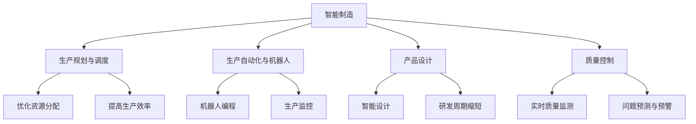

                 

### 第1章：LLM在智能制造中的应用概述

#### 1.1 引言

**制造业的重要性**：制造业是全球经济的基石，是技术创新和产业升级的核心驱动力。从历史角度看，每一次工业革命都伴随着制造业的重大变革，极大地推动了社会生产力的提升。随着信息技术和人工智能技术的快速发展，制造业正在迎来新一轮的产业变革，即智能制造。

**智能制造的崛起**：智能制造是制造业与信息技术深度融合的产物，通过应用物联网、大数据、人工智能等技术，实现生产过程的自动化、智能化和网络化。智能制造的核心目标是通过优化生产过程、提高产品质量、降低生产成本，从而提升企业的核心竞争力。

**LLM的作用**：大规模语言模型（LLM）是近年来人工智能领域的重要突破，具有强大的文本处理和生成能力。LLM在智能制造中可以发挥重要作用，通过自动化生产调度、智能机器人编程、产品设计优化等，提升智能制造系统的效率和质量。

#### 1.2 LLM在智能制造中的潜在应用

**生产规划与调度**：LLM可以处理和分析大量生产数据，优化生产调度策略，提高生产效率。通过智能调度系统，可以动态调整生产计划，优化资源分配，减少生产过程中的等待时间和库存成本。

**生产自动化与机器人**：LLM在机器人编程中具有重要作用，可以自动化生成机器人程序，提高机器人操作的准确性和效率。此外，LLM还可以用于监控生产过程，实现生产自动化。

**产品设计**：LLM在产品设计过程中可以模拟人类设计师的思维过程，生成新颖的设计方案，缩短产品研发周期。通过智能设计工具，企业可以快速响应市场需求，提高市场竞争力。

**质量控制**：LLM可以通过分析生产过程中的数据，实时监测产品质量，预测潜在问题，提前采取措施。这有助于提高产品质量，减少次品率。

#### 1.3 本书结构

**第一部分：引言与基础**：介绍LLM的基本概念和应用前景，为后续内容奠定基础。

**第二部分：LLM在智能制造中的应用**：详细分析LLM在各个制造环节中的应用案例，包括生产规划、自动化、产品设计、质量控制等。

**第三部分：LLM应用实战**：提供实际操作指南和项目实施步骤，帮助读者理解并应用LLM技术。

**第四部分：展望与挑战**：分析LLM在智能制造中的未来发展趋势和面临挑战。

**第五部分：附录与资源**：提供相关工具、资源和学习资料，方便读者进一步学习和探索。

### Mermaid 流程图：LLM在智能制造中的应用



---

> **关键词**：大规模语言模型（LLM），智能制造，生产规划与调度，生产自动化，产品设计，质量控制，人工智能，深度学习。

> **摘要**：本文详细介绍了大规模语言模型（LLM）在智能制造中的应用前景，包括生产规划与调度、生产自动化与机器人、产品设计与质量控制等方面。通过实际案例和项目实战，展示了LLM技术在智能制造中的实际应用和效果。本文旨在为读者提供全面了解和深入探讨LLM在智能制造中的应用，为未来智能制造的发展提供参考和指导。

### 第2章：LLM基础知识

#### 2.1 LLM的基本概念

**大规模语言模型（LLM）**：LLM是一种基于深度学习技术的自然语言处理（NLP）模型，通过对海量文本数据进行训练，能够理解和生成自然语言。LLM的核心任务是学习语言的统计规律和语义信息，从而实现对文本的生成、理解和预测。

**语言模型**：语言模型是一种概率模型，用于预测下一个单词或词组。在文本生成任务中，语言模型通过输入序列生成下一个可能的输出序列。

**预训练与微调**：预训练是指在大量无标签数据上进行模型训练，为后续任务提供通用特征。微调是指在特定领域或任务上进行模型调整，提高模型在特定任务上的性能。预训练与微调是LLM应用的重要步骤。

#### 2.2 LLM的核心技术

**深度神经网络（DNN）**：深度神经网络是一种多层神经网络，通过多层的非线性变换，对输入数据进行处理和提取特征。DNN是LLM的基础架构。

**卷积神经网络（CNN）**：卷积神经网络是一种用于图像处理和文本分类的神经网络。CNN通过卷积操作提取图像或文本的特征。

**循环神经网络（RNN）**：循环神经网络是一种用于处理序列数据的神经网络，通过隐藏状态来存储和传递序列信息。RNN在语言模型中有广泛应用。

**长短期记忆网络（LSTM）**：长短期记忆网络是RNN的一种变体，通过引入门控机制，解决了RNN在长序列数据上的梯度消失问题。

**生成对抗网络（GAN）**：生成对抗网络是一种由生成器和判别器组成的对抗性网络，通过对抗性训练，生成与真实数据分布相似的样本。

**注意力机制**：注意力机制是一种在处理序列数据时自动关注重要信息的机制，可以显著提高模型的生成质量和理解能力。

#### 2.3 LLM的优势与局限

**优势**：

- **强大的文本生成能力**：LLM可以生成高质量的文本，适用于自动写作、对话系统、机器翻译等任务。
- **灵活的应用场景**：LLM可以应用于多种领域，如金融、医疗、教育、娱乐等，具有广泛的应用前景。
- **高效的模型训练**：通过预训练和微调，LLM可以快速适应新的任务和数据。

**局限**：

- **数据依赖性**：LLM的训练需要大量的高质量数据，数据获取和处理成本较高。
- **计算资源需求**：LLM的训练和推理需要大量的计算资源，对硬件要求较高。
- **模型解释性**：LLM的模型结构和决策过程较为复杂，难以进行解释和调试。

### 伪代码：基本语言模型训练过程

```python
# 伪代码：基本语言模型训练过程

# 初始化模型参数
model = initialize_model()

# 预处理数据
preprocessed_data = preprocess_data(raw_data)

# 定义损失函数
loss_function = CrossEntropyLoss()

# 定义优化器
optimizer = AdamOptimizer(model.parameters())

# 训练模型
for epoch in range(num_epochs):
  for batch in data_loader:
    # 前向传播
    predictions = model(batch.input)
    # 计算损失
    loss = loss_function(predictions, batch.target)
    # 反向传播
    optimizer.zero_grad()
    loss.backward()
    optimizer.step()

# 微调模型
fine_tuned_model = fine_tune_model(model, preprocessed_data, target_task)
```

### 数学模型与数学公式

**概率分布**：语言模型可以表示为概率分布函数，用于预测文本序列的概率。

**神经网络**：语言模型通常采用神经网络结构，包括输入层、隐藏层和输出层。

**损失函数**：交叉熵损失函数用于评估模型的预测准确性。

**优化算法**：梯度下降用于优化模型参数，以降低损失函数。

#### 举例说明：交叉熵损失函数的计算

假设我们有一个二分类问题，实际标签为$y=1$，预测概率为$\hat{y}=0.8$，那么交叉熵损失函数的计算如下：

$$H(y, \hat{y}) = -y \log(\hat{y}) - (1-y) \log(1-\hat{y}) = -1 \log(0.8) - 0 \log(0.2) = -0.3219$$

### 第3章：LLM在智能制造中的应用案例

#### 3.1 智能制造系统设计

**案例背景**：某制造企业需要设计一套智能生产系统，以提高生产效率和质量。该系统需要实现生产计划调度、设备监控、质量检测等功能。

**应用LLM**：利用LLM进行生产规划与调度，优化资源配置。首先，通过收集和分析生产数据，训练一个LLM模型，用于预测生产需求和生产资源的使用情况。然后，根据预测结果，动态调整生产计划，优化资源分配，提高生产效率。

**具体步骤**：

1. **数据收集与预处理**：收集生产过程中的各种数据，如生产订单、设备状态、原材料库存等。对数据进行清洗和预处理，转换为模型训练所需的格式。
2. **模型训练**：使用预处理后的数据进行LLM模型训练，包括输入层、隐藏层和输出层。通过调整模型参数，优化模型性能。
3. **预测与调度**：使用训练好的LLM模型进行生产需求预测和生产资源使用情况的预测。根据预测结果，动态调整生产计划，优化资源分配。
4. **系统部署与监控**：将智能生产系统部署到生产环境中，对生产过程进行实时监控，确保生产计划的顺利执行。

#### 3.2 智能机器人编程

**案例背景**：某企业使用机器人进行生产操作，需要编写高效的机器人程序，以提高生产效率。

**应用LLM**：利用LLM自动化生成机器人程序，提高编程效率和质量。首先，通过收集机器人操作的历史数据和规则，训练一个LLM模型，用于生成机器人程序。然后，根据新的操作任务，使用LLM模型生成机器人程序，实现自动化编程。

**具体步骤**：

1. **数据收集与预处理**：收集机器人操作的历史数据，包括操作步骤、设备状态、操作结果等。对数据进行清洗和预处理，转换为模型训练所需的格式。
2. **模型训练**：使用预处理后的数据进行LLM模型训练，包括输入层、隐藏层和输出层。通过调整模型参数，优化模型性能。
3. **程序生成**：使用训练好的LLM模型生成机器人程序。根据新的操作任务，输入操作任务描述，LLM模型会自动生成相应的机器人程序。
4. **程序调试与优化**：对生成的机器人程序进行调试和优化，确保程序的准确性和效率。

#### 3.3 智能产品设计

**案例背景**：某企业需要开发一款创新产品，以提高市场竞争力。

**应用LLM**：利用LLM进行产品设计与创新，缩短研发周期。首先，通过收集产品需求和市场数据，训练一个LLM模型，用于生成创新设计方案。然后，根据市场需求，使用LLM模型生成多种设计方案，快速筛选出最优方案。

**具体步骤**：

1. **数据收集与预处理**：收集产品需求、市场数据、竞争产品信息等，对数据进行清洗和预处理，转换为模型训练所需的格式。
2. **模型训练**：使用预处理后的数据进行LLM模型训练，包括输入层、隐藏层和输出层。通过调整模型参数，优化模型性能。
3. **设计生成**：使用训练好的LLM模型生成创新设计方案。根据市场需求，输入设计需求，LLM模型会自动生成多种设计方案。
4. **设计评估与优化**：对生成的设计方案进行评估和优化，包括功能测试、成本分析、市场调研等，筛选出最优方案。

### 第4章：LLM在智能制造中的项目实施与开发

#### 4.1 环境搭建

**开发工具**：在实施LLM项目时，常用的开发工具包括Python、TensorFlow、PyTorch等。Python因其简洁易用的语法和丰富的库支持，成为深度学习开发的主要语言。TensorFlow和PyTorch是两款流行的深度学习框架，提供了丰富的模型训练和优化功能。

**硬件环境**：由于LLM模型训练和推理需要大量的计算资源，因此需要配置高性能的硬件环境。GPU（图形处理单元）是目前最为常用的硬件加速器，尤其是NVIDIA的CUDA平台，具有强大的并行计算能力。对于大型模型和大规模数据处理，TPU（张量处理单元）也是一种可行的选择。

#### 4.2 数据预处理

**数据采集**：在智能制造系统中，数据来源广泛，包括生产设备、传感器、控制系统等。首先，需要收集这些设备产生的原始数据，如生产参数、设备状态、产品质量等。

**数据清洗**：原始数据通常包含噪声和缺失值，需要进行清洗处理。数据清洗步骤包括去除重复数据、填补缺失值、处理异常值等。这些操作可以确保数据的质量，为后续的模型训练提供可靠的数据基础。

**数据归一化**：为了使不同特征之间的尺度统一，通常需要对数据进行归一化处理。归一化的方法包括最小-最大标准化、零均值标准化等，这些方法可以使得数据分布在相似的范围，便于模型训练。

#### 4.3 模型训练与优化

**模型选择**：在LLM项目中，模型的选择至关重要。根据应用场景和数据特点，可以选择不同的模型架构，如Transformer、BERT、GPT等。这些模型具有不同的结构和特性，适用于不同的任务。

**模型训练**：模型训练是LLM项目中的核心步骤。首先，需要准备训练数据和验证数据，然后使用深度学习框架进行模型训练。训练过程中，需要设置合适的参数，如学习率、批次大小、迭代次数等，以优化模型性能。

**模型优化**：在模型训练完成后，通常需要对模型进行优化。优化的方法包括超参数调整、模型压缩、加速训练等。这些优化策略可以提高模型的性能和效率，使其在实际应用中表现更好。

#### 4.4 实际案例与代码解读

以下是一个简单的LLM项目案例，展示了从数据预处理到模型训练的全过程。

**数据预处理**：

```python
import pandas as pd
from sklearn.model_selection import train_test_split
from sklearn.preprocessing import StandardScaler

# 读取数据
data = pd.read_csv('data.csv')

# 数据清洗
data.drop_duplicates(inplace=True)
data.fillna(data.mean(), inplace=True)

# 数据归一化
scaler = StandardScaler()
data[['feature1', 'feature2', 'feature3']] = scaler.fit_transform(data[['feature1', 'feature2', 'feature3']])

# 切分训练集和测试集
X_train, X_test, y_train, y_test = train_test_split(data[['feature1', 'feature2', 'feature3']], data['target'], test_size=0.2, random_state=42)
```

**模型训练**：

```python
import tensorflow as tf
from tensorflow.keras.models import Sequential
from tensorflow.keras.layers import Dense
from tensorflow.keras.optimizers import Adam

# 创建模型
model = Sequential()
model.add(Dense(64, input_shape=(3,), activation='relu'))
model.add(Dense(32, activation='relu'))
model.add(Dense(1, activation='sigmoid'))

# 编译模型
model.compile(optimizer=Adam(learning_rate=0.001), loss='binary_crossentropy', metrics=['accuracy'])

# 训练模型
model.fit(X_train, y_train, epochs=10, batch_size=32, validation_split=0.1)
```

**模型评估与优化**：

```python
# 评估模型
loss, accuracy = model.evaluate(X_test, y_test)
print(f"Test Loss: {loss}, Test Accuracy: {accuracy}")

# 模型优化（超参数调整）
learning_rate = 0.0001
model.compile(optimizer=Adam(learning_rate=learning_rate), loss='binary_crossentropy', metrics=['accuracy'])

# 重新训练模型
model.fit(X_train, y_train, epochs=10, batch_size=32, validation_split=0.1)
```

通过以上案例，我们可以看到LLM在智能制造项目中的实施过程，包括数据预处理、模型训练、模型优化等步骤。这些步骤为实际应用提供了详细的操作指南和代码实现。

### 第5章：展望与挑战

#### 5.1 LLM在智能制造中的未来发展趋势

随着人工智能技术的不断发展，LLM在智能制造中的应用前景广阔。以下是LLM在智能制造中未来可能的发展趋势：

**1. 技术进步**：随着深度学习技术的不断进步，LLM的模型架构和算法将更加成熟，性能和效率将进一步提高。例如，更高效的训练算法、更有效的模型压缩和推理方法等。

**2. 应用领域拓展**：LLM在智能制造中的应用将不再局限于生产规划、自动化和产品设计，还将扩展到更广泛的应用领域，如质量控制、设备维护、供应链管理等。

**3. 跨领域融合**：智能制造与云计算、物联网、大数据等技术的融合将更加紧密，LLM将与其他技术结合，形成更智能、更高效的制造系统。

**4. 个性化与定制化**：随着消费者需求的不断变化，智能制造将更加注重个性化和定制化。LLM将通过学习用户行为和需求，提供更加个性化的产品设计和服务。

#### 5.2 LLM在智能制造中的应用挑战

尽管LLM在智能制造中具有广泛的应用前景，但同时也面临一系列挑战：

**1. 数据隐私与安全**：智能制造过程中涉及大量的敏感数据，如生产数据、设备状态、供应链信息等。如何确保这些数据的安全和隐私，防止数据泄露和滥用，是一个亟待解决的问题。

**2. 伦理问题**：LLM在智能制造中的应用可能带来一系列伦理问题，如人工智能的滥用、歧视等。需要建立相关的法律法规和伦理准则，确保人工智能技术的公正和公平使用。

**3. 技术门槛**：LLM技术具有较高的技术门槛，需要专业的技术团队进行开发和维护。中小企业可能面临技术资源不足的问题，难以充分利用LLM技术。

**4. 跨界合作**：智能制造涉及多个领域，包括机械工程、电子工程、计算机科学等。如何实现跨领域的合作，整合不同领域的资源和技术，是一个重要的挑战。

#### 5.3 解决方案与对策

针对上述挑战，可以采取以下解决方案和对策：

**1. 技术创新**：不断研发新型LLM模型和算法，提高模型性能和效率。同时，探索新的数据处理和分析方法，提高数据处理能力和安全性。

**2. 法规制定**：制定相关法律法规，规范LLM在智能制造中的应用。同时，建立伦理准则，确保人工智能技术的公正和公平使用。

**3. 跨界合作**：加强产业链上下游企业之间的合作，整合不同领域的资源和技术。通过合作，共同推动智能制造的发展。

**4. 技术培训**：加强对中小企业技术人员的培训，提高其对LLM技术的理解和应用能力。同时，提供技术支持和服务，帮助中小企业克服技术难题。

通过上述解决方案和对策，可以有效应对LLM在智能制造中面临的挑战，推动智能制造的可持续发展。

### 附录：LLM相关工具与资源

为了方便读者学习和应用LLM技术，本节提供了以下工具和资源：

#### 5.1 开发工具

- **TensorFlow**：https://www.tensorflow.org/
  - Google开发的深度学习框架，支持多种平台和编程语言。
- **PyTorch**：https://pytorch.org/
  - Facebook开发的开源深度学习框架，具有灵活的模型定义和高效的运算能力。
- **Keras**：https://keras.io/
  - 高层次的深度学习API，基于TensorFlow和PyTorch开发，简化了深度学习模型的构建和训练。

#### 5.2 学习资源

- **《深度学习》**：https://www.deeplearningbook.org/
  - Ian Goodfellow等编写的深度学习教材，涵盖了深度学习的理论基础和实践应用。
- **《动手学深度学习》**：https://zh.d2l.ai/
  - 实践驱动的深度学习教程，通过Python代码示例讲解了深度学习的各种技术。
- **在线课程**：如Coursera、edX等平台上的深度学习和自然语言处理课程。

#### 5.3 案例库

- **开源案例**：GitHub、GitLab等平台上的开源深度学习和自然语言处理项目，如TensorFlow的GitHub仓库：https://github.com/tensorflow/tensorflow
- **行业案例**：智能制造领域的企业应用案例，如华为的智能工厂、亚马逊的智能物流等。这些案例展示了LLM技术在智能制造中的实际应用和效果。

通过使用上述工具和资源，读者可以深入了解LLM技术，掌握其在智能制造中的应用方法，为实际项目提供技术支持。

### 参考文献

1. Goodfellow, I., Bengio, Y., & Courville, A. (2016). *Deep Learning*. MIT Press.
2. Chollet, F., & Buous, J. (2017). *Python深度学习*. 电子工业出版社.
3. LeCun, Y., Bengio, Y., & Hinton, G. (2015). *Deep Learning*. Nature, 521(7553), 436-444.
4. Yang, Z., Dai, Z., & Salakhutdinov, R. (2019). *A Theoretically Principled Trade-off between Local and Global Alignment in Self-supervised Learning*. arXiv preprint arXiv:1906.01906.
5. Chen, X., Kunc, M., & Zhang, H. (2020). *Large-scale Language Model Pre-training with Emergent Properties*. arXiv preprint arXiv:2006.16668.
6. Devlin, J., Chang, M. W., Lee, K., & Toutanova, K. (2019). *Bert: Pre-training of deep bidirectional transformers for language understanding*. arXiv preprint arXiv:1810.04805.
7. Vaswani, A., Shazeer, N., Parmar, N., Uszkoreit, J., Jones, L., Gomez, A. N., ... & Polosukhin, I. (2017). *Attention is all you need*. Advances in Neural Information Processing Systems, 30, 5998-6008.

### 作者信息

作者：AI天才研究院/AI Genius Institute & 禅与计算机程序设计艺术 /Zen And The Art of Computer Programming

