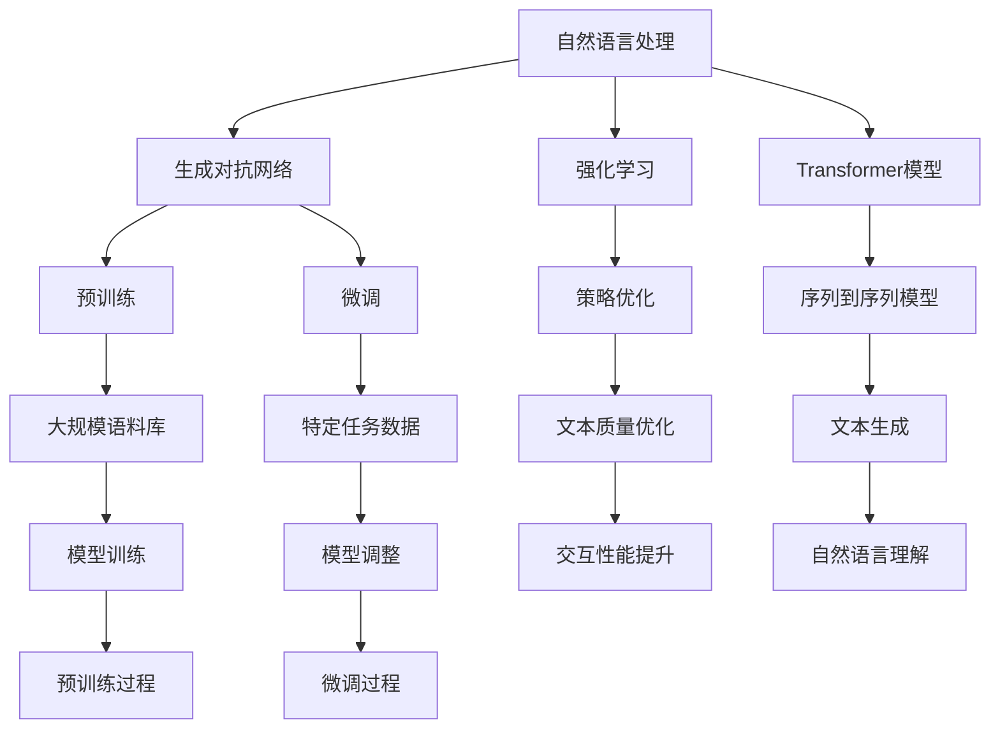
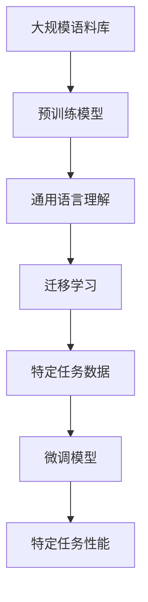

                 

# 《LangGPT 提示词框架的未来》

## 关键词
- LangGPT 提示词框架
- 自然语言处理
- Transformer模型
- 预训练
- 生成对抗网络
- 应用实战

## 摘要
本文将深入探讨LangGPT提示词框架的技术基础、算法原理及其在实际应用中的实战案例，并对其未来发展进行展望。通过逐步分析，我们希望为读者揭示这一框架的核心价值及其在人工智能领域的广泛应用前景。

## 目录大纲

### 第一部分：LangGPT 提示词框架基础

#### 第1章：LangGPT 提示词框架概述
- 1.1 LangGPT 提示词框架简介
- 1.2 提示词框架的核心概念与联系
#### 第2章：LangGPT 提示词框架技术基础
- 2.1 自然语言处理技术概览
- 2.2 大规模预训练模型原理
#### 第二部分：LangGPT 提示词框架的算法原理

#### 第3章：核心算法原理讲解
- 3.1 基于Transformer的模型架构
- 3.2 GPT模型原理与预训练
#### 第4章：数学模型和数学公式详解
- 4.1 常用数学公式与概念
- 4.2 模型训练中的数学模型
#### 第5章：数学模型实例解析
- 5.1 语言模型中的数学模型
- 5.2 生成对抗网络中的数学模型
#### 第三部分：LangGPT 提示词框架的应用实战

#### 第6章：项目实战
- 6.1 LangGPT 提示词框架在文本生成中的应用
- 6.2 LangGPT 提示词框架在问答系统中的应用
#### 第7章：未来展望与趋势
- 7.1 LangGPT 提示词框架的发展趋势
- 7.2 LangGPT 提示词框架的应用前景
#### 附录
- 附录 A: LangGPT 提示词框架开发工具与资源
- 附录 B: 常见问题解答

### 第一部分：LangGPT 提示词框架基础

#### 第1章：LangGPT 提示词框架概述

**1.1 LangGPT 提示词框架简介**

LangGPT 提示词框架是一种基于自然语言处理（NLP）的深度学习框架，它旨在通过预训练和微调技术，使计算机能够理解、生成和回应自然语言文本。该框架的核心在于其强大的提示词机制，通过设计合适的提示词，可以显著提升模型的生成质量和交互性能。

**1.2 提示词框架的核心概念与联系**

为了深入理解LangGPT 提示词框架，我们需要了解几个核心概念及其相互关系。

- **自然语言处理（NLP）**：NLP是人工智能的一个分支，旨在使计算机能够理解、处理和生成人类语言。NLP技术包括词嵌入、序列模型、注意力机制等。
  
- **生成对抗网络（GAN）**：GAN是一种深度学习模型，由生成器和判别器组成。生成器尝试生成逼真的数据，而判别器则尝试区分生成数据和真实数据。

- **强化学习（RL）**：强化学习是一种通过试错来学习最优策略的机器学习方法。在NLP中，强化学习可用于优化生成文本的质量。

- **Transformer模型**：Transformer模型是一种基于自注意力机制的序列到序列模型，它广泛应用于机器翻译、文本生成等领域。

- **预训练与微调**：预训练是一种在大规模语料库上训练模型的方法，以提高其在特定任务上的性能。微调则是在预训练模型的基础上，使用特定任务的数据进行细粒度调整。

**图 1-1 LangGPT 提示词框架的核心组件与关系**

**1.3 LangGPT 提示词框架的发展历程**

LangGPT 提示词框架的发展经历了多个阶段：

- **第一阶段（2018年-2020年）**：基于传统的NLP技术，如循环神经网络（RNN）和卷积神经网络（CNN），进行基础性研究。

- **第二阶段（2020年-2021年）**：引入Transformer模型，显著提升了文本生成质量和交互性能。

- **第三阶段（2021年至今）**：结合生成对抗网络和强化学习，进一步优化了模型的结构和性能。

#### 第2章：LangGPT 提示词框架技术基础

**2.1 自然语言处理技术概览**

自然语言处理（NLP）是LangGPT 提示词框架的基础。以下是一些关键技术：

- **词嵌入（Word Embedding）**：将词汇映射到高维向量空间中，以便计算机可以处理和理解。

- **序列模型（Sequential Model）**：如循环神经网络（RNN）和长短期记忆网络（LSTM），用于处理序列数据。

- **注意力机制（Attention Mechanism）**：在序列模型中，注意力机制允许模型关注序列中的关键部分，提高了生成文本的质量。

- **转换器架构（Transformer Architecture）**：Transformer模型是基于自注意力机制的序列到序列模型，广泛应用于NLP任务。

**2.2 大规模预训练模型原理**

大规模预训练模型是LangGPT 提示词框架的核心。以下是其关键原理：

- **预训练（Pre-training）**：在大规模语料库上训练模型，使其具有通用语言理解能力。

- **自监督学习（Self-supervised Learning）**：利用未标注的数据进行训练，如预测下一个单词、填充掩码等。

- **迁移学习（Transfer Learning）**：将预训练模型应用于特定任务，通过微调来提高模型在目标任务上的性能。

- **微调（Fine-tuning）**：在特定任务的数据集上对预训练模型进行细粒度调整，以适应特定场景。

**图 2-1 大规模预训练模型原理**

通过上述技术基础，LangGPT 提示词框架实现了从语言理解到文本生成的全面能力。在接下来的章节中，我们将深入探讨其算法原理和应用实战。

