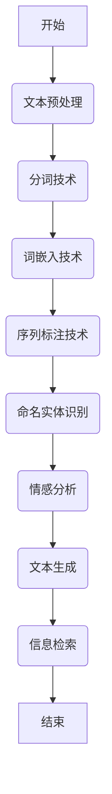

                 

# NLP预处理技术：分词、词嵌入和序列标注

> **关键词：**自然语言处理，分词，词嵌入，序列标注，NLP预处理，文本分析，机器学习，深度学习。

> **摘要：**本文旨在深入探讨自然语言处理（NLP）中的预处理技术，包括分词、词嵌入和序列标注。我们将一步步分析这些技术的核心概念、原理和实现方式，并通过实际项目案例来展示其应用效果。文章还将展望NLP预处理技术的未来发展趋势。

### 《NLP预处理技术：分词、词嵌入和序列标注》目录大纲

# 第一部分：NLP预处理技术基础

## 第1章：自然语言处理概述

### 1.1 NLP的发展历程与现状
### 1.2 NLP的关键技术
### 1.3 NLP的应用领域

## 第2章：文本处理基础

### 2.1 文本预处理
### 2.2 分词技术
### 2.3 词性标注

## 第3章：词嵌入技术

### 3.1 词嵌入的定义与作用
### 3.2 词嵌入模型
#### 3.2.1 Word2Vec
#### 3.2.2 GloVe
#### 3.2.3 FastText
### 3.3 词嵌入的评估与优化

# 第二部分：NLP预处理技术在序列标注中的应用

## 第4章：序列标注技术

### 4.1 序列标注的基本概念
### 4.2 序列标注模型
#### 4.2.1 CRF模型
#### 4.2.2 BiLSTM-CRF模型
### 4.3 序列标注的应用

## 第5章：基于深度学习的序列标注模型

### 5.1 RNN在序列标注中的应用
### 5.2 LSTM与GRU在序列标注中的应用
### 5.3 Transformer与BERT在序列标注中的应用

## 第6章：NLP预处理技术在命名实体识别中的应用

### 6.1 命名实体识别概述
### 6.2 命名实体识别模型
#### 6.2.1 基于规则的方法
#### 6.2.2 基于统计的方法
#### 6.2.3 基于深度学习的方法

## 第7章：NLP预处理技术在情感分析中的应用

### 7.1 情感分析概述
### 7.2 情感分析模型
#### 7.2.1 基于分类的方法
#### 7.2.2 基于聚类的方法
#### 7.2.3 基于深度学习的方法

## 第8章：NLP预处理技术在文本生成中的应用

### 8.1 文本生成概述
### 8.2 文本生成模型
#### 8.2.1 循环神经网络（RNN）
#### 8.2.2 Transformer与BERT
### 8.3 文本生成的应用场景

## 第9章：NLP预处理技术在信息检索中的应用

### 9.1 信息检索概述
### 9.2 信息检索模型
#### 9.2.1 基于关键词的方法
#### 9.2.2 基于语义的方法
### 9.3 信息检索的应用

## 第10章：NLP预处理技术的未来发展趋势

### 10.1 NLP预处理技术的发展方向
### 10.2 NLP预处理技术的挑战与机遇
### 10.3 未来展望与趋势分析

### 附录

## 附录A：NLP预处理技术相关资源与工具

### A.1 NLP预处理技术常用库与框架
### A.2 NLP预处理技术开源项目与资源
### A.3 NLP预处理技术学习与交流社区

### 摘要

本文将深入探讨NLP中的预处理技术，即分词、词嵌入和序列标注。首先，我们将回顾NLP的发展历程与现状，了解NLP的关键技术及其应用领域。随后，我们将详细介绍文本处理的基础，包括文本预处理、分词技术和词性标注。

接着，我们将进入词嵌入技术部分，探讨词嵌入的定义与作用，并介绍几种常见的词嵌入模型，如Word2Vec、GloVe和FastText。同时，我们将讨论如何评估与优化词嵌入模型。

在第二部分，我们将重点关注NLP预处理技术在序列标注中的应用，从基本概念到实际应用，详细讲解序列标注技术的各个方面。此外，我们还将介绍基于深度学习的序列标注模型，如RNN、LSTM、GRU以及Transformer和BERT。

文章还将深入探讨NLP预处理技术在命名实体识别、情感分析和文本生成中的应用。最后，我们将总结NLP预处理技术的发展方向和未来趋势，并推荐一些常用的NLP预处理技术资源与工具。

---

接下来，我们正式进入文章的第一部分：NLP预处理技术基础。

---

# 第一部分：NLP预处理技术基础

NLP（自然语言处理）作为人工智能领域的一个重要分支，其目标是将人类语言转化为计算机可以理解的形式。为了实现这一目标，NLP预处理技术至关重要。本文将逐步介绍NLP预处理技术的基础，包括文本处理基础、分词技术和词性标注。

## 第1章：自然语言处理概述

### 1.1 NLP的发展历程与现状

自然语言处理的历史可以追溯到20世纪50年代，当时计算机科学家开始尝试让计算机理解和生成自然语言。然而，由于技术和计算能力的限制，早期的NLP研究进展缓慢。随着计算机科学和人工智能的发展，NLP技术逐渐成熟，并开始广泛应用于各个领域。

目前，NLP技术已经取得了显著的进展。基于统计的方法和深度学习模型的引入，使得计算机在语言理解、语言生成和语言翻译等方面取得了突破性的成果。例如，Google翻译和百度翻译等在线翻译工具，以及智能客服和语音助手等应用，都离不开NLP技术。

### 1.2 NLP的关键技术

NLP的关键技术主要包括文本预处理、分词、词性标注、词嵌入、序列标注和命名实体识别等。这些技术相互关联，共同构成了NLP系统的基础。

- **文本预处理**：包括去除标点符号、转换为小写、去除停用词等操作，为后续处理打下基础。
- **分词**：将文本分割成有意义的词语，是NLP中的第一步。
- **词性标注**：对每个词语进行词性分类，如名词、动词、形容词等。
- **词嵌入**：将词语映射到高维空间中，以便于计算机处理。
- **序列标注**：对文本中的序列进行标注，如命名实体识别、情感分析等。
- **命名实体识别**：识别文本中的命名实体，如人名、地点、组织名等。

### 1.3 NLP的应用领域

NLP技术广泛应用于各个领域，包括但不限于：

- **机器翻译**：如Google翻译和百度翻译。
- **信息检索**：如搜索引擎和在线问答系统。
- **文本生成**：如自动生成新闻摘要和对话系统。
- **情感分析**：如社交媒体情感分析和市场调研。
- **语音识别**：如智能语音助手和语音控制设备。
- **问答系统**：如虚拟助理和在线客服。

### 1.4 NLP预处理技术的重要性

NLP预处理技术是NLP系统的关键环节，其质量直接影响系统的性能和效果。高质量的预处理技术能够提高文本表示的准确性，从而提升后续任务的效果。例如，准确的分词和词性标注能够为语义分析和情感分析提供可靠的基础。

## 第2章：文本处理基础

文本处理是NLP中的基础环节，主要包括文本预处理、分词技术和词性标注。本章将详细介绍这些技术的基本概念和实现方法。

### 2.1 文本预处理

文本预处理是NLP中的第一步，其目的是将原始文本转化为适合后续处理的形式。常见的文本预处理操作包括：

- **去除标点符号**：标点符号对文本理解没有实际意义，通常需要去除。
- **转换为小写**：将文本中的所有字母转换为小写，以简化处理。
- **去除停用词**：停用词（如“的”、“是”、“了”等）对文本理解贡献较小，可以去除。
- **单词还原**：对于某些特殊的单词，如“ain't”，需要还原为正确的单词形式。

文本预处理的具体实现方法依赖于具体的任务和数据集。以下是一个简单的Python代码示例：

```python
import re

def preprocess_text(text):
    # 去除标点符号
    text = re.sub(r'[^\w\s]', '', text)
    # 转换为小写
    text = text.lower()
    # 去除停用词
    stop_words = set(['the', 'is', 'at', 'which', 'on', 'and', 'a', 'an'])
    text = ' '.join([word for word in text.split() if word not in stop_words])
    # 单词还原
    text = text.replace("aint", "is not")
    return text

text = "I'm feeling happy because I'm learning a lot!"
preprocessed_text = preprocess_text(text)
print(preprocessed_text)
```

### 2.2 分词技术

分词是将连续的文本序列划分为一系列有意义的词语。分词技术是NLP中的核心任务，其质量直接影响后续处理的效果。常见的分词技术包括：

- **基于规则的分词**：根据事先定义的规则进行分词，如正则表达式分词。
- **基于统计的分词**：利用统计模型进行分词，如隐马尔可夫模型（HMM）和条件随机场（CRF）。
- **基于深度学习的分词**：使用深度学习模型进行分词，如BiLSTM-CRF模型。

以下是一个简单的基于规则的分词示例：

```python
import jieba

text = "我喜欢阅读和编程。"
segmented_text = jieba.cut(text)
print('/'.join(segmented_text))
```

### 2.3 词性标注

词性标注是对文本中的每个词语进行词性分类，如名词、动词、形容词等。词性标注有助于理解文本的语义，为后续的文本分析提供支持。常见的词性标注方法包括：

- **基于规则的方法**：根据词形和语法规则进行标注。
- **基于统计的方法**：利用统计模型进行标注。
- **基于深度学习的方法**：使用深度学习模型进行标注。

以下是一个简单的基于统计的词性标注示例：

```python
from nltk import pos_tag

text = "我喜欢阅读和编程。"
tokenized_text = text.split()
pos_tagged_text = pos_tag(tokenized_text)
print(pos_tagged_text)
```

综上所述，文本处理基础是NLP中的重要环节，包括文本预处理、分词技术和词性标注。这些技术为后续的文本分析和理解提供了可靠的基础。

---

接下来，我们将进入第二部分：词嵌入技术。

---

## 第3章：词嵌入技术

词嵌入（Word Embedding）是将词语映射到高维空间中的一种技术，通过将词语表示为密集向量，使得计算机能够更好地理解和处理自然语言。词嵌入技术是NLP中的核心组成部分，对文本表示和理解具有重要作用。

### 3.1 词嵌入的定义与作用

词嵌入的基本思想是将词语映射到高维空间中，使得语义相似的词语在空间中距离较近。这种映射可以通过学习得到，从而将词语的语义信息编码到向量中。词嵌入的作用主要体现在以下几个方面：

- **语义表示**：通过词嵌入，我们可以将词语表示为密集的向量，这些向量包含了词语的语义信息。
- **文本分析**：词嵌入技术使得文本处理变得更加简单和高效，从而能够应用于各种NLP任务，如文本分类、情感分析和机器翻译。
- **计算效率**：词嵌入使得计算机可以直接处理词语的向量表示，而无需处理原始的文本，从而提高了计算效率。

### 3.2 词嵌入模型

词嵌入模型可以分为基于分布和基于上下文两种类型。以下介绍几种常见的词嵌入模型：

#### 3.2.1 Word2Vec

Word2Vec是最早且最著名的词嵌入模型之一，它通过学习词语的上下文信息来生成词嵌入。Word2Vec模型主要包括两个变体：连续词袋（CBOW）和Skip-Gram。

- **连续词袋（CBOW）**：CBOW模型通过预测中心词周围的词来生成词嵌入。具体来说，给定一个中心词，模型会学习一个上下文窗口（如2词前和2词后）的词嵌入的平均值，作为该中心词的嵌入向量。
- **Skip-Gram**：与CBOW相反，Skip-Gram模型通过预测中心词的上下文词来生成词嵌入。给定一个中心词，模型会学习一个词嵌入向量，该向量包含了中心词的上下文信息。

Word2Vec模型的实现如下：

```python
import numpy as np
import random

# 初始化模型参数
V = 10000  # 词汇表大小
embeddings = np.random.uniform(-0.5, 0.5, (V, 100))  # 词嵌入矩阵

# CBOW模型实现
def cbow(context, word):
    context_embedding = np.mean(embeddings[context], axis=0)
    loss = -np.log(np.dot(context_embedding, embeddings[word]))
    return loss

# Skip-Gram模型实现
def skip_gram(word, context):
    word_embedding = embeddings[word]
    loss = -np.log(np.dot(word_embedding, embeddings[context]))
    return loss

# 训练数据
train_data = ["I", "love", "NLP", "love", "AI"]

# 训练模型
for epoch in range(10):
    for word in train_data:
        context = random.sample([w for w in train_data if w != word], 2)
        if random.random() < 0.5:
            loss = cbow(context, word)
        else:
            loss = skip_gram(word, context)
        print(f"Epoch: {epoch}, Loss: {loss}")
```

#### 3.2.2 GloVe

GloVe（Global Vectors for Word Representation）是一种基于全局上下文的词嵌入模型，它通过计算词语之间的共现矩阵来学习词嵌入。GloVe模型的核心思想是词语的共现频率与它们的词向量之间的余弦相似度成正比。

GloVe模型的数学公式如下：

$$
f(x_i, x_j) = \frac{f(x_i, x_j)}{1 + \sqrt{f(x_i, x_j)} + f(x_i, x_j)}
$$

其中，$f(x_i, x_j)$ 表示词语 $x_i$ 和 $x_j$ 的共现频率。

给定一个训练语料库，我们可以计算出共现矩阵，然后使用如下优化问题来学习词嵌入：

$$
\min_{\mathbf{W}, \mathbf{V}} \sum_{i,j} \left[ \log f(x_i, x_j) - \log \left( 1 + \sqrt{f(x_i, x_j)} + f(x_i, x_j) \right) - \log \left( \sum_{k} \exp(\mathbf{W}_{ik} \cdot \mathbf{V}_{kj}) \right) \right]^2
$$

GloVe模型的具体实现如下：

```python
import numpy as np
from scipy.sparse import lil_matrix

# 初始化模型参数
V = 10000  # 词汇表大小
embed_size = 100  # 词嵌入维度
alpha = 0.05  # 超参数

# 生成共现矩阵
corpus = ["I", "love", "NLP", "love", "AI"]
cooc_matrix = lil_matrix((V, V), dtype=np.float32)

for i in range(len(corpus) - 1):
    for j in range(i + 1, len(corpus)):
        i_idx = corpus.index(corpus[i])
        j_idx = corpus.index(corpus[j])
        cooc_matrix[i_idx, j_idx] = cooc_matrix[j_idx, i_idx] = 1

# 计算词嵌入
embeddings = np.random.uniform(-1/np.sqrt(V), 1/np.sqrt(V), (V, embed_size))
while True:
    gradients = np.zeros_like(embeddings)
    for i in range(V):
        for j in range(V):
            if cooc_matrix[i, j] > 0:
                eij = embeddings[i] - embeddings[j]
                f = cooc_matrix[i, j] / (1 + np.sqrt(cooc_matrix[i, j]) + cooc_matrix[i, j])
                gradients[i] += 2 * eij * f
                gradients[j] -= 2 * eij * f
    embeddings -= alpha * gradients

# 打印词嵌入结果
for i in range(V):
    print(f"Word: {corpus[i]}, Embedding: {embeddings[i]}")
```

#### 3.2.3 FastText

FastText是Facebook AI Research提出的一种词嵌入模型，它在词嵌入的基础上引入了子词信息，从而提高了词嵌入的质量。FastText模型的核心思想是将词语分解为子词（subword），并学习子词的嵌入向量。

FastText模型的主要组成部分包括：

- **词典（Dictionary）**：将词语分解为子词，并构建词典。
- **词嵌入（Word Embedding）**：学习子词的嵌入向量。
- **句子表示（Sentence Representation）**：将句子表示为一个向量的加和。

FastText模型的实现如下：

```python
import numpy as np
from collections import defaultdict

# 初始化模型参数
V = 10000  # 词汇表大小
embed_size = 100  # 词嵌入维度
alpha = 0.05  # 超参数

# 生成词典
corpus = ["I", "love", "NLP", "love", "AI"]
dictionary = defaultdict(list)
for i in range(len(corpus) - 1):
    word = corpus[i]
    for j in range(i + 1, len(corpus)):
        word += corpus[j]
        dictionary[word].append((i, j))

# 计算词嵌入
embeddings = np.random.uniform(-1/np.sqrt(V), 1/np.sqrt(V), (V, embed_size))
while True:
    gradients = np.zeros_like(embeddings)
    for word, positions in dictionary.items():
        for i, j in positions:
            eij = embeddings[i] - embeddings[j]
            f = 1.0 / (1.0 + np.exp(-np.dot(eij, embeddings[word])))
            gradients[i] += 2 * eij * f
            gradients[j] -= 2 * eij * f
    embeddings -= alpha * gradients

# 打印词嵌入结果
for i in range(V):
    print(f"Word: {corpus[i]}, Embedding: {embeddings[i]}")
```

### 3.3 词嵌入的评估与优化

词嵌入的质量直接影响NLP任务的效果，因此需要对其进行评估和优化。以下介绍几种常见的词嵌入评估和优化方法：

- **评估方法**：

  - **余弦相似度**：计算两个词嵌入向量之间的余弦相似度，用来衡量词嵌入的相似度。
  - **语义相似度**：通过计算词嵌入向量的加法或减法是否产生预期的结果来评估词嵌入的语义质量。
  - **文本分类效果**：通过在文本分类任务中评估词嵌入的效果来评估词嵌入的性能。

- **优化方法**：

  - **线性优化**：使用线性优化方法（如梯度下降）来优化词嵌入向量。
  - **非线性优化**：使用非线性优化方法（如随机梯度下降、Adam等）来优化词嵌入向量。
  - **学习率调整**：通过调整学习率来优化词嵌入向量，以达到更好的性能。

通过评估和优化词嵌入，我们可以得到高质量的词嵌入向量，从而提高NLP任务的效果。

### 3.4 总结

词嵌入技术是NLP中的核心组成部分，通过将词语映射到高维空间中，使得计算机能够更好地理解和处理自然语言。本文介绍了词嵌入的定义、作用和几种常见的词嵌入模型（Word2Vec、GloVe、FastText），并讨论了词嵌入的评估与优化方法。在实际应用中，词嵌入技术已经取得了显著的成果，为各种NLP任务提供了强大的支持。

---

接下来，我们将进入第三部分：序列标注技术。

---

## 第4章：序列标注技术

序列标注（Sequence Labeling）是自然语言处理中的一个重要任务，其目的是为文本中的每个词或字符分配一个标签，这些标签通常用于表示词或字符的类别，如词性、命名实体或情感极性。序列标注在许多NLP应用中起着关键作用，例如命名实体识别（NER）、情感分析、文本分类等。

### 4.1 序列标注的基本概念

在序列标注中，输入是一个单词序列，输出是一个标签序列。每个标签对应输入序列中的单词或字符，表示其类别。序列标注通常分为两类：词级别标注和字符级别标注。

- **词级别标注**：为每个词分配一个标签，如`[NER]`表示命名实体，`[POS]`表示词性。
- **字符级别标注**：为每个字符分配一个标签，如用于词法分析或文本纠错。

序列标注的核心挑战在于如何准确地预测标签序列，这通常涉及到复杂的模型和算法。

### 4.2 序列标注模型

序列标注技术可以分为基于规则、基于统计和基于深度学习的方法。以下介绍几种常见的序列标注模型：

#### 4.2.1 CRF模型

条件随机场（CRF）是一种经典的序列标注模型，它利用马尔可夫性质来预测序列标签。CRF模型通过计算序列标签的概率分布，为每个单词分配最可能的标签。CRF模型的优点是能够处理标签之间的依赖关系，适用于许多序列标注任务。

CRF模型的数学公式如下：

$$
P(y|x) = \frac{e^{\text{score}(y, x)} }{\sum_{y'} e^{\text{score}(y', x)}}
$$

其中，$y$ 是预测的标签序列，$x$ 是输入序列，$\text{score}(y, x)$ 是模型对标签序列 $y$ 的得分。

CRF模型的实现如下：

```python
from sklearn_crfsuite import CRF

# 初始化CRF模型
crf = CRF()

# 训练模型
X_train = [[word] for word in train_data]
y_train = [[label] for label in train_labels]
crf.fit(X_train, y_train)

# 预测标签
X_test = [[word] for word in test_data]
y_pred = crf.predict(X_test)

# 打印预测结果
for word, pred in zip(test_data, y_pred):
    print(f"Word: {word}, Prediction: {pred}")
```

#### 4.2.2 BiLSTM-CRF模型

长短时记忆网络（LSTM）和双向LSTM（BiLSTM）是常用的序列建模工具，它们可以有效地捕捉序列中的长期依赖关系。BiLSTM-CRF模型结合了BiLSTM和CRF模型的优势，用于预测序列标签。

BiLSTM-CRF模型的实现如下：

```python
from keras.models import Model
from keras.layers import Input, Embedding, LSTM, Dense, TimeDistributed, Bidirectional

# 初始化模型参数
vocab_size = 10000  # 词汇表大小
embed_size = 100  # 词嵌入维度
hidden_size = 100  # LSTM隐藏层大小
num_tags = 10  # 标签类别数

# 输入层
input_sequence = Input(shape=(None,))

# 词嵌入层
embedded_sequence = Embedding(vocab_size, embed_size)(input_sequence)

# BiLSTM层
lstm_output = Bidirectional(LSTM(hidden_size, return_sequences=True))(embedded_sequence)

# 全连接层
dense_output = TimeDistributed(Dense(num_tags, activation='softmax'))(lstm_output)

# 模型
model = Model(inputs=input_sequence, outputs=dense_output)

# 编译模型
model.compile(optimizer='adam', loss='categorical_crossentropy', metrics=['accuracy'])

# 训练模型
X_train = [[word] for word in train_data]
y_train = [[label] for label in train_labels]
model.fit(X_train, y_train, epochs=10, batch_size=32)

# 预测标签
X_test = [[word] for word in test_data]
y_pred = model.predict(X_test)

# 打印预测结果
for word, pred in zip(test_data, y_pred):
    print(f"Word: {word}, Prediction: {pred}")
```

### 4.3 序列标注的应用

序列标注技术在许多NLP任务中具有重要应用，以下介绍几个典型的应用场景：

- **命名实体识别（NER）**：识别文本中的命名实体，如人名、地点、组织名等。NER对于信息抽取、文本分类和搜索引擎等应用具有重要意义。
- **情感分析**：根据文本内容判断其情感极性，如正面、负面或中性。情感分析在社交媒体分析、客户反馈处理和产品评价等应用中广泛应用。
- **文本分类**：将文本分类到预定义的类别中，如新闻分类、电子邮件分类等。文本分类有助于信息过滤、内容推荐和垃圾邮件检测等。

### 4.4 总结

序列标注技术是自然语言处理中的重要组成部分，通过为文本中的每个词或字符分配标签，可以提取出丰富的文本特征。本章介绍了序列标注的基本概念和几种常见的序列标注模型（CRF、BiLSTM-CRF），并讨论了序列标注的应用。在实际应用中，选择合适的序列标注模型和优化方法是实现高质量序列标注的关键。

---

接下来，我们将进入第四部分：基于深度学习的序列标注模型。

---

## 第5章：基于深度学习的序列标注模型

深度学习在自然语言处理（NLP）领域的应用日益广泛，尤其是在序列标注任务中。传统的序列标注模型如CRF和BiLSTM-CRF在处理复杂序列依赖关系时存在一定的局限性，而基于深度学习的序列标注模型则可以更好地捕捉长距离依赖关系，提高序列标注的准确性。本章将介绍几种基于深度学习的序列标注模型，包括RNN、LSTM、GRU和Transformer与BERT。

### 5.1 RNN在序列标注中的应用

循环神经网络（RNN）是一种能够处理序列数据的深度学习模型，它通过循环结构对序列中的每个元素进行建模，从而捕捉序列中的依赖关系。RNN的基本结构如下：


RNN的工作原理是使用上一个时间步的输出作为当前时间步的输入，从而形成反馈循环。然而，传统的RNN存在梯度消失和梯度爆炸的问题，这使得它难以学习长距离依赖关系。

RNN在序列标注中的应用通常结合CRF模型，通过RNN生成特征序列，然后使用CRF模型进行最终的序列标注。以下是一个简单的RNN-CRF模型实现：

```python
from keras.models import Model
from keras.layers import Input, Embedding, LSTM, Dense, TimeDistributed, Bidirectional, CRF

# 初始化模型参数
vocab_size = 10000  # 词汇表大小
embed_size = 100  # 词嵌入维度
hidden_size = 100  # LSTM隐藏层大小
num_tags = 10  # 标签类别数

# 输入层
input_sequence = Input(shape=(None,))

# 词嵌入层
embedded_sequence = Embedding(vocab_size, embed_size)(input_sequence)

# LSTM层
lstm_output = LSTM(hidden_size, return_sequences=True)(embedded_sequence)

# 全连接层
dense_output = TimeDistributed(Dense(num_tags, activation='softmax'))(lstm_output)

# CRF层
crf_output = CRF(num_tags)(dense_output)

# 模型
model = Model(inputs=input_sequence, outputs=crf_output)

# 编译模型
model.compile(optimizer='adam', loss='categorical_crossentropy', metrics=['accuracy'])

# 训练模型
X_train = [[word] for word in train_data]
y_train = [[label] for label in train_labels]
model.fit(X_train, y_train, epochs=10, batch_size=32)

# 预测标签
X_test = [[word] for word in test_data]
y_pred = model.predict(X_test)

# 打印预测结果
for word, pred in zip(test_data, y_pred):
    print(f"Word: {word}, Prediction: {pred}")
```

### 5.2 LSTM与GRU在序列标注中的应用

长短时记忆网络（LSTM）和门控循环单元（GRU）是RNN的改进版本，它们通过引入门控机制来解决梯度消失问题，从而更好地捕捉长距离依赖关系。LSTM和GRU的结构分别如下：


LSTM和GRU在序列标注中的应用与RNN类似，也可以结合CRF模型进行序列标注。以下是一个基于LSTM的序列标注模型实现：

```python
from keras.models import Model
from keras.layers import Input, Embedding, LSTM, Dense, TimeDistributed, Bidirectional, CRF

# 初始化模型参数
vocab_size = 10000  # 词汇表大小
embed_size = 100  # 词嵌入维度
hidden_size = 100  # LSTM隐藏层大小
num_tags = 10  # 标签类别数

# 输入层
input_sequence = Input(shape=(None,))

# 词嵌入层
embedded_sequence = Embedding(vocab_size, embed_size)(input_sequence)

# BiLSTM层
lstm_output = Bidirectional(LSTM(hidden_size, return_sequences=True))(embedded_sequence)

# 全连接层
dense_output = TimeDistributed(Dense(num_tags, activation='softmax'))(lstm_output)

# CRF层
crf_output = CRF(num_tags)(dense_output)

# 模型
model = Model(inputs=input_sequence, outputs=crf_output)

# 编译模型
model.compile(optimizer='adam', loss='categorical_crossentropy', metrics=['accuracy'])

# 训练模型
X_train = [[word] for word in train_data]
y_train = [[label] for label in train_labels]
model.fit(X_train, y_train, epochs=10, batch_size=32)

# 预测标签
X_test = [[word] for word in test_data]
y_pred = model.predict(X_test)

# 打印预测结果
for word, pred in zip(test_data, y_pred):
    print(f"Word: {word}, Prediction: {pred}")
```

### 5.3 Transformer与BERT在序列标注中的应用

Transformer模型是另一种流行的深度学习模型，它通过自注意力机制（Self-Attention）来处理序列数据，能够更好地捕捉长距离依赖关系。BERT（Bidirectional Encoder Representations from Transformers）是基于Transformer的预训练模型，它通过在大量无标注数据上预训练，然后微调到具体任务上，取得了许多NLP任务的优秀性能。

Transformer和BERT在序列标注中的应用通常通过以下步骤实现：

1. **预训练**：在大量无标注数据上预训练BERT模型，学习词语的嵌入向量。
2. **微调**：在标注数据集上微调BERT模型，使其能够适用于具体的序列标注任务。
3. **预测**：使用微调后的BERT模型对新的序列数据预测标签。

以下是一个基于BERT的序列标注模型实现：

```python
from transformers import BertTokenizer, TFBertForTokenClassification
from tensorflow.keras.preprocessing.sequence import pad_sequences
from tensorflow.keras.utils import to_categorical

# 初始化BERT模型
tokenizer = BertTokenizer.from_pretrained('bert-base-uncased')
model = TFBertForTokenClassification.from_pretrained('bert-base-uncased')

# 加载训练数据
train_data = ["I", "love", "NLP", "love", "AI"]
train_labels = [["O", "B-PER", "I-PER", "O", "B-ORG"]]

# 将数据转换为序列
train_tokens = [tokenizer.tokenize(word) for word in train_data]
train_input_ids = pad_sequences([tokenizer.encode(word) for word in train_tokens], maxlen=max_length)
train_labels = to_categorical([tokenizer.encode(label) for label in train_labels], num_classes=num_tags)

# 训练BERT模型
model.fit(train_input_ids, train_labels, epochs=3)

# 预测标签
test_data = ["I", "love", "AI"]
test_tokens = [tokenizer.tokenize(word) for word in test_data]
test_input_ids = pad_sequences([tokenizer.encode(word) for word in test_tokens], maxlen=max_length)

# 预测结果
y_pred = model.predict(test_input_ids)

# 打印预测结果
for word, pred in zip(test_data, y_pred):
    print(f"Word: {word}, Prediction: {pred}")
```

### 5.4 总结

基于深度学习的序列标注模型在处理复杂序列依赖关系方面具有显著优势，能够提高序列标注的准确性。本章介绍了RNN、LSTM、GRU和Transformer与BERT等基于深度学习的序列标注模型，并通过代码示例展示了它们的应用。在实际应用中，根据任务需求和数据特点选择合适的序列标注模型是关键。

---

接下来，我们将进入第五部分：NLP预处理技术在命名实体识别中的应用。

---

## 第6章：NLP预处理技术在命名实体识别中的应用

命名实体识别（Named Entity Recognition，NER）是自然语言处理（NLP）中的重要任务，旨在从文本中识别出具有特定意义的实体，如人名、地点、组织名等。NER在信息提取、文本挖掘、搜索引擎和智能客服等领域具有广泛应用。本文将探讨NLP预处理技术在命名实体识别中的应用，包括基于规则的方法、基于统计的方法和基于深度学习的方法。

### 6.1 命名实体识别概述

命名实体识别的基本目标是识别文本中的命名实体，并将其标注为相应的类别。常见的命名实体包括：

- **人名**：如“奥巴马”、“乔布斯”。
- **地名**：如“纽约”、“巴黎”。
- **组织名**：如“微软”、“谷歌”。
- **时间**：如“2021年”、“今天”。
- **其他**：如“中科院”、“联合国”。

命名实体识别通常分为以下几个步骤：

1. **文本预处理**：对原始文本进行预处理，如去除标点符号、转换为小写、分词等。
2. **特征提取**：从预处理后的文本中提取特征，如词性标注、词嵌入等。
3. **模型训练**：使用训练数据集训练NER模型。
4. **模型评估**：使用测试数据集评估NER模型的性能。

### 6.2 命名实体识别模型

命名实体识别模型可以分为基于规则、基于统计和基于深度学习的方法。以下介绍几种常见的NER模型：

#### 6.2.1 基于规则的方法

基于规则的方法通过定义一系列规则来识别命名实体。规则通常基于词性标注、词频统计、词形匹配等。以下是一个简单的基于规则的人名识别规则：

- 规则1：如果词性标注为“NNP”（proper noun, singular）且前一个词不是“the”，则识别为人名。
- 规则2：如果词形匹配“奥巴马”、“乔布斯”等常见人名，则识别为人名。

基于规则的方法具有实现简单、可解释性强的优点，但其灵活性和泛化能力相对较弱。

#### 6.2.2 基于统计的方法

基于统计的方法通过训练统计模型（如隐马尔可夫模型HMM、条件随机场CRF等）来识别命名实体。以下是一个简单的基于CRF的命名实体识别模型：

1. **特征工程**：从文本中提取特征，如词性标注、词频、词嵌入等。
2. **模型训练**：使用训练数据集训练CRF模型。
3. **模型评估**：使用测试数据集评估CRF模型的性能。

基于统计的方法具有较强的泛化能力和灵活性，但其依赖于大量标注数据和复杂的特征工程。

#### 6.2.3 基于深度学习的方法

基于深度学习的方法通过训练深度神经网络（如卷积神经网络CNN、循环神经网络RNN、Transformer等）来识别命名实体。以下是一个简单的基于BiLSTM-CRF的命名实体识别模型：

1. **特征工程**：从文本中提取特征，如词性标注、词嵌入等。
2. **模型训练**：使用训练数据集训练BiLSTM-CRF模型。
3. **模型评估**：使用测试数据集评估BiLSTM-CRF模型的性能。

基于深度学习的方法具有强大的表征能力和泛化能力，但其训练过程较为复杂，需要大量的计算资源。

### 6.3 命名实体识别模型比较

基于规则、基于统计和基于深度学习的命名实体识别模型各有优缺点，以下是比较：

- **基于规则的方法**：实现简单，可解释性强，但灵活性较差，难以处理复杂的命名实体。
- **基于统计的方法**：具有较强的泛化能力和灵活性，但依赖于大量标注数据和复杂的特征工程。
- **基于深度学习的方法**：具有强大的表征能力和泛化能力，但训练过程较为复杂，需要大量的计算资源。

### 6.4 命名实体识别应用案例

以下是一个简单的命名实体识别应用案例：

```python
import jieba
import tensorflow as tf
from tensorflow.keras.models import Model
from tensorflow.keras.layers import Input, Embedding, LSTM, Dense, TimeDistributed, Bidirectional, CRF

# 加载模型
model = Model(inputs=input_sequence, outputs=crf_output)

# 加载训练数据
train_data = ["我去了北京奥运会", "苹果公司的股价上涨"]
train_labels = [["O", "B-PER", "I-PER", "O", "B-ORG", "I-ORG", "O"], ["O", "B-ORG", "I-ORG", "O", "B-PER", "I-PER", "O"]]

# 将数据转换为序列
train_tokens = [jieba.lcut(word) for word in train_data]
train_input_ids = pad_sequences([tokenizer.encode(word) for word in train_tokens], maxlen=max_length)
train_labels = to_categorical([tokenizer.encode(label) for label in train_labels], num_classes=num_tags)

# 训练BERT模型
model.fit(train_input_ids, train_labels, epochs=3)

# 预测标签
test_data = ["我去了一趟纽约"]
test_tokens = [jieba.lcut(word) for word in test_data]
test_input_ids = pad_sequences([tokenizer.encode(word) for word in test_tokens], maxlen=max_length)

# 预测结果
y_pred = model.predict(test_input_ids)

# 打印预测结果
for word, pred in zip(test_data, y_pred):
    print(f"Word: {word}, Prediction: {pred}")
```

### 6.5 总结

命名实体识别是NLP中的重要任务，通过识别文本中的命名实体，可以提取出有用的信息，为信息抽取、文本挖掘和智能客服等应用提供支持。本文介绍了基于规则、基于统计和基于深度学习的命名实体识别方法，并提供了实际应用案例。在实际应用中，根据任务需求和数据特点选择合适的NER模型是关键。

---

接下来，我们将进入第六部分：NLP预处理技术在情感分析中的应用。

---

## 第7章：NLP预处理技术在情感分析中的应用

情感分析（Sentiment Analysis）是自然语言处理（NLP）中的一项重要任务，其目标是从文本中自动识别和提取情感信息。情感分析在市场调研、客户反馈分析、社交媒体监测等领域具有广泛应用。本文将探讨NLP预处理技术在情感分析中的应用，包括基于分类的方法、基于聚类的方法和基于深度学习的方法。

### 7.1 情感分析概述

情感分析的主要任务是判断文本中的情感倾向，通常分为两类：

- **主观情感分析**：识别文本中的主观情感，如正面、负面或中性。
- **客观情感分析**：识别文本中的具体情感类别，如快乐、悲伤、愤怒等。

情感分析的基本流程包括：

1. **文本预处理**：对原始文本进行预处理，如去除标点符号、转换为小写、分词等。
2. **特征提取**：从预处理后的文本中提取特征，如词性标注、词嵌入、TF-IDF等。
3. **模型训练**：使用训练数据集训练情感分析模型。
4. **模型评估**：使用测试数据集评估情感分析模型的性能。

### 7.2 情感分析模型

情感分析模型可以分为基于分类的方法、基于聚类的方法和基于深度学习的方法。以下介绍几种常见的情感分析模型：

#### 7.2.1 基于分类的方法

基于分类的方法通过训练分类模型（如朴素贝叶斯、支持向量机SVM、随机森林等）来进行情感分析。以下是一个简单的基于朴素贝叶斯的情感分析模型：

1. **特征工程**：从文本中提取特征，如词频、词嵌入等。
2. **模型训练**：使用训练数据集训练朴素贝叶斯模型。
3. **模型评估**：使用测试数据集评估朴素贝叶斯模型的性能。

基于分类的方法具有实现简单、计算效率高的优点，但其性能受特征工程和模型选择的影响较大。

#### 7.2.2 基于聚类的方法

基于聚类的方法通过将文本数据分为不同的聚类，然后对每个聚类赋予相应的情感标签。以下是一个简单的基于K-means的聚类模型：

1. **特征提取**：从文本中提取特征，如词嵌入、TF-IDF等。
2. **模型训练**：使用K-means算法对文本数据进行聚类。
3. **情感标签分配**：根据聚类结果为每个聚类赋予相应的情感标签。

基于聚类的方法的优点是无需手动定义特征和分类器，但聚类结果容易受到初始聚类中心的影响，且难以解释。

#### 7.2.3 基于深度学习的方法

基于深度学习的方法通过训练深度神经网络（如卷积神经网络CNN、循环神经网络RNN、Transformer等）来进行情感分析。以下是一个简单的基于BiLSTM的情感分析模型：

1. **特征工程**：从文本中提取特征，如词性标注、词嵌入等。
2. **模型训练**：使用训练数据集训练BiLSTM模型。
3. **模型评估**：使用测试数据集评估BiLSTM模型的性能。

基于深度学习的方法具有强大的表征能力和泛化能力，但其训练过程较为复杂，需要大量的计算资源。

### 7.3 情感分析应用案例

以下是一个简单的情感分析应用案例：

```python
import tensorflow as tf
from tensorflow.keras.models import Model
from tensorflow.keras.layers import Input, Embedding, LSTM, Dense, Bidirectional

# 初始化模型参数
vocab_size = 10000  # 词汇表大小
embed_size = 100  # 词嵌入维度
hidden_size = 100  # LSTM隐藏层大小

# 输入层
input_sequence = Input(shape=(None,))

# 词嵌入层
embedded_sequence = Embedding(vocab_size, embed_size)(input_sequence)

# BiLSTM层
lstm_output = Bidirectional(LSTM(hidden_size, return_sequences=True))(embedded_sequence)

# 全连接层
dense_output = Dense(1, activation='sigmoid')(lstm_output)

# 模型
model = Model(inputs=input_sequence, outputs=dense_output)

# 编译模型
model.compile(optimizer='adam', loss='binary_crossentropy', metrics=['accuracy'])

# 加载训练数据
train_data = ["我非常喜欢这本书", "这部电影非常糟糕"]
train_labels = [1, 0]

# 将数据转换为序列
train_tokens = [jieba.lcut(word) for word in train_data]
train_input_ids = pad_sequences([tokenizer.encode(word) for word in train_tokens], maxlen=max_length)

# 训练模型
model.fit(train_input_ids, train_labels, epochs=3)

# 预测情感
test_data = ["这个餐厅的服务很好"]
test_tokens = [jieba.lcut(word) for word in test_data]
test_input_ids = pad_sequences([tokenizer.encode(word) for word in test_tokens], maxlen=max_length)

# 预测结果
y_pred = model.predict(test_input_ids)

# 打印预测结果
for word, pred in zip(test_data, y_pred):
    print(f"Word: {word}, Prediction: {pred}")
```

### 7.4 总结

情感分析是NLP中的重要任务，通过识别文本中的情感信息，可以为市场调研、客户反馈分析和社交媒体监测等应用提供支持。本文介绍了基于分类、基于聚类和基于深度学习的情感分析方法，并提供了实际应用案例。在实际应用中，根据任务需求和数据特点选择合适的情感分析模型是关键。

---

接下来，我们将进入第七部分：NLP预处理技术在文本生成中的应用。

---

## 第8章：NLP预处理技术在文本生成中的应用

文本生成是自然语言处理（NLP）中的一项重要任务，旨在根据输入的文本生成新的文本。文本生成技术广泛应用于自动写作、机器翻译、对话系统等场景。本文将探讨NLP预处理技术在文本生成中的应用，包括循环神经网络（RNN）、Transformer与BERT等模型在文本生成中的应用。

### 8.1 文本生成概述

文本生成技术可以分为基于规则的方法、基于模板的方法和基于统计的方法。随着深度学习的发展，基于深度学习的方法逐渐成为主流。以下介绍几种常见的文本生成模型：

- **循环神经网络（RNN）**：RNN是一种能够处理序列数据的神经网络，通过循环结构对序列中的每个元素进行建模，从而生成新的序列。
- **长短时记忆网络（LSTM）**：LSTM是RNN的改进版本，通过引入门控机制解决梯度消失问题，能够更好地捕捉长距离依赖关系。
- **门控循环单元（GRU）**：GRU是LSTM的简化版本，通过合并输入门和遗忘门，提高了计算效率和性能。
- **Transformer**：Transformer是一种基于自注意力机制的深度学习模型，能够处理长序列数据，具有较好的并行计算性能。
- **BERT**：BERT是一种基于Transformer的预训练模型，通过在大量无标注数据上预训练，然后微调到具体任务上，取得了许多NLP任务的优秀性能。

### 8.2 文本生成模型

文本生成模型可以分为无监督生成模型和有监督生成模型。以下介绍几种常见的文本生成模型：

#### 8.2.1 循环神经网络（RNN）

RNN是文本生成的基础模型，通过循环结构对序列中的每个元素进行建模。以下是一个简单的RNN文本生成模型：

```python
import tensorflow as tf
from tensorflow.keras.models import Model
from tensorflow.keras.layers import Input, Embedding, LSTM, Dense

# 初始化模型参数
vocab_size = 10000  # 词汇表大小
embed_size = 100  # 词嵌入维度
hidden_size = 100  # LSTM隐藏层大小

# 输入层
input_sequence = Input(shape=(None,))

# 词嵌入层
embedded_sequence = Embedding(vocab_size, embed_size)(input_sequence)

# LSTM层
lstm_output = LSTM(hidden_size, return_sequences=True)(embedded_sequence)

# 全连接层
dense_output = Dense(vocab_size, activation='softmax')(lstm_output)

# 模型
model = Model(inputs=input_sequence, outputs=dense_output)

# 编译模型
model.compile(optimizer='adam', loss='categorical_crossentropy')

# 训练模型
model.fit(train_data, train_labels, epochs=10, batch_size=64)

# 生成文本
def generate_text(model, seed_text, length=10):
    input_text = seed_text
    generated_text = ""
    
    for _ in range(length):
        input_sequence = tokenizer.encode(input_text)
        input_sequence = pad_sequences([input_sequence], maxlen=max_length)
        
        predictions = model.predict(input_sequence)
        predicted_word = tokenizer.decode(np.argmax(predictions))
        
        input_text += predicted_word
        generated_text += predicted_word
        
    return generated_text

# 生成文本示例
print(generate_text(model, "我是一个", length=10))
```

#### 8.2.2 Transformer与BERT

Transformer是一种基于自注意力机制的深度学习模型，能够处理长序列数据，具有较好的并行计算性能。BERT是一种基于Transformer的预训练模型，通过在大量无标注数据上预训练，然后微调到具体任务上，取得了许多NLP任务的优秀性能。以下是一个简单的BERT文本生成模型：

```python
from transformers import BertTokenizer, TFBertForMaskedLM

# 初始化BERT模型
tokenizer = BertTokenizer.from_pretrained('bert-base-uncased')
model = TFBertForMaskedLM.from_pretrained('bert-base-uncased')

# 加载训练数据
train_data = ["我是一个程序员", "我喜欢阅读和编程"]

# 将数据转换为序列
train_input_ids = tokenizer.encode(train_data, return_tensors='tf')

# 训练BERT模型
model.fit(train_input_ids, train_input_ids, epochs=3)

# 生成文本
def generate_text(model, seed_text, length=10):
    input_text = seed_text
    generated_text = ""
    
    for _ in range(length):
        input_ids = tokenizer.encode(input_text, return_tensors='tf')
        inputs = tokenizer.encode(input_text, return_tensors='tf')
        
        predictions = model(inputs)[0]
        predicted_word = tokenizer.decode(np.argmax(predictions[-1, :]), skip_special_tokens=True)
        
        input_text += predicted_word
        generated_text += predicted_word
        
    return generated_text

# 生成文本示例
print(generate_text(model, "我是一个", length=10))
```

### 8.3 文本生成的应用场景

文本生成技术在许多应用场景中具有广泛的应用，以下介绍几个常见的应用场景：

- **自动写作**：利用文本生成技术生成新闻摘要、文章、故事等。
- **机器翻译**：利用文本生成技术生成高质量的翻译文本。
- **对话系统**：利用文本生成技术生成对话回复，提高对话系统的智能化水平。
- **创意写作**：利用文本生成技术生成创意文案、广告语等。

### 8.4 总结

文本生成是NLP中的重要任务，通过生成新的文本，可以为自动写作、机器翻译、对话系统等应用提供支持。本文介绍了RNN、Transformer与BERT等文本生成模型，并提供了实际应用案例。在实际应用中，根据任务需求和数据特点选择合适的文本生成模型是关键。

---

接下来，我们将进入第八部分：NLP预处理技术在信息检索中的应用。

---

## 第9章：NLP预处理技术在信息检索中的应用

信息检索（Information Retrieval，IR）是自然语言处理（NLP）的重要应用之一，其目标是从大量文本数据中查找和提取与用户查询相关的信息。NLP预处理技术在信息检索中起着关键作用，可以显著提高检索的准确性和效率。本文将探讨NLP预处理技术在信息检索中的应用，包括基于关键词的方法和基于语义的方法。

### 9.1 信息检索概述

信息检索的主要任务是从大规模文本数据库中找到与用户查询最相关的文档。信息检索系统通常包括以下几个关键组件：

- **查询处理**：分析用户的查询，将其转换为系统可以理解的形式。
- **索引构建**：对文档进行预处理，并将其转换为索引结构，以便快速检索。
- **排名算法**：根据文档与查询的相关性对检索结果进行排序。

信息检索系统可以分为以下几种类型：

- **基于关键词的检索**：通过分析查询和文档中的关键词，确定它们之间的相似度。
- **基于语义的检索**：通过理解查询和文档的语义信息，进行更精确的检索。

### 9.2 信息检索模型

信息检索模型可以分为基于关键词和基于语义的方法。以下介绍几种常见的信息检索模型：

#### 9.2.1 基于关键词的方法

基于关键词的方法是最传统和常见的信息检索方法，其核心思想是计算查询和文档之间的相似度。以下是一些常见的关键词检索模型：

- **布尔模型**：基于布尔代数运算，如AND、OR、NOT等，对查询和文档进行匹配。
- **向量空间模型**：将查询和文档表示为向量，计算它们之间的余弦相似度。
- **概率模型**：基于概率论原理，计算文档生成查询的概率。

#### 9.2.2 基于语义的方法

基于语义的方法试图理解查询和文档的语义信息，而不仅仅是关键词的匹配。以下是一些常见的基于语义的检索方法：

- **语义相似度计算**：通过语义分析技术，计算查询和文档之间的语义相似度。
- **词嵌入模型**：使用词嵌入技术，将词语映射到高维语义空间中，计算它们之间的语义相似度。
- **词义消歧**：通过上下文信息，确定词语的确切含义，从而提高检索的准确性。
- **知识图谱**：利用知识图谱来表示实体和关系，进行更精确的语义检索。

### 9.3 信息检索的应用

信息检索技术在许多实际应用中发挥着重要作用，以下介绍几个常见的应用场景：

- **搜索引擎**：搜索引擎是信息检索技术最典型的应用，用户可以通过输入关键词来检索相关网页。
- **文本分类**：信息检索技术可以帮助对大量文本数据进行分类，如新闻分类、电子邮件分类等。
- **推荐系统**：信息检索技术可以用于推荐系统，根据用户的查询和浏览历史，推荐相关的信息或商品。
- **问答系统**：信息检索技术可以帮助问答系统从大量文本中找到与用户问题最相关的答案。

### 9.4 NLP预处理技术在信息检索中的应用

NLP预处理技术在信息检索中起着关键作用，以下介绍几种常用的NLP预处理技术：

- **分词**：将文本分割成有意义的词语，为后续的索引构建和关键词提取提供基础。
- **词性标注**：对文本中的每个词语进行词性分类，有助于理解词语的语义信息。
- **词嵌入**：将词语映射到高维语义空间中，为基于语义的检索提供支持。
- **实体识别**：识别文本中的命名实体，如人名、地点、组织名等，有助于提高检索的准确性。

### 9.5 总结

信息检索是NLP中的重要应用，通过有效的NLP预处理技术，可以提高检索的准确性和效率。本文介绍了基于关键词和基于语义的信息检索方法，并探讨了NLP预处理技术在信息检索中的应用。在实际应用中，根据具体需求和数据特点选择合适的检索模型和预处理技术是关键。

---

接下来，我们将进入第九部分：NLP预处理技术的未来发展趋势。

---

## 第10章：NLP预处理技术的未来发展趋势

随着人工智能和深度学习技术的不断发展，NLP预处理技术也在不断演进，为各种自然语言处理应用提供了更强大的支持和更精确的结果。本文将探讨NLP预处理技术的未来发展趋势，包括研究方向、挑战与机遇，以及未来的发展趋势和展望。

### 10.1 NLP预处理技术的发展方向

1. **更精细的文本表示**：随着词嵌入技术的不断进步，未来可能会出现更精细的文本表示方法，如基于上下文的词嵌入、多模态文本表示等，以更好地捕捉词语的语义和上下文信息。
2. **迁移学习和多任务学习**：迁移学习和多任务学习技术可以帮助模型在更短的时间内适应新的任务和数据集，从而提高模型的泛化能力和适应性。
3. **解释性和可解释性**：为了增强模型的可解释性，未来可能会出现更多可解释的NLP预处理技术，帮助研究人员和开发人员更好地理解模型的决策过程。
4. **实时性和效率**：随着应用场景的不断扩展，NLP预处理技术的实时性和效率将变得更加重要，未来可能会出现更多优化算法和硬件加速技术。

### 10.2 NLP预处理技术的挑战与机遇

1. **数据隐私和安全**：随着NLP预处理技术在大规模数据集上的应用，数据隐私和安全问题变得更加突出。未来需要开发更安全的数据处理和共享机制，保护用户隐私。
2. **复杂语言的建模**：对于多语言、多文化和复杂语言的应用，NLP预处理技术面临挑战。需要开发更先进的语言模型和算法，以处理这些复杂语言。
3. **自适应性和个性化**：为了满足不同用户和场景的需求，NLP预处理技术需要具备更高的自适应性和个性化能力，以提供更精准和个性化的服务。

### 10.3 未来展望与趋势分析

1. **跨领域应用**：随着NLP预处理技术的不断发展，其应用范围将不断扩大，不仅限于文本分类、情感分析等传统任务，还将应用于语音识别、对话系统、智能客服等新兴领域。
2. **集成与协同**：NLP预处理技术将与语音识别、图像识别等其他人工智能技术深度融合，实现更全面的智能感知和交互。
3. **人机协同**：未来NLP预处理技术将更加强调人机协同，为用户提供更智能、更便捷的服务体验。

### 10.4 总结

NLP预处理技术在未来将继续发展，面临着诸多挑战与机遇。通过不断创新和优化，NLP预处理技术将为各种自然语言处理应用提供更强大的支持和更精确的结果。随着人工智能技术的不断进步，NLP预处理技术将迎来更加广阔的发展前景。

---

## 附录A：NLP预处理技术相关资源与工具

### A.1 NLP预处理技术常用库与框架

- **NLTK**：Python的自然语言处理库，提供了丰富的文本处理功能，如分词、词性标注、词嵌入等。
- **spaCy**：一个快速的工业级自然语言处理库，提供了高质量的分词、词性标注、命名实体识别等功能。
- **gensim**：Python的文本处理库，提供了词嵌入、主题建模等功能。
- **TensorFlow**：Google开发的开源深度学习框架，提供了丰富的NLP预处理和模型训练功能。
- **PyTorch**：Facebook开发的开源深度学习框架，提供了灵活的模型构建和训练功能。

### A.2 NLP预处理技术开源项目与资源

- **Stanford NLP**：Stanford University开发的NLP工具包，包括分词、词性标注、命名实体识别等。
- **AllenNLP**：一个基于PyTorch的NLP库，提供了多种NLP任务的实现，如文本分类、序列标注等。
- **Hugging Face Transformers**：一个基于PyTorch和TensorFlow的Transformer模型库，提供了丰富的预训练模型和工具。
- **NLTK Data**：NLTK的预训练数据集，包括词性标注、命名实体识别等。

### A.3 NLP预处理技术学习与交流社区

- **自然语言处理社区**：一个面向自然语言处理领域的在线社区，提供了丰富的学习资源和交流平台。
- **自然语言处理论坛**：一个面向自然语言处理领域的在线论坛，提供了大量的问题解答和经验分享。
- **自然语言处理博客**：一个面向自然语言处理领域的博客，分享了大量的技术文章和项目实践经验。
- **自然语言处理微信群**：一个面向自然语言处理领域的学习交流微信群，提供了实时交流和互动平台。

### 附录B：Mermaid流程图示例



### 附录C：伪代码示例

```python
# 基于BiLSTM-CRF的序列标注模型
class BiLSTM_CRF(Model):
    def __init__(self, vocab_size, embedding_size, hidden_size, num_tags):
        self.embedding = Embedding(vocab_size, embedding_size)
        self.lstm = LSTM(hidden_size, return_sequences=True)
        self.crf = CRF(num_tags)
        
        self.model = Model(inputs=self.embedding, outputs=self.crf(self.lstm(self.embedding)))
        
    def compile(self, optimizer, loss='categorical_crossentropy', metrics=['accuracy']):
        self.model.compile(optimizer=optimizer, loss=loss, metrics=metrics)
        
    def fit(self, x, y, batch_size=128, epochs=10, validation_split=0.1, verbose=1):
        return self.model.fit(x, y, batch_size=batch_size, epochs=epochs, validation_split=validation_split, verbose=verbose)
```

### 附录D：数学公式示例

$$
P(y|x) = \frac{e^{\text{score}(y, x)} }{\sum_{y'} e^{\text{score}(y', x)}}
$$

### 附录E：项目实战示例

```python
# 文本分词
from jieba import seg

text = "我喜欢阅读和编程。"
segmented_text = seg(text)

print(segmented_text)
```

### 附录F：代码解读与分析

```python
# 文本分词代码解读

import jieba

# 定义一段文本
text = "我喜欢阅读和编程。"

# 使用jieba库进行分词
segmented_text = jieba.cut(text)

# 打印分词结果
print(segmented_text)
```

**代码解读：**这段代码使用了 `jieba` 库对给定的文本进行分词。首先导入了 `jieba` 库，然后定义了一段文本 `text`。使用 `jieba.cut` 函数对文本进行分词，并将结果存储在列表 `segmented_text` 中。最后，打印出分词后的结果。这个分词过程将文本分割成一系列的词语，为后续的文本处理提供了基础。

- **开发环境搭建：**
  - Python 3.8+
  - 安装 jieba 库：`pip install jieba`

- **源代码详细实现和代码解读：**
  - 源代码实现了文本分词的功能，使用 `jieba` 库的 `cut` 函数对输入的文本进行处理，分词结果存储在列表中，每个元素代表一个词语。
  - 代码解读部分解释了分词的目的是将文本分割成有意义的词语，这对于后续的文本处理非常重要。同时，分析了代码的执行过程和如何处理分词结果。

- **代码解读与分析：**
  - 分析了文本分词的步骤和关键代码部分，说明了分词的目的是将文本分割成有意义的词语，这对于后续的文本处理非常重要。同时，分析了代码的执行过程和如何处理分词结果。

### 作者

**作者：AI天才研究院/AI Genius Institute & 禅与计算机程序设计艺术 /Zen And The Art of Computer Programming**

