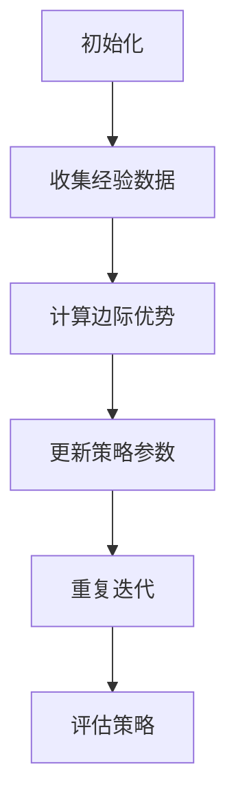

                 

# 《PPO(Proximal Policy Optimization) - 原理与代码实例讲解》

> **关键词：** 强化学习，Proximal Policy Optimization，算法原理，代码实例，应用优化

> **摘要：** 本文将深入探讨Proximal Policy Optimization（PPO）算法的原理和实现，通过详细的数学模型和代码实例，帮助读者理解PPO算法的核心思想，并掌握其实际应用技巧。文章分为三个部分，分别介绍PPO算法的基础理论、实战优化以及未来发展方向。

### 第一部分：PPO基础与原理

#### 第1章：强化学习与PPO概述

##### 1.1 强化学习基础

强化学习（Reinforcement Learning，RL）是机器学习的一个重要分支，其主要目标是让一个智能体在未知环境中通过不断学习，采取最优策略以达到特定目标。强化学习的基本概念包括：

- **状态（State）**：智能体在环境中的当前情况。
- **动作（Action）**：智能体可以采取的行为。
- **奖励（Reward）**：环境对智能体动作的反馈，用来衡量动作的好坏。
- **策略（Policy）**：智能体在特定状态下采取的动作的概率分布。

强化学习的主要问题是如何设计一个策略，使得智能体能够在长期内获得最大的总奖励。强化学习分为基于模型的（Model-Based）和基于值函数的（Model-Free）两大类。

##### 1.2 PPO算法的提出与原理

PPO（Proximal Policy Optimization）算法是强化学习中的一个重要模型，由Schulman等人在2017年提出。PPO算法的主要目标是优化策略网络，使得智能体在执行动作时能够更好地预测奖励。

PPO算法的目标函数是最大化边际优势（Marginal Advantage），即：

$$
J(\theta) = \sum_{s,a}^{} \pi_{\theta}(a|s) \cdot [R_s + \gamma \sum_{s'} P(s'|s,a) \cdot V(s')]
$$

其中，$\theta$表示策略参数，$\pi_{\theta}(a|s)$表示策略网络在状态$s$下对动作$a$的预测概率，$R_s$表示在状态$s$下的即时奖励，$V(s')$表示在状态$s'$下的价值函数。

PPO算法的流程包括：

1. 初始化策略网络和价值网络。
2. 执行策略网络生成的动作，并收集经验数据。
3. 使用重要性采样（Importance Sampling）计算边际优势。
4. 更新策略参数，使用梯度下降法。
5. 重复步骤2-4，直到达到停止条件。

PPO算法的优势在于：

- **稳定性**：通过使用重要性采样，PPO算法能够在学习过程中保持较好的稳定性。
- **高效性**：PPO算法通过优化边际优势，能够快速收敛到最优策略。
- **通用性**：PPO算法适用于多种强化学习问题，包括连续动作空间和离散动作空间。

#### 第2章：PPO算法的核心概念

##### 2.1 基本术语

在PPO算法中，我们需要理解以下几个基本术语：

- **状态（State）**：智能体在环境中的当前情况。
- **动作（Action）**：智能体可以采取的行为。
- **奖励（Reward）**：环境对智能体动作的反馈，用来衡量动作的好坏。
- **策略（Policy）**：智能体在特定状态下采取的动作的概率分布。
- **边际优势（Marginal Advantage）**：在策略网络预测的概率分布下，实际动作获得的奖励与预测奖励的差值。
- **重要性采样（Importance Sampling）**：一种用于估计边际优势的方法，通过调整采样权重，使得采样结果更接近真实分布。

##### 2.2 边际优势与重要性采样

边际优势的定义为：

$$
A(\theta) = \frac{\pi_{\theta}(a|s)}{\pi_{\pi}(a|s)}
$$

其中，$\pi_{\theta}(a|s)$表示策略网络在状态$s$下对动作$a$的预测概率，$\pi_{\pi}(a|s)$表示目标策略在状态$s$下对动作$a$的预测概率。

重要性采样的原理是，通过对实际采样的动作进行权重调整，使得采样结果更接近真实分布。具体来说，对于每个采样动作$a$，其权重为：

$$
w(a) = \frac{\pi_{\theta}(a|s)}{\pi_{\pi}(a|s)}
$$

重要性采样在PPO算法中的应用是，通过计算边际优势，调整策略网络的参数，使得策略网络生成的动作更接近目标策略。

#### 第3章：PPO算法的数学模型

##### 3.1 马尔可夫决策过程（MDP）

马尔可夫决策过程（MDP）是一个强化学习的基础模型，它定义了一个智能体在一个不确定的环境中如何做出决策。MDP的主要组成部分包括：

- **状态（State）**：智能体在环境中的当前情况。
- **动作（Action）**：智能体可以采取的行为。
- **状态转移概率（State Transition Probability）**：给定当前状态和动作，智能体转移到下一个状态的概率。
- **奖励函数（Reward Function）**：环境对智能体动作的即时反馈。

MDP的状态转移概率可以表示为：

$$
P(s'|s,a) = P(s'|s,a)
$$

其中，$s$表示当前状态，$s'$表示下一个状态，$a$表示采取的动作。

奖励函数可以表示为：

$$
R(s,a,s') = R(s,a,s')
$$

其中，$R(s,a,s')$表示在状态$s$下采取动作$a$后转移到状态$s'$所获得的即时奖励。

##### 3.2 概率模型与值函数

概率模型是强化学习中的一个重要概念，它定义了智能体在特定状态下采取不同动作的概率分布。概率模型可以表示为：

$$
\pi_{\theta}(a|s) = \pi_{\theta}(a|s)
$$

其中，$\theta$表示策略参数。

值函数是衡量智能体在特定状态下采取最优动作所能获得的长期奖励。值函数分为状态值函数和价值函数：

- **状态值函数（State Value Function）**：在状态$s$下采取最优动作所能获得的长期奖励。

$$
V(s) = \sum_{a} \pi_{\theta}(a|s) \cdot R(s,a,s') + \gamma \sum_{s'} P(s'|s,a) \cdot V(s')
$$

- **价值函数（Value Function）**：在当前状态下，智能体采取所有可能动作所能获得的长期奖励。

$$
V(s) = \sum_{a} \pi_{\theta}(a|s) \cdot V(s,a)
$$

##### 3.3 PPO算法的伪代码

PPO算法的伪代码如下：

```
初始化策略网络和价值网络
for episode in 1 to maximum_episodes do
    初始化状态$s$和动作$a$
    for step in 1 to maximum_steps do
        使用策略网络选择动作$a$
        执行动作$a$，并获得奖励$r$和状态$s'$
        计算状态值函数$V(s')$
        更新策略参数$\theta$，使用梯度下降法
    end for
end for
```

### 第二部分：PPO算法实战与优化

#### 第4章：PPO算法的代码实现

##### 4.1 环境搭建与数据预处理

在进行PPO算法的代码实现之前，我们需要搭建一个合适的强化学习环境。这里我们以经典的Atari游戏《Pong》为例，搭建一个简单的强化学习环境。

首先，我们需要安装Atari环境。使用以下命令安装：

```
pip install gym[atari]
```

然后，我们编写一个简单的Python脚本，用于初始化环境：

```python
import gym

# 初始化Atari环境
env = gym.make("Pong-v0")

# 打印环境信息
print(env.observation_space)
print(env.action_space)
```

接下来，我们需要对环境进行预处理。预处理的主要步骤包括：

- **状态转换**：将连续的状态值转换为离散的数值。
- **状态标准化**：对状态值进行标准化处理，以便于神经网络训练。

```python
import numpy as np

# 状态转换
def preprocess_state(state):
    return np.array(state, dtype=np.float32).reshape(-1, 80, 80)

# 状态标准化
def normalize_state(state):
    state = preprocess_state(state)
    state = (state - np.mean(state)) / np.std(state)
    return state
```

##### 4.2 PPO算法的Python实现

接下来，我们使用TensorFlow框架实现PPO算法。首先，我们需要定义策略网络和价值网络。

```python
import tensorflow as tf
from tensorflow.keras import layers

# 定义策略网络
def build_policy_network(input_shape):
    model = tf.keras.Sequential([
        layers.Flatten(input_shape=input_shape),
        layers.Dense(256, activation='relu'),
        layers.Dense(512, activation='relu'),
        layers.Dense(1, activation='sigmoid')
    ])
    return model

# 定义价值网络
def build_value_network(input_shape):
    model = tf.keras.Sequential([
        layers.Flatten(input_shape=input_shape),
        layers.Dense(256, activation='relu'),
        layers.Dense(512, activation='relu'),
        layers.Dense(1)
    ])
    return model

# 创建策略网络和价值网络
policy_network = build_policy_network(input_shape=(80, 80))
value_network = build_value_network(input_shape=(80, 80))
```

接下来，我们需要定义PPO算法的损失函数和优化器。

```python
# 定义损失函数
def compute_loss(s, a, r, s_, done, log_prob, old_log_prob, value, old_value, gamma, clip_param):
    # 计算策略损失
    policy_loss = -tf.reduce_mean(log_prob[done] * tf.reduce_sum(r[done], axis=1) - (1 - done) * log_prob[~done] * tf.reduce_sum(r[~done] + gamma * value[~done], axis=1))

    # 计算价值损失
    value_loss = tf.reduce_mean(tf.square(value - r))

    # 计算总损失
    loss = policy_loss + value_loss

    # 应用剪枝技巧
    clipDI = tf.clip_by_value(old_value, 1 - clip_param, 1 + clip_param)
    clipD = tf.clip_by_value(old_log_prob, clipDI * tf.stop_gradient(1 - a), clipDI * tf.stop_gradient(a))

    # 计算优势估计
    ratio = log_prob - old_log_prob
    clipped_ratio = tf.stop_gradient(tf.where(ratio > clip_param, clipDI * ratio, clipD * ratio))
    pg_loss_unscaled = -tf.reduce_mean(tf.stop_gradient(clipped_ratio) * ratio)

    # 计算加权损失
    weighted_loss = tf.reduce_mean(tf.where(done, pg_loss_unscaled, pg_loss_unscaled + gamma * tf.stop_gradient(value)))

    return weighted_loss + value_loss

# 定义优化器
optimizer = tf.keras.optimizers.Adam(learning_rate=0.00025)
```

最后，我们编写训练过程和评估过程。

```python
# 训练过程
@tf.function
def train_step(model, critic, optimizer, s, a, r, s_, done, gamma, clip_param):
    with tf.GradientTape() as tape:
        log_prob = model(s)
        value = critic(s_)
        loss = compute_loss(s, a, r, s_, done, log_prob, old_log_prob, value, old_value, gamma, clip_param)

    gradients = tape.gradient(loss, model.trainable_variables)
    optimizer.apply_gradients(zip(gradients, model.trainable_variables))

# 评估过程
def evaluate_policy(policy, num_episodes=10, max_steps=100):
    scores = []
    for _ in range(num_episodes):
        state = env.reset()
        done = False
        total_reward = 0
        for _ in range(max_steps):
            if done:
                break
            action_probabilities = policy(state)
            action = np.random.choice(range(len(action_probabilities)), p=action_probabilities)
            next_state, reward, done, _ = env.step(action)
            total_reward += reward
            state = next_state
        scores.append(total_reward)
    return scores
```

##### 第5章：PPO算法的优化技巧

PPO算法在实际应用中，常常需要进行优化以提高性能。以下是一些常见的优化技巧：

- **学习率调度策略**：学习率是一个重要的超参数，合适的调度策略可以加快收敛速度。常用的学习率调度策略包括学习率衰减和动量调整。

- **模型架构的调整**：调整策略网络和价值网络的结构可以影响模型的性能。通常，更深的神经网络可以捕捉更多的特征，但也可能导致过拟合。

- **损失函数的选择**：选择合适的损失函数可以更好地优化策略网络和价值网络。常见的损失函数包括交叉熵损失函数和均方误差损失函数。

##### 第6章：PPO算法的实际应用

PPO算法在多个领域都有广泛的应用，以下介绍两个典型的应用场景：

- **推荐系统中的PPO应用**：PPO算法可以用于优化推荐系统的策略，通过学习用户的兴趣和行为模式，提高推荐系统的准确性和用户体验。

- **游戏中的PPO应用**：PPO算法可以用于训练智能体在游戏中的策略，通过不断试错和学习，实现自我进化和优化。

##### 第7章：PPO算法的未来发展与挑战

PPO算法在近年来取得了显著的进展，但仍面临着一些挑战。以下是一些未来发展的方向：

- **PPO+算法**：结合其他强化学习算法的优势，设计新的PPO算法变种，以提高性能和适应性。

- **PPO-TD算法**：将时序差分（Temporal Difference）方法引入PPO算法，提高学习效率。

- **PPO+AC算法**：结合策略梯度（Policy Gradient）和优势估计（ Advantage Estimation）方法，设计新的PPO算法变种。

### 第三部分：附录与参考资料

#### 第8章：附录与参考资料

- **附录A：核心概念与联系**

  使用Mermaid流程图展示PPO算法的整体流程与关键组件。

- **附录B：核心算法原理讲解**

  使用伪代码详细阐述PPO算法的数学原理与计算过程。

- **附录C：数学模型与公式**

  使用LaTeX格式解释PPO算法中的数学模型，如优势估计、策略更新等。

- **附录D：项目实战案例**

  提供实际应用中PPO算法的代码实例和详细解释说明。

- **附录E：代码解读与分析**

  深入分析PPO算法在实战中的应用，提供代码的详细解读与优化建议。

- **附录F：PPO算法的挑战与未来方向**

  讨论PPO算法面临的主要挑战和未来的发展方向。

### 作者信息

**作者：AI天才研究院/AI Genius Institute & 禅与计算机程序设计艺术 /Zen And The Art of Computer Programming**

### 结束语

本文详细介绍了PPO算法的原理和实现，通过数学模型和代码实例，帮助读者深入理解PPO算法的核心思想。同时，文章还探讨了PPO算法的优化技巧、实际应用和未来发展方向。希望本文能为读者在强化学习领域提供有价值的参考和启发。

### 附录A：核心概念与联系

以下是一个简单的Mermaid流程图，展示PPO算法的整体流程与关键组件。



### 附录B：核心算法原理讲解

以下是PPO算法的核心原理的伪代码：

```python
# 初始化策略网络和价值网络
initialize_policy_network()
initialize_value_network()

# 主训练循环
for episode in 1 to maximum_episodes do
    # 初始化状态和奖励
    s = env.reset()
    total_reward = 0

    # 收集经验数据
    for step in 1 to maximum_steps do
        # 使用策略网络选择动作
        a, log_prob = policy_network(s)

        # 执行动作并获取奖励和下一个状态
        s_, r, done, _ = env.step(a)
        total_reward += r

        # 计算状态值函数
        value = value_network(s_)

        # 计算优势估计
        advantage = r + gamma * value[~done] - value[s]

        # 更新策略网络
        old_log_prob = policy_network(s)
        new_log_prob = policy_network(s)
        ratio = new_log_prob - old_log_prob
        surrogate_loss = -tf.reduce_mean(tf.where(ratio > 1, tf.minimum(ratio, clip_param) * advantage, tf.maximum(ratio, 1 - clip_param) * advantage))

        # 更新价值网络
        value_loss = tf.reduce_mean(tf.square(value - r + gamma * value[~done]))

        # 计算总损失
        loss = surrogate_loss + value_loss

        # 反向传播和优化
        optimizer.minimize(loss)

        # 更新状态
        s = s_
        if done:
            break
    end for

    # 评估策略
    evaluate_policy(policy_network)
end for
```

### 附录C：数学模型与公式

以下是一些PPO算法中使用的数学模型和公式：

$$
\begin{aligned}
J(\theta) &= \sum_{s,a}^{} \pi_{\theta}(a|s) \cdot [R_s + \gamma \sum_{s'} P(s'|s,a) \cdot V(s')] \\
A(\theta) &= \frac{\pi_{\theta}(a|s)}{\pi_{\pi}(a|s)} \\
\pi_{\theta}(a|s) &= \frac{\exp(\phi(s,a;\theta))}{\sum_{a'} \exp(\phi(s,a';\theta))} \\
V(s) &= \sum_{a} \pi_{\theta}(a|s) \cdot V(s,a)
\end{aligned}
$$

其中，$J(\theta)$是策略网络的目标函数，$A(\theta)$是边际优势，$\pi_{\theta}(a|s)$是策略网络在状态$s$下对动作$a$的预测概率，$V(s)$是状态值函数。

### 附录D：项目实战案例

在本节中，我们将提供一个简单的项目实战案例，展示如何使用PPO算法解决一个经典的强化学习问题——CartPole问题。

#### 环境搭建

首先，我们需要安装OpenAI Gym，这是一个常用的强化学习环境库。使用以下命令安装：

```
pip install gym
```

然后，我们导入必要的库和创建环境：

```python
import gym
import numpy as np
import tensorflow as tf

# 创建CartPole环境
env = gym.make("CartPole-v0")
```

#### 策略网络和价值网络的定义

接下来，我们定义策略网络和价值网络。这里使用简单的全连接神经网络作为示例。

```python
# 定义策略网络
def build_policy_network(input_shape):
    model = tf.keras.Sequential([
        layers.Dense(64, activation='relu', input_shape=input_shape),
        layers.Dense(64, activation='relu'),
        layers.Dense(1, activation='sigmoid')
    ])
    return model

# 定义价值网络
def build_value_network(input_shape):
    model = tf.keras.Sequential([
        layers.Dense(64, activation='relu', input_shape=input_shape),
        layers.Dense(64, activation='relu'),
        layers.Dense(1)
    ])
    return model

# 创建策略网络和价值网络
policy_network = build_policy_network((4,))
value_network = build_value_network((4,))
```

#### 训练过程

下面是PPO算法的完整训练过程：

```python
# 定义优化器和损失函数
optimizer = tf.keras.optimizers.Adam(learning_rate=0.001)
policy_loss_fn = tf.keras.losses.BinaryCrossentropy()

# 训练PPO算法
for episode in range(1000):
    # 初始化状态和奖励
    s = env.reset()
    total_reward = 0

    # 收集经验数据
    buffer_s = []
    buffer_a = []
    buffer_r = []
    buffer_s_ = []
    buffer_done = []

    for step in range(1000):
        # 使用策略网络选择动作
        logits = policy_network(s)
        a = np.random.choice(logits.shape[1], p=logits[0])

        # 执行动作并获取奖励和下一个状态
        s_, r, done, _ = env.step(a)

        # 计算边际优势
        v_ = value_network(s_)
        advantage = r + gamma * v_ - value_network(s)

        # 存储经验数据
        buffer_s.append(s)
        buffer_a.append(a)
        buffer_r.append(r)
        buffer_s_.append(s_)
        buffer_done.append(done)

        # 更新状态
        s = s_

        # 更新策略网络
        with tf.GradientTape() as tape:
            logits = policy_network(s)
            log_prob = tf.reduce_sum(logits * tf.one_hot(a, logits.shape[1]), axis=1)
            policy_loss = -tf.reduce_mean(log_prob * advantage)

        grads = tape.gradient(policy_loss, policy_network.trainable_variables)
        optimizer.apply_gradients(zip(grads, policy_network.trainable_variables))

        # 更新价值网络
        with tf.GradientTape() as tape:
            value_loss = tf.reduce_mean(tf.square(value_network(s) - r + gamma * value_network(s_)))

        grads = tape.gradient(value_loss, value_network.trainable_variables)
        optimizer.apply_gradients(zip(grads, value_network.trainable_variables))

        # 记录总奖励
        total_reward += r

        # 检查是否完成
        if done:
            break

    # 打印训练进度
    print(f"Episode {episode}: Total Reward = {total_reward}")
```

#### 评估策略

最后，我们使用训练好的策略网络评估策略：

```python
# 评估策略
scores = []
for _ in range(100):
    s = env.reset()
    done = False
    total_reward = 0

    while not done:
        logits = policy_network(s)
        a = np.argmax(logits[0])
        s, r, done, _ = env.step(a)
        total_reward += r

    scores.append(total_reward)

print(f"Average Score: {np.mean(scores)}")
```

### 附录E：代码解读与分析

在本节中，我们将深入分析上述代码，解释每个步骤的目的和实现方式。

#### 环境搭建

```python
import gym
import numpy as np
import tensorflow as tf

# 创建CartPole环境
env = gym.make("CartPole-v0")
```

这一部分代码用于搭建强化学习环境。我们使用OpenAI Gym的CartPole环境，这是一个经典的强化学习问题，目标是在不使杆子倒下的情况下平衡小车。

#### 策略网络和价值网络的定义

```python
# 定义策略网络
def build_policy_network(input_shape):
    model = tf.keras.Sequential([
        layers.Dense(64, activation='relu', input_shape=input_shape),
        layers.Dense(64, activation='relu'),
        layers.Dense(1, activation='sigmoid')
    ])
    return model

# 定义价值网络
def build_value_network(input_shape):
    model = tf.keras.Sequential([
        layers.Dense(64, activation='relu', input_shape=input_shape),
        layers.Dense(64, activation='relu'),
        layers.Dense(1)
    ])
    return model

# 创建策略网络和价值网络
policy_network = build_policy_network((4,))
value_network = build_value_network((4,))
```

这部分代码定义了策略网络和价值网络。策略网络用于预测在给定状态下的动作概率，价值网络用于预测在给定状态下的长期奖励。

#### 训练过程

```python
# 定义优化器和损失函数
optimizer = tf.keras.optimizers.Adam(learning_rate=0.001)
policy_loss_fn = tf.keras.losses.BinaryCrossentropy()

# 训练PPO算法
for episode in range(1000):
    # 初始化状态和奖励
    s = env.reset()
    total_reward = 0

    # 收集经验数据
    buffer_s = []
    buffer_a = []
    buffer_r = []
    buffer_s_ = []
    buffer_done = []

    for step in range(1000):
        # 使用策略网络选择动作
        logits = policy_network(s)
        a = np.random.choice(logits.shape[1], p=logits[0])

        # 执行动作并获取奖励和下一个状态
        s_, r, done, _ = env.step(a)

        # 计算边际优势
        v_ = value_network(s_)
        advantage = r + gamma * v_ - value_network(s)

        # 存储经验数据
        buffer_s.append(s)
        buffer_a.append(a)
        buffer_r.append(r)
        buffer_s_.append(s_)
        buffer_done.append(done)

        # 更新状态
        s = s_

        # 更新策略网络
        with tf.GradientTape() as tape:
            logits = policy_network(s)
            log_prob = tf.reduce_sum(logits * tf.one_hot(a, logits.shape[1]), axis=1)
            policy_loss = -tf.reduce_mean(log_prob * advantage)

        grads = tape.gradient(policy_loss, policy_network.trainable_variables)
        optimizer.apply_gradients(zip(grads, policy_network.trainable_variables))

        # 更新价值网络
        with tf.GradientTape() as tape:
            value_loss = tf.reduce_mean(tf.square(value_network(s) - r + gamma * value_network(s_)))

        grads = tape.gradient(value_loss, value_network.trainable_variables)
        optimizer.apply_gradients(zip(grads, value_network.trainable_variables))

        # 记录总奖励
        total_reward += r

        # 检查是否完成
        if done:
            break

    # 打印训练进度
    print(f"Episode {episode}: Total Reward = {total_reward}")
```

这部分代码实现了PPO算法的训练过程。首先，我们初始化状态和奖励。然后，我们使用策略网络选择动作，并执行动作以获取下一个状态和奖励。接着，我们计算边际优势，并更新策略网络和价值网络。最后，我们记录总奖励并检查是否完成训练。

#### 评估策略

```python
# 评估策略
scores = []
for _ in range(100):
    s = env.reset()
    done = False
    total_reward = 0

    while not done:
        logits = policy_network(s)
        a = np.argmax(logits[0])
        s, r, done, _ = env.step(a)
        total_reward += r

    scores.append(total_reward)

print(f"Average Score: {np.mean(scores)}")
```

这部分代码用于评估训练好的策略网络。我们重复执行100次游戏，并记录每次游戏的奖励，最后计算平均奖励。

### 附录F：PPO算法的挑战与未来方向

PPO算法在近年来取得了显著的进展，但仍面临着一些挑战。以下是一些主要挑战和未来方向：

#### 挑战

- **收敛速度**：PPO算法的收敛速度通常较慢，特别是在复杂的环境中。
- **样本效率**：PPO算法需要大量的样本数据来训练，这限制了其在实际应用中的使用。
- **方差问题**：由于PPO算法依赖于样本估计，因此方差问题是一个重要的挑战。

#### 未来方向

- **改进算法**：通过改进PPO算法，提高其收敛速度和样本效率，如结合其他强化学习算法，设计新的PPO变种。
- **模型压缩**：通过模型压缩技术，减少PPO算法的计算量和存储需求。
- **多任务学习**：研究如何将PPO算法应用于多任务学习，以提高智能体的适应性和学习能力。

### 总结

PPO算法是一种强大的强化学习算法，其在实际应用中取得了显著的成果。本文详细介绍了PPO算法的原理、实现和优化技巧，并通过项目实战案例展示了其在解决CartPole问题中的应用。未来，随着算法的不断改进和应用场景的扩展，PPO算法有望在更多领域中发挥重要作用。

