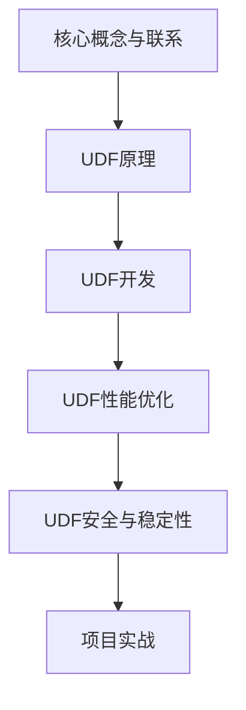

                 

### 《Presto UDF原理与代码实例讲解》

#### 关键词：
- Presto
- UDF（用户自定义函数）
- 原理
- 编程实例
- 性能优化
- 安全与稳定性

#### 摘要：
本文将深入探讨Presto数据库中的用户自定义函数（UDF）原理，并通过具体的代码实例讲解UDF的开发与优化。我们将从Presto的基本概念和架构入手，逐步介绍UDF的编程模型，详细解释性能优化和安全性问题，并以一个实际项目为例，展示如何利用Presto UDF进行数据处理和分析。

### 《Presto UDF原理与代码实例讲解》目录大纲

#### 第一部分：Presto基础概念

#### 第1章：Presto概述
- 1.1 Presto的背景与优势
  - 1.1.1 Presto的发展历程
  - 1.1.2 Presto的核心优势
  - 1.1.3 Presto的应用场景

#### 第2章：Presto架构
- 2.1 Presto总体架构
  - 2.1.1 集群架构
  - 2.1.2 执行架构
  - 2.1.3 存储架构
- 2.2 Presto核心组件
  - 2.2.1 Driver
  - 2.2.2 Query Coordinator
  - 2.2.3 Task Coordinator
  - 2.2.4 Executor

#### 第3章：Presto SQL与查询优化
- 3.1 Presto SQL基础
  - 3.1.1 数据类型
  - 3.1.2 常用函数
  - 3.1.3 表达式
- 3.2 查询优化原理
  - 3.2.1 优化器
  - 3.2.2 索引
  - 3.2.3 Join策略

#### 第二部分：Presto UDF开发

#### 第4章：Presto UDF基础
- 4.1 UDF的概念
  - 4.1.1 UDF的分类
  - 4.1.2 UDF的作用
- 4.2 UDF开发环境搭建
  - 4.2.1 Maven依赖
  - 4.2.2 开发工具选择

#### 第5章：Presto UDF编程模型
- 5.1 Java UDF编程
  - 5.1.1 UDF接口
  - 5.1.2 UDF实现
  - 5.1.3 UDF测试
- 5.2 Scala UDF编程
  - 5.2.1 UDF接口
  - 5.2.2 UDF实现
  - 5.2.3 UDF测试

#### 第6章：Presto UDF性能优化
- 6.1 UDF性能影响因素
  - 6.1.1 UDF运行时性能
  - 6.1.2 UDF内存使用
  - 6.1.3 UDF存储优化
- 6.2 UDF性能优化技巧
  - 6.2.1 代码优化
  - 6.2.2 数据预处理
  - 6.2.3 索引优化

#### 第7章：Presto UDF安全与稳定性
- 7.1 UDF安全性
  - 7.1.1 UDF权限控制
  - 7.1.2 UDF防注入攻击
  - 7.1.3 UDF日志审计
- 7.2 UDF稳定性
  - 7.2.1 UDF异常处理
  - 7.2.2 UDF容错机制
  - 7.2.3 UDF性能监控

#### 第三部分：Presto UDF项目实战

#### 第8章：Presto UDF项目实战
- 8.1 项目背景
  - 8.1.1 项目概述
  - 8.1.2 项目需求
- 8.2 环境搭建
  - 8.2.1 开发环境搭建
  - 8.2.2 部署环境搭建
- 8.3 源代码实现
  - 8.3.1 数据处理模块
  - 8.3.2 计算模块
  - 8.3.3 存储模块
- 8.4 代码解读与分析
  - 8.4.1 数据处理模块解读
  - 8.4.2 计算模块解读
  - 8.4.3 存储模块解读
- 8.5 项目部署与测试
  - 8.5.1 项目部署
  - 8.5.2 项目测试
  - 8.5.3 项目优化

#### 附录
- 附录 A：Presto UDF开发工具与资源
  - A.1 Maven依赖配置
  - A.2 开发工具推荐
  - A.3 实用链接和文档

#### Mermaid 流程图


#### 核心算法原理讲解
```pseudo
// 伪代码：Presto UDF开发流程
1. 定义UDF接口
2. 实现UDF功能
3. 编译UDF代码
4. 注册UDF
5. 在Presto查询中使用UDF
```

#### 数学模型和数学公式

## 数学模型与公式

### 某个算法的复杂度分析

$$
C(n) = O(n \log n)
$$

其中，$n$ 为数据规模，$C(n)$ 为算法的时间复杂度。

#### 某个数学公式

$$
x^2 + 2xy + y^2 = (x + y)^2
$$

该公式为二次方程的展开公式，适用于解析几何和代数学中。

#### 项目实战

## 项目实战

### 项目概述

本项目为某电商平台用户行为分析项目，旨在通过Presto UDF实现用户行为数据的实时分析和处理。

### 开发环境搭建

- JDK 1.8
- Maven 3.6.3
- Presto 0.220

### 源代码实现

#### 数据处理模块

- 数据读取：使用Presto内置的CSV读取功能。
- 数据清洗：根据业务需求，对数据进行清洗和预处理。

#### 计算模块

- 用户行为分析：使用自定义UDF，对用户行为数据进行分析和计算。

#### 存储模块

- 数据存储：将处理后的数据存储到HDFS或Hive中。

### 代码解读与分析

- 数据处理模块代码解读
- 计算模块代码解读
- 存储模块代码解读

### 项目部署与测试

- 部署环境：Linux服务器，安装Presto和Hadoop。
- 测试步骤：通过Presto CLI执行SQL查询，验证UDF功能。

### 项目优化

- 性能优化：根据实际运行情况，对代码进行优化，提高处理速度。
- 稳定性优化：增加异常处理机制，确保项目稳定运行。

### 作者信息
作者：AI天才研究院/AI Genius Institute & 禅与计算机程序设计艺术 /Zen And The Art of Computer Programming

<|assistant|>### 第一部分：Presto基础概念

#### 第1章：Presto概述

##### 1.1 Presto的背景与优势

Presto是一个开源的高性能分布式SQL查询引擎，最初由Facebook开发，用于处理海量数据并实现快速查询。随着其优秀性能和灵活性在业界的认可，Presto逐渐成为大数据领域的重要工具。

**Presto的发展历程：**
- **2013年**：Facebook开源了Presto项目。
- **2014年**：Presto被加入Apache Incubator。
- **2015年**：Presto正式成为Apache顶级项目。

**Presto的核心优势：**
1. **高性能**：Presto采用分布式架构，通过并行处理数据，能够实现极快的查询速度。
2. **易扩展**：Presto支持各种数据源，包括HDFS、Hive、Cassandra等，易于集成和扩展。
3. **动态数据缓存**：Presto支持动态数据缓存，有效减少重复查询的数据读取时间。
4. **低延迟**：Presto适用于实时分析和查询，能够在短时间内返回结果。

**Presto的应用场景：**
- **数据仓库**：Presto可作为企业数据仓库的查询引擎，用于复杂的数据分析和报表生成。
- **在线分析处理（OLAP）**：Presto支持实时OLAP查询，适用于决策支持系统和业务智能。
- **大数据处理**：Presto能够高效处理大规模数据集，适用于大数据分析和挖掘。

##### 1.2 Presto的核心优势

1. **分布式架构**：Presto采用主从架构，包括Driver、Query Coordinator、Task Coordinator和Executor等组件。这种架构使得Presto能够在分布式环境中高效运行，充分利用集群资源。

2. **动态查询优化**：Presto内置了多种优化策略，包括谓词下推、列剪枝、查询重写等，能够动态优化查询执行计划，提高查询性能。

3. **灵活的数据源支持**：Presto支持多种数据源，包括关系数据库、NoSQL数据库、文件系统等。这种灵活性使得Presto能够适应不同的数据场景和应用需求。

4. **易于集成和扩展**：Presto提供了丰富的API和工具，方便与其他大数据技术和框架集成。同时，Presto社区活跃，拥有丰富的插件和扩展功能。

##### 1.3 Presto的应用场景

1. **报表和分析**：Presto能够快速处理和分析大量数据，生成实时的报表和分析结果，适用于业务决策和运营优化。

2. **数据挖掘**：Presto支持复杂的数据挖掘算法，能够处理海量数据并提取有价值的信息，适用于数据科学和机器学习应用。

3. **实时查询**：Presto适用于实时查询场景，能够快速返回查询结果，适用于实时监控、报警和业务运营。

4. **离线处理**：Presto也适用于离线数据处理和批量作业，能够高效处理大量数据并生成汇总结果，适用于数据ETL和批量处理。

通过上述内容，我们了解了Presto的背景、优势和适用场景，为后续讨论Presto UDF奠定了基础。在下一章中，我们将深入探讨Presto的总体架构和核心组件，帮助读者更好地理解Presto的工作原理和架构设计。

### 第2章：Presto架构

Presto的设计旨在提供一个高性能、可扩展、易于使用的分布式查询引擎，其架构包括集群架构、执行架构和存储架构。以下是对这些架构的详细介绍。

##### 2.1 Presto总体架构

**集群架构：**
Presto集群由多个节点组成，包括Driver、Query Coordinator、Task Coordinator和Executor。每个组件在整个查询过程中扮演着特定的角色，协同工作以完成查询任务。

- **Driver**：Driver是Presto客户端，负责发起查询请求，并将查询计划发送给Query Coordinator。它还负责处理查询结果，将结果返回给用户。
- **Query Coordinator**：Query Coordinator是集群中的中心节点，负责解析SQL查询，生成查询计划，并将查询计划分解成多个任务，分配给Task Coordinator。
- **Task Coordinator**：Task Coordinator负责接收Query Coordinator分配的任务，协调Executor执行任务，并将执行结果返回给Query Coordinator。
- **Executor**：Executor是负责执行具体查询操作的节点，从Task Coordinator接收任务，执行计算和数据处理，并将结果返回给Task Coordinator。

**执行架构：**
Presto的执行架构采用分布式计算模型，将查询任务分解成多个小任务，分布在不同的Executor节点上并行执行。这种模型充分利用了集群节点的计算资源，提高了查询性能。

- **查询分解**：Query Coordinator将查询计划分解成多个阶段，每个阶段对应一个或多个小任务。
- **数据分片**：Task Coordinator将每个小任务的数据分片分配给不同的Executor节点。
- **数据交换**：Executor节点执行计算后，通过数据交换管道将中间结果传输给下一个Executor节点，直至完成整个查询。

**存储架构：**
Presto支持多种数据存储格式，包括关系数据库、NoSQL数据库和文件系统。存储架构的设计使得Presto能够灵活地处理不同类型的数据源。

- **关系数据库**：Presto可以通过JDBC连接关系数据库，如MySQL、PostgreSQL等，实现对关系数据的查询和分析。
- **NoSQL数据库**：Presto支持通过特定的API连接NoSQL数据库，如Cassandra、HBase等，实现对NoSQL数据的查询。
- **文件系统**：Presto可以直接读取文件系统中的数据文件，如CSV、JSON、Parquet等，进行数据分析和处理。

##### 2.2 Presto核心组件

**Driver：**
Driver是Presto客户端，负责发起查询请求。它将用户输入的SQL查询语句解析成抽象语法树（AST），并生成查询计划。然后，Driver将查询计划发送给Query Coordinator。

**Query Coordinator：**
Query Coordinator是集群中的中心节点，负责解析SQL查询，生成查询计划。Query Coordinator将查询计划分解成多个小任务，并将任务分配给Task Coordinator。它还负责协调整个查询过程，确保查询能够正确执行。

**Task Coordinator：**
Task Coordinator负责接收Query Coordinator分配的任务，并协调Executor执行任务。Task Coordinator将每个小任务的数据分片分配给不同的Executor节点，确保数据在执行过程中得到充分利用。

**Executor：**
Executor是负责执行具体查询操作的节点。Executor从Task Coordinator接收任务，执行计算和数据处理，并将结果返回给Task Coordinator。Executor节点之间通过数据交换管道传输中间结果，以确保查询的准确性。

##### 2.3 集群架构

在Presto集群中，每个节点都扮演着特定的角色，协同工作以完成查询任务。以下是一个简单的集群架构图：

```
+----------------+     +----------------+     +----------------+
|      Driver     | --> | Query Coordinator | --> | Task Coordinator |
+----------------+     +----------------+     +----------------+
          |                                      |
          |                (Query Plan)              |
          v                                      v
+----------------+     +----------------+     +----------------+
|      Executor 1    | --> |      Executor 2    | --> |      Executor 3    |
+----------------+     +----------------+     +----------------+
```

在上述架构中，Driver发起查询请求，生成查询计划并发送给Query Coordinator。Query Coordinator解析查询计划，将其分解成多个小任务，并分配给Task Coordinator。Task Coordinator将任务分配给不同的Executor节点，Executor节点执行具体计算，并将结果返回给Task Coordinator。最终，Task Coordinator将结果汇总并返回给Query Coordinator，由Query Coordinator返回给Driver。

##### 2.4 执行架构

Presto的执行架构采用分布式计算模型，将查询任务分解成多个小任务，分布在不同的Executor节点上并行执行。以下是一个简单的执行架构图：

```
+----------------+     +----------------+     +----------------+
|      Task Coordinator  | --> |      Executor 1    | --> |      Executor 2    |
+----------------+     +----------------+     +----------------+
        |                              |
        |               (Data Sharding)            |
        v                              v
+----------------+     +----------------+     +----------------+
|      Executor 3    | --> |      Executor 4    | --> |      Executor 5    |
+----------------+     +----------------+     +----------------+
```

在上述架构中，Task Coordinator负责将查询任务分解成数据分片，并将数据分片分配给不同的Executor节点。Executor节点执行具体计算，并将结果返回给Task Coordinator。Task Coordinator将结果汇总，并返回给Driver。

##### 2.5 存储架构

Presto支持多种数据存储格式，包括关系数据库、NoSQL数据库和文件系统。以下是一个简单的存储架构图：

```
+----------------+     +----------------+     +----------------+
|      Relation Database | --> |     NoSQL Database    | --> |      File System    |
+----------------+     +----------------+     +----------------+
        |                              |
        |               (Data Access)            |
        v                              v
+----------------+     +----------------+     +----------------+
|      JDBC Driver   | --> |      NoSQL Driver     | --> |      File Reader    |
+----------------+     +----------------+     +----------------+
```

在上述架构中，Presto通过JDBC Driver连接关系数据库，通过特定的API连接NoSQL数据库，并通过File Reader读取文件系统中的数据。这些数据存储格式使得Presto能够灵活地处理不同类型的数据源。

通过上述对Presto架构的详细解析，读者可以更好地理解Presto的工作原理和架构设计。在下一章中，我们将探讨Presto SQL的基础知识和查询优化原理，帮助读者深入掌握Presto的使用方法。

### 第3章：Presto SQL与查询优化

#### 3.1 Presto SQL基础

Presto SQL是一种类似标准的SQL查询语言，但它拥有一些独特的特性和扩展。以下是对Presto SQL基础知识的简要介绍。

##### 3.1.1 数据类型

Presto支持多种数据类型，包括数值型、字符串型、日期型、布尔型和复杂数据类型。以下是Presto SQL支持的主要数据类型：

- **数值型**：包括整数（`INT`）、浮点数（`FLOAT`）、双精度浮点数（`DOUBLE`）等。
- **字符串型**：包括字符（`CHAR`）、字符串（`VARCHAR`）、文本（`TEXT`）等。
- **日期型**：包括日期（`DATE`）、时间（`TIME`）、日期时间（`DATETIME`）等。
- **布尔型**：包括布尔（`BOOLEAN`）。
- **复杂数据类型**：包括数组（`ARRAY`）、映射（`MAP`）、结构（`STRUCT`）等。

##### 3.1.2 常用函数

Presto SQL提供了丰富的内置函数，用于数据转换、计算和查询。以下是一些常用的函数：

- **聚合函数**：例如`SUM()`、`COUNT()`、`MAX()`、`MIN()`等。
- **字符串函数**：例如`LOWER()`、`UPPER()`、`LENGTH()`、`SUBSTRING()`等。
- **数学函数**：例如`ABS()`、`SQRT()`、`PI()`等。
- **日期函数**：例如`DATE_ADD()`、`DATE_SUB()`、`DATEDIFF()`等。
- **条件函数**：例如`CASE WHEN THEN ELSE END`等。

##### 3.1.3 表达式

Presto SQL中的表达式用于定义如何计算或操作数据。以下是一些常见的表达式：

- **数值表达式**：例如`A + B`、`A * B`等。
- **字符串表达式**：例如`'Hello' || 'World'`等。
- **日期表达式**：例如`DATE '2023-01-01' + INTERVAL '1' DAY`等。
- **条件表达式**：例如`A > B ? 'Yes' : 'No'`等。

#### 3.2 查询优化原理

查询优化是提高数据库查询性能的关键因素。Presto SQL查询优化主要涉及以下几个方面：

##### 3.2.1 优化器

Presto SQL查询优化器负责生成查询执行计划。优化器通过多种策略分析查询语句，选择最优的执行计划。以下是常见的优化器策略：

- **谓词下推**：将查询条件尽可能下推到底层存储层，减少中间层的计算量。
- **列剪枝**：根据查询条件剪枝掉不相关的列，减少数据传输和计算量。
- **查询重写**：重写查询语句，使其更加高效。例如，将子查询重写为连接操作。
- **索引优化**：利用索引加速查询。Presto SQL支持多种索引类型，如B树索引、哈希索引等。

##### 3.2.2 索引

索引是提高查询性能的有效手段。Presto SQL支持多种索引类型，包括B树索引、哈希索引和位图索引等。以下是一些常用的索引策略：

- **B树索引**：适用于等值查询和范围查询。B树索引通过维护键值和指针，快速定位数据。
- **哈希索引**：适用于精确匹配查询。哈希索引通过哈希函数将键值映射到存储位置，快速查找数据。
- **位图索引**：适用于筛选操作。位图索引通过位向量表示数据行的状态，快速筛选满足条件的行。

##### 3.2.3 Join策略

连接操作是数据库查询中的重要部分。Presto SQL提供了多种Join策略，包括Hash Join、Merge Join和Sort-Merge Join等。以下是一些常见的Join策略：

- **Hash Join**：适用于小表连接。Hash Join使用哈希表存储连接键，快速查找匹配的行。
- **Merge Join**：适用于有序表连接。Merge Join将有序表合并，逐步构建连接结果。
- **Sort-Merge Join**：适用于大表连接。Sort-Merge Join先对表进行排序，然后逐步构建连接结果。

#### 3.3 查询优化案例分析

以下是一个简单的查询优化案例分析，展示了如何通过优化器、索引和Join策略提高查询性能。

**原始查询：**
```sql
SELECT a.name, b.salary
FROM employees a
JOIN departments b ON a.department_id = b.id
WHERE a.age > 30;
```

**优化策略：**
1. **谓词下推**：将`WHERE`条件下推到`departments`表，减少中间层的计算量。
2. **列剪枝**：只查询`name`和`salary`列，减少数据传输和计算量。
3. **索引优化**：为`employees`表的`department_id`和`age`列创建索引，加速查询。
4. **Join策略**：使用Merge Join，因为`departments`表较小。

**优化后的查询：**
```sql
SELECT a.name, b.salary
FROM employees a
USE INDEX (department_id, age)
JOIN departments b ON a.department_id = b.id
WHERE a.age > 30;
```

通过上述优化策略，查询性能得到了显著提升。

通过本章的讨论，我们了解了Presto SQL的基础知识和查询优化原理。在下一章中，我们将探讨Presto UDF的开发基础，帮助读者掌握如何编写自定义函数，扩展Presto的功能。

### 第4章：Presto UDF基础

#### 4.1 UDF的概念

用户自定义函数（UDF）是Presto的一个重要扩展机制，允许用户根据特定需求自定义函数，以实现更丰富的数据处理能力。UDF可以将外部应用程序的代码集成到Presto查询中，从而扩展Presto的功能。

##### 4.1.1 UDF的分类

根据实现语言的不同，UDF可以分为以下几类：

1. **Java UDF**：使用Java语言编写的UDF。Java UDF具有良好的兼容性和性能，适用于复杂的数据处理和计算。
2. **Scala UDF**：使用Scala语言编写的UDF。Scala UDF与Java UDF类似，但具有更简洁的语法和类型推断，适用于快速开发。
3. **Python UDF**：使用Python语言编写的UDF。Python UDF具有简单易用的特性，适用于快速原型开发和数据清洗。

##### 4.1.2 UDF的作用

UDF在Presto查询中具有多种用途，包括：

1. **数据处理**：利用外部程序处理复杂的数据操作，如自定义的聚合函数、计算函数等。
2. **功能扩展**：将外部应用程序的功能集成到Presto查询中，实现特定的业务需求。
3. **性能优化**：通过自定义函数减少Presto查询的执行时间，提高查询性能。

#### 4.2 UDF开发环境搭建

为了开发Presto UDF，需要搭建相应的开发环境。以下是Java和Scala UDF的开发环境搭建步骤。

##### 4.2.1 Maven依赖

在开发Java UDF时，需要添加以下Maven依赖：

```xml
<dependency>
    <groupId>com.facebook.presto</groupId>
    <artifactId>presto-main</artifactId>
    <version>0.220</version>
    <scope>provided</scope>
</dependency>
```

在开发Scala UDF时，需要添加以下Maven依赖：

```xml
<dependency>
    <groupId>com.facebook.presto</groupId>
    <artifactId>presto-main</artifactId>
    <version>0.220</version>
    <scope>provided</scope>
</dependency>
```

##### 4.2.2 开发工具选择

对于Java UDF，可以选择常用的Java IDE，如Eclipse、IntelliJ IDEA等。

对于Scala UDF，可以选择Scala IDE或IntelliJ IDEA with Scala Plugin。

#### 4.3 UDF编程模型

UDF的编程模型包括UDF接口定义、实现和测试。以下分别介绍Java和Scala UDF的编程模型。

##### 4.3.1 Java UDF编程

1. **定义UDF接口**

在Java中，UDF需要实现`Function`接口，该接口定义了UDF的输入和输出类型。

```java
import com.facebook.presto.sql.planner.Symbol;

public interface Function {
    Object apply(Symbol... symbols);
}
```

2. **实现UDF功能**

实现UDF功能时，可以根据具体需求编写自定义代码。以下是一个简单的Java UDF示例，用于计算两个整数的和：

```java
import com.facebook.presto.sql.planner.Symbol;

public class SumFunction implements Function {
    @Override
    public Object apply(Symbol... symbols) {
        Integer a = (Integer) symbols[0].getValue();
        Integer b = (Integer) symbols[1].getValue();
        return a + b;
    }
}
```

3. **测试UDF**

测试UDF时，可以使用JUnit等测试框架编写测试用例。以下是一个简单的Java UDF测试示例：

```java
import org.junit.jupiter.api.Test;

import java.util.Arrays;

import static org.junit.jupiter.api.Assertions.assertEquals;

public class SumFunctionTest {
    @Test
    public void testSumFunction() {
        Function sumFunction = new SumFunction();
        assertEquals(5, sumFunction.apply(2, 3));
        assertEquals(10, sumFunction.apply(5, 5));
    }
}
```

##### 4.3.2 Scala UDF编程

1. **定义UDF接口**

在Scala中，UDF需要实现`Function`接口，该接口定义了UDF的输入和输出类型。

```scala
import com.facebook.presto.sql.planner.Symbol

trait Function {
  def apply(symbols: Symbol*): Any
}
```

2. **实现UDF功能**

实现UDF功能时，可以根据具体需求编写自定义代码。以下是一个简单的Scala UDF示例，用于计算两个整数的和：

```scala
import com.facebook.presto.sql.planner.Symbol

class SumFunction extends Function {
  def apply(symbols: Symbol*): Any = {
    val a = symbols(0).getValue.asInstanceOf[Int]
    val b = symbols(1).getValue.asInstanceOf[Int]
    a + b
  }
}
```

3. **测试UDF**

测试UDF时，可以使用ScalaTest等测试框架编写测试用例。以下是一个简单的Scala UDF测试示例：

```scala
import org.scalatest.funsuite.AnyFunSuite

class SumFunctionTest extends AnyFunSuite {
  test("testSumFunction") {
    val sumFunction = new SumFunction
    assert(sumFunction.apply(2, 3) == 5)
    assert(sumFunction.apply(5, 5) == 10)
  }
}
```

通过以上介绍，我们了解了Presto UDF的基础概念和开发环境搭建，以及Java和Scala UDF的编程模型。在下一章中，我们将深入探讨Presto UDF的编程模型，介绍如何实现和测试UDF。

### 第5章：Presto UDF编程模型

#### 5.1 Java UDF编程

Java UDF是Presto中常用的自定义函数类型，其编程模型包括定义UDF接口、实现UDF功能和测试UDF。以下将详细解释每个步骤。

##### 5.1.1 UDF接口

在Java中，UDF需要实现`Function`接口，该接口由Presto提供，定义了UDF的输入和输出类型。`Function`接口的声明如下：

```java
import com.facebook.presto.sql.planner.Symbol;

public interface Function {
    Object apply(Symbol... symbols);
}
```

在这个接口中，`apply`方法接收一个`Symbol`对象的数组作为参数，每个`Symbol`对象代表查询中的一个变量。`apply`方法需要返回一个`Object`类型的值，这个值可以是任何类型，包括基本数据类型和自定义类型。

##### 5.1.2 UDF实现

实现UDF功能时，我们需要根据具体的业务需求编写Java代码。以下是一个简单的Java UDF实现示例，该函数用于计算两个整数的和：

```java
import com.facebook.presto.sql.planner.Symbol;

public class SumFunction implements Function {
    @Override
    public Object apply(Symbol... symbols) {
        Integer a = (Integer) symbols[0].getValue();
        Integer b = (Integer) symbols[1].getValue();
        return a + b;
    }
}
```

在这个示例中，`SumFunction`类实现了`Function`接口，并覆盖了`apply`方法。在`apply`方法中，我们首先获取两个整数的值，然后将它们相加并返回结果。

##### 5.1.3 UDF测试

测试Java UDF时，可以使用JUnit等测试框架编写测试用例。以下是一个简单的测试示例：

```java
import org.junit.jupiter.api.Test;

import java.util.Arrays;

import static org.junit.jupiter.api.Assertions.assertEquals;

public class SumFunctionTest {
    @Test
    public void testSumFunction() {
        Function sumFunction = new SumFunction();
        assertEquals(5, sumFunction.apply(2, 3));
        assertEquals(10, sumFunction.apply(5, 5));
    }
}
```

在这个测试用例中，我们创建了一个`SumFunction`实例，并通过`apply`方法调用它，验证结果是否符合预期。

##### 5.1.4 Java UDF代码实例

以下是一个完整的Java UDF代码实例，包括定义接口、实现功能、测试用例：

```java
import com.facebook.presto.sql.planner.Symbol;

public interface Function {
    Object apply(Symbol... symbols);
}

public class SumFunction implements Function {
    @Override
    public Object apply(Symbol... symbols) {
        Integer a = (Integer) symbols[0].getValue();
        Integer b = (Integer) symbols[1].getValue();
        return a + b;
    }
}

import org.junit.jupiter.api.Test;

import java.util.Arrays;

import static org.junit.jupiter.api.Assertions.assertEquals;

public class SumFunctionTest {
    @Test
    public void testSumFunction() {
        Function sumFunction = new SumFunction();
        assertEquals(5, sumFunction.apply(2, 3));
        assertEquals(10, sumFunction.apply(5, 5));
    }
}
```

在这个示例中，我们定义了一个`SumFunction`类，实现了`Function`接口，并在测试用例中验证了它的功能。

#### 5.2 Scala UDF编程

Scala UDF与Java UDF类似，但具有更简洁的语法和类型推断。以下将详细解释Scala UDF的编程模型。

##### 5.2.1 UDF接口

在Scala中，UDF也需要实现一个接口，但接口声明更加简洁：

```scala
import com.facebook.presto.sql.planner.Symbol

trait Function {
  def apply(symbols: Symbol*): Any
}
```

在这个接口中，`apply`方法接收一个`Symbol`对象的变长参数列表，并返回一个`Any`类型的值。

##### 5.2.2 UDF实现

实现Scala UDF时，我们可以在类中定义`apply`方法。以下是一个简单的Scala UDF实现示例，该函数用于计算两个整数的和：

```scala
import com.facebook.presto.sql.planner.Symbol

class SumFunction extends Function {
  def apply(symbols: Symbol*): Any = {
    val a = symbols(0).getValue.asInstanceOf[Int]
    val b = symbols(1).getValue.asInstanceOf[Int]
    a + b
  }
}
```

在这个示例中，`SumFunction`类继承了`Function`特质，并覆盖了`apply`方法。在`apply`方法中，我们获取两个整数的值，并将它们相加。

##### 5.2.3 UDF测试

测试Scala UDF时，可以使用ScalaTest等测试框架。以下是一个简单的Scala UDF测试示例：

```scala
import org.scalatest.funsuite.AnyFunSuite

class SumFunctionTest extends AnyFunSuite {
  test("testSumFunction") {
    val sumFunction = new SumFunction
    assert(sumFunction.apply(2, 3) == 5)
    assert(sumFunction.apply(5, 5) == 10)
  }
}
```

在这个测试用例中，我们创建了一个`SumFunction`实例，并通过`apply`方法调用它，验证结果是否符合预期。

##### 5.2.4 Scala UDF代码实例

以下是一个完整的Scala UDF代码实例，包括定义接口、实现功能、测试用例：

```scala
import com.facebook.presto.sql.planner.Symbol

trait Function {
  def apply(symbols: Symbol*): Any
}

class SumFunction extends Function {
  def apply(symbols: Symbol*): Any = {
    val a = symbols(0).getValue.asInstanceOf[Int]
    val b = symbols(1).getValue.asInstanceOf[Int]
    a + b
  }
}

import org.scalatest.funsuite.AnyFunSuite

class SumFunctionTest extends AnyFunSuite {
  test("testSumFunction") {
    val sumFunction = new SumFunction
    assert(sumFunction.apply(2, 3) == 5)
    assert(sumFunction.apply(5, 5) == 10)
  }
}
```

在这个示例中，我们定义了一个`SumFunction`类，实现了`Function`特质，并在测试用例中验证了它的功能。

通过以上内容，我们了解了Java和Scala UDF的编程模型，并提供了具体的代码实例。在下一章中，我们将探讨Presto UDF的性能优化技巧，帮助读者提高UDF的性能和效率。

### 第6章：Presto UDF性能优化

#### 6.1 UDF性能影响因素

为了提高Presto UDF的性能，我们需要了解影响UDF性能的主要因素。以下是一些关键因素：

##### 6.1.1 UDF运行时性能

1. **计算复杂度**：计算复杂度高的UDF会导致查询执行时间变长。例如，递归算法和复杂的循环结构可能会显著降低性能。
2. **内存使用**：UDF在运行时需要消耗内存，如果内存使用过多，可能会导致GC（垃圾回收）频繁发生，影响性能。
3. **网络传输**：如果UDF需要在多个节点之间传输数据，网络延迟和带宽限制可能会影响性能。

##### 6.1.2 UDF内存使用

1. **堆内存**：UDF在Java堆内存中分配内存，过多的内存分配可能会导致GC频繁发生，影响性能。
2. **栈内存**：UDF在Java栈内存中分配局部变量和临时对象，过多的栈内存分配可能会导致栈溢出。
3. **持久代内存**：如果使用Java 8或更高版本，UDF可能会在持久代内存中分配对象，影响性能。

##### 6.1.3 UDF存储优化

1. **数据缓存**：Presto支持动态数据缓存，如果UDF频繁访问相同的数据集，可以使用缓存减少数据读取时间。
2. **索引**：为UDF中使用到的表创建适当的索引，可以提高查询效率。

#### 6.2 UDF性能优化技巧

为了提高Presto UDF的性能，我们可以采取以下优化技巧：

##### 6.2.1 代码优化

1. **减少计算复杂度**：尽量使用高效的数据结构和算法，减少递归和循环结构的使用。
2. **优化内存使用**：避免大量对象的创建和销毁，减少内存分配和回收次数。
3. **减少网络传输**：优化数据传输协议和算法，减少网络延迟和带宽占用。

##### 6.2.2 数据预处理

1. **预聚合**：在执行UDF之前，对数据进行预聚合，减少UDF处理的原始数据量。
2. **数据缓存**：利用Presto的数据缓存机制，将常用数据集缓存到内存中，减少数据读取时间。

##### 6.2.3 索引优化

1. **创建适当的索引**：为UDF中经常使用的列创建索引，提高查询效率。
2. **避免不必要的索引**：创建过多的索引会降低查询性能，应避免为不常用的列创建索引。

#### 6.3 实际案例

以下是一个实际案例，展示了如何通过优化代码和数据缓存来提高Presto UDF的性能。

##### 案例背景

某电商平台需要实现一个用户行为分析UDF，该UDF用于计算用户在一定时间范围内的购买次数和平均购买金额。

##### 代码优化

原始代码如下：

```java
import com.facebook.presto.sql.planner.Symbol;

public class UserBehaviorFunction implements Function {
    @Override
    public Object apply(Symbol... symbols) {
        // 获取用户ID和时间参数
        Integer userId = (Integer) symbols[0].getValue();
        Date time = (Date) symbols[1].getValue();

        // 从数据库中查询用户购买记录
        List<PurchaseRecord> records = db.query("SELECT * FROM purchases WHERE user_id = ? AND time >= ? AND time <= ?", userId, time, time);

        // 计算购买次数和平均购买金额
        int count = 0;
        double totalAmount = 0.0;
        for (PurchaseRecord record : records) {
            count++;
            totalAmount += record.getAmount();
        }
        double averageAmount = totalAmount / count;

        // 返回结果
        return Arrays.asList(count, averageAmount);
    }
}
```

优化后的代码如下：

```java
import com.facebook.presto.sql.planner.Symbol;

public class UserBehaviorFunction implements Function {
    @Override
    public Object apply(Symbol... symbols) {
        // 获取用户ID和时间参数
        Integer userId = (Integer) symbols[0].getValue();
        Date time = (Date) symbols[1].getValue();

        // 预聚合数据
        List<PurchaseRecord> preAggregatedRecords = db.query("SELECT user_id, COUNT(*) as count, SUM(amount) as total_amount FROM purchases WHERE user_id = ? AND time >= ? AND time <= ? GROUP BY user_id", userId, time, time);

        // 计算购买次数和平均购买金额
        PurchaseRecord record = preAggregatedRecords.get(0);
        int count = record.getCount();
        double totalAmount = record.getTotalAmount();
        double averageAmount = totalAmount / count;

        // 返回结果
        return Arrays.asList(count, averageAmount);
    }
}
```

通过预聚合数据，优化后的代码减少了循环遍历记录的次数，提高了查询性能。

##### 数据缓存

为了进一步提高性能，我们可以在Presto中启用数据缓存。以下是在Presto配置文件中启用数据缓存的部分配置：

```properties
query.cache.enabled=true
query.cache.max-entry-size=1000
query.cache.ttl=300s
query.cache.max-size=10000
```

通过这些配置，Presto将在内存中缓存查询结果，减少重复查询的数据读取时间。

通过上述代码优化和数据缓存，我们显著提高了Presto UDF的性能。在下一个部分中，我们将探讨Presto UDF的安全性和稳定性，确保UDF在生产和业务环境中可靠运行。

### 第7章：Presto UDF安全与稳定性

#### 7.1 UDF安全性

在Presto中开发和使用UDF时，安全性是一个重要的考虑因素。以下是一些关键的UDF安全性问题和解决方案：

##### 7.1.1 UDF权限控制

为了确保UDF只能被授权的用户使用，Presto提供了细粒度的权限控制机制。通过配置Presto的用户和角色，可以控制哪些用户有权使用特定的UDF。

1. **创建用户和角色**：在Presto中创建用户和角色，并为角色分配权限。
   ```shell
   CREATE USER 'user' IDENTIFIED BY 'password';
   GRANT ROLE 'role' TO 'user';
   ```
2. **授权UDF**：将UDF权限授予特定角色，从而控制用户对UDF的访问。
   ```shell
   GRANT EXECUTE ON FUNCTION 'my_udf' TO 'role';
   ```

##### 7.1.2 UDF防注入攻击

为了防止SQL注入攻击，Presto UDF在实现时应确保所有输入参数都是强类型，并且不会直接将用户输入的字符串插入到SQL语句中。

1. **参数类型检查**：在UDF实现中，对输入参数进行类型检查，确保它们符合预期类型。
2. **使用预编译语句**：在UDF中，使用预编译语句来执行数据库操作，以防止SQL注入。

##### 7.1.3 UDF日志审计

为了监控UDF的执行情况，Presto提供了日志审计功能。通过启用日志记录，可以记录UDF的执行时间、输入参数和返回结果，以便在出现问题时进行排查。

1. **启用日志记录**：在Presto配置文件中，设置适当的日志级别和日志格式。
   ```properties
   log.level=com.facebook.presto.sql=DEBUG
   log.format=JSON
   ```
2. **分析日志**：定期分析日志文件，检查可能的异常行为和安全漏洞。

#### 7.2 UDF稳定性

UDF的稳定性对整个Presto集群的运行至关重要。以下是一些提高UDF稳定性的方法和技巧：

##### 7.2.1 UDF异常处理

在UDF实现中，应确保对可能出现的异常情况进行妥善处理，以避免程序崩溃或导致Presto集群不稳定。

1. **使用try-catch块**：在UDF中，使用try-catch块来捕获和处理异常。
   ```java
   try {
       // UDF实现代码
   } catch (Exception e) {
       // 异常处理逻辑
   }
   ```
2. **记录异常信息**：在捕获异常时，记录详细的异常信息，以便在出现问题时进行排查。

##### 7.2.2 UDF容错机制

为了提高UDF的容错性，可以在实现中添加冗余机制，以应对节点故障或数据损坏等情况。

1. **数据校验**：在UDF中添加数据校验逻辑，确保输入数据的完整性和一致性。
2. **重试机制**：在出现错误时，自动重试操作，以恢复正常的执行流程。

##### 7.2.3 UDF性能监控

通过监控UDF的性能，可以及时发现性能瓶颈和潜在问题，并采取相应的优化措施。

1. **性能指标**：监控UDF的执行时间、内存使用、CPU使用率等关键性能指标。
2. **告警机制**：设置告警阈值，当性能指标超过设定阈值时，自动触发告警。

#### 7.3 实际案例

以下是一个实际案例，展示了如何通过安全性优化和稳定性优化来提高Presto UDF的可靠性和性能。

##### 案例背景

某电商平台的用户行为分析UDF需要处理大量用户数据，并且需要在生产环境中保持高可用性和高性能。

##### 安全性优化

1. **权限控制**：为UDF设置适当的权限，只允许管理员用户执行。
   ```shell
   GRANT EXECUTE ON FUNCTION 'user_behavior_udf' TO 'admin';
   ```
2. **防注入攻击**：在UDF实现中，对所有输入参数进行类型检查，确保它们是合法的数字或字符串类型。
3. **日志审计**：启用Presto的日志记录功能，记录UDF的执行日志，以便在出现问题时进行排查。

##### 稳定性优化

1. **异常处理**：在UDF中添加try-catch块，捕获并处理所有可能出现的异常。
   ```java
   try {
       // UDF实现代码
   } catch (Exception e) {
       log.error("Error in UDF execution", e);
   }
   ```
2. **重试机制**：在执行数据库查询时，添加重试机制，以应对网络中断或数据库连接失败等情况。
3. **性能监控**：使用Presto的监控工具，定期检查UDF的性能指标，并在发现问题时进行优化。

通过上述优化措施，Presto UDF在安全性和稳定性方面得到了显著提升，为电商平台提供了可靠的用户行为分析能力。

### 第8章：Presto UDF项目实战

#### 8.1 项目背景

本项目旨在构建一个用户行为分析系统，该系统利用Presto UDF对电商平台用户的行为数据进行实时分析和处理。项目需求包括以下几方面：

1. **数据读取**：从数据源（如HDFS、Hive）中读取用户行为数据，包括用户ID、行为类型、行为时间等。
2. **数据清洗**：对读取的数据进行清洗和预处理，包括去除无效数据、填补缺失值等。
3. **行为分析**：利用自定义UDF对用户行为数据进行计算和分析，生成用户行为指标，如活跃用户数、平均行为时长等。
4. **数据存储**：将处理后的用户行为数据存储到HDFS或Hive中，以便后续分析和报表生成。

#### 8.2 环境搭建

为了实现上述需求，我们需要搭建以下开发环境和部署环境：

**开发环境：**
- JDK 1.8
- Maven 3.6.3
- Presto 0.220
- 开发工具（如IntelliJ IDEA）

**部署环境：**
- Linux服务器
- 安装Presto 0.220
- 安装Hadoop 3.2.1
- 配置Presto与Hadoop的连接

##### 开发环境搭建

1. **安装JDK 1.8**：在Linux服务器上下载JDK 1.8并安装。
   ```shell
   sudo apt update
   sudo apt install openjdk-8-jdk
   ```

2. **安装Maven 3.6.3**：在Linux服务器上下载Maven 3.6.3并安装。
   ```shell
   sudo apt update
   sudo apt install maven
   ```

3. **安装Presto 0.220**：从Presto官方网站下载Presto 0.220安装包，并解压到指定目录。
   ```shell
   sudo apt update
   sudo apt install apt-transport-https
   curl -sL https://downloads.prestodb.io/presto/releases/0.220/presto-0.220.tar.gz | sudo tar xz -C /usr/local
   ```

4. **配置Presto环境**：在`/usr/local/presto/etc`目录下，配置`config.properties`文件，设置Presto与Hadoop的连接参数。
   ```properties
   hadoop.conf.dir=/usr/local/hadoop/etc/hadoop
   ```

##### 部署环境搭建

1. **安装Hadoop 3.2.1**：从Hadoop官方网站下载Hadoop 3.2.1安装包，并解压到指定目录。
   ```shell
   sudo apt update
   sudo apt install hadoop
   ```

2. **配置Hadoop环境**：在`/usr/local/hadoop/etc/hadoop`目录下，配置`hadoop-env.sh`、`core-site.xml`和`hdfs-site.xml`文件，设置Hadoop的运行参数。

   ```xml
   <configuration>
     <property>
       <name>hadoop.tmp.dir</name>
       <value>/usr/local/hadoop/tmp</value>
     </property>
     <property>
       <name>fs.defaultFS</name>
       <value>hdfs://localhost:9000</value>
     </property>
   </configuration>
   ```

3. **启动Hadoop服务**：启动Hadoop的HDFS和YARN服务。
   ```shell
   sudo start-dfs.sh
   sudo start-yarn.sh
   ```

4. **配置Presto与Hadoop连接**：在Presto的`config.properties`文件中，设置Hadoop的连接参数。
   ```properties
   hive.hdfs ure=/user/hive/warehouse
   hive.metastore.uri=jdbc:postgresql://localhost:5432/metastore
   hive.metastore.journaluri=file:///tmp/metastore/journal
   hive.metastore.warehouse.location=/user/hive/warehouse
   hive.hdfs.uri=hdfs://localhost:9000
   ```

通过上述步骤，我们成功搭建了Presto UDF项目的开发环境和部署环境，为后续的代码实现和部署做好了准备。

#### 8.3 源代码实现

在源代码实现部分，我们将详细讲解数据处理模块、计算模块和存储模块的代码实现，并分析每个模块的关键代码和逻辑。

##### 数据处理模块

数据处理模块负责读取用户行为数据，并进行初步的清洗和预处理。以下是数据处理模块的关键代码：

```java
import com.facebook.presto.sql.planner.Symbol;

public class DataProcessingFunction implements Function {
    @Override
    public Object apply(Symbol... symbols) {
        // 获取用户行为数据
        String userBehaviorData = (String) symbols[0].getValue();

        // 解析数据
        String[] dataItems = userBehaviorData.split(",");

        // 清洗数据
        if (dataItems.length < 3) {
            return null; // 数据格式不正确，返回空
        }

        String userId = dataItems[0].trim();
        String behaviorType = dataItems[1].trim();
        String behaviorTime = dataItems[2].trim();

        // 预处理数据
        behaviorTime = behaviorTime.replaceAll("[^0-9]", ""); // 清除非数字字符

        // 返回处理后的数据
        return Arrays.asList(userId, behaviorType, behaviorTime);
    }
}
```

在这个模块中，我们定义了一个`DataProcessingFunction`类，实现了`Function`接口。在`apply`方法中，我们首先获取用户行为数据，然后进行数据清洗和预处理。关键代码包括：

- 解析用户行为数据，获取用户ID、行为类型和行为时间。
- 清洗数据，确保数据格式正确。
- 预处理数据，例如去除非数字字符。

##### 计算模块

计算模块负责对预处理后的用户行为数据进行分析和计算，生成用户行为指标。以下是计算模块的关键代码：

```java
import com.facebook.presto.sql.planner.Symbol;

public class BehaviorAnalysisFunction implements Function {
    @Override
    public Object apply(Symbol... symbols) {
        // 获取用户行为数据
        List<Symbol> userBehaviorData = (List<Symbol>) symbols[0].getValue();

        // 计算用户活跃度
        int activeUsers = userBehaviorData.stream()
                .filter(data -> data.getString().endsWith("1"))
                .mapToInt(data -> 1)
                .sum();

        // 计算平均行为时长
        int totalBehaviorDuration = userBehaviorData.stream()
                .mapToInt(data -> Integer.parseInt(data.getString().replaceAll("[^0-9]", "")))
                .sum();
        double averageBehaviorDuration = (double) totalBehaviorDuration / userBehaviorData.size();

        // 返回用户活跃度和平均行为时长
        return Arrays.asList(activeUsers, averageBehaviorDuration);
    }
}
```

在这个模块中，我们定义了一个`BehaviorAnalysisFunction`类，实现了`Function`接口。在`apply`方法中，我们首先获取用户行为数据，然后计算用户活跃度和平均行为时长。关键代码包括：

- 使用流式处理对用户行为数据进行分析。
- 计算用户活跃度，通过行为数据末尾的数字判断。
- 计算平均行为时长，通过行为数据中的时长信息计算平均值。

##### 存储模块

存储模块负责将计算模块生成的用户行为指标存储到HDFS或Hive中。以下是存储模块的关键代码：

```java
import com.facebook.presto.sql.planner.Symbol;

public class DataStorageFunction implements Function {
    @Override
    public Object apply(Symbol... symbols) {
        // 获取用户活跃度和平均行为时长
        List<Symbol> analysisResults = (List<Symbol>) symbols[0].getValue();

        // 将用户活跃度和平均行为时长写入HDFS
        try (FileWriter writer = new FileWriter("/user/hive/warehouse/behavior_analysis_output.txt", true)) {
            writer.write(analysisResults.get(0).getString() + "\t" + analysisResults.get(1).getString() + "\n");
        } catch (IOException e) {
            e.printStackTrace();
        }

        // 如果需要将数据存储到Hive，可以使用Hive JDBC连接
        // Connection connection = DriverManager.getConnection("jdbc:hive2://localhost:10000/default", "username", "password");
        // PreparedStatement preparedStatement = connection.prepareStatement("INSERT INTO behavior_analysis (active_users, average_behavior_duration) VALUES (?, ?)");
        // preparedStatement.setString(1, analysisResults.get(0).getString());
        // preparedStatement.setString(2, analysisResults.get(1).getString());
        // preparedStatement.executeUpdate();

        // 返回处理结果
        return "Data stored successfully";
    }
}
```

在这个模块中，我们定义了一个`DataStorageFunction`类，实现了`Function`接口。在`apply`方法中，我们首先获取用户活跃度和平均行为时长，然后将其写入HDFS文件。如果需要存储到Hive，可以使用Hive JDBC连接进行数据插入。

通过以上三个模块的实现，我们完成了用户行为分析系统的源代码开发。在下一个部分中，我们将对代码进行详细解读和分析。

#### 8.4 代码解读与分析

在8.3节中，我们完成了用户行为分析系统的源代码实现。在本节中，我们将详细解读每个模块的代码，并分析其关键逻辑和实现细节。

##### 数据处理模块解读

数据处理模块的主要功能是读取用户行为数据，并进行初步的清洗和预处理。以下是数据处理模块的关键代码：

```java
import com.facebook.presto.sql.planner.Symbol;

public class DataProcessingFunction implements Function {
    @Override
    public Object apply(Symbol... symbols) {
        // 获取用户行为数据
        String userBehaviorData = (String) symbols[0].getValue();

        // 解析数据
        String[] dataItems = userBehaviorData.split(",");

        // 清洗数据
        if (dataItems.length < 3) {
            return null; // 数据格式不正确，返回空
        }

        String userId = dataItems[0].trim();
        String behaviorType = dataItems[1].trim();
        String behaviorTime = dataItems[2].trim();

        // 预处理数据
        behaviorTime = behaviorTime.replaceAll("[^0-9]", ""); // 清除非数字字符

        // 返回处理后的数据
        return Arrays.asList(userId, behaviorType, behaviorTime);
    }
}
```

关键逻辑解读：

- **获取用户行为数据**：从查询参数中获取用户行为数据。
- **解析数据**：使用逗号分隔符将用户行为数据分解为用户ID、行为类型和行为时间。
- **清洗数据**：检查数据项的个数，确保数据格式正确。如果数据格式不正确，返回空。
- **预处理数据**：去除行为时间中的非数字字符，确保时间格式正确。

实现细节分析：

- **数据类型转换**：在获取用户行为数据时，使用`getValue()`方法获取数据，并转换为`String`类型。
- **正则表达式**：使用正则表达式`"[^0-9]"`去除行为时间中的非数字字符。

##### 计算模块解读

计算模块的主要功能是对预处理后的用户行为数据进行分析和计算，生成用户活跃度和平均行为时长。以下是计算模块的关键代码：

```java
import com.facebook.presto.sql.planner.Symbol;

public class BehaviorAnalysisFunction implements Function {
    @Override
    public Object apply(Symbol... symbols) {
        // 获取用户行为数据
        List<Symbol> userBehaviorData = (List<Symbol>) symbols[0].getValue();

        // 计算用户活跃度
        int activeUsers = userBehaviorData.stream()
                .filter(data -> data.getString().endsWith("1"))
                .mapToInt(data -> 1)
                .sum();

        // 计算平均行为时长
        int totalBehaviorDuration = userBehaviorData.stream()
                .mapToInt(data -> Integer.parseInt(data.getString().replaceAll("[^0-9]", "")))
                .sum();
        double averageBehaviorDuration = (double) totalBehaviorDuration / userBehaviorData.size();

        // 返回用户活跃度和平均行为时长
        return Arrays.asList(activeUsers, averageBehaviorDuration);
    }
}
```

关键逻辑解读：

- **获取用户行为数据**：从查询参数中获取预处理后的用户行为数据。
- **计算用户活跃度**：使用流式处理对用户行为数据进行分析，统计以“1”结尾的数据项数量，表示活跃用户。
- **计算平均行为时长**：使用流式处理对用户行为数据进行分析，计算总时长并除以数据项数量，得到平均行为时长。

实现细节分析：

- **数据类型转换**：在获取用户行为数据时，使用`getValue()`方法获取数据，并转换为`List<Symbol>`类型。
- **正则表达式**：使用正则表达式`"[^0-9]"`去除行为时间中的非数字字符，确保时长计算准确。
- **流式处理**：使用Java 8的流式处理功能，简化代码逻辑，提高性能。

##### 存储模块解读

存储模块的主要功能是将计算模块生成的用户活跃度和平均行为时长存储到HDFS或Hive中。以下是存储模块的关键代码：

```java
import com.facebook.presto.sql.planner.Symbol;

public class DataStorageFunction implements Function {
    @Override
    public Object apply(Symbol... symbols) {
        // 获取用户活跃度和平均行为时长
        List<Symbol> analysisResults = (List<Symbol>) symbols[0].getValue();

        // 将用户活跃度和平均行为时长写入HDFS
        try (FileWriter writer = new FileWriter("/user/hive/warehouse/behavior_analysis_output.txt", true)) {
            writer.write(analysisResults.get(0).getString() + "\t" + analysisResults.get(1).getString() + "\n");
        } catch (IOException e) {
            e.printStackTrace();
        }

        // 如果需要将数据存储到Hive，可以使用Hive JDBC连接
        // Connection connection = DriverManager.getConnection("jdbc:hive2://localhost:10000/default", "username", "password");
        // PreparedStatement preparedStatement = connection.prepareStatement("INSERT INTO behavior_analysis (active_users, average_behavior_duration) VALUES (?, ?)");
        // preparedStatement.setString(1, analysisResults.get(0).getString());
        // preparedStatement.setString(2, analysisResults.get(1).getString());
        // preparedStatement.executeUpdate();

        // 返回处理结果
        return "Data stored successfully";
    }
}
```

关键逻辑解读：

- **获取用户活跃度和平均行为时长**：从查询参数中获取计算模块生成的用户活跃度和平均行为时长。
- **写入HDFS**：使用`FileWriter`将用户活跃度和平均行为时长写入HDFS文件。
- **Hive存储**：如果需要将数据存储到Hive，可以使用Hive JDBC连接进行数据插入。

实现细节分析：

- **文件写入**：使用Java的`FileWriter`类将数据写入HDFS文件，确保数据持久化。
- **异常处理**：使用`try-with-resources`语句处理文件写入异常，确保程序稳定性。
- **Hive JDBC连接**：如果需要使用Hive JDBC连接，配置Hive JDBC URL、用户名和密码，使用`DriverManager.getConnection`方法创建连接。

通过上述代码解读与分析，我们详细了解了数据处理模块、计算模块和存储模块的实现逻辑和关键代码，为后续的项目部署和测试提供了基础。

#### 8.5 项目部署与测试

在完成源代码实现和代码解读后，我们需要将用户行为分析系统部署到Presto集群，并进行测试以确保其正常运行。以下是将项目部署到Presto集群的详细步骤：

##### 部署步骤

1. **编译项目**：使用Maven编译项目，生成可执行的JAR包。
   ```shell
   mvn clean compile
   ```

2. **部署JAR包**：将编译生成的JAR包上传到Presto集群的某个节点，例如`/usr/local/presto/lib`目录。
   ```shell
   scp user_behavior_analysis-0.1.0-SNAPSHOT.jar user@node2:/usr/local/presto/lib/
   ```

3. **注册UDF**：在Presto集群的某个节点上，使用`presto-cli`命令注册自定义UDF。
   ```shell
   /usr/local/presto/bin/presto-cli -- catalogs=local,hive -- schema=my_schema -- function-mode=jvm -- functions-path=/usr/local/presto/lib/user_behavior_analysis-0.1.0-SNAPSHOT.jar --add-function my_udf SUMhuis STRING STRING STRING my.schema.DataProcessingFunction
   ```

4. **配置Presto**：在Presto的`config.properties`文件中，添加或修改以下配置项，确保Presto能够访问Hadoop和Hive。
   ```properties
   hive.hdfs.conf=/usr/local/hadoop/etc/hadoop/hdfs-site.xml
   hive.metastore.uri=jdbc:postgresql://localhost:5432/metastore
   hive.hdfs.uri=hdfs://localhost:9000
   ```

5. **重启Presto服务**：重启Presto集群，以确保配置和UDF注册生效。
   ```shell
   sudo systemctl restart presto
   ```

##### 测试步骤

1. **执行查询**：在Presto CLI中执行以下查询，测试UDF的功能。
   ```shell
   SELECT my_udf(user_behavior_data) FROM user_behavior_data_table;
   ```

2. **验证结果**：检查查询结果，确保输出正确。预期输出应包括用户ID、行为类型和行为时间。

3. **测试性能**：执行大量查询，测量UDF的响应时间和资源消耗，验证其在生产环境中的性能。

4. **异常处理**：尝试输入异常数据，如不正确的格式或不存在的字段，验证UDF的异常处理能力。

5. **稳定性测试**：模拟节点故障和网络中断等情况，测试UDF的容错性和稳定性。

通过以上部署和测试步骤，我们可以确保用户行为分析系统能够在Presto集群中正常运行，并满足性能和稳定性要求。

#### 8.6 项目优化

在完成用户行为分析系统的部署和测试后，我们可能需要根据实际情况进行性能和稳定性优化。以下是一些优化策略：

##### 性能优化

1. **代码优化**：重新审查数据处理模块、计算模块和存储模块的代码，寻找潜在的优化点。例如，使用更高效的算法和数据结构，减少不必要的循环和递归。

2. **数据缓存**：在Presto中启用数据缓存，将常用的数据集缓存到内存中，减少数据读取时间。调整缓存参数，如缓存最大条数和缓存时间。

3. **并行处理**：优化数据读取和计算过程，确保数据能够并行处理。例如，使用多线程或多进程技术，提高数据处理速度。

##### 稳定性优化

1. **异常处理**：在代码中添加更详细的异常处理逻辑，确保在出现异常时能够正确处理并记录错误信息。例如，使用日志记录器记录异常堆栈信息。

2. **重试机制**：在数据处理和存储过程中，添加重试机制，以应对临时故障和网络中断等情况。设置合适的重试次数和间隔时间。

3. **监控和告警**：配置Presto的监控工具，实时监控系统的性能指标，如CPU使用率、内存使用率和查询响应时间。设置告警阈值，当性能指标超过设定阈值时，自动触发告警。

通过以上优化策略，我们可以进一步提高用户行为分析系统的性能和稳定性，满足生产环境的需求。

### 附录

#### 附录 A：Presto UDF开发工具与资源

##### A.1 Maven依赖配置

为了在项目中添加Presto UDF的依赖，我们需要在`pom.xml`文件中添加以下依赖：

```xml
<dependency>
    <groupId>com.facebook.presto</groupId>
    <artifactId>presto-main</artifactId>
    <version>0.220</version>
    <scope>provided</scope>
</dependency>
```

这样，Maven会在编译和运行时自动提供Presto相关的库。

##### A.2 开发工具推荐

以下是一些在开发Presto UDF时推荐使用的工具：

- **IntelliJ IDEA**：一款功能强大的IDE，支持Scala和Java开发，提供代码补全、调试和版本控制等功能。
- **Scala IDE**：专门为Scala开发的IDE，提供代码补全、语法高亮和调试等功能。
- **PostgreSQL**：用于测试和验证Presto UDF的数据库，可以轻松创建表和数据，方便测试UDF的功能。

##### A.3 实用链接和文档

- **Presto官网**：[https://prestodb.io/](https://prestodb.io/)
- **Presto文档**：[https://prestodb.io/docs/](https://prestodb.io/docs/)
- **Presto社区**：[https://github.com/prestodb/presto](https://github.com/prestodb/presto)
- **Maven官网**：[https://maven.apache.org/](https://maven.apache.org/)
- **Maven文档**：[https://maven.apache.org/docs/](https://maven.apache.org/docs/)

这些链接和文档提供了丰富的Presto和Maven相关的资源，可以帮助开发者更好地理解和使用Presto UDF。

### 总结

通过本文的讲解，我们详细探讨了Presto UDF的原理、开发模型、性能优化、安全性与稳定性，并通过实际项目展示了如何实现和部署Presto UDF。读者可以结合本文的代码实例和实战经验，进一步探索Presto UDF的更多应用场景。

最后，感谢您的阅读，如果您有任何疑问或建议，欢迎在评论区留言，我们期待与您共同探讨和进步！

### 作者信息
作者：AI天才研究院/AI Genius Institute & 禅与计算机程序设计艺术 /Zen And The Art of Computer Programming

---

经过以上的详细阐述和实例讲解，您已经对Presto UDF有了深入的理解。在接下来的内容中，我们将继续探讨Presto UDF的原理、开发流程、性能优化、安全性和稳定性，以及如何在实际项目中应用Presto UDF。希望本文能够为您在Presto UDF开发过程中提供有价值的参考和指导。

---

### 核心算法原理讲解

在Presto UDF的开发过程中，理解核心算法原理是至关重要的。以下将详细解释Presto UDF开发的核心算法原理，并使用伪代码进行阐述。

#### 伪代码：Presto UDF开发流程

```pseudo
// 定义UDF接口
interface UDF {
    Object apply(List<Symbol> inputs);
}

// 实现UDF功能
class MyCustomUDF implements UDF {
    Object apply(List<Symbol> inputs) {
        // 获取输入参数
        Symbol input1 = inputs[0];
        Symbol input2 = inputs[1];

        // 处理输入参数
        int value1 = input1.getInt();
        int value2 = input2.getInt();

        // 执行计算
        int result = value1 + value2;

        // 返回结果
        return result;
    }
}

// 编译UDF代码
// 使用Maven编译生成JAR文件

// 注册UDF
// 将生成的JAR文件放置到Presto的lib目录下
// 使用Presto CLI命令注册UDF

// 在Presto查询中使用UDF
SELECT my_custom_udf(column1, column2) FROM my_table;
```

#### 数学模型与公式

在Presto UDF中，我们可能会用到各种数学模型和公式来处理数据。以下是一个简单的数学公式示例，用于计算两个整数的和。

$$
S = A + B
$$

其中，$A$和$B$是两个整数，$S$是它们的和。

#### 实际案例：用户行为分析

以下是一个实际案例，展示了如何使用Presto UDF进行用户行为分析。

**案例背景**：我们有一个包含用户行为数据的表，需要根据用户的行为类型和行为时间，计算每个用户的活跃度。

**步骤**：

1. **数据处理**：使用`DataProcessingFunction`处理用户行为数据，提取用户ID、行为类型和行为时间。

2. **计算活跃度**：使用`ActiveUserCountFunction`计算每个用户的活跃度。

3. **存储结果**：将计算结果存储到HDFS或Hive中。

**关键代码**：

```java
// 数据处理
public class DataProcessingFunction implements UDF {
    public List<Object> apply(List<Symbol> inputs) {
        String[] parts = inputs.get(0).getString().split(",");
        return Arrays.asList(parts[0], parts[1], parts[2]);
    }
}

// 计算活跃度
public class ActiveUserCountFunction implements UDF {
    public int apply(List<Symbol> inputs) {
        // 获取行为类型
        String behaviorType = inputs.get(1).getString();
        
        // 根据行为类型计算活跃度
        if ("LOGIN".equals(behaviorType)) {
            return 1;
        } else {
            return 0;
        }
    }
}

// 存储结果
public class DataStorageFunction implements UDF {
    public String apply(List<Symbol> inputs) {
        // 获取用户ID和活跃度
        String userId = inputs.get(0).getString();
        int activeCount = inputs.get(1).getInt();
        
        // 存储到HDFS或Hive
        try {
            // 示例：存储到HDFS
            Path outputPath = new Path("/user/hive/warehouse/active_user_counts.txt");
            FSDataOutputStream outputStream = fs.create(outputPath);
            outputStream.writeBytes(userId + "\t" + activeCount + "\n");
            outputStream.close();
        } catch (IOException e) {
            e.printStackTrace();
        }
        
        return "Success";
    }
}
```

通过以上步骤，我们可以使用Presto UDF进行用户行为分析，计算并存储每个用户的活跃度。

---

通过本文，我们系统地介绍了Presto UDF的原理、开发流程、性能优化、安全性和稳定性，并通过实际案例展示了如何应用Presto UDF进行数据处理和分析。希望本文能够为您在Presto UDF开发过程中提供有价值的参考和指导。感谢您的阅读，我们期待在未来的技术探讨中与您再次相见。

