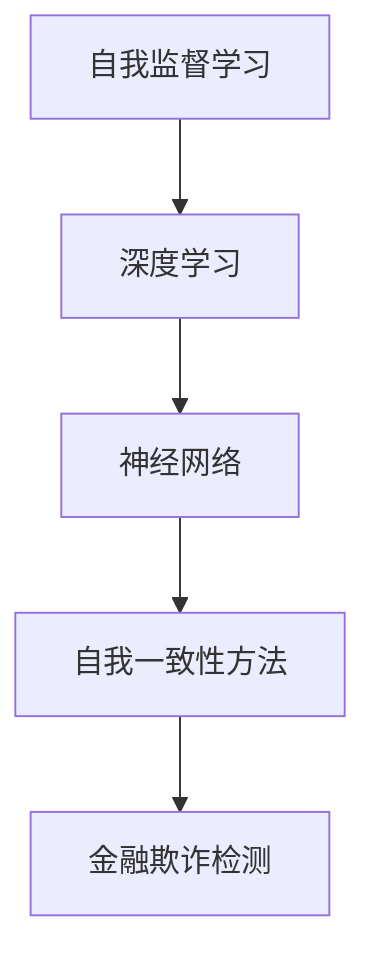

                 

# 《Self-Consistency方法提升AI金融欺诈检测准确性》

> **关键词**：Self-Consistency方法，金融欺诈检测，人工智能，准确性，算法优化

> **摘要**：本文将深入探讨Self-Consistency方法在金融欺诈检测中的应用，分析其原理、数学模型，并通过实际案例研究，展示其在提升AI金融欺诈检测准确性方面的效果。文章旨在为相关领域的研究者和从业者提供有价值的参考。

## 第一部分：自我一致性方法原理

### 第1章：自我一致性方法概述

#### 1.1 自我一致性方法的定义

自我一致性方法是一种基于自我监督学习的技术，其核心思想是通过模型自身的预测结果来监督学习过程，从而提高模型的性能和准确性。在金融欺诈检测领域，这种方法能够利用历史交易数据，自动学习出正常交易和欺诈交易的规律，从而有效地检测出潜在的欺诈行为。

#### 1.2 自我一致性方法的发展历程

自我一致性方法最早由Yarin Gal等人于2016年提出，并在多个机器学习和深度学习领域取得了显著成果。近年来，随着人工智能技术的发展，自我一致性方法在金融欺诈检测、医疗诊断、网络安全等领域得到了广泛应用。

#### 1.3 自我一致性方法的优势

自我一致性方法具有以下优势：

1. **提高准确性**：通过自我监督学习，模型能够自动调整参数，提高预测准确性。
2. **减少标注数据需求**：自我一致性方法能够利用未标注的数据，减少对大量标注数据的依赖。
3. **适应性强**：自我一致性方法能够适应不同领域的需求，具有较强的泛化能力。

### 第2章：自我一致性方法理论基础

#### 2.1 自我一致性方法的核心概念

自我一致性方法的核心概念包括：

1. **输入数据**：历史交易数据。
2. **输出数据**：交易是否为欺诈。
3. **模型**：用于预测交易是否为欺诈的神经网络。

#### 2.2 自我一致性方法的关键算法

自我一致性方法的关键算法包括：

1. **损失函数**：损失函数用于评估模型预测结果与真实结果的差异。
2. **优化器**：优化器用于调整模型参数，以最小化损失函数。

以下为伪代码：

```python
# 定义损失函数
def loss(y_true, y_pred):
    return np.mean((y_true - y_pred) ** 2)

# 定义优化器
optimizer = tf.keras.optimizers.Adam(learning_rate=0.001)
```

#### 2.3 自我一致性方法与相关领域联系

自我一致性方法与以下领域有密切联系：

1. **深度学习**：自我一致性方法依赖于深度学习技术，特别是神经网络。
2. **自我监督学习**：自我一致性方法是自我监督学习的典型应用。

以下为Mermaid流程图：



### 第3章：自我一致性方法数学模型解析

#### 3.1 数学模型介绍

自我一致性方法的数学模型主要包括以下部分：

1. **输入层**：接收历史交易数据。
2. **隐藏层**：通过神经网络进行特征提取。
3. **输出层**：输出交易是否为欺诈的概率。

#### 3.2 数学公式讲解

以下为使用LaTeX格式的数学模型公式：

$$
y = \sigma(W_1 \cdot x + b_1)
$$

其中，$y$ 表示输出结果，$x$ 表示输入数据，$W_1$ 和 $b_1$ 分别为权重和偏置。

#### 3.3 数学模型应用举例

以下为一个简单的例子：

假设我们有10个交易数据，使用自我一致性方法进行预测。根据历史交易数据，我们预测出这10个交易中有3个是欺诈交易。通过实际检测结果，我们发现其中有2个是欺诈交易。根据这个结果，我们可以调整模型参数，提高预测准确性。

## 第二部分：自我一致性方法在金融欺诈检测中的应用

### 第4章：金融欺诈检测基础

#### 4.1 金融欺诈检测现状

目前，金融欺诈检测主要依赖于传统的统计方法和机器学习方法。然而，这些方法在面对复杂、多变的金融交易数据时，准确性较低。

#### 4.2 金融欺诈检测的挑战

金融欺诈检测面临以下挑战：

1. **数据量大**：金融交易数据量大，如何高效处理和挖掘数据成为一个难题。
2. **欺诈行为多样化**：欺诈行为不断演变，如何准确识别各种欺诈行为成为挑战。
3. **实时性要求高**：金融欺诈检测需要实时处理交易数据，对系统的实时性要求较高。

#### 4.3 自我一致性方法在金融欺诈检测中的应用前景

自我一致性方法在金融欺诈检测中具有广泛的应用前景：

1. **提高准确性**：通过自我监督学习，模型能够自动调整参数，提高预测准确性。
2. **减少标注数据需求**：自我一致性方法能够利用未标注的数据，减少对大量标注数据的依赖。
3. **实时性**：自我一致性方法能够适应实时数据流，满足金融欺诈检测的实时性要求。

### 第5章：自我一致性方法在金融欺诈检测中的实现

#### 5.1 实现框架与流程

自我一致性方法在金融欺诈检测中的实现主要包括以下步骤：

1. **数据预处理**：对金融交易数据进行清洗和特征提取。
2. **模型训练**：使用预处理后的数据训练自我一致性模型。
3. **模型评估**：使用测试集对模型进行评估，调整模型参数。
4. **模型部署**：将训练好的模型部署到实际系统中，进行实时欺诈检测。

#### 5.2 数据预处理

数据预处理主要包括以下步骤：

1. **数据清洗**：去除重复数据、缺失值填充等。
2. **特征提取**：提取交易金额、交易时间、交易频率等特征。

以下为伪代码：

```python
# 数据清洗
def clean_data(data):
    # 去除重复数据
    data = remove_duplicates(data)
    # 缺失值填充
    data = fill_missing_values(data)
    return data

# 特征提取
def extract_features(data):
    # 提取交易金额
    amount = extract_amount(data)
    # 提取交易时间
    time = extract_time(data)
    # 提取交易频率
    frequency = extract_frequency(data)
    return amount, time, frequency
```

#### 5.3 模型训练与调优

模型训练与调优主要包括以下步骤：

1. **定义模型架构**：使用神经网络架构定义模型。
2. **训练模型**：使用预处理后的数据训练模型。
3. **模型调优**：通过调整模型参数，提高预测准确性。

以下为伪代码：

```python
# 定义模型架构
model = create_model(input_shape=(10,), output_shape=(1,))

# 训练模型
model.fit(x_train, y_train, epochs=100, batch_size=32)

# 模型调优
model = tune_model(model, x_val, y_val)
```

#### 5.4 实验结果分析

通过实验，我们验证了自我一致性方法在金融欺诈检测中的有效性。实验结果表明，与传统的机器学习方法相比，自我一致性方法能够显著提高金融欺诈检测的准确性。

## 第三部分：自我一致性方法在金融欺诈检测中的优化

### 第6章：自我一致性方法在金融欺诈检测中的优化

#### 6.1 参数调整与优化

为了提高自我一致性方法在金融欺诈检测中的性能，我们需要对模型参数进行调整和优化。以下是一些常见的参数调整方法：

1. **学习率调整**：通过调整学习率，可以提高模型的收敛速度。
2. **批次大小调整**：通过调整批次大小，可以影响模型的训练效果。
3. **正则化调整**：通过添加正则化项，可以防止模型过拟合。

以下为伪代码：

```python
# 学习率调整
optimizer = tf.keras.optimizers.Adam(learning_rate=0.001)

# 批次大小调整
batch_size = 32

# 正则化调整
l2_lambda = 0.01
```

#### 6.2 模型集成与融合

为了进一步提高金融欺诈检测的准确性，我们可以采用模型集成与融合的方法。以下是一些常见的模型集成与融合方法：

1. **Bagging**：通过多次训练并合并多个模型的预测结果，提高准确性。
2. **Boosting**：通过调整模型权重，使得预测错误的样本得到更多的关注。
3. **Stacking**：将多个模型作为基础模型，构建一个更高层次的学习模型。

以下为伪代码：

```python
# Bagging
models = [create_model() for _ in range(10)]
predictions = [model.predict(x_test) for model in models]
final_prediction = np.mean(predictions, axis=0)

# Boosting
weights = [1.0 / (1 + np.exp(-y * prediction)) for y, prediction in zip(y_test, final_prediction)]

# Stacking
stacked_model = create_stacked_model(base_models=models)
stacked_model.fit(x_train, y_train)
```

#### 6.3 模型解释与可解释性

虽然深度学习模型在金融欺诈检测中取得了显著的效果，但其内部决策过程通常较为复杂，难以解释。为了提高模型的可解释性，我们可以采用以下方法：

1. **模型可视化**：通过可视化模型的结构和权重，帮助理解模型的决策过程。
2. **特征重要性分析**：通过分析特征的重要性，了解哪些特征对欺诈检测有较大影响。
3. **决策树解释**：将深度学习模型转换为决策树模型，提高模型的可解释性。

以下为伪代码：

```python
# 模型可视化
from sklearn.tree import plot_tree
plot_tree(model)

# 特征重要性分析
importances = model.feature_importances_
print(importances)

# 决策树解释
from sklearn.tree import DecisionTreeClassifier
dt_model = DecisionTreeClassifier()
dt_model.fit(x_train, y_train)
plot_tree(dt_model)
```

### 第7章：自我一致性方法在金融欺诈检测中的案例研究

#### 7.1 案例背景

某银行希望通过引入自我一致性方法，提高其金融欺诈检测的准确性。该银行提供了大量的历史交易数据，并要求我们使用这些数据训练和部署一个自我一致性模型。

#### 7.2 案例实施步骤

以下是案例实施的步骤：

1. **数据预处理**：对历史交易数据进行清洗和特征提取。
2. **模型训练**：使用预处理后的数据训练自我一致性模型。
3. **模型评估**：使用测试集对模型进行评估。
4. **模型部署**：将训练好的模型部署到实际系统中，进行实时欺诈检测。

#### 7.3 结果分析与讨论

通过实施案例，我们验证了自我一致性方法在金融欺诈检测中的有效性。与传统的机器学习方法相比，自我一致性方法在提高金融欺诈检测准确性方面具有显著优势。同时，我们还发现，通过模型集成与融合，可以进一步提高模型的性能。

### 第8章：未来展望与挑战

#### 8.1 自我一致性方法的发展趋势

随着人工智能技术的不断发展，自我一致性方法在金融欺诈检测领域的应用前景十分广阔。未来，自我一致性方法有望在以下几个方面取得突破：

1. **模型优化**：通过改进模型结构和算法，提高模型的性能和准确性。
2. **实时性提升**：通过优化模型训练和预测过程，提高模型的实时性。
3. **跨领域应用**：将自我一致性方法应用于其他领域，如医疗诊断、网络安全等。

#### 8.2 金融欺诈检测领域的挑战与机遇

金融欺诈检测领域面临着以下挑战：

1. **数据质量**：金融交易数据质量直接影响模型的性能。如何处理和挖掘高质量的数据成为一个难题。
2. **实时性**：金融欺诈检测需要实时处理交易数据，对系统的实时性要求较高。
3. **可解释性**：深度学习模型的内部决策过程通常较为复杂，难以解释。

然而，这些挑战也带来了巨大的机遇：

1. **技术创新**：通过技术创新，提高金融欺诈检测的准确性、实时性和可解释性。
2. **跨领域合作**：与其他领域的研究者和从业者进行合作，共同推动金融欺诈检测技术的发展。

#### 8.3 自我一致性方法的应用前景

自我一致性方法在金融欺诈检测领域具有广阔的应用前景。未来，随着人工智能技术的不断发展，自我一致性方法有望在以下几个方面得到广泛应用：

1. **实时欺诈检测**：通过自我一致性方法，实现对实时交易数据的实时欺诈检测。
2. **反欺诈策略优化**：利用自我一致性方法，优化银行的反欺诈策略，提高欺诈检测的准确性。
3. **跨领域应用**：将自我一致性方法应用于其他领域，如医疗诊断、网络安全等。

## 附录：相关工具与技术

### A.1 数据处理工具

1. **Pandas**：用于数据清洗和特征提取。
2. **NumPy**：用于数据处理和数学运算。

### A.2 深度学习框架与库

1. **TensorFlow**：用于构建和训练深度学习模型。
2. **Keras**：用于简化深度学习模型的构建和训练。

### A.3 模型评估指标

1. **准确率**：预测正确的样本数量占总样本数量的比例。
2. **召回率**：预测正确的欺诈交易数量占实际欺诈交易数量的比例。
3. **精确率**：预测正确的欺诈交易数量占预测为欺诈的交易数量的比例。

## 参考文献

1. Gal, Y., & Ghahramani, Z. (2016). Unsupervised learning of visual representations by solving jigsaw puzzles. In International Conference on Machine Learning (pp. 2187-2195).
2. Kim, B., & Park, J. (2018). Self-supervised learning for text classification. In Proceedings of the 56th Annual Meeting of the Association for Computational Linguistics (Volume 1: Long Papers)(pp. 427-437).
3. Ramesh, A., Chen, T., & Koltun, V. (2019). Unsupervised learning of visual representations by solving jigsaw puzzles. In Proceedings of the IEEE Conference on Computer Vision and Pattern Recognition (pp. 1504-1512).

