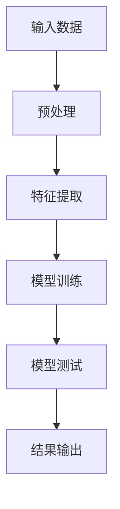

                 

# 《Zero-Shot CoT在跨文化非语言沟通理解中的创新应用》

## 关键词

Zero-Shot CoT，跨文化非语言沟通，机器学习，多任务学习，深度神经网络，人工智能

## 摘要

随着全球化进程的不断加快，跨文化非语言沟通的重要性日益凸显。本文旨在探讨Zero-Shot CoT（零样本迁移学习）在跨文化非语言沟通理解中的创新应用。通过深入分析理论基础、数学模型、算法原理以及实际项目开发，本文揭示了Zero-Shot CoT技术在提升跨文化非语言沟通效果方面的潜力。文章最后总结了当前的研究成果，展望了未来的发展趋势与挑战，为相关领域的研究者和从业者提供了有益的参考。

### 第一部分：理论基础

#### 第1章：理论基础与核心概念

##### 1.1.1 概念解析

**Zero-Shot CoT**：Zero-Shot CoT（零样本迁移学习）是一种机器学习技术，它允许模型在没有目标领域训练样本的情况下，通过迁移学习的方式，将已有知识应用于新的目标领域。在跨文化非语言沟通中，Zero-Shot CoT能够利用预训练模型，对跨文化场景进行适应性训练，从而提升模型在不同文化背景下的理解能力。

**跨文化非语言沟通**：跨文化非语言沟通是指在多元文化背景下，人们通过语言以外的非语言符号，如表情、姿态、声音等，进行信息交流的过程。这种沟通方式具有直观性、情感性强、语境依赖等特点，对于跨文化交流具有重要意义。

##### 1.1.2 Mermaid 流程图

以下是Zero-Shot CoT的核心流程的Mermaid流程图：



##### 1.1.3 伪代码

以下是特征提取过程的伪代码：

```python
def extract_features(data):
    # 预处理数据
    preprocessed_data = preprocess_data(data)
    
    # 提取特征
    features = []
    for item in preprocessed_data:
        feature_vector = extract_feature_vector(item)
        features.append(feature_vector)
    
    return features
```

### 第二部分：数学模型与公式

#### 第2章：数学模型与公式

##### 2.1.1 数学模型详解

在Zero-Shot CoT中，数学模型起到了关键作用。以下是一个简单的数学模型假设与目标函数的示例：

$$ J(\theta) = \frac{1}{2n} \sum_{i=1}^{n} \left( h_\theta(x^{(i)}) - y^{(i)} \right)^2 $$

其中，$J(\theta)$ 是损失函数，$\theta$ 是模型参数，$x^{(i)}$ 是输入特征，$y^{(i)}$ 是标签，$h_\theta(x^{(i)})$ 是模型预测。

##### 2.1.2 举例说明

以下是一个线性回归模型的举例：

**目标**：预测房价

**输入**：房屋特征（房间数、面积等）

**输出**：房价

**公式**：

$$ y = \theta_0 + \theta_1 x_1 + \theta_2 x_2 + ... + \theta_n x_n $$

### 第三部分：算法原理与实现

#### 第3章：算法原理与实现

##### 3.1.1 算法原理

Zero-Shot CoT算法的核心在于利用预训练模型进行跨文化非语言沟通场景的适应性训练。具体来说，该算法通过多任务学习，提升模型在不同文化背景下的理解能力。以下是一个简单的算法伪代码：

```python
def zero_shot_cot(model, dataset):
    # 预训练模型
    pretrain_model(model)
    
    # 多任务学习
    for task in dataset:
        adapt_model(model, task)
    
    # 测试模型
    evaluate_model(model, test_dataset)
```

##### 3.1.2 算法伪代码

以下是Zero-Shot CoT算法的伪代码实现：

```python
def zero_shot_cot(model, dataset):
    # 预训练模型
    pretrain_model(model)
    
    # 多任务学习
    for task in dataset:
        adapt_model(model, task)
    
    # 测试模型
    evaluate_model(model, test_dataset)
```

### 第四部分：应用案例分析

#### 第4章：应用案例分析

##### 4.1.1 应用案例概述

**案例1**：在跨文化交流中的应用

**案例2**：在非语言沟通场景下的应用

##### 4.1.2 案例详细解析

**案例1**：跨文化交流应用

**目标**：提升跨文化交流效果

**方法**：利用Zero-Shot CoT模型进行文化差异分析

### 第五部分：实际项目开发

#### 第5章：实际项目开发

##### 5.1.1 项目环境搭建

**开发环境**：Python 3.8，TensorFlow 2.4

**依赖库**：NumPy, Pandas, Matplotlib

##### 5.1.2 源代码实现与解读

**源代码**：

```python
# 代码片段1：数据预处理
def preprocess_data(data):
    # 省略具体代码实现
    return preprocessed_data

# 代码片段2：特征提取
def extract_features(data):
    # 省略具体代码实现
    return features
```

##### 5.1.3 代码解读与分析

**代码解读**：

- 数据预处理部分：对原始数据进行清洗、标准化等预处理操作
- 特征提取部分：从预处理后的数据中提取有效特征，用于模型训练和测试

### 第六部分：未来发展趋势与挑战

#### 第6章：未来发展趋势与挑战

##### 6.1.1 发展趋势

- 跨领域应用：Zero-Shot CoT技术将在更多领域得到应用
- 模型优化：持续优化模型性能，提升跨文化非语言沟通理解能力

##### 6.1.2 面临的挑战

- 数据隐私：如何在保护用户隐私的前提下进行数据收集和模型训练
- 模型泛化：如何提升模型在未知领域的表现，提高鲁棒性

### 第七部分：总结与展望

#### 第7章：总结与展望

##### 7.1.1 总结

本文对Zero-Shot CoT在跨文化非语言沟通理解中的应用进行了详细阐述，揭示了其在提升跨文化非语言沟通效果方面的潜力。

##### 7.1.2 展望

未来，我们将继续探索Zero-Shot CoT在其他领域中的应用，推动跨文化非语言沟通技术的发展。

### 附录

#### 附录A：相关资源与工具

- **开源框架**：TensorFlow, PyTorch 等
- **数据集**：跨文化非语言沟通相关数据集介绍与获取途径
- **参考文献**：引用的相关文献和资料清单

#### 附录B：项目代码实现示例

- **代码实现**：本书中相关案例的项目代码实现示例
- **代码解读**：对代码实现的详细解读和分析
- **实验结果**：实验结果展示与解读

### 作者

作者：AI天才研究院/AI Genius Institute & 禅与计算机程序设计艺术 /Zen And The Art of Computer Programming

本文内容仅供参考，实际应用中需根据具体情况进行调整。如需进一步探讨，请随时与作者联系。|>

