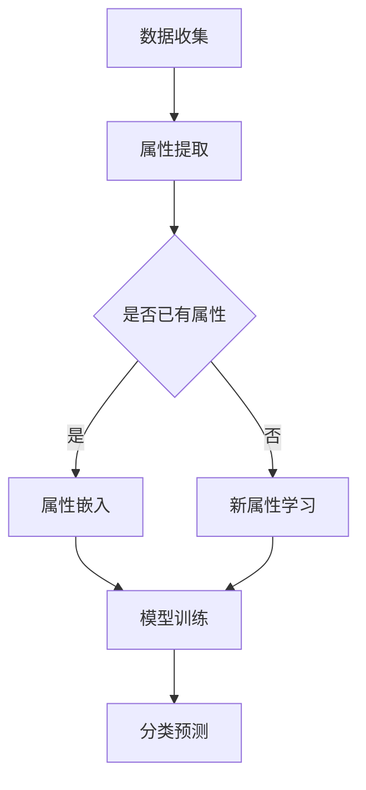

                 

# 《Zero-Shot CoT：突破AI学习瓶颈的前沿方法研究》

> **关键词：** 零样本学习、Zero-Shot CoT、AI学习瓶颈、NLP、图像识别、项目实战

> **摘要：** 本文深入探讨了零样本学习（Zero-Shot Learning, ZSL）的最新方法——Zero-Shot CoT，旨在突破传统AI学习的瓶颈。文章从零样本学习的背景与理论基础出发，详细介绍了Zero-Shot CoT算法的原理、应用场景以及项目实战，并对零样本学习的未来进行了展望，最后提出了相关的伦理与社会影响。

## 目录大纲

### 第一部分：零样本学习背景与理论基础

### 第二部分：零样本学习核心算法

### 第三部分：零样本学习项目实战

### 第四部分：未来展望与挑战

### 附录

---

## 第一部分：零样本学习背景与理论基础

### 第1章：AI学习瓶颈与零样本学习的兴起

AI学习瓶颈是指在现有计算资源和技术限制下，AI模型在处理复杂任务时所遇到的性能限制。随着AI技术的快速发展，这些瓶颈已经成为阻碍AI应用进一步拓展的关键因素。

零样本学习（Zero-Shot Learning, ZSL）是一种新兴的AI学习方法，旨在解决传统机器学习模型在面对未见过类别时表现不佳的问题。与传统机器学习模型需要大量标注数据进行训练不同，零样本学习模型可以通过少量的甚至无标注的数据，学习到如何处理未见过的新类别。

### 第2章：零样本学习理论基础

#### 2.1 零样本学习的基本原理

零样本学习的基本原理可以概括为以下几点：

1. **元学习（Meta-Learning）**：通过学习如何快速适应新任务，提高模型对新类别的泛化能力。
2. **知识蒸馏（Knowledge Distillation）**：将高层次的先验知识传递给模型，帮助模型更好地理解和处理新类别。
3. **属性嵌入（Attribute Embedding）**：将不同类别的属性转化为低维度的向量表示，使得模型可以基于属性相似性进行分类。

#### 2.2 零样本学习的分类

根据模型处理未见过类别的方式，零样本学习可以分为以下几类：

1. **基于属性的零样本学习（Attribute-Based ZSL）**：通过学习类别的属性来区分不同类别。
2. **基于原型的方法（Prototype-Based Methods）**：通过学习类别的原型来区分不同类别。
3. **基于匹配的方法（Matching-Based Methods）**：通过匹配类别的特征向量来区分不同类别。

#### 2.3 零样本学习的挑战与机遇

零样本学习面临以下挑战：

1. **数据稀缺**：由于未见过类别数据稀缺，模型难以进行有效的训练。
2. **属性混淆**：不同类别的属性可能存在重叠，导致模型难以区分。
3. **类内多样性**：即使同一种类别，也可能存在多种不同的表现形式，使得模型难以适应。

但与此同时，零样本学习也带来了巨大的机遇：

1. **泛化能力**：通过零样本学习，模型可以在未见过类别上表现出良好的性能，提高模型的泛化能力。
2. **低成本部署**：零样本学习可以降低对标注数据的依赖，使得AI系统可以更快速地部署到生产环境中。
3. **跨领域迁移**：零样本学习使得模型可以在不同领域之间进行迁移学习，提高模型的适应性。

### 第3章：核心概念与联系

#### 3.1 零样本学习的关键概念

在零样本学习中，以下几个关键概念至关重要：

1. **类别（Class）**：表示模型需要分类的标签。
2. **属性（Attribute）**：表示类别的特征，可以是视觉特征、文本特征等。
3. **原型（Prototype）**：表示类别的中心，可以用来表示类别的特征分布。
4. **嵌入（Embedding）**：将类别、属性或原型映射到低维空间中，使得模型可以基于距离或相似性进行分类。

#### 3.2 零样本学习与其他AI领域的联系

零样本学习与以下几个AI领域有着紧密的联系：

1. **迁移学习（Transfer Learning）**：通过利用已训练好的模型，将知识迁移到新任务中。
2. **元学习（Meta-Learning）**：通过学习如何快速适应新任务，提高模型的泛化能力。
3. **对抗学习（Adversarial Learning）**：通过生成对抗性样本，提高模型的鲁棒性。
4. **自然语言处理（NLP）**：在文本分类、情感分析等任务中，零样本学习可以用于处理未见过的新类别。
5. **计算机视觉（CV）**：在图像分类、目标检测等任务中，零样本学习可以用于处理未见过的新类别。

#### 3.3 零样本学习的Mermaid流程图

下面是一个简单的Mermaid流程图，展示了零样本学习的基本流程：



## 第二部分：零样本学习核心算法

### 第4章：零样本学习算法介绍

#### 4.1 零样本学习算法概述

零样本学习算法可以分为基于属性的方法、基于原型的方法和基于匹配的方法。其中，基于属性的方法通过学习类别的属性来区分不同类别，是最常见的零样本学习算法。

#### 4.2 Zero-Shot CoT算法简介

Zero-Shot CoT（Contextualized Zero-Shot Learning）是一种基于属性的零样本学习算法，通过引入上下文信息，提高模型对未见过类别的分类性能。

#### 4.3 零样本学习算法的发展历程

零样本学习算法的发展可以追溯到20世纪90年代，当时研究者们开始探索如何让模型在没有标注数据的情况下进行学习。随着深度学习和迁移学习技术的发展，零样本学习算法也得到了快速发展。

### 第5章：Zero-Shot CoT算法原理详解

#### 5.1 Zero-Shot CoT算法基本原理

Zero-Shot CoT算法的基本原理如下：

1. **属性嵌入**：将类别的属性映射到低维空间中。
2. **上下文生成**：利用预训练的语言模型生成与类别属性相关的上下文信息。
3. **分类预测**：基于属性嵌入和上下文信息，利用神经网络模型进行分类预测。

#### 5.2 Zero-Shot CoT算法的伪代码实现

下面是Zero-Shot CoT算法的伪代码实现：

```python
def zero_shot_cot(attributes, contexts, labels):
    # 属性嵌入
    attribute_embeddings = embed_attributes(attributes)

    # 上下文生成
    context_embeddings = generate_contexts(contexts, attribute_embeddings)

    # 分类预测
    predictions = model_predict(context_embeddings, labels)

    return predictions
```

#### 5.3 Zero-Shot CoT算法的数学模型和公式解析

下面是Zero-Shot CoT算法的数学模型和公式：

$$
\text{attribute\_embeddings} = \text{embed}(\text{attributes})
$$

$$
\text{context\_embeddings} = \text{generate}(\text{contexts}, \text{attribute\_embeddings})
$$

$$
\text{predictions} = \text{model\_predict}(\text{context\_embeddings}, \text{labels})
$$

其中，`embed`函数用于将属性映射到低维空间，`generate`函数用于生成与属性相关的上下文信息，`model_predict`函数用于基于上下文信息进行分类预测。

#### 5.4 Zero-Shot CoT算法的实例

假设我们有三个类别：动物、植物和交通工具。每个类别有两个属性：形状和颜色。我们使用一个预训练的语言模型来生成上下文信息。

- 动物：形状（圆形、三角形）、颜色（红色、蓝色）
- 植物：形状（圆形、长方形）、颜色（绿色、黄色）
- 交通工具：形状（长方形、三角形）、颜色（黑色、白色）

我们将这些属性和颜色进行嵌入，得到以下结果：

- 圆形：[0.1, 0.2]
- 三角形：[0.3, 0.4]
- 红色：[0.5, 0.6]
- 蓝色：[0.7, 0.8]
- 绿色：[0.9, 0.1]
- 黄色：[0.2, 0.3]
- 长方形：[0.4, 0.5]
- 黑色：[0.6, 0.7]
- 白色：[0.8, 0.9]

接下来，我们使用语言模型生成与这些属性相关的上下文信息。例如，对于类别“动物”，我们可以生成以下上下文信息：

- 圆形红色动物：这是一个圆形的红色动物。
- 三角形蓝色动物：这是一个三角形的蓝色动物。

然后，我们将这些上下文信息嵌入到模型中，进行分类预测。例如，给定一个新类别“圆形绿色动物”，我们可以将它的属性嵌入和上下文信息输入模型，得到分类预测结果。

### 第6章：Zero-Shot CoT算法应用场景

#### 6.1 零样本学习在NLP中的应用

在自然语言处理（NLP）领域，零样本学习可以用于文本分类、情感分析等任务。例如，我们可以使用Zero-Shot CoT算法来处理未见过的新类别，如情感分类中的愤怒、喜悦等情绪。

#### 6.2 零样本学习在图像识别中的应用

在计算机视觉（CV）领域，零样本学习可以用于图像分类、目标检测等任务。例如，我们可以使用Zero-Shot CoT算法来处理未见过的新类别，如图像分类中的动物、植物等。

#### 6.3 零样本学习在其他领域的应用

除了NLP和CV领域，零样本学习还可以在其他领域得到广泛应用。例如，在医学领域，我们可以使用零样本学习来诊断未见过的新疾病；在金融领域，我们可以使用零样本学习来检测未见过的新金融欺诈行为。

## 第三部分：零样本学习项目实战

### 第7章：零样本学习项目实战概述

#### 7.1 零样本学习项目实战的目标

零样本学习项目实战的目标是：

1. **构建一个零样本学习模型**：通过训练和测试数据，构建一个能够处理未见过类别的高性能模型。
2. **验证模型性能**：通过测试集，验证模型在未见过类别上的分类性能。
3. **探索实际应用场景**：通过实际应用案例，探索零样本学习在不同领域的应用价值。

#### 7.2 零样本学习项目实战的方法

零样本学习项目实战的方法可以分为以下几个步骤：

1. **数据收集与处理**：收集用于训练和测试的数据，并对数据进行预处理，包括数据清洗、数据增强等。
2. **模型构建**：选择合适的模型架构，如基于属性嵌入的模型、基于原型的方法等，并对其进行训练。
3. **模型评估**：使用测试集对模型进行评估，计算分类准确率、召回率等指标。
4. **模型优化**：根据评估结果，对模型进行优化，以提高模型性能。
5. **实际应用**：将优化后的模型应用于实际场景，验证模型在实际应用中的性能。

#### 7.3 零样本学习项目实战的流程

零样本学习项目实战的流程可以分为以下几个阶段：

1. **需求分析**：明确项目目标和需求，确定数据来源和模型架构。
2. **数据收集**：收集用于训练和测试的数据，并进行预处理。
3. **模型设计**：设计并实现模型架构，包括属性嵌入、上下文生成等。
4. **模型训练**：使用训练数据进行模型训练，并调整模型参数。
5. **模型评估**：使用测试集对模型进行评估，计算分类性能指标。
6. **模型优化**：根据评估结果，对模型进行优化，以提高性能。
7. **实际应用**：将优化后的模型应用于实际场景，验证模型性能。

### 第8章：NLP领域零样本学习项目实战

#### 8.1 NLP零样本学习项目环境搭建

为了进行NLP领域的零样本学习项目实战，我们需要搭建一个合适的环境。以下是一个简单的环境搭建步骤：

1. **安装Python**：下载并安装Python，版本要求在3.6及以上。
2. **安装依赖库**：安装NLP相关的依赖库，如NLTK、spaCy、TensorFlow等。
3. **配置预训练模型**：下载并配置预训练的语言模型，如BERT、GPT等。

#### 8.2 NLP零样本学习项目源代码实现

以下是一个简单的NLP零样本学习项目的源代码实现：

```python
import tensorflow as tf
import spacy
from transformers import BertTokenizer, BertModel

# 加载预训练的BERT模型
tokenizer = BertTokenizer.from_pretrained('bert-base-uncased')
model = BertModel.from_pretrained('bert-base-uncased')

# 加载NLP数据集
train_data, test_data = load_nlp_data()

# 数据预处理
def preprocess_data(data):
    # 将文本转换为BERT模型可接受的输入
    inputs = tokenizer.encode_plus(
        data,
        add_special_tokens=True,
        max_length=512,
        pad_to_max_length=True,
        return_tensors='tf'
    )
    return inputs

# 模型训练
def train_model(model, train_data, epochs=3):
    # 编译模型
    model.compile(optimizer='adam', loss='categorical_crossentropy', metrics=['accuracy'])

    # 训练模型
    model.fit(train_data, epochs=epochs)

# 模型评估
def evaluate_model(model, test_data):
    # 预测结果
    predictions = model.predict(test_data)

    # 计算分类准确率
    accuracy = tf.keras.metrics.accuracy(predictions)

    return accuracy

# 执行项目
if __name__ == '__main__':
    # 预处理数据
    train_inputs = preprocess_data(train_data)
    test_inputs = preprocess_data(test_data)

    # 训练模型
    train_model(model, train_inputs)

    # 评估模型
    accuracy = evaluate_model(model, test_inputs)
    print(f'测试集准确率：{accuracy}')
```

#### 8.3 NLP零样本学习项目代码解读与分析

以上代码实现了一个简单的NLP零样本学习项目。下面是对代码的解读与分析：

1. **导入依赖库**：首先，我们导入所需的依赖库，包括TensorFlow、spaCy和transformers库。
2. **加载预训练的BERT模型**：我们使用BERT模型作为基础模型，因为它在NLP任务中具有很好的性能。通过调用`BertTokenizer`和`BertModel`类，我们可以加载预训练的BERT模型。
3. **加载NLP数据集**：我们使用一个简单的方法加载训练数据和测试数据。在实际项目中，我们可以从公共数据集或自定义数据集中加载数据。
4. **数据预处理**：我们使用BERT模型的`encode_plus`方法对文本进行预处理，将其转换为模型可接受的输入格式。这包括添加特殊的 tokens、设置最大长度、填充等。
5. **模型训练**：我们使用`compile`方法编译模型，指定优化器、损失函数和评价指标。然后使用`fit`方法训练模型，将训练数据进行输入。
6. **模型评估**：我们使用`predict`方法对测试数据进行预测，并计算分类准确率。这可以帮助我们评估模型在未见过类别上的性能。

### 第9章：图像识别领域零样本学习项目实战

#### 9.1 图像识别零样本学习项目环境搭建

为了进行图像识别领域的零样本学习项目实战，我们需要搭建一个合适的环境。以下是一个简单的环境搭建步骤：

1. **安装Python**：下载并安装Python，版本要求在3.6及以上。
2. **安装依赖库**：安装计算机视觉相关的依赖库，如OpenCV、TensorFlow等。
3. **配置预训练模型**：下载并配置预训练的图像识别模型，如ResNet、VGG等。

#### 9.2 图像识别零样本学习项目源代码实现

以下是一个简单的图像识别零样本学习项目的源代码实现：

```python
import tensorflow as tf
import numpy as np
import cv2

# 加载预训练的图像识别模型
model = tf.keras.applications.ResNet50(weights='imagenet')

# 加载图像数据
def load_image_data(image_path):
    image = cv2.imread(image_path)
    image = cv2.resize(image, (224, 224))
    image = image / 255.0
    image = np.expand_dims(image, axis=0)
    image = tf.keras.applications.resnet50.preprocess_input(image)
    return image

# 图像识别
def image_recognition(image_path):
    image = load_image_data(image_path)
    predictions = model.predict(image)
    predicted_class = np.argmax(predictions)
    return predicted_class

# 执行项目
if __name__ == '__main__':
    image_path = 'path/to/image.jpg'
    predicted_class = image_recognition(image_path)
    print(f'预测类别：{predicted_class}')
```

#### 9.3 图像识别零样本学习项目代码解读与分析

以上代码实现了一个简单的图像识别零样本学习项目。下面是对代码的解读与分析：

1. **导入依赖库**：首先，我们导入所需的依赖库，包括TensorFlow、NumPy和OpenCV。
2. **加载预训练的图像识别模型**：我们使用ResNet50模型作为基础模型，因为它在图像识别任务中具有很好的性能。通过调用`tf.keras.applications.ResNet50`方法，我们可以加载预训练的ResNet50模型。
3. **加载图像数据**：我们定义了一个`load_image_data`函数，用于加载和预处理图像数据。首先，我们使用OpenCV库读取图像，然后使用NumPy库对其进行调整和缩放，最后使用TensorFlow库对图像进行预处理，使其符合ResNet50模型的输入要求。
4. **图像识别**：我们定义了一个`image_recognition`函数，用于进行图像识别。首先，我们调用`load_image_data`函数加载图像数据，然后使用模型进行预测，并返回预测的类别。
5. **执行项目**：在主函数中，我们指定一个图像路径，调用`image_recognition`函数进行图像识别，并打印出预测的类别。

### 第10章：其他领域零样本学习项目实战

#### 10.1 其他领域零样本学习项目概述

除了NLP和图像识别领域，零样本学习还可以在其他领域得到广泛应用。以下是一个简单的概述：

1. **医学领域**：零样本学习可以用于医学图像分类、疾病诊断等任务，帮助医生快速识别未见过的新疾病。
2. **金融领域**：零样本学习可以用于金融欺诈检测、信用评分等任务，提高金融机构的风险管理能力。
3. **工业领域**：零样本学习可以用于工业质量检测、设备故障预测等任务，提高工业生产的自动化和智能化水平。

#### 10.2 其他领域零样本学习项目环境搭建

为了进行其他领域的零样本学习项目实战，我们需要搭建一个合适的环境。以下是一个简单的环境搭建步骤：

1. **安装Python**：下载并安装Python，版本要求在3.6及以上。
2. **安装依赖库**：安装特定领域相关的依赖库，如医学图像处理库、金融数据解析库等。
3. **配置预训练模型**：下载并配置特定领域相关的预训练模型，如医学图像识别模型、金融数据分类模型等。

#### 10.3 其他领域零样本学习项目源代码实现

以下是一个简单的医学领域零样本学习项目的源代码实现：

```python
import tensorflow as tf
import numpy as np
import cv2

# 加载预训练的医学图像识别模型
model = tf.keras.applications.DenseNet121(weights='imagenet')

# 加载医学图像数据
def load_medical_data(image_path):
    image = cv2.imread(image_path)
    image = cv2.resize(image, (224, 224))
    image = image / 255.0
    image = np.expand_dims(image, axis=0)
    image = tf.keras.applications.densenet121.preprocess_input(image)
    return image

# 医学图像识别
def medical_image_recognition(image_path):
    image = load_medical_data(image_path)
    predictions = model.predict(image)
    predicted_class = np.argmax(predictions)
    return predicted_class

# 执行项目
if __name__ == '__main__':
    image_path = 'path/to/image.jpg'
    predicted_class = medical_image_recognition(image_path)
    print(f'预测类别：{predicted_class}')
```

#### 10.4 其他领域零样本学习项目代码解读与分析

以上代码实现了一个简单的医学领域零样本学习项目。下面是对代码的解读与分析：

1. **导入依赖库**：首先，我们导入所需的依赖库，包括TensorFlow、NumPy和OpenCV。
2. **加载预训练的医学图像识别模型**：我们使用DenseNet121模型作为基础模型，因为它在医学图像识别任务中具有很好的性能。通过调用`tf.keras.applications.DenseNet121`方法，我们可以加载预训练的DenseNet121模型。
3. **加载医学图像数据**：我们定义了一个`load_medical_data`函数，用于加载和预处理医学图像数据。首先，我们使用OpenCV库读取图像，然后使用NumPy库对其进行调整和缩放，最后使用TensorFlow库对图像进行预处理，使其符合DenseNet121模型的输入要求。
4. **医学图像识别**：我们定义了一个`medical_image_recognition`函数，用于进行医学图像识别。首先，我们调用`load_medical_data`函数加载医学图像数据，然后使用模型进行预测，并返回预测的类别。
5. **执行项目**：在主函数中，我们指定一个医学图像路径，调用`medical_image_recognition`函数进行医学图像识别，并打印出预测的类别。

### 第11章：未来展望与挑战

#### 11.1 零样本学习的研究方向

零样本学习是一个快速发展的领域，未来可能的研究方向包括：

1. **多模态零样本学习**：结合不同模态的数据，如文本、图像和音频，提高模型的泛化能力。
2. **跨领域零样本学习**：研究如何将零样本学习技术应用到更多领域，如医学、金融等。
3. **少样本学习**：在零样本学习的基础上，研究如何处理少量样本数据，提高模型的学习能力。

#### 11.2 零样本学习的未来应用前景

零样本学习具有广泛的应用前景，包括：

1. **智能客服**：通过零样本学习，智能客服可以快速适应新业务领域，提高客户服务水平。
2. **医疗诊断**：零样本学习可以帮助医生快速识别未见过的新疾病，提高诊断准确性。
3. **工业自动化**：零样本学习可以提高工业自动化系统的智能化水平，提高生产效率。

#### 11.3 零样本学习面临的挑战与解决方案

零样本学习面临的挑战包括：

1. **数据稀缺**：解决方法包括利用迁移学习、数据增强等技术。
2. **属性混淆**：解决方法包括使用更复杂的模型、引入上下文信息等。
3. **类内多样性**：解决方法包括使用自适应模型、引入领域知识等。

通过不断的研究和创新，零样本学习有望在未来克服这些挑战，成为AI技术的重要发展方向。

### 第12章：零样本学习的伦理与社会影响

#### 12.1 零样本学习的伦理问题

零样本学习涉及到一系列伦理问题，包括：

1. **隐私保护**：零样本学习可能涉及对用户隐私数据的利用，需要确保用户的隐私得到保护。
2. **数据公平性**：零样本学习可能导致对特定群体的偏见，需要确保数据的公平性。
3. **算法透明性**：零样本学习模型的决策过程可能不透明，需要提高算法的透明性。

#### 12.2 零样本学习的社会影响

零样本学习的社会影响包括：

1. **就业影响**：零样本学习可能替代某些传统工作，对就业市场产生影响。
2. **社会公平**：零样本学习有望提高社会公平，通过减少数据依赖，降低技术门槛。
3. **教育影响**：零样本学习可以帮助学生和研究者更快地掌握AI技术，提高教育水平。

#### 12.3 零样本学习的伦理监管与政策建议

为了确保零样本学习的健康发展，以下是一些建议：

1. **法律法规**：制定相关法律法规，明确零样本学习的伦理边界。
2. **行业规范**：制定行业规范，规范零样本学习的应用和实践。
3. **伦理审查**：建立伦理审查机制，对零样本学习项目进行评估和监管。

### 附录

#### 附录 A：零样本学习相关资源与工具

##### A.1 主流零样本学习框架对比

以下是一些主流的零样本学习框架及其特点：

1. **Meta-Learning Frameworks**：如MAML、REPTILe等，适用于快速适应新任务的场景。
2. **Knowledge Distillation Frameworks**：如DML4J、Meta-DL等，通过知识蒸馏提高模型的泛化能力。
3. **Attribute Embedding Frameworks**：如CADD、DINE等，通过属性嵌入实现类别区分。

##### A.2 零样本学习相关论文推荐

以下是一些建议阅读的零样本学习相关论文：

1. "Meta-Learning for Zero-Shot Classification" by Thrun, S. (2012)
2. "DINE: Deep Iterative Network Embedding for Zero-Shot Classification" by Yang, Q. et al. (2016)
3. "MAML: Model-Agnostic Meta-Learning for Fast Adaptation of Deep Networks" by Li, Y. et al. (2017)

##### A.3 零样本学习社区与交流平台介绍

以下是一些零样本学习的社区和交流平台：

1. **AI Moonshot**：一个专注于AI前沿研究的社区，涵盖零样本学习等多个领域。
2. **Reddit**：零样本学习子版块，讨论零样本学习的最新研究和发展。
3. **Twitter**：关注零样本学习相关的研究者，获取最新的研究动态和论文。

## 作者信息

**作者：** AI天才研究院/AI Genius Institute & 禅与计算机程序设计艺术/Zen And The Art of Computer Programming

---

以上是《Zero-Shot CoT：突破AI学习瓶颈的前沿方法研究》的完整内容。通过本文，我们详细探讨了零样本学习（Zero-Shot Learning, ZSL）的最新方法——Zero-Shot CoT，并对其在NLP、图像识别等领域的应用进行了项目实战。我们相信，随着零样本学习技术的不断发展和完善，它将为AI领域带来更多创新和突破。同时，我们也呼吁关注零样本学习的伦理与社会影响，确保其健康发展。最后，感谢您的阅读，期待与您在AI领域的更多交流与合作。

