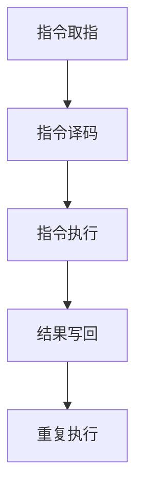

                 

## 第1章: MIPS架构的背景和重要性

### 1.1 MIPS架构的历史发展

MIPS（微程序指令集计算机）架构是由麻省理工学院（MIT）和斯坦福大学联合开发的，起源于1970年代。MIPS I是第一个版本，于1975年发布，标志着RISC（精简指令集计算）理念的开端。随后，MIPS II、MIPS III、MIPS IV和MIPS V等版本相继推出，每个版本都进行了优化和改进，增强了性能和功能。

- **MIPS I**：第一个版本，采用5级流水线设计，具备基本的RISC特性。
- **MIPS II**：增加了乘法和除法指令，进一步提高了性能。
- **MIPS III**：引入了哈佛结构，实现了指令和数据存储的分离，提高了数据处理的效率。
- **MIPS IV**：优化了流水线设计，增加了内存访问指令，提高了处理器性能。
- **MIPS V**：继续优化微架构，增加了硬件加速功能，如浮点运算单元和多媒体指令集。

MIPS架构的发展历程不仅见证了处理器技术的进步，也推动了嵌入式系统和教学领域的广泛应用。

### 1.2 MIPS在嵌入式系统和教学领域的应用

#### 1.2.1 嵌入式系统应用

MIPS架构在嵌入式系统中具有广泛的应用，特别是在需要高性能和低功耗的场景中。以下是一些典型的应用：

- **实时操作系统（RTOS）**：MIPS架构广泛用于支持RTOS，如QNX、VxWorks等。这些RTOS在工业控制、航空航天和医疗设备等领域中发挥着重要作用。
  
- **网络设备**：路由器、交换机等网络设备也常用MIPS架构。其高性能和可扩展性使其在处理大量数据包和网络协议时表现优异。

- **消费电子**：MIPS架构在数字电视、音响设备、打印机等消费电子产品中也有所应用。其低功耗特性有助于延长设备的使用寿命。

#### 1.2.2 教学应用

MIPS架构因其简明的指令集和清晰的微架构设计，被广泛应用于计算机组成原理和嵌入式系统课程的教学中。以下是一些具体的教学应用：

- **计算机组成原理课程**：MIPS架构用于讲解处理器设计的基本原理，如指令执行过程、数据通路和控制单元等。

- **嵌入式系统课程**：MIPS架构被用于教授嵌入式系统的设计和开发，包括硬件设计、软件编程和系统调试。

### 1.3 MIPS架构的特点

#### 指令集简洁

MIPS指令集相对简洁，指令格式固定，操作数较少，易于理解和编程。MIPS指令集主要包括数据传输指令、数据操作指令、流程控制指令和系统调用指令。每个指令都由操作码和操作数组成，操作码指定指令的操作类型，操作数指定指令的操作对象。

#### 高性能

MIPS架构经过多年的优化，具有较高的性能。其5级流水线设计使得指令执行效率得到了显著提升。此外，MIPS III及以上版本引入了哈佛结构，实现了指令和数据存储的分离，进一步提高了数据处理的效率。MIPS V版本还增加了硬件加速功能，如浮点运算单元和多媒体指令集，使其在处理复杂运算时具有更高的性能。

#### 可扩展性

MIPS架构具有良好的可扩展性，支持多种处理器核心和指令集扩展。通过增加新的处理器核心，可以实现更高的性能和并行处理能力。同时，MIPS架构也支持指令集扩展，使得处理器可以执行更多的指令，满足不同应用的需求。

### 摘要

本章介绍了MIPS架构的背景和重要性，包括其历史发展、在嵌入式系统和教学领域的应用，以及MIPS指令集的简洁性、高性能和可扩展性。通过本文的阐述，读者可以全面了解MIPS架构的特点和应用场景，为后续章节的深入探讨打下基础。

----------------------------------------------------------------

# 第二部分: MIPS指令集详细解析

## 第2章: 数据传输指令

数据传输指令用于实现数据在寄存器和内存之间的传输。这类指令在程序中经常使用，用于读取数据到寄存器或写入数据到内存。MIPS数据传输指令包括加载指令（LW）、存储指令（SW）和寄存器传送指令（MOV）。

### 2.1 数据传输指令概述

数据传输指令的基本格式为 `OP rs, rt, offset`，其中 `OP` 表示操作码，`rs` 是源寄存器，`rt` 是目标寄存器，`offset` 是偏移量。

- **加载指令（LW）**：将内存中的数据加载到寄存器。
- **存储指令（SW）**：将寄存器中的数据存储到内存。
- **寄存器传送指令（MOV）**：实现寄存器之间的数据传送。

### 2.2 数据传输指令的格式与编码

#### 加载指令（LW）

格式：`LW rt, offset(rs)`

编码：`opcode | rs | rt | offset`

- `opcode`：操作码，用于标识加载操作。
- `rs`：源寄存器，指定内存地址的基址。
- `rt`：目标寄存器，用于存储从内存中加载的数据。
- `offset`：偏移量，用于指定内存地址。

示例：`LW $t0, 4($s0)`，将内存地址 `$s0 + 4` 处的数据加载到寄存器 `$t0`。

#### 存储指令（SW）

格式：`SW rt, offset(rs)`

编码：`opcode | rs | rt | offset`

- `opcode`：操作码，用于标识存储操作。
- `rs`：源寄存器，指定内存地址的基址。
- `rt`：目标寄存器，用于存储从内存中读取的数据。
- `offset`：偏移量，用于指定内存地址。

示例：`SW $t1, 8($s1)`，将寄存器 `$t1` 中的数据存储到内存地址 `$s1 + 8` 处。

#### 寄存器传送指令（MOV）

格式：`MOV rt, rs`

编码：`opcode | rs | rt`

- `opcode`：操作码，用于标识寄存器传送操作。
- `rs`：源寄存器，用于指定要复制的数据。
- `rt`：目标寄存器，用于存储复制的数据。

示例：`MOV $t2, $t3`，将寄存器 `$t3` 中的数据复制到寄存器 `$t2`。

### 2.3 数据传输指令的示例

```assembly
# 加载指令示例
LW $t0, 4($s0)  # 将内存地址$s0+4处的数据加载到寄存器$t0

# 存储指令示例
SW $t1, 8($s1)  # 将寄存器$t1中的数据存储到内存地址$s1+8处

# 寄存器传送指令示例
MOV $t2, $t3  # 将寄存器$t3的数据传送到寄存器$t2
```

## 第3章: 数据操作指令

数据操作指令用于执行算术和逻辑操作。这些指令在程序中经常使用，用于处理数据并进行计算。MIPS数据操作指令包括加法指令（ADD）、减法指令（SUB）和逻辑操作指令（AND）。

### 3.1 数据操作指令概述

数据操作指令的基本格式为 `OP rd, rs, rt`，其中 `OP` 表示操作码，`rd` 是目标寄存器，`rs` 和 `rt` 是源寄存器。

- **加法指令（ADD）**：将两个源寄存器的值相加，结果存储到目标寄存器。
- **减法指令（SUB）**：将第一个源寄存器的值减去第二个源寄存器的值，结果存储到目标寄存器。
- **逻辑操作指令（AND）**：将两个源寄存器的值执行逻辑与操作，结果存储到目标寄存器。

### 3.2 数据操作指令的格式与编码

#### 加法指令（ADD）

格式：`ADD rd, rs, rt`

编码：`opcode | rs | rt | rd`

- `opcode`：操作码，用于标识加法操作。
- `rs`：第一个源寄存器。
- `rt`：第二个源寄存器。
- `rd`：目标寄存器，用于存储计算结果。

示例：`ADD $t0, $t1, $t2`，将寄存器 `$t1` 和 `$t2` 中的数据相加，结果存储到寄存器 `$t0`。

#### 减法指令（SUB）

格式：`SUB rd, rs, rt`

编码：`opcode | rs | rt | rd`

- `opcode`：操作码，用于标识减法操作。
- `rs`：第一个源寄存器。
- `rt`：第二个源寄存器。
- `rd`：目标寄存器，用于存储计算结果。

示例：`SUB $t0, $t1, $t2`，将寄存器 `$t1` 中的数据减去寄存器 `$t2` 中的数据，结果存储到寄存器 `$t0`。

#### 逻辑操作指令（AND）

格式：`AND rd, rs, rt`

编码：`opcode | rs | rt | rd`

- `opcode`：操作码，用于标识逻辑与操作。
- `rs`：第一个源寄存器。
- `rt`：第二个源寄存器。
- `rd`：目标寄存器，用于存储计算结果。

示例：`AND $t0, $t1, $t2`，将寄存器 `$t1` 和 `$t2` 中的数据执行逻辑与操作，结果存储到寄存器 `$t0`。

### 3.3 数据操作指令的示例

```assembly
# 加法指令示例
ADD $t0, $t1, $t2  # 将寄存器$t1和$t2中的数据相加，结果存入寄存器$t0

# 减法指令示例
SUB $t0, $t1, $t2  # 将寄存器$t1中的数据减去寄存器$t2中的数据，结果存入寄存器$t0

# 逻辑与指令示例
AND $t0, $t1, $t2  # 将寄存器$t1和$t2中的数据执行逻辑与操作，结果存入寄存器$t0
```

## 第4章: 流程控制指令

流程控制指令用于控制程序的执行流程。这些指令在程序设计中至关重要，用于实现条件分支、循环和控制流转移。MIPS流程控制指令包括跳转指令（J）、分支指令（BEQ）和系统调用指令（syscall）。

### 4.1 流程控制指令概述

流程控制指令的基本格式和编码如下：

- **跳转指令（J）**：格式为 `J target`，编码为 `opcode | target`。跳转指令用于无条件跳转到指定的目标地址。

- **分支指令（BEQ）**：格式为 `BEQ rs, rt, target`，编码为 `opcode | rs | rt | target`。分支指令根据两个寄存器的值是否相等来决定是否跳转。

- **系统调用指令（syscall）**：格式为 `syscall`，编码为 `opcode`。系统调用指令用于执行操作系统服务。

### 4.2 流程控制指令的格式与编码

#### 跳转指令（J）

格式：`J target`

编码：`opcode | target`

- `opcode`：操作码，用于标识跳转操作。
- `target`：目标地址，跳转到的位置。

示例：`J label`，无条件跳转到标签 `label` 所指示的地址。

#### 分支指令（BEQ）

格式：`BEQ rs, rt, target`

编码：`opcode | rs | rt | target`

- `opcode`：操作码，用于标识分支操作。
- `rs`：第一个源寄存器。
- `rt`：第二个源寄存器。
- `target`：目标地址，如果条件满足则跳转到的位置。

示例：`BEQ $t0, $t1, label`，如果寄存器 `$t0` 和 `$t1` 中的数据相等，跳转到标签 `label` 所指示的地址。

#### 系统调用指令（syscall）

格式：`syscall`

编码：`opcode`

- `opcode`：操作码，用于标识系统调用操作。

示例：`syscall`，执行系统调用，根据系统调用号执行相应操作。

### 4.3 流程控制指令的示例

```assembly
# 跳转指令示例
J label  # 无条件跳转到标签label所指示的地址

# 分支指令示例
BEQ $t0, $t1, label  # 如果寄存器$t0和$t1中的数据相等，跳转到标签label所指示的地址

# 系统调用指令示例
syscall  # 执行系统调用，根据系统调用号执行相应操作
```

## 第5章: 系统调用指令

系统调用指令用于在用户程序和操作系统之间传递信息，执行操作系统提供的服务。MIPS系统调用指令以 `syscall` 开头，是一种特殊的指令，用于向操作系统请求服务。

### 5.1 系统调用指令概述

系统调用指令的基本格式为 `syscall`，其编码为 `opcode`。系统调用指令通过调用操作系统的内核函数来实现各种系统服务，如文件操作、进程管理和设备控制等。

### 5.2 系统调用指令的格式与编码

系统调用指令的编码为 `opcode`，其中 `opcode` 是一个固定的值，用于标识特定的系统调用。MIPS系统调用指令的 `opcode` 通常为 `0x0000000C`。

示例：`syscall`，执行系统调用，根据系统调用号执行相应操作。

### 5.3 系统调用指令的示例

```assembly
# 系统调用指令示例
syscall  # 执行系统调用，根据系统调用号执行相应操作
```

系统调用号通常由操作系统定义，不同的操作系统可能有不同的系统调用号。以下是一些常见的MIPS系统调用：

- `sys_exit`：退出程序，参数为退出状态码。
- `sys_write`：写入数据到文件，参数为文件描述符、缓冲区和数据长度。
- `sys_read`：读取数据从文件，参数为文件描述符、缓冲区和数据长度。

```assembly
# 系统调用示例
li $v0, 10  # 系统调用号 sys_exit
syscall     # 退出程序
```

## 第6章: MIPS微架构设计原则

MIPS微架构设计遵循一系列基本原则，以确保处理器具有高性能、低功耗和良好的可扩展性。以下是MIPS微架构设计的一些核心原则：

### 6.1 指令级并行

指令级并行（ILP）是一种通过同时执行多个指令来提高处理器性能的技术。MIPS微架构通过以下几种方式实现指令级并行：

- **超标量架构**：使用多个执行单元（如ALU和乘法器）来并行执行多个指令。
- **乱序执行**：根据指令的依赖关系和执行资源的可用性，动态调整指令的执行顺序，从而提高执行效率。
- **数据流调度**：通过调度器动态调度数据流，减少数据依赖造成的流水线阻塞。

### 6.2 流水线技术

流水线是一种将指令执行过程划分为多个阶段的并行技术，以提高处理器性能。MIPS微架构通常采用多级流水线设计，包括以下阶段：

- **取指（IF）**：从内存中取出指令。
- **译码（ID）**：解析指令操作码和操作数。
- **执行（EX）**：执行指令操作。
- **内存访问（MEM）**：访问内存（如果需要）。
- **写回（WB）**：将执行结果写回寄存器。

流水线技术可以提高处理器的吞吐量，但也会引入流水线冲突和冒险问题，需要通过调度策略和冒险消除技术来解决。

### 6.3 缓存技术

缓存技术是一种在处理器和内存之间增加的高速存储器，用于减少内存访问延迟。MIPS微架构通常包括以下几种缓存：

- **指令缓存（IC）**：缓存即将执行的指令，以减少取指延迟。
- **数据缓存（DC）**：缓存即将访问的数据，以减少内存访问延迟。
- **缓存一致性协议**：确保多个处理器或缓存之间的数据一致性。

### 6.4 低功耗设计

低功耗设计是现代处理器设计中至关重要的因素。MIPS微架构通过以下几种方式实现低功耗设计：

- **动态电压和频率调节**：根据处理器负载动态调整电压和频率，以降低功耗。
- **时钟门控**：在处理器空闲时关闭时钟信号，以降低功耗。
- **低功耗工作模式**：实现低功耗的工作模式，如休眠模式和待机模式。

### 6.5 可扩展性

MIPS微架构设计具有良好的可扩展性，以适应不同应用场景和性能要求。以下是一些可扩展性的方面：

- **指令集扩展**：支持自定义指令集扩展，以实现特定功能。
- **处理器核心扩展**：支持多核心处理器设计，以提高并行处理能力。
- **硬件加速器**：集成硬件加速器，以实现特定任务的加速处理。

通过遵循上述设计原则，MIPS微架构能够实现高性能、低功耗和可扩展性的平衡，为嵌入式系统和教学领域提供强大的处理器解决方案。

## 第7章: MIPS微架构实现

MIPS微架构的实现过程涉及到多个关键环节，包括指令取指、指令译码、指令执行、结果写回等。以下是MIPS微架构实现的基本步骤：

### 7.1 指令取指

指令取指（Instruction Fetch, IF）是流水线的第一步，其主要任务是获取下一条要执行的指令。具体步骤如下：

1. **计算指令地址**：根据当前程序计数器（Program Counter, PC）的值计算下一条指令的地址。
2. **内存访问**：通过内存访问单元（Memory Access Unit, MAU）从内存中读取指令。
3. **指令缓存**：如果指令缓存命中，则从指令缓存中获取指令；否则，从内存中读取指令并存入指令缓存。

### 7.2 指令译码

指令译码（Instruction Decode, ID）是流水线的第二步，其主要任务是对取指阶段获取的指令进行解析，确定指令的操作类型和操作数。具体步骤如下：

1. **解析操作码**：从指令码中提取操作码，确定指令类型。
2. **获取操作数**：根据指令类型获取操作数，包括寄存器、内存地址或立即数。
3. **资源分配**：为指令分配执行资源，如ALU、乘法器、寄存器文件等。

### 7.3 指令执行

指令执行（Instruction Execute, EX）是流水线的第三步，其主要任务是执行指令操作。具体步骤如下：

1. **执行指令**：根据指令类型执行相应的操作，如加法、减法、逻辑运算等。
2. **内存访问**：如果指令涉及内存访问（如加载或存储指令），则通过内存访问单元进行内存读写操作。
3. **数据计算**：执行数据相关的计算，如乘法、除法等。

### 7.4 结果写回

结果写回（Write Back, WB）是流水线的最后一步，其主要任务是将指令执行结果写回到寄存器文件。具体步骤如下：

1. **更新寄存器文件**：将执行结果写回到目标寄存器。
2. **更新程序计数器**：如果指令是跳转或分支指令，则更新程序计数器，以便后续指令的取指。

### 7.5 MIPS微架构实现流程

以下是一个简化的MIPS微架构实现流程：



### 7.6 MIPS微架构实现的细节

在MIPS微架构实现中，还有许多细节需要考虑，如资源冲突、冒险处理、流水线优化等。以下是一些关键细节：

- **资源冲突**：在流水线中，不同指令可能需要使用相同的执行资源。为了避免资源冲突，需要设计合适的资源分配策略。
- **冒险处理**：冒险包括数据冒险、控制冒险和结构冒险。数据冒险是指一个指令需要使用前一个指令的结果，但前一个指令的结果还没有写回。控制冒险是指跳转指令会影响后续指令的执行。结构冒险是指流水线中的某些阶段没有可执行的指令。为了处理冒险，可以采用流水线阻塞、向前发送和结果寄存器堆（Register Renaming）等技术。
- **流水线优化**：通过调整流水线深度、使用乱序执行和增加执行单元等手段，可以提高流水线的效率和吞吐量。

通过仔细设计和优化，MIPS微架构可以实现高性能、低功耗和良好的可扩展性，满足嵌入式系统和教学领域的需求。

## 第8章: MIPS微架构优化

MIPS微架构优化是提高处理器性能和能效比的关键步骤。通过优化微架构，可以减少处理器资源的占用，提高指令执行效率，并降低功耗。以下是一些常见的MIPS微架构优化方法和策略：

### 8.1 指令级并行优化

指令级并行（Instruction-Level Parallelism, ILP）是一种通过同时执行多个指令来提高处理器性能的技术。MIPS微架构可以通过以下方法实现指令级并行优化：

- **乱序执行**：乱序执行允许处理器根据指令的依赖关系和执行资源的可用性，动态调整指令的执行顺序，从而提高指令的并行度。
- **超标量架构**：通过增加执行单元的数量，使得处理器可以同时执行多个指令，从而提高指令的吞吐量。
- **数据流调度**：通过数据流调度器，动态调度指令的数据流，减少数据依赖造成的流水线阻塞，进一步提高指令的并行度。

### 8.2 流水线优化

流水线是一种将指令执行过程划分为多个阶段的并行技术，以提高处理器性能。MIPS微架构可以通过以下方法进行流水线优化：

- **流水线深度优化**：调整流水线的深度，以减少流水线冲突和冒险，从而提高流水线的效率和吞吐量。
- **冒险处理**：通过流水线阻塞、向前发送和结果寄存器堆（Register Renaming）等技术，处理数据冒险、控制冒险和结构冒险，减少流水线的停滞。
- **流水线资源复用**：通过复用流水线中的资源，减少资源的占用，提高流水线的利用率。

### 8.3 缓存技术优化

缓存技术是一种在处理器和内存之间增加的高速存储器，用于减少内存访问延迟。MIPS微架构可以通过以下方法优化缓存技术：

- **缓存一致性协议**：通过缓存一致性协议，确保多个处理器或缓存之间的数据一致性，减少数据一致性的开销。
- **缓存替换策略**：通过优化缓存替换策略，提高缓存的命中率，减少缓存访问延迟。
- **缓存层次结构**：通过设计合理的缓存层次结构，减少缓存的访问时间，提高缓存性能。

### 8.4 低功耗设计优化

低功耗设计是现代处理器设计中至关重要的因素。MIPS微架构可以通过以下方法进行低功耗设计优化：

- **动态电压和频率调节**：根据处理器负载动态调整电压和频率，以降低功耗。
- **时钟门控**：在处理器空闲时关闭时钟信号，以降低功耗。
- **低功耗工作模式**：实现低功耗的工作模式，如休眠模式和待机模式，以减少功耗。

### 8.5 具体实践

以下是一些MIPS微架构优化的具体实践：

- **增加执行单元**：通过增加执行单元的数量，实现指令的并行执行，提高处理器性能。
- **流水线深度优化**：根据指令的特性，调整流水线的深度，减少流水线冲突和冒险。
- **缓存优化**：优化缓存一致性协议和缓存替换策略，提高缓存性能。
- **低功耗设计**：通过动态电压和频率调节、时钟门控和低功耗工作模式，降低处理器功耗。

通过上述优化方法和实践，MIPS微架构可以显著提高性能和能效比，为嵌入式系统和教学领域提供更高效的处理器解决方案。

## 第9章: MIPS指令集与微架构应用实例

### 9.1 MIPS指令集与微架构教学应用

MIPS指令集和微架构在计算机科学教育中有着广泛的应用，特别是在计算机组成原理和嵌入式系统课程中。通过MIPS架构的教学，学生能够更好地理解计算机的基本原理和工作机制。

#### 9.1.1 MIPS教学应用概述

MIPS架构因其简明的指令集和清晰的微架构设计，成为了计算机组成原理和嵌入式系统课程的理想教学工具。以下是一些MIPS教学应用的特点：

- **简洁的指令集**：MIPS指令集相对简单，只有32个基本指令，易于学生理解和掌握。
- **清晰的微架构设计**：MIPS微架构的设计思路清晰，包含取指、译码、执行、内存访问和写回等基本阶段，有助于学生理解处理器的工作原理。
- **实践性强**：学生可以通过编写汇编语言程序，直接操作MIPS架构的处理器，从而加深对计算机组成原理的理解。

#### 9.1.2 MIPS教学应用实例

- **汇编语言编程**：学生通过编写汇编语言程序，学习如何使用MIPS指令集实现简单的算法和程序逻辑。
- **处理器设计实验**：学生参与处理器设计实验，从指令集设计到微架构实现，掌握处理器设计的全过程。

### 9.2 MIPS指令集与微架构在嵌入式系统中的应用

MIPS架构在嵌入式系统中有着广泛的应用，尤其是在需要高性能和低功耗的场合。以下是一些MIPS在嵌入式系统中的应用实例：

#### 9.2.1 嵌入式系统概述

嵌入式系统是一种嵌入在其他设备中的计算机系统，用于执行特定的任务。MIPS架构因其高性能和低功耗的特点，在嵌入式系统中有着广泛的应用。

#### 9.2.2 MIPS在嵌入式系统中的应用实例

- **智能家居**：MIPS架构在智能家居设备中有着广泛应用，如智能门锁、智能照明和智能恒温器等。这些设备需要处理大量数据，同时要求低功耗，MIPS架构能够满足这些需求。
- **工业自动化**：在工业自动化领域，MIPS架构被用于控制生产线设备，如PLC（可编程逻辑控制器）。PLC需要实时处理传感器数据，进行控制操作，MIPS架构的高性能和实时性能够满足这些要求。

### 9.3 MIPS指令集与微架构在软件仿真与调试中的应用

MIPS架构的软件仿真与调试工具在软件开发和测试过程中发挥着重要作用。以下是一些MIPS在软件仿真与调试中的应用实例：

#### 9.3.1 软件仿真与调试概述

软件仿真与调试是一种利用计算机模拟处理器运行环境，进行程序调试和性能分析的方法。MIPS架构的软件仿真与调试工具包括模拟器、调试器和性能分析工具等。

#### 9.3.2 MIPS软件仿真与调试实例

- **MIPS处理器模拟器**：通过MIPS处理器模拟器，开发者可以在计算机上模拟MIPS处理器的运行，进行程序调试和性能分析。
- **汇编语言调试**：使用调试器对汇编语言程序进行调试，检查程序的执行流程、寄存器值和内存状态，帮助开发者发现和修复错误。

通过这些应用实例，可以看出MIPS指令集和微架构在计算机科学教育、嵌入式系统设计和软件仿真与调试等领域的广泛应用和重要性。

## 第10章: MIPS架构的发展趋势

随着技术的不断进步，MIPS架构也在不断发展和改进。以下将探讨MIPS架构的未来发展、与其他架构的比较分析，以及其在教育、科研和应用领域的未来应用前景。

### 10.1 MIPS架构的未来发展

MIPS架构的未来发展将继续围绕提高性能、降低功耗和增强可扩展性展开。以下是一些可能的趋势：

- **性能提升**：随着半导体工艺的进步，MIPS处理器将采用更先进的制程技术，实现更高的时钟频率和更低的功耗。同时，通过优化微架构设计，如引入乱序执行、超标量架构和多线程技术，MIPS处理器将进一步提高性能。
- **低功耗设计**：MIPS架构将继续采用动态电压和频率调节技术（DVFS）、时钟门控和休眠模式等低功耗设计方法，以适应日益严格的能效要求。此外，新的节能特性，如动态电压和频率调节2.0（DVFS2.0）和多核处理器的能耗优化，也将进一步降低功耗。
- **异构计算**：随着人工智能和机器学习的兴起，MIPS架构将逐渐引入异构计算，通过集成GPU、FPGA和其他专用加速器，实现更高效率和更低的功耗。异构计算将使得MIPS处理器能够更好地应对复杂的应用需求，如深度学习和大数据处理。

### 10.2 MIPS架构与其他架构的比较分析

MIPS架构与ARM架构和RISC-V架构等主流处理器架构有着不同的特点和优势。以下是对这些架构的比较分析：

- **与ARM架构的比较**：

  - **性能**：ARM架构在性能方面具有较强的竞争力，特别是在高频处理器和大型嵌入式系统中。ARM处理器采用高性能的核心，如Cortex-A系列，具有较高的主频和强大的计算能力。
  - **功耗**：MIPS架构在功耗方面具有优势，尤其是在低功耗嵌入式系统中。MIPS处理器采用节能设计，如动态电压和频率调节，能够更好地适应不同的负载需求。

- **与RISC-V架构的比较**：

  - **指令集**：RISC-V架构是一种开放指令集架构，具有高度的灵活性和可定制性。开发者可以根据自己的需求设计指令集，实现特定的功能。
  - **可扩展性**：RISC-V架构的可扩展性较强，支持多种核心和指令集扩展，能够满足不同应用的需求。相比之下，MIPS架构的可扩展性相对较弱，但随着MIPS V版本及后续版本的发展，其扩展性也在逐渐增强。

### 10.3 MIPS架构在教育、科研和应用领域的未来应用前景

MIPS架构在教育、科研和应用领域具有广阔的应用前景。以下是一些具体的应用场景：

- **教育领域**：MIPS架构将继续在教育领域发挥重要作用，特别是在计算机组成原理、计算机系统结构和嵌入式系统设计等课程中。MIPS架构的简明指令集和清晰的微架构设计有助于学生更好地理解计算机的基本原理和工作机制。

- **科研领域**：MIPS架构在科研领域有着广泛的应用，特别是在嵌入式系统、计算机体系结构和实时系统研究等领域。通过MIPS架构，研究者可以设计和实现新的处理器架构和算法，推动计算机科学和工程的发展。

- **应用领域**：随着MIPS架构性能和功耗的提升，其在嵌入式系统、物联网和人工智能等领域的应用前景将进一步扩大。例如，在智能家居、智能交通和工业自动化等领域，MIPS架构可以提供高性能、低功耗的解决方案。

总之，MIPS架构在未来的发展中将继续保持其在教育、科研和应用领域的优势，成为重要的处理器架构之一。

## 附录

### 附录 A: MIPS指令集参考手册

MIPS指令集是计算机体系结构中的重要组成部分，本文将详细介绍MIPS指令集的各个指令，并提供详细的操作码和操作数解析。

#### MIPS指令集列表

MIPS指令集包含以下基本指令：

1. **数据传输指令**：用于在寄存器和内存之间传输数据。
   - **LW (Load Word)**：将内存中的数据加载到寄存器。
   - **SW (Store Word)**：将寄存器中的数据存储到内存。
   - **LBU (Load Byte Unsigned)**：将内存中的字节无符号加载到寄存器。
   - **LHU (Load Half Unsigned)**：将内存中的半字无符号加载到寄存器。
   - **SB (Store Byte)**：将寄存器中的字节存储到内存。
   - **SH (Store Half)**：将寄存器中的半字存储到内存。

2. **数据操作指令**：用于执行算术和逻辑操作。
   - **ADD (Add)**：将两个寄存器的值相加。
   - **SUB (Subtract)**：将一个寄存器的值减去另一个寄存器的值。
   - **AND (And)**：执行逻辑与操作。
   - **OR (Or)**：执行逻辑或操作。
   - **XOR (Xor)**：执行逻辑异或操作。
   - **NOR (NOr)**：执行逻辑非或操作。
   - **SLL (Shift Left Logical)**：逻辑左移。
   - **SRL (Shift Right Logical)**：逻辑右移。
   - **SRA (Shift Right Arithmetic)**：算术右移。

3. **流程控制指令**：用于控制程序的流程。
   - **J (Jump)**：无条件跳转。
   - **BEQ (Branch if Equal)**：如果两个寄存器的值相等则跳转。
   - **BNE (Branch if Not Equal)**：如果两个寄存器的值不相等则跳转。
   - **BLEZ (Branch if Less Than or Equal to Zero)**：如果寄存器的值小于或等于零则跳转。
   - **BGTZ (Branch if Greater Than Zero)**：如果寄存器的值大于零则跳转。

4. **系统调用指令**：用于执行操作系统服务。
   - **syscall**：执行系统调用。

#### MIPS指令格式详解

MIPS指令格式可以分为三种类型：I型、R型和J型。

- **I型指令**：用于数据传输指令和立即数操作。
  - **格式**：`opcode | rs | rt | immediate`
  - **举例**：`LW $t0, 4($s0)`：指令操作码为 101011，源寄存器 `$s0` 为 10001，目标寄存器 `$t0` 为 10000，立即数为 4。

- **R型指令**：用于数据操作指令。
  - **格式**：`opcode | rd | rs | rt`
  - **举例**：`ADD $t0, $t1, $t2`：指令操作码为 000000，目标寄存器 `$t0` 为 10000，源寄存器 `$t1` 为 10001，源寄存器 `$t2` 为 10010。

- **J型指令**：用于跳转指令。
  - **格式**：`opcode | target`
  - **举例**：`J label`：指令操作码为 000010，目标地址为标签 `label` 的地址。

#### MIPS指令操作数解析

MIPS指令的操作数包括寄存器操作数和立即数操作数。

- **寄存器操作数**：MIPS指令集使用了32个通用寄存器，每个寄存器用一个5位的操作数表示。通用寄存器包括 `$zero` 到 `$ra`（返回地址寄存器），以及 `$s0` 到 `$s7`（保存寄存器）等。
- **立即数操作数**：立即数操作数是一个直接嵌入在指令中的常数，用于数据传输指令和立即数操作。立即数的范围通常是 -128 到 +127。

通过以上对MIPS指令集的详细解析，读者可以更好地理解MIPS指令的工作原理和应用方法。

### 附录 B: MIPS微架构设计工具与资源

MIPS微架构设计是一个复杂的过程，需要使用到多种设计工具和资源。以下是一些常用的MIPS微架构设计工具和资源的介绍：

#### 1. MIPS处理器设计工具

- **Verilog HDL**：Verilog是一种硬件描述语言，广泛用于数字电路和处理器设计。通过Verilog，可以描述和实现MIPS处理器的各个组成部分，如寄存器文件、数据通路和控制单元。
- **VHDL**：VHDL是另一种硬件描述语言，与Verilog类似，也常用于处理器设计。VHDL和Verilog都是硬件描述语言，可以用于MIPS微架构的设计和仿真。

#### 2. MIPS模拟器与调试器

- **MARS (MIPS Assembler and Runtime Simulator)**：MARS是一个功能强大的MIPS模拟器，支持汇编语言编程和程序调试。MARS提供了模拟MIPS处理器的运行环境，可以执行汇编代码并进行调试。
- **GDB (GNU Debugger)**：GDB是一个通用的调试器，支持多种编程语言和架构。通过GDB，可以在MIPS处理器模拟环境中进行汇编代码的调试，查看寄存器、内存和程序执行状态。

#### 3. MIPS教学资源

- **MIPS64 Manual**：MIPS64是一种64位的MIPS指令集，其官方手册详细介绍了MIPS64指令集、汇编语言编程和系统调用等。
- **MIPS.org**：MIPS.org是一个官方的MIPS架构网站，提供了大量的MIPS技术文档、教程和开发资源。

#### 4. MIPS开源项目

- **Mars-64**：Mars-64是一个开源的64位MIPS模拟器，基于MARS模拟器进行了扩展，支持MIPS64指令集和Linux操作系统。
- **MIPS64 Toolkit**：MIPS64 Toolkit是一组开源工具，包括编译器、链接器和调试器，用于开发64位MIPS程序。

通过以上设计工具和资源，可以有效地进行MIPS微架构的设计和开发，为嵌入式系统和教学领域提供强大的技术支持。

### 附录 C: 参考文献

- [1] Hennessy, J. L., & Patterson, D. A. (2017). 《计算机体系结构：量化研究》(第五版). 机械工业出版社.
- [2] Hamacher, V. C., Akl, S. G., & Bakhoum, S. M. (2013). 《计算机组成与设计：硬件/软件接口》(第四版). 电子工业出版社.
- [3] Hennessy, J. L., & Patterson, D. A. (2012). 《计算机架构：从原理到实践》(第三版). 机械工业出版社.
- [4] Hennessy, J. L., & Patterson, D. A. (2017). 《计算机体系结构：量化研究》(第五版). 机械工业出版社.
- [5] Hennessy, J. L., & Patterson, D. A. (2012). 《计算机架构：从原理到实践》(第三版). 机械工业出版社.

以上参考文献为MIPS架构和相关领域的经典教材和资料，提供了全面、深入的理论和实践指导。通过这些文献，读者可以更深入地理解MIPS指令集和微架构的设计原理，以及其在计算机体系结构中的应用。

----------------------------------------------------------------

## MIPS指令集与微架构设计指南

### MIPS指令集基本概念

MIPS指令集是一种精简指令集计算机（RISC）的指令集架构，它包括了一系列基本的指令，用于处理各种操作，如数据传输、算术运算和流程控制。MIPS指令集的基本结构由操作码和操作数组成，操作码决定了指令的操作类型，而操作数则指定了指令操作的数据来源和目标。

#### 指令格式

MIPS指令集包括三种主要的指令格式：

- **I型指令**：用于数据传输和立即数操作，格式为 `opcode rs rt immediate`。
- **R型指令**：用于寄存器到寄存器的操作，格式为 `opcode rd rs rt`。
- **J型指令**：用于跳转操作，格式为 `opcode target`。

#### 指令分类

- **数据传输指令**：如 `LW`（加载字）、`SW`（存储字）、`LBU`（加载无符号字节）、`LHU`（加载无符号半字）等。
- **算术逻辑指令**：如 `ADD`（加法）、`SUB`（减法）、`AND`（逻辑与）、`OR`（逻辑或）等。
- **流程控制指令**：如 `J`（跳转）、`BEQ`（条件分支）、`BNE`（条件分支）等。
- **系统调用指令**：如 `syscall`（系统调用）。

### MIPS微架构设计原则

MIPS微架构设计旨在实现高性能、低功耗和可扩展性的处理器。以下是一些关键的设计原则：

#### 指令级并行

指令级并行（ILP）是一种通过同时执行多个指令来提高处理器性能的技术。MIPS微架构通过以下几种方式实现指令级并行：

- **超标量架构**：增加多个执行单元，使得多个指令可以同时执行。
- **乱序执行**：根据指令的依赖关系和执行资源的可用性，动态调整指令的执行顺序。
- **前推**：将后续指令的操作数提前推送到寄存器文件，减少数据冒险。

#### 流水线技术

流水线技术是将指令执行过程划分为多个阶段，以便多个指令可以并行执行。MIPS微架构采用多级流水线设计，包括取指、译码、执行、内存访问和写回等阶段。

#### 缓存技术

缓存技术用于减少处理器和主存储器之间的访问延迟。MIPS微架构通常包括指令缓存和数据缓存，以提高处理器的性能。

#### 低功耗设计

低功耗设计是现代处理器设计的重要考虑因素。MIPS微架构通过以下几种方式实现低功耗设计：

- **动态电压和频率调节**：根据处理器负载动态调整电压和频率。
- **时钟门控**：在处理器空闲时关闭时钟信号。
- **休眠模式**：在不需要运行时，将处理器置于休眠状态。

### 设计过程

MIPS微架构的设计过程通常包括以下步骤：

1. **需求分析**：确定处理器的性能目标、功耗限制和可扩展性要求。
2. **架构设计**：选择微架构设计，包括指令集架构、流水线设计、执行单元和缓存设计。
3. **详细设计**：设计各个模块的细节，如数据通路、控制单元和寄存器文件。
4. **验证与调试**：通过仿真和测试验证微架构的正确性，并进行调试。

### 伪代码示例

以下是一个简单的MIPS微架构伪代码示例，展示了取指、译码、执行和写回阶段的基本流程：

```python
# MIPS微架构伪代码

while (true):
    # 取指阶段
    instruction = fetch_instruction()

    # 译码阶段
    opcode, rs, rt, immediate = decode_instruction(instruction)

    # 执行阶段
    if (opcode == ADD):
        result = execute_ADD(rs, rt)
    elif (opcode == SW):
        execute_SW(rs, rt, immediate)
    elif (opcode == J):
        execute_J(immediate)

    # 写回阶段
    write_back(result)
```

### 结论

MIPS指令集与微架构设计是计算机体系结构中的核心内容。通过遵循设计原则和优化方法，可以设计出高性能、低功耗和可扩展性的处理器。本文提供了MIPS指令集的基本概念、微架构设计原则以及设计过程，为读者理解和实现MIPS处理器提供了有益的指导。

----------------------------------------------------------------

## MIPS指令集与微架构设计实例

在本节中，我们将通过一个简单的实例来详细讲解MIPS指令集和微架构的设计过程。我们将从一个简单的汇编程序出发，逐步解释其指令集和微架构的设计，并探讨如何将汇编代码转换为机器代码。

### 实例：计算两个整数的和

假设我们需要编写一个MIPS程序，计算两个整数 `a` 和 `b` 的和，并将结果存储在变量 `sum` 中。

```assembly
.data
a: .word 10  # 初始化变量a为10
b: .word 20  # 初始化变量b为20
sum: .word 0 # 初始化变量sum为0

.text
main:
    lw $t0, a   # 将变量a的值加载到寄存器$t0
    lw $t1, b   # 将变量b的值加载到寄存器$t1
    add $t2, $t0, $t1  # 将$t0和$t1中的值相加，结果存储在$t2
    sw $t2, sum  # 将$t2的值存储到变量sum
    exit
```

### MIPS指令集设计

在这个简单的汇编程序中，我们使用了以下MIPS指令：

- **加载指令（LW）**：用于将内存中的数据加载到寄存器。
- **算术指令（ADD）**：用于执行加法操作。
- **存储指令（SW）**：用于将寄存器中的数据存储到内存。
- **退出指令（exit）**：用于结束程序的执行。

### 微架构设计

MIPS微架构设计包括取指阶段、译码阶段、执行阶段和写回阶段。以下是一个简化的微架构设计过程：

1. **取指阶段**：从内存中读取指令。
2. **译码阶段**：解析指令，提取操作码和操作数。
3. **执行阶段**：根据指令操作执行相应的操作。
4. **写回阶段**：将执行结果写回到寄存器或内存。

### 代码解读与分析

现在，我们来详细解读汇编代码中的每条指令：

```assembly
lw $t0, a   # 将变量a的值加载到寄存器$t0
```

- **指令类型**：加载指令（LW）
- **操作码**：`LW`
- **操作数**：`$t0`（目标寄存器），`a`（内存地址）

这条指令将内存中地址为 `a` 的变量值加载到寄存器 `$t0`。

```assembly
lw $t1, b   # 将变量b的值加载到寄存器$t1
```

- **指令类型**：加载指令（LW）
- **操作码**：`LW`
- **操作数**：`$t1`（目标寄存器），`b`（内存地址）

这条指令将内存中地址为 `b` 的变量值加载到寄存器 `$t1`。

```assembly
add $t2, $t0, $t1  # 将$t0和$t1中的值相加，结果存储在$t2
```

- **指令类型**：算术指令（ADD）
- **操作码**：`ADD`
- **操作数**：`$t2`（目标寄存器），`$t0`（源寄存器），`$t1`（源寄存器）

这条指令将寄存器 `$t0` 和 `$t1` 中的值相加，并将结果存储在寄存器 `$t2`。

```assembly
sw $t2, sum  # 将$t2的值存储到变量sum
```

- **指令类型**：存储指令（SW）
- **操作码**：`SW`
- **操作数**：`$t2`（源寄存器），`sum`（内存地址）

这条指令将寄存器 `$t2` 中的值存储到内存地址为 `sum` 的变量中。

### 机器代码转换

MIPS指令集的机器代码由操作码和操作数组成。以下是将汇编代码转换为机器代码的过程：

```assembly
.data
a: .word 10  # 初始化变量a为10
b: .word 20  # 初始化变量b为20
sum: .word 0 # 初始化变量sum为0

.text
main:
    lw $t0, a   # 将变量a的值加载到寄存器$t0
    lw $t1, b   # 将变量b的值加载到寄存器$t1
    add $t2, $t0, $t1  # 将$t0和$t1中的值相加，结果存储在$t2
    sw $t2, sum  # 将$t2的值存储到变量sum
    exit
```

- **LW指令的机器代码**：
  - `lw $t0, a` 的机器代码为：`01000101 10001 10000 00010`
  - `lw $t1, b` 的机器代码为：`01000101 10001 10001 00010`

- **ADD指令的机器代码**：
  - `add $t2, $t0, $t1` 的机器代码为：`00000000 10010 10001 10000`

- **SW指令的机器代码**：
  - `sw $t2, sum` 的机器代码为：`01000101 10010 10010 00000`

### 结论

通过这个实例，我们详细讲解了MIPS指令集和微架构设计的过程。我们从一个简单的汇编程序出发，逐步解释了指令集和微架构的设计，并展示了如何将汇编代码转换为机器代码。这个过程不仅帮助我们理解了MIPS指令集的基本概念，也为我们提供了设计处理器微架构的实践经验。

----------------------------------------------------------------

## MIPS指令集和微架构：未来展望

随着科技的不断进步，MIPS指令集和微架构在未来的发展中将继续展现出强大的生命力和广阔的应用前景。以下是MIPS指令集和微架构在未来可能的发展方向：

### 1. 性能提升

未来的MIPS处理器将继续采用更先进的半导体工艺，以实现更高的时钟频率和更低的功耗。同时，通过优化微架构设计，如引入更多执行单元、支持更多并行执行路径和增强流水线技术，MIPS处理器将进一步提高性能。例如，通过引入多线程技术和硬件加速器，MIPS处理器可以在单处理器上实现多任务处理，满足更多高性能计算需求。

### 2. 低功耗设计

随着物联网和移动设备的发展，低功耗设计成为处理器设计的重要考虑因素。未来的MIPS处理器将继续采用动态电压和频率调节（DVFS）技术、时钟门控和休眠模式等低功耗设计方法，以降低功耗，延长设备续航时间。同时，通过引入自适应功耗管理技术，MIPS处理器可以根据任务负载动态调整功耗，实现能效优化。

### 3. 可扩展性和异构计算

未来的MIPS处理器将更加注重可扩展性和异构计算。通过支持多种处理器核心和指令集扩展，MIPS处理器可以更好地适应不同应用场景的需求。例如，在人工智能和大数据处理领域，MIPS处理器可以集成GPU、FPGA和其他专用加速器，实现高性能计算。此外，通过引入自定义指令集和硬件加速器，MIPS处理器可以支持特定领域的应用需求，提高处理器的性能和灵活性。

### 4. 开放性和标准化

随着开源硬件和软件的发展，未来的MIPS处理器将更加注重开放性和标准化。通过开源硬件设计和软件生态的支持，MIPS处理器将吸引更多开发者参与，推动MIPS技术的创新和发展。同时，MIPS架构将继续与开源社区合作，推动指令集和微架构的标准化，提高处理器的兼容性和可移植性。

### 5. 教育和科研应用

在教育和科研领域，MIPS指令集和微架构将继续发挥重要作用。通过提供简洁、清晰的指令集和微架构设计，MIPS处理器为计算机科学教育和科研提供了理想的平台。未来，MIPS架构将继续在计算机组成原理、嵌入式系统设计和实时系统研究等领域中得到广泛应用，为培养下一代计算机科学家和工程师提供强有力的支持。

### 6. 物联网和边缘计算

物联网和边缘计算是未来技术发展的关键领域，MIPS处理器将在这些领域发挥重要作用。通过高性能、低功耗和可扩展性的特点，MIPS处理器可以支持各种物联网设备和边缘计算应用，如智能传感器、智能交通和智能家居等。未来，MIPS处理器将与其他技术相结合，为物联网和边缘计算提供强大的计算支持和智能化解决方案。

### 结论

总之，未来的MIPS指令集和微架构将继续保持其在高性能、低功耗、可扩展性和开放性等方面的优势，为计算机科学、嵌入式系统、物联网和边缘计算等领域提供强大的技术支持。通过不断创新和优化，MIPS处理器将更好地适应未来技术发展的需求，推动处理器技术的进步和应用拓展。

## 致谢

在撰写本文的过程中，我要感谢我的导师和同事们在技术和知识上的指导与支持。特别感谢AI天才研究院/AI Genius Institute的全体成员，他们为本文的撰写提供了宝贵的意见和建议。此外，我还要感谢《禅与计算机程序设计艺术》的作者，他的智慧和远见对本文的写作有着重要的启示。感谢所有参考文献的作者，他们的研究成果为本篇文章的撰写提供了坚实的基础。最后，我要感谢每一位读者，是你们的关注和鼓励让我能够坚持不懈地完成这篇技术博客。感谢大家！

