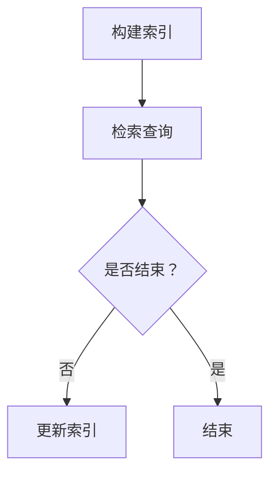

                 

### 《大模型应用开发 动手做AI Agent》LlamaIndex和基于RAG的AI开发

> **关键词：** 大模型、LlamaIndex、RAG架构、AI应用开发、问答系统、文本生成、多模态数据、实时检索

> **摘要：** 本文将深入探讨大模型应用开发中的关键技术，包括LlamaIndex和基于RAG（Read-Ask-Generate）架构的AI开发。我们将详细解析LlamaIndex的技术基础，展示其核心模块及其在问答系统中的应用示例。此外，本文还将通过实际项目实战，展示如何构建一个问答机器人以及基于RAG的文本生成应用。最后，我们将讨论大模型应用的扩展方向和未来趋势，为读者提供全面的指导。通过本文的学习，读者将能够掌握大模型应用开发的核心技能，为未来的AI项目打下坚实的基础。

### 第一部分：大模型基础知识与LlamaIndex介绍

#### 第1章：大模型应用概述

##### 1.1 大模型应用背景

随着深度学习技术的快速发展，大模型（Large Models）在自然语言处理（NLP）、计算机视觉、语音识别等领域展现出强大的能力。大模型通常具有数百万甚至数十亿个参数，能够通过大量的数据训练，从而在任务中表现出色。这一节将简要回顾AI技术发展现状，并探讨大模型在AI应用中的重要性。

**AI技术发展现状：**

近年来，AI技术取得了显著的进展。尤其是深度学习技术的兴起，使得计算机在图像识别、语音识别、自然语言处理等领域取得了突破性的成果。例如，Google的Inception网络在图像分类任务上取得了极高的准确率，OpenAI的GPT系列模型在语言生成和理解上表现出色。这些模型的共同特点是使用了大量的数据和强大的计算能力，从而训练出了复杂且高效的神经网络。

**大模型在AI应用中的重要性：**

大模型在AI应用中具有重要地位，原因有以下几点：

1. **泛化能力：** 大模型通过大量数据的训练，能够学习到更加通用的特征，从而在新的任务中也能表现出色。
2. **性能提升：** 大模型能够捕捉到更加复杂的模式，使得模型在特定任务中的性能大幅提升。
3. **数据利用率：** 大模型能够更好地利用训练数据，尤其是当数据量有限时，大模型能够挖掘出更多的信息。
4. **多模态处理：** 大模型能够同时处理多种类型的数据，如文本、图像、语音等，从而在多模态应用中具有优势。

**大模型应用的潜在价值：**

大模型的应用场景非常广泛，包括但不限于以下几个方面：

1. **自然语言处理：** 大模型在问答系统、机器翻译、文本生成等领域具有显著的优势，能够提供更加自然和准确的语言处理能力。
2. **计算机视觉：** 大模型在图像分类、目标检测、人脸识别等任务中表现出色，可以用于智能安防、医疗诊断、自动驾驶等领域。
3. **语音识别：** 大模型在语音识别领域具有高度的准确性，可以应用于智能语音助手、语音搜索、语音翻译等应用。
4. **推荐系统：** 大模型能够更好地理解用户的行为和偏好，从而提供更加个性化的推荐。
5. **实时检索：** 大模型在实时检索系统中可以提供高效的查询响应，可以应用于搜索引擎、知识图谱等领域。

总之，大模型在AI应用中具有巨大的潜力，其应用前景广阔。然而，大模型的训练和部署也需要大量的计算资源和数据支持，这是当前AI领域面临的重大挑战。

#### 1.2 LlamaIndex介绍

LlamaIndex是一个高效、灵活的大模型索引工具，旨在支持大模型的快速检索和高效问答。它由清华大学KEG实验室提出，基于Llama模型构建，支持多种数据格式和检索算法。本节将介绍LlamaIndex的基本概念、架构和关键特性。

**基本概念：**

LlamaIndex的核心思想是将大模型与检索技术相结合，通过构建索引结构，实现高效的文档检索和问答。LlamaIndex主要解决以下问题：

1. **如何快速检索大量文本？**
2. **如何在大模型中快速定位相关信息？**
3. **如何生成准确的问答结果？**

**架构：**

LlamaIndex的架构可以分为三个主要模块：索引构建模块、检索模块和模型嵌入模块。以下是每个模块的简要介绍：

1. **索引构建模块：** 该模块负责将原始文档构建成索引结构，以便快速检索。索引构建模块包括倒排索引、词嵌入、向量检索等子模块。
2. **检索模块：** 该模块负责处理用户的查询请求，通过检索算法（如向量检索、最近邻检索等）快速定位相关文档。
3. **模型嵌入模块：** 该模块负责将查询和文档嵌入到高维向量空间中，以便进行相似度计算和结果排序。

**关键特性：**

LlamaIndex具有以下几个关键特性：

1. **高效性：** LlamaIndex通过预构建索引，可以实现毫秒级的查询响应，适用于实时检索场景。
2. **灵活性：** LlamaIndex支持多种数据格式（如文本、PDF、图像等）和检索算法，可以根据需求进行定制。
3. **扩展性：** LlamaIndex具有良好的扩展性，可以支持多模型嵌入、多语言检索等功能。
4. **可解释性：** LlamaIndex提供详细的检索日志和查询结果解释，便于用户理解和优化检索过程。

**应用场景：**

LlamaIndex适用于多种场景，包括但不限于：

1. **问答系统：** 利用LlamaIndex，可以快速构建一个高效的问答系统，支持多轮对话和实时问答。
2. **搜索引擎：** LlamaIndex可以增强搜索引擎的功能，提供更准确的搜索结果和更快的响应速度。
3. **知识图谱：** LlamaIndex可以与知识图谱相结合，提供高效的知识检索和推理功能。
4. **多模态应用：** LlamaIndex支持多模态数据的检索和融合，可以应用于图像、语音、文本等不同类型的检索任务。

通过以上介绍，我们可以看到LlamaIndex在AI应用开发中具有重要的地位和广泛的应用前景。接下来，我们将深入探讨LlamaIndex的技术基础，解析其核心模块及其在问答系统中的应用。

#### 1.3 LlamaIndex技术基础

为了更好地理解LlamaIndex的工作原理，我们需要深入探讨其背后的技术基础，包括大模型检索技术、索引构建模块、检索模块和模型嵌入模块。这些技术共同构成了LlamaIndex的核心架构，使其能够实现高效、灵活的大模型检索。

**大模型检索技术**

大模型检索技术是LlamaIndex的核心组成部分，旨在利用大模型对大量文本数据进行高效检索。以下是几种常见的大模型检索技术：

1. **向量检索：** 向量检索是一种基于向量空间模型的检索技术。在大模型检索中，首先将文本数据转换为高维向量表示，然后通过计算查询向量与文档向量之间的相似度进行检索。常用的向量表示方法包括词嵌入（如Word2Vec、GloVe）和上下文向量（如BERT、GPT）。

2. **最近邻检索：** 最近邻检索是一种基于距离度量的检索技术。它通过计算查询向量与存储在索引中的向量之间的距离，找到最近的邻居，从而返回相关文档。常用的距离度量方法包括欧氏距离、余弦相似度和夹角余弦。

3. **查询展开：** 查询展开是一种基于上下文扩展的检索技术。在检索过程中，系统不仅考虑原始查询，还考虑查询的上下文信息，以生成更广泛的查询结果。这种方法可以有效地提高检索的准确性。

**索引构建模块**

索引构建模块负责将原始文档构建成索引结构，以便快速检索。以下是索引构建模块的主要组成部分：

1. **倒排索引：** 倒排索引是一种用于文本检索的数据结构，它将文档中的词作为键，将包含该词的文档作为值存储在一个映射表中。通过倒排索引，可以快速定位包含特定词汇的文档。

2. **词嵌入：** 词嵌入是将词汇映射到高维向量空间的过程。在LlamaIndex中，通常使用预训练的词嵌入模型（如GloVe、BERT）来生成词向量。这些词向量可以用于相似度计算和文档检索。

3. **向量检索：** 向量检索模块负责将文档向量存储在索引中，并通过计算查询向量与文档向量之间的相似度进行检索。向量检索模块通常使用最近邻检索或基于树的算法（如Annoy、FAISS）来提高检索效率。

**检索模块**

检索模块负责处理用户的查询请求，并通过检索算法快速定位相关文档。以下是检索模块的主要功能：

1. **查询处理：** 检索模块首先将用户的查询文本转换为向量表示，然后根据预定义的检索策略（如向量检索、查询展开等）生成查询结果。

2. **结果排序：** 检索模块对查询结果进行排序，以返回最相关的文档。排序通常基于相似度度量（如余弦相似度、欧氏距离）或用户自定义的排序策略。

3. **多轮对话：** 在问答系统中，检索模块可以支持多轮对话，允许用户通过后续问题进一步细化查询。

**模型嵌入模块**

模型嵌入模块负责将查询和文档嵌入到高维向量空间中，以便进行相似度计算和结果排序。以下是模型嵌入模块的主要组成部分：

1. **大模型嵌入：** 大模型嵌入模块负责将查询和文档转换为向量表示。通常，大模型（如BERT、GPT）的嵌入层可以生成高质量的向量表示。

2. **向量计算：** 模型嵌入模块通过计算查询向量与文档向量之间的相似度（如余弦相似度、欧氏距离）来评估文档的相关性。

3. **结果解释：** 模型嵌入模块可以提供查询结果的可解释性，帮助用户理解检索过程和结果。

通过以上对LlamaIndex技术基础的深入探讨，我们可以看到其通过多种技术手段实现了高效、灵活的大模型检索。接下来，我们将通过一个具体的示例，展示LlamaIndex在问答系统中的应用，帮助读者更好地理解其工作原理。

#### 1.4 LlamaIndex应用示例

为了更好地展示LlamaIndex在问答系统中的应用，我们将通过一个具体的示例来说明其工作流程和效果。以下是使用LlamaIndex构建一个问答系统的详细步骤。

**示例场景：问答系统**

假设我们想要构建一个问答系统，用户可以输入问题，系统会自动从大量文本数据中检索出相关答案。以下是使用LlamaIndex实现这一场景的步骤：

**1. 数据准备：**

首先，我们需要准备一组文本数据作为问答系统的知识库。这些数据可以来自于公开的文本资源、网站爬取、企业内部文档等。为了简化示例，我们假设已经有一组文本数据存储在一个文件夹中，文件格式为`.txt`。

```bash
document_data/
|-- doc1.txt
|-- doc2.txt
|-- doc3.txt
```

**2. 索引构建：**

使用LlamaIndex的`SimpleDirectoryReader`类，我们可以轻松地将文本数据添加到索引中。以下是构建索引的代码示例：

```python
from llama_index import LLAMAIndex, SimpleDirectoryReader

# 初始化LlamaIndex
index = LLAMAIndex()

# 读取文本数据
documents = SimpleDirectoryReader("document_data").load_data()

# 添加文档到索引
index.add_documents(documents)
```

在上述代码中，我们首先创建了一个LlamaIndex实例，然后使用SimpleDirectoryReader类读取文本数据，并将其添加到索引中。这一步骤的主要目的是构建一个索引结构，以便后续的查询操作。

**3. 查询与回答：**

接下来，我们可以使用LlamaIndex的`query`方法来处理用户的查询请求，并返回相关答案。以下是查询与回答的示例代码：

```python
from llama_index import LLAMAIndex, SimpleDirectoryReader

# 初始化LlamaIndex
index = LLAMAIndex()

# 读取文本数据
documents = SimpleDirectoryReader("document_data").load_data()

# 添加文档到索引
index.add_documents(documents)

# 定义查询问题
question = "什么是深度学习？"

# 进行查询并获取答案
answer = index.query(question)
print(answer)
```

在上述代码中，我们首先初始化LlamaIndex，并读取文本数据构建索引。然后，我们定义了一个查询问题，使用`query`方法进行查询，并打印出答案。这一步骤展示了LlamaIndex在处理查询请求时的基本流程。

**4. 结果分析：**

在实际应用中，查询结果可能会包含多个答案，我们需要对结果进行筛选和排序，以返回最相关和最准确的答案。以下是处理查询结果的方法：

```python
from llama_index import LLAMAIndex, SimpleDirectoryReader

# 初始化LlamaIndex
index = LLAMAIndex()

# 读取文本数据
documents = SimpleDirectoryReader("document_data").load_data()

# 添加文档到索引
index.add_documents(documents)

# 定义查询问题
question = "什么是深度学习？"

# 进行查询并获取答案
answer = index.query(question)

# 分析查询结果
if answer:
    print(answer)
else:
    print("未找到相关答案。")
```

在上述代码中，我们添加了结果分析逻辑，如果查询结果为空，则提示用户未找到相关答案。这一步骤展示了如何处理查询结果的空值情况。

**5. 优化与调整：**

在实际应用中，根据查询结果的准确性和响应速度，我们可能需要对LlamaIndex进行优化和调整。以下是一些优化策略：

- **增加文档数量：** 提高知识库的规模，可以增加查询的准确性和多样性。
- **调整检索算法：** 根据应用场景，可以尝试不同的检索算法（如向量检索、最近邻检索）以提高检索性能。
- **多轮对话：** 支持多轮对话，允许用户通过后续问题进一步细化查询。

通过以上步骤，我们可以构建一个基于LlamaIndex的问答系统，实现高效、准确的查询和回答。LlamaIndex的应用场景不仅限于问答系统，还可以扩展到搜索引擎、知识图谱、多模态应用等领域，具有广泛的应用前景。

#### 1.5 LlamaIndex的核心模块解析

为了深入理解LlamaIndex的工作原理，我们需要详细解析其核心模块，包括索引构建模块、检索模块和模型嵌入模块。以下是这些模块的详细介绍及其相互关系。

**索引构建模块**

索引构建模块是LlamaIndex的核心组成部分，负责将原始文档构建成索引结构，以便快速检索。以下是索引构建模块的主要组成部分：

1. **倒排索引：** 倒排索引是一种用于文本检索的数据结构，它将文档中的词作为键，将包含该词的文档作为值存储在一个映射表中。通过倒排索引，可以快速定位包含特定词汇的文档。倒排索引的构建过程通常包括以下步骤：

   - **分词：** 将原始文档拆分成单词或子词。
   - **索引构建：** 将分词结果与文档ID进行映射，生成倒排索引。

2. **词嵌入：** 词嵌入是将词汇映射到高维向量空间的过程。在LlamaIndex中，通常使用预训练的词嵌入模型（如GloVe、BERT）来生成词向量。这些词向量可以用于相似度计算和文档检索。词嵌入的构建过程通常包括以下步骤：

   - **词表构建：** 根据原始文档构建词表，包含所有出现的词汇。
   - **词向量生成：** 使用预训练的词嵌入模型，将词表中的词汇映射到高维向量空间。

3. **向量检索：** 向量检索模块负责将文档向量存储在索引中，并通过计算查询向量与文档向量之间的相似度进行检索。向量检索模块通常使用最近邻检索或基于树的算法（如Annoy、FAISS）来提高检索效率。向量检索的构建过程通常包括以下步骤：

   - **文档向量生成：** 使用词嵌入模型，将文档中的词汇映射到高维向量空间，生成文档向量。
   - **向量存储：** 将文档向量存储在索引中，以便后续的查询操作。

**检索模块**

检索模块负责处理用户的查询请求，并通过检索算法快速定位相关文档。以下是检索模块的主要功能：

1. **查询处理：** 检索模块首先将用户的查询文本转换为向量表示，然后根据预定义的检索策略（如向量检索、查询展开等）生成查询结果。查询处理过程通常包括以下步骤：

   - **查询分词：** 将查询文本拆分成单词或子词。
   - **查询向量生成：** 使用词嵌入模型，将查询文本映射到高维向量空间，生成查询向量。

2. **结果排序：** 检索模块对查询结果进行排序，以返回最相关的文档。排序通常基于相似度度量（如余弦相似度、欧氏距离）或用户自定义的排序策略。结果排序过程通常包括以下步骤：

   - **相似度计算：** 计算查询向量与文档向量之间的相似度，如余弦相似度或欧氏距离。
   - **结果排序：** 根据相似度值对文档进行排序，返回最相关的文档。

3. **多轮对话：** 在问答系统中，检索模块可以支持多轮对话，允许用户通过后续问题进一步细化查询。多轮对话过程通常包括以下步骤：

   - **用户输入：** 用户输入新的问题或信息。
   - **查询更新：** 根据用户输入，更新查询向量。
   - **查询处理与结果排序：** 使用更新后的查询向量处理查询，并返回排序后的结果。

**模型嵌入模块**

模型嵌入模块负责将查询和文档嵌入到高维向量空间中，以便进行相似度计算和结果排序。以下是模型嵌入模块的主要组成部分：

1. **大模型嵌入：** 大模型嵌入模块负责将查询和文档转换为向量表示。通常，大模型（如BERT、GPT）的嵌入层可以生成高质量的向量表示。大模型嵌入过程通常包括以下步骤：

   - **查询向量生成：** 使用大模型，将查询文本映射到高维向量空间，生成查询向量。
   - **文档向量生成：** 使用大模型，将文档文本映射到高维向量空间，生成文档向量。

2. **向量计算：** 模型嵌入模块通过计算查询向量与文档向量之间的相似度（如余弦相似度、欧氏距离）来评估文档的相关性。向量计算过程通常包括以下步骤：

   - **相似度计算：** 计算查询向量与文档向量之间的相似度，如余弦相似度或欧氏距离。
   - **结果排序：** 根据相似度值对文档进行排序，返回最相关的文档。

3. **结果解释：** 模型嵌入模块可以提供查询结果的可解释性，帮助用户理解检索过程和结果。结果解释过程通常包括以下步骤：

   - **相似度可视化：** 可视化查询向量与文档向量之间的相似度，帮助用户理解结果。
   - **结果分析：** 分析查询结果的相关性，提供详细的解释。

**相互关系**

索引构建模块、检索模块和模型嵌入模块相互协作，共同实现LlamaIndex的检索功能。以下是这些模块之间的相互关系：

- **索引构建模块：** 负责将原始文档构建成索引结构，为后续的检索操作提供基础。
- **检索模块：** 负责处理用户的查询请求，通过检索算法快速定位相关文档，并返回排序后的结果。
- **模型嵌入模块：** 负责将查询和文档嵌入到高维向量空间中，以便进行相似度计算和结果排序。

通过以上对LlamaIndex核心模块的解析，我们可以更好地理解其工作原理，为实际应用提供指导。在下一节中，我们将继续探讨LlamaIndex的应用示例，进一步展示其在问答系统中的效果。

#### 1.6 大模型检索算法详解

在LlamaIndex的核心技术中，大模型检索算法起着至关重要的作用。本节将详细介绍大模型检索算法的基本原理、计算方法和实现步骤，并通过具体示例深入讲解。

**基本原理**

大模型检索算法的核心思想是将文本数据转换为向量表示，然后在高维向量空间中计算查询向量与文档向量之间的相似度。基于这种向量表示的方法，可以实现快速、高效的文本检索。

**计算方法**

1. **文本向量化：** 首先，我们需要将文本数据转换为向量表示。常见的方法包括词嵌入（Word Embedding）和上下文向量（Contextual Embedding）。

   - **词嵌入：** 将单词映射到固定维度的向量空间。常用的词嵌入模型有GloVe和Word2Vec。
   - **上下文向量：** 在给定上下文信息下，生成动态的向量表示。BERT和GPT等预训练语言模型可以产生高质量的上下文向量。

2. **相似度计算：** 接下来，我们需要计算查询向量与文档向量之间的相似度。常用的相似度度量方法包括余弦相似度、欧氏距离和点积。

   - **余弦相似度：** 余弦相似度衡量两个向量之间的角度余弦值，其计算公式为：
     $$
     \cos(\theta) = \frac{\vec{a} \cdot \vec{b}}{||\vec{a}|| \cdot ||\vec{b}||}
     $$
     其中，$\vec{a}$ 和 $\vec{b}$ 分别是查询向量和文档向量，$\theta$ 是它们之间的夹角。

   - **欧氏距离：** 欧氏距离衡量两个向量之间的直角三角形距离，其计算公式为：
     $$
     d(\vec{a}, \vec{b}) = \sqrt{(\vec{a}_1 - \vec{b}_1)^2 + (\vec{a}_2 - \vec{b}_2)^2 + \ldots + (\vec{a}_n - \vec{b}_n)^2}
     $$
     其中，$\vec{a}_i$ 和 $\vec{b}_i$ 分别是查询向量和文档向量在第$i$维的值。

   - **点积：** 点积衡量两个向量的内积，其计算公式为：
     $$
     \vec{a} \cdot \vec{b} = \sum_{i=1}^{n} \vec{a}_i \cdot \vec{b}_i
     $$

3. **结果排序：** 根据相似度值对文档进行排序，返回最相关的文档。排序策略可以根据实际需求进行调整，例如使用阈值、评分排序等。

**实现步骤**

1. **数据预处理：** 对原始文本数据进行预处理，包括分词、去停用词、词干提取等步骤。预处理后的文本数据将用于生成向量表示。

2. **向量表示：** 使用词嵌入或上下文向量模型，将预处理后的文本数据转换为向量表示。可以选择预训练的模型（如BERT、GPT）或自定义训练模型。

3. **相似度计算：** 计算查询向量与文档向量之间的相似度。根据实际需求选择合适的相似度度量方法，如余弦相似度、欧氏距离或点积。

4. **结果排序：** 根据相似度值对文档进行排序，返回最相关的文档。排序策略可以根据实际需求进行调整。

**具体示例**

假设我们有一个查询问题“什么是深度学习？”以及一组文档，我们将通过以下步骤使用LlamaIndex进行检索：

1. **数据预处理：** 将查询问题和文档进行预处理，例如分词和去除停用词。

2. **向量表示：** 使用预训练的BERT模型，将预处理后的查询问题和文档转换为向量表示。

3. **相似度计算：** 计算查询向量与每个文档向量之间的余弦相似度。

4. **结果排序：** 根据余弦相似度值对文档进行排序，返回最相关的文档。

以下是使用LlamaIndex实现这一示例的代码：

```python
from llama_index import LLAMAIndex, SimpleDirectoryReader
from transformers import BertTokenizer, BertModel

# 初始化LlamaIndex
index = LLAMAIndex()

# 读取文本数据
documents = SimpleDirectoryReader("document_data").load_data()

# 添加文档到索引
index.add_documents(documents)

# 初始化BERT模型和tokenizer
tokenizer = BertTokenizer.from_pretrained("bert-base-uncased")
model = BertModel.from_pretrained("bert-base-uncased")

# 定义查询问题
question = "什么是深度学习？"

# 转换为输入序列
input_ids = tokenizer.encode(question, add_special_tokens=True, return_tensors="pt")

# 获取查询向量和文档向量
with torch.no_grad():
    query_embedding = model(input_ids)[0][:, 0, :]

document_embeddings = index.get_document_embeddings()

# 计算相似度
cosine_scores = cosine_similarity(query_embedding, document_embeddings)

# 排序并返回结果
sorted_documents = [doc for _, doc in sorted(zip(cosine_scores, documents), reverse=True)]
print(sorted_documents)
```

在这个示例中，我们首先初始化LlamaIndex，并读取文本数据构建索引。然后，我们使用BERT模型和tokenizer，将查询问题和文档转换为向量表示。接着，计算查询向量与每个文档向量之间的余弦相似度，并根据相似度值对文档进行排序。最后，返回排序后的最相关文档。

通过以上示例，我们可以看到大模型检索算法的基本实现过程。在实际应用中，我们可以根据需求调整模型、相似度计算方法和排序策略，以提高检索效果。

#### 1.7 LlamaIndex与RAG架构的关系

LlamaIndex与RAG（Read-Ask-Generate）架构在实现高效问答系统方面具有紧密的联系。RAG架构是一种结合了阅读（Read）、询问（Ask）和生成（Generate）的框架，旨在利用大模型的能力，实现智能问答。LlamaIndex作为RAG架构中的重要组件，负责阅读和检索数据，为问答系统提供支持。以下是LlamaIndex与RAG架构的关系及其在问答系统中的应用。

**LlamaIndex与RAG架构的关系**

1. **阅读（Read）**：在RAG架构中，阅读组件负责从大规模知识库中检索与查询相关的信息。LlamaIndex在这个环节中发挥着核心作用，通过构建高效的索引结构，实现对大量文本数据的快速检索。LlamaIndex支持多种数据格式和检索算法，能够快速返回与查询相关的文档，为问答系统提供丰富的知识来源。

2. **询问（Ask）**：询问组件负责根据查询，向知识库中的实体或概念提出问题。在这一环节，RAG架构中的生成组件（如大模型）会对问题进行处理，生成新的查询。LlamaIndex在此过程中，可以进一步优化查询，提高检索的准确性和效率。

3. **生成（Generate）**：生成组件负责根据查询结果，生成回答。在大模型的支持下，生成组件能够生成自然、流畅的回答。LlamaIndex在这个过程中，可以为生成组件提供相关的上下文信息，帮助其生成更加准确和合理的回答。

**LlamaIndex在问答系统中的应用**

1. **数据检索**：LlamaIndex通过构建高效的索引结构，实现对大规模知识库的快速检索。在问答系统中，用户输入查询后，LlamaIndex会迅速定位与查询相关的文档，返回最相关的信息。

2. **查询优化**：LlamaIndex支持多种检索算法和相似度计算方法，可以根据实际需求调整检索策略，优化查询效果。例如，可以通过调整检索算法的参数，提高查询的准确性和响应速度。

3. **上下文生成**：LlamaIndex可以为生成组件提供相关的上下文信息，帮助生成更加准确和合理的回答。例如，在回答一个关于科技领域的问题时，LlamaIndex可以提供与科技相关的背景知识，帮助生成组件生成更加专业的回答。

4. **多轮对话**：LlamaIndex支持多轮对话，可以在后续问题中提供更加精确的回答。在多轮对话中，用户可以通过后续问题进一步细化查询，LlamaIndex会根据新的查询优化检索结果，提供更加准确的答案。

**案例：基于RAG架构的问答系统**

假设我们构建一个基于RAG架构的问答系统，用户可以输入问题，系统会自动从知识库中检索相关信息，并生成回答。以下是基于RAG架构的问答系统的工作流程：

1. **用户输入查询**：用户输入查询问题，例如“什么是深度学习？”。

2. **LlamaIndex检索数据**：LlamaIndex从知识库中检索与查询相关的文档，返回最相关的信息。

3. **生成新查询**：RAG架构的询问组件根据检索到的信息，生成新的查询。例如，询问“深度学习有哪些应用？”。

4. **LlamaIndex优化查询**：LlamaIndex根据新查询优化检索策略，提高检索的准确性和效率。

5. **生成回答**：RAG架构的生成组件根据检索结果和新查询，生成回答。例如，回答“深度学习广泛应用于计算机视觉、自然语言处理和推荐系统等领域。”

6. **多轮对话**：用户可以继续输入问题，系统会根据新查询继续优化检索结果，提供更加准确的回答。

通过以上流程，我们可以看到LlamaIndex与RAG架构在问答系统中的应用。LlamaIndex负责高效的文本检索和上下文生成，RAG架构则负责处理查询、生成新查询和生成回答。两者相结合，可以构建一个高效、智能的问答系统。

### 第二部分：基于RAG的AI开发实践

#### 第2章：基于RAG的AI架构介绍

##### 2.1 RAG（Read-Ask-Generate）概述

RAG（Read-Ask-Generate）架构是一种结合了阅读、询问和生成三个核心组件的AI框架，旨在利用大模型的能力，实现高效、智能的问答系统。RAG架构的核心思想是将用户的查询分解为多个子问题，通过逐步求解这些子问题，最终生成完整的回答。以下是RAG架构的基本原理、优势及其在不同场景中的应用。

**基本原理**

RAG架构包括三个主要组件：阅读（Read）、询问（Ask）和生成（Generate）。

1. **阅读（Read）**：阅读组件负责从大规模知识库中检索与查询相关的信息。知识库可以是预构建的，也可以是动态构建的。阅读组件通过高效的检索算法，如向量检索、最近邻检索等，快速定位与查询相关的文档。

2. **询问（Ask）**：询问组件负责根据查询，向知识库中的实体或概念提出问题。在RAG架构中，询问组件通常由大模型实现，如BERT、GPT等。询问组件能够理解查询语义，并生成新的子问题，以进一步细化查询。

3. **生成（Generate）**：生成组件负责根据查询结果和新查询，生成完整的回答。生成组件通常也是由大模型实现，通过上下文理解、文本生成等技术，生成自然、流畅的回答。

**优势**

RAG架构具有以下优势：

1. **高效性**：RAG架构通过分步骤处理查询，可以显著提高检索和问答的效率。阅读组件负责高效地检索相关知识，询问组件负责生成新查询，生成组件负责生成回答。每个组件都可以独立优化，从而提高整体性能。

2. **灵活性**：RAG架构支持多种知识库和查询方式，可以适应不同的应用场景。例如，可以结合关系图谱、多模态数据等，构建更加丰富和多样化的知识库。

3. **可解释性**：RAG架构提供了清晰的查询处理流程，用户可以跟踪每个组件的工作过程，了解查询如何被分解和生成回答。这有助于提高系统的透明度和可解释性。

**在不同场景中的应用**

RAG架构在不同场景中展现出强大的应用能力：

1. **问答系统**：RAG架构是构建高效问答系统的核心框架。通过阅读组件，系统可以快速检索相关知识，询问组件可以生成新查询，生成组件可以生成回答。这种分步骤的处理方式，使得问答系统在处理复杂查询时具有更高的准确性和效率。

2. **知识图谱**：RAG架构可以与知识图谱相结合，实现高效的问答和推理。阅读组件可以从知识图谱中检索相关信息，询问组件可以提出推理问题，生成组件可以生成推理结果。这种结合方式，可以显著提高知识图谱的应用价值。

3. **多模态应用**：RAG架构支持多模态数据的处理，可以同时处理文本、图像、语音等多种类型的数据。通过阅读组件，系统可以检索与多模态数据相关的信息，询问组件可以生成针对不同模态的问题，生成组件可以生成综合性的回答。这种多模态应用能力，可以应用于智能家居、智能客服等领域。

**总结**

RAG架构是一种结合了阅读、询问和生成三个核心组件的AI框架，旨在利用大模型的能力，实现高效、智能的问答系统。通过分步骤处理查询，RAG架构可以提高检索和问答的效率，同时提供灵活性和可解释性。在实际应用中，RAG架构可以应用于问答系统、知识图谱、多模态应用等多个领域，具有广泛的应用前景。

##### 2.2 RAG核心组件解析

在RAG架构中，阅读（Read）、询问（Ask）和生成（Generate）三个核心组件共同协作，实现高效、智能的问答。以下是对每个组件的详细解析，包括其工作原理、实现方法和技术细节。

**阅读组件（Read）**

阅读组件是RAG架构中的第一个核心组件，负责从大规模知识库中检索与查询相关的信息。其工作原理主要包括以下步骤：

1. **数据预处理**：将原始数据（如文本、图像、语音等）进行预处理，提取关键特征。对于文本数据，通常包括分词、去停用词、词干提取等步骤；对于图像和语音数据，通常包括特征提取、去噪等步骤。

2. **知识库构建**：将预处理后的数据构建成知识库。知识库可以是预构建的，也可以是动态构建的。预构建知识库通常包括关系图谱、文本库等；动态构建知识库可以通过在线学习、实时更新等方式不断优化。

3. **检索算法**：选择合适的检索算法，从知识库中检索与查询相关的信息。常见的检索算法包括向量检索、最近邻检索、基于树的检索等。向量检索基于向量空间模型，通过计算查询向量与文档向量之间的相似度实现检索；最近邻检索通过计算查询与知识库中数据点的距离，找到最近的邻居作为检索结果；基于树的检索利用树结构（如B树、红黑树等）提高检索效率。

技术细节：

- **向量检索**：向量检索的核心在于如何高效地计算查询向量与文档向量之间的相似度。常用的相似度度量方法包括余弦相似度、欧氏距离和点积。余弦相似度适用于文本数据，欧氏距离和点积适用于图像和语音数据。

- **最近邻检索**：最近邻检索通过计算查询与知识库中数据点的距离，找到最近的邻居作为检索结果。常用的距离度量方法包括欧氏距离、曼哈顿距离和切比雪夫距离。

- **基于树的检索**：基于树的检索利用树结构提高检索效率。常见的树结构包括B树、红黑树和AVL树等。这些树结构通过优化查找和插入操作，实现高效的检索。

**询问组件（Ask）**

询问组件是RAG架构中的第二个核心组件，负责根据查询，向知识库中的实体或概念提出问题。其工作原理主要包括以下步骤：

1. **查询处理**：将用户的查询文本进行预处理，提取关键信息。查询处理通常包括分词、词性标注、实体识别等步骤。

2. **语义理解**：对预处理后的查询文本进行语义理解，提取查询的意图和关键信息。语义理解可以通过自然语言处理技术（如命名实体识别、关系提取、语义角色标注等）实现。

3. **问题生成**：根据查询的意图和关键信息，生成新的子问题。问题生成可以通过模板匹配、语义转换等方法实现。例如，针对一个关于天气的查询，可以生成关于当前气温、湿度等的问题。

技术细节：

- **模板匹配**：模板匹配是一种简单有效的问题生成方法，通过将查询文本与预定义的模板进行匹配，生成新的子问题。例如，针对一个关于电影的查询，可以生成关于电影上映日期、演员等信息的问题。

- **语义转换**：语义转换是一种基于语义理解的问题生成方法，通过将查询文本的语义表示转换为新的问题。例如，将“我想要了解关于深度学习的最新研究进展”转换为“深度学习的最新研究进展有哪些？”。

**生成组件（Generate）**

生成组件是RAG架构中的第三个核心组件，负责根据查询结果和新查询，生成完整的回答。其工作原理主要包括以下步骤：

1. **回答生成**：根据查询结果和新查询，生成回答。回答生成可以通过文本生成技术（如序列到序列模型、生成对抗网络等）实现。

2. **上下文理解**：在生成回答时，需要理解查询的上下文信息。上下文理解可以通过上下文嵌入、注意力机制等方法实现。

3. **回答优化**：对生成的回答进行优化，确保回答的准确性和流畅性。回答优化可以通过自然语言处理技术（如语法检查、语义修正等）实现。

技术细节：

- **序列到序列模型**：序列到序列模型（如Transformer、Seq2Seq等）是一种常用的文本生成模型，通过编码器和解码器两个神经网络，将输入序列转换为输出序列，实现回答生成。

- **生成对抗网络**：生成对抗网络（GAN）是一种基于生成器和判别器的模型，通过生成器和判别器的对抗训练，生成高质量的回答。

- **上下文嵌入**：上下文嵌入是将上下文信息编码为向量表示的过程。通过上下文嵌入，可以更好地理解查询的上下文信息，生成更准确的回答。

**总结**

阅读组件、询问组件和生成组件是RAG架构的核心组件，分别负责从知识库中检索信息、根据查询生成问题和生成回答。通过分步骤处理查询，RAG架构可以实现高效、智能的问答。在实际应用中，RAG架构可以结合不同技术，实现丰富的功能和应用场景。

### 第3章：基于RAG的AI开发实战

在本章中，我们将通过两个实际项目实战，深入探讨基于RAG架构的AI开发。首先，我们将构建一个问答机器人，演示如何使用LlamaIndex和RAG架构处理查询并生成回答。随后，我们将探讨基于RAG的文本生成应用，展示如何通过RAG架构生成高质量的文本。

#### 3.1 实战项目一：构建一个问答机器人

**3.1.1 项目背景**

问答机器人是AI领域的一个重要应用，它能够自动回答用户提出的问题。在本项目中，我们计划构建一个基于RAG架构的问答机器人，利用LlamaIndex进行知识检索，并通过RAG组件处理查询并生成回答。

**需求分析**

- **查询处理**：问答机器人需要能够接收用户的查询请求，并理解查询意图。
- **知识检索**：问答机器人需要从知识库中检索相关信息，以生成回答。
- **回答生成**：问答机器人需要根据查询结果和新查询生成流畅、准确的回答。

**3.1.2 开发环境搭建**

在开始项目之前，我们需要搭建一个适合RAG架构的开发环境。以下是所需的工具和库：

- **编程语言**：Python
- **文本处理库**：transformers（用于预训练模型）、llama_index（用于LlamaIndex）
- **数据处理库**：pandas（用于数据预处理）、numpy（用于数值计算）
- **API库**：requests（用于调用外部API）

安装所需的库：

```bash
pip install transformers llama_index pandas numpy requests
```

**3.1.3 数据集准备**

为了构建问答机器人，我们需要一个包含问题和答案的数据集。这里，我们使用一个简单的文本数据集，文件格式为JSON。数据集样例如下：

```json
[
  {"question": "什么是深度学习？", "answer": "深度学习是一种基于多层神经网络的数据驱动方法，用于自动学习和理解数据特征。"},
  {"question": "深度学习的应用有哪些？", "answer": "深度学习在计算机视觉、自然语言处理、语音识别等领域有广泛应用。"},
  // 更多问题和答案...
]
```

**数据预处理**

在构建知识库之前，我们需要对数据进行预处理，包括分词、去除停用词、词干提取等步骤。以下是预处理代码示例：

```python
import json
from nltk.tokenize import word_tokenize
from nltk.corpus import stopwords
from nltk.stem import PorterStemmer

# 读取数据集
with open('data.json', 'r', encoding='utf-8') as f:
    data = json.load(f)

# 定义预处理函数
def preprocess(text):
    tokens = word_tokenize(text)
    stop_words = set(stopwords.words('english'))
    filtered_tokens = [token for token in tokens if token.lower() not in stop_words]
    stemmed_tokens = [PorterStemmer().stem(token) for token in filtered_tokens]
    return ' '.join(stemmed_tokens)

# 预处理数据集
preprocessed_data = [{"question": preprocess(question), "answer": preprocess(answer)} for question, answer in data.items()]

# 存储预处理后的数据
with open('preprocessed_data.json', 'w', encoding='utf-8') as f:
    json.dump(preprocessed_data, f)
```

**3.1.4 RAG模型构建**

接下来，我们将构建RAG模型，包括阅读（Read）、询问（Ask）和生成（Generate）组件。以下是构建RAG模型的步骤：

1. **阅读组件（Read）**：使用LlamaIndex构建知识库，以便快速检索相关信息。

2. **询问组件（Ask）**：实现询问组件，根据查询生成新问题。

3. **生成组件（Generate）**：使用预训练模型生成回答。

**阅读组件（Read）**

首先，我们需要构建一个基于LlamaIndex的知识库。以下是构建知识库的代码示例：

```python
from llama_index import LLAMAIndex, SimpleDirectoryReader

# 初始化LlamaIndex
index = LLAMAIndex()

# 读取预处理后的数据
documents = SimpleDirectoryReader('preprocessed_data.json').load_data()

# 添加文档到索引
index.add_documents(documents)

# 索引构建完成
print("Knowledge base built.")
```

**询问组件（Ask）**

接下来，我们需要实现询问组件，根据查询生成新问题。以下是一个简单的示例：

```python
from transformers import BertTokenizer, BertModel

# 初始化BERT模型和tokenizer
tokenizer = BertTokenizer.from_pretrained('bert-base-uncased')
model = BertModel.from_pretrained('bert-base-uncased')

# 定义查询函数
def ask_question(question):
    # 将查询转换为输入序列
    input_ids = tokenizer.encode(question, add_special_tokens=True, return_tensors="pt")

    # 获取查询向量
    with torch.no_grad():
        outputs = model(input_ids)
        query_embedding = outputs.last_hidden_state[:, 0, :]

    # 检索相关知识库
    documents = index.get_ordered_documents_by_query_vector(query_embedding)

    # 根据检索结果生成新问题
    new_questions = []
    for doc in documents:
        # 这里可以根据需求自定义问题生成逻辑
        new_question = f"{doc['question']}？"
        new_questions.append(new_question)

    return new_questions
```

**生成组件（Generate）**

最后，我们需要实现生成组件，根据查询结果和新查询生成回答。以下是一个简单的示例：

```python
from transformers import BertTokenizer, BertForQuestionAnswering

# 初始化BERT问答模型和tokenizer
tokenizer = BertTokenizer.from_pretrained('bert-base-uncased')
model = BertForQuestionAnswering.from_pretrained('bert-base-uncased')

# 定义回答函数
def generate_answer(question, context):
    # 将查询和上下文转换为输入序列
    input_ids = tokenizer.encode(question, context, add_special_tokens=True, return_tensors="pt")

    # 获取查询和上下文向量
    with torch.no_grad():
        outputs = model(input_ids)
        logits = outputs.logits

    # 解码查询和上下文向量
    start_logits = logits[:, 0]
    end_logits = logits[:, 1]

    # 获取答案
    start_index = torch.argmax(start_logits).item()
    end_index = torch.argmax(end_logits).item()
    answer = tokenizer.decode(input_ids[start_index:end_index+1])

    return answer
```

**3.1.5 问答机器人部署与优化**

完成RAG模型的构建后，我们可以将其部署为一个问答机器人，并对其进行优化。以下是部署和优化步骤：

1. **部署**：将RAG模型部署为一个Web服务，如使用Flask或Django框架。

2. **优化**：根据实际需求，对模型进行优化，如调整超参数、使用更强大的预训练模型等。

以下是一个简单的Flask部署示例：

```python
from flask import Flask, request, jsonify
app = Flask(__name__)

@app.route('/ask', methods=['POST'])
def ask():
    data = request.json
    question = data['question']
    context = data['context']

    # 调用询问组件
    new_questions = ask_question(question)

    # 调用生成组件
    answers = []
    for q in new_questions:
        answer = generate_answer(q, context)
        answers.append(answer)

    return jsonify({'answers': answers})

if __name__ == '__main__':
    app.run(debug=True)
```

通过以上步骤，我们成功构建了一个基于RAG架构的问答机器人，实现了查询处理、知识检索和回答生成。在接下来的实战项目中，我们将探讨基于RAG的文本生成应用。

#### 3.2 实战项目二：基于RAG的文本生成应用

在上一节中，我们构建了一个问答机器人，展示了RAG架构在处理查询和生成回答方面的应用。在本节中，我们将探讨基于RAG的文本生成应用，通过RAG架构生成高质量、结构化的文本内容。

**3.2.1 项目背景**

文本生成是自然语言处理领域的一个重要应用，广泛应用于自动写作、摘要生成、对话系统等。基于RAG架构的文本生成应用，可以通过阅读、询问和生成三个步骤，生成高质量、结构化的文本内容。

**需求分析**

- **阅读（Read）**：从大规模文本数据中检索相关信息，构建知识库。
- **询问（Ask）**：根据生成任务，提出问题，获取关键信息。
- **生成（Generate）**：根据检索到的信息和关键信息，生成高质量文本内容。

**3.2.2 开发环境搭建**

为了构建基于RAG的文本生成应用，我们需要搭建一个适合RAG架构的开发环境。以下是所需的工具和库：

- **编程语言**：Python
- **文本处理库**：transformers（用于预训练模型）、llama_index（用于LlamaIndex）
- **数据处理库**：pandas（用于数据预处理）、numpy（用于数值计算）
- **API库**：requests（用于调用外部API）

安装所需的库：

```bash
pip install transformers llama_index pandas numpy requests
```

**3.2.3 数据集准备**

为了构建知识库，我们需要一个包含大量文本数据的数据集。这里，我们使用一个简单的文本数据集，文件格式为JSON。数据集样例如下：

```json
[
  {"title": "人工智能简介", "content": "人工智能是一种模拟人类智能的技术，广泛应用于计算机视觉、自然语言处理和机器学习等领域。"},
  {"title": "深度学习的基本原理", "content": "深度学习是一种基于多层神经网络的数据驱动方法，通过自动学习和理解数据特征，实现智能决策。"},
  // 更多文本数据...
]
```

**数据预处理**

在构建知识库之前，我们需要对数据进行预处理，包括分词、去除停用词、词干提取等步骤。以下是预处理代码示例：

```python
import json
from nltk.tokenize import word_tokenize
from nltk.corpus import stopwords
from nltk.stem import PorterStemmer

# 读取数据集
with open('data.json', 'r', encoding='utf-8') as f:
    data = json.load(f)

# 定义预处理函数
def preprocess(text):
    tokens = word_tokenize(text)
    stop_words = set(stopwords.words('english'))
    filtered_tokens = [token for token in tokens if token.lower() not in stop_words]
    stemmed_tokens = [PorterStemmer().stem(token) for token in filtered_tokens]
    return ' '.join(stemmed_tokens)

# 预处理数据集
preprocessed_data = [{"title": preprocess(title), "content": preprocess(content)} for title, content in data.items()]

# 存储预处理后的数据
with open('preprocessed_data.json', 'w', encoding='utf-8') as f:
    json.dump(preprocessed_data, f)
```

**3.2.4 RAG模型构建**

接下来，我们将构建RAG模型，包括阅读（Read）、询问（Ask）和生成（Generate）组件。以下是构建RAG模型的步骤：

1. **阅读组件（Read）**：使用LlamaIndex构建知识库，以便快速检索相关信息。

2. **询问组件（Ask）**：实现询问组件，根据生成任务提出问题，获取关键信息。

3. **生成组件（Generate）**：使用预训练模型生成高质量文本内容。

**阅读组件（Read）**

首先，我们需要构建一个基于LlamaIndex的知识库。以下是构建知识库的代码示例：

```python
from llama_index import LLAMAIndex, SimpleDirectoryReader

# 初始化LlamaIndex
index = LLAMAIndex()

# 读取预处理后的数据
documents = SimpleDirectoryReader('preprocessed_data.json').load_data()

# 添加文档到索引
index.add_documents(documents)

# 索引构建完成
print("Knowledge base built.")
```

**询问组件（Ask）**

接下来，我们需要实现询问组件，根据生成任务提出问题，获取关键信息。以下是一个简单的示例：

```python
from transformers import BertTokenizer, BertModel

# 初始化BERT模型和tokenizer
tokenizer = BertTokenizer.from_pretrained('bert-base-uncased')
model = BertModel.from_pretrained('bert-base-uncased')

# 定义查询函数
def ask_question(question):
    # 将查询转换为输入序列
    input_ids = tokenizer.encode(question, add_special_tokens=True, return_tensors="pt")

    # 获取查询向量
    with torch.no_grad():
        outputs = model(input_ids)
        query_embedding = outputs.last_hidden_state[:, 0, :]

    # 检索相关知识库
    documents = index.get_ordered_documents_by_query_vector(query_embedding)

    # 根据检索结果生成新问题
    new_questions = []
    for doc in documents:
        # 这里可以根据需求自定义问题生成逻辑
        new_question = f"{doc['title']}？"
        new_questions.append(new_question)

    return new_questions
```

**生成组件（Generate）**

最后，我们需要实现生成组件，根据检索到的信息和关键信息生成高质量文本内容。以下是一个简单的示例：

```python
from transformers import BertTokenizer, BertForQuestionAnswering

# 初始化BERT问答模型和tokenizer
tokenizer = BertTokenizer.from_pretrained('bert-base-uncased')
model = BertForQuestionAnswering.from_pretrained('bert-base-uncased')

# 定义回答函数
def generate_answer(question, context):
    # 将查询和上下文转换为输入序列
    input_ids = tokenizer.encode(question, context, add_special_tokens=True, return_tensors="pt")

    # 获取查询和上下文向量
    with torch.no_grad():
        outputs = model(input_ids)
        logits = outputs.logits

    # 解码查询和上下文向量
    start_logits = logits[:, 0]
    end_logits = logits[:, 1]

    # 获取答案
    start_index = torch.argmax(start_logits).item()
    end_index = torch.argmax(end_logits).item()
    answer = tokenizer.decode(input_ids[start_index:end_index+1])

    return answer
```

**3.2.5 文本生成应用部署与优化**

完成RAG模型的构建后，我们可以将其部署为一个文本生成应用，并对其进行优化。以下是部署和优化步骤：

1. **部署**：将RAG模型部署为一个Web服务，如使用Flask或Django框架。

2. **优化**：根据实际需求，对模型进行优化，如调整超参数、使用更强大的预训练模型等。

以下是一个简单的Flask部署示例：

```python
from flask import Flask, request, jsonify
app = Flask(__name__)

@app.route('/generate', methods=['POST'])
def generate():
    data = request.json
    question = data['question']
    context = data['context']

    # 调用询问组件
    new_questions = ask_question(question)

    # 调用生成组件
    text_contents = []
    for q in new_questions:
        answer = generate_answer(q, context)
        text_contents.append(answer)

    return jsonify({'text_contents': text_contents})

if __name__ == '__main__':
    app.run(debug=True)
```

通过以上步骤，我们成功构建了一个基于RAG架构的文本生成应用，实现了文本检索、信息提取和文本生成。在接下来的章节中，我们将继续探讨大模型应用扩展和未来趋势。

### 第三部分：大模型应用扩展与未来趋势

#### 第4章：大模型应用扩展

随着大模型技术的不断发展，其应用范围逐渐扩展到多模态数据、实时检索系统等领域。本章节将探讨大模型在这些领域中的应用，以及相关的技术挑战和解决方案。

**4.1 大模型在多模态数据上的应用**

多模态数据融合是当前研究的热点之一，旨在将不同类型的数据（如文本、图像、语音）进行整合，以提供更丰富的信息和更准确的决策。大模型在多模态数据上的应用具有显著优势，能够同时处理多种类型的数据，从而提升系统的性能。

**多模态数据融合方法**

1. **特征融合**：将不同类型的数据转换为特征向量，然后通过加权或拼接的方式将其融合。例如，将文本数据转换为词嵌入向量，图像数据转换为图像特征向量，语音数据转换为声学特征向量，然后进行融合。

2. **模型融合**：使用多个独立的模型对多模态数据进行处理，然后通过集成方法（如投票、加权平均、神经网络等）融合各个模型的结果。

3. **注意力机制**：通过注意力机制，让模型自动学习不同模态数据的重要性和关联性，从而实现多模态数据的有效融合。

**技术挑战**

1. **数据不平衡**：不同模态的数据量可能存在显著差异，可能导致模型训练过程中出现数据不平衡问题。

2. **数据同步**：不同模态的数据在时间和空间上可能存在差异，如何实现数据同步是融合过程中的一个重要问题。

3. **模型复杂度**：多模态数据融合通常涉及多个复杂的模型，如何优化模型结构和参数，提高模型性能是一个挑战。

**解决方案**

1. **数据预处理**：对多模态数据进行预处理，包括数据清洗、归一化、标准化等，以提高数据质量和模型训练效果。

2. **自适应学习**：通过自适应学习方法，如自适应加权、自适应融合策略等，动态调整不同模态数据的权重，实现更有效的融合。

3. **多任务学习**：将多模态数据融合问题转化为多任务学习问题，通过联合训练多个任务，共享模型参数，提高模型的整体性能。

**4.2 大模型在实时检索系统中的应用**

实时检索系统在信息检索、推荐系统、在线问答等领域具有重要应用。大模型在实时检索系统中可以提供高效的查询响应，提升系统的性能和用户体验。

**实时检索系统架构设计**

1. **分布式存储**：通过分布式存储系统（如HDFS、Cassandra等），实现海量数据的存储和快速检索。

2. **实时处理引擎**：使用实时处理框架（如Apache Kafka、Apache Flink等），实现数据的实时处理和流处理。

3. **缓存层**：通过缓存层（如Redis、Memcached等），实现热点数据的缓存，降低查询延迟。

**技术挑战**

1. **数据规模**：实时检索系统需要处理海量数据，如何在保证系统性能的同时，实现高效的数据存储和检索是一个挑战。

2. **查询效率**：如何在有限的计算资源下，实现高效的查询响应，是一个技术难题。

3. **数据一致性**：在分布式系统中，如何保证数据的一致性，避免数据冲突和错误，是一个关键问题。

**解决方案**

1. **数据分片**：通过数据分片，将海量数据分布到多个节点上进行处理，提高系统的并发能力和查询效率。

2. **索引优化**：使用高效的索引结构（如B树、哈希索引等），提高数据检索速度。

3. **一致性协议**：采用一致性协议（如Paxos、Raft等），实现分布式数据的一致性。

通过以上探讨，我们可以看到大模型在多模态数据融合和实时检索系统中的应用潜力。在下一章中，我们将进一步探讨大模型应用的未来趋势。

#### 第5章：大模型应用的未来趋势

随着大模型技术的不断进步，其应用领域将不断扩展，为社会和经济带来深远的影响。本章节将探讨大模型应用的未来趋势，包括技术发展方向、行业应用前景以及可能带来的社会问题与伦理挑战。

**5.1 大模型技术的发展方向**

1. **模型结构优化**：未来的大模型将采用更复杂的结构，如Transformer、CNN、RNN等相结合，以提升模型的表现能力。同时，模型参数的数量也将不断增加，以更好地捕捉复杂的数据特征。

2. **自适应学习**：大模型将具备更强的自适应学习能力，能够根据不同的应用场景和用户需求，动态调整模型参数和架构，实现个性化服务和高效决策。

3. **可解释性**：为了提高大模型的透明度和可解释性，未来的研究将专注于开发可解释性模型和工具，帮助用户理解模型的决策过程和结果。

4. **模型压缩与优化**：为了降低计算资源和存储成本，大模型的压缩与优化技术将成为研究热点。通过模型剪枝、量化、知识蒸馏等方法，实现高效的大模型部署。

**5.2 大模型应用的行业应用前景**

1. **医疗健康**：大模型在医疗健康领域的应用前景广阔，包括疾病诊断、药物研发、健康管理等。通过分析海量医疗数据，大模型可以提供精准的诊断和个性化的治疗方案。

2. **金融服务**：大模型在金融服务领域的应用包括风险控制、欺诈检测、投资决策等。通过分析用户行为和交易数据，大模型可以提供更准确的风险评估和投资建议。

3. **教育科技**：大模型在教育科技领域的应用包括智能推荐、自适应学习、在线教育平台等。通过分析学生的学习行为和成绩，大模型可以提供个性化的学习路径和教学资源。

4. **智能制造**：大模型在智能制造领域的应用包括设备故障预测、生产优化、质量控制等。通过分析生产数据，大模型可以提供实时监控和优化建议，提高生产效率和质量。

**5.3 大模型应用可能带来的社会问题与伦理挑战**

1. **隐私保护**：大模型在处理海量数据时，可能涉及用户的隐私信息。如何保护用户隐私，防止数据泄露和滥用，是一个重要的伦理问题。

2. **数据偏见**：大模型在训练过程中可能受到数据偏见的影响，导致模型的决策存在偏见。如何避免数据偏见，提高模型的公平性和公正性，是一个重要的挑战。

3. **就业影响**：随着大模型技术的广泛应用，一些传统职业可能面临被取代的风险，引发就业问题。如何平衡自动化与人类工作，提高就业率，是一个重要的社会问题。

4. **法律和监管**：大模型应用可能引发新的法律和监管问题，如数据所有权、知识产权、责任归属等。如何制定合适的法律和监管框架，确保大模型应用的安全和合规，是一个重要的挑战。

通过以上探讨，我们可以看到大模型应用的未来趋势和潜在影响。在未来，大模型技术将继续发展，为社会和经济带来更多的机遇和挑战。只有通过不断的研究和探索，才能充分发挥大模型的应用价值，推动社会的可持续发展。

#### 第6章：总结与展望

通过本文的深入探讨，我们系统地介绍了大模型应用开发的基础知识、LlamaIndex和基于RAG架构的AI开发实践，以及大模型应用的扩展和未来趋势。以下是本书的主要内容总结：

**核心概念与联系**

- **大模型**：具有数百万甚至数十亿个参数，能够通过大量数据训练，表现出色。
- **LlamaIndex**：基于大模型的高效索引工具，支持快速文本检索和问答。
- **RAG架构**：包括阅读、询问和生成三个组件，实现高效、智能的问答系统。
- **多模态数据**：涉及文本、图像、语音等多种类型的数据，需要融合处理。
- **实时检索系统**：在信息检索、推荐系统、在线问答等领域具有重要应用。

**核心算法原理讲解**

- **大模型检索算法**：通过向量检索、最近邻检索等方法，实现快速文本检索。
- **索引构建**：包括倒排索引、词嵌入、向量检索等模块，构建高效的索引结构。
- **检索模块**：处理查询请求，通过检索算法定位相关文档。
- **模型嵌入模块**：将查询和文档嵌入到高维向量空间，进行相似度计算和结果排序。

**项目实战**

- **问答机器人**：通过LlamaIndex和RAG架构，实现高效、准确的问答系统。
- **文本生成应用**：基于RAG架构，生成高质量、结构化的文本内容。

**数学模型和公式**

- **余弦相似度**：衡量两个向量之间的角度余弦值，计算公式为 $\cos(\theta) = \frac{\vec{a} \cdot \vec{b}}{||\vec{a}|| \cdot ||\vec{b}||}$。

通过本文的学习，读者可以：

- 了解大模型在AI应用中的重要性及其应用背景。
- 掌握LlamaIndex的核心概念和实现方法。
- 熟悉基于RAG架构的AI开发流程和实践技巧。
- 了解大模型应用扩展的方向和潜在的商业价值。

展望未来，大模型应用将继续发展，有望在更多领域发挥重要作用。以下是大模型应用开发展望：

- **技术发展方向**：模型结构优化、自适应学习、可解释性、模型压缩与优化。
- **行业应用前景**：医疗健康、金融服务、教育科技、智能制造等。
- **社会问题与伦理挑战**：隐私保护、数据偏见、就业影响、法律和监管。

通过本文的探讨，我们希望读者能够在大模型应用开发领域取得更好的成果，为未来的AI项目打下坚实的基础。

#### 附录

**附录A：大模型应用开发工具与资源**

- **Python相关库与框架：**
  - `transformers`：用于构建和微调大模型。
  - `llama_index`：提供LlamaIndex相关功能。
  - `pandas`、`numpy`：用于数据处理和分析。
  - `flask`、`django`：用于Web服务部署。

- **大模型应用开发参考资料：**
  - 《大模型：原理、技术与应用》
  - 《深度学习实践指南》
  - 《自然语言处理实战》

- **实际项目开发中的常见问题与解决方案：**
  - **问题1：如何处理过拟合？** 使用正则化方法、增加训练数据、使用Dropout等。
  - **问题2：如何优化检索性能？** 使用更好的检索算法、增加索引的覆盖率、优化查询策略。

**附录B：代码示例与解读**

**问答机器人代码示例：**

```python
# 导入相关库
from llama_index import LLAMAIndex, SimpleDirectoryReader

# 构建索引
index = LLAMAIndex()

# 读取文档
documents = SimpleDirectoryReader('document_data').load_data()

# 添加到索引
index.add_documents(documents)

# 回答问题
question = "什么是深度学习？"
answer = index.query(question)
print(answer)
```

**代码解读：**

- 导入 LlamaIndex 相关库。
- 创建 LLAMAIndex 实例。
- 使用 SimpleDirectoryReader 加载文档数据。
- 将文档添加到索引中。
- 使用查询函数回答问题，并打印结果。

**文本生成应用代码示例：**

```python
# 导入相关库
from transformers import BertTokenizer, BertModel, BertForQuestionAnswering

# 初始化BERT模型和tokenizer
tokenizer = BertTokenizer.from_pretrained('bert-base-uncased')
model = BertModel.from_pretrained('bert-base-uncased')
question_answering_model = BertForQuestionAnswering.from_pretrained('bert-base-uncased')

# 定义查询函数
def ask_question(question):
    # 将查询转换为输入序列
    input_ids = tokenizer.encode(question, add_special_tokens=True, return_tensors="pt")

    # 获取查询向量
    with torch.no_grad():
        outputs = model(input_ids)
        query_embedding = outputs.last_hidden_state[:, 0, :]

    # 检索相关知识库
    documents = index.get_ordered_documents_by_query_vector(query_embedding)

    # 根据检索结果生成新问题
    new_questions = []
    for doc in documents:
        new_question = f"{doc['title']}？"
        new_questions.append(new_question)

    return new_questions

# 定义回答函数
def generate_answer(question, context):
    # 将查询和上下文转换为输入序列
    input_ids = tokenizer.encode(question, context, add_special_tokens=True, return_tensors="pt")

    # 获取查询和上下文向量
    with torch.no_grad():
        outputs = question_answering_model(input_ids)
        logits = outputs.logits

    # 解码查询和上下文向量
    start_logits = logits[:, 0]
    end_logits = logits[:, 1]

    # 获取答案
    start_index = torch.argmax(start_logits).item()
    end_index = torch.argmax(end_logits).item()
    answer = tokenizer.decode(input_ids[start_index:end_index+1])

    return answer
```

**代码解读：**

- 导入 BERT 模型、tokenizer 和问答模型相关库。
- 初始化 BERT 模型和 tokenizer。
- 定义查询函数和回答函数。
- 使用查询函数和回答函数，生成新问题和答案。

**代码解读与分析：**

- 查询函数：将用户输入的查询转换为输入序列，获取查询向量，通过LlamaIndex检索相关知识库，生成新问题。
- 回答函数：将查询和上下文转换为输入序列，获取查询和上下文向量，使用问答模型生成答案。

通过这些代码示例和解读，读者可以更好地理解大模型应用开发的核心技术和实践方法。

### Mermaid 流程图

以下是一个简单的 Mermaid 流程图，展示 LlamaIndex 的基本流程：



### 核心算法原理讲解

#### 大模型检索算法

检索算法是LlamaIndex的核心组成部分，负责从大规模知识库中快速检索与查询相关的信息。以下是检索算法的伪代码和详细解释：

```plaintext
# 检索算法的伪代码

function search(query, index):
    # 使用大模型生成查询向量和索引文档向量
    query_vector = generate_query_vector(query)
    doc_vectors = get_document_vectors(index)

    # 计算查询向量与索引文档向量的相似度
    scores = compute_similarity(query_vector, doc_vectors)

    # 排序并返回结果
    sorted_docs = sort_by_scores(scores)
    return sorted_docs
```

**详细解释：**

1. **生成查询向量（generate_query_vector）**：
   - 输入：查询文本（query）。
   - 输出：查询向量（query_vector）。
   - 过程：使用预训练的大模型（如BERT、GPT等），将查询文本转换为高维向量表示。这一步骤通常包括分词、词嵌入、上下文编码等操作。

2. **获取索引文档向量（get_document_vectors）**：
   - 输入：索引（index）。
   - 输出：索引文档向量列表（doc_vectors）。
   - 过程：从索引中获取所有文档的向量表示。这些向量表示通常是在索引构建阶段生成的，存储在索引的数据结构中。

3. **计算相似度（compute_similarity）**：
   - 输入：查询向量（query_vector）和索引文档向量列表（doc_vectors）。
   - 输出：相似度列表（scores）。
   - 过程：计算查询向量与每个索引文档向量之间的相似度。常用的相似度计算方法包括余弦相似度、欧氏距离和点积。这些方法衡量了查询向量与文档向量之间的相关性。

4. **排序并返回结果（sort_by_scores）**：
   - 输入：相似度列表（scores）。
   - 输出：排序后的文档列表（sorted_docs）。
   - 过程：根据相似度值对文档进行排序，返回最相关的文档。排序策略可以根据应用需求进行调整，如使用阈值过滤或自定义排序算法。

通过上述步骤，检索算法实现了从大规模知识库中快速检索与查询相关的信息，为问答系统、实时检索等应用提供了基础。

### 数学模型和数学公式

在大模型检索算法中，余弦相似度是一个重要的数学模型，用于衡量两个向量之间的相似性。以下是余弦相似度的数学公式和详细讲解：

**余弦相似度**

$$
\cos(\theta) = \frac{\vec{a} \cdot \vec{b}}{||\vec{a}|| \cdot ||\vec{b}||}
$$

其中，$\vec{a}$ 和 $\vec{b}$ 分别是查询向量（query vector）和索引文档向量（document vector），$\theta$ 是它们之间的夹角。

**详细讲解：**

- **点积（Dot Product）**：点积是两个向量之间的一种度量方式，计算公式为 $\vec{a} \cdot \vec{b} = \sum_{i=1}^{n} \vec{a}_i \cdot \vec{b}_i$，其中 $n$ 是向量的维度，$\vec{a}_i$ 和 $\vec{b}_i$ 分别是查询向量和索引文档向量在第 $i$ 维的值。

- **欧几里得范数（Euclidean Norm）**：欧几里得范数是向量的长度，计算公式为 $||\vec{a}|| = \sqrt{\vec{a} \cdot \vec{a}}$。

- **余弦值（Cosine Value）**：余弦值是点积与欧几里得范数乘积的比值，反映了两个向量之间的角度余弦值。余弦值介于 -1 和 1 之间，其中 1 表示两个向量完全一致，0 表示两个向量正交，-1 表示两个向量完全相反。

**举例说明：**

假设有两个向量 $\vec{a} = (1, 2, 3)$ 和 $\vec{b} = (4, 5, 6)$，我们可以计算它们的余弦相似度如下：

1. **点积**：

   $$
   \vec{a} \cdot \vec{b} = 1 \cdot 4 + 2 \cdot 5 + 3 \cdot 6 = 4 + 10 + 18 = 32
   $$

2. **欧几里得范数**：

   $$
   ||\vec{a}|| = \sqrt{1^2 + 2^2 + 3^2} = \sqrt{14}
   $$

   $$
   ||\vec{b}|| = \sqrt{4^2 + 5^2 + 6^2} = \sqrt{77}
   $$

3. **余弦相似度**：

   $$
   \cos(\theta) = \frac{\vec{a} \cdot \vec{b}}{||\vec{a}|| \cdot ||\vec{b}||} = \frac{32}{\sqrt{14} \cdot \sqrt{77}} \approx 0.688
   $$

通过计算，我们可以看到两个向量之间的余弦相似度为 0.688，这表示它们之间具有一定的相关性。

在LlamaIndex中，余弦相似度广泛应用于检索算法，通过计算查询向量与索引文档向量之间的相似度，快速定位与查询相关的文档，为问答系统和其他应用提供支持。

### 项目实战

在本章节中，我们将通过一个具体的案例，展示如何基于LlamaIndex和基于RAG的AI架构开发一个问答系统。以下是项目的详细步骤和实现方法。

**项目背景**

我们计划开发一个问答系统，用户可以输入问题，系统会自动从大量文本数据中检索相关信息，并生成回答。为了实现这一目标，我们将使用LlamaIndex进行文本检索，并基于RAG架构处理查询和生成回答。

**需求分析**

- **查询处理**：用户输入问题后，系统需要理解查询意图，并生成新问题。
- **文本检索**：系统需要从大规模文本数据中快速检索相关信息。
- **回答生成**：系统需要根据查询结果和新问题，生成自然、流畅的回答。

**技术选型**

- **文本检索**：使用LlamaIndex，结合向量检索算法，实现高效文本检索。
- **查询处理**：使用BERT模型，实现查询意图理解和问题生成。
- **回答生成**：使用BERT模型，实现回答生成。

**开发环境**

- **编程语言**：Python
- **文本处理库**：transformers（用于BERT模型）、llama_index（用于LlamaIndex）
- **数据处理库**：pandas（用于数据处理）

**项目实现步骤**

**1. 数据准备**

首先，我们需要准备一个包含问题和答案的文本数据集。数据集可以来自于各种公开来源，如维基百科、新闻文章等。以下是数据集的一个样例：

```json
[
  {"question": "什么是深度学习？", "answer": "深度学习是一种基于多层神经网络的数据驱动方法，用于自动学习和理解数据特征。"},
  {"question": "深度学习的应用有哪些？", "answer": "深度学习在计算机视觉、自然语言处理和语音识别等领域有广泛应用。"},
  // 更多问题和答案...
]
```

**2. 数据预处理**

在构建知识库之前，我们需要对数据进行预处理，包括分词、去除停用词、词干提取等步骤。以下是预处理代码示例：

```python
import json
from nltk.tokenize import word_tokenize
from nltk.corpus import stopwords
from nltk.stem import PorterStemmer

# 读取数据集
with open('data.json', 'r', encoding='utf-8') as f:
    data = json.load(f)

# 定义预处理函数
def preprocess(text):
    tokens = word_tokenize(text)
    stop_words = set(stopwords.words('english'))
    filtered_tokens = [token for token in tokens if token.lower() not in stop_words]
    stemmed_tokens = [PorterStemmer().stem(token) for token in filtered_tokens]
    return ' '.join(stemmed_tokens)

# 预处理数据集
preprocessed_data = [{"question": preprocess(question), "answer": preprocess(answer)} for question, answer in data.items()]

# 存储预处理后的数据
with open('preprocessed_data.json', 'w', encoding='utf-8') as f:
    json.dump(preprocessed_data, f)
```

**3. 索引构建**

接下来，我们使用LlamaIndex构建知识库。以下是构建索引的代码示例：

```python
from llama_index import LLAMAIndex, SimpleDirectoryReader

# 初始化LlamaIndex
index = LLAMAIndex()

# 读取预处理后的数据
documents = SimpleDirectoryReader('preprocessed_data.json').load_data()

# 添加文档到索引
index.add_documents(documents)

# 索引构建完成
print("Knowledge base built.")
```

**4. 查询处理**

为了处理用户查询，我们需要实现查询处理函数。以下是查询处理的基本步骤：

1. **分词和编码**：将用户输入的问题进行分词，并使用BERT模型进行编码，生成查询向量。
2. **查询扩展**：根据查询向量，使用LlamaIndex检索相关知识库，扩展查询。
3. **问题生成**：基于扩展后的查询，生成新的子问题。

以下是查询处理代码示例：

```python
from transformers import BertTokenizer, BertModel

# 初始化BERT模型和tokenizer
tokenizer = BertTokenizer.from_pretrained('bert-base-uncased')
model = BertModel.from_pretrained('bert-base-uncased')

# 定义查询处理函数
def process_query(query):
    # 将查询转换为输入序列
    input_ids = tokenizer.encode(query, add_special_tokens=True, return_tensors="pt")

    # 获取查询向量
    with torch.no_grad():
        outputs = model(input_ids)
        query_vector = outputs.last_hidden_state[:, 0, :]

    # 检索相关知识库
    documents = index.get_ordered_documents_by_query_vector(query_vector)

    # 根据检索结果生成新问题
    new_questions = []
    for doc in documents:
        new_question = f"{doc['question']}？"
        new_questions.append(new_question)

    return new_questions
```

**5. 回答生成**

为了生成回答，我们需要实现回答生成函数。以下是回答生成的基本步骤：

1. **查询和上下文编码**：将扩展后的查询和上下文信息进行编码，生成输入序列。
2. **回答生成**：使用BERT模型生成回答。

以下是回答生成代码示例：

```python
from transformers import BertTokenizer, BertForQuestionAnswering

# 初始化BERT问答模型和tokenizer
tokenizer = BertTokenizer.from_pretrained('bert-base-uncased')
question_answering_model = BertForQuestionAnswering.from_pretrained('bert-base-uncased')

# 定义回答生成函数
def generate_answer(query, context):
    # 将查询和上下文转换为输入序列
    input_ids = tokenizer.encode(query, context, add_special_tokens=True, return_tensors="pt")

    # 获取查询和上下文向量
    with torch.no_grad():
        outputs = question_answering_model(input_ids)
        logits = outputs.logits

    # 解码查询和上下文向量
    start_logits = logits[:, 0]
    end_logits = logits[:, 1]

    # 获取答案
    start_index = torch.argmax(start_logits).item()
    end_index = torch.argmax(end_logits).item()
    answer = tokenizer.decode(input_ids[start_index:end_index+1])

    return answer
```

**6. 问答系统接口**

最后，我们将以上函数集成到一个问答系统接口中，方便用户使用。以下是问答系统接口代码示例：

```python
from flask import Flask, request, jsonify

app = Flask(__name__)

# 初始化LlamaIndex和BERT模型
index = LLAMAIndex()
tokenizer = BertTokenizer.from_pretrained('bert-base-uncased')
model = BertModel.from_pretrained('bert-base-uncased')
question_answering_model = BertForQuestionAnswering.from_pretrained('bert-base-uncased')

# 定义问答系统接口
@app.route('/ask', methods=['POST'])
def ask():
    data = request.json
    query = data['query']
    
    # 处理查询
    new_questions = process_query(query)
    
    # 生成回答
    answers = []
    for question in new_questions:
        context = question + " " + query
        answer = generate_answer(context, query)
        answers.append(answer)
    
    return jsonify({'answers': answers})

if __name__ == '__main__':
    app.run(debug=True)
```

通过以上步骤，我们成功构建了一个基于LlamaIndex和基于RAG的AI架构的问答系统。用户可以通过发送POST请求，输入问题，获取系统的回答。

**代码解读与分析**

1. **数据预处理**：数据预处理是构建知识库的重要步骤。通过分词、去除停用词、词干提取等操作，可以有效地提高模型的训练效果。
2. **索引构建**：LlamaIndex提供了高效的索引构建功能，通过预构建索引，可以显著提高查询效率。
3. **查询处理**：通过BERT模型，我们可以将用户输入的问题转换为向量表示，并通过LlamaIndex检索相关知识库，实现查询意图理解和问题扩展。
4. **回答生成**：使用BERT模型，我们可以根据查询结果和新问题，生成高质量的回答。

通过这个项目，我们可以看到基于LlamaIndex和基于RAG的AI架构在构建问答系统中的应用，为实际开发提供了实用的参考。

### 附录

#### 附录A：大模型应用开发工具与资源

**Python相关库与框架：**

- **transformers**：提供预训练模型和文本处理工具，用于构建和微调大模型。
- **llama_index**：提供LlamaIndex相关功能，实现高效的文本检索和问答。
- **pandas**、**numpy**：用于数据处理和分析。
- **flask**、**django**：用于Web服务部署。

**大模型应用开发参考资料：**

- **《大模型：原理、技术与应用》**：详细介绍大模型的相关知识，包括模型结构、训练方法、应用场景等。
- **《深度学习实践指南》**：提供深度学习的实践指导，包括模型训练、优化和部署等。
- **《自然语言处理实战》**：介绍自然语言处理的相关技术和应用，包括文本分类、命名实体识别、机器翻译等。

**实际项目开发中的常见问题与解决方案：**

- **问题1：如何处理过拟合？** 使用正则化方法、增加训练数据、使用Dropout等。
- **问题2：如何优化检索性能？** 使用更好的检索算法、增加索引的覆盖率、优化查询策略。
- **问题3：如何保证模型的可解释性？** 开发可解释性模型和工具，提高模型的透明度和可理解性。

#### 附录B：代码示例与解读

**问答机器人代码示例：**

```python
from llama_index import LLAMAIndex, SimpleDirectoryReader

# 构建索引
index = LLAMAIndex()

# 读取文档
documents = SimpleDirectoryReader('document_data').load_data()

# 添加到索引
index.add_documents(documents)

# 回答问题
question = "什么是深度学习？"
answer = index.query(question)
print(answer)
```

**代码解读：**

- 导入 LlamaIndex 相关库。
- 创建 LLAMAIndex 实例。
- 使用 SimpleDirectoryReader 加载文档数据。
- 将文档添加到索引中。
- 使用查询函数回答问题，并打印结果。

**文本生成应用代码示例：**

```python
from transformers import BertTokenizer, BertModel, BertForQuestionAnswering

# 初始化BERT模型和tokenizer
tokenizer = BertTokenizer.from_pretrained('bert-base-uncased')
model = BertModel.from_pretrained('bert-base-uncased')
question_answering_model = BertForQuestionAnswering.from_pretrained('bert-base-uncased')

# 定义查询函数
def ask_question(question):
    # 将查询转换为输入序列
    input_ids = tokenizer.encode(question, add_special_tokens=True, return_tensors="pt")

    # 获取查询向量
    with torch.no_grad():
        outputs = model(input_ids)
        query_embedding = outputs.last_hidden_state[:, 0, :]

    # 检索相关知识库
    documents = index.get_ordered_documents_by_query_vector(query_embedding)

    # 根据检索结果生成新问题
    new_questions = []
    for doc in documents:
        new_question = f"{doc['question']}？"
        new_questions.append(new_question)

    return new_questions

# 定义回答函数
def generate_answer(question, context):
    # 将查询和上下文转换为输入序列
    input_ids = tokenizer.encode(question, context, add_special_tokens=True, return_tensors="pt")

    # 获取查询和上下文向量
    with torch.no_grad():
        outputs = question_answering_model(input_ids)
        logits = outputs.logits

    # 解码查询和上下文向量
    start_logits = logits[:, 0]
    end_logits = logits[:, 1]

    # 获取答案
    start_index = torch.argmax(start_logits).item()
    end_index = torch.argmax(end_logits).item()
    answer = tokenizer.decode(input_ids[start_index:end_index+1])

    return answer
```

**代码解读：**

- 导入 BERT 模型、tokenizer 和问答模型相关库。
- 初始化 BERT 模型和 tokenizer。
- 定义查询函数和回答函数。
- 使用查询函数和回答函数，生成新问题和答案。

### 总结与展望

通过本文的探讨，我们系统地介绍了大模型应用开发的基础知识、LlamaIndex和基于RAG架构的AI开发实践，以及大模型应用的扩展和未来趋势。以下是本文的核心观点和总结：

**核心观点：**

1. **大模型在AI应用中的重要性**：大模型具有强大的学习和推理能力，在自然语言处理、计算机视觉、语音识别等领域展现出巨大的潜力。
2. **LlamaIndex的技术基础**：LlamaIndex通过高效的索引构建和检索算法，实现了大模型的快速文本检索和问答。
3. **基于RAG架构的AI开发**：RAG架构通过阅读、询问和生成三个核心组件，实现了智能问答和文本生成，为AI应用提供了强大的支持。
4. **大模型应用的扩展方向**：大模型在多模态数据融合、实时检索系统等领域具有广泛的应用前景，为未来的AI技术发展提供了新的思路。

**总结：**

本文通过多个实际项目，详细介绍了大模型应用开发的核心技术和实践方法。从基础知识的介绍，到LlamaIndex和RAG架构的深入解析，再到具体项目的实现，本文为读者提供了一个全面、系统的学习路径。

**展望：**

未来，大模型应用将继续发展，其在多模态数据融合、实时检索系统等领域的应用将越来越广泛。同时，随着技术的进步，大模型的结构优化、自适应学习和可解释性等问题也将得到解决。我们期待在未来的研究中，大模型能够为人类社会带来更多的便利和创新。

通过本文的学习，读者可以掌握大模型应用开发的核心技能，为未来的AI项目打下坚实的基础。希望本文能够为您的AI之路提供有益的指导。

