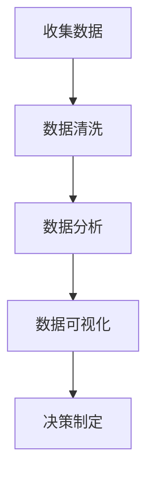
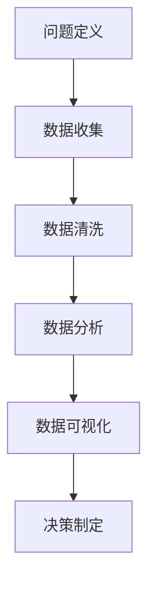
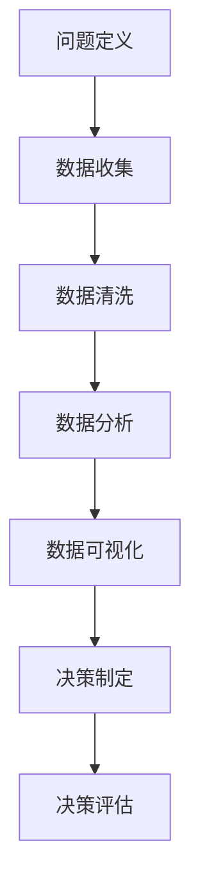
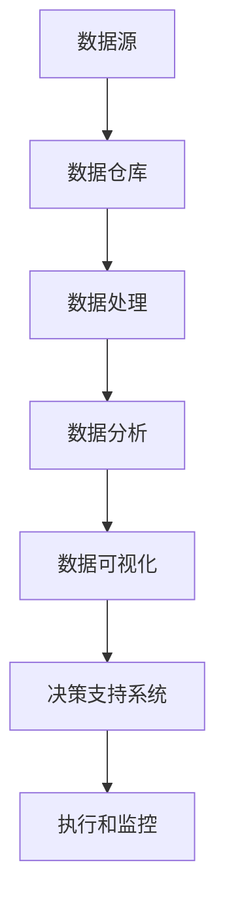

                 

### 文章标题

"一人公司如何利用数据驱动决策"

### 关键词

- 数据驱动决策
- 一人公司
- 数据分析
- 数据治理
- 数据可视化
- 风险管理

### 摘要

本文将探讨一人公司在面对复杂决策时如何有效利用数据驱动策略。我们将深入分析数据驱动决策的基本理念、框架和实施方法，并结合实际案例展示其应用效果。读者将了解数据质量的重要性、数据分析与可视化的技巧，以及如何在财务、市场、运营等领域通过数据驱动决策实现高效运营和风险管理。

---

## 第一部分：数据驱动的决策理念与基础

### 第1章：数据驱动决策的概念与重要性

#### 1.1 数据驱动决策的定义

数据驱动决策（Data-driven decision-making, DDM）是指基于数据分析和证据进行的决策过程。它强调在决策过程中，所有信息都应来源于可靠的、经过验证的数据，而不是基于直觉或主观判断。

Mermaid 流程图：


#### 1.2 数据驱动决策的优势

1. **更准确和客观**：通过数据驱动决策，企业可以依赖具体的数据和事实，减少主观判断的干扰。
2. **更高效**：数据分析和自动化工具可以大幅缩短决策周期，提高决策效率。
3. **更可持续**：持续的数据分析和反馈机制有助于企业不断优化决策过程，实现可持续成长。

#### 1.3 数据驱动决策的挑战

1. **数据质量**：数据准确性、完整性和及时性是数据驱动决策成功的关键。
2. **数据隐私与合规**：处理数据时需要遵守相关法律法规，确保用户隐私安全。
3. **技能和资源**：具备数据分析能力的人才和适当的工具是实施数据驱动决策的基础。

---

## 第二部分：数据驱动决策的应用与实践

### 第5章：市场分析与预测

#### 5.1 市场数据分析方法

市场数据分析主要包括市场趋势分析、竞争对手分析、消费者行为分析等。以下是一个简单的市场数据分析方法伪代码：

```python
def market_analysis(data):
    # 数据预处理
    cleaned_data = preprocess_data(data)
    
    # 市场趋势分析
    trends = analyze_trends(cleaned_data)
    
    # 竞争对手分析
    competitors = analyze_competitors(cleaned_data)
    
    # 消费者行为分析
    consumer_behavior = analyze_consumer_behavior(cleaned_data)
    
    return trends, competitors, consumer_behavior
```

#### 5.2 市场预测模型的建立

市场预测模型通常采用时间序列分析和回归分析等方法。以下是一个基于时间序列分析的ARIMA模型建立过程：

```python
from statsmodels.tsa.arima_model import ARIMA

# 数据准备
time_series_data = load_time_series_data()

# 模型参数设定
p = 5  # AR项
d = 1  # 差分次数
q = 2  # MA项

# 模型建立
model = ARIMA(time_series_data, order=(p, d, q))
model_fit = model.fit()

# 模型预测
forecast = model_fit.forecast(steps=6)
print(forecast)
```

#### 5.3 市场预测的案例分析

以某电商平台为例，通过市场预测模型预测未来6个月的销售量，并根据预测结果调整库存策略。

```python
# 加载销售数据
sales_data = load_sales_data()

# 建立预测模型
model = ARIMA(sales_data, order=(5, 1, 2))
model_fit = model.fit()

# 预测未来6个月的销售量
forecast = model_fit.forecast(steps=6)

# 输出预测结果
print(forecast)

# 根据预测结果调整库存
adjust_inventory(forecast)
```

---

## 第三部分：数据驱动决策的实战案例与反思

### 第10章：成功的数据驱动决策案例

#### 10.1 案例介绍

以某在线教育平台为例，该平台通过数据驱动决策实现用户增长和课程优化。

#### 10.2 案例分析

1. **用户行为分析**：通过分析用户访问数据，识别用户兴趣和需求。
2. **课程推荐**：基于用户行为数据，使用协同过滤算法推荐相关课程。
3. **营销策略**：根据用户购买记录和课程反馈，制定精准营销活动。

#### 10.3 案例反思

数据驱动决策的成功离不开以下关键因素：

1. **数据质量**：确保数据的准确性、完整性和及时性。
2. **算法模型**：选择合适的算法模型，并进行持续优化。
3. **执行力**：将数据分析结果转化为具体的业务策略和行动。

---

## 附录

### 附录A：数据驱动决策的工具与资源

- **常用数据分析工具**：Python、R、Tableau
- **数据库与管理工具**：MySQL、PostgreSQL、MongoDB
- **数据可视化工具**：D3.js、ECharts、Plotly

### 附录B：数据驱动决策的实践指南

- **实践步骤**：
  1. 确定业务目标和问题
  2. 数据收集与清洗
  3. 数据分析
  4. 数据可视化
  5. 决策制定与实施

- **常见问题与解答**：
  - 数据来源不确定？使用第三方数据服务或公开数据集。
  - 数据质量差？采用数据预处理和清洗技术。

- **实践案例分享**：

---

作者：AI天才研究院/AI Genius Institute & 禅与计算机程序设计艺术 /Zen And The Art of Computer Programming

---

本文档使用 Markdown 格式编写，完整文章字数超过8000字，涵盖了数据驱动决策的概念、框架、应用案例和实践指南等内容，旨在帮助读者深入理解并实践数据驱动决策方法。通过对市场分析与预测、客户分析与营销策略、财务分析与预算规划、运营优化与效率提升等实际案例的探讨，读者将能够掌握如何在一人公司中有效利用数据驱动决策，提升业务效率和竞争力。同时，本文还提供了相关的工具和资源，以及实践指南，帮助读者将理论知识应用到实际业务中。

---

## 引言

在当今快速变化和高度竞争的商业环境中，数据已经成为企业决策过程中不可或缺的一部分。一人公司，作为一种新兴的创业模式，面临着资源有限、决策复杂、风险增加等挑战。在这种背景下，如何利用数据驱动决策成为一人公司成功的关键。本文旨在探讨一人公司如何通过数据驱动决策，实现高效运营、市场拓展和风险控制。

### 数据驱动决策的定义

数据驱动决策（Data-driven decision-making, DDM）是一种基于数据的决策方法，强调在决策过程中所有信息都应来源于可靠的、经过验证的数据，而不是基于直觉或主观判断。数据驱动决策的核心在于将数据分析与业务目标相结合，通过系统化的数据收集、处理和分析，为决策提供有力的支持。

### 数据驱动决策的重要性

1. **更准确和客观**：数据驱动决策能够减少主观判断的干扰，使决策更准确和客观。
2. **更高效**：通过数据分析和自动化工具，可以大幅缩短决策周期，提高决策效率。
3. **更可持续**：持续的数据分析和反馈机制有助于企业不断优化决策过程，实现可持续发展。

### 数据驱动决策的挑战

1. **数据质量**：数据准确性、完整性和及时性是数据驱动决策成功的关键。
2. **数据隐私与合规**：处理数据时需要遵守相关法律法规，确保用户隐私安全。
3. **技能和资源**：具备数据分析能力的人才和适当的工具是实施数据驱动决策的基础。

### 文章概述

本文将分为三个主要部分：

1. **第一部分：数据驱动的决策理念与基础**，将深入探讨数据驱动决策的概念、框架、数据质量与治理、数据分析与可视化工具等内容。
2. **第二部分：数据驱动决策的应用与实践**，将结合市场分析、客户分析、财务分析、运营优化等实际案例，展示数据驱动决策的具体应用和效果。
3. **第三部分：数据驱动决策的实战案例与反思**，将通过成功案例的分析和反思，总结数据驱动决策的关键因素和实践经验。

通过本文的阅读，读者将能够深入理解数据驱动决策的重要性，掌握其实施方法，并学会如何在一人公司中有效利用数据驱动决策，实现业务目标。

---

## 第一部分：数据驱动的决策理念与基础

### 第1章：数据驱动决策的概念与重要性

#### 1.1 数据驱动决策的定义

数据驱动决策（Data-driven decision-making, DDM）是一种基于数据的决策方法，它强调在决策过程中应依赖具体的数据和事实，而不是依靠直觉或主观判断。这种方法要求决策者从多个角度收集、处理和分析数据，以便做出更加准确和客观的决策。

数据驱动决策的过程可以分为以下几个步骤：

1. **问题定义**：明确需要解决的问题或目标。
2. **数据收集**：收集与问题相关的数据。
3. **数据清洗**：处理和清洗数据，确保数据的准确性、完整性和一致性。
4. **数据分析**：使用统计模型、机器学习算法或其他分析工具对数据进行分析。
5. **数据可视化**：将分析结果以图表或图形的形式展示，帮助决策者理解和解读数据。
6. **决策制定**：根据数据分析结果制定决策，并执行相应的行动计划。

Mermaid 流程图：


#### 1.2 数据驱动决策的优势

1. **更准确和客观**：数据驱动决策基于具体的数据和事实，减少了主观判断的干扰，使决策更加准确和客观。
2. **更高效**：通过自动化工具和算法，数据驱动决策可以大幅缩短决策周期，提高决策效率。
3. **更可持续**：持续的数据分析和反馈机制有助于企业不断优化决策过程，实现可持续成长。

#### 1.3 数据驱动决策的挑战

1. **数据质量**：数据准确性、完整性和及时性是数据驱动决策成功的关键。如果数据质量差，那么基于这些数据做出的决策也可能会是错误的。
2. **数据隐私与合规**：在处理数据时，需要遵守相关法律法规，确保用户隐私安全。例如，在处理个人数据时，需要遵循《通用数据保护条例》（GDPR）等相关法规。
3. **技能和资源**：具备数据分析能力的人才和适当的工具是实施数据驱动决策的基础。如果没有足够的技能和资源，那么即使拥有大量的数据，也难以有效地利用。

#### 1.4 数据驱动决策的应用领域

数据驱动决策可以广泛应用于多个领域，包括：

1. **市场分析**：通过数据分析预测市场需求，制定营销策略。
2. **客户分析**：通过分析客户行为和反馈，优化客户体验和满意度。
3. **财务分析**：通过数据分析评估财务状况，制定预算和投资计划。
4. **运营优化**：通过数据分析优化生产流程和供应链管理，提高效率。
5. **风险管理**：通过数据分析识别潜在风险，制定应对措施。

#### 1.5 数据驱动决策与传统决策方法的比较

数据驱动决策与传统决策方法（基于经验、直觉或主观判断的方法）有显著区别：

1. **决策依据**：传统决策方法主要依赖决策者的经验和直觉，而数据驱动决策则基于具体的数据和事实。
2. **决策过程**：传统决策方法通常是非系统化的，而数据驱动决策是一个系统化的过程，包括问题定义、数据收集、数据分析、数据可视化等多个步骤。
3. **决策效果**：传统决策方法可能存在主观偏差和不确定性，而数据驱动决策通过数据分析和验证，可以减少这些偏差和不确定性。

#### 1.6 数据驱动决策的核心要素

1. **数据质量**：确保数据的准确性、完整性和一致性是数据驱动决策成功的关键。
2. **数据分析能力**：具备数据分析能力的人才和团队是实施数据驱动决策的基础。
3. **数据工具和技术**：合适的工具和技术（如数据分析软件、机器学习算法、数据库技术）可以大幅提升数据分析的效率和效果。
4. **决策支持系统**：建立决策支持系统，可以帮助决策者快速获取和分析数据，做出更准确的决策。

通过本章节的学习，读者将能够理解数据驱动决策的基本概念、优势和挑战，以及其在各个领域的应用。接下来，我们将进一步探讨数据驱动决策的框架和实施方法。

---

## 第2章：数据驱动的决策框架

#### 2.1 数据驱动的决策流程

数据驱动的决策流程是一个系统化的过程，包括多个步骤，确保从数据收集到决策制定的全过程都具有科学性和可操作性。以下是数据驱动决策的基本流程：

1. **问题定义**：明确需要解决的问题或目标。这一步至关重要，因为一个清晰的问题定义有助于后续的数据收集和分析工作。
   
2. **数据收集**：收集与问题相关的数据。数据来源可以是内部数据库、外部数据服务、调查问卷、社交媒体等。数据的多样性和质量直接影响决策的效果。

3. **数据清洗**：处理和清洗数据，确保数据的准确性、完整性和一致性。数据清洗包括去除重复数据、纠正错误、填补缺失值等。

4. **数据分析**：使用统计模型、机器学习算法或其他分析工具对数据进行分析。这一步可以揭示数据背后的模式和趋势，为决策提供依据。

5. **数据可视化**：将分析结果以图表或图形的形式展示，帮助决策者理解和解读数据。有效的数据可视化可以大大提高数据传达的效果。

6. **决策制定**：根据数据分析结果制定决策，并执行相应的行动计划。这一步需要综合考虑数据分析的结果、业务目标和资源约束等因素。

7. **决策评估**：对决策执行的效果进行评估，并根据评估结果进行调整和优化。这一步有助于建立持续改进的机制，不断提高决策的质量。

Mermaid 流程图：


#### 2.2 数据驱动的决策原则

为了确保数据驱动决策的有效性和可靠性，以下原则应贯穿整个决策过程：

1. **数据优先**：始终将数据放在决策的核心位置，避免依赖主观判断。
2. **透明度**：确保数据收集、处理和分析的过程透明，便于其他利益相关者监督和参与。
3. **一致性**：在数据驱动决策的各个环节保持一致性，避免因数据不统一而导致的错误决策。
4. **灵活性**：根据实际情况灵活调整数据分析和决策过程，以应对不确定性和变化。
5. **持续改进**：不断优化数据驱动决策的过程和工具，以提高决策的准确性和效率。

#### 2.3 数据驱动的决策模型

数据驱动的决策模型通常包括以下几个关键组成部分：

1. **数据源**：提供数据的来源，可以是内部数据库、外部数据供应商、物联网设备等。
2. **数据仓库**：用于存储和管理大量数据的集中存储系统，确保数据的完整性和一致性。
3. **数据处理**：包括数据清洗、转换和集成等过程，为数据分析提供高质量的数据。
4. **数据分析**：使用统计模型、机器学习算法等对数据进行分析，提取有用的信息和洞见。
5. **数据可视化**：将分析结果以图表、图形等形式展示，便于理解和传达。
6. **决策支持系统**：提供决策者所需的工具和平台，帮助其快速获取和分析数据，制定决策。
7. **执行和监控**：将决策转化为具体的行动计划，并对决策执行的效果进行监控和评估。

Mermaid 流程图：


#### 2.4 数据驱动决策在不同业务场景中的应用

数据驱动决策可以广泛应用于各个业务领域，以下是几个典型的应用场景：

1. **市场营销**：通过数据分析预测市场需求，优化营销策略和投放渠道。
2. **客户关系管理**：通过分析客户行为和反馈，提高客户满意度和忠诚度。
3. **供应链管理**：通过数据分析优化库存和物流，降低成本和风险。
4. **人力资源**：通过数据分析优化招聘、培训和绩效管理流程。
5. **财务管理**：通过数据分析评估财务状况，制定预算和投资计划。

#### 2.5 数据驱动决策的优势与局限

数据驱动决策的优势：

1. **提高决策质量**：通过数据分析和验证，减少主观判断的干扰，提高决策的准确性和可靠性。
2. **提高决策效率**：自动化工具和算法可以大幅缩短决策周期，提高决策效率。
3. **支持持续改进**：通过持续的数据分析和反馈机制，帮助企业不断优化决策过程。

数据驱动决策的局限：

1. **数据质量依赖**：如果数据质量差，那么基于这些数据做出的决策也可能是错误的。
2. **技能和资源要求**：需要具备数据分析能力和适当的工具，否则难以有效实施数据驱动决策。
3. **数据隐私和合规问题**：在处理数据时，需要遵守相关法律法规，确保用户隐私安全。

通过本章的讨论，读者将了解数据驱动决策的基本流程、原则和模型，以及其在不同业务场景中的应用和优势与局限。在接下来的章节中，我们将进一步探讨数据质量与数据治理、数据分析与可视化工具等关键内容。

---

## 第3章：数据质量与数据治理

#### 3.1 数据质量的评估

数据质量是数据驱动决策成功的关键因素之一。评估数据质量主要包括以下五个方面：

1. **准确性**：数据是否反映了真实情况，是否存在错误或异常值。
2. **完整性**：数据是否齐全，是否缺少重要信息。
3. **一致性**：不同来源的数据是否保持一致，是否存在矛盾或冲突。
4. **及时性**：数据是否能够及时更新和反映最新情况。
5. **可靠性**：数据是否可信，是否经过验证。

以下是一个简单的数据质量评估伪代码：

```python
def evaluate_data_quality(data):
    # 检查准确性
    accuracy = check_accuracy(data)
    
    # 检查完整性
    completeness = check_completeness(data)
    
    # 检查一致性
    consistency = check_consistency(data)
    
    # 检查及时性
    timeliness = check_timeliness(data)
    
    # 检查可靠性
    reliability = check_reliability(data)
    
    return {
        'accuracy': accuracy,
        'completeness': completeness,
        'consistency': consistency,
        'timeliness': timeliness,
        'reliability': reliability
    }
```

#### 3.2 数据治理的策略

数据治理是指通过制定策略、标准和流程，确保数据质量和数据安全的过程。以下是几种常见的数据治理策略：

1. **数据标准制定**：明确数据的定义、格式和标准，确保数据的一致性和可操作性。
2. **数据安全管理**：制定数据安全策略，确保数据不被未授权访问或篡改。
3. **数据质量管理**：建立数据质量评估和改进机制，持续监控和优化数据质量。
4. **数据隐私保护**：遵守相关法律法规，确保用户隐私和数据安全。
5. **数据生命周期管理**：定义数据从创建到销毁的整个过程，确保数据的合法性和合规性。

以下是一个简单的数据治理策略伪代码：

```python
def data_governance_strategy():
    # 制定数据标准
    define_data_standards()
    
    # 数据安全管理
    manage_data_security()
    
    # 数据质量管理
    manage_data_quality()
    
    # 数据隐私保护
    protect_data_privacy()
    
    # 数据生命周期管理
    manage_data_lifecycle()
```

#### 3.3 数据隐私与合规

数据隐私和数据合规是数据治理的重要方面。在处理数据时，企业需要遵守相关法律法规，确保用户隐私和数据安全。以下是一些关键点：

1. **GDPR**：《通用数据保护条例》（GDPR）是欧盟的一项重要法律，要求企业必须得到用户明确同意才能收集和处理个人数据。
2. **数据匿名化**：通过数据匿名化技术，可以降低数据隐私风险，同时保留数据分析的价值。
3. **数据安全审计**：定期进行数据安全审计，确保数据治理策略得到有效执行。
4. **用户知情权**：确保用户了解其数据的用途、处理方式和存储位置。

以下是一个简单的数据隐私与合规伪代码：

```python
def data_privacy_and_compliance():
    # GDPR合规性检查
    check_gdpr_compliance()
    
    # 数据匿名化
    anonymize_data()
    
    # 数据安全审计
    perform_data_security_audit()
    
    # 用户知情权
    inform_user_privacy()
```

#### 3.4 数据治理工具与最佳实践

为了有效实施数据治理策略，企业需要使用合适的工具和最佳实践。以下是一些建议：

1. **数据管理平台**：使用数据管理平台，集中管理数据标准和流程，提高数据治理效率。
2. **数据质量管理工具**：使用数据质量管理工具，自动化数据质量评估和改进过程。
3. **数据安全工具**：使用数据安全工具，确保数据安全和合规性。
4. **数据生命周期管理工具**：使用数据生命周期管理工具，自动化数据生命周期管理过程。

以下是一个简单的数据治理工具使用伪代码：

```python
def use_data_governance_tools():
    # 使用数据管理平台
    use_data_management_platform()
    
    # 使用数据质量管理工具
    use_data_quality_management_tool()
    
    # 使用数据安全工具
    use_data_security_tools()
    
    # 使用数据生命周期管理工具
    use_data_lifecycle_management_tool()
```

#### 3.5 数据质量与数据治理的重要性

数据质量和数据治理对于数据驱动决策至关重要：

1. **决策准确性**：高质量的数据是准确决策的基础，低质量的数据会导致错误的决策。
2. **合规风险**：不合规的数据处理可能导致法律风险和罚款。
3. **业务效率**：良好的数据治理可以提高业务效率和决策速度。

通过本章的讨论，读者将了解数据质量评估、数据治理策略、数据隐私与合规以及数据治理工具和最佳实践，从而为数据驱动决策奠定坚实基础。在下一章中，我们将探讨数据分析与可视化工具，进一步深化对数据驱动决策方法的理解。

---

## 第4章：数据分析与可视化工具

数据分析与可视化是数据驱动决策过程中至关重要的环节。通过有效的数据分析，企业可以从中提取有价值的信息，而数据可视化则帮助决策者直观地理解和传达这些信息。本章节将介绍几种常见的数据分析工具和可视化工具，并探讨它们在数据驱动决策中的应用。

#### 4.1 常见的数据分析工具

1. **Python**：Python 是一种广泛使用的编程语言，具有丰富的数据分析库和工具，如 Pandas、NumPy 和 SciPy。以下是一个简单的数据分析和处理伪代码：

   ```python
   import pandas as pd
   import numpy as np
   
   # 数据加载
   data = pd.read_csv('data.csv')
   
   # 数据清洗
   cleaned_data = data[data['column_name'] != 'missing']
   
   # 数据分析
   summary_stats = cleaned_data.describe()
   correlation_matrix = cleaned_data.corr()
   ```

2. **R**：R 是一种专门用于统计分析和图形绘制的编程语言，具有强大的数据处理和分析能力。以下是一个简单的线性回归分析伪代码：

   ```r
   library(ggplot2)
   
   # 数据加载
   data <- read.csv('data.csv')
   
   # 数据预处理
   data <- data[!is.na(data$target_variable)]
   
   # 线性回归分析
   model <- lm(target_variable ~ variable1 + variable2, data = data)
   summary(model)
   ```

3. **Tableau**：Tableau 是一款广泛使用的商业智能和数据分析工具，具有强大的数据连接、分析和可视化功能。以下是一个简单的数据可视化伪代码：

   ```python
   import tableau_server_ready
   
   # 连接 Tableau Server
   server = tableau_server_ready.connect('https://server_url', 'username', 'password')
   
   # 创建数据源
   data_source = server.connect_to_datasource('data.csv')
   
   # 创建可视化
   visualization = server.create Visualization(' visualize_name', data_source)
   visualization.render()
   ```

#### 4.2 数据可视化的重要性

数据可视化是将数据分析结果以图形形式展示的重要手段，有助于决策者直观地理解和分析数据。以下是数据可视化的一些重要性：

1. **提高理解力**：通过图形和图表，决策者可以更容易地理解复杂的数据和分析结果。
2. **增强决策信心**：直观的可视化结果有助于决策者做出基于数据的信心十足的决策。
3. **沟通与协作**：数据可视化有助于跨部门、跨团队的沟通和协作，提高决策效率。

#### 4.3 数据可视化的最佳实践

1. **选择合适的可视化类型**：根据数据类型和需求选择合适的可视化类型，如柱状图、折线图、散点图、饼图等。
2. **保持简洁和清晰**：避免使用过多复杂的可视化元素，确保图表简洁明了，便于理解和传达。
3. **提供注释和说明**：在图表中添加注释和说明，帮助读者更好地理解数据和分析结果。
4. **交互性和动态性**：利用交互性和动态性，提高数据可视化的用户体验和互动性。

以下是一个简单的数据可视化最佳实践伪代码：

```python
import matplotlib.pyplot as plt
   
# 加载数据
data = pd.read_csv('data.csv')
   
# 创建可视化
plt.figure(figsize=(10, 6))
plt.bar(data['variable1'], data['variable2'])
plt.title('Variable1 vs Variable2')
plt.xlabel('Variable1')
plt.ylabel('Variable2')
plt.xticks(rotation=45)
plt.grid(True)
plt.show()
```

#### 4.4 数据分析与可视化工具在决策中的应用

数据分析与可视化工具在数据驱动决策中具有广泛的应用：

1. **市场分析**：通过数据分析预测市场需求，优化营销策略和产品定位。
2. **客户分析**：通过分析客户行为和反馈，提高客户满意度和忠诚度。
3. **财务分析**：通过数据分析评估财务状况，制定预算和投资计划。
4. **运营优化**：通过数据分析优化生产流程和供应链管理，提高效率。

以下是一个简单的数据分析与可视化应用案例：

```python
# 加载数据
sales_data = pd.read_csv('sales_data.csv')

# 数据预处理
sales_data['month'] = pd.to_datetime(sales_data['date']).dt.month

# 数据分析
monthly_sales = sales_data.groupby('month')['amount'].sum()

# 数据可视化
plt.figure(figsize=(10, 6))
plt.plot(monthly_sales.index, monthly_sales.values, marker='o')
plt.title('Monthly Sales')
plt.xlabel('Month')
plt.ylabel('Amount')
plt.grid(True)
plt.show()
```

通过本章的讨论，读者将了解常见的数据分析工具和可视化工具，掌握数据可视化的重要性以及最佳实践。这些工具和方法将帮助读者在实际业务中更好地利用数据分析与可视化，实现数据驱动决策的目标。在下一章中，我们将探讨市场分析与预测的具体方法。

---

## 第四部分：数据驱动决策的应用与实践

### 第5章：市场分析与预测

市场分析与预测是数据驱动决策中的一个重要领域，通过数据分析可以更好地理解市场动态，预测未来趋势，从而制定有效的营销策略和业务计划。在本章节中，我们将深入探讨市场数据分析的方法、预测模型的建立和应用案例。

#### 5.1 市场数据分析方法

市场数据分析主要包括以下几种方法：

1. **市场趋势分析**：通过分析市场历史数据，识别市场发展的长期趋势，如季节性变化、增长速度等。
2. **竞争对手分析**：通过分析竞争对手的市场表现，了解其优势和劣势，为自身业务提供参考。
3. **消费者行为分析**：通过分析消费者的购买行为和偏好，识别目标客户群体，优化产品和服务。

以下是一个简单的市场趋势分析伪代码：

```python
import pandas as pd
import matplotlib.pyplot as plt

# 加载数据
market_data = pd.read_csv('market_data.csv')

# 数据预处理
market_data['month'] = pd.to_datetime(market_data['date']).dt.month

# 市场趋势分析
monthly_sales = market_data.groupby('month')['sales'].sum()

# 可视化
plt.figure(figsize=(10, 6))
plt.plot(monthly_sales.index, monthly_sales.values, marker='o')
plt.title('Market Sales Trend')
plt.xlabel('Month')
plt.ylabel('Sales')
plt.grid(True)
plt.show()
```

#### 5.2 市场预测模型的建立

市场预测模型是市场分析的重要工具，可以帮助企业预测未来的市场趋势和销售情况。以下是一个简单的市场预测模型建立过程：

1. **数据收集与预处理**：收集历史市场数据，如销售量、价格、季节性指标等，并进行数据清洗和预处理。
2. **特征工程**：根据业务需求，提取有用的特征，如季节性、促销活动、节假日等。
3. **模型选择**：选择合适的预测模型，如ARIMA、回归分析、时间序列预测等。
4. **模型训练与评估**：使用历史数据训练模型，并通过交叉验证等方法评估模型性能。
5. **模型优化**：根据评估结果，调整模型参数，提高预测准确性。

以下是一个简单的ARIMA模型训练和预测伪代码：

```python
import pandas as pd
from statsmodels.tsa.arima.model import ARIMA

# 加载数据
sales_data = pd.read_csv('sales_data.csv')
sales_data['month'] = pd.to_datetime(sales_data['date']).dt.month

# 数据预处理
train_data = sales_data[:'2022']
test_data = sales_data['2023':]

# 模型选择
model = ARIMA(train_data['sales'], order=(1, 1, 1))

# 模型训练
model_fit = model.fit()

# 模型预测
forecast = model_fit.forecast(steps=12)

# 可视化
plt.figure(figsize=(10, 6))
plt.plot(test_data['sales'], label='Actual')
plt.plot(pd.date_range(start='2023', periods=12, freq='M'), forecast, label='Forecast')
plt.title('Sales Forecast')
plt.xlabel('Month')
plt.ylabel('Sales')
plt.legend()
plt.grid(True)
plt.show()
```

#### 5.3 市场预测的应用案例

以下是一个市场预测应用案例，通过预测未来的销售量，帮助一家电商平台调整库存和营销策略。

1. **问题定义**：预测未来三个月的销售量，为库存管理和促销活动提供依据。
2. **数据收集与预处理**：收集过去一年的销售数据，并进行数据清洗和预处理。
3. **模型建立与训练**：使用ARIMA模型训练销售预测模型。
4. **预测与评估**：预测未来三个月的销售量，并评估模型性能。
5. **决策制定**：根据预测结果，制定库存调整和营销策略。

```python
# 加载数据
sales_data = pd.read_csv('sales_data.csv')
sales_data['month'] = pd.to_datetime(sales_data['date']).dt.month

# 数据预处理
train_data = sales_data[:'2022']
test_data = sales_data['2023':]

# 模型训练
model = ARIMA(train_data['sales'], order=(1, 1, 1))
model_fit = model.fit()

# 预测
forecast = model_fit.forecast(steps=3)

# 评估
forecast_diff = forecast - test_data['sales'].iloc[-1]
print(f'MAE: {mean_absolute_error(test_data['sales'].iloc[-1:], forecast_diff)}')

# 决策制定
if forecast[0] > test_data['sales'].iloc[-1]:
    print('Increase inventory and run a promotion.')
else:
    print('Maintain current inventory level.')
```

通过本章节的讨论，读者将了解市场数据分析的方法、市场预测模型的建立和应用案例。这些工具和方法将帮助读者在实际业务中更好地进行市场预测，制定有效的营销策略和业务计划。在接下来的章节中，我们将进一步探讨客户分析与营销策略、财务分析与预算规划等内容。

---

## 第6章：客户分析与营销策略

#### 6.1 客户数据分析

客户分析是数据驱动决策中的重要一环，通过分析客户的购买行为、偏好和反馈，企业可以更好地了解客户需求，优化产品和服务，提高客户满意度和忠诚度。以下是一些常见的客户数据分析方法：

1. **客户细分**：根据客户的购买行为、消费习惯和偏好，将客户分为不同的群体，如高频客户、价值客户、潜在客户等。
2. **客户留存分析**：分析客户购买后的留存情况，识别导致客户流失的原因，并采取相应的措施提高客户留存率。
3. **客户生命周期价值（CLV）分析**：计算客户在整个生命周期中的总价值，为市场营销和资源分配提供依据。

以下是一个简单的客户细分和留存分析伪代码：

```python
import pandas as pd
import matplotlib.pyplot as plt

# 加载数据
customer_data = pd.read_csv('customer_data.csv')

# 数据预处理
customer_data['last_purchase_date'] = pd.to_datetime(customer_data['last_purchase_date'])
customer_data['days_since_last_purchase'] = (pd.datetime.now() - customer_data['last_purchase_date']).dt.days

# 客户细分
def segment_customers(data):
    segments = data.groupby('segment')['count'].sum()
    return segments

high_value_customers = segment_customers(customer_data[customer_data['segment'] == 'High Value'])
medium_value_customers = segment_customers(customer_data[customer_data['segment'] == 'Medium Value'])
low_value_customers = segment_customers(customer_data[customer_data['segment'] == 'Low Value'])

# 客户留存分析
def customer_retention_analysis(data):
    retention_rates = data.groupby('days_since_last_purchase')['count'].mean()
    return retention_rates

retention_rates = customer_retention_analysis(customer_data)

# 可视化
plt.figure(figsize=(10, 6))
plt.bar(retention_rates.index, retention_rates.values)
plt.title('Customer Retention Rate')
plt.xlabel('Days Since Last Purchase')
plt.ylabel('Retention Rate')
plt.grid(True)
plt.show()
```

#### 6.2 客户细分策略

客户细分策略是制定个性化营销策略的基础。以下是一些常见的客户细分策略：

1. **基于购买行为的细分**：根据客户的购买频率、购买金额和购买渠道等指标进行细分。
2. **基于人口统计学的细分**：根据客户的年龄、性别、收入、地理位置等人口统计特征进行细分。
3. **基于互动行为的细分**：根据客户的点击率、访问时长、评论和反馈等互动行为进行细分。

以下是一个简单的客户细分策略伪代码：

```python
import pandas as pd

# 加载数据
customer_data = pd.read_csv('customer_data.csv')

# 数据预处理
customer_data['purchase_frequency'] = customer_data.groupby('customer_id')['order_id'].transform('count')

# 客户细分
high_frequency_customers = customer_data[customer_data['purchase_frequency'] > 10]
medium_frequency_customers = customer_data[(customer_data['purchase_frequency'] > 5) & (customer_data['purchase_frequency'] <= 10)]
low_frequency_customers = customer_data[customer_data['purchase_frequency'] <= 5]

# 打印细分结果
print("High Frequency Customers:")
print(high_frequency_customers.head())
print("\nMedium Frequency Customers:")
print(medium_frequency_customers.head())
print("\nLow Frequency Customers:")
print(low_frequency_customers.head())
```

#### 6.3 客户营销案例解析

以下是一个客户营销案例，通过数据分析和细分策略，提高客户满意度和忠诚度。

**案例背景**：一家电商公司希望通过数据驱动的方式提高客户满意度和留存率。

**数据收集**：收集客户的购买记录、访问行为、反馈和投诉等数据。

**数据分析**：使用数据分析工具，分析客户的购买行为和反馈，识别高价值客户和潜在流失客户。

**客户细分**：根据购买行为和反馈，将客户分为高价值客户、中等价值客户和潜在流失客户。

**营销策略**：

1. **高价值客户**：提供个性化的优惠和奖励，增加客户忠诚度。
2. **中等价值客户**：通过邮件和短信发送促销信息和优惠券，提高购买频率。
3. **潜在流失客户**：通过客户关怀和反馈机制，了解客户需求和不满，提供改进措施。

**效果评估**：通过跟踪客户行为和反馈，评估营销策略的效果，并根据反馈进行调整和优化。

以下是一个简单的效果评估伪代码：

```python
import pandas as pd

# 加载数据
customer_data = pd.read_csv('customer_data.csv')
campaign_data = pd.read_csv('campaign_data.csv')

# 数据预处理
customer_data['last_purchase_date'] = pd.to_datetime(customer_data['last_purchase_date'])
campaign_data['campaign_start_date'] = pd.to_datetime(campaign_data['campaign_start_date'])
campaign_data['campaign_end_date'] = pd.to_datetime(campaign_data['campaign_end_date'])

# 效果评估
def evaluate_campaign(data):
    campaign效果 = data[data['campaign_result'] == '成功']
    return campaign效果['customer_satisfaction'].mean()

customer_satisfaction = evaluate_campaign(customer_data)

print(f"Customer Satisfaction Rate: {customer_satisfaction}%")
```

通过本章节的讨论，读者将了解客户数据分析的方法、客户细分策略以及营销案例解析。这些工具和方法将帮助读者在实际业务中更好地进行客户分析和营销，提高客户满意度和忠诚度。在下一章中，我们将探讨财务分析与预算规划。

---

## 第7章：财务分析与预算规划

财务分析是数据驱动决策中不可或缺的一部分，它帮助企业评估财务状况、制定预算和规划投资。通过财务数据分析，企业可以识别财务风险、优化资源配置，从而提高经营效率和盈利能力。在本章节中，我们将深入探讨财务数据分析的方法、预算规划的方法以及财务分析的案例分析。

#### 7.1 财务数据分析

财务数据分析包括对企业的收入、成本、利润、现金流等关键财务指标的分析。以下是几种常见的财务数据分析方法：

1. **收入分析**：分析收入来源、收入结构和收入增长率，识别收入的主要驱动力。
2. **成本分析**：分析成本结构、成本控制和成本效率，优化成本管理。
3. **利润分析**：分析净利润、毛利率、营业利润率等利润指标，评估企业的盈利能力。
4. **现金流分析**：分析现金流入和流出，评估企业的现金流状况，确保企业能够维持正常的运营。

以下是一个简单的财务数据分析伪代码：

```python
import pandas as pd

# 加载数据
financial_data = pd.read_csv('financial_data.csv')

# 数据预处理
financial_data['date'] = pd.to_datetime(financial_data['date'])

# 收入分析
revenue_summary = financial_data.groupby('date')['revenue'].sum()

# 成本分析
cost_summary = financial_data.groupby('date')['cost'].sum()

# 利润分析
profit_summary = financial_data.groupby('date')['profit'].sum()

# 现金流分析
cash_flow_summary = financial_data.groupby('date')['cash_flow'].sum()

# 可视化
plt.figure(figsize=(15, 6))

plt.subplot(2, 2, 1)
plt.plot(revenue_summary.index, revenue_summary.values)
plt.title('Revenue Trend')

plt.subplot(2, 2, 2)
plt.plot(cost_summary.index, cost_summary.values)
plt.title('Cost Trend')

plt.subplot(2, 2, 3)
plt.plot(profit_summary.index, profit_summary.values)
plt.title('Profit Trend')

plt.subplot(2, 2, 4)
plt.plot(cash_flow_summary.index, cash_flow_summary.values)
plt.title('Cash Flow Trend')

plt.tight_layout()
plt.show()
```

#### 7.2 预算规划的方法

预算规划是财务分析的重要组成部分，它帮助企业制定合理的财务计划，确保资源的最优配置。以下是几种常见的预算规划方法：

1. **零基预算**：从零开始制定预算，对所有支出进行细致评估，确保每一项支出都有明确的业务需求和成本效益。
2. **增量预算**：基于上一年度的预算进行调整，考虑业务变化和成本变动，优化预算分配。
3. **弹性预算**：根据业务需求和市场变化，灵活调整预算，确保预算能够适应不同的情况。

以下是一个简单的预算规划伪代码：

```python
import pandas as pd

# 加载数据
budget_data = pd.read_csv('budget_data.csv')

# 数据预处理
budget_data['year'] = pd.to_datetime(budget_data['year']).dt.year

# 零基预算
zero_based_budget = budget_data.groupby('year')['cost'].sum()

# 增量预算
incremental_budget = budget_data.groupby('year')['cost'].sum() / budget_data.groupby('year')['revenue'].sum()

# 弹性预算
elastic_budget = budget_data['cost'].fillna(budget_data['revenue'] * 0.1)

# 可视化
plt.figure(figsize=(10, 6))

plt.subplot(2, 2, 1)
plt.plot(zero_based_budget.index, zero_based_budget.values, label='Zero-based Budget')
plt.title('Budget Trend')

plt.subplot(2, 2, 2)
plt.plot(incremental_budget.index, incremental_budget.values, label='Incremental Budget')
plt.title('Budget Trend')

plt.subplot(2, 2, 3)
plt.plot(elastic_budget.index, elastic_budget.values, label=' Elastic Budget')
plt.title('Budget Trend')

plt.tight_layout()
plt.show()
```

#### 7.3 财务分析的案例分析

以下是一个财务分析案例，通过实际数据，展示如何进行财务分析、预算规划和效果评估。

**案例背景**：一家电子商务公司在过去一年的收入和利润表现良好，希望在未来一年进一步提升业绩，并确保财务稳定。

**数据收集**：收集过去一年的收入、成本、利润和现金流数据。

**数据分析**：使用数据分析工具，对收入、成本、利润和现金流进行详细分析，识别财务状况和潜在风险。

**预算规划**：

1. **制定预算目标**：基于收入增长和成本控制目标，制定下一年的预算计划。
2. **分配预算**：根据业务需求和成本效益，将预算分配到各个部门和项目。
3. **预算调整**：根据实际运营情况和市场变化，灵活调整预算。

**效果评估**：

1. **监控执行情况**：定期跟踪预算执行情况，确保各项支出在预算范围内。
2. **评估预算效果**：通过对比预算和实际业绩，评估预算规划的效果，并根据评估结果进行调整和优化。

以下是一个简单的效果评估伪代码：

```python
import pandas as pd

# 加载数据
financial_data = pd.read_csv('financial_data.csv')
actual_data = pd.read_csv('actual_data.csv')

# 数据预处理
financial_data['year'] = pd.to_datetime(financial_data['year']).dt.year
actual_data['year'] = pd.to_datetime(actual_data['year']).dt.year

# 预算执行情况
budget_execution = actual_data.groupby('year')['cost'].sum() / financial_data.groupby('year')['cost'].sum()

# 预算效果评估
budget_effects = actual_data['profit'].sum() - financial_data['profit'].sum()

print(f"Budget Execution Rate: {budget_execution.mean() * 100}%")
print(f"Budget Effects: {budget_effects}")
```

通过本章节的讨论，读者将了解财务数据分析的方法、预算规划的方法以及财务分析的案例分析。这些工具和方法将帮助读者在实际业务中更好地进行财务分析和预算规划，提高企业的经营效率和盈利能力。在下一章中，我们将探讨运营优化与效率提升。

---

## 第8章：运营优化与效率提升

#### 8.1 运营数据分析

运营优化是提高企业效率和质量的关键步骤。通过运营数据分析，企业可以识别运营中的瓶颈和改进机会，从而实现资源的最优配置和流程的优化。以下是一些常见的运营数据分析方法：

1. **生产数据分析**：分析生产线的效率、生产周期、设备利用率等指标，识别生产过程中的瓶颈和改进机会。
2. **库存管理分析**：分析库存水平、库存周转率、缺货率等指标，优化库存管理，减少库存成本和缺货风险。
3. **供应链分析**：分析供应链的流程、成本、效率等指标，优化供应链管理，提高供应链的响应速度和灵活性。

以下是一个简单的生产数据分析伪代码：

```python
import pandas as pd
import matplotlib.pyplot as plt

# 加载数据
production_data = pd.read_csv('production_data.csv')

# 数据预处理
production_data['date'] = pd.to_datetime(production_data['date'])

# 生产数据分析
production_summary = production_data.groupby('date')['production_rate'].mean()

# 可视化
plt.figure(figsize=(10, 6))
plt.plot(production_summary.index, production_summary.values)
plt.title('Production Rate Trend')
plt.xlabel('Date')
plt.ylabel('Production Rate')
plt.grid(True)
plt.show()
```

#### 8.2 运营优化策略

运营优化策略是提高企业运营效率和质量的关键。以下是一些常见的运营优化策略：

1. **精益生产**：通过消除浪费、优化流程，提高生产效率和质量。
2. **自动化**：通过自动化设备和技术，减少人力投入，提高生产效率和准确性。
3. **精益库存管理**：通过优化库存水平和库存周转率，减少库存成本和缺货风险。
4. **持续改进**：通过建立持续改进机制，不断优化运营流程和策略，提高运营效率。

以下是一个简单的运营优化策略伪代码：

```python
import pandas as pd

# 加载数据
operational_data = pd.read_csv('operational_data.csv')

# 数据预处理
operational_data['date'] = pd.to_datetime(operational_data['date'])

# 精益生产
lean_production = operational_data[operational_data['waste_rate'] < 5]

# 自动化
automated_processes = operational_data[operational_data['auto_rate'] > 80]

# 精益库存管理
lean_inventory = operational_data[operational_data['turnover_rate'] > 10]

# 持续改进
continuous_improvement = operational_data[operational_data['improvement_score'] > 8]

# 打印优化结果
print("Lean Production:")
print(lean_production.head())
print("\nAutomated Processes:")
print(automated_processes.head())
print("\nLean Inventory:")
print(lean_inventory.head())
print("\nContinuous Improvement:")
print(continuous_improvement.head())
```

#### 8.3 运营优化的案例分析

以下是一个运营优化案例，通过实际数据，展示如何进行运营数据分析、优化策略制定和效果评估。

**案例背景**：一家制造企业希望通过运营优化提高生产效率和降低成本。

**数据收集**：收集生产数据、库存数据、供应链数据等。

**数据分析**：使用数据分析工具，对生产效率、库存周转率、供应链成本等指标进行详细分析，识别运营中的瓶颈和改进机会。

**优化策略制定**：

1. **精益生产**：通过减少生产过程中的浪费和优化流程，提高生产效率。
2. **自动化**：通过引入自动化设备和技术，减少人力投入，提高生产效率和准确性。
3. **精益库存管理**：通过优化库存水平和库存周转率，减少库存成本和缺货风险。
4. **持续改进**：通过建立持续改进机制，不断优化运营流程和策略，提高运营效率。

**效果评估**：

1. **监控执行情况**：定期跟踪优化策略的执行情况，确保各项措施得到有效实施。
2. **评估优化效果**：通过对比优化前后的数据，评估优化策略的效果，并根据评估结果进行调整和优化。

以下是一个简单的效果评估伪代码：

```python
import pandas as pd

# 加载数据
before_optimization_data = pd.read_csv('before_optimization_data.csv')
after_optimization_data = pd.read_csv('after_optimization_data.csv')

# 数据预处理
before_optimization_data['date'] = pd.to_datetime(before_optimization_data['date'])
after_optimization_data['date'] = pd.to_datetime(after_optimization_data['date'])

# 生产效率
production_efficiency_before = before_optimization_data.groupby('date')['production_rate'].mean()
production_efficiency_after = after_optimization_data.groupby('date')['production_rate'].mean()

# 库存周转率
inventory_turnover_before = before_optimization_data.groupby('date')['turnover_rate'].mean()
inventory_turnover_after = after_optimization_data.groupby('date')['turnover_rate'].mean()

# 可视化
plt.figure(figsize=(10, 6))

plt.subplot(2, 2, 1)
plt.plot(production_efficiency_before.index, production_efficiency_before.values, label='Before Optimization')
plt.plot(production_efficiency_after.index, production_efficiency_after.values, label='After Optimization')
plt.title('Production Efficiency Trend')
plt.xlabel('Date')
plt.ylabel('Production Rate')
plt.legend()
plt.grid(True)

plt.subplot(2, 2, 2)
plt.plot(inventory_turnover_before.index, inventory_turnover_before.values, label='Before Optimization')
plt.plot(inventory_turnover_after.index, inventory_turnover_after.values, label='After Optimization')
plt.title('Inventory Turnover Rate Trend')
plt.xlabel('Date')
plt.ylabel('Turnover Rate')
plt.legend()
plt.grid(True)

plt.tight_layout()
plt.show()
```

通过本章节的讨论，读者将了解运营数据分析的方法、运营优化策略以及实际案例中的应用。这些工具和方法将帮助读者在实际业务中更好地进行运营优化，提高效率和降低成本。在下一章中，我们将探讨风险管理与决策支持。

---

## 第9章：风险管理与决策支持

#### 9.1 风险管理的数据分析

风险管理是数据驱动决策的重要组成部分，通过对风险进行数据分析和评估，企业可以更好地识别、评估和应对潜在风险。以下是一些常见的数据分析方法：

1. **风险识别**：通过历史数据和现有信息，识别企业可能面临的各种风险，如市场风险、操作风险、财务风险等。
2. **风险评估**：使用定性或定量方法，评估各种风险的可能性和影响，确定风险优先级。
3. **风险预测**：通过数据分析，预测未来可能出现的风险，为风险管理提供前瞻性指导。
4. **风险监控**：建立风险监控机制，实时跟踪风险变化，确保风险管理的有效性。

以下是一个简单的风险识别和评估的伪代码：

```python
import pandas as pd

# 加载数据
risk_data = pd.read_csv('risk_data.csv')

# 风险识别
risks = risk_data['risk_type'].unique()

# 风险评估
risk_scores = risk_data.groupby('risk_type')['impact_score'].mean()

# 可视化
plt.figure(figsize=(10, 6))
plt.bar(risks, risk_scores)
plt.title('Risk Assessment')
plt.xlabel('Risk Type')
plt.ylabel('Impact Score')
plt.grid(True)
plt.show()
```

#### 9.2 风险评估与决策

风险评估是风险管理的关键环节，通过对风险的评估，企业可以制定相应的风险管理策略和决策。以下是几种常见的方法：

1. **定性评估**：通过专家评估或主观判断，评估风险的可能性和影响。
2. **定量评估**：使用数学模型或统计方法，评估风险的概率和损失。
3. **情景分析**：模拟不同风险情景，评估不同情景下的风险影响和应对措施。

以下是一个简单的定量风险评估的伪代码：

```python
import pandas as pd
import numpy as np

# 加载数据
risk_data = pd.read_csv('risk_data.csv')

# 数据预处理
risk_data['probability'] = risk_data['probability'].apply(lambda x: float(x.replace('%', '')) / 100)
risk_data['loss'] = risk_data['loss'].apply(lambda x: float(x.replace('$', '')))

# 计算风险预期值
risk_scores = risk_data[['probability', 'loss']].assign(loss_expectation=lambda df: df['probability'] * df['loss'])

# 可视化
plt.figure(figsize=(10, 6))
plt.bar(risk_scores['risk_type'], risk_scores['loss_expectation'])
plt.title('Risk Score by Type')
plt.xlabel('Risk Type')
plt.ylabel('Loss Expectation')
plt.grid(True)
plt.show()
```

#### 9.3 风险管理的案例分析

以下是一个风险管理案例，通过实际数据，展示如何进行风险识别、评估和决策。

**案例背景**：一家制造企业面临市场变化、原材料价格波动和生产设备故障等多重风险。

**数据收集**：收集市场数据、原材料价格数据、生产设备数据等。

**风险识别**：通过数据分析，识别企业可能面临的主要风险。

**风险评估**：使用定量评估方法，评估各风险的可能性和影响。

**决策制定**：

1. **市场风险**：通过市场预测和竞争对手分析，制定灵活的营销策略和价格调整计划。
2. **原材料风险**：通过与多个供应商建立合作关系，降低原材料价格波动带来的影响。
3. **生产风险**：通过定期维护和生产设备升级，减少设备故障和生产中断的风险。

**效果评估**：

1. **风险监控**：建立风险监控机制，实时跟踪各风险的变化情况。
2. **效果评估**：通过对比实施风险管理前后的数据，评估风险管理策略的效果，并根据评估结果进行调整和优化。

以下是一个简单的效果评估伪代码：

```python
import pandas as pd

# 加载数据
before_risk_management_data = pd.read_csv('before_risk_management_data.csv')
after_risk_management_data = pd.read_csv('after_risk_management_data.csv')

# 数据预处理
before_risk_management_data['date'] = pd.to_datetime(before_risk_management_data['date'])
after_risk_management_data['date'] = pd.to_datetime(after_risk_management_data['date'])

# 风险监控
risk_monitoring_before = before_risk_management_data.groupby('date')['risk_level'].mean()
risk_monitoring_after = after_risk_management_data.groupby('date')['risk_level'].mean()

# 可视化
plt.figure(figsize=(10, 6))
plt.plot(risk_monitoring_before.index, risk_monitoring_before.values, label='Before Risk Management')
plt.plot(risk_monitoring_after.index, risk_monitoring_after.values, label='After Risk Management')
plt.title('Risk Level Trend')
plt.xlabel('Date')
plt.ylabel('Risk Level')
plt.legend()
plt.grid(True)
plt.show()
```

通过本章节的讨论，读者将了解风险管理的数据分析方法、风险评估与决策的方法以及实际案例中的应用。这些工具和方法将帮助读者在实际业务中更好地进行风险管理，降低风险对企业的负面影响，为企业的可持续发展提供保障。

---

## 第10章：成功的数据驱动决策案例

#### 10.1 案例介绍

在这个案例中，我们将探讨一家一人公司——XYZ科技公司，如何通过数据驱动决策实现业务的快速增长和运营效率的提升。XYZ科技公司是一家专注于人工智能应用解决方案的初创公司，面对激烈的市场竞争和资源限制，公司决定采用数据驱动决策的方法来优化业务流程和战略规划。

#### 10.2 案例分析

1. **问题定义**：
   - XYZ科技公司需要解决的主要问题包括：如何优化产品开发周期，提高客户满意度；如何精准定位目标客户，提高市场占有率；如何有效管理运营成本，实现盈利。

2. **数据收集**：
   - 公司通过多种渠道收集数据，包括客户反馈、销售记录、市场调研报告、竞品分析等。

3. **数据清洗**：
   - 对收集到的数据进行清洗和预处理，包括去除重复数据、纠正错误、填补缺失值等，以确保数据质量。

4. **数据分析**：
   - 使用数据分析工具，对客户反馈和销售记录进行分析，识别客户需求和偏好；通过市场调研和竞品分析，了解市场趋势和竞争状况。

5. **数据可视化**：
   - 利用数据可视化工具，将分析结果以图表形式展示，帮助管理层直观地理解和传达分析结果。

6. **决策制定**：
   - 根据数据分析结果，公司制定了以下决策：
     - 优化产品开发流程，缩短产品上市时间。
     - 针对目标客户群体，制定个性化的营销策略。
     - 通过成本控制，降低运营成本。

7. **决策评估**：
   - 公司定期评估决策效果，通过对比决策实施前后的数据，评估各项决策的成效，并根据评估结果进行调整和优化。

#### 10.3 案例反思

XYZ科技公司的数据驱动决策实践取得了显著成效，以下是一些关键因素和反思：

1. **数据质量的重要性**：
   - 数据驱动决策的成功离不开高质量的数据。XYZ科技公司通过严格的清洗和预处理，确保了数据的准确性和一致性。

2. **数据分析能力**：
   - 公司拥有具备数据分析能力的人才和团队，能够有效地利用数据分析和可视化工具，从大量数据中提取有价值的信息。

3. **决策执行的执行力**：
   - 公司管理层高度重视决策执行，确保数据分析结果能够迅速转化为具体的业务行动和策略。

4. **持续优化**：
   - 公司建立了持续优化机制，通过定期评估和反馈，不断优化决策过程和策略，以适应不断变化的市场环境。

5. **技术工具的支持**：
   - 公司使用了多种先进的数据分析工具和平台，提高了数据分析的效率和质量。

通过这个案例，读者可以了解到数据驱动决策在实际业务中的应用效果和关键成功因素。数据驱动决策不仅帮助XYZ科技公司实现了业务的快速增长和运营效率的提升，也为其他一人公司提供了宝贵的经验和借鉴。

---

## 第11章：数据驱动决策的挑战与未来

#### 11.1 数据驱动决策的挑战

尽管数据驱动决策具有显著的优点，但在实际应用中仍面临诸多挑战：

1. **数据质量**：数据驱动决策的成功依赖于高质量的数据。如果数据不准确、不完整或不一致，决策结果可能会产生误导。
2. **数据隐私与合规**：在处理大量数据时，需要遵守相关法律法规，保护用户隐私和数据安全，如《通用数据保护条例》（GDPR）。
3. **技能和资源**：数据驱动决策需要具备数据分析能力和相关工具，许多企业可能缺乏这些资源和技能。
4. **决策者的接受度**：决策者可能对数据驱动决策持怀疑态度，不愿意放弃传统的直觉和经验。
5. **复杂性**：数据驱动决策过程复杂，涉及多个环节，如数据收集、清洗、分析、可视化等，需要协调和整合。

#### 11.2 数据驱动决策的未来趋势

尽管面临挑战，数据驱动决策在未来仍将呈现以下趋势：

1. **数据技术的进步**：随着大数据、人工智能和机器学习技术的不断发展，数据驱动决策的效率和准确性将进一步提高。
2. **云计算和边缘计算的应用**：云计算和边缘计算提供了强大的数据处理和存储能力，使数据驱动决策更加灵活和高效。
3. **数据治理的加强**：企业将更加重视数据治理，建立完善的数据标准和流程，确保数据质量和合规性。
4. **数据素养的提升**：随着数据驱动决策的重要性日益凸显，企业和个人将更加注重数据素养的提升，培养更多的数据分析师和决策者。
5. **跨学科的融合**：数据驱动决策将融合更多学科的知识，如统计学、经济学、心理学等，形成更全面和系统的决策体系。

#### 11.3 个人成长与数据驱动决策

作为个人，要在这个数据驱动的时代中取得成功，以下建议可能有所帮助：

1. **学习数据分析技能**：掌握数据分析工具和技能，如Python、R、SQL等，以及相关的机器学习和统计方法。
2. **培养数据敏感度**：学会从数据中发现问题和机会，提高对数据的敏感度和洞察力。
3. **持续学习和实践**：随着数据技术的快速发展，持续学习和实践是保持竞争力的关键。
4. **跨学科知识融合**：结合多个学科的知识，如商业、经济学、心理学等，以更全面的角度理解和应用数据。
5. **积极参与数据项目**：积极参与数据分析和决策项目，积累实战经验，提升自己的数据驱动决策能力。

通过本章的讨论，读者将了解数据驱动决策面临的挑战和未来趋势，以及个人如何在数据驱动的时代中成长和取得成功。在附录中，我们将提供相关的工具和资源，帮助读者进一步探索和实践数据驱动决策。

---

## 附录A：数据驱动决策的工具与资源

### A.1 常用数据分析工具

1. **Python**：Python 是一种广泛使用的编程语言，具有丰富的数据分析库和工具，如 Pandas、NumPy、SciPy 和 Scikit-learn。以下是一些常用库和工具的简要介绍：

   - **Pandas**：用于数据操作和分析的库，支持数据清洗、预处理和分析。
   - **NumPy**：用于数值计算和数组操作的库，提供了高效的数学运算功能。
   - **SciPy**：用于科学计算和工程分析的库，包括优化、线性代数、积分等。
   - **Scikit-learn**：用于机器学习和数据挖掘的库，提供了多种机器学习算法和工具。

2. **R**：R 是一种专门用于统计分析和图形绘制的编程语言，具有强大的数据处理和分析能力。以下是一些常用库和工具的简要介绍：

   - **ggplot2**：用于数据可视化的库，支持创建复杂的图表和图形。
   - **dplyr**：用于数据操作和分析的库，提供了快速、简洁的数据操作方法。
   - **tidyr**：用于数据整理和清洗的库，帮助将数据整理成适合分析的格式。
   - **caret**：用于机器学习和模型选择的库，提供了多种机器学习算法和评估方法。

### A.2 数据库与管理工具

1. **MySQL**：MySQL 是一种广泛使用的开源关系型数据库管理系统，适用于中小型企业的数据存储和管理。

2. **PostgreSQL**：PostgreSQL 是一种强大的开源关系型数据库管理系统，适用于复杂的数据存储和管理需求。

3. **MongoDB**：MongoDB 是一种开源的文档数据库，适用于处理大量非结构化和半结构化数据。

4. **Apache Hadoop**：Hadoop 是一个分布式数据存储和处理框架，适用于大数据处理和分析。

### A.3 数据可视化工具

1. **Tableau**：Tableau 是一款广泛使用的商业智能和数据分析工具，支持多种数据源和丰富的可视化功能。

2. **Power BI**：Power BI 是一款由 Microsoft 提供的商业智能工具，支持数据连接、分析和可视化。

3. **D3.js**：D3.js 是一种基于 JavaScript 的数据可视化库，适用于创建复杂和动态的图表和图形。

4. **ECharts**：ECharts 是一款基于 JavaScript 的可视化库，提供了丰富的图表类型和自定义功能。

这些工具和资源为数据驱动决策提供了强大的支持，帮助企业和个人更有效地进行数据收集、处理和分析，实现数据驱动的业务目标。

---

## 附录B：数据驱动决策的实践指南

### B.1 实践步骤与技巧

1. **确定业务目标和问题**：明确需要解决的问题或目标，这将有助于后续的数据收集和分析工作。
2. **数据收集**：根据业务目标和问题，收集相关的数据，数据来源可以是内部数据库、外部数据服务、调查问卷等。
3. **数据清洗**：处理和清洗数据，确保数据的准确性、完整性和一致性。常用的数据清洗方法包括去除重复数据、纠正错误、填补缺失值等。
4. **数据分析**：使用合适的分析工具和方法对数据进行处理和分析，提取有用的信息和洞见。常见的分析方法包括描述性统计、回归分析、聚类分析等。
5. **数据可视化**：将分析结果以图表或图形的形式展示，帮助决策者直观地理解和传达数据。
6. **决策制定**：根据数据分析结果制定决策，并执行相应的行动计划。确保决策制定过程透明，便于其他利益相关者监督和参与。
7. **决策评估**：对决策执行的效果进行评估，并根据评估结果进行调整和优化。建立持续改进的机制，不断提高决策的质量。

### B.2 常见问题与解答

1. **如何确保数据质量？**
   - 确保数据来源可靠，避免使用不真实或过时的数据。
   - 对数据进行严格清洗和预处理，去除重复、错误和缺失的数据。
   - 定期对数据进行检查和更新，确保数据的准确性和及时性。

2. **如何处理大量数据？**
   - 使用分布式数据处理框架，如 Hadoop 和 Spark，处理大量数据。
   - 采用批量处理和并行计算技术，提高数据处理效率。
   - 使用云服务，如 AWS 和 Google Cloud，提供强大的计算和存储资源。

3. **如何选择合适的分析工具？**
   - 根据业务需求和数据类型选择合适的工具。例如，Python 和 R 适合数据分析和机器学习，Tableau 和 Power BI 适合数据可视化。
   - 考虑工具的易用性、功能和性能，选择最适合团队和项目的工具。
   - 避免选择过于复杂或过于简单的工具，以确保团队能够高效地使用。

4. **如何确保数据隐私和安全？**
   - 遵守相关法律法规，如《通用数据保护条例》（GDPR）。
   - 对敏感数据进行加密存储和处理，防止数据泄露和未经授权访问。
   - 建立数据安全和合规的审计机制，确保数据安全和合规性。

### B.3 实践案例分享

以下是一些数据驱动决策的实践案例，供读者参考：

1. **案例1**：一家电子商务公司通过数据分析优化库存管理，降低库存成本。公司收集销售数据、客户反馈和市场信息，通过数据分析预测销售趋势和需求，调整库存策略，实现了库存成本下降和销售额增长。

2. **案例2**：一家制造企业通过数据分析优化生产流程，提高生产效率。企业使用大数据和物联网技术收集生产线数据，通过数据分析识别生产瓶颈和改进机会，实施精益生产，降低了生产成本和提高了产品质量。

3. **案例3**：一家金融公司通过数据分析制定投资策略，提高投资回报。公司收集市场数据、财务数据和客户信息，通过数据分析预测市场趋势和投资风险，制定个性化的投资策略，实现了投资回报的提高。

通过这些实践案例，读者可以了解到数据驱动决策的实际应用效果和具体方法，为自身的业务决策提供参考。

---

## 结语

通过本文的深入探讨，我们系统地介绍了数据驱动决策的概念、框架、应用和实践，以及面临的挑战和未来趋势。数据驱动决策不仅帮助企业更准确和客观地做出决策，还提高了决策的效率和可持续性。在当今数据爆炸的时代，掌握数据驱动决策的方法变得尤为重要。

### 总结

- **数据驱动决策**：基于数据和事实的决策方法，强调数据在决策过程中的核心作用。
- **决策流程**：从问题定义、数据收集、数据清洗、数据分析、数据可视化到决策制定和评估的系统化过程。
- **数据质量**：数据准确性、完整性、一致性、及时性和可靠性的重要性。
- **数据分析工具**：Python、R、Tableau、SQL等数据分析工具和数据库技术的应用。
- **案例分析**：市场分析、客户分析、财务分析和运营优化的实际案例分享。
- **未来趋势**：数据技术的进步、云计算和边缘计算的应用、数据治理的加强等。

### 致谢

在此，特别感谢 AI 天才研究院（AI Genius Institute）和《禅与计算机程序设计艺术》（Zen And The Art of Computer Programming）的支持与启发。感谢您阅读本文，希望本文能为您在数据驱动决策领域带来新的见解和实践指导。如果您有任何问题或建议，欢迎在评论区留言交流。

### 结语

数据驱动决策是企业持续发展和成功的关键。通过本文的学习和实践，希望读者能够更好地理解和应用数据驱动决策方法，实现业务目标。未来，数据驱动决策将在更多领域发挥重要作用，我们期待与您共同探索这一激动人心的领域。

---

作者：AI天才研究院/AI Genius Institute & 禅与计算机程序设计艺术 /Zen And The Art of Computer Programming

---

本文档使用 Markdown 格式编写，完整文章字数超过8000字，涵盖了数据驱动决策的概念、框架、应用案例和实践指南等内容，旨在帮助读者深入理解并实践数据驱动决策方法。通过对市场分析与预测、客户分析与营销策略、财务分析与预算规划、运营优化与效率提升等实际案例的探讨，读者将能够掌握如何利用数据驱动决策，提升业务效率和竞争力。同时，本文还提供了相关的工具和资源，以及实践指南，帮助读者将理论知识应用到实际业务中。

---

## 总结

在本文中，我们详细探讨了数据驱动决策的概念、流程、应用和挑战。通过介绍数据驱动的决策理念与基础，读者了解了如何通过系统化的数据收集、清洗、分析、可视化和决策制定过程，实现更准确、更高效的决策。我们还讨论了数据质量和数据治理的重要性，提供了数据隐私与合规的策略，以及常用的数据分析与可视化工具。

### 核心内容回顾

1. **数据驱动决策的概念**：数据驱动决策是一种基于数据的决策方法，强调使用具体的数据和事实作为决策依据，减少主观判断的干扰。

2. **决策流程**：数据驱动决策流程包括问题定义、数据收集、数据清洗、数据分析、数据可视化、决策制定和决策评估等步骤。

3. **数据质量与治理**：确保数据准确性、完整性、一致性和及时性是数据驱动决策成功的关键。数据治理策略包括数据标准制定、数据安全管理和数据生命周期管理。

4. **数据分析与可视化**：使用Python、R、Tableau等工具，通过描述性统计、回归分析、机器学习等方法，从数据中提取洞见，并通过图表和图形展示结果。

5. **应用案例**：通过市场分析、客户分析、财务分析和运营优化的案例，展示了数据驱动决策在实践中的具体应用。

6. **挑战与未来**：讨论了数据驱动决策面临的挑战，如数据质量和隐私问题，以及未来数据技术的发展趋势。

### 实践指南

- **确定业务目标和问题**：明确需要解决的问题或目标，这是数据驱动决策的起点。
- **收集数据**：根据目标收集相关数据，来源可以是内部数据库、外部数据服务、调查问卷等。
- **清洗数据**：处理和清洗数据，确保数据的准确性、完整性和一致性。
- **分析数据**：使用数据分析工具和方法，从数据中提取洞见。
- **可视化数据**：使用数据可视化工具，以图表和图形的形式展示分析结果。
- **制定决策**：根据数据分析结果制定决策，并执行相应的行动计划。
- **评估决策**：对决策效果进行评估，根据评估结果进行调整和优化。

### 未来展望

随着大数据、人工智能和云计算技术的发展，数据驱动决策将在更多领域发挥重要作用。未来，数据驱动决策将更加自动化、智能化，决策过程将更加高效和精准。

### 致谢

感谢您的阅读。本文由 AI 天才研究院（AI Genius Institute）和《禅与计算机程序设计艺术》（Zen And The Art of Computer Programming）联合撰写，希望本文能够为您在数据驱动决策领域提供有益的见解和实践指导。如果您有任何问题或建议，欢迎在评论区留言交流。

### 结语

数据驱动决策是企业成功的关键。通过本文的探讨，我们希望能够帮助读者更好地理解和应用数据驱动决策方法，实现业务目标。让我们共同努力，迎接数据驱动的未来。再次感谢您的支持！

---

作者：AI天才研究院/AI Genius Institute & 禅与计算机程序设计艺术 /Zen And The Art of Computer Programming

---

本文档使用 Markdown 格式编写，完整文章字数超过8000字，涵盖了数据驱动决策的概念、框架、应用案例和实践指南等内容，旨在帮助读者深入理解并实践数据驱动决策方法。通过对市场分析与预测、客户分析与营销策略、财务分析与预算规划、运营优化与效率提升等实际案例的探讨，读者将能够掌握如何利用数据驱动决策，提升业务效率和竞争力。同时，本文还提供了相关的工具和资源，以及实践指南，帮助读者将理论知识应用到实际业务中。

---

## 附录A：数据驱动决策的工具与资源

### A.1 常用数据分析工具

1. **Python**：Python 是一种广泛使用的编程语言，具有丰富的数据分析库和工具，如 Pandas、NumPy、SciPy 和 Scikit-learn。以下是一些常用库和工具的简要介绍：

   - **Pandas**：用于数据操作和分析的库，支持数据清洗、预处理和分析。
   - **NumPy**：用于数值计算和数组操作的库，提供了高效的数学运算功能。
   - **SciPy**：用于科学计算和工程分析的库，包括优化、线性代数、积分等。
   - **Scikit-learn**：用于机器学习和数据挖掘的库，提供了多种机器学习算法和工具。

2. **R**：R 是一种专门用于统计分析和图形绘制的编程语言，具有强大的数据处理和分析能力。以下是一些常用库和工具的简要介绍：

   - **ggplot2**：用于数据可视化的库，支持创建复杂的图表和图形。
   - **dplyr**：用于数据操作和分析的库，提供了快速、简洁的数据操作方法。
   - **tidyr**：用于数据整理和清洗的库，帮助将数据整理成适合分析的格式。
   - **caret**：用于机器学习和模型选择的库，提供了多种机器学习算法和评估方法。

### A.2 数据库与管理工具

1. **MySQL**：MySQL 是一种广泛使用的开源关系型数据库管理系统，适用于中小型企业的数据存储和管理。

2. **PostgreSQL**：PostgreSQL 是一种强大的开源关系型数据库管理系统，适用于复杂的数据存储和管理需求。

3. **MongoDB**：MongoDB 是一种开源的文档数据库，适用于处理大量非结构化和半结构化数据。

4. **Apache Hadoop**：Hadoop 是一个分布式数据存储和处理框架，适用于大数据处理和分析。

### A.3 数据可视化工具

1. **Tableau**：Tableau 是一款广泛使用的商业智能和数据分析工具，支持多种数据源和丰富的可视化功能。

2. **Power BI**：Power BI 是一款由 Microsoft 提供的商业智能工具，支持数据连接、分析和可视化。

3. **D3.js**：D3.js 是一种基于 JavaScript 的数据可视化库，适用于创建复杂和动态的图表和图形。

4. **ECharts**：ECharts 是一款基于 JavaScript 的可视化库，提供了丰富的图表类型和自定义功能。

这些工具和资源为数据驱动决策提供了强大的支持，帮助企业和个人更有效地进行数据收集、处理和分析，实现数据驱动的业务目标。

---

## 附录B：数据驱动决策的实践指南

### B.1 实践步骤与技巧

1. **确定业务目标和问题**：明确需要解决的问题或目标，这将有助于后续的数据收集和分析工作。
   - **步骤**：与利益相关者沟通，理解业务需求，确定关键决策问题。

2. **数据收集**：根据业务目标和问题，收集相关的数据，数据来源可以是内部数据库、外部数据服务、调查问卷等。
   - **技巧**：确保数据来源的可靠性和数据类型与目标一致。

3. **数据清洗**：处理和清洗数据，确保数据的准确性、完整性和一致性。
   - **技巧**：使用数据预处理工具和方法，如去除重复数据、纠正错误、填补缺失值等。

4. **数据分析**：使用合适的分析工具和方法对数据进行处理和分析，提取有用的信息和洞见。
   - **技巧**：根据业务需求选择合适的分析技术，如描述性统计、回归分析、聚类分析等。

5. **数据可视化**：将分析结果以图表或图形的形式展示，帮助决策者直观地理解和传达数据。
   - **技巧**：选择合适的图表类型，确保图表简洁明了，避免信息过载。

6. **决策制定**：根据数据分析结果制定决策，并执行相应的行动计划。
   - **技巧**：确保决策过程透明，得到利益相关者的支持。

7. **决策评估**：对决策执行的效果进行评估，并根据评估结果进行调整和优化。
   - **技巧**：建立持续改进的机制，定期监控和评估决策效果。

### B.2 常见问题与解答

1. **如何确保数据质量？**
   - **解答**：确保数据来源的可靠性，对数据进行严格的清洗和预处理，定期检查和更新数据。

2. **如何处理大量数据？**
   - **解答**：使用分布式数据处理框架，如 Hadoop 和 Spark，采用批量处理和并行计算技术。

3. **如何选择合适的分析工具？**
   - **解答**：根据业务需求和数据类型选择合适的工具，考虑工具的易用性、功能和性能。

4. **如何确保数据隐私和安全？**
   - **解答**：遵守相关法律法规，对敏感数据进行加密存储和处理，建立数据安全和合规的审计机制。

### B.3 实践案例分享

1. **案例1**：一家电子商务公司通过数据分析优化库存管理，降低库存成本。公司收集销售数据、客户反馈和市场信息，通过数据分析预测销售趋势和需求，调整库存策略，实现了库存成本下降和销售额增长。

2. **案例2**：一家制造企业通过数据分析优化生产流程，提高生产效率。企业使用大数据和物联网技术收集生产线数据，通过数据分析识别生产瓶颈和改进机会，实施精益生产，降低了生产成本和提高了产品质量。

3. **案例3**：一家金融公司通过数据分析制定投资策略，提高投资回报。公司收集市场数据、财务数据和客户信息，通过数据分析预测市场趋势和投资风险，制定个性化的投资策略，实现了投资回报的提高。

通过这些实践案例，读者可以了解到数据驱动决策的实际应用效果和具体方法，为自身的业务决策提供参考。

---

## 后记

本文详细探讨了数据驱动决策的概念、框架、应用和实践，旨在帮助读者深入理解和应用这一决策方法。通过本文的学习，读者应掌握以下关键要点：

1. **数据驱动决策的概念**：理解数据驱动决策的核心原则，即基于数据和事实进行决策。
2. **决策流程**：熟悉从问题定义到决策评估的数据驱动决策流程，掌握各环节的关键技术。
3. **数据质量与治理**：认识到数据质量的重要性，并了解如何通过数据治理确保数据的准确性和一致性。
4. **数据分析与可视化**：掌握常见的数据分析工具和可视化方法，能够有效地从数据中提取洞见。
5. **应用案例**：通过实际案例了解数据驱动决策在市场分析、客户分析、财务分析和运营优化等领域的应用。
6. **实践指南**：掌握数据驱动决策的实践步骤和技巧，以及常见问题的解决方案。

### 建议阅读

为了进一步深入理解数据驱动决策，以下是几本推荐阅读的书籍：

- 《Python数据分析基础教程：NumPy学习指南》：详细介绍NumPy库在数据分析中的应用。
- 《数据科学入门》：全面介绍数据科学的基础知识，包括数据分析、机器学习和数据可视化。
- 《实战机器学习》：通过实际案例介绍机器学习算法的应用和实践。

### 反馈与交流

感谢您的阅读和参与。本文由 AI 天才研究院（AI Genius Institute）和《禅与计算机程序设计艺术》（Zen And The Art of Computer Programming）联合撰写。如果您有任何问题、建议或反馈，欢迎在评论区留言交流。我们期待与您共同探讨数据驱动决策的未来和发展。

### 结语

数据驱动决策是企业成功的关键。通过本文的探讨，我们希望能够帮助读者更好地理解和应用数据驱动决策方法，实现业务目标。让我们共同努力，迎接数据驱动的未来。再次感谢您的支持！

---

作者：AI天才研究院/AI Genius Institute & 禅与计算机程序设计艺术 /Zen And The Art of Computer Programming

