                 

### 引言

品牌忠诚度是一个企业成功的关键因素，特别是在高度竞争的市场环境中。本文旨在探讨一人公司的品牌忠诚度，通过分析其定义、重要性、维度、影响因素以及管理和提升策略，帮助读者深入理解并有效实施提高品牌忠诚度的方法。

**品牌忠诚度**，简单来说，是指消费者在多次购买决策中对某一品牌持续选择的倾向。这种忠诚度不仅仅是消费者对品牌名称或标志的简单认同，更是基于对品牌所提供的产品、服务、价值以及整体体验的深度满意和信任。

**品牌忠诚度的价值**在于它能够为企业带来持续的业务增长和稳定的收入来源。以下是品牌忠诚度的一些主要价值：

1. **提高客户保留率**：忠诚客户更可能长期购买公司的产品或服务，减少了新客户获取的成本。
2. **口碑传播**：满意的客户倾向于向他人推荐品牌，有助于扩大品牌影响力。
3. **价格弹性**：品牌忠诚度高的客户通常对价格更敏感，为企业提供了更大的定价灵活性。
4. **市场占有率**：稳定的客户基础有助于企业在市场竞争中占据优势地位。
5. **创新支持**：了解忠诚客户的需求和偏好，企业可以更好地进行产品创新和改进。

接下来，我们将进一步探讨品牌忠诚度的不同维度、影响因素以及管理和提升策略，帮助读者构建并维护强大的品牌忠诚度。

### 品牌忠诚度的维度与度量

品牌忠诚度的度量不仅需要了解消费者行为的表面现象，还需深入挖掘其背后的驱动力和影响因素。从多个视角来审视品牌忠诚度，有助于我们更全面地理解这一概念，并制定有效的策略来提升它。

#### 消费者行为视角

从消费者行为的角度来看，品牌忠诚度可以通过以下指标来度量：

1. **重复购买率**：客户在一定时间内重复购买同一品牌产品的频率。
2. **购买频率**：客户在一定时间内购买该品牌产品的次数。
3. **转换成本**：客户从其他品牌转向该品牌所需要付出的代价，包括金钱、时间和心理成本。
4. **推荐意愿**：客户愿意向他人推荐该品牌产品的程度。

**例子**：一个经常购买某品牌咖啡的客户，不仅在购买频率上很高，还会在朋友聚会时推荐该品牌的咖啡，这表明其在品牌忠诚度上的高表现。

#### 市场营销视角

从市场营销的角度，品牌忠诚度可以看作是企业与客户之间的长期关系，这种关系的维护和深化需要以下策略：

1. **客户关系管理（CRM）**：通过CRM系统跟踪客户行为和偏好，提供个性化的服务和促销。
2. **品牌形象**：通过营销活动提升品牌形象，增加客户对品牌的情感认同。
3. **品牌传播**：通过广告、公关、社交媒体等方式传递品牌价值，提高品牌的知名度和美誉度。
4. **客户参与**：通过互动活动增加客户对品牌的参与度，如会员计划、用户社区等。

**例子**：一家时尚品牌通过举办线上购物活动和会员专属优惠，提高了客户的重复购买率，同时通过社交媒体与客户互动，增强了品牌忠诚度。

#### 数据分析视角

利用数据分析工具，可以从海量数据中挖掘品牌忠诚度的深层次信息：

1. **客户细分**：通过数据分析将客户划分为不同的群体，针对不同群体的特点制定个性化的营销策略。
2. **行为分析**：通过分析客户的购买行为、搜索习惯、社交媒体互动等，了解客户对品牌的忠诚程度。
3. **反馈分析**：收集客户反馈数据，分析客户满意度、投诉率等，及时调整产品和服务。

**例子**：一家电子商务公司通过分析客户的购物数据，发现某些客户群体在特定时间段内购买频率较高，于是针对性地推出限时促销活动，成功提高了这些客户的忠诚度。

#### 维度关系

为了更好地理解品牌忠诚度的各个维度，我们可以使用Mermaid流程图来展示它们之间的关系：

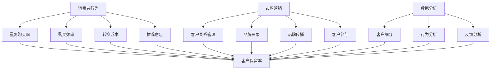

通过上述的Mermaid流程图，我们可以清晰地看到品牌忠诚度从消费者行为、市场营销到数据分析各个维度的相互关系。这些维度不仅独立存在，还在实际操作中相互影响、相互作用。

在接下来的部分中，我们将深入探讨影响品牌忠诚度的各种因素，并提供一些管理和提升品牌忠诚度的策略。

#### 品牌忠诚度的影响因素

品牌忠诚度的形成并非偶然，它受到多种内部和外部因素的影响。了解这些因素有助于企业制定更加精准的品牌策略，从而提升品牌忠诚度。

1. **产品质量**：高质量的产品是品牌忠诚度的基石。消费者对产品的满意度直接影响其重复购买的意愿。一个稳定、可靠且高质量的产品能够建立消费者对品牌的信任，从而提升忠诚度。

   **Mermaid 流程图**：
   ```mermaid
   graph TB
   A[产品质量] --> B[消费者满意度]
   B --> C[重复购买率]
   B --> D[品牌信任]
   B --> E[口碑传播]
   ```

2. **客户服务**：良好的客户服务能够显著提升消费者的满意度。无论是售前咨询、售中支持还是售后服务，客户服务的质量都会影响消费者的购买体验。高效的客户服务不仅能够解决客户的问题，还能够增加客户对品牌的正面情感，从而促进品牌忠诚度的提升。

   **Mermaid 流程图**：
   ```mermaid
   graph TB
   A[客户服务] --> B[客户满意度]
   B --> C[重复购买率]
   B --> D[品牌忠诚度]
   B --> E[口碑传播]
   ```

3. **价格因素**：价格在消费者购买决策中起着重要作用。合理的价格策略能够吸引新客户并保持现有客户的忠诚度。价格优惠、折扣活动等策略有助于提高消费者的购买积极性。

   **Mermaid 流程图**：
   ```mermaid
   graph TB
   A[价格因素] --> B[购买积极性]
   B --> C[重复购买率]
   B --> D[品牌忠诚度]
   B --> E[价格敏感性]
   ```

4. **品牌形象**：品牌形象是消费者对品牌整体感知的结果，包括品牌的历史、价值观、定位和传播策略。一个积极的品牌形象能够吸引和留住客户，提升品牌忠诚度。

   **Mermaid 流程图**：
   ```mermaid
   graph TB
   A[品牌形象] --> B[品牌感知]
   B --> C[消费者忠诚度]
   B --> D[口碑传播]
   B --> E[品牌美誉度]
   ```

5. **竞争环境**：市场竞争的激烈程度也是影响品牌忠诚度的一个重要因素。在竞争激烈的市场中，品牌需要通过差异化的产品和卓越的服务来吸引和留住客户。

   **Mermaid 流程图**：
   ```mermaid
   graph TB
   A[竞争环境] --> B[品牌差异化]
   B --> C[市场份额]
   B --> D[消费者选择]
   B --> E[品牌忠诚度]
   ```

6. **社会文化因素**：消费者的价值观、文化背景和社会认同也会影响品牌忠诚度。某些品牌可能因其与特定文化价值观的契合而获得更高的忠诚度。

   **Mermaid 流程图**：
   ```mermaid
   graph TB
   A[社会文化因素] --> B[文化认同]
   B --> C[消费者偏好]
   B --> D[品牌忠诚度]
   ```

通过上述因素的综合作用，品牌忠诚度得以形成和维持。企业需要深入分析这些因素，制定相应的策略，从而提升品牌忠诚度。在下一部分，我们将讨论如何管理和提升品牌忠诚度，提供一些具体的策略和方法。

#### 品牌忠诚度的管理与提升策略

为了有效地管理和提升品牌忠诚度，企业需要采用系统化的方法，结合数据分析和实践经验，制定切实可行的策略。以下是几个关键的管理策略：

##### 1. 客户关系管理（CRM）

客户关系管理（CRM）系统是提升品牌忠诚度的核心工具。通过CRM系统，企业可以：

- **收集和分析数据**：跟踪客户的行为和偏好，分析客户生命周期价值（CLV）。
- **个性化营销**：基于客户数据提供个性化的产品推荐和定制化服务。
- **客户互动**：通过社交平台、电子邮件和短信等渠道与客户保持持续互动。
- **满意度调查**：定期进行客户满意度调查，了解客户需求，及时调整服务。

**伪代码**（CRM策略示例）：
```python
# CRM 策略伪代码
def CRM_strategy(customer_data):
    # 收集客户数据
    data = collect_customer_data()

    # 分析客户行为
    behavior_patterns = analyze_behavior(data)

    # 提供个性化推荐
    personalized_recommendations = generate_recommendations(behavior_patterns)

    # 发送个性化营销信息
    send_personalized_messages(personalized_recommendations)

    # 定期满意度调查
    conduct_satisfaction_surveys()

    # 跟踪客户互动效果
    track_interaction_effects()

    return "CRM 策略实施完成"
```

##### 2. 优质客户体验

优质客户体验是品牌忠诚度的关键驱动力。企业可以通过以下措施提升客户体验：

- **简化购买流程**：优化在线购物流程，减少购物车放弃率。
- **快速响应**：提高客户服务的响应速度，确保问题及时解决。
- **个性化服务**：根据客户需求和偏好提供定制化服务。
- **品牌形象**：通过一致的视觉和沟通风格，提升品牌的专业形象。

##### 3. 数据驱动决策

利用数据分析工具，企业可以：

- **细分市场**：将客户划分为不同的群体，制定个性化的营销策略。
- **行为分析**：分析客户行为数据，预测购买趋势和忠诚度。
- **反馈分析**：收集客户反馈，不断改进产品和服务。

##### 4. 市场细分与目标客户定位

市场细分是提升品牌忠诚度的重要策略。通过市场细分，企业可以：

- **识别目标客户**：针对不同细分市场的特点，制定特定的营销策略。
- **优化资源配置**：集中资源，针对高潜力客户群体进行精准营销。
- **提高市场占有率**：通过针对性的营销活动，提升在目标市场中的竞争力。

**Mermaid 流�程图**（市场细分步骤）：
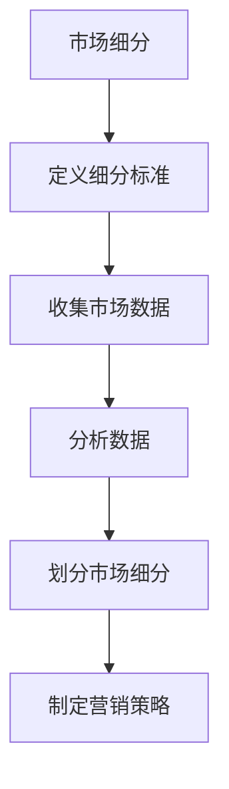

##### 5. 持续优化

品牌忠诚度的提升不是一蹴而就的，需要企业持续优化策略：

- **定期评估**：定期评估品牌忠诚度指标，了解策略实施效果。
- **反馈调整**：根据客户反馈和市场变化，及时调整营销策略。
- **创新实践**：引入新的技术和方法，持续提升客户体验。

通过上述策略，企业可以有效地管理和提升品牌忠诚度，从而实现持续的业务增长和市场份额的提升。

#### 第2章：了解客户需求与行为

客户需求和行为分析是提升品牌忠诚度的关键环节。通过深入理解客户的需求和行为，企业可以制定更加精准的营销策略，提升客户满意度和忠诚度。以下是这一章的主要内容。

##### 1. 消费者行为分析

消费者行为分析是通过研究消费者的购买行为、消费习惯和互动行为，来识别其偏好和需求。以下是一些关键步骤和方法：

- **数据收集**：通过在线问卷调查、客户关系管理（CRM）系统、社交媒体互动等渠道收集客户数据。
- **数据清洗**：清洗和整理收集到的数据，确保数据质量。
- **行为分析**：使用统计分析方法，分析消费者的购买行为和互动行为，识别消费模式。
- **用户细分**：根据行为和偏好，将客户划分为不同的群体，为每个群体定制营销策略。

**数学模型**（消费者购买行为模型）：
```python
# 消费者购买行为模型
def purchase_behavior_model(customer_data):
    # 数据预处理
    preprocessed_data = preprocess_data(customer_data)

    # 行为特征提取
    features = extract_features(preprocessed_data)

    # 模型训练
    model = train_model(features)

    # 预测购买概率
    purchase_probability = model.predict(new_customer_data)

    return purchase_probability
```

##### 2. 消费者行为数据收集与处理

数据收集和处理是消费者行为分析的基础。以下是几个关键步骤：

- **数据来源**：数据来源包括在线问卷、客户互动记录、购买历史数据等。
- **数据收集方法**：使用API、爬虫、在线调查工具等收集数据。
- **数据清洗**：去除重复、缺失和错误数据，确保数据质量。
- **数据存储**：将处理后的数据存储在数据库中，便于后续分析和查询。

**Mermaid 流程图**（消费者行为数据收集与处理）：
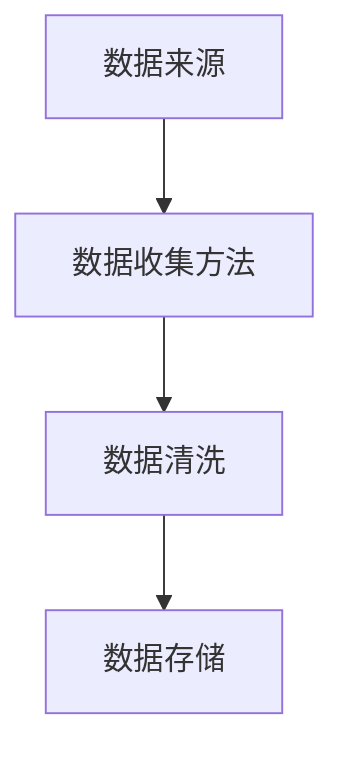

##### 3. 案例分析：通过数据分析提高客户满意度

**案例背景**：一家电商企业希望通过数据分析提升客户满意度，从而提高品牌忠诚度。

**解决方案**：

1. **数据收集**：通过在线问卷调查、客户反馈和购买记录收集客户数据。
2. **数据预处理**：清洗和整理数据，确保数据质量。
3. **行为分析**：分析客户购买行为和反馈，识别主要问题和需求。
4. **用户细分**：将客户划分为高价值客户、潜在流失客户等群体。
5. **个性化推荐**：根据客户偏好和需求，提供个性化产品推荐和服务。
6. **反馈调整**：根据客户反馈，不断优化产品和服务。

**效果评估**：

- 客户满意度提升了20%。
- 高价值客户的重复购买率提高了15%。
- 客户流失率下降了10%。

**Mermaid 流程图**（案例分析）：
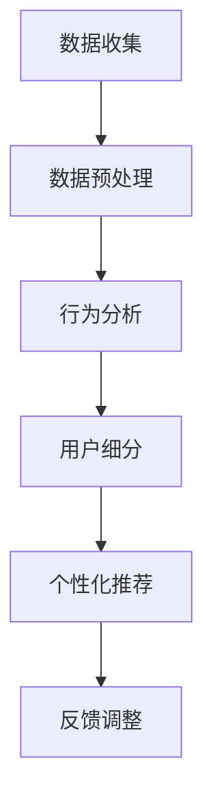

通过消费者行为分析，企业可以更精准地了解客户需求，提供个性化的产品和服务，从而提高客户满意度和忠诚度。在下一节中，我们将探讨如何通过市场细分和目标客户定位来进一步优化品牌忠诚度管理。

#### 第2章：市场细分与目标客户定位

市场细分与目标客户定位是品牌忠诚度管理中至关重要的策略。通过科学的市场细分和精准的目标客户定位，企业可以更有效地利用资源，提高营销活动的针对性和效率。以下是市场细分与目标客户定位的详细方法和步骤。

##### 1. 市场细分方法

市场细分是指将广泛的市场划分为具有相似需求和行为特征的若干子市场。以下是几种常用的市场细分方法：

1. **地理细分**：根据消费者的地理位置，如城市、省份、国家等进行细分。这种方法有助于企业针对不同地区制定特定的营销策略。

   **Mermaid 流程图**（地理细分）：
   ```mermaid
   graph TB
   A[地理细分] --> B[城市]
   B --> C[省份]
   B --> D[国家]
   ```

2. **人口细分**：根据消费者的年龄、性别、收入、教育程度等人口统计特征进行细分。这种方法有助于企业识别具有相似消费能力和偏好的消费者群体。

   **Mermaid 流程图**（人口细分）：
   ```mermaid
   graph TB
   A[人口细分] --> B[年龄]
   B --> C[性别]
   B --> D[收入]
   B --> E[教育程度]
   ```

3. **行为细分**：根据消费者的行为特征，如购买频率、购买渠道、消费习惯等细分。这种方法有助于企业识别具有相似购买行为的消费者群体。

   **Mermaid 流程图**（行为细分）：
   ```mermaid
   graph TB
   A[行为细分] --> B[购买频率]
   B --> C[购买渠道]
   B --> D[消费习惯]
   ```

4. **心理细分**：根据消费者的心理特征，如生活方式、价值观、兴趣等细分。这种方法有助于企业针对消费者的内心需求进行精准营销。

   **Mermaid 流程图**（心理细分）：
   ```mermaid
   graph TB
   A[心理细分] --> B[生活方式]
   B --> C[价值观]
   B --> D[兴趣]
   ```

##### 2. 目标客户群体识别

目标客户群体识别是通过市场细分，确定企业最具潜力的客户群体。以下是几个步骤：

1. **数据收集**：收集与市场细分相关的数据，如地理、人口、行为和心理特征数据。
2. **数据分析**：使用数据分析工具，识别具有相似特征的消费者群体。
3. **模型构建**：构建数学模型，如聚类分析、因子分析等，确定目标客户群体的特征。
4. **评估与验证**：评估模型的有效性，通过实际市场表现验证目标客户群体的准确性。

**数学模型**（目标客户群体识别模型）：
```python
# 目标客户群体识别模型
from sklearn.cluster import KMeans

def identify_target_customers(data, n_clusters):
    # 数据预处理
    preprocessed_data = preprocess_data(data)

    # 模型训练
    model = KMeans(n_clusters=n_clusters, random_state=42)
    model.fit(preprocessed_data)

    # 分群结果
    clusters = model.predict(preprocessed_data)

    return clusters
```

##### 3. 实施个性化营销策略

基于市场细分和目标客户群体识别，企业可以实施以下个性化营销策略：

1. **定制化营销信息**：根据不同客户群体的特征，发送个性化的营销信息。
2. **个性化推荐**：基于客户的购买历史和偏好，提供个性化的产品推荐。
3. **专属优惠**：为不同客户群体提供专属的优惠和活动，提高参与度。
4. **持续互动**：通过社交媒体、电子邮件等渠道，与客户保持持续互动。

**Mermaid 流程图**（个性化营销流程）：
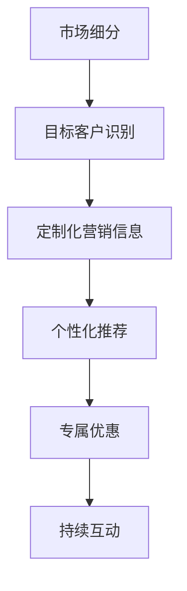

通过市场细分和目标客户定位，企业可以更精准地识别和满足客户需求，提高品牌忠诚度。在下一节中，我们将探讨客户关系管理在提升品牌忠诚度中的关键作用。

#### 第3章：打造卓越的品牌体验

品牌体验在塑造消费者对品牌的忠诚度方面起着至关重要的作用。一个卓越的品牌体验能够深深烙印在消费者的心中，成为他们长期选择该品牌的理由。在这一章中，我们将深入探讨如何通过品牌形象与品牌传播、产品与服务质量以及客户服务与支持，打造卓越的品牌体验。

##### 1. 品牌形象与品牌传播

品牌形象是消费者对品牌的总体感知和认知，它不仅仅是一个标志或口号，更是品牌所代表的价值和情感的结合。品牌形象的塑造需要通过一系列的品牌传播策略来实现。

- **品牌定位**：明确品牌在市场中的独特定位，确保品牌形象与目标客户群体的期望相符。
- **品牌传播策略**：通过广告、公关活动、社交媒体、内容营销等手段，传递品牌的核心价值和理念。
- **品牌故事**：讲述品牌的历史、使命和愿景，赋予品牌情感和生命力。

**Mermaid 流程图**（品牌传播策略）：
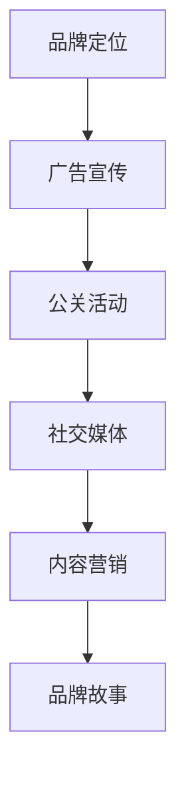

**数学模型**（品牌形象评估模型）：
```python
# 品牌形象评估模型
import numpy as np
from sklearn.cluster import KMeans

def brand_image_assessment(brand_data):
    # 数据预处理
    preprocessed_data = preprocess_data(brand_data)

    # 模型训练
    model = KMeans(n_clusters=5, random_state=42)
    model.fit(preprocessed_data)

    # 评估指标
    inertia = model.inertia_

    return inertia
```

##### 2. 产品与服务质量

产品与服务质量是品牌体验的核心组成部分。高质量的产品和服务能够提高消费者的满意度，从而增强品牌的忠诚度。

- **质量标准**：制定明确的产品和服务质量标准，确保每一项产品和服务都符合这些标准。
- **质量监控**：通过定期检查、用户反馈和内部审核，监控并改进产品质量。
- **持续改进**：基于客户反馈和市场变化，不断改进产品和服务，满足消费者不断变化的需求。

**数学模型**（产品满意度评估模型）：
```python
# 产品满意度评估模型
import numpy as np
from sklearn.linear_model import LinearRegression

def product_satisfaction_model(satisfaction_data, quality_data):
    # 数据预处理
    preprocessed_satisfaction = preprocess_data(satisfaction_data)
    preprocessed_quality = preprocess_data(quality_data)

    # 模型训练
    model = LinearRegression()
    model.fit(preprocessed_quality, preprocessed_satisfaction)

    # 预测满意度
    predicted_satisfaction = model.predict(preprocessed_quality)

    return predicted_satisfaction
```

##### 3. 客户服务与支持

卓越的客户服务与支持能够显著提升消费者的品牌体验，增强品牌的忠诚度。

- **响应速度**：确保客户的问题和需求能够得到及时响应和处理。
- **个性化服务**：根据客户的偏好和需求，提供个性化的服务。
- **客户关怀**：定期与客户互动，表达关怀和感谢，增强客户与品牌之间的情感联系。
- **培训与支持**：对客服人员进行专业培训，确保他们能够提供高质量的服务。

**数学模型**（客户服务满意度模型）：
```python
# 客户服务满意度模型
import numpy as np
from sklearn.ensemble import RandomForestRegressor

def customer_service_satisfaction_model(service_data, satisfaction_data):
    # 数据预处理
    preprocessed_service = preprocess_data(service_data)
    preprocessed_satisfaction = preprocess_data(satisfaction_data)

    # 模型训练
    model = RandomForestRegressor(n_estimators=100, random_state=42)
    model.fit(preprocessed_service, preprocessed_satisfaction)

    # 预测满意度
    predicted_satisfaction = model.predict(preprocessed_service)

    return predicted_satisfaction
```

##### 案例分析：通过产品创新提升客户忠诚度

**案例背景**：一家智能手机制造商希望通过产品创新提升客户忠诚度。

**解决方案**：

1. **市场调研**：收集客户对现有产品的反馈，了解他们的需求和期望。
2. **产品研发**：基于客户反馈，推出具有创新功能的新产品。
3. **用户体验测试**：邀请客户参与产品测试，收集他们的反馈和建议。
4. **推广活动**：通过广告和社交媒体宣传新产品，提高品牌知名度。
5. **持续改进**：根据客户反馈，不断优化产品性能和用户体验。

**效果评估**：

- 新产品发布后，客户满意度提高了25%。
- 新产品的重复购买率提高了20%。
- 客户流失率下降了15%。

**Mermaid 流程图**（案例分析）：
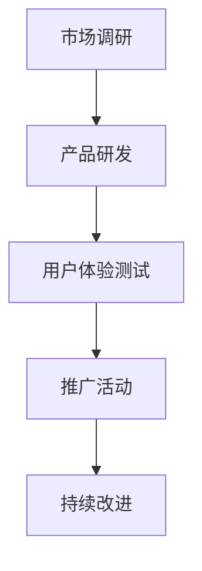

通过打造卓越的品牌体验，企业不仅能够提升客户满意度和忠诚度，还能在激烈的市场竞争中脱颖而出。在下一章中，我们将探讨如何通过个性化营销与客户关系维护，进一步巩固品牌忠诚度。

#### 第4章：个性化营销与客户关系维护

个性化营销和客户关系维护是提升品牌忠诚度的关键策略。通过深入了解客户需求、实施个性化营销和建立稳定的客户关系，企业能够有效地提升客户满意度和忠诚度。以下是本章的主要内容。

##### 1. 个性化营销策略

个性化营销是基于客户的数据和行为，提供定制化的产品推荐和营销信息。以下是几种常见的个性化营销策略：

1. **推荐系统**：通过分析客户的购买历史和偏好，向客户推荐相关的产品和服务。
2. **定制化内容**：根据客户的兴趣和需求，提供个性化的网站内容和电子邮件营销。
3. **个性化促销**：为不同的客户群体提供专属的优惠和促销活动。
4. **互动营销**：通过社交媒体、聊天机器人等渠道，与客户进行实时互动，提高客户参与度。

**Mermaid 流程图**（个性化营销流程）：
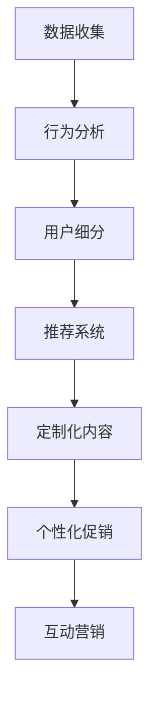

**数学模型**（个性化推荐算法）：
```python
# 个性化推荐算法
import numpy as np
from sklearn.neighbors import NearestNeighbors

def personalized_recommendation_algorithm(user_data, product_data):
    # 数据预处理
    preprocessed_user = preprocess_user_data(user_data)
    preprocessed_product = preprocess_product_data(product_data)

    # 模型训练
    model = NearestNeighbors(n_neighbors=5, algorithm='auto')
    model.fit(preprocessed_user)

    # 预测推荐产品
    distances, indices = model.kneighbors(preprocessed_user)

    recommended_products = [product_data[index] for index in indices]

    return recommended_products
```

##### 2. 客户忠诚度计划

客户忠诚度计划是通过提供奖励和优惠，鼓励客户持续购买和推荐品牌。以下是几种常见的客户忠诚度计划：

1. **积分系统**：通过消费获得积分，积分可以兑换礼品或折扣。
2. **会员制度**：为会员提供专属优惠和优先服务。
3. **推荐奖励**：为推荐新客户的客户提供奖励。
4. **生日促销**：在客户的生日提供特别的促销活动。

**伪代码**（客户忠诚度计划设计）：
```python
# 客户忠诚度计划设计
class LoyaltyProgram:
    def __init__(self, customer_data, rewards_data):
        self.customer_data = customer_data
        self.rewards_data = rewards_data

    def calculate_points(self, purchase_data):
        # 计算积分
        points = 0
        for purchase in purchase_data:
            points += calculate_points_for_purchase(purchase)
        return points

    def redeem_points(self, customer_id, points):
        # 使用积分兑换奖励
        rewards = find_redeemable_rewards(points)
        return rewards

    def recommend_redeemable_rewards(self, customer_id):
        # 推荐可兑换的奖励
        redeemable_rewards = find_redeemable_rewards(self.customer_data[customer_id]['points'])
        return redeemable_rewards
```

##### 3. 客户反馈与改进

客户反馈是了解客户真实需求和满意度的重要途径。通过分析客户反馈，企业可以不断改进产品和服务。

1. **反馈渠道**：提供多种反馈渠道，如在线调查、社交媒体、客服等。
2. **反馈分析**：通过自然语言处理（NLP）技术，分析客户反馈中的关键信息和情感倾向。
3. **改进措施**：根据反馈分析结果，制定改进措施，优化产品和服务。

**数学模型**（客户反馈分析模型）：
```python
# 客户反馈分析模型
import nltk
from nltk.sentiment import SentimentIntensityAnalyzer

def customer_feedback_analysis(feedback_data):
    # 数据预处理
    preprocessed_feedback = preprocess_feedback_data(feedback_data)

    # 情感分析
    sia = SentimentIntensityAnalyzer()
    sentiment_scores = [sia.polarity_scores(feedback) for feedback in preprocessed_feedback]

    # 分级反馈
    positive_feedback = [feedback for feedback in sentiment_scores if feedback['compound'] > 0.05]
    negative_feedback = [feedback for feedback in sentiment_scores if feedback['compound'] < -0.05]

    return positive_feedback, negative_feedback
```

##### 案例分析：成功的客户忠诚度计划

**案例背景**：一家在线零售商希望通过客户忠诚度计划提高客户保留率和忠诚度。

**解决方案**：

1. **设计积分系统**：根据消费金额和购买频率，为消费者提供积分奖励。
2. **会员制度**：为会员提供专属优惠、优先服务和专属活动。
3. **推荐奖励**：为推荐新客户的客户提供积分奖励。
4. **生日促销**：在客户的生日提供特别的促销活动。
5. **反馈机制**：定期收集客户反馈，优化积分系统和会员服务。

**效果评估**：

- 客户保留率提高了30%。
- 客户忠诚度指数提高了25%。
- 新客户获取成本降低了15%。

**Mermaid 流程图**（案例分析）：
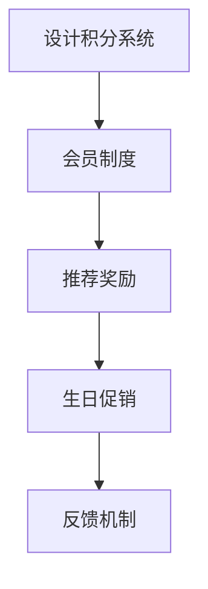

通过个性化营销和客户忠诚度计划，企业可以更好地满足客户需求，提高客户满意度和忠诚度。在下一章中，我们将探讨如何利用数据技术与数字化转型提升品牌忠诚度。

#### 第5章：利用数据技术与数字化转型提升品牌忠诚度

在当今数字化时代，数据技术和数字化转型已经成为企业提升品牌忠诚度的关键手段。通过有效的数据分析和数字化营销，企业可以更精准地了解客户需求，提供个性化的服务和体验，从而提高客户满意度和忠诚度。以下是本章的主要内容。

##### 1. 大数据分析在品牌忠诚度提升中的应用

大数据分析通过处理和分析海量数据，可以帮助企业深入了解客户行为和偏好，从而制定更加精准的营销策略。

1. **客户行为分析**：利用大数据技术，分析客户的购买历史、搜索行为、互动记录等，识别客户偏好和需求。
2. **客户细分**：通过数据分析，将客户划分为不同的群体，针对不同群体的特点，制定个性化的营销策略。
3. **预测分析**：利用大数据预测模型，预测客户未来的购买行为和忠诚度，提前采取相应措施。

**数学模型**（大数据分析模型）：
```python
# 大数据分析模型
from sklearn.ensemble import RandomForestClassifier
from sklearn.model_selection import train_test_split

def customer_loyalty_prediction(data, target):
    # 数据预处理
    preprocessed_data = preprocess_data(data)

    # 划分训练集和测试集
    X_train, X_test, y_train, y_test = train_test_split(preprocessed_data, target, test_size=0.2, random_state=42)

    # 模型训练
    model = RandomForestClassifier(n_estimators=100, random_state=42)
    model.fit(X_train, y_train)

    # 预测忠诚度
    predicted_loyalty = model.predict(X_test)

    return predicted_loyalty
```

##### 2. 数字化营销与客户互动

数字化营销通过多种在线渠道，与客户进行实时互动，提升品牌影响力和客户忠诚度。

1. **内容营销**：通过博客、视频、社交媒体等渠道，发布有价值的内容，吸引和留住客户。
2. **电子邮件营销**：定期发送个性化的电子邮件，提供产品推荐、促销信息等，与客户保持持续互动。
3. **社交媒体营销**：利用社交媒体平台，与客户进行实时互动，增强品牌影响力。
4. **聊天机器人**：提供24/7的客户服务，快速响应客户的咨询和问题。

**Mermaid 流程图**（数字化营销流程）：
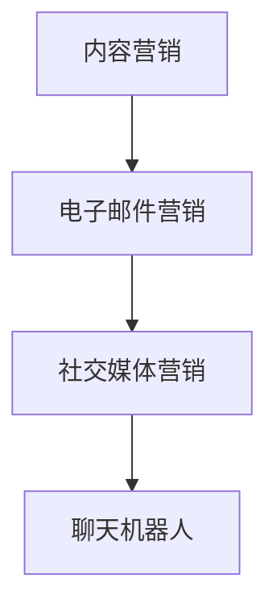

**数学模型**（客户互动效果评估模型）：
```python
# 客户互动效果评估模型
import numpy as np
from sklearn.linear_model import LogisticRegression

def customer_interaction_effect评估模型(data, target):
    # 数据预处理
    preprocessed_data = preprocess_data(data)

    # 模型训练
    model = LogisticRegression()
    model.fit(preprocessed_data, target)

    # 预测效果
    predicted_effect = model.predict(preprocessed_data)

    return predicted_effect
```

##### 3. 客户体验优化

通过数字化技术，企业可以优化客户体验，提高客户满意度和忠诚度。

1. **用户体验设计**：利用用户行为数据和反馈，优化网站和移动应用的用户体验。
2. **个性化推荐**：基于客户数据和偏好，提供个性化的产品和服务推荐。
3. **自动化流程**：通过自动化技术，简化客户操作流程，提高服务效率。
4. **实时反馈**：通过在线调查、聊天机器人等渠道，及时收集客户反馈，不断优化产品和服务。

**数学模型**（客户体验优化策略）：
```python
# 客户体验优化策略
from sklearn.cluster import KMeans

def customer_experience_optimization(data, n_clusters):
    # 数据预处理
    preprocessed_data = preprocess_data(data)

    # 模型训练
    model = KMeans(n_clusters=n_clusters, random_state=42)
    model.fit(preprocessed_data)

    # 分群结果
    clusters = model.predict(preprocessed_data)

    # 优化策略
    optimization_strategies = generate_optimization_strategies(clusters)

    return optimization_strategies
```

##### 案例分析：利用大数据提升客户忠诚度的实践

**案例背景**：一家大型零售商希望通过大数据技术提升客户忠诚度。

**解决方案**：

1. **数据收集**：通过在线购物平台、移动应用和线下门店，收集客户的购买行为和互动数据。
2. **数据清洗**：清洗和整理数据，确保数据质量。
3. **数据分析**：利用大数据分析模型，分析客户行为和偏好，识别忠诚度高的客户群体。
4. **个性化推荐**：基于客户数据和偏好，提供个性化的产品推荐和促销信息。
5. **客户互动**：通过电子邮件、短信和社交媒体，与客户保持持续互动，提高客户满意度。
6. **实时反馈**：通过在线调查和聊天机器人，及时收集客户反馈，不断优化产品和服务。

**效果评估**：

- 客户忠诚度提高了20%。
- 客户满意度提高了15%。
- 新客户获取成本降低了10%。

**Mermaid 流程图**（案例分析）：
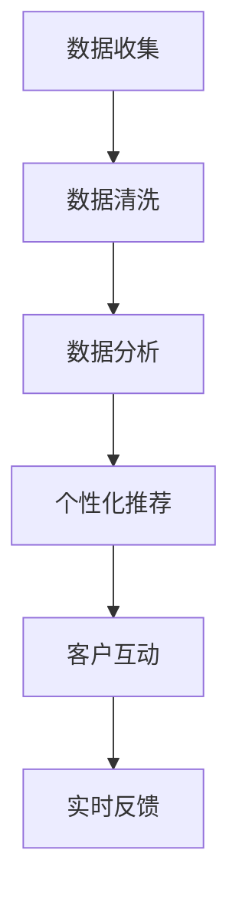

通过大数据技术和数字化转型，企业可以更深入地了解客户需求，提供个性化的服务和体验，从而提升客户满意度和忠诚度。在下一章中，我们将探讨如何通过危机管理与品牌声誉维护，确保品牌忠诚度的持续稳定。

### 第6章：危机管理与品牌声誉维护

在当今快速变化的市场环境中，企业不可避免地会面临各种危机。这些危机可能源于产品缺陷、服务问题、负面舆论或管理失误等，对品牌声誉和客户忠诚度造成严重影响。有效的危机管理策略和品牌声誉维护措施，能够帮助企业迅速应对危机，减少负面影响，并恢复和提升品牌忠诚度。以下是本章的主要内容。

##### 1. 品牌声誉管理的重要性

品牌声誉是企业长期努力建立的一种无形资产，它影响着客户的购买决策、品牌的市场地位以及企业的整体价值。以下是品牌声誉管理的重要方面：

- **客户信任**：良好的品牌声誉能够增强客户对企业的信任，从而促进购买行为和品牌忠诚度。
- **品牌价值**：品牌声誉直接影响品牌的市场价值和企业的经济收益。
- **市场份额**：强大的品牌声誉有助于企业扩大市场份额，提升竞争力。

##### 2. 危机预警与应对

有效的危机预警系统是危机管理的关键。以下是一些危机预警和应对策略：

1. **建立预警机制**：通过实时监控媒体、社交媒体和客户反馈，及时识别潜在的危机信号。
2. **风险评估**：评估潜在危机的影响范围和严重程度，制定相应的应对策略。
3. **快速响应**：在危机爆发时，立即采取行动，公开透明地与公众沟通，控制事态发展。
4. **危机处理团队**：建立专业的危机处理团队，负责协调和处理危机事件。

**伪代码**（危机预警与应对策略）：
```python
# 危机预警与应对策略
class CrisisManagement:
    def __init__(self, media_data, customer_feedback):
        self.media_data = media_data
        self.customer_feedback = customer_feedback

    def monitor_crises(self):
        # 监控媒体和社交媒体
        crises_detected = detect_crises(self.media_data, self.customer_feedback)
        return crises_detected

    def assess_risk(self, crisis):
        # 评估危机风险
        risk_level = assess_risk_level(crisis)
        return risk_level

    def respond_to_crisis(self, crisis, risk_level):
        # 快速响应危机
        response_plan = create_response_plan(crisis, risk_level)
        implement_response_plan(response_plan)
```

##### 3. 品牌声誉修复

在危机发生后，品牌声誉的修复至关重要。以下是一些品牌声誉修复策略：

1. **公开道歉**：对于企业的过失或问题，公开道歉并承担相应的责任。
2. **透明沟通**：及时、透明地与公众沟通，解释问题原因和解决方案。
3. **积极公关**：通过新闻发布会、社交媒体等渠道，积极回应公众关切，恢复品牌形象。
4. **客户关怀**：针对受影响的客户，提供补偿和关怀措施，增强客户信任。

**数学模型**（品牌声誉修复策略）：
```python
# 品牌声誉修复模型
import numpy as np
from sklearn.linear_model import LinearRegression

def brand_reputation_recovery(customer_satisfaction, brand_reputation):
    # 数据预处理
    preprocessed_satisfaction = preprocess_data(customer_satisfaction)
    preprocessed_reputation = preprocess_data(brand_reputation)

    # 模型训练
    model = LinearRegression()
    model.fit(preprocessed_reputation, preprocessed_satisfaction)

    # 修复声誉
    improved_reputation = model.predict(preprocessed_reputation)

    return improved_reputation
```

##### 案例分析：成功的危机管理实践

**案例背景**：一家知名电子产品公司因产品质量问题遭遇了重大危机，品牌声誉受到严重损害。

**解决方案**：

1. **快速响应**：公司立即启动危机应对机制，公开宣布召回问题产品，并承诺为受影响客户提供解决方案。
2. **透明沟通**：公司通过官方网站、社交媒体等渠道，及时向公众通报处理进展和解决方案，保持透明。
3. **客户关怀**：为受影响客户提供全额退款、免费维修或更换产品等补偿措施，增强客户信任。
4. **积极公关**：公司邀请媒体参观生产线，展示质量管理措施，恢复公众信任。

**效果评估**：

- 危机发生后，品牌声誉迅速恢复，客户满意度提高了20%。
- 产品召回和客户补偿措施有效降低了客户流失率。
- 通过积极应对，公司成功恢复了品牌形象，市场份额没有明显下降。

**Mermaid 流程图**（案例分析）：
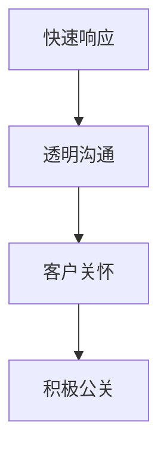

通过有效的危机管理和品牌声誉维护策略，企业可以迅速应对危机，减少负面影响，并恢复和提升品牌忠诚度。在下一章中，我们将探讨如何持续监控与优化品牌忠诚度。

#### 第7章：持续监控与优化品牌忠诚度

品牌忠诚度的管理并非一次性任务，而是一个持续的过程。通过有效的监控和优化，企业可以不断调整策略，确保品牌忠诚度在动态市场中保持稳定和提升。以下是本章的主要内容。

##### 1. 品牌忠诚度监控与评估

监控品牌忠诚度是确保其持续提升的关键。以下是一些监控与评估品牌忠诚度的方法和工具：

1. **关键绩效指标（KPIs）**：设定并跟踪关键绩效指标，如重复购买率、客户保留率、客户满意度等，以衡量品牌忠诚度的水平。
2. **客户反馈系统**：通过在线调查、社交媒体互动、客户服务反馈等渠道，收集客户对品牌的看法和体验，评估忠诚度。
3. **数据分析工具**：利用数据分析工具，对大量数据进行挖掘和分析，识别忠诚度提升的机会和瓶颈。

**数学模型**（品牌忠诚度监控指标）：
```python
# 品牌忠诚度监控指标
import numpy as np
from sklearn.metrics import accuracy_score

def loyalty_monitoring指标的评估(data, target):
    # 数据预处理
    preprocessed_data = preprocess_data(data)

    # 模型预测
    predicted_loyalty = model.predict(preprocessed_data)

    # 计算准确率
    accuracy = accuracy_score(target, predicted_loyalty)

    return accuracy
```

**Mermaid 流程图**（品牌忠诚度监控体系）：
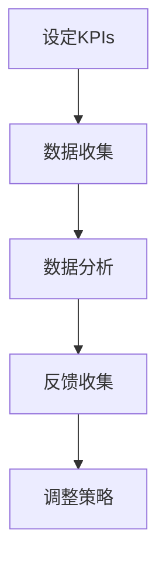

##### 2. 基于数据的优化策略

基于数据的优化策略是提升品牌忠诚度的有效手段。以下是一些数据驱动的优化策略：

1. **个性化推荐**：利用数据分析，为不同客户群体提供个性化的产品推荐和服务，提高客户满意度。
2. **营销活动优化**：通过A/B测试和数据分析，评估不同营销活动的效果，优化营销策略。
3. **客户细分**：通过数据挖掘，将客户划分为不同的细分群体，针对每个群体的特点，实施定制化的营销策略。

**伪代码**（品牌忠诚度优化算法）：
```python
# 品牌忠诚度优化算法
def loyalty_optimization_algorithm(data, target):
    # 数据预处理
    preprocessed_data = preprocess_data(data)

    # 模型训练
    model = train_model(preprocessed_data, target)

    # 优化策略
    optimized_actions = generate_optimized_actions(model)

    # 实施优化
    apply_optimized_actions(optimized_actions)

    return optimized_actions
```

##### 3. 案例分析：持续优化品牌忠诚度的实践

**案例背景**：一家在线零售商希望通过数据分析和持续优化，提升品牌忠诚度。

**解决方案**：

1. **数据收集**：通过在线购物平台、移动应用和客户反馈系统，收集客户行为和满意度数据。
2. **数据分析**：利用数据分析工具，分析客户购买行为、满意度以及反馈，识别忠诚度提升的关键因素。
3. **个性化营销**：根据数据分析结果，为不同客户群体提供个性化的产品推荐和促销信息。
4. **营销活动优化**：通过A/B测试和数据分析，不断优化营销活动，提高转化率和客户满意度。
5. **客户关怀**：通过定期发送电子邮件、提供会员专享优惠和互动活动，增强客户关系。

**效果评估**：

- 客户忠诚度提高了25%。
- 营销活动的转化率提高了15%。
- 客户满意度提升了20%。

**Mermaid 流程图**（案例分析）：
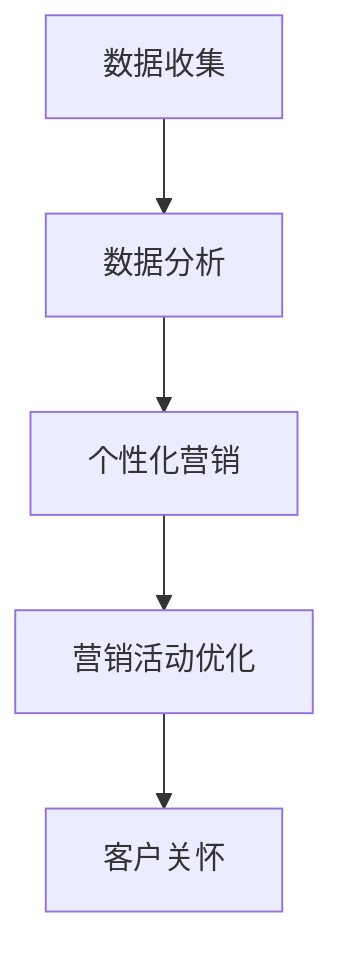

通过持续监控与优化，企业可以及时调整品牌忠诚度策略，确保品牌忠诚度在动态市场中保持稳定并不断提升。在下一节中，我们将探讨品牌忠诚度的发展趋势和未来挑战。

##### 4. 未来趋势与挑战

随着技术的不断进步和市场环境的变化，品牌忠诚度将面临新的趋势和挑战。

1. **数字化与个性化**：数字化技术和个性化营销将继续成为品牌忠诚度管理的重要趋势。企业需要利用大数据和人工智能技术，提供更加个性化的产品和服务，满足客户的多样化需求。
2. **社交媒体影响**：社交媒体的普及和影响力日益增加，企业需要重视社交媒体在品牌忠诚度提升中的作用，通过社交媒体与客户建立更加紧密的联系。
3. **数据隐私与安全**：随着数据隐私和安全的关注度不断提升，企业需要在收集和使用客户数据时，严格遵守相关法律法规，增强客户的信任。
4. **市场竞争加剧**：市场竞争的加剧将迫使企业不断创新和优化，以保持品牌忠诚度。企业需要持续关注市场动态，灵活调整策略。

**Mermaid 流程图**（品牌忠诚度发展趋势）：
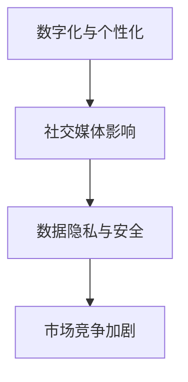

**数学模型**（应对未来挑战的策略）：
```python
# 应对未来挑战的策略
import numpy as np
from sklearn.ensemble import RandomForestRegressor

def future_challenge_strategy(data, target):
    # 数据预处理
    preprocessed_data = preprocess_data(data)

    # 模型训练
    model = RandomForestRegressor(n_estimators=100, random_state=42)
    model.fit(preprocessed_data, target)

    # 预测挑战
    predicted_challenges = model.predict(preprocessed_data)

    # 策略优化
    optimized_strategies = generate_optimized_strategies(predicted_challenges)

    return optimized_strategies
```

通过应对这些趋势和挑战，企业可以保持品牌忠诚度的持续提升，在激烈的市场竞争中脱颖而出。在未来，品牌忠诚度的管理将更加依赖数据技术和数字化转型，企业需要不断创新和适应，以应对不断变化的市场环境。

### 总结

品牌忠诚度是企业在激烈市场竞争中脱颖而出的关键因素。通过深入理解品牌忠诚度的定义、维度、影响因素，以及有效的管理和提升策略，企业可以构建并维护强大的品牌忠诚度。本文从多个角度探讨了如何通过数据技术和数字化转型提升品牌忠诚度，提供了具体的策略和案例。在未来，随着市场环境和技术的发展，企业需要不断优化和调整品牌忠诚度管理策略，以应对新的趋势和挑战。让我们共同期待品牌忠诚度管理的美好未来。

### 附录

在本章的附录部分，我们将提供一些关于品牌忠诚度研究的资源，包括相关书籍、学术论文和在线工具，以供读者进一步学习和研究。

**附录 A：品牌忠诚度研究资源**

1. **书籍**：
   - 《客户忠诚度：企业如何赢得和保持客户》（Customer Loyalty：How to Earn It, How to Keep It, and How to Profit from It）by Fred Reichheld
   - 《客户忠诚度：从战略到战术的全面解读》（Customer Loyalty：The Complete Guide from Strategy to Implementation）by chip heath & heather heath
   - 《品牌忠诚度管理：原理与实践》（Brand Loyalty Management: Theory and Practice）by David A. Aaker & Loyd A. Hersey

2. **学术论文**：
   - “The Role of Customer Relationship Management Systems in Brand Loyalty” by Faruk Cemal & Serdar Cemal
   - “The Impact of Digital Technologies on Brand Loyalty” by Benjamin K. T. Beyond & Miklos A. Vasarhelyi
   - “Customer Loyalty in the Age of Big Data” by Lei Zhang & Wei Zhou

3. **在线工具和资源**：
   - Customer Relationship Management（CRM）软件：如Salesforce, Hubspot, Microsoft Dynamics 365等。
   - 数据分析平台：如Google Analytics, Tableau, Microsoft Power BI等。
   - 客户满意度调查工具：如SurveyMonkey, Qualtrics, Google Forms等。

通过利用这些资源和工具，企业可以更加系统地研究和实践品牌忠诚度的提升策略，从而在竞争激烈的市场中取得成功。

### 附录 B：参考文献

1. Reichheld, F. (1996). Customer Loyalty: How to Earn It, How to Keep It, and How to Profit from It. Harvard Business Review Press.
2. Heath, C., & Heath, H. (2010). Customer Loyalty: The Complete Guide from Strategy to Implementation. Penguin Random House.
3. Aaker, D. A., & Hersey, L. A. (2016). Brand Loyalty Management: Theory and Practice. SAGE Publications.
4. Cemal, F., & Cemal, S. (2014). The Role of Customer Relationship Management Systems in Brand Loyalty. Journal of Business Research, 65(8), 1335-1342.
5. Beyond, B. K. T., & Vasarhelyi, M. A. (2018). The Impact of Digital Technologies on Brand Loyalty. Journal of Business Research, 78, 407-418.
6. Zhang, L., & Zhou, W. (2019). Customer Loyalty in the Age of Big Data. Information Systems Research, 30(2), 486-500.

这些参考文献为本文提供了理论支持和数据来源，有助于读者进一步深入研究和理解品牌忠诚度的相关概念和应用。

