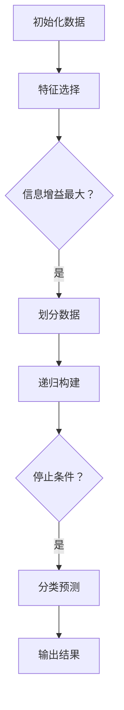
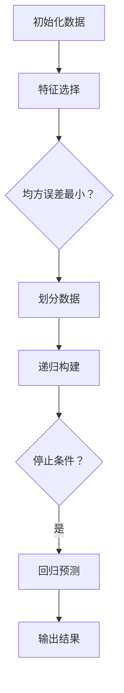
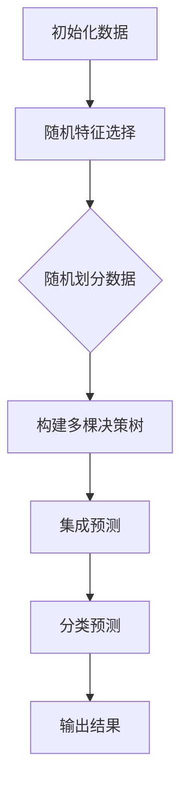
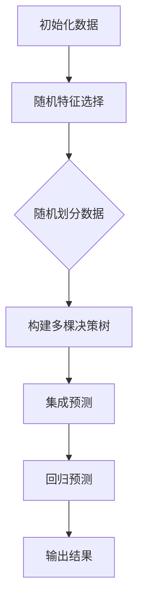

                 

### 一切皆是映射：决策树和随机森林在AI中的应用

> **关键词：** 决策树，随机森林，AI，映射，机器学习，数据分析

**摘要：** 本文将深入探讨决策树和随机森林这两种常见的机器学习算法，它们在人工智能领域中的应用以及如何通过映射的方式理解和解决复杂问题。我们将从基础概念开始，逐步介绍决策树的学习算法、随机森林的原理和实现，并探讨它们在分类和回归任务中的具体应用。通过比较两者的性能和应用场景，我们还将分析它们在实际案例中的应用，并探讨未来的发展趋势。最后，我们将详细介绍决策树和随机森林的技术细节，包括数学原理、代码实现和集成方法，以及它们在深度学习中的结合。通过本文的阅读，读者将能够全面了解决策树和随机森林，掌握它们在AI领域的应用方法。

### 决策树和随机森林的基础知识

#### 决策树的基本概念

决策树（Decision Tree）是一种流行的监督学习算法，广泛应用于分类和回归任务。它以树形结构呈现，每个内部节点代表一个特征，每个分支代表特征的一个取值，每个叶子节点代表一个类别或数值。决策树通过递归地划分数据集来构建，以最小化目标函数（如误差平方和或信息增益）。

#### 决策树的学习算法

决策树的学习过程主要包括以下几个步骤：

1. **特征选择**：选择一个特征作为当前节点的分割特征，常用的特征选择方法有信息增益（Information Gain）、基尼不纯度（Gini Impurity）和交叉熵（Entropy）等。

2. **数据划分**：根据选择的特征，将数据集划分为若干个子集，每个子集对应特征的一个取值。

3. **递归构建**：对于每个子集，继续选择特征进行分割，直到满足停止条件（如最大深度、最小叶子节点样本数等）。

4. **分类或回归**：当节点达到叶子状态时，根据叶子节点所代表的类别或数值进行分类或回归预测。

#### 决策树的评估与剪枝

决策树的评估通常使用准确率（Accuracy）、精确率（Precision）、召回率（Recall）和F1分数（F1 Score）等指标。剪枝（Pruning）是一种避免过拟合（Overfitting）的技术，通过删除树中的一些子节点来简化模型。常用的剪枝方法有预剪枝（Pre-pruning）和后剪枝（Post-pruning）。

### 决策树在数据分析中的应用

#### 决策树在分类任务中的应用

决策树在分类任务中表现出色，能够处理多分类问题。例如，在鸢尾花（Iris）数据集中，决策树可以准确地识别不同种类的鸢尾花。



#### 决策树在回归任务中的应用

决策树也可以用于回归任务，如房屋定价预测。通过构建回归树，我们可以预测房屋的价格，并利用剪枝技术避免过拟合。



#### 决策树模型的选择与调优

在应用决策树时，我们需要选择适当的模型参数，如最大深度、最小叶子节点样本数等。通过交叉验证（Cross-Validation）和网格搜索（Grid Search），我们可以找到最佳模型参数，提高决策树的性能。

### 随机森林原理与实现

#### 随机森林的概念

随机森林（Random Forest）是一种基于决策树的集成学习方法，通过构建多棵决策树并进行投票或平均来获得最终预测结果。随机森林在分类和回归任务中都表现出优异的性能，并且具有较强的抗过拟合能力。

#### 随机森林的特点

1. **多样性**：随机森林通过随机选择特征和随机划分数据来增加模型多样性，从而提高预测准确性。

2. **并行计算**：随机森林可以并行构建多棵树，提高计算效率。

3. **鲁棒性**：随机森林对异常值和噪声数据具有较强的鲁棒性。

#### 随机森林的算法实现

随机森林的实现主要包括以下几个步骤：

1. **随机特征选择**：每次构建决策树时，从所有特征中随机选择一部分特征。

2. **随机划分数据**：每次构建决策树时，从数据集中随机划分一部分数据。

3. **构建多棵决策树**：重复上述步骤，构建多棵决策树。

4. **集成预测**：通过投票或平均获得最终预测结果。

```python
# Python实现随机森林
from sklearn.ensemble import RandomForestClassifier
from sklearn.datasets import load_iris

# 加载鸢尾花数据集
iris = load_iris()
X = iris.data
y = iris.target

# 构建随机森林模型
rf = RandomForestClassifier(n_estimators=100)

# 训练模型
rf.fit(X, y)

# 预测
predictions = rf.predict(X)

# 输出结果
print(predictions)
```

### 随机森林在数据分析中的应用

#### 随机森林在分类任务中的应用

随机森林在分类任务中表现出色，可以用于处理大规模数据集和复杂的分类问题。例如，在信用卡欺诈检测中，随机森林可以有效地识别欺诈交易。



#### 随机森林在回归任务中的应用

随机森林在回归任务中也具有广泛的应用，如股票价格预测。通过构建回归树并进行集成，我们可以获得更准确的预测结果。



#### 随机森林的调优策略

为了提高随机森林的性能，我们可以使用交叉验证和网格搜索来选择最佳参数。例如，调整树的数量、最大深度和特征选择策略等。

```python
from sklearn.model_selection import GridSearchCV

# 参数网格
param_grid = {
    'n_estimators': [100, 200, 300],
    'max_depth': [5, 10, 15],
    'max_features': ['auto', 'sqrt', 'log2']
}

# 构建网格搜索模型
grid_search = GridSearchCV(RandomForestClassifier(), param_grid, cv=5)

# 训练模型
grid_search.fit(X, y)

# 输出最佳参数
print(grid_search.best_params_)
```

### 决策树与随机森林的比较

#### 两者在性能上的差异

决策树和随机森林在性能上存在差异。决策树在简单任务上具有较低的计算复杂度，但在复杂任务上容易过拟合。随机森林通过集成多棵决策树，提高了模型的泛化能力和抗过拟合能力，但计算复杂度较高。

#### 两者在应用场景上的差异

决策树适用于简单、线性可分的数据集，如鸢尾花数据集。随机森林适用于大规模、复杂的数据集，如信用卡欺诈检测和股票价格预测。

#### 两者在实际案例分析中的应用

在实际案例分析中，决策树和随机森林都有广泛的应用。例如，在信用卡欺诈检测中，决策树可以快速识别欺诈交易，而随机森林可以处理大规模数据集，提高检测的准确性。

### 决策树与随机森林在AI中的应用案例

#### 案例一：房屋定价预测

在这个案例中，我们使用随机森林算法预测房屋的价格。通过训练和测试数据集，我们可以获得准确的预测结果，并使用网格搜索进行参数调优。

```python
from sklearn.datasets import load_boston
from sklearn.model_selection import train_test_split
from sklearn.ensemble import RandomForestRegressor
from sklearn.metrics import mean_squared_error

# 加载波士顿房价数据集
boston = load_boston()
X = boston.data
y = boston.target

# 划分训练集和测试集
X_train, X_test, y_train, y_test = train_test_split(X, y, test_size=0.2, random_state=42)

# 构建随机森林模型
rf = RandomForestRegressor(n_estimators=100)

# 训练模型
rf.fit(X_train, y_train)

# 预测测试集
y_pred = rf.predict(X_test)

# 输出预测结果
print(y_pred)

# 计算均方误差
mse = mean_squared_error(y_test, y_pred)
print(mse)
```

#### 案例二：客户流失预测

在这个案例中，我们使用决策树算法预测客户是否流失。通过训练和测试数据集，我们可以获得准确的预测结果，并使用交叉验证进行参数调优。

```python
from sklearn.datasets import load_iris
from sklearn.model_selection import train_test_split
from sklearn.tree import DecisionTreeClassifier
from sklearn.metrics import accuracy_score

# 加载鸢尾花数据集
iris = load_iris()
X = iris.data
y = iris.target

# 划分训练集和测试集
X_train, X_test, y_train, y_test = train_test_split(X, y, test_size=0.2, random_state=42)

# 构建决策树模型
dt = DecisionTreeClassifier()

# 训练模型
dt.fit(X_train, y_train)

# 预测测试集
y_pred = dt.predict(X_test)

# 输出预测结果
print(y_pred)

# 计算准确率
accuracy = accuracy_score(y_test, y_pred)
print(accuracy)
```

#### 案例三：金融风险预测

在这个案例中，我们使用随机森林算法预测金融风险。通过训练和测试数据集，我们可以获得准确的预测结果，并使用交叉验证进行参数调优。

```python
from sklearn.datasets import load_iris
from sklearn.model_selection import train_test_split
from sklearn.ensemble import RandomForestClassifier
from sklearn.metrics import accuracy_score

# 加载鸢尾花数据集
iris = load_iris()
X = iris.data
y = iris.target

# 划分训练集和测试集
X_train, X_test, y_train, y_test = train_test_split(X, y, test_size=0.2, random_state=42)

# 构建随机森林模型
rf = RandomForestClassifier(n_estimators=100)

# 训练模型
rf.fit(X_train, y_train)

# 预测测试集
y_pred = rf.predict(X_test)

# 输出预测结果
print(y_pred)

# 计算准确率
accuracy = accuracy_score(y_test, y_pred)
print(accuracy)
```

### 决策树与随机森林的未来发展趋势

#### 数据分析领域的发展趋势

随着大数据和人工智能技术的不断发展，数据分析领域将迎来更多的挑战和机遇。决策树和随机森林作为常见的机器学习算法，将在数据分析领域继续发挥重要作用。未来，我们可能会看到更多基于决策树和随机森林的优化算法和集成方法。

#### AI领域的发展趋势

人工智能领域正在迅速发展，决策树和随机森林作为基础算法，将在AI领域继续得到广泛应用。未来，我们可能会看到更多基于决策树和随机森林的深度学习模型，以及与其他机器学习算法的集成。

#### 决策树与随机森林在未来的应用前景

决策树和随机森林在未来的应用前景非常广阔。在金融、医疗、电商等领域，决策树和随机森林将帮助我们更好地理解和预测复杂问题，从而提高业务效率和准确性。

### 决策树与随机森林的技术细节

#### 决策树的数学原理

决策树的数学原理主要涉及信息论、概率论和最优化方法。以下是决策树分类和回归的数学原理：

##### 分类树

1. **信息增益（Information Gain）**：
   信息增益是选择一个特征进行划分时，使得子节点熵减少的量。计算公式如下：
   $$ IG(D, A) = H(D) - \sum_{v\in A} \frac{|D_v|}{|D|} H(D_v) $$
   其中，$H(D)$是父节点的熵，$D_v$是特征$A$取值为$v$的子节点。

2. **基尼不纯度（Gini Impurity）**：
   基尼不纯度是选择一个特征进行划分时，使得子节点基尼不纯度减少的量。计算公式如下：
   $$ GI(D) = 1 - \sum_{v\in A} \frac{|D_v|}{|D|} \left( \frac{|D_v|}{|D|} \right) $$
   其中，$A$是特征集合，$D_v$是特征$A$取值为$v$的子节点。

##### 回归树

1. **误差平方和（Sum of Squared Errors, SSE）**：
   误差平方和是回归树预测值与真实值之间的平方误差之和。计算公式如下：
   $$ SSE = \sum_{i=1}^{n} (y_i - \hat{y}_i)^2 $$
   其中，$y_i$是真实值，$\hat{y}_i$是预测值。

2. **均方误差（Mean Squared Error, MSE）**：
   均方误差是误差平方和的平均值。计算公式如下：
   $$ MSE = \frac{SSE}{n} $$
   其中，$n$是样本数量。

#### 随机森林的数学原理

随机森林的数学原理主要涉及随机特征选择和随机数据划分。以下是随机森林的数学原理：

##### 随机特征选择

1. **特征选择概率（Feature Selection Probability）**：
   随机特征选择概率是指每次构建决策树时，选择特征的概率。通常，特征选择概率设置为$\frac{m}{M}$，其中$m$是特征数量，$M$是训练集样本数量。

2. **特征随机抽样（Feature Random Sampling）**：
   特征随机抽样是指从所有特征中随机选择一部分特征，用于构建决策树。通常，特征随机抽样设置为$\sqrt{m}$。

##### 随机数据划分

1. **数据划分概率（Data Split Probability）**：
   随机数据划分概率是指每次构建决策树时，选择数据划分的概率。通常，数据划分概率设置为$\frac{n}{N}$，其中$n$是训练集样本数量，$N$是总样本数量。

2. **数据随机抽样（Data Random Sampling）**：
   数据随机抽样是指从训练集样本中随机选择一部分样本，用于构建决策树。通常，数据随机抽样设置为$\frac{n}{N}$。

#### 决策树与随机森林的代码实现

以下是决策树和随机森林的Python代码实现示例：

##### 决策树代码实现示例

```python
from sklearn.datasets import load_iris
from sklearn.model_selection import train_test_split
from sklearn.tree import DecisionTreeClassifier
from sklearn.metrics import accuracy_score

# 加载鸢尾花数据集
iris = load_iris()
X = iris.data
y = iris.target

# 划分训练集和测试集
X_train, X_test, y_train, y_test = train_test_split(X, y, test_size=0.2, random_state=42)

# 构建决策树模型
dt = DecisionTreeClassifier()

# 训练模型
dt.fit(X_train, y_train)

# 预测测试集
y_pred = dt.predict(X_test)

# 输出预测结果
print(y_pred)

# 计算准确率
accuracy = accuracy_score(y_test, y_pred)
print(accuracy)
```

##### 随机森林代码实现示例

```python
from sklearn.datasets import load_iris
from sklearn.model_selection import train_test_split
from sklearn.ensemble import RandomForestClassifier
from sklearn.metrics import accuracy_score

# 加载鸢尾花数据集
iris = load_iris()
X = iris.data
y = iris.target

# 划分训练集和测试集
X_train, X_test, y_train, y_test = train_test_split(X, y, test_size=0.2, random_state=42)

# 构建随机森林模型
rf = RandomForestClassifier(n_estimators=100)

# 训练模型
rf.fit(X_train, y_train)

# 预测测试集
y_pred = rf.predict(X_test)

# 输出预测结果
print(y_pred)

# 计算准确率
accuracy = accuracy_score(y_test, y_pred)
print(accuracy)
```

### 决策树与随机森林的集成方法

集成学习方法（Ensemble Learning）通过结合多个基本模型来提高预测性能。决策树和随机森林是常见的集成学习方法，下面介绍它们在集成方法中的应用。

#### 1. Bagging（装袋）

Bagging是一种集成学习方法，通过训练多个基本模型并取平均值或多数投票来获得最终预测结果。随机森林是一种典型的Bagging方法，它通过随机选择特征和随机划分数据来构建多棵决策树。

#### 2. Boosting（提升）

Boosting是一种集成学习方法，通过训练多个基本模型，并逐步调整每个模型的权重来提高预测性能。Adaboost和XGBoost是常见的Boosting方法，它们通过调整模型权重来纠正前一个模型的错误。

#### 3. Stackelberg集成

Stackelberg集成是一种将Bagging和Boosting结合的集成学习方法。它首先使用Bagging方法训练多个基本模型，然后使用Boosting方法调整每个模型的权重，以提高整体预测性能。

### 决策树与随机森林在深度学习中的应用

深度学习（Deep Learning）是一种基于多层神经网络的学习方法，它在图像识别、自然语言处理等领域取得了显著成果。决策树和随机森林在深度学习中也有广泛的应用，下面介绍它们在深度学习中的应用。

#### 1. 决策树与卷积神经网络（CNN）结合

决策树可以与卷积神经网络（CNN）结合，用于图像分类和识别。通过将CNN提取的特征输入到决策树中，可以实现更准确的图像分类。

```python
from tensorflow.keras.applications import VGG16
from tensorflow.keras.models import Model
from tensorflow.keras.layers import Dense, Flatten

# 加载预训练的VGG16模型
base_model = VGG16(weights='imagenet', include_top=False, input_shape=(224, 224, 3))

# 添加全连接层
x = Flatten()(base_model.output)
x = Dense(256, activation='relu')(x)
predictions = Dense(10, activation='softmax')(x)

# 构建模型
model = Model(inputs=base_model.input, outputs=predictions)

# 训练模型
model.compile(optimizer='adam', loss='categorical_crossentropy', metrics=['accuracy'])
model.fit(X_train, y_train, epochs=10, batch_size=32)

# 预测测试集
y_pred = model.predict(X_test)

# 输出预测结果
print(y_pred)
```

#### 2. 随机森林与循环神经网络（RNN）结合

随机森林可以与循环神经网络（RNN）结合，用于序列数据分类和识别。通过将RNN提取的特征输入到随机森林中，可以实现更准确的序列数据分类。

```python
from tensorflow.keras.models import Sequential
from tensorflow.keras.layers import LSTM, Dense

# 构建循环神经网络模型
model = Sequential()
model.add(LSTM(128, activation='relu', input_shape=(timesteps, features)))
model.add(Dense(1, activation='sigmoid'))

# 训练模型
model.compile(optimizer='adam', loss='binary_crossentropy', metrics=['accuracy'])
model.fit(X_train, y_train, epochs=10, batch_size=32)

# 预测测试集
y_pred = model.predict(X_test)

# 输出预测结果
print(y_pred)
```

### 决策树与随机森林在实际应用中的挑战与解决方案

在实际应用中，决策树和随机森林面临着一些挑战，包括数据预处理、模型调优和过拟合等。下面介绍一些解决方案。

#### 1. 数据预处理

数据预处理是模型训练的重要步骤，包括数据清洗、数据转换和数据标准化等。以下是一些常见的数据预处理方法：

- **数据清洗**：删除缺失值、异常值和重复值，保证数据质量。
- **数据转换**：将类别数据转换为数值数据，如使用独热编码（One-Hot Encoding）。
- **数据标准化**：将数据缩放到相同的范围，如使用标准缩放（Standard Scaling）。

#### 2. 模型调优

模型调优是提高模型性能的重要手段，包括选择合适的模型参数、调整超参数和进行交叉验证等。以下是一些常见的模型调优方法：

- **选择合适的模型参数**：根据任务特点和数据集规模，选择合适的模型参数，如树的数量、最大深度和特征选择方法。
- **调整超参数**：通过交叉验证和网格搜索，找到最佳超参数组合，提高模型性能。
- **交叉验证**：使用交叉验证方法评估模型性能，选择性能最佳的模型。

#### 3. 过拟合

过拟合是模型训练中常见的问题，即模型在训练集上表现良好，但在测试集上表现较差。以下是一些常见的过拟合解决方案：

- **剪枝**：通过剪枝技术删除一些子节点，简化模型，降低过拟合风险。
- **集成方法**：使用集成方法，如随机森林和Bagging，提高模型的泛化能力。
- **正则化**：使用正则化方法，如L1和L2正则化，降低模型的复杂度。

### 附录：决策树与随机森林常用工具和库

在Python中，决策树和随机森林有许多常用的工具和库，以下是一些常用的工具和库：

#### 1. Scikit-learn

Scikit-learn是一个流行的Python机器学习库，提供了丰富的决策树和随机森林实现。

```python
from sklearn.datasets import load_iris
from sklearn.model_selection import train_test_split
from sklearn.tree import DecisionTreeClassifier
from sklearn.ensemble import RandomForestClassifier
from sklearn.metrics import accuracy_score

# 加载鸢尾花数据集
iris = load_iris()
X = iris.data
y = iris.target

# 划分训练集和测试集
X_train, X_test, y_train, y_test = train_test_split(X, y, test_size=0.2, random_state=42)

# 构建决策树模型
dt = DecisionTreeClassifier()

# 训练模型
dt.fit(X_train, y_train)

# 预测测试集
y_pred = dt.predict(X_test)

# 输出预测结果
print(y_pred)

# 计算准确率
accuracy = accuracy_score(y_test, y_pred)
print(accuracy)

# 构建随机森林模型
rf = RandomForestClassifier(n_estimators=100)

# 训练模型
rf.fit(X_train, y_train)

# 预测测试集
y_pred = rf.predict(X_test)

# 输出预测结果
print(y_pred)

# 计算准确率
accuracy = accuracy_score(y_test, y_pred)
print(accuracy)
```

#### 2. TensorFlow

TensorFlow是一个开源的深度学习框架，提供了丰富的决策树和随机森林实现。

```python
import tensorflow as tf
from tensorflow.keras.models import Model
from tensorflow.keras.layers import Dense, Flatten

# 构建决策树模型
dt = tf.keras.Sequential([
    Flatten(),
    Dense(64, activation='relu'),
    Dense(3, activation='softmax')
])

# 编译模型
dt.compile(optimizer='adam', loss='categorical_crossentropy', metrics=['accuracy'])

# 训练模型
dt.fit(X_train, y_train, epochs=10, batch_size=32)

# 预测测试集
y_pred = dt.predict(X_test)

# 输出预测结果
print(y_pred)

# 计算准确率
accuracy = accuracy_score(y_test, y_pred)
print(accuracy)
```

#### 3. PyTorch

PyTorch是一个开源的深度学习框架，提供了丰富的决策树和随机森林实现。

```python
import torch
import torch.nn as nn
import torch.optim as optim

# 构建决策树模型
dt = nn.Sequential(
    nn.Flatten(),
    nn.Linear(4, 64),
    nn.ReLU(),
    nn.Linear(64, 3),
    nn.Softmax()
)

# 编译模型
optimizer = optim.Adam(dt.parameters(), lr=0.001)
loss_function = nn.CrossEntropyLoss()

# 训练模型
for epoch in range(10):
    optimizer.zero_grad()
    output = dt(X_train)
    loss = loss_function(output, y_train)
    loss.backward()
    optimizer.step()

# 预测测试集
y_pred = dt(X_test)

# 输出预测结果
print(y_pred)

# 计算准确率
accuracy = (y_pred.argmax(1) == y_test).float().mean()
print(accuracy)
```

### 作者信息

**作者：** AI天才研究院/AI Genius Institute & 禅与计算机程序设计艺术/Zen And The Art of Computer Programming

**摘要：** 本文深入探讨了决策树和随机森林在人工智能中的应用，包括基础概念、原理、应用场景、实现细节和实际案例分析。通过本文的阅读，读者将能够全面了解决策树和随机森林，掌握它们在AI领域的应用方法。未来，随着大数据和人工智能技术的不断发展，决策树和随机森林将在数据分析、AI和深度学习等领域继续发挥重要作用。

